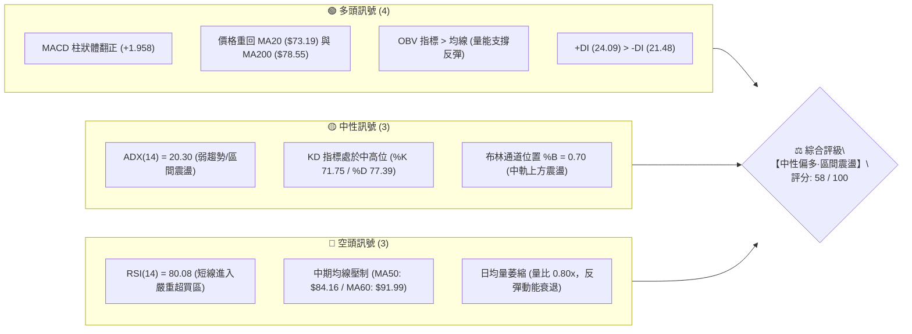
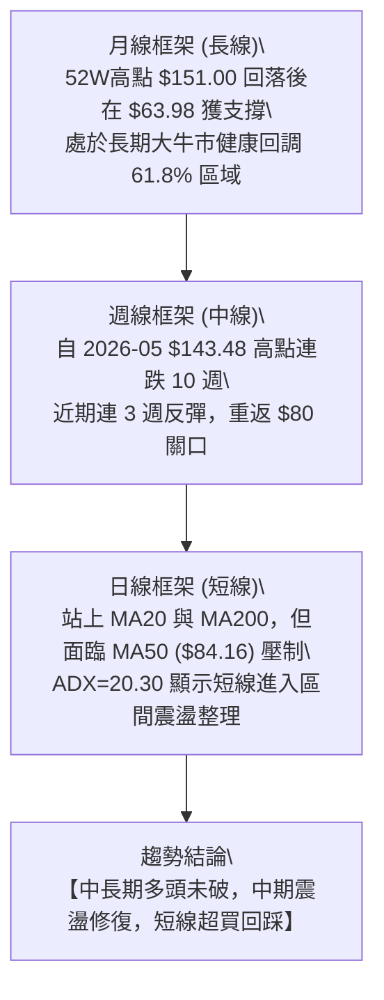
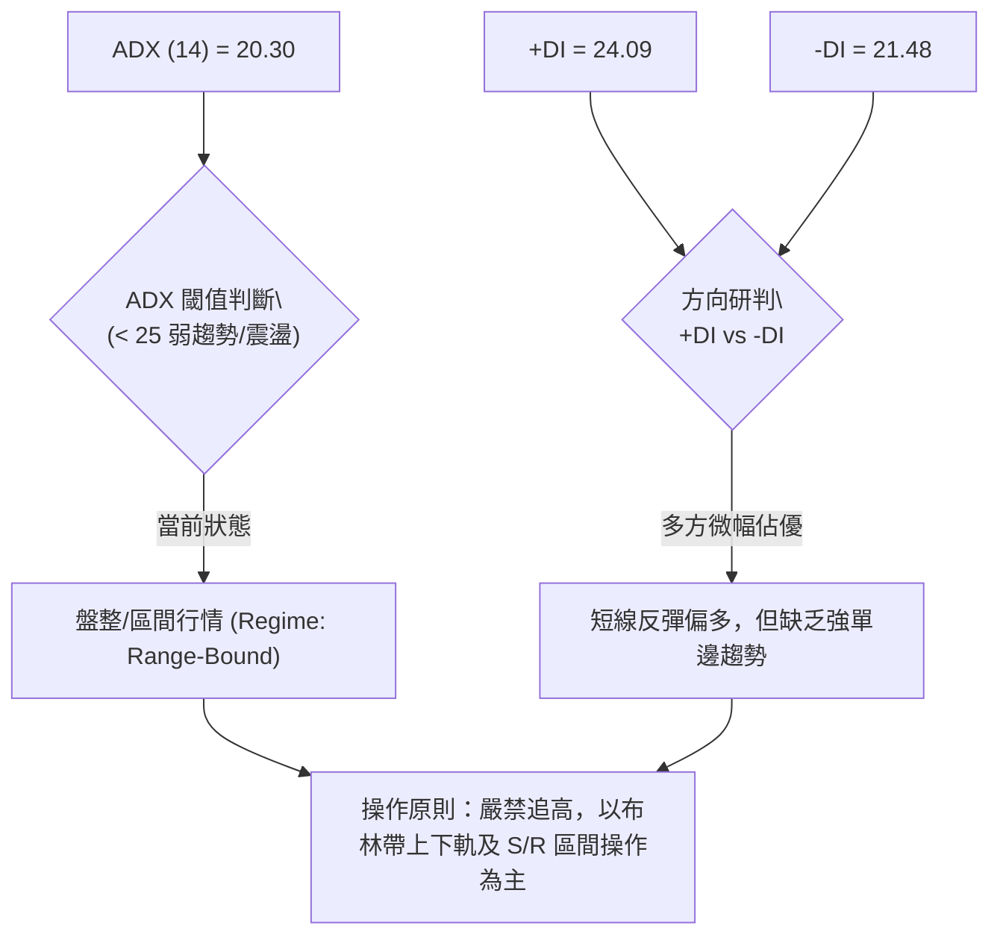
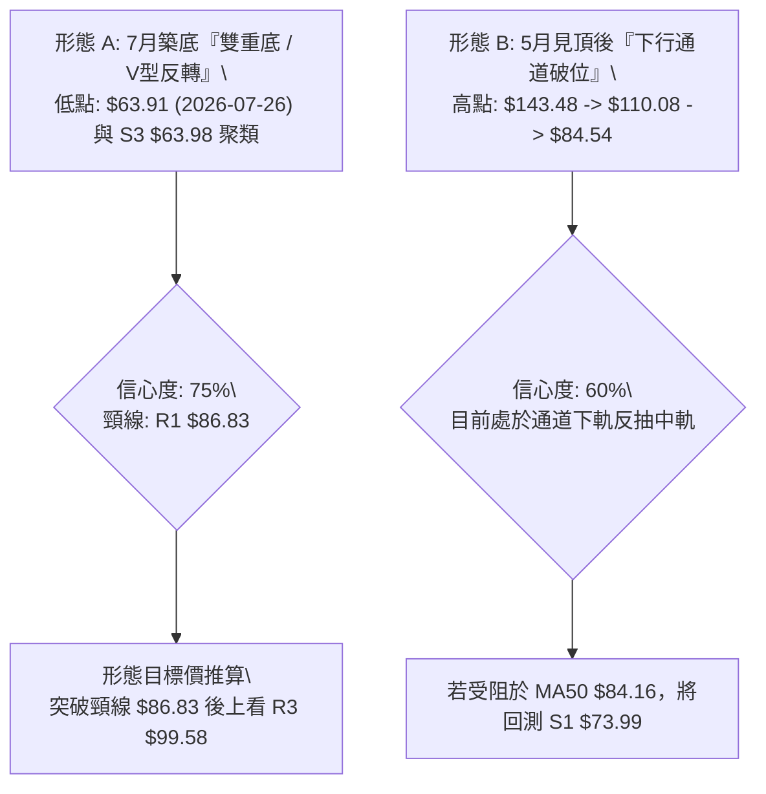
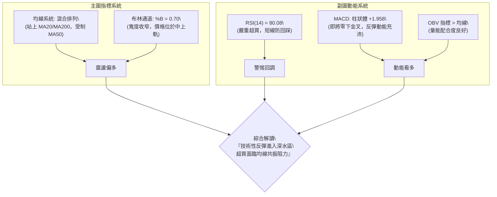
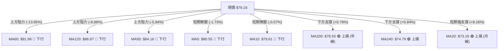
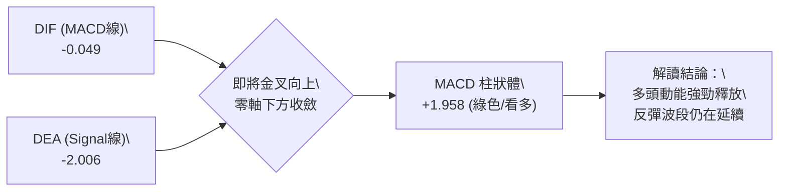
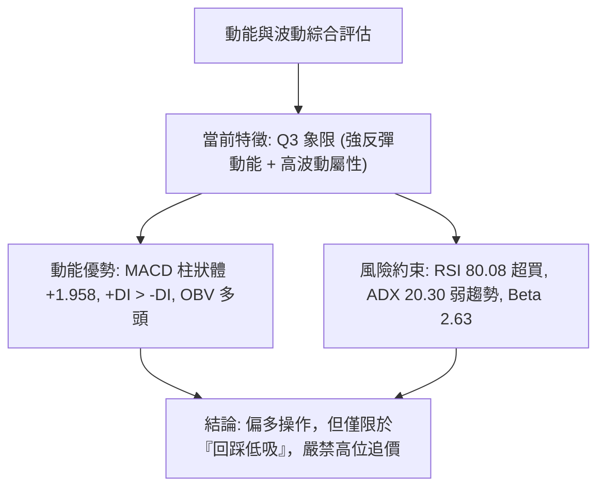
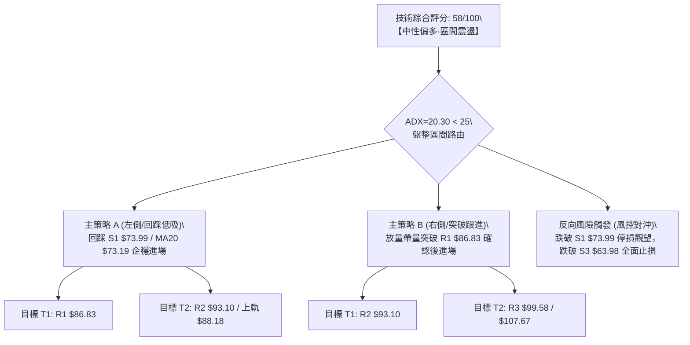
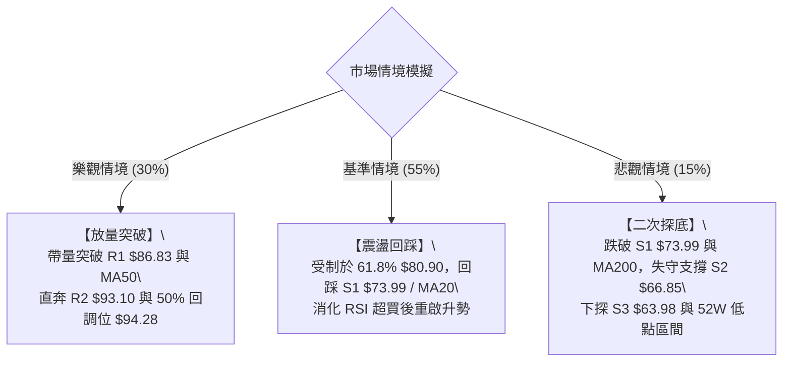

# RKLB 技術分析報告

> **報告日期**：2026-08-18 ｜ **語言**：繁體中文 ｜ **數據來源**：Yahoo Finance ｜ **當前價格**：$79.16

---

## 目錄

| 章節 | 內容 |
|------|------|
| [1. 技術面概覽](#1-技術面概覽) | 訊號儀表板、核心指標、評分卡 |
| [2. 趨勢分析](#2-趨勢分析) | 多時框趨勢、長中短期走勢 |
| [3. 圖表形態分析](#3-圖表形態分析) | 形態識別、K線組合、目標價 |
| [4. 支撐與阻力](#4-支撐與阻力) | 關鍵價位、斐波那契回調 |
| [5. 技術指標深度解讀](#5-技術指標深度解讀) | MA/RSI/MACD/布林/成交量 |
| [6. 動能與波動率](#6-動能與波動率) | 動能評估、ATR、Beta |
| [7. 多時框架總結](#7-多時框架總結) | 時框架評分矩陣 |
| [8. 交易策略建議](#8-交易策略建議) | 多空策略、風險報酬比 |
| [9. 風險提示與監控](#9-風險提示與監控) | 監控指標、風險場景 |

---

## 1. 技術面概覽

### 🎯 技術訊號儀表板



---

### 📊 核心指標速覽表

| 指標類別 | 指標名稱 | 當前數值 | 訊號 | 專業解讀 |
|----------|----------|----------|------|----------|
| **價格** | 當前價格 | $79.16 | 🟡 | 脫離7月底部 $63.91 反彈，但逼近 61.8% 斐波那契回調位 $80.90 |
| **均線** | MA20 | $73.19 | 🟢 | 價格站於 MA20 之上 (+8.16%)，短線反彈趨勢成型，提供下檔支撐 |
| **均線** | MA50 | $84.16 | 🔴 | 價格低於 MA50 (-5.94%)，中期下行壓力沉重，為上方第一道均線強阻力 |
| **均線** | MA200 | $78.55 | 🟢 | 價格剛收復長期牛熊分界線 MA200 (+0.78%)，提供長線多頭防守基準 |
| **動能** | RSI(14) | 80.08 | 🔴 | 突破 70 進入極度超買區，無背離但短線回調修正壓力劇增 |
| **動能** | MACD | -0.049 / 柱狀 +1.958 | 🟢 | 快慢線即將零軸下方金叉，柱狀圖持續擴張，反彈動能處於多頭主導 |
| **波動** | ATR(14) | $5.93 (7.49%) | 🟡 | 每日平均真實波幅達 7.49%，屬於高波動個股，風控需保留較大緩衝 |

---

### 🏆 技術評分卡

```
╔══════════════════════════════════════════════════════════════╗
║               技術評分卡 — RKLB (2026-08-18)                ║
╠══════════════════════════════════════════════════════════════╣
║ 趨勢強度 (ADX=20.30)  ████████░░░░░░░░░░░░  40/100  🟡 弱趨勢 ║
║ 動能指標 (RSI/MACD)   ████████████░░░░░░░░  60/100  🟡 偏多超買║
║ 支撐穩定度 (S1/MA200) ██████████████░░░░░░  70/100  🟢 雙重支撐 ║
║ 成交量配合 (OBV/量比) ██████████░░░░░░░░░░  50/100  🟡 量能略縮 ║
║ 形態完整度 (V型築底)  ████████████░░░░░░░░  60/100  🟡 底部成型 ║
║ 均線排列 (混合纏繞)   ██████████████░░░░░░  70/100  🟢 站上年線 ║
╠══════════════════════════════════════════════════════════════╣
║ 綜合技術評分          ███████████░░░░░░░░░  58/100  🟡 中性偏多 ║
╚══════════════════════════════════════════════════════════════╝
```

---

## 2. 趨勢分析

### 🌐 多時框趨勢分析



---

### 📈 長期趨勢 — 12個月走勢圖（Unicode）

```
RKLB 月線收盤走勢圖（過去12個月：2025-08 至 2026-08）
價格 ($)
$150 ┤                                      
$140 ┤                                  ● (2026-05: $143.48 歷史次高)
$130 ┤                                 / \
$120 ┤                                /   \
$110 ┤                               /     \
$100 ┤                              /       ● (2026-06: $101.65)
$90  ┤                             /         \
$80  ┤               ●            ●           \       ● ($79.16 現價)
$70  ┤        ●     / \          / (2026-04)   \     /
$60  ┤ ●     / \   /   ●        /               \   / 
$50  ┤  \   /   \ /     (2026-02 \               ● (2026-07: $64.95 底部)
$40  ┤   ●-(2025-11: $42.14)      ● (2026-03: $64.22)
     └─────────────────────────────────────────────────────────────►
       08  09  10  11  12  01  02  03  04  05  06  07  08 (月份)
```

#### 走勢特徵分析表格

| 階段區間 | 起止價格 | 期間漲跌幅 | 主要形態與驅動特徵 | 技術面解讀 |
|----------|----------|------------|--------------------|------------|
| **2025-08 ~ 2025-10** | $48.60 → $62.98 | +29.59% | 多頭推升波段，放量突破前高 | 確立大級別上升通道 |
| **2025-11** | $62.98 → $42.14 | -33.09% | 劇烈洗盤，回踩中期強支撐 | 形成波段深幅黃金坑 |
| **2025-12 ~ 2026-05** | $42.14 → $143.48 | +240.48% | 主升浪爆發，創下 52 週高點 $151.00 | 量能全面放大，指標嚴重鈍化 |
| **2026-06 ~ 2026-07** | $143.48 → $64.95 | -54.73% | 獲利了結拋壓，急速腰斬回調 | 觸及 78.6% 回調位與 S3 ($63.98) 支撐 |
| **2026-08 (至今)** | $64.95 → $79.16 | +21.88% | 底部 V 型強勁反彈，修復年線 | 短期動能強勁，惟面臨 MA50 阻力 |

---

### 📊 中期趨勢（週線分析）

```
RKLB 週線關鍵攻防示意圖
══════════════════════════════════════════════════════════════════
$105.47 ─── [2026-05 啟跌平臺頸線] ────────────────────────── (強壓力帶)
$94.28  ─── [50.0% 斐波那契回調位] ────────────────────────── (中期分水嶺)
$86.83  ─── [R1 阻力 / MA60 / 布林上軌 $88.18] ────────────── (當前反彈目標區)
$79.16  ═══ 【當前收盤價 $79.16】 ════════════════════════════ (爭奪 MA200)
$73.99  ─── [S1 支撐 / 日線 MA20 $73.19] ─────────────────── (短線關鍵防守)
$63.98  ─── [S3 支撐 / 2026-07-26 底部 $63.91] ────────────── (中期鐵底)
══════════════════════════════════════════════════════════════════
```

---

### ⚡ 趨勢強度評估（ADX 解讀）



#### ADX 趨勢強度對照表

| 指標項目 | 數值 | 參考標準 | 狀態評估 | 策略意涵 |
|----------|------|----------|----------|----------|
| **ADX (14)** | **20.30** | < 20 極弱 / 20-25 弱 / > 25 強趨勢 | 🟡 弱趨勢/盤整 | 避免單邊追單，鎖定區間高拋低吸 |
| **+DI** | **24.09** | 多方攻擊動能 | 🟢 多頭主導 | 買盤力量優於賣盤，維持反彈格局 |
| **-DI** | **21.48** | 空方打壓動能 | 🟡 空方收斂 | 拋壓自 7 月高峰顯著減退 |
| **DI 差值** | **+2.61** | 多空力量淨差 | 🟢 弱勢偏多 | 向上動能有限，上行需量能確認 |

---

## 3. 圖表形態分析

### 🔍 形態識別系統



#### 圖表形態信心度與目標價評估表

| 識別形態 | 信心度 | 判斷依據（引用數據） | 完成度 | 目標價（附計算式） |
|----------|--------|----------------------|--------|--------------------|
| **雙重底 / V型回升** | **75%** | 2026-07-26 觸及最低點 $63.91，與支撐 S3 ($63.98) 形成雙重支撐聚類；MACD 柱狀體隨後由 -0.618 翻正至 +1.958。 | 70% | 頸線 $86.83 + (形態高度: $86.83 - $63.91 = $22.92) = **$109.75**（中期目標，接近斐波那契 38.2% $107.67） |
| **布林帶反彈破中軌** | **85%** | 價格由布林下軌 $58.20 啟動，突破中軌 MA20 ($73.19)，%B 達到 0.70，確認短線反彈形態。 | 80% | 依布林通道上軌推算 = **$88.18** |
| **均線死叉反抽壓制** | **55%** | MA5 ($80.55) 與 MA10 ($79.61) 下穿壓制，MA50 ($84.16) 壓制明顯。 | 60% | 回踩支撐 S1 = **$73.99** / MA20 = **$73.19** |

---

### 🕯️ 重要K線形態分析

| 期間/月份 | 收盤價 | K線形態 | 技術解讀 | 訊號 |
|-----------|--------|---------|----------|------|
| **2026-05** | $143.48 | 巨量衝高長上影陽線 | 創 52W 高點 $151.00 後獲利盤洶湧出逃，形成頂部耗竭性放量 | 🔴 強烈見頂 |
| **2026-06** | $101.65 | 大陰線破位向下 | 連續跌破多條短期均線，確認中期頂部成型，空方全面掌控 | 🔴 空頭延續 |
| **2026-07** | $64.95 | 帶長下影線的低位錘子線 | 在 S3 ($63.98) 附近探底回升，週線 RSI 降至 15.6 極端超賣區後引發抄底盤 | 🟢 底部信號 |
| **2026-08 (現狀)** | $79.16 | 連續兩週陽線推進實體 | 站上 MA20 ($73.19) 與 MA200 ($78.55)，但上影線逼近 MA50 ($84.16) 遇阻 | 🟡 短多長整 |

---

### 📉 ASCII 走勢形態示意圖

```
RKLB 底部反轉與反彈形態示意圖
價格 ($)
$86.83 ────────────────────────────────────────── 頸線阻力 (R1)
                 ▲
                / \          現價 $79.16 (遇阻 61.8% $80.90)
$79.16 ────────/───\─────────────●
              /     \           / 
$73.99 ──────/───────\─────────/──────────────── 支撐位 S1 / MA20
            /         \       /  
           /           \     /   
$63.98 ───●             ●───● ────────────────── 雙底底部 (S3 / 2026-07)
       (2026-03低點)   (2026-07低點 $63.91)
```

---

### 🎯 形態目標價計算

1. **V型 / 雙底形態高度計算**：
   - 形態底部低點：$63.91（2026-07-26 低點）
   - 形態頸線位置：$86.83（阻力位 R1）
   - 形態垂直高度：$\text{Height} = \$86.83 - \$63.91 = \$22.92$
2. **第一階段理論突破目標（1.0x Height）**：
   - $\text{Target 1} = \$86.83 + \$22.92 = \$109.75$（與斐波那契 38.2% 位 **$107.67** 高度聚類）
3. **區間震盪保守目標**：
   - 布林通道上軌：**$88.18**
   - 阻力位 R2：**$93.10**

---

## 4. 支撐與阻力

### 🗺️ 關鍵價位分布圖（Unicode）

```
RKLB 關鍵價位結構分布圖
═══════════════════════════════════════════════════════════════════════════
$107.67 ║████████████████████████████████████║ 斐波那契 38.2% 強阻力
$99.58  ║████████████████████████████        ║ 強阻力 R3 (+25.80%)
$94.28  ║████████████████████████            ║ 斐波那契 50.0% / 阻力 R2 ($93.10)
$88.18  ║████████████████████                ║ 布林通道上軌
$86.83  ║████████████████████████████████████║ 關鍵阻力 R1 / MA60 ($91.99)
$80.90  ║████████████████                    ║ 斐波那契 61.8% 臨界阻力
════════╠════════════════════════════════════╣ ◄ 當前價格: $79.16 (爭奪 MA200: $78.55)
$73.99  ║▓▓▓▓▓▓▓▓▓▓▓▓▓▓▓▓▓▓▓▓▓▓▓▓▓▓▓▓▓▓▓▓▓▓▓▓║ 近期核心支撐 S1 (-6.53%) / MA20 ($73.19)
$66.85  ║████████████████████                ║ 次級支撐 S2 (-15.55%)
$63.98  ║████████████████████████████████████║ 強支撐 S3 (-19.17%) / 7月底部 $63.91
$61.84  ║████████████████████████████████    ║ 斐波那契 78.6% 回調位
═══════════════════════════════════════════════════════════════════════════
```

---

### 🚧 阻力位分析表

| 阻力級別 | 精確價位 | 距現價幅寬 | 形成原因與技術共振 | 突破難度 | 重要性 |
|----------|----------|------------|--------------------|----------|--------|
| **R1** | **$86.83** | +9.69% | 近一年波段高點聚類；與 MA120 ($86.87)、布林上軌 ($88.18) 形成密集共振帶 | 🔴 困難 | ★★★★★ |
| **R2** | **$93.10** | +17.61% | 中期密集交易區高點；逼近 50.0% 斐波那契回調位 ($94.28) 與 MA60 ($91.99) | 🔴 極難 | ★★★★☆ |
| **R3** | **$99.58** | +25.80% | $100 整數心理關口下方波段高點；前期 6 月反彈破位點 ($100.46) | 🔴 極高 | ★★★☆☆ |

---

### 🛡️ 支撐位分析表

| 支撐級別 | 精確價位 | 距現價幅寬 | 形成原因與技術共振 | 守住機率 | 重要性 |
|----------|----------|------------|--------------------|----------|--------|
| **S1** | **$73.99** | -6.53% | 近一年波段低點聚類；與布林中軌/MA20 ($73.19) 及 MA240 ($74.79) 形成三合一強防守帶 | 🟢 80% | ★★★★★ |
| **S2** | **$66.85** | -15.55% | 2026-07-19 收盤價 ($67.62) 所在波段平台，反彈起漲點 | 🟢 70% | ★★★☆☆ |
| **S3** | **$63.98** | -19.17% | 52 週次低點平台，2026-07-26 底部 ($63.91) 與 2026-03 低點 ($64.22) 共振，中期鐵底 | 🟢 90% | ★★★★★ |

---

### 📐 斐波那契回調位分析

基準區間：52 週低點 **$37.57** 至 52 週高點 **$151.00**（波幅 $113.43）。

```
0.0% ── $151.00 (52W 歷史高點)
         │
23.6% ─ $124.23 (強勢整理目標)
         │
38.2% ─ $107.67 (雙底形態理論翻轉目標)
         │
50.0% ─ $94.28  (多空強弱分水嶺，接近 R2 $93.10)
         │
61.8% ─ $80.90  ◄──────── 現價 $79.16 正處於 61.8% 回調位下方受阻
         │
78.6% ─ $61.84  (深幅回調防守位，保護 S3 $63.98)
         │
100.0%─ $37.57  (52W 歷史起漲低點)
```

**解讀**：
- 當前價格 **$79.16** 恰好受制於 **61.8% 黃金分割回調位（$80.90）**。
- 若能有效帶量突破 $80.90，下一波段目標將直接指向 **50.0% 回調位（$94.28）** 與 **R2（$93.10）**。
- 若 $80.90 承壓回落，下方主要回撤緩衝區在 **$73.99 (S1) ~ $73.19 (MA20)**。

---

## 5. 技術指標深度解讀

### 🎛️ 指標訊號總覽



---

### 📈 移動平均線排列分析



#### 均線狀態詳細解析

| 均線名稱 | 當前價格 | 與現價偏離度 | 走勢方向 | 角色定位與技術意義 |
|----------|----------|--------------|----------|--------------------|
| **MA5** | $80.55 | -1.73% | 略向下 | 超短線壓制，反映近兩日小幅滯漲 |
| **MA10** | $79.61 | -0.57% | 略向下 | 短線貼身均線，現價正於此處爭奪 |
| **MA20** | $73.19 | +8.16% | 強烈向上 | 短線生命線（布林中軌），反彈重要多頭防線 |
| **MA50** | $84.16 | -5.94% | 持續向下 | 中期多空分水嶺，與 R1 ($86.83) 形成阻力帶 |
| **MA60** | $91.99 | -13.95% | 持續向下 | 季線阻力，空頭排列中樞 |
| **MA120** | $86.87 | -8.88% | 持續向下 | 半年線壓制，與 R1 聚類 |
| **MA200** | $78.55 | +0.78% | 向上抬升 | **年線牛熊分界**，現價微幅站上，長線多頭關鍵支撐 |
| **MA240** | $74.79 | +5.84% | 向上抬升 | 長期底層均線，支撐強勁 |

---

### 📉 RSI(14) 分析

```
RSI(14) 當前讀數: 80.08  [🔴 嚴重超買區 > 70]
0                30                  50                 70        80.08  100
├────────────────┼───────────────────┼──────────────────┼───────────█───┤
  極度超賣區           弱勢整理區             強勢整理區      超買區   ▲(現值)
```

- **超買超賣狀態**：RSI(14) 讀數達到 **80.08**，為近 4 個月以來最高水準，表明自 7 月底 $63.91 起的這波反彈極其迅猛，短期技術指標已進入嚴重過熱狀態。
- **背離分析**：
  - 比對價格與 RSI：2026-08-09 價格為 $82.83 (RSI 68.6)，當前價格為 $79.16 (RSI 80.08)。**未出現標準的頂背離或底背離**（屬指標隨反彈斜率放大而產生的鈍化效應）。
  - **結論**：雖無頂背離，但高達 80 的 RSI 意味著短線隨時會觸發獲利回吐，**當前位置不宜盲目追高**。

---

### 📊 MACD(12/26/9) 訊號解讀



- **MACD 數值**：DIF (-0.049) 快速逼近零軸，與 DEA (-2.006) 形成大幅黃金交叉收斂態勢。
- **柱狀體分析**：MACD Histogram 為 **+1.958**，自 7 月底的負值區 (-0.618) 強烈翻正並持續放大，顯示多方買盤在低位承接意願強烈，動能處於多頭主導。

---

### 📦 布林通道分析

```
RKLB 布林通道 (20, 2) 結構圖
價格 ($)
$88.18 ────────────────────────────────────── 上軌 (Upper Band)
                     ▲
                    / 
$79.16 ────────────●───────────────────────── 現價 (%B = 0.70，中上軌震盪)
                  /   
$73.19 ──────────●─────────────────────────── 中軌 (MA20 生命線)
                /     
$58.20 ────────●───────────────────────────── 下軌 (Lower Band)
```

- **通道參數**：上軌 **$88.18** ｜ 中軌 **$73.19** ｜ 下軌 **$58.20** ｜ 帶寬 $29.98。
- **當前位置 (%B)**：**%B = 0.70**，位於中軌上方，朝上軌推進，表明價格處於強勢反彈區間。
- **通道演變**：帶寬目前正處於自高位回調後的平穩收縮階段，價格在中軌獲得有力支撐後反彈，上軌 $88.18 與 R1 ($86.83) 形成第一階段反彈的天然頂部壓力線。

---

### 💹 成交量分析（量價配合度）

- **量能數據**：
  - 最新日成交量：**15,292,044** 股。
  - 20 日均量：**19,094,997** 股（量比：**0.80x**）。
  - 50 日均量：**23,493,315** 股。
- **OBV (能量潮指標)**：
  - 當前狀態：**OBV > OBV MA**。
  - 解讀：雖然最新單日成交量略顯萎縮（量比 0.80x），但整體 OBV 能量潮趨勢維持在均線之上，表明資金在 7 月底至 8 月初以淨流入為主，量能整體對價格上漲形成良性支撐。然而，若要向上攻克 MA50 ($84.16) 及 R1 ($86.83)，必須補量至 20 日均量（約 1,900 萬股）之上。

---

## 6. 動能與波動率

### ⚡ 動能評估四象限

| 象限 | 動能維度 (Momentum) | 波動維度 (Volatility) | 當前狀態 | 策略意涵與評估 |
|------|---------------------|-----------------------|----------|----------------|
| **Q1 (最佳爆發)** | 強 (MACD 擴張) | 低 (ATR 收縮) | — | 突破起爆點 |
| **Q2 (震盪修復)** | 弱 (ADX < 25) | 低 / 中 (ATR 正常) | — | 窄幅整理觀望 |
| **Q3 (高波反彈)** | **強 (MACD+ / RSI 80)** | **高 (ATR 7.49% / Beta 2.63)** | **✓ [RKLB 處於此區]** | **高風險高波動反彈，嚴格控倉與止損** |
| **Q4 (非理性殺跌)**| 弱 (破位下行) | 高 (恐慌拋售) | — | 觀望避免介入 |



---

### 📊 ATR 波動率分析

- **ATR(14) 數值**：**$5.93**（佔現價比率達 **7.49%**）。
- **波動特性**：RKLB 屬於典型的超高波動成長型/航太軍工標的，單日波幅平均接近 $6.00。
- **止損距離建議**：
  - 日內/極短線止損：$1.0 \times \text{ATR} = \$5.93$（約 7.5% 緩衝）。
  - 波段交易止損：$1.5 \times \text{ATR} = \$8.90$（約 11.2% 緩衝）。
  - 防守基線可設於支撐 S1 ($73.99) 下方，即 **$73.00** 附近。

---

### 📐 Beta 與市場相關性

- **Beta 係數**：**2.629**。
- **市場敏感度**：Beta 高達 2.63，代表該股波動幅度為標普 500 指數的 2.63 倍。當大盤上漲 1% 時，RKLB 理論上漲 2.63%；反之大盤回調時亦承擔同等放大之回撤風險。
- **操作啟示**：高 Beta 屬性要求投資人在建倉時必須降低名義槓桿與單筆部位權重，以防範系統性市場波動帶來的劇烈洗盤。

---

## 7. 多時框架總結

### 📋 時框架評分表

| 時框架 | 趨勢方向 | 動能狀態 | 均線排列 | 圖表形態 | 綜合評分 | 建議動作 |
|--------|----------|----------|----------|----------|----------|----------|
| **月線 (長期)** | 🟢 多頭延續 | 🟡 中性回調 | 🟢 站穩 MA200/MA240 | 52W 高點回調 61.8% 獲支撐 | **70/100** | 逢低戰略性配置 |
| **週線 (中期)** | 🟡 震盪築底 | 🟢 反彈啟動 | 🔴 均線空頭排列 | 探底 S3 ($63.98) 形成雙底雛形 | **55/100** | 區間波段操作 |
| **日線 (短期)** | 🟡 震盪偏多 | 🔴 短線超買 | 🟡 站上 MA20/MA200，壓在 MA50 | 突破布林中軌，受阻於 $80.90 | **58/100** | 等待回踩支撐低吸 |

---

### 🔲 綜合訊號矩陣

```
┌─────────────────┬─────────────────┬─────────────────┬─────────────────┐
│    分析維度     │   短期 (日線)   │   中期 (週線)   │   長期 (月線)   │
├─────────────────┼─────────────────┼─────────────────┼─────────────────┤
│ 趨勢方向        │ 🟡 震盪偏多     │ 🟡 區間築底     │ 🟢 大級別上升   │
│ 動能 (RSI/MACD) │ 🔴 超買但MACD強 │ 🟢 柱狀體收斂   │ 🟡 動能修復中   │
│ 均線系統        │ 🟡 MA20上/MA50下│ 🔴 MA50之下     │ 🟢 守住 MA200   │
│ 量能結構 (OBV)  │ 🟡 量略縮OBV多  │ 🟢 底部放量承接 │ 🟢 長期量能充沛 │
│ 支撐阻力結構    │ 逼近 R1 / 支撐S1│ 守住 S3 鐵底    │ 處於 61.8% 回調 │
└─────────────────┴─────────────────┴─────────────────┴─────────────────┘
```

---

### ⚖️ 多時框收斂結論

依據**多時框收斂規則（規則 14）**：
1. **行情性質判定**：當前 ADX(14) = 20.30（< 25），明確判定為**盤整/震盪行情（Range-bound Regime）**。
2. **時框主導權**：在 ADX < 25 的震盪環境下，交易應以**日線布林通道區間（$58.20 ~ $88.18）與核心支撐阻力（S1 $73.99 / R1 $86.83）**為主要交易依據。
3. **唯一方向性結論**：**【中性偏多·區間震盪低吸】**。
   - 雖然日線 RSI(14)=80.08 顯示短線超買，但價格已重新站穩年線 MA200 ($78.55) 與月線 MA20 ($73.19)，且 MACD 處於強多頭擴張。日線的短線超買僅作為「尋找回踩支撐進場點」的風控依據，中長期大底結構未破。

---

## 8. 交易策略建議

### 🗺️ 策略決策流程圖



---

### 🧭 策略路由

> **當前主策略方向 = 【中性偏多·區間回踩低吸】（依技術綜合評分 58/100 分流）**
> 
> 因當前評分處於 40–60 區間且 ADX < 25，市場處於布林通道寬幅震盪期。鑒於 RSI(14)=80.08 處於嚴重超買，**嚴禁在現價 $79.16 追高**，主推「回踩支撐低吸」之多頭波段策略。

---

### 🎯 價格情境階梯（Price Scenarios）

| 觸發條件 | 下一目標 | 後續延伸目標 | 技術情境含義 |
|----------|----------|--------------|--------------|
| **放量突破 R1 $86.83** | **R2 $93.10** | **R3 $99.58** / 斐波 $107.67 | 中期雙底突破確認，打開向 50% 回調位的上行空間 |
| **受阻 $80.90，回踩 S1 $73.99** | **MA200 $78.55** | **布林中軌 $73.19** | 日線超買技術性修正，測試短線生命線支撐強度 |
| **有效跌破 S1 $73.99** | **S2 $66.85** | **S3 $63.98** | 反彈宣告失敗，重新考驗 7 月低點鐵底 |

---

### 📊 情境機率分佈

| 運行情境 | 發生機率 | 主要技術依據 |
|----------|----------|--------------|
| **情境一：回踩支撐後震盪上行** | **55%** | MACD 柱狀體持續擴張 (+1.958)、站穩 MA200、OBV 量能維持健康、+DI > -DI。 |
| **情境二：在 S1 ~ R1 區間持續箱體震盪** | **30%** | ADX = 20.30 趨勢動能偏弱、MA50 ($84.16) 壓制顯著、短線成交量未達 20 日均量。 |
| **情境三：直接破位深幅回調** | **15%** | RSI(14)=80.08 觸發恐慌性獲利回吐，跌破年線 MA200 ($78.55) 及 S1 ($73.99)。 |

---

### 🟢 主策略詳情

依據評分卡路由，以下提供兩套具體執行策略（所有價位均嚴格引用關鍵支撐阻力）：

| 策略要素 | 策略 A：回踩低吸策略（主推·勝率高） | 策略 B：突破跟進策略（右側·動能強） |
|----------|-------------------------------------|-------------------------------------|
| **交易邏輯** | 消化日線 RSI 超買，回踩 S1/MA20 支撐企穩 | 帶量突破 R1 阻力與 MA120，確認雙底確立 |
| **進場條件** | 價格回調至 S1 附近出現止跌縮量陽線 | 日K線收盤突破 R1，且單日成交量 > 2000萬股 |
| **進場價格** | **$74.20**（S1 $73.99 上方緩衝區） | **$87.20**（突破 R1 $86.83 後回踩確認） |
| **目標價 T1** | **$86.83**（阻力位 R1，獲利 +17.02%） | **$93.10**（阻力位 R2，獲利 +6.77%） |
| **目標價 T2** | **$93.10**（阻力位 R2，獲利 +25.47%） | **$99.58**（阻力位 R3，獲利 +14.19%） |
| **止損價格** | **$69.80**（跌破 MA20 後下移 1x ATR，風險 -5.93%） | **$83.50**（跌回 MA50 $84.16 下方，風險 -4.24%） |
| **風險報酬比 (R:R)**| **1 : 2.87** (以 T1 計) / **1 : 4.30** (以 T2 計) | **1 : 1.60** (以 T1 計) / **1 : 3.35** (以 T2 計) |
| **預估勝率** | **65%** | **55%** |
| **建議倉位** | **15% ~ 20%**（分批建倉） | **10% ~ 15%**（突破加碼） |

---

### 🔴 反向風險觸發點（對沖與風控提示）

若出現以下訊號，代表反彈波段終結，必須無條件終止多頭策略：
1. **跌破 S1 ($73.99) 及 MA20 ($73.19)**：短線反彈格局破壞，應立即減倉 50%。
2. **跌破 S2 ($66.85)**：中短期轉為極度弱勢，多頭全面離場。
3. **跌破 S3 ($63.98) / 78.6% 回調位 ($61.84)**：宣告 52 週大級別上升趨勢徹底逆轉，空頭主導。

---

### ⭐ 整體訊號強度評星

```
做多訊號強度：★★★☆☆  (3.5/5星 — 站上年線但短線超買，利於回踩低吸)
做空訊號強度：★★☆☆☆  (2.0/5星 — MACD強勢翻正，空方拋壓減弱)
整體可信度：  ★★★★☆  (4.0/5星 — 關鍵支撐阻力密集共振，參考價值極高)
```

---

## 9. 風險提示與監控

### ✅ 關鍵監控指標 Checklist

```
╔══════════════════════════════════════════════════════════════╗
║                技術面日常監控清單 (Checklist)                ║
╠══════════════════════════════════════════════════════════════╣
║ [ ] 價格是否跌破年線 MA200 ($78.55)？(跌破則短線弱化)        ║
║ [ ] RSI(14) 是否自 80.08 回落至 50-60 健康整理區？           ║
║ [ ] MACD 柱狀體 (+1.958) 是否出現連續兩日收縮？             ║
║ [ ] 上攻 MA50 ($84.16) 與 R1 ($86.83) 時日成交量是否 > 20M？║
║ [ ] ADX(14) 是否向上突破 25，帶動單邊趨勢？                  ║
║ [ ] 支撐位 S1 ($73.99) 是否受到收盤價有效保護？              ║
╚══════════════════════════════════════════════════════════════╝
```

---

### ⚠️ 風險場景分析



---

### 🛡️ 風險管理重要提醒

1. **極高 Beta 波動風控**：RKLB Beta 達 **2.629**，ATR 佔比達 **7.49%**。嚴禁重倉孤注一擲，單一標的總部位不宜超過投資組合總資金之 **15%-20%**。
2. **指標鈍化與假突破防範**：在 ADX < 25 的震盪行情中，切忌在布林通道上軌（$88.18）或 R1（$86.83）附近直接以市價單追多，應等待回踩確認或突破後的收盤價站穩。
3. **止損紀律執行**：嚴格將波段止損錨定於支撐位下方（如策略 A 之 **$69.80**），一旦被觸發即果斷停損，切勿將波段交易被動轉為長期凹單。

---

## 📋 報告總結

```
╔══════════════════════════════════════════════════════════════╗
║                 RKLB 技術分析報告總結 (Executive Summary)    ║
╠══════════════════════════════════════════════════════════════╣
║ 報告日期：2026-08-18           當前價格：$79.16               ║
║ 分析評級：⚖️ 58分【中性偏多·區間震盪低吸】                  ║
╠══════════════════════════════════════════════════════════════╣
║ 關鍵結論：                                                   ║
║ ├─ 長期趨勢：🟢 大級別牛市回調至 61.8% ($80.90) 獲支撐       ║
║ ├─ 中期趨勢：🟡 自 $143.48 高點腰斬後，於 S3 ($63.98) 形成雙底║
║ ├─ 短期趨勢：🟢 站穩 MA200 ($78.55)，惟 RSI 達 80.08 短線超買 ║
║ ├─ 核心支撐：S1: $73.99 ｜ S2: $66.85 ｜ S3: $63.98          ║
║ ├─ 關鍵阻力：R1: $86.83 ｜ R2: $93.10 ｜ R3: $99.58          ║
║ └─ 分析師共識目標價：$112.94 (最高: $150.00 / 最低: $64.00) ║
╠══════════════════════════════════════════════════════════════╣
║ 最優交易策略配置：                                           ║
║ 1. 🥇 最佳機會（策略 A）：回踩 S1 ($74.20) 低吸，目標 R1/R2  ║
║ 2. 🥈 次選機會（策略 B）：放量突破 R1 ($87.20) 右側追多     ║
║ 3. 🥉 風控基線：跌破 S1 ($73.99) 減半，跌破 $69.80 全面止損  ║
╚══════════════════════════════════════════════════════════════╝
```

---

> ⚠️ **免責聲明**：本報告為技術分析研究，所有數據、圖表及價位推算均基於歷史 OHLCV 資訊。本報告**僅供學術研究與投資參考**，**不構成任何具體投資買賣建議**。金融市場瞬息萬變，高 Beta 成長型股票波動劇烈，投資人應獨立評估自身風險承受能力並嚴格執行資金管理。

---

*報告生成時間：2026-08-18 ｜ 數據來源：Yahoo Finance ｜ 分析框架：多時框技術分析模型*