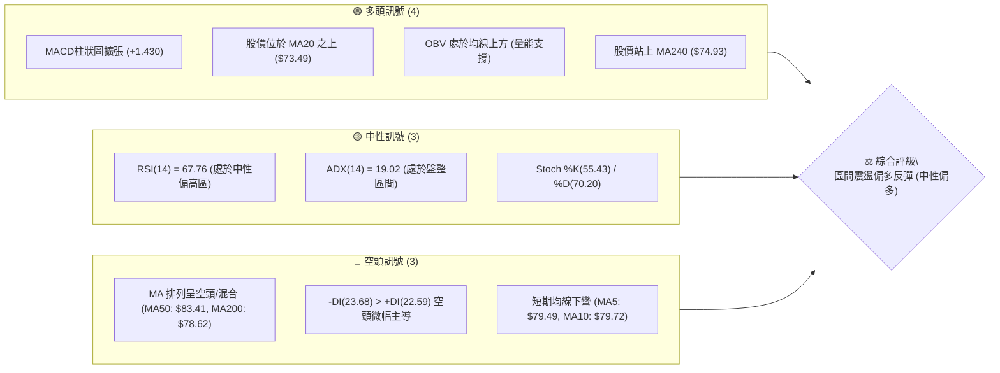
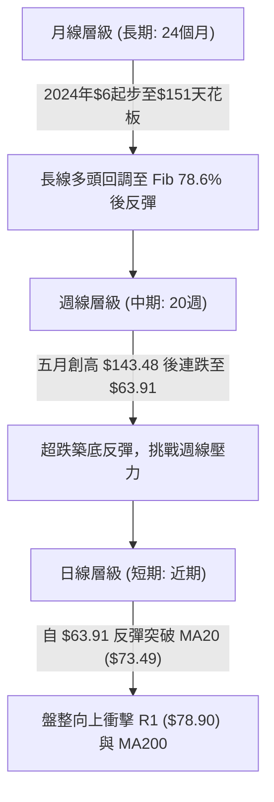
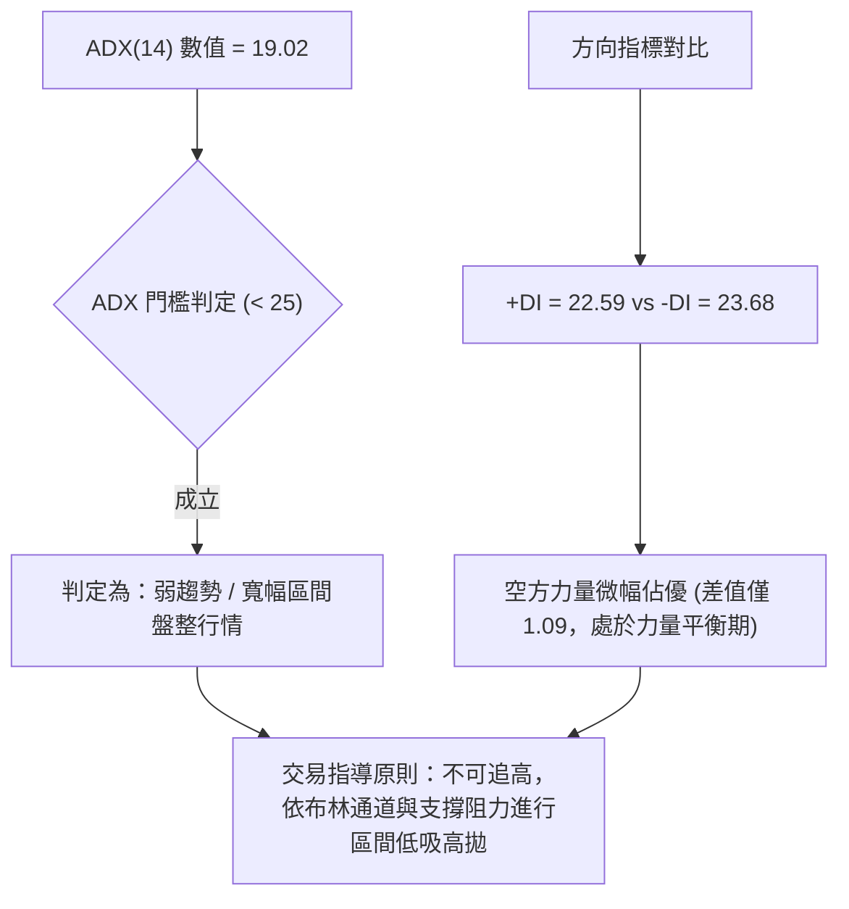
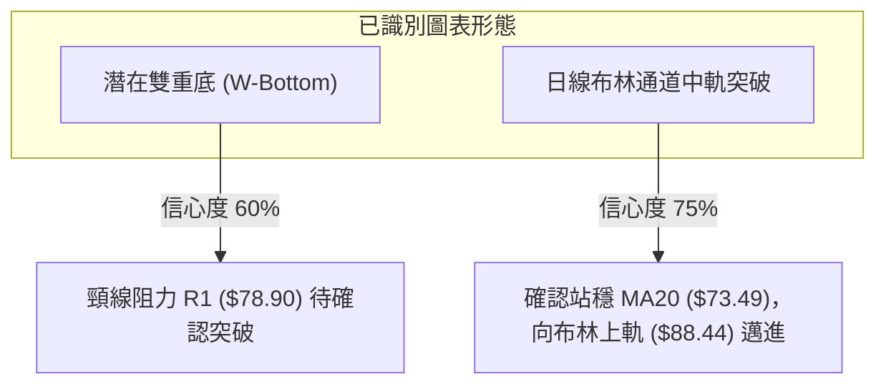
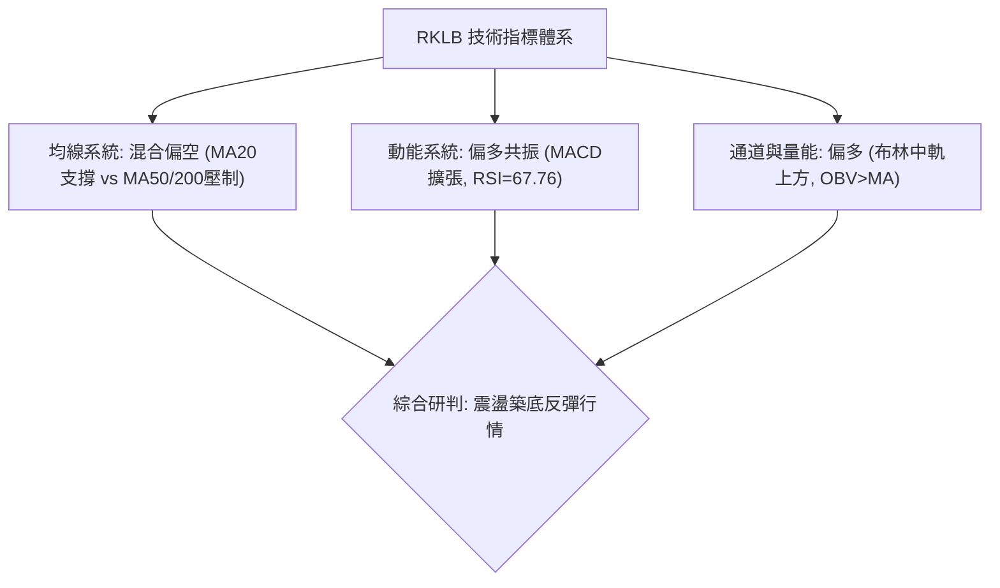
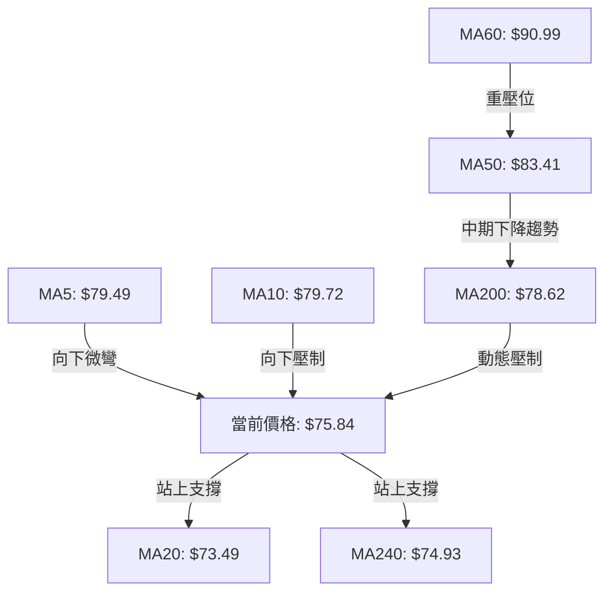
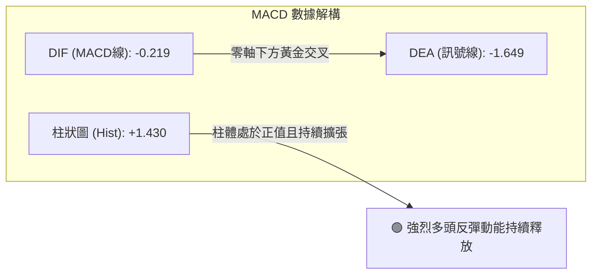
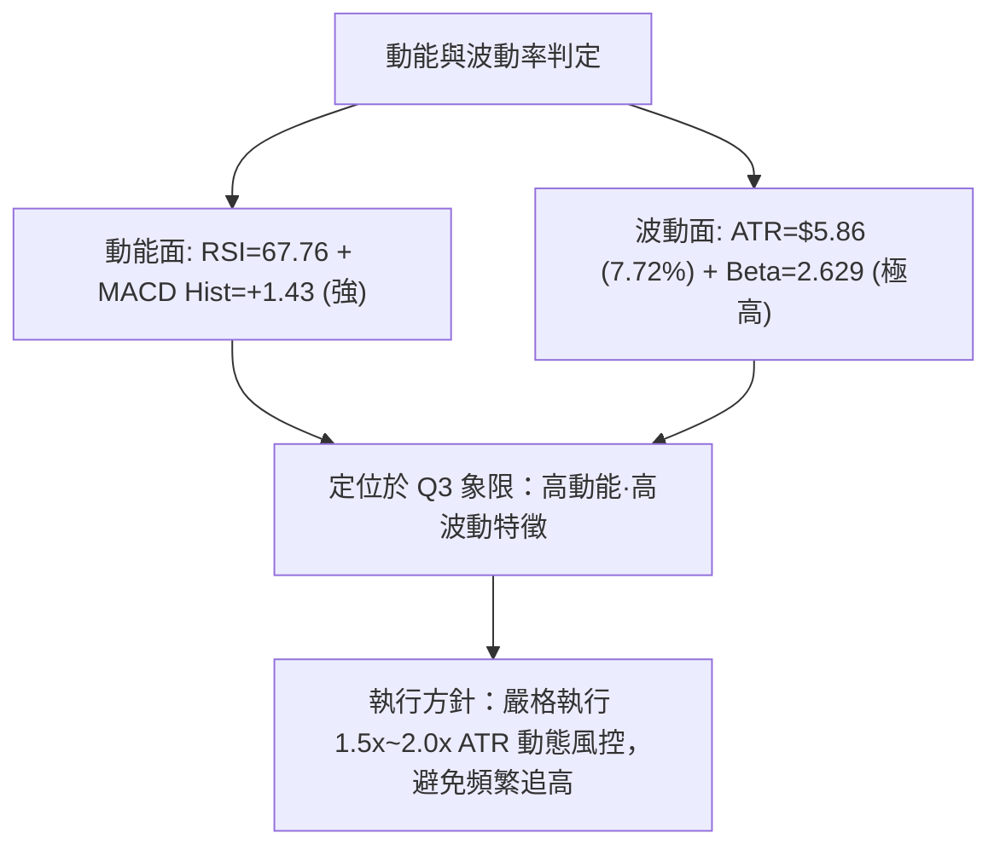
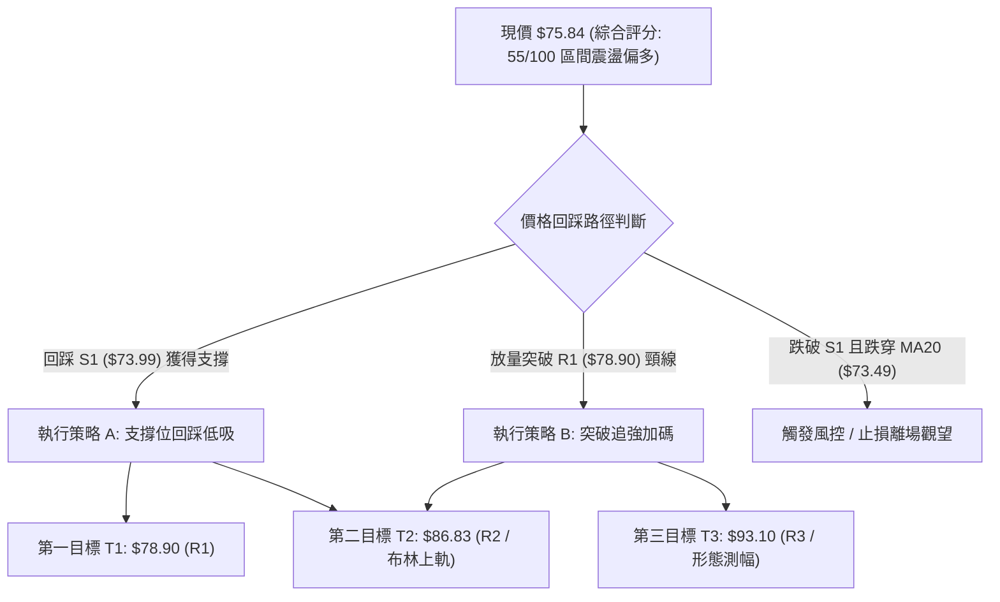
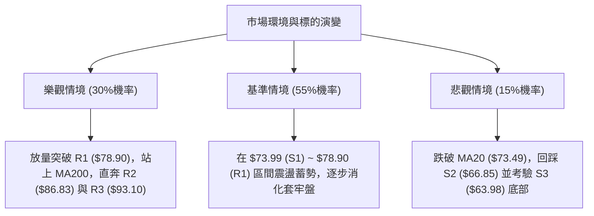

# RKLB 技術分析報告

> **報告日期**：2026-08-19 ｜ **語言**：繁體中文 ｜ **數據來源**：Yahoo Finance ｜ **當前價格**：$75.84

---

## 目錄

| 章節 | 內容 |
|------|------|
| [1. 技術面概覽](#1-技術面概覽) | 訊號儀表板、核心指標、評分卡 |
| [2. 趨勢分析](#2-趨勢分析) | 多時框趨勢、長中短期走勢 |
| [3. 圖表形態分析](#3-圖表形態分析) | 形態識別、K線組合、目標價 |
| [4. 支撐與阻力](#4-支撐與阻力) | 關鍵價位、斐波那契回調 |
| [5. 技術指標深度解讀](#5-技術指標深度解讀) | MA/RSI/MACD/布林/成交量 |
| [6. 動能與波動率](#6-動能與波動率) | 動能評估、ATR、Beta |
| [7. 多時框架總結](#7-多時框架總結) | 時框架評分矩陣 |
| [8. 交易策略建議](#8-交易策略建議) | 多空策略、風險報酬比 |
| [9. 風險提示與監控](#9-風險提示與監控) | 監控指標、風險場景 |

---

## 1. 技術面概覽

### 🎯 技術訊號儀表板



### 📊 核心指標速覽表

| 指標類別 | 指標名稱 | 當前數值 | 訊號 | 解讀 |
|----------|----------|----------|------|------|
| **價格** | 當前價格 | $75.84 | 🟡 | 位於52週區間 33.7%，自底部強勁反彈後遇阻震盪 |
| **均線** | MA20 | $73.49 | 🟢 | 股價位於 MA20 上方 (+3.19%)，短期底部支撐確立 |
| **均線** | MA50 | $83.41 | 🔴 | 股價位於 MA50 下方 (-9.08%)，中期結構尚未完全轉多 |
| **均線** | MA200 | $78.62 | 🔴 | 股價位於 MA200 下方 (-3.54%)，牛熊分界線構成上檔動態壓制 |
| **動能** | RSI(14) | 67.76 | 🟡 | 位於中性偏多區間，尚未進入嚴重超買 (>70)，動能充沛 |
| **動能** | MACD | -0.219 (柱狀圖 +1.430) | 🟢 | 快慢線即將零軸下金叉，柱狀圖持續擴張，反彈動能強勁 |
| **波動** | ATR(14) | $5.86 | 🔴 | 佔股價 7.72%，波動幅度極大，需嚴格控制倉位與止損距 |

### 🏆 技術評分卡

```
╔══════════════════════════════════════════════════════════════════╗
║                   技術評分卡 — RKLB (2026-08-19)                 ║
╠══════════════════════════════════════════════════════════════════╣
║ 趨勢強度      ████████░░░░░░░░░░░░  40/100  🔴 ADX=19.02 (盤整)   ║
║ 動能指標      ██████████████░░░░░░  70/100  🟢 RSI=67.8, MACD金叉 ║
║ 支撐穩定度    ████████████░░░░░░░░  60/100  🟡 S1=$73.99 提供支撐 ║
║ 成交量配合    ████████████░░░░░░░░  60/100  🟢 OBV>MA 量能支撐    ║
║ 形態完整度    ██████████░░░░░░░░░░  50/100  🟡 雙底構築中 (頸線R1)║
║ 均線排列      ████████░░░░░░░░░░░░  40/100  🔴 價格夾在MA20與MA50 ║
╠══════════════════════════════════════════════════════════════════╣
║ 綜合評分      ███████████░░░░░░░░░  55/100  ⚖️ 區間震盪反彈 (中性)║
╚══════════════════════════════════════════════════════════════════╝
```

---

## 2. 趨勢分析

### 🌐 多時框趨勢分析



### 📈 長期趨勢 — 12個月走勢圖（Unicode）

```
RKLB 月線走勢圖（過去12個月：2025-09 至 2026-08）
價格軸 ($)
$150 ┤                                      ● $143.48 (2026-05)
$130 ┤                                     / \
$110 ┤                                    /   ● $101.65 (2026-06)
 $90 ┤                            ● $80   /     \
 $70 ┤                  ● $69.76 /   \   ● $82.51\     ● $75.84 (現價)
 $50 ┤    ● $47.91     /        ● $64.22          \   /
 $30 ┤        \   ● $42.14                         ● $64.95 (2026-07)
     └─────────────────────────────────────────────────────────────
        09  10   11   12   01   02   03   04   05   06   07   08 (月份)
```

**走勢特徵分析表格**：

| 階段 | 時間區間 | 起始價 → 結束價 | 漲跌幅 | 主要走勢特徵 |
|------|----------|-----------------|--------|--------------|
| **第 1 階段：主升浪前期** | 2025-09 ~ 2026-01 | $47.91 → $80.07 | +67.13% | 突破箱體，呈現階梯式上揚，籌碼高度集中 |
| **第 2 階段：高檔洗盤** | 2026-01 ~ 2026-03 | $80.07 → $64.22 | -19.80% | 獲利回吐，於 $64 附近獲得強烈買盤支撐 |
| **第 3 階段：極致爆發** | 2026-03 ~ 2026-05 | $64.22 → $143.48| +123.42%| 投機買盤湧入，創下 52 週歷史高點 $151.00 |
| **第 4 階段：斷崖式回調** | 2026-05 ~ 2026-07 | $143.48 → $64.95| -54.73% | 估值修正與獲利了結，回吐全部超額漲幅 |
| **第 5 階段：築底反彈** | 2026-07 ~ 2026-08 | $64.95 → $75.84 | +16.77% | 於波段低點聚類 S3 ($63.98) 形成雙底回升 |

### 📊 中期趨勢（週線分析）

```
週線關鍵壓力與支撐結構示意圖：
[阻力 R2] ───────────────────── $86.83 (前期週K長黑跌破點/下彎MA60)
[阻力 R1] ───────────────────── $78.90 (波段聚類阻力 / MA200: $78.62)
[當前現價] ═════════════════════ $75.84
[支撐 S1] ───────────────────── $73.99 (日線 MA20: $73.49 形成匯聚防守)
[支撐 S3] ───────────────────── $63.98 (近20週絕對低點聚類 / 雙底頸底)
```

### ⚡ 趨勢強度評估（ADX 解讀）



| ADX 數值區間 | 趨勢強度狀態 | 當前數值 (19.02) 所屬狀態 | 操作策略指引 |
|--------------|--------------|---------------------------|--------------|
| **0 ~ 20** | 無趨勢 / 極度盤整 | **● 當前落點 (19.02)** | **區間震盪策略，以震盪指標 (RSI/布林) 為主** |
| **20 ~ 25** | 弱趨勢 / 醞釀期 | — | 觀察是否放量突破走出方向 |
| **25 ~ 50** | 強趨勢確立 | — | 順勢交易，單邊持倉 |
| **50 ~ 100** | 極強 / 趨勢過度延伸 | — | 警惕反轉或大幅回調 |

---

## 3. 圖表形態分析

### 🔍 形態識別系統



| 形態名稱 | 信心度 | 判斷依據（引用數據） | 完成度 | 目標價（附計算式） |
|----------|--------|----------------------|--------|--------------------|
| **潛在雙重底 (W底)** | 60% | 第一底 2026-07-26 收盤 $63.91，第二底 2026-08-02 收盤 $64.95，均於 S3 ($63.98) 獲得支撐 | 70% | 頸線 R1 ($78.90) + 形態高度 ($78.90 - $63.98 = $14.92) = **$93.82** (接近 R3: $93.10) |
| **布林中軌突破反彈** | 75% | 股價由下軌 ($58.55) 向上反彈，並實體收在 MA20 中軌 ($73.49) 之上 | 85% | 目標指向布林上軌 **$88.44** (接近 R2: $86.83) |

*註：除上述兩者外，其餘如大型頭肩形態因右肩結構未完全成型，數據不足，信心度低於 50%，依規則不強行繪製。*

### 🕯️ 重要K線形態分析

| 週/月份 | 收盤價 | K線形態 | 解讀 | 訊號 |
|---------|--------|---------|------|------|
| **2026-05** | $143.48 | 衝高長上影陽線 | 歷史天花板 $151.00 見頂信號，多頭動能耗盡 | 🔴 強烈看空 |
| **2026-07-26週** | $63.91 | 探底極限十字星 | RSI 觸及 15.6 極端超賣區，空方力竭 | 🟢 底部信號 |
| **2026-08-09週** | $82.83 | 實體大陽線 (+27.5%) | 底部放量長紅反包，確立波段反彈展開 | 🟢 強烈看多 |
| **2026-08-23週** | $75.84 | 縮量小陰線回踩 | 反彈至 R1 遇阻後的回踩確認，量能萎縮至 49.3M | 🟡 正常回調 |

### 📉 ASCII 走勢形態示意圖

```
雙重底 (W-Bottom) 與布林反彈架構：
           [頸線 R1: $78.90]
                /\              /\  ◄ 現價 $75.84 試圖突破
               /  \            /
              /    \          /
             /      \        /
            /        \      /
           /          \    /
──────────●────────────●───────────────── [基底支撐 S3: $63.98]
      第1底 ($63.91)   第2底 ($64.95)
      (2026-07-26)     (2026-08-02)
```

### 🎯 形態目標價計算

- **雙底基底低點**：$63.98（引用支撐位 S3）
- **雙底頸線位置**：$78.90（引用阻力位 R1）
- **形態垂直高度**：$78.90 - $63.98 = $14.92
- **第一階目標價 (等幅測量)**：$78.90 + $14.92 = **$93.82**（與上方結構阻力 R3: $93.10 高度吻合）
- **第二階保守目標**：布林帶上軌 **$88.44**（與阻力 R2: $86.83 匯聚）

---

## 4. 支撐與阻力

### 🗺️ 關鍵價位分布圖（Unicode）

```
RKLB 價位結構分布圖 (當前現價: $75.84)
══════════════════════════════════════════════════════════════════
$93.10 ║██████████████████████████████║ 強阻力 R3 (形態測幅目標 / 高點聚類)
$86.83 ║████████████████████          ║ 阻力 R2 (MA60 / 60日均線密集區)
$78.90 ║████████████████████████████  ║ 關鍵阻力 R1 (頸線 / MA200: $78.62)
$75.84 ╠══════════════════════════════╣ ◄ 當前價格
$73.99 ║▓▓▓▓▓▓▓▓▓▓▓▓▓▓▓▓▓▓            ║ 近期支撐 S1 (MA20: $73.49 匯聚防線)
$66.85 ║██████████████████            ║ 次級支撐 S2 (波段回檔次低點聚類)
$63.98 ║██████████████████████████████║ 核心強支撐 S3 (雙底基底 / 78.6% Fib)
══════════════════════════════════════════════════════════════════
```

### 🚧 阻力位分析表

| 阻力級別 | 價位 | 形成原因 | 突破難度 | 重要性 |
|----------|------|----------|----------|--------|
| **R1** | $78.90 | 近一年波段高點聚類；與 MA200 ($78.62)、Fib 61.8% ($80.90) 形成密集壓制帶 | 🟡 中等 | ★★★★☆ (短線多空分水嶺) |
| **R2** | $86.83 | 密集套牢區波段高點；與 MA60 ($90.99) 及布林上軌 ($88.44) 共振 | 🔴 高 | ★★★★★ (中期空頭防線) |
| **R3** | $93.10 | 雙底突破測幅極限；接近 50% 斐波那契回調位 ($94.28) | 🔴 極高 | ★★★☆☆ (強勢反彈終極目標) |

### 🛡️ 支撐位分析表

| 支撐級別 | 價位 | 形成原因 | 守住機率 | 重要性 |
|----------|------|----------|----------|--------|
| **S1** | $73.99 | 近期波段低點聚類；與日線 MA20 ($73.49)、MA240 ($74.93) 形成多頭共振托底 | 75% | ★★★★☆ (短線反彈生命線) |
| **S2** | $66.85 | 7月下旬反彈中繼震盪整理平台，多頭次級防線 | 85% | ★★★☆☆ (回調緩衝區) |
| **S3** | $63.98 | 2026年7-8月築底雙低點 ($63.91-$64.95)；Fib 78.6% ($61.84) 極限支撐 | 95% | ★★★★★ (中期牛熊生死線) |

### 📐 斐波那契回調位分析

依據 52 週區間 **$37.57 (52W Low) → $151.00 (52W High)** 精確計算之回調位分佈：

```
斐波那契回調梯隊結構：
0.0%  (52W High) ────────────────────────────── $151.00
23.6%            ────────────────────────────── $124.23
38.2%            ────────────────────────────── $107.67
50.0%            ────────────────────────────── $ 94.28 (多空分水嶺 / 對應 R3: $93.10)
61.8%            ────────────────────────────── $ 80.90 (黃金分割壓制 / 對應 R1: $78.90)
[當前現價落點]    ══════════════════════════════ $ 75.84 (處於 61.8% ~ 78.6% 區間)
78.6%            ────────────────────────────── $ 61.84 (深度回調極限 / 對應 S3: $63.98)
100.0% (52W Low) ────────────────────────────── $ 37.57
```

- **位置意義**：當前股價 $75.84 成功守住 **78.6% ($61.84)** 關鍵防守位，並向上發起反彈。
- **上檔考驗**：正向上測試 **61.8% ($80.90)** 壓制區。若能日線實體突破 $80.90，則宣告自 $151.00 下跌的主跌浪徹底終結，行情將正式邁向 **50.0% ($94.28)** 回歸中樞。

---

## 5. 技術指標深度解讀

### 🎛️ 指標訊號總覽



### 📈 移動平均線排列分析



| 均線名稱 | 當前價格相對位置 | 數值 | 偏離率 | 狀態解讀 |
|----------|------------------|------|--------|----------|
| **MA5** | 價格在下方 | $79.49 | -4.59% | 短線拉回蓄勢 |
| **MA10** | 價格在下方 | $79.72 | -4.86% | 短線阻力密集 |
| **MA20** | 價格在上方 | $73.49 | +3.19% | 🟢 短線多頭防線穩固 |
| **MA50** | 價格在下方 | $83.41 | -9.08% | 🔴 中期均線下行壓制 |
| **MA60** | 價格在下方 | $90.99 | -16.65%| 🔴 中期強阻力區間 |
| **MA120**| 價格在下方 | $86.90 | -12.73%| 🔴 半年線阻力 |
| **MA200**| 價格在下方 | $78.62 | -3.54% | 🟡 牛熊分水嶺，即將接受考驗 |
| **MA240**| 價格在上方 | $74.93 | +1.22% | 🟢 年線上方，長線結構未死 |

### 📉 RSI(14) 分析

- **數值進度條**：
  `RSI(14) = 67.76`：`█████████████░░░░░░░ 67.8%` (中性偏多，接近超買門檻 70)
- **超買超賣區間判斷**：RSI 脫離 7 月底的極度超賣區 (15.6) 後一路強勢攀升，目前進入 60-70 的強勢多頭推進區，但尚未進入 >70 的鈍化風險區。
- **背離分析**：
  - **日線/週線背離判斷**：7 月底股價創低 $63.91 時，週線 RSI 僅為 15.6，隨後 8 月初股價 $64.95 築第二底時 RSI 迅速回升至 36.5，**存在微型底背離特徵**；
  - **當前頂背離判斷**：目前 RSI 與價格同步回升，**無明顯頂背離現象**，反彈動能依然健康。

### 📊 MACD(12/26/9) 訊號解讀



- **解讀**：DIF (-0.219) 快速向上穿越 DEA (-1.649)，MACD 柱狀圖高達 +1.430。在零軸下方的強勁金叉通常代表「超跌強反彈」的確立，後續一旦 DIF 突破零軸，將轉化為新一輪主升級別行情。

### 📦 布林通道分析

```
布林通道 (BB 20, 2) 結構圖：
$88.44 ────────────────────────────────────── 上軌 (Upper Band)
                         \
                          \
$75.84 ════════════════════●═════════════════ 當前價格 (%B = 0.58)
                          /
                         /
$73.49 ─────────────────●──────────────────── 中軌 (MA20)
                       /
                      /
$58.55 ────────────────────────────────────── 下軌 (Lower Band)
```

- **通道帶寬**：上軌 $88.44 與下軌 $58.55 帶寬較大，反映前期波動劇烈。
- **當前位置**：%B 為 **0.58**，代表股價已脫離下軌超賣區，成功跨越中軌 ($73.49)，運行於多頭掌控的上半通道，理論目標為通道上軌 **$88.44**。

### 💹 成交量分析（量價配合度）

- **量能數據**：最新成交量為 **15,829,018**，相較 20 日均量 **18,841,121**（量比 0.84x），呈現反彈後的「良性縮量回踩」。
- **OBV 能量潮**：`OBV > MA`，顯示能量潮走在均量線之上，資金於底部 $64-$70 區間呈現實質淨流入，量能結構支持股價進一步挑戰上檔阻力。
- **量價背離檢驗**：無異常量價背離，8月放量大漲（週成交量達 96M-112M）而回踩縮量，為標準的多頭回檔特徵。

---

## 6. 動能與波動率

### ⚡ 動能評估四象限

| 象限 | 動能強度 | 波動率水準 | 當前狀態 | 策略指導與評估 |
|------|----------|------------|----------|----------------|
| **Q1 (高動能·低波動)** | 強 (RSI>60) | 低 (ATR<5%) | — | 穩健單邊主升，最佳加碼點 |
| **Q2 (弱動能·低波動)** | 弱 (RSI<40) | 低 (ATR<5%) | — | 沉悶築底，耐心等待 |
| **Q3 (強動能·高波動)** | **強 (MACD柱+1.43, RSI=67.8)** | **高 (ATR=7.72%, Beta=2.63)** | **✓ 本標的所屬** | **典型高彈性標的，高風險高回報，需設寬止損並降倉操作** |
| **Q4 (弱動能·高波動)** | 弱 (RSI<40) | 高 (ATR>7%) | — | 斷崖式下跌，嚴禁抄底 |



### 📊 ATR 波動率分析

- **ATR(14) 數值**：**$5.86**（佔當前股價比例高達 **7.72%**）。
- **止損距離建議**：
  - **激進日內交易**：1.0x ATR = **$5.86**
  - **波段交易 (標準)**：1.5x ATR = **$8.79**（止損設於現價下方法定支撐位下方）
  - **趨勢保護**：2.0x ATR = **$11.72**
- **波動解讀**：每日震盪接近 $6 美元，意味著常規波動即可能觸及窄幅止損，因此入場點必須極度依賴關鍵支撐位（如 S1: $73.99），不可在阻力位前盲目追單。

### 📐 Beta 與市場相關性

- **Beta 係數**：**2.629**（高 Beta 成長型航太/科技股）。
- **解讀**：大盤（S&P 500 / 納斯達克）若波動 1%，RKLB 預期同向波動 2.63%。在市場風險偏好改善時具備極高爆發力，但在流動性收緊時回撤幅度亦極為劇烈。

---

## 7. 多時框架總結

### 📋 時框架評分表

| 時框架 | 趨勢方向 | 動能狀態 | 均線排列 | 形態結構 | 綜合評分 | 建議方針 |
|--------|----------|----------|----------|----------|----------|----------|
| **月線 (長期)** | 震盪偏多 | 中性修復 | 站上 MA240 | 自天花板回踩 Fib 78.6% 獲支撐 | 60/100 🟢 | 長線底倉持有 |
| **週線 (中期)** | 盤整築底 | 轉強向上 | 位於 MA50/MA200 之下 | 雙重底形態構築完成 70% | 55/100 🟡 | 逢低佈局，等待頸線突破 |
| **日線 (短期)** | 反彈回踩 | 偏多震盪 | 站上 MA20，承壓於 MA200 | 布林中軌支撐，回測支撐 S1 | 55/100 🟡 | 區間低吸高拋，依阻力止盈 |

### 🔲 綜合訊號矩陣

| 維度 | 短期 (日線) | 中期 (週線) | 長期 (月線) | 多時框共振判定 |
|------|-------------|-------------|-------------|----------------|
| **方向** | 🟢 反彈偏多 | 🟡 盤整修復 | 🟢 大週期多頭回調 | 🟡 震盪偏多 |
| **動能** | 🟢 MACD擴張 | 🟢 RSI超跌回升 | 🟡 動能中性 | 🟢 動能共振向上 |
| **量能** | 🟡 縮量回踩 | 🟢 OBV走強 | 🟢 長期籌碼鎖定 | 🟢 量價配合健康 |
| **風險** | 🔴 ATR過高 | 🔴 上檔MA50壓制 | 🟡 Beta過高 | 🔴 波動風險偏大 |

### ⚖️ 多時框收斂結論

依據多時框收斂規則：
1. **行情性質判定**：當前 ADX(14) 為 **19.02 (< 25)**，明確定義為**寬幅盤整震盪行情**。
2. **主導時框與交易規則**：在盤整行情中，以**日線布林通道上下軌 ($58.55 ~ $88.44) 及波段支撐阻力 (S1: $73.99 / R1: $78.90 / R2: $86.83)** 作為主要交易區間。
3. **方向性唯一結論**：**區間震盪偏多（中性偏多，評分 55/100）**。
4. **衝突取捨**：雖然日線價格受阻於 MA200 ($78.62) 與 R1 ($78.90)，但因成功站穩 MA20 ($73.49) 且 MACD 柱狀圖持續擴張，空頭無力大幅下殺。策略上以「回踩支撐低吸、逢阻力分批止盈」為主軸，不宜盲目追空。

---

## 8. 交易策略建議

### 🗺️ 策略決策流程圖



### 🧭 策略路由

> **當前主策略方向 = 區間震盪偏多回踩低吸（依技術評分卡綜合評分 55/100）**
> 評分處於 40–60 區間，主推「布林中軌支撐處低吸」及「突破頸線確認加碼」之多頭策略，空方僅列為防禦與風險觸發點。

### 🎯 價格情境階梯（Price Scenarios）

| 觸發條件 | 下一目標 | 後續延伸 | 情境含義 |
|----------|----------|----------|----------|
| **突破 R1 $78.90** | R2 $86.83 | R3 $93.10 | 雙底形態頸線確認突破，中期反彈全面轉強 |
| **站穩現價 $73.99~$75.84** | R1 $78.90 | — | 於 MA20 獲得支撐，延續布林通道中軌上方震盪 |
| **跌破 S1 $73.99** | S2 $66.85 | S3 $63.98 | 短線反彈失敗，重新回測雙底基底支撐 |

### 📊 情境機率分佈

| 情境 | 機率 | 主要依據 |
|------|------|----------|
| **區間震盪蓄勢後上攻** | **55%** | MACD 柱狀圖 (+1.430) 強勁擴張、OBV 支撐、股價守於 MA20 ($73.49) 之上 |
| **寬幅區間拉鋸 ($66~$78)** | **30%** | ADX=19.02 顯示趨勢動能不足，均線呈現混合排列，上檔 MA200 壓制 |
| **回落跌破 S3 再探底** | **15%** | 航太板塊系統性風險或高 Beta (2.63) 受到大盤急跌拖累 |

### 🟢 主策略詳情

所有價位**嚴格引用第 4 章關鍵價位**，精確計算風險報酬比：

| 策略要素 | 策略 A（回踩低吸型 - 主推薦） | 策略 B（突破追強型 - 確認後進場） |
|----------|-------------------------------|-----------------------------------|
| **進場條件** | 股價回踩 S1 獲得支撐並企穩 | 日線實體放量收盤突破 R1 阻力位 |
| **進場價格** | **$74.50** (S1 $73.99 ~ 現價間) | **$79.20** (確認突破 R1 $78.90 後) |
| **目標價 T1** | **$78.90** (阻力 R1 / +5.91%) | **$86.83** (阻力 R2 / +9.63%) |
| **目標價 T2** | **$86.83** (阻力 R2 / +16.55%) | **$93.10** (阻力 R3 / +17.55%) |
| **止損價格** | **$71.90** (跌破 MA20 $73.49 與 S1 下方) | **$75.80** (跌回突破點下方，假突破止損) |
| **風險空間** | $2.60 (3.49%) | $3.40 (4.29%) |
| **報酬空間** | T1: $4.40 / T2: $12.33 | T1: $7.63 / T2: $13.90 |
| **風險報酬比** | **1 : 4.74** (以 T2 計算) | **1 : 4.09** (以 T2 計算) |
| **成功機率** | 60% | 55% |
| **建議倉位** | 10% ~ 15% (依高 ATR 控管) | 10% (加碼倉位) |

### 🔴 反向風險觸發點（對沖提示）

- **多頭結構失效點**：若日線收盤價**跌破 S1 ($73.99)** 且實體跌穿 **MA20 ($73.49)**，多頭反彈結構遭到破壞。
- **全面停損/轉空警戒線**：一旦放量摜破 **S2 ($66.85)**，意味著雙底構築失敗，股價將直奔 **S3 ($63.98)** 甚至考驗 52 週低點，此時所有多單必須強制離場，空方可建立輕倉對沖。

### ⭐ 整體訊號強度評星

```
╔══════════════════════════════════════════════════════════════════╗
║ 做多訊號強度：★★★☆☆  (3.5/5星 — 底部反彈確立，但受制於MA200)    ║
║ 做空訊號強度：★★☆☆☆  (2.0/5星 — MACD擴張中，空頭暫無空間)       ║
║ 整體可信度：  ★★★★☆  (4.0/5星 — 價位由關鍵數據計算，結構清晰)   ║
╚══════════════════════════════════════════════════════════════════╝
```

---

## 9. 風險提示與監控

### ✅ 關鍵監控指標 Checklist

```
╔══════════════════════════════════════════════════════════════════╗
║                   每日交易風控監控清單 (Checklist)               ║
╠══════════════════════════════════════════════════════════════════╣
║ [ ] 價格是否維持在 MA20 ($73.49) 與 S1 ($73.99) 之上？           ║
║ [ ] MACD 柱狀圖是否持續維持在正值區間 (> 0)？                     ║
║ [ ] 日成交量是否能放大突破 20日均量 (18.84M) 配合衝關？          ║
║ [ ] RSI(14) 突破 70 時是否出現頂背離跡象？                       ║
║ [ ] 股價挑戰 R1 ($78.90) / MA200 ($78.62) 時是否有長上影線？   ║
╚══════════════════════════════════════════════════════════════════╝
```

### ⚠️ 風險場景分析



### 🛡️ 風險管理重要提醒

1. **極高波動風險控管**：
   - RKLB 的 ATR 高達 **$5.86 (7.72%)**，Beta 為 **2.629**。這意味著單日振幅極大，**單筆交易最大虧損嚴禁超過總資金的 1.5%**。
2. **倉位計算公式**：
   - 建議持倉上限 = `(總資金 × 1.5%) ÷ (進場價 - 止損價)`。以 $100,000 資金、止損距 $2.60 計算，持股不應超過 570 股（約佔總資金 42% 為絕對上限，盤整期建議壓在 15% 內）。
3. **財報與事件風險**：
   - 航太防務發射任務成敗及商業訂單具有二元性事件風險，發射前夕應適度縮減槓桿。

---

## 📋 報告總結

```
╔══════════════════════════════════════════════════════════════════╗
║                   RKLB 技術分析報告總結                          ║
╠══════════════════════════════════════════════════════════════════╣
║ 報告日期：2026-08-19                                             ║
║ 當前價格：$75.84                                                 ║
║ 分析評級：⚖️ 區間震盪偏多反彈 (綜合評分: 55/100)                  ║
║                                                                  ║
║ 關鍵結論：                                                       ║
║ ├─ 長期趨勢：🟢 守住 Fib 78.6% ($61.84)，長線上升骨架未破        ║
║ ├─ 中期趨勢：🟡 雙底形態構築中 (完成度70%)，等待突破頸線 R1       ║
║ ├─ 短期趨勢：🟢 站穩 MA20 ($73.49)，MACD 柱狀圖強勁擴張          ║
║ ├─ 關鍵支撐：S1: $73.99 ｜ S2: $66.85 ｜ S3: $63.98              ║
║ ├─ 關鍵阻力：R1: $78.90 ｜ R2: $86.83 ｜ R3: $93.10              ║
║ └─ 分析師目標：共識買入，平均目標價 $112.94 (最高 $150.00)       ║
║                                                                  ║
║ 最優策略組合：                                                   ║
║ 1. 🥇 最佳機會：回踩 S1 ($73.99~$74.50) 低吸，目標 R1/R2，風報比 1:4.74║
║ 2. 🥈 次選機會：放量突破 R1 ($78.90) 後追強，目標 R2/R3，風報比 1:4.09 ║
║ 3. 🥉 保守選擇：等待股價站穩 MA200 ($78.62) 後再行順勢佈局       ║
╚══════════════════════════════════════════════════════════════════╝
```

---

> ⚠️ **免責聲明**：本報告為基於量化技術指標與價格行為模型之分析，所有數據均基於歷史價格與客觀計算。本報告**僅供研究與學術參考**，**不構成任何形式的投資買賣建議**。金融市場具有高波動風險，投資人應獨立評估並自負盈虧。

---

*報告生成時間：2026-08-19 ｜ 數據來源：Yahoo Finance ｜ 分析框架：多時框技術分析體系*