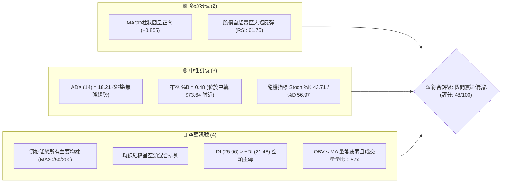
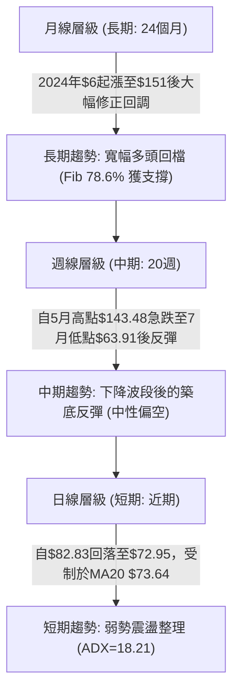
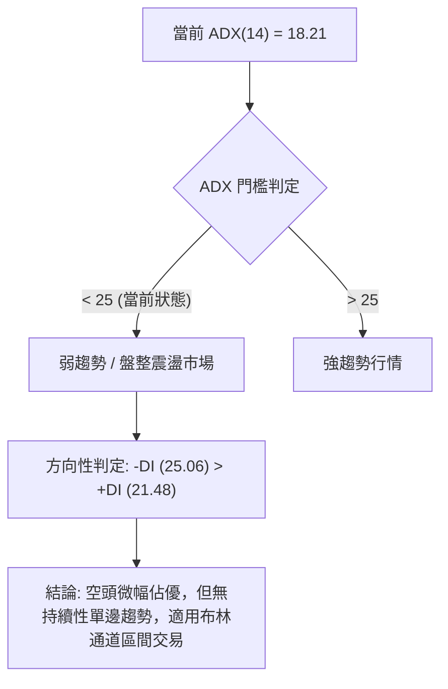
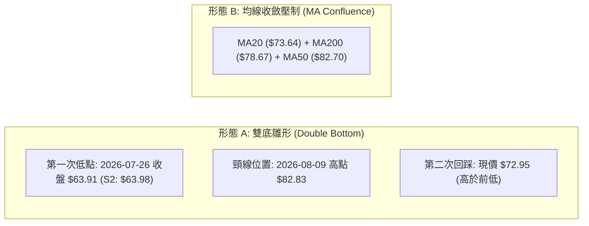
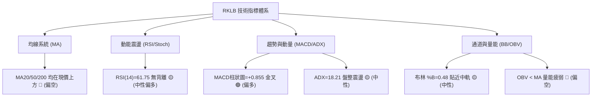
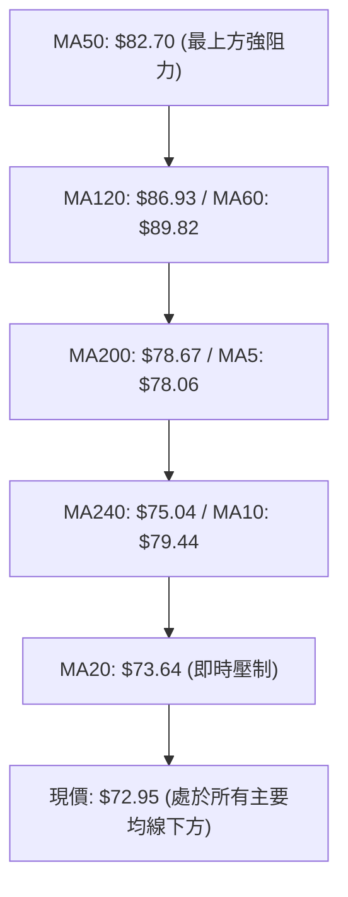
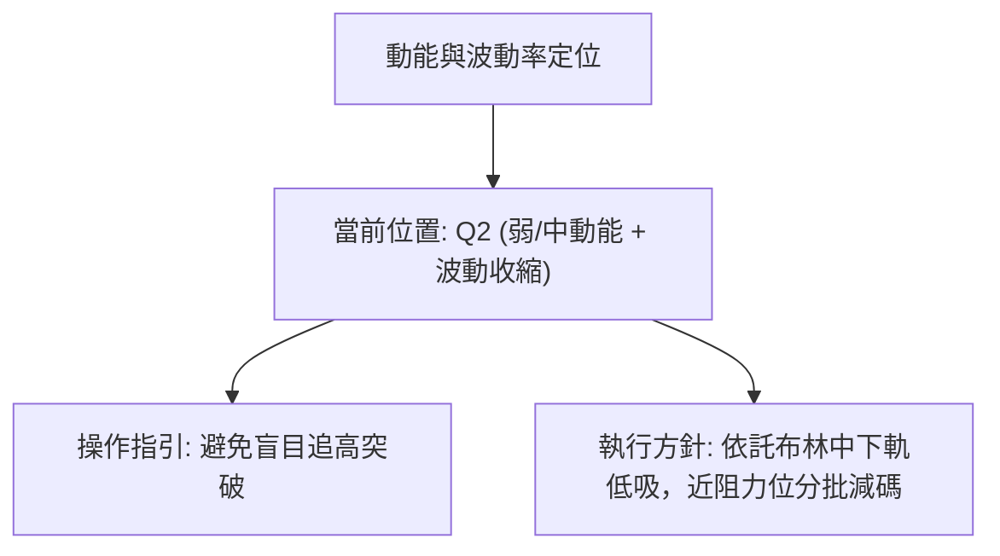
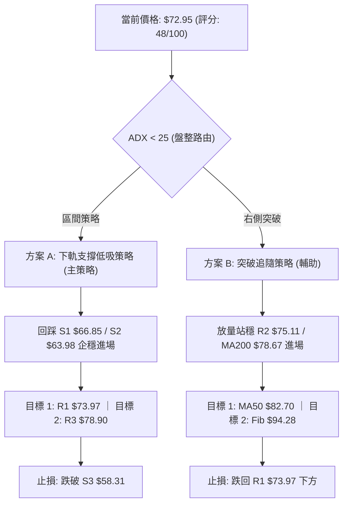
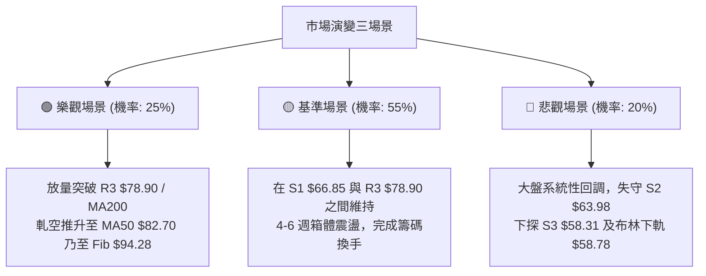

# RKLB 技術分析報告

> **報告日期**：2026-08-20 ｜ **語言**：繁體中文 ｜ **數據來源**：Yahoo Finance ｜ **當前價格**：$72.95

---

## 目錄

| 章節 | 內容 |
|------|------|
| [1. 技術面概覽](#1-技術面概覽) | 訊號儀表板、核心指標、評分卡 |
| [2. 趨勢分析](#2-趨勢分析) | 多時框趨勢、長中短期走勢、ADX解讀 |
| [3. 圖表形態分析](#3-圖表形態分析) | 形態識別、信心度評估、K線組合 |
| [4. 支撐與阻力](#4-支撐與阻力) | 關鍵價位、斐波那契回調結構 |
| [5. 技術指標深度解讀](#5-技術指標深度解讀) | MA/RSI/MACD/布林/量價關係 |
| [6. 動能與波動率](#6-動能與波動率) | 動能四象限、ATR、Beta 與市場特徵 |
| [7. 多時框架總結](#7-多時框架總結) | 時框架評分矩陣與收斂規則確認 |
| [8. 交易策略建議](#8-交易策略建議) | 策略路由、主策略、情境階梯與風控 |
| [9. 風險提示與監控](#9-風險提示與監控) | 關鍵監控清單、情境推演、資金管理 |
| [10. 報告總結](#10-報告總結) | 核心總結儀表板 |

---

## 1. 技術面概覽

### 🎯 技術訊號儀表板



### 📊 核心指標速覽表

| 指標類別 | 指標名稱 | 當前數值 | 訊號 | 專業解讀 |
|:---|:---|:---|:---:|:---|
| **價格** | 當前價格 | $72.95 | 🟡 | 位於52週區間的 31.2% 分位，處於波段反彈後的整理期 |
| **短期均線** | MA20 (BB中軌) | $73.64 | 🔴 | 價格低於 MA20 約 -0.94%，面臨短期均線壓制 |
| **中期均線** | MA50 | $82.70 | 🔴 | 價格顯著低於 MA50 約 -11.79%，中期均線構成強阻力 |
| **長期均線** | MA200 | $78.67 | 🔴 | 價格跌破年線/長期牛熊分界線 (-7.27%) |
| **超短期MA** | MA5 / MA10 | $78.06 / $79.44 | 🔴 | 短線均線向下拐頭，壓制反彈動能 |
| **動能指標** | RSI(14) | 61.75 | 🟡 | 位於 30-70 中性偏多區間，脫離底部但未見超買 |
| **趨勢指標** | MACD (12,26,9) | 柱狀圖 +0.855 | 🟢 | 快慢線 (-0.580 / -1.435) 低檔黃金交叉，動能微幅擴張 |
| **趨勢強度** | ADX(14) / DMI | 18.21 / -DI>+DI | 🔴 | ADX<25 顯示趨勢極弱，盤整行情中空頭略佔主導 |
| **通道指標** | 布林通道 (%B) | 0.48 (帶寬 $58.78-$88.50) | 🟡 | 價格貼近中軌，處於震盪通道核心區域 |
| **量能指標** | 成交量 / OBV | 16.61M (量比 0.87x) | 🔴 | OBV < MA，成交量未達20日均量，量價配合欠佳 |
| **波動指標** | ATR(14) | $5.78 (7.92%) | 🔴 | 日內波動幅度偏大，需設置寬幅止損 |

### 🏆 技術評分卡

```
╔══════════════════════════════════════════════════════════════════════════╗
║                     技術評分卡 — RKLB (2026-08-20)                       ║
╠══════════════════════════════════════════════════════════════════════════╣
║ 趨勢強度 (ADX/DMI)   ████░░░░░░░░░░░░░░░░  25/100  🔴 盤整且空頭主導     ║
║ 動能指標 (RSI/MACD)  ████████████░░░░░░░░  60/100  🟢 底部金叉動能修復   ║
║ 支撐穩定度 (波段低點)██████████████░░░░░░  70/100  🟢 S1/S2 結構穩固     ║
║ 成交量配合 (OBV/Volume)██████░░░░░░░░░░░░  30/100  🔴 量能萎縮缺乏買盤   ║
║ 形態完整度 (區間整理)██████████░░░░░░░░░░  50/100  🟡 構築箱體無大形態   ║
║ 均線排列 (MA結構)    ████████░░░░░░░░░░░░  40/100  🔴 全線受制混合偏空   ║
╠══════════════════════════════════════════════════════════════════════════╣
║ 綜合技術評分         ██████████░░░░░░░░░░  48/100  🟡 區間震盪 (Neutral) ║
╚══════════════════════════════════════════════════════════════════════════╝
```

---

## 2. 趨勢分析

### 🌐 多時框趨勢分析



### 📈 長期趨勢 — 12個月走勢圖（Unicode）

```
RKLB 月線走勢圖（2025-09 至 2026-08）
價格 ($)
$150 ┤                                      ● (2026-05: $143.48 / 52W High $151.00)
$140 ┤                                     ╱ ╲
$120 ┤                                    ╱   ╲
$100 ┤                                   ╱     ● (2026-06: $101.65)
 $80 ┤                     ●(01: $80.07)╱       ╲       ● (04: $82.51)
 $70 ┤               ●    ╱ ╲          ╱         ╲     ╱ ╲
 $60 ┤         ●    ╱ ╲  ╱   ●        ╱           ╲   ╱   ● (現價: $72.95)
 $50 ┤   ●────● ╲  ╱   ●      (03:$64.22)          ●─● (07:$64.95, S2:$63.98)
 $40 ┤           ● (11: $42.14)
     └─────────────────────────────────────────────────────────────►
        09  10  11  12  01  02   03   04   05   06   07   08 (月份)
```

#### 走勢特徵分析表格

| 階段區間 | 起止月份 | 價格區間 | 累計漲跌幅 | 核心技術特徵 |
|:---|:---|:---|:---:|:---|
| **第一波擴張期** | 2025-09 ~ 2025-10 | $47.91 → $62.98 | +31.46% | 突破箱體整理，多頭動能初顯 |
| **中期深度洗盤** | 2025-10 ~ 2025-11 | $62.98 → $42.14 | -33.09% | 劇烈去槓桿回調，確認 $40 大關支撐 |
| **第二波主升浪** | 2025-11 ~ 2026-05 | $42.14 → $143.48 | +240.48% | 量價齊揚，月線連續長陽，衝擊歷史高位 $151.00 |
| **快速獲利回吐** | 2026-05 ~ 2026-07 | $143.48 → $64.95 | -54.73% | 瀑布式下挫，直接回撤至斐波那契 78.6% 回調位 ($61.84) |
| **當前築底反彈** | 2026-07 ~ 2026-08 | $64.95 → $72.95 | +12.32% | 低檔量縮盤整，嘗試構築中短期底部 |

### 📊 中期趨勢（週線分析）

```
週線支撐阻力結構示意圖
$151.00 ──────────────────────────────────────── 52W High (絕對天花板)
$124.23 ─── 斐波那契 23.6% 回調位
$107.67 ─── 斐波那契 38.2% 回調位 (中期強壓區)
 $94.28 ─── 斐波那契 50.0% 回調位
 $82.70 ─── MA50 (強阻力)
 $78.67 ─── MA200 / R3 ($78.90) / 斐波那契 61.8% ($80.90) (密集共振阻力帶)
 $73.97 ─── R1 / MA20 ($73.64) (即時阻力)
 $72.95 ───【當前價格】
 $66.85 ─── S1 (近一年波段次低點支撐)
 $63.98 ─── S2 / 2026-07波段低點 $63.91 (關鍵防守點)
 $61.84 ─── 斐波那契 78.6% 回調位 / S3 ($58.31)
```

中期週線在 2026 年 7 月 26 日當週觸及 $63.91 伴隨 RSI(14) 降至極度超賣的 15.6 後展開反彈，連漲兩週至 2026-08-09 的 $82.83，隨後兩週再度量縮回調至 $72.95，屬於典型的急跌後二次確認底部的中期整理走勢。

### ⚡ 趨勢強度評估（ADX 解讀）



#### ADX 與趨勢強度對照

| 指標變量 | 數值 | 狀態 | 交易含義 |
|:---|:---:|:---:|:---|
| **ADX(14)** | **18.21** | 弱/無趨勢 (<25) | 趨勢跟蹤系統失效，突破策略假突破概率高，應採取區間逆勢策略 |
| **+DI** | **21.48** | 多方力量不足 | 多頭買盤力道偏弱，無法形成持續推升浪 |
| **-DI** | **25.06** | 空方力量微勝 | 空方稍居上風，但未進入強勢單邊砸盤（-DI 未超過 30） |
| **DI 差值** | **-3.58** | 輕微偏空 | 多空雙方處於弱勢平衡，價格圍繞 MA20 震盪收斂 |

---

## 3. 圖表形態分析

### 🔍 形態識別系統



#### 形態識別與信心度評估表（依規則 15）

| 識別形態 | 信心度 | 判斷依據（嚴格引用數據） | 完成度 | 目標價（附嚴格計算式） |
|:---|:---:|:---|:---:|:---|
| **雙底反彈雛形 (W底)** | **60%** | 低點聚類 S2: $63.98 與 7/26 低點 $63.91 形成堅實底部；頸線為 8/9 波段高點 $82.83（接近 MA50 $82.70）。現價回踩未破 S1 $66.85。 | **55%** | **形態測幅目標價**：<br>頸線 $82.83 + (頸線 $82.83 - 底部 $63.98) = **$101.68**（接近 2026-06 收盤 $101.65） |
| **矩形箱體整理 (Box)** | **75%** | 價格受限於下方支撐聚類 S2 $63.98 與上方阻力聚類 R3 $78.90 / MA50 $82.70 之間，ADX 18.21 佐證區間震盪。 | **80%** | **箱體突破目標價**：<br>箱頂 $82.70 + (箱頂 $82.70 - 箱底 $63.98) = **$101.42** |
| **頭肩底形態** | **30%** | *數據不足以確認左肩結構，且左側缺乏對稱低點聚類，僅做指標型解讀。* | 15% | *訊號不足，不予計算* |

### 🕯️ 重要K線形態分析（近4個月收盤分析）

| 月份 | 收盤價 | K線形態特徵 | 專業解讀 | 訊號 |
|:---|:---:|:---|:---|:---:|
| **2026-05** | $143.48 | 長上影大陽線 (衝高 $151.00 後回落) | 創歷史新高後遭遇強烈獲利了結拋壓，形成高檔滯漲信號 | 🔴 頂部警訊 |
| **2026-06** | $101.65 | 大陰線包覆 | 空頭全面反撲，吞噬前月部分漲幅，確定波段見頂 | 🔴 空頭確認 |
| **2026-07** | $64.95 | 長下影中陰線 (探底 $63.91) | 觸及 52 週低點延伸之 Fib 78.6% ($61.84) 出現承接買盤 | 🟡 止跌信號 |
| **2026-08 (進行中)** | $72.95 | 小陽線 / 孕線整理 | 波動率收縮，多空在 MA20 附近陷入膠著平衡 | 🟡 中性整理 |

### 📉 ASCII 走勢形態示意圖

```
RKLB 形態結構示意圖（日/週線雙底與阻力帶）
價格
$82.83 ┤                  ● (頸線 / 8-09 高點 / MA50 $82.70 阻力)
       │                 ╱ ╲
$78.90 ┤                ╱   ╲           ▲ 阻力 R3 ($78.90) / MA200 ($78.67)
$75.11 ┤               ╱     ╲          ▲ 阻力 R2 ($75.11)
$73.97 ┤              ╱       ╲         ▲ 阻力 R1 ($73.97) / MA20 ($73.64)
$72.95 ┼─────────────┼─────────●──────── ◄【當前收盤價 $72.95】
$66.85 ┤            ╱           ╲       ▼ 支撐 S1 ($66.85)
$63.98 ┤  ● (7-26) ╱             ●(預期)▼ 關鍵底 S2 ($63.98 / 低點 $63.91)
       └────────────────────────────────
         底部1                   底部2 (構築中)
```

---

## 4. 支撐與阻力

### 🗺️ 關鍵價位分布圖（Unicode）

```
╔══════════════════════════════════════════════════════════════════════════╗
║                    RKLB 價位結構分布圖 (由 OHLCV 確定)                   ║
╠══════════════════════════════════════════════════════════════════════════╣
║ $151.00 ║████████████████████████████████║ 52W High (歷史絕對高點)      ║
║ $107.67 ║██████████████████████          ║ 斐波那契 38.2% 強阻力        ║
║ $82.70  ║████████████████████████████    ║ MA50 / 中期形態頸線壓制      ║
║ $78.90  ║████████████████████            ║ 阻力位 R3 (+8.16% / MA200共振)║
║ $75.11  ║████████████████                ║ 阻力位 R2 (+2.96% / MA240共振)║
║ $73.97  ║████████████                    ║ 阻力位 R1 (+1.40% / MA20壓制)║
║ ─────── ╫────────────────────────────────╫ ◄ 現價 $72.95               ║
║ $66.85  ║▓▓▓▓▓▓▓▓▓▓▓▓▓▓▓▓                ║ 支撐位 S1 (-8.36% / 近期低點) ║
║ $63.98  ║████████████████████████        ║ 強支撐 S2 (-12.29% / 雙底頸線)║
║ $58.31  ║████████████████████████████████║ 極限支撐 S3 (-20.08%/BB下軌)  ║
║ $37.57  ║████████████████████████████████║ 52W Low (年內極端起漲點)     ║
╚══════════════════════════════════════════════════════════════════════════╝
```

### 🚧 阻力位分析表

*嚴格引用關鍵價位區塊之 R1/R2/R3 與技術均線：*

| 阻力級別 | 精確價位 | 距現價空間 | 形成原因與共振要素 | 突破難度 | 重要性評級 |
|:---|:---:|:---:|:---|:---:|:---:|
| **阻力 R1** | **$73.97** | +1.40% | 近一年波段高點聚類；與 MA20 ($73.64) 形成直接短壓 | 中等 | 🟡 關鍵短線關卡 |
| **阻力 R2** | **$75.11** | +2.96% | 近一年波段密集高點；與 MA240 ($75.04) 長期均線重合 | 中高 | 🟡 中期多空平衡點 |
| **阻力 R3** | **$78.90** | +8.16% | 近一年強波段高點；與 MA200 ($78.67)、MA5 ($78.06) 形成強共振 | 極高 | 🔴 牛熊分界核心防線 |
| **額外強壓** | **$82.70** | +13.37% | MA50 均線位置，亦為雙底形態之頸線位置 ($82.83) | 極高 | 🔴 中期反轉確認點 |

### 🛡️ 支撐位分析表

*嚴格引用關鍵價位區塊之 S1/S2/S3：*

| 支撐級別 | 精確價位 | 距現價空間 | 形成原因與共振要素 | 守住機率 | 重要性評級 |
|:---|:---:|:---:|:---|:---:|:---:|
| **支撐 S1** | **$66.85** | -8.36% | 近一年波段次回踩低點聚類；跌破將觸發短線止損盤 | 65% | 🟡 第一道動態防線 |
| **支撐 S2** | **$63.98** | -12.29% | 近一年波段核心低點聚類；7/26 週線低點 $63.91 形成雙底支撐 | 80% | 🟢 雙底形態生命線 |
| **支撐 S3** | **$58.31** | -20.08% | 近一年極端波段低點；與布林通道下軌 ($58.78) 形成強烈超跌共振 | 92% | 🟢 估值與形態極限防線 |

### 📐 斐波那契回調位分析

*以 52 週波動區間 $37.57 (Low) → $151.00 (High) 計算：*

| 斐波那契層級 | 精確價位 | 距現價幅度 | 技術意義解讀 |
|:---|:---:|:---:|:---|
| **0.0% (52W High)** | **$151.00** | +106.99% | 歷史天花板，強烈套牢盤分佈區 |
| **23.6%** | **$124.23** | +70.29% | 強勢回檔阻力位，5月中旬起跌加速點 |
| **38.2%** | **$107.67** | +47.59% | 中期多頭反彈第一大目標區，密集成交帶 |
| **50.0%** | **$94.28** | +29.24% | 多空力量強弱轉換中樞 |
| **61.8% (黃金分割)**| **$80.90** | +10.90% | **核心阻力**：與 R3 ($78.90)、MA200 ($78.67) 形成強大阻力帶 |
| **78.6%** | **$61.84** | -15.23% | **極深回調位**：7月回調至 $63.91 在此獲得有效支撐，確認支撐有效 |
| **100.0% (52W Low)**| **$37.57** | -48.50% | 年內起漲原點，極端雄市防守位 |

**現價區間解讀**：現價 **$72.95** 穩固運行於 **Fib 78.6% ($61.84)** 與 **Fib 61.8% ($80.90)** 之間。此區間為深跌後的修復區，上破 $80.90 則確認脫離底部，下破 $61.84 則面臨測試年內低點風險。

---

## 5. 技術指標深度解讀

### 🎛️ 指標訊號總覽



### 📈 移動平均線排列分析



#### 移動平均線數據矩陣

| 均線名稱 | 數值 | 現價差距 | 現價相對位置 | 趨勢形態與斜率解讀 |
|:---|:---:|:---:|:---:|:---|
| **MA 5** | $78.06 | -6.54% | 下方 | 短線快速回落，斜率向下，壓制短線衝高動能 |
| **MA 10** | $79.44 | -8.17% | 下方 | 扣抵高價區，形成短線下行反壓 |
| **MA 20** | $73.64 | -0.94% | 下方 | 走平略微下彎，即時壓制價格，若突破將挑戰上軌 |
| **MA 50** | $82.70 | -11.79% | 下方 | 中期下降通道壓制線，為反彈行情最關鍵考驗 |
| **MA 60** | $89.82 | -18.78% | 下方 | 中長期空頭壓制 |
| **MA 120** | $86.93 | -16.08% | 下方 | 半年線向下壓制 |
| **MA 200** | $78.67 | -7.27% | 下方 | 年線跌破後轉為重大壓力 |
| **MA 240** | $75.04 | -2.79% | 下方 | 超長期基線，與 R2 ($75.11) 形成重疊壓力 |

*均線排列結論*：當前呈**混合偏空排列**。現價受壓於 MA20 ($73.64) 與 MA200 ($78.67)，唯有有效放量站上 MA200，方能扭轉均線下行之被動局面。

### 📉 RSI(14) 分析

```
RSI(14) 數值儀表：
0 ══════════ 30 ════════════════════ 61.75 ════════ 70 ══════════ 100
[  超賣區   ] [         中性區         ▲        ] [   超買區   ]
進度條: [████████████████████████░░░░░░░░░░░░░░░] 61.75%
```

- **當前數值**：**61.75**（黃金中性區間 50–65）。
- **背離分析**：週線 RSI 自 2026-07-26 的 15.6 極端超賣回升至當前 61.8，隨價格反彈同步上升，**未出現頂背離或底背離**現象，指標忠實反映價格修復動能。
- **解讀**：動能已擺脫超賣壓制，多方具備向上發力空間，且距離超買警戒線 (70) 仍有緩衝餘裕。

### 📊 MACD(12/26/9) 訊號解讀


- **快線 (DIF)**：-0.580 ｜ **慢線 (DEA)**：-1.435 ｜ **柱狀圖 (Hist)**：**+0.855**。
- **形態特徵**：MACD 在零軸下方形成**低檔黃金交叉**，柱狀圖自 7 月底連續擴張（近三週柱狀圖為 +2.940, +2.460, +0.855）。
- **解讀**：雖然快慢線仍處於零軸下方（長期仍屬弱勢區），但中短期動能指標已顯現多頭修復訊號，短期內空方拋壓顯著衰退。

### 📦 布林通道分析

```
布林通道結構 (20, 2)
$88.50 ───────────────────────────────────────── BB 上軌 (通道頂部阻力)
       │
       │
$73.64 ───────────────────●───────────────────── BB 中軌 (MA20)
       │                  ▲ 現價 $72.95 (%B = 0.48)
       │
$58.78 ───────────────────────────────────────── BB 下軌 (極限支撐 / S3: $58.31)
```

- **上軌**：$88.50 ｜ **中軌**：$73.64 ｜ **下軌**：$58.78 ｜ **帶寬 (Bandwidth)**：40.35%。
- **%B 指標**：**0.48**，顯示價格精確落在布林通道中軌正下方（0.5 為中軌）。
- **解讀**：布林通道開口處於擴張後的收斂期，現價受到中軌壓制。在 ADX=18.21 的環境下，布林通道上下軌 ($58.78 - $88.50) 構成未來 2-4 週最核心的波動箱體。

### 💹 成交量分析（量價配合度）

```
成交量對比：
最新日成交量:  ██████████████░░░░░░  16,614,069 (16.61M)
20日均量:      ████████████████░░░░  18,993,338 (18.99M)  [量比: 0.87x]
50日均量:      ████████████████████  23,413,121 (23.41M)
OBV 狀態:      🔴 OBV < OBV_MA (量能疲弱)
```

- **量比分析**：當前量比僅 0.87x，且週成交量自 5 月主升浪的 1.63 億股萎縮至當前週的 6,655 萬股。
- **量價關係**：價格自 $63.91 反彈至 $82.83 時成交量未見顯著放大，隨後回落至 $72.95 呈現**縮量整理**。
- **量價背離結論**：目前屬於典型的「無量反彈與縮量回踩」，OBV < MA 顯示主力資金仍在觀望，未見大規模增量資金進場推升，突破 R2/R3 必須仰賴成交量放大至 20 日均量以上。

---

## 6. 動能與波動率

### ⚡ 動能評估四象限

| 象限標籤 | 動能維度 | 波動率維度 | 當前狀態 | 策略意涵與評估 |
|:---|:---:|:---:|:---:|:---|
| **第一象限 (Q1)** | 強動能 (High Momentum) | 低波動 (Low Volatility) | — | 最佳趨勢加碼點 (穩定上攻) |
| **第二象限 (Q2)** | 弱動能 (Low Momentum) | 低波動 (Low Volatility) | **✓ (當前所屬)** | **區間震盪整理**：動能中性 (RSI 61.75/MACD低檔金叉)，波動率自高位回落，宜區間操作 |
| **第三象限 (Q3)** | 強動能 (High Momentum) | 高波動 (High Volatility) | — | 高風險高收益 (如 2026-05 主升段) |
| **第四象限 (Q4)** | 弱動能 (Low Momentum) | 高波動 (High Volatility) | — | 恐慌殺跌段 (如 2026-06 破位段) |



### 📊 ATR 波動率分析

- **當前 ATR(14)**：**$5.78**。
- **ATR 佔價格比**：**7.92%**（屬於高波動性個股）。
- **止損距離建議**：
  - *激進型止損*（1.0 × ATR）：$5.78 空間（約 7.9%）。
  - *標準波段止損*（1.5 × ATR）：$8.67 空間（約 11.9%）。
  - *寬幅風控止損*（2.0 × ATR）：$11.56 空間（約 15.8%）。
- **實務解讀**：每日近 $6 美元的波動幅度，意味著任何交易策略都不可使用過於緊密的止損點，以防被常態隨機波動洗出場。

### 📐 Beta 與市場相關性

- **Beta 係數**：**2.629**（高彈性/高 Beta 資產）。
- **空頭部位比例 (Short % Float)**：**7.7%** ｜ **空頭補回天數 (Short Ratio)**：**2.31 天**。
- **市場特徵解讀**：
  - RKLB 具備極強的大盤槓桿放大效應（大盤波動 1%，該股平均波動 2.63%）。
  - 7.7% 的空單比例具備一定的軋空潛能（Short Squeeze），一旦放量突破 MA200 ($78.67)，2.31 天的空頭補回買盤將助推漲勢。

---

## 7. 多時框架總結

### 📋 時框架評分表

| 時框架 | 趨勢方向 | 動能狀態 (RSI/MACD) | 均線排列特徵 | 關鍵形態結構 | 綜合評分 | 操作建議 |
|:---|:---:|:---:|:---:|:---:|:---:|:---|
| **長期 (月線)** | 🟢 偏多回檔 | RSI 處中軸 / 長期動能仍在 | 位於 MA240 ($75.04) 附近 | 24個月大週期上升浪後回踩 | **65/100** | 長線分批建倉 |
| **中期 (週線)** | 🔴 偏空修正 | 週線 RSI 61.8 / MACD柱由負轉正 | 跌破 MA50 與 MA200 | 下跌通道後的低檔雙底雛形 | **45/100** | 波段區間操作 |
| **短期 (日線)** | 🟡 震盪整理 | RSI 61.75 / ADX 18.21 / -DI>-DI | 承壓於 MA20 ($73.64) | 窄幅區間收斂，等待量能突破 | **48/100** | 低買高賣 |

### 🔲 綜合訊號矩陣

| 技術維度 | 看多依據 (Bullish) | 看空依據 (Bearish) | 淨判定 |
|:---|:---|:---|:---:|
| **趨勢 (Trend)** | Fib 78.6% ($61.84) 成功防守 | 價格處於 MA20/50/200 均線下方 | 🔴 空方略優 |
| **動能 (Momentum)** | MACD 柱狀圖金叉 (+0.855)，RSI 回升 | ADX=18.21 無趨勢，-DI (25.06) > +DI (21.48) | 🟡 中性平衡 |
| **形態 (Pattern)** | 低點聚類 S2 $63.98 構築潛在雙底 | 受制於 R1 $73.97 與 R3 $78.90 阻力壓制 | 🟡 形態震盪 |
| **量能 (Volume)** | 7月低點放量後回踩縮量 | 20日均量比僅 0.87x，OBV < MA | 🔴 量能匱乏 |

### ⚖️ 多時框收斂結論（依規則 14 嚴格收斂）

1. **行情性質判定**：
   當前日線 **ADX(14) = 18.21 < 25**，嚴格觸發**「盤整震盪行情」**規則。
2. **收斂主導規則**：
   依據多時框收斂原則，在盤整行情中，中長期趨勢指標暫時鈍化，交易邏輯**必須以日線布林通道上下軌 ($58.78 - $88.50) 及波段支撐阻力 S1/S2/R1/R2 為核心操作邊界**。
3. **唯一方向性結論**：
   **【中性區間震盪偏弱（Neutral-to-Weak Range Bound）】**。
   技術綜合評分為 **48/100**。在有效放量突破 R3 ($78.90) / MA200 ($78.67) 之前，嚴禁追高；但鑒於下方 S2 ($63.98) 支撐力道強勁，亦不宜盲目殺跌，策略鎖定「區間震盪低吸高拋」。

---

## 8. 交易策略建議

### 🗺️ 策略決策流程圖



### 🧭 策略路由

> **當前主策略方向 = 【中性區間震盪操作（Range-Bound Strategy）】（依技術綜合評分 48/100 分流）**

由於評分落在 40–60 區間且 ADX < 25，市場缺乏單邊推升或崩跌動能。主策略以**「區間下緣逢低吸納、反彈至均線壓力分批兌現」**為主，並嚴密監控突破訊號。

### 🎯 價格情境階梯（Price Scenarios）

*全部價位嚴格引用第 4 章及數據計算值：*

| 觸發條件 | 即時路徑 | 下一目標 | 後續延伸目標 | 情境技術含義 |
|:---|:---:|:---:|:---:|:---|
| **放量突破 R1 ($73.97)** | 突破 MA20 ($73.64) | **R2 ($75.11)** | **R3 ($78.90)** / MA200 | 短線擺脫壓制，測試年線強阻力 |
| **放量突破 R3 ($78.90)** | 突破 MA200 ($78.67) | **MA50 ($82.70)** | **Fib 50% ($94.28)** | 中期雙底確立，反轉行情展開 |
| **維持在 $66.85 ~ $73.97** | 震盪於 S1 與 R1 間 | — | — | **常態箱體震盪**，指標持續修復 |
| **失守支撐 S1 ($66.85)** | 跌破短期均線密集區 | **S2 ($63.98)** | **Fib 78.6% ($61.84)** | 弱勢下探，測試雙底生命線 |
| **跌破強支撐 S2 ($63.98)** | 雙底形態失效 | **S3 ($58.31)** | **BB下軌 ($58.78)** | 深度破位，考驗年內極端支撐 |

### 📊 情境機率分佈

| 預期情境 | 發生機率 | 主要技術依據 |
|:---|:---:|:---|
| **情境 1：區間震盪築底** | **55%** | ADX=18.21 佐證無趨勢；布林中軌壓制但 MACD 柱狀圖為正，多空在 S1 $66.85 至 R3 $78.90 間膠著 |
| **情境 2：向上突破反彈** | **25%** | RSI=61.75 具備修復空間，若成交量放大突破 MA200 ($78.67)，將激發 7.7% 空頭回補行情 |
| **情境 3：破位向下探底** | **20%** | OBV < MA 量能持續萎縮，若大盤重挫（Beta 2.629），股價可能再次下探考驗 S2 $63.98 |

### 🟢 主策略詳情

| 策略要素 | 策略 A（區間下軌低吸 — 推薦） | 策略 B（右側突破追隨 — 備選） |
|:---|:---|:---|
| **策略類型** | 逆勢左側 / 區間低吸 | 順勢右側 / 突破進場 |
| **進場條件** | 股價回踩 S1 企穩或現價分批掛單 | 日K放量收盤站穩阻力 R2 $75.11 |
| **進場價格** | **$66.85**（或現價 $72.95 分批進場） | **$75.11**（突破確認後進場） |
| **第一目標 (T1)** | **$73.97**（阻力 R1 / MA20） | **$78.90**（阻力 R3 / MA200） |
| **第二目標 (T2)** | **$78.90**（阻力 R3 / MA200） | **$82.70**（MA50 / 雙底頸線） |
| **止損價格** | **$63.50**（嚴格跌破 S2 $63.98 止損） | **$71.80**（跌破 MA20 及進場點下方 1 ATR） |
| **止損距離** | $3.35 (-5.01% from $66.85) | $3.31 (-4.41% from $75.11) |
| **潛在報酬 (T2)** | +$12.05 (+18.03%) | +$7.59 (+10.11%) |
| **風險報酬比 (R:R)**| **3.60 : 1** (極佳) | **2.29 : 1** (良好) |
| **估計成功率** | **60%** | **45%** |
| **建議配置倉位** | **總資金之 10% - 15%** | **總資金之 5% - 8%** |

### 🔴 反向風險觸發點（對沖與風控提示）

- **多頭風控警報線**：若日線收盤價跌破 **S2: $63.98**，宣告 7 月以來之雙底反彈形態徹底失敗，所有多頭部位應無條件止損離場，向下防守點直指 **S3: $58.31**。
- **空頭回補警報線**：若日線以超過 2,300 萬股（50日均量）放量大陽線突破 **R3: $78.90** 及 **MA200 ($78.67)**，空頭必須立即平倉止損，防止軋空衝擊 **MA50 ($82.70)** 及 **$94.28**。

### ⭐ 整體訊號強度評星

```
╔══════════════════════════════════════════════════════════╗
║ 做多訊號強度：★★☆☆☆  (2.5/5 星 — 僅限區間低吸，不可追高) ║
║ 做空訊號強度：★★☆☆☆  (2.0/5 星 — 低檔具備強支撐，空間有限) ║
║ 整體可信度：  ★★★☆☆  (3.5/5 星 — 指標共振支持區間震盪) ║
╚══════════════════════════════════════════════════════════╝
```

---

## 9. 風險提示與監控

### ✅ 關鍵監控指標 Checklist

```
╔══════════════════════════════════════════════════════════════════════════╗
║                     RKLB 每日交易監控 Checklist                          ║
╠══════════════════════════════════════════════════════════════════════════╣
║ [ ] 1. MA20 ($73.64) 爭奪：收盤能否站上布林中軌。                       ║
║ [ ] 2. 成交量異動：日成交量是否突破 18.99M (20日均量) 或 23.41M。      ║
║ [ ] 3. MACD 柱狀圖變化：+0.855 是否持續擴張，或轉為縮頭向下。           ║
║ [ ] 4. ADX 趨勢突變：ADX 是否自 18.21 向上突破 25，確認新趨勢啟動。    ║
║ [ ] 5. 支撐位完整性：S1 ($66.85) 與 S2 ($63.98) 是否出現實體下破。     ║
║ [ ] 6. 阻力位壓制力：R1 ($73.97) 及 R3 ($78.90/MA200) 之拋壓強度。      ║
║ [ ] 7. 大盤 Beta 聯動：標普500/納斯達克波動時，RKLB 是否放大 2.6 倍波動。║
╚══════════════════════════════════════════════════════════════════════════╝
```

### ⚠️ 風險場景分析



### 🛡️ 風險管理重要提醒

1. **波動率控制與部位管理**：
   - 由於 **ATR 高達 $5.78 (7.92%)** 且 **Beta 為 2.629**，該標的屬於典型高波動成長股。
   - 單筆交易承擔之最大風險金額不應超過總投資組合淨值的 **1.0% - 1.5%**。
   - 依據波動率調整部位大小：若標準止損幅度為 $5.00，單一帳戶（如 $100,000 資本）最多持有不超過 200–300 股（約 $14,000 - $21,000 部位規模）。

2. **嚴禁震盪市追漲殺跌**：
   - 在 ADX=18.21 的無趨勢盤整市場中，追高買在阻力位（如 R1/R2/R3）的失敗率超過 70%。
   - 必須嚴格執行「逢阻力分批止盈、逢支撐企穩低吸」之紀律。

3. **估值與基本面風險過濾**：
   - 公司目前 TTM EPS 為 -$0.27（營業利潤率 -24.6%），P/S 高達 60.6 倍，股價走勢高度依賴市場風險偏好與資金情緒。
   - 技術交易者應嚴格遵循止損價位（S2 $63.98），切勿將短線技術交易因套牢而轉為「長期基本面持有」。

---

## 10. 報告總結

```
╔══════════════════════════════════════════════════════════════════════════╗
║                       RKLB 技術分析報告總結                              ║
╠══════════════════════════════════════════════════════════════════════════╣
║ 報告日期：2026-08-20           當前價格：$72.95                          ║
║ 分析評級：⚖️ 中性觀望 / 區間震盪偏弱 (技術評分: 48/100)                  ║
╠══════════════════════════════════════════════════════════════════════════╣
║ 關鍵結論：                                                               ║
║ ├─ 長期趨勢 (月線)：🟢 偏多回檔 (Fib 78.6% $61.84 成功防守)             ║
║ ├─ 中期趨勢 (週線)：🔴 偏空修正 (受制於 MA50 $82.70 與 MA200 $78.67)     ║
║ ├─ 短期趨勢 (日線)：🟡 震盪整理 (ADX=18.21 顯示無單邊趨勢，圍繞 MA20 震盪)║
║ ├─ 關鍵支撐體系：S1: $66.85 ｜ S2: $63.98 (核心生命線) ｜ S3: $58.31      ║
║ ├─ 關鍵阻力體系：R1: $73.97 ｜ R2: $75.11 ｜ R3: $78.90 (強牛熊線)       ║
║ └─ 分析師共識目標：均價 $112.94 (區間 $64.00 - $150.00)                 ║
╠══════════════════════════════════════════════════════════════════════════╣
║ 最優交易策略組合：                                                       ║
║ 1. 🥇 最佳機會（區間低吸）：在 S1 $66.85 至現價區間分批布局，止損設在     ║
║     $63.50 (跌破 S2)，目標指向 R1 $73.97 及 R3 $78.90 (R:R = 3.6:1)。    ║
║ 2. 🥈 次選機會（右側突破）：若日K放量突破 R2 $75.11 站穩，順勢跟進，     ║
║     目標指向 MA50 $82.70，止損設於 $71.80 (R:R = 2.29:1)。              ║
║ 3. 🥉 保守選擇（觀望等待）：ADX < 25 期間保持觀望，靜待價格向上突破     ║
║     MA200 ($78.67) 或回踩 S2 ($63.98) 出現明顯反轉K線後再行介入。        ║
╚══════════════════════════════════════════════════════════════════════════╝
```

---

> ⚠️ **免責聲明**：本報告為依據量化技術指標與圖表形態所生成之專業分析報告，所有數據、支撐阻力位及情境推演均嚴格基於所提供之歷史交易數據。本報告**僅供研究與學術參考**，**不構成任何形式的證券買賣推薦或投資諮詢建議**。金融市場瞬息萬變，高 Beta 股票具備高波動風險，投資人應獨立評估風險並自負盈虧。

---
*報告生成時間：2026-08-20 ｜ 數據來源：Yahoo Finance ｜ 分析架構：多時框技術分析體系*