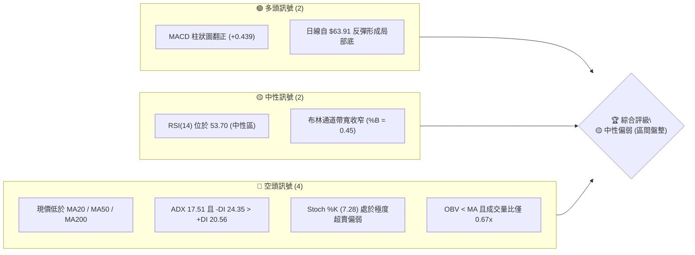
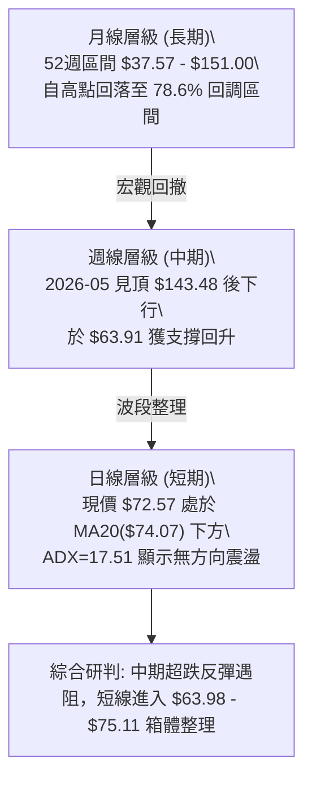
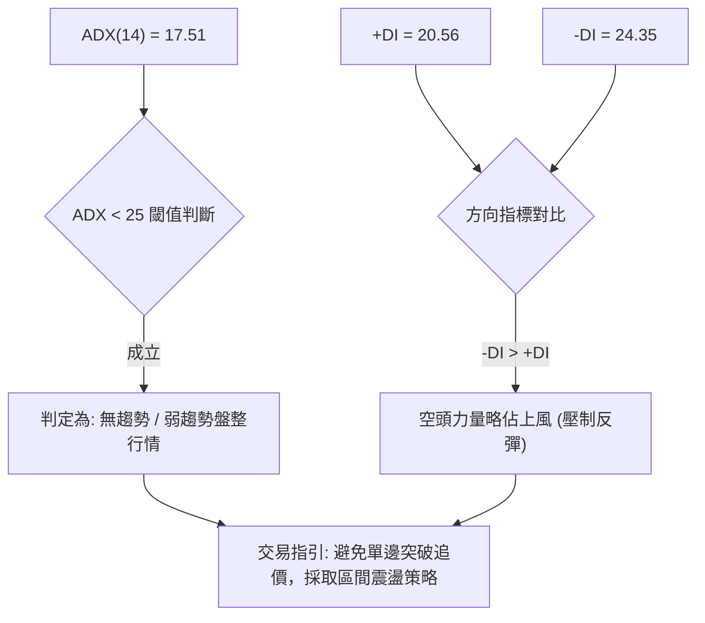
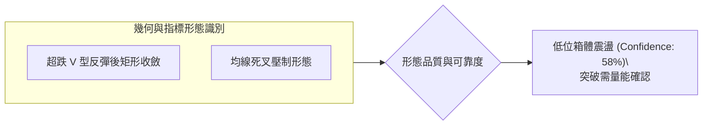
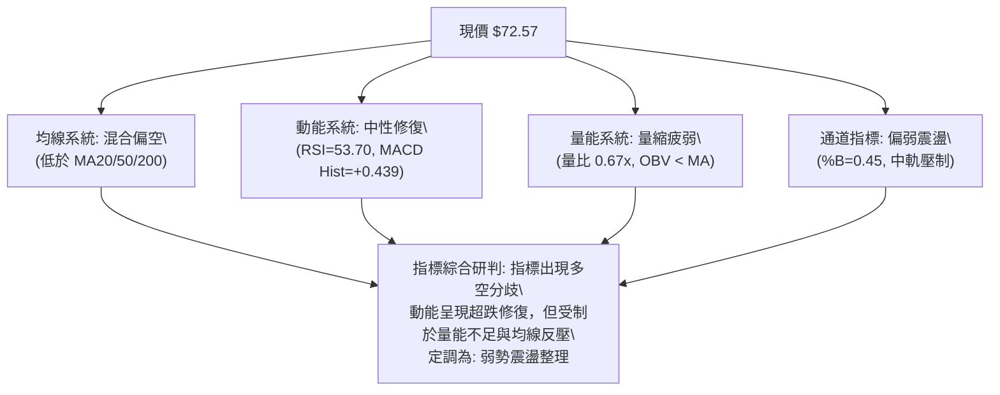
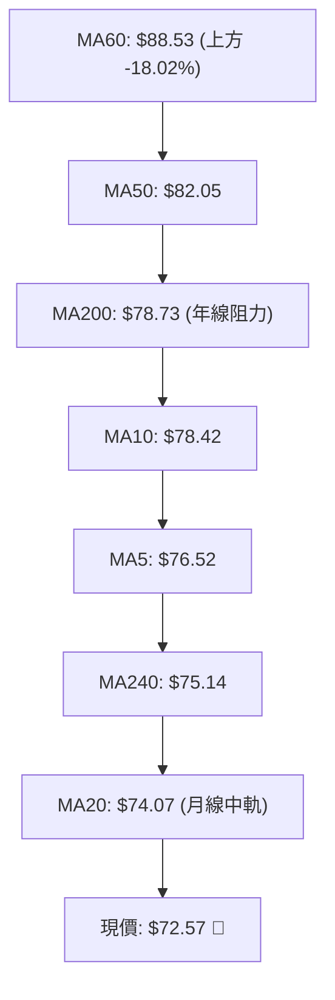
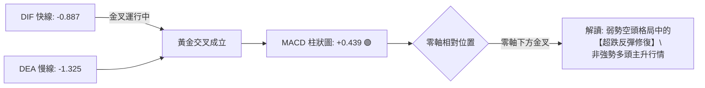
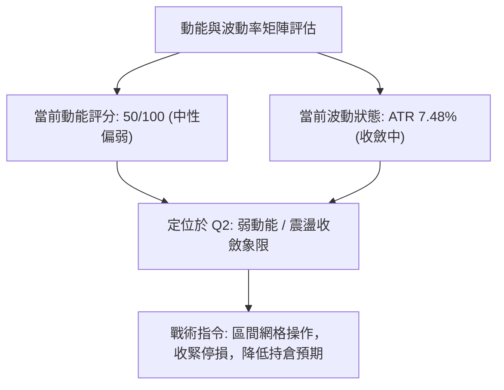
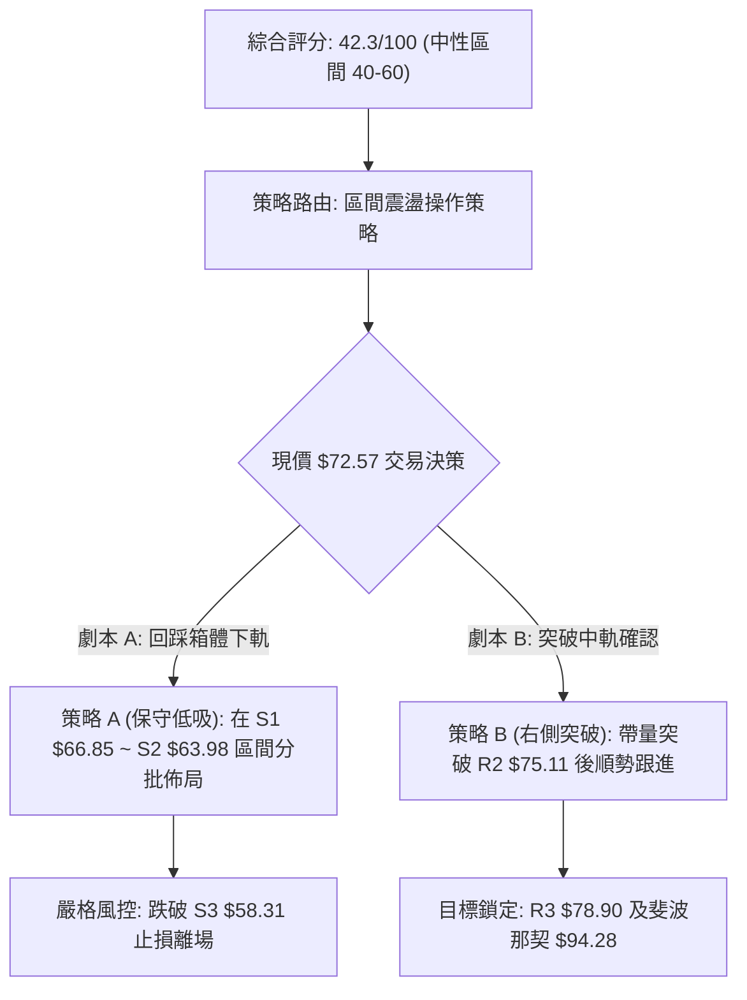
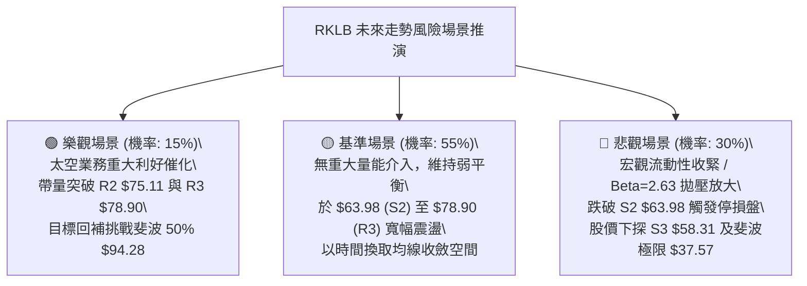

# RKLB 技術分析報告

> **報告日期**：2026-08-21 ｜ **語言**：繁體中文 ｜ **數據來源**：Yahoo Finance ｜ **當前價格**：$72.57

---

## 目錄

| 章節 | 內容 |
|------|------|
| [1. 技術面概覽](#1-技術面概覽) | 訊號儀表板、核心指標、評分卡 |
| [2. 趨勢分析](#2-趨勢分析) | 多時框趨勢、長中短期走勢、ADX解讀 |
| [3. 圖表形態分析](#3-圖表形態分析) | 形態識別、K線組合、目標價推算 |
| [4. 支撐與阻力](#4-支撐與阻力) | 關鍵價位、斐波那契回調結構 |
| [5. 技術指標深度解讀](#5-技術指標深度解讀) | MA/RSI/MACD/布林通道/成交量 |
| [6. 動能與波動率](#6-動能與波動率) | 動能四象限、ATR波動率、Beta解讀 |
| [7. 多時框架總結](#7-多時框架總結) | 時框架評分矩陣、多時框收斂結論 |
| [8. 交易策略建議](#8-交易策略建議) | 策略路由、價格情境、主策略與對沖 |
| [9. 風險提示與監控](#9-風險提示與監控) | 監控指標Checklist、情境分析、總結 |

---

## 1. 技術面概覽

### 🎯 技術訊號儀表板



### 📊 核心指標速覽表

| 指標類別 | 指標名稱 | 當前數值 | 訊號 | 解讀 |
|:---|:---|:---:|:---:|:---|
| **價格** | 當前價格 | $72.57 | 🟡 | 位於52週區間 30.9% 位置，自高點大幅回落後築底震盪 |
| **均線** | MA20 | $74.07 | 🔴 | 現價位於 MA20 下方 (-2.03%)，短線面臨中軌壓制 |
| **均線** | MA50 | $82.05 | 🔴 | 現價低於 MA50，中期下降壓力顯著 |
| **均線** | MA200 | $78.73 | 🔴 | 現價跌破年線 MA200 (-7.82%)，長期牛熊分水嶺受阻 |
| **動能** | RSI(14) | 53.70 | 🟡 | 位於 50 軸線附近中性平衡區，無超買或超賣 |
| **動能** | MACD(12,26,9) | -0.887 / -1.325 | 🟢 | 快慢線位於零軸下但金叉，柱狀圖 +0.439 呈現短線修復 |
| **動能** | Stoch %K / %D | 7.28 / 35.48 | 🔴 | %K 跌入超賣鈍化區，短線空頭壓制力道未完全消退 |
| **波動** | ATR(14) | $5.43 (7.48%) | 🔴 | 波動幅度較大，日均振幅超過 7%，需嚴格設定風控 |
| **趨勢** | ADX(14) | 17.51 | 🟡 | ADX < 25 表明處於弱趨勢／無方向盤整期，-DI 主導 |
| **量能** | 20日均量比 | 0.67x | 🔴 | 量能萎縮（12.46M vs 18.67M），OBV 疲軟缺乏主力追價 |

### 🏆 技術評分卡

```
╔══════════════════════════════════════════════════════════════════╗
║              技術評分卡 — RKLB (2026-08-21)                      ║
╠══════════════════════════════════════════════════════════════════╣
║ 趨勢強度      ██████░░░░░░░░░░░░░░  32/100  🔴 空頭控盤/弱趨勢   ║
║ 動能指標      ██████████░░░░░░░░░░  50/100  🟡 MACD金叉 vs RSI中性║
║ 支撐穩定度    ████████████░░░░░░░░  60/100  🟡 S1($66.85)初具支撐║
║ 成交量配合    ██████░░░░░░░░░░░░░░  30/100  🔴 量縮低於均量/OBV偏弱║
║ 形態完整度    ██████████░░░░░░░░░░  52/100  🟡 箱體整理構築中     ║
║ 均線排列      ██████░░░░░░░░░░░░░░  30/100  🔴 現價受制主要均線   ║
╠══════════════════════════════════════════════════════════════════╣
║ 綜合評分      ████████░░░░░░░░░░░░  42.3/100 🟡 中性偏弱 (區間操作)║
╚══════════════════════════════════════════════════════════════════╝
```

---

## 2. 趨勢分析

### 🌐 多時框趨勢分析



### 📈 長期趨勢 — 12個月走勢圖（Unicode）

```
RKLB 月線走勢圖（2025-08 至 2026-08）
價格軸 ($)
$150 ┤                                      ● ($143.48 / 2026-05 高點)
$130 ┤                                     ╱ ╲
$110 ┤                                    ╱   ● ($101.65 / 2026-06)
$90  ┤                    ● ($80.07)     ╱     ╲
$70  ┤       ● ($62.98)  ╱ ╲       ●($82.51)   ●($72.57 現在)
$50  ┤ ●───●            ●   ●─────●             ╲
$30  ┤      ($42.14) ($69.10) ($64.22)          ● ($64.95 / 2026-07)
     └─────────────────────────────────────────────────────────────
       08  09  10  11  12  01  02  03  04  05  06  07  08 (2025-08 ~ 2026-08)
```

#### 走勢特徵分析表格

| 階段區間 | 起止價格 ($) | 漲跌幅 | 走勢特徵 | 量能與動能解讀 |
|:---|:---:|:---:|:---|:---|
| **2025-08 ~ 2025-12** | $48.60 → $69.76 | +43.54% | 震盪上行突破前高 | 買盤逐步擴張，突破多重壓力 |
| **2026-01 ~ 2026-04** | $80.07 → $82.51 | +3.05% | 高位大箱體劇烈洗盤 | 於 $64.22~$82.51 形成籌碼換手 |
| **2026-05** | $82.51 → $143.48 | +73.89% | 爆發性主升浪 (歷史天價) | 單月創下 $151.00 高點，成交量暴增 |
| **2026-06 ~ 2026-07** | $143.48 → $64.95 | -54.73% | 斷崖式獲利回吐拋售 | 連續跌破各均線支撐，週 RSI 跌至 15.6 |
| **2026-08 (當前)** | $64.95 → $72.57 | +11.73% | 底部超跌修復反彈 | 週成交量回縮至 79.08M，動能趨緩 |

### 📊 中期趨勢（週線分析）

```
中期週線價格波段結構：
$151.00 (52W High) ═══════════════════════════════════ (天花板阻力)
                    ╲
                     ╲
$82.83 (2026-08-09 反彈高點) ──────── (中期第一反彈阻力區)
                         ╲     ▲
$72.57 (當前收盤價) ═══════●───┼────── (多空爭奪樞軸)
                               ▼
$63.91 (2026-07-26 週線波段低點) ═════ (強支撐底線)
```

近 20 週數據顯示，RKLB 在 2026-05-31 達到 $143.48 後經歷了大幅修正，於 2026-07-26 觸及 $63.91 底部，週 RSI 曾跌至 15.6（極度超賣）。隨後在 2026-08-09 反彈至 $82.83，但未能守穩，隨後兩週回落至當前 $72.57。週線 MACD 柱狀圖由負翻正至 +0.439，但週量能由峰值 163M 萎縮至 79M，顯示中期上升動力衰竭，進入沉澱期。

### ⚡ 趨勢強度評估（ADX 解讀）



#### ADX 強度對照表

| 指標變數 | 數值 | 參考標準 | 當前狀態解讀 |
|:---|:---:|:---:|:---|
| **ADX(14)** | 17.51 | <20: 極弱/無趨勢; 20-25: 弱趨勢; >25: 強趨勢 | 處於 17.51，趨勢動能極弱，價格偏向無序震盪 |
| **+DI** | 20.56 | 多頭動能強度 | 數值偏低，多頭缺乏主動上攻推力 |
| **-DI** | 24.35 | 空頭動能強度 | 高於 +DI，空頭仍握有防守優勢，但未形成強烈下殺潮 |
| **趨勢結論** | 盤整行情 | 依規則 14，以**日線布林通道上下軌及箱體邊界**為主要交易依據 |

---

## 3. 圖表形態分析

### 🔍 形態識別系統



#### 形態識別信心度評估表

| 形態名稱 | 信心度 | 判斷依據（引用數據） | 完成度 | 目標價（附計算式） |
|:---|:---:|:---|:---:|:---|
| **矩形箱體整理 (Box)** | **58%** | 底部支撐 S2: $63.98 (7月低點 $63.91)，頂部阻力 R3: $78.90 (8月中旬高位 $80.25) | 70% | 向上破位目標：$78.90 + ($78.90 - $63.98) = **$93.82**<br>向下破位目標：$63.98 - ($78.90 - $63.98) = **$49.06** |
| **短期均線壓制** | **75%** | 現價 $72.57 受阻於 MA20($74.07) 與 MA240($75.14)，短均呈空頭糾纏 | 85% | 回測 S1 **$66.85** |
| **雙底形態 (W-Bottom)** | **35%** | 數據中未偵測到完整第二隻腳（僅有 2026-07-26 的 $63.91 單一極值點） | 30% | *信心度 < 50%，依規則 15 不予採納為主要交易依據* |

### 🕯️ 重要K線形態分析

| 週期/月份 | 收盤價 ($) | K線形態特徵 | 技術解讀 | 訊號 |
|:---|:---:|:---|:---|:---:|
| **2026-05** | $143.48 | 衝高長上影大陽線 (高點 $151.00) | 歷史高位出現大量獲利了結與主力出貨特徵 | 🔴 強烈見頂 |
| **2026-06** | $101.65 | 破位長陰線 | 空方完全吞噬前月漲幅，跌破短期均線 | 🔴 空頭延續 |
| **2026-07** | $64.95 | 帶下影線之中長陰線 (低點 $63.91) | 觸及 52 週 78.6% 斐波那契位 ($61.84) 獲得承接買盤 | 🟡 止跌回穩 |
| **2026-08 (近週)** | $72.57 | 衝高回落小陰十字星 ($82.83 → $72.57) | 8月上旬強彈遇阻 MA50/MA200，反彈動能衰減 | 🔴 上檔有壓 |

### 📉 ASCII 走勢形態示意圖

```
RKLB 形態結構示意圖（箱體整理區間）
$80.25 / $78.90 ─┬───────────────────────────────┐ ◄ 頂部阻力線 (R3)
                 │         ▲                     │
$74.07 / $75.11 ─┼─────────┼─ MA20 / MA240 ──────┼─ ◄ 現階段阻力 (R1/R2)
                 │         │                     │
$72.57           │         ● (當前價位震盪)      │
                 │                               │
$66.85 ──────────┼───────────────────────────────┼─ ◄ 箱體下緣支撐 (S1)
                 │   ▲                           │
$63.91 / $63.98 ─┴───┴───────────────────────────┘ ◄ 箱體底邊鐵板 (S2)
```

### 🎯 形態目標價計算

基於當前已確認的 **矩形箱體整理**（信心度 58%）：
- **箱體頂部（頸線）**：引用阻力位 R3 = **$78.90**
- **箱體底部（支撐）**：引用支撐位 S2 = **$63.98**
- **形態垂直高度 ($H$)**：$78.90 - $63.98 = **$14.92**
- **多頭突破等距測幅目標價**：$78.90 + $14.92 = **$93.82**（接近斐波那契 50.0% 回調位 $94.28）
- **空頭跌破等距測幅目標價**：$63.98 - $14.92 = **$49.06**（接近歷史波段起漲區）

---

## 4. 支撐與阻力

### 🗺️ 關鍵價位分布圖（Unicode）

```
RKLB 價位結構分布圖
══════════════════════════════════════════════════════════════════
$151.00  ║██████████████████████████████║ 52W 最高點 (歷史極限阻力)
$107.67  ║████████████████████████      ║ 斐波那契 38.2% 回調位
$94.28   ║████████████████████          ║ 斐波那契 50.0% 中樞強阻力
$80.90   ║████████████████████████      ║ 斐波那契 61.8% 關鍵黃金分割位
$78.90   ║██████████████████████        ║ 強阻力 R3 (近一年波段高點聚類)
$75.11   ║████████████████              ║ 阻力 R2 (MA240 重疊區)
$73.97   ║██████████████                ║ 近期關鍵阻力 R1 (MA20 壓制區)
$72.57   ╠══════════════════════════════╣ ◄ 現價 ($72.57)
$66.85   ║▓▓▓▓▓▓▓▓▓▓▓▓▓▓▓▓              ║ 近期波段支撐 S1
$63.98   ║██████████████████████        ║ 強支撐 S2 (7月波段雙底低點聚類)
$61.84   ║████████████████████████      ║ 斐波那契 78.6% 回調位
$58.31   ║██████████████████████████    ║ 極限波段支撐 S3
$37.57   ║██████████████████████████████║ 52W 最低點 (長期底部鐵板)
══════════════════════════════════════════════════════════════════
```

### 🚧 阻力位分析表

*註：價位完全引用自 OHLCV 關鍵價位計算數據。*

| 阻力級別 | 價位 ($) | 距離現價 | 形成原因與籌碼解讀 | 突破難度 | 重要性 |
|:---|:---:|:---:|:---|:---:|:---:|
| **R1** | **$73.97** | +1.93% | 近期震盪反彈小高點聚類，與日線 MA20 ($74.07) 高度重疊 | 中等 | 🟡 短期生命線 |
| **R2** | **$75.11** | +3.50% | 長期均線 MA240 ($75.14) 所在位置，多空轉折重壓區 | 較高 | 🟡 中期分水嶺 |
| **R3** | **$78.90** | +8.72% | 8月中旬震盪區間上軌聚類，MA200 ($78.73) 年線反壓位 | 極高 | 🔴 結構性強阻力 |

### 🛡️ 支撐位分析表

*註：價位完全引用自 OHLCV 關鍵價位計算數據。*

| 支撐級別 | 價位 ($) | 距離現價 | 形成原因與籌碼解讀 | 守住機率 | 重要性 |
|:---|:---:|:---:|:---|:---:|:---:|
| **S1** | **$66.85** | -7.88% | 近期波段回踩低點聚類，短線多頭第一道防禦護城河 | 65% | 🟡 短線防守位 |
| **S2** | **$63.98** | -11.83% | 2026-07-26 低點 ($63.91) 聚類，箱體底部重要買盤區 | 80% | 🟢 波段核心支撐 |
| **S3** | **$58.31** | -19.66% | 近一年密集換手低點聚類，跌破則長期多頭結構徹底破壞 | 92% | 🔴 極限防守底線 |

### 📐 斐波那契回調位分析

依據 52 週區間波段（波谷 **$37.57** → 波峰 **$151.00**，總波幅 $113.43）計算：

| 斐波那契回調位 | 價位 ($) | 當前價格相對位置與意義解讀 |
|:---:|:---:|:---|
| **0.0% (52W High)** | **$151.00** | 歷史極限頂部阻力 |
| **23.6%** | **$124.23** | 跌破後形成強烈套牢壓力帶 |
| **38.2%** | **$107.67** | 弱勢反彈極限壓力位 |
| **50.0%** | **$94.28** | 多空中樞分水嶺 |
| **61.8%** | **$80.90** | 黃金分割強壓力（現價受制於此位下方） |
| **現價區間** | **$72.57** | **現價落於 61.8% ($80.90) 與 78.6% ($61.84) 深度回調區間內** |
| **78.6%** | **$61.84** | 深度回調防守位，7月回落至 $63.91 即在此位上方獲得強烈支撐 |
| **100.0% (52W Low)** | **$37.57** | 長期牛市起漲基點 |

---

## 5. 技術指標深度解讀

### 🎛️ 指標訊號總覽



### 📈 移動平均線排列分析



#### 均線數據深度解析

| 均線名稱 | 數值 ($) | 與現價乖離 | 排列狀態 | 走勢特徵解讀 |
|:---|:---:|:---:|:---:|:---|
| **MA 5** | $76.52 | -5.16% | 下行中 ▼ | 短線快速回落，構成極近壓制 |
| **MA 10** | $78.42 | -7.46% | 下行中 ▼ | 8月中旬反彈夭折的壓制線 |
| **MA 20** | $74.07 | -2.03% | 下行鈍化 ▼ | 布林帶中軌，短線站穩之首要目標 |
| **MA 50** | $82.05 | -11.55% | 空頭排列 ▼ | 中期下行壓力顯著，空方主導中期格局 |
| **MA 60** | $88.53 | -18.02% | 空頭排列 ▼ | 季線重壓區 |
| **MA 120** | $86.94 | -16.53% | 空頭排列 ▼ | 半年線向下扣抵 |
| **MA 200** | $78.73 | -7.82% | 走平偏下 ▼ | 年線失守，長期走勢由牛市轉入震盪修復期 |
| **MA 240** | $75.14 | -3.43% | 走平 ▲ | 兩年線提供局部籌碼黏合支撐 |

### 📉 RSI(14) 分析

- **當前數值**：**53.70**
- **進度條**：`██████████░░░░░░░░░░ 53.7%` 🟡 中性平衡區
- **區間評估**：RSI 脫離了 7 月下旬的極度超賣區（週 RSI 曾達 15.6），目前回升至 50 軸線附近，顯示短期拋售壓力解除，但多頭尚未展現強勢推升動能（尚未突破 60 偏強區）。
- **背離判斷**：日線與週線 RSI 目前**無明顯頂背離或底背離**。走勢呈現價格反彈後的常態動能中性化，確認目前為區間震盪特徵。

### 📊 MACD(12/26/9) 訊號解讀



- **數值剖析**：DIF (-0.887) 向上穿越 DEA (-1.325)，MACD 柱狀圖為 **+0.439**，維持綠柱看多訊號。
- **指標確認性**：雖然 MACD 出現黃金交叉，但雙線均處於零軸下方（負值區），表明大格局仍屬空頭反彈性質，未轉為強勢單邊多頭。

### 📦 布林通道分析

```
RKLB 布林通道 (20, 2) 結構圖
$88.22 ───────────────────────────────── 上軌 (強阻力區)
                   ▲
$74.07 ────────────┼──────────────────── 中軌 (MA20 阻力)
         $72.57 ───● (現價, %B = 0.45)
                   ▼
$59.92 ───────────────────────────────── 下軌 (極限支撐區)
```

- **上軌**：$88.22 ｜ **中軌 (MA20)**：$74.07 ｜ **下軌**：$59.92
- **帶寬與位置**：當前 **%B = 0.45**，現價運行於中軌下方、下軌上方，偏向中下軌區間震盪。布林帶通道開口呈現收斂跡象，意味著前期單邊暴跌行情告一段落，波動率下降進入收斂整理。

### 💹 成交量分析（量價配合度）

- **最新成交量**：12,459,036 股
- **20日均量**：18,671,387 股（**量比 0.67x**）
- **50日均量**：23,403,515 股
- **OBV 趨勢**：OBV < MA，能量潮指標向下發散。
- **量價背離分析**：現價在 8 月初反彈至 $82.83 過程中，週成交量（約 96M~112M）遠低於 5 月主升浪峰值的 163M。目前價格自 $80 回落至 $72.57 時成交量快速萎縮至 12.46M，呈現「**反彈無量、下跌量縮**」的無主力介入特徵，量能無法確認上攻突破的有效性。

---

## 6. 動能與波動率

### ⚡ 動能評估四象限

| 象限 | 動能維度 | 波動維度 | 當前狀態 | 策略指導與評估 |
|:---:|:---:|:---:|:---:|:---|
| **Q1** | 強動能 | 低波動 | — | 最佳趨勢加碼機會（穩定主升） |
| **Q2 (當前)** | **弱動能** | **低/中波動** | **✓ (RKLB 處於此區)** | **謹慎觀望，以箱體高拋低吸為主，嚴禁追突破** |
| **Q3** | 強動能 | 高波動 | — | 高風險高收益突破行情（如 2026-05 主升浪） |
| **Q4** | 弱動能 | 高波動 | — | 恐慌崩跌區間（如 2026-06 破位拋售） |



### 📊 ATR 波動率分析

- **ATR(14) 數值**：**$5.43**（佔現價 **7.48%**）
- **波動特徵解讀**：雖然 ATR 較 5~6 月天價時的極端值有所回落，但日均波動接近 7.5%，依然屬於高波動成長股特性。單日波動空間約在 $5.40 左右。
- **止損距離建議**：
  - **短線交易（1.0 × ATR）**：安全止損緩衝空間應設為 **$5.43**。
  - **波段交易（1.5 × ATR）**：安全止損緩衝空間應設為 **$8.15**，避免日內正常雜訊震盪造成無謂洗盤出場。

### 📐 Beta 與市場相關性

- **Beta 係數**：**2.629**
- **市場敏感度分析**：Beta 高達 2.63，表明 RKLB 的價格彈性為大盤（S&P 500 / 納斯達克）的 2.6 倍以上。在宏觀市場風險偏好上升時具備極高爆發力，但在市場避險回調時亦將承受加倍拋壓。
- **空頭部位（Short % Float）**：7.7%，空頭回補天數（Short Ratio）為 2.31 天，空頭壓力適中，尚未具備大規模軋空（Short Squeeze）之條件。

---

## 7. 多時框架總結

### 📋 時框架評分表

| 時框架 | 趨勢方向 | 動能指標 | 均線排列 | 形態結構 | 綜合評分 | 交易建議 |
|:---|:---:|:---:|:---:|:---:|:---:|:---|
| **長期 (月線)** | 🟡 寬幅震盪 | RSI 53.7 (中性) | 混合排列 (MA240 支撐) | 自高位深幅回撤 54% | 50/100 | 長期逢低分批建倉 |
| **中期 (週線)** | 🔴 下行偏弱 | MACD 零軸下翻紅 | MA50/MA200 壓制 | 超跌反彈遇阻 | 40/100 | 反彈減碼，區間防守 |
| **短期 (日線)** | 🟡 箱體盤整 | ADX 17.51 (弱勢) | 受制於 MA20 | $63.98 - $78.90 箱體 | 42/100 | 箱體邊界低吸高拋 |

### 🔲 綜合訊號矩陣

```
訊號維度矩陣分析：
┌─────────────────┬──────────┬──────────┬──────────┐
│   分析維度      │ 短期(日) │ 中期(週) │ 長期(月) │
├─────────────────┼──────────┼──────────┼──────────┤
│ 趨勢方向        │  🟡 盤整 │  🔴 偏空 │  🟡 震盪 │
│ 均線系統        │  🔴 壓制 │  🔴 下行 │  🟡 黏合 │
│ 動能 (RSI/MACD) │  🟢 金叉 │  🟡 修復 │  🟡 中性 │
│ 量價結構        │  🔴 量縮 │  🔴 疲軟 │  🟢 尚存 │
├─────────────────┼──────────┼──────────┼──────────┤
│ 最終權重方向    │  🟡 中性 │  🔴 偏弱 │  🟡 中性 │
└─────────────────┴──────────┴──────────┴──────────┘
```

### ⚖️ 多時框收斂結論

> **依「嚴格要求 14」進行多時框收斂判定**：
> 1. **行情性質判定**：ADX(14) = **17.51 (< 25)**，明確定義當前市場處於**盤整行情（Non-Trending / Range-Bound Market）**。
> 2. **主導時框收斂**：在盤整行情中，單邊趨勢均線失效，**以日線布林通道上下軌（$59.92 ~ $88.22）及波段箱體（$63.98 ~ $78.90）為核心操作依據**。
> 3. **唯一方向性結論**：**【🟡 中性偏弱 — 箱體區間震盪】**。
> 
> 目前價格 ($72.57) 處於箱體中軸與 MA20 ($74.07) 下方，向上受阻於 R1 ($73.97)/R2 ($75.11)，向下受支撐於 S1 ($66.85)/S2 ($63.98)。交易應嚴格恪守區間邊界，拒絕追高，等待方向性放量突破。

---

## 8. 交易策略建議

### 🗺️ 策略決策流程圖



### 🧭 策略路由（依評分卡分流）

**當前主策略方向 = 【🟡 中性區間震盪操作（箱體低吸高拋）】（依評分 42.3/100）**

因技術綜合評分處於 40–60 之中性區間，且 ADX < 25，市場缺乏單邊推升或崩跌動能，因此主推**箱體邊界操作策略**，嚴格避免在區間中軸追價。

### 🎯 價格情境階梯（Price Scenarios）

*註：價位完全引用第 4 章及關鍵價位計算數據。*

| 觸發條件 | 下一目標 | 後續延伸 | 情境含義與操作指引 |
|:---|:---:|:---:|:---|
| **向上突破 R1 ($73.97) / R2 ($75.11)** | **R3 ($78.90)** | **斐波 50% ($94.28)** | 短線轉強，突破均線壓制，挑戰年線及箱體頂部 |
| **維持於現價區間 ($66.85 ~ $73.97)** | **MA20 ($74.07)** | **S1 ($66.85)** | 區間震盪沉澱，指標反覆鈍化，以網格交易應對 |
| **向下跌破 S1 ($66.85)** | **S2 ($63.98)** | **S3 ($58.31)** | 中期轉弱，回測前波雙底強支撐及 78.6% 斐波那契位 |

### 📊 情境機率分佈

| 情境劇本 | 預估機率 | 主要指標依據 |
|:---|:---:|:---|
| **情境一：區間震盪築底 (主情境)** | **55%** | ADX 僅 17.51，布林帶開口收窄，OBV 萎縮，成交量不支持單邊行情 |
| **情境二：回落測試強支撐 (次情境)** | **30%** | 現價受制於 MA20/MA50/MA200，-DI (24.35) 仍大於 +DI (20.56) |
| **情境三：放量向上反轉 (低機率)** | **15%** | MACD 柱狀圖翻紅 (+0.439)，需成交量放大至 20M 以上方能成真 |

### 🟢 主策略詳情（區間操作策略）

| 策略要素 | 策略 A：箱體下軌逢低吸納（左側波段） | 策略 B：突破均線順勢跟進（右側確認） |
|:---|:---|:---|
| **適用情境** | 股價回踩箱體支撐位企穩 | 股價帶量突破阻力位壓制 |
| **進場條件** | 回踩 S1 獲得支撐，出現止跌長下影線 | 日線收盤價帶量突破 R2 ($75.11) 及 MA240 |
| **進場價格** | **$66.85** (分批加碼點: **$63.98**) | **$75.11** (突破確認後進場) |
| **目標價 T1** | **$73.97** (獲利幅度: +10.65%) | **$78.90** (獲利幅度: +5.05%) |
| **目標價 T2** | **$78.90** (獲利幅度: +18.03%) | **$94.28** (斐波 50%，獲利: +25.52%) |
| **止損價格** | **$61.84** (斐波 78.6% 破位，風險: -7.49%) | **$71.44** (突破點回撤 1.5×ATR，風險: -4.89%) |
| **風險報酬比** | **2.41 : 1** (以 T2 計算) | **5.22 : 1** (以 T2 計算) |
| **成功機率** | **65%** | **52%** |
| **建議倉位** | **15%** (分批建倉) | **10%** (動量突破倉) |

### 🔴 反向風險觸發點（對沖提示）

若發生以下觸發事件，主策略設定之震盪築底假設即告推翻，需執行停損或進行空頭對沖：
1. **多頭全面棄守點**：日線收盤價帶量**跌破 S2 ($63.98)** 及斐波那契位 **$61.84**。
   - *風控動作*：多頭部位無條件停損出場，防範股價下探 S3 ($58.31) 或 52 週低點 $37.57。
2. **反轉做空對沖點**：若反彈至 **R3 ($78.90)** 或年線 MA200 ($78.73) 遭遇長上影線量竭滯漲。
   - *風控動作*：可建立小規模空頭對沖部位，止損設於 $81.00，目標回看 $66.85。

### ⭐ 整體訊號強度評星

```
╔══════════════════════════════════════════════════╗
║ 做多訊號強度：★★☆☆☆  (2.5/5星 - 缺乏量能配合)   ║
║ 做空訊號強度：★★☆☆☆  (2.5/5星 - 低位支撐強烈)   ║
║ 整體可信度：  ★★★☆☆  (3.5/5星 - 區間震盪明確)   ║
╚══════════════════════════════════════════════════╝
```

---

## 9. 風險提示與監控

### ✅ 關鍵監控指標 Checklist

```
╔══════════════════════════════════════════════════════════════════╗
║               RKLB 技術面每日監控清單 (Checklist)                 ║
╠══════════════════════════════════════════════════════════════════╣
║ [ ] 1. MA20 爭奪: 收盤能否有效站穩 $74.07 (突破箱體中軌訊號)    ║
║ [ ] 2. 成交量能: 單日成交量是否放大至 18.67M (20日均量) 以上     ║
║ [ ] 3. 支撐防守: 價格是否守穩 S1 ($66.85) 與 S2 ($63.98)        ║
║ [ ] 4. MACD 柱狀: MACD Hist 能否持續維持正值 (+0.439 以上)      ║
║ [ ] 5. ADX 走向: ADX 是否由 17.51 向上揚升突破 25 (趨勢來臨確認) ║
║ [ ] 6. 籌碼動向: Short Float 7.7% 是否出現異常回補或借券激增    ║
╚══════════════════════════════════════════════════════════════════╝
```

### ⚠️ 風險場景分析



### 🛡️ 風險管理重要提醒

1. **極高 Beta 波動性控管**：RKLB 的 Beta 高達 **2.629**，且每日 ATR 達 **$5.43 (7.48%)**。任何單筆持倉虧損風險不得超過總投資組合淨值的 **1.0% ~ 1.5%**。
2. **基本面現金流風險折價**：財務數據顯示營運現金流為 **$-222.46M**、自由現金流為 **$-251.96M**，尚未實現穩定盈利（EPS TTM 為 $-0.27）。技術面若跌破關鍵支撐，基本面難以提供即時估值防護墊，切忌盲目向下攤平。
3. **嚴格執行止損紀律**：對於波動率高於 7% 的個股，必須嚴格執行「**到價即停損**」紀律，防範 2026-06 式的斷崖式連續下挫。

---

## 📋 報告總結

```
╔══════════════════════════════════════════════════════════════════╗
║                   RKLB 技術分析報告總結                          ║
╠══════════════════════════════════════════════════════════════════╣
║ 報告日期：2026-08-21                                            ║
║ 當前價格：$72.57                                                 ║
║ 分析評級：⚖️ 🟡 中性偏弱 (區間盤整震盪)                          ║
╠══════════════════════════════════════════════════════════════════╣
║ 關鍵結論：                                                       ║
║ ├─ 長期趨勢：🟡 寬幅震盪 (處於 52週 $37.57-$151.00 之 78.6% 回調位)║
║ ├─ 中期趨勢：🔴 偏弱整理 (受制於 MA50 $82.05 與 MA200 $78.73)    ║
║ ├─ 短期趨勢：🟡 箱體盤整 (ADX=17.51 < 25，於 $63.98~$78.90 震盪)  ║
║ ├─ 關鍵支撐：S1: $66.85  ｜  S2: $63.98  ｜  S3: $58.31           ║
║ ├─ 關鍵阻力：R1: $73.97  ｜  R2: $75.11  ｜  R3: $78.90           ║
║ └─ 分析師共識：買入評級 (17位分析師目標均價 $112.94)             ║
╠══════════════════════════════════════════════════════════════════╣
║ 最優策略組合：                                                   ║
║ 1. 🥇 最佳機會：等待回踩 S1 $66.85 / S2 $63.98 企穩後低吸 (左側) ║
║ 2. 🥈 次選機會：帶量突破 R2 $75.11 後順勢跟進，目標 R3 $78.90 (右側)║
║ 3. 🥉 保守選擇：維持空倉觀望，等待 ADX > 25 且站穩年線再行介入  ║
╚══════════════════════════════════════════════════════════════════╝
```

---

> ⚠️ **免責聲明**：本報告為技術分析研究，所有數據、圖表及價位推算均基於歷史價格與技術指標客觀運算。本報告**僅供研究與學術參考**，**不構成任何形式的投資要約或決策建議**。金融市場投資具備極高風險，投資人應獨立評估風險並自負盈虧。

---

*報告生成時間：2026-08-21 ｜ 數據來源：Yahoo Finance ｜ 分析框架：多時框技術分析體系*