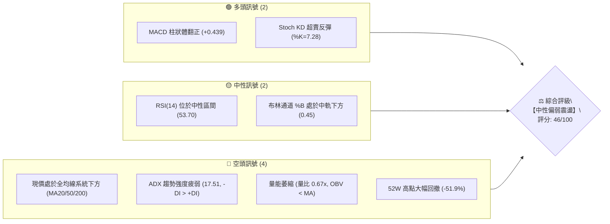
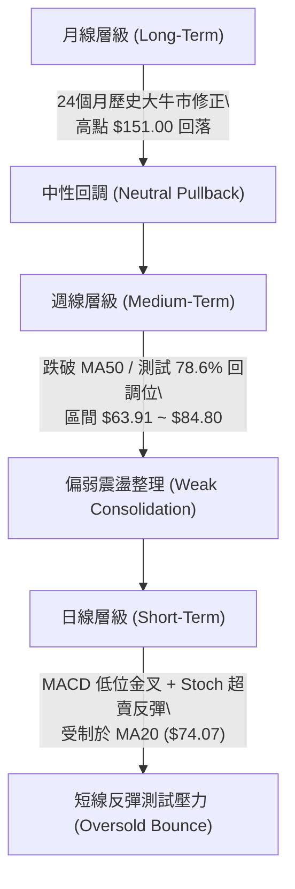
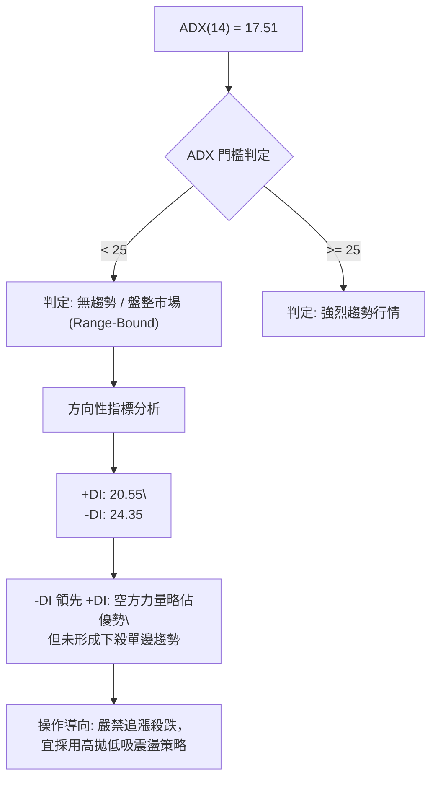
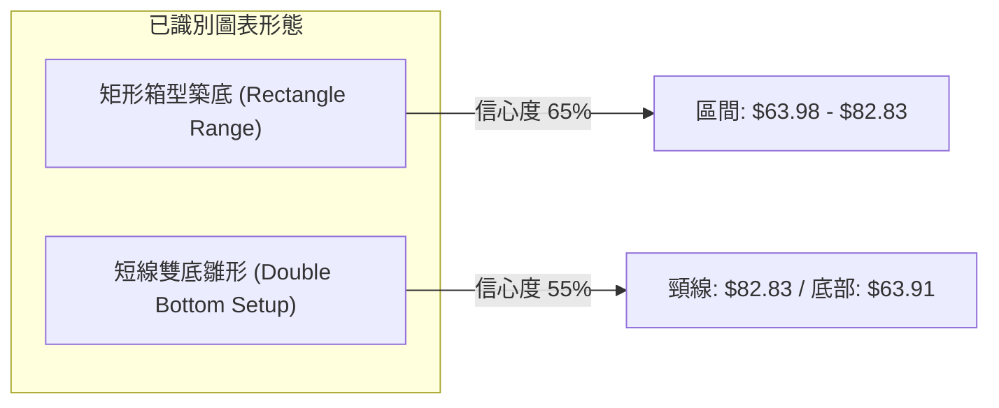
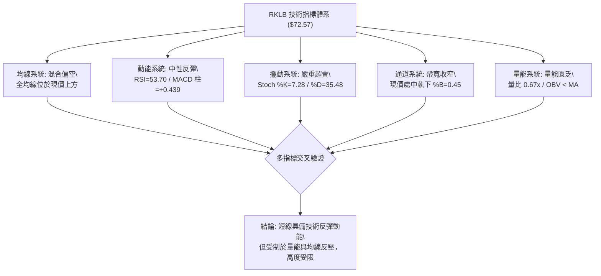
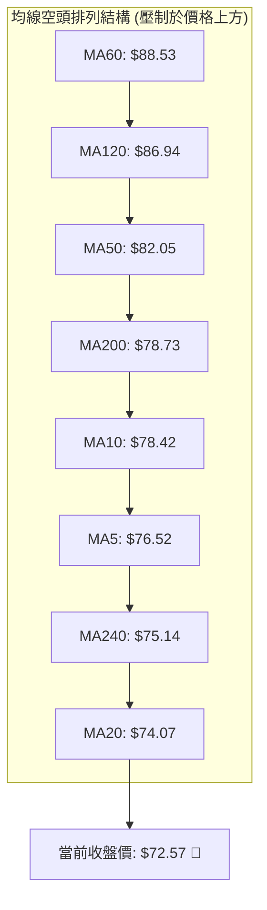
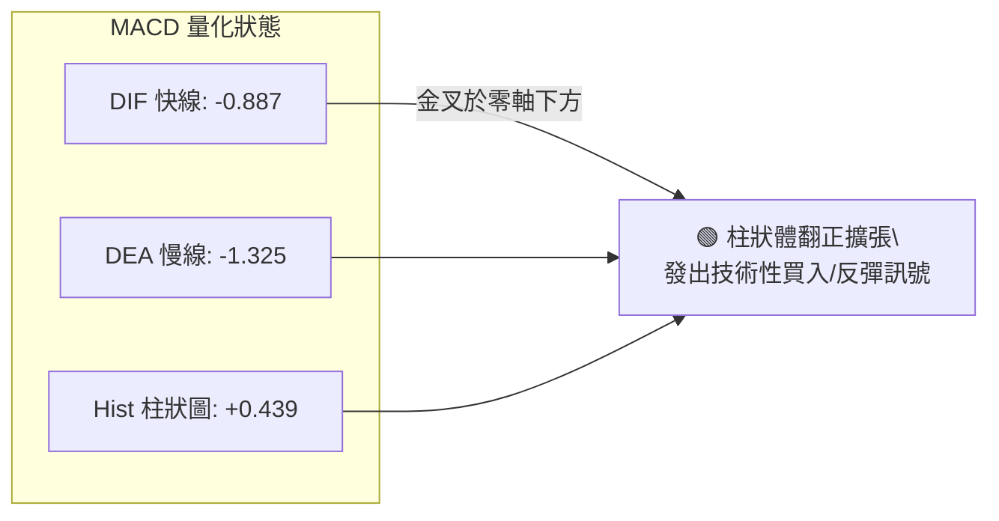
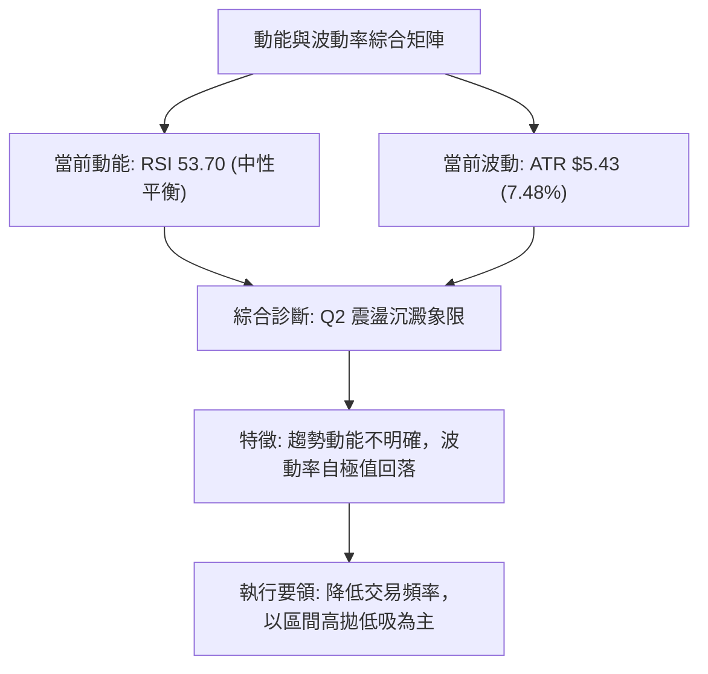
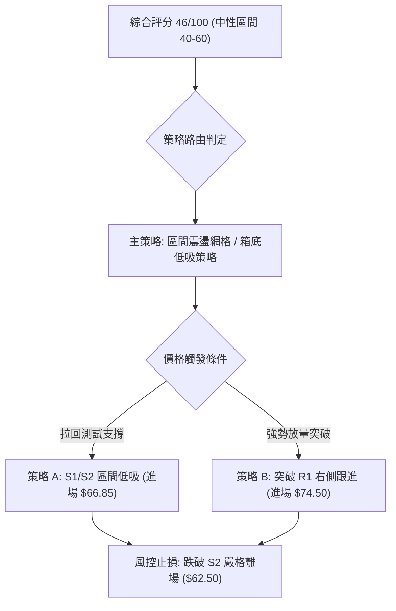
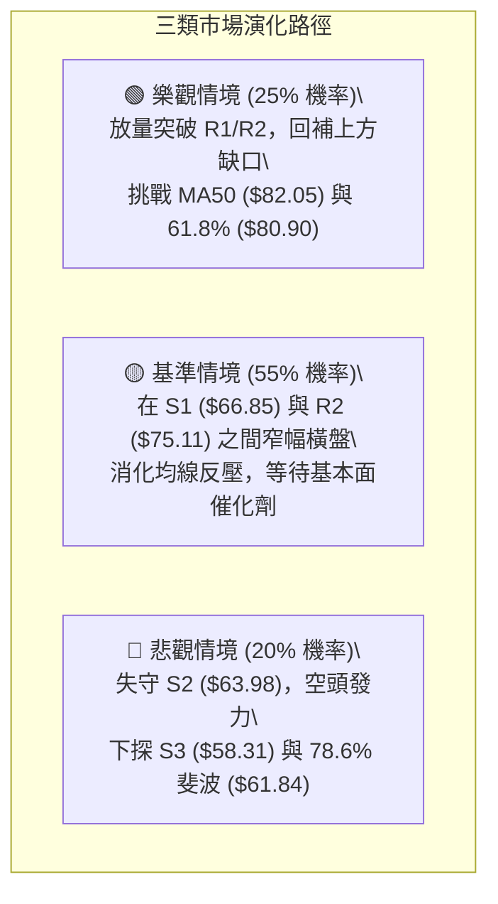

# RKLB 技術分析報告

> **報告日期**：2026-08-22 ｜ **語言**：繁體中文 ｜ **數據來源**：Yahoo Finance ｜ **當前價格**：$72.57

---

## 目錄

| 章節 | 內容 |
|------|------|
| [1. 技術面概覽](#1-技術面概覽) | 訊號儀表板、核心指標、評分卡 |
| [2. 趨勢分析](#2-趨勢分析) | 多時框趨勢、長中短期走勢、ADX 判定 |
| [3. 圖表形態分析](#3-圖表形態分析) | 形態識別、K線組合、目標價推算 |
| [4. 支撐與阻力](#4-支撐與阻力) | 關鍵價位、斐波那契回調結構 |
| [5. 技術指標深度解讀](#5-技術指標深度解讀) | MA/RSI/MACD/布林/量能分析 |
| [6. 動能與波動率](#6-動能與波動率) | 四象限評估、ATR、Beta 解讀 |
| [7. 多時框架總結](#7-多時框架總結) | 時框架評分矩陣與收斂結論 |
| [8. 交易策略建議](#8-交易策略建議) | 策略路由、階梯情境、風報比 |
| [9. 風險提示與監控](#9-風險提示與監控) | 監控清單、極端場景、風控提醒 |
| [📋 報告總結](#-報告總結) | 核心總結與交易機會矩陣 |

---

## 1. 技術面概覽

### 🎯 技術訊號儀表板



---

### 📊 核心指標速覽表

| 指標類別 | 指標名稱 | 當前數值 | 訊號 | 專業解讀 |
|:---|:---|:---|:---:|:---|
| **價格** | 當前收盤價 | $72.57 | 🟡 | 自歷史高點 $151.00 回落後，於 52 週區間 30.9% 位置尋求築底 |
| **均線** | MA20 (月線) | $74.07 | 🔴 | 現價位於 MA20 下方 -2.03%，短線承壓 |
| **均線** | MA50 (季線) | $82.05 | 🔴 | 現價落後 MA50 -11.55%，中期多空格局偏向空方 |
| **均線** | MA200 (年線) | $78.73 | 🔴 | 現價跌破長期牛熊分界線 -7.82%，長期趨勢處於修正結構 |
| **動能** | RSI(14) | 53.70 | 🟡 | 位於 50 軸線附近震盪，無明顯頂底背離，多空拉鋸 |
| **動能** | MACD (12,26,9)| -0.887 / Hist +0.439 | 🟢 | 快線低位向上穿越慢線形成金叉，柱狀體維持綠柱擴張 |
| **震盪** | Stoch %K / %D | 7.28 / 35.48 | 🟢 | 進入極度超賣區，短線具備技術性反彈動能 |
| **趨勢** | ADX (14) | 17.51 (-DI 24.35) | 🔴 | ADX < 25 處於無趨勢盤整，-DI > +DI 顯示空頭略佔優勢 |
| **波動** | ATR(14) | $5.43 (7.48%) | 🟡 | 每日平均波幅高達 7.48%，屬於高波動成長型標的 |
| **量能** | 20日成交量比 | 0.67x (OBV < MA) | 🔴 | 量能持續萎縮，反彈動能缺乏大額機構量能背書 |

---

### 🏆 技術評分卡

```
╔══════════════════════════════════════════════════════════════════╗
║                   技術評分卡 — RKLB (2026-08-22)                 ║
╠══════════════════════════════════════════════════════════════════╣
║ 趨勢強度 (Trend)     ████████░░░░░░░░░░░░  40/100 🔴 弱勢空頭    ║
║ 動能指標 (Momentum)  ███████████░░░░░░░░░  55/100 🟡 中性微多    ║
║ 支撐穩定度 (Support) ██████████░░░░░░░░░░  50/100 🟡 區間築底    ║
║ 成交量配合 (Volume)  ███████░░░░░░░░░░░░░  35/100 🔴 量能匱乏    ║
║ 形態完整度 (Pattern) █████████░░░░░░░░░░░  45/100 🟡 震盪整理    ║
║ 均線排列 (MA System) ████████░░░░░░░░░░░░  40/100 🔴 混合偏空    ║
╠══════════════════════════════════════════════════════════════════╣
║ 綜合技術評分         █████████░░░░░░░░░░░  46/100 🟡 中性偏弱    ║
║ 策略定調             區間震盪交易 / 等待突破方向確認            ║
╚══════════════════════════════════════════════════════════════════╝
```

---

## 2. 趨勢分析

### 🌐 多時框趨勢分析



---

### 📈 長期趨勢 — 12個月走勢圖（Unicode）

```
RKLB 月線歷史走勢圖（2025-09 至 2026-08）
價格 ($)
$150 ┤                                          ● (2026-05: $143.48 / 頂部 $151)
$140 ┤                                         ╱ ╲
$120 ┤                                        ╱   ╲
$100 ┤                                       ╱     ● (2026-06: $101.65)
 $80 ┤               ● (2026-01: $80.07)    ╱       ╲
 $70 ┤        ●     ╱ ╲                    ●         ●←【當前現價 $72.57】
 $60 ┤  ●    ╱ ╲   ╱   ● (2026-03: $64.22)╱           ╲
 $50 ┤ ╱ ╲  ╱   ● (2025-11: $42.14)      ╱             ● (2026-07: $64.95 低點)
 $40 ┤●   ●                               
     └──────────────────────────────────────────────────────────────────────────
      09  10  11  12  01  02  03  04  05  06  07  08 (月份: 2025-09 至 2026-08)
```

#### 走勢特徵分析表格
| 階段 | 時間跨度 | 價格區間 | 累積漲跌幅 | 走勢特徵與量價行為解讀 |
|:---|:---|:---:|:---:|:---|
| **主升浪擴張期** | 2025-12 ~ 2026-05 | $42.14 → $143.48 | +240.48% | 機構資金大舉推升，突破百元大關，創下 52 週歷史高點 $151.00 |
| **快速獲利了結** | 2026-05 ~ 2026-07 | $143.48 → $64.95 | -54.73% | 衝高後量能衰退，連續長黑回吐全部漲幅，跌破 61.8% 斐波那契位 |
| **底部築底修復** | 2026-07 ~ 2026-08 | $64.95 → $72.57 | +11.73% | 於 78.6% 斐波那契位（$61.84）上方獲支撐，於 $64~$82 區間震盪 |

---

### 📊 中期趨勢（週線分析）

```
中期週線結構示意圖 (近 12 週)
$84.80 ───┬──────────────────────────────────────────── [區間強阻力 / 61.8% 回調位 $80.90]
          │                 ┌──┐
          │                 │  │ (08-09 反彈高點 $82.83)
$75.00 ───┼─────────┌──┐────┴──┴───────┌──┐─────────── [密集均線帶 MA20/MA200]
          │         │  │               │  │ ← 現價 $72.57
$65.00 ───┼─┌──┐────┴──┴───────────────┴──┴─────────── [區間支撐 S1 $66.85]
          │ │  │ (07-26 低點 $63.91 / S2 $63.98)
$58.00 ───┴─┴──┴─────────────────────────────────────── [波段防守 S3 $58.31]
```

中期走勢顯示，RKLB 在經歷 5-6 月的大幅回調後，於 7 月底打出 $63.91 低點，隨後反彈至 $82.83 受阻，當前收在 $72.57。目前處於 $64.00 ~ $83.00 的寬幅箱型整理結構。

---

### ⚡ 趨勢強度評估（ADX 解讀）



| 指標變數 | 當前讀數 | 門檻區間 | 技術意義解讀 |
|:---|:---:|:---:|:---|
| **ADX (14)** | **17.51** | < 20 (極弱) | 單邊趨勢動能耗盡，市場進入籌碼沉澱與無方向整理期 |
| **+DI (14)** | **20.55** | 多方買盤 | 買盤動能處於修復階段，尚未突破基準水平（25） |
| **-DI (14)** | **24.35** | 空方賣盤 | 空方略高於多方，但未達 30 以上的強主導位，顯示拋壓減緩 |

---

## 3. 圖表形態分析

### 🔍 形態識別系統



#### 形態識別與信心度評估表
| 形態名稱 | 信心度 | 判斷依據（引用真實數據） | 完成度 | 目標價（精確計算） |
|:---|:---:|:---|:---:|:---|
| **矩形震盪箱體** | 65% | 價格在 S2（$63.98）與 08-09 高點（$82.83）之間來回震盪，ADX=17.51 確認無趨勢 | 75% | 箱體突破目標：$82.83 + ($82.83 - $63.98) = **$101.68** |
| **潛在雙底結構** | 55% | 07-26 低點 $63.91 與 08-02 低點 $64.95 形成雙腳測試，頸線位於 $82.83 | 50% | 頸線突破測幅：$82.83 + ($82.83 - $63.91) = **$101.75** |
| **均線死叉反壓** | 80% | MA5 ($76.52) < MA10 ($78.42) 且均低於 MA50 ($82.05)，屬於指標型空頭反壓 | 100% | 下方第一支撐測幅：S1 **$66.85** |

*註：除箱型與雙底雛形外，其餘幾何形態訊號不足，依規則不做過度主觀推演。*

---

### 🕯️ 重要K線形態分析

| 月份 / 週別 | 收盤價 | K線形態 | 量價關係 | 訊號解讀 |
|:---|:---:|:---|:---|:---:|
| **2026-05 (月線)** | $143.48 | 高位流星十字倒錘線 | 月度天量成交 | 🔴 頂部爆量滯漲，見頂反轉訊號 |
| **2026-07-26 (週線)**| $63.91 | 長下影錘頭線 (Hammer) | 量能 92.14M 萎縮 | 🟢 接觸 78.6% 斐波那契位出現強勁逢低承接買盤 |
| **2026-08-09 (週線)**| $82.83 | 中長陽線突破回馬槍 | 量能 96.69M 溫和放大 | 🟢 展開超跌技術性反彈，突破 MA20 |
| **2026-08-23 (週線)**| $72.57 | 回踩中黑線 (Pullback) | 量能 79.12M 持續萎縮 | 🟡 反彈遇阻於 MA50 回落，確認區間震盪本質 |

---

### 📉 ASCII 走勢形態示意圖

```
潛在雙底與箱型整理結構圖
$85 ┤                    [頸線 / 箱頂: $82.83]
    │                     ┌─────┐
$80 ┤                     │     │
    │        ┌─────┐      │     │      ┌─────┐
$75 ┤        │     │      │     │      │     │ ← 現價 $72.57
    │        │     │      │     │      │     │
$70 ┤        │     │      │     └──────┘     │
    │        │     └──────┘                  │
$65 ┤ ┌──────┘                               └── [箱底支撐 S1/S2: $66.85 / $63.98]
    │ │ (第一底: $63.91)   (第二底: $64.95)
$60 └─┴──────────────────────────────────────────────────────────────────
       2026-07-26          2026-08-02         2026-08-23 (現階段)
```

---

### 🎯 形態目標價計算

依據標準形態學原理推導：
1. **箱體突破向上計算**：
   - 箱頂壓力 = $82.83
   - 箱底支撐 = $63.98
   - 形態垂直高度 $H = \$82.83 - \$63.98 = \$18.85$
   - **向上突破目標價** $= \$82.83 + \$18.85 = \mathbf{\$101.68}$（恰好吻合 2026-06 收盤價 $101.65）

2. **箱體跌破向下計算**：
   - **向下破位目標價** $= \$63.98 - \$18.85 = \mathbf{\$45.13}$（逼近 2025-11 波段低點 $42.14）

---

## 4. 支撐與阻力

### 🗺️ 關鍵價位分布圖（Unicode）

```
RKLB 價位結構分布圖
═══════════════════════════════════════════════════════════════════
$151.00 ║████████████████████████████████████████║ 52週歷史高點 (0.0%)
$107.67 ║██████████████████████                  ║ 斐波那契 38.2% 壓力位
 $94.28 ║██████████████████                      ║ 斐波那契 50.0% 中樞強壓
 $88.22 ║████████████████                        ║ 布林通道上軌 / MA60 ($88.53)
 $82.05 ║██████████████                          ║ MA50 季線反壓 / 61.8% ($80.90)
 $78.90 ║████████████                            ║ 強阻力 R3 (MA200 $78.73 聚類)
 $75.11 ║████████                                ║ 阻力 R2 (MA240 $75.14)
 $73.97 ║████                                    ║ 關鍵阻力 R1 (MA20 $74.07 聚類)
 $72.57 ╠════════════════════════════════════════╣ ◄ 當前收盤價 $72.57
 $66.85 ║▓▓▓▓▓▓▓▓                                ║ 近期關鍵支撐 S1
 $63.98 ║▓▓▓▓▓▓▓▓▓▓▓▓                            ║ 強支撐 S2 (波段低點聚類)
 $61.84 ║▓▓▓▓▓▓▓▓▓▓▓▓▓▓▓▓                        ║ 斐波那契 78.6% 回調關鍵防守
 $58.31 ║▓▓▓▓▓▓▓▓▓▓▓▓▓▓▓▓▓▓▓▓                    ║ 強支撐 S3 (波段深層回撤位)
 $37.57 ║▓▓▓▓▓▓▓▓▓▓▓▓▓▓▓▓▓▓▓▓▓▓▓▓▓▓▓▓▓▓▓▓        ║ 52週歷史低點 (100.0%)
═══════════════════════════════════════════════════════════════════
```

---

### 🚧 阻力位分析表

| 阻力級別 | 精確價位 | 距現價幅幅 | 形成原因與技術共振 | 突破難度 | 重要性權重 |
|:---|:---:|:---:|:---|:---:|:---:|
| **R1** | **$73.97** | +1.93% | 近期日線波段高點聚類，與 MA20 ($74.07) 形成共振阻力區 | 中等 | 🟡 關鍵短期分水嶺 |
| **R2** | **$75.11** | +3.50% | MA240 長期均線 ($75.14) 與短線反彈頸線聚類 | 偏高 | 🟡 中期走強門檻 |
| **R3** | **$78.90** | +8.72% | MA200 牛熊分界線 ($78.73) 與斐波那契 61.8% ($80.90) 密集套牢區 | 極高 | 🔴 多頭趨勢重啟關鍵 |

---

### 🛡️ 支撐位分析表

| 支撐級別 | 精確價位 | 距現價幅幅 | 形成原因與技術共振 | 守住機率 | 重要性權重 |
|:---|:---:|:---:|:---|:---:|:---:|
| **S1** | **$66.85** | -7.88% | 近期拉回低點聚類，接近 1 個 ATR ($5.43) 波動保護區間 | 70% | 🟢 短線多頭防守點 |
| **S2** | **$63.98** | -11.83%| 7月下旬波段底部雙腳（$63.91-$64.95），箱型下軌強支撐 | 80% | 🟢 中期箱體底線 |
| **S3** | **$58.31** | -19.66%| 布林通道下軌 ($59.92) 與 78.6% 斐波那契 ($61.84) 下方防禦位 | 90% | 🟢 長期多頭最後堡壘 |

---

### 📐 斐波那契回調位分析

依據 52 週波段低點 $37.57 至 52 週歷史高點 $151.00 之標準黃金分割回調測算：

| 回調比例 | 斐波那契價位 | 狀態分析 | 技術意涵解讀 |
|:---|:---:|:---:|:---|
| **0.0% (高點)** | $151.00 | 上方極限 | 2026年5月歷史極值 |
| **23.6%** | $124.23 | 遠端阻力 | 強勢回調回撤位（已跌破） |
| **38.2%** | $107.67 | 中期阻力 | 弱勢反彈關鍵測幅位 |
| **50.0%** | $94.28 | 多空平衡 | 多空中樞分水嶺 |
| **61.8%** | $80.90 | 重要阻力 | 黃金分割強壓力位，與 R3/MA200 形成雙重共振 |
| **當前現價** | **$72.57** | **運行區間** | **處於 61.8% ($80.90) 與 78.6% ($61.84) 之間震盪築底** |
| **78.6%** | $61.84 | 強力支撐 | 深層黃金回調位，07-26 於 $63.91 獲得支撐，確認有效性 |
| **100.0% (低點)**| $37.57 | 底部原點 | 52週週期起漲點 |

---

## 5. 技術指標深度解讀

### 🎛️ 指標訊號總覽



---

### 📈 移動平均線排列分析



#### 均線數據偏離度與趨勢診斷
| 均線名稱 | 數值 | 現價偏離幅度 | 走勢特徵 | 技術含義 |
|:---|:---:|:---:|:---|:---|
| **MA 5** | $76.52 | -5.16% | 短線下彎 | 短線下行壓力仍在，第一道動態阻力 |
| **MA 10** | $78.42 | -7.46% | 快速下行 | 與 MA200 形成死叉反壓區 |
| **MA 20** | $74.07 | -2.03% | 走平打底 | 月線走平，即將面臨多空方向抉擇 |
| **MA 50** | $82.05 | -11.55% | 明顯下行 | 中期生命線反壓，反彈主要阻力位 |
| **MA 60** | $88.53 | -18.02% | 下行發散 | 季線阻力沉重 |
| **MA 200**| $78.73 | -7.82% | 走平微下 | 長期牛熊線跌破，中長線轉入修正期 |
| **MA 240**| $75.14 | -3.43% | 向上延伸 | 超長期支撐線，現價於此處附近反覆拉鋸 |

---

### 📉 RSI(14) 分析

- **當前讀數**：**53.70**
- **區間進度條**：
  ```
  超賣 (0) ────── 中軸 (50) ────── 超買 (100)
  [█████████████████████░░░░░░░░░░░░░░░░░░░░] 53.70% (中性平衡區)
  ```
- **背離判斷**：
  - 價格在 07-26 創低 $63.91，RSI 為 15.6（極度超賣）。
  - 價格在 08-02 於 $64.95 築底，RSI 回升至 36.5。
  - 目前價格回調至 $72.57，RSI 保持在 53.70，**無頂背離現象**，呈現超跌修復後的健康中性狀態。

---

### 📊 MACD(12/26/9) 訊號解讀



- **訊號解析**：DIF 向上突破 DEA 形成「零下金叉」，柱狀圖維持為正（+0.439）。這通常預示著一段超跌反彈行情的延續，但由於雙線均在零軸下方運行，屬於**弱勢市場中的反彈行情**而非強勢單邊主升浪。

---

### 📦 布林通道分析

```
ASCII 布林通道位置示意圖 (寬度帶 $59.92 ~ $88.22)
$88.22 ┬────────────────────────────────────────── [BB 上軌]
       │
$80.00 ┤
       │
$74.07 ┼────────────────────────────────────────── [BB 中軌 / MA20]
       │  ★ 現價 $72.57 (%B = 0.45)
$70.00 ┤
       │
$59.92 ┴────────────────────────────────────────── [BB 下軌]
```

- **帶寬特徵**：通道帶寬收窄，表示自 5-6 月的極端波動後，市場波動率正顯著冷卻。
- **%B 指標**：當前 %B 為 **0.45**，位於中軌（$74.07）略下方，屬於正常震盪區間，未觸及下軌超賣區（<0.2）或上軌超買區（>0.8）。

---

### 💹 成交量分析（量價配合度）

- **最新成交量**：12,510,900 股
- **20日均量**：18,673,980 股（**量比 0.67x**，量能顯著萎縮 -33%）
- **OBV 趨勢**：**OBV < MA**，能量潮指標持續低於其移動平均線。
- **量價診斷**：
  - 縮量回調（從 08-09 的 $82.83 縮量回落至 $72.57），顯示市場**主動性拋壓減弱**。
  - 但缺乏增量買盤介入，顯示大額主力資金仍在觀望，價格突破上方壓力需要補量確認。

---

## 6. 動能與波動率

### ⚡ 動能評估

| 象限 | 動能維度 (Momentum) | 波動維度 (Volatility) | 當前狀態 | 策略指導意義 |
|:---|:---:|:---:|:---:|:---|
| **Q1 (最佳順勢)** | 強 (>60) | 低 (<5%) | — | 主升浪買入持有 |
| **Q2 (震盪沉澱)** | **弱 (53.7)** | **中低 (ATR 7.48%)**| **✓ 當前所處位置** | **區間操作 / 謹慎觀望 / 嚴格止損** |
| **Q3 (高危博弈)** | 強 (>70) | 高 (>10%) | — | 突破追價，嚴控滑點 |
| **Q4 (非理性出逃)**| 弱 (<30) | 高 (>10%) | — | 恐慌殺跌，不可盲目摸底 |



---

### 📊 ATR 波動率分析

- **ATR(14) 數值**：**$5.43**（佔當前股價 **7.48%**）
- **止損與風控距離設定建議**：
  - **短線交易止損距離（1.0 × ATR）**：$\$72.57 - \$5.43 = \mathbf{\$67.14}$（剛好位於支撐位 S1 $66.85 上方）
  - **波段交易止損距離（1.5 × ATR）**：$\$72.57 - 1.5 \times \$5.43 = \mathbf{\$64.42}$（精確保護於強支撐 S2 $63.98 之上）

---

### 📐 Beta 與市場相關性

- **Beta 係數**：**2.629**
- **市場特徵解讀**：
  - RKLB 具有極高的高 Beta 屬性，其波動幅度為標普500指數的 **2.63 倍**。
  - 當大盤回調 1% 時，該股平均下挫 2.63%；反之大盤走強時彈性亦極大。
  - 機構持股佔比達 **61.5%**，空頭部位比例（Short % of Float）為 **7.7%**（空頭回補天數 2.31 天），具備潛在的中度軋空動能。

---

## 7. 多時框架總結

### 📋 時框架評分表

| 時框架 | 趨勢方向 | 動能狀態 | 均線排列 | 形態結構 | 綜合評分 | 操作建議 |
|:---|:---:|:---:|:---:|:---:|:---:|:---|
| **長期 (月線)** | 🟡 中性整理 | 50 (平衡) | 偏多 (處年線上方) | 大幅拉回築底 | **52/100** | 核心長線部位逢低分批建倉 |
| **中期 (週線)** | 🔴 空頭承壓 | 45 (轉弱) | 空頭排列 (破MA50) | 寬幅箱型整理 | **44/100** | 區間操作，未突破箱頂前不重倉 |
| **短期 (日線)** | 🟡 超跌反彈 | 55 (反彈) | 混合排列 (MA20承壓)| 雙底反彈回踩 | **48/100** | 依據布林通道與近端支撐波段操作 |

---

### 🔲 綜合訊號矩陣

```
時框訊號收斂一致性檢驗：
╔═════════════════╦══════════════╦══════════════╦══════════════╗
║ 指標類別        ║ 長期 (月線)  ║ 中期 (週線)  ║ 短期 (日線)  ║
╠═════════════════╬══════════════╬══════════════╬══════════════╣
║ 趨勢方向        ║ 🟡 中性      ║ 🔴 偏空      ║ 🟡 震盪      ║
║ MACD            ║ 🟢 零上金叉  ║ 🔴 柱狀微正  ║ 🟢 零下金叉  ║
║ RSI(14)         ║ 🟡 53.7      ║ 🟡 53.7      ║ 🟡 53.7      ║
║ 均線關係        ║ 🟢 守住長均  ║ 🔴 跌破MA50  ║ 🔴 承壓MA20  ║
║ 成交量能        ║ 🔴 萎縮      ║ 🔴 萎縮      ║ 🔴 萎縮      ║
╚═════════════════╩══════════════╩══════════════╩══════════════╝
```

---

### ⚖️ 多時框收斂結論

依據多時框收斂規則（規則 14）：
1. **行情類型判斷**：ADX(14) = **17.51 (< 25)**，定性為標準的**【盤整震盪行情】**。
2. **主導時框收斂**：在盤整行情下，單邊趨勢無效，市場以**日線與週線的震盪區間（布林通道上下軌 $59.92 ~ $88.22 及關鍵高低點 $63.98 ~ $82.83）**為主導交易架構。
3. **唯一方向性結論**：**【中性觀望／區間震盪操作】**。日線的短線反彈受制於 MA20 ($74.07) 與 MA50 ($82.05)，下方受 S1 ($66.85) 與 S2 ($63.98) 支撐，本階段不宜進行單邊突破重倉交易。

---

## 8. 交易策略建議

### 🗺️ 策略決策流程圖



---

### 🧭 策略路由

> **當前主策略方向 = 【中性區間震盪交易（以布林通道與近端支撐 S1/S2 為主，等待放量突破確認）】（依評分 46/100）**

---

### 🎯 價格情境階梯（Price Scenarios）

價位完全嚴格引用數據庫中計算之真實關鍵價位：

| 觸發條件 | 第一目標 | 第二延伸目標 | 技術情境解讀與含義 |
|:---|:---:|:---:|:---|
| **向上突破 R1 ($73.97)** | **R2 ($75.11)** | **R3 ($78.90)** | 短線轉強，站上月線 MA20，挑戰 MA200 牛熊分界線 |
| **放量突破 R3 ($78.90)** | **MA50 ($82.05)**| **斐波 50% ($94.28)**| 中期多頭反轉確認，雙底形態完成，開啟波段上攻 |
| **維持現價區間震盪** | **$66.85 ~ $75.11** | — | 籌碼消化與指標修復，在布林中軌下方窄幅蓄勢 |
| **向下跌破 S1 ($66.85)** | **S2 ($63.98)** | **斐波 78.6% ($61.84)**| 短線轉弱，再度測試 7 月底波段雙底底部支撐區 |
| **有效跌破 S2 ($63.98)** | **S3 ($58.31)** | **52W低點 ($37.57)** | 箱體結構破位，空頭趨勢重啟，必須全面停損避險 |

---

### 📊 情境機率分佈

| 預測情境 | 機率 | 主要技術依據 |
|:---|:---:|:---|
| **區間寬幅震盪 (Consolidation)** | **55%** | ADX=17.51 顯示無單邊趨勢；布林帶寬收窄；量比僅 0.67x 缺乏大資金推動力 |
| **超跌反彈向上 (Bullish Bounce)**| **25%** | MACD 柱狀體翻正擴張 (+0.439)；Stoch KD 出現超賣鈍化反彈訊號 |
| **破位再探深底 (Bearish Breakdown)**| **20%** | 全均線系統壓制於現價上方；-DI (24.35) 仍微幅壓制 +DI (20.55) |

---

### 🟢 主策略詳情（區間震盪主策略）

| 策略要素 | 策略 A（左側支撐低吸 — 推薦） | 策略 B（右側突破跟進） |
|:---|:---|:---|
| **策略類型** | 支撐位回踩承接 | 關鍵阻力放量突破 |
| **進場條件** | 價格拉回 S1 附近獲得 K 線企穩確認 | 日線實體收盤放量突破 R1 ($73.97) |
| **進場價格** | **$66.85** | **$74.50** |
| **目標價 T1** | **$75.11** (阻力 R2 / +12.36%) | **$78.90** (阻力 R3 / +5.91%) |
| **目標價 T2** | **$80.90** (斐波 61.8% / +21.02%) | **$82.83** (箱體頸線 / +11.18%) |
| **止損價格** | **$62.50** (跌破 S2 $63.98 / -6.51%)| **$71.00** (跌破 MA20 反轉 / -4.70%)|
| **風險報酬比** | **1 : 3.23** (以 T2 計) | **1 : 2.38** (以 T2 計) |
| **預估勝率** | 60% | 52% |
| **建議倉位** | **10% ~ 15%** (輕倉試單) | **10%** (突破加碼) |

---

### 🔴 反向風險觸發點（對沖與風控提示）

若發生以下事件，多頭與區間操作邏輯即刻失效，應無條件執行風險對沖或停損：
1. **破位止損訊號**：日線收盤價**實體跌破 S2 ($63.98)**，意味著雙底築底失敗，應全數平倉觀望。
2. **量能異動預警**：若下下跌伴隨成交量放大至 2,500 萬股以上（大於 50 日均量），觸發主動減倉。
3. **均線空頭加速**：MA5 快速下穿 MA20 形成二次死叉下壓。

---

### ⭐ 整體訊號強度評星

```
做多訊號強度：★★☆☆☆  (2.5/5 星 - 僅具短線超跌反彈動能)
做空訊號強度：★★★☆☆  (3.0/5 星 - 均線偏空但下行遭逢強支撐)
整體可信度：  ★★★☆☆  (3.5/5 星 - 震盪市數據高度一致)
```

---

## 9. 風險提示與監控

### ✅ 關鍵監控指標 Checklist

```
╔══════════════════════════════════════════════════════════════════╗
║                   RKLB 每日盤後關鍵監控清單                      ║
╠══════════════════════════════════════════════════════════════════╣
║ [ ] 價格是否成功站穩 MA20 ($74.07) 與 R1 ($73.97)                ║
║ [ ] 日成交量是否回升至 20 日均量 (18.67M) 以上 (補量突破)        ║
║ [ ] RSI(14) 是否能維持在 50 中軸上方運行                         ║
║ [ ] MACD 柱狀體是否持續擴張 (若翻紅即刻警惕)                     ║
║ [ ] ADX(14) 是否由 17.51 向上揚升並突破 25 (確認趨勢發動)         ║
║ [ ] 關鍵防守位 S1 ($66.85) 與 S2 ($63.98) 是否完好無損          ║
╚══════════════════════════════════════════════════════════════════╝
```

---

### ⚠️ 風險場景分析



---

### 🛡️ 風險管理重要提醒

1. **高 Beta 波動控制**：
   - RKLB 的 Beta 高達 **2.629**，且 ATR 達 **7.48%**。在持倉部位管理上，單一個股最大虧損不得超過總資產的 **1.0%**。
   - 單筆交易倉位嚴格控制在 **10% ~ 15%** 以內，嚴禁在無趨勢的震盪期（ADX < 25）使用融資或槓桿。
2. **財報與估值溢價風險**：
   - 當前 P/S 達 **60.33**，Forward P/E 高達 **1451.4**，營業利益率為 **-24.6%**，自由現金流為負（-$251.96M）。超高估值意味著股價極易受到市場宏觀流動性與風險偏好的劇烈衝擊。
3. **機構籌碼動態**：
   - 儘管機構分析師共識目標價平均值達 **$112.94**（評級為 Buy），但近一個月最低目標價亦有 **$64.00**，顯示市場對短期航太發射進度與商業化放量存在分歧，切忌盲目因目標價而忽視技術停損點。

---

## 📋 報告總結

```
╔══════════════════════════════════════════════════════════════════╗
║                   RKLB 技術分析報告核心總結                      ║
╠══════════════════════════════════════════════════════════════════╣
║ 報告日期：2026-08-22                                             ║
║ 當前價格：$72.57                                                 ║
║ 技術評級：⚖️ 中性震盪築底 (評分: 46 / 100)                      ║
║                                                                  ║
║ 關鍵結論：                                                       ║
║ ├─ 長期趨勢：🟡 中性回調（守在 78.6% 斐波那契位 $61.84 上方）    ║
║ ├─ 中期趨勢：🔴 弱勢箱型（受制於 MA50 $82.05 與 MA200 $78.73）   ║
║ ├─ 短期趨勢：🟢 超跌反彈（MACD 零下金叉，柱狀體 +0.439）         ║
║ ├─ 關鍵支撐：S1 $66.85 │ S2 $63.98 │ S3 $58.31                  ║
║ ├─ 關鍵阻力：R1 $73.97 │ R2 $75.11 │ R3 $78.90                  ║
║ └─ 分析師共識：Buy (17位分析師，平均目標價 $112.94)              ║
║                                                                  ║
║ 最優策略組合：                                                   ║
║ 1. 🥇 最佳機會：回踩支撐 S1 ($66.85) 輕倉佈局，博弈反彈至 R2/R3  ║
║ 2. 🥈 次選機會：突破 R1 ($73.97) 且站穩 MA20 後右側小幅跟進      ║
║ 3. 🥉 保守選擇：空倉觀望，等待價格放量站上 MA200 ($78.73) 確認   ║
╚══════════════════════════════════════════════════════════════════╝
```

---

> ⚠️ **免責聲明**：本報告為技術分析研究成果，所有數據、圖表及價位推算均嚴格基於歷史量價數據模型。本報告**僅供研究與學術參考**，**不構成任何形式的要約或投資建議**。金融市場瞬息萬變，投資人應獨立評估自身風險承受能力並自負盈虧。

---

*報告生成時間：2026-08-22 ｜ 數據來源：Yahoo Finance ｜ 分析框架：多時框架量化技術分析體系*