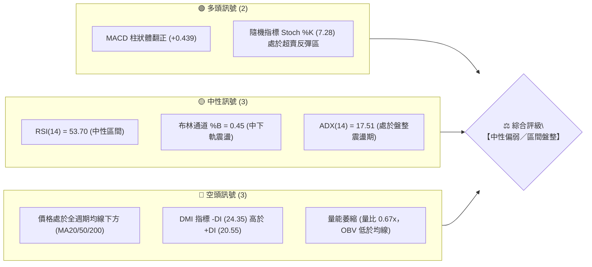
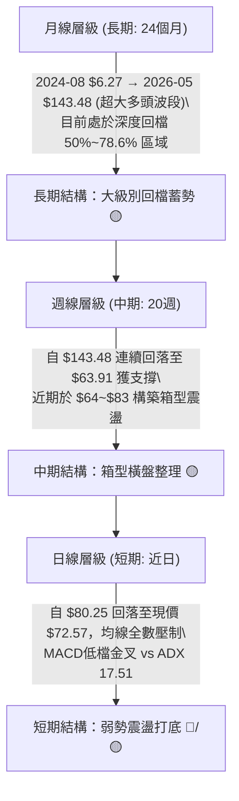
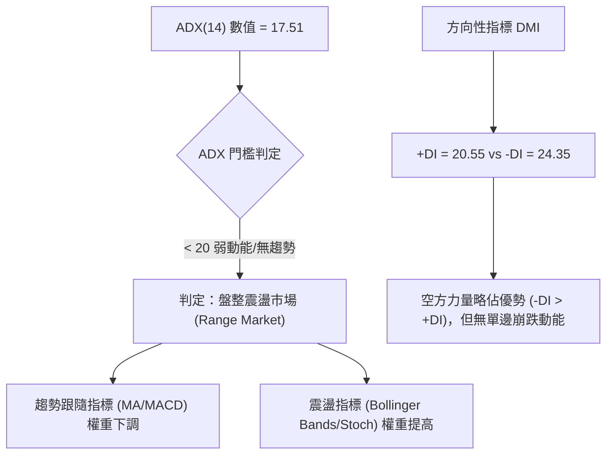
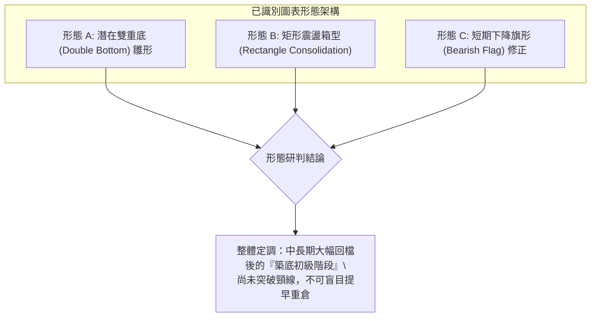
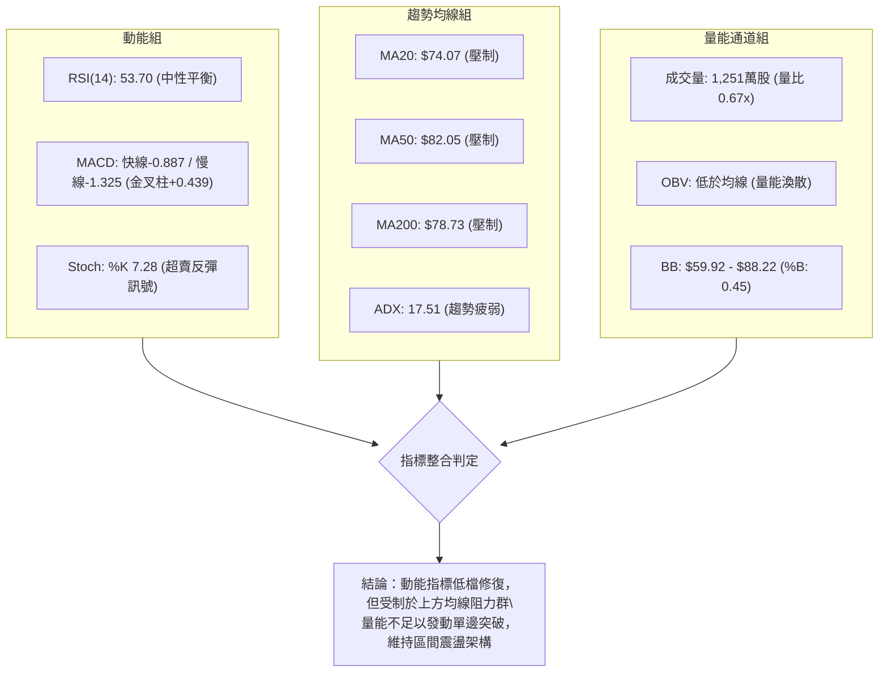
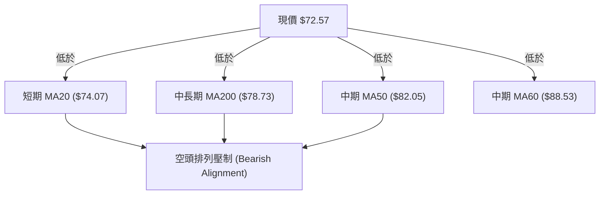
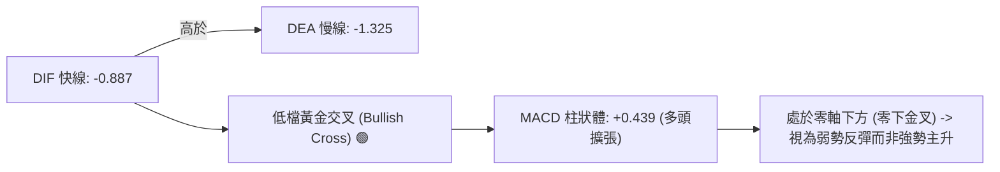
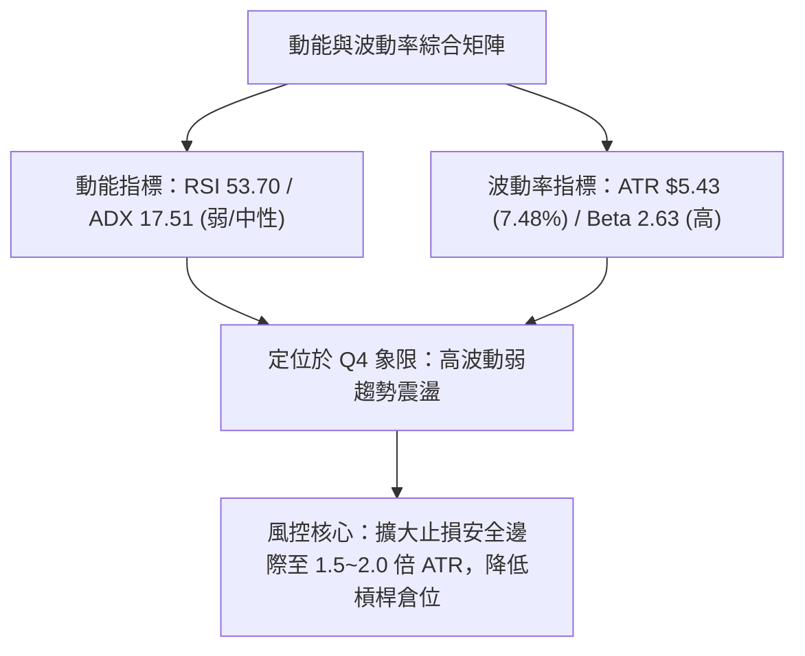
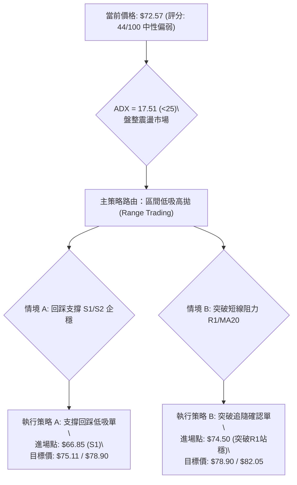
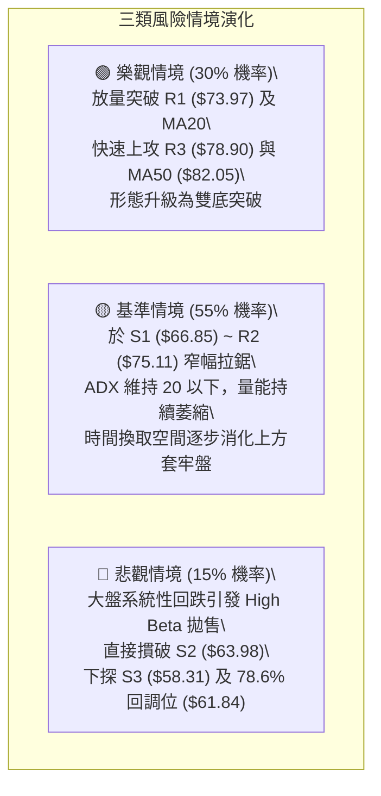

# RKLB 技術分析報告

> **報告日期**：2026-08-23 ｜ **語言**：繁體中文 ｜ **數據來源**：Yahoo Finance ｜ **當前價格**：$72.57

---

## 目錄

| 章節 | 內容 |
|------|------|
| [1. 技術面概覽](#1-技術面概覽) | 訊號儀表板、核心指標、評分卡 |
| [2. 趨勢分析](#2-趨勢分析) | 多時框趨勢、長中短期走勢 |
| [3. 圖表形態分析](#3-圖表形態分析) | 形態識別、K線組合、目標價 |
| [4. 支撐與阻力](#4-支撐與阻力) | 關鍵價位、斐波那契回調 |
| [5. 技術指標深度解讀](#5-技術指標深度解讀) | MA/RSI/MACD/布林/成交量 |
| [6. 動能與波動率](#6-動能與波動率) | 動能評估、ATR、Beta |
| [7. 多時框架總結](#7-多時框架總結) | 時框架評分矩陣 |
| [8. 交易策略建議](#8-交易策略建議) | 多空策略、風險報酬比 |
| [9. 風險提示與監控](#9-風險提示與監控) | 監控指標、風險場景 |
| [10. 報告總結](#-報告總結) | 關鍵結論與最優策略組合 |

---

## 1. 技術面概覽

### 🎯 技術訊號儀表板



---

### 📊 核心指標速覽表

| 指標類別 | 指標名稱 | 當前數值 | 訊號 | 解讀 |
|:---|:---|:---|:---:|:---|
| **價格** | 當前收盤價 | $72.57 | 🟡 | 位於52週區間 30.9% 位置，自高點回落後處於低檔震盪 |
| **均線** | MA20 (月線) | $74.07 | 🔴 | 價格低於 MA20 (-2.03%)，短線面臨動態壓制 |
| **均線** | MA50 (季線) | $82.05 | 🔴 | 價格低於 MA50 (-11.55%)，中期多頭架構受損 |
| **均線** | MA200 (年線) | $78.73 | 🔴 | 價格低於 MA200 (-7.82%)，跌破長期牛熊分界線 |
| **動能** | RSI(14) | 53.70 | 🟡 | 位於 30–70 中性常態區間，無極端超買或超賣 |
| **動能** | MACD (12,26,9) | -0.887 / -1.325 | 🟢 | 快線位於慢線上方，柱狀體 +0.439，低檔金叉修復中 |
| **動能** | Stoch %K / %D | 7.28 / 35.48 | 🟢 | %K 進入極度超賣區，短線具備技術性反彈動能 |
| **趨勢** | ADX (14) | 17.51 | 🟡 | ADX < 25 表明趨勢動能微弱，當前為無方向盤整行情 |
| **通道** | 布林通道 | $59.92–$88.22 | 🟡 | 現價處於中軌 ($74.07) 下方，帶寬收斂中 (%B: 0.45) |
| **量能** | 20日成交量比 | 0.67x | 🔴 | 量能降至 1,251 萬股 (20日均量 1,867 萬股)，追價意願不足 |
| **波動** | ATR(14) | $5.43 (7.48%) | 🔴 | 單日波幅較大，持倉需嚴格控制風險暴露 |

---

### 🏆 技術評分卡

```
╔══════════════════════════════════════════════════════════════╗
║              技術評分卡 — RKLB (2026-08-23)                  ║
╠══════════════════════════════════════════════════════════════╣
║ 趨勢強度 (ADX/DMI)  ██████░░░░░░░░░░░░░░  32/100  🔴 空方主導 ║
║ 動能指標 (RSI/MACD) ██████████░░░░░░░░░░  52/100  🟡 中性修復 ║
║ 支撐穩定度 (S1-S3)  ████████████░░░░░░░░  60/100  🟡 區間守穩 ║
║ 成交量配合 (OBV/VOL)████░░░░░░░░░░░░░░░░  24/100  🔴 量能渙散 ║
║ 形態結構 (Pattern)  ██████████░░░░░░░░░░  50/100  🟡 築底雛形 ║
║ 均線排列 (MA System)██████░░░░░░░░░░░░░░  30/100  🔴 空頭排列 ║
╠══════════════════════════════════════════════════════════════╣
║ 綜合技術評分        █████████░░░░░░░░░░░  44/100  🟡 中性偏弱 ║
║ 核心評級結論：【區間盤整／築底待變，以區間震盪策略為主】    ║
╚══════════════════════════════════════════════════════════════╝
```

---

## 2. 趨勢分析

### 🌐 多時框趨勢分析



---

### 📈 長期趨勢 — 12個月走勢圖（Unicode）

```
RKLB 月線收盤走勢圖（2025-09 至 2026-08）
價格軸 ($)
$150 ┤                                      
$140 ┤                             ● (2026-05 $143.48 波段峰頂)
$120 ┤                                      
$100 ┤                                  ● (2026-06 $101.65)
$80  ┤                   ● (2026-01 $80.07) ● (2026-04 $82.51)
$70  ┤             ● (2025-12 $69.76)         ▲現價 ($72.57)
$60  ┤       ● (2025-10 $62.98)             ● (2026-07 $64.95)
$45  ┤ ● (2025-09 $47.91) ● (2025-11 $42.14)
     └──────────────────────────────────────────────────────────
       09    10    11    12    01    02    03    04    05    06    07    08 (月份)
```

#### 📊 走勢特徵階段分析

| 階段 | 時間區間 | 起止價格 | 漲跌幅 | 主要形態與驅動特徵 |
|:---|:---:|:---:|:---:|:---|
| **一、加速主升段** | 2025-09 ~ 2026-01 | $47.91 → $80.07 | +67.13% | 突破底部巨量拉升，奠定大型上升通道起點 |
| **二、中期洗盤段** | 2026-02 ~ 2026-03 | $69.10 → $64.22 | -19.79% | 縮量拉回確認支撐，清洗獲利浮籌 |
| **三、主升浪頂峰** | 2026-04 ~ 2026-05 | $82.51 → $143.48 | +73.89% | 歷史天量爆發，月線收出翻倍大陽線創下 $151.00 歷史高點 |
| **四、深度修正段** | 2026-06 ~ 2026-07 | $101.65 → $64.95 | -54.73% | 獲利盤集中了結，急跌回測 52 週低點至高點之 78.6% 斐波那契位 |
| **五、底部盤整段** | 2026-08 至今 | $64.95 → $72.57 | +11.73% | 拋壓減弱，價格於 S1/S2 與 R1/R2 之間收斂築底 |

---

### 📊 中期趨勢（週線分析）

中期走勢自 2026-05-31 見頂 $143.48 後，經歷了連續 8 週的單邊下挫，於 2026-07-26 觸及波段低點 $63.91 後止跌。隨後於 2026-08-09 反彈至 $82.83，受制於 MA50 ($82.05) 與斐波那契 61.8% ($80.90) 雙重阻力，目前回落至 $72.57。

```
中期壓力與支撐通道示意：
$88.22 ═══════════════════════════════════════ [布林通道上軌 / 強壓力]
$82.05 ─────────────────────────────────────── [MA50 / 8月反彈高點壓力區]
$74.07 - - - - - - - - - - - - - - - - - - - - [MA20 / 中軌分水嶺]
$72.57 ◄──── [現價位置：處於中軌下方弱勢整理]
$63.98 ─────────────────────────────────────── [近期雙底支撐 S2 / 7月低點]
$59.92 ═══════════════════════════════════════ [布林通道下軌 / 極限支撐]
```

---

### ⚡ 趨勢強度評估（ADX 解讀）



| 指標變數 | 當前讀數 | 門檻區間 | 強度評級 | 交易指引 |
|:---|:---:|:---:|:---:|:---|
| **ADX(14)** | **17.51** | < 25 (弱趨勢) | ░░░░░░░░░░ 17.5% | 禁止使用順勢突破策略；嚴格執行箱型高拋低吸 |
| **+DI** | **20.55** | 多方買盤 | ▓▓▓▓░░░░░░ 20.6% | 多頭推升力道匱乏，反彈缺乏持續性買盤 |
| **-DI** | **24.35** | 空方賣壓 | ▓▓▓▓▓░░░░░ 24.4% | 空方雖主導但未形成恐慌性拋售 (數值未破 35) |

---

## 3. 圖表形態分析

### 🔍 形態識別系統



#### 📐 形態信心度與目標價計算表

| 形態名稱 | 信心度 | 完成度 | 判斷依據（引用數據） | 頸線／關鍵突破點 | 形態理論目標價（附計算式） |
|:---|:---:|:---:|:---|:---:|:---|
| **潛在雙重底** | **62%** | 65% | 第一次低點 2026-07-26 收盤 $63.91；第二次低點為 S2 支撐聚類 $63.98。中間反彈高點為 2026-08-09 之 $82.83 | 頸線位：$82.83 | 形態高度 = $82.83 - $63.91 = $18.92<br>突破目標價 = $82.83 + $18.92 = **$101.75** |
| **矩形震盪箱型** | **78%** | 80% | 箱頂受阻於 MA50 ($82.05) 與 R3 ($78.90)，箱底支撐聚類於 S2 ($63.98) 與 S1 ($66.85) | 箱頂：$82.05 | 箱體高度 = $82.05 - $63.98 = $18.07<br>向上破位目標 = $82.05 + $18.07 = **$100.12**<br>向下破位目標 = $63.98 - $18.07 = **$45.91** |
| **指標型布林收斂** | **85%** | 90% | ADX 17.51 配合布林帶寬度收縮，價格收在 %B 0.45，無幾何大趨勢 | 中軌：$74.07 | 上軌目標價：**$88.22**<br>下軌支撐價：**$59.92** |

---

### 🕯️ 重要 K 線形態分析

| 週/月週期 | 收盤價 | K 線形態 | 量能配合 | 技術解讀與訊號 |
|:---|:---:|:---|:---:|:---|
| **2026-05 (月線)** | $143.48 | 長上影大陽線 (Blow-off Top) | 歷史天量 | 多頭動能耗盡，頂部獲利了結訊號 🔴 |
| **2026-07-26 (週線)** | $63.91 | 探底長下影錘頭線 (Hammer) | 9,214 萬股 (縮量) | 賣壓竭盡，確認 S2 ($63.98) 具強烈買盤支撐 🟢 |
| **2026-08-09 (週線)** | $82.83 | 長實體反彈大陽線 (Bullish Thrust) | 9,669 萬股 (微幅放量) | 確立自底部反彈格局，挑戰 MA50 壓力 🟢 |
| **2026-08-23 (最新週)** | $72.57 | 回踩整理小陰線 (Pullback Candle) | 7,912 萬股 (量縮) | 縮量回踩 MA20 附近，多空進入觀望平衡 🟡 |

---

### 📉 ASCII 走勢形態示意圖

```
RKLB 近期週線雙底打底示意圖
$82.83 ────────────● (反彈高點 / 雙底頸線) ────────────────────────
                   / \
                  /   \     現價 $72.57
                 /     \       ▼
$74.07 - - - - -/ - - - \ - - -● - - - - - - (MA20 / 中軌分水嶺)
               /         \     /
              /           \   /
$63.91 ──────●             ●─/ (第二底 S2: $63.98)
         (第一底: 7/26)
```

---

## 4. 支撐與阻力

### 🗺️ 關鍵價位分布圖（Unicode）

```
╔═════════════════════════════════════════════════════════════════════╗
║                      RKLB 價位結構分布圖                            ║
╠═════════════════════════════════════════════════════════════════════╣
║ $88.22 ║██████████████████████████████║ 布林通道上軌 / 強阻力帶     ║
║ $82.05 ║████████████████████████      ║ MA50 季線阻力 / 雙底頸線     ║
║ $80.90 ║██████████████████████        ║ 斐波那契 61.8% 黃金分割阻力  ║
║ $78.90 ║████████████████              ║ 阻力位 R3 (近一年波段聚類)  ║
║ $75.11 ║████████████                  ║ 阻力位 R2 (短線回跌防守線)  ║
║ $73.97 ║████████                      ║ 阻力位 R1 (近端反壓 / MA20) ║
║ ───────╫──────────────────────────────╫───────────────────────────── ║
║ $72.57 ╠══════════════════════════════╣ ◄ 現價位置 (Current Price)  ║
║ ───────╫──────────────────────────────╫───────────────────────────── ║
║ $66.85 ║▓▓▓▓▓▓▓▓▓▓▓▓                  ║ 支撐位 S1 (近一年回踩平台)  ║
║ $63.98 ║▓▓▓▓▓▓▓▓▓▓▓▓▓▓▓▓▓▓▓▓          ║ 支撐位 S2 (波段雙底強支撐)  ║
║ $61.84 ║▓▓▓▓▓▓▓▓▓▓▓▓▓▓▓▓▓▓▓▓▓▓        ║ 斐波那契 78.6% 回調關鍵支撐 ║
║ $59.92 ║▓▓▓▓▓▓▓▓▓▓▓▓▓▓▓▓▓▓▓▓▓▓▓▓      ║ 布林通道下軌動態支撐        ║
║ $58.31 ║▓▓▓▓▓▓▓▓▓▓▓▓▓▓▓▓▓▓▓▓▓▓▓▓▓▓▓▓  ║ 支撐位 S3 (極限波段防守點)  ║
╚═════════════════════════════════════════════════════════════════════╝
```

---

### 🚧 阻力位分析表

| 阻力級別 | 準確價位 | 距現價空間 | 形成原因（依據數據） | 突破難度 | 重要性權重 |
|:---|:---:|:---:|:---|:---:|:---:|
| **阻力 R1** | **$73.97** | +1.93% | 近一年波段高點聚類位，與當前 MA20 ($74.07) 形成重疊共振壓制 | 🟡 中等 | ★★★☆☆ |
| **阻力 R2** | **$75.11** | +3.50% | MA240 ($75.14) 均線壓制位與近一年波段阻力密集區 | 🟡 中等 | ★★★☆☆ |
| **阻力 R3** | **$78.90** | +8.72% | 波段高點聚類位，逼近 MA200 ($78.73) 年線牛熊分水嶺 | 🔴 較高 | ★★★★☆ |

---

### 🛡️ 支撐位分析表

| 支撐級別 | 準確價位 | 距現價空間 | 形成原因（依據數據） | 守住機率 | 重要性權重 |
|:---|:---:|:---:|:---|:---:|:---:|
| **支撐 S1** | **$66.85** | -7.88% | 近一年波段低點聚類，8 月初發動反彈之起漲回測平台 | 70% | ★★★☆☆ |
| **支撐 S2** | **$63.98** | -11.83% | 2026-07-26 低點 $63.91 聚類區，中期雙底頸線底部防線 | 85% | ★★★★★ |
| **支撐 S3** | **$58.31** | -19.66% | 近一年波段極端低點聚類，接近布林下軌 $59.92 | 95% | ★★★★☆ |

---

### 📐 斐波那契回調位分析

依據 52 週波動區間：**低點 $37.57 至 高點 $151.00**（全波段跨度 $113.43）：

```
0.0%  (52W High)   $151.00 ─────────────────────────────────────────────
23.6%              $124.23 ─────────────────────────────────────────────
38.2%              $107.67 ─────────────────────────────────────────────
50.0%               $94.28 ─────────────────────────────────────────────
61.8%               $80.90 ────────────────── (黃金分割反壓區，8/9反彈受阻)
                    ────── ◄ 現價 $72.57 處於 61.8% 與 78.6% 之間 ──────
78.6%               $61.84 ────────────────── (深度防禦黃金支撐，守護S2)
100.0% (52W Low)    $37.57 ─────────────────────────────────────────────
```

- **位置解讀**：現價 $72.57 運行於 **61.8% ($80.90)** 與 **78.6% ($61.84)** 之間。
- **技術意義**：跌破 61.8% 代表自 $151.00 的回調屬於深度修正；但在 78.6% ($61.84) 與 S2 ($63.98) 上方止跌，說明長期上升結構未被徹底摧毀，目前屬於大級別回檔後的「寬幅區間震盪再平衡期」。

---

## 5. 技術指標深度解讀

### 🎛️ 指標訊號總覽



---

### 📈 移動平均線排列分析



| 均線名稱 | 當前價格 | 距現價差距 | 斜率走勢 | 技術解讀 |
|:---|:---:|:---:|:---:|:---|
| **MA 5** | $76.52 | -5.16% | 下彎 ▄ | 極短線受阻回落 |
| **MA 10** | $78.42 | -7.46% | 走平 ▅ | 短線反彈遇阻降溫 |
| **MA 20** | $74.07 | -2.03% | 走平 ▂ | 月線分水嶺，突破方能擺脫短線弱勢 |
| **MA 50** | $82.05 | -11.55% | 下行 ▇ | 中期關鍵頸線阻力 |
| **MA 60** | $88.53 | -18.02% | 下行 █ | 與布林上軌 ($88.22) 共振為強壓力區 |
| **MA 200** | $78.73 | -7.82% | 走平 ▅ | 長期牛熊線，壓制在現價上方 |
| **MA 240** | $75.14 | -3.43% | 上揚 █ | 兩年長期成本線，位於 R2 附近提供動態牽引 |

---

### 📉 RSI(14) 分析與背離檢驗

- **RSI(14) 當前數值**：`53.70`
- **動能分佈進度條**：
  `[0] ─────────────── [30] ───────●─────── [70] ─────────────── [100]`
  `超賣區 (0-30)        常態中性區 (53.70)       超買區 (70-100)`
- **背離檢驗結論**：
  - **頂背離**：無。近三週價格自 $82.83 回落至 $72.57，RSI 同步自 68.6 回調至 53.70，動能與價格同向。
  - **底背離**：無顯著底背離。2026-07-26 價格創低 $63.91 時 RSI 降至 15.6（超賣），8 月初回升後未創指標新低，屬於標準的超賣後均值回歸。

---

### 📊 MACD(12/26/9) 訊號解讀



- **MACD 指標數值**：DIF `-0.887`，DEA `-1.325`，Histogram `+0.439`。
- **解讀**：MACD 在零軸下方形成低檔金叉，且柱狀體維持在正值區 (+0.439)，顯示自 7 月底 $63.91 以來的反彈修復動能尚未完全衰竭；但因雙線均在零軸下方運行，屬於「弱勢反彈」性質，容易在遭遇均線阻力群（MA20/MA50）時震盪回踩。

---

### 📦 布林通道分析

```
布林通道結構圖 (Bandwidth: $28.30)
$88.22 ══════════════════════════════════════ 上軌 (Upper Band)
       │
$74.07 ────────────────────────────────────── 中軌 (MA20 Baseline)
       │  ◄ 現價 $72.57 (%B = 0.45)
$59.92 ══════════════════════════════════════ 下軌 (Lower Band)
```

- **通道帶寬與位置**：%B 值為 `0.45`，代表價格位於中軌略偏下方，通道帶寬正處於收斂狀態。
- **交易意涵**：在 ADX 僅 17.51 的環境下，布林通道上下軌具備極佳的邊界防守效果：上軌 **$88.22** 為強阻力極限，下軌 **$59.92** 與 S3 ($58.31) 構成堅實底部防線。

---

### 💹 成交量分析（量價配合度）

- **當日成交量**：`12,510,900 股`
- **20日均量**：`18,673,980 股` ｜ **量比**：`0.67x`（明顯縮量）
- **OBV 能量潮趨勢**：`OBV < MA`（量能均線向下發散）
- **量價診斷**：
  1. 上漲放量、回調縮量：8 月初反彈至 $82.83 時週成交量達 9,669 萬至 1.12 億股，近期回調至 $72.57 時週量縮至 7,912 萬股，顯示當前下挫主要為「縮量良性回踩」，並非主力恐慌出逃。
  2. 但量比僅 0.67x 且 OBV 低於均線，說明場外觀望資金濃烈，短線難以直接發動向上突破 R1/R2 的爆發行情。

---

## 6. 動能與波動率

### ⚡ 動能評估四象限

| 象限 | 動能強度 (Momentum) | 波動率水準 (Volatility) | 當前判定 | 技術狀態與策略指引 |
|:---:|:---:|:---:|:---:|:---|
| **Q1** | 強 (High) | 低 (Low) | ─ | 最佳突破順勢推升階段 |
| **Q2** | 弱 (Low) | 低 (Low) | ─ | 窄幅壓縮蓄勢階段 |
| **Q3** | 強 (High) | 高 (High) | ─ | 主升浪或主跌浪恐慌擴張期 |
| **Q4** | **弱 (Low)** | **高 (High)** | **✓ [當前狀態]** | **高波動震盪打底期：動能偏弱 (ADX 17.51)，但歷史波幅大 (ATR 7.48%)，易出現假突破，應恪守高拋低吸與區間操作** |



---

### 📊 ATR 波動率分析

- **ATR(14) 數值**：`$5.43`（佔現價 **7.48%**）
- **波動特性評估**：RKLB 屬於極高波動度標的，每日正常波動區間即達 $5.43。
- **止損與交易距離建議**：
  - 短線交易保護止損距離：至少需保留 `1.0 × ATR = $5.43`。
  - 波段交易防守止損距離：建議設定為 `1.5 × ATR = $8.15`，以防止日內噪音穿刺引發無謂停損。

---

### 📐 Beta 與市場相關性

- **Beta 係數**：`2.629`
- **解讀**：該股對大盤（S&P 500 / 納斯達克）之敏感度為基準市場的 **2.63 倍**。
- **大盤共振效應**：在科技與航太板塊整體回調時，RKLB 會呈現放大倍數的下挫；反之在大盤企穩反彈時，其彈性亦居於領先地位。高 Beta 特性要求投資人在擬定策略時，必須將大盤系統性風險納入考量。

---

## 7. 多時框架總結

### 📋 時框架評分表

| 時框架 | 趨勢方向 | 動能狀態 | 均線排列 | 形態結構 | 綜合評分 | 操作建議 |
|:---|:---:|:---:|:---:|:---:|:---:|:---|
| **長期 (月線)** | 🟡 深度回調後蓄勢 | 中性 (斐波 61.8% 上方) | 混合 (MA240 向上) | 寬幅大三角整理 | 58/100 | 逢低分批建立長線基本倉 |
| **中期 (週線)** | 🟡 箱型震盪整理 | 偏多 (MACD 金叉修復) | 空頭壓制 (低於 MA50) | 雙底頸線打底雛形 | 50/100 | 於 S1-S2 與 R1-R2 區間高拋低吸 |
| **短期 (日線)** | 🔴 弱勢縮量回踩 | 超賣 (Stoch %K: 7.28) | 空頭排列 (低於 MA20) | 縮量拉回測試支撐 | 40/100 | 不追空，等待回踩 S1 企穩低吸 |

---

### 🔲 綜合訊號矩陣

```
┌─────────────────────────────────────────────────────────────┐
│                   多時框架訊號收斂矩陣                      │
├──────────────┬──────────────┬──────────────┬────────────────┤
│ 評估維度     │ 長期 (月線)  │ 中期 (週線)  │ 短期 (日線)    │
├──────────────┼──────────────┼──────────────┼────────────────┤
│ 趨勢方向     │ 🟡 中性整理  │ 🟡 箱型震盪  │ 🔴 短線下修    │
│ 均線系統     │ 🟡 混合支撐  │ 🔴 壓制明顯  │ 🔴 均線反壓    │
│ 動能指標     │ 🟡 偏向常態  │ 🟢 柱狀擴張  │ 🟢 超賣反彈    │
│ 量能配合     │ 🔴 縮量整理  │ 🟡 換手沈澱  │ 🔴 買盤觀望    │
│ 關鍵防線     │ $61.84 (78%) │ $63.98 (S2)  │ $66.85 (S1)    │
└──────────────┴──────────────┴──────────────┴────────────────┘
```

---

### ⚖️ 多時框收斂結論

依據多時框收斂規則（嚴格要求 14）：
1. **行情性質判定**：當前 **ADX(14) = 17.51 (< 25)**，技術面嚴格定義為**「無明確單邊趨勢之盤整行情」**。
2. **主導時框與交易邏輯**：在盤整行情中，中長期趨勢指標權重下降，日線與週線之**布林通道軌道 ($59.92–$88.22)** 及 **S/R 關鍵價位 ($63.98–$78.90)** 成為主要交易指引。
3. **唯一方向性結論**：**【中性觀望／區間震盪（44/100）】**。短線受制於 MA20 ($74.07) 與 R1 ($73.97)，但下方受 S1 ($66.85) 與 S2 ($63.98) 強力支撐，主策略嚴禁追漲殺跌，應採取「回踩關鍵支撐低吸、接近上方阻力分批止盈」之區間操作模式。

---

## 8. 交易策略建議

### 🗺️ 策略決策流程圖



---

### 🧭 策略路由

> **當前主策略方向 = 【中性區間操作／低吸高拋（依評分 44/100）】**
> 鑑於技術評分處於 40–60 中性區間，市場缺乏單邊趨勢動能，交易核心在於捕捉 S1–S2 支撐區至 R1–R3 阻力區的擺動利潤，等待放量突破確認。

---

### 🎯 價格情境階梯（Price Scenarios）

價位嚴格引用關鍵價位與均線計算數值：

| 觸發條件 | 第一目標 | 後續延伸目標 | 情境含義與操作對策 |
|:---|:---:|:---:|:---|
| **向上突破 R1 ($73.97)** | **R2 ($75.11)** | **R3 ($78.90)** | 短線重回 MA20 上方，多頭修復確立，可順勢加碼波段多單 |
| **突破 R3 ($78.90)** | **MA50 ($82.05)** | **布林上軌 ($88.22)** | 挑戰中期雙底頸線，確立中期反轉，上看分析師均價 $112.94 |
| **維持於現價區間震盪** | **$66.85 ~ $75.11** | ─ | 延續 ADX < 25 盤整特徵，恪守區間高拋低吸 |
| **向下跌破 S1 ($66.85)** | **S2 ($63.98)** | **Fib 78.6% ($61.84)** | 短線轉弱，回測雙底關鍵下軌，準備在 S2 處佈局左側多單 |
| **有效跌破 S2 ($63.98)** | **S3 ($58.31)** | **52W Low ($37.57)** | 雙底築底失敗，觸發停損全面離場，轉入防守觀望 |

---

### 📊 情境機率分佈

| 情境劇本 | 預估機率 | 主要技術依據（引用指標狀態） |
|:---|:---:|:---|
| **情境一：區間震盪築底** | **55%** | ADX(14) 僅 17.51，布林帶寬收縮，量比 0.67x 顯示缺乏突破量能，維持 $63.98–$78.90 區間震盪概率最高 |
| **情境二：向上反彈突破** | **30%** | Stoch %K (7.28) 極度超賣，MACD 柱狀體維持正值 (+0.439)，機構評級偏多 (17 位分析師目標均價 $112.94) |
| **情境三：向下破位探底** | **15%** | 均線系統呈空頭壓制 (MA20/50/200 均在現價上方)，-DI (24.35) 仍高於 +DI (20.55) |

---

### 🟢 主策略詳情

依據區間操作原則，擬定兩套具體執行方案：

| 策略要素 | 策略 A：S1 支撐回踩低吸單（左側穩健） | 策略 B：突破 R1 確認追隨單（右側積極） |
|:---|:---:|:---:|
| **進場條件** | 價格回踩 S1 獲得支撐，K線出現下影線或日線收陽 | 價格放量突破 R1 ($73.97) 及 MA20 ($74.07) 並站穩 |
| **精確進場點** | **$66.85** | **$74.50** |
| **止損價格** | **$62.50** (跌破 S2 $63.98 關鍵防線) | **$71.50** (跌回 MA20 之下，假突破停損) |
| **目標價 T1** | **$75.11** (阻力 R2) | **$78.90** (阻力 R3 / MA200) |
| **目標價 T2** | **$78.90** (阻力 R3) | **$82.05** (MA50 / 雙底頸線) |
| **止損空間** | -$4.35 (-6.51%) | -$3.00 (-4.03%) |
| **T1 獲利空間** | +$8.26 (+12.36%) | +$4.40 (+5.91%) |
| **T2 獲利空間** | +$12.05 (+18.03%) | +$7.55 (+10.13%) |
| **風險報酬比 (T1)** | **1 : 1.90** | **1 : 1.47** |
| **風險報酬比 (T2)** | **1 : 2.77** | **1 : 2.52** |
| **預估勝率** | **65%** | **55%** |
| **建議倉位** | **15% ~ 20%** | **10% ~ 15%** |

---

### 🔴 反向風險觸發點（對沖與風控提示）

若出現以下訊號，代表「區間震盪築底」主邏輯被破壞，必須無條件執行停損或建立反向對沖：
1. **跌破 S2 ($63.98)**：若日線收盤價跌破 $63.98 且週成交量放大，意味著雙底形態徹底破裂，後市將直測 S3 ($58.31) 及 78.6% 斐波位 ($61.84)。
2. **ADX 向上飆升且 -DI > 35**：若 ADX 突破 25 且 -DI 主導擴張，代表盤整結束並展開單邊主跌浪，應立刻將所有多頭部位清倉離場。

---

### ⭐ 整體訊號強度評星

```
╔══════════════════════════════════════════════════════════════╗
║ 做多訊號強度：  ★★★☆☆  (3.0 / 5.0 星) — 偏向左側超賣低吸     ║
║ 做空訊號強度：  ★★☆☆☆  (2.0 / 5.0 星) — 下方支撐密集，空間有限 ║
║ 整體訊號可信度：★★★☆☆  (3.5 / 5.0 星) — ADX盤整期，以區間為主║
╚══════════════════════════════════════════════════════════════╝
```

---

## 9. 風險提示與監控

### ✅ 關鍵監控指標 Checklist

```
╔═════════════════════════════════════════════════════════════════════╗
║                      每日盤後技術監控清單                            ║
╠═════════════════════════════════════════════════════════════════════╣
║ [ ] 價格是否成功收復並站穩 MA20 ($74.07) 與 R1 ($73.97)              ║
║ [ ] 支撐位 S1 ($66.85) 與 S2 ($63.98) 是否維持有效，未被實體陰線跌破 ║
║ [ ] 日成交量是否回升至 20日均量 (1,867 萬股) 以上 (量比 > 1.0x)      ║
║ [ ] MACD 柱狀體是否持續保持正值擴張 (目前 +0.439)                    ║
║ [ ] ADX(14) 是否由 17.51 向上突破 25，引導出新單邊方向               ║
║ [ ] RSI(14) 是否守在 50 中性分水嶺之上                               ║
╚═════════════════════════════════════════════════════════════════════╝
```

---

### ⚠️ 風險場景分析



---

### 🛡️ 風險管理重要提醒

1. **高 Beta 波動性控管**：RKLB Beta 高達 **2.629**，且日波動 ATR 達 **$5.43 (7.48%)**。在單筆交易中，總資金最大承擔風險不得超過 **1.5%–2.0%**，建議單一策略持倉比例不超過總資產之 **20%**。
2. **嚴禁盤整期追漲**：ADX 處於 17.51 弱勢區間時，任何未放量突破 R1/R2 的急拉陽線，極易演變為「假突破」誘多；買進動作應嚴格在靠近 S1 ($66.85) 或 S2 ($63.98) 支撐時執行。
3. **止損紀律執行**：若跌破止損位 $62.50，必須嚴格市價停損，切忌在盤整轉為單邊下跌時凹單。

---

## 📋 報告總結

```
╔══════════════════════════════════════════════════════════════════════╗
║                    RKLB 技術分析報告總結                             ║
╠══════════════════════════════════════════════════════════════════════╣
║ 報告日期：2026-08-23                                                 ║
║ 當前價格：$72.57                                                     ║
║ 技術評分：44 / 100 ｜ 評級結論：🟡 區間盤整／築底待變                 ║
╠══════════════════════════════════════════════════════════════════════╣
║ 關鍵維度診斷：                                                       ║
║ ├─ 長期趨勢 (月線)：🟡 大級別回檔蓄勢 (守於 78.6% 斐波那契 $61.84 上)║
║ ├─ 中期趨勢 (週線)：🟡 箱型整理打底 (雙底雛形構築中，頸線 $82.83)    ║
║ ├─ 短期趨勢 (日線)：🔴 均線壓制弱勢震盪，但 Stoch 超賣具備反彈動能   ║
║ ├─ 核心關鍵阻力：R1: $73.97 ｜ R2: $75.11 ｜ R3: $78.90 ｜ MA50: $82.05║
║ ├─ 核心關鍵支撐：S1: $66.85 ｜ S2: $63.98 ｜ 78.6%: $61.84 ｜ S3: $58.31║
║ └─ 華爾街目標價：平均 $112.94 (最低 $64.00 / 最高 $150.00)          ║
╠══════════════════════════════════════════════════════════════════════╣
║ 最優策略組合推薦：                                                   ║
║ 1. 🥇 最佳機會 (策略 A)：回踩 S1 ($66.85) 企穩低吸，止損設 $62.50，  ║
║     目標 T1 $75.11 / T2 $78.90，風險報酬比 1 : 2.77。                ║
║ 2. 🥈 右側機會 (策略 B)：放量突破 R1 ($73.97) 追隨進場，止損 $71.50，║
║     目標 T1 $78.90 / T2 $82.05，風險報酬比 1 : 2.52。                ║
║ 3. 🥉 保守選擇：維持 100% 現金觀望，等待價格突破箱頂 $82.83 或跌至   ║
║     S2 ($63.98) 出現放量反轉信號再行進場。                           ║
╚══════════════════════════════════════════════════════════════════════╝
```

---

> ⚠️ **免責聲明**：本報告為 AI 自動生成之技術分析研究，所有數據、圖表及估算均基於歷史價格資訊。本報告**僅供學術研究與參考**，**不構成任何要約、招攬或投資建議**。金融市場具有高度風險，投資人應獨立評估風險並自負盈虧。

---

*報告生成時間：2026-08-23 ｜ 數據來源：Yahoo Finance ｜ 分析框架：多時框技術分析模型*