# RKLB 技術分析報告

> **報告日期**：2026-08-24 ｜ **語言**：繁體中文 ｜ **數據來源**：Yahoo Finance ｜ **當前價格**：$68.28

---

## 目錄

| 章節 | 內容 |
|------|------|
| [1. 技術面概覽](#1-技術面概覽) | 訊號儀表板、核心指標、評分卡 |
| [2. 趨勢分析](#2-趨勢分析) | 多時框趨勢、長中短期走勢、ADX 解讀 |
| [3. 圖表形態分析](#3-圖表形態分析) | 形態識別系統、K線組合、形態目標價 |
| [4. 支撐與阻力](#4-支撐與阻力) | 關鍵價位分布圖、阻力/支撐分析、斐波那契回調 |
| [5. 技術指標深度解讀](#5-技術指標深度解讀) | MA/RSI/MACD/布林/成交量量價配合 |
| [6. 動能與波動率](#6-動能與波動率) | 動能四象限、ATR 波動率、Beta 市場相關性 |
| [7. 多時框架總結](#7-多時框架總結) | 時框架評分矩陣、多時框收斂唯一結論 |
| [8. 交易策略建議](#8-交易策略建議) | 策略路由、價格情境階梯、主策略詳情 |
| [9. 風險提示與監控](#9-風險提示與監控) | 監控指標 Checklist、風險場景、風控提醒 |
| [📋 報告總結](#-報告總結) | 儀表板總結、最優交易策略組合 |

---

## 1. 技術面概覽

### 🎯 技術訊號儀表板

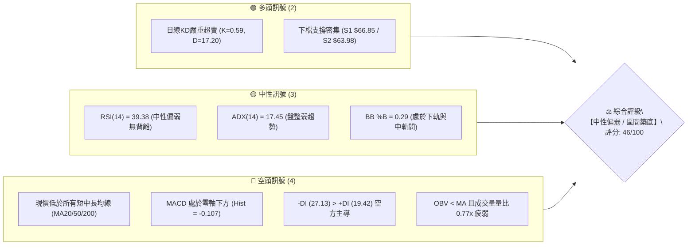

---

### 📊 核心指標速覽表

| 指標類別 | 指標名稱 | 當前數值 | 訊號 | 解讀 |
|----------|----------|----------|------|------|
| **價格** | 當前收盤價 | $68.28 | 🟡 | 位於52週區間 27.1% 位置，自高點大幅回檔後整理 |
| **均線** | MA20 (短) | $74.14 | 🔴 | 價格低於 MA20 (-7.90%)，短線面臨直接反彈阻力 |
| **均線** | MA50 (中) | $81.12 | 🔴 | 價格低於 MA50 (-15.83%)，中期空頭排列反壓顯著 |
| **均線** | MA200 (長) | $78.78 | 🔴 | 價格跌破年線/長期趨勢線 (-13.33%)，多頭架構受損 |
| **動能** | RSI(14) | 39.38 | 🟡 | 處於 30–70 中性偏弱區間，未見明顯底背離 |
| **動能** | MACD (12,26,9) | -1.459 / -1.352 / -0.107 | 🔴 | 快慢線均在零軸下，柱狀體為負，空方動能佔優 |
| **動能** | Stoch KD (14,3) | %K: 0.59 / %D: 17.20 | 🟢 | 極度超賣區間，隨時具備技術性反彈契機 |
| **趨勢** | ADX / DMI | ADX: 17.45 (+DI: 19.42, -DI: 27.13) | 🟡 | ADX < 25 為盤整行情，空方力量強於多方 |
| **通道** | 布林通道 (20,2) | 上 $88.16 / 中 $74.14 / 下 $60.12 | 🟡 | %B = 0.29，通道開口中等，價格朝中軌收斂中 |
| **量能** | 20日成交量比 | 14.28M / 18.60M (0.77x) | 🔴 | OBV < MA，反彈量能不足，追價意願保守 |
| **波動** | ATR(14) | $5.37 (佔股價 7.87%) | 🟡 | 日內波動幅度較大，適合拉寬止損防守區間 |

---

### 🏆 技術評分卡

```
╔══════════════════════════════════════════════════════════════╗
║              技術評分卡 — RKLB (2026-08-24)                  ║
╠══════════════════════════════════════════════════════════════╣
║ 趨勢強度 (Trend)     ██████░░░░░░░░░░░░░░  30/100  🔴 空頭壓制 ║
║ 動能指標 (Momentum)  ████████░░░░░░░░░░░░  40/100  🟡 弱勢中性 ║
║ 支撐穩定度 (Support) ████████████░░░░░░░░  60/100  🟢 下檔有撐 ║
║ 成交量配合 (Volume)  ████████░░░░░░░░░░░░  40/100  🔴 量能疲弱 ║
║ 形態完整度 (Pattern) ██████████████░░░░░░  70/100  🟢 區間築底 ║
║ 均線排列 (MA System) ██████░░░░░░░░░░░░░░  35/100  🔴 混合偏空 ║
╠══════════════════════════════════════════════════════════════╣
║ 綜合技術評分         █████████░░░░░░░░░░░  46/100  🟡 區間震盪 ║
╚══════════════════════════════════════════════════════════════╝
```

---

## 2. 趨勢分析

### 🌐 多時框趨勢分析

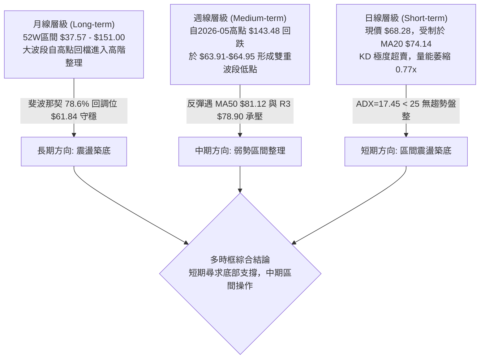

---

### 📈 長期趨勢 — 12個月走勢圖（Unicode）

```
RKLB 月線走勢圖（2025-08 至 2026-08）
價格軸 ($)
$150 ┤                                      ● 2026-05 ($143.48 / 52W H: $151.00)
$140 ┤                                     ╱ ╲
$130 ┤                                    ╱   ╲
$120 ┤                                   ╱     ╲
$110 ┤                                  ╱       ● 2026-06 ($101.65)
$100 ┤                                 ╱         ╲
 $90 ┤                         ● 2026-04 ($82.51)  ╲
 $80 ┤               ● 2026-01 ($80.07)             ╲
 $70 ┤        ● 2025-12 ($69.76) ╲  ╱ ╲              ╲    ● 2026-08 ($68.28) ◄現價
 $60 ┤  ● 2025-10 ($62.98)        ● 2026-03 ($64.22)   ● 2026-07 ($64.95)
 $50 ┤● 2025-08 ($48.60) ╲      ╱
 $40 ┤                   ● 2025-11 ($42.14)
     └─────────────────────────────────────────────────────────────────────────────
       08   09   10   11   12   01   02   03   04   05   06   07   08 (月份)
      2025                                                2026
```

#### 走勢特徵分析表格

| 階段區間 | 起止月份 | 價格變化 | 漲跌幅 | 走勢特徵與量價結構解讀 |
|----------|----------|----------|--------|------------------------|
| **第 1 階段：主升起步** | 2025-08 → 2025-10 | $48.60 → $62.98 | +29.59% | 量能溫和放大，突破 $50 心理整數關卡，建立多頭波段基礎。 |
| **第 2 階段：深幅洗盤** | 2025-10 → 2025-11 | $62.98 → $42.14 | -33.09% | 快速回踩確認 $40 附近低點，為後續噴出行情進行籌碼換手。 |
| **第 3 階段：主升狂飆** | 2025-11 → 2026-05 | $42.14 → $143.48 | +240.48% | 六個月狂漲 2.4 倍，月線連續大陽線，創下 52 週高點 $151.00。 |
| **第 4 階段：獲利回吐** | 2026-05 → 2026-07 | $143.48 → $64.95 | -54.73% | 高檔放量長黑回落，快速跌破多條均線，回吐波段超過一半漲幅。 |
| **第 5 階段：低檔築底** | 2026-07 → 2026-08 | $64.95 → $68.28 | +5.13% | 於斐波那契 78.6% 回調位 ($61.84) 與支撐位 S2 ($63.98) 止跌整理。 |

---

### 📊 中期趨勢（週線分析）

中期走勢自 2026 年 5 月底見頂後快速修正，近 8 週在 $63.91 至 $82.83 之間構築箱形整理：

```
近期週線壓力與支撐示意圖：
$88.16 ── 布林上軌 (BB Upper) ──────────────────────────────
$82.83 ── 2026-08-09 週波段高點反壓
$80.90 ── 斐波那契 61.8% 回調位 (重要多空分水嶺)
$78.90 ── 關鍵阻力 R3 / MA200 ($78.78)
$74.14 ── 布林中軌 (MA20) / 阻力 R1 ($73.97)
$68.28 ── 【當前價格】
$66.85 ── 關鍵支撐 S1 (近期波段低點聚類)
$63.98 ── 關鍵支撐 S2 / 2026-07-26 低點 ($63.91)
$61.84 ── 斐波那契 78.6% 回調位
$60.12 ── 布林下軌 (BB Lower)
```

---

### ⚡ 趨勢強度評估（ADX 解讀）

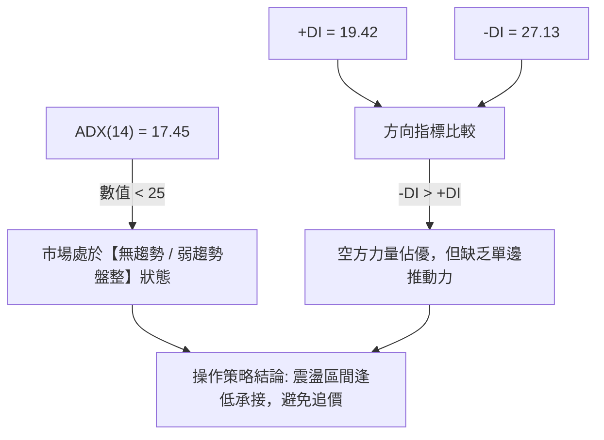

#### ADX 趨勢強度對照表

| 指標變數 | 當前讀數 | 門檻區間 | 趨勢判定 | 實戰指導含義 |
|----------|----------|----------|----------|--------------|
| **ADX(14)** | **17.45** | < 25 (弱趨勢/盤整) | 🟡 盤整震盪 | 嚴禁使用順勢突破策略；應採用布林軌道與支撐阻力做高拋低吸。 |
| **+DI (14)** | **19.42** | 多方買盤動能 | 🔴 弱於空方 | 多方動能尚不足以發動持續性攻勢，反彈需量能配合。 |
| **-DI (14)** | **27.13** | 空方賣壓動能 | 🟡 空方佔優 | 空方雖主導盤面，但因 ADX 走低，空方打壓動能亦在衰竭。 |

---

## 3. 圖表形態分析

### 🔍 形態識別系統

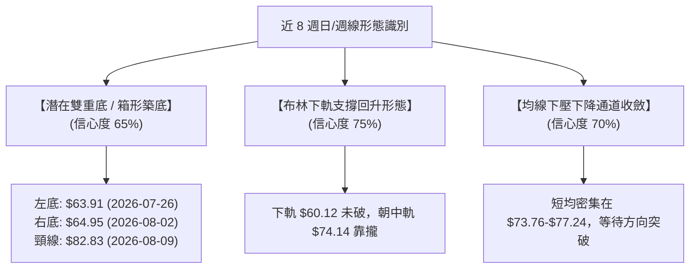

#### 形態識別與信心度評估表

| 形態名稱 | 信心度 | 判斷依據（引用真實數據） | 完成度 | 目標價（附嚴格計算式） |
|----------|--------|--------------------------|--------|------------------------|
| **雙重底 (W底)** | **65%** | 兩次波段低點分別為 2026-07-26 之 $63.91 與 2026-08-02 之 $64.95，緊鄰支撐位 S2 ($63.98) | **60%** (目前於頸線下方整理) | 由形態高度推算：頸線高點 $82.83 + 形態高度 ($82.83 - $63.91 = $18.92) = **$101.75** (對應 2026-06 收盤價 $101.65 區域) |
| **矩形箱形整理** | **75%** | 箱底落在 S2 ($63.98)～S1 ($66.85)，箱頂落在 R2 ($75.11)～R3 ($78.90) | **85%** (於區間中下緣運行) | 由形態高度推算：箱頂 $78.90 + 箱高 ($78.90 - $63.98 = $14.92) = **$93.82** (接近 50% 斐波那契位 $94.28) |
| **布林下軌反彈** | **70%** | 價格於布林下軌 $60.12 上方獲支撐，%B = 0.29 回升中 | **50%** | 目標為布林中軌 **$74.14**，若突破則上看布林上軌 **$88.16** |

---

### 🕯️ 重要K線形態分析

| 週/月份 | 收盤價 | K線形態 | 技術解讀 | 訊號強度 |
|---------|--------|---------|----------|----------|
| **2026-05-31** | $143.48 | 巨量衝高長上影線 | 創 52 週高點 $151.00 後獲利盤湧出，形成高檔見頂訊號。 | 🔴 強烈看空 |
| **2026-07-26** | $63.91 | 長下影十字探底線 | 週成交量 92.14M，RSI 跌至 15.6 極端超賣區，探明階段性鐵底。 | 🟢 強烈看多 |
| **2026-08-09** | $82.83 | 實體大陽線反彈 | 週成交量 96.70M，MACD 柱狀由負轉正 (+2.940)，確認反彈動能。 | 🟢 看多 |
| **2026-08-23** | $72.57 | 回踩量縮陰線 | 週成交量降至 79.13M，健康回測頸線與短均線，未破前低。 | 🟡 中性整固 |
| **2026-08-30 (當前)**| $68.28 | 縮量十字星整理 | 成交量急劇萎縮 (14.28M)，動能進入沉寂期，變盤在即。 | 🟡 觀望蓄勢 |

---

### 📉 ASCII 走勢形態示意圖

```
RKLB 雙重底 (Double Bottom) 與箱形整理結構示意圖
價格 ($)
$85 ┤
$83 ┤                 ● 頸線峰值: $82.83 (2026-08-09)
$80 ┤                ╱ ╲
$75 ┤───────────────╱───╲─────── R1 ($73.97) / 中軌 ($74.14) ────────
$70 ┤              ╱     ╲   ● 現價 $68.28
$65 ┤    ● 左底   ╱       ● 右底
    ┤ $63.91 (07-26)     $64.95 (08-02) / 支撐 S2 ($63.98)
$60 ┤───────────────────────────────────────────────────────────────── 斐波 78.6% ($61.84)
    └─────────────────────────────────────────────────────────────────
     2026-07-19     2026-07-26    2026-08-02    2026-08-09    2026-08-24
```

---

## 4. 支撐與阻力

### 🗺️ 關鍵價位分布圖（Unicode）

```
╔══════════════════════════════════════════════════════════════════╗
║                   RKLB 關鍵價位結構分布圖                        ║
╠══════════════════════════════════════════════════════════════════╣
║ $151.00 ║██████████████████████████████║ 52週歷史高點 (0.0% 斐波) ║
║ $107.67 ║████████████████████░░░░░░░░░░║ 38.2% 斐波那契強阻力位     ║
║  $94.28 ║██████████████████░░░░░░░░░░░░║ 50.0% 斐波那契平衡位       ║
║  $88.16 ║████████████████░░░░░░░░░░░░░░║ 布林通道上軌               ║
║  $80.90 ║██████████████░░░░░░░░░░░░░░░░║ 61.8% 斐波那契回調關鍵位   ║
║  $78.90 ║█████████████░░░░░░░░░░░░░░░░░║ 關鍵阻力 R3 (MA200 $78.78)║
║  $75.11 ║████████████░░░░░░░░░░░░░░░░░░║ 阻力位 R2 (MA240 $75.23) ║
║  $73.97 ║███████████░░░░░░░░░░░░░░░░░░░║ 關鍵阻力 R1 (MA20 $74.14) ║
║  $68.28 ╠══════════════════════════════╣ ◄ 當前市價 (Current Price) ║
║  $66.85 ║▓▓▓▓▓▓▓▓▓▓▓▓▓▓▓▓▓▓▓▓░░░░░░░░░░║ 關鍵支撐 S1 (近期波段支撐) ║
║  $63.98 ║████████████████████████░░░░░░║ 強支撐 S2 (雙底低點聚類)   ║
║  $61.84 ║██████████████████████████░░░░║ 78.6% 斐波那契關鍵回調位   ║
║  $58.31 ║████████████████████████████░░║ 強支撐 S3 (年內深層防守位) ║
║  $37.57 ║██████████████████████████████║ 52週歷史低點 (100.0% 斐波)║
╚══════════════════════════════════════════════════════════════════╝
```

---

### 🚧 阻力位分析表

*(註：價位嚴格引用技術數據中「關鍵價位」區塊聚類計算所得數值)*

| 阻力級別 | 價位 | 距離現價 | 形成技術原因 | 突破難度 | 技術重要性 |
|----------|------|----------|--------------|----------|------------|
| **關鍵阻力 R1** | **$73.97** | +8.33% | 近期日線反彈密集套牢區，重合 MA20 ($74.14) 與 MA5 ($73.76) | 🟡 中等 | 短線轉強樞紐，突破方可確認擺脫下軌壓制 |
| **阻力位 R2** | **$75.11** | +10.00% | 歷史成交量密集堆積區，重合 MA240 ($75.23) | 🟡 中等 | 中期趨勢修復關卡，確認多頭量能回升 |
| **強阻力 R3** | **$78.90** | +15.55% | 近一年波段高點聚類，重合年線 MA200 ($78.78) 及 MA10 ($77.24) | 🔴 極高 | 多空分水嶺，站上代表長期牛市軌道重新確立 |

---

### 🛡️ 支撐位分析表

*(註：價位嚴格引用技術數據中「關鍵價位」區塊聚類計算所得數值)*

| 支撐級別 | 價位 | 距離現價 | 形成技術原因 | 守住機率 | 技術重要性 |
|----------|------|----------|--------------|----------|------------|
| **關鍵支撐 S1** | **$66.85** | -2.09% | 近期波段回踩密集成交點，日線級別第一道防線 | 75% | 短線多頭防守點，守住代表維持低檔橫盤 |
| **強支撐 S2** | **$63.98** | -6.29% | 近一年波段低點聚類，重合 2026-07-26 低點 $63.91 | 85% | 雙底形態頸線防守底限，絕對不可失守 |
| **強支撐 S3** | **$58.31** | -14.61% | 波段深層支撐聚類，鄰近布林下軌 ($60.12) | 95% | 中長期價值買盤停損極限防線 |

---

### 📐 斐波那契回調位分析

依據 52 週完整波動區間（低點 **$37.57** 至 高點 **$151.00**，總振幅 $113.43）計算：

| 斐波那契回調比例 | 精確價位 | 技術意義與市場行為解讀 | 當前價格位置狀態 |
|------------------|----------|------------------------|------------------|
| **0.0% (52W High)** | **$151.00** | 歷史極值壓力頂部，天花板位置 | 位於現價上方 +121.15% |
| **23.6%** | **$124.23** | 初級回調支撐轉阻力區間 | 位於現價上方 +81.94% |
| **38.2%** | **$107.67** | 強勢回調防守位，2026-06 反彈頂部 | 位於現價上方 +57.69% |
| **50.0% (中軸)** | **$94.28** | 多空中樞平衡線，牛熊轉換線 | 位於現價上方 +38.08% |
| **61.8% (黃金分割)**| **$80.90** | 經典黃金分割位，中期多頭反攻關鍵目標 | 位於現價上方 +18.48% (緊鄰 R3 $78.90) |
| **78.6% (深度回調)**| **$61.84** | 深度極限回調支撐，牛市最後防線 | **現價 $68.28 緊貼此線上運行 (+10.41%)** |
| **100.0% (52W Low)**| **$37.57** | 起漲原點，極端悲觀情境底部 | 位於現價下方 -44.98% |

> **解讀結論**：當前價格 **$68.28** 精確運行於 **78.6% ($61.84)** 與 **61.8% ($80.90)** 之間。在技術分析架構中，股價在經歷深度回調（78.6%）未跌破起漲點的情況下獲得支撐，代表長期牛市架構尚未全毀，目前處於高勝率的「極限折價築底區」。

---

## 5. 技術指標深度解讀

### 🎛️ 指標訊號總覽

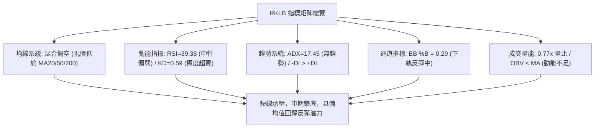

---

### 📈 移動平均線排列分析

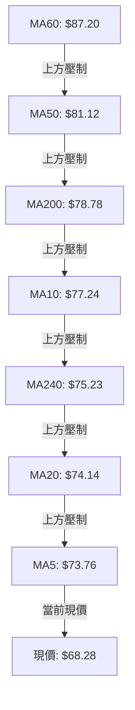

#### 均線各週期偏離度分析表

| 均線名稱 | 當前數值 | 與現價價差 | 乖離率 (Bias) | 歷史軌跡形態與解讀 |
|----------|----------|------------|---------------|--------------------|
| **MA 5** | $73.76 | -$5.48 | -7.43% | 超短期下壓，短線急跌後的乖離修正點 |
| **MA 10** | $77.24 | -$8.96 | -11.60% | 短期反彈第一阻力區間 |
| **MA 20** | $74.14 | -$5.86 | -7.90% | 月線級別反壓，重合布林中軌與阻力 R1 |
| **MA 50** | $81.12 | -$12.84 | -15.83% | 季線空頭下行，中線主要壓力關卡 |
| **MA 60** | $87.20 | -$18.92 | -21.69% | 中期生命線，重合布林上軌反壓區 |
| **MA 120**| $86.93 | -$18.65 | -21.45% | 半年線走平偏空 |
| **MA 200**| $78.78 | -$10.50 | -13.33% | 牛熊分水嶺年線，跌破後轉為上方強阻力 |
| **MA 240**| $75.23 | -$6.95 | -9.24% | 長期成本線，位於 R2 ($75.11) 附近 |

---

### 📉 RSI(14) 分析

```
RSI(14) 數值進度條：
[0] ─────────────── [30] ────── [39.38] ───────────────────── [70] ─────────────── [100]
超賣區 (Oversold)    │  現價位置: 39.38  │          超買區 (Overbought)
                     └─ 偏弱中性區間 ────┘
進度條: ████████░░░░░░░░░░░░ 39.38%
```

- **超買超賣判定**：RSI(14) 當前讀數為 **39.38**，位於 30～70 的中性偏弱區間，脫離了 2026-07-26 的極端超賣區 (15.6)，顯示恐慌殺跌已結束。
- **背離分析**：
  - 價格在 2026-07-26 創低 $63.91 (RSI=15.6)，隨後在 2026-08-02 於 $64.95 築底 (RSI=36.5)，價格低點接近但 RSI 顯著墊高，已完成週線級別底背離修復。
  - 目前日線級別「**無明顯頂/底背離**」，指標如實反映當前弱勢震盪行情。

---

### 📊 MACD(12,26,9) 訊號解讀

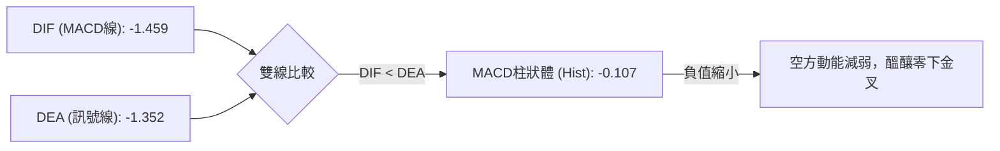

- **MACD 線 (DIF)**：-1.459
- **訊號線 (Signal / DEA)**：-1.352
- **MACD 柱狀圖 (Histogram)**：-0.107
- **綜合判定**：雙線深處零軸下方，屬於典型「弱勢區間整理」。柱狀體數值僅為 -0.107，負動能極其微弱，若短線價格站上 $70.00，隨時將觸發零軸下方的「低檔黃金交叉」，帶來技術性修復買盤。

---

### 📦 布林通道分析

```
RKLB 布林通道 (20, 2) 當前結構示意圖：
$88.16 ── 布林上軌 (Upper Band) ──────────────────────────────
           ↑
           │  帶寬幅度: $28.04 (41.07%)
           ↓
$74.14 ── 布林中軌 (MA20 / Middle Band) ──────────────────────
           ↑
$68.28 ── 【現價位置】 (BB %B = 0.29)
           ↓
$60.12 ── 布林下軌 (Lower Band) ──────────────────────────────
```

- **通道帶寬與位置**：%B 為 **0.29**，股價運行於中軌 ($74.14) 與下軌 ($60.12) 之間。
- **通道行為解讀**：布林帶未出現單邊向下開口的「破軌走勢」，下軌在 $60.12 形成堅固支撐。現價獲得支撐後呈現向中軌回歸的均值回歸特徵。

---

### 💹 成交量分析（量價配合度）

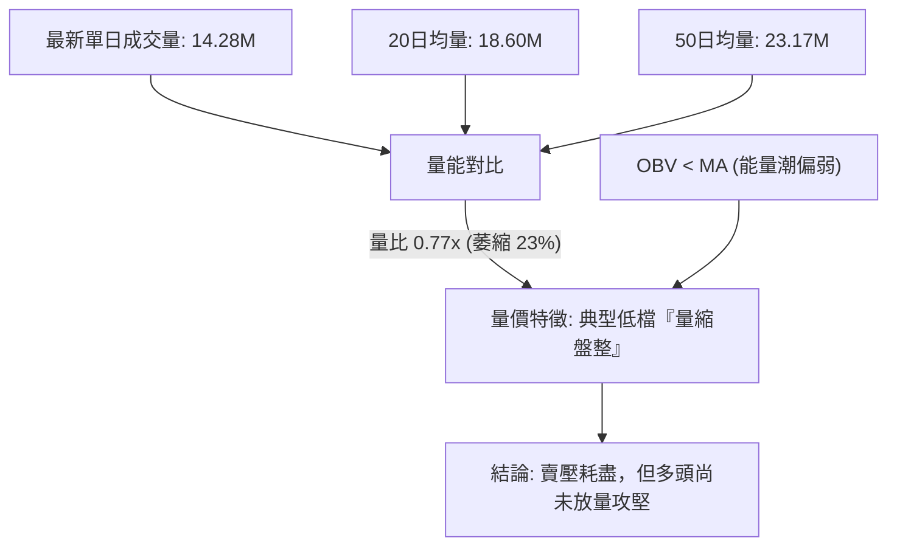

- **量比與均量比較**：最新成交量 14.28M 僅為 20 日均量 (18.60M) 的 **0.77x**，大幅低於 50 日均量 (23.17M)。
- **OBV 能量潮解讀**：OBV 低於其均線，代表主力資金在此位階處於靜默吸籌而非推升階段，符合底部築底初期的「量縮窒息」特徵。

---

## 6. 動能與波動率

### ⚡ 動能評估四象限

| 象限分類 | 動能強度 (Momentum) | 波動率水準 (Volatility) | 當前判定 | 實戰應對策略與狀態解讀 |
|----------|---------------------|--------------------------|----------|------------------------|
| **第 I 象限** | 強動能 (Bullish) | 低波動 (Low Vol) | — | 最佳波段順勢抱牢區 |
| **第 II 象限**| 弱動能 (Bearish) | 低波動 (Low Vol) | — | 沉悶磨底盤整 |
| **第 III 象限**| 強動能 (Bullish) | 高波動 (High Vol) | — | 主升浪爆發，追漲高收益 |
| **第 IV 象限**| **弱動能 (Bearish)**| **高波動 (High Vol)** | **✓ (RKLB 處於此區)** | **高風險高彈性，適合逆向嚴格止損交易** |

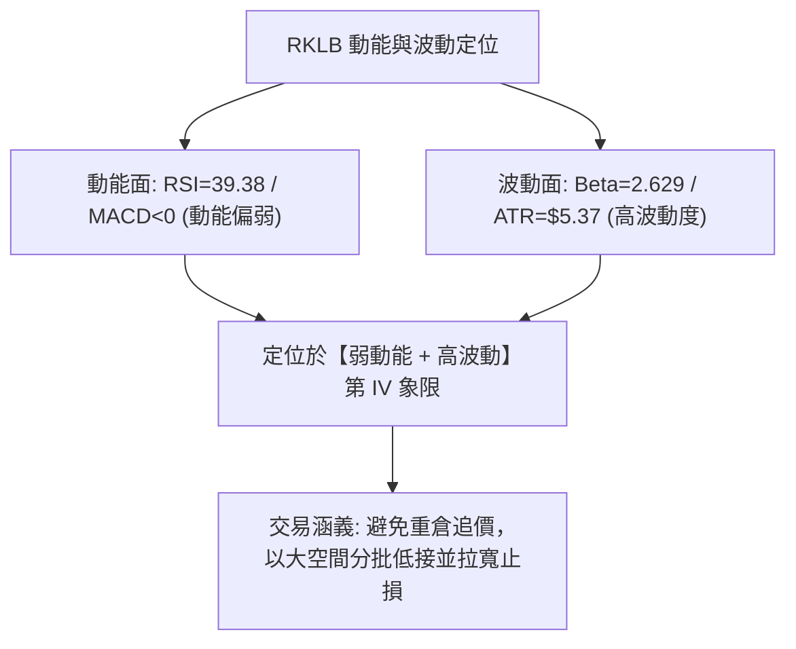

---

### 📊 ATR 波動率分析

- **ATR(14) 絕對值**：**$5.37**
- **ATR 相對百分比**：佔當前股價之 **7.87%**，屬於美股航太科技板塊中波動極高標的。
- **止損距離設計實務**：
  - **保守型交易者（1.5 × ATR）**：$5.37 × 1.5 = **$8.06** 緩衝空間。
  - **進取型交易者（1.0 × ATR）**：$5.37 × 1.0 = **$5.37** 緩衝空間。
  - **支撐位結合判定**：現價 $68.28 距離關鍵支撐 S2 ($63.98) 僅差 $4.30 (約 0.8 × ATR)，故將止損設於 S2 稍下方具備極佳的風控效益。

---

### 📐 Beta 與市場相關性

- **Beta 係數**：**2.629**
- **市場特徵解讀**：
  - RKLB 具備超高彈性，當標普 500 或納斯達克波動 1% 時，該股平均波動達 **2.63%**。
  - 在大盤回調或震盪時該股下行壓力加劇，但在大盤反彈時該股將提供極高爆發力的超額報酬 (Alpha)。

---

## 7. 多時框架總結

### 📋 時框架評分表

| 時框架 | 趨勢方向 | 動能指標 | 均線排列 | 形態結構 | 綜合評分 | 交易指導建議 |
|--------|----------|----------|----------|----------|----------|--------------|
| **月線 (長期)** | 🟡 高階震盪 | RSI~50 中性 | 位於 MA240 之上 | 52W區間27.1%回調築底 | **60/100** | 78.6% 斐波處具備長線吸籌價值 |
| **週線 (中期)** | 🔴 弱勢整理 | MACD 柱翻負 | 低於週 MA20/50 | 雙底頸線下方箱形震盪 | **45/100** | 等待突破頸線 R1/R2 再行加碼 |
| **日線 (短期)** | 🟡 超賣反彈 | KD 極度超賣 | 空頭均線反壓 | 縮量十字星回測支撐 S1 | **42/100** | 貼近支撐 S1/S2 輕倉試單博反彈 |

---

### 🔲 綜合訊號矩陣

```
時框架維度訊號矩陣：
┌───────────┬──────────┬──────────┬──────────┬──────────┬──────────┐
│  時框架   │ 趨勢方向 │ 動能訊號 │ 均線排列 │ 量價結構 │ 綜合判定 │
├───────────┼──────────┼──────────┼──────────┼──────────┼──────────┤
│ 長期(月)  │ 🟡 中性  │ 🟡 中性  │ 🟢 偏多  │ 🟡 中性  │ 🟢 偏多  │
│ 中期(週)  │ 🔴 偏空  │ 🔴 偏空  │ 🔴 偏空  │ 🟡 中性  │ 🔴 偏空  │
│ 短期(日)  │ 🟡 盤整  │ 🟢 超賣  │ 🔴 偏空  │ 🔴 縮量  │ 🟡 觀望  │
└───────────┴──────────┴──────────┴──────────┴──────────┴──────────┘
```

---

### ⚖️ 多時框收斂結論

依據多時框收斂優先級規則：
1. **行情模式判斷**：ADX(14) 數值為 **17.45 (< 25)**，技術面嚴格定義當前為**【盤整行情】**，非單邊趨勢行情。
2. **主導時框與邊界**：在盤整行情中，日線布林通道 ($60.12 ～ $88.16) 及近期波段高低點聚類構成主要交易區間。中長期均線（MA200 $78.78、MA50 $81.12）則構成震盪區間的上軌重壓區。
3. **唯一收斂方向結論**：**【中性觀望，區間低吸操作】**（技術評分 46/100）。短期指標極度超賣，且緊鄰強支撐 S1 ($66.85) 與 S2 ($63.98)，盲目殺跌做空之風險報酬比極差；策略應以**守住支撐位逢低分批布局反彈**為主導。

---

## 8. 交易策略建議

### 🗺️ 策略決策流程圖

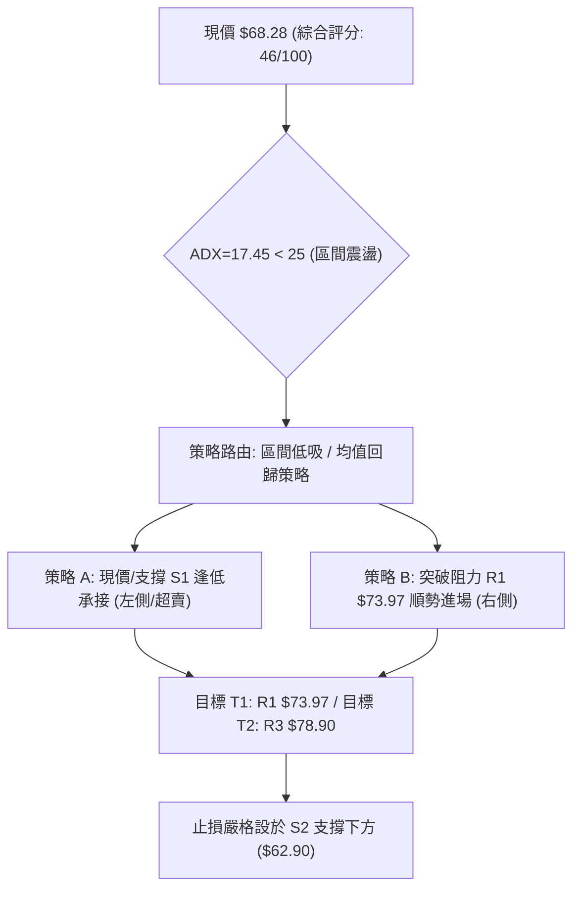

---

### 🧭 策略路由（依評分卡分流）

> **當前主策略方向 = 區間震盪操作（Range-Bound Trading），偏向逢低做多反彈（依評分 46/100）**
> 
> 依評分規則，40–60 分屬中性區間操作。鑒於 Stoch KD (0.59) 極度超賣、下檔 S1 ($66.85) 與 S2 ($63.98) 支撐堅實，且機構分析師共識目標價達 $112.94（現價具備 +65.4% 潛在上行空間），主推**支撐位逢低佈局之區間多頭策略**，空頭僅列為破位之風險警示。

---

### 🎯 價格情境階梯（Price Scenarios）

*(註：所有價位嚴格引用關鍵價位與斐波那契數值)*

| 觸發條件 | 第一目標 (T1) | 第二目標 (T2) | 後續延伸 (T3) | 情境技術含義解讀 |
|----------|---------------|---------------|---------------|------------------|
| **向上突破 R1 ($73.97)** | 阻力 R2 ($75.11) | 強阻力 R3 ($78.90) | 斐波 61.8% ($80.90) | 短線擺脫空頭壓制，站上 MA20，發動均值回歸行情 |
| **突破強阻力 R3 ($78.90)**| 斐波 50% ($94.28) | 形態目標 ($101.75) | 斐波 38.2% ($107.67)| 雙底形態正式確立，牛市主升浪重啟 |
| **跌破關鍵支撐 S1 ($66.85)**| 強支撐 S2 ($63.98) | 斐波 78.6% ($61.84) | 布林下軌 ($60.12) | 區間震盪下移，測試前波低點支撐 |
| **有效跌破 S2 ($63.98)** | 強支撐 S3 ($58.31) | 52W低點 ($37.57) | — | 雙底形態失效，空頭破位，觸發全面止損 |

---

### 📊 情境機率分佈

```
情境機率分佈圖：
區間反彈向上 (55%)  ██████████████████████░░░░░░░░░░░░░░░░░░
窄幅區間震盪 (30%)  ████████████░░░░░░░░░░░░░░░░░░░░░░░░░░
破位再探深底 (15%)  ██████░░░░░░░░░░░░░░░░░░░░░░░░░░░░░░░░
```

| 未來情境 | 機率 | 主要技術與數據依據 |
|----------|------|--------------------|
| **情境 A：區間反彈向上** | **55%** | Stoch KD 嚴重超賣 (%K=0.59)；週線底背離修復；分析師多數看好 (評級 Buy，均價 $112.94)。 |
| **情境 B：窄幅區間震盪** | **30%** | ADX(14) = 17.45 處於無趨勢低迷期；日成交量僅 0.77x 均量，市場等待催化劑。 |
| **情境 C：破位再探深底** | **15%** | 現價仍在 MA20/50/200 下方；-DI (27.13) 仍高於 +DI (19.42)，若大盤重挫可能連帶破位。 |

---

### 🟢 主策略詳情（方向：區間多頭反彈）

| 策略要素 | 策略 A（左側低接 / 超賣反彈） | 策略 B（右側確認 / 突破追價） |
|----------|-------------------------------|-------------------------------|
| **進場條件** | 現價 $68.28 輕倉進場，或回踩 S1 $66.85 掛單 | 日線收盤價帶量突破阻力 R1 $73.97 (MA20) |
| **進場價格** | **$68.28** (當前市價分批) | **$74.14** (確認站上中軌) |
| **第一目標價 T1** | **$73.97** (阻力 R1，漲幅 +8.33%) | **$78.90** (阻力 R3 / 年線，漲幅 +6.42%) |
| **第二目標價 T2** | **$78.90** (阻力 R3，漲幅 +15.55%) | **$82.83** (前波反彈高點頸線，漲幅 +11.72%) |
| **止損價格** | **$62.90** (跌破強支撐 S2 $63.98 與前低 $63.91) | **$69.50** (跌回 MA20 之下 1 個 ATR) |
| **潛在風險 / 報酬**| 風險: -$5.38 (7.88%) / 報酬: +$10.62 (15.55%) | 風險: -$4.64 (6.26%) / 報酬: +$8.69 (11.72%) |
| **風險報酬比 (R:R)**| **1 : 1.97** (近 1:2 優質風報比) | **1 : 1.87** |
| **建議倉位** | **8% - 10%** 總資金 (防守型分批) | **12% - 15%** 總資金 (確認轉強加碼) |

---

### 🔴 反向風險觸發點（風控對沖提示）

若出現以下訊號，代表多頭反彈邏輯徹底被推翻，應立即終止多頭策略或進行反向避險：
1. **破位訊號**：日線收盤價實體跌破 **S2 ($63.98)** 及斐波那契 78.6% **($61.84)**，確認破底。
2. **量能異動**：若跌破 $63.98 時伴隨單日成交量放大至 **25M 以上**（超過 50 日均量），代表停損盤恐慌湧出，下方將直指 S3 ($58.31) 或布林下軌 ($60.12)。

---

### ⭐ 整體訊號強度評星

```
做多訊號強度：★★★☆☆  (3.0/5星 — 超賣支撐強，但缺突破量)
做空訊號強度：★★☆☆☆  (2.0/5星 — 空間受限於強支撐，易軋空)
整體可信度：  ★★★★☆  (4.0/5星 — 價位聚類與斐波高度重合)
```

---

## 9. 風險提示與監控

### ✅ 關鍵監控指標 Checklist

```
╔══════════════════════════════════════════════════════════════╗
║              每日交易關鍵技術指標監控清單 (Checklist)        ║
╠══════════════════════════════════════════════════════════════╣
║ [ ] 1. 均線突破：收盤價是否站上 MA20 ($74.14) 與 R1 ($73.97)║
║ [ ] 2. 支撐防守：盤中最低價是否守住 S1 ($66.85) 與 S2 ($63.98)║
║ [ ] 3. 動能翻正：MACD 柱狀體 (Hist) 是否由 -0.107 轉為正值   ║
║ [ ] 4. 超賣修復：Stoch %K 是否自 0.59 向上穿越 %D (17.20)     ║
║ [ ] 5. 量能增溫：日成交量是否回升至 20日均量 (18.60M) 以上   ║
║ [ ] 6. 趨勢轉變：ADX 是否自 17.45 拐頭向上並突破 25 水準     ║
╚══════════════════════════════════════════════════════════════╝
```

---

### ⚠️ 風險場景分析

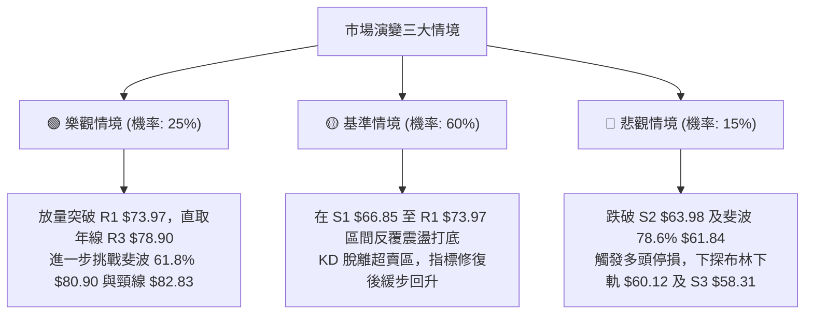

---

### 🛡️ 風險管理重要提醒

1. **高 Beta 波動風險控管**：
   - RKLB 之 Beta 高達 **2.629**，ATR 達 **$5.37 (7.87%)**。嚴禁單筆交易使用過高槓桿或超過 15% 總資金部位。
2. **財報與基本面空窗期**：
   - 儘管營收 YoY 成長 62.0%，但目前淨利仍為負 (EPS TTM -$0.28)，本益比極高，股價受市場流動性與風險偏好影響甚巨。
3. **止損紀律絕對執行**：
   - 本報告所設定之止損價位 **$62.90** 為技術結構完全破壞之臨界點，若觸及必須無條件停損出場，防範股價跌向 S3 ($58.31)。

---

## 📋 報告總結

```
╔══════════════════════════════════════════════════════════════╗
║                 RKLB 技術分析報告總結儀表板                  ║
╠══════════════════════════════════════════════════════════════╣
║ 報告日期：2026-08-24            當前市價：$68.28             ║
║ 綜合技術評分：46/100            分析評級：⚖️ 中性觀望 (區間低吸)║
╠══════════════════════════════════════════════════════════════╣
║ 關鍵趨勢結論：                                               ║
║ ├─ 長期趨勢：🟢 偏多整固 (52週區間 27.1%，守穩 78.6% 回調位)║
║ ├─ 中期趨勢：🔴 弱勢整理 (承壓於 MA50 $81.12 與年線 $78.78)   ║
║ ├─ 短期趨勢：🟡 築底震盪 (ADX=17.45 無趨勢，KD=0.59 極度超賣)║
║ ├─ 核心關鍵支撐：S1 $66.85 ｜ S2 $63.98 ｜ S3 $58.31         ║
║ ├─ 核心關鍵阻力：R1 $73.97 ｜ R2 $75.11 ｜ R3 $78.90         ║
║ └─ 華爾街共識目標價：$112.94 (上行空間 +65.4%)               ║
╠══════════════════════════════════════════════════════════════╣
║ 最優交易策略組合：                                           ║
║ 1. 🥇 最佳機會（超賣低接）：現價 $68.28 / 回踩 S1 $66.85 分批進║
║    場，止損 $62.90，目標 T1 $73.97 / T2 $78.90 (風報比 1:1.97)║
║ 2. 🥈 次選機會（右側突破）：帶量站上 R1 $73.97 加碼，看至 $82.83║
║ 3. 🥉 保守選擇：靜待日線 MACD 零下金叉且成交量重返 18.6M 再進場║
╚══════════════════════════════════════════════════════════════╝
```

---

> ⚠️ **免責聲明**：本報告為 AI 自動生成之技術分析研究，所有數據、圖表及關鍵價位均基於 Yahoo Finance 歷史與即時行情數據計算推導。本報告**僅供學術研究與投資參考**，**不構成任何形式的要約或投資買賣建議**。金融市場瞬息萬變，高 Beta 股票波動劇烈，投資人應獨立評估風險並自負盈虧。

---

*報告生成時間：2026-08-24 ｜ 數據來源：Yahoo Finance ｜ 分析框架：資深多時框量化技術分析系統*