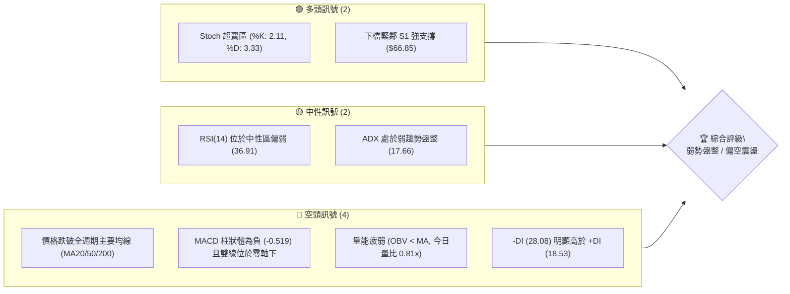
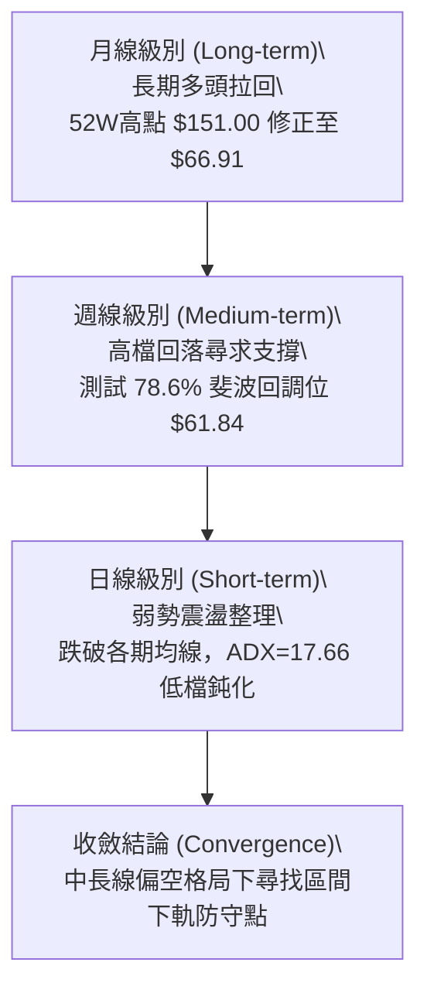
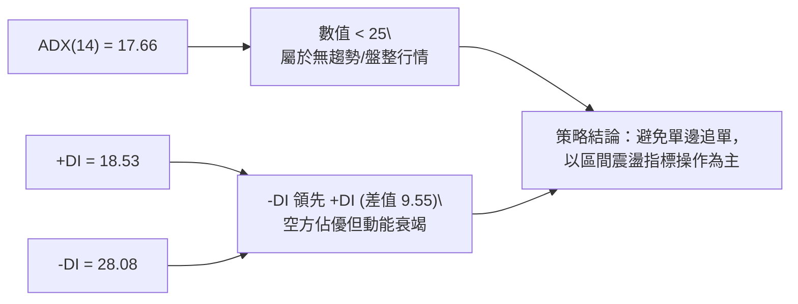
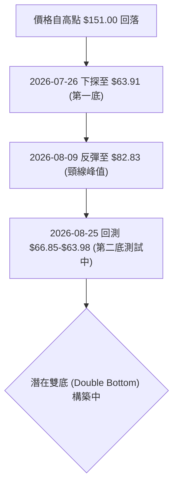
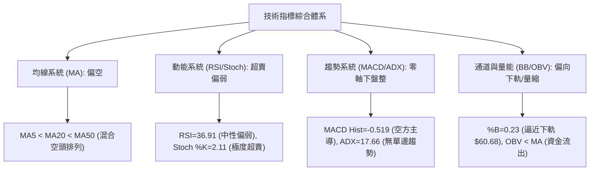
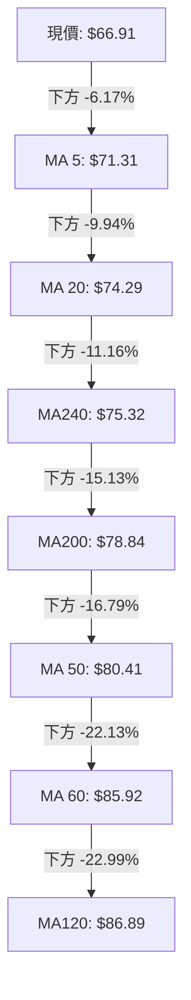
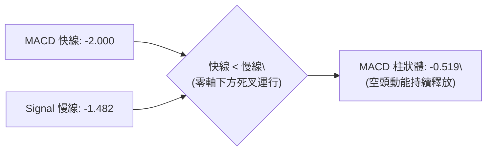
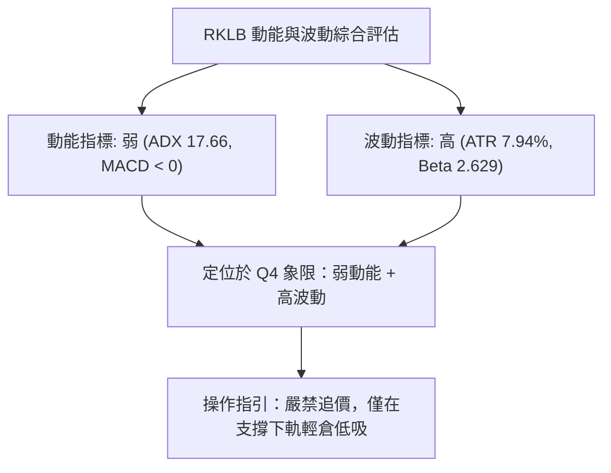
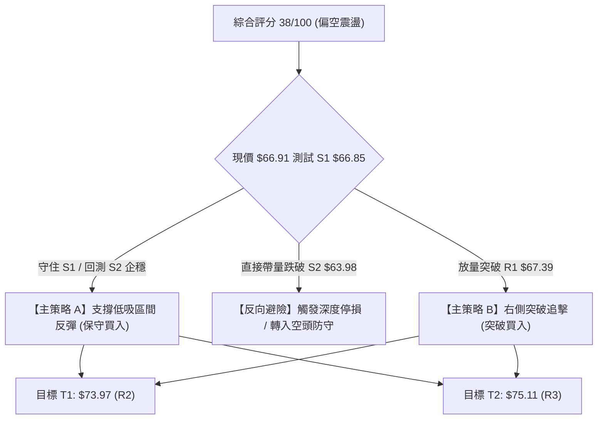
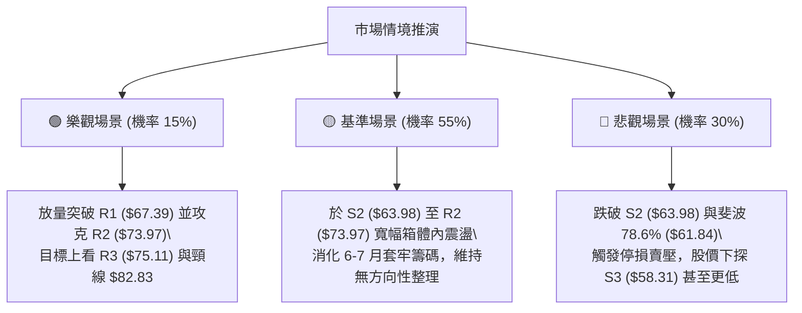

# RKLB 技術分析報告

> **報告日期**：2026-08-25 ｜ **語言**：繁體中文 ｜ **數據來源**：Yahoo Finance ｜ **當前價格**：$66.91

---

## 目錄

| 章節 | 內容 |
|------|------|
| [1. 技術面概覽](#1-技術面概覽) | 訊號儀表板、核心指標、評分卡 |
| [2. 趨勢分析](#2-趨勢分析) | 多時框趨勢、長中短期走勢 |
| [3. 圖表形態分析](#3-圖表形態分析) | 形態識別、K線組合、目標價 |
| [4. 支撐與阻力](#4-支撐與阻力) | 關鍵價位、斐波那契回調 |
| [5. 技術指標深度解讀](#5-技術指標深度解讀) | MA/RSI/MACD/布林/成交量 |
| [6. 動能與波動率](#6-動能與波動率) | 動能評估、ATR、Beta |
| [7. 多時框架總結](#7-多時框架總結) | 時框架評分矩陣 |
| [8. 交易策略建議](#8-交易策略建議) | 多空策略、風險報酬比 |
| [9. 風險提示與監控](#9-風險提示與監控) | 監控指標、風險場景 |

---

## 1. 技術面概覽

### 🎯 技術訊號儀表板



### 📊 核心指標速覽表

| 指標類別 | 指標名稱 | 當前數值 | 訊號 | 解讀 |
|----------|----------|----------|------|------|
| **價格** | 當前價格 | $66.91 | 🟡 | 位於52週區間25.9%，緊貼 S1 支撐 $66.85 |
| **均線** | MA20 | $74.29 | 🔴 | 價格低於MA20達 -9.94%，短期承壓 |
| **均線** | MA50 | $80.41 | 🔴 | 價格低於MA50，中期趨勢向下修正 |
| **均線** | MA200 | $78.84 | 🔴 | 跌破長期生命線，長多結構受考驗 |
| **動能** | RSI(14) | 36.91 | 🟡 | 偏弱中性區，無明顯背離，尚未進入極度超賣 |
| **動能** | MACD | -2.000 / -1.482 | 🔴 | MACD線位於Signal下方，Hist = -0.519，空頭主導 |
| **趨勢** | ADX(14) | 17.66 | 🟡 | 數值 < 25，單邊趨勢動能減弱，轉入區間震盪 |
| **通道** | 布林 %B | 0.23 | 🟡 | 逼近下軌 $60.68，中軌 $74.29 構成反彈壓力 |
| **波動** | ATR(14) | $5.31 | 🔴 | ATR佔比達 7.94%，屬於高日內波動個股 |

### 🏆 技術評分卡

```
╔══════════════════════════════════════════════════════════════════╗
║                   技術評分卡 — RKLB (2026-08-25)                 ║
╠══════════════════════════════════════════════════════════════════╣
║ 趨勢強度 (ADX=17.66)   ██████░░░░░░░░░░░░░░  30/100 🔴 弱勢盤整  ║
║ 動能指標 (RSI/MACD)    ████████░░░░░░░░░░░░  40/100 🟡 偏空格局  ║
║ 支撐穩定度 (S1=$66.85) ████████████░░░░░░░░  60/100 🟡 測試支撐  ║
║ 成交量配合 (量比 0.81) ██████░░░░░░░░░░░░░░  30/100 🔴 縮量無力  ║
║ 形態完整度 (雙底雛形)  ██████████░░░░░░░░░░  50/100 🟡 構築中    ║
║ 均線排列 (全線於上方)  ████░░░░░░░░░░░░░░░░  20/100 🔴 空頭排列  ║
╠══════════════════════════════════════════════════════════════════╣
║ 綜合評分               ███████░░░░░░░░░░░░░  38/100 🔴 偏空觀望  ║
╚══════════════════════════════════════════════════════════════════╝
```

---

## 2. 趨勢分析

### 🌐 多時框趨勢分析



### 📈 長期趨勢 — 12個月走勢圖（Unicode）

```
RKLB 月線走勢圖（過去12個月：2025-08 至 2026-08）
價格軸 ($)
$150 ┤                                      ● 2026-05 ($143.48 / 52W High $151.00)
$130 ┤                                     / \
$110 ┤                                    /   ● 2026-06 ($101.65)
$90  ┤                      ● 2026-01    /     \
$70  ┤        ● 2025-10    / ($80.07)  /       ● 2026-07 ($64.95)
$50  ┤● 2025-08\($62.98)  /   ● 2026-03\        ● 2026-08 ($66.91 現價)
$30  ┤ ($48.60) ● 2025-11/   ($64.22)   ● 2026-04
$10  ┤         ($42.14) ● 2025-12($69.76)($82.51)
     └─────────────────────────────────────────────────────────────
       08/25    10/25    12/25    02/26    04/26    06/26    08/26
```

**走勢特徵分析表格**：

| 階段 | 期間 | 價格區間 | 累計漲跌幅 | 走勢特徵解讀 |
|------|------|----------|------------|--------------|
| **長線主升浪** | 2025-08 至 2026-05 | $48.60 → $143.48 | +195.23% | 受益於發射與太空系統業務放量，機構強力建倉推升至歷史高檔 |
| **見頂重挫期** | 2026-05 至 2026-07 | $143.48 → $64.95 | -54.73% | 獲利了結賣壓湧現，連續跌破 $100 整數關卡與 MA60、MA120 |
| **低檔築底期** | 2026-07 至 2026-08 | $64.95 → $66.91 | +3.02% | 股價於 $63.98-$66.85 區間獲得初步支撐，波動幅度收窄 |

### 📊 中期趨勢（週線分析）

```
週線級別阻力與支撐示意圖：
阻力 R2 ─── $73.97 (MA20 $74.29 重疊區) ═══════════════════════════
阻力 R1 ─── $67.39 (近期反彈頸線小壓) ---------------------------
現價   ─── $66.91 ◄◄◄
支撐 S1 ─── $66.85 (近週低點密集區) ---------------------------
支撐 S2 ─── $63.98 (7月探底低點 $63.91 聚類) ════════════════════
支撐 S3 ─── $58.31 (下方深層波段支撐) ═══════════════════════════
```

### ⚡ 趨勢強度評估（ADX 解讀）



| 指標變數 | 當前讀數 | 門檻區間 | 行情屬性判定 | 交易指引 |
|----------|----------|----------|--------------|----------|
| **ADX(14)** | 17.66 | < 20 (極弱趨勢) | 處於寬幅震盪整理期 | 均線突破訊號易失效，重視布林軌道邊界 |
| **+DI / -DI** | 18.53 / 28.08 | -DI > +DI | 空頭主導壓制 | 多頭僅能視為超賣技術性反彈 |

---

## 3. 圖表形態分析

### 🔍 形態識別系統



**形態信心度與目標價評估表**：

| 形態名稱 | 信心度 | 判斷依據（引用數據） | 完成度 | 目標價（附計算式） |
|----------|--------|----------------------|--------|--------------------|
| **潛在雙重底 (W底)** | 55% | 第一次低點為 2026-07-26 收盤 $63.91（聚類於 S2 $63.98），當前價格 $66.91 逼近 S1 $66.85 形成次低點支撐 | 50% | 需有效突破頸線高點 $82.83 才能確認。若確認：$82.83 + ($82.83 - $63.91) = **$101.75** |
| **均線空頭排列形態** | 85% | 價格 ($66.91) < MA20 ($74.29) < MA200 ($78.84) < MA50 ($80.41) | 90% | 壓力下移至 R2 $73.97 與 R3 $75.11 |

### 🕯️ 重要K線形態分析

| 日期 / 月份 | 收盤價 | K線形態特徵 | 解讀 | 訊號 |
|-------------|--------|-------------|------|------|
| **2026-05** | $143.48 | 長上影天量大陽線（月線） | 觸及 52W 高點 $151.00 後獲利了結，多頭動能消耗殆盡 | 🔴 頂部力竭 |
| **2026-07-26 週** | $63.91 | 帶長下影線之十字星 | 探底至 78.6% 斐波那契 $61.84 上方，空頭拋壓減緩 | 🟢 短線止跌 |
| **2026-08-09 週** | $82.83 | 實體中陽線突破 | 報復性反彈測試 61.8% 斐波位 $80.90，但遭 MA50 壓制 | 🟡 反彈遇阻 |
| **2026-08-30 週** | $66.91 | 縮量連續小陰線（當前週） | 量能萎縮至 29,353,220，多空雙方觀望，測試 S1 支撐 | 🟡 震盪整理 |

### 📉 ASCII 走勢形態示意圖

```
潛在雙重底 (Double Bottom) 結構示意圖：
$85.00 ┤              頸線峰值 ($82.83)
$80.00 ┤                 /\
$75.00 ┤                /  \
$70.00 ┤    \          /    \
$65.00 ┤     \  ●     /      \  ●◄◄◄ 現價 ($66.91) / 測試支撐 S1 ($66.85)
$60.00 ┤      \/_____/        \______
              底 1 ($63.91)    底 2 (構築中，S2 $63.98)
       └───────────────────────────────────► 時間 (2026-07 至 2026-08)
```

### 🎯 形態目標價計算

- **多頭反轉條件**：價格必須收盤帶量突破頸線關鍵阻力（即 2026-08-09 波段高點 $82.83）。
- **形態高度計算**：
  $$\text{形態高度} H = \text{頸線高點} - \text{第一底低點} = \$82.83 - \$63.91 = \$18.92$$
- **量度漲幅目標價**：
  $$\text{量度目標價} T = \text{頸線高點} + H = \$82.83 + \$18.92 = \$101.75$$
- **未確認前風險**：若跌破 S2 $63.98，雙底形態宣告失敗，走勢將轉為下探 S3 $58.31。

---

## 4. 支撐與阻力

### 🗺️ 關鍵價位分布圖（Unicode）

```
╔══════════════════════════════════════════════════════════════════╗
║                     RKLB 價位結構分布圖                          ║
╠══════════════════════════════════════════════════════════════════╣
║ $75.11 ║████████████████████████║ 強阻力 R3 (MA240 $75.32 聚類)  ║
║ $73.97 ║████████████████████    ║ 中期阻力 R2 (MA20 $74.29 壓制) ║
║ $67.39 ║████████████            ║ 短線阻力 R1 (反彈即時頸線)     ║
║ $66.91 ╠════════════════════════╣ ◄── 當前價格                   ║
║ $66.85 ║▓▓▓▓▓▓▓▓▓▓▓▓▓▓▓▓▓▓▓▓▓▓▓▓║ 近期核心支撐 S1 (距現價 -0.09%)║
║ $63.98 ║████████████████████████║ 強支撐 S2 (7月低點聚類)        ║
║ $58.31 ║████████████████████████║ 深層波段支撐 S3 (下行防線)     ║
╚══════════════════════════════════════════════════════════════════╝
```

### 🚧 阻力位分析表

| 阻力級別 | 價位 | 形成原因 | 突破難度 | 重要性 |
|----------|------|----------|----------|--------|
| **R1** | **$67.39** | 近期小波段回跌起跌點，距離現價僅 +0.72% | 🟡 中等（需放量） | ★★★☆☆ |
| **R2** | **$73.97** | 近一年波段高點聚類，與布林中軌/MA20 ($74.29) 形成共振壓力帶 | 🔴 較高（套牢籌碼密集）| ★★★★☆ |
| **R3** | **$75.11** | MA240 ($75.32) 及波段密集成交區，站上才能扭轉中期空方 | 🔴 極高（強大結構阻力）| ★★★★★ |

### 🛡️ 支撐位分析表

| 支撐級別 | 價位 | 形成原因 | 守住機率 | 重要性 |
|----------|------|----------|----------|--------|
| **S1** | **$66.85** | 近期日線回檔低點聚類，距離現價 -0.09%，當前直接防線 | 🟡 55%（正遭受考驗） | ★★★★☆ |
| **S2** | **$63.98** | 2026-07-26 低點 $63.91 聚類，雙底形態之基石 | 🟢 70%（波段多頭底線） | ★★★★★ |
| **S3** | **$58.31** | 近一年波段深層低點聚類，接近布林下軌 $60.68 與斐波 78.6% | 🟢 85%（極強技術支撐） | ★★★★☆ |

### 📐 斐波那契回調位分析

依據 52 週波動區間（低點 $37.57 至 高點 $151.00）計算之關鍵斐波那契回調位如下：

```
0.0%  (52W High)  $151.00  ──────────────────────────────────────────
23.6%             $124.23  ──────────────────────────────────────────
38.2%             $107.67  ──────────────────────────────────────────
50.0%             $ 94.28  ──────────────────────────────────────────
61.8% (黃金分割)  $ 80.90  ──────────────────────────────────────────
現價  ($66.91)    落於 61.8% ($80.90) 與 78.6% ($61.84) 之間
78.6%             $ 61.84  ──────────────────────────────────────────
100.0% (52W Low)  $ 37.57  ──────────────────────────────────────────
```

**解讀**：
1. 股價在 2026-08-09 反彈至 $82.83，精準在 61.8% 回調位 ($80.90) 附近遇阻回落，確認該位置已由支撐轉為強阻力。
2. 當前價格 $66.91 位於 61.8% ($80.90) 與 78.6% ($61.84) 之間，目前正向下尋求 78.6%（$61.84）及 S2（$63.98）的支撐共振帶。

---

## 5. 技術指標深度解讀

### 🎛️ 指標訊號總覽



### 📈 移動平均線排列分析



- **均線狀態**：所有主要短、中、長期均線（MA5/10/20/50/60/120/200/240）均位於當前價格上方，呈現明顯的空頭壓制排列。
- **乖離率解讀**：現價與 MA60、MA120 負乖離超過 -22%，短期具備技術性修復超賣乖離的需求，但上方重重均線將壓制反彈空間。

### 📉 RSI(14) 分析

```
RSI(14) 讀數：36.91  [ 弱勢區間 30 - 50 ]
0 ──────────── 30 ───────────── 50 ───────────── 70 ─────────── 100
[  超賣區間   ]  [   當前 36.91  ]  [   中性強勢   ]  [   超買區間   ]
███████████████░░░░░░░░░░░░░░░░░░░░░░░░░░░░░░░░░░░░
```

- **背離檢驗**：
  - 價格於 2026-07-26 創低 $63.91 時，RSI 觸及 15.6；當前價格 $66.91 接近前低，但 RSI 為 36.91，**未形成標準底背離**（因為價格並未跌破前低），僅屬於超跌後的低檔頓化與收斂。

### 📊 MACD(12/26/9) 訊號解讀



- **解讀**：MACD 快慢線均在零軸下方運行，柱狀體為負（-0.519），說明中期動能仍由空方掌控。但在歷史數據中，柱狀體負值已較 6 月份的 -4.697 大幅收窄，空頭殺跌力道正在減弱。

### 📦 布林通道分析

```
布林通道結構 (帶寬: $27.22)：
$87.90 ┤ 上軌 (Upper Band) ──────────────────────────────────
       │
$74.29 ┤ 中軌 (MA20)       ──────────────────────────────────
       │
$66.91 ┤ 現價 (Price)      ◄◄◄ (%B = 0.23，偏向下軌)
       │
$60.68 ┤ 下軌 (Lower Band) ──────────────────────────────────
```

- **解讀**：%B 讀數為 0.23，顯示價格處於通道中軌與下軌之間的弱勢區。下軌 $60.68 緊鄰斐波 78.6% 回調位 $61.84，為短線極強之通道動態支撐。

### 💹 成交量分析（量價配合度）

```
成交量動態評估：
最新成交量: 14,891,920  ████████░░░░░░░░  (量比: 0.81x)
20日均量:   18,434,896  ██████████░░░░░░
50日均量:   22,210,664  ████████████░░░░
OBV 走勢:   OBV < MA    🔴 資金持續流出，量能疲弱
```

- **量價特徵**：下跌過程中成交量顯著萎縮（最新量 14.89M 低於 20 日均量 18.43M），呈現「無量陰跌」格局。OBV 線持續低於其移動平均線，表明機構大單買盤尚未顯著進場承接。

---

## 6. 動能與波動率

### ⚡ 動能評估四象限

| 象限 | 動能維度 (Momentum) | 波動率維度 (Volatility) | 當前狀態 | 策略意涵 |
|------|---------------------|--------------------------|----------|----------|
| **Q1** | 強動能 (Strong) | 低波動 (Low) | — | 穩定趨勢市，適合加碼追隨 |
| **Q2** | 弱動能 (Weak) | 低波動 (Low) | — | 狹幅無聊盤整，等待方向選擇 |
| **Q3** | 強動能 (Strong) | 高波動 (High) | — | 單邊突破爆發，高風險高回報 |
| **Q4** | **弱動能 (Weak)** | **高波動 (High)** | **✓ (RKLB 當前位置)** | **震盪洗盤，容易反覆掃損，宜嚴格控制倉位** |



### 📊 ATR 波動率分析

- **ATR(14) 數值**：**$5.31**（佔股價比例高達 **7.94%**）。
- **止損距離建議**：
  - **保守型（1.5 倍 ATR）**：$\$5.31 \times 1.5 = \$7.97$（適合波段操作）
  - **激進型（1.0 倍 ATR）**：$\$5.31 \times 1.0 = \$5.31$（適合短線當沖/隔日沖）
- **解讀**：每日股價波動區間接近 $5.3，意味著常規支撐位附近需給予足夠的緩衝空間，避免被日內隨機噪聲掃出場。

### 📐 Beta 與市場相關性

- **Beta 係數**：**2.629**（高彈性/高風險資產）。
- **市場特徵解讀**：RKLB 的波動幅度約為標普500大盤的 2.63 倍。在市場風險偏好（Risk-on）上升時反彈極為迅猛，但在市場去槓桿（Risk-off）週期中回撤幅度亦非常劇烈。

---

## 7. 多時框架總結

### 📋 時框架評分表

| 時框架 | 趨勢方向 | 動能狀態 | 均線排列 | 形態結構 | 綜合評分 | 建議操作 |
|--------|----------|----------|----------|----------|----------|----------|
| **月線 (長期)** | 🟡 中性回檔 | 減弱中 | 偏多（守在低檔起漲點上） | 大級別拉回 78.6% | 55/100 | 長期分批逢低配置 |
| **週線 (中期)** | 🔴 偏空格局 | 弱勢反彈受阻 | 混合偏空（MA20/50下方） | 構築雙底雛形中 | 40/100 | 觀望或區間高拋低吸 |
| **日線 (短期)** | 🔴 弱勢震盪 | 超賣頓化 | 空頭壓制（MA5/20下方） | 測試前低支撐 S1 | 35/100 | 嚴控倉位，等待企穩 |

### 🔲 綜合訊號矩陣

```
訊號一致性分析矩陣：
╔══════════════════╦══════════════════╦══════════════════╗
║  指標類別        ║  日線 (短期)     ║  週線 (中期)     ║
╠══════════════════╬══════════════════╬══════════════════╣
║  均線排列 (MA)   ║  🔴 空頭排列     ║  🔴 跌破 MA20    ║
║  MACD 柱狀體     ║  🔴 負值 (-0.519)║  🔴 零軸下運行   ║
║  RSI / Stoch     ║  🟢 超賣反彈需求 ║  🟡 中性偏弱     ║
║  量價配合度      ║  🔴 縮量無力     ║  🔴 OBV 持續低迷 ║
║  布林通道位置    ║  🟡 近下軌 (%B 0.23) 🟡 中下軌震盪  ║
╚══════════════════╩══════════════════╩══════════════════╝
```

### ⚖️ 多時框收斂結論

依據多時框收斂規則：
1. **行情屬性判定**：當前日線 ADX 為 **17.66 (< 25)**，明確定義當前處於**弱勢盤整行情**而非單邊趨勢行情。
2. **時框收斂權重**：以日線布林通道上下軌（$60.68 至 $87.90）與關鍵波段支撐/阻力（S1 $66.85 / S2 $63.98 至 R1 $67.39 / R2 $73.97）為核心震盪箱體。
3. **唯一方向性結論**：**【弱勢盤整，偏空觀望，區間下軌尋求防守】**。因短期均線全數下彎且成交量能不足，不可盲目追多；主策略採取「依託強支撐 S2 輕倉低吸、遇阻力 R2 獲利了結」的區間震盪交易策略。

---

## 8. 交易策略建議

### 🗺️ 策略決策流程圖



### 🧭 策略路由

> **當前主策略方向 = 區間震盪偏弱操作（依技術評分 38/100，以布林下軌及關鍵支撐 S1/S2 為核心防守點）**

### 🎯 價格情境階梯（Price Scenarios）

| 觸發條件 | 第一目標 (T1) | 第二延伸目標 (T2) | 技術情境含義 |
|----------|---------------|-------------------|--------------|
| **放量突破 R1 $67.39** | R2 **$73.97** | R3 **$75.11** | 短線擺脫均線壓制，展開回補負乖離反彈 |
| **守住現價 $66.91 / S1 $66.85** | R1 **$67.39** | R2 **$73.97** | 於雙底支撐區展開窄幅震盪築底 |
| **跌破 S1 $66.85 / S2 $63.98** | S3 **$58.31** | 斐波100% **$37.57** | 雙底構築失敗，中期下行趨勢重啟尋底 |

### 📊 情境機率分佈

| 情境 | 機率 | 主要依據 |
|------|------|----------|
| **區間震盪（$63.98 - $73.97）** | **55%** | ADX 僅 17.66，市場缺乏單邊推動力；成交量萎縮顯示拋壓與追價意願同步減弱 |
| **回落再探底（跌破 $63.98 測 $58.31）** | **30%** | 均線系統全線處於價格上方，MACD 負向擴散，OBV 量能偏弱 |
| **強勢反轉上行（站上 $75.11）** | **15%** | 需極大買盤放量扭轉，目前基本面與量能尚未提供此條件 |

### 🟢 主策略詳情

| 策略要素 | 策略 A（支撐低吸 - 區間多頭） | 策略 B（突破跟進 - 右側多頭） |
|----------|-------------------------------|-------------------------------|
| **策略類型** | 左側防守型低吸 | 右側確認型突破 |
| **進場條件** | 股價回踩 S2 獲得支撐，Stoch 超賣黃金交叉 | 股價帶量突破 R1 並收於其上 |
| **進場價格** | **$64.50**（接近 S2 $63.98 處分批掛單） | **$67.50**（突破 R1 $67.39 確認） |
| **目標價 T1** | **$73.97**（阻力 R2 / MA20 處平倉 50%） | **$73.97**（阻力 R2 處平倉 50%） |
| **目標價 T2** | **$75.11**（阻力 R3 處清倉） | **$75.11**（阻力 R3 處清倉） |
| **止損價格** | **$61.50**（跌破斐波78.6% $61.84 嚴格止損）| **$64.80**（跌破進場點下方 ATR 緩衝區）|
| **風險報酬比** | **1 : 3.16**（風險 $3.00，預期報酬 $9.47） | **1 : 2.40**（風險 $2.70，預期報酬 $6.47） |
| **成功機率** | 50% | 45% |
| **建議倉位** | **5% - 8%**（輕倉試單） | **5%**（右側輕倉） |

### 🔴 反向風險觸發點（對沖提示）

- **多頭徹底離場線**：若日線收盤價跌破 **$63.98 (S2)** 且伴隨成交量放大，所有多頭部位必須無條件停損，下看 **$58.31 (S3)**。
- **空頭回補警戒線**：若股價收盤放量站上 **$75.11 (R3)**，代表均線空頭排列遭到破壞，原有空頭避險倉位應立即平倉。

### ⭐ 整體訊號強度評星

```
╔══════════════════════════════════════════════════════════════════╗
║ 做多訊號強度：★★☆☆☆  (2.0/5星 — 僅限依託支撐之超賣反彈)        ║
║ 做空訊號強度：★★★☆☆  (3.5/5星 — 均線壓制明顯，但低檔跌勢趨緩)║
║ 整體可信度：  ★★★☆☆  (3.0/5星 — 盤整期指標噪聲較多，宜多看少做)║
╚══════════════════════════════════════════════════════════════════╝
```

---

## 9. 風險提示與監控

### ✅ 關鍵監控指標 Checklist

```
╔══════════════════════════════════════════════════════════════════╗
║                   關鍵技術監控指標 CHECKLIST                     ║
╠══════════════════════════════════════════════════════════════════╣
║ [ ] 價格是否跌破 S1 支撐 $66.85（短線破位警報）                   ║
║ [ ] 價格是否跌破 S2 支撐 $63.98（雙底失敗 / 中期轉空警報）       ║
║ [ ] 日成交量是否放大至 20日均量 (18.43M) 以上（放量確認訊號）     ║
║ [ ] RSI(14) 是否跌破 30 進入極度超賣或向上突破 50 中軸           ║
║ [ ] MACD 柱狀體是否由負轉正 (向上翻紅)                           ║
║ [ ] 價格是否能向上收復 MA20 ($74.29) 及 R2 ($73.97)              ║
╚══════════════════════════════════════════════════════════════════╝
```

### ⚠️ 風險場景分析



### 🛡️ 風險管理重要提醒

1. **高 Beta 與 ATR 風險**：RKLB Beta 高達 2.629，ATR 為 $5.31（佔比 7.94%），日內洗盤劇烈。單筆交易之最大虧損金額嚴格控制在總資金的 **1% - 1.5%** 以內。
2. **量能不足風險**：在成交量低於 20 日均量的情況下，任何向上突破均極易演變為「假突破」；同樣地，無量跌破支撐時亦需觀察次日收盤確認，避免被誘空洗出場。
3. **倉位配置守則**：在 ADX < 25 的盤整環境中，總持倉部位建議維持在 **30% 以下**，保留充裕現金以應對潛在的二次探底風險。

---

## 📋 報告總結

```
╔══════════════════════════════════════════════════════════════════╗
║                     RKLB 技術分析報告總結                        ║
╠══════════════════════════════════════════════════════════════════╣
║ 報告日期：2026-08-25                                             ║
║ 當前價格：$66.91                                                 ║
║ 分析評級：⚖️ 偏空震盪 / 觀望 (評分: 38/100)                     ║
║                                                                  ║
║ 關鍵結論：                                                       ║
║ ├─ 長期趨勢：🟡 自高點 $151.00 拉回逾 50%，測試深層斐波回調位    ║
║ ├─ 中期趨勢：🔴 處於 MA20/MA50 下方，反彈動能遭遇均線壓制        ║
║ ├─ 短期趨勢：🔴 弱勢整理，緊貼 S1 ($66.85) 測試支撐穩定性        ║
║ ├─ 關鍵支撐：S1: $66.85 ｜ S2: $63.98 ｜ S3: $58.31              ║
║ ├─ 關鍵阻力：R1: $67.39 ｜ R2: $73.97 ｜ R3: $75.11              ║
║ └─ 分析師共識目標：$112.94 (區間 $64.00 - $150.00)               ║
║                                                                  ║
║ 最優操作策略：                                                   ║
║ 1. 🥇 最佳機會：等待回測 S2 ($63.98) 附近輕倉低吸做反彈，嚴設止損 ║
║ 2. 🥈 次選機會：突破 R1 ($67.39) 後右側短線跟進，快進快出至 R2   ║
║ 3. 🥉 保守選擇：完全空倉觀望，直至價格有效站穩 MA20 ($74.29) 再行 ║
║                 介入                                             ║
╚══════════════════════════════════════════════════════════════════╝
```

---

> ⚠️ **免責聲明**：本報告為技術分析研究成果，所有價位均基於歷史量價數據計算。本報告**僅供研究與學術參考**，**不構成任何形式的投資買賣建議**。市場有風險，交易需嚴格執行風險管理與停損紀律。

---

*報告生成時間：2026-08-25 ｜ 數據來源：Yahoo Finance ｜ 分析框架：多時框技術分析*