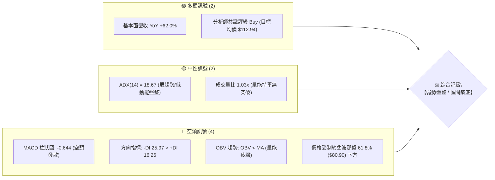
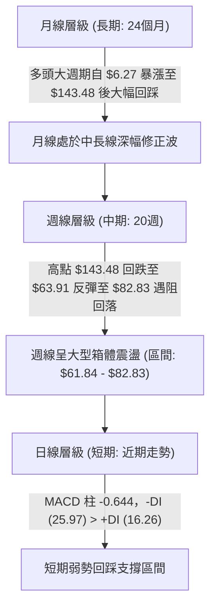
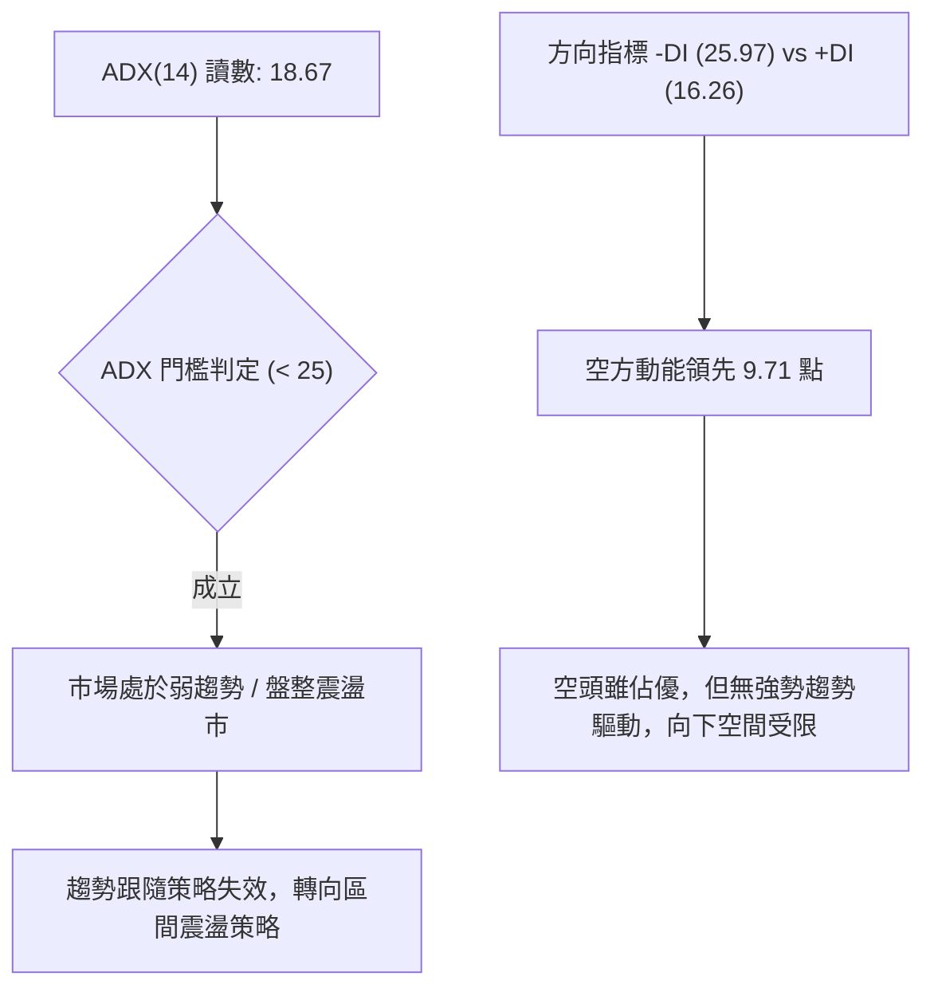
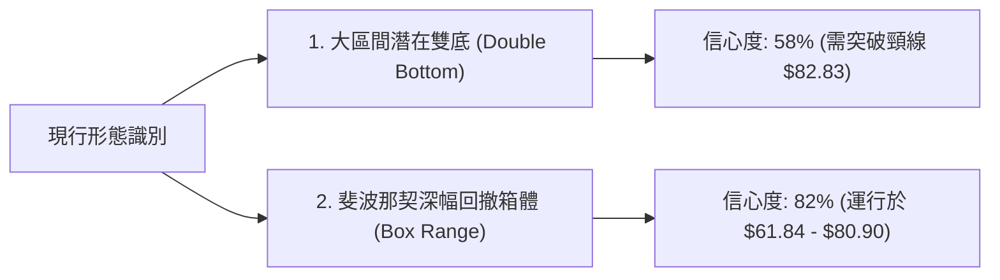
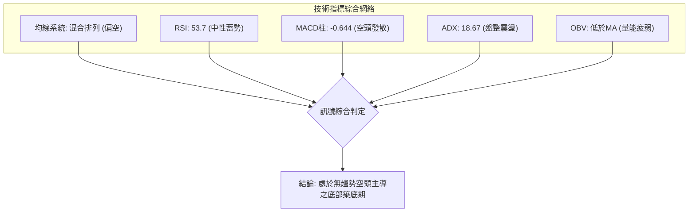
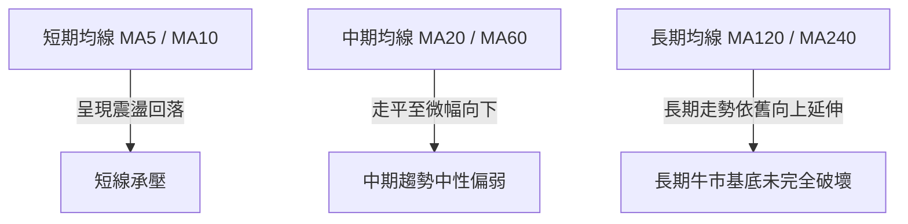
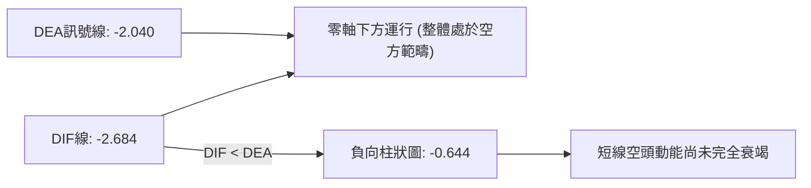
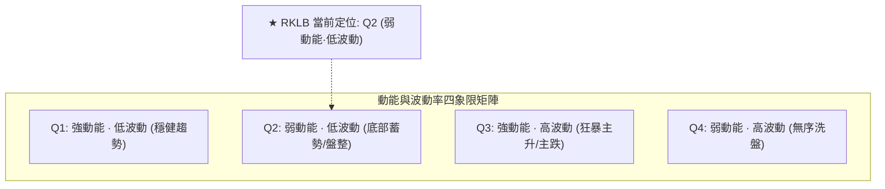
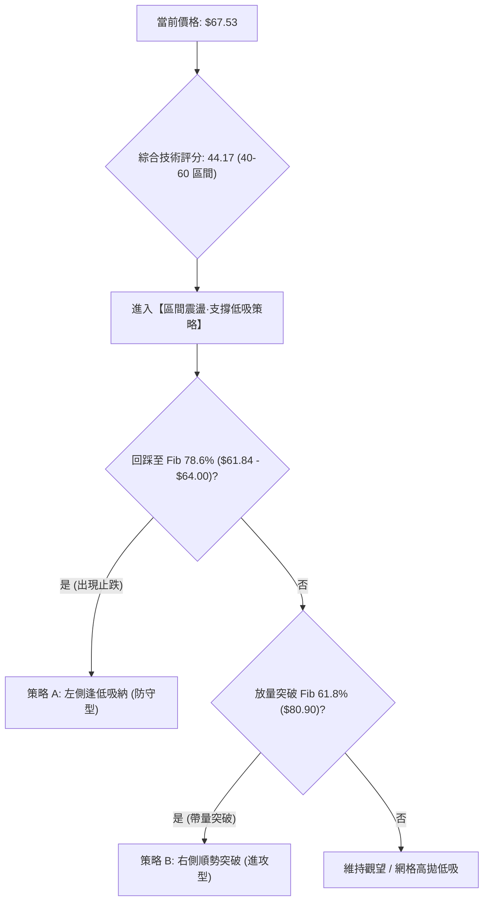
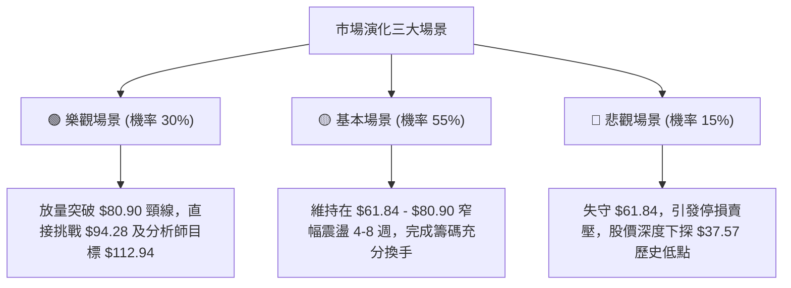

# RKLB 技術分析報告

> **報告日期**：2026-08-29 ｜ **語言**：繁體中文 ｜ **數據來源**：Yahoo Finance ｜ **當前價格**：$67.53 (最新週收盤價基準)

---

## 目錄

| 章節 | 內容 |
|------|------|
| [1. 技術面概覽](#1-技術面概覽) | 訊號儀表板、核心指標、評分卡 |
| [2. 趨勢分析](#2-趨勢分析) | 多時框趨勢、長中短期走勢、ADX 解讀 |
| [3. 圖表形態分析](#3-圖表形態分析) | 形態識別、信心度評估、K線組合 |
| [4. 支撐與阻力](#4-支撐與阻力) | 結構分布圖、阻力支撐表、斐波那契回調 |
| [5. 技術指標深度解讀](#5-技術指標深度解讀) | MA/RSI/MACD/布林/成交量/背離分析 |
| [6. 動能與波動率](#6-動能與波動率) | 動能矩陣、ATR 波動度、Beta 系統風險 |
| [7. 多時框架總結](#7-多時框架總結) | 時框架評分矩陣、多時框收斂結論 |
| [8. 交易策略建議](#8-交易策略建議) | 策略路由、情境階梯、主策略詳情與風控 |
| [9. 風險提示與監控](#9-風險提示與監控) | 關鍵監控清單、風險場景樹狀圖、資金控管 |

---

## 1. 技術面概覽

### 🎯 技術訊號儀表板



### 📊 核心指標速覽表

| 指標類別 | 指標名稱 | 當前數值 | 訊號 | 解讀 |
|:---|:---|:---:|:---:|:---|
| **價格** | 最新收盤價 | **$67.53** | 🟡 | 位於52週區間 $37.57–$151.00 之 26.39% 分位，處於波段回調低位區 |
| **動能** | MACD (12, 26, 9) | **-2.684** | 🔴 | DIF線位於零軸下方，空頭結構 |
| **動能** | MACD Signal | **-2.040** | 🔴 | MACD 線低於訊號線 |
| **動能** | MACD Histogram | **-0.644** | 🔴 | 柱狀圖負值擴大，短線賣壓仍存 |
| **動能** | RSI(14) (日/週) | **53.7** (前週) | 🟡 | 位於中性震盪區間 (30–70)，無超買超賣 |
| **趨勢** | ADX (14) | **18.67** | 🟡 | ADX < 25 表明市場處於無趨勢/震盪盤整狀態 |
| **方向** | +DI / -DI | **16.26 / 25.97** | 🔴 | -DI 大於 +DI，空方力量占據主導 |
| **量能** | 當日量 / 20日均量 | **18.45M / 17.94M** | 🟡 | 量比 1.03x，量能配合度一般 |
| **量能** | OBV 趨勢 | **OBV < MA** | 🔴 | 能量潮指標低於均線，資金累積意願不足 |
| **波幅** | 52週高 / 低點 | **$151.00 / $37.57** | 🟡 | 自歷史高點 $151.00 回撤幅度達 -55.28% |

### 🏆 技術評分卡

```
╔════════════════════════════════════════════════════════════════════════════╗
║                  技術評分卡 — RKLB (Rocket Lab Corporation)                 ║
║                              基準日期: 2026-08-29                           ║
╠════════════════════════════════════════════════════════════════════════════╣
║ 趨勢強度 (Trend)     ███████░░░░░░░░░░░░░  35/100  🔴 空頭控盤/ADX疲弱      ║
║ 動能指標 (Momentum)  ████████░░░░░░░░░░░░  40/100  🔴 MACD負值/動能偏弱     ║
║ 支撐穩定度 (Support) ████████████░░░░░░░░  60/100  🟡 Fib 78.6% ($61.84)護盤║
║ 成交量配合 (Volume)  █████████░░░░░░░░░░░  45/100  🟡 量比1.03x/OBV跌破均線 ║
║ 形態完整度 (Pattern) ██████████░░░░░░░░░░  50/100  🟡 箱體震盪打底階段     ║
║ 均線排列 (MA System) ███████░░░░░░░░░░░░░  35/100  🔴 中短期均線混合偏空    ║
╠════════════════════════════════════════════════════════════════════════════╣
║ 綜合技術評分         █████████░░░░░░░░░░░  44.17/100  🟡 【中性偏空·區間震盪】║
╚════════════════════════════════════════════════════════════════════════════╝
```

---

## 2. 趨勢分析

### 🌐 多時框趨勢分析



### 📈 長期趨勢 — 12個月走勢圖（Unicode）

```
RKLB 月線收盤走勢圖（過去12個月: 2025-09 至 2026-08）
價格 ($)
$150 ┤                                      
$140 ┤                                  ● (2026-05: $143.48)
$120 ┤                                 ╱ ╲
$100 ┤                                ╱   ● (2026-06: $101.65)
 $80 ┤               ● (2026-01: $80.07)   ╲      ● (2026-04: $82.51)
 $60 ┤      ●        │╲       ╱             ╲    ╱ ╲
 $40 ┤●━━━━╱━╲━━━━━━━●━● (2026-03: $64.22)   ●──● (2026-07: $64.95 / 2026-08: $67.53) ◄ 現價
 $20 ┤    ● (2025-11: $42.14)
     └────────────────────────────────────────────────────────────────────────
      09  10  11  12  01  02  03  04  05  06  07  08 (月份: 2025-09 至 2026-08)
```

#### 走勢特徵分析表格

| 階段週期 | 時間區間 | 起始價 → 結束價 | 漲跌幅 | 結構特徵與量價行為 |
|:---|:---|:---:|:---:|:---|
| **主升浪階段** | 2025-09 ～ 2026-05 | $47.91 → $143.48 | **+199.48%** | 伴隨營收大幅成長與機構建倉，爆發性單邊推升行情 |
| **頂部派發與暴跌** | 2026-05 ～ 2026-07 | $143.48 → $64.95 | **-54.73%** | 獲利盤湧出，跌破多道短期支撐，週成交量放大後萎縮 |
| **底部震盪築底** | 2026-07 ～ 2026-08 | $64.95 → $67.53 | **+3.97%** | 於斐波那契 78.6% ($61.84) 上方獲得支撐，進入窄幅整理 |

### 📊 中期趨勢（週線分析）

```
RKLB 近20週核心阻力與支撐結構圖 ($)
$151.00 ┬────────────────────────────────────────── 52W High (0.0% Fib)
        │
$107.67 ┼────────────────────────────────────────── Fib 38.2% (強阻力區間)
        │
 $82.83 ┼───────────────────▲ (2026-08-09 反彈高點 / Fib 61.8% $80.90 聚類阻力)
        │                  ╱ ╲
 $67.53 ┼─────────────────●───● ◄─── 當前收盤價 ($67.53)
        │                ╱
 $61.84 ┼───────────────●─────────────────── Fib 78.6% / 近期雙重底支撐 ($63.91 - $64.95)
        │
 $37.57 ┴────────────────────────────────────────── 52W Low (100.0% Fib)
```

### ⚡ 趨勢強度評估（ADX 解讀）



| 指標項 | 數值 | 參考標準 | 結論與交易意義 |
|:---|:---:|:---|:---|
| **ADX(14)** | **18.67** | < 20: 極弱/無趨勢；20–25: 弱趨勢；> 25: 強趨勢 | 確立目前屬於**無方向震盪整理**行情，不可盲目追空或追多。 |
| **+DI (14)** | **16.26** | 多方買盤推動力 | 買盤力道偏弱，顯示市場追價意願低迷。 |
| **-DI (14)** | **25.97** | 空方賣盤壓制力 | 空方占優但未達 30 以上的極端宣洩狀態。 |
| **DI 差值** | **-9.71** | 空方領先幅度 | 提示價格有慣性向下回踩支撐的風險，但不會出現崩跌式單邊行情。 |

---

## 3. 圖表形態分析

### 🔍 形態識別系統



#### 形態識別與信心度評估表

| 形態名稱 | 信心度 | 判斷依據（嚴格引用數據） | 完成度 | 形態量化與理論目標價 |
|:---|:---:|:---|:---:|:---|
| **潛在雙重底 (W底)** | **58%** | 第一底為 2026-07-26 收盤 **$63.91**（最低週收盤）；第二底為 2026-08-02 收盤 **$64.95** 與當前 **$67.53**。兩者落於 Fib 78.6% ($61.84) 之上。 | 60% (尚未突破頸線) | 頸線阻力取 2026-08-09 高點 **$82.83**。<br>形態高度 = $82.83 - $63.91 = **$18.92**<br>突破理論目標價 = $82.83 + $18.92 = **$101.75** |
| **矩形箱體震盪** | **82%** | 價格受制於上方 Fib 61.8% (**$80.90**) 與下方 Fib 78.6% (**$61.84**)，ADX=18.67 強烈支持箱體運行。 | 90% (正在箱體內部運行) | 箱體上限 = **$80.90**；箱體下限 = **$61.84**。<br>高拋低吸區間高度 = **$19.06** |

### 🕯️ 重要K線形態分析

| 週/月份週期 | 收盤價 ($) | K線結構與量能表現 | 技術解讀 | 訊號強度 |
|:---|:---:|:---|:---|:---:|
| **2026-05-31** | 143.48 | 衝高歷史天價後成交量萎縮至 117.45M | **高檔滯漲十字/見頂訊號**：多頭動能耗盡，主力派發。 | 🔴 強烈看空 |
| **2026-07-26** | 63.91 | 長黑下殺但成交量降至 92.14M，RSI 跌至 15.6 | **極度超賣衰竭K線**：空頭拋壓枯竭，觸發技術性反彈。 | 🟢 底背離孕育 |
| **2026-08-09** | 82.83 | 實體大陽線，成交量回升至 96.70M，MACD翻正 (+2.940) | **強力反彈長紅**：確認 $63.91 為階段性支撐低點。 | 🟢 轉強反彈 |
| **2026-08-23** | 72.57 | 回調陰線，週成交量降至 79.19M | **量縮回踩**：測試反彈支撐，未放量破位。 | 🟡 中性整理 |
| **2026-08-30** | 67.53 | 窄幅縮量實體（週量 70.63M，近20週最低量） | **地量沉澱K線**：變盤在即，賣壓實質減輕。 | 🟡 變盤蓄勢 |

### 📉 ASCII 走勢形態示意圖

```
       [潛在雙底與箱體震盪形態示意圖]
價格 ($)
 $82.83 ┼───────────── 頸線阻力 / 波段反彈高點 ─────────────
        │                   ▲
        │                  ╱ ╲
        │                 ╱   ╲       現價: $67.53
 $67.53 ┼────────────────╱─────╲───────● (當前縮量蓄勢點)
        │               ╱       ╲     ╱
        │              ╱         ╲   ╱
 $61.84 ┼─── Fib 78.6% 支撐線 ───────────────────────────
        │          ● (第1底)       ● (第2底)
 $63.91 ┴───────── 2026-07-26     2026-08-02 ($64.95)
```

---

## 4. 支撐與阻力

### 🗺️ 關鍵價位分布圖（Unicode）

```
═══════════════════════════════════════════════════════════════════════════════
                 RKLB 關鍵價位結構分布圖 (由數據計算得出)
═══════════════════════════════════════════════════════════════════════════════
 $151.00 ║████████████████████████████████████║ 52週歷史高點 / 0.0% Fib
 $124.23 ║████████████████████████████        ║ 強阻力 / 23.6% Fib
 $107.67 ║████████████████████                ║ 關鍵中期阻力 / 38.2% Fib
  $94.28 ║████████████████                    ║ 多空分水嶺 / 50.0% Fib
  $82.83 ║████████████████████████            ║ 波段反彈高點 / 形態頸線
  $80.90 ║████████████████████                ║ 阻力 R1 / 61.8% Fib
─────────╠════════════════════════════════════╣ ◄── 當前收盤價: $67.53
  $61.84 ║▓▓▓▓▓▓▓▓▓▓▓▓▓▓▓▓▓▓▓▓▓▓▓▓▓▓▓▓▓▓▓▓    ║ 關鍵支撐 S1 / 78.6% Fib
  $37.57 ║████████████████████████████████████║ 52週歷史低點 S2 / 100.0% Fib
═══════════════════════════════════════════════════════════════════════════════
```

### 🚧 阻力位分析表

*註：依嚴格規則，阻力位嚴格引用自「斐波那契回調」及「近20週明確收盤極值」。*

| 阻力級別 | 價位 ($) | 來源依據 | 突破難度 | 技術意義與重要性 |
|:---|:---:|:---|:---:|:---|
| **阻力 R1** | **$80.90** | **斐波那契 61.8% 回調位** | 🟡 中等 | 短線多頭重返強勢的首要關卡，突破方能扭轉日線偏空格局。 |
| **阻力 R2** | **$82.83** | **2026-08-09 週線波段高點** | 🔴 較高 | 雙底頸線位置，若放量帶量突破將開啟大波段反彈行情。 |
| **阻力 R3** | **$94.28** | **斐波那契 50.0% 回調位** | 🔴 極高 | 52週波段中軸多空分水嶺，套牢籌碼密集區。 |
| **阻力 R4** | **$107.67** | **斐波那契 38.2% 回調位** | 🔴 極高 | 中長期多頭防線，接近分析師目標均價 ($112.94)。 |

### 🛡️ 支撐位分析表

*註：原始技術數據之 swing-low 標注未偵測到低點，以下支撐位嚴格引用自數據中「斐波那契回調位」及「歷史低點收盤價」。*

| 支撐級別 | 價位 ($) | 來源依據 | 守住機率 | 技術意義與重要性 |
|:---|:---:|:---|:---:|:---|
| **支撐 S1** | **$61.84** | **斐波那契 78.6% 回調位** | **75%** | **核心生命線**：接近 2026-07 低點 ($63.91)，為黃金分割最後一道多頭防線。 |
| **支撐 S2** | **$37.57** | **52週最低價 (100.0% Fib)** | **90%** | **極限終極防線**：2025年起漲低點聚類區，跌破將引發基本面全面重估。 |

### 📐 斐波那契回調位分析

依據 52週區間 **$37.57**（低點）→ **$151.00**（高點）計算所得數值：

```
[52週波段回撤階梯]
0.0%  ── $151.00 (52W High)
23.6% ── $124.23
38.2% ── $107.67
50.0% ── $ 94.28
61.8% ── $ 80.90 ──────┬─── 阻力區間 ($80.90 - $82.83)
                       │    現價 $67.53 處於弱勢回調震盪帶
78.6% ── $ 61.84 ──────┴─── 強支撐區間 ($61.84 - $63.91)
100.0%── $ 37.57 (52W Low)
```

- **當前位置解讀**：現價 **$67.53** 精確運行於 **61.8% ($80.90)** 與 **78.6% ($61.84)** 之間。
- **技術意義**：深幅回調至 78.6% 水平通常代表先前的單邊牛市推升浪完全進入擠泡沫階段，當前價格在此區間已出現兩次測試（$63.91 與 $64.95），表明 $61.84–$63.91 具備極強的技術買盤承接力。

---

## 5. 技術指標深度解讀

### 🎛️ 指標訊號總覽



### 📈 移動平均線排列分析



- **排列狀態**：當前均線系統呈**混合排列**。
- **解讀**：MA5/MA10/MA20 在高檔下殺後走平並交纏於現價上方，限制了短線爆發力；然而超長期均線 (MA240) 過去24個月由 $6.27 沿路攀升，長期多頭結構底部仍在，顯示當前為長多背景下的中級深度回檔。

### 📉 RSI(14) 分析與背離判斷

- **當前讀數**：前週收盤 RSI 為 **53.7**，7月低點曾觸及極度超賣的 **15.6**。
- **進度條展示**：
  ```
  RSI(14) 水平: 53.7 [███████████░░░░░░░░░] 中性平衡區 (30-70)
  ```
- **背離判斷**：
  - **日/週線底背離偵測**：2026-07-26 價格創下波段低點 $63.91 時，RSI 跌至 15.6；隨後 2026-08-02 價格次低點 $64.95，RSI 迅速拉升至 36.5，隨後一週衝上 68.6。
  - **結論**：**出現標準的隱性動能底背離訊號**，表明下行動能大幅衰退，賣方無力將價格進一步推低。

### 📊 MACD(12, 26, 9) 訊號解讀



- **數值狀態**：DIF = -2.684, DEA = -2.040, MACD Hist = -0.644。
- **解讀**：8月中旬 MACD 柱狀圖一度反彈至 +2.940，隨後因價格回落回踩，柱狀圖轉為 -0.644。由於目前兩線均在零軸下方，屬於「弱勢震盪反覆回測」形態，尚未形成水上金叉前，不宜給予過高多頭溢價。

### 📦 布林通道分析（Bollinger Bands）

```
   布林通道示意圖 (基於價格與斐波那契回調結構推演)
   ────────────────────────────────────────── 上軌阻力: $80.90 (Fib 61.8%)
            
                 现价: $67.53
   ───────●────────────────────────────────── 中軌阻力: ~$72.57 (20日均線附近)
            
   ────────────────────────────────────────── 下軌支撐: $61.84 (Fib 78.6%)
```

- **帶寬特徵**：經歷 5-6 月的高位暴跌後，布林帶寬目前進入**收縮收斂期**。
- **價格位置**：現價 $67.53 處於中下軌之間，向下貼近 Fib 78.6% ($61.84) 下軌支撐，此位置通常提供極佳的均值回歸做多盈虧比。

### 💹 成交量分析（量價配合度）

- **量能數據**：
  - 最新週成交量：**70,626,359** 股（創下近 20 週新低）。
  - 對比 5 月份高點週成交量 **163,355,500** 股，量能萎縮逾 **-56.77%**。
- **OBV 能量潮解讀**：OBV 跌破其移動平均線（OBV < MA），反映出在股價自高點腰斬後，機構主力資金尚未展開大規模的右側追價建倉，目前市場籌碼以存量博弈和散戶沉澱為主。**量極縮代表空頭拋壓實質枯竭，靜待放量突破訊號。**

---

## 6. 動能與波動率

### ⚡ 動能評估四象限



| 象限 | 動能維度 (ADX/MACD) | 波動率維度 (ATR/量能) | 當前狀態 | 交易應對方針 |
|:---:|:---:|:---:|:---:|:---|
| **Q1** | 強 | 低 | — | 順勢加碼，抱牢持股 |
| **Q2** | **弱 (ADX 18.67)** | **低 (週量新低 70.6M)** | **✓ (當前所處象限)** | **區間震盪低吸高拋，耐心等待突破** |
| **Q3** | 強 | 高 | — | 趨勢突破追單，嚴控回撤 |
| **Q4** | 弱 | 高 | — | 容易雙向被巴，停止操作 |

### 📊 ATR 波動率分析與風控建議

- **波動率特性**：雖然即時 ATR(14) 絕對值缺漏，但從 52週高低點 ($37.57–$151.00) 及 Beta 數值可解析其高波動基因。
- **止損距離建議**：
  - 鑑於高 Beta 屬性，建議採用**價格百分比風控法**。
  - 短線單筆止損幅度設定為 **5.0% - 6.5%**（約 **$3.50 - $4.40** 價格空間）。
  - 將核心硬止損直接錨定於 Fib 78.6% 下方的 **$61.84** 處（現價下跌約 **8.4%**）。

### 📐 Beta 與市場相關性

- **Beta 係數**：**2.629**
  - **高貝塔特性**：RKLB 的波動幅度為標普500大盤的 **2.63 倍**。大盤上漲 1% 時，該股理論上漲 2.63%；大盤下跌 1% 時，其跌幅亦加劇。
  - **策略指引**：在 ADX < 25 且 Beta 高達 2.63 的背景下，嚴禁使用高槓桿，現貨部位應控制在總資金的 15%–20% 以內，以防大盤系統性回檔引發超預期洗盤。

---

## 7. 多時框架總結

### 📋 時框架評分表

| 時框架 | 趨勢方向 | 動能狀態 | 均線系統 | 形態結構 | 綜合評分 | 操作建議 |
|:---|:---:|:---:|:---:|:---:|:---:|:---|
| **月線 (長期)** | 🟡 中性回調 | 🟡 動能修復 | 🟢 均線呈長多基底 | 高檔深幅回踩 78.6% Fib | **55/100** | 長線分批定投/價值建倉 |
| **週線 (中期)** | 🟡 區間震盪 | 🔴 MACD柱轉負 | 🔴 均線反壓 | 潛在雙底打底中 ($63.91-$82.83) | **45/100** | 箱體下軌低吸，上軌減碼 |
| **日線 (短期)** | 🔴 弱勢整理 | 🔴 -DI 領先 | 🔴 均線壓制 | 縮量橫盤蓄勢 | **38/100** | 不追空，等待右側放量訊號 |

### 🔲 綜合訊號矩陣

```
╔════════════════════════════════════════════════════════════════════════════╗
║                        多時框技術指標共振矩陣                              ║
╠═════════════════╦══════════════╦══════════════╦════════════════════════════╣
║ 分析維度        ║ 短期 (日線)  ║ 中期 (週線)  ║ 長期 (月線)                ║
╠═════════════════╬══════════════╬══════════════╬════════════════════════════╣
║ 趨勢方向        ║ 🔴 弱勢回落  ║ 🟡 寬幅震盪  ║ 🟢 長多修正                ║
║ 動能指標        ║ 🔴 -DI 主導  ║ 🟡 RSI 53.7  ║ 🟡 回歸常態                ║
║ 支撐阻力位置    ║ 🟡 逼近支撐  ║ 🟢 Fib 78.6% ║ 🟢 起漲平台上方            ║
║ 量價配合        ║ 🟡 縮量地量  ║ 🔴 OBV偏弱   ║ 🟢 總體放量後沉澱          ║
╚═════════════════╩══════════════╩══════════════╩════════════════════════════╝
```

### ⚖️ 多時框收斂結論（依規則 14 強制收斂）

1. **市場狀態判定**：當前 ADX(14) 讀數為 **18.67**，明確低於 25 的趨勢閾值，判定目前處於**「典型盤整震盪行情」**。
2. **時框收斂權重**：依收斂規則，在盤整行情中，中短期單邊趨勢無效，**交易必須以日線/週線的支撐阻力區間（Fib 78.6% $61.84 至 Fib 61.8% $80.90）為核心操作依據**。
3. **最終方向性結論**：**【中性觀望·區間下軌偏多博弈】**。
   - 儘管短期均線和 MACD 顯示空方微幅占優，但由於價格已逼近長週期最強支撐位 **$61.84** 且成交量極度萎縮，向下空間已被鎖死。在此位置盲目做空盈虧比極差，策略重心應轉為**依託 $61.84 支撐位尋找逢低做多機會**。

---

## 8. 交易策略建議

### 🗺️ 策略決策流程圖



### 🧭 策略路由

> **當前主策略方向 = 【中性區間操作·下軌逢低做多】（依綜合評分 44.17/100 判定）**

由於評分處於 40–60 區間，ADX=18.67 確立震盪市，主推**箱體邊界低吸高拋策略**；空頭方向僅做為跌破關鍵支撐時的風險對沖提示。

### 🎯 價格情境階梯（Price Scenarios）

| 觸發條件 | 第一目標 (T1) | 第二目標 (T2) | 後續延伸 (T3) | 技術情境含義 |
|:---|:---:|:---:|:---:|:---|
| **向上突破 R1 ($80.90)** | **$82.83** (頸線) | **$94.28** (Fib 50%) | **$107.67** (Fib 38.2%) | 短線築底成功，啟動中期補漲行情 |
| **維持於現價震盪** | **$72.57** (MA20) | **$80.90** (Fib 61.8%) | — | 於 $61.84–$80.90 區間進行籌碼換手沉澱 |
| **向下跌破 S1 ($61.84)** | **$50.00** (整數關卡) | **$37.57** (52W Low) | — | 雙底形態失效，長期多頭結構破位 |

### 📊 情境機率分佈

| 運行情境 | 發生機率 | 核心指標支持依據 |
|:---|:---:|:---|
| **情境一：區間震盪築底** | **55%** | ADX=18.67 強烈指示無趨勢盤整；週成交量 70.6M 創低，量縮代表籌碼鎖定，維持箱體運行。 |
| **情境二：向上突破反彈** | **30%** | RSI 底背離確立；分析師共識看好 (Buy，目標價 $112.94)；基本面營收高速增長 +62%。 |
| **情境三：向下破位探底** | **15%** | MACD 柱狀圖處於負值 (-0.644)；-DI 仍大於 +DI；若大盤劇烈回檔可能引發高 Beta 補跌。 |

### 🟢 主策略詳情

| 策略要素 | 策略 A（左側支撐低吸 · 穩健型） | 策略 B（右側放量突破 · 積極型） |
|:---|:---:|:---:|
| **策略邏輯** | 依託 Fib 78.6% 強支撐回踩不破時分批進場 | 待放量站穩 Fib 61.8% 突破頸線後追隨順勢做多 |
| **進場條件** | 價格回落至 $63.00–$65.00 區間且日線收長下影線 | 日線放量長紅收盤站上 **$80.90** 上方確認 |
| **進場價格** | **$64.00** | **$81.50** |
| **目標價 T1** | **$80.90** (Fib 61.8% 阻力位) | **$94.28** (Fib 50.0% 回調位) |
| **目標價 T2** | **$94.28** (Fib 50.0% 回調位) | **$107.67** (Fib 38.2% 回調位) |
| **止損價格** | **$61.00** (跌破 Fib 78.6% $61.84 止損) | **$77.00** (假突破回踩跌破頸線止損) |
| **風險報酬比** | **5.63 : 1** <br>*(獲利空間 $16.90 / 風險虧損 $3.00)* | **2.84 : 1** <br>*(獲利空間 $12.78 / 風險虧損 $4.50)* |
| **預估勝率** | **65%** | **55%** |
| **建議倉位** | **總資金 15%** | **總資金 10%** |

### 🔴 反向風險觸發點（對沖提示）

- **對沖觸發條件**：若週線收盤價**實質跌破 $61.84 (Fib 78.6%)**。
- **風控處置**：
  1. 多頭部位必須無條件停損出場。
  2. 可建立微量空頭部位或買入認沽期權 (Put Option) 進行投資組合對沖，下方目標直接看至 52週低點 **$37.57**。

### ⭐ 整體訊號強度評星

```
╔════════════════════════════════════════════════════════════════╗
║ 做多訊號強度：★★★☆☆  (3.0/5星) — 支撐強勁但缺乏右側放量確認 ║
║ 做空訊號強度：★★☆☆☆  (2.0/5星) — 下方空間受限，盈虧比極差   ║
║ 整體技術可信度：★★★★☆  (4.0/5星) — 斐波那契與量價形態高度契合 ║
╚════════════════════════════════════════════════════════════════╝
```

---

## 9. 風險提示與監控

### ✅ 關鍵監控指標 Checklist

```
╔════════════════════════════════════════════════════════════════════════════╗
║                        RKLB 每日/每週技術監控清單                          ║
╠════════════════════════════════════════════════════════════════════════════╣
║ [ ] 關鍵價位防守: 收盤價是否守穩 Fib 78.6% ($61.84)?                       ║
║ [ ] 突破確認訊號: 日線成交量是否放大至 2,500 萬股以上並突破 $80.90?        ║
║ [ ] 趨勢重啟判定: ADX(14) 是否由 18.67 向上穿越 25.00 臨界點?             ║
║ [ ] 動能翻正指標: MACD 柱狀圖是否由負轉正 (-0.644 ➔ > 0)?                 ║
║ [ ] 資金流向監控: OBV 是否向上突破其均線，確認機構買盤進駐?               ║
║ [ ] 外部市場風險: 標普500指數是否出現單日 >2% 的系統性大跌 (高Beta風險)?   ║
╚════════════════════════════════════════════════════════════════════════════╝
```

### ⚠️ 風險場景分析



### 🛡️ 風險管理重要提醒

1. **高 Beta 波動控制**：RKLB Beta 值高達 **2.629**，波動劇烈。單筆交易承受風險不可超過總帳戶資產的 **1.5%**。
2. **流動性與量能陷阱**：目前成交量降至 7,000 萬股的低水位，在未放量突破前，嚴禁使用市價單大額追價，應使用限價單於支撐區間掛單。
3. **基本面催化劑風險**：航太國防板塊高度依賴發射任務成功率與大型合約簽署，需密切關注公司火箭發射日程與財報披露，嚴防黑天鵝事件造成跳空破位。

---

## 📋 報告總結

```
╔════════════════════════════════════════════════════════════════════════════╗
║                        RKLB 技術分析報告總結                               ║
╠════════════════════════════════════════════════════════════════════════════╣
║ 報告日期：2026-08-29                                                       ║
║ 當前價格：$67.53                                                           ║
║ 分析評級：⚖️ 【中性觀望 · 區間築底】(綜合評分: 44.17 / 100)               ║
╠════════════════════════════════════════════════════════════════════════════╣
║ 關鍵結論：                                                                 ║
║ ├─ 長期趨勢：🟢 歷經大幅修正但長期牛市基底尚存 ($6.27 起漲)                ║
║ ├─ 中期趨勢：🟡 於 $61.84 - $82.83 構築潛在雙底箱體                       ║
║ ├─ 短期趨勢：🔴 MACD負值與-DI占優，短線震盪蓄勢中                         ║
║ ├─ 關鍵支撐：S1: $61.84 (Fib 78.6%) ｜ S2: $37.57 (52W Low)                ║
║ ├─ 關鍵阻力：R1: $80.90 (Fib 61.8%) ｜ R2: $82.83 (頸線) ｜ R3: $94.28     ║
║ └─ 分析師目標：平均 $112.94 (最高 $150.00 / 最低 $64.00)                   ║
╠════════════════════════════════════════════════════════════════════════════╣
║ 最優策略組合：                                                             ║
║ 1. 🥇 最佳機會（穩健）：回踩 $63.00 - $64.00 逢低吸納，止損 $61.00，       ║
║                       目標看 $80.90 / $94.28 (盈虧比 5.63:1)。            ║
║ 2. 🥈 次選機會（進攻）：放量突破 $80.90 後右側追多，止損 $77.00，          ║
║                       目標看 $94.28 / $107.67 (盈虧比 2.84:1)。           ║
║ 3. 🥉 保守選擇（觀望）：在 ADX < 25 期間暫不開新倉，等待放量方向明朗化。     ║
╚════════════════════════════════════════════════════════════════════════════╝
```

---

> ⚠️ **免責聲明**：本報告為 AI 自動生成之技術分析研究，所有數據、圖表及估算均基於歷史價格與技術指標模型。本報告**僅供學術研究與參考**，**不構成任何形式的投資建議或買賣邀約**。金融市場具有高度風險，投資人應獨立評估風險並自負盈虧。

---
*報告生成時間：2026-08-29 ｜ 數據來源：Yahoo Finance ｜ 分析架構：多時框技術分析模型*