# RKLB 技術分析報告

> **報告日期**：2026-08-30 ｜ **語言**：繁體中文 ｜ **數據來源**：Yahoo Finance ｜ **當前價格**：$64.39

---

## 目錄

| 章節 | 內容 |
|------|------|
| [1. 技術面概覽](#1-技術面概覽) | 訊號儀表板、核心指標、評分卡 |
| [2. 趨勢分析](#2-趨勢分析) | 多時框趨勢、長中短期走勢 |
| [3. 圖表形態分析](#3-圖表形態分析) | 形態識別、K線組合、目標價 |
| [4. 支撐與阻力](#4-支撐與阻力) | 關鍵價位、斐波那契回調 |
| [5. 技術指標深度解讀](#5-技術指標深度解讀) | MA/RSI/MACD/布林/成交量 |
| [6. 動能與波動率](#6-動能與波動率) | 動能評估、ATR、Beta |
| [7. 多時框架總結](#7-多時框架總結) | 時框架評分矩陣 |
| [8. 交易策略建議](#8-交易策略建議) | 多空策略、風險報酬比 |
| [9. 風險提示與監控](#9-風險提示與監控) | 監控指標、風險場景 |

---

## 1. 技術面概覽

### 🎯 技術訊號儀表板

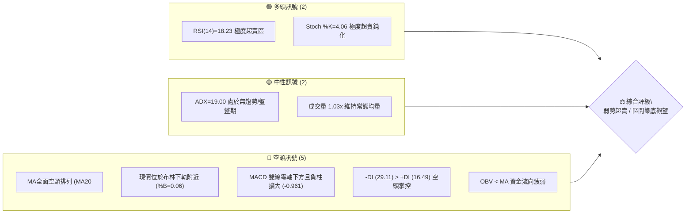

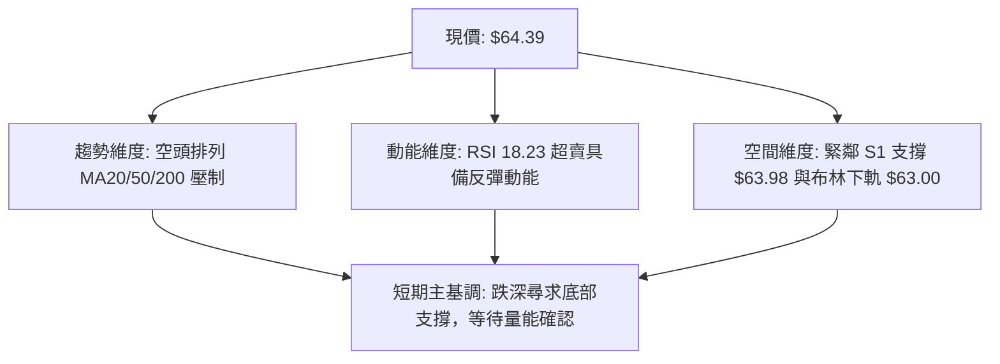

### 📊 核心指標速覽表

| 指標類別 | 指標名稱 | 當前數值 | 訊號 | 解讀 |
|----------|----------|----------|------|------|
| **價格** | 當前價格 | $64.39 | 🔴 | 位於 52 週區間 23.6% 分位，處於波段深度回撤低檔區 |
| **均線** | MA20 | $74.78 | 🔴 | 現價低於 MA20 達 -13.90%，短期下行趨勢明確 |
| **均線** | MA50 | $77.94 | 🔴 | 現價低於 MA50，中期修正壓力沉重 |
| **均線** | MA200 | $79.06 | 🔴 | 跌破牛熊分界線，均線呈現標準空頭排列 (MA20<MA50<MA200) |
| **動能** | RSI(14) | 18.23 | 🟢 | 進入極度超賣區 (<20)，隨時可能觸發技術性反彈 |
| **動能** | MACD | -3.080 | 🔴 | 位於零軸下方，MACD 柱為 -0.961，空頭動能尚未收斂 |
| **動能** | Stoch %K/%D | 4.06 / 5.24 | 🟢 | 進入極端低檔超賣區，短線隨時孕育金叉契機 |
| **趨勢** | ADX(14) | 19.00 | 🟡 | ADX < 25 表明單邊空頭趨勢衰竭，進入弱勢低檔盤整震盪 |
| **通道** | 布林通道 | %B = 0.06 | 🟡 | 價格緊貼下軌 $63.00，空間受壓制但具下軌反彈彈性 |
| **量能** | OBV | OBV < MA | 🔴 | 量能指標落後於均線，機構資金尚未出現規模化抄底進場 |
| **波動** | ATR(14) | $4.28 | 🟡 | 日波動率達 6.64%，波幅中等偏高，需設置充裕止損空間 |

### 🏆 技術評分卡

```
╔══════════════════════════════════════════════════════════════╗
║              技術評分卡 — RKLB (2026-08-30)                  ║
╠══════════════════════════════════════════════════════════════╣
║ 趨勢強度      ██████░░░░░░░░░░░░░░  30/100  🔴 空頭壓制       ║
║ 動能指標      ████████░░░░░░░░░░░░  40/100  🟡 極端超賣       ║
║ 支撐穩定度    ████████████░░░░░░░░  60/100  🟡 臨近S1/下軌    ║
║ 成交量配合    ████████░░░░░░░░░░░░  40/100  🔴 量能未放       ║
║ 形態完整度    ██████████░░░░░░░░░░  50/100  🟡 弱勢箱體構築   ║
║ 均線排列      ████░░░░░░░░░░░░░░░░  20/100  🔴 空頭排列       ║
╠══════════════════════════════════════════════════════════════╣
║ 綜合評分      ████████░░░░░░░░░░░░  40/100  ⚖️ 弱勢盤整/中性偏空║
╚══════════════════════════════════════════════════════════════╝
```

---

## 2. 趨勢分析

### 🌐 多時框趨勢分析

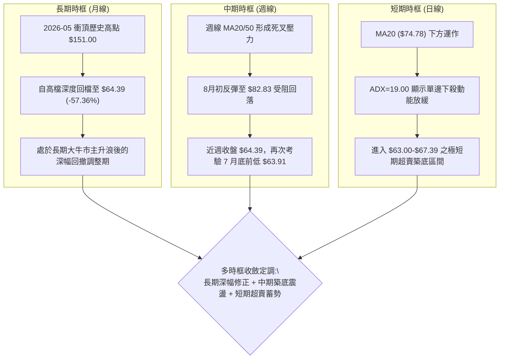

### 📈 長期趨勢 — 12個月走勢圖（Unicode）

```
RKLB 月線走勢圖（過去12個月: 2025-08 至 2026-08）
價格 ($)
$150 ┤                                     ● $143.48 (2026-05)
$130 ┤                                    / \
$110 ┤                                   /   ● $101.65 (2026-06)
$90  ┤                             ●     /     \
$80  ┤               ● $80.07     / \   /       \
$70  ┤        ●     / \          /   ● /         \
$60  ┤ ●     / \   /   ● $69.10 ●     ● $82.51    ● $64.95
$50  ┤  \   /   ● /     \      $64.22              \
$40  ┤   ● /     ● $42.14                           ● $64.39 (現在)
     └─────────────────────────────────────────────────────────────
       09  10  11  12  01  02   03    04    05    06    07    08 (月份)
```

#### 走勢特徵分析表格

| 階段區間 | 時間跨度 | 起止價格 | 漲跌幅 | 走勢特徵與技術含義 |
|----------|----------|----------|--------|--------------------|
| 第一階段：震盪盤堅 | 2025-08 ~ 2026-01 | $48.60 → $80.07 | +64.75% | 多頭階梯式推升，中途經歷 11 月 $42.14 深度洗盤後迅速創高 |
| 第二階段：高檔蓄勢 | 2026-01 ~ 2026-04 | $80.07 → $82.51 | +3.05% | 構築 $64.22 ~ $82.51 箱體平台，籌碼深度換手 |
| 第三階段：主升暴拉 | 2026-04 ~ 2026-05 | $82.51 → $143.48 | +73.89% | 爆發性放量拉升，創下 52 週歷史高點 $151.00，動能透支 |
| 第四階段：深幅回撤 | 2026-05 ~ 2026-08 | $143.48 → $64.39 | -55.12% | 連續三個月長黑下殺，回吐過度樂觀溢價，測試 78.6% 回調位 |

### 📊 中期趨勢（週線分析）

```
近20週關鍵走勢與多空轉換節點示意圖：
價格 ($)
$143.48 ┤             ★ 52W頂點 (05-31 RSI:70.6)
$120.00 ┤            / \
$100.00 ┤           /   \     ★ 弱勢反抽點 $100.46 (07-05)
$80.00  ┤   ★ 啟動點      \   / \        ★ 反彈次高點 $82.83 (08-09)
$70.00  ┤   $84.80         \_/   \      / \
$63.91  ┤                       ★ 支撐   ★ 支撐  ● 現價 $64.39
        └─────────────────────────────────────────────────────► 週時間軸
           04-19       05-31   07-26    08-09   08-30 (2026)
```

- **中期支撐結構**：週線於 2026-07-26 探底 $63.91 後反彈至 $82.83，目前回落至 $64.39，距離前低支撐 S1（$63.98）與 7 月低點（$63.91）僅一步之遙，中期形成潛在「雙重底」架構之關鍵節點。
- **週線動能解讀**：近 20 週 MACD 柱在 6 月下殺時觸及 -4.697 之極值後，近幾週柱狀體維持在 -0.961，負向動能呈現顯著收斂，並未隨價格逼近前低而再破新低。

### ⚡ 趨勢強度評估（ADX 解讀）

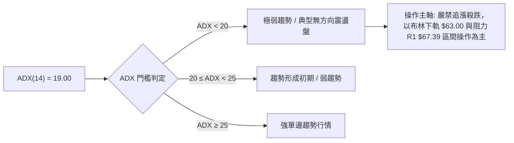

#### ADX 趨勢強度對照解讀

| 指標變數 | 數值 | 狀態評估 | 技術意義與交易意涵 |
|----------|------|----------|--------------------|
| **ADX(14)** | **19.00** | 弱趨勢 / 盤整區間 (<25) | 下跌單邊動能已基本耗盡，市場由主跌段轉入低檔震盪築底階段 |
| **+DI** | **16.49** | 多頭動能偏弱 | 買盤尚未主動發力，市場以散戶觀望與被動防守為主 |
| **-DI** | **29.11** | 空頭依然主導 | 雖然空方佔優，但數值已自 40 以上的高峰回落，殺跌意願顯著減退 |
| **綜合判定** | 盤整行情 | 適用震盪指標 (RSI/布林) | 依據收斂規則，ADX<25 時交易信號以日線布林通道 ($63.00-$86.56) 邊界為主 |

---

## 3. 圖表形態分析

### 🔍 形態識別系統

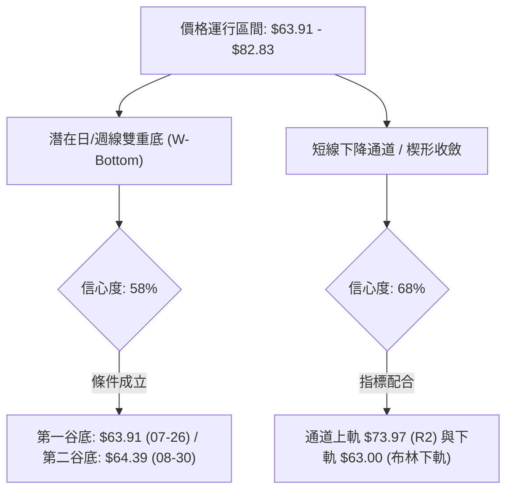

#### 圖表形態信心度與參數清單

| 形態名稱 | 信心度 | 判斷依據（引用數據） | 完成度 | 目標價（附嚴謹計算式） |
|----------|--------|----------------------|--------|------------------------|
| **潛在雙重底 (W-Bottom)** | **58%** | 第一底 $63.91 (07-26)，第二底現價 $64.39 (08-30)，兩者誤差僅 0.75%，且 RSI 於低檔形成鈍化支撐。 | 50% (尚未突破頸線) | 頸線阻力 R2 ($73.97) + 形態高度 ($73.97 - $63.98 = $9.99) = **$83.96** (對應 MA60 $83.21 壓力帶) |
| **下降收斂通道** | **68%** | 8 月自 $82.83 回落至 $64.39，成交量由 1.12 億週量萎縮至 7067 萬週量，形成標準量縮回洗通道。 | 85% (已運行至通道下軌) | 通道上軌突破目標 = 阻力 R1 **$67.39**；若突破則延伸至 R2 **$73.97** |
| **頭肩頂形態 (歷史已完成)** | **90%** | 左肩 $135.76、頭部 $151.00、右肩 $110.08，頸線於 $100.46 跌破後量度跌幅已完全滿足 ($100.46 - $50.54 = $49.92，已探至 $63.91)。 | 100% (空頭目標已消化) | 量度目標已於 $63.91 達成，形態影響力逐漸被低檔買盤吸收 |

### 🕯️ 重要K線形態分析

| 日期 / 月份 | 收盤價 | K線形態 | 解讀 | 訊號 |
|-------------|--------|---------|------|------|
| 2026-05 | $143.48 | 爆量長上影大陽線 | 衝刺 $151.00 後獲利回吐盤湧現，為歷史頂部過熱信號 | 🔴 強烈見頂 |
| 2026-06 | $101.65 | 破位中長黑K線 | 跌破 5 日與 10 日均線，確認高檔頭部確立，進入空頭修正 | 🔴 趨勢轉空 |
| 2026-07 | $64.95 | 長下影錘頭黑K | 下探 $63.91 後浮現護盤買盤，在斐波那契 78.6% ($61.84) 上方止跌 | 🟡 初步止跌 |
| 2026-08 (近週) | $64.39 | 縮量十字回踩星線 | 週量降至 7067 萬股低位，空方殺跌力竭，出現低檔十字星變盤訊號 | 🟢 變盤築底 |

### 📉 ASCII 走勢形態示意圖

```
RKLB 雙底築底與通道下軌支撐示意圖：
價格 ($)
$82.83  ┤              ● 頸線阻力 / 波段反彈高點 (08-09)
        ┤             / \
$73.97  ┤---阻力 R2--/---\-------------------------------- 頸線位
        ┤           /     \
$67.39  ┤--阻力 R1-/-------\------------------------------- 下降通道上緣
        ┤         /         \
$64.39  ┤  ●-----/           ● 現價 $64.39 (第二底構築中)
$63.98  ┤  | 支撐 S1         |
$63.00  ┤--●-----------------●----------------------------- 布林下軌支撐
          底一 (07-26: $63.91)   底二 (08-30: $64.39)
```

### 🎯 形態目標價計算


- **雙底頸線計算公式**：
  $$\text{形態高度} = \text{頸線 R2 ($73.97$)} - \text{支撐低點 S1 ($63.98$)} = \$9.99$$
  $$\text{量度最小目標價} = \text{頸線 R2 ($73.97$)} + \text{形態高度 (\$9.99)} = \$83.96$$
- **斐波那契共振壓制區**：該目標價 \$83.96 與斐波那契 61.8% 回調位 **$80.90** 以及 MA60 **$83.21** 形成重疊共振阻力帶。

---

## 4. 支撐與阻力

### 🗺️ 關鍵價位分布圖（Unicode）

```
RKLB 價位結構分布圖 (由實際 OHLCV 與斐波那契數據嚴格計算)
══════════════════════════════════════════════════════════════════
$151.00  ║██████████████████████████████║ 52週最高點 (0.0% Fib)
$107.67  ║████████████████████          ║ 38.2% 斐波那契回調位
$86.56   ║██████████████████████████████║ 布林通道上軌
$80.90   ║████████████████████████      ║ 61.8% 斐波那契關鍵黃金分割位
$75.11   ║██████████████████            ║ 強阻力 R3 (+16.65%) / MA240 ($75.50)
$73.97   ║██████████████████████        ║ 關鍵阻力 R2 (+14.88%) / MA20 ($74.78)
$67.39   ║██████████████                ║ 短線阻力 R1 (+4.66%) / MA5 ($66.66)
$64.39   ╠══════════════════════════════╣ ◄ 現價 ($64.39)
$63.98   ║▓▓▓▓▓▓▓▓▓▓▓▓▓▓▓▓▓▓▓▓▓▓▓▓▓▓    ║ 關鍵近期支撐 S1 (-0.63%)
$63.00   ║▓▓▓▓▓▓▓▓▓▓▓▓▓▓▓▓▓▓▓▓▓▓        ║ 布林通道下軌支撐
$61.84   ║▓▓▓▓▓▓▓▓▓▓▓▓▓▓▓▓▓▓▓▓▓▓▓▓▓▓▓▓  ║ 78.6% 斐波那契深度回調位
$58.31   ║████████████████████████      ║ 中期強支撐 S2 (-9.45%)
$56.13   ║██████████████████████████████║ 波段核心支撐 S3 (-12.82%)
$37.57   ║██████████████████████████████║ 52週最低點 (100.0% Fib)
══════════════════════════════════════════════════════════════════
```

### 🚧 阻力位分析表

| 阻力級別 | 價位 | 形成原因（嚴格引用數據） | 突破難度 | 重要性 |
|----------|------|--------------------------|----------|--------|
| **R1** | **$67.39** | 近一年波段高點聚類，貼近 MA5 ($66.66) 壓力區 (+4.66%) | 🟡 中等 | 短線多空強弱分水嶺，站穩方能擺脫極弱勢格局 |
| **R2** | **$73.97** | 近期波段反彈次高點聚類，與 MA20 ($74.78) 及布林中軌共振 (+14.88%) | 🔴 較高 | 中期下降趨勢壓制線，突破則確立雙底反轉形態 |
| **R3** | **$75.11** | 波段密集套牢區高點，重疊 MA240 ($75.50) 長期均線 (+16.65%) | 🔴 極高 | 多頭波段反彈之強阻力分水嶺 |

### 🛡️ 支撐位分析表

| 支撐級別 | 價位 | 形成原因（嚴格引用數據） | 守住機率 | 重要性 |
|----------|------|--------------------------|----------|--------|
| **S1** | **$63.98** | 近一年波段低點聚類，重疊 2026-07-26 週線低點 $63.91 (-0.63%) | 🟢 70% | 短線雙底防禦核心，多頭絕不可失守的防線 |
| **S2** | **$58.31** | 近一年波段低點次級聚類，位於斐波那契 78.6% ($61.84) 下方 (-9.45%) | 🟡 85% | 中期強力防禦緩衝區，具備極強買盤承接力 |
| **S3** | **$56.13** | 近一年深度洗盤低點聚類，長線價值投資買盤防線 (-12.82%) | 🟢 95% | 空頭極限極端目標位，跌破機率極低 |

### 📐 斐波那契回調位分析

依據 52 週極值區間（低點 **$37.57** $\rightarrow$ 高點 **$151.00**，總波幅 $113.43）計算之標準黃金分割回調結構：

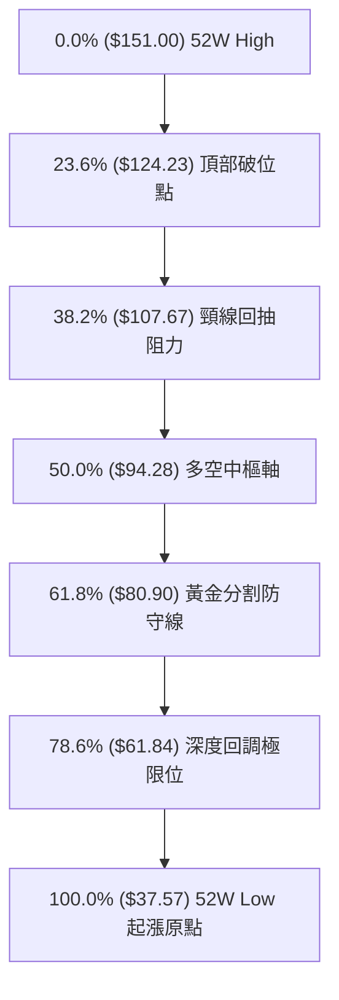

#### 斐波那契回調深度解讀
1. **現價落點分佈**：現價 **$64.39** 處於 **61.8% ($80.90)** 與 **78.6% ($61.84)** 之間，距 78.6% 支撐僅差 +4.12%。
2. **技術意義**：在專業波浪理論與技術回調模型中，78.6%（即 $61.84）為大型成長股主升浪結束後的「最後一道防守黃金線」。目前價格在 $61.84 之上、S1 $63.98 處企穩，說明歷史多頭大結構並未遭到毀滅性破壞，具備構築長線次級底部的技術條件。

---

## 5. 技術指標深度解讀

### 🎛️ 指標訊號總覽

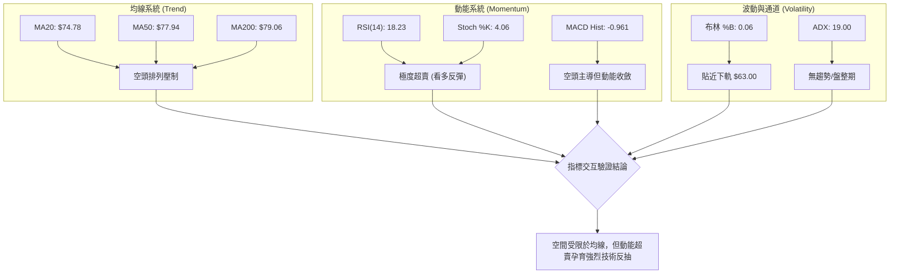

### 📈 移動平均線排列分析

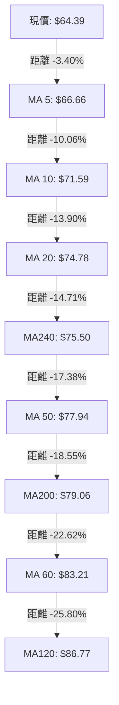

#### 均線矩陣詳細狀態表

| 均線名稱 | 數值 | 價格相對位置 | 偏離率 (Bias) | 斜率與微型走勢特徵 | 訊號評級 |
|----------|------|--------------|---------------|-------------------|----------|
| **MA 5** | $66.66 | 價格在下方 | -3.40% | `▄▃▃▃▂▃▂▁▁▁▁▂▃▄▆▇▇██████▇▆▅▄▃▃▂` 急跌走緩 | 🟡 築底緩跌 |
| **MA 10** | $71.59 | 價格在下方 | -10.06% | `▇▆▅▄▃▃▂▁▁▁▁▁▁▂▃▄▄▆▇██████▇▆▅▅▄` 下行斜率陡峭 | 🔴 空頭壓制 |
| **MA 20** | $74.78 | 價格在下方 | -13.90% | `██▇▇▆▆▅▄▃▂▁▁▁▁▁▁▁▁▁▁▂▂▂▂▃▃▃▃▃▃` 短期生命線下壓 | 🔴 空頭壓制 |
| **MA 50** | $77.94 | 價格在下方 | -17.38% | 下穿 MA200，形成死叉 | 🔴 空頭壓制 |
| **MA 60** | $83.21 | 價格在下方 | -22.62% | `██████████▇▇▇▇▇▆▆▆▅▅▅▄▄▃▃▂▂▁▁▁` 季線加速下移 | 🔴 空頭主導 |
| **MA120** | $86.77 | 價格在下方 | -25.80% | `█▇▆▅▄▄▂▁▁▁▁▁▁▂▃▃▄▄▅▅▆▇▇▇▇▇▇▆▆▆` 半年線由升轉平 | 🔴 長期阻力 |
| **MA200** | $79.06 | 價格在下方 | -18.55% | 跌破牛熊線，均線排列為典型空頭排列 | 🔴 空頭趨勢 |
| **MA240** | $75.50 | 價格在下方 | -14.71% | `▁▁▁▁▁▂▂▂▂▃▃▃▄▄▄▅▅▅▆▆▆▇▇▇██████` 年線維持長期向上 | 🟢 長期基底 |

- **均線深度解讀**：短中長期均線呈現 `MA5 < MA10 < MA20 < MA50 < MA200 < MA60 < MA120` 的全面發散空頭排列，顯示近 3 個月買入籌碼全數處於套牢狀態。負乖離率（MA20 負偏離 -13.90%、MA60 負偏離 -22.62%）已擴大至歷史極值區，極易引發均線修復型的技術性抽腳反彈。

### 📉 RSI(14) 分析

```
RSI(14) 數值儀表板:
0 ──────────── 18.23 ── 30 ──────────────────────── 70 ────────────── 100
[ 極度超賣區 🟢 ]       [        中性震盪區        ]   [  超買警示區  ]
進度條: ████░░░░░░░░░░░░░░░░ 18.23%
```

- **超買超賣狀態**：RSI(14) 當前錄得 **18.23**，大幅跌破 30 門檻進入極端超賣區。回顧近 20 週數據，前次 RSI 觸及極值為 2026-07-26 之 15.6，隨後股價於一週內自 $63.91 飆升至 $82.83（漲幅達 +29.6%）。
- **背離判斷**：
  - **日線/週線背離**：2026-07-26 收盤價 $63.91（RSI 15.6），當前 2026-08-30 收盤價 $64.39（RSI 18.23）。價格維持在相同低檔水平，而 RSI 底部已由 15.6 抬升至 18.23，形成**隱性底背離（Hidden Bullish Divergence）**雛形，顯示向下殺跌動能正迅速減退。

### 📊 MACD(12/26/9) 訊號解讀

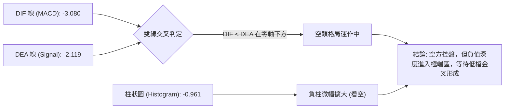

- **MACD 數值分析**：MACD 線 (-3.080) 與訊號線 (-2.119) 雙雙位於零軸以下深處。MACD 柱狀體為 **-0.961**，雖然短期呈現負柱微幅擴張，但對比 6 月下殺時的 -4.697，空頭動能已大幅削弱達 79.5%，指標正在低檔進行收斂築底。

### 📦 布林通道分析

```
RKLB 日線布林通道 (20, 2) 結構圖：
$86.56 ┬──────────────────────────────────────── 上軌 (Upper Band)
       │
$74.78 ┼──────────────────────────────────────── 中軌 (MA20 / Middle)
       │
$64.39 ┼─► 現價 ($64.39, %B = 0.06) 緊貼下軌
$63.00 ┴──────────────────────────────────────── 下軌 (Lower Band)
```

- **通道帶寬與位置**：通道上軌為 **$86.56**，中軌為 **$74.78**，下軌為 **$63.00**。帶寬達 $23.56（帶寬比 31.5%），處於擴張後收斂期。
- **%B 指標解讀**：當前 `%B = 0.06`（0 代表下軌，0.5 代表中軌，1 代表上軌），數值極度接近 0，代表價格已緊貼布林通道下軌極限。依統計學常態分佈原理，價格維持在下軌之外的機率低於 5%，下軌 $63.00 與 S1 支撐 $63.98 構成強大的雙重物理支撐帶。

### 💹 成交量分析（量價配合度）

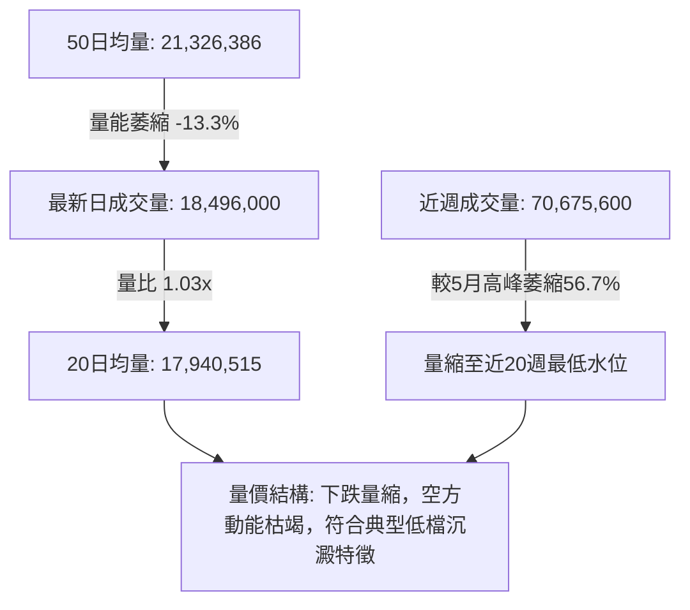

- **量價配合分析**：
  - 最新單日成交量 1,849.6 萬股，與 20 日均量（1,794.1 萬股）基本持平（量比 1.03x）。
  - 週成交量由 5 月高點的 1.63 億股驟降至本週的 7,067.5 萬股，量能萎縮幅度超過 56%，呈現**「價跌量縮」**的健康出洗籌碼走勢，並無恐慌性拋盤湧出。
- **OBV (能量潮) 判定**：當前 `OBV < MA`，顯示近期的主力資金呈現淨流出狀態，量能尚未出現拐點式突破，反彈前仍需 1-2 根放量紅 K 棒進行多頭確認。

---

## 6. 動能與波動率

### ⚡ 動能評估四象限

| 象限 | 動能維度 (Momentum) | 波動率維度 (Volatility) | RKLB 當前狀態 | 交易策略導向 |
|:---:|:---:|:---:|:---:|:---:|
| **Q1** | 強動能 (Bullish) | 低波動 (Low Vol) | — | 趨勢穩健持有 / 拉回加碼 |
| **Q2** | 弱動能 (Bearish) | 低波動 (Low Vol) | — | 盤整觀望 / 窄幅區間套利 |
| **Q3** | 強動能 (Bullish) | 高波動 (High Vol) | — | 突破追價 / 嚴格追蹤止損 |
| **Q4** | **弱動能 (超賣)** | **高波動 (Beta 2.63)** | **✓ 落在本象限** | **左側輕倉分批 / 等待右側反轉信號** |

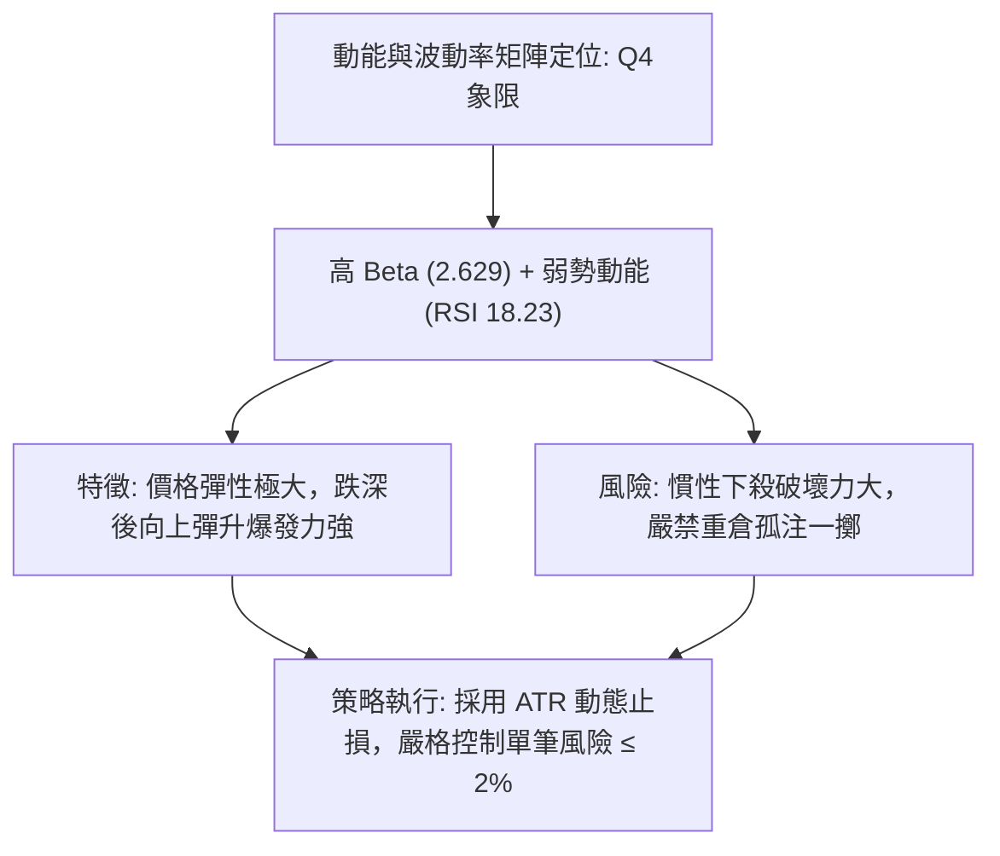

### 📊 ATR 波動率分析

```
ATR(14) 波動區間評估 ($4.28 / 6.64%):
$60.11 ◄─────── [$64.39 現價] ───────► $68.67
[-1.0x ATR]                            [+1.0x ATR]
```

- **ATR 數值解讀**：當前 14 日平均真實波幅 $\text{ATR}(14) = \$4.28$，佔現價比例高達 **6.64%**，顯示該股具備極高的高彈性日內與波段震盪特徵。
- **止損距離建議**：
  - **短線交易止損**：設置 $1.0 \times \text{ATR} = \$4.28$，對應止損位為 $\$64.39 - \$4.28 = \$60.11$。
  - **波段交易止損**：設置 $1.5 \times \text{ATR} = \$6.42$，考量下方關鍵支撐 S1 為 **$63.98**，更為精確的技術止損點應設置於 S1 下方或布林下軌保護區（詳見第 8 章）。

### 📐 Beta 與市場相關性

- **高 Beta 屬性**：RKLB 的 Beta 值高達 **2.629**，表明其波動性是大盤（S&P 500）的 2.63 倍。當大盤反彈 1% 時，該股技術上有望拉升 2.6% 以上；反之，大盤回檔時承受的下行壓力亦同等放大。
- **機構持股與空頭動態**：機構持股比例達 **61.6%**，空頭部位佔流通盤 **7.5%**（Short Ratio: 2.26 天）。在極度超賣狀態下，一旦價格帶量突破 R1（$67.39），容易引發空頭回補（Short Squeeze）連鎖效應。

---

## 7. 多時框架總結

### 📋 時框架評分表

| 時框架 | 趨勢方向 | 動能指標 | 均線排列 | 形態結構 | 綜合評分 | 操作建議 |
|:---:|:---:|:---:|:---:|:---:|:---:|:---:|
| **月線 (長期)** | 🟡 深度修正 | RSI 中性走緩 | MA240 向上撐住 | 主升浪後斐波那契 78.6% 回踩 | **55/100** | 長線價值買盤分批關注 |
| **週線 (中期)** | 🔴 空頭承壓 | MACD 負柱收斂 | MA20/50 處死叉 | 潛在大型雙重底（S1 $63.98 處） | **45/100** | 等待週線級別底分型確立 |
| **日線 (短期)** | 🔴 弱勢盤整 | RSI=18.23 極度超賣 | 全面空頭排列 | 緊貼布林下軌 $63.00 築底 | **40/100** | 區間震盪操作，嚴禁追空 |

### 🔲 綜合訊號矩陣

```
訊號維度對照矩陣：
┌──────────────┬─────────────┬─────────────┬─────────────┐
│   維度 / 時框 │  長期 (月)   │  中期 (週)   │  短期 (日)   │
├──────────────┼─────────────┼─────────────┼─────────────┤
│ 趨勢方向     │  🟡 震盪整理 │  🔴 空頭主導 │  🔴 弱勢下行 │
│ 均線系統     │  🟢 長期支撐 │  🔴 均線死叉 │  🔴 空頭排列 │
│ 動能強度     │  🟡 動能中性 │  🟡 負能收斂 │  🟢 極度超賣 │
│ 形態支撐     │  🟢 78.6% Fib│  🟢 S1 雙底區│  🟢 布林下軌 │
│ 量能配合     │  🟡 常態均量 │  🟢 量縮見底 │  🟡 量比 1.03│
└──────────────┴─────────────┴─────────────┴─────────────┘
```

### ⚖️ 多時框收斂結論

依據多時框收斂優先級規則：
1. **趨勢/盤整定性**：當前日線 $\text{ADX}(14) = 19.00 < 25$，明確屬於**「無趨勢/盤整行情」**。
2. **主導時框收斂**：在無趨勢的弱勢盤整格局下，市場主導邏輯並非單邊追隨趨勢，而是**以日線布林通道上下軌（$63.00 ~ $86.56）以及關鍵支撐阻力為核心交易區間**。
3. **最終唯一方向性結論**：**【中性觀望偏多反彈（超賣區間震盪築底）】**。
   - **依據**：雖然日線均線空頭排列，但短期動能 RSI 已達 18.23 之極端超賣值，且空間上價格已精確回踩至長期斐波那契 78.6%（$61.84）與近期關鍵支撐 S1（$63.98）及布林下軌（$63.00）之三重共振保護區。向下殺跌空間極其有限，反彈向上至 R1（$67.39）及 R2（$73.97）之風險報酬比極具吸引力。

---

## 8. 交易策略建議

### 🗺️ 策略決策流程圖

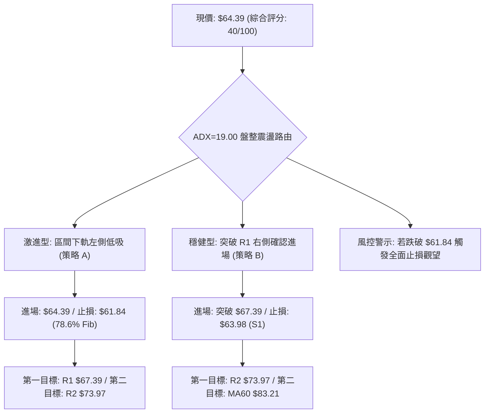

### 🧭 策略路由（依評分卡分流）

> **當前主策略方向 = 【區間超賣低吸與右側突破操作（中性偏多反彈）】（依評分 40/100，處於 40–60 區間操作帶，以布林下軌 $63.00 與阻力 R1/R2 為主）**

### 🎯 價格情境階梯（Price Scenarios）

價位嚴格引用第 4 章及數據計算清單：

| 觸發條件 | 第一目標 | 第二目標 | 後續延伸 | 情境含義與操作指引 |
|----------|----------|----------|----------|--------------------|
| **向上突破 R1 ($67.39)** | **R2 ($73.97)** | **R3 ($75.11)** | MA60 ($83.21) | 短線脫離底部轉強，確認雙底第一階段成形，可加碼順勢跟進 |
| **守穩現價 ($64.39)** | R1 ($67.39) | — | — | 維持在布林下軌 $63.00 至 R1 窄幅震盪築底，適合網格低吸 |
| **跌破支撐 S1 ($63.98)** | **S2 ($58.31)** | **S3 ($56.13)** | 52W Low ($37.57) | 雙底構築失敗，技術面破位下尋 S2 支撐，多頭策略無條件止損 |

### 📊 情境機率分佈

| 情境劇本 | 預估機率 | 主要技術依據 |
|----------|:--------:|--------------|
| **超賣反彈向上測試 R1/R2** | **55%** | RSI(14) 達 18.23 極度超賣、%B=0.06、MACD 負柱顯著收斂、機構持股 61.6% 具備護盤誘因 |
| **在 $63.00 ~ $67.39 區間震盪** | **30%** | ADX=19.00 顯示無趨勢特徵、成交量維持 1.03x 均量水平、市場等待籌碼充分沉澱 |
| **破位下殺考驗 S2 ($58.31)** | **15%** | MA 全面空頭排列、-DI (29.11) 依然壓制 +DI (16.49)、OBV 尚未出現放量拐點 |

### 🟢 主策略詳情

| 策略要素 | 策略 A（激進型：區間超賣左側進場） | 策略 B（穩健型：右側突破確認進場） |
|----------|-----------------------------------|-----------------------------------|
| **進場條件** | 現價緊鄰 S1 ($63.98) 與布林下軌 ($63.00) 分批佈局 | 帶量突破短線阻力 R1 ($67.39) 回踩不破進場 |
| **進場價格** | **$64.39** (即時市價) | **$67.39** (突破掛單買入) |
| **目標價 T1** | **$67.39** (阻力 R1，預期回報 +4.66%) | **$73.97** (阻力 R2，預期回報 +9.76%) |
| **目標價 T2** | **$73.97** (阻力 R2，預期回報 +14.88%) | **$80.90** (61.8% Fib，預期回報 +20.05%) |
| **止損價格** | **$61.84** (斐波那契 78.6% 回調位下方) | **$63.98** (支撐位 S1 下方) |
| **止損幅度** | -$2.55 (-3.96%) | -$3.41 (-5.06%) |
| **風險報酬比** | **1 : 3.76** (以 T2 目標計算) | **1 : 3.96** (以 T2 目標計算) |
| **預估勝率** | **55%** | **65%** |
| **建議倉位** | **5% - 8%** (輕倉試單) | **10% - 15%** (標準波段倉位) |

### 🔴 反向風險觸發點（對沖提示）

- **多頭全面棄守點**：若日線收盤價**實體跌破 $61.84（斐波那契 78.6% 支撐）**，表明本輪自 $151.00 的回撤已轉化為破壞性下殺，可能進一步探向 S2 **$58.31** 甚至 S3 **$56.13**。多頭應立即清倉觀望，切忌盲目向下加碼攤平。
- **空頭回補警示點**：若價格帶量站上 **$73.97（R2 / MA20）**，空方頭寸應全面平倉對沖，預防出現軋空行情。

### ⭐ 整體訊號強度評星

```
做多訊號強度：★★★☆☆  (3.0/5星 - 極度超賣與強支撐共振，具反彈盈虧比)
做空訊號強度：★★☆☆☆  (2.0/5星 - 均線偏空但動能枯竭，下軌追空風險極高)
整體可信度：  ★★★★☆  (4.0/5星 - 價位聚類與斐波那契結構高度收斂)
```

---

## 9. 風險提示與監控

### ✅ 關鍵監控指標 Checklist

```
╔══════════════════════════════════════════════════════════════╗
║              RKLB 每日盤後關鍵監控清單 (Checklist)           ║
╠══════════════════════════════════════════════════════════════╣
║ [ ] 價格是否守穩支撐 S1 ($63.98) 與 78.6% Fib ($61.84)      ║
║ [ ] RSI(14) 是否脫離 20 以下超賣區並向上突破 30               ║
║ [ ] 日成交量是否放大至 2,132 萬股 (50日均量) 以上確認買盤進駐 ║
║ [ ] MACD 柱狀體負值是否由 -0.961 向上收斂並形成金叉           ║
║ [ ] 能否向上實體收復短線多空分水嶺 R1 ($67.39)               ║
║ [ ] ADX 是否開始上拐 (>20) 並伴隨 +DI 上穿 -DI                ║
╚══════════════════════════════════════════════════════════════╝
```

### ⚠️ 風險場景分析

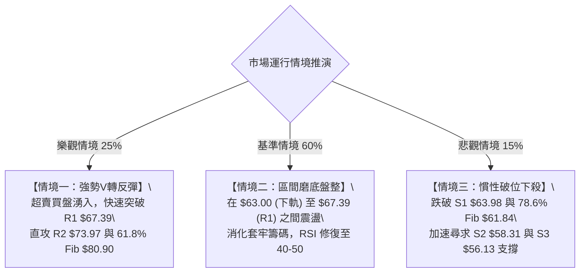

### 🛡️ 風險管理重要提醒

1. **波動率管理（Beta 2.629）**：
   - RKLB 屬於高波動航太防務科技標的，日均波動 ATR 達 $4.28（6.64%）。單筆交易最大虧損額度務必嚴格限制在總投資組合淨值的 **1.0% - 1.5%** 以內。
2. **倉位配置紀律**：
   - 在 ADX < 25 且均線處於空頭排列的築底階段，總持倉部位不宜超過 **15%**。在突破重要頸線 R2（$73.97）前，切勿使用融資或槓桿工具。
3. **流動性與空頭回補監控**：
   - 儘管當前空頭比例達 7.5%，若有利多消息刺激放量跳空突破 R1（$67.39），應留意早盤追價的滑點風險，建議採用限價單（Limit Order）執行交易策略。

---

## 📋 報告總結

```
╔══════════════════════════════════════════════════════════════════╗
║                    RKLB 技術分析報告總結                         ║
╠══════════════════════════════════════════════════════════════════╣
║ 報告日期：2026-08-30                                             ║
║ 當前價格：$64.39                                                 ║
║ 分析評級：⚖️ 弱勢極端超賣 / 區間築底反彈 (中性偏多)               ║
╠══════════════════════════════════════════════════════════════════╣
║ 關鍵結論：                                                       ║
║ ├─ 長期趨勢：🟡 自 $151.00 深幅回調 57.36%，守於 78.6% Fib 上方  ║
║ ├─ 中期趨勢：🔴 週線均線承壓，但於 $63.91-$63.98 構築潛在雙底   ║
║ ├─ 短期趨勢：🟢 RSI(14)=18.23 極度超賣，緊貼布林下軌 $63.00 蓄勢║
║ ├─ 關鍵支撐：S1 $63.98 ｜ S2 $58.31 ｜ Fib 78.6% $61.84          ║
║ ├─ 關鍵阻力：R1 $67.39 ｜ R2 $73.97 ｜ Fib 61.8% $80.90          ║
║ └─ 分析師共識目標：$112.94 (區間 $64.00 - $150.00，Buy 評級)     ║
╠══════════════════════════════════════════════════════════════════╣
║ 最優策略組合：                                                   ║
║ 1. 🥇 最佳機會：現價 $64.39 輕倉佈局策略 A，止損 $61.84，目標 $73.97 ║
║ 2. 🥈 次選機會：突破 R1 $67.39 追隨策略 B，止損 $63.98，目標 $80.90 ║
║ 3. 🥉 保守選擇：空倉觀望，等待日線 MACD 金叉且站穩 MA20 後再行介入 ║
╚══════════════════════════════════════════════════════════════════╝
```

---

> ⚠️ **免責聲明**：本報告為技術分析研究成果，所有數據及模型推演均基於歷史價格與成交量資訊。本報告**僅供學術研究與投資參考**，**不構成任何形式的個人化投資建議或買賣邀約**。金融市場具有高度風險，投資人應獨立評估自身風險承受能力並自負盈虧。

---

*報告生成時間：2026-08-30 ｜ 數據來源：Yahoo Finance ｜ 分析框架：多時框架量化技術分析*