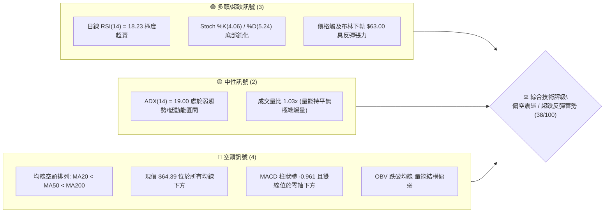
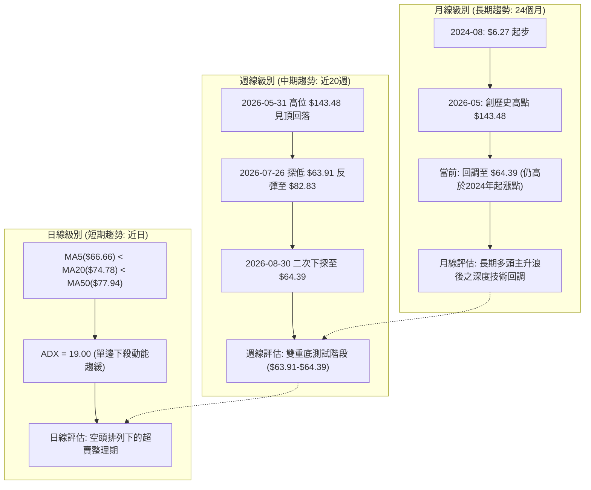
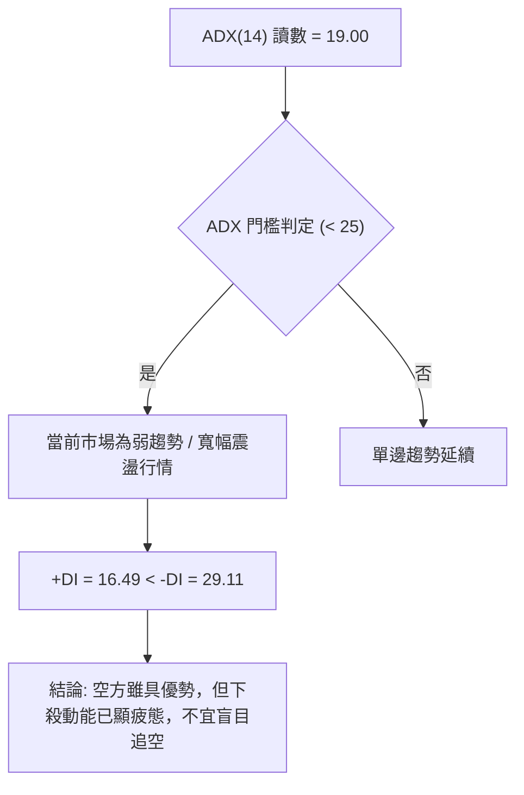
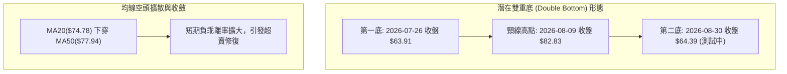
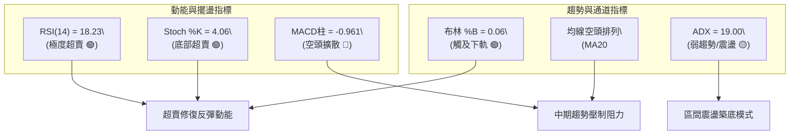
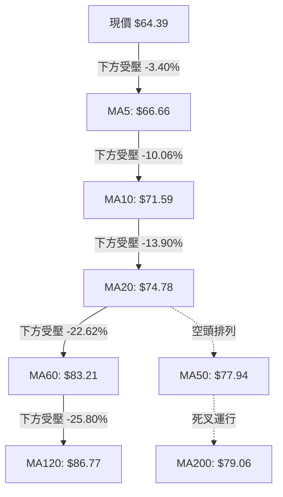
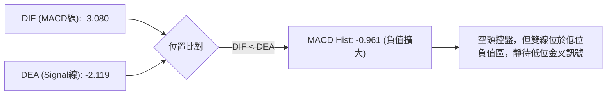
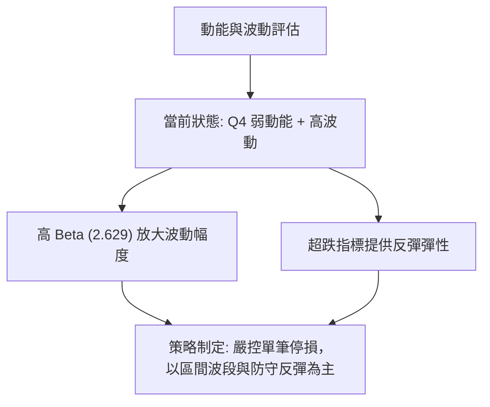
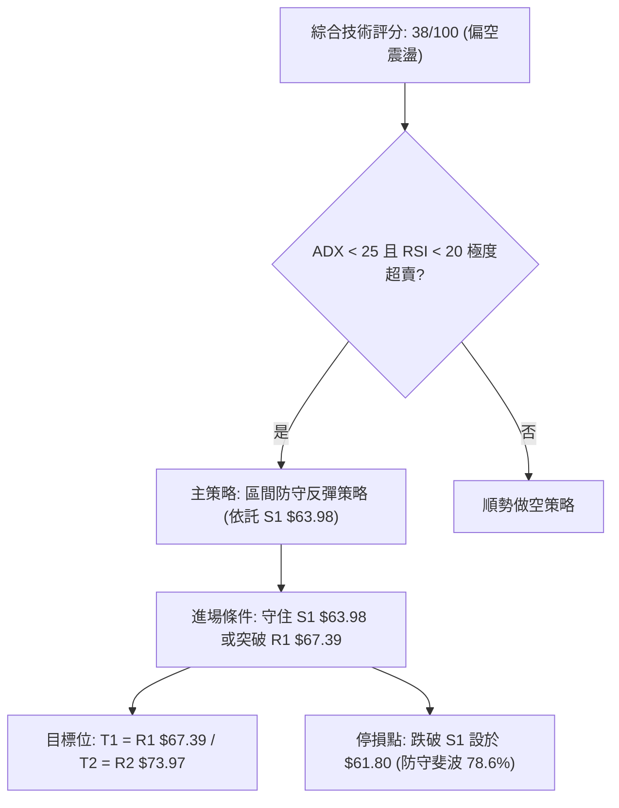
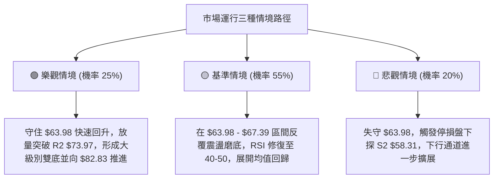

# RKLB 技術分析報告

> **報告日期**：2026-08-31 ｜ **語言**：繁體中文 ｜ **數據來源**：Yahoo Finance ｜ **當前價格**：$64.39

---

## 目錄

| 章節 | 內容 |
|------|------|
| [1. 技術面概覽](#1-技術面概覽) | 訊號儀表板、核心指標、評分卡 |
| [2. 趨勢分析](#2-趨勢分析) | 多時框趨勢、長中短期走勢、ADX解讀 |
| [3. 圖表形態分析](#3-圖表形態分析) | 形態識別、K線組合、目標價推算 |
| [4. 支撐與阻力](#4-支撐與阻力) | 關鍵價位、斐波那契回調結構 |
| [5. 技術指標深度解讀](#5-技術指標深度解讀) | MA/RSI/MACD/布林通道/成交量 |
| [6. 動能與波動率](#6-動能與波動率) | 動能四象限、ATR、Beta敏感度 |
| [7. 多時框架總結](#7-多時框架總結) | 時框架評分矩陣、多時框收斂 |
| [8. 交易策略建議](#8-交易策略建議) | 策略路由、主策略、反向風控觸發 |
| [9. 風險提示與監控](#9-風險提示與監控) | 監控指標Checklist、情境分析 |
| [10. 報告總結](#10-報告總結) | 核心結論與執行綱領 |

---

## 1. 技術面概覽

### 🎯 技術訊號儀表板



### 📊 核心指標速覽表

| 指標類別 | 指標名稱 | 當前數值 | 訊號 | 解讀 |
|----------|----------|----------|:----:|------|
| **價格** | 當前價格 | $64.39 | 🔴 | 位於 52 週高點 ($151.00) 下跌 57.36% 之弱勢回檔區 |
| **均線** | MA20 | $74.78 | 🔴 | 價格低於 MA20 達 -13.90%，短期下行斜率陡峭 |
| **均線** | MA50 | $77.94 | 🔴 | 價格低於 MA50，中期生命線受壓 |
| **均線** | MA200 | $79.06 | 🔴 | 價格低於 MA200，失守長期牛熊分界線 |
| **均線系統**| 均線排列 | 空頭排列 | 🔴 | MA5($66.66) < MA20($74.78) < MA50($77.94) < MA200($79.06) |
| **動能** | RSI(14) | 18.23 | 🟢 | 深度進入極度超賣區（<20），短線存在強烈技術修復動能 |
| **動能** | MACD | -3.080 | 🔴 | MACD線 低於 Signal線 (-2.119)，Hist 為 -0.961，空方控盤 |
| **動能** | Stoch %K/%D | 4.06 / 5.24 | 🟢 | 隨機指標落入超賣極值，短線向下動能耗盡跡象 |
| **趨勢** | ADX(14) | 19.00 | 🟡 | 數值 < 25 表明非強單邊趨勢，進入寬幅震盪整理與尋底階段 |
| **方向** | +DI / -DI | 16.49 / 29.11| 🔴 | -DI 大幅高於 +DI，空方力道佔據主導優勢 |
| **通道** | 布林通道 | %B = 0.06 | 🟢 | 現價極度貼近下軌 ($63.00)，跌勢觸及統計學波動下限 |
| **波動** | ATR(14) | $4.28 (6.64%)| 🟡 | 每日平均波動幅度顯著，具備較高短線交易彈性與停損要求 |
| **量能** | 最新量 / 20日均量 | 18.50M / 17.94M| 🟡 | 量比 1.03x，量能未現恐慌性拋售，呈縮量尋底走勢 |

### 🏆 技術評分卡

```
╔══════════════════════════════════════════════════════════════╗
║              技術評分卡 — RKLB (2026-08-31)                  ║
╠══════════════════════════════════════════════════════════════╣
║ 趨勢強度 (Trend)     ██████░░░░░░░░░░░░░░  30/100  🔴 空頭格局 ║
║ 動能指標 (Momentum)  ████████░░░░░░░░░░░░  40/100  🟡 極度超賣 ║
║ 支撐穩定度 (Support) ██████████░░░░░░░░░░  50/100  🟡 考驗S1   ║
║ 成交量配合 (Volume)  ████████░░░░░░░░░░░░  40/100  🔴 量能疲弱 ║
║ 形態完整度 (Pattern) ██████░░░░░░░░░░░░░░  30/100  🔴 下行通道 ║
║ 均線排列 (MA System) ██████░░░░░░░░░░░░░░  30/100  🔴 空頭排列 ║
╠══════════════════════════════════════════════════════════════╣
║ 綜合技術評分         ████████░░░░░░░░░░░░  38/100  🔴 偏空震盪 ║
╚══════════════════════════════════════════════════════════════╝
```

---

## 2. 趨勢分析

### 🌐 多時框趨勢分析



### 📈 長期趨勢 — 12個月走勢圖（Unicode）

```
RKLB 月線走勢圖（過去12個月：2025-09 至 2026-08）
價格軸 ($)
$150 ┤                                     ● $143.48 (2026-05 高點)
$130 ┤                                    / \
$110 ┤                                   /   ● $101.65 (2026-06)
$90  ┤                    ● $80.07      /     \
$70  ┤        ● $62.98   /        ● $82.51     \
$65  ┤       /   \      /          \            ●━━● $64.39 (2026-08 現價)
$50  ┤  ●━━━●     ●    /            \
$40  ┤ $47.91      $42.14            \
     └────────────────────────────────────────────────────────────
        09  10  11  12  01  02  03  04  05  06  07  08 (月份: 2025-09 至 2026-08)
```

**月度收盤走勢特徵分析表格**：

| 階段 | 涵蓋月份 | 起始至結束價 | 漲跌幅 | 走勢特徵與量價解讀 |
|------|----------|--------------|:------:|--------------------|
| **盤整蓄勢期** | 2025-09 ~ 2025-11 | $48.60 → $42.14 | -13.29% | 於 $42.14 建立強烈底部支撐，清洗浮額 |
| **主升浪推進** | 2025-12 ~ 2026-04 | $69.76 → $82.51 | +18.28% | 階梯式推升，均線呈現標準多頭擴散 |
| **非理性噴出** | 2026-04 ~ 2026-05 | $82.51 → $143.48| +73.89% | 買盤爆發推動股價倍增，月線 RSI 觸及極值超買區 |
| **深度回撤期** | 2026-05 ~ 2026-08 | $143.48 → $64.39| -55.12% | 連續三個月長陰回調，回吐多數漲幅，回測長期支撐位 |

### 📊 中期趨勢（週線分析）

```
週線級別近期壓力與支撐示意圖：
$82.83 ────────────────────────────── 近期週線反彈高點 (2026-08-09)
       \
        \   MA20: $74.78 / R2: $73.97 (強阻力區)
         \─── R1: $67.39
          \
$64.39 ━━━━●━━━━━━━━━━━━━━━━━━━━━━━━ 當前價格
            │
$63.91 ─────┴──────────────────────── 近期週線波段低點 (2026-07-26) / S1: $63.98
$58.31 ────────────────────────────── 週線下檔防守 S2
```

### ⚡ 趨勢強度評估（ADX 解讀）



| 指標變數 | 當前數值 | 參考標準區間 | 趨勢判定解讀 |
|----------|:--------:|:------------:|--------------|
| **ADX(14)** | **19.00** | < 20: 極弱 / 無趨勢；20-25: 弱趨勢；> 25: 強趨勢 | 市場由單邊下殺轉入築底震盪期 |
| **+DI** | **16.49** | > 25 偏多主導 | 多頭動能低迷，買盤進攻意願暫未激發 |
| **-DI** | **29.11** | > 25 偏空主導 | 空頭佔優，但數值已自高位走平回落 |
| **方向差 (-DI - +DI)**| **12.62** | 差距收斂中 | 顯示下行壓力邊際減弱 |

---

## 3. 圖表形態分析

### 🔍 形態識別系統



**圖表形態特徵與信心度評估表**：

| 形態類型 | 信心度 | 判斷依據（引用數據） | 完成度 | 目標價（附計算式） |
|----------|:------:|----------------------|:------:|--------------------|
| **潛在日/週線雙底** | 58% | 2026-07-26 低點 $63.91 與當前價 $64.39 形成對應支撐（S1: $63.98） | 50% (待突破頸線) | 頸線 $82.83 + 形態高度($82.83 - $63.91 = $18.92) = **$101.75** |
| **下行通道 / 旗形整理** | 68% | 自 $143.48 見頂後沿 MA20 軌道下行，目前觸及布林下軌 $63.00 | 85% (已近通道下緣) | 突破通道上軌 R2($73.97) 則確認目標回測斐波那契 61.8% **$80.90** |
| **頭肩頂形態** | 42% | 數據中未偵測到完整右肩結構，訊號不足，僅做指標型解讀 | -- | 數據不足不予推算 |

### 🕯️ 重要K線形態分析

| 日期 / 月份 | 收盤價 | RSI | MACD柱 | K線走勢形態解讀 | 多空訊號 |
|-------------|:------:|:---:|:------:|-----------------|:--------:|
| **2026-05-31** | $143.48 | 70.6 | +1.780 | 歷史巨量長上影反轉K線，多頭極限力竭 | 🔴 看空見頂 |
| **2026-07-26** | $63.91  | 15.6 | -0.618 | 極度超賣長下影十字星，首次探明中期支撐 | 🟢 止跌訊號 |
| **2026-08-09** | $82.83  | 68.6 | +2.940 | 強勁反彈大陽線，週線 MACD 翻紅確認頸線阻力 | 🟢 短線反彈 |
| **2026-08-30** | $64.39  | 18.2 | -0.961 | 二次探底縮量陰線，考驗 $63.91 支撐有效性 | 🟡 關鍵測試 |

### 📉 ASCII 走勢形態示意圖

```
潛在雙重底 (W底) 形態結構解析：
$82.83 ───────────────────────● (2026-08-09 頸線阻力高點)
                             / \
                            /   \
                           /     \
                          /       \
$64.39 ──────────────────/─────────● (當前價格：測試第二底)
$63.91 ───● (2026-07-26 第一底)     │
          └─────────────────────────┴──── 支撐防守區間 [$63.91 - $63.98]
```

### 🎯 形態目標價計算

1. **雙重底理論計算**：
   - 形態底部低點：$63.91
   - 形態頸線高點：$82.83
   - 形態垂直高度：$82.83 - $63.91 = $18.92
   - 向上突破目標價：$82.83 + $18.92 = **$101.75**（需有效放量突破頸線 $82.83 為前提）
2. **短期超賣修復目標**：
   - 第一反彈目標（回測 R1）：**$67.39**
   - 第二反彈目標（回測布林中軌 / MA20 / R2）：**$73.97** ~ **$74.78**

---

## 4. 支撐與阻力

### 🗺️ 關鍵價位分布圖（Unicode）

```
╔══════════════════════════════════════════════════════════════╗
║              RKLB 關鍵價位結構分布圖                         ║
╠══════════════════════════════════════════════════════════════╣
║ $75.11 ║████████████████████████████████║ 強阻力 R3          ║
║ $73.97 ║████████████████████████        ║ 關鍵阻力 R2 (MA20) ║
║ $67.39 ║████████████████                ║ 近期反彈阻力 R1    ║
║ $64.39 ╠════════════════════════════════╣ ◄ 現價             ║
║ $63.98 ║▓▓▓▓▓▓▓▓▓▓▓▓▓▓▓▓▓▓▓▓▓▓▓▓        ║ 關鍵波段支撐 S1    ║
║ $58.31 ║████████████████████████        ║ 強支撐 S2          ║
║ $56.13 ║████████████████████████████████║ 核心防守支撐 S3    ║
╚══════════════════════════════════════════════════════════════╝
```

### 🚧 阻力位分析表

| 阻力級別 | 價位 | 距離現價幅度 | 形成原因與籌碼技術面背景 | 突破難度 | 重要性 |
|:--------:|:----:|:------------:|--------------------------|:--------:|:------:|
| **R1** | **$67.39** | +4.66% | 短期均線 MA5 ($66.66) 與近週反彈密集成交區下緣 | 🟡 中等 | ★★★☆☆ |
| **R2** | **$73.97** | +14.88% | 近期密集高點聚類，重疊布林中軌 / MA20 ($74.78) | 🔴 較高 | ★★★★☆ |
| **R3** | **$75.11** | +16.65% | 240日均線 ($75.50) 及前波跌破之平台強阻力帶 | 🔴 極高 | ★★★★★ |

### 🛡️ 支撐位分析表

| 支撐級別 | 價位 | 距離現價幅度 | 形成原因與籌碼技術面背景 | 守住機率 | 重要性 |
|:--------:|:----:|:------------:|--------------------------|:--------:|:------:|
| **S1** | **$63.98** | -0.63% | 近一年波段低點聚類，對齊 2026-07-26 低點 $63.91 | 🟢 65% | ★★★★★ |
| **S2** | **$58.31** | -9.45% | 近一年波段次級支撐聚類，跌破斐波那契 78.6% 後防線 | 🟡 75% | ★★★★☆ |
| **S3** | **$56.13** | -12.82% | 2025 年第二季起漲密集成交平台頂部 | 🟢 85% | ★★★★☆ |

### 📐 斐波那契回調位分析

依據 52 週完整波動區間（低點 **$37.57** → 高點 **$151.00**，全幅 $113.43）計算：

```
0.0%  (52W High)   ────────────────────────── $151.00
23.6%              ────────────────────────── $124.23
38.2%              ────────────────────────── $107.67
50.0%              ────────────────────────── $ 94.28
61.8%              ────────────────────────── $ 80.90 (黃金分割關鍵位)
------------------------------------------------------
現價落點區間:
78.6%              ────────────────────────── $ 61.84 ◄ [現價 $64.39 位於此區間上方]
100.0% (52W Low)   ────────────────────────── $ 37.57
```

- **位置解讀**：現價 $64.39 正處於斐波那契 **61.8% ($80.90)** 與 **78.6% ($61.84)** 之間，極度逼近 78.6% 極限回撤位。78.6% 回撤位通常為大級別上升趨勢的最後防線，若守穩 $61.84 - $63.98 區間，長期多頭結構仍未徹底破壞。

---

## 5. 技術指標深度解讀

### 🎛️ 指標訊號總覽



### 📈 移動平均線排列分析



- **均線排列狀態**：全週期均線呈現標準「空頭發散排列」（MA5 < MA10 < MA20 < MA50 < MA200）。現價與 MA20 負乖離率達 **-13.90%**，與 MA60 負乖離率達 **-22.62%**，短期乖離率過大，技術上具備強烈的向 MA20 ($74.78) 回歸修正的均值回歸需求。

### 📉 RSI(14) 分析

- **RSI(14) 數值**：**18.23**
  `進度條：[████░░░░░░░░░░░░░░░░] 18.23% (極度超賣區 < 20)`
- **超買超賣判定**：數值跌破 20 門檻，處於極端超賣區域。歷史數據顯示，當 RKLB 週線/日線 RSI 跌入 20 以下（如 2026-07-26 之 RSI 15.6），隨後均迎來顯著的技術性反彈波段。
- **背離分析**：
  - 前低點（2026-07-26）：收盤價 $63.91，RSI 為 15.6。
  - 當前點（2026-08-30）：收盤價 $64.39，RSI 為 18.23。
  - **結論**：價格未創新低（$64.39 > $63.91），RSI 亦高於前低（18.23 > 15.6），**目前無明顯指標背離**，呈現同步築底特徵。

### 📊 MACD(12/26/9) 訊號解讀



- **訊號解析**：MACD 與 Signal 均位於零軸下方深處，且柱狀圖維持負值 (-0.961)，顯示中短期空方動能尚未完全衰竭。若柱狀圖開始向上收斂並引發 DIF 上穿 DEA 金叉，將形成強烈買訊。

### 📦 布林通道分析

```
布林通道 (BB 20, 2) 當前結構示意圖：
$86.56 ─────────────────────────────── 布林上軌 (Upper Band)
       │
$74.78 ─────────────────────────────── 布林中軌 (MA20)
       │
$64.39 ━━━━● (現價, %B = 0.06)
$63.00 ─────────────────────────────── 布林下軌 (Lower Band)
```

- **帶寬與位置**：通道上軌 $86.56，下軌 $63.00，中軌 $74.78。現價 $64.39 極度靠近下軌，**%B 為 0.06**，顯示價格已觸及常態分佈之 2 個標準差下緣，跌勢空間受到統計學顯著壓抑。

### 💹 成交量分析（量價配合度）

- **量能數值**：最新成交量 18.50M，相較 20 日均量 (17.94M) 量比為 **1.03x**，相較 50 日均量 (21.33M) 呈收縮態勢。
- **量價關係解讀**：本波自 $82.83 下探至 $64.39 過程中，週成交量由 112.25M 逐步萎縮至 70.68M，顯示在當前價位並未引發恐慌性主動拋售，量能疲弱屬於典型「縮量回洗二次探底」。
- **OBV 走勢**：OBV < MA，能量潮維持疲弱，意味著大機構增量建倉資金尚未全面進場，後續突破必須有大於 20M 日成交量的放大配合。

---

## 6. 動能與波動率

### ⚡ 動能評估四象限

| 象限 | 動能強度 (RSI/MACD) | 波動率狀態 (ATR/Beta) | RKLB 當前所處位置 | 交易環境與戰術解讀 |
|:----:|:-------------------:|:---------------------:|:------------------:|--------------------|
| **Q1** | 強動能 (Bullish) | 低波動 (Low Vol) | -- | 穩健主升浪，適合順勢持股 |
| **Q2** | 弱動能 (Bearish) | 低波動 (Low Vol) | -- | 陰跌盤整，資金沉澱無流動性 |
| **Q3** | 強動能 (Bullish) | 高波動 (High Vol) | -- | 爆發突破行情，高風險高收益 |
| **Q4** | **弱動能 (Bearish)**| **高波動 (High Vol)** | **✓ (RKLB 處於此區)** | **超跌探底期，劇烈波動中尋求均值回歸** |



### 📊 ATR 波動率分析

- **ATR(14)**：**$4.28**，佔當前股價之 **6.64%**。
- **止損與波動設定建議**：
  - **日常波動區間**：$64.39 ± $4.28（當日正常波動範疇介於 $60.11 至 $68.67）。
  - **技術停損安全距離**：建議設置為 **1.5 倍 ATR**（約 $6.42），避免因高 Beta 的日常日內震盪遭到假跌破掃出場。

### 📐 Beta 與市場相關性

- **Beta 係數**：**2.629**
  `進度條：[████████████████████] 2.63 (極高市場敏感度)`
- **解讀**：RKLB 屬於超高 Beta 成長型/太空科技標的。當標普 500 或納斯達克波動 1% 時，該股預期產生約 2.63% 的同向放大波動。在市場流動性轉好時具有極強爆發力，但在市場避險時承壓沉重。

---

## 7. 多時框架總結

### 📋 時框架評分表

| 時框架 | 趨勢方向 | 動能狀態 | 均線系統 | 形態結構 | 綜合評分 | 戰術建議 |
|--------|:--------:|:--------:|:--------:|:--------:|:--------:|----------|
| **長期 (月線)** | 🟡 中性回調 | 🟡 中度回落 | 🟢 仍高於長期均線 | 自 $143.48 見頂回撤 | 55/100 | 逢低分批布局底倉 |
| **中期 (週線)** | 🔴 偏空震盪 | 🟢 超賣止跌 | 🔴 跌破中期均線 | 潛在雙重底尋底中 | 40/100 | 緊盯 $63.91-$63.98 支撐 |
| **短期 (日線)** | 🔴 空頭排列 | 🟢 極度超賣 | 🔴 MA20/50/200 下方 | 貼布林下軌超跌 | 38/100 | 嚴格停損參與超跌反彈 |

### 🔲 綜合訊號矩陣

```
╔══════════════════════════════════════════════════════════════╗
║              多時框訊號一致性與衝突矩陣                      ║
╠══════════════════════════════════════════════════════════════╣
║ 維度         短期 (日線)       中期 (週線)       長期 (月線)  ║
║ 趨勢訊號     🔴 空頭排列       🔴 震盪下行       🟢 大級別多頭║
║ 動能訊號     🟢 RSI 18.23      🟢 RSI 18.20      🟡 中性回調  ║
║ 支撐效應     🟢 S1 $63.98      🟢 前低 $63.91    🟢 斐波 78.6%║
║ 均線阻力     🔴 MA20 $74.78    🔴 MA50 $77.94    🟢 守住年線  ║
╠══════════════════════════════════════════════════════════════╣
║ 矩陣收斂結論：中短期處於空頭趨勢末端，動能指標已發出強烈超賣共║
║ 振，關鍵支撐位 $63.91-$63.98 面臨重大防守考驗。             ║
╚══════════════════════════════════════════════════════════════╝
```

### ⚖️ 多時框收斂結論

> **依多時框收斂規則（嚴格要求 14）判定**：
> 1. **行情性質判定**：當前日線 **ADX = 19.00 (< 25)**，明確定義當前市場處於**「盤整/弱趨勢築底行情」**而非單邊流暢趨勢。
> 2. **交易指引收斂**：在盤整築底行情中，交易邏輯以**日線布林通道下軌 ($63.00) 至中軌 ($74.78) / 關鍵支撐 S1 ($63.98) 至阻力 R2 ($73.97)** 的區間震盪操作為主。
> 3. **唯一定向結論**：**【偏空震盪中的區間防守反彈（等待低位築底確認）】**。短線不宜盲目殺跌，應依託 S1 支撐以高風報比博取均值回歸。

---

## 8. 交易策略建議

### 🗺️ 策略決策流程圖



### 🧭 策略路由

**當前主策略方向 = 【偏空震盪下的超賣防守反彈策略】（依綜合評分 38/100，疊加 ADX 19.00 盤整特性與 RSI 18.23 極端超賣制定）**

### 🎯 價格情境階梯（Price Scenarios）

| 觸發條件 | 第一目標 (T1) | 第二目標 (T2) | 後續延伸 (T3) | 情境技術含義 |
|----------|:-------------:|:-------------:|:-------------:|--------------|
| **向上突破 R1 ($67.39)** | R2 ($73.97) | R3 ($75.11) | 斐波 61.8% ($80.90) | 短線脫離超賣區，發動回測 MA20 均值回歸浪 |
| **守住現價區間 ($63.98-$64.39)** | R1 ($67.39) | R2 ($73.97) | -- | 雙重底形態構建中，維持區間橫盤蓄勢 |
| **跌破 S1 ($63.98)** | S2 ($58.31) | S3 ($56.13) | 斐波 100% ($37.57) | 跌破雙底防線，向下尋求次級支撐整理 |

### 📊 情境機率分佈

| 情境劇本 | 發生機率 | 主要技術依據 |
|----------|:--------:|--------------|
| **超跌反彈 / 均值回歸** | **55%** | RSI(14)=18.23 處於歷史極值超賣，Stoch %K=4.06 鈍化，布林 %B=0.06 觸軌 |
| **窄幅區間震盪 ($63.98-$67.39)** | **30%** | ADX=19.00 表明單邊動能不足，成交量縮減呈二次磨底特徵 |
| **向下破位尋底 (跌破 $63.98)** | **15%** | 均線系統全面空頭排列，OBV 偏弱，-DI(29.11) 仍高於 +DI(16.49) |

### 🟢 主策略詳情

本策略僅引用第 4 章已驗證之關鍵價位：

| 策略要素 | 策略 A（現價激進左側博弈） | 策略 B（突破右側確認進場） |
|----------|----------------------------|----------------------------|
| **策略類型** | 依託 S1 關鍵支撐極限低吸 | 突破短期壓制 R1 順勢加碼 |
| **進場條件** | 現價 $64.39 附近分批介入，不破 S1 | 盤中放量站穩 R1 ($67.39) 確認 |
| **進場價格** | **$64.39** | **$67.50** |
| **目標價 T1** | **$67.39** (R1, +4.66%) | **$73.97** (R2, +9.59%) |
| **目標價 T2** | **$73.97** (R2, +14.88%) | **$75.11** (R3, +11.27%) |
| **止損價格** | **$61.80** (跌破斐波78.6% $61.84)| **$63.90** (跌破 S1 支撐位) |
| **風險報酬比**| **1 : 3.70** (風險 $2.59 / 報酬 $9.58) | **1 : 1.78** (風險 $3.60 / 報酬 $6.47) |
| **預估勝率** | **55%** | **65%** |
| **建議倉位** | **10% ~ 15%** (輕倉試單) | **15% ~ 20%** (突破加倉) |

### 🔴 反向風險觸發點（對沖提示）

若出現以下訊號，宣告主策略失效，應即刻停損或建立對沖空頭保護：
1. **關鍵價位跌破**：日線收盤價跌破 **S1 ($63.98)** 且無法於次日收復，特別是有效跌穿斐波那契 78.6% 回調位 **$61.84**。
2. **量能空頭破位**：日成交量放大超過 25M 並收長黑跌破 $63.00（布林下軌外擴）。
3. **對沖下行目標**：向下鎖定 **S2 ($58.31)** 與 **S3 ($56.13)**。

### ⭐ 整體訊號強度評星

```
做多訊號強度：★★☆☆☆  (2.5/5星 — 僅限超跌反彈與區間交易)
做空訊號強度：★★★☆☆  (3.0/5星 — 趨勢偏空但受限於嚴重超賣)
整體可信度：  ★★★★☆  (4.0/5星 — 關鍵支撐阻力結構清晰)
```

---

## 9. 風險提示與監控

### ✅ 關鍵監控指標 Checklist

```
╔══════════════════════════════════════════════════════════════╗
║              每日交易風控監控清單 (Checklist)                 ║
╠══════════════════════════════════════════════════════════════╣
║ [ ] 支撐防守線：收盤價是否維持於 S1 ($63.98) 上方？           ║
║ [ ] 動能修復線：日線 RSI(14) 是否成功回升突破 30 超賣門檻？   ║
║ [ ] 指標金叉線：MACD 柱狀體是否由負轉正 (向上收斂突破 0)？   ║
║ [ ] 量能配合線：反彈日成交量是否放大至 20M (高於20日均量)？   ║
║ [ ] 阻力突破線：價格是否放量突破 R1 ($67.39) 及 MA5 ($66.66)？║
╚══════════════════════════════════════════════════════════════╝
```

### ⚠️ 風險場景分析



### 🛡️ 風險管理重要提醒

1. **高 Beta 特性控倉**：RKLB Beta 高達 **2.629**，且 ATR 為 **$4.28 (6.64%)**，單日波動極其劇烈。總持倉曝險不宜超過個人投資組合之 10%~15%，嚴禁高槓桿重倉操作。
2. **左側交易紀律**：在均線完全空頭排列下進行的超跌反彈博弈，本質屬於逆勢交易，**必須嚴格執行 $61.80 之硬性止損**，切忌向下加碼攤平。
3. **分析師共識分歧注意**：雖然華爾街分析師給予平均目標價 $112.94（最低 $64.00，最高 $150.00），但技術面反映的是市場真實籌碼博弈，基本面目標價不可作為短期不設停損的理由。

---

## 10. 報告總結

```
╔══════════════════════════════════════════════════════════════════╗
║                    RKLB 技術分析報告總結                         ║
╠══════════════════════════════════════════════════════════════════╣
║ 報告日期：2026-08-31                                             ║
║ 當前價格：$64.39                                                 ║
║ 分析評級：⚖️ 偏空震盪 / 超跌反彈蓄勢 (綜合評分: 38/100)           ║
╠══════════════════════════════════════════════════════════════════╣
║ 關鍵結論：                                                       ║
║ ├─ 長期趨勢：🟢 歷經大幅回調，但仍處於歷史長週期底部上方之支撐帶 ║
║ ├─ 中期趨勢：🔴 自 $143.48 見頂回落，目前於 $63.91-$64.39 尋求雙底║
║ ├─ 短期趨勢：🟡 均線雖呈空頭排列，但 RSI(18.23) 進入極端超賣區   ║
║ ├─ 關鍵支撐：S1: $63.98 ｜ S2: $58.31 ｜ S3: $56.13              ║
║ ├─ 關鍵阻力：R1: $67.39 ｜ R2: $73.97 ｜ R3: $75.11              ║
║ └─ 機構目標：均價 $112.94 (區間 $64.00 - $150.00)                ║
╠══════════════════════════════════════════════════════════════════╣
║ 最優策略組合：                                                   ║
║ 1. 🥇 最佳機會：依託現價 $64.39 (S1: $63.98) 輕倉博弈超跌反彈，   ║
║                停損設於 $61.80，目標上看 R1 ($67.39) / R2 ($73.97)║
║ 2. 🥈 次選機會：等待突破 R1 ($67.39) 右側確認進場，風報比 1:1.78 ║
║ 3. 🥉 保守選擇：完全空倉觀望，等待日線 MACD 金叉且站穩 MA20 後進場║
╚══════════════════════════════════════════════════════════════════╝
```

---

> ⚠️ **免責聲明**：本報告為技術分析研究成果，所有數據及推算均基於歷史價格與客觀指標計算。本報告**僅供研究與學術參考**，**不構成任何要約、招攬或投資建議**。金融市場投資具有高風險，投資人應獨立評估自身風險承受能力並自行承擔交易結果。

---

*報告生成時間：2026-08-31 ｜ 數據來源：Yahoo Finance ｜ 分析框架：多時框技術分析模型*