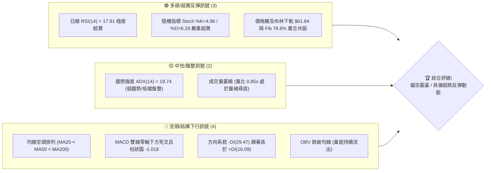
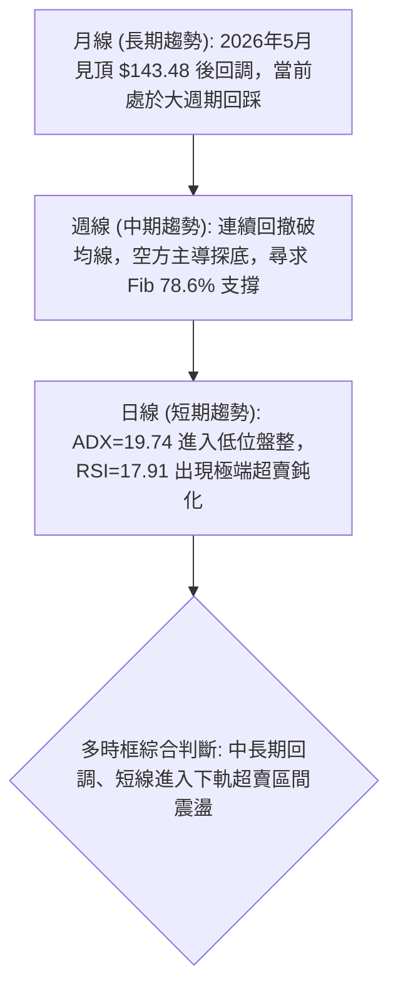
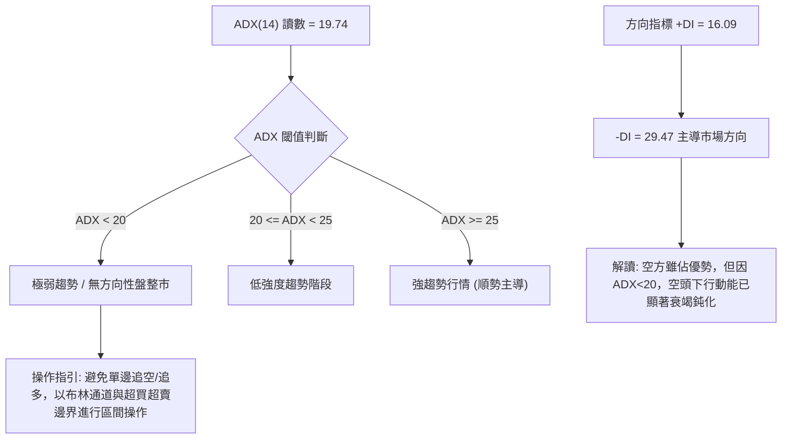
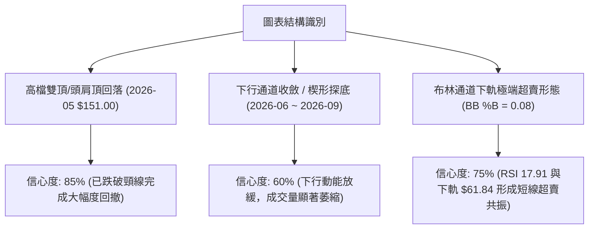
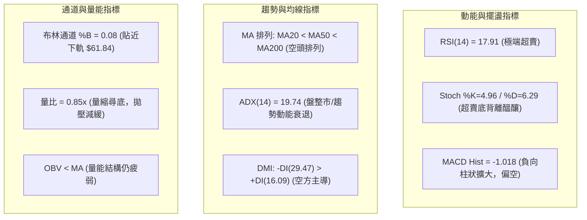
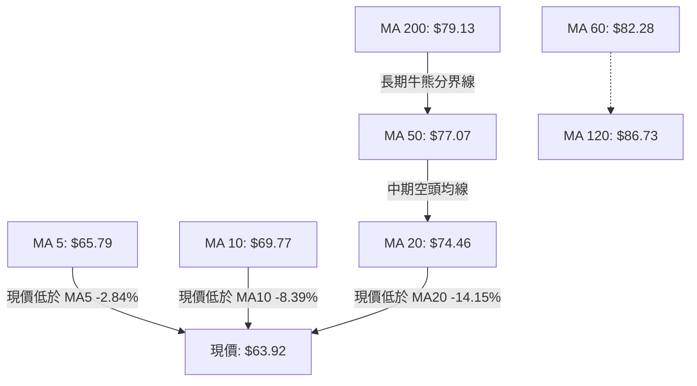
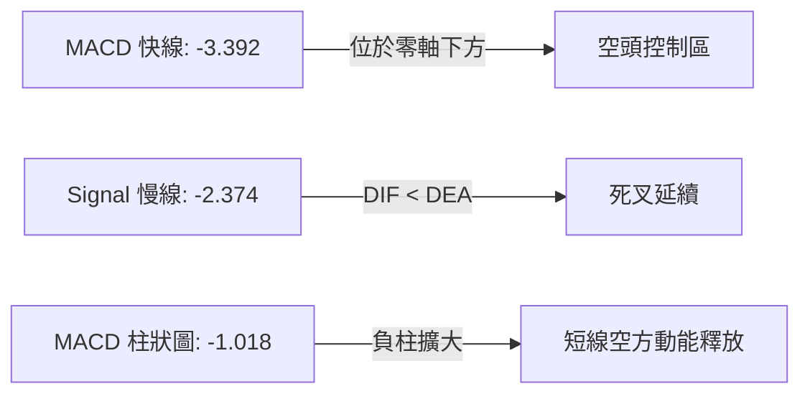
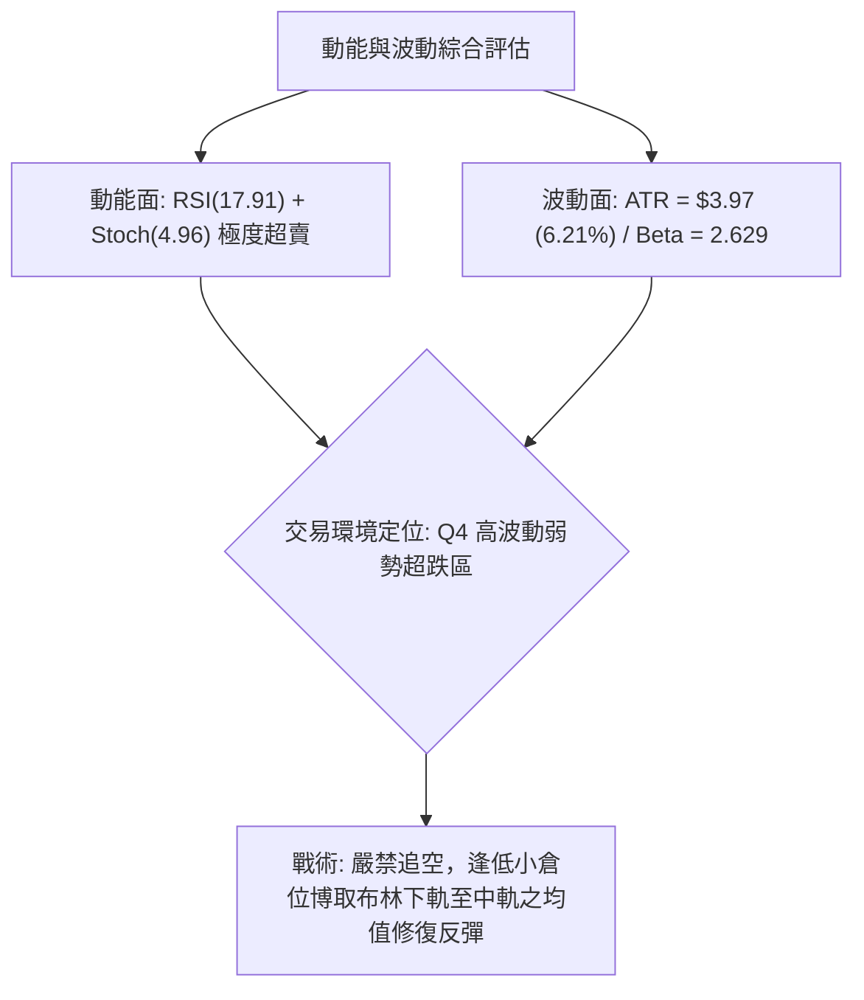
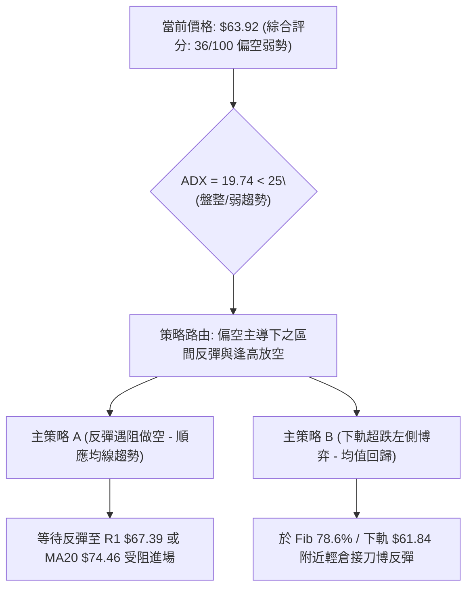
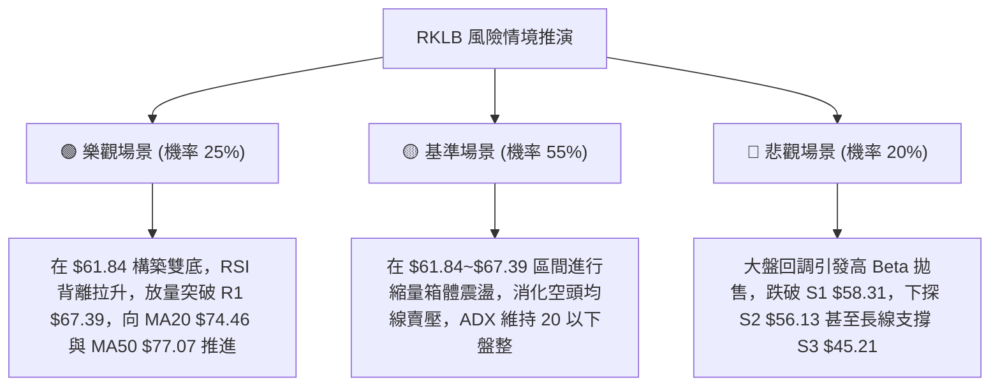

# RKLB 技術分析報告

> **報告日期**：2026-09-01 ｜ **語言**：繁體中文 ｜ **數據來源**：Yahoo Finance ｜ **當前價格**：$63.92

---

## 目錄

| 章節 | 內容 |
|------|------|
| [1. 技術面概覽](#1-技術面概覽) | 訊號儀表板、核心指標、評分卡 |
| [2. 趨勢分析](#2-趨勢分析) | 多時框趨勢、長中短期走勢 |
| [3. 圖表形態分析](#3-圖表形態分析) | 形態識別、K線組合、目標價 |
| [4. 支撐與阻力](#4-支撐與阻力) | 關鍵價位、斐波那契回調 |
| [5. 技術指標深度解讀](#5-技術指標深度解讀) | MA/RSI/MACD/布林/成交量 |
| [6. 動能與波動率](#6-動能與波動率) | 動能評估、ATR、Beta |
| [7. 多時框架總結](#7-多時框架總結) | 時框架評分矩陣 |
| [8. 交易策略建議](#8-交易策略建議) | 多空策略、風險報酬比 |
| [9. 風險提示與監控](#9-風險提示與監控) | 監控指標、風險場景 |

---

## 1. 技術面概覽

### 🎯 技術訊號儀表板



### 📊 核心指標速覽表

| 指標類別 | 指標名稱 | 當前數值 | 訊號 | 解讀 |
|:---|:---|:---|:---:|:---|
| **價格** | 當前價格 | $63.92 | 🔴 | 位於 52 週區間 ($37.57–$151.00) 之 23.2% 低檔區 |
| **均線** | MA20 | $74.46 | 🔴 | 現價低於 MA20 達 -14.15%，短線下行斜率陡峭 |
| **均線** | MA50 | $77.07 | 🔴 | 現價位於 MA50 下方，中期趨勢呈現受壓下行 |
| **均線** | MA200 | $79.13 | 🔴 | 現價位於 MA200 下方，長期均線呈現空頭壓制 |
| **動能** | RSI(14) | 17.91 | 🟢 | 進入極度超賣區（<20），短線具備技術性均值回歸需求 |
| **動能** | MACD | -3.392 / -2.374 | 🔴 | MACD < Signal 且柱狀圖為 -1.018，空方動能仍佔優 |
| **波動** | ATR(14) | $3.97 (6.21%) | 🟡 | 每日平均波動幅度約 $3.97，波動率維持中高水準 |
| **趨勢** | ADX(14) | 19.74 | 🟡 | ADX < 25 指向弱趨勢/低檔盤整，非單邊加速崩跌 |
| **通道** | 布林 %B | 0.08 | 🟢 | 現價貼近下軌 $61.84（中軌 $74.46 / 上軌 $87.08） |

### 🏆 技術評分卡

```
╔══════════════════════════════════════════════════════════════════╗
║                 技術評分卡 — RKLB (2026-09-01)                   ║
╠══════════════════════════════════════════════════════════════════╣
║ 趨勢強度 (Trend)      ██████░░░░░░░░░░░░░░  30/100  🔴 空頭壓制  ║
║ 動能指標 (Momentum)   ████████░░░░░░░░░░░░  40/100  🟡 極度超賣  ║
║ 支撐穩定度 (Support)  ████████████░░░░░░░░  60/100  🟡 考驗S1/Fib║
║ 成交量配合 (Volume)   ██████░░░░░░░░░░░░░░  30/100  🔴 量能疲弱  ║
║ 形態完整度 (Pattern)  ████████░░░░░░░░░░░░  40/100  🟡 下行通道  ║
║ 均線排列 (Moving Avg) ████░░░░░░░░░░░░░░░░  20/100  🔴 空頭排列  ║
╠══════════════════════════════════════════════════════════════════╣
║ 綜合評分 (Overall)    ███████░░░░░░░░░░░░░  36/100  🔴 偏空弱勢  ║
╚══════════════════════════════════════════════════════════════════╝
```

---

## 2. 趨勢分析

### 🌐 多時框趨勢分析



### 📈 長期趨勢 — 12個月走勢圖（Unicode）

```
RKLB 月線走勢圖（2025-09 至 2026-08/09）
價格軸 ($)
$150 ┤                                  ● $143.48 (2026-05)
$130 ┤                                 ╱ ╲
$110 ┤                                ╱   ╲● $101.65 (2026-06)
 $90 ┤                 ● $80.07      ╱     ╲
 $70 ┤        ● $62.98  ╲   ● $69.76● $82.51╲  ● $64.95 (2026-07)
 $50 ┤ ● $47.91╲         ● $69.10 ╲● $64.22  ╲● $63.92 (現價 2026-08/09)
 $30 ┤          ● $42.14
     └────────────────────────────────────────────────────────────
       09  10  11  12  01  02  03  04  05  06  07  08/09 (月份)
```

#### 走勢特徵分析表格

| 階段 | 時間區間 | 起止價格 | 漲跌幅 | 主要走勢特徵 |
|:---|:---:|:---:|:---:|:---|
| **第一階段：震盪築底與推升** | 2025-09 ~ 2025-12 | $47.91 → $69.76 | +45.61% | 歷經 11 月回洗 $42.14 後強勢拉升，多頭確立主升段架構 |
| **第二階段：主升段噴發攻頂** | 2026-01 ~ 2026-05 | $80.07 → $143.48 | +79.20% | 月線級別連續長紅突破，於 2026 年 5 月創下歷史高點 $151.00 (收盤 $143.48) |
| **第三階段：獲利了結與深幅回撤** | 2026-06 ~ 2026-08 | $143.48 → $63.92 | -55.45% | 高檔放量失守 MA20，形成均線空頭排列，目前測試下檔 Fib 78.6% ($61.84) |

### 📊 中期趨勢（週線分析）

```
近期週線壓力與支撐架構示意圖：
================================================================
$82.83 (08-09 波段反彈高點)  ───────────────── [強阻力區間 R3 $75.11 / MA50 $77.07]
                               ▲
$72.57 (08-23 收盤)            │  週線反彈受阻於 MA20 ($74.46)
                               ▼
$63.92 (現價 09-01)          ◄─── 測試布林下軌 $61.84 與 Fib 78.6% ($61.84)
                               ▲
$58.31 (S1 近期支撐低點)     ───────────────── [關鍵防守區 S1 $58.31 / S2 $56.13]
================================================================
```

### ⚡ 趨勢強度評估（ADX 解讀）



#### ADX 強度對照表

| 指標名稱 | 當前數值 | 參考標準 | 趨勢判定 | 操作策略啟示 |
|:---|:---:|:---:|:---:|:---|
| **ADX(14)** | 19.74 | < 25 為盤整；> 25 為趨勢 | 🟡 盤整/弱趨勢 | 趨勢動能減弱，當前價格貼近極值，以區間均值回歸邏輯為主 |
| **+DI** | 16.09 | 多方力量 | 🔴 弱勢 | 多頭買盤尚未有效發力進場 |
| **-DI** | 29.47 | 空方力量 | 🔴 佔優 | 空方掌握主控權，但差值未引發 ADX 向上飆升 |

---

## 3. 圖表形態分析

### 🔍 形態識別系統



#### 形態識別信心度與目標計算

| 形態名稱 | 信心度 | 判斷依據（引用數據） | 完成度 | 目標價（附計算式） |
|:---|:---:|:---|:---:|:---|
| **下行通道低檔收斂 (Descending Channel)** | 60% | 價格在 08-09 反彈至 $82.83 受阻，回落至目前 $63.92，成交量由 1.12億 縮至 1,520萬 | 75% | 短線反彈目標 R1: $67.39；若跌破下軌則下探 S1: $58.31 |
| **布林下軌超賣接觸 (BB Oversold Bounce)** | 75% | 布林 %B 為 0.08，現價 $63.92 接近下軌 $61.84，RSI 為 17.91 | 90% | 均值回歸中軌目標 MA20: $74.46 |
| **波段下行斐波那契回撤 (Fib 78.6% Retracement)** | 80% | 52週高點 $151.00 回落至 Fib 78.6% 水準 $61.84 | 95% | 回踩支撐目標 $61.84；反彈目標為 Fib 61.8% ($80.90) |

### 🕯️ 重要K線形態分析

| 日期 / 週別 | 收盤價 | K線形態 | 解讀 | 訊號 |
|:---|:---:|:---|:---|:---:|
| **2026-05-31** | $143.48 | 高檔長上影十字星 (衝高 $151.00) | 多頭動能衰竭，主力高檔出貨，確立波段大頂部 | 🔴 空頭反轉 |
| **2026-07-26** | $63.91 | 長黑下殺貫穿低點 | RSI 降至 15.6 極端超賣，短線拋壓釋放 | 🔴 恐慌拋售 |
| **2026-08-09** | $82.83 | 帶量長紅反彈K線 | 週成交量 9,669萬股，MACD 柱翻正 (+2.940)，形成波段反彈高點 | 🟢 短線多頭 |
| **2026-08-30** | $64.39 | 連續中黑下挫K線 | 週成交量降至 7,067萬股，無量陰跌回測前期低點 | 🔴 空頭延續 |
| **2026-09-06 (即時)** | $63.92 | 低檔弱勢十字小陰K線 | 成交量急劇萎縮 (1,520萬)，價格貼近布林下軌尋求支撐 | 🟡 變盤十字 |

### 📉 ASCII 走勢形態示意圖

```
RKLB 下行通道與關鍵回撤結構示意圖：
================================================================
$151.00 (52W High) ──┐ (頂部出貨結構)
                     │╲
$124.23 (Fib 23.6%) ─┼─╲─────────────────────────────
                     │  ╲
$107.67 (Fib 38.2%) ─┼───╲───────────────────────────
                     │    ╲  
$94.28  (Fib 50.0%) ─┼─────╲─────────────────────────
                     │      ╲   ● $82.83 (通道上軌反彈阻力)
$80.90  (Fib 61.8%) ─┼───────╲─╱─╲─────────────────── [MA200: $79.13 / MA50: $77.07]
                     │        V   ╲  
$74.46  (BB 中軌)   ─┼─────────────╲───────────────── [MA20: $74.46]
$63.92  (現價)      ─┼──────────────● ◄── [當前位置：貼近下軌與 Fib 78.6%]
$61.84  (Fib 78.6%) ─┼──────────────── [BB 下軌 $61.84 / 強共振支撐]
                     │                 ╲
$58.31  (S1 支撐)   ─┴──────────────────● S1 ($58.31) / S2 ($56.13)
================================================================
```

### 🎯 形態目標價計算

1. **下行通道測幅反彈目標**：
   * 頸線/支撐基基準：$61.84 (Fib 78.6% 與布林下軌)
   * 第一反彈目標（波段阻力 R1）：$67.39
   * 第二反彈目標（布林中軌 MA20）：$74.46
2. **下破延續測幅目標（極端悲觀情境）**：
   * 若有效跌破 S1 ($58.31)，下探目標為波段支撐 S2 ($56.13) 及波段大底 S3 ($45.21)。

---

## 4. 支撐與阻力

### 🗺️ 關鍵價位分布圖（Unicode）

```
RKLB 價位結構分布圖
══════════════════════════════════════════════════════════════════
$80.90 ║██████████████████████████████║ 斐波那契 61.8% / MA200 ($79.13)
$75.11 ║████████████████████████      ║ 強阻力 R3 / 均線密集密集壓制區
$73.97 ║████████████████████          ║ 阻力 R2 / MA20 均線壓力 ($74.46)
$67.39 ║██████████████                ║ 近期反彈第一阻力 R1 (MA5: $65.79)
$63.92 ╠══════════════════════════════╣ ◄ 現價 ($63.92)
$61.84 ║▓▓▓▓▓▓▓▓▓▓▓▓▓▓▓▓▓▓▓▓▓▓▓▓▓▓▓▓  ║ 布林下軌 / 斐波那契 78.6% 共振支撐
$58.31 ║██████████████████            ║ 近期波段低點支撐 S1
$56.13 ║████████████████████████      ║ 強支撐 S2
$45.21 ║██████████████████████████████║ 長期大級別強支撐 S3
══════════════════════════════════════════════════════════════════
```

### 🚧 阻力位分析表

| 阻力級別 | 價位 | 形成原因 | 突破難度 | 重要性 |
|:---|:---:|:---|:---:|:---:|
| **R1 (第一阻力)** | $67.39 | 近期日線反彈聚類高點，上方臨近 MA5 ($65.79) 及 MA10 ($69.77) | 中等 | 🟡 短線轉強與否之分水嶺 (+5.43%) |
| **R2 (第二阻力)** | $73.97 | 波段密集成交反壓區，重合 MA20 均線 ($74.46) | 高 | 🔴 中期均線反壓核心區 (+15.72%) |
| **R3 (第三阻力)** | $75.11 | 前期起跌點波段高點聚類，臨近 MA240 ($75.56) 與 MA50 ($77.07) | 極高 | 🔴 空頭防守總堡壘 (+17.51%) |

### 🛡️ 支撐位分析表

| 支撐級別 | 價位 | 形成原因 | 守住機率 | 重要性 |
|:---|:---:|:---|:---:|:---:|
| **Fib 78.6%** | $61.84 | 52 週大區間斐波那契 78.6% 回調位與布林下軌 $61.84 完全重合 | 70% | 🟢 短線最關鍵多頭防守護城河 (-3.25%) |
| **S1 (第一支撐)** | $58.31 | 近一年波段低點聚類，跌破 $60 整數關卡後之買盤承接區 | 65% | 🟡 空頭擴展目標第一道防線 (-8.78%) |
| **S2 (第二支撐)** | $56.13 | 近一年波段次級結構密集低點，量能堆積支撐 | 75% | 🟢 中期深度回調關鍵防守點 (-12.18%) |
| **S3 (第三支撐)** | $45.21 | 2025年大牛市起漲中繼平台聚類低點 | 85% | 🟢 長期趨勢生命線 (-29.27%) |

### 📐 斐波那契回調位分析

*回調基準區間：52週低點 $37.57 → 52週高點 $151.00（垂直波幅 $113.43）*

```
斐波那契回調水平分布：
  0.0%  (52W High)  ─── $151.00
 23.6%              ─── $124.23
 38.2%              ─── $107.67
 50.0%              ─── $94.28
 61.8%              ─── $80.90
 78.6%              ─── $61.84  ◄─── 現價 $63.92 位於 78.6% 與 61.8% 之間
100.0%  (52W Low)   ─── $37.57
```

**斐波那契結構解讀**：
現價 $63.92 處於 Fib 78.6% ($61.84) 至 Fib 61.8% ($80.90) 的深度回撤區域。當前價格距離 Fib 78.6% 僅 +3.36%，該點位同時為布林下軌 ($61.84) 所在位置，形成罕見的「雙重技術共振強支撐」。若能在此區間築底，將迎向 Fib 61.8% ($80.90) 的回抽修復；若不幸收破 $61.84，則將直接向下測試 S1 ($58.31) 及 100% 回撤點 $37.57。

---

## 5. 技術指標深度解讀

### 🎛️ 指標訊號總覽



### 📈 移動平均線排列分析



#### 均線數據與偏離度一覽

| 均線名稱 | 數值 | 現價偏離度 (Bias) | 均線走勢軌跡特徵 | 訊號解讀 |
|:---|:---:|:---:|:---|:---:|
| **MA 5** | $65.79 | -2.84% | `▃▃▃▂▃▂▁▁▁▁▂▃▄▆▇▇██████▇▆▅▄▃▃▂▂` | 短線極度貼近，下行斜率趨緩 |
| **MA 10** | $69.77 | -8.39% | `▆▅▄▃▃▂▁▁▁▁▁▁▂▃▄▄▆▇██████▇▆▅▅▄▃` | 短線第一道動態壓制線 |
| **MA 20** | $74.46 | -14.15% | `██▇▇▆▅▄▃▂▁▁▁▁▁▁▁▁▁▂▂▂▃▃▃▃▃▃▃▃▃` | 布林中軌，中期趨勢防線 |
| **MA 50** | $77.07 | -17.06% | 中期空頭壓制線 | 中期空方陣地 |
| **MA 60** | $82.28 | -22.31% | `███████████▇▇▇▇▆▆▆▅▅▅▄▄▃▃▂▂▁▁▁` | 季線阻力沉重 |
| **MA 120** | $86.73 | -26.30% | `█▇▆▅▄▃▂▁▁▁▁▁▂▃▄▄▅▅▆▇███████▇▇▆` | 半年線持續走平下彎 |
| **MA 200** | $79.13 | -19.22% | 長期多空分水嶺 | 空頭壓制 |
| **MA 240** | $75.56 | -15.41% | `▁▁▁▁▁▂▂▂▂▃▃▃▄▄▄▅▅▅▆▆▇▇▇▇██████` | 年線位置聚類於 $75 阻力區 |

### 📉 RSI(14) 分析

```
RSI(14) 數值儀表：
17.91 [███░░░░░░░░░░░░░░░░░] 超賣區 (<30)
0──────────17.91──────30────────────────50────────────────70──────────100
           ▲ (極度超賣)
```

* **超買超賣狀態**：RSI(14) 讀數為 **17.91**，已深度跌入 20 以下的極端超賣盲區，顯示短線賣壓釋放已達極限，隨時可能引發技術性報復反彈。
* **背離判定**：日線級別價格從 08-23 的 $72.57 跌至 $63.92，RSI 自 53.7 急降至 17.91，與價格同向下行，**無明顯底背離**。但週線級別 RSI 於 07-26 創下 15.6 低點後，目前在 $63.92 水平維持 17.9，呈現低檔鈍化特徵。

### 📊 MACD(12/26/9) 訊號解讀



* **數值解讀**：MACD 線 (-3.392) 低於訊號線 (-2.374)，差值柱狀圖為 -1.018。
* **趨勢分析**：雙線深處零軸下方，且負向柱狀圖自 08-23 的 +0.439 翻負擴大至 -1.018，表明短期調整尚未出現明確的金叉反轉訊號，操作上不可盲目重倉抄底，需等待柱狀圖收斂。

### 📦 布林通道分析

```
布林通道結構示意圖 (寬度 25.24)：
══════════════════════════════════════════════════════════════════
$87.08 ─── 上軌 (Upper Band)
           │
           │
$74.46 ─── 中軌 (Middle Band = MA20)
           │
           │
$63.92 ─── 現價 (Price, %B = 0.08) ◄─── 極度貼近下軌
$61.84 ─── 下軌 (Lower Band) [與 Fib 78.6% $61.84 完美重疊]
══════════════════════════════════════════════════════════════════
```

* **帶寬與位置**：布林通道上軌 $87.08、中軌 $74.46、下軌 $61.84。現價 $63.92 對應之 **%B 為 0.08**，處於典型的下軌超賣接觸點。
* **形態意義**：下軌 $61.84 恰好與 52 週回撤 Fib 78.6% ($61.84) 精確重合，構成極為扎實的通道支撐線，空頭在此處遭遇強大技術防守。

### 💹 成交量分析（量價配合度）

* **量能指標**：
  * 最新成交量：15,207,445 股
  * 20 日均量：17,862,442 股（量比：0.85x）
  * 50 日均量：20,224,015 股
* **量價特徵**：最新成交量低於 20 日與 50 日均量，呈現縮量下跌走勢。在下行趨勢末端，量縮通常意味著主動性殺跌盤枯竭，籌碼沉澱進入「無量陰跌探底」階段。
* **OBV 分析**：當前 OBV 處於其移動平均線下方，量能指標疲弱，尚未見到機構主力大舉進場的「放量吸籌」訊號，反彈仍屬於技術性修復性質。

---

## 6. 動能與波動率

### ⚡ 動能評估分析

| 象限 | 動能維度 | 波動維度 | RKLB 當前狀態 | 交易環境評估與策略 |
|:---:|:---:|:---:|:---:|:---|
| **Q1** | 強動能 (Bullish) | 低波動 (Low Vol) | — | 穩定多頭趨勢，適合順勢加碼 |
| **Q2** | 弱動能 (Bearish) | 低波動 (Low Vol) | — | 窄幅盤整，等待方向突破 |
| **Q3** | 強動能 (Bullish) | 高波動 (High Vol) | — | 狂熱噴發行情，高風險高收益 |
| **Q4** | **弱動能 (超賣)** | **高波動 (Beta 2.63)** | **✓ (當前所處象限)** | **弱勢超跌震盪，ATR 高達 $3.97，適合嚴格控倉之均值回歸交易** |



### 📊 ATR 波動率分析

* **ATR(14) 數值**：**$3.97**（佔當前股價之 **6.21%**）。
* **波動率評估**：RKLB 具備高波動特性，單日正常波動區間接近 $4.00。
* **風控止損距離建議**：
  * **激進短線交易**：建議止損寬度為 $1.0 \times \text{ATR} = \$3.97$。
  * **波段交易**：建議止損寬度為 $1.5 \times \text{ATR} \approx \$5.95$（若在 $63.92 進場，波段止損應設於 $57.97，恰好保護於 S1 $58.31 支撐下方）。

### 📐 Beta 與市場相關性

* **Beta 係數**：**2.629**（高貝塔成長/航太國防標的）。
* **市場敏感度**：RKLB 的波動幅度為大盤（S&P 500）的 2.63 倍。在市場風險偏好上升時具備極高爆發力，但在市場避險回調時亦承擔加倍下行壓力。當前高 Beta 特性要求交易者在倉位管理上必須採取保守縮減原則。

---

## 7. 多時框架總結

### 📋 時框架評分表

| 時框架 | 趨勢方向 | 動能狀態 | 均線排列 | 形態結構 | 綜合評分 | 建議方針 |
|:---:|:---:|:---:|:---:|:---:|:---:|:---|
| **月線 (長期)** | 🟡 中性回調 | 弱化 (高點回落) | 偏多 (處於長期均線上) | 波段回撤 Fib 78.6% | 50/100 | 長期投資者逢低分批觀察 |
| **週線 (中期)** | 🔴 空頭承壓 | 弱勢 (MACD負向) | 空頭壓制 (MA20/50下方) | 下行通道尋底 | 35/100 | 中期波段不可盲目重倉追多 |
| **日線 (短期)** | 🔴 空頭主導 | 極度超賣 (RSI 17.91) | 完整空頭排列 (MA20<50<200) | 布林下軌支撐碰觸 | 36/100 | 嚴守紀律，僅限超短線反彈操作 |

### 🔲 綜合訊號矩陣

```
時框與指標矩陣一致性檢驗：
┌──────────────┬──────────────┬──────────────┬──────────────┐
│  指標項目    │  短期 (日線) │  中期 (週線) │  長期 (月線) │
├──────────────┼──────────────┼──────────────┼──────────────┤
│ 均線系統     │  🔴 空頭     │  🔴 空頭     │  🟢 偏多     │
│ MACD 訊號    │  🔴 看空     │  🔴 看空     │  🟡 轉弱     │
│ RSI 擺盪     │  🟢 極度超賣 │  🟡 偏弱     │  🟡 中性     │
│ 布林通道     │  🟢 觸及下軌 │  🔴 跌破中軌 │  🟡 軌道內   │
│ 成交量配合   │  🟡 縮量陰跌 │  🔴 縮量     │  🔴 縮量     │
└──────────────┴──────────────┴──────────────┴──────────────┘
```

### ⚖️ 多時框收斂結論

依據多時框收斂規則：
1. **行情性質判定**：當前日線 ADX(14) = 19.74 (< 25)，定義為**「弱趨勢 / 低檔盤整震盪行情」**。
2. **時框主導權收斂**：在 ADX < 25 的盤整結構下，交易邏輯應以**日線布林通道上下軌（下軌 $61.84 / 上軌 $87.08）與斐波那契回調位作為主要邊界**。
3. **唯一方向性結論**：**【偏空弱勢震盪，蘊含布林下軌超跌均值回歸反彈機會】**。
   * 中期趨勢雖受均線空頭排列（MA20 < MA50 < MA200）壓制，但日線 RSI (17.91) 與 Stoch (4.96) 處於極端超賣盲區，且現價緊貼布林下軌與 Fib 78.6% 強共振位 $61.84。
   * 下方空間受 S1 ($58.31) 支撐收斂，空頭追空風險極高；策略以「逢高遇阻放空」為主，輔以「下軌共振點小倉博弈超跌反彈」。

---

## 8. 交易策略建議

### 🗺️ 策略決策流程圖



### 🧭 策略路由

> **當前主策略方向 = 偏空弱勢背景下的「逢高受阻做空」為主，輔以「布林下軌超跌均值回歸反彈」為次（依技術評分卡 36/100 評定）。**

### 🎯 價格情境階梯（Price Scenarios）

| 觸發條件 | 第一目標 | 第二目標 | 情境技術含義 |
|:---|:---:|:---:|:---|
| **向上突破 R1 ($67.39)** | R2 ($73.97) | R3 ($75.11) | 短線超賣反彈啟動，挑戰布林中軌 MA20 ($74.46) |
| **站穩現價 ($63.92)** | R1 ($67.39) | Fib 61.8% ($80.90) | 於布林下軌 $61.84 獲得支撐，展開低檔橫盤築底 |
| **跌破 S1 ($58.31)** | S2 ($56.13) | S3 ($45.21) | 跌破 52 週回撤支撐，開啟新一輪下行擴展波段 |

### 📊 情境機率分佈

| 情境劇本 | 機率 | 主要依據 |
|:---|:---:|:---|
| **情境一：低檔縮量震盪後技術性反彈** | **55%** | RSI 17.91 極端超賣、布林 %B 0.08 觸及下軌 $61.84，下行動能衰竭 |
| **情境二：弱勢盤整橫盤磨底** | **30%** | ADX 19.74 弱趨勢，量比 0.85x 縮量，市場觀望氣氛濃厚 |
| **情境三：跌破支撐加速破位下行** | **15%** | 均線空頭排列（MA20 < MA50 < MA200），-DI 仍高達 29.47 |

### 🟢 主策略詳情

#### 策略 A：順勢波段 —— 反彈受阻逢高放空（主推趨勢策略）
*本策略順應日週線 MA 空頭排列，在股價反彈測試主要均線反壓時進場。*

#### 策略 B：逆勢短線 —— 布林下軌超跌反彈（短線均值回歸）
*本策略利用 RSI < 20 與布林下軌/Fib 78.6% ($61.84) 共振，博取向中軌 MA20 修復之利潤。*

| 策略要素 | 策略 A（反彈逢高做空 - 順勢） | 策略 B（下軌超跌搶反彈 - 逆勢） |
|:---|:---:|:---:|
| **進場條件** | 反彈至 R1 遇阻回落，或觸碰 MA20 出現長上影線 | 現價 $63.92 或回踩 $61.84 守穩出現止跌K線 |
| **進場價格** | **$67.39**（或反彈至 $73.97 區間） | **$63.92**（現價進場） |
| **目標價 T1** | **$61.84**（布林下軌 / Fib 78.6%） | **$67.39**（波段阻力 R1） |
| **目標價 T2** | **$58.31**（關鍵支撐 S1） | **$73.97**（阻力 R2 / 臨近 MA20 $74.46） |
| **止損價格** | **$71.40**（突破 MA10 $69.77 上方 $1.5 ATR） | **$58.31**（實體收破 S1 支撐位） |
| **風險報酬比** | **1 : 2.26** (以 T2 計算) | **1 : 1.79** (以 T2 計算) |
| **成功機率** | **65%** | **55%** |
| **建議倉位** | **15% - 20%** | **5% - 10%（輕倉）** |

### 🔴 反向風險觸發點（對沖與風控提示）

1. **多頭策略失效止損點**：若日線收盤價跌破 **$58.31 (S1)**，代表 Fib 78.6% ($61.84) 徹底失守，下行空間開啟至 $56.13 及 $45.21，所有抄底多單必須無條件止損出場。
2. **空頭策略失效翻多點**：若價格強勢放量突破 **$75.11 (R3)** 並站穩 **MA50 ($77.07)** 之上，宣告日線空頭排列瓦解，空頭部位應立即平倉停損，轉為順勢偏多思考。

### ⭐ 整體訊號強度評星

```
╔══════════════════════════════════════════════════════════════════╗
║ 做多訊號強度：★★☆☆☆  (2.5/5星 — 僅限超賣反彈，缺乏趨勢支撐)    ║
║ 做空訊號強度：★★★☆☆  (3.5/5星 — 均線壓制明確，但受制於超賣)    ║
║ 整體可信度：  ★★★☆☆  (3.5/5星 — ADX<20 指向震盪，信號需濾波)    ║
╚══════════════════════════════════════════════════════════════════╝
```

---

## 9. 風險提示與監控

### ✅ 關鍵監控指標 Checklist

```
╔══════════════════════════════════════════════════════════════════╗
║                   每日交易監控清單 (Checklist)                   ║
╠══════════════════════════════════════════════════════════════════╣
║ [ ] 價格是否跌破布林下軌 / Fib 78.6% 共振線 $61.84               ║
║ [ ] RSI(14) 是否脫離 20 以下超賣區並向上穿越 30                  ║
║ [ ] 日成交量是否放大突破 20 日均量 (1,786 萬股) 出現反轉紅K      ║
║ [ ] MACD 柱狀圖是否由 -1.018 出現顯著收斂向上                    ║
║ [ ] 價格反彈至 R1 ($67.39) 或 MA20 ($74.46) 時的量價反應         ║
║ [ ] ADX(14) 是否向上突破 25（預示新一輪單邊趨勢開啟）           ║
╚══════════════════════════════════════════════════════════════════╝
```

### ⚠️ 風險場景分析



### 🛡️ 風險管理重要提醒

1. **高 Beta 波動風險防範**：RKLB Beta 達 2.629，日均波動 ATR 為 $3.97 (6.21%)。在操作時必須嚴格控制單筆交易風險暴露不超過總資金的 1.5%–2.0%，折算單次持倉部位不宜超過總資金的 15%。
2. **嚴禁超賣盲目加碼**：指標超賣（RSI 17.91）僅代表賣壓過度集中，在強烈空頭排列中，指標可能出現長時間「低檔鈍化」。切忌在未出現止跌K線（如帶量長下影線、晨星形態）前盲目重倉左側摸底。
3. **嚴格執行止損紀律**：所有多頭進場均須以 $58.31 (S1) 為極限防守線；空頭進場以 $71.40 為止損標準，嚴防技術性抽頭軋空風險。

---

## 📋 報告總結

```
╔══════════════════════════════════════════════════════════════════╗
║                   RKLB 技術分析報告總結                          ║
╠══════════════════════════════════════════════════════════════════╣
║ 報告日期：2026-09-01                                             ║
║ 當前價格：$63.92                                                 ║
║ 分析評級：🔴 偏空弱勢震盪（超跌修復醞釀中）                      ║
║                                                                  ║
║ 關鍵結論：                                                       ║
║ ├─ 長期趨勢：🟡 中性回調（自高點 $151.00 回撤至 Fib 78.6%）     ║
║ ├─ 中期趨勢：🔴 空頭主導（週線均線空頭排列，受壓於 MA20 $74.46）║
║ ├─ 短期趨勢：🟡 弱勢盤整（ADX=19.74，貼近布林下軌 $61.84 超賣） ║
║ ├─ 關鍵支撐：$61.84 (Fib 78.6%/布林下軌)、$58.31 (S1)、$56.13 (S2)║
║ ├─ 關鍵阻力：$67.39 (R1)、$73.97 (R2)、$75.11 (R3/MA240)        ║
║ └─ 分析師目標：Consensus Mean $112.94 (區間 $64.00 - $150.00)   ║
║                                                                  ║
║ 最優策略組合：                                                   ║
║ 1. 🥇 最佳機會（順勢）：等待反彈至 R1 $67.39~$73.97 遇阻放空     ║
║ 2. 🥈 次選機會（逆勢）：於 $61.84~$63.92 輕倉博弈 RSI 超跌反彈   ║
║ 3. 🥉 保守選擇：空倉觀望，等待日線突破 MA20 ($74.46) 趨勢確立    ║
╚══════════════════════════════════════════════════════════════════╝
```

---

> ⚠️ **免責聲明**：本報告為 AI 自動生成之技術分析，所有數據及估算均基於提供的歷史價格資訊。本報告**僅供研究與學術參考**，**不構成任何投資建議**。投資有風險，入市需謹慎。

---

*報告生成時間：2026-09-01 ｜ 數據來源：Yahoo Finance ｜ 分析框架：多時框技術分析*