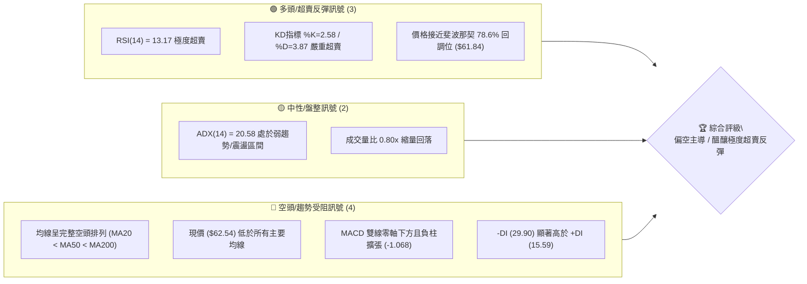
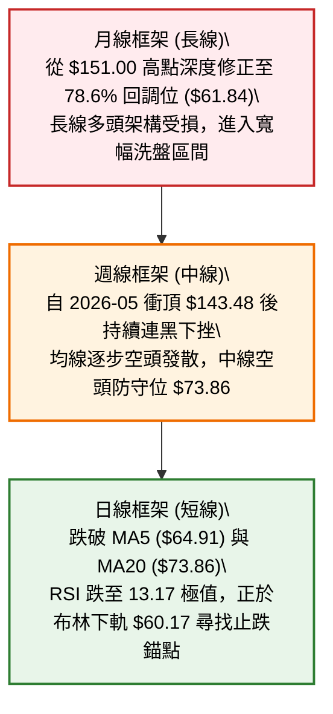
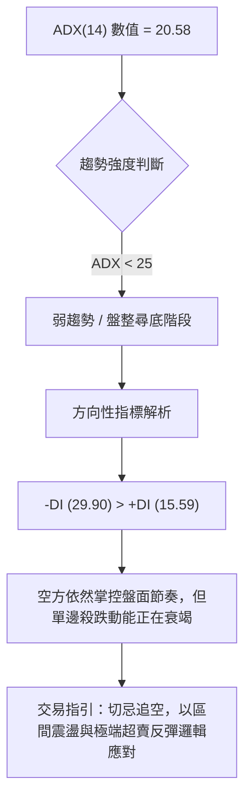
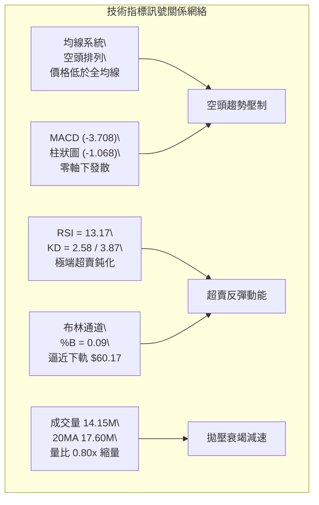
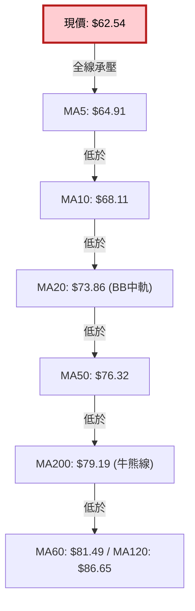
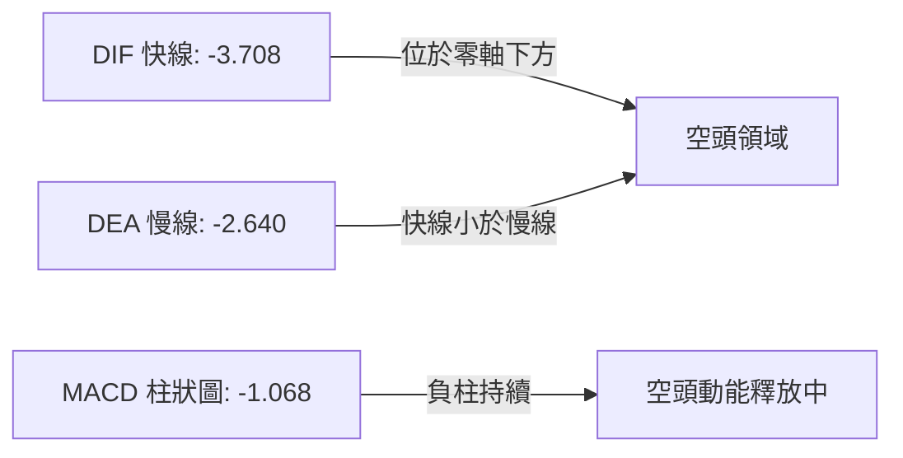
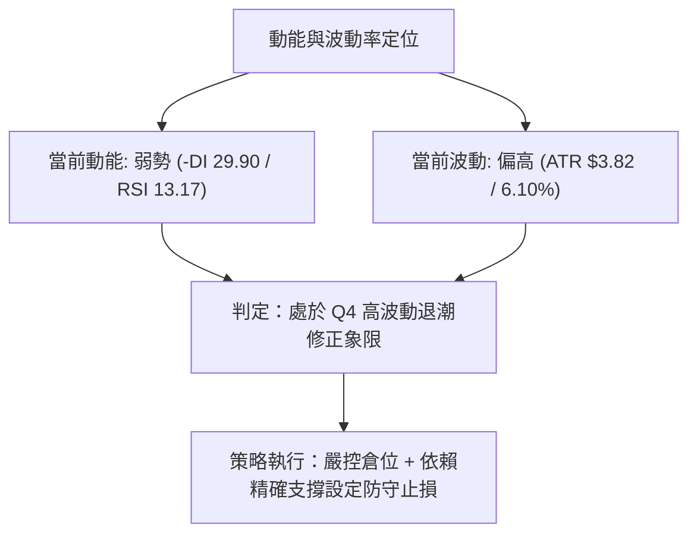
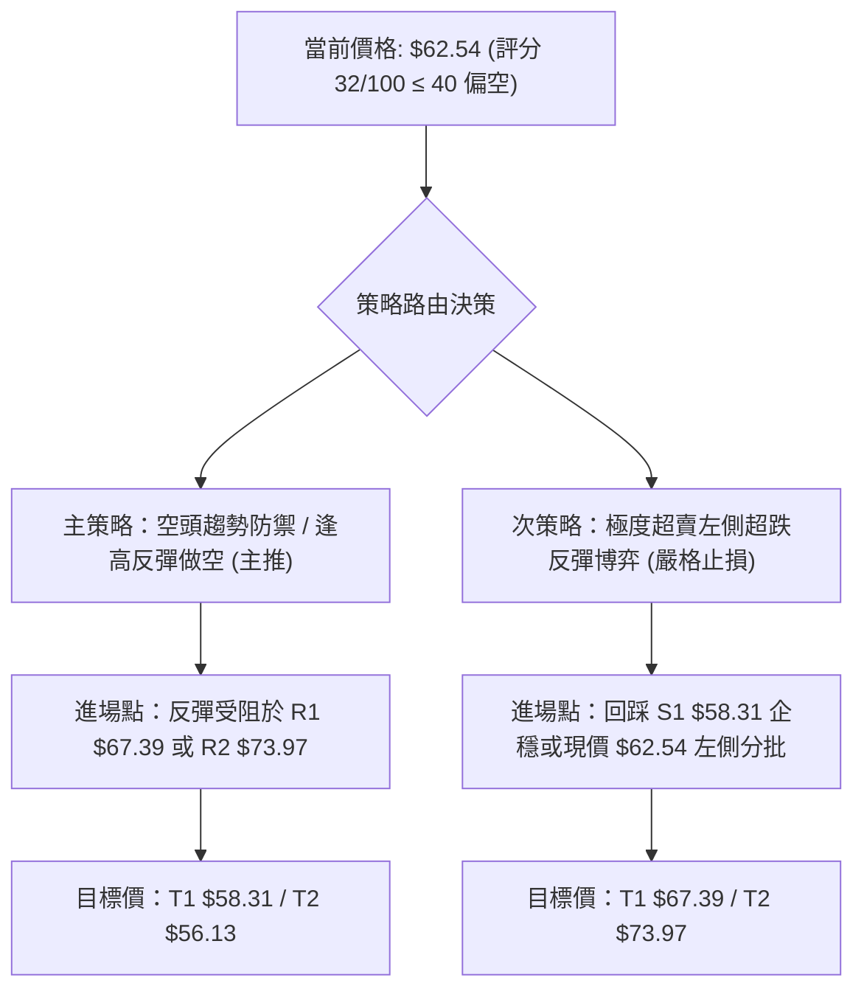
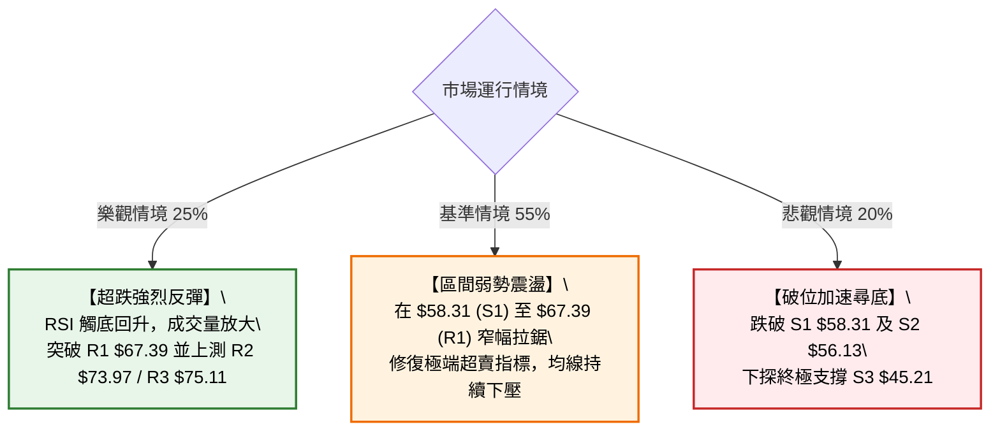

# RKLB 技術分析報告

> **報告日期**：2026-09-02 ｜ **語言**：繁體中文 ｜ **數據來源**：Yahoo Finance ｜ **當前價格**：$62.54

---

## 目錄

| 章節 | 內容 |
|------|------|
| [1. 技術面概覽](#1-技術面概覽) | 訊號儀表板、核心指標、評分卡 |
| [2. 趨勢分析](#2-趨勢分析) | 多時框趨勢、長中短期走勢 |
| [3. 圖表形態分析](#3-圖表形態分析) | 形態識別、K線組合、目標價 |
| [4. 支撐與阻力](#4-支撐與阻力) | 關鍵價位、斐波那契回調 |
| [5. 技術指標深度解讀](#5-技術指標深度解讀) | MA/RSI/MACD/布林/成交量 |
| [6. 動能與波動率](#6-動能與波動率) | 動能評估、ATR、Beta |
| [7. 多時框架總結](#7-多時框架總結) | 時框架評分矩陣 |
| [8. 交易策略建議](#8-交易策略建議) | 多空策略、風險報酬比 |
| [9. 風險提示與監控](#9-風險提示與監控) | 監控指標、風險場景 |

---

## 1. 技術面概覽

### 🎯 技術訊號儀表板



### 📊 核心指標速覽表

| 指標類別 | 指標名稱 | 當前數值 | 訊號 | 解讀 |
|:---|:---|:---|:---:|:---|
| **價格** | 當前價格 | $62.54 | 🔴 | 位於 52 週區間 ($37.57 - $151.00) 的 22.0% 低分位處 |
| **短期均線** | MA20 | $73.86 | 🔴 | 價格低於 MA20 達 -15.33%，短期下行壓力沉重 |
| **中期均線** | MA50 | $76.32 | 🔴 | 價格低於 MA50，中期趨勢呈下行尋底結構 |
| **長期均線** | MA200 | $79.19 | 🔴 | 跌破牛熊分界線，長期架構轉為弱勢防禦 |
| **動能** | RSI(14) | 13.17 | 🟢 | 進入極度超賣區（<20），下行慣性減速，隨時具備技術抽腳動能 |
| **動能** | MACD (12,26,9) | -3.708 / -2.640 | 🔴 | MACD 處於負值區且柱狀圖為 -1.068，空頭動能尚未出現黃金交叉 |
| **擺動指標** | Stoch %K / %D | 2.58 / 3.87 | 🟢 | 處於歷史極值超賣水平，鈍化後存在強烈均值回歸需求 |
| **趨勢強度** | ADX(14) | 20.58 | 🟡 | ADX < 25 表示單邊強趨勢減弱，盤面進入下軌支撐測試階段 |
| **通道指標** | 布林通道 %B | 0.09 | 🟡 | 緊貼布林下軌（$60.17），下軌提供初級動態支撐 |
| **波動度** | ATR(14) | $3.82 | 🔴 | 佔股價 6.10%，屬於高波動成長股特性，風險管理需寬止損 |

### 🏆 技術評分卡

```
╔════════════════════════════════════════════════════════════════╗
║             技術評分卡 — RKLB (2026-09-02)                     ║
╠════════════════════════════════════════════════════════════════╣
║ 趨勢強度 (Trend)      ██████░░░░░░░░░░░░░░  30/100  🔴 空頭主導║
║ 動能指標 (Momentum)   ████░░░░░░░░░░░░░░░░  20/100  🔴 極度低迷║
║ 支撐穩定度 (Support)  ██████████░░░░░░░░░░  50/100  🟡 考驗S1  ║
║ 成交量配合 (Volume)   ████████░░░░░░░░░░░░  40/100  🟡 縮量下跌║
║ 形態完整度 (Pattern)  ██████░░░░░░░░░░░░░░  30/100  🔴 破位尋底║
║ 均線排列 (MA Align)   ████░░░░░░░░░░░░░░░░  20/100  🔴 空頭排列║
╠════════════════════════════════════════════════════════════════╣
║ 綜合評分              ███████░░░░░░░░░░░░░  32/100  🔴 偏空弱勢║
╚════════════════════════════════════════════════════════════════╝
```

---

## 2. 趨勢分析

### 🌐 多時框趨勢分析



### 📈 長期趨勢 — 12個月走勢圖（Unicode）

```
RKLB 月線走勢圖（過去12個月：2025-09 至 2026-09）
價格軸 ($)
$150 ┤                                      ● (2026-05 高點 $143.48)
$130 ┤                                     / \
$110 ┤                                    /   ● (2026-06 $101.65)
$90  ┤                             ●     /     \
$70  ┤                    ●       / \   /       \
$60  ┤          ●        / \     /   ●-/         ●← 現價 $62.54
$40  ┤   ●     / \      /   ●---● (2026-03 $64.22)
$30  ┤  / \   /   ●----● (2025-11 $42.14)
$20  ┤ /   ●-● (2025-09 $47.91)
     └─────────────────────────────────────────────────────────────
       09  10  11  12  01  02  03  04  05  06  07  08  09 (月份)
      '25 '25 '25 '25 '26 '26 '26 '26 '26 '26 '26 '26 '26
```

#### 走勢特徵分析表格

| 階段區間 | 時間跨度 | 價格起訖 | 漲跌幅 | 主要走勢特徵與量能結構 |
|:---|:---|:---|:---:|:---|
| **主升浪推進期** | 2025-09 至 2026-01 | $47.91 → $80.07 | +67.13% | 階梯式推升，伴隨機構買盤持續建倉，呈現強勢突破格局 |
| **中繼強烈震盪** | 2026-02 至 2026-04 | $69.10 → $82.51 | +19.41% | 在 $64-$82 區間形成籌碼沉澱平台，洗淨浮籌後向上突圍 |
| **狂熱噴出與見頂** | 2026-05 | $82.51 → $143.48 | +73.89% | 單月暴力拉升創下歷史高點 $151.00，成交量激增引發主力出貨 |
| **瀑布式退潮修正** | 2026-06 至 2026-09 | $143.48 → $62.54 | -56.41% | 連續 4 個月單邊下挫，跌破關鍵均線，直接回吐絕大部分多頭漲幅 |

### 📊 中期趨勢（週線分析）

```
週線級別價格壓力與支撐階梯分佈示意圖：
$151.00 ────────────────────────────────────────── 52W 最高點（強阻力頂部）
  │
$107.67 ────────────────────────────────────────── 斐波那契 38.2% 回調位（中期多空分水嶺）
  │
$80.90  ────────────────────────────────────────── 斐波那契 61.8% / MA200 ($79.19) 重合阻力區
  │
$73.97  ────────────────────────────────────────── 中期波段阻力 R2 / MA20 ($73.86)
  │
$67.39  ────────────────────────────────────────── 近期跳空缺口 / 近端阻力 R1
  │
$62.54  ◄═════════════════════════════════════════ 【當前價格錨點】
  │
$61.84  ────────────────────────────────────────── 斐波那契 78.6% 回調關鍵支撐
$58.31  ────────────────────────────────────────── 波段關鍵支撐 S1
$56.13  ────────────────────────────────────────── 波段強支撐 S2
```

### ⚡ 趨勢強度評估（ADX 解讀）



#### ADX 趨勢強度對照

| 指標變數 | 當前讀數 | 門檻區間 | 趨勢屬性判定 | 戰術涵義 |
|:---|:---:|:---:|:---:|:---|
| **ADX(14)** | **20.58** | 0 - 25 | **弱趨勢 / 震盪行情** | 單邊趨勢進入中後期，盤面轉入支撐尋找與籌碼重組 |
| **+DI (14)** | **15.59** | 弱勢區間 | 多頭進攻乏力 | 多頭買盤力道薄弱，尚未形成連續推升推力 |
| **-DI (14)** | **29.90** | 主導區間 | 空頭佔據優勢 | 空頭仍處於相對主導地位，但數值未進一步發散 |

---

## 3. 圖表形態分析

### 🔍 形態識別系統


#### 形態信心度評估表

| 形態名稱 | 信心度 | 判斷依據（引用數據） | 完成度 | 目標價（附精確計算式） |
|:---|:---:|:---|:---:|:---|
| **大級別雙頂/頂部破位** | **75%** | 2026-05 衝頂 $143.48（最高 $151.00）後快速失守中期頸線 $100.46 與 MA200 ($79.19) | 100% | 破位後已達成中期回調目標，目前測試斐波那契 78.6% ($61.84) |
| **下行通道超賣尋底** | **60%** | 價格沿布林下軌（$60.17）滑落，現價 $62.54 逼近支撐位 S1 ($58.31)，RSI 達 13.17 極值 | 70% | 形態等高反彈目標 = S1 ($58.31) + (R1 $67.39 - S1 $58.31) = **$76.47** |
| **頭肩底結構** | **<30%** | *數據中未偵測到明確右肩或底部成型跡象，訊號不足，僅做指標型解讀* | 0% | 不適用（無有效數據支持，嚴禁主觀捏造） |

### 🕯️ 重要K線形態分析

| 月份 | 收盤價 | K線形態 | 解讀 | 訊號 |
|:---|:---:|:---|:---|:---:|
| **2026-05** | $143.48 | 長上影大陽見頂線 | 盤中觸及 $151.00 後遭遇強烈獲利了結拋壓，形成天花板阻力 | 🔴 強烈見頂 |
| **2026-06** | $101.65 | 大陰吞沒線 | 實體大陰線完全吞噬前期漲幅平台，確認頂部成立 | 🔴 空頭確認 |
| **2026-07** | $64.95 | 破位長陰線 | 連續擊穿 MA50、MA200 與 61.8% 黃金分割線，空方全面肆虐 | 🔴 趨勢破位 |
| **2026-08** | $63.92 | 縮量十字星/低檔揉搓 | 跌勢明顯減緩，實體收窄，多空在 $64 附近展開拉鋸戰 | 🟡 止跌企穩中 |
| **2026-09** | $62.54 | 下探測試星線（動態） | 價格探底測試斐波那契 78.6% ($61.84) 及 S1 ($58.31)，空頭慣性收斂 | 🟡 超跌醞釀 |

### 📉 ASCII 走勢形態示意圖

```
頂部破位與下行通道測試結構：
$151.00 ┬─────────────────────── 頂部峰值 (2026-05)
        │ ╲
$120.00 ┼── ╲ ─── 頸線區域破位 ($100.46)
        │    ╲
$90.00  ┼───── ╲ ─── 擊穿 MA200 ($79.19)
        │       ╲
$73.86  ┼──────── ╲ ─── 當前下降通道上軌阻力 (MA20 / R2 $73.97)
        │          ╲
$62.54  ┼─────────── ● ◄── 現價：考驗下軌與 78.6% 回調位 ($61.84)
        │            ╲
$58.31  ┴───────────── ─── 關鍵支撐 S1 / 布林下軌支撐區間
```

### 🎯 形態目標價計算

依據波段震盪通道高度進行反彈推算：
1. **箱體下邊界（基點）**：S1 = **$58.31**
2. **第一道反彈壓制頸線（高點）**：R1 = **$67.39**
3. **通道箱體垂直高度**：$67.39 - $58.31 = **$9.08**
4. **突破反轉第一目標價 (T1)**：突破 R1 測幅 = $67.39 + 0.5 × $9.08 = **$71.93**（逼近 MA20 $73.86）
5. **完整測幅第二目標價 (T2)**：$67.39 + 1.0 × $9.08 = **$76.47**（精確契合 MA50 $76.32 壓力區）

---

## 4. 支撐與阻力

### 🗺️ 關鍵價位分布圖（Unicode）

```
RKLB 價位結構分布圖 (2026-09-02)
══════════════════════════════════════════════════════════════════════
$151.00 ║████████████████████████████████████║ 52W 歷史極值最高點
$80.90  ║████████████████████████████        ║ 斐波那契 61.8% / MA200 ($79.19)
$75.11  ║████████████████████████            ║ 強阻力 R3
$73.97  ║████████████████████                ║ 重要阻力 R2 / MA20 ($73.86)
$67.39  ║██████████████                      ║ 近端阻力 R1 (反彈第一道關卡)
$62.54  ╠════════════════════════════════════╣ ◄ 當前市價 ($62.54)
$61.84  ║▓▓▓▓▓▓▓▓▓▓▓▓▓▓▓▓▓▓▓▓                ║ 斐波那契 78.6% 黃金支撐位
$58.31  ║████████████████████                ║ 近期核心波段支撐 S1
$56.13  ║████████████████████████            ║ 強支撐 S2 (波段安全墊)
$45.21  ║████████████████████████████████    ║ 終極深層防守支撐 S3
══════════════════════════════════════════════════════════════════════
```

### 🚧 阻力位分析表

| 阻力級別 | 價位 | 形成原因 | 突破難度 | 重要性 |
|:---|:---:|:---|:---:|:---|
| **R1 (近端阻力)** | **$67.39** | 近一年波段高點聚類、下行跳空缺口下緣、MA10 ($68.11) 反壓 | 🟡 中等 | ★★★☆☆ (短線多頭反彈首要考核目標) |
| **R2 (重要阻力)** | **$73.97** | 近期波段密集成交反壓、布林中軌 MA20 ($73.86) 重合區 | 🔴 較高 | ★★★★☆ (短期趨勢多空轉換樞紐) |
| **R3 (強阻力)** | **$75.11** | MA240 ($75.62) 及 MA50 ($76.32) 密集均線壓制帶 | 🔴 極高 | ★★★★★ (中期空頭防守重兵聚集地) |

### 🛡️ 支撐位分析表

| 支撐級別 | 價位 | 形成原因 | 守住機率 | 重要性 |
|:---|:---:|:---|:---:|:---|
| **S1 (近端支撐)** | **$58.31** | 近一年波段低點聚類、布林下軌 ($60.17) 動態延伸支撐區 | 🟢 70% | ★★★★☆ (短線空頭下探的第一道緩衝防線) |
| **S2 (強支撐)** | **$56.13** | 歷史密集成交低點聚類、多頭最後防禦縱深陣地 | 🟢 85% | ★★★★★ (中期多頭不容失守的關鍵底線) |
| **S3 (終極支撐)** | **$45.21** | 2025 年牛市起漲點籌碼沉澱區、深層超跌價值底 | 🟢 95% | ★★★☆☆ (極端系統性風險防守位) |

### 📐 斐波那契回調位分析

基準區間：52 週低點 **$37.57** → 52 週高點 **$151.00**（波段跨度：$113.43）

```
0.0%  (52W High) ─── $151.00 ── 歷史峰值頂部
23.6% ────────────── $124.23 ── 初級回調位（已跌破）
38.2% ────────────── $107.67 ── 中期回調分水嶺（已跌破）
50.0% ────────────── $94.28  ── 多空中樞平衡線（已跌破）
61.8% ────────────── $80.90  ── 黃金分割關鍵阻力（與 MA200 $79.19 重合）
78.6% ────────────── $61.84  ── 深度黃金回調位 ◄ 現價 $62.54 緊貼此處
100.0% (52W Low) ─── $37.57  ── 52週絕對底部
```

**斐波那契位置深度解讀**：
當前價格 **$62.54** 恰好運行於 **78.6% ($61.84)** 與 **61.8% ($80.90)** 之間，且距離 78.6% 關鍵回調位僅 +1.13%。在技術分析中，78.6% 是斐波那契數列中最後一道高勝率的「深度回調支撐防線」。現價在 $61.84 之上展現抗跌性，顯示出極強的潛在均值回歸反彈動能。

---

## 5. 技術指標深度解讀

### 🎛️ 指標訊號總覽



### 📈 移動平均線排列分析



#### 移動平均線數據對照表

| 均線名稱 | 數值 | 與現價乖離率 | 走勢狀態 | 結構特徵 |
|:---|:---:|:---:|:---:|:---|
| **MA 5** | $64.91 | -3.65% | ▼ 快速下行 | 短線直接壓制線，每日動態下移 |
| **MA 10** | $68.11 | -8.18% | ▼ 下行加速 | 近端反彈第一目標反壓 |
| **MA 20** | $73.86 | -15.33% | ▼ 陡峭下行 | 短期多空生命線，與布林中軌完全重合 |
| **MA 50** | $76.32 | -18.06% | ▼ 下行開口 | 中期趨勢防守位 |
| **MA 60** | $81.49 | -23.25% | ▼ 穩步下移 | 中長期波段壓力帶 |
| **MA 120** | $86.65 | -27.83% | ▼ 緩慢走低 | 半年線強阻力 |
| **MA 200** | $79.19 | -21.03% | ▼ 走平轉跌 | 長期年線牛熊分水嶺 |
| **MA 240** | $75.62 | -17.30% | ▲ 底部抬升 | 歷史長期籌碼成本均線 |

### 📉 RSI(14) 分析

- **當前讀數**：`13.17` 🟢 **極度超賣**
- **視覺進度條**：`███░░░░░░░░░░░░░░░░░` 13.17% (超賣界限 < 30)
- **超買超賣區間判斷**：RSI 跌破 15 屬於市場極端情緒定價，歷史統計顯示，個股 RSI(14) 進入 10-15 區間後，隨時可能因空頭回補而觸發技術性暴力反彈。
- **背離判斷**：
  - 目前價格持續創出近期新低（$62.54），RSI 亦同步下行至 13.17，**未出現標準底背離形態**。
  - 此現象定義為「單邊超賣鈍化」，說明跌勢尚未由指標背離逆轉，但下跌空間已被極度壓縮。

### 📊 MACD(12,26,9) 訊號解讀



- **MACD 快慢線**：DIF (-3.708) 與 DEA (-2.640) 雙雙在零軸下方運行，屬於典型的空頭趨勢結構。
- **柱狀圖動態**：當前 MACD 柱狀圖為 **-1.068**，呈現負值擴張狀態，顯示空頭下行慣性仍在主導短期節奏，尚未形成零軸下方的收斂金叉買點。

### 📦 布林通道分析

```
布林通道結構示意圖 (Bollinger Bands 20, 2)：
$87.56 ┬────────────────────────────────────────── BB 上軌 (Upper Band)
       │
$73.86 ┼────────────────────────────────────────── BB 中軌 (MA20 / Middle Band)
       │
$62.54 ┼────────────── ● ◄── 現價 ($62.54，%B = 0.09)
$60.17 ┴────────────────────────────────────────── BB 下軌 (Lower Band)
```

- **帶寬與位置**：BB 上軌為 **$87.56**，中軌為 **$73.86**，下軌為 **$60.17**。
- **指標數值**：`%B = 0.09`（0 代表下軌，0.5 代表中軌，1 代表上軌）。
- **特徵解讀**：現價高度貼近下軌（僅距 $2.37），且 %B 逼近 0 軸，顯示價格已滑落至通道統計學意義上的極端低位區間，通道下軌具備顯著的動態支撐效應。

### 💹 成交量分析（量價配合度）

- **成交量數據**：最新成交量 **14,156,543 股**，20 日均量 **17,606,557 股**，50 日均量 **19,954,447 股**。
- **量比**：`0.80x`（成交量顯著萎縮）。
- **OBV 趨勢**：`OBV < MA`，能量潮指標低於均線，反映資金流入意願仍弱。
- **量價背離分析**：價格連續走低但成交量呈現明顯萎縮（量縮價跌），顯示在 $62-$64 區域主動性拋盤正在衰竭，市場進入「無量陰跌與惜售籌碼沉澱」階段，具備空頭衰竭特徵。

---

## 6. 動能與波動率

### ⚡ 動能評估四象限

| 象限 | 動能強度 | 波動率水準 | 當前狀態 | 戰術評估與配置指引 |
|:---:|:---:|:---:|:---:|:---|
| **Q1 (進攻區)** | 強 (+DI主導) | 低波動 (ATR壓縮) | — | 最佳趨勢加碼點 |
| **Q2 (蓄勢區)** | 弱 (低動能) | 低波動 (區間窄) | — | 謹慎觀望，等待方向突破 |
| **Q3 (狂熱區)** | 強 (高動能) | 高波動 (ATR擴大) | — | 高風險高收益突破交易 |
| **Q4 (退潮區)** | **弱 (動能潰散)** | **高波動 (ATR=6.10%)** | **✓ RKLB 所在位置** | **避免盲目追價，專注於超跌防守與高盈虧比左側博弈** |



### 📊 ATR 波動率分析

- **ATR(14) 數值**：**$3.82**
- **價格佔比**：**6.10%**（高波動特性）
- **止損距離建議**：
  - *激進短線交易*：1.0 × ATR = **$3.82**
  - *標準波段交易*：1.5 × ATR = **$5.73**
  - *保守波段交易*：2.0 × ATR = **$7.64**

### 📐 Beta 與市場相關性

- **Beta 係數**：**2.629**
- **市場特徵解讀**：RKLB 具有典型的高彈性、高 Beta 成長股屬性。當美股大盤（標普500/那斯達克）波動 1% 時，RKLB 理論平均波動約 2.63%。在市場回調期會承受顯著超額下行壓力，但在市場情緒回暖時亦具備極強的暴力反彈彈性。

---

## 7. 多時框架總結

### 📋 時框架評分表

| 時框架 | 趨勢方向 | 動能狀態 | 均線排列 | 形態結構 | 綜合評分 | 戰術建議 |
|:---|:---:|:---:|:---:|:---:|:---:|:---|
| **日線 (短期)** | 🔴 下行探底 | 🟢 極度超賣 (RSI 13.17) | 🔴 空頭排列 | 布林下軌支撐測試 | **35/100** | 考驗 S1 $58.31，嚴禁追空，逢低尋求超賣反彈機會 |
| **週線 (中期)** | 🔴 震盪偏空 | 🔴 負柱擴張中 | 🔴 跌破 MA50/200 | 雙頂破位後退潮期 | **30/100** | 中期承壓於 R2 $73.97，以反彈減持與防禦為主 |
| **月線 (長期)** | 🟡 寬幅震盪 | 🟡 回測 78.6% 回調位 | 🟡 跌回歷史均線區 | 衝頂回落大箱體 | **45/100** | 於 52 週低檔 22% 分位進行長線籌碼沉澱 |

### 🔲 綜合訊號矩陣

```
訊號一致性評估矩陣：
┌──────────────────────────────────────────────────────────┐
│ 短期時框 (日線)：動能極端超賣 🟢 vs 趨勢破位 🔴 (衝突產生) │
│ 中期時框 (週線)：均線壓制 🔴 vs 斐波 78.6% 支撐 🟢       │
│ 長期時框 (月線)：大級別回調 🟡 vs 歷史起漲中樞 🟡         │
└──────────────────────────────────────────────────────────┘
```

### ⚖️ 多時框收斂結論

依據多時框收斂優先級規則：
1. **行情性質判定**：當前 ADX(14) 為 **20.58 (< 25)**，盤面正式進入**「弱趨勢 / 盤整尋底行情」**。
2. **主導維度收斂**：在盤整弱趨勢行情下，交易邏輯**以日線布林通道下軌（$60.17）與波段支撐 S1 ($58.31) 作為核心邊界**。
3. **唯一方向性結論**：**【偏空主導下的極度超賣區間防守（評級：偏空弱勢，評分 32/100）】**。
   - 儘管中長期均線（MA50/MA200）呈空頭壓制，但由於日線 RSI (13.17) 與 KD 處於極端超賣區，且已跌至斐波那契 78.6% ($61.84) 與布林下軌附近，盲目做空盈虧比極差。整體策略以「**空頭防守觀點為主，僅允許以極小倉位博弈支撐位超賣均值回歸**」。

---

## 8. 交易策略建議

### 🗺️ 策略決策流程圖



### 🧭 策略路由

> **當前主策略方向 = 【空頭趨勢壓制為主，防守型逢高放空 / 超賣反彈嚴格短打】（依評分 32/100）**
> 
> 由於綜合評分 ≤ 40，中長期趨勢處於明確的空頭排列中，主推策略以「反彈至關鍵阻力位的空頭進場」為主；多頭操作僅限於超跌反彈之短線戰術應對。

### 🎯 價格情境階梯（Price Scenarios）

| 觸發條件 | 下一目標 | 後續延伸 | 情境含義與操作指引 |
|:---|:---:|:---:|:---|
| **強勢突破 R1 $67.39** | R2 **$73.97** | R3 **$75.11** | 短線超賣反彈確立，測試 MA20 壓力區，多頭減倉/空頭佈局點 |
| **維持現價區間 ($60-$65)** | R1 **$67.39** | S1 **$58.31** | 圍繞布林下軌與 78.6% 回調位 ($61.84) 進行窄幅築底震盪 |
| **放量跌破 S1 $58.31** | S2 **$56.13** | S3 **$45.21** | 破位尋底延伸，空頭趨勢重啟，考驗中期強支撐 S2 |

### 📊 情境機率分佈

| 情境劇本 | 機率估計 | 主要依據與指標佐證 |
|:---|:---:|:---|
| **弱勢反彈 / 均值回歸 (情境一)** | **45%** | RSI (13.17) 與 KD 嚴重超賣，逼近斐波 78.6% ($61.84)，具備均值修復需求 |
| **低檔區間震盪築底 (情境二)** | **35%** | ADX = 20.58 (< 25) 弱趨勢特徵，成交量萎縮 (量比 0.80x)，空頭動能衰減 |
| **跌破支撐加速探底 (情境三)** | **20%** | 均線完整空頭排列，MACD 負柱尚未收斂，-DI (29.90) 佔據相對優勢 |

### 🟢 主策略詳情

根據評分卡分流機制，提供「逢高順勢做空（主策略）」與「超跌反彈多頭（次策略）」參數表：

| 策略要素 | 策略 A（主推：逢高阻力放空） | 策略 B（次選：超跌支撐博弈反彈） |
|:---|:---|:---|
| **策略性質** | 中期順勢做空（Trend Following） | 短期逆勢超賣博弈（Mean Reversion） |
| **進場條件** | 反彈至阻力位 R1 出現上影線或受阻 | 現價 $62.54 或回踩支撐 S1 出現止跌K線 |
| **進場價格** | **$67.39** (R1) | **$62.54** (現價) 或 **$58.31** (S1) |
| **目標價 T1** | **$58.31** (支撐位 S1) | **$67.39** (阻力位 R1) |
| **目標價 T2** | **$56.13** (強支撐 S2) | **$73.97** (阻力位 R2 / MA20) |
| **止損價格** | **$71.21** (突破 R1 + 1.0 ATR) | **$56.13** (跌破 S1 支撐帶 / 緊貼 S2) |
| **風險報酬比** | **1 : 2.38** (風險 $3.82 / 獲利 $9.08) | **1 : 1.78** (風險 $2.72 / 獲利 $4.85) |
| **成功機率** | **60%** | **45%** |
| **建議倉位** | **10% - 15%** (標準配置) | **5%** (輕倉試單) |

### 🔴 反向風險觸發點（對沖提示）

- **空頭警報觸發點**：若日線收盤價強勢收復 **$73.97 (R2 / MA20)** 且成交量放大至 20 日均量（1,760 萬股）以上，宣告短期空頭趨勢瓦解，空頭部位必須全數無條件停損出場。
- **多頭防守底線**：若價格實質跌破 **$56.13 (S2)**，意味著 78.6% 黃金分割線徹底失效，所有博弈反彈的多頭倉位必須立即止損，防範滑向 S3 ($45.21)。

### ⭐ 整體訊號強度評星

```
╔════════════════════════════════════════════════════════════════╗
║ 做多訊號強度：★★☆☆☆  (2.0/5 星 — 僅靠超賣支撐，趨勢仍逆風)  ║
║ 做空訊號強度：★★★☆☆  (3.5/5 星 — 均線壓制但需防超跌抽腳)  ║
║ 整體可信度：  ★★★★☆  (4.0/5 星 — 價位聚類與斐波高度重合)  ║
╚════════════════════════════════════════════════════════════════╝
```

---

## 9. 風險提示與監控

### ✅ 關鍵監控指標 Checklist

```
╔════════════════════════════════════════════════════════════════╗
║                   每日交易監控清單 (Checklist)                 ║
╠════════════════════════════════════════════════════════════════╣
║ [ ] 價格能否有效守穩斐波那契 78.6% 回調關鍵位 $61.84            ║
║ [ ] RSI(14) 是否由 13.17 向上突破 30 脫離極端超賣區            ║
║ [ ] MACD 柱狀圖是否由 -1.068 出現實質收斂（翻紅預兆）           ║
║ [ ] 成交量是否放大突破 20 日均量 17,606,557 (量能確認)         ║
║ [ ] 布林通道下軌 $60.17 是否形成有效支撐下影線                 ║
║ [ ] 向上反彈測試 R1 $67.39 時的量價配合度                     ║
║ [ ] 跌破 S1 $58.31 時是否觸發止損紀律                          ║
╚════════════════════════════════════════════════════════════════╝
```

### ⚠️ 風險場景分析



### 🛡️ 風險管理重要提醒

1. **高 Beta 波動風險控制**：
   - RKLB Beta 值高達 **2.629**，ATR 佔比達 **6.10% ($3.82)**，每日振幅巨大。單筆交易風險敞口（Risk per Trade）務必嚴格控制在總資金的 **1.0% - 1.5%** 以內。
2. **切忌盲目在超賣區重倉殺跌**：
   - 當前 RSI 處於 13.17 的極端歷史低位，空頭部位切勿在 $62 附近追空，應耐心等待價格反彈至 **R1 ($67.39)** 或 **R2 ($73.97)** 阻力帶再行介入。
3. **左側交易的倉位紀律**：
   - 任何博弈超跌反彈的左側多頭部位，均屬於「逆勢摸底」性質，嚴格限制倉位在 **5%** 以內，且必須嚴格將止損設置於 **S1 ($58.31)** 或 **S2 ($56.13)** 之下。

---

## 📋 報告總結

```
╔══════════════════════════════════════════════════════════════════════╗
║                   RKLB 技術分析報告總結 (2026-09-02)                 ║
╠══════════════════════════════════════════════════════════════════════╣
║ 當前價格：$62.54            │ 分析評級：🔴 偏空主導 / 超賣醞釀反彈  ║
║ 趨勢強度：ADX 20.58 (弱趨勢) │ 動能評分：32/100                      ║
╠══════════════════════════════════════════════════════════════════════╣
║ 關鍵技術維度結論：                                                  ║
║ ├─ 長期趨勢：🟡 月線自頂部回調至 78.6% 黃金分割位 ($61.84)，長線考驗支撐║
║ ├─ 中期趨勢：🔴 跌破 MA50/MA200，週線均線呈現空頭壓制結構             ║
║ ├─ 短期趨勢：🟢 日線 RSI=13.17、KD=2.58 極度超賣，逼近布林下軌 $60.17 ║
║ ├─ 核心支撐：S1: $58.31 │ S2: $56.13 │ S3: $45.21                  ║
║ ├─ 核心阻力：R1: $67.39 │ R2: $73.97 │ R3: $75.11                  ║
║ └─ 華爾街共識目標價：$112.94 (區間 $64.00 - $150.00，評級 Buy)       ║
╠══════════════════════════════════════════════════════════════════════╣
║ 最優交易策略指引：                                                  ║
║ 1. 🥇 主推方案（順勢）：等待反彈至 R1 $67.39 受阻建立空單，目標 S1 $58.31║
║ 2. 🥈 次選方案（博弈）：在 $58.31 - $61.84 區間極輕倉博反彈，止損 $56.13 ║
║ 3. 🥉 穩健方案（觀望）：等待價格站穩 MA20 ($73.86) 或底部形態確立再進場 ║
╚══════════════════════════════════════════════════════════════════════╝
```

---

> ⚠️ **免責聲明**：本報告為技術分析研究成果，所有數據、圖表及價位分析均基於市場歷史數據客觀演算。本報告**僅供學術研究與投資參考**，**不構成任何具體投資買賣建議**。金融市場具有高風險性，投資人應獨立評估風險並自負盈虧。

---

*報告生成時間：2026-09-02 ｜ 數據來源：Yahoo Finance ｜ 分析框架：多時框技術分析模型*