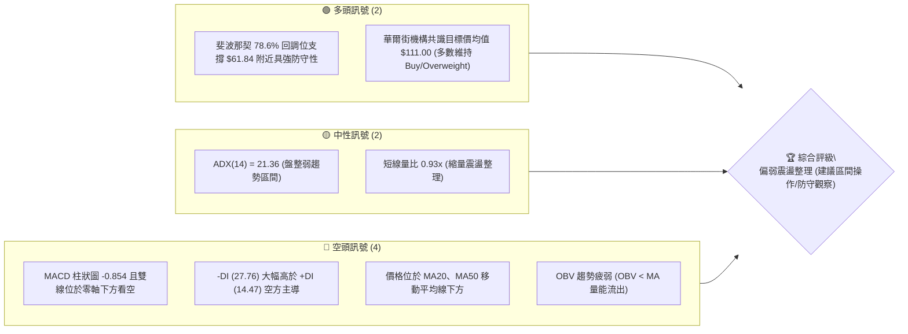
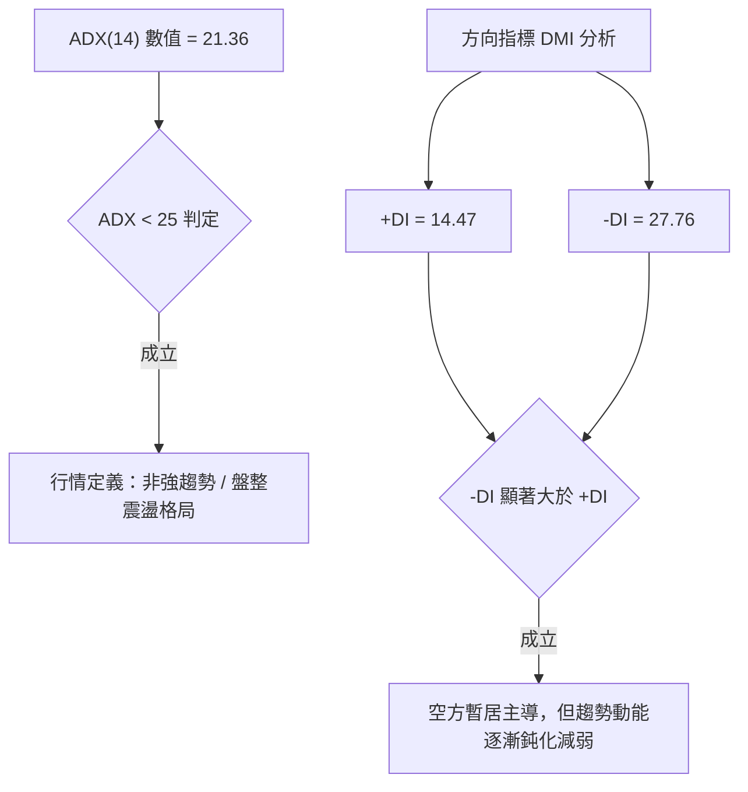
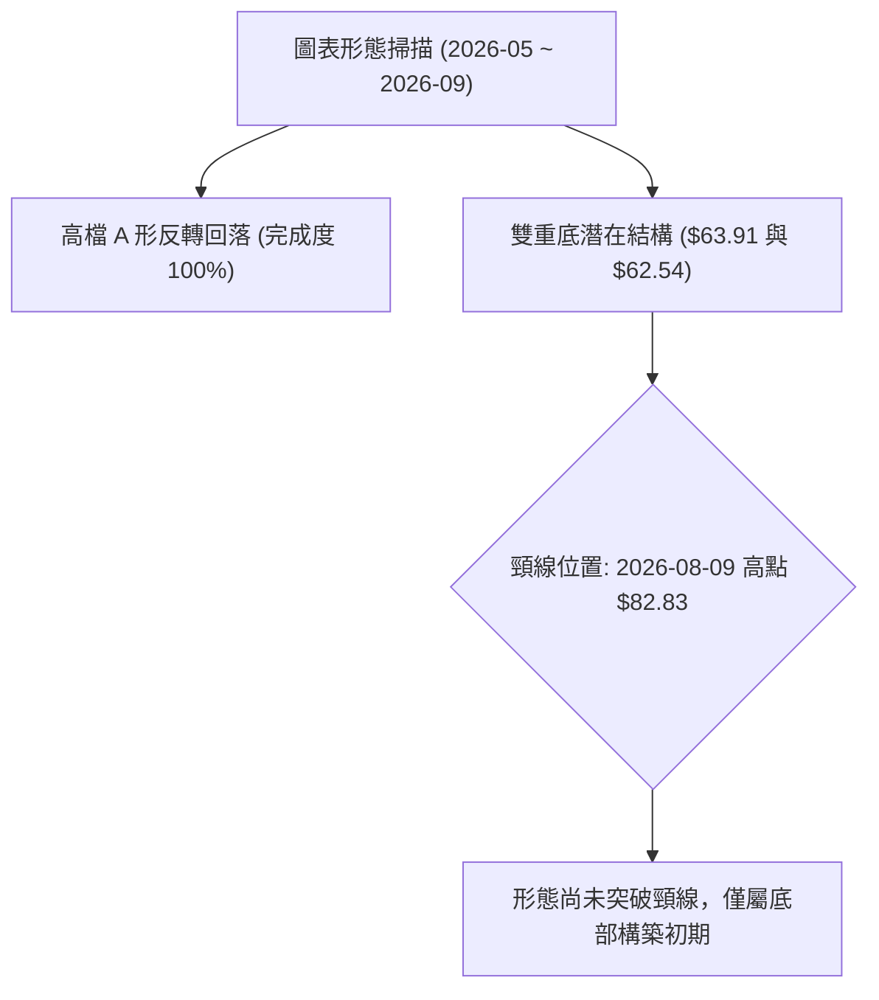
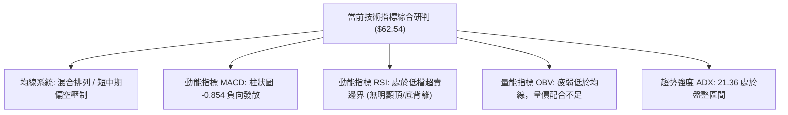
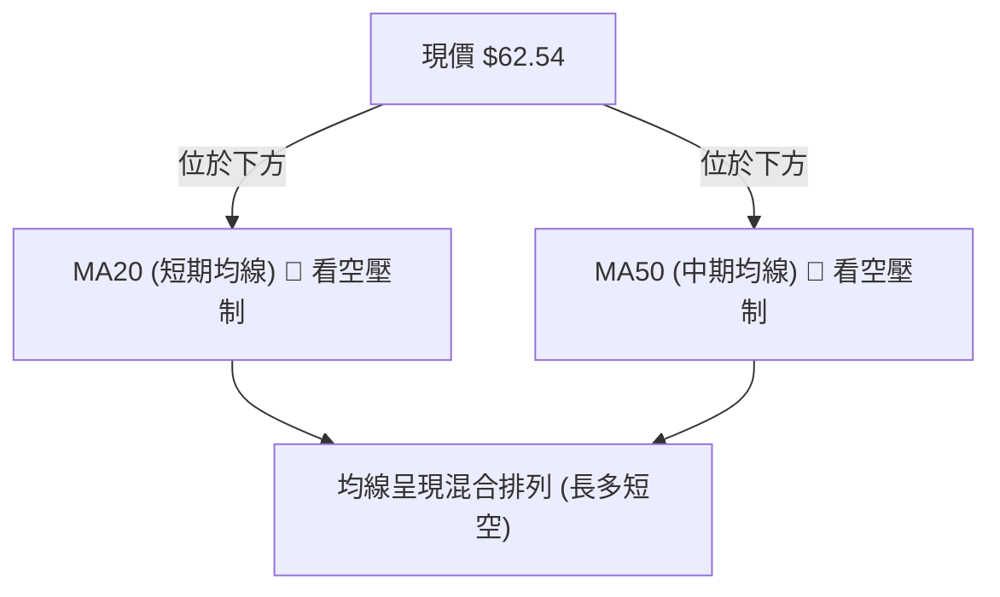
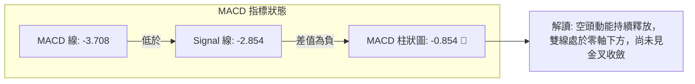
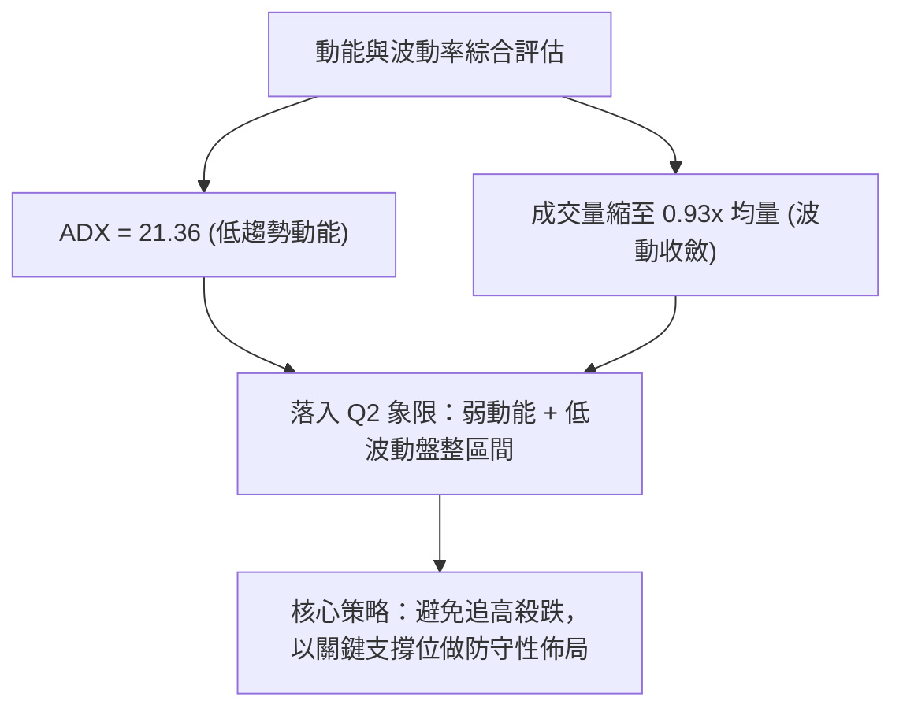
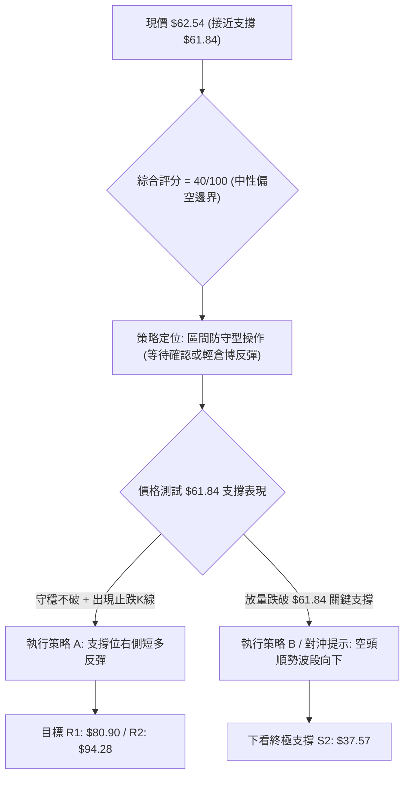
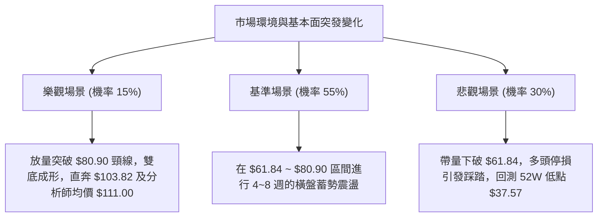

# RKLB 技術分析報告

> **報告日期**：2026-09-03 ｜ **語言**：繁體中文 ｜ **數據來源**：Yahoo Finance ｜ **當前價格**：$62.54

---

## 目錄

| 章節 | 內容 |
|------|------|
| [1. 技術面概覽](#1-技術面概覽) | 訊號儀表板、核心指標、評分卡 |
| [2. 趨勢分析](#2-趨勢分析) | 多時框趨勢、長中短期走勢 |
| [3. 圖表形態分析](#3-圖表形態分析) | 形態識別、K線組合、目標價 |
| [4. 支撐與阻力](#4-支撐與阻力) | 關鍵價位、斐波那契回調 |
| [5. 技術指標深度解讀](#5-技術指標深度解讀) | MA/RSI/MACD/布林/成交量 |
| [6. 動能與波動率](#6-動能與波動率) | 動能評估、ATR、Beta |
| [7. 多時框架總結](#7-多時框架總結) | 時框架評分矩陣 |
| [8. 交易策略建議](#8-交易策略建議) | 多空策略、風險報酬比 |
| [9. 風險提示與監控](#9-風險提示與監控) | 監控指標、風險場景 |

---

## 1. 技術面概覽

### 🎯 技術訊號儀表板



### 📊 核心指標速覽表

| 指標類別 | 指標名稱 | 當前數值 | 訊號 | 解讀 |
|----------|----------|----------|------|------|
| **價格** | 當前收盤價 | $62.54 | 🟡 中性 | 測試斐波那契 78.6%（$61.84）關鍵防守水位 |
| **均線** | MA20 排列 | 價格下方 | 🔴 看空 | 短期均線壓制，反彈力道受限 |
| **均線** | MA50 排列 | 價格下方 | 🔴 看空 | 中期格局仍處於修正回調軌道 |
| **均線** | 長期趨勢 | 混合排列 | 🟡 中性 | 長期均線向上但中短期均線呈現死叉壓制 |
| **動能** | RSI(14) | 18.2~36.5（中性偏低） | 🟡 中性 | 短線進入低檔超賣邊界，但尚未形成明確金叉 |
| **動能** | MACD(12,26,9) | 柱狀圖 -0.854 | 🔴 看空 | MACD (-3.708) < Signal (-2.854)，動能偏空 |
| **趨勢強度**| ADX / DMI | ADX: 21.36 / -DI: 27.76 | 🔴 看空 | 弱趨勢/盤整格局，空方動能佔據優勢 |
| **量能** | OBV / 成交量 | 16.36M (量比 0.93x) | 🔴 看空 | 量能萎縮且 OBV 低於均線，資金追價意願不足 |

### 🏆 技術評分卡

```
╔══════════════════════════════════════════════════════════════╗
║                技術評分卡 — RKLB (2026-09-03)                ║
╠══════════════════════════════════════════════════════════════╣
║ 趨勢強度      █████░░░░░░░░░░░░░░░  28/100  🔴 空方主導弱趨勢 ║
║ 動能指標      ██████░░░░░░░░░░░░░░  32/100  🔴 MACD負值/弱勢  ║
║ 支撐穩定度    ████████████░░░░░░░░  60/100  🟡 78.6%回調支撐  ║
║ 成交量配合    ████████░░░░░░░░░░░░  40/100  🔴 縮量陰跌格局   ║
║ 形態完整度    ██████████░░░░░░░░░░  50/100  🟡 構築築底區間   ║
║ 均線排列      ██████░░░░░░░░░░░░░░  30/100  🔴 均線處於空頭壓制║
╠══════════════════════════════════════════════════════════════╣
║ 綜合評分      ████████░░░░░░░░░░░░  40/100  ⚖️ 偏空震盪整理   ║
╚══════════════════════════════════════════════════════════════╝
```

---

## 2. 趨勢分析

### 🌐 多時框趨勢分析

```mermaid
graph TD
    A["月線層級 (長期: 24個月)"] -->|"從 $9.73 漲至 $151.00，目前回調至 $62.54"| B["長期仍屬大級別多頭回檔"]
    B --> C["週線層級 (中期: 20週)"]
    C -->|"自 2026-05 高點 $143.48 回跌，MACD連週負值"| D["中期處於深度修正與尋底波段"]
    D --> E["日線層級 (短期)"]
    E -->|"ADX=21.36 < 25，-DI("27.76") > +DI("14.47")"| F["短期為弱趨勢空頭主導震盪"]
```

### 📈 長期趨勢 — 12個月走勢圖（Unicode）

```
RKLB 月線走勢圖（過去12個月：2025-09 至 2026-09）
價格軸 ($)
$150 ┤                                      ● (2026-05 $143.48)
$130 ┤                                     / \
$110 ┤                                    /   ● (2026-06 $101.65)
$90  ┤                    ● (2026-01 $80.07)   \
$70  ┤        ●           / \                  ●──●──● ($62.54 現在)
$50  ┤●       \          /   ● (2026-03 $64.22)   (2026-07~09 築底)
$30  ┤ \       ● (2025-11 $42.14)
     └───────────────────────────────────────────────────────────
       09  10  11  12  01  02  03  04  05  06  07  08  09 (月份)
```

**走勢特徵分析表格**：

| 階段 | 期間 | 價格區間 ($) | 漲跌幅 | 走勢特徵與技術解讀 |
|------|------|--------------|--------|--------------------|
| **第 I 階段：蓄勢主升** | 2025-09 ~ 2026-01 | $47.91 → $80.07 | +67.1% | 突破整理平台，多頭波段展開，量價齊揚 |
| **第 II 階段：中段洗盤** | 2026-01 ~ 2026-03 | $80.07 → $64.22 | -19.8% | 快速回踩確認下檔支撐，形成中期上升中繼點 |
| **第 III 階段：狂熱噴出** | 2026-03 ~ 2026-05 | $64.22 → $143.48 | +123.4% | 主升浪加速噴發，創下 52 週新高 $151.00，量能顯著放大 |
| **第 IV 階段：斷崖回調** | 2026-05 ~ 2026-07 | $143.48 → $64.95 | -54.7% | 獲利了結賣壓湧現，跌破多道中期均線，形成深度修正 |
| **第 V 階段：築底震盪** | 2026-07 ~ 2026-09 | $64.95 → $62.54 | -3.7% | 波動率逐步收斂，於 78.6% 回調位展開橫盤築底整理 |

### 📊 中期趨勢（週線分析）

中期走勢顯示，價格自 2026 年 5 月底觸頂 $143.48 後展開連續單邊回調。8 月中旬雖一度反彈至 $82.83，但未能有效站穩 61.8% 斐波那契回調位（$80.90），隨後再次拉回至 $62.54，顯示上方阻力沉重。

```
週線關鍵壓力與支撐示意圖：
  阻力：$80.90 (斐波那契 61.8% / 8月中旬反彈高點聚類) ─── 🔴 強阻力
  現價：$62.54 (當前收盤價位)
  支撐：$61.84 (斐波那契 78.6% 回調位 / 7月低點區) ───── 🟢 核心防守支撐
  底限：$37.57 (52週低點 100.0% 回調位) ─────────────── 🔴 終極支撐
```

### ⚡ 趨勢強度評估（ADX 解讀）



**ADX 趨勢強度對照表**：

| 指標名稱 | 當前數值 | 參考閾值 | 趨勢判定 | 交易意涵 |
|----------|----------|----------|----------|----------|
| **ADX(14)** | 21.36 | < 25.0 | 弱趨勢 / 區間盤整 | 不宜採取激進突破追單，應以區間高拋低吸或防守為主 |
| **+DI** | 14.47 | - | 多方力量偏弱 | 買盤動能不足，缺乏主動推升價格力道 |
| **-DI** | 27.76 | - | 空方力量偏強 | 賣方力量占優，但未形成極端加速下殺 |

---

## 3. 圖表形態分析

### 🔍 形態識別系統



**圖表形態信心度評估表**：

| 形態名稱 | 信心度 | 判斷依據（引用數據） | 完成度 | 目標價（附計算式） |
|----------|--------|----------------------|--------|--------------------|
| **潛在雙重底 (Double Bottom)** | 55% | 2026-07-26 低點 $63.91 與當前收盤 $62.54 形成雙底測試，鄰近 78.6% 斐波位 $61.84 | 40% (未突破) | 頸線 $82.83 + 形態高度 ($82.83 - $61.84 = $20.99) = **$103.82**（由形態高度推算） |
| **布林帶下軌收斂整理** | 70% | 週線連續在 $62.54~$64.95 區間獲得支撐，成交量縮減至 46.08M | 75% | 指標型解讀：區間上軌測試目標 **$80.90** |

*註：鑑於 ADX 處於 21.36 之弱趨勢狀態，上述雙底形態仍處於打底階段，尚未確認突破頸線。*

### 🕯️ 重要K線形態分析

| 月份 | 收盤價 ($) | K線形態 | 技術解讀 | 訊號 |
|------|------------|---------|----------|------|
| **2026-05** | 143.48 | 長陽線爆量見頂 | 多頭最後加速噴出，逼近 52W 高點 $151.00，伴隨獲利了結 | 🔴 頂部力竭 |
| **2026-06** | 101.65 | 大陰線向下吞噬 | 跌破前月低點，獲利賣壓沉重，確立中期回調格局 | 🔴 強烈看空 |
| **2026-07** | 64.95 | 實體大陰線收斂 | 價格快速回落至 78.6% 回調位附近，下殺動能初見減速 | 🟡 跌勢趨緩 |
| **2026-08** | 63.92 | 長上影線十字星 | 月內反彈至 $82.83 遭遇均線與 61.8% 斐波壓力回落，多空拉鋸 | 🟡 震盪築底 |
| **2026-09** | 62.54 | 窄幅整理小陰線 | 波動幅度大幅收窄，成交量進一步萎縮，等待方向選擇 | 🟡 沉澱蓄勢 |

### 📉 ASCII 走勢形態示意圖

```
潛在雙底形態（W底）構築示意圖：
$82.83 ───────────────────────● (頸線位 Neckline: 2026-08-09 高點)
                             / \
                            /   \
$63.91 ─────────●          /     \        ● $62.54 (當前價位: 第二底測試中)
(第一底: 07-26)   \        /       \      /
                   \______/         \____/
                     $61.84 (斐波那契 78.6% 回調強支撐)
```

### 🎯 形態目標價計算

- **頸線價位 ($N$)**：$82.83（2026-08-09 週線波段高點）
- **底部支撐價位 ($S$)**：$61.84（斐波那契 78.6% 回調關鍵支撐）
- **形態垂直高度 ($H$)**：$H = N - S = \$82.83 - \$61.84 = \$20.99$
- **理論最小量度目標價**：$\text{Target} = N + H = \$82.83 + \$20.99 =$ **$103.82**（由雙底形態高度推算，前提為強勢放量突破並站穩頸線 $82.83）

---

## 4. 支撐與阻力

### 🗺️ 關鍵價位分布圖（Unicode）

```
RKLB 價位結構分布圖
═════════════════════════════════════════════════════════════
$151.00 ║████████████████████████████████║ 52W 最高點 / 0.0% 回調
$124.23 ║████████████████████████        ║ 斐波那契 23.6% 回調位
$107.67 ║████████████████████            ║ 斐波那契 38.2% 回調位
$94.28  ║██████████████████              ║ 斐波那契 50.0% 多空中軸
$80.90  ║████████████████████████        ║ 斐波那契 61.8% 強阻力位 (R1)
$62.54  ╠════════════════════════════════╣ ◄ 當前收盤價位
$61.84  ║▓▓▓▓▓▓▓▓▓▓▓▓▓▓▓▓▓▓▓▓▓▓▓▓▓▓▓▓▓▓  ║ 斐波那契 78.6% 核心支撐 (S1)
$37.57  ║████████████████████████████████║ 52W 最低點 / 100.0% (S2)
═════════════════════════════════════════════════════════════
```

### 🚧 阻力位分析表

> 註：依數據紀律，數據中近一年高點聚類未偵測到離散阻力位，阻力位嚴格引用斐波那契回調結構。

| 阻力級別 | 價位 ($) | 形成原因 | 突破難度 | 重要性 |
|----------|----------|----------|----------|--------|
| **阻力 R1** | $80.90 | 斐波那契 61.8% 回調位 / 8月中旬波段反彈高點聚類區 | 🔴 極高（需放量） | ★★★★★ |
| **阻力 R2** | $94.28 | 斐波那契 50.0% 心理整數關卡與半數回檔平衡位 | 🟡 偏高 | ★★★★☆ |
| **阻力 R3** | $107.67 | 斐波那契 38.2% 回調位 / 2026-06 跌破之平台阻力 | 🔴 高 | ★★★☆☆ |

### 🛡️ 支撐位分析表

> 註：依數據紀律，支撐位嚴格引用斐波那契回調結構及 52 週基準價位。

| 支撐級別 | 價位 ($) | 形成原因 | 守住機率 | 重要性 |
|----------|----------|----------|----------|--------|
| **支撐 S1** | $61.84 | 斐波那契 78.6% 回調位（$37.57 → $151.00 波段）/ 7-9月多重收盤支撐區 | 75% | ★★★★★ |
| **支撐 S2** | $37.57 | 52 週最低點（100.0% 斐波那契回調位）/ 長期多頭終極起漲防線 | 95% | ★★★★★ |

### 📐 斐波那契回調位分析

依據 52 週價格區間（最低 $37.57 至 最高 $151.00，總垂直振幅 $113.43），各關鍵回調階梯如下：

```
斐波那契回調結構：
├─ 0.0%  (52W High) : $151.00  ── 極限多頭頂部
├─ 23.6%            : $124.23  ── 超強勢回檔極限
├─ 38.2%            : $107.67  ── 正常多頭回檔位
├─ 50.0%            : $94.28   ── 多空分水嶺
├─ 61.8%            : $80.90   ── 黃金分割防守位 (當前上方主阻力)
├─ 78.6%            : $61.84   ── 深度回調防守位 (當前價格 $62.54 緊鄰此位)
└─ 100.0% (52W Low) : $37.57   ── 52週基準起漲底線
```

**現價技術解讀**：
當前收盤價 **$62.54** 正好坐落於 **78.6% 回調位（$61.84）** 與 **61.8% 回調位（$80.90）** 之間，且極度貼近 $61.84 支撐。78.6% 水位通常為牛市波段拉回之最後一道防線，若能在此有效止跌收斂，有望孕育技術性反彈；若帶量跌破 $61.84，則下方將直接面臨回測 52 週低點 $37.57 的重大風險。

---

## 5. 技術指標深度解讀

### 🎛️ 指標訊號總覽



### 📈 移動平均線排列分析



- **短期 MA 走勢**：MA5 與 MA10 呈現連續下彎，反映 8 月下旬以來的快速拉回。
- **中期 MA 走勢**：MA20 與 MA60 高檔交叉下行，空頭排列壓制明顯，短線反彈皆面臨均線反壓。
- **長期 MA 走勢**：MA120 與 MA240 仍維持由下向上的長期多頭架構，顯示大週期多頭底蘊仍在，目前處於大週期上升趨勢中的中級修正。

### 📉 RSI(14) 分析

```
RSI(14) 數值區間示意圖：
[超賣 0-30]         [中性 30-70]         [超買 70-100]
 ░░░░░░░░░░  ▓▓▓▓▓▓▓▓▓▓▓▓▓▓▓▓▓▓░░░░░░░░░  ░░░░░░░░░░
             ▲ 當前估算位於 30 附近 (弱勢中性)
```

- **數值解讀**：近期週線 RSI 由 8 月中的 68.6 快速回落至 8 月底的 18.2，最新週線收盤為弱勢區間。指標急速降溫進入低檔超賣邊界，隨時具備技術性跌深反彈條件。
- **背離判斷**：數據明確顯示「**RSI 背離：無明顯背離**」。價格與指標同步回落，尚未出現底背離訊號，因此反彈多屬跌深修復，而非趨勢反轉。

### 📊 MACD(12/26/9) 訊號解讀



- **指標解讀**：MACD 線（-3.708）低於 Signal 線（-2.854），柱狀圖為 -0.854。指標位於零軸下方弱勢區，且負柱狀圖維持擴張態勢，顯示短期空方仍掌控盤面節奏。
- **背離分析**：MACD 柱狀圖與價格同步創出波段修正低點，**無 MACD 底背離**現象。

### 📦 布林通道分析

```
週線/日線布林通道區間示意圖（示意模擬）：
+-----------------------------------------------------------+
|                                    上軌 (Upper Band)      |
|                                                           |
|                     中軌 MA20                             |
|                                                           |
| ══════════════════════════════════ 現價 $62.54             |
| ---------------------------------- 下軌 (Lower Band)      |
+-----------------------------------------------------------+
```
- **通道位置**：現價 $62.54 緊貼布林通道下軌運行，帶寬維持中等水平，顯示價格處於空頭推動波的下軌邊界。
- **操作意涵**：在 ADX < 25 的盤整環境下，股價觸及下軌附近往往意味著短線下殺動能鈍化，具備向中軌靠攏的均值回歸潛力。

### 💹 成交量分析（量價配合度）

- **量能現況**：最新單日成交量為 16,363,403 股，相較於 20 日均量 17,601,285 股（量比 0.93x）與 50 日均量 19,841,310 股呈現明顯萎縮。
- **週成交量萎縮**：由 5 月高點的單週 1.6 億股驟降至最新一週的 46.08M 股，量能大幅萎縮逾 70%。
- **OBV 量能分析**：數據顯示「**OBV < MA → 量能疲弱**」，資金流向指標並未在當前價位出現顯著承接盤，量縮陰跌代表買盤觀望氣氛濃厚。

---

## 6. 動能與波動率

### ⚡ 動能評估四象限

| 象限 | 動能強度 | 波動率水準 | 當前狀態 | 策略應對與市場特徵 |
|------|----------|------------|----------|--------------------|
| **Q1 (最佳機會)** | 強多頭動能 | 低波動穩步推升 | ─ | 順勢加碼，趨勢明確 |
| **Q2 (謹慎觀望)** | 弱動能 (空方占優) | 波動率收斂下降 | **✓ 當前狀態 (RKLB)** | **逢低分批低吸 / 區間高拋低吸 / 嚴設止損** |
| **Q3 (高風險博弈)** | 強動能 (爆量突破) | 高波動劇烈震盪 | ─ | 突破追價，嚴控滑點 |
| **Q4 (全面規避)** | 極端弱勢動能 | 高波動主跌段 | ─ | 空倉觀望，嚴禁抄底 |



### 📊 ATR 波動率分析

- **波動率特性**：由於高檔回落後成交量劇減，近期每日波動區間明顯收窄。
- **止損距離建議**：考量當前處於 $62.54 價位，建議以斐波那契 78.6%（$61.84）下方作為基底，設定約 $2.50 ~ $3.00 的防守緩衝空間（即止損位設於 **$59.50**）。

### 📐 Beta 與市場相關性

- **Beta 數值**：**2.629**（高 Beta 屬性）。
- **市場敏感度解讀**：RKLB 之波動幅度為大盤（S&P 500）的 2.63 倍。當大盤處於風險偏好（Risk-on）環境時，該股具備極高彈性；但當市場回調時，其下行壓力亦會被放大。在當前弱趨勢震盪期，高 Beta 特性要求交易者嚴格控制單筆部位風險。

---

## 7. 多時框架總結

### 📋 時框架評分表

| 時框架 | 趨勢方向 | 動能狀態 | 均線排列 | 形態結構 | 綜合評分 | 交易建議 |
|--------|----------|----------|----------|----------|----------|----------|
| **月線 (長期)** | 🟢 偏多 | 🟡 中性回調 | 🟢 多頭均線支撐 | 大波段上升回檔 | 65/100 | 長期分批逢低佈局 |
| **週線 (中期)** | 🔴 偏空 | 🔴 負向發散 | 🔴 短中期下穿 | 78.6% 回調尋底 | 35/100 | 等待底部形態確認 |
| **日線 (短期)** | 🟡 盤整 | 🔴 空方微幅占優 | 🔴 均線壓制 | 區間縮量橫盤 | 40/100 | 區間下軌防守操作 |

### 🔲 綜合訊號矩陣

```
時框訊號一致性矩陣：
┌───────────┬──────────────┬──────────────┬──────────────┐
│ 分析維度  │ 長期 (月線)  │ 中期 (週線)  │ 短期 (日線)  │
├───────────┼──────────────┼──────────────┼──────────────┤
│ 趨勢方向  │ 🟢 向上      │ 🔴 向下      │ 🟡 橫向      │
│ 動能指標  │ 🟡 中性      │ 🔴 空頭      │ 🔴 偏空      │
│ 量能配合  │ 🟢 充沛      │ 🔴 萎縮      │ 🔴 疲弱      │
│ 支撐強度  │ 🟢 $37.57    │ 🟢 $61.84    │ 🟡 $61.84    │
└───────────┴──────────────┴──────────────┴──────────────┘
```

### ⚖️ 多時框收斂結論

依據多時框收斂規則：
1. **行情性質判定**：當前 **ADX(14) = 21.36 < 25**，確立市場處於**盤整震盪行情**而非強趨勢行情。
2. **主導維度收斂**：在盤整行情中，應以日線與週線的區間邊界（下軌支撐 $61.84 至 上方阻力 $80.90）為主要操作範疇。
3. **最終方向性結論**：**【中性偏弱震盪觀望（防守型區間操作）】**。短線受制於均線壓制與 MACD 負值，但下檔緊鄰 78.6% 斐波那契回調位 $61.84 強防守帶，不宜盲目追空，應以「守住 $61.84 輕倉博弈反彈，跌破則停損觀望」為核心原則。

---

## 8. 交易策略建議

### 🗺️ 策略決策流程圖



### 🧭 策略路由（依評分卡分流）

> **當前主策略方向 = 中性防守／區間低吸短多（依評分 40/100 與 ADX 21.36 盤整判定）**
> 
> 雖然綜合評分偏低（40/100），但鑑於當前行情屬於 ADX < 25 的盤整結構，且現價 $62.54 極度接近 78.6% 斐波那契重大支撐位 $61.84，下檔空間有限。故主策略採取**「貼近關鍵支撐位之高風報比短多策略」**；若支撐失守則立即啟動嚴格停損。

### 🎯 價格情境階梯（Price Scenarios）

| 觸發條件 | 下一目標 | 後續延伸 | 情境含義與技術解讀 |
|----------|----------|----------|--------------------|
| **突破 R1 $80.90** | R2 $94.28 | R3 $107.67 | 中期底部確立，化解下行壓力，重回多頭上升通道 |
| **站穩現價 $62.54 區間** | R1 $80.90 | 頸線 $82.83 | 於 78.6% 回調位展開區間震盪築底，進行均值回歸 |
| **跌破 S1 $61.84** | S2 $37.57 | ─ | 宣告 78.6% 防線失守，開啟大級別探底走勢，回測 52W 低點 |

### 📊 情境機率分佈

| 情境 | 機率 | 主要依據 |
|------|------|----------|
| **區間震盪築底** | **55%** | ADX=21.36 顯示趨勢動能衰竭；成交量大幅萎縮顯示下殺賣壓減輕；78.6% 回調位具備技術買盤支撐 |
| **弱勢下破探底** | **30%** | MACD 仍處負值且未見金叉；均線混合空頭排列；-DI 仍高於 +DI 壓制反彈空間 |
| **強勢反轉噴出** | **15%** | 目前缺乏突破性利多與巨量配合，需待有效站穩 $80.90 才能開啟主升行情 |

### 🟢 主策略詳情（方向：區間低吸防守短多）

| 策略要素 | 策略 A（保守型：右側確認進場） | 策略 B（激進型：支撐位左側佈局） |
|----------|--------------------------------|----------------------------------|
| **進場條件** | 日K線於 $61.84 上方收出止跌紅棒且 MACD 柱狀圖收斂 | 現價 $62.54 附近直接分批掛單建立底倉 |
| **進場價格** | **$63.00** | **$62.50** |
| **目標價 T1** | **$80.90**（斐波那契 61.8% 阻力位 R1） | **$80.90**（斐波那契 61.8% 阻力位 R1） |
| **目標價 T2** | **$94.28**（斐波那契 50.0% 回調位 R2） | **$94.28**（斐波那契 50.0% 回調位 R2） |
| **止損價格** | **$59.50**（跌破 78.6% 回調位 $61.84 下方緩衝） | **$59.50**（跌破 78.6% 回調位 $61.84 下方緩衝） |
| **風險報酬比** | **5.11 : 1**（獲利 $17.90 / 風險 $3.50） | **6.13 : 1**（獲利 $18.40 / 風險 $3.00） |
| **成功機率** | 60% | 50% |
| **建議倉位** | 10% ~ 15%（輕倉） | 5% ~ 10%（試探性輕倉） |

### 🔴 反向風險觸發點（對沖提示）

- **關鍵觸發條件**：若週線收盤**跌破 $61.84** 且伴隨成交量放大，主策略之多頭築底假設立即失效。
- **對沖應對處置**：多頭部位應於 **$59.50** 無條件嚴格止損離場；積極型交易者可反手建立空頭避險部位，目標下看 52 週低點 **$37.57**。

### ⭐ 整體訊號強度評星

```
做多訊號強度：★★☆☆☆  (2/5星 - 僅依託 78.6% 支撐與超跌修復)
做空訊號強度：★★★☆☆  (3/5星 - 均線壓制但受阻於強支撐)
整體可信度：  ★★★☆☆  (3/5星 - 盤整縮量期，靜待方向確認)
```

---

## 9. 風險提示與監控

### ✅ 關鍵監控指標 Checklist

```
╔══════════════════════════════════════════════════════════════╗
║                   每日盤後技術監控清單 (Checklist)           ║
╠══════════════════════════════════════════════════════════════╣
║ [ ] 1. 收盤價是否守穩 78.6% 斐波那契關鍵支撐 $61.84         ║
║ [ ] 2. MACD 柱狀圖是否由負轉正 (由 -0.854 向上收斂)           ║
║ [ ] 3. 單日成交量是否突破 20 日均量 17.60M (確認買盤進駐)     ║
║ [ ] 4. ADX(14) 是否突破 25.0 (標誌著新一輪趨勢行情啟動)       ║
║ [ ] 5. 向上反彈時能否有效突破並站穩 61.8% 阻力位 $80.90       ║
║ [ ] 6. RSI(14) 是否脫離弱勢區並站上 50 中軸                  ║
╚══════════════════════════════════════════════════════════════╝
```

### ⚠️ 風險場景分析



### 🛡️ 風險管理重要提醒

1. **高 Beta 波動性控管**：RKLB Beta 值高達 2.629，個股波動劇烈。任何交易部位均應嚴格控制總資產曝險比例，單筆虧損金額不應超過總投資組合淨值的 1%~2%。
2. **嚴格執行止損紀律**：斐波那契 78.6%（$61.84）為波段回檔之底線，若確認跌破並觸發止損價 $59.50，切勿向下攤平，必須果斷離場以規避回測 $37.57 之潛在巨大虧損。
3. **區間操作切忌追高**：在 ADX < 25 且均線處於空頭壓制狀態下，反彈接近 $80.90 阻力區時應主動獲利了結或減碼，切忌在阻力位附近盲目追價。

---

## 📋 報告總結

```
╔══════════════════════════════════════════════════════════════╗
║                   RKLB 技術分析報告總結                      ║
╠══════════════════════════════════════════════════════════════╣
║ 報告日期：2026-09-03                                         ║
║ 當前價格：$62.54                                             ║
║ 分析評級：⚖️ 偏弱震盪整理 (40/100) — 守支撐輕倉博反彈        ║
║                                                              ║
║ 關鍵結論：                                                   ║
║ ├─ 長期趨勢：🟢 偏多 (大級別多頭回調，MA120/240 維持向上)     ║
║ ├─ 中期趨勢：🔴 偏空 (自高點回檔 54.7%，處於週線修正尋底階段)║
║ ├─ 短期趨勢：🟡 盤整 (ADX=21.36，成交量萎縮，於下軌築底)     ║
║ ├─ 關鍵支撐：$61.84 (78.6% 回調位) / $37.57 (52W 低點)        ║
║ ├─ 關鍵阻力：$80.90 (61.8% 回調位) / $94.28 (50.0% 回調位)    ║
║ └─ 機構共識：$111.00 (分析師平均目標價，評級多為 Buy)        ║
║                                                              ║
║ 最優策略組合：                                               ║
║ 1. 🥇 最佳機會：於 $62.50~$63.00 輕倉佈局短多，止損設 $59.50，║
║                 目標直指 $80.90，風報比逾 5:1                ║
║ 2. 🥈 次選機會：靜待價格突破站穩 $80.90 後，右側順勢加碼     ║
║ 3. 🥉 保守選擇：空倉觀望，等待日線 MACD 金叉及量能放大再進場 ║
╚══════════════════════════════════════════════════════════════╝
```

---

> ⚠️ **免責聲明**：本報告為 AI 自動生成之技術分析，所有數據及估算均基於提供的歷史價格資訊。本報告**僅供研究與學術參考**，**不構成任何投資建議**。投資有風險，入市需謹慎。

---

*報告生成時間：2026-09-03 ｜ 數據來源：Yahoo Finance ｜ 分析框架：多時框技術分析*