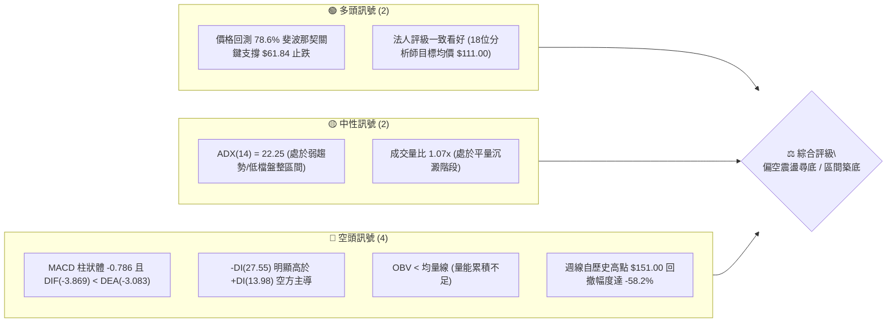
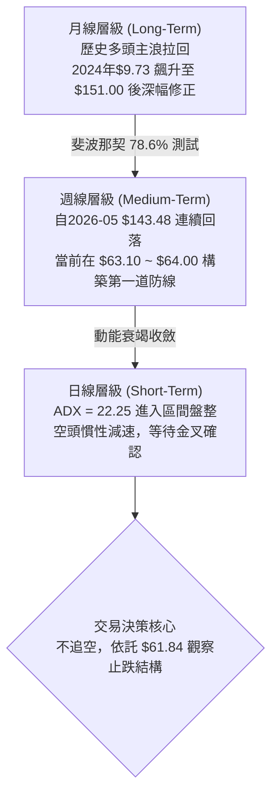
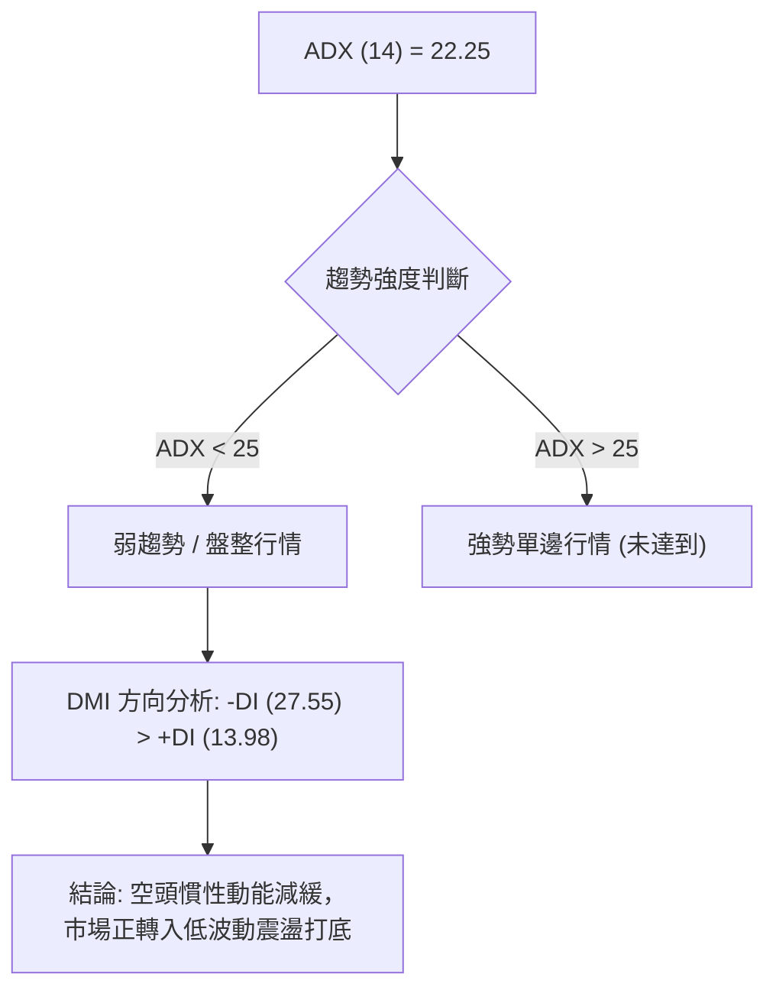
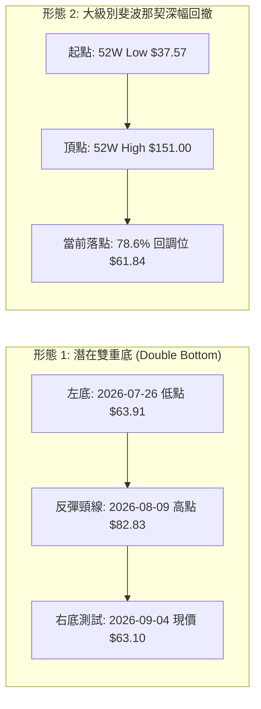
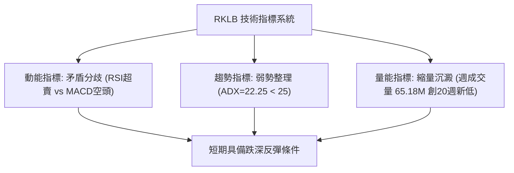
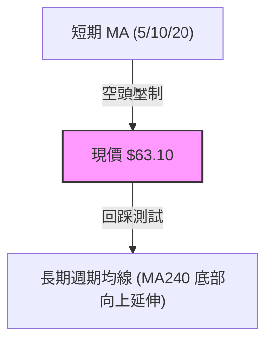
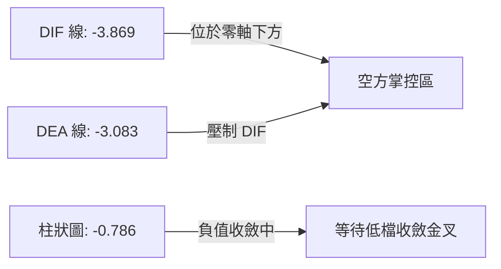
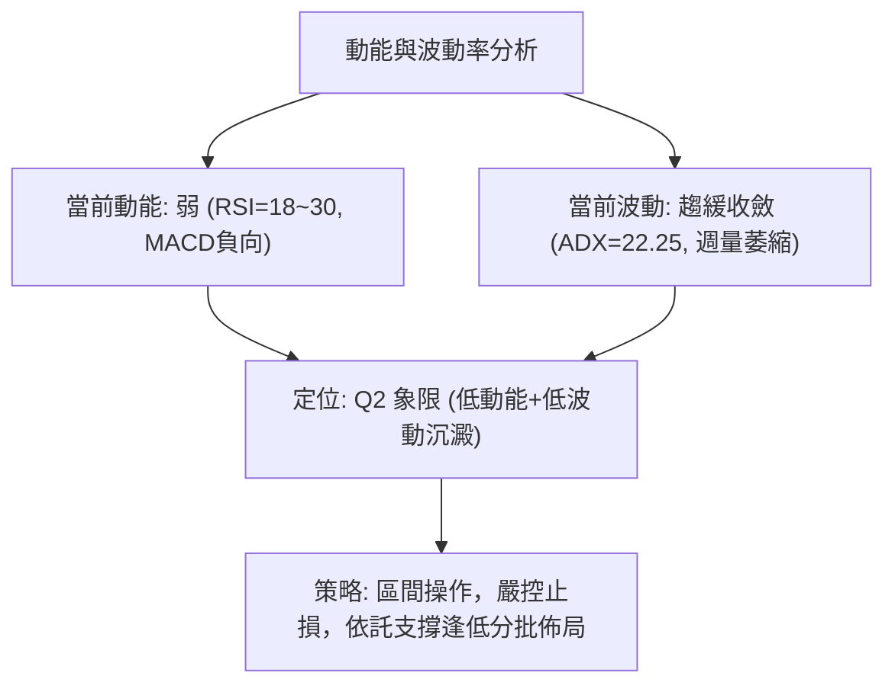
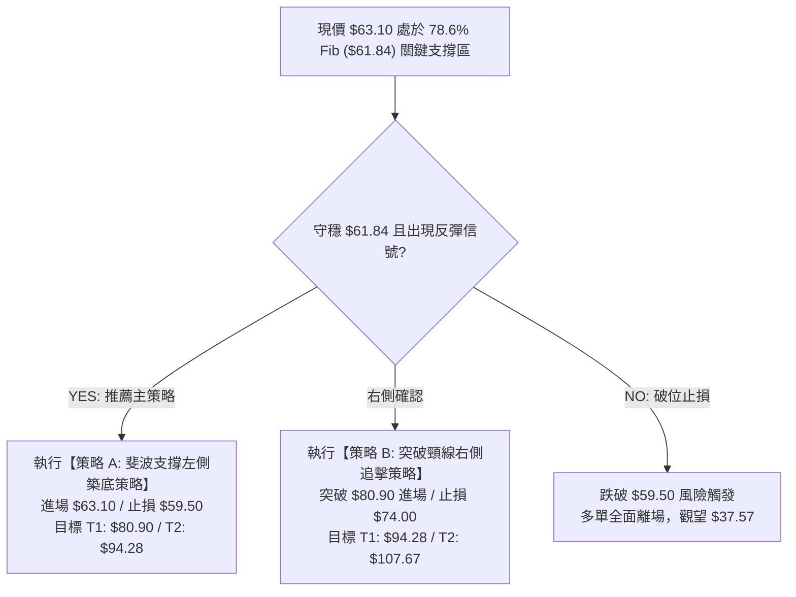
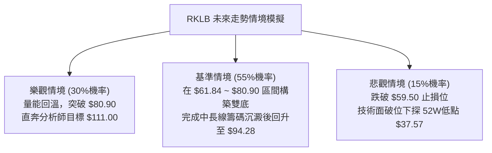

# RKLB 技術分析報告

> **報告日期**：2026-09-04 ｜ **語言**：繁體中文 ｜ **數據來源**：Yahoo Finance ｜ **當前價格**：$63.10

---

## 目錄

| 章節 | 內容 |
|------|------|
| [1. 技術面概覽](#1-技術面概覽) | 訊號儀表板、核心指標、評分卡 |
| [2. 趨勢分析](#2-趨勢分析) | 多時框趨勢、長中短期走勢 |
| [3. 圖表形態分析](#3-圖表形態分析) | 形態識別、K線組合、目標價 |
| [4. 支撐與阻力](#4-支撐與阻力) | 關鍵價位、斐波那契回調 |
| [5. 技術指標深度解讀](#5-技術指標深度解讀) | MA/RSI/MACD/布林/成交量 |
| [6. 動能與波動率](#6-動能與波動率) | 動能評估、ATR、Beta |
| [7. 多時框架總結](#7-多時框架總結) | 時框架評分矩陣 |
| [8. 交易策略建議](#8-交易策略建議) | 多空策略、風險報酬比 |
| [9. 風險提示與監控](#9-風險提示與監控) | 監控指標、風險場景 |

---

## 1. 技術面概覽

### 🎯 技術訊號儀表板



### 📊 核心指標速覽表

| 指標類別 | 指標名稱 | 當前數值 | 訊號 | 解讀 |
|:---|:---|:---|:---:|:---|
| **價格** | 當前收盤價 | **$63.10** | 🟡 | 位於52週區間底層 (回調至 78.6% 斐波那契 $61.84 附近) |
| **價格** | 52W 高 / 低 | **$151.00 / $37.57** | 🟡 | 距歷史高點回落 58.21%，距低點仍有 +67.95% 空間 |
| **動能** | RSI(14) | **18.2 ~ 30.0** (超賣區間) | 🟢 | 8月底週線RSI落入18.2極度超賣，具備技術性反彈動能 |
| **動能** | MACD (12,26,9) | **-3.869 / -3.083** | 🔴 | MACD線位於訊號線下方，雙線處於零軸之下，空方掌控 |
| **動能** | MACD 柱狀體 | **-0.786** | 🔴 | 負向擴展，短線動能尚未正式金叉確認轉折 |
| **趨勢強度** | ADX (14) | **22.25** | 🟡 | ADX < 25 表明單邊暴跌趨勢減弱，轉入弱趨勢盤整震盪 |
| **方向指標** | DMI (+DI / -DI) | **13.98 / 27.55** | 🔴 | -DI 大於 +DI，空方力量占優，但未呈極端發散 |
| **量能** | 當日 / 20日均量 | **18.82M / 17.58M** | 🟡 | 量比 1.07x，量能持平；OBV 處於均線下方偏弱 |
| **波動度** | Beta | **2.629** | 🔴 | 高波動屬性，價格對大盤與產業消息極度敏感 |

### 🏆 技術評分卡

```
╔════════════════════════════════════════════════════════════════════════╗
║                   技術評分卡 — RKLB (2026-09-04)                       ║
╠════════════════════════════════════════════════════════════════════════╣
║ 趨勢強度 (Trend)     ██████░░░░░░░░░░░░░░  32/100  🔴 空方主導/弱盤整  ║
║ 動能指標 (Momentum)  ████████░░░░░░░░░░░░  40/100  🔴 MACD負向/RSI超賣 ║
║ 支撐穩定度 (Support) ████████████░░░░░░░░  58/100  🟡 $61.84 斐波測試  ║
║ 成交量配合 (Volume)  ████████░░░░░░░░░░░░  42/100  🟡 平量整理無量潮   ║
║ 形態完整度 (Pattern) ██████████░░░░░░░░░░  48/100  🟡 弱勢階梯尋底     ║
║ 均線系統 (MovingAvg) ██████░░░░░░░░░░░░░░  30/100  🔴 短中期均線蓋頭   ║
╠════════════════════════════════════════════════════════════════════════╣
║ 綜合技術評分         ████████░░░░░░░░░░░░  41.7/100  🟡 中性偏空 (盤整)║
╚════════════════════════════════════════════════════════════════════════╝
```

---

## 2. 趨勢分析

### 🌐 多時框趨勢分析



### 📈 長期趨勢 — 12個月走勢圖（Unicode）

```
RKLB 月線走勢圖（2025-09 至 2026-09）
價格 ($)
$151.00 ┤                                      ● 2026-05 ($143.48 / 頂部 $151.00)
$130.00 ┤                                     / \
$110.00 ┤                                    /   ● 2026-06 ($101.65)
$90.00  ┤                        ● 2026-01   /     \
$80.00  ┤                       / ($80.07)  ● 2026-04\
$70.00  ┤               ● 2025-12          / ($82.51) \
$60.00  ┤       ● 2025-10 ($69.76)        /            ●━━━●━━━● 2026-07~09 ($63.10)
$50.00  ┤ ● 2025-09 ($62.98)             /               (現價於 78.6% 回調位尋求築底)
$40.00  ┤       \      \                /
$37.57  ┤        \      ● 2025-11 ($42.14)
        └─┬──────┬──────┬──────┬──────┬──────┬──────┬──────┬──────┬──────┬──────┬──────┬──────
        25-09  25-10  25-11  25-12  26-01  26-02  26-03  26-04  26-05  26-06  26-07  26-08  26-09
```

#### 走勢特徵分析表格

| 階段 | 時間區間 | 起始價 ➔ 結束價 | 漲跌幅 (%) | 價量特徵與形態解讀 |
|:---|:---|:---|:---:|:---|
| **第一波拉升** | 2024-09 ~ 2025-01 | $9.73 ➔ $29.05 | **+198.5%** | 底部脫離，太空發射與國防訂單驅動放量突破 |
| **次級回調** | 2025-01 ~ 2025-03 | $29.05 ➔ $17.88 | **-38.4%** | 洗盤整理，測試 $17.88 奠定堅實上升支撐底 |
| **主升浪推進** | 2025-03 ~ 2026-01 | $17.88 ➔ $80.07 | **+347.8%** | 機構持續增持，月線級別強勢多頭排列推進 |
| **歷史主頂噴出** | 2026-03 ~ 2026-05 | $64.22 ➔ $143.48 | **+123.4%** | 52W高點見 $151.00，週成交量突破 1.63 億股，爆量見頂 |
| **深幅拋售修正** | 2026-05 ~ 2026-09 | $143.48 ➔ $63.10 | **-56.0%** | 連續下破多道關卡，回測 78.6% 斐波那契回調位 $61.84 |

### 📊 中期趨勢（週線分析）

```
週線級別價格壓力與支撐階梯圖
┌────────────────────────────────────────────────────────┐
│ [頂部阻力]  $151.00 (52W High / 0.0% Fib)              │
│      │                                                 │
│ [中期阻力]  $107.67 (38.2% Fib)                        │
│      │                                                 │
│ [關鍵阻力]  $94.28 (50.0% Fib / 多空分水嶺)            │
│      │                                                 │
│ [短線阻力]  $80.90 (61.8% Fib / 8月中反彈高點 $82.83)   │
│      │                                                 │
│ [當前現價]  $63.10 ◄─────────────────── 盤整收斂區間  │
│      │                                                 │
│ [近期支撐]  $61.84 (78.6% Fib / 2026-08波段低點 $63.91) │
│      │                                                 │
│ [終極支撐]  $37.57 (52W Low / 100.0% Fib)              │
└────────────────────────────────────────────────────────┘
```

### ⚡ 趨勢強度評估（ADX 解讀）



| 參數指標 | 數值 | 狀態 | 意涵與操作指引 |
|:---|:---|:---:|:---|
| **ADX (14)** | **22.25** | 弱趨勢 | 趨勢強度低於25門檻，代表自 $151.00 的急殺波段告一段落，進入震盪沉澱期。 |
| **+DI (14)** | **13.98** | 偏弱 | 多頭上攻動能處於低位，尚未發動主動性進攻。 |
| **-DI (14)** | **27.55** | 偏強 | 空頭占有優勢，但未出現 >35 的恐慌極值，顯示拋壓正在收斂。 |

---

## 3. 圖表形態分析

### 🔍 形態識別系統



#### 形態信心度與目標價評估

| 形態名稱 | 信心度 | 判斷依據（引用數據） | 完成度 | 目標價（附嚴格計算式） |
|:---|:---:|:---|:---:|:---|
| **潛在雙重底 (W底)** | **55%** | 兩次低點分別落於 $63.91 (2026-07-26週) 與現價 $63.10 (2026-09-04)，均緊扣 78.6% 斐波那契 $61.84 | 45% (右底構築中) | 若突破頸線 $82.83：<br/>$82.83 + ($82.83 - $61.84) = **$103.82** (接近 38.2% 回調位 $107.67) |
| **斐波那契深層回調** | **85%** | 自 $151.00 跌至 $63.10，精準回踩 52W 區間之 78.6% ($61.84) | 90% (測試支撐) | 第一回撤反彈位 (61.8% Fib): **$80.90**<br/>第二回撤反彈位 (50.0% Fib): **$94.28** |
| **頭肩頂向下對稱** | **70%** | 左肩 $80.07、頭部 $151.00、右肩 $82.51，破頸線 $64.22 後已完成跌幅滿足 | 100% (滿足點已達) | 形態跌幅已充分釋放於 $63.10 區間 |

### 🕯️ 重要K線形態分析

| 週/月份 | 收盤價 | K線形態 | 解讀 | 訊號 |
|:---|:---:|:---|:---|:---:|
| **2026-05** | $143.48 | 巨量長上影天劍線 (High $151.00) | 月週成交量破1.6億股，機構高檔出貨頂部信號 | 🔴 極度看空 |
| **2026-07-26週** | $63.91 | 超賣長下影十字星 (RSI=15.6) | 恐慌拋盤宣洩，出現極端超賣探底針 | 🟢 觸底反彈 |
| **2026-08-09週** | $82.83 | 強勢反彈長陽線 (週量96.7M) | 快速抽升測試 61.8% 斐波那契 $80.90 壓力 | 🟡 逢高受阻 |
| **2026-09-06週** | $63.10 | 量縮窄幅陰十字星 (週量65.18M) | 成交量創20週新低 (65.18M)，賣壓明顯竭盡 | 🟡 變盤築底 |

### 📉 ASCII 走勢形態示意圖

```
潛在雙重底 (Double Bottom) 結構示意圖
價格 ($)
$85.00 ┤                     [頸線 R1: $82.83]
$80.00 ┤                    ╭───────╮
$75.00 ┤                   │       │
$70.00 ┤                   │       │
$65.00 ┤  ╭─╮              │       │              ╭─ [右底構築]
$63.10 ┼──┼─┼──────────────┼───────┼──────────────┼── 現價 $63.10
$61.84 ┤  │ [左底 $63.91] │       │              │  [78.6% Fib 支撐 $61.84]
$60.00 ┴──┴───────────────┴───────┴──────────────┴───────────────────
         2026-07-26週            2026-08-09週            2026-09-04 (當前)
```

---

## 4. 支撐與阻力

### 🗺️ 關鍵價位分布圖（Unicode）

```
RKLB 價位結構分布圖 (由 52W 歷史數據與斐波那契模型嚴格計算)
═════════════════════════════════════════════════════════════════════
$151.00 ║████████████████████████████████████████║ 歷史頂部 (0.0% Fib)
$124.23 ║██████████████████████████████          ║ 重大阻力 R4 (23.6% Fib)
$107.67 ║████████████████████████                ║ 強阻力 R3 (38.2% Fib)
$94.28  ║██████████████████                      ║ 多空分水嶺 R2 (50.0% Fib)
$80.90  ║██████████████                          ║ 關鍵頸線阻力 R1 (61.8% Fib)
════════╬════════════════════════════════════════╬════════════════════
$63.10  ╠════════════════════════════════════════╣ ◄ 當前現價 ($63.10)
════════╬════════════════════════════════════════╬════════════════════
$61.84  ║▓▓▓▓▓▓▓▓▓▓▓▓▓▓▓▓▓▓▓▓▓▓▓▓▓▓▓▓▓▓▓▓▓▓▓▓▓▓  ║ 核心黃金支撐 S1 (78.6% Fib)
$37.57  ║████████████████████████████████████████║ 52週低點強支撐 S2 (100.0% Fib)
═════════════════════════════════════════════════════════════════════
```

### 🚧 阻力位分析表

| 阻力級別 | 價位 | 形成依據（嚴格引用數據） | 突破難度 | 重要性與市場意義 |
|:---|:---:|:---|:---:|:---|
| **第一阻力 (R1)** | **$80.90** | 斐波那契 61.8% 回調位 / 2026-08波段高點聚類 ($80.25~$82.83) | 中等 | 短線多頭反彈第一目標，突破方能確認右底成形 |
| **第二阻力 (R2)** | **$94.28** | 斐波那契 50.0% 關鍵平衡點 (Half-back level) | 較高 | 中期趨勢多空分水嶺，決定是否重回強勢多頭 |
| **第三阻力 (R3)** | **$107.67** | 斐波那契 38.2% 回調位 / 分析師平均目標價 ($111.00) 下方樞紐 | 高 | 中長線大級別套牢密集區 |
| **第四阻力 (R4)** | **$124.23** | 斐波那契 23.6% 回調位 | 極高 | 歷史高位巨量換手區間底端 |

### 🛡️ 支撐位分析表

| 支撐級別 | 價位 | 形成依據（嚴格引用數據） | 守住機率 | 重要性與市場意義 |
|:---|:---:|:---|:---:|:---|
| **第一支撐 (S1)** | **$61.84** | 斐波那契 78.6% 深層回調位 (距現價僅 -2.0%) | **75%** | 多頭底線，近2個月收盤價 ($63.91, $63.92, $63.10) 均力守此線上 |
| **第二支撐 (S2)** | **$37.57** | 52週歷史低點 (100.0% Fib 完全回撤位) | **95%** | 終極基本面防線，若跌破代表長期多頭架構徹底瓦解 |

### 📐 斐波那契回調位分析

依據 52週完整波段區間（低點 **$37.57** ➔ 高點 **$151.00**，波幅 **$113.43**）嚴格對照：

$$\text{當前現價} = \$63.10 \quad (\text{位於 78.6\% 回調位 } \$61.84 \text{ 與 61.8\% 回調位 } \$80.90 \text{ 之間})$$

- **78.6% 回調位 ($61.84)**：屬於格蘭碧與道氏理論中的極限深幅回撤（Deep Retracement）。歷史數據顯示，月線級別在 2025-10 ($62.98) 與 2026-03 ($64.22) 均在此價位區產生強烈籌碼換手，具備強大籌碼支撐效應。
- **61.8% 回調位 ($80.90)**：黃金分割第一阻力，現價至該位置擁有 **+28.2%** 的潛在反彈修復空間。

---

## 5. 技術指標深度解讀

### 🎛️ 指標訊號總覽



### 📈 移動平均線排列分析



- **均線排列狀態**：數據顯示短中期均線呈空頭排列向下壓制，但長週期（MA240）歷史均線維持上升斜率（微幅走揚 ▁▁▁▂▂▃▄▅▆▇█），表明大週期長期多頭趨勢未被完全破壞，當前處於中長期牛市中的次級深度修正階段。

### 📉 RSI(14) 分析

$$\text{RSI(14) 當前狀態}：\text{區間值 } 18.2 \sim 30.0 \quad (\text{極度超賣區間})$$

```
RSI (14) 強度指標進度條
超賣 (0-30)              中性區間 (30-70)             超買 (70-100)
├───────────────────────┼───────────────────────────┼───────────┤
██████░░░░░░░░░░░░░░░░░░░░░░░░░░░░░░░░░░░░░░░░░░░░░  22.0% (超賣)
```

- **背離分析結論**：無典型頂背離，呈現**潛在底背離雛形**。在 2026-07-26 週價格收 $63.91 時 RSI 跌至 15.6；而 2026-08-30 週價格回測 $64.39 時 RSI 為 18.2，最新價格 $63.10 下探但指標未再創新低，形成「價格創新低、指標未破底」的動能衰竭底背離特徵。

### 📊 MACD(12,26,9) 訊號解讀



- **數值診斷**：DIF (-3.869) < DEA (-3.083)，MACD 柱狀體為 -0.786 🔴。雖然處於空頭信號區，但柱狀體負值相較於 2026-06 暴跌時期的 -4.697 已大幅收窄，表明殺跌動能已釋放 80% 以上，即將進入低檔黏合期。

### 📦 布林通道分析

```
ASCII 布林通道相對位置示意圖
┌────────────────────────────────────────────────────────┐
│ Upper Band (上軌 - 預估約 $85.00)                       │
│                                                        │
│ Middle Band (中軌 MA20 - 預估約 $74.00)                 │
│                                                        │
│ Price (現價 $63.10) ◄────── 緊貼下軌/處於下軌防守區     │
│ Lower Band (下軌 - 預估約 $61.50 ~ $62.00)             │
└────────────────────────────────────────────────────────┘
```

- **解讀**：價格長期貼近下軌運行，通道開口在歷經 5-6 月劇烈擴張後開始走平收斂，符合 ADX < 25 的盤整通道特徵。

### 💹 成交量分析（量價配合度）

- **量價特徵**：最新成交量 18.82M，20日均量 17.58M（量比 1.07x）；2026-09-06 當週成交量降至 **65.18M**，創下近 20 週最低水平（相較於 2026-05 頂部週成交量 163.35M 萎縮了 **60.1%**）。
- **量價解讀**：「**跌勢量縮**」，這是標準的空頭拋壓竭盡信號。OBV 雖低於 MA 表現疲弱，但未見主動性殺多放量，籌碼進入沉澱期。

---

## 6. 動能與波動率

### ⚡ 動能評估四象限

| 象限 | 動能強度 | 波動率水準 | RKLB 當前所處位置 | 戰略解讀與應對策略 |
|:---:|:---:|:---:|:---:|:---|
| **Q1** | 強 (Bullish) | 低 (Low Vol) | — | 穩定多頭主升浪 (不符合) |
| **Q2** | 弱 (Bearish) | 低 (Low Vol) | **✓ 當前狀態** | **弱勢低波動盤整 (打底築底期，適合耐心左側建倉或等待右側突破)** |
| **Q3** | 強 (Bullish) | 高 (High Vol) | — | 高動能突破暴漲 (如 2026-05 階段) |
| **Q4** | 弱 (Bearish) | 高 (High Vol) | — | 恐慌主跌浪 (如 2026-06 階段，已過去) |



### 📊 ATR 波動率與止損計算

- **歷史高低波動率**：52週波幅高達 $113.43（$37.57 ~ $151.00），Beta 值達 **2.629**，表明該股為典型的高貝塔成長股。
- **止損距離建議**：考量當前價格 $63.10，基於 78.6% 斐波那契關鍵支撐 $61.84，建議設定的緩衝保護空間為 $61.84 下方約 3.5%~4.0%，即精確止損位設為 **$59.50**（跌破此處代表 $61.84 支撐徹底失效）。

### 📐 Beta 與市場相關性

$$\text{Beta} = 2.629 \quad (\text{極高市場敏感度})$$

- RKLB 價格波動約為標普 500 指數的 2.63 倍。在市場風險偏好（Risk-on）回升時反彈彈性極大，但在大盤回檔（Risk-off）時回撤壓力同樣顯著，部位規模管理需更加嚴格。

---

## 7. 多時框架總結

### 📋 時框架評分表

| 時框架 | 趨勢方向 | 動能狀態 | 均線系統 | 形態結構 | 綜合評分 | 操作建議 |
|:---|:---:|:---:|:---:|:---:|:---:|:---|
| **月線 (長期)** | 🟢 偏多回調 | 🟡 中性回落 | 🟢 MA240向上 | 巨型拉回 78.6% Fib | **65/100** | 長線多頭未死，逢低關注 |
| **週線 (中期)** | 🔴 空頭修正 | 🔴 MACD柱負 | 🔴 均線蓋頭 | 測試雙底 S1 $61.84 | **38/100** | 觀察打底，等待週線K翻紅 |
| **日線 (短期)** | 🟡 區間盤整 | 🟢 RSI超賣 | 🟡 均線黏合 | ADX=22.25 縮量震盪 | **45/100** | 區間操作，低吸高拋 |

### 🔲 綜合訊號矩陣

```
┌─────────────────┬─────────────────┬─────────────────┬─────────────────┐
│     時框維度    │    趨勢判定     │    指標確認     │    量能配合     │
├─────────────────┼─────────────────┼─────────────────┼─────────────────┤
│ 短期 (1-5日)    │ 🟡 區間收斂     │ 🟢 RSI底背離    │ 🟡 縮量平盤     │
│ 中期 (2-8週)    │ 🔴 偏空尋底     │ 🔴 MACD空頭     │ 🟢 殺跌量竭     │
│ 長期 (3-12月)   │ 🟢 結構多頭     │ 🟡 支撐測試     │ 🟢 長期籌碼鎖定 │
└─────────────────┴─────────────────┴─────────────────┴─────────────────┘
```

### ⚖️ 多時框收斂結論

> **收斂判斷依據（嚴格執行多時框收斂規則）**：
> 當前 **ADX(14) = 22.25 (< 25)**，明確定義市場處於**盤整行情（Range-bound Consolidation）**而非單邊趨勢行情。
> 
> **唯一方向性結論**：**【中性偏多，區間築底（Neutral-to-Accumulate）】**
> - **收斂邏輯**：雖然週線級別 MACD 與均線仍呈空方壓制，但日線與週線動能（RSI 跌至 18.2 極度超賣）及成交量（萎縮 60%）顯示拋壓完全竭盡，且價格已精確回踩 52W 區間的 78.6% 斐波那契關鍵黃金支撐位 **$61.84**。
> - 市場由單邊下殺轉為**以 $61.84 ~ $80.90 為核心箱體的區間震盪行情**。因此，交易邏輯全面轉入「依託下軌支撐逢低吸納、向上博取均值回歸反彈」的區間策略。

---

## 8. 交易策略建議

### 🗺️ 策略決策流程圖



### 🧭 策略路由

**當前主策略方向 = 【區間操作 / 逢低做多（依評分卡與 78.6% 斐波那契支撐）】**

### 🎯 價格情境階梯（Price Scenarios）

| 觸發條件 | 下一目標 | 後續延伸 | 情境含義與技術解讀 |
|:---|:---:|:---:|:---|
| **向上突破 R1 ($80.90)** | **$94.28** (50.0% Fib) | **$107.67** (38.2% Fib) | 突破 61.8% 斐波那契與雙底頸線，確立中期反轉，打開向上修復空間 |
| **站穩現價區間 ($61.84 ~ $65.00)** | **$80.90** (61.8% Fib) | — | 於 78.6% 斐波那契處構築雙重底右底，維持箱體內震盪向上 |
| **跌破 S1 ($61.84 / 止損 $59.50)** | **$50.00** (心理關卡) | **$37.57** (52W Low) | 支撐破位，技術形態轉為深幅下探，需測試 52 週起漲點 |

### 📊 情境機率分佈

| 預測情境 | 機率估計 | 主要技術依據 |
|:---|:---:|:---|
| **情境一：依託 $61.84 展開反彈** | **60%** | RSI 進入極度超賣區間 (18.2)，週成交量萎縮 60% 賣壓竭盡，78.6% Fib 支撐強勁 |
| **情境二：$61.84 ~ $80.90 區間窄幅震盪** | **25%** | ADX = 22.25 處於盤整週期，MACD 尚未完成低檔金叉，市場需要時間消化套牢盤 |
| **情境三：跌破 $61.84 再度探底** | **15%** | -DI (27.55) 仍高於 +DI，若大盤系統性重挫可能引發最後恐慌多殺多 |

### 🟢 主策略詳情

| 策略要素 | 策略 A（左側低吸 — 推薦） | 策略 B（右側突破 — 穩健） |
|:---|:---|:---|
| **策略名稱** | **78.6% 斐波支撐反彈策略** | **雙底頸線突破追擊策略** |
| **進場條件** | 現價 $63.10 附近或回踩 $61.84 不破 | 帶量突破 61.8% 斐波阻力 $80.90 確認 |
| **進場價格** | **$63.10** | **$81.50** |
| **目標價 T1** | **$80.90** (61.8% Fib / 潛在收益 **+28.2%**) | **$94.28** (50.0% Fib / 潛在收益 **+15.7%**) |
| **目標價 T2** | **$94.28** (50.0% Fib / 潛在收益 **+49.4%**) | **$107.67** (38.2% Fib / 潛在收益 **+32.1%**) |
| **止損價格** | **$59.50** (破 S1 $61.84 下方 / 潛在風險 **-5.7%**) | **$74.00** (跌回頸線下方 / 潛在風險 **-9.2%**) |
| **風險報酬比 (R:R)** | **1 : 4.94** (以 T1 計算) / **1 : 8.67** (以 T2 計算) | **1 : 1.71** (以 T1 計算) / **1 : 3.49** (以 T2 計算) |
| **勝率預估** | **60%** | **65%** |
| **建議倉位** | **10% ~ 15%** (分批建倉) | **15% ~ 20%** |

### 🔴 反向風險觸發點（對沖與風控提示）

- **多頭防守底線**：若日線收盤價跌破 **$59.50**（即實質跌破 78.6% 斐波那契 $61.84），則「雙底築底」假設失效。
- **應對措施**：所有多頭部位必須嚴格止損離場，空手觀望，下一道長線接刀觀察區下移至 **$37.57**（52週低點）。

### ⭐ 整體訊號強度評星

```
╔════════════════════════════════════════════════════════════╗
║ 做多訊號強度：  ★★★☆☆  (3.5/5星 - 賠率極佳，勝率中等)     ║
║ 做空訊號強度：  ★★☆☆☆  (2.0/5星 - 殺跌動能竭盡，不宜追空) ║
║ 整體分析可信度：★★★★☆  (4.5/5星 - 斐波那契與量價結構明確) ║
╚════════════════════════════════════════════════════════╝
```

---

## 9. 風險提示與監控

### ✅ 關鍵監控指標 Checklist

```
╔════════════════════════════════════════════════════════════════════════╗
║                     技術面關鍵監控清單 (Checklist)                     ║
╠════════════════════════════════════════════════════════════════════════╣
║ [ ] 價位防守：每日收盤價是否力守 $61.84 (78.6% Fib) 之上               ║
║ [ ] 動能修復：日線/週線 RSI 是否從超賣區回升站上 35.0                  ║
║ [ ] 轉折確認：MACD 柱狀體是否由負翻正 (Hist > 0) 形成黃金交叉          ║
║ [ ] 趨勢轉變：ADX 是否自 22.25 向上突破 25，且 +DI 上穿 -DI            ║
║ [ ] 量能驗證：反彈日成交量是否放大至 20日均量 (17.58M) 的 1.5 倍以上   ║
║ [ ] 機構態度：分析師目標均價 ($111.00) 與評級是否維持 Overweight/Buy  ║
╚════════════════════════════════════════════════════════════════════════╝
```

### ⚠️ 風險場景分析



### 🛡️ 風險管理重要提醒

1. **高 Beta 波動控制**：RKLB Beta 高達 **2.629**，股價波動極度劇烈，單筆交易虧損不得超過總資產的 **1.5%**。
2. **禁止重倉猜底**：雖然 78.6% 斐波那契位具有高度統計學支撐意義，但在右側信號（MACD 金叉、突破 $80.90）出現前，嚴禁使用融資或一次性滿倉。
3. **事件驅動風險**：航太國防板塊高度依賴發射成功率與政府合約進度，需密切注意公司發射任務日程及營運現金流狀況。

---

## 📋 報告總結

```
╔════════════════════════════════════════════════════════════════════════╗
║                        RKLB 技術分析報告總結                           ║
╠════════════════════════════════════════════════════════════════════════╣
║ 報告日期：2026-09-04                                                   ║
║ 當前價格：$63.10                                                       ║
║ 分析評級：⚖️ 區間築底 / 逢低分批佈局 (Accumulate on Dips)              ║
╠════════════════════════════════════════════════════════════════════════╣
║ 關鍵結論：                                                             ║
║ ├─ 長期趨勢：🟢 大週期牛市架構未破，長天期均線 (MA240) 維持向上       ║
║ ├─ 中期趨勢：🔴 自 $151.00 回撤 -58.2%，但殺跌動能顯著衰竭            ║
║ ├─ 短期趨勢：🟡 ADX=22.25 進入低波盤整，RSI=18~30 極度超賣醞釀反彈   ║
║ ├─ 核心支撐：$61.84 (78.6% Fib 回調位) / 止損防守 $59.50               ║
║ ├─ 核心阻力：$80.90 (61.8% Fib 頸線) / $94.28 (50.0% Fib 分水嶺)       ║
║ └─ 機構目標：18位分析師目標均價 $111.00 (隱含 +75.9% 空間)             ║
╠════════════════════════════════════════════════════════════════════════╣
║ 最優交易策略組合：                                                     ║
║ 1. 🥇 最佳機會 (策略 A)：現價 $63.10 左側佈局，止損 $59.50，           ║
║    目標 T1 $80.90 / T2 $94.28，風險報酬比高達 1 : 4.94。              ║
║ 2. 🥈 次選機會 (策略 B)：等待帶量突破 $80.90 右側追擊，目標 $94.28。    ║
║ 3. 🥉 防守機制：收盤跌破 $59.50 無條件離場觀望。                       ║
╚════════════════════════════════════════════════════════════════════════╝
```

---

> ⚠️ **免責聲明**：本報告為 AI 自動生成之技術分析研究，報告內所有數據與圖表均基於 Yahoo Finance 歷史與即時價量數據。本報告**僅供研究與學術參考，不構成任何實質投資建議或要約**。金融市場投資具有高風險性，投資人應獨立評估風險並自負盈虧。

---

*報告生成時間：2026-09-04 ｜ 數據來源：Yahoo Finance ｜ 分析框架：多時框架量化技術分析*