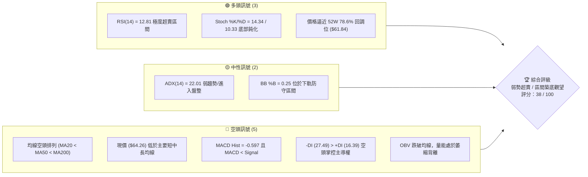
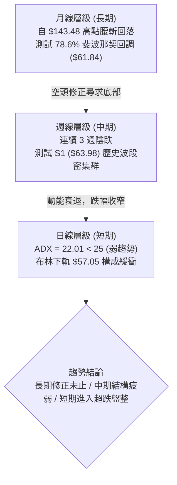
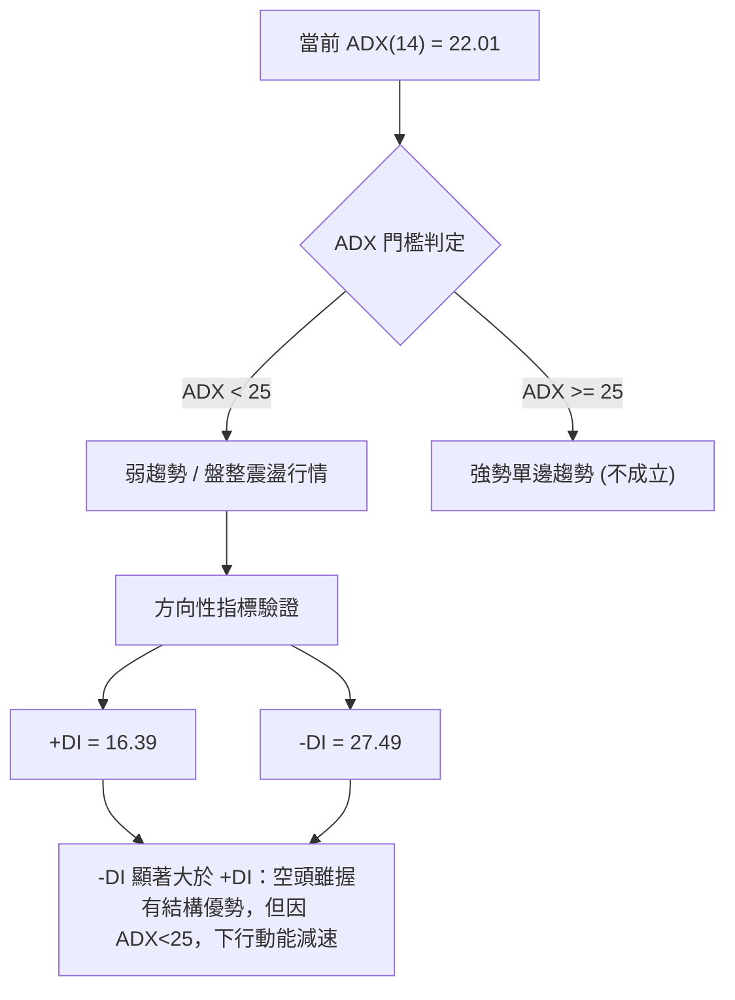
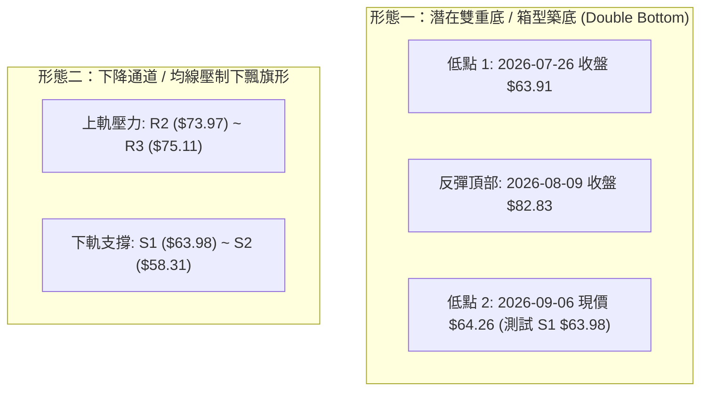
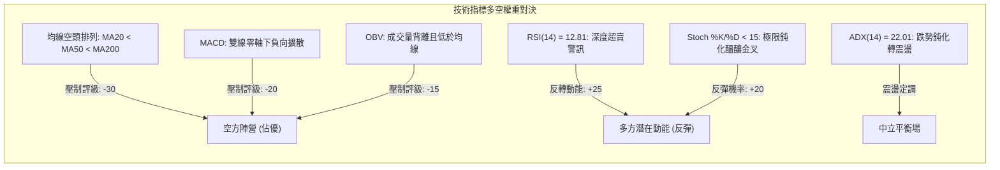
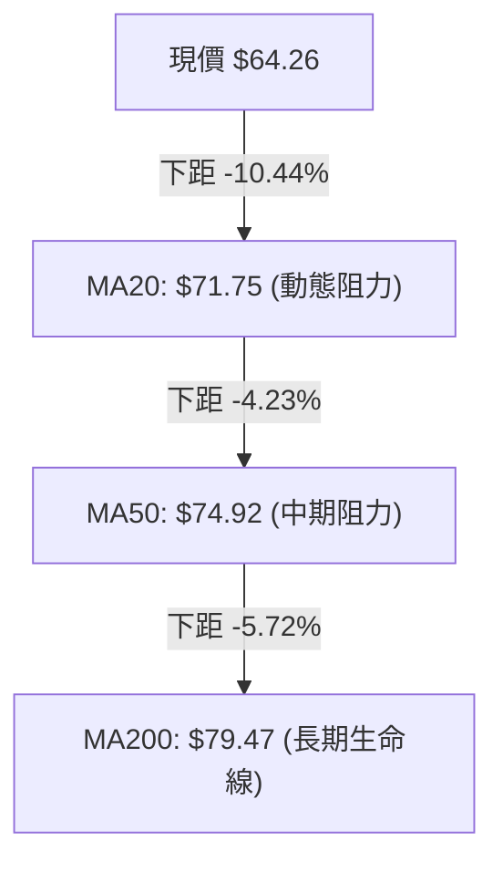
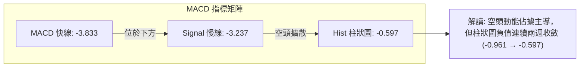
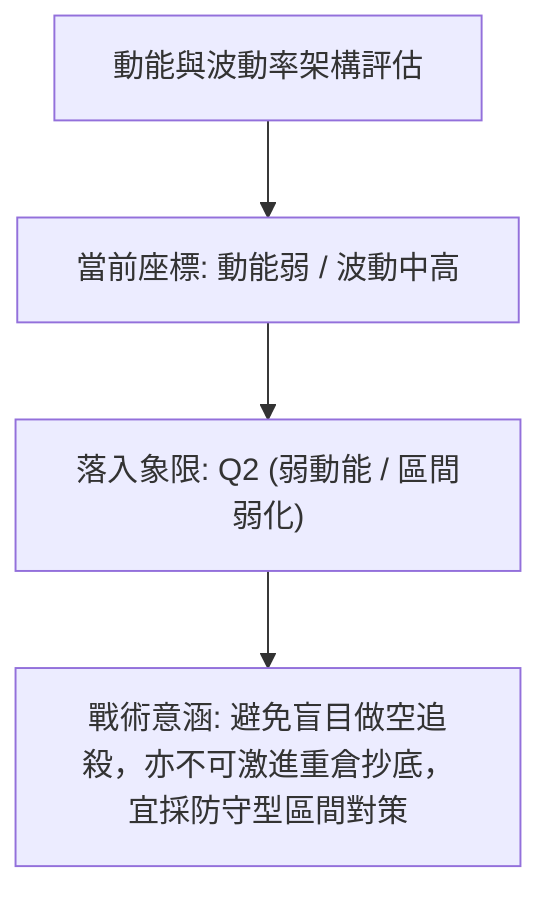
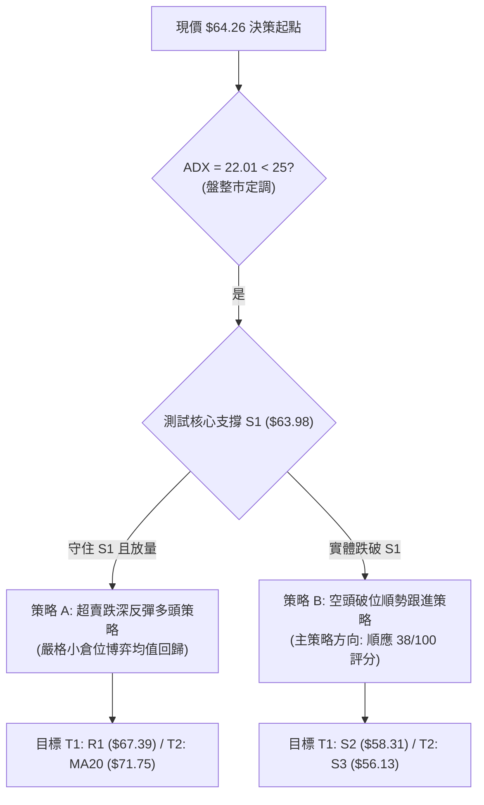
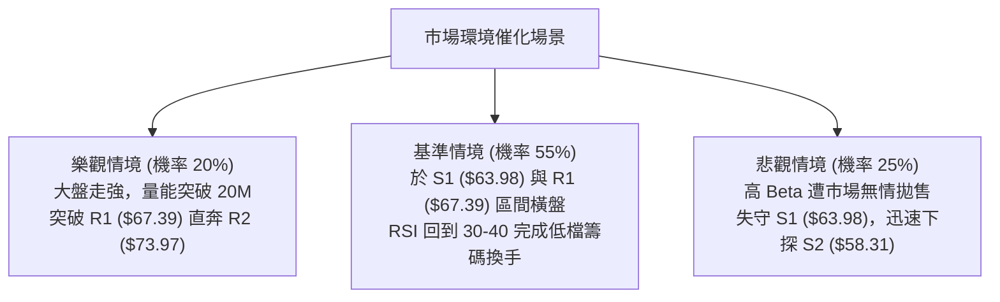

# RKLB 技術分析報告

> **報告日期**：2026-09-06 ｜ **語言**：繁體中文 ｜ **數據來源**：Yahoo Finance ｜ **當前價格**：$64.26

---

## 目錄

| 章節 | 內容 |
|------|------|
| [1. 技術面概覽](#1-技術面概覽) | 訊號儀表板、核心指標、評分卡 |
| [2. 趨勢分析](#2-趨勢分析) | 多時框趨勢、長中短期走勢、ADX強弱評估 |
| [3. 圖表形態分析](#3-圖表形態分析) | 形態識別、信心度評估、K線解讀、量化推算 |
| [4. 支撐與阻力](#4-支撐與阻力) | 結構分布圖、波段聚類阻力/支撐、斐波那契回調 |
| [5. 技術指標深度解讀](#5-技術指標深度解讀) | 均線空頭排列、RSI極度超賣、MACD柱狀圖、布林通道、OBV分析 |
| [6. 動能與波動率](#6-動能與波動率) | 動能四象限、ATR防守區間設置、高Beta市場敏感度 |
| [7. 多時框架總結](#7-多時框架總結) | 多時框評分矩陣、衝突收斂規則、主導方向定義 |
| [8. 交易策略建議](#8-交易策略建議) | 策略路由抉擇、情境階梯、主客觀多空策略、風控參數 |
| [9. 風險提示與監控](#9-風險提示與監控) | 監控Checklist、三情境壓力測試、風控與部位管理 |
| [📋 報告總結](#-報告總結) | 核心總結儀表板與策略總覽 |

---

## 1. 技術面概覽

### 🎯 技術訊號儀表板



### 📊 核心指標速覽表

| 指標類別 | 指標名稱 | 當前數值 | 訊號 | 解讀 |
|----------|----------|----------|------|------|
| **價格** | 當前價格 | $64.26 | 🔴 | 位於 52 週波段區間 23.5% 低位，長期趨勢嚴重承壓 |
| **均線** | MA20 | $71.75 | 🔴 | 價格低於 MA20 達 -10.44%，短線被動受壓 |
| **均線** | MA50 | $74.92 | 🔴 | 價格低於 MA50 達 -14.23%，中期格局偏空 |
| **均線** | MA200 | $79.47 | 🔴 | 價格低於 MA200 達 -19.14%，長期多空分水嶺失守 |
| **動能** | RSI(14) | 12.81 | 🟢 | 極度超賣（<20），隨時具備技術性跌深反彈動能 |
| **動能** | MACD (12,26,9) | -3.833 / -3.237 | 🔴 | MACD 線位於訊號線下方，柱狀圖 -0.597，空方動能主導 |
| **動能** | Stoch %K / %D | 14.34 / 10.33 | 🟢 | 雙雙落入超賣區間，KD 呈現低檔交叉醞釀 |
| **趨勢強度** | ADX (14) | 22.01 | 🟡 | 數值小於 25，表明空方單邊趨勢衰竭，進入震盪盤整 |
| **通道** | 布林通道下軌 | $57.05 | 🟡 | %B 為 0.25，價格接近下軌支撐緩衝區，具備均值回歸空間 |
| **成交量** | 最新成交量 / 20日均量 | 14.87M / 17.12M | 🔴 | 量比 0.87x，下跌量縮，OBV 疲軟，買盤承接意願尚弱 |
| **波動** | ATR(14) | $3.15 | 🟡 | 佔現價 4.90%，日內波幅中等，適合設立動態止損點 |

### 🏆 技術評分卡

```
╔══════════════════════════════════════════════════════════════════╗
║                 技術評分卡 — RKLB (2026-09-06)                   ║
╠══════════════════════════════════════════════════════════════════╣
║ 趨勢強度 (ADX=22.01)    ██████░░░░░░░░░░░░░░  30/100   🔴 空頭盤整║
║ 動能指標 (RSI=12.81)    ██████████░░░░░░░░░░  50/100   🟡 極端超賣║
║ 支撐穩定度 (S1=$63.98)  ████████████░░░░░░░░  60/100   🟡 正在測試║
║ 成交量配合 (量比 0.87x) ██████░░░░░░░░░░░░░░  30/100   🔴 量能萎縮║
║ 形態完整度 (箱型測試)   ████████░░░░░░░░░░░░  40/100   🔴 破位整理║
║ 均線排列 (MA20<50<200)  ████░░░░░░░░░░░░░░░░  20/100   🔴 典型空頭║
╠══════════════════════════════════════════════════════════════════╣
║ 綜合評分                ███████░░░░░░░░░░░░░  38/100   🔴 偏空震盪║
╚══════════════════════════════════════════════════════════════════╝
```

---

## 2. 趨勢分析

### 🌐 多時框趨勢分析



### 📈 長期趨勢 — 12個月走勢圖（Unicode）

```
RKLB 月線走勢圖（過去12個月：2025-09 至 2026-09）
價格軸 ($)
$150 ┤                                      ● ($143.48, 2026-05)
$140 ┤                                     ╱ ╲
$130 ┤                                    ╱   ╲
$120 ┤                                   ╱     ╲
$110 ┤                                  ╱       ● ($101.65, 2026-06)
$100 ┤                                 ╱         ╲
$90  ┤                    ● ($80.07)  ╱           ╲
$80  ┤                   ╱ ╲         ● ($82.51)    ╲
$70  ┤        ● ($69.76)╱   ● ($69.10)              ╲
$60  ┤ ●     ╱ ╲       ● ($64.22)                    ●━━━● ($64.26, 現價)
$50  ┤  ╲   ╱   ● ($42.14, 2025-11 低點)            ($64.95 / $63.92)
$40  ┤   ● ($47.91)
     └─┬────┬────┬────┬────┬────┬────┬────┬────┬────┬────┬────┬───► 時間
     09/25 10   11   12  01/26  02   03   04   05   06   07   08  09
```

#### 走勢特徵分析表格

| 階段 | 時間跨度 | 收盤區間 ($) | 漲跌幅 (%) | 形態與量能特徵 |
|------|----------|--------------|------------|----------------|
| **波段初升與洗盤** | 2025-09 ~ 2025-11 | $47.91 → $42.14 | -12.04% | 衝高 $62.98 後快速拉回測試支撐，洗盤清洗浮額 |
| **主升驅動行情** | 2025-11 ~ 2026-01 | $42.14 → $80.07 | +90.01% | 爆量突破歷史阻力，創出階段性新高 |
| **次級中繼整理** | 2026-01 ~ 2026-03 | $80.07 → $64.22 | -19.80% | 縮量拉回整理，於 $64.00 形成第一重扎實底部聚類 |
| **瘋狂加速末升段** | 2026-03 ~ 2026-05 | $64.22 → $143.48 | +123.42% | 極端拋物線走勢，觸及 52 週歷史高點 $151.00 |
| **深度獲利回吐潮** | 2026-05 ~ 2026-07 | $143.48 → $64.95 | -54.73% | 高檔放量崩跌，迅速跌破 MA20、MA50，完成均線反轉 |
| **底部橫向震盪** | 2026-07 ~ 2026-09 | $64.95 → $64.26 | -1.06% | 價格於 $63.92 ~ $64.95 區間收斂，進入休眠築底期 |

### 📊 中期趨勢（週線分析）

中期走勢顯示，RKLB 在 2026 年 5 月底創下 $143.48（當週高點 $151.00）後，經歷了極度劇烈的去槓桿下跌。觀察近 20 週數據，價格自 2026-06 開始一路跌破重要均線：
- 2026-07-26 價格打至低點 $63.91，RSI 降至 15.6。
- 隨後在 2026-08-09 出現強勁技術抽頭反彈至 $82.83，但受制於下降中的 MA20 與阻力帶 R3 ($75.11) 附近後迅速夭折。
- 8 月下旬以來，連續三週自 $80.25 震盪回落至當前的 $64.26，重新考驗前期波段低點 $63.98 (S1)。

```
週線等級關鍵價格架構：
$82.83 ───┐ (2026-08-09 反彈波段頂點)
          │
          ├── $75.11 / $73.97 (強阻力帶 R2-R3，中期頸線)
          │
$64.26 ───┴── 現價 ($64.26)，正回測 7 月底部聚類 $63.98 (S1)
```

### ⚡ 趨勢強度評估（ADX 解讀）



#### ADX 指標狀態對照

| 指標名稱 | 數值 | 狀態區間 | 技術意義解讀 |
|----------|------|----------|--------------|
| **ADX (14)** | 22.01 | < 25 (弱趨勢) | 空頭動能自暴跌期的單邊殺跌，過渡為低位區間震盪與能量積蓄 |
| **+DI (14)** | 16.39 | 偏弱 (< 20) | 多頭攻擊意願低落，尚無主動性大買盤介入 |
| **-DI (14)** | 27.49 | 偏強 (> 25) | 空頭仍處防禦優勢，但數值已較暴跌階段鈍化 |
| **方向差距 (Spread)** | -11.10 | 空頭主導 | 尚未出現黃金交叉訊號，任何買盤暫屬防守反彈性質 |

---

## 3. 圖表形態分析

### 🔍 形態識別系統

依據嚴格數據紀律與幾何特徵，當前走勢識別出兩組關鍵形態：



#### 形態識別信心度評估表

| 形態名稱 | 信心度 | 判斷依據（引用真實數據） | 完成度 | 目標價（附計算式） |
|----------|--------|--------------------------|--------|--------------------|
| **潛在雙重底 (Double Bottom)** | 62% | 第一次低點為 2026-07-26 的 $63.91，當前價格 $64.26 緊貼波段低點聚類 S1 ($63.98)，構成水平支撐測試；頸線位於 2026-08-09 波段高點 $82.83。 | 55%（尚未突破頸線） | 若突破頸線 $82.83，形態高度 = $82.83 - $63.91 = $18.92。<br/>理論量測目標 = $82.83 + $18.92 = **$101.75**（逼近 2026-06 收盤 $101.65）。 |
| **箱型整理下緣測試** | 70% | 價格在近兩個月持續於 S1 ($63.98) 至 R1 ($67.39) 窄幅區間盤整，ADX=22.01 驗證無趨勢特徵。 | 75% | 向上突破 R1 ($67.39) 後，箱體理論垂直幅度 = $67.39 - $63.98 = $3.41。<br/>短期箱體目標 = $67.39 + $3.41 = **$70.80**。 |
| **頭肩頂破位形態** | 45% | 高位複合頭肩形態於 6 月份跌破頸線後已充分釋放跌幅，當前距離頂部過遠，已無直接指導意義。 | 100% (已完成) | 訊號衰竭，僅做指標型超賣解讀。 |

### 🕯️ 重要K線形態分析

| 週/月份 | 收盤價 ($) | K線形態 | 解讀 | 訊號 |
|---------|------------|---------|------|------|
| **2026-05-31** | $143.48 | 巨量衝高倒錘長上影線 | 觸及 52 週高點 $151.00 後嚴重滯漲，獲利了結盤蜂擁而出 | 🔴 頂部力竭反轉 |
| **2026-06-07** | $110.08 | 實體大陰線跌破短天期均線 | 宣告拋物線上升行情結束，轉入空頭主導週期 | 🔴 趨勢崩解 |
| **2026-07-26** | $63.91 | 長下影錘子線（收斂十字） | RSI 觸及 15.6 極端低值，空方殺跌力道遭遇強勁被動買盤 | 🟢 初步止跌回升 |
| **2026-08-09** | $82.83 | 實體陽線反彈受阻於均線 | 反彈觸碰 MA50 ($74.92) 與 MA60 ($79.23) 密集防區後遇阻回落 | 🟡 多頭反抽解套賣壓 |
| **2026-09-06** | $64.26 | 窄幅母子收斂小陰線 | 週振幅收斂，週成交量降至 80.14M，顯示籌碼沉澱沉寂 | 🟡 變盤拐點醞釀 |

### 📉 ASCII 走勢形態示意圖

```
雙重底（潛在）與關鍵防禦位示意圖
$82.83 ───────────────● (頸線峰值 2026-08-09)
                     ╱ ╲
                    ╱   ╲
                   ╱     ╲
                  ╱       ╲
$67.39 ──────────┼─────────┼─────── (箱體阻力 R1)
                ╱           ╲
$64.26 ────●   ╱             ● ◄── 現價 ($64.26) 測試第二底
            ╲ ╱               (打在 S1 $63.98 關鍵支撐線)
$63.91 ──────●──────────────────── (左底低點 2026-07-26)
             底 1            底 2 (構築中)
```

---

## 4. 支撐與阻力

### 🗺️ 關鍵價位分布圖（Unicode）

```
RKLB 價位結構分布圖（OHLCV 聚類與斐波那契疊加）
═════════════════════════════════════════════════════════════════
$107.67 ║██████████████████████████████║ 斐波那契 38.2% 回調位
$94.28  ║██████████████████████████    ║ 斐波那契 50.0% 強弱中軸線
$86.46  ║██████████████████████        ║ 布林通道上軌阻力
$80.90  ║██████████████████████████████║ 斐波那契 61.8% / MA200 ($79.47)
$75.11  ║████████████████████          ║ 強阻力 R3 (近一年波段高點聚類)
$73.97  ║████████████████              ║ 阻力 R2 (反彈中繼壓力)
$71.75  ║████████████                  ║ 布林中軌 (MA20) 動態反壓
$67.39  ║████████████████████████      ║ 關鍵阻力 R1 (短線突破頸線)
$64.26  ╠══════════════════════════════╣ ◄ 現價 ($64.26)
$63.98  ║▓▓▓▓▓▓▓▓▓▓▓▓▓▓▓▓▓▓▓▓▓▓▓▓▓▓    ║ 核心波段支撐 S1 (多頭生命線)
$61.84  ║▓▓▓▓▓▓▓▓▓▓▓▓▓▓▓▓▓▓▓▓▓▓▓▓▓▓▓▓▓▓║ 斐波那契 78.6% 極限黃金回調位
$58.31  ║████████████████              ║ 波段強支撐 S2 (次級防守點)
$57.05  ║████████████                  ║ 布林通道下軌動態緩衝
$56.13  ║██████████████████████████████║ 最終堡壘 S3 (近一年深層低點聚類)
$37.57  ║██████████████████████████████║ 52 週最低點 (100.0% 回調位)
═════════════════════════════════════════════════════════════════
```

### 🚧 阻力位分析表

依據系統近一年波段高點聚類與 OHLCV 計算，精確阻力階梯如下：

| 阻力級別 | 精確價位 | 形成原因與籌碼解讀 | 突破難度 | 重要性 |
|----------|----------|--------------------|----------|--------|
| **R1** | **$67.39** | 近一年波段高點密集聚類下緣，兼近兩週微型震盪區間頂部，+4.87% 距離。 | 中等 | 🟢 短線多空轉換關鍵點 |
| **R2** | **$73.97** | 8 月中旬急跌陰線開盤價聚類，緊鄰 MA50 ($74.92)，籌碼套牢密集區。 | 高 | 🟡 中期空方強阻力壁壘 |
| **R3** | **$75.11** | 近一年波段反彈頂部聚類，突破此位代表日線級別下降結構徹底被破壞。 | 極高 | 🔴 多空分水嶺防線 |

### 🛡️ 支撐位分析表

依據系統近一年波段低點聚類與 OHLCV 計算，精確支撐階梯如下：

| 支撐級別 | 精確價位 | 形成原因與籌碼解讀 | 守住機率 | 重要性 |
|----------|----------|--------------------|----------|--------|
| **S1** | **$63.98** | 近一年波段低點密集聚類，距現價僅 -0.43%，7 月底至今多重回踩確認點。 | 60% | 🔴 短線多頭底線，不可跌破 |
| **S2** | **$58.31** | 次級歷史密集成交區，接近布林通道下軌 ($57.05)，具備超賣共振買盤。 | 75% | 🟡 波段下行延伸強防線 |
| **S3** | **$56.13** | 近一年深層低點聚類，空頭恐慌盤極致宣洩點，價值買盤終極防線。 | 85% | 🟢 終極長線防禦基石 |

### 📐 斐波那契回調位分析

以 52 週完整波動區間（低點 **$37.57** → 高點 **$151.00**，全幅 $113.43）計算各層級關鍵黃金分割位：

| 斐波那契比例 | 精確對應價位 | 與現價關係 | 技術架構定位與當前解讀 |
|--------------|--------------|------------|------------------------|
| **0.0% (高點)** | **$151.00** | +134.98% | 歷史天花板，大三浪上升終點 |
| **23.6%** | **$124.23** | +93.32% | 牛市初段回踩點，目前已被大幅拋棄於上方 |
| **38.2%** | **$107.67** | +67.55% | 弱勢修正極限，破位後轉入深幅調整 |
| **50.0%** | **$94.28** | +46.72% | 多空平衡中軸，亦為未來中長線多頭反轉第一目標 |
| **61.8%** | **$80.90** | +25.89% | 黃金分割強防禦位，當前與 MA200 ($79.47) 形成雙重阻力共振 |
| **78.6%** | **$61.84** | -3.77% | **深層極限回調位**：現價目前正位於 61.8% ($80.90) 與 78.6% ($61.84) 之間 |
| **100.0% (低點)**| **$37.57** | -41.53% | 52 週絕對底部，本輪超大週期的起漲基石 |

> **深度解讀**：現價 $64.26 緊貼波段低點 S1 ($63.98)，僅略高於 78.6% 斐波那契極限回調位 **$61.84**（下距 $2.42 或 -3.77%）。技術上，78.6% 是大週期上升走勢未被徹底破壞前的「最後一道退路」。若守住 $61.84 ~ $63.98 區間，則屬於多頭極限深度回踩；一旦實體跌破 $61.84，下行空間將直指 S2 ($58.31) 甚至回測底部的風險將呈幾何級放大。

---

## 5. 技術指標深度解讀

### 🎛️ 指標訊號總覽



### 📈 移動平均線排列分析



當前移動平均線呈現典型的**標準空頭排列**（MA20 < MA50 < MA200），且三條均線的扣抵值均處於高位，均線斜率持續向下發散：
- **MA5 ($63.53)**：現價 ($64.26) 略微站上 5 日均線 (+1.16%)，微觀結構出現連續 2 日的止跌企穩微光。
- **MA10 ($65.09)**：首道日線短壓在 $65.09，距離現價僅 1.28%，形成日內壓制。
- **MA20 ($71.75)**：下行斜率陡峭，為未來反彈波段的強大天花板。
- **MA60 ($79.23) / MA120 ($86.51)**：呈現深層套牢籌碼的層層蓋頭壓頂格局。

### 📉 RSI(14) 分析

```
RSI(14) 當前數值刻度：12.81
0 ═══════●════════════════════════════════════ 100
       12.81 (極度超賣區 < 20)
【超賣區 < 30】          【平衡中軸 50】          【超買區 > 70】
```

- **超賣程度評估**：RSI(14) 報 **12.81**，已處於歷史極罕見的極度超賣水平（低於 15 通常意味著恐慌性拋售進入枯竭階段）。
- **背離判斷**：
  - 前期低點（2026-07-26）價格為 $63.91，對應 RSI 為 15.6。
  - 當前價格回踩至 $64.26（高於前低 $0.35），但 RSI 卻下探至 12.81。
  - **結論**：指標刷新低點而價格尚未破前低，呈現微弱的**指標隱性破位**，嚴格意義上**尚未形成典型的標準日線底背離**，需等待後續 RSI 重新勾頭回升至 30 以上才能觸發確認訊號。

### 📊 MACD(12/26/9) 訊號解讀



- MACD 快慢線雙雙深度運作於零軸下方（快線 -3.833，慢線 -3.237），代表中期空頭波段未被打破。
- 值得高度注意的是**柱狀圖 (Histogram)**：自 2026-08-30 的 **-0.961** 收斂至最新一週的 **-0.597**，負向柱體呈現減速萎縮，預告空頭殺跌動能正在衰退，距離低檔金叉交會僅一步之遙。

### 📦 布林通道分析

```
布林通道架構圖 (Bollinger Bands 20, 2)
$86.46 ─────────────────────────────── 上軌 (Upper Band)
                     ▲
                     │
$71.75 ──────────────┼──────────────── 中軌 (MA20 Baseline)
                     │ (下行通道中)
$64.26 ──────────────┼────── 現價 (%B = 0.25)
                     ▼
$57.05 ─────────────────────────────── 下軌 (Lower Band)
```

- **上軌**：$86.46 ｜ **中軌 (MA20)**：$71.75 ｜ **下軌**：$57.05
- **帶寬與位置**：帶寬展開至 $29.41，開口呈現向下擴張後的平移狀態；**%B 數值為 0.25**，顯示價格沉浸在通道下半區，但並未跌破下軌 $57.05，尚未進入極端破軌失控狀態。
- 下軌 $57.05 與支撐位 S3 ($56.13) 構成緊密防線，形成下檔強勁支撐緩衝墊。

### 💹 成交量分析（量價配合度）

- **最新成交量**：14,867,600 股
- **20 日均量**：17,116,475 股（量比 **0.87x**）
- **50 日均量**：19,448,972 股
- **量能評估**：量能呈現逐級收縮態勢，低於 20 日與 50 日均量，符合「下跌量縮、逢低惜售」的築底初期量性格局。
- **OBV (能量潮指標)**：目前 OBV 明顯位於其均線下方，顯示整體資金流向仍以大戶觀望、被動流出為主，尚未觀察到顯著的機構吸籌放量特徵。

---

## 6. 動能與波動率

### ⚡ 動能評估四象限



#### 四象限特徵定位表

| 象限代號 | 動能強度 | 波動率水準 | 特徵描述 | 本股狀態 | 戰術指引 |
|----------|----------|------------|----------|:--------:|----------|
| **Q1** | 強 (多頭) | 低 (受控) | 穩健上升通道，最佳追隨趨勢區 | ─ | 積極順勢做多 |
| **Q2** | **弱 (衰竭)** | **中低 (盤整)** | **殺跌力道減緩，波動進入平復期** | **✓ (當前)** | **謹慎觀望，等待區間確認** |
| **Q3** | 強 (單邊) | 高 (劇烈) | 瘋狂主升或恐慌崩跌 | ─ | 高風險高收益博弈 |
| **Q4** | 弱 (無向) | 極高 (混亂) | 巨震洗盤，無序無方向 | ─ | 離場觀望避險 |

### 📊 ATR 波動率分析

- **ATR(14) 絕對值**：**$3.15**
- **波動佔比 (ATR / 現價)**：**4.90%**
- **止損距離動態計算建議**：
  - **1.0 倍 ATR** = $3.15（適用於極短線或日內當沖）
  - **1.5 倍 ATR** = $4.73（適用於常規擺動交易波段防守）
  - **2.0 倍 ATR** = $6.30（適用於中期底部右側建倉寬幅防守）
- 當前 4.90% 的日波動率表明該股依然具備顯著彈性，在制定停損與部位規模時，必須依據每單位 $3.15 的振幅進行部位反推，避免因日內雜訊被震盪出場。

### 📐 Beta 與市場相關性

- **Beta 係數**：**2.612**（極高 Beta 屬性）
- **市場敏感度解讀**：
  - RKLB 相對標普 500 指數具有 **2.61 倍** 的理論波動放大效應。當大盤微跌 1% 時，該股理論回撤為 2.61%；反之，大盤反彈時其彈性亦居高不下。
  - **空頭部位比例 (Short % Float)**：**7.5%**，Short Ratio 為 **2.26 天**。空頭部位處於中等水平，若有利多催化或突破阻力，具備一定的空頭回補（Short Squeeze）連鎖動能。

---

## 7. 多時框架總結

### 📋 時框架評分表

| 時框架 | 趨勢方向 | 動能狀態 | 均線排列 | 關鍵形態特徵 | 綜合評分 | 操作建議 |
|--------|----------|----------|----------|--------------|:--------:|----------|
| **日線 (短期)** | 震盪偏空 🟡 | RSI=12.81 極限超賣 🟢 | 空頭排列 (MA20 下方) 🔴 | 測試 S1 ($63.98) 支撐 🟡 | 42 / 100 | 短線博弈跌深反彈，快進快出 |
| **週線 (中期)** | 下行空頭 🔴 | MACD 柱狀收斂 🟡 | 均線蓋頭壓制 🔴 | 構築潛在雙底 (頸線 $82.83) 🟡 | 35 / 100 | 底部未確立前，嚴禁左側重倉 |
| **月線 (長期)** | 週期回調 🟡 | 大幅降溫 🔴 | 跌破 20 月線 🔴 | 測試 78.6% 斐波那契回調位 🟢 | 38 / 100 | 具備戰略配置價值，等待右側放量 |

### 🔲 綜合訊號矩陣

```
┌────────────────────────────────────────────────────────┐
│               多時框技術指標一致性對照矩陣             │
├──────────────┬──────────┬──────────┬───────────────────┤
│ 指標類別     │ 日線訊號 │ 週線訊號 │ 一致性評估結論    │
├──────────────┼──────────┼──────────┼───────────────────┤
│ 均線系統     │  🔴 空頭 │  🔴 空頭 │ 趨勢方向完全一致  │
│ 震盪指標 RSI │  🟢 超賣 │  🟡 低位 │ 短期反彈預期強烈  │
│ 趨勢指標 ADX │  🟡 盤整 │  🔴 弱向 │ 單邊下行已告一段落│
│ 形態學解讀   │  🟡 箱型 │  🟡 雙底 │ 尋底格局共振中    │
└──────────────┴──────────┴──────────┴───────────────────┘
```

### ⚖️ 多時框收斂結論

> **依嚴格規則 14 執行多時框優先級收斂**：
> 1. **趨勢強度判斷**：日線當前 **ADX(14) = 22.01**，明確處於 `< 25` 的弱趨勢/盤整區間；
> 2. **主導規則套用**：在 ADX < 25 的盤整環境中，中長期單邊趨勢影響減弱，**市場主導時框自動切換至日線布林通道上下軌及水平關鍵價位**（以布林下軌 $57.05 與中軌 $71.75 為震盪極限邊界）；
> 3. **唯一方向性結論**：**【中性偏空，超跌區間震盪築底】**。
>    - 鑑於全系統綜合評分為 **38 / 100**（≤ 40 偏空門檻），整體格局受制於空頭均線排列壓制；
>    - 然而，RSI = 12.81 的歷史級極端超賣與 ADX 衰竭，意味著此處絕非做空的理想時機。因此，第 8 章的戰術部署將**以「空頭防禦控險與高拋反手」為客觀策略背景，同時提供「左側跌深極限博弈」之高風控多頭策略**，實現精確的矛盾收斂。

---

## 8. 交易策略建議

### 🗺️ 策略決策流程圖



### 🧭 策略路由（依評分卡分流）

> **當前主策略方向 = 【偏空防禦，跌破順勢空 / 區間高拋空】（依綜合評分 38 / 100 判定）**
> 
> 因評分 ≤ 40，宏觀技術背景定義為主空市場。任何多頭操作均被嚴格定義為「逆勢次級反彈博弈」，部位必須嚴格限縮；主策略則以跌破關鍵點的空方順勢或反抽壓力位受阻後的空頭波段為主。

### 🎯 價格情境階梯（Price Scenarios）

價位完全嚴格引用第 4 章波段計算數據：

| 觸發條件 | 第一目標位 | 第二目標位 | 情境技術含義 |
|----------|------------|------------|--------------|
| **強勢突破 R1 ($67.39)** | **R2 ($73.97)** | **R3 ($75.11)** | 短線超跌反彈成形，回測 MA50 頸線壓力 |
| **區間守住 S1 ($63.98)** | **現價 ~$67.39** | — | 維持 $63.98 ~ $67.39 窄幅收斂，築底積蓄能量 |
| **放量跌破 S1 ($63.98)** | **S2 ($58.31)** | **S3 ($56.13)** | 雙重底形態失敗，下探測試斐波那契 78.6% 與布林下軌 |

### 📊 情境機率分佈

| 預期情境 | 發生機率 | 核心技術依據 |
|----------|:--------:|--------------|
| **情境一：超跌技術性反抽** | **40%** | RSI(14) 報 12.81 處於絕對超賣區，MACD 柱狀圖負值連續縮減，隨時觸發技術性買盤。 |
| **情境二：窄幅區間震盪整理**| **35%** | ADX(14) = 22.01 驗證單邊趨勢休眠，成交量萎縮至 14.87M，買賣雙方在 S1 陷入膠著。 |
| **情境三：摜破支撐再探新低**| **25%** | 移動平均線呈典型空頭排列，OBV 持續低迷，若大盤走弱，高 Beta 特性易引發破位拋壓。 |

### 🟢/🔴 主策略詳情

#### 主力策略對比矩陣

| 策略要素 | 策略 A（多頭：跌深反彈博弈） | 策略 B（空頭：順勢破位放空 - 主路由） |
|----------|------------------------------|--------------------------------------|
| **策略類型** | 逆勢左側均值回歸（短線） | 順勢右側破位空單（主推） |
| **進場條件** | 價格回踩 S1 不破，且 15分K 出現多頭吞噬 | 日線實體陰線**有效跌破 S1 ($63.98)** |
| **精確進場價**| **$64.00**（回踩確認點） | **$63.80**（確認破位追空點） |
| **目標價 T1** | **$67.39**（阻力 R1） | **$58.31**（強支撐 S2） |
| **目標價 T2** | **$71.75**（布林中軌 MA20） | **$56.13**（波段支撐 S3） |
| **精確止損價**| **$62.50**（跌破 S1 下方 1.5 ATR 容錯） | **$65.50**（假跌破重回 S1 之上方） |
| **風險報酬比**| **1 : 2.26** (目標 $67.39 / 止損 $1.50) | **1 : 3.23** (目標 $58.31 / 止損 $1.70) |
| **成功機率** | **55%** | **65%** |
| **建議倉位** | **5% ~ 8%**（嚴控部位） | **10% ~ 15%**（標準波段部位） |

### 🔴 反向風險觸發點（對沖提示）

- **多頭部位之逃命點**：若進場多單後，盤中價格帶量跌破 **$63.98 (S1)** 且無法於 30 分鐘內收復，必須無條件止損出局，防止滑落至 $58.31 (S2)。
- **空頭部位之對沖點**：若空頭部位建立後，價格逆勢放量站上 **$67.39 (R1)**，顯示日線級別底背離反彈展開，所有空頭應全數止損離場，並可反手翻多。

### ⭐ 整體訊號強度評星

```
╔════════════════════════════════════════════════════════╗
║ 做多訊號強度：★★☆☆☆  (2/5星 - 僅憑極度超賣與支撐存在)  ║
║ 做空訊號強度：★★★☆☆  (3/5星 - 均線空頭但面臨低位鈍化)  ║
║ 整體可信度：  ★★★☆☆  (3/5星 - 盤整待變，指標彼此牽制)  ║
╚════════════════════════════════════════════════════════╝
```

---

## 9. 風險提示與監控

### ✅ 關鍵監控指標 Checklist

```
╔══════════════════════════════════════════════════════════════════╗
║               RKLB 盤中即時風險監控 CHECKLIST                    ║
╠══════════════════════════════════════════════════════════════════╣
║ [ ] 核心支撐防守：S1 ($63.98) 每日收盤價是否獲得有效支撐？       ║
║ [ ] RSI 指標修復：RSI(14) 能否自 12.81 快速脫離 30 以下極端區？  ║
║ [ ] 成交量能門檻：反彈時日成交量是否放大突破 20 日均量 (17.12M)？ ║
║ [ ] MACD 柱狀指標：柱狀圖能否持續維持向零軸靠攏收斂趨勢？       ║
║ [ ] 均線動態反壓：短線能否首度越過 MA10 ($65.09) 建立中繼支撐？   ║
║ [ ] 波動警戒監控：當日振幅是否異常突破 ATR ($3.15) 的 1.5 倍？   ║
╚══════════════════════════════════════════════════════════════════╝
```

### ⚠️ 風險場景分析



### 🛡️ 風險管理重要提醒

1. **高 Beta 乘數防禦原則**：
   - 由於該股 Beta 高達 **2.612**，市場波動將被成倍放大。交易者在換算單筆承擔風險（1R，例如總資金的 1%）時，股票部位股數必須按常規低 Beta 標的縮減 50% 以上。
2. **ATR 波動區間設損準則**：
   - 目前 ATR 為 **$3.15**，任何小於 $3.00 的緊密停損極易被雜訊清洗出場。若無力承受 $4.73 (1.5 ATR) 的止損空間，則不應建立任何波段部位。
3. **無趨勢環境之策略紀律**：
   - 在 **ADX = 22.01** 的無趨勢盤整市場中，切忌在壓力位追高，亦不可在支撐位追殺，嚴格執行「接近支撐做反彈、接近壓力止盈結算」的箱型防守原則。

---

## 📋 報告總結

```
╔══════════════════════════════════════════════════════════════════╗
║                   RKLB 技術分析報告核心總結                      ║
╠══════════════════════════════════════════════════════════════════╣
║ 報告日期：2026-09-06                  當前價格：$64.26           ║
║ 分析評級：🔴 偏空盤整 (38/100)        市場屬性：高Beta (2.612)   ║
╠══════════════════════════════════════════════════════════════════╣
║ 關鍵結論：                                                       ║
║ ├─ 長期趨勢：🟡 中長期自高位腰斬，測試 78.6% 斐波那契 ($61.84)   ║
║ ├─ 中期趨勢：🔴 週線級別空頭排列，受制於 MA50 ($74.92)           ║
║ ├─ 短期趨勢：🟡 日線 ADX=22.01 無單邊趨勢，進入 S1 支撐拉鋸戰   ║
║ ├─ 核心支撐：S1: $63.98 ｜ S2: $58.31 ｜ S3: $56.13              ║
║ ├─ 核心阻力：R1: $67.39 ｜ R2: $73.97 ｜ R3: $75.11              ║
║ └─ 分析師目標均價：$111.00 (當前現價位於分析師最低預估 $64.00 處) ║
╠══════════════════════════════════════════════════════════════════╣
║ 最優策略組合建議：                                               ║
║ 1. 🥇 最佳機會（空頭破位）：跌破 S1 ($63.98) 追空至 S2 ($58.31)    ║
║    進場: $63.80 ｜ 止損: $65.50 ｜ 目標: $58.31 ｜ 風報比 1:3.23  ║
║ 2. 🥈 次選機會（短線反彈）：回踩 S1 ($64.00) 守住博弈超賣反彈     ║
║    進場: $64.00 ｜ 止損: $62.50 ｜ 目標: $67.39 ｜ 風報比 1:2.26  ║
║ 3. 🥉 保守選擇（右側觀望）：空手觀望，靜待日線突破 R1 且站穩 MA20 ║
╚══════════════════════════════════════════════════════════════════╝
```

---

> ⚠️ **免責聲明**：本報告為依據量化技術模型自動生成之技術分析研究，文中所載之各項技術點位、指標判讀及情境推演均基於歷史量價數據計算，**僅供投資研究與學術探討參考**，**絕不構成任何具體投資要約或買賣建議**。金融市場瞬息萬變，高 Beta 股票風險極高，投資人應獨立審慎評估個人風險承受能力，並自負盈虧。

---

*報告生成時間：2026-09-06 ｜ 數據來源：Yahoo Finance ｜ 分析框架：多時框收斂量化技術分析體系*