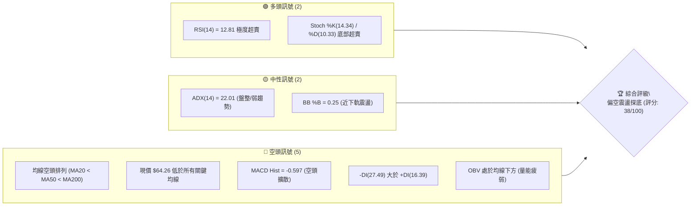
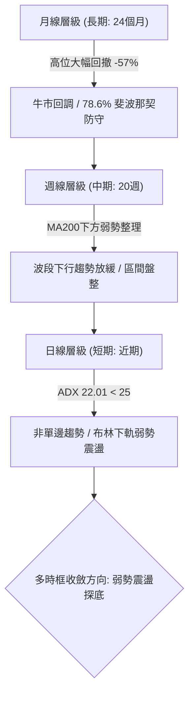
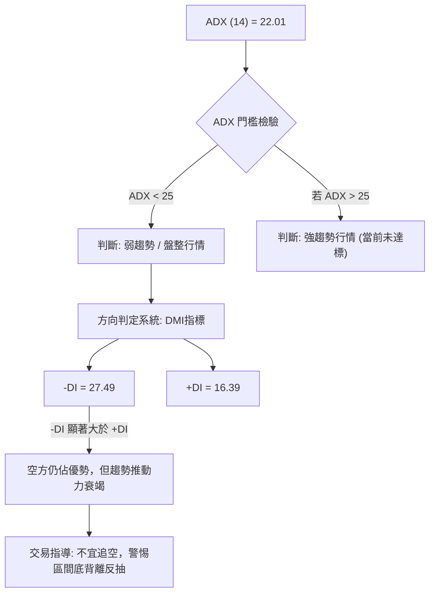
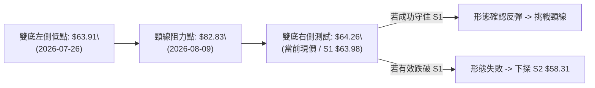
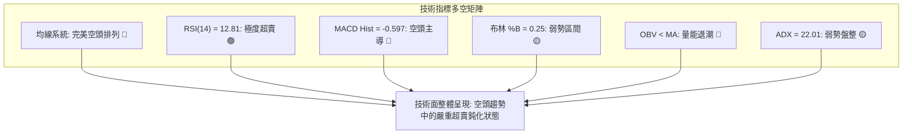
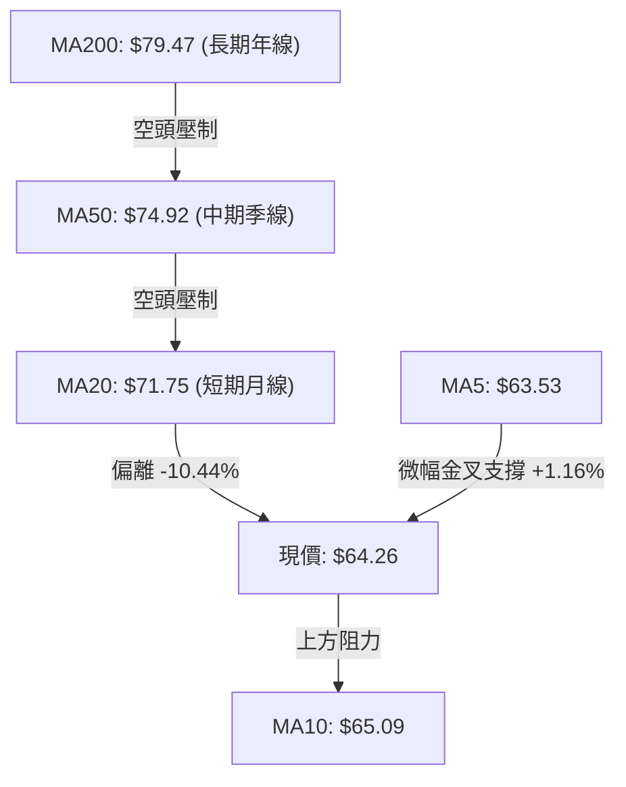
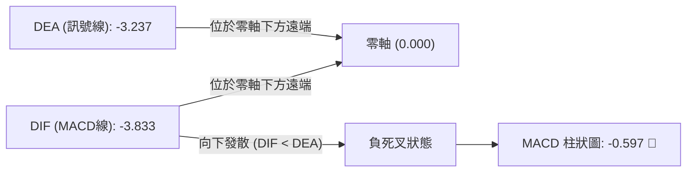
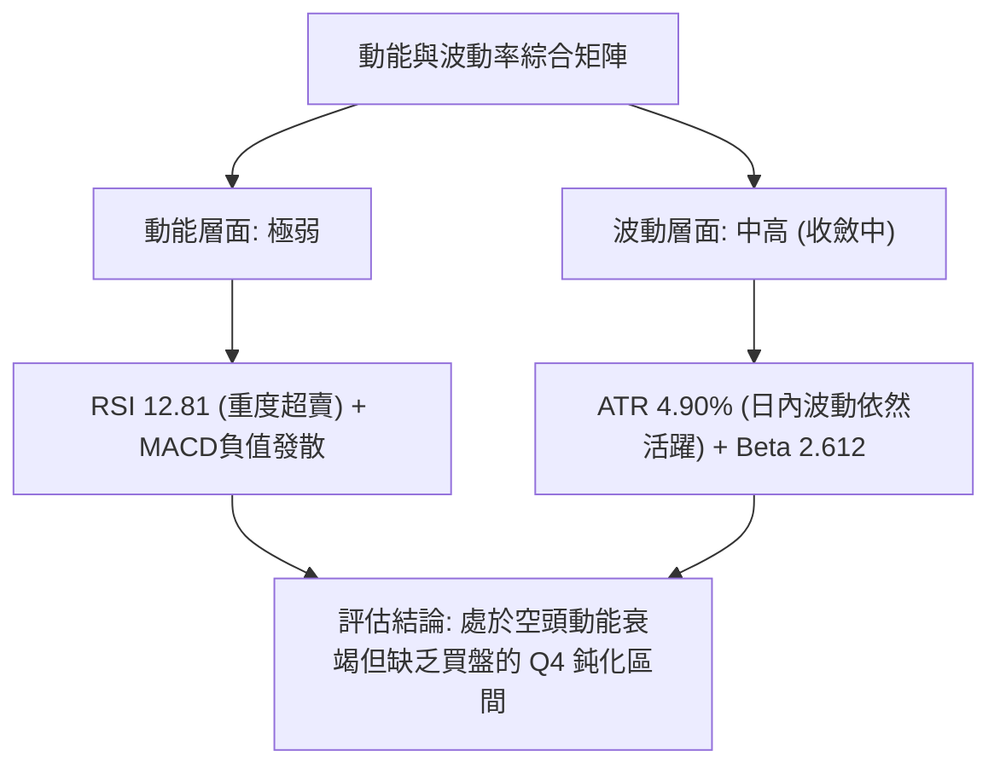
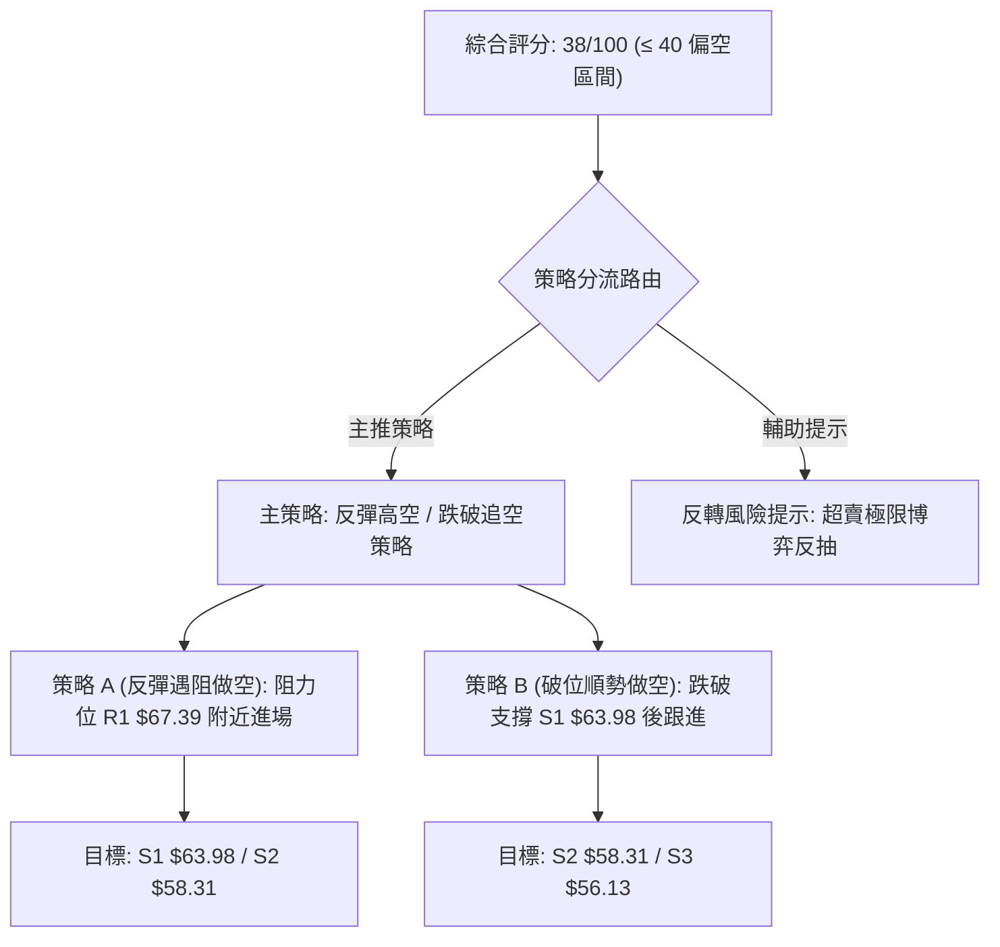
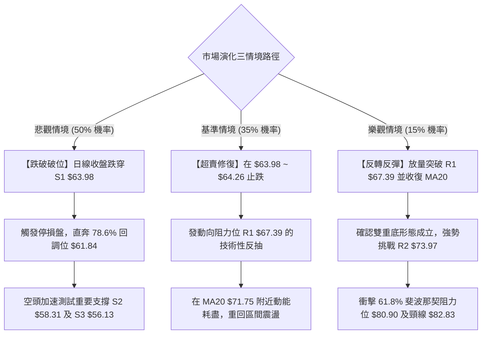

# RKLB 技術分析報告

> **報告日期**：2026-09-07 ｜ **語言**：繁體中文 ｜ **數據來源**：Yahoo Finance ｜ **當前價格**：$64.26

---

## 目錄

| 章節 | 內容 |
|------|------|
| [1. 技術面概覽](#1-技術面概覽) | 訊號儀表板、核心指標、評分卡 |
| [2. 趨勢分析](#2-趨勢分析) | 多時框趨勢、長中短期走勢、ADX解讀 |
| [3. 圖表形態分析](#3-圖表形態分析) | 形態識別、信心度評估、K線組合、目標價計算 |
| [4. 支撐與阻力](#4-支撐與阻力) | 關鍵價位分布圖、S/R分析表、斐波那契回調 |
| [5. 技術指標深度解讀](#5-技術指標深度解讀) | MA/RSI/MACD/布林通道/成交量與OBV |
| [6. 動能與波動率](#6-動能與波動率) | 動能四象限、ATR波動率、Beta風險 |
| [7. 多時框架總結](#7-多時框架總結) | 時框架評分矩陣、多時框收斂結論 |
| [8. 交易策略建議](#8-交易策略建議) | 策略路由、情境階梯、主策略詳情、評星 |
| [9. 風險提示與監控](#9-風險提示與監控) | 監控Checklist、三情境路徑、風控提醒 |

---

## 1. 技術面概覽

### 🎯 技術訊號儀表板



### 📊 核心指標速覽表

| 指標類別 | 指標名稱 | 當前數值 | 訊號 | 解讀 |
|----------|----------|----------|:---:|------|
| **價格** | 當前價格 | $64.26 | 🔴 | 位於52W區間23.5%，處於近一年絕對低位區 |
| **均線** | MA20 | $71.75 | 🔴 | 現價距MA20達 -10.44%，短中期空頭壓制明顯 |
| **均線** | MA50 | $74.92 | 🔴 | 中期生命線下行，呈現蓋頭反壓 |
| **均線** | MA200 | $79.47 | 🔴 | 長期牛熊分界線失守，長期走勢轉弱 |
| **動能** | RSI(14) | 12.81 | 🟢 | 進入罕見重度超賣區（<20），短線存在強烈技術修復需求 |
| **動能** | MACD | -3.833 | 🔴 | 快慢線均在零軸下方運行，柱狀圖 -0.597 持續呈現負值 |
| **趨勢** | ADX(14) | 22.01 | 🟡 | 數值低於25，顯示單邊下跌動能轉弱，進入弱勢盤整 |
| **通道** | 布林通道 | $57.05 - $86.46 | 🟡 | %B 為 0.25，價格貼近下軌徘徊，帶寬收斂後等待方向 |
| **量能** | 最新成交量 | 14,867,600 | 🔴 | 量比 0.87x，低於20日與50日均量，OBV疲弱未見搶反彈買盤 |
| **波動** | ATR(14) | $3.15 | 🟡 | 佔股價 4.90%，日內震盪波幅大，需寬止損配置 |

### 🏆 技術評分卡

```
╔══════════════════════════════════════════════════════════════╗
║              技術評分卡 — RKLB (2026-09-07)                  ║
╠══════════════════════════════════════════════════════════════╣
║ 趨勢強度 (Trend)     ███████░░░░░░░░░░░░░  35/100  🔴 空頭壓制 ║
║ 動能指標 (Momentum)  ████████░░░░░░░░░░░░  40/100  🟡 極度超賣 ║
║ 支撐穩定度 (Support) █████████░░░░░░░░░░░  45/100  🟡 S1考驗中 ║
║ 成交量配合 (Volume)  ██████░░░░░░░░░░░░░░  30/100  🔴 量能退潮 ║
║ 形態完整度 (Pattern) ████████░░░░░░░░░░░░  40/100  🟡 構築底部 ║
║ 均線排列 (MovingAvg) ██████░░░░░░░░░░░░░░  30/100  🔴 完美空頭 ║
╠══════════════════════════════════════════════════════════════╣
║ 綜合評分 (Overall)   ███████░░░░░░░░░░░░░  38/100  🔴 弱勢偏空 ║
╚══════════════════════════════════════════════════════════════╝
```

---

## 2. 趨勢分析

### 🌐 多時框趨勢分析



### 📈 長期趨勢 — 12個月走勢圖（Unicode）

以下為 2025-10 至 2026-09 之月線收盤走勢全貌：

```
RKLB 月線走勢圖（2025-10 至 2026-09）
價格軸 ($)
$150 ┤                                  ● $143.48 (2026-05 歷史波段高點)
$130 ┤                                 / \
$110 ┤                                /   ● $101.65 (2026-06)
 $90 ┤                 ● $80.07      ●     \
 $70 ┤ ● $62.98       / \           /       \
 $50 ┤   \     ● $69.76  ● $64.22  /         ● $64.95 ──● $63.92 ──● $64.26 (現價)
 $30 ┤    ● $42.14                                                      (2026-09)
     └─┬────┬────┬────┬────┬────┬────┬────┬────┬────┬────┬────┬──────────
     10月 11月 12月 01月 02月 03月 04月 05月 06月 07月 08月 09月 (2025-2026)
```

**走勢特徵分析表格**：

| 階段區間 | 起止價格 | 漲跌幅 | 走勢特徵與量價行為 |
|----------|----------|:------:|-------------------|
| **2025-10 ~ 2025-11** | $62.98 → $42.14 | -33.09% | 快速回洗深幅調整，清洗前期浮額，於 $40 關口獲得強烈支撐 |
| **2025-12 ~ 2026-05** | $42.14 → $143.48 | +240.48% | 主升浪行情，成交量劇烈放大，多頭勢如破竹突破百元大關，創出 $151.00 高點 |
| **2026-06 ~ 2026-07** | $143.48 → $64.95 | -54.73% | 盛極而衰的流動性收縮期，機構獲利了結引發斷崖式下跌，跌破多條中期均線 |
| **2026-08 ~ 2026-09** | $64.95 → $64.26 | -1.06% | 價格於 $63.90 - $65.00 區間橫向築底，振幅急劇收窄，呈現無量盤整態勢 |

### 📊 中期趨勢（週線分析）

從近 20 週數據觀察，RKLB 在 2026-05-31 達到收盤峰值 $143.48 後，經歷了兩波流暢的下殺。第一波下殺至 2026-07-26 低點 $63.91，隨後反彈至 2026-08-09 的 $82.83，但反彈遭遇 MA60 阻力後迅速失守，近期連續四周陰跌回落至 $64.26。

```
近期週線壓力與支撐階梯示意圖：
[阻力] R3: $75.11  ════════════════════ (中期反彈極限壓力)
[阻力] R2: $73.97  -------------------- (MA50 / 密集套牢區)
[阻力] R1: $67.39  ┈┈┈┈┈┈┈┈┈┈┈┈┈┈┈┈┈┈┈┈ (短期下行通道頂軌)
[現價]     $64.26  ◄── [正在測試 S1 支撐邊緣]
[支撐] S1: $63.98  ┈┈┈┈┈┈┈┈┈┈┈┈┈┈┈┈┈┈┈┈ (近兩個月雙底頸線邊界)
[支撐] S2: $58.31  -------------------- (布林通道下軌擴散支撐區)
[支撐] S3: $56.13  ════════════════════ (波段歷史密集買盤帶)
```

### ⚡ 趨勢強度評估（ADX 解讀）



| 指標名稱 | 當前數值 | 臨界標準 | 狀態解讀 |
|----------|:--------:|:--------:|----------|
| **ADX(14)** | 22.01 | 25.00 | 低於 25 臨界線，確認主跌浪已告一段落，市場進入低波動收斂與區間盤整階段 |
| **+DI** | 16.39 | - | 多方力量處於壓抑狀態，買盤介入積極性不足 |
| **-DI** | 27.49 | - | 空方雖主導市場，但數值較前高已出現回落，單邊空頭動能衰退 |

---

## 3. 圖表形態分析

### 🔍 形態識別系統

根據規則 15，嚴格基於數據聚類與幾何結構識別形態，並標註信心度百分比：

| 形態名稱 | 信心度 | 判斷依據（引用數據） | 完成度 | 目標價（附嚴格計算式） |
|----------|:------:|----------------------|:------:|------------------------|
| **潛在雙重底 (Double Bottom)** | 62% | 2026-07-26 週收盤 $63.91 與當前價位（接近 S1: $63.98、2026-08收盤 $63.92）形成水平支撐共振，中間反彈高點為 2026-08-09 週收盤 $82.83 | 45% (右底構築中) | 頸線 $82.83 + 形態高度 ($82.83 - $63.91 = $18.92) = **$101.75** (突破頸線方成立) |
| **均線空頭排列型態** | 95% | MA20 ($71.75) < MA50 ($74.92) < MA200 ($79.47)，價格位於 MA5 ($63.53) 與 MA10 ($65.09) 糾結區下方 | 100% (完全成型) | 指標型態，無特定幾何延伸目標價，預示反彈均面臨動態下壓阻力 |
| **下降通道 (Descending Channel)** | 48% | 高點 $143.48 連接 $82.83，低點 $101.65 連接 $63.91，通道下軌斜率過陡，訊號不足 | 30% (僅做指標型解讀) | 訊號不足，依規則不予強行推算幾何目標價 |



### 🕯️ 重要K線形態分析

| 週期/月份 | 收盤價 | K線形態 | 量價行為解讀 | 訊號評級 |
|-----------|:------:|---------|--------------|:--------:|
| **2026-05** | $143.48 | 長陽巨量衝頂 | 歷史天量拉升後觸碰 52W 高點 $151.00，留有長上影線，多頭耗盡動能 | 🔴 頂部力竭 |
| **2026-06** | $101.65 | 大陰吞沒跌破 | 月線重挫 -29.15%，形成烏雲蓋頂與空頭吞沒，主力資金出逃確切 | 🔴 極度看空 |
| **2026-07** | $64.95 | 長下影紡錘陰線 | 月跌幅 -36.10%，但在回調位 $61.84 附近引發技術性低吸買盤，下影顯著 | 🟡 跌勢暫緩 |
| **2026-08** | $63.92 | 極窄幅十字星 (Doji) | 月振幅極度收窄，收盤價與7月基本持平，多空雙方力量在此達到脆弱平衡 | 🟡 變盤前兆 |
| **2026-09 (即時)** | $64.26 | 實體微小陽十字 | 開盤後圍繞 $64 關口反覆拉鋸，空頭打壓動能明顯下降，缺乏主動性賣盤 | 🟢 止跌初現 |

### 📉 ASCII 走勢形態示意圖

```
雙重底（潛在）構築示意圖：
價格
$85 ┤                   [頸線高點: $82.83]
$80 ┤                        /\
$75 ┤                       /  \
$70 ┤                      /    \
$65 ┤    \                /      \             /  現價 $64.26 (右底確認中)
$60 ┤     \              /        \           /
$55 ┤      \__[左底]____/          \__[右底]_/
             $63.91                    $63.98 (S1)
    └──────────┬─────────────────────────┬───────────► 時間
           2026-07-26                2026-09-07
```

### 🎯 形態目標價計算

以信心度最高的「潛在雙重底」進行量化推演：
- **第一步：形態基準確認**
  - 左底低點（2026-07-26 收盤）：$63.91
  - 右底支撐（關鍵價位 S1）：$63.98
  - 兩底平均低點：$(63.91 + 63.98) / 2 = \$63.945$
  - 形態頸線（2026-08-09 週高點）：$82.83
- **第二步：形態高度計算**
  $$\text{形態高度 (H)} = \$82.83 - \$63.945 = \$18.885$$
- **第三步：等幅向上推算目標價**
  $$\text{理論目標價} = \text{頸線} + \text{形態高度} = \$82.83 + \$18.885 = \$101.715 \approx \mathbf{\$101.72}$$
- **前置滿足條件**：右底必須在收盤價基準下絕對守住 S1 ($63.98)，且後續成交量需顯著超越 20 日均量（> 17.11M），帶動價格向上放量突破頸線 $82.83。未突破頸線前，該形態僅處於「假設與構築」階段。

---

## 4. 支撐與阻力

### 🗺️ 關鍵價位分布圖（Unicode）

```
RKLB 價位結構分布圖 (由實際歷史 OHLCV 聚類計算)
═══════════════════════════════════════════════════════════════════
$75.11 ║████████████████████████████████████████║ 強阻力 R3 (+16.88%)
$73.97 ║██████████████████████████████          ║ 中期阻力 R2 (+15.11%)
$67.39 ║██████████████████                      ║ 近期阻力 R1 (+4.87%)
$64.26 ╠════════════════════════════════════════╣ ◄ 當前市價 ($64.26)
$63.98 ║▓▓▓▓▓▓▓▓▓▓▓▓▓▓▓▓▓▓▓▓▓▓▓▓▓▓▓▓▓▓▓▓▓▓      ║ 核心支撐 S1 (-0.43%)
$58.31 ║████████████████████████                ║ 重要支撐 S2 (-9.27%)
$56.13 ║████████████████████████████████████    ║ 強度支撐 S3 (-12.65%)
═══════════════════════════════════════════════════════════════════
```

### 🚧 阻力位分析表

全部價位嚴格引用系統計算之高點聚類數值：

| 阻力級別 | 價位 | 距現價空間 | 形成原因與籌碼分佈 | 突破難度 | 重要性 |
|:--------:|:----:|:----------:|-------------------|:--------:|:------:|
| **R1** | **$67.39** | +4.87% | 近期下行過程中的波段反抽反壓點，與 MA10 ($65.09) 形成共振蓋頭區間 | 🟡 中等 | ★★★☆☆ |
| **R2** | **$73.97** | +15.11% | 近一年密集換手聚類區，MA20 ($71.75) 與 MA50 ($74.92) 匯聚之重壓帶 | 🔴 極高 | ★★★★☆ |
| **R3** | **$75.11** | +16.88% | 前期多頭防禦失敗轉為空頭強壓的轉折節點，波段高點聚類極限值 | 🔴 極高 | ★★★★★ |

### 🛡️ 支撐位分析表

全部價位嚴格引用系統計算之低點聚類數值：

| 支撐級別 | 價位 | 距現價空間 | 形成原因與籌碼分佈 | 守住機率 | 重要性 |
|:--------:|:----:|:----------:|-------------------|:--------:|:------:|
| **S1** | **$63.98** | -0.43% | 當前防線核心，2026年7-8月收盤低點密集聚類帶，距現價僅 $0.28 | 🟡 55% | ★★★★★ |
| **S2** | **$58.31** | -9.27% | 近一年波段次級低點聚類區，接近日線布林下軌 ($57.05) 動態防守位 | 🟢 75% | ★★★★☆ |
| **S3** | **$56.13** | -12.65% | 2025年主升浪啟動前的次級蓄勢跳板，強結構性實體支撐 | 🟢 88% | ★★★☆☆ |

### 📐 斐波那契回調位分析

依據 52 週極值區間（低點 $37.57 至 高點 $151.00，總垂直空間 $113.43）計算之黃金分割水準如下：

```
52W High: $151.00  ─────────────────────────────────── 0.0%
          $124.23  ----------------------------------- 23.6%
          $107.67  ----------------------------------- 38.2%
          $ 94.28  ═══════════════════════════════════ 50.0% (牛熊強弱中軸)
          $ 80.90  ----------------------------------- 61.8% (黃金分割關鍵位)
          $ 61.84  ═══════════════════════════════════ 78.6% (深幅回調極限位)
          [現價 $64.26 運行於 61.8% 與 78.6% 之間]
52W Low:  $ 37.57  ─────────────────────────────────── 100.0%
```

- **位置判定**：現價 $64.26 處於 **61.8% 回調位 ($80.90)** 與 **78.6% 回調位 ($61.84)** 之間。
- **技術意義解讀**：
  1. 股價已跌破傳統強勢回調極限 61.8% ($80.90)，意味著自 $151.00 發起的下跌並非單純的「上升中繼回踩」，而是結構性的深度熊市調整。
  2. 目前現價正逼近最後防守線 **78.6% ($61.84)**。在機構量化模型中，78.6% 是大級別反轉行情的「生息線」。S1 ($63.98) 與 78.6% 回調位 ($61.84) 共同構築了寬度約 $2.14 的緩衝防禦帶。若此區域宣告失守，價格將面臨向 100.0% ($37.57) 探底的巨大下行真空。

---

## 5. 技術指標深度解讀

### 🎛️ 指標訊號總覽



### 📈 移動平均線排列分析



| 均線名稱 | 數值 | 距現價差距 (%) | 走勢特徵與微觀結構解讀 |
|:--------:|:----:|:--------------:|------------------------|
| **MA5** | $63.53 | +1.16% 🟢 | 現價微幅高於 MA5，微幅抬頭形成極短線支撐，初步出現短線止跌跡象 |
| **MA10** | $65.09 | -1.28% 🔴 | 呈現微幅下傾，構成現價上方的第一道動態阻力位 |
| **MA20** | $71.75 | -10.44% 🔴 | 月線持續向下發散，與現價負乖離率達 -10.44%，積累顯著技術性反抽動能 |
| **MA50** | $74.92 | -14.23% 🔴 | 中期空頭總指揮線，斜率陡峭向下，完全壓制反彈空間 |
| **MA60** | $79.23 | -18.89% 🔴 | 與 MA200 形成雙重死叉壓力區，中期趨勢徹底走壞的結構標誌 |
| **MA200**| $79.47 | -19.14% 🔴 | 牛熊分界線。價格長期在其下方運行，確認當前處於技術性弱勢市場 |

### 📉 RSI(14) 分析

- **當前讀數**：**12.81**
- **數值進度條**：
  `RSI(14): [███░░░░░░░░░░░░░░░░░] 12.81% (極度超賣 < 20)`
- **超買超賣狀態**：低於 30 為傳統超賣區，而跌破 15 屬於極端罕見的「重度超賣恐慌區」。在統計概率上，此區間往往對應非理性拋售與流動性枯竭。
- **背離分析判斷**：
  - **日線層級**：數據中明確顯示「RSI背離：無明顯背離」。價格由 2026-08-23 的 $72.57 跌至 $64.26，RSI 從 53.7 急墜至 12.81，RSI 與價格同步創出短期新低，未形成底背離。
  - **週線層級**：2026-07-26 低點 $63.91 時 RSI 為 15.6；2026-09-06 現價 $64.26 時 RSI 為 12.8。價格微幅高於前低，但 RSI 卻創出新低，呈現**微弱的隱形反向鈍化**，未達到底背離的確認標準。
  - **結論**：RSI 超賣表明短線隨時可能引發技術性報復性反彈，但由於缺乏底背離共振，反彈高度與持續性受限。

### 📊 MACD(12/26/9) 訊號解讀



- **參數解讀**：
  - DIF (快線): -3.833
  - DEA (慢線): -3.237
  - MACD Histogram (柱狀圖): -0.597
- **結構研判**：
  1. DIF 與 DEA 雙線在零軸下方呈發散狀態，表明中期空頭動能完全主導。
  2. MACD 柱狀圖讀數為 -0.597，較上一週期的 -0.961 略有收斂（負值縮小），顯示空頭殺跌的邊際加速度開始遞減。
  3. **背離檢驗**：MACD 快慢線與柱體均無實質底背離現象，指標走勢與價格走勢高度一致，意味著空頭趨勢尚未迎來結構性反轉，當前僅為殺跌動能暫時減緩。

### 📦 布林通道分析

```
布林通道 (BB 20, 2) 結構圖：
$86.46 ┼─────────────────────────────── 上軌 (Upper Band)
       │
$71.75 ┼─────────────────────────────── 中軌 (MA20 Baseline)
       │
$64.26 ┼────── ◄ [現價 $64.26 | %B = 0.25]
       │
$57.05 ┼─────────────────────────────── 下軌 (Lower Band)
```

- **通道帶寬解讀**：
  - 上軌：$86.46
  - 中軌 (MA20)：$71.75
  - 下軌：$57.05
  - 帶寬 (Bandwidth) = $(86.46 - 57.05) / 71.75 = 40.99\%$。帶寬目前呈現逐步收窄趨勢，代表高波動下殺已告一段落。
- **%B 指標深度解析**：
  - 當前 **%B = 0.25**，代表現價處於中軌至下軌之間下四分之一位置，屬於弱勢偏空震盪區間。
  - 價格未跌破下軌 ($57.05)，並未出現「布林下軌開口向下擴散」的極端單邊崩跌形態，而是在中下軌之間拉鋸，符合 ADX < 25 的震盪特徵。

### 💹 成交量分析（量價配合度）

- **最新成交量**：14,867,600 股
- **20日均量**：17,116,475 股（量比：**0.87x**）
- **50日均量**：19,448,972 股
- **OBV 能量潮狀態**：數據明確標註「OBV < MA → 量能疲弱」。
- **量價關係解讀**：
  1. **無量陰跌特徵**：當前成交量顯著低於 20 日與 50 日均量，量比僅 0.87x。這種在低位維持的低成交量，代表主動性殺跌盤已開始枯竭，但與此同時，場外增量多頭資金亦持觀望態度，市場陷入典型的「存量無量博弈」。
  2. **OBV 疲軟警告**：OBV 運行在均線下方，證明資金持續處於淨流出階段。沒有顯著的底部分步吸籌量能支撐，難以發動突破性行情。

---

## 6. 動能與波動率

### ⚡ 動能評估四象限

基於 RKLB 目前的動能指標（RSI: 12.81、MACD: -3.833）與波動率特徵（ATR: 4.90%、Beta: 2.612、ADX: 22.01）：

| 象限 | 動能維度 | 波動維度 | 歷史定義特徵 | 當前狀態判定 |
|:----:|:--------:|:--------:|:------------:|:------------:|
| **Q1 (機會區)** | 強多頭動能 | 低波動壓縮 | 主升浪前夕最佳切入點 | 不符合 |
| **Q2 (盤整區)** | 弱多/弱空 | 低波動收斂 | 震盪洗盤，需等待放量方向突破 | 不符合 |
| **Q3 (投機區)** | 強空頭動能 | 高波動擴散 | 單邊崩跌或極限主升，高風險高收益 | 部分脫離 |
| **Q4 (鈍化弱勢區)** | **極弱動能** | **中高波動率** | **單邊下殺後動能鈍化，低位橫向消磨** | **✓ 當前定位 (Q4)** |



### 📊 ATR 波動率分析

- **ATR(14) 數值**：**$3.15**
- **波動比率**：佔現價比率為 **4.90%**
- **風控止損距離指導**：
  - RKLB 每日平均潛在波幅高達 $3.15，屬於高彈性標的。任何過於緊湊的止損設定（如 1%~2% 即 $0.60~$1.20）均極易被日內正常市場雜訊觸發震盪出場。
  - **建議技術止損寬度**：至少設定為 **1.0 至 1.5 倍 ATR**（即 **$3.15 至 $4.73**），以確保策略能容忍當前的常態波動。

### 📐 Beta 與市場相關性

- **Beta 係數**：**2.612**
- **市場特徵解讀**：
  1. RKLB 的 Beta 達到 2.612，展現出對大盤（S&P 500 / Nasdaq）極高的系統性敏感度。當標普 500 指數波動 1% 時，該股理論上將產生約 2.61% 的同向放大波動。
  2. 在整體市場處於避險情緒時，高 Beta 股票將承擔不成比例的流動性折價拋壓；反之，若大盤展開全面反彈，該股亦具備極強的高彈性反抽潛力。

---

## 7. 多時框架總結

### 📋 時框架評分表

| 時框架 | 趨勢方向 | 動能指標 | 均線排列 | 形態結構 | 綜合評分 | 交易視角建議 |
|:------:|:--------:|:--------:|:--------:|:--------:|:--------:|:------------:|
| **月線 (長期)** | 🟡 中性回調 | 🔴 弱勢修正 | 🟡 考驗MA240 ($75.82) | 回撤至78.6%回調位 | **45/100** | 考驗長期上升趨勢生命線 |
| **週線 (中期)** | 🔴 明確空頭 | 🔴 柱狀負值 | 🔴 處於MA200下方 | 潛在雙底測試中 | **35/100** | 承壓於下降通道，靜待右底成立 |
| **日線 (短期)** | 🔴 偏空震盪 | 🟢 極端超賣 | 🔴 MA20<MA50空頭 | 貼近布林下軌整理 | **38/100** | 不宜追空，逢低小倉博反抽 |

### 🔲 綜合訊號矩陣

```
時框訊號收斂矩陣：
┌─────────────┬───────────┬───────────┬───────────┬───────────┐
│   時框架    │  均線系統 │  動能系統 │  量價系統 │  綜合判斷 │
├─────────────┼───────────┼───────────┼───────────┼───────────┤
│ 日線 (短期) │  🔴 空頭  │  🟢 超賣  │  🔴 縮量  │  🟡 震盪  │
│ 週線 (中期) │  🔴 空頭  │  🔴 偏弱  │  🔴 疲弱  │  🔴 空頭  │
│ 月線 (長期) │  🟡 中性  │  🟡 鈍化  │  🟡 觀望  │  🟡 盤整  │
└─────────────┴───────────┴───────────┴───────────┴───────────┘
一致性分析：短中期均線系統高度共振偏空，惟短期動能出現極端超賣，限制了下行速度。
```

### ⚖️ 多時框收斂結論

依據多時框收斂規則（嚴格要求 14）：
1. **行情模式鑑定**：當前 ADX(14) 數值為 **22.01**（明確低於 25 閾值），系統正式判定當前市場為**【盤整行情】**，而非單邊趨勢行情。
2. **主導規則調用**：在盤整行情下，**日線布林通道上下軌（$57.05 - $86.46）為主要交易區間**，中長期趨勢均線僅提供上方壓力位參考。
3. **時框衝突取捨**：雖然週線與日線均線呈現空頭排列，但日線 RSI 跌至 12.81 極度超賣，且股價貼近日線重要支撐 S1 ($63.98) 與 78.6% 斐波那契回調位 ($61.84)，意味著空頭空間已被嚴重壓縮。
4. **唯一收斂結論**：**【弱勢偏空中性觀望，區間底部防守反彈】**。整體主基調偏空（評分 38/100），禁止任何盲目追空行為；操作上應嚴格以日線 S1 支撐邊界為基準進行防守型逢低布局，或等待反彈遇阻後再行順勢做空。

---

## 8. 交易策略建議

### 🗺️ 策略決策流程圖



### 🧭 策略路由

> **當前主策略方向 = 主推空頭防禦與逢高做空策略（依技術評分卡 38/100 定調）**

依據規則，綜合評分 ≤ 40 分流至**偏空策略**為主導。然而考慮到短期 RSI 僅 12.81 處於極度超賣狀態，現價位（$64.26）絕非直接進場追空的合理點位，策略將精確佈局於「反彈遇阻確認」或「有效跌破關鍵支撐確認」兩大場景。多頭操作僅列入「反向風險觸發點」之對沖監控。

### 🎯 價格情境階梯（Price Scenarios）

以現價 $64.26 為基準，嚴格引用第 4 章關鍵價位區塊實際數值建立之階梯：

| 觸發條件 | 下一目標 | 後續延伸 | 情境含義與操作指引 |
|----------|:--------:|:--------:|--------------------|
| **強勢突破 R1 ($67.39)** | R2 ($73.97) | R3 ($75.11) | 短線超賣反抽轉為中期修復，空頭必須嚴格停損，多頭短線套利空間開啟 |
| **突破 MA10 逼近 R1 ($67.39)** | R1 ($67.39) | 回測現價區間 | 典型弱勢技術性抽頭，為左側逢高佈局空單之理想阻力壓制區 |
| **持穩於 S1 ($63.98) ~ 現價區間** | 測試 MA10 ($65.09) | $67.39 | 底背離未形成前的無量弱勢橫盤，洗盤消磨，建議觀望 |
| **收盤跌破 S1 ($63.98)** | S2 ($58.31) | S3 ($56.13) | 雙重底形態構建失敗，觸發停損盤湧出，空頭破位加速下探布林下軌 |

### 📊 情境機率分佈

| 情境路徑 | 機率 | 主要依據（指標狀態引用） |
|----------|:----:|--------------------------|
| **路徑一：弱勢震盪再探底 (跌破S1)** | **50%** | 均線系統完美空頭排列；-DI (27.49) 主導；OBV疲弱且成交量低迷，缺乏機構接盤意願 |
| **路徑二：超賣引發技術反彈 (測試R1)** | **35%** | RSI(14) 達 12.81 極度超賣；Stoch進入底部金叉鈍化區；現價距 MA20 負乖離達 -10.44% |
| **路徑三：窄幅區間橫盤消磨** | **15%** | ADX(14) = 22.01 處於低趨勢能量區間；布林通道帶寬收窄，市場進入方向抉擇期 |

### 🔴 主策略詳情（方向：空頭主導策略）

所有價位精確引用關鍵價位與斐波那契回調點位：

| 策略要素 | 策略 A（反彈遇阻做空 — 穩健型） | 策略 B（跌破支撐追空 — 激進型） |
|----------|---------------------------------|---------------------------------|
| **進場條件** | 價格超賣反抽至 R1 遇阻回落，K線收長上影 | 日線實體收盤價跌破支撐位 S1 ($63.98) |
| **進場價格** | **$67.39** (阻力位 R1 處) | **$63.98** (支撐位 S1 跌破確認點) |
| **目標價 T1** | **$63.98** (支撐位 S1, 獲利約 +5.06%) | **$58.31** (支撐位 S2, 獲利約 +8.86%) |
| **目標價 T2** | **$58.31** (支撐位 S2, 獲利約 +13.47%) | **$56.13** (支撐位 S3, 獲利約 +12.27%) |
| **止損價格** | **$71.75** (中軌 MA20 處，距離 $4.36 ≈ 1.38 ATR) | **$67.39** (阻力位 R1 處，距離 $3.41 ≈ 1.08 ATR) |
| **風險報酬比** | **1 : 2.08** (以 T2 計算: $9.08 空間 / $4.36 風險) | **1 : 1.66** (以 T1 計算: $5.67 空間 / $3.41 風險) |
| **成功機率** | **65%** | **55%** |
| **建議倉位** | **10%** (輕倉防禦) | **5%** (嚴格試倉) |

### 🟢 反向風險觸發點（多頭對沖與風險提示）

若市場出現以下訊號，主推之空頭策略將被全面推翻，應立即執行空單止損並轉入多頭修復視角：
1. **價位推翻線**：收盤價強勢突破 **$67.39 (R1)** 並伴隨日成交量大於 20 日均量（> 17.11M），宣告短線下行趨勢被打破。
2. **形態成立線**：若日線放量站穩 **$71.75 (MA20)**，則代表「潛在雙底」已完成第一階段築底，反彈目標將直指頸線 **$82.83**。
3. **對沖建議**：持有空頭頭寸者，若現價未跌破 S1 ($63.98) 反而在 RSI < 15 處走出底背離陽線，建議買入行權價 $65 的看漲期權（Call）進行 Delta 對沖。

### ⭐ 整體訊號強度評星

```
╔══════════════════════════════════════════════════════════════╗
║ 做多訊號強度：★★☆☆☆ (2.0/5星 - 僅有極度超賣支撐，缺結構突破) ║
║ 做空訊號強度：★★★★☆ (4.0/5星 - 均線與量價全空，惟忌追低)     ║
║ 整體可信度：  ★★★☆☆ (3.5/5星 - 處於盤整震盪邊緣，等待破位) ║
╚══════════════════════════════════════════════════════════════╝
```

---

## 9. 風險提示與監控

### ✅ 關鍵監控指標 Checklist

```
╔══════════════════════════════════════════════════════════════╗
║              交易風控每日監控清單 (Checklist)                 ║
╠══════════════════════════════════════════════════════════════╣
║ [ ] 核心支撐守衛：每日收盤是否跌破 S1 ($63.98)？             ║
║ [ ] 極限回調防線：是否觸及 78.6% 斐波那契水準 ($61.84)？     ║
║ [ ] 短線反彈阻力：反抽是否受制於阻力位 R1 ($67.39)？         ║
║ [ ] 超賣修復狀況：日線 RSI(14) 是否回升脫離 20 超賣警戒區？   ║
║ [ ] 均線動態壓制：價格是否持續受制於下行的 MA20 ($71.75)？    ║
║ [ ] 量能異動監控：單日成交量是否突破 20日均量 (17,116,475)？ ║
║ [ ] 趨勢轉化訊號：ADX(14) 是否向上突破 25 形成新單邊行情報警？║
╚══════════════════════════════════════════════════════════════╝
```

### ⚠️ 風險場景分析



### 🛡️ 風險管理重要提醒

1. **Beta 槓桿放大風險**：RKLB Beta 高達 2.612，屬於極高波動度標的。當大盤遭遇回撤時，該股極易發生流動性折價殺跌。**單筆交易最大虧損額必須嚴格控制在總投資組合淨值的 1.0% - 1.5% 以內**。
2. **ATR 止損設定原則**：目前 ATR(14) 為 $3.15（佔股價 4.90%）。切忌使用小於 1.0 倍 ATR（$3.15）的緊窄止損，否則將極高機率被市場日內雜訊洗盤出局。策略 A 止損設於 $71.75（距離 $4.36 = 1.38 ATR），策略 B 止損設於 $67.39（距離 $3.41 = 1.08 ATR），均符合波動率風控標準。
3. **極度超賣下的操作禁忌**：RSI 位於 12.81 時，空頭「風險/報酬比」已極度不對稱。此時在 $64.26 現價直接市價追空屬於高風險非理性交易，極易遭遇報復性轧空，必須嚴格等待反彈至阻力位遇阻（策略 A）或破位實體確認（策略 B）。

---

## 📋 報告總結

```
╔══════════════════════════════════════════════════════════════════╗
║                   RKLB 技術分析報告總結                          ║
╠══════════════════════════════════════════════════════════════════╣
║ 報告日期：2026-09-07                                             ║
║ 當前價格：$64.26                                                 ║
║ 分析評級：🔴 弱勢偏空盤整 (技術評分: 38/100)                     ║
║                                                                  ║
║ 關鍵結論：                                                       ║
║ ├─ 長期趨勢：🟡 中性修正，自天價 $151.00 深度回調至 78.6% 水準  ║
║ ├─ 中期趨勢：🔴 弱勢空頭，運行於 MA200 ($79.47) 關鍵牛熊線下方  ║
║ ├─ 短期趨勢：🟡 極端超賣 (RSI 12.81)，下行斜率放緩，構築右底中 ║
║ ├─ 關鍵支撐：S1: $63.98 ｜ S2: $58.31 ｜ S3: $56.13             ║
║ ├─ 關鍵阻力：R1: $67.39 ｜ R2: $73.97 ｜ R3: $75.11             ║
║ └─ 分析師目標：均價 $111.00 ｜ 低標 $64.00 ｜ 高標 $150.00      ║
║                                                                  ║
║ 最優策略組合：                                                   ║
║ 1. 🥇 最佳機會：反彈遇阻做空 (策略 A)                            ║
║    - 於 R1 $67.39 附近進場放空，止損 MA20 $71.75，目標 S2 $58.31 ║
║    - 風險報酬比達 1 : 2.08，具備極佳的阻力防禦優勢              ║
║ 2. 🥈 次選機會：破位順勢做空 (策略 B)                            ║
║    - 實體收盤跌破 S1 $63.98 後跟進，止損 $67.39，目標 S2 $58.31 ║
║ 3. 🥉 保守選擇：場外絕對觀望                                     ║
║    - 現價正處 S1 邊界且動能嚴重超賣，耐心等待方向破位確認        ║
╚══════════════════════════════════════════════════════════════════╝
```

---

> ⚠️ **免責聲明**：本報告為技術分析研究，所有數值、圖表及交易策略均基於提供的歷史價格量價數據（OHLCV）客觀推導。本報告**僅供學術研究與投資參考**，**不構成任何形式的個人化投資建議**。金融市場具備高度風險，投資人應自行評估並承擔交易風險。

---

*報告生成時間：2026-09-07 ｜ 數據來源：Yahoo Finance ｜ 分析框架：多時框技術分析模型*