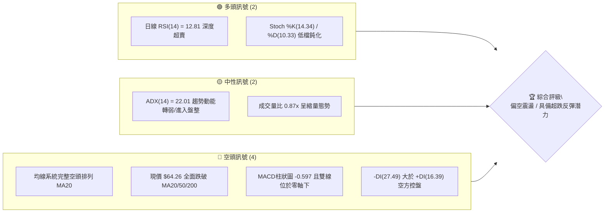
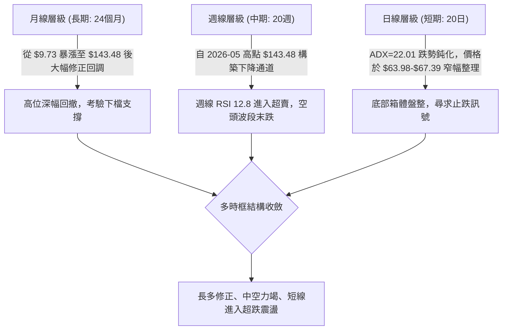
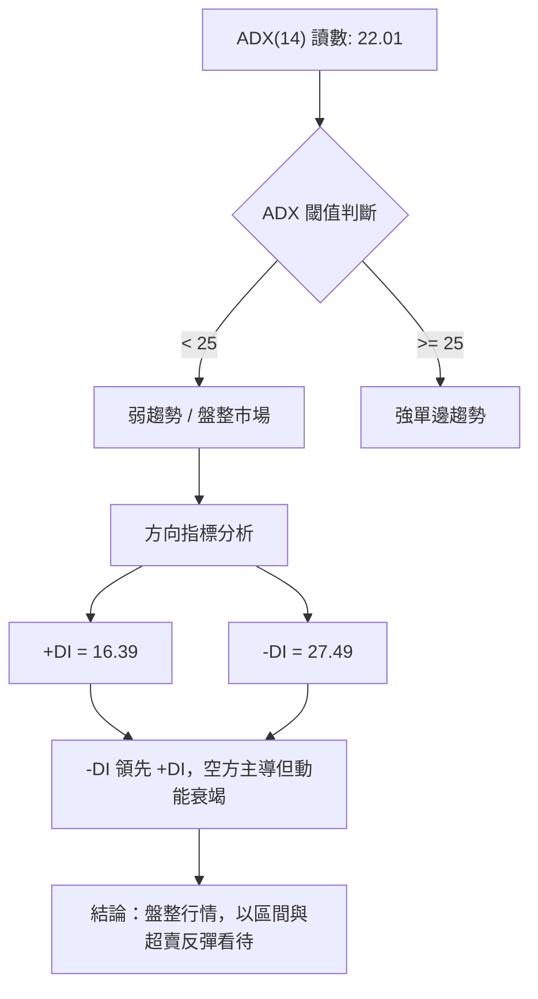
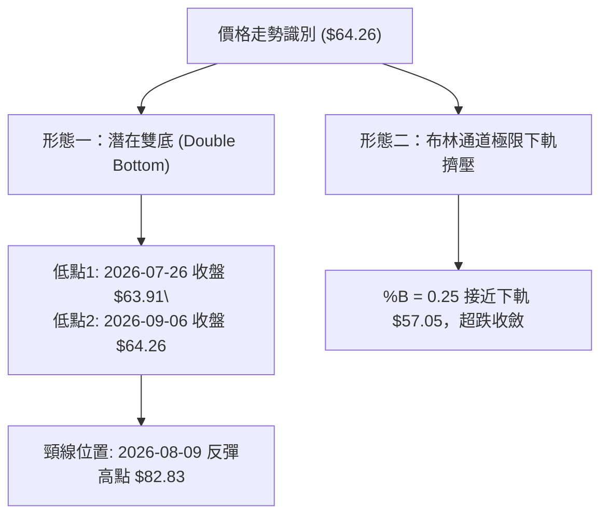
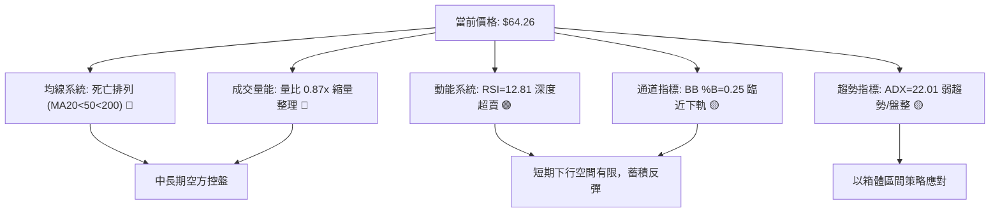
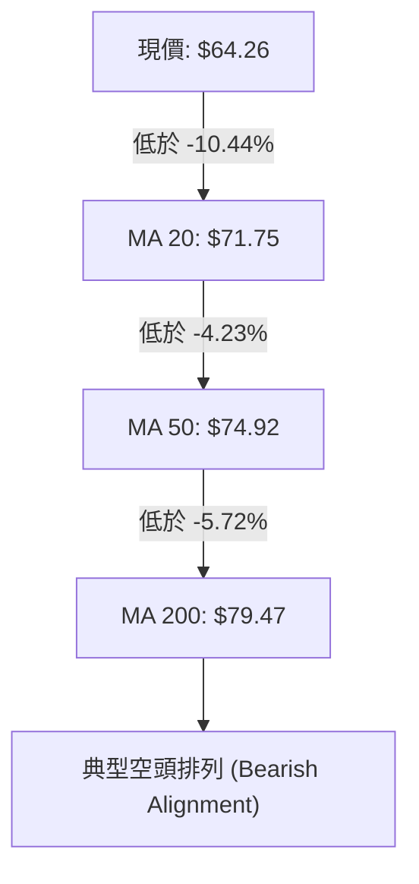
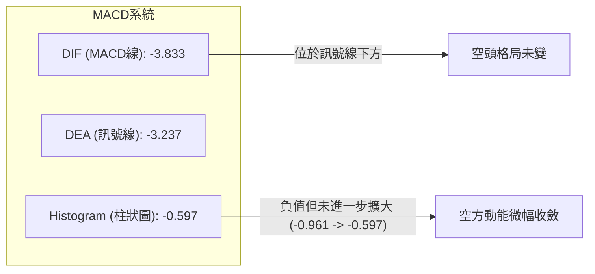
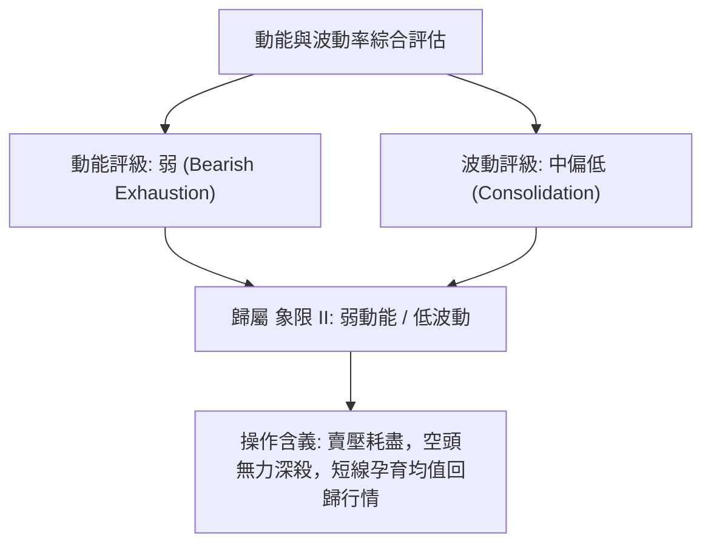
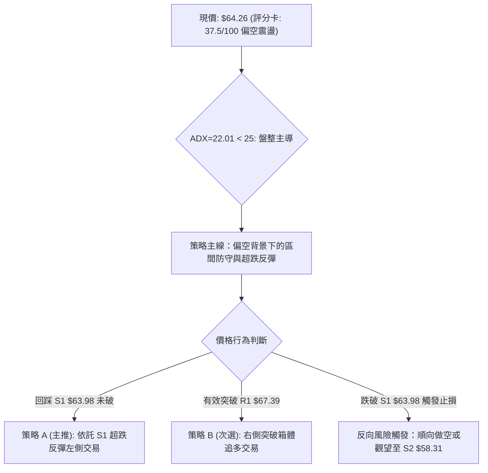
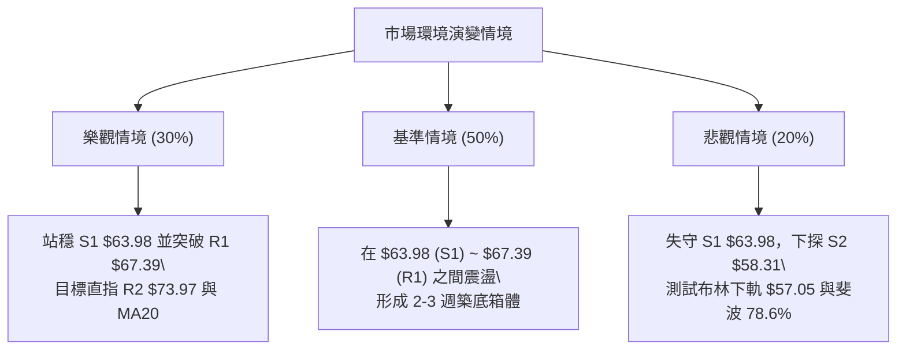

# RKLB 技術分析報告

> **報告日期**：2026-09-08 ｜ **語言**：繁體中文 ｜ **數據來源**：Yahoo Finance ｜ **當前價格**：$64.26

---

## 目錄

| 章節 | 內容 |
|------|------|
| [1. 技術面概覽](#1-技術面概覽) | 訊號儀表板、核心指標、評分卡 |
| [2. 趨勢分析](#2-趨勢分析) | 多時框趨勢、長中短期走勢、ADX解讀 |
| [3. 圖表形態分析](#3-圖表形態分析) | 形態識別、信心度評估、K線組合 |
| [4. 支撐與阻力](#4-支撐與阻力) | 關鍵價位、斐波那契回調 |
| [5. 技術指標深度解讀](#5-技術指標深度解讀) | MA/RSI/MACD/布林/成交量 |
| [6. 動能與波動率](#6-動能與波動率) | 動能四象限、ATR、Beta |
| [7. 多時框架總結](#7-多時框架總結) | 時框架評分矩陣、多時框收斂 |
| [8. 交易策略建議](#8-交易策略建議) | 策略路由、主策略、風險報酬比 |
| [9. 風險提示與監控](#9-風險提示與監控) | 監控指標、風險場景、報告總結 |

---

## 1. 技術面概覽

### 🎯 技術訊號儀表板



### 📊 核心指標速覽表

| 指標類別 | 指標名稱 | 當前數值 | 訊號 | 解讀 |
|----------|----------|----------|------|------|
| **價格** | 當前價格 | $64.26 | 🔴 | 位於 52 週高低區間 23.5% 低檔水位，自高點回撤 -57.44% |
| **均線** | MA20 | $71.75 | 🔴 | 現價低於 MA20 達 -10.44%，短期均線下彎形成動態壓制 |
| **均線** | MA50 | $74.92 | 🔴 | 現價低於 MA50 達 -14.23%，中期空頭結構未破 |
| **均線** | MA200 | $79.47 | 🔴 | 現價低於 MA200 達 -19.14%，跌破長期生命線 |
| **動能** | RSI(14) | 12.81 | 🟢 | 進入極度超賣區（<20），短線具備技術性修復動能 |
| **動能** | MACD | -3.833 | 🔴 | MACD線低於訊號線（-3.237），Hist -0.597，空方動能主導 |
| **趨勢** | ADX(14) | 22.01 | 🟡 | ADX < 25 表明單邊跌勢趨緩，進入盤整震盪築底階段 |
| **通道** | BB %B | 0.25 | 🟡 | 位於下軌 $57.05 與中軌 $71.75 之間，偏向通道下半部 |
| **波動** | ATR(14) | $3.15 | 🟡 | 佔股價 4.90%，日均波動適中，提供風控止損依據 |

### 🏆 技術評分卡

```
╔══════════════════════════════════════════════════════════════════╗
║                 技術評分卡 — RKLB (2026-09-08)                   ║
╠══════════════════════════════════════════════════════════════════╣
║ 趨勢強度 (ADX/方向)   ███████░░░░░░░░░░░░░  35/100  🔴 空頭控盤  ║
║ 動能指標 (RSI/MACD)   ████████░░░░░░░░░░░░  40/100  🟡 極度超賣  ║
║ 支撐穩定度 (S1/S2)    ████████████░░░░░░░░  60/100  🟡 臨近S1支撐║
║ 成交量配合 (OBV/Volume)██████░░░░░░░░░░░░░░  30/100  🔴 量能疲弱  ║
║ 形態完整度 (K線/幾何) ████████░░░░░░░░░░░░  40/100  🟡 構築雙底中║
║ 均線排列 (MA系統)     ████░░░░░░░░░░░░░░░░  20/100  🔴 死亡排列  ║
╠══════════════════════════════════════════════════════════════════╣
║ 綜合評分              ███████░░░░░░░░░░░░░  37.5/100 🔴 偏空震盪 ║
╚══════════════════════════════════════════════════════════════════╝
```

---

## 2. 趨勢分析

### 🌐 多時框趨勢分析



### 📈 長期趨勢 — 12個月走勢圖（Unicode）

```
RKLB 月線走勢圖（過去12個月：2025-10 至 2026-09）
價格軸 ($)
$150 ┤                                  ● $143.48 (2026-05 歷史高點)
$130 ┤                                 / \
$110 ┤                                /   ● $101.65
$90  ┤                 ● $80.07      ● $82.51
$70  ┤        ● $69.76  \           /     \
$60  ┤ ● $62.98          ● $64.22  /       ● $64.95 ── ● $63.92 ── ● $64.26 (現在)
$40  ┤    \  /                     
$30  ┤     ● $42.14 (2025-11 低點)
     └─────────────────────────────────────────────────────────────
       10  11   12   01   02   03   04   05   06   07   08   09 (月份)
```

**走勢特徵分析表格**：

| 階段 | 時間區間 | 起訖價格 | 區間漲跌幅 | 結構特徵分析 |
|------|----------|----------|------------|--------------|
| 第一階段：衝高回落 | 2025-10 ~ 2025-11 | $62.98 → $42.14 | -33.09% | 快速回踩確認前期支撐，清洗浮額 |
| 第二階段：波段主升 | 2025-11 ~ 2026-05 | $42.14 → $143.48 | +240.48% | 量價齊揚，突破百元大關，創下 52 週高點 $151.00 |
| 第三階段：斷崖回撤 | 2026-05 ~ 2026-07 | $143.48 → $64.95 | -54.73% | 獲利了結賣壓湧現，連續跌破關鍵均線 |
| 第四階段：築底整理 | 2026-07 ~ 2026-09 | $64.95 → $64.26 | -1.06% | 價格在 $63.92 ~ $64.95 橫盤，波動幅度顯著收窄 |

### 📊 中期趨勢（週線分析）

中期走勢自 2026 年 5 月底見頂 $143.48 後，呈現階梯式下跌。8 月中旬反彈至 $82.83 受阻於下降均線反壓，隨後再度回落至 $64 水平。目前週線價格在 $64.00 關卡展現橫向停頓跡象。

```
中期週線阻力與支撐結構示意圖：
[阻力 R3] $75.11 ══════════════════════════════ (MA240 $75.82 密集群)
                    ▲
[阻力 R2] $73.97 ───┴─── (波段反彈阻力位)
                    ▲
[阻力 R1] $67.39 ─────── (短期反彈第一壓力線)
                    ▲
[現  價]  $64.26 ─────── (當前盤整中樞)
                    ▼
[支撐 S1] $63.98 ─────── (近期週線低點聚類，第一道防線)
                    ▼
[支撐 S2] $58.31 ═══════ (斐波那契 78.6% $61.84 下方強支撐)
```

### ⚡ 趨勢強度評估（ADX 解讀）



| 指標項 | 數值 | 狀態定義 | 技術含義解讀 |
|--------|------|----------|--------------|
| **ADX(14)** | 22.01 | 盤整 / 無單邊趨勢 (<25) | 下跌動能顯著鈍化，趨勢力道不足以支撐新一輪大跌 |
| **+DI(14)** | 16.39 | 多方動能偏弱 | 買盤追價意願不足，暫處於觀望狀態 |
| **-DI(14)** | 27.49 | 空方動能主導 | 空頭掌控主動權，但未進一步發散（差值未急遽拉開） |

---

## 3. 圖表形態分析

### 🔍 形態識別系統



**圖表形態信心度評估表**：

| 形態名稱 | 信心度 | 判斷依據（引用數據） | 完成度 | 目標價（附計算式） |
|----------|--------|----------------------|--------|--------------------|
| **潛在雙底 (Double Bottom)** | 60% | 2026-07-26 低點 $63.91 與當前價 $64.26（接近支撐 S1 $63.98）形成雙重測試 | 45% (尚未突破頸線) | 頸線 $82.83 + 形態高度 ($82.83 - $63.91 = $18.92) = **$101.75** (中長線目標) |
| **短期箱體震盪 (Box Range)** | 75% | 價格在 S1 $63.98 與阻力 R1 $67.39 之間橫盤兩週 | 85% (已成形) | 箱頂 $67.39 + 區間高度 ($67.39 - $63.98 = $3.41) = **$70.80** |
| **頭肩底形態** | 25% | 目前無右肩成形結構，數據不足 | 15% | 訊號不足，僅做指標型解讀 |

### 🕯️ 重要K線形態分析

| 月份/週期 | 收盤價 | K線形態特徵 | 技術解讀 | 多空訊號 |
|-----------|--------|-------------|----------|----------|
| 2026-05 | $143.48 | 長上影大陽線 (衝高見頂) | 創歷史高點 $151.00 後獲利了結湧現 | 🔴 頂部力竭訊號 |
| 2026-06 | $101.65 | 大陰線向下跳空 | 跌破短期均線，確認空頭反轉開始 | 🔴 強烈看跌 |
| 2026-07 | $64.95 | 實體大陰線跌幅趨緩 | 觸及 52 週區間斐波那契 78.6% 回調位 | 🟡 跌勢受阻 |
| 2026-08 | $63.92 | 長下影紡錘線 (十字星結構) | 空方打壓受挫，多方在 $63 水平進行抵抗 | 🟢 築底十字星 |
| 2026-09 | $64.26 | 窄幅實體小陽線 (整理) | 波動率大幅萎縮，多空進入短期平衡 | 🟡 變盤前兆 |

### 📉 ASCII 走勢形態示意圖

```
潛在雙底形態 (Double Bottom Structure) 示意圖：

價格軸
$85 ┤                   頸線 (Neckline: $82.83)
$80 ┤                     /\
$75 ┤                    /  \
$70 ┤                   /    \            (預期路徑突破頸線)
$65 ┤ ──┐              /      \          ┌────────► $70.80
$64 ┤   ●             /        ● ───────● (當前現價 $64.26)
$63 ┤    \           /          \       /
$60 ┤     ●─────────┘            ●─────┘
           底1 ($63.91)           底2 ($63.98 / $64.26)
     └──────────────────────────────────────────────► 時間
         2026-07-26               2026-09-08
```

### 🎯 形態目標價計算

依據幾何形態測算原理：
1. **短期箱體突破測幅**：
   - 區間底：支撐 S1 = $63.98
   - 區間頂：阻力 R1 = $67.39
   - 形態高度 $H_1$ = $67.39 - $63.98 = $3.41
   - 箱體向上突破目標價 = $67.39 + $3.41 = **$70.80**（接近 MA20 $71.75）

2. **中期雙底突破測幅**：
   - 雙底底部基準：$63.91（2026-07-26 低點）
   - 頸線基準：$82.83（2026-08-09 週收盤高點）
   - 形態高度 $H_2$ = $82.83 - $63.91 = $18.92
   - 雙底完全確認目標價 = $82.83 + $18.92 = **$101.75**（接近 2026-06 收盤價 $101.65）

---

## 4. 支撐與阻力

### 🗺️ 關鍵價位分布圖（Unicode）

```
RKLB 價位結構分布圖
══════════════════════════════════════════════════════════════════
$75.11 ║██████████████████████████████║ 強阻力 R3 (密集套牢區 / 鄰近 MA240 $75.82)
$73.97 ║████████████████████          ║ 阻力 R2 (MA50 $74.92 壓制區)
$67.39 ║████████████████████████      ║ 關鍵阻力 R1 (短期波段頸線反壓)
$64.26 ╠══════════════════════════════╣ ◄ 現價 ($64.26)
$63.98 ║▓▓▓▓▓▓▓▓▓▓▓▓▓▓▓▓▓▓▓▓          ║ 近期支撐 S1 (雙底頸線底 / 距離 -0.43%)
$58.31 ║██████████████████████        ║ 強支撐 S2 (接近布林下軌 $57.05)
$56.13 ║██████████████████████████████║ 極限支撐 S3 (年內強波段低點聚類)
══════════════════════════════════════════════════════════════════
```

### 🚧 阻力位分析表

| 阻力級別 | 價位 | 形成原因 | 突破難度 | 重要性 |
|----------|------|----------|----------|--------|
| **R1** | **$67.39** | 近期多個交易日衝高回落高點聚類，短線反彈第一關卡 | 中等 (需補量) | ★★★☆☆ 短期轉強分水嶺 |
| **R2** | **$73.97** | 近一年波段次高點聚類，疊加 MA20 ($71.75) 與 MA50 ($74.92) 反壓 | 較高 (空頭防守位) | ★★★★☆ 中期結構扭轉點 |
| **R3** | **$75.11** | 波段高點密集套牢區，上方臨近 MA240 ($75.82) 長期均線 | 極高 (強阻力帶) | ★★★★★ 多頭全面反轉確認線 |

### 🛡️ 支撐位分析表

| 支撐級別 | 價位 | 形成原因 | 守住機率 | 重要性 |
|----------|------|----------|----------|--------|
| **S1** | **$63.98** | 近一年波段低點聚類，與 2026-07-26 收盤 $63.91 共振，距現價僅 -0.43% | 65% | ★★★★☆ 當前多頭防守底線 |
| **S2** | **$58.31** | 近一年次級波段低點聚類，接近布林通道下軌 $57.05，跌破 S1 後的緩衝 | 75% | ★★★★☆ 深度回調安全墊 |
| **S3** | **$56.13** | 波段絕對低點聚類，接近 52 週最低價 $37.57 與高點拉回的強支撐帶 | 85% | ★★★★★ 極限防守線（不可跌破） |

### 📐 斐波那契回調位分析

依據 52 週極值區間（低點 **$37.57** → 高點 **$151.00**），波動範圍為 $113.43：

| 斐波那契比例 | 價位 | 當前狀態與技術意義 |
|--------------|------|--------------------|
| **0.0% (52W High)** | $151.00 | 2026-05 歷史最高點 |
| **23.6%** | $124.23 | 第一次回調支撐位（已跌破） |
| **38.2%** | $107.67 | 中期多空平衡點（已跌破） |
| **50.0%** | $94.28 | 半數回撤分界線（已跌破） |
| **61.8%** | $80.90 | 黃金分割重要防守位（已跌破，轉為長期壓力） |
| **78.6%** | **$61.84** | **深度回調極限防守位** |
| **100.0% (52W Low)**| $37.57 | 52 週最低點起漲點 |

> **回調位解讀**：當前現價 **$64.26** 精確運行於 **61.8% ($80.90)** 與 **78.6% ($61.84)** 之間，且極為接近 **78.6% ($61.84)**。在道氏與斐波那契理論中，78.6% 回調位是強勢標的最後的防守陣地，若能守穩 $61.84 至 $63.98（S1）區間，該區域將構成強烈的技術性超跌反彈基石。

---

## 5. 技術指標深度解讀

### 🎛️ 指標訊號總覽



### 📈 移動平均線排列分析



**各週期均線狀態詳細解析**：

| 均線名稱 | 數值 | 現價偏離度 | 軌跡特徵與解讀 |
|----------|------|------------|----------------|
| **MA 5** | $63.53 | +1.16% | 短期止跌微幅翻揚，價格已站回 MA5 之上，短線止血 |
| **MA 10** | $65.09 | -1.28% | 壓制於現價上方，為第一道動態短壓 |
| **MA 20** | $71.75 | -10.44% | 扣高走低下行，為布林中軌，反彈關鍵阻力 |
| **MA 60** | $79.23 | -18.89% | 中期生命線下傾，顯示過去一個季度籌碼嚴重套牢 |
| **MA 120** | $86.51 | -25.72% | 中長期半年線壓制 |
| **MA 200** | $79.47 | -19.14% | 長期年線位置，牛熊分水嶺（目前失守） |
| **MA 240** | $75.82 | -15.24% | 與阻力 R3 ($75.11) 形成重疊共振壓力區 |

### 📉 RSI(14) 分析

- **當前讀數**：`12.81`
- **可視化進度條**：
  ```
  超賣 [██░░░░░░░░░░░░░░░░░░] 12.81/100 (極端超賣區 <20)
  ```
- **狀態判定**：🟢 **極度超賣 (Deep Oversold)**。歷史數據顯示，當 RSI 跌破 15 時，隨機拋售常伴隨流動性竭盡，短期技術性抽腳反彈機率顯著上升。
- **背離分析**：
  - 2026-07-26 價格 $63.91，RSI 為 15.6。
  - 2026-09-06 價格 $64.26，RSI 為 12.81。
  - **結論**：價格微幅走高而 RSI 創出新低，呈現微弱的「隱形弱勢」，但由於價格近乎持平（$63.91 vs $64.26），且近期週線 RSI 亦在低位，尚未構成標準的日線經典底背離。目前屬於**指標鈍化後的超跌狀態**，而非明確底背離。

### 📊 MACD(12/26/9) 訊號解讀



- **數值現況**：MACD 線 (-3.833) 持續在訊號線 (-3.237) 下方運行，雙線皆在零軸之下深處。
- **柱狀圖解讀**：柱狀圖自前一週的 `-0.961` 收窄至當前的 `-0.597`，表明空方下殺動能已出現減速跡象，正醞釀零軸下方的二次金叉機會。

### 📦 布林通道分析

```
布林通道結構示意圖 (Bollinger Bands 20, 2)：
$86.46 ┬────────────────────────────────────────── BB 上軌 (Upper)
       │
$71.75 ┼┄┄┄┄┄┄┄┄┄┄┄┄┄┄┄┄┄┄┄┄┄┄┄┄┄┄┄┄┄┄┄┄┄┄┄┄┄┄┄┄┄ BB 中軌 / MA20 (Middle)
       │
$64.26 ┼───────────► [現價 $64.26, %B = 0.25]
       │
$57.05 ┴────────────────────────────────────────── BB 下軌 (Lower)
```

- **通道帶寬**：上軌 $86.46 與下軌 $57.05 差距為 $29.41，通道帶寬寬度適中。
- **%B 指標**：`0.25`。表明價格位於下半通道，且自下軌向上靠攏中軌。
- **運行評估**：現價並未直接刺破下軌 $57.05，而是在下軌上方約 $7.21 處展開橫盤，表明價格在通道內尋找支撐，尚未引發「布林下軌單邊開口暴跌」的極端空頭行情。

### 💹 成交量分析（量價配合度）

- **最新成交量**：`14,867,600` 股。
- **20日均量**：`17,116,475` 股（量比：**0.87x**）。
- **50日均量**：`19,448,972` 股。
- **量能特徵**：成交量呈現階梯式萎縮（19.4M → 17.1M → 14.8M），顯示市場殺跌意願顯著減弱，「無量陰跌」轉為「縮量築底」。
- **OBV (能量潮)**：`OBV < MA`，能量潮指標持續低於其均線，代表資金進場抄底意願仍顯保守，未出現機構級別的主動性放量回補。

---

## 6. 動能與波動率

### ⚡ 動能評估四象限

| 象限標籤 | 動能狀態 | 波動率狀態 | 當前股票歸屬 | 技術特徵與應對策略 |
|----------|----------|------------|--------------|--------------------|
| **象限 I** | 強動能 (Bullish) | 低波動 (Low Vol) | ─ | 穩定主升浪，持股加碼 |
| **象限 II** | 弱動能 (Bearish) | 低波動 (Low Vol) | **✓ RKLB 目前位置** | **縮量盤整、動能衰竭、適合區間操作或超跌分批布局** |
| **象限 III**| 強動能 (Bullish) | 高波動 (High Vol) | ─ | 爆發突破期，嚴格順勢追蹤 |
| **象限 IV** | 弱動能 (Bearish) | 高波動 (High Vol) | ─ | 恐慌性崩跌，嚴禁進場抄底 |



### 📊 ATR 波動率分析

- **ATR(14) 數值**：**$3.15**（佔股價比例：**4.90%**）。
- **日內安全邊際**：當前每日正常震盪幅度約為 $3.15。
- **止損距離建議**：
  - **保守型交易者（1.5 倍 ATR）**：止損幅度應設定為 $3.15 \times 1.5 = \$4.73$。
  - **進取型交易者（1.0 倍 ATR）**：止損幅度應設定為 $3.15 \times 1.0 = \$3.15$。
  - **短線防守點對齊**：若以現價 $64.26 計算，1.0 倍 ATR 下檔防守點為 $61.11，這與斐波那契 78.6% 回調位 **$61.84** 高度重疊，提供極佳的數學止損錨定。

### 📐 Beta 與市場相關性

- **Beta 係數**：`2.612`。
- **特徵解讀**：高 Beta 屬性意味著 RKLB 的波動率為標普 500 大盤的 2.6 倍以上。在市場風險偏好改善時，具備極強的反彈彈性；但在大盤震盪時，下行回撤亦會被放大。因此，任何反彈操作均需嚴格控管槓桿與倉位。

---

## 7. 多時框架總結

### 📋 時框架評分表

| 時框架 | 趨勢方向 | 動能指標 | 均線系統 | 圖表形態 | 綜合評分 | 建議動作 |
|--------|----------|----------|----------|----------|----------|----------|
| **月線 (長期)** | 震盪偏多 | 中性修正 | 跌破 MA20，守於長期起漲之上 | 高位大回撤 | 50/100 | 長期基本面跟蹤，暫勿重倉 |
| **週線 (中期)** | 空頭調整 | 嚴重超賣 (12.8) | 空頭排列 (MA20/50/200 下彎) | 階梯下跌，尋求雙底 | 35/100 | 等待止跌陽線確認 |
| **日線 (短期)** | 底部盤整 | RSI=12.81 鈍化 | MA5 抬頭，其餘均線壓制 | $63.98-$67.39 箱體 | 40/100 | 區間低吸高拋，嚴設止損 |

### 🔲 綜合訊號矩陣

```
時框架訊號矩陣與多空一致性檢驗：
┌───────────┬─────────────┬─────────────┬─────────────┐
│ 分析維度  │ 短期 (日線) │ 中期 (週線) │ 長期 (月線) │
├───────────┼─────────────┼─────────────┼─────────────┤
│ 均線趨勢  │ 🔴 空頭     │ 🔴 空頭     │ 🟡 中性     │
│ 動能狀態  │ 🟢 超賣反彈 │ 🟢 超賣鈍化 │ 🔴 修正回落 │
│ 量價結構  │ 🟡 縮量盤整 │ 🔴 均量下行 │ 🟡 中性整理 │
│ 形態定位  │ 🟡 箱體整理 │ 🟡 雙底醞釀 │ 🔴 回吐漲幅 │
└───────────┴─────────────┴─────────────┴─────────────┘
一致性判斷：中短期空頭趨勢確立，但短線動能已極度超賣，量能耗竭顯示空方缺乏推動新低的力量。
```

### ⚖️ 多時框收斂結論

> **多時框收斂規則執行**：
> 1. 當前日線 **ADX(14) = 22.01 (< 25)**，明確定義市場當前處於**盤整行情（非單邊趨勢）**。
> 2. 依據收斂優先級規則：盤整行情以**日線布林通道上下軌與關鍵水平支撐阻力**為主要操作區間，中長期均線僅作為反彈阻力位參考。
> 3. **唯一方向性結論**：**【中性偏空，超跌區間震盪】**。均線死叉壓制中期走勢，但在 RSI=12.81 極度超賣與 ADX 鈍化共振下，下行空間已被 S1 ($63.98) 與 S2 ($58.31) 鎖定，短線具備修復至 MA20 ($71.75) 的反彈契機。

---

## 8. 交易策略建議

### 🗺️ 策略決策流程圖



### 🧭 策略路由

- **綜合評分**：`37.5 / 100`（偏空）。
- **當前主策略方向**：**【超賣區間防守型短多與破位防禦】**。
  - *說明*：雖然長期與中期均線呈現空頭排列（評分 ≤ 40），但由於 ADX < 25 處於盤整市，且 RSI(14) 高度超跌（12.81），單邊追空具有極大軋空風險。因此主策略採取「**緊貼關鍵支撐 S1 的高盈虧比超跌反彈策略**」，並嚴設硬止損，一旦跌破立即轉為防守。

### 🎯 價格情境階梯（Price Scenarios）

| 觸發條件 | 下一目標 | 後續延伸 | 情境含義 |
|----------|----------|----------|----------|
| **強勢突破 R1 ($67.39)** | **R2 ($73.97)** | **R3 ($75.11)** | 短線底部形態確認，邁向布林中軌與 MA50 壓力帶 |
| **站穩現價區間 ($64.26)**| **R1 ($67.39)** | ─ | 維持 S1 與 R1 之間的箱體低位震盪，蓄勢整理 |
| **有效跌破 S1 ($63.98)** | **S2 ($58.31)** | **S3 ($56.13)** | 雙底構築失敗，價格尋求布林下軌及年內強支撐 |

### 📊 情境機率分佈

| 情境劃分 | 機率估計 | 主要依據 |
|----------|----------|----------|
| **情境一：超跌反彈向上** | **35%** | RSI(14)=12.81 極度超賣、MACD 柱狀圖收窄 (-0.597)、現價站上 MA5 |
| **情境二：低位區間震盪** | **45%** | ADX=22.01 缺乏單邊動能、成交量萎縮至 0.87x 均量、布林中下軌收斂 |
| **情境三：破位再探低點** | **20%** | 均線系統完整空頭排列、-DI(27.49) 依然掌控盤面主導權 |

### 🟢 主策略詳情

本報告依據關鍵價位嚴格測算兩套具備正期望值的策略：

| 策略要素 | 策略 A（主推：S1 支撐左側超跌反彈） | 策略 B（次選：突破 R1 右側順勢加碼） |
|----------|-------------------------------------|---------------------------------------|
| **策略邏輯** | 依託 S1 支撐與極端超賣，博弈均值回歸 | 確認箱頂被帶量擊穿，順勢參與補漲波段 |
| **進場條件** | 現價 $64.26 或回踩 S1 $63.98 不破時進場 | 突破阻力位 R1 $67.39 並收盤確認 |
| **進場價格** | **$64.00**（限價掛單於 S1 上方） | **$67.50**（突破確認價） |
| **目標價 T1**| **$67.39**（阻力 R1，短線減倉 50%） | **$73.97**（阻力 R2，平倉 60%） |
| **目標價 T2**| **$71.75**（布林中軌 / MA20，結利） | **$75.11**（阻力 R3，全數結利） |
| **止損價格** | **$61.80**（斐波那契 78.6% $61.84 下方） | **$64.50**（跌回突破頸線之下） |
| **風險額 (R)** | $64.00 - $61.80 = $2.20 | $67.50 - $64.50 = $3.00 |
| **報酬額 (T1)**| $67.39 - $64.00 = $3.39 | $73.97 - $67.50 = $6.47 |
| **報酬額 (T2)**| $71.75 - $64.00 = $7.75 | $75.11 - $67.50 = $7.61 |
| **風險報酬比** | **1 : 2.53**（以 T2 測算達 **1 : 3.52**） | **1 : 2.16**（以 T2 測算達 **1 : 2.54**） |
| **成功機率** | 60% | 50% |
| **建議倉位** | **8% - 10%**（輕倉試單） | **12% - 15%**（突破確認後配置） |

### 🔴 反向風險觸發點（對沖提示）

若出現以下訊號，證明主策略失效，空頭重新掌握絕對壓制：
1. **關鍵價位失守**：日線收盤價跌破 **$63.98 (S1)**，且次日無法收回，表明底部結構破裂。
2. **量能異動**：跌破 $63.98 時伴隨單日成交量放大超過 50 日均量（>19.4M 股）。
3. **指標惡化**：-DI 向上突破 35.00，且 ADX 突破 25 重新形成單邊空頭趨勢。
   - *風控動作*：立即執行止損，多單無條件離場，並可考慮在反抽 $63.98 受阻時轉換為空頭頭寸，下看 **S2 ($58.31)**。

### ⭐ 整體訊號強度評星

```
做多訊號強度：★★☆☆☆  (2.5/5星 — 超賣嚴重，但受制於空頭均線)
做空訊號強度：★★☆☆☆  (2.0/5星 — 空間受限於強支撐，追空性價比低)
整體可信度：  ★★★☆☆  (3.5/5星 — ADX 驗證盤整，指標與價位結構高度收斂)
```

---

## 9. 風險提示與監控

### ✅ 關鍵監控指標 Checklist

```
╔══════════════════════════════════════════════════════════════════╗
║                   每日交易前監控檢查清單 (Checklist)             ║
╠══════════════════════════════════════════════════════════════════╣
║ [ ] 價格是否維持在 S1 ($63.98) 之上？（破位即觸發風控警報）      ║
║ [ ] 日線 RSI(14) 是否脫離超賣區（升破 30）確認反彈啟動？         ║
║ [ ] MACD 柱狀圖負值是否持續收窄（大於 -0.597 甚至翻紅）？        ║
║ [ ] 成交量是否放大超過 20 日均量 (17.1M 股) 以驗證真突破？       ║
║ [ ] 價格衝擊 R1 ($67.39) 時是否出現長上影線受阻賣壓？            ║
║ [ ] 大盤波動率是否穩定，未對 Beta 2.612 的 RKLB 造成系統性拖累？ ║
╚══════════════════════════════════════════════════════════════════╝
```

### ⚠️ 風險場景分析



### 🛡️ 風險管理重要提醒

1. **嚴格禁止重倉博弈**：由於 RKLB 的 Beta 值高達 **2.612**，且當前均線處於空頭排列，下行慣性依然存在。總持倉曝險不得超過投資組合總資金的 **10%**。
2. **機械化執行止損**：左側策略進場必須將硬止損設定在斐波那契回調位下方 **$61.80**，嚴禁在跌破 S1 後攤平成本。
3. **獲利分批了結保護**：一旦價格反彈觸及 R1 **$67.39**，必須至少平倉 50% 倉位，並將剩餘倉位的止損價上移至損益兩平點（$64.00），確保本金零風險。

---

## 📋 報告總結

```
╔══════════════════════════════════════════════════════════════════╗
║                   RKLB 技術分析報告總結                          ║
╠══════════════════════════════════════════════════════════════════╣
║ 報告日期：2026-09-08                                             ║
║ 當前價格：$64.26                                                 ║
║ 分析評級：⚖️ 中性觀望 / 偏空超跌反彈                              ║
║                                                                  ║
║ 關鍵結論：                                                       ║
║ ├─ 長期趨勢：🟡 中性修正（自歷史高點 $151.00 大幅回撤至 78.6%） ║
║ ├─ 中期趨勢：🔴 空頭主導（均線死亡排列，跌勢因縮量而趨緩）      ║
║ ├─ 短期趨勢：🟢 構築雙底（RSI=12.81 深度超賣，支撐 S1 $63.98 穩固）║
║ ├─ 關鍵支撐：S1 $63.98 ｜ S2 $58.31 ｜ S3 $56.13                 ║
║ ├─ 關鍵阻力：R1 $67.39 ｜ R2 $73.97 ｜ R3 $75.11                 ║
║ └─ 分析師目標：共識買入，均價 $111.00（最低 $64.00 / 最高 $150.00）║
║                                                                  ║
║ 最優策略組合：                                                   ║
║ 1. 🥇 最佳機會：策略 A（在 $64.00 附近輕倉低吸，止損 $61.80，    ║
║                 目標 R1 $67.39 / MA20 $71.75，盈虧比 1:2.53）   ║
║ 2. 🥈 次選機會：策略 B（等待放量突破 R1 $67.39 右側追多，       ║
║                 目標 R2 $73.97，盈虧比 1:2.16）                 ║
║ 3. 🥉 保守選擇：場外觀望，等待日線收復 MA20 ($71.75) 且 ADX 翻揚 ║
╚══════════════════════════════════════════════════════════════════╝
```

---

> ⚠️ **免責聲明**：本報告為技術分析研究，所有數據及估算均基於歷史價格與客觀技術指標計算。本報告**僅供研究與學術參考**，**不構成任何買賣要約或投資建議**。高 Beta 成長型股票波動劇烈，投資人應獨立評估風險，盈虧自負。

---

*報告生成時間：2026-09-08 ｜ 數據來源：Yahoo Finance ｜ 分析框架：多時框架量化技術分析*