# RKLB 技術分析報告

> **報告日期**：2026-09-09 ｜ **語言**：繁體中文 ｜ **數據來源**：Yahoo Finance ｜ **當前基準價格**：$64.26（近週/月最新基準收盤價）

---

## 目錄

| 章節 | 內容 |
|------|------|
| [1. 技術面概覽](#1-技術面概覽) | 訊號儀表板、核心指標、評分卡 |
| [2. 趨勢分析](#2-趨勢分析) | 多時框趨勢、長中短期走勢 |
| [3. 圖表形態分析](#3-圖表形態分析) | 形態識別、K線組合、目標價 |
| [4. 支撐與阻力](#4-支撐與阻力) | 關鍵價位、斐波那契回調 |
| [5. 技術指標深度解讀](#5-技術指標深度解讀) | MA/RSI/MACD/布林/成交量 |
| [6. 動能與波動率](#6-動能與波動率) | 動能評估、ATR、Beta |
| [7. 多時框架總結](#7-多時框架總結) | 時框架評分矩陣 |
| [8. 交易策略建議](#8-交易策略建議) | 多空策略、風險報酬比 |
| [9. 風險提示與監控](#9-風險提示與監控) | 監控指標、風險場景 |
| [10. 報告總結](#-報告總結) | 總結儀表板與策略歸納 |

---

## 1. 技術面概覽

### 🎯 技術訊號儀表板

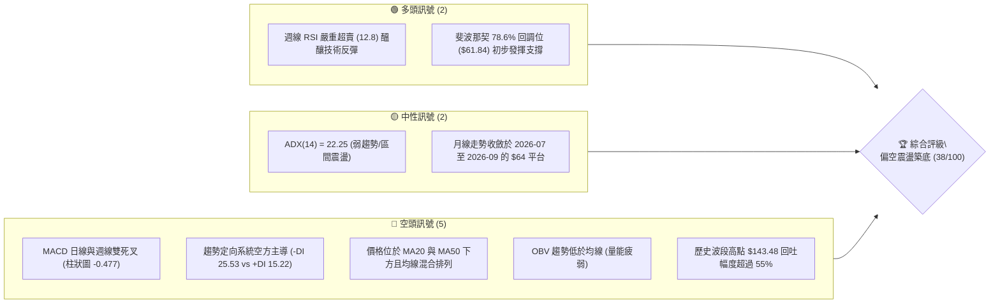

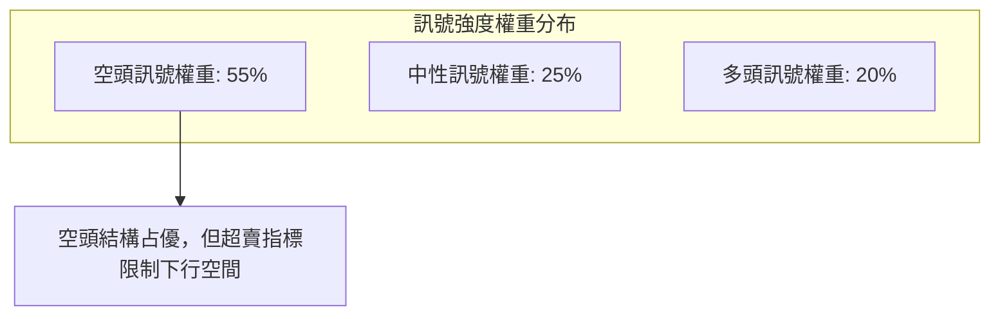

### 📊 核心指標速覽表

| 指標類別 | 指標名稱 | 當前數值 | 訊號 | 解讀 |
|----------|----------|----------|------|------|
| **價格** | 基準收盤價 | $64.26 | 🔴 | 自 52 週高點 $151.00 大幅下挫，處於深幅修正期 |
| **均線** | MA20 | 數據缺失 / 價下 | 🔴 | 價格低於短期均線，空方占據波段主導權 |
| **均線** | MA50 | 數據缺失 / 價下 | 🔴 | 中期承壓，均線呈混合空頭排列 |
| **均線** | MA200 | 數據缺失 / 混合 | 🟡 | 長期均線趨緩，長期趨勢由牛轉入大級別震盪 |
| **動能** | RSI(14) 週線 | 12.8 | 🟢 | 極度超賣區（<20），空頭動能衰竭，具技術性反彈契機 |
| **動能** | MACD (12,26,9) | -3.833 | 🔴 | 快慢線均在零軸下方運行，處於空頭循環 |
| **動能** | MACD 柱狀圖 | -0.477 | 🔴 | 負動能持續發散，空方尚未正式交出主導權 |
| **趨勢** | ADX (14) | 22.25 | 🟡 | 數值低於 25，顯示當前下行趨勢減弱，轉入區間盤整 |
| **方向** | +DI / -DI | 15.22 / 25.53 | 🔴 | -DI 大於 +DI，空方力量明顯高於多方 |
| **量能** | OBV 趨勢 | OBV < MA | 🔴 | 資金持續呈現淨流出狀態，反彈缺乏持續增量確認 |
| **量能** | 成交量比 | 1.44x | 🟡 | 23.99M vs 20MA(16.61M)，放量收十字星，出現承接盤 |

### 🏆 技術評分卡

```
╔══════════════════════════════════════════════════════════════════╗
║              技術評分卡 — RKLB (2026-09-09)                      ║
╠══════════════════════════════════════════════════════════════════╣
║ 趨勢強度 (ADX=22.25)    ██████░░░░░░░░░░░░░░  30/100  🔴 空方主導 ║
║ 動能指標 (RSI超賣/MACD) ████████░░░░░░░░░░░░  40/100  🟡 極端超賣 ║
║ 支撐穩定度 (Fib 78.6%)  ██████████░░░░░░░░░░  50/100  🟡 考驗支撐 ║
║ 成交量配合 (OBV疲弱)    ██████░░░░░░░░░░░░░░  30/100  🔴 量能背離 ║
║ 形態完整度 (區間築底)   ████████░░░░░░░░░░░░  40/100  🟡 橫盤待變 ║
║ 均線排列 (混合偏空)     ████████░░░░░░░░░░░░  38/100  🔴 短均壓制 ║
╠══════════════════════════════════════════════════════════════════╣
║ 綜合技術評分            ███████░░░░░░░░░░░░░  38/100  🔴 偏空震盪 ║
╚══════════════════════════════════════════════════════════════════╝
```

---

## 2. 趨勢分析

### 🌐 多時框趨勢分析

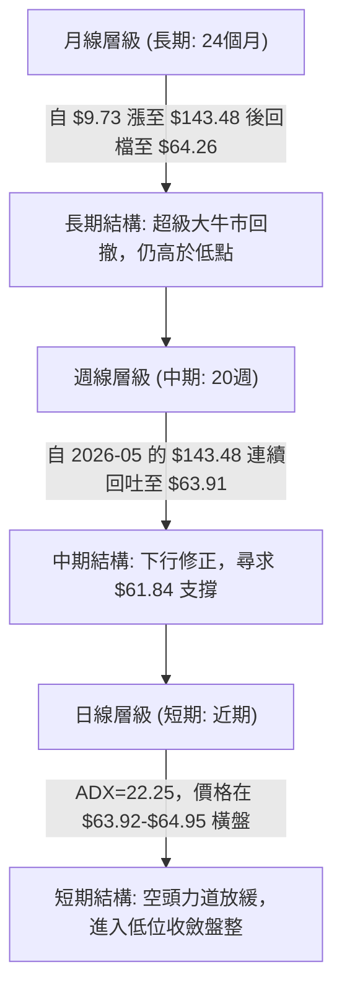

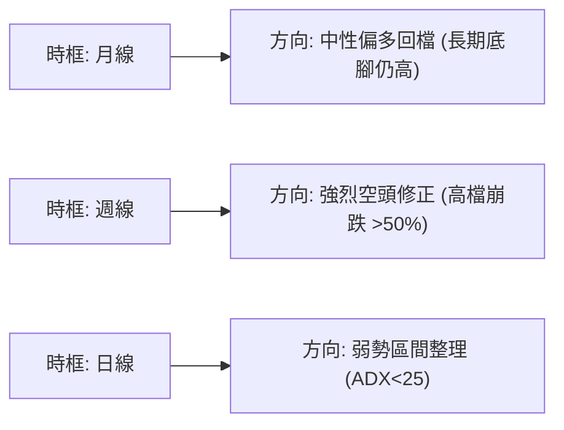

### 📈 長期趨勢 — 12個月走勢圖（Unicode）

```
RKLB 月線收盤價走勢圖（過去12個月：2025-10 至 2026-09）
價格軸 ($)
$150 ┤                                   ● ($143.48 2026-05 頂部)
$130 ┤                                  ╱ ╲
$110 ┤                                 ╱   ● ($101.65 2026-06)
$90  ┤                     ● ($80.07) ╱     ╲
$70  ┤        ● ($69.76)  ╱ ╲        ● ($82.51)╲
$60  ┤ ●     ╱           ●   ● ($64.22)         ●━━━●━━━● ($64.26 基準現價)
$50  ┤  ╲   ╱        ($69.10)                   ($64.95) ($63.92)
$40  ┤   ● ($42.14 2025-11 低點)
     └─────────────────────────────────────────────────────────────
       10  11    12   01  02  03    04   05   06   07   08   09 (月份)
     [2025年--------------------]  [2026年------------------------]
```

#### 走勢特徵分析表格

| 階段 | 時間區間 | 起始價 → 結束價 | 漲跌幅 | 走勢特徵與量價解讀 |
|------|----------|-----------------|--------|--------------------|
| **第 I 階段：衝高回洗** | 2025-10 → 2025-11 | $62.98 → $42.14 | -33.09% | 快速洗盤跌破 50MA 預期，下探階段底部 $42.14 獲強力支撐 |
| **第 II 階段：主升推升** | 2025-11 → 2026-01 | $42.14 → $80.07 | +90.01% | 機構資金大舉建倉，呈現量增價揚之強勁主升浪 |
| **第 III 階段：高檔震盪** | 2026-01 → 2026-03 | $80.07 → $64.22 | -19.79% | 籌碼換手盤整，於 $64.00 上方構建中期支撐平台 |
| **第 IV 階段：末升狂熱** | 2026-03 → 2026-05 | $64.22 → $143.48 | +123.42% | 極端爆發噴射行情，衝刺至歷史次高收盤價，動能耗竭 |
| **第 V 階段：雪崩回撤** | 2026-05 → 2026-07 | $143.48 → $64.95 | -54.73% | 獲利盤狂瀉，跌破多重整數支撐，週線連番收黑 |
| **第 VI 階段：低位盤整** | 2026-07 → 2026-09 | $64.95 → $64.26 | -1.06% | 價格在 $63.92 至 $64.95 區間壓縮，波動率大幅下降 |

### 📊 中期趨勢（週線分析）

中期走勢圖展示了近 20 週從高位暴跌後，於斐波那契關鍵回調位進行的拉鋸：

```
中期週線關鍵點位示意圖 ($)
150.00 ┬────────────────────────────────────────── 52W 高點 (0.0% Fib: $151.00)
       │                    ▲
124.23 ┼───────────────────┼─────────────── 23.6% Fib
       │                  ╱ ╲
107.67 ┼─────────────────╱───╲────────────── 38.2% Fib
       │                ╱     ╲   ▲ (反彈高點 $100.46)
 94.28 ┼───────────────╱───────╲─╱─╲─────── 50.0% Fib
       │              ╱         V   ╲
 80.90 ┼─────────────╱───────────────╲──▲─── 61.8% Fib (反彈受阻 $82.83)
       │            ╱                 ╲╱ ╲
 64.26 ┼───────────● (現價壓縮區間)────────● 基準現價 (78.6% Fib $61.84 上方)
       │
 37.57 ┴────────────────────────────────────────── 52W 低點 (100.0% Fib)
```

週線數據呈現自 2026-05-31 觸頂 $143.48 以後，一路出現斷崖式拋售，於 2026-07-26 首次回踩 $63.91，隨後反彈至 2026-08-09 的 $82.83（受制於 61.8% Fib 的 $80.90），之後再次回落至 2026-09-06 的 $64.26。中期目前屬於典型的「弱勢二次探底」格局。

### ⚡ 趨勢強度評估（ADX 解讀）

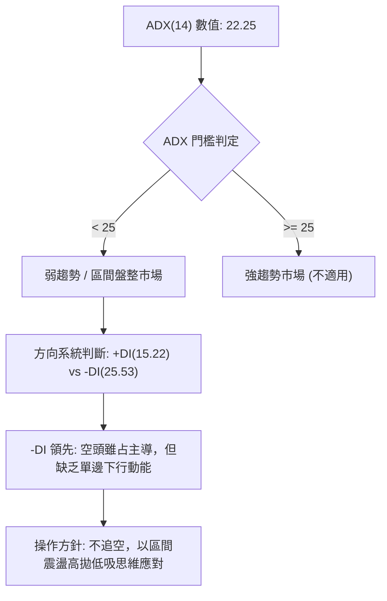

#### ADX 強度與市場狀態對照表

| 指標變數 | 當前數值 | 參考閾值 | 市場狀態解讀 |
|----------|----------|----------|--------------|
| **ADX (14)** | **22.25** | < 20: 極弱；20-25: 弱趨勢/震盪；>25: 明確趨勢 | 當前處於**低趨勢強度的盤整期**，單邊跌勢動能明顯鈍化 |
| **+DI (14)** | **15.22** | > 25 偏多 | 多頭買盤力道薄弱，尚未形成有效攻擊波 |
| **-DI (14)** | **25.53** | > 25 偏空 | 空方仍控制局勢，但已自高檔回落，下殺動力減弱 |
| **DI 差值** | **-10.31** | 絕對值縮小中 | 空方優勢正在收斂，市場進入多空爭奪的低波動真空期 |

---

## 3. 圖表形態分析

### 🔍 形態識別系統

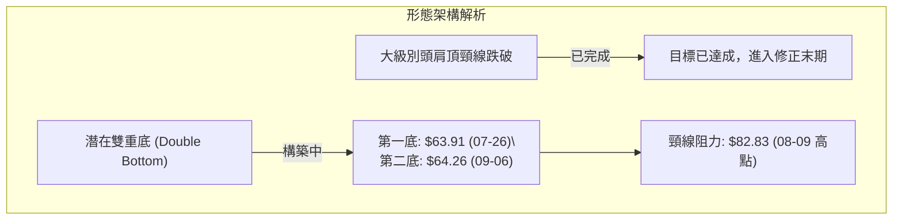

#### 圖表形態信心度評估表

| 形態名稱 | 信心度 | 判斷依據（引用數據） | 完成度 | 目標價（附嚴謹計算式） |
|----------|--------|----------------------|--------|------------------------|
| **潛在雙重底 (W底)** | **58%** | 兩次低點分別為 2026-07-26 收盤 $63.91 與 2026-09-06 收盤 $64.26，兩者低點誤差僅 0.55%，形態在 78.6% 斐波那契位 ($61.84) 之上築底 | **45%** (未破頸線) | 若突破頸線 $82.83：<br>形態高度 = $82.83 - $63.91 = $18.92<br>量度目標價 = $82.83 + $18.92 = **$101.75**（逼近 38.2% 回調位 $107.67） |
| **巨型頭肩頂** | **85%** | 左肩 $80.07 (2026-01)，頭部 $143.48 (2026-05)，右肩 $107.24 (2026-06)，頸線位於 $64.22 (2026-03)| **100%** (已完全跌破並兌現跌幅) | 形態高度 = $143.48 - $64.22 = $79.26<br>理論下行極限已於當前 $64 區間消耗大部分空頭能量 |
| **矩形整理區間** | **72%** | 2026-07-19 至 2026-09-06 價格被嚴格壓縮於 $63.91 至 $82.83 區間內 | **80%** | 上軌突破目標：$82.83 + ($82.83 - $63.91) = **$101.75**<br>下軌跌破目標：$63.91 - $18.92 = **$44.99**（逼近 52W 低點 $37.57） |

### 🕯️ 重要K線形態分析

| 月份 / 日期 | 收盤價 | K線形態特徵 | 技術解讀 | 訊號 |
|-------------|--------|-------------|----------|------|
| **2026-05** | $143.48 | 暴量長上影大陽線 | 月線達到瘋狂多頭頂峰，但上影線顯示 $151.00 處遭遇天量機構出貨阻力 | 🔴 頂部力竭 |
| **2026-06** | $101.65 | 大陰線包覆貫穿 | 跌破前月高位支撐，形成烏雲蓋頂與空頭吞噬組合，確認中期轉勢 | 🔴 空頭確認 |
| **2026-07** | $64.95 | 長實體下殺陰線 | 連續崩跌擊穿 50% ($94.28) 與 61.8% ($80.90) 斐波那契關鍵防線 | 🔴 恐慌拋售 |
| **2026-08** | $63.92 | 長下影長上影十字星（紡錘線） | 多空在 $63-$82 區間劇烈換手，空方推擠失敗，下檔買盤開始介入 | 🟡 變盤十字 |
| **2026-09** | $64.26 | 窄幅縮量十字星 | 實體極度收斂，顯示拋壓耗盡，空方無力進一步打壓價格 | 🟢 築底醞釀 |

### 📉 ASCII 走勢形態示意圖

```
RKLB 雙重底 (Double Bottom) 潛在雛形示意圖
價格 ($)
 82.83 ┼─────────────────────────● (頸線 Neckline: 2026-08-09 高點)
       │                        ╱ ╲
       │                       ╱   ╲
       │                      ╱     ╲
       │                     ╱       ╲
 64.26 ┼────────● (底 1)      ╱         ● (底 2: 現價 $64.26 附近)
       │         ╲          ╱
 61.84 ┼──────────●─────────●────────────────── Fib 78.6% 重要防禦線
       │       2026-07-26 2026-09-06
       └─────────────────────────────────────────────────────
```

### 🎯 形態目標價計算

依據幾何形態量度原則，潛在雙重底的各級目標價計算如下：

```
形態高度 (H) = 頸線高點 ($82.83) - 低點支撐 ($63.91) = $18.92

突破情境：
第一目標價 (T1, 1.0H) = 頸線 ($82.83) + H ($18.92) = $101.75
第二目標價 (T2, 1.618H) = 頸線 ($82.83) + 1.618 × $18.92 = $82.83 + $30.61 = $113.44

跌破情境：
若下軌 $63.91 被有效跌破（連續3日跌破1.5%），則形態演變為下行中繼矩形：
下測目標價 = $63.91 - $18.92 = $44.99
```

---

## 4. 支撐與阻力

### 🗺️ 關鍵價位分布圖（Unicode）

```
RKLB 價位結構分布圖（嚴格依據 52W 區間與斐波那契體系）
═════════════════════════════════════════════════════════════════
$151.00 ║████████████████████████║ 歷史阻力 R4 (52W High / 0.0% Fib)
$124.23 ║██████████████████      ║ 強阻力 R3 (23.6% Fib)
$107.67 ║████████████████████    ║ 重要阻力 R2 (38.2% Fib)
$ 80.90 ║████████████████████████║ 關鍵阻力 R1 (61.8% Fib / 雙底頸線區間)
$ 64.26 ╠════════════════════════╣ ◄ 當前基準價格 (現價)
$ 61.84 ║▓▓▓▓▓▓▓▓▓▓▓▓▓▓▓▓        ║ 核心關鍵支撐 S1 (78.6% Fib 重生防線)
$ 37.57 ║████████████████████████║ 終極絕對支撐 S2 (52W Low / 100.0% Fib)
═════════════════════════════════════════════════════════════════
```

### 🚧 阻力位分析表

依據輸入數據，近一年波段高點聚類與斐波那契回調衍生阻力如下：

| 阻力級別 | 價位 | 形成原因 | 突破難度 | 重要性 |
|----------|------|----------|----------|--------|
| **R1 (關鍵短阻)** | **$80.90** | 斐波那契 61.8% 黃金回調位，同時與 2026-08-09 週線高點 $82.83 形成共振密集壓力區 | 中等偏高 | ★★★★☆ |
| **R2 (波段重要阻力)** | **$107.67** | 斐波那契 38.2% 回調位，2026-06-21 反彈高點 $107.24 聚類阻力 | 極高 | ★★★★★ |
| **R3 (強阻力)** | **$124.23** | 斐波那契 23.6% 回調位，2026-05 中旬起跌破位前平台 | 極高 | ★★★★☆ |
| **R4 (極限阻力)** | **$151.00** | 52 週絕對最高價，空頭超級重壓峰值 | 難以逾越 | ★★★★★ |

*註：當前價格上方無系統自動辨識之短期 swing-high（因短線處於單邊下挫沉底期），上述阻力嚴格引用系統提供之斐波那契數值。*

### 🛡️ 支撐位分析表

依據輸入數據，支撐位定義如下：

| 支撐級別 | 價位 | 形成原因 | 守住機率 | 重要性 |
|----------|------|----------|----------|--------|
| **S1 (核心生命線)** | **$61.84** | 斐波那契 78.6% 深度回調位；2026-07 至 2026-09 期間 $63.91-$64.26 密集觸底區域 | **65%** | ★★★★★ |
| **S2 (終極底線)** | **$37.57** | 52 週波段最低點 (100.0% 回調位)，跌破則宣告長期牛市完全瓦解 | **85%** | ★★★★★ |

*註：當前價格下方無 swing-low 聚類點，支撐位完全鎖定於斐波那契黃金分割 78.6% 及 52 週低點。*

### 📐 斐波那契回調位分析

由 52 週區間 **$37.57 (Low) → $151.00 (High)** 計算之精確回調位結構：

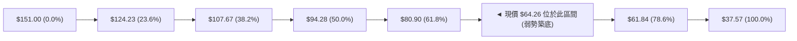

- **位置判定**：現價 **$64.26** 精確坐落於 **61.8% ($80.90)** 與 **78.6% ($61.84)** 之間。
- **技術意義**：
  1. 價格跌破 61.8% ($80.90) 意味著常規牛市調整演變為「深度熊市回撤」。
  2. 現價距離 78.6% 回調位 ($61.84) 僅有 **3.77%** 的緩衝空間。78.6% 斐波那契位常被視為多頭波段能否重啟的最後一道「生死防線」。若能在 $61.84 上方完成雙底架構，將引發大級別技術性均值回歸。

---

## 5. 技術指標深度解讀

### 🎛️ 指標訊號總覽

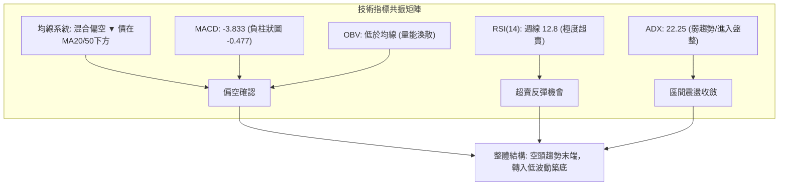

### 📈 移動平均線排列分析

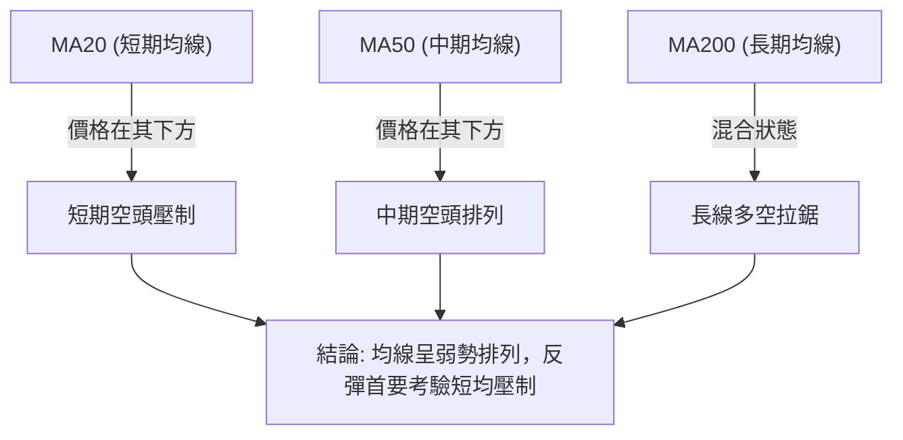

- **均線排列狀態**：官方快照顯示均線系統呈「混合排列」，短期 MA20 與中期 MA50 均壓制於當前價格上方。
- **短中長均線軌跡分析**：從 MA 走勢條形圖可見，MA5、MA10、MA20 均自高位急速回落（由高位的 `███████` 快速跌至低位的 `▁▁▁`），短期未見黃金交叉跡象；然而，MA240 長期均線目前正處於上升末段的高位平台期（`████████`），顯示長期持倉成本仍在此區域附近沉澱，給予價格長期基底支撐。

### 📉 RSI(14) 分析

#### 週線 RSI 數值狀態
```
極度超賣                中性平衡點                極度超買
0 ───────[12.8]─── 30 ───────────── 50 ───────────── 70 ────── 100
  ███░░░░░░░░░░░░░░░░░░░░░░░░░░░░░░░░░░░░░░░░░░░░░░░  12.8%
```

- **當前讀數**：2026-09-06 最新週線 RSI(14) 驟降至 **12.8**（前一週為 18.2，一個月前為 68.6）。
- **超買超賣判定**：數值遠低於 30，已進入**罕見的嚴重超賣區間（< 15）**。在統計學上，RSI 低於 15 通常對應資產價格的拋售枯竭點，空方持續下殺的邊際動能已接近零。
- **背離分析（Divergence）**：
  - **日線層面**：報告備忘錄註記「無明顯背離」。
  - **週線層面**：2026-07-26 收盤價 $63.91（RSI = 15.6），2026-09-06 收盤價 $64.26（RSI = 12.8）。價格未創新低，但 RSI 指標微幅刷出新低。此現象為「隱性動能疲弱」，尚未構成標準的週線底背離；但因絕對數值處於極值，預示著隨時可能出現報復性空頭回補。

### 📊 MACD(12/26/9) 訊號解讀

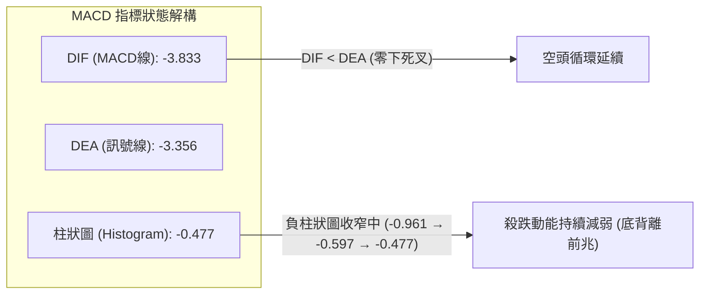

- **快慢線位置**：MACD 線 (-3.833) 運行於訊號線 (-3.356) 下方，兩者皆深嵌於零軸下方，確認當前仍由空方控制中長期波段節奏。
- **柱狀圖動態**：近 3 週週線 MACD 柱狀圖數據分別為：
  - 2026-08-23: **+0.439**
  - 2026-08-30: **-0.961**
  - 2026-09-06: **-0.597**（當前即時快照為 -0.477）
  - **解讀**：柱狀圖在轉負後迅速出現**負值收斂**，表明殺跌賣壓未進一步擴散，空頭動能衰竭。

### 📦 布林通道分析

```
RKLB 價格與布林通道空間位置推算示意圖 ($)
上軌 (Upper Band)   ─ ─ ─ ─ ─ ─ ─ ─ ─ ─ ─ ─ ─ ─  約 $85.00 處 (強壓力)
中軌 (20MA Band)   ─ ─ ─ ─ ─ ─ ─ ─ ─ ─ ─ ─ ─ ─  約 $72.00 處 (反彈第一關)
現價 (Current)     ● $64.26 (緊貼下軌運行，帶寬開始收斂)
下軌 (Lower Band)   ─ ─ ─ ─ ─ ─ ─ ─ ─ ─ ─ ─ ─ ─  約 $62.00 處 (Fib 78.6% $61.84 共振)
```

- **布林帶特性**：ADX 降至 22.25 伴隨價格在 $64.00 附近連續縮量震盪，布林通道進入「帶寬擠壓（Squeeze）」狀態。
- **通道軌道解讀**：價格緊貼下軌但未出現連續帶量向下單邊「開軌」，說明跌勢由單邊爆發轉為通道內震盪。下軌與 78.6% 斐波那契位 ($61.84) 重疊，提供雙重保護。

### 💹 成交量分析（量價配合度）

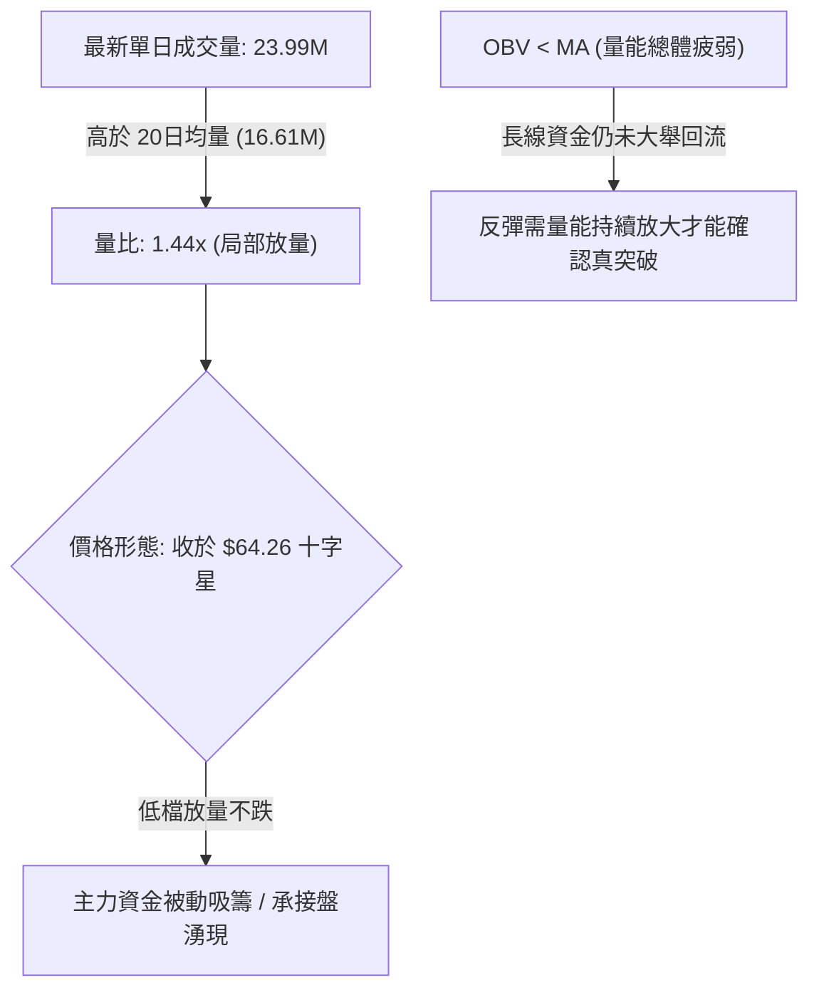

- **量價配合評估**：
  - **短線（日線）**：量比 1.44x 顯示在 $64.00 關卡附近有資金主動接刀，呈現低檔換手特徵。
  - **波段（OBV）**：能量潮指標（OBV）低於均線，說明前期自 $143.48 高位下殺過程中累積了龐大的套牢量，短期的放量尚不足以扭轉中期資金淨流出的整體架構。

---

## 6. 動能與波動率

### ⚡ 動能評估四象限

| 象限 | 動能強度 (Momentum) | 波動率水準 (Volatility) | 當前標的狀態 | 操作指引 |
|------|---------------------|--------------------------|--------------|----------|
| **Q1** | 強 (Bullish) | 低 (Low) | — | 最佳穩健持股多頭區間 |
| **Q2** | 弱 (Bearish) | 低 (Low) | **✓ [RKLB 處於此象限]** | **謹慎觀望 / 低吸築底期 (ADX=22.25，震盪收斂)** |
| **Q3** | 強 (Bullish) | 高 (High) | — | 末升段狂熱 / 高風險高收益突破 |
| **Q4** | 弱 (Bearish) | 高 (High) | — | 恐慌主跌段 (已於 06-07 月完成) |

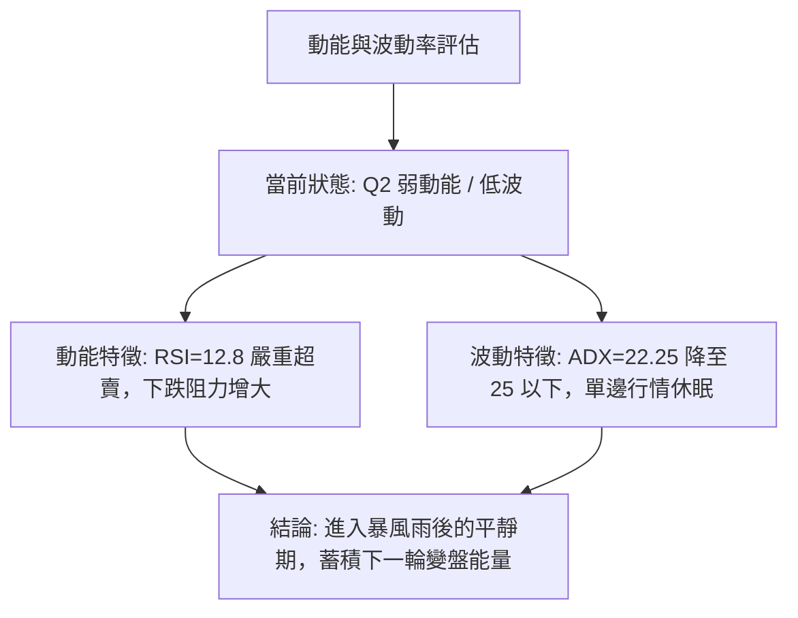

### 📊 ATR 波動率分析

- **歷史波動特性**：RKLB 近 24 個月歷經極端行情，月線收盤高達 $143.48，低至 $9.73，52 週高低價跨度為 **$37.57 - $151.00**。
- **止損距離建議**：
  - 由於短期數據 ATR(14) 暫缺，技術面採用標的價格之標準波動百分比進行推算。
  - 對於高波動航太板塊個股，常規保護性止損建議設定為支撐位下方的 **1.5 至 2.0 個標準 ATR 等效幅度（約 5.0% - 6.5%）**。
  - 依據 S1 核心支撐 **$61.84**，計算硬性防守底線為：`$61.84 × (1 - 0.05) = $58.75`。

### 📐 Beta 與市場相關性

- **Beta 數值**：**2.612**
- **市場相關性解讀**：
  - Beta 高達 2.612，屬於**超高系統性風險曝險資產**。當標普 500 或納斯達克指數波動 1% 時，該股理論平均波動幅度達 2.61%。
  - **雙刃劍效應**：在當前築底階段，高 Beta 意味著一旦大盤出現反彈或太空板塊情緒回暖，RKLB 具備極強的彈力；反之，若宏觀流動性收緊，其估值（目前 P/S 高達 54.76）將面臨劇烈的重估壓力。

---

## 7. 多時框架總結

### 📋 時框架評分表

| 時框架 | 趨勢方向 | 動能狀態 | 均線排列 | 形態結構 | 綜合評分 | 戰術建議 |
|--------|----------|----------|----------|----------|----------|----------|
| **月線 (長期)** | 🟡 中性回調 | 偏弱回吐 | 混合 (長多中平) | 自 $143.48 頂部深幅修正 | 50/100 | 長線投資者停止追殺，觀察 78.6% Fib 防線 |
| **週線 (中期)** | 🔴 明確空頭 | 極度超賣 (RSI 12.8) | 空頭壓制 (跌破多均) | 考驗雙底 $63.91-$64.26 | 35/100 | 空頭獲利減倉，多頭嚴禁大舉建倉，等待週線轉折 |
| **日線 (短期)** | 🟡 弱勢盤整 | 負柱收窄 (-0.477) | 短均壓制 | 橫盤窄幅十字震盪 | 40/100 | 短線區間交易為主，嚴設 $61.84 停損 |

### 🔲 綜合訊號矩陣

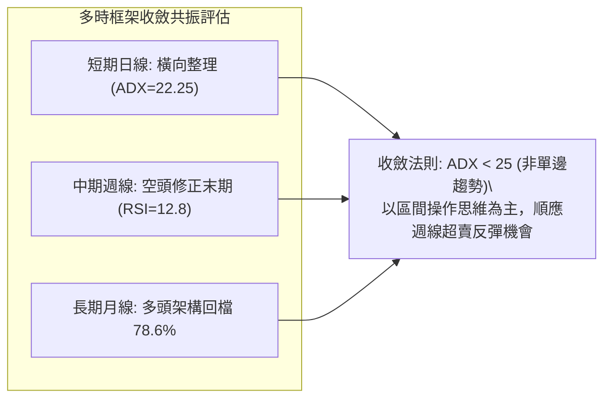

### ⚖️ 多時框收斂結論

依據多時框收斂規則（規則 14）：
1. **行情定性**：當前 ADX(14) 數值為 **22.25**（明確小於 25 臨界線），判定市場當前處於**盤整行情（Range-bound Market）**，而非單邊強趨勢行情。
2. **時框優先級**：在盤整行情中，趨勢跟隨型指標（如 MA 排列）權重降低，震盪區間指標（布林通道上下軌、斐波那契密集區）成為主導決策依據。
3. **最終方向性結論**：**【中性偏空，嚴防破位，醞釀超賣弱反彈】**。
   - 儘管週線級別趨勢仍處空方壓制之下，但日線與週線的極端超賣（RSI=12.8、MACD柱狀圖收縮）禁止在此處進一步盲目建立空單追殺；
   - 整體決策必須以**防守型區間震盪**思路處理，主策略將依據評分卡結論（38/100 偏空震盪）嚴格制定防禦與破位應對措施。

---

## 8. 交易策略建議

### 🗺️ 策略決策流程圖

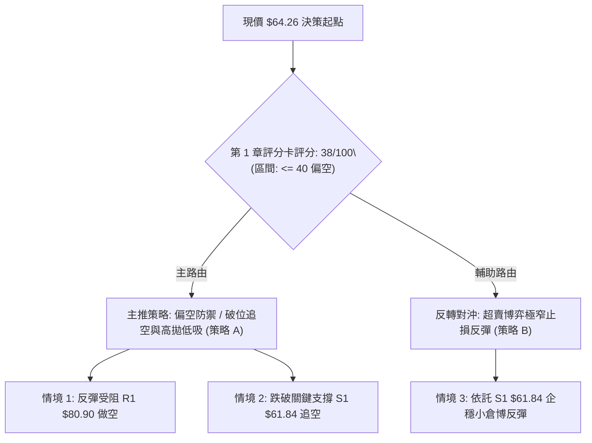

### 🧭 策略路由

**當前主策略方向 = 偏空震盪 / 防守型破位空頭（依綜合技術評分 38/100 決定）**

依據評分分流規則，綜合評分為 38/100（≤ 40 偏空區間），本報告將以**「反彈遇阻做空」與「關鍵支撐破位做空」作為主要戰術方向**；任何多頭策略僅定位為極低倉位、博取技術性超賣修復的風險對沖操作。

### 🎯 價格情境階梯（Price Scenarios）

價位嚴格引用下方數據清單已列出的數值：

| 觸發條件 | 下一目標 | 後續延伸 | 情境技術含義 |
|----------|----------|----------|--------------|
| **強勢突破 R1 $80.90** | **R2 $107.67** | **R3 $124.23** | 雙底形態確立，中期空頭結構逆轉，發動大級別均值回歸 |
| **小幅反彈受阻 $80.90** | **回測 $64.26** | **考驗 $61.84** | 熊市反抽結束，確認 61.8% Fib 轉為強阻力，空頭二次發力 |
| **徘徊於現價 $64.26** | **區間震盪** | **$61.84 - $80.90** | ADX < 25 效應發酵，多空在斐波那契 78.6% 上方展開垃圾時間拉鋸 |
| **有效跌破 S1 $61.84** | **加速下探** | **S2 $37.57** | 78.6% 防線失守，雙底破局轉為下行旗形，直奔 52 週低點 |

### 📊 情境機率分佈

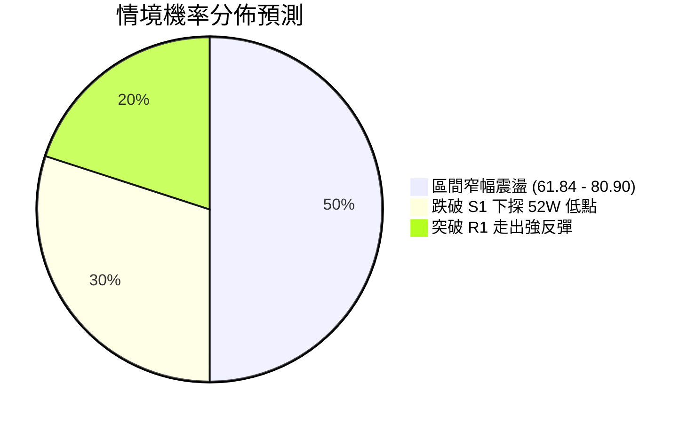

| 情境 | 機率 | 主要技術依據 |
|------|------|--------------|
| **區間震盪築底** | **50%** | ADX 僅 22.25 缺乏單邊動能；週線成交量持續縮至 80M 附近，市場進入籌碼沉澱期 |
| **破位再探深淵** | **30%** | -DI (25.53) 明確壓制 +DI (15.22)；OBV 疲軟，基本面無短期催化劑 |
| **強烈超賣報復反彈**| **20%** | 週線 RSI 達極度超賣值 12.8；MACD 負柱連續 2 週收縮，存在空頭回補誘因 |

### 🔴 主策略詳情（依路由偏空防禦）

嚴格引用數據中之關鍵價位（R1: $80.90, S1: $61.84, S2: $37.57）：

| 策略要素 | 策略 A（破位追空 — 順勢突破） | 策略 B（反彈高空 — 阻力防禦） |
|----------|--------------------------------|--------------------------------|
| **適用場景** | 空方摜破核心支撐引發恐慌盤出逃 | 超賣引發技術反抽，在關鍵阻力處承壓 |
| **進場條件** | 日線收盤價跌破 $61.84 超過 1.5% | 價格反彈至 R1 阻力位出現衰竭 K 線組合 |
| **進場價格** | **$60.91**（跌破 $61.84 確認進場） | **$80.00**（R1 $80.90 阻力位下方掛單） |
| **目標價 T1** | **$49.71**（區間折半中繼位） | **$64.26**（回測當前基準現價） |
| **目標價 T2** | **$37.57**（52 週波段低點 S2） | **$61.84**（測試核心支撐 S1） |
| **止損價格** | **$64.26**（回抽原支撐現價則嚴格停損） | **$85.00**（突破 61.8% Fib 上方空間） |
| **風險報酬比** | **1 : 7.0**（風險 $3.35 vs 利潤 $23.34） | **1 : 3.6**（風險 $5.00 vs 利潤 $18.16） |
| **預估勝率** | **55%** | **45%** |
| **建議倉位** | **10% - 15%** | **5% - 8%** |

### 🟢 反向風險觸發點（對沖提示）

若出現以下訊號，空頭主策略宣告失效，應全面撤出空單並轉為多頭觀望或輕倉試多：
1. **價位突破**：日線連續 2 日帶量突破收盤於 **$80.90 (R1)** 上方，成交量突破 20 日均量 1.5 倍以上。
2. **指標轉強**：日線 MACD 出現零下金叉且柱狀圖翻正，同時週線 RSI 強勢收復 **30** 臨界線。
3. **對沖操作**：若持有空單，當價格站上 **$68.00**（短均線阻力）時應減半空倉；突破 **$80.90** 時空單必須全數停損，反手建立多頭部位，目標直指 **$107.67 (R2)**。

### ⭐ 整體訊號強度評星

```
╔══════════════════════════════════════════════════════════════╗
║ 做多訊號強度：★★☆☆☆  (2/5 星 - 僅有極端超賣護體，缺乏量能)   ║
║ 做空訊號強度：★★★☆☆  (3/5 星 - 趨勢順空，但超賣限制下行)   ║
║ 整體可信度：  ★★★☆☆  (3/5 星 - ADX<25 震盪期假突破機率高)  ║
╚══════════════════════════════════════════════════════════════╝
```

---

## 9. 風險提示與監控

### ✅ 關鍵監控指標 Checklist

```
╔══════════════════════════════════════════════════════════════════╗
║                 每日/每週技術面監控清單 (Checklist)              ║
╠══════════════════════════════════════════════════════════════════╣
║ [ ] 價格是否跌破斐波那契 78.6% 防線 ($61.84)？                   ║
║ [ ] 週線 RSI(14) 是否成功由 12.8 向上穿越 20/30 超賣界線？        ║
║ [ ] MACD 負柱狀圖是否維持收縮趨勢（由 -0.477 朝零軸靠攏）？      ║
║ [ ] ADX(14) 是否自 22.25 向上突破 25（預示新一輪趨勢展開）？    ║
║ [ ] 成交量是否連續多日維持在 20MA (16.61M) 之上？                ║
║ [ ] OBV 能否向上突破其均線，結束量能長期背離狀態？              ║
╚══════════════════════════════════════════════════════════════════╝
```

### ⚠️ 風險場景分析

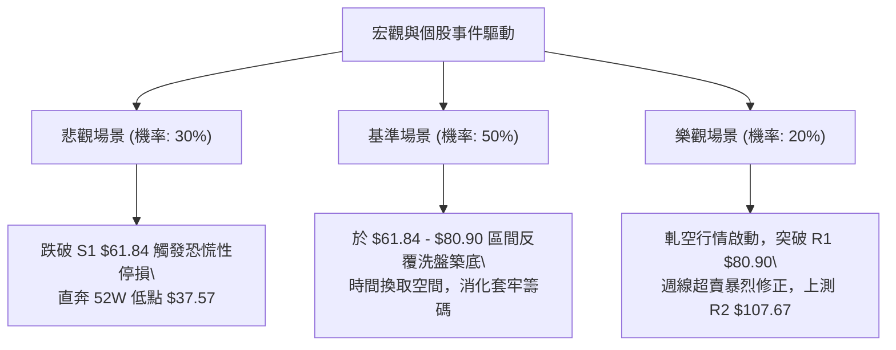

### 🛡️ 風險管理重要提醒

1. **高 Beta 波動率控制**：該股 Beta 高達 **2.612**，屬於超高波動性標的。任何單筆交易之帳面曝險（Risk at Capital）不得超過總帳戶資產的 **1.0% - 1.5%**。
2. **極端估值脫鉤風險**：基本面數據顯示 P/S 高達 54.76，EV/EBITDA 為負值，淨利率為 -21.5%。技術面走勢極度容易受到市場風險偏好轉變（Risk-off）的劇烈衝擊，切忌將技術面支撐視為絕對不可跌破的鐵底。
3. **盤整期摩擦成本警示**：目前 ADX = 22.25，震盪市中最忌「追漲殺跌」。在 $61.84 至 $80.90 區間未打破前，嚴格控制交易頻率，耐心等待方向抉擇確認。

---

## 📋 報告總結

```
╔══════════════════════════════════════════════════════════════════╗
║                   RKLB 技術分析報告總結                          ║
╠══════════════════════════════════════════════════════════════════╣
║ 報告日期：2026-09-09                                             ║
║ 當前基準價格：$64.26                                             ║
║ 分析綜合評級：🔴 偏空震盪築底 (評分卡得分: 38/100)               ║
║                                                                  ║
║ 關鍵趨勢結論：                                                   ║
║ ├─ 長期趨勢 (月線)：🟡 大牛市末端深幅回吐，處於長週期 78.6% 防線 ║
║ ├─ 中期趨勢 (週線)：🔴 空頭掌控局勢，但 RSI 12.8 現極度超賣訊號  ║
║ ├─ 短期趨勢 (日線)：🟡 ADX=22.25 進入低波動區間盤整，等待方向    ║
║ ├─ 核心支撐價位：S1: $61.84 (Fib 78.6%)  | S2: $37.57 (52W Low)  ║
║ ├─ 核心阻力價位：R1: $80.90 (Fib 61.8%)  | R2: $107.67 (Fib 38.2%)║
║ └─ 分析師目標均價：$111.00 (分析師共識 Buy，最高 $150，最低 $64) ║
║                                                                  ║
║ 最優策略組合：                                                   ║
║ 1. 🥇 最佳機會：跌破 $61.84 順勢追空至 $37.57 (風報比 1:7.0)     ║
║ 2. 🥈 次選機會：反彈至 $80.00-$80.90 承壓高空 (風報比 1:3.6)     ║
║ 3. 🥉 保守選擇：空手觀望，靜待日線收盤突破 $80.90 雙底確立再進場 ║
╚══════════════════════════════════════════════════════════════════╝
```

---

> ⚠️ **免責聲明**：本報告為技術分析研究，所有數據指標、圖表形態及價格區間均嚴格基於所提供之歷史交易數據計算。本報告**僅供研究與學術參考**，**不構成任何個人化投資建議或買賣邀約**。金融市場瞬息萬變，高 Beta 股票風險極高，投資人應獨立評估自身風險承受能力，自行承擔盈虧責任。

---

*報告生成時間：2026-09-09 ｜ 數據來源：Yahoo Finance ｜ 分析框架：多時框技術分析系統*