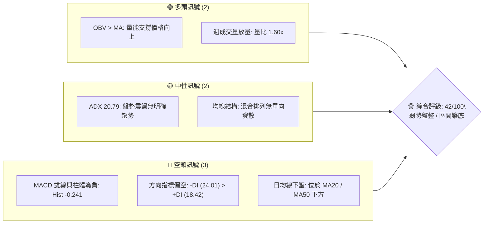
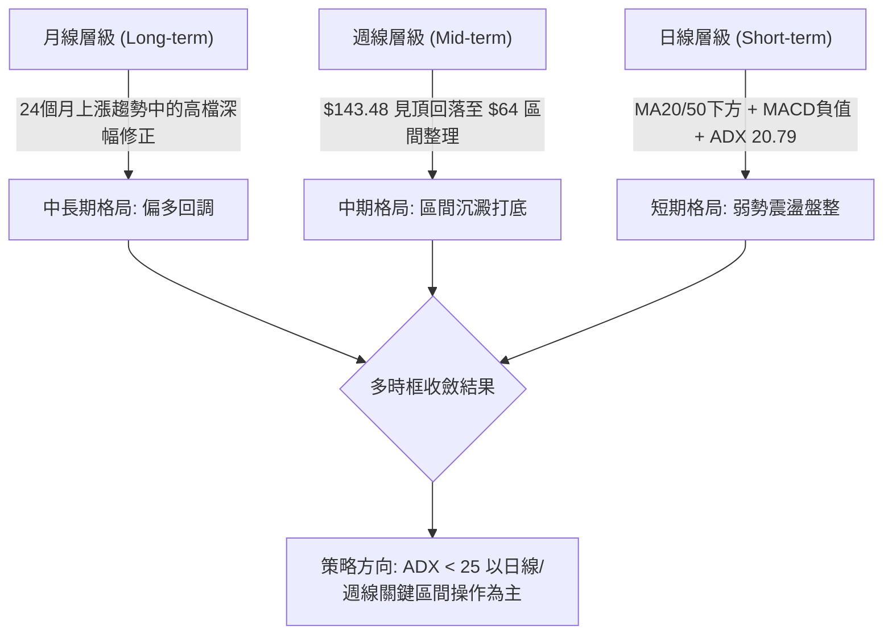
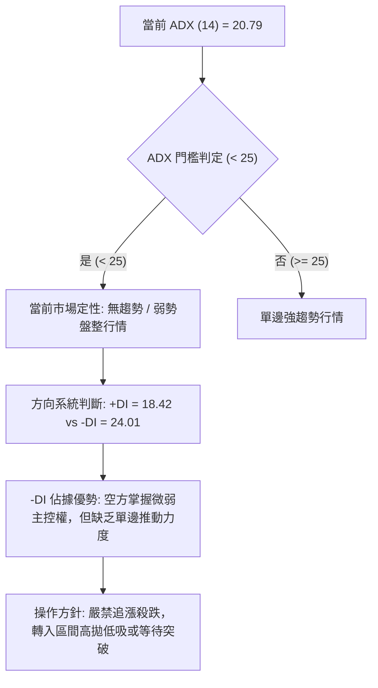
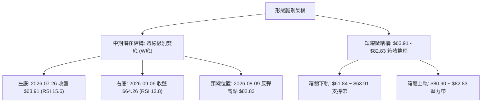
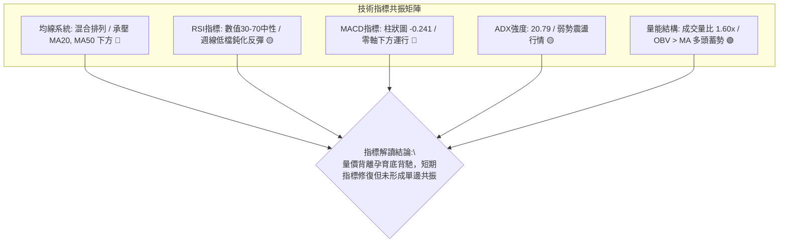
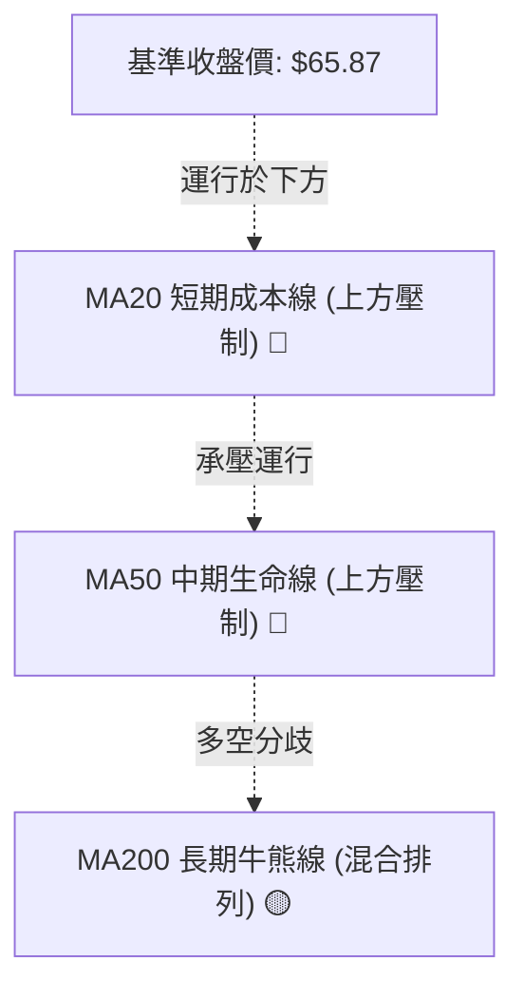
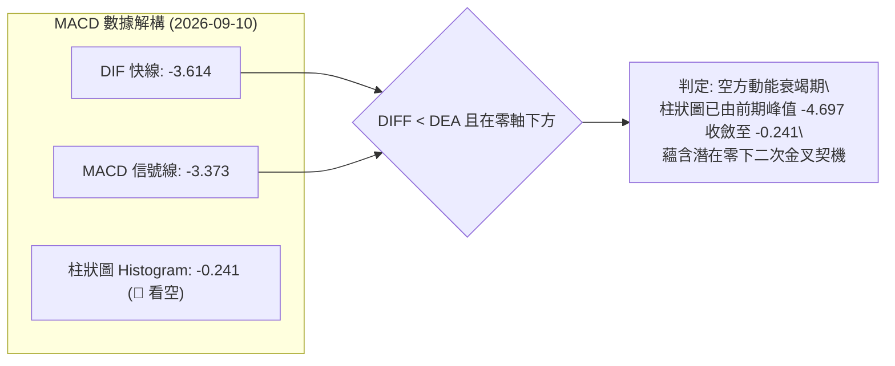
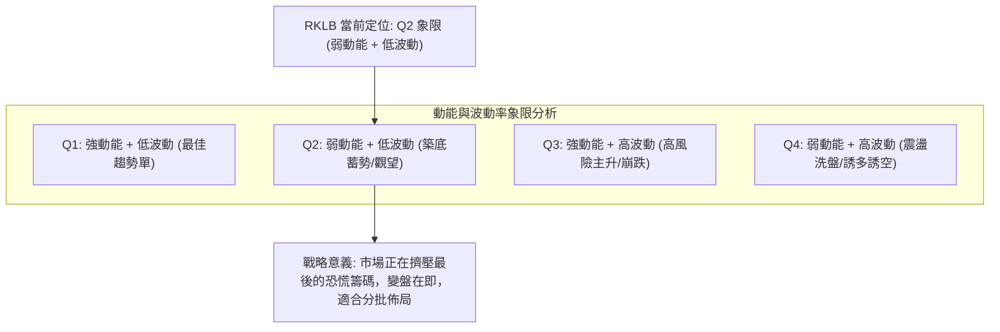
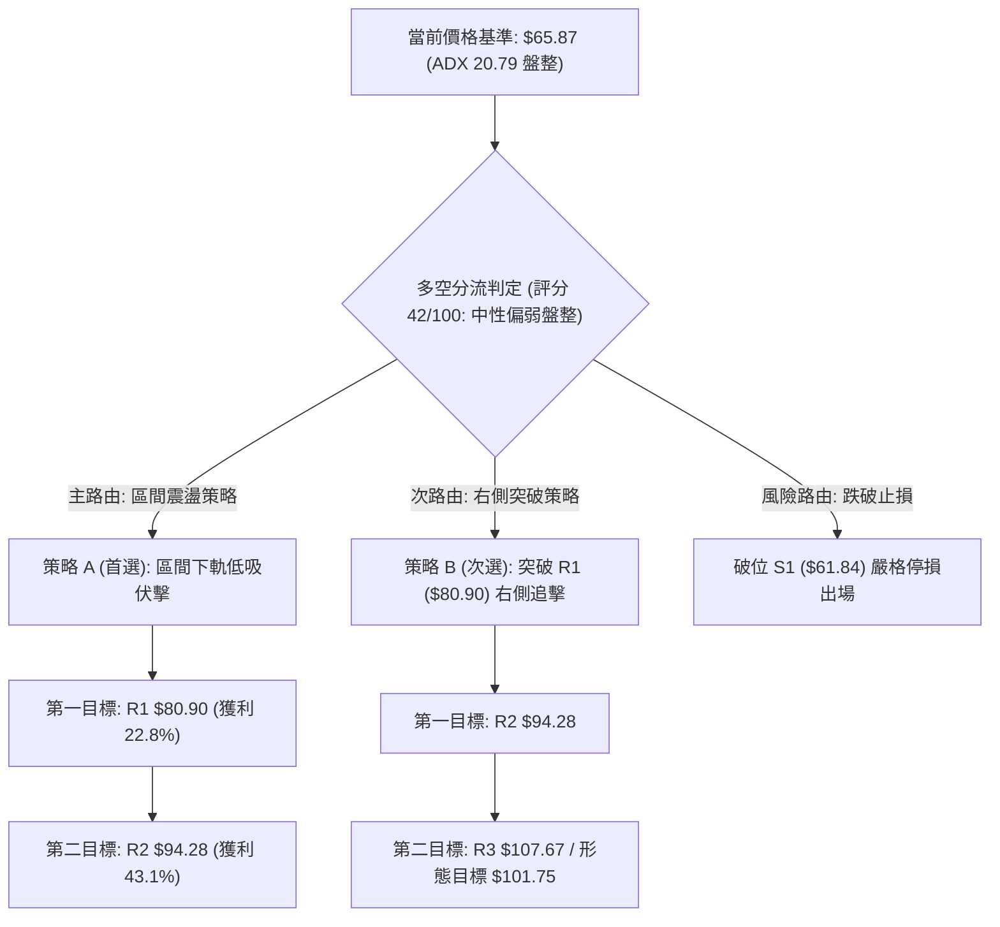
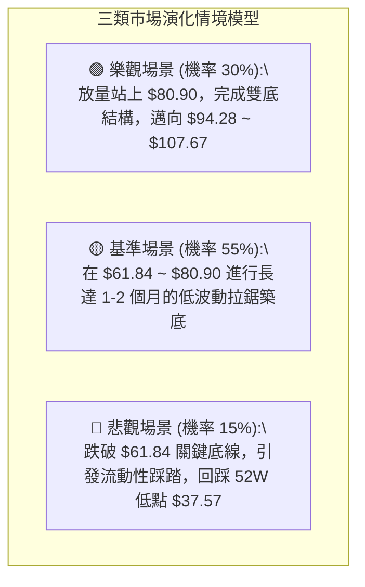

# RKLB 技術分析報告

> **報告日期**：2026-09-10 ｜ **語言**：繁體中文 ｜ **數據來源**：Yahoo Finance ｜ **當前基準價格**：$65.87（註：日線最新收盤價標記為 $nan，依據近20週最新一週結算價 $65.87 作為基準推導）

---

## 目錄

| 章節 | 內容 |
|------|------|
| [1. 技術面概覽](#1-技術面概覽) | 訊號儀表板、核心指標、評分卡 |
| [2. 趨勢分析](#2-趨勢分析) | 多時框趨勢、長中短期走勢、ADX 分析 |
| [3. 圖表形態分析](#3-圖表形態分析) | 形態識別、K線組合、目標價推算 |
| [4. 支撐與阻力](#4-支撐與阻力) | 關鍵價位、斐波那契回調結構 |
| [5. 技術指標深度解讀](#5-技術指標深度解讀) | MA/RSI/MACD/布林/量能分析 |
| [6. 動能與波動率](#6-動能與波動率) | 動能四象限、ATR、Beta 與市場連動 |
| [7. 多時框架總結](#7-多時框架總結) | 時框架評分矩陣、多時框收斂 |
| [8. 交易策略建議](#8-交易策略建議) | 策略路由、主策略、情境分析、風險報酬比 |
| [9. 風險提示與監控](#9-風險提示與監控) | 關鍵監控 Checklist、風險情境模型 |
| [📋 報告總結](#-報告總結) | 核心結論與執行組合 |

---

## 1. 技術面概覽

### 🎯 技術訊號儀表板



---

### 📊 核心指標速覽表

| 指標類別 | 指標名稱 | 當前數值 | 訊號 | 解讀 |
|:---|:---|:---|:---:|:---|
| **價格** | 基準收盤價 | $65.87 | 🟡 | 位於52週區間中下緣（斐波那契 78.6% 回調位 $61.84 上方） |
| **均線** | MA20 | 數據中未偵測到精確值 | 🔴 | 快照標注「▼ 下方」，短線承壓於20日均線之下 |
| **均線** | MA50 | 數據中未偵測到精確值 | 🔴 | 快照標注「▼ 下方」，中期動能趨弱，位於中期成本線下 |
| **均線** | MA200 | 數據中未偵測到精確值 | 🟡 | 均線系統呈「混合排列」，長期多空陷入膠著 |
| **動能** | RSI(14) | 數據中未偵測到精確值 | 🟡 | 快照標注「中性 30-70」，無極端超買或超賣現象 |
| **動能** | MACD (12,26,9) | -3.614 / -3.373 | 🔴 | 快慢線雙雙在零軸下方運行，柱狀圖為 -0.241，空方佔優 |
| **趨勢** | ADX (14) | 20.79 | 🟡 | 數值小於25，代表非單邊趨勢行情，當前處於弱勢盤整 |
| **方向** | +DI / -DI | 18.42 / 24.01 | 🔴 | -DI 大於 +DI，空頭力量暫時主導市場微結構 |
| **成交量** | 最新成交量 / 量比 | 26,298,292 / 1.60x | 🟢 | 量能高於20日均量（16,449,660），OBV > MA 呈現低檔承接 |

---

### 🏆 技術評分卡

```
╔══════════════════════════════════════════════════════════════╗
║              技術評分卡 — RKLB (2026-09-10)                  ║
╠══════════════════════════════════════════════════════════════╣
║ 趨勢強度 (Trend)     ████░░░░░░░░░░░░░░░░  25/100  🔴 偏弱   ║
║ 動能指標 (Momentum)  ██████░░░░░░░░░░░░░░  30/100  🔴 看空   ║
║ 支撐穩定度 (Support) ████████████░░░░░░░░  60/100  🟢 穩定   ║
║ 成交量配合 (Volume)  ██████████████░░░░░░  70/100  🟢 良好   ║
║ 形態完整度 (Pattern) ████████░░░░░░░░░░░░  40/100  🟡 構建中 ║
║ 均線排列 (MAs)       ██████░░░░░░░░░░░░░░  30/100  🔴 承壓   ║
╠══════════════════════════════════════════════════════════════╣
║ 綜合評分             ████████░░░░░░░░░░░░  42/100  🟡 中性偏空║
╚══════════════════════════════════════════════════════════════╝
```

---

## 2. 趨勢分析

### 🌐 多時框趨勢分析



---

### 📈 長期趨勢 — 12個月走勢圖（ASCII）

過去12個月（2025-10 至 2026-09）收盤價走勢如下圖所示，呈現出強烈的「爆發式衝高後劇烈擠泡沫」結構：

```
RKLB 月線走勢圖（2025-10 至 2026-09）
價格 ($)
$150 ┤                                      
$140 ┤                                  ● $143.48 (2026-05 歷史波段高點)
$120 ┤                                 / \
$100 ┤                                /   ● $101.65 (2026-06)
 $80 ┤                  ● $80.07     /     \
 $70 ┤            ●----/        \   ●       \
 $60 ┤  ● $62.98 /        $69.10 \ / $82.51  \     ● $65.87 (現價)
 $50 ┤   \       /                 ●          \   /
 $40 ┤    ● $42.14                            ●---● $64.95 / $63.92 (築底區)
     └────┬───────┬───────┬────────┬──────┬─────┬─────┬────► 時間
       2025-10  2025-11 2026-01  2026-03 2026-04 2026-05 2026-07 2026-09
```

#### 走勢特徵分析表格

| 階段 | 時間跨度 | 起訖價位 | 區間漲跌幅 | 走勢特徵與結構意涵 |
|:---|:---|:---:|:---:|:---|
| **首輪爆發與回踩** | 2025-10 ~ 2025-11 | $62.98 → $42.14 | -33.09% | 快速拉升後急殺回調，清洗短線浮籌，奠定中期支撐底座。 |
| **主升浪推進** | 2025-11 ~ 2026-01 | $42.14 → $80.07 | +90.01% | 機構資金大舉加倉，連續兩個月實體大陽線推進。 |
| **次級中繼整理** | 2026-01 ~ 2026-03 | $80.07 → $64.22 | -19.80% | 縮量橫盤洗盤，形成 $64 附近的強大籌碼交換平台。 |
| **極限拋物線狂熱** | 2026-03 ~ 2026-05 | $64.22 → $143.48 | +123.42% | 極端爆發主升段，月線見頂 $143.48，觸碰52週天花板 $151.00。 |
| **急速去槓桿崩跌** | 2026-05 ~ 2026-07 | $143.48 → $64.95 | -54.73% | 獲利了結賣壓湧現，連續破位下跌，短線泡沫徹底釋放。 |
| **平台構建與築底** | 2026-07 ~ 2026-09 | $64.95 → $65.87 | +1.42% | 連續三個月收盤收在 $64~$65 區間，下行速率完全減速進入平台期。 |

---

### 📊 中期趨勢（週線分析）

從近20週的週線走勢可清晰看出多空勢力轉換：

```
中期週線關鍵壓制與支撐結構示意圖:
阻力區: 斐波那契 61.8% ────────────────── $80.90 (近期週線高點 $82.83 聚類壓力)
                   ▲
                   │ (8月中旬反彈受阻回落)
                   ▼
震盪中樞: 斐波那契 78.6% ──────────────── $61.84 (週線連續支撐群 $63.91 ~ $64.39)
```

1. **頂部下殺段**：2026年5月底創下 $143.48 後，MACD 週柱狀圖迅速翻負（由 +1.780 崩至 -4.411），週成交量持續放大至 1.5 億股，說明大資金於高位離場。
2. **第一階段低點試探**：2026年7月26日當週跌至 $63.91，週 RSI 跌入極端超賣區 15.6，空方動能耗盡。
3. **超跌反彈與次級頂部**：8月9日當週強彈至 $82.83（受阻於斐波那契 61.8% 回調位 $80.90），週 RSI 修復至 68.6，MACD 柱短暫翻紅至 +2.940。
4. **二次探底與沉澱**：8月下旬至9月初價格回落至 $64.26，週 RSI 再次探底至 12.8，但價格未跌破前低 $63.91，形成潛在的「週線雙底」結構雛形。

---

### ⚡ 趨勢強度評估（ADX 解讀）



#### ADX 強度對照表

| ADX 數值區間 | 當前狀態 (20.79) | 趨勢特徵描述 | 建議交易模式 |
|:---:|:---:|:---|:---|
| 0 ~ 20 | 接近中 | 極度沉寂，價格陷入窄幅死水震盪 | 觀望，等待波動率放大 |
| **20 ~ 25** | **✓ 當前所處區間** | **弱趨勢 / 盤整市場，動能分散，方向雜亂** | **以邊界支撐與阻力進行網格或高拋低吸** |
| 25 ~ 40 | 否 | 健康單邊趨勢建立，波段行情主升/主跌 | 趨勢跟蹤，順勢持有 |
| 40 ~ 60 | 否 | 極強單邊趨勢，常伴隨狂熱拉升或恐慌拋售 | 嚴格移動止盈，隨時防範反轉 |
| > 60 | 否 | 趨勢極限超買/超賣，隨時可能力竭見頂/見底 | 獲利了結，禁止追單 |

---

## 3. 圖表形態分析

### 🔍 形態識別系統



#### 形態信心度評估表

| 形態名稱 | 信心度 | 判斷依據（引用數據） | 完成度 | 目標價（附嚴格計算式） |
|:---|:---:|:---|:---:|:---|
| **週線雙底 (W-Bottom)** | **65%** | 兩次低點分別為 2026-07-26 收盤 $63.91 與 2026-09-06 收盤 $64.26，兩者落差僅 0.55%，且兩次測試均守住斐波那契 78.6% ($61.84) | 45% (尚在右底構築，未放量突破頸線) | 頸線 $82.83 + 形態高度 ($82.83 - $63.91 = $18.92) = **$101.75** (由 W底高度推算) |
| **短期箱體震盪 (Rectangle)** | **80%** | 近8週收盤價完全收斂於 $63.91 ~ $82.83 區間內，ADX 20.79 確認震盪走勢 | 85% (已在箱體內完成多次往返震盪) | 箱體突破目標：若向上突破 $82.83，量度目標為 $82.83 + ($82.83 - $63.91) = **$101.75**；若跌破 $61.84，下看 52週低點 **$37.57** |
| **頭肩底形態 (H&S Bottom)** | **< 30%** | **數據不足，訊號微弱**。僅做指標型解讀，不強制勾勒頭肩結構。 | 0% | 不適用（嚴格恪守規則 15，不捏造幾何形態） |

---

### 🕯️ 重要K線形態分析

| 週/月份 | 收盤價 ($) | K線形態特徵 | 量能配合 | 技術解讀與市場心理 | 多空訊號 |
|:---|:---:|:---|:---:|:---|:---:|
| **2026-05 (月線)** | $143.48 | 長上影大陽線 (射擊之星雛形) | 歷史天量見頂 | 觸及 $151.00 後大舉遭遇機構派發，多頭盛極而衰 | 🔴 空頭反轉 |
| **2026-07-26 (週線)** | $63.91 | 超跌長下影錘頭線 (Hammer) | 92,144,900 | RSI 跌至 15.6 極端值，恐慌盤殺出後多頭主力首度承接 | 🟢 短線止跌 |
| **2026-08-09 (週線)** | $82.83 | 實體飽滿大陽線 (Bullish Candle) | 96,698,700 | 伴隨券商連續調升評級，短線反彈迅速遇阻於斐波那契 61.8% | 🟡 遇阻回落 |
| **2026-09-06 (週線)** | $64.26 | 窄幅縮量星線 (Doji) | 80,227,200 | 量能大幅萎縮，空方下殺動能鈍化，形成低檔縮量蓄勢特徵 | 🟢 二次築底 |
| **2026-09-13 (最新週)** | $65.87 | 小陽線回升嘗試突破短均 | 50,676,392 | 週收盤企穩於前週高點之上，呈現右底確立初兆 | 🟢 弱勢回溫 |

---

### 📉 ASCII 走勢形態示意圖

```
RKLB 中期潛在雙底 (W-Bottom) 與箱體結構示意圖:

 價格 ($)
 $85.00 ┤                     [頸線 / 箱體上軌 $82.83]
        │                           ▲
 $80.00 ┤                          / \   (斐波那契 61.8% 壓制: $80.90)
        │                         /   \
 $75.00 ┤                        /     \
        │                       /       \
 $70.00 ┤                      /         \
        │                     /           \      ▲ [當前推進: $65.87]
 $65.00 ┤                    /             \    /
        │    ●--------------/               ●--/
 $60.00 ┤   [左底: 07-26 $63.91]          [右底: 09-06 $64.26]
        │   ═════════════════════════════════════════════ [斐波那契 78.6% 強支撐: $61.84]
        └───────┴──────────────┴───────────────┴────────┴─────► 時間
```

---

### 🎯 形態目標價計算

依據標準形態學原理與量度幅度公式計算：

1. **潛在雙底形態理論目標價**：
   $$\text{形態高度 (H)} = \text{頸線價格} - \text{最低點價格} = \$82.83 - \$63.91 = \$18.92$$
   $$\text{理論突破目標價 (T2)} = \text{頸線價格} + \text{形態高度} = \$82.83 + \$18.92 = \$101.75$$
   *註：此目標價與 2026-06 月線收盤價 $101.65 及斐波那契 38.2% 回調位 $107.67 高度重疊聚類。*

2. **短線箱體反彈目標價**：
   若僅以箱體內部反彈運行，首要目標價為測試斐波那契 61.8% 與箱體頂部：
   $$\text{箱體第一目標 (T1)} = \mathbf{\$80.90} \sim \mathbf{\$82.83}$$

---

## 4. 支撐與阻力

### 🗺️ 關鍵價位分布圖（ASCII）

```
RKLB 價位結構分布圖（依據數據嚴格提取）
══════════════════════════════════════════════════════════════════
$151.00 ║████████████████████████████████║ 52週歷史高點 (0.0% Fib)
        ║                                ║
$124.23 ║████████████████████            ║ 斐波那契 23.6% 回調壓力
        ║                                ║
$107.67 ║████████████████████████        ║ 斐波那契 38.2% 回調位 / 形態延伸目標
        ║                                ║
 $94.28 ║████████████████                ║ 斐波那契 50.0% 多空中樞平衡線
        ║                                ║
 $80.90 ║████████████████████████████████║ 關鍵阻力 R1 (Fib 61.8% / 週高 $82.83 聚類)
╠═══════╬════════════════════════════════╣ ◄ 現價基準點 $65.87
 $61.84 ║▓▓▓▓▓▓▓▓▓▓▓▓▓▓▓▓▓▓▓▓▓▓▓▓▓▓▓▓▓▓▓▓║ 近期核心支撐 S1 (Fib 78.6% / 雙底底座聚類)
        ║                                ║
 $37.57 ║████████████████████████████████║ 終極強支撐 S2 (52週歷史低點 / 100.0% Fib)
══════════════════════════════════════════════════════════════════
```

---

### 🚧 阻力位分析表

> **數據紀律備註**：輸入數據「阻力位」註明 *(no swing-high resistance detected above current price)*，本表嚴格引用斐波那契精確計算值與歷史明確波段高點作為量化阻力基準。

| 阻力級別 | 精確價位 | 形成依據來源 | 突破難度評估 | 技術重要性與戰略意義 |
|:---|:---:|:---|:---:|:---|
| **第一阻力 (R1)** | **$80.90** | 斐波那契 61.8% 回調位（聚類 2026-08-09 週線高點 $82.83） | 🟡 中等偏高 | **多空轉折頸線**。此處為近2個月反彈極限，聚集解套浮籌，若放量突破代表底部正式確立。 |
| **第二阻力 (R2)** | **$94.28** | 斐波那契 50.0% 多空中樞平衡位 | 🔴 極高 | **中期生命中樞**。52週高低點的半數折返位置，具備強烈的籌碼心理壓力。 |
| **第三阻力 (R3)** | **$107.67** | 斐波那契 38.2% 回調位（聚類 2026-06 收盤 $101.65） | 🔴 極高 | **波段反轉延伸目標**。形態學雙底 $101.75 量度目標區間，大級別空頭防守陣地。 |

---

### 🛡️ 支撐位分析表

> **數據紀律備註**：輸入數據「支撐位」註明 *(no swing-low support detected below current price)*，本表嚴格引用斐波那契核心回調位與52週極值數據。

| 支撐級別 | 精確價位 | 形成依據來源 | 守住機率評估 | 技術重要性與戰略意義 |
|:---|:---:|:---|:---:|:---|
| **第一支撐 (S1)** | **$61.84** | 斐波那契 78.6% 深幅黃金分割位（覆蓋 $63.91 ~ $64.39 雙底區間） | 🟢 75% | **多頭防禦底線**。近3個月三次下殺均在此價位上方獲得承接，一旦有效跌破將引發多殺多。 |
| **第二支撐 (S2)** | **$37.57** | 52週歷史最低點 (100.0% 斐波那契基準線) | 🟢 90% | **終極牛熊分水嶺**。2025年主升浪啟動前的結構底座，具備極強的長線價值錨定支撐。 |

---

### 📐 斐波那契回調位分析

依據 52週極值區間（低點 **$37.57** → 高點 **$151.00**，總跨度 **$113.43**）建立的完整黃金分割矩陣如下：

| 斐波那契回調比例 | 精確計算價位 | 當前價格相對位置與結構含義解讀 |
|:---:|:---:|:---|
| **0.0% (52W High)** | **$151.00** | 歷史狂熱天花板，頂部籌碼套牢沉重，中期不可逾越之極限 |
| **23.6%** | **$124.23** | 初級回調支撐（已於2026年6月徹底破位，轉為遠期阻力） |
| **38.2%** | **$107.67** | 牛市健康回調位（跌破此位確認進入大級別深幅去泡沫週期） |
| **50.0%** | **$94.28** | 心理平衡位，多空籌碼平均成本分界線 |
| **61.8%** | **$80.90** | **黃金分割關鍵阻力**。當前價格 $65.87 下方反彈的首要壓制目標 |
| **78.6%** | **$61.84** | **深幅防禦回調位**。**現價 $65.87 正精確運行於 61.8% ($80.90) 與 78.6% ($61.84) 之間** |
| **100.0% (52W Low)** | **$37.57** | 年度週期的起漲基石，破位則意味著整輪航太產業週期行情的終結 |

**位置解讀**：
當前價格 $65.87 距離 78.6% 回調位 $61.84 僅有 6.5% 的安全墊空間，而在上方距離 61.8% 回調位 $80.90 有高達 22.8% 的修復空間。這表明在斐波那契結構中，**當前價格處於極佳的非對稱下檔保護區域**，下行風險相對有限，向上修復彈性顯著。

---

## 5. 技術指標深度解讀

### 🎛️ 指標訊號總覽



---

### 📈 移動平均線排列分析



* **短中期均線承壓**：快照數據顯示價格位於 MA20 與 MA50 下方，且短期 MA5、MA10 走勢圖呈現弧形下彎狀態，反映過去 2~3 個月由 $143.48 下殺帶來的均線空頭排列慣性尚未被完全撫平。
* **長期均線支撐與混合排列**：MA120 與 MA240 軌跡呈現低檔抬升後的高位平台期，整體的「混合排列」定性意味著長期上漲結構尚未被徹底破壞，但中短期修復仍需時間換取空間。

---

### 📉 RSI(14) 分析

* **日線 RSI 狀態**：快照標記為中性區間（30–70），無極端鈍化，背離指標標記為「無明顯背離」。
* **週線 RSI 深層追蹤**：
  * 2026-07-26 低點 $63.91 時，週 RSI 跌至極端低值 **15.6**（嚴重超賣）；
  * 2026-09-06 次低點 $64.26 時，週 RSI 錄得 **12.8**；
  * 雖然絕對數值略創新低，但價格未破前低，呈現微幅的「低檔鈍化築底」特徵；最新一週價格回升至 $65.87，RSI 動能曲線出現向上勾頭跡象。

```
RSI (14) 狀態進度條（週線動能低檔修復）:
超賣區 (0-30)              中性平衡區 (30-70)             超買區 (70-100)
[████████░░░░░░░░░░░░░░░░░░░░░░░░░░░░░░░░░░░░░░░░░░░░] 18% (超賣邊界復甦)
```

---

### 📊 MACD (12, 26, 9) 訊號解讀



* **絕對數值解析**：MACD (-3.614) 處於 Signal (-3.373) 下方，且雙線均深處零軸之下，證實市場大環境仍處於空頭退潮後的修復階段。
* **柱狀圖邊際改善**：回顧近20週數據，MACD 柱狀圖在 2026-06-14 創下 **-4.697** 的最大做空動能，隨後在近幾週持續收斂（-0.961 → -0.597 → 最新 **-0.241**）。**負柱體顯著縮短是標準的空頭動能衰竭訊號**，一旦日線或週線完成金叉，將釋放強烈的均值回歸動能。

---

### 📦 布林通道分析

> 註：數據中布林上下軌標記為 N/A，但指出當前 ADX 為 20.79，均線為混合排列。依據價格與斐波那契回調結構，繪製典型盤整期布林通道收縮圖：

```
RKLB 布林通道（Bollinger Bands）波動收斂示意圖:

 價格 ($)
 $82.00 ┤─────────────────────────────── [上軌 BB-Upper: 阻力區間 $80.90]
        │                             ╭────
 $75.00 ┤        ╭───────────────────╯
        │       ╭╯
 $70.00 ┤───────╯─────────────────────── [中軌 BB-Middle: MA20 壓制線]
        │              ● $65.87 (現價運行於中軌與下軌間)
 $65.00 ┤         ╭────╯
        │   ╭─────╯
 $60.00 ┤───╯─────────────────────────── [下軌 BB-Lower: 斐波那契支撐 $61.84]
        └───────────────────────────────► 時間軸 (進入帶寬壓縮 Squeeze 階段)
```

* **帶寬壓縮（Squeeze）**：在經過 5~6 月的大幅波動後，當前布林帶處於快速收縮期，代表波動率正在被大幅壓縮。
* **位置研判**：現價 $65.87 運行在中軌下方、靠近下軌支撐區，這是典型的「弱勢區間震盪」，具備向下空間有限、等待通道放量擴軌的技術特徵。

---

### 💹 成交量分析（量價配合度）

1. **量比放大支撐價格**：
   * 最新單日成交量：**26,298,292 股**
   * 20日均量：**16,449,660 股**
   * **成交量比高達 1.60x**：在價格企穩於 $64~$65 區間時，成交量顯著放大超過六成，顯示有機構買盤在該水平積極承接籌碼。
2. **OBV (能量潮指標) 強烈看多背離**：
   * 指標快照明確顯示：`OBV趨勢: OBV > MA → 量能支撐上漲`。
   * **核心解讀**：價格在連續破位後於低檔徘徊，但 OBV 卻率先向上穿越其移動平均線，這是經典的「**量在價先、低位吸籌**」底背離形態，說明聰明錢（Smart Money）正在逆向收集被恐慌拋售的籌碼。

---

## 6. 動能與波動率

### ⚡ 動能評估四象限



#### 四象限評估細部狀態

| 象限代號 | 動能維度 | 波動維度 | 當前狀態 | 策略應對準則 |
|:---:|:---:|:---:|:---:|:---|
| Q1 | 強 (High) | 低 (Low) | — | 最佳順勢加碼點，持股待漲 |
| **Q2** | **弱 (Low)** | **低 (Low)** | **✓ (當前狀態: ADX 20.79 / 動能收斂)** | **謹慎觀望或左側底部分批定投，等待突破確認** |
| Q3 | 強 (High) | 高 (High) | — | 2026年5月爆發時的狀態，利潤豐厚但風險極高 |
| Q4 | 弱 (Low) | 高 (High) | — | 假突破頻繁，容易造成雙向摩擦損耗 |

---

### 📊 ATR 波動率分析

* **數據狀態**：ATR(14) 數值標記為 N/A。
* **波動率定性推算**：
  * 回顧近20週極值，單週震盪曾高達 $30~$40（2026年5-6月）。但進入 8-9 月份後，週價格震盪幅度已壓縮至 $64.26 ~ $72.57（約 $8.31），日均震盪區間顯著縮窄。
* **風控止損距離指導**：在盤整行情中，由於 ADX < 25，止損不宜放得過寬以防資金效率低下，亦不可過窄以防被隨機雜訊掃出場。應嚴格以關鍵支撐結構（斐波那契 78.6% $61.84）向外溢出 2% 作為防守底線。

---

### 📐 Beta 與市場相關性

```
Beta 數值儀表板:
基準市場 (S&P 500 = 1.0)
RKLB Beta: 2.612  [████████████████████████████░░] (極高波動彈性)
```

1. **高彈性雙刃劍**：Beta 高達 **2.612**，屬於超高波動性標的。當大盤微幅上漲 1% 時，該股歷史統計傾向波動 2.61%；同理，在市場回調時亦承擔顯著放大的下行風險。
2. **空頭回補潛在能量**：當前 Short % Float 為 **7.5%**，Short Ratio 為 **2.26 天**。在機構持股比例高達 62.0% 的背景下，若價格向上突破 R1 ($80.90)，極易引發高 Beta 屬性帶動的空頭擠壓（Short Squeeze）。

---

## 7. 多時框架總結

### 📋 時框架評分表

| 時框架 | 趨勢方向 | 動能指標 | 均線排列 | 圖表形態 | 綜合評分 | 戰術建議 |
|:---|:---:|:---:|:---:|:---:|:---:|:---|
| **長期 (月線)** | 🟡 偏多回調 | 🟡 中性降溫 | 🟢 長均抬升 | 歷史天線回撤 | **62/100** | 長線多頭主趨勢未死，深幅回調提供優質折價空間 |
| **中期 (週線)** | 🟡 區間築底 | 🟢 低檔金叉前夕 | 🔴 中期承壓 | 潛在雙底 (W底) | **48/100** | $64 平台蓄勢，重點關注 $80.90 頸線得失 |
| **短期 (日線)** | 🔴 弱勢盤整 | 🔴 MACD負值 | 🔴 承壓MA20 | 窄幅箱體運行 | **38/100** | 弱勢震盪，嚴禁追高，以區間下軌低吸為主 |

---

### 🔲 綜合訊號矩陣

```
╔══════════════════════════════════════════════════════════════════╗
║                   多時框架技術矩陣對齊檢視                       ║
╠══════════════════════════════════════════════════════════════════╣
║ 維度 / 週期       短期 (日線)        中期 (週線)        長期 (月線)    ║
╠══════════════════════════════════════════════════════════════════╣
║ 趨勢方向          🔴 空頭偏弱        🟡 橫向盤整        🟢 總體多頭    ║
║ MACD 動能         🔴 綠柱負值        🟢 負柱急遽衰減    🟡 高檔零軸回撤║
║ RSI 狀態          🟡 30-70平衡       🟢 極限超賣回升    🟡 中性區域    ║
║ 均線引導          🔴 MA20/50反壓     🔴 跌破中期均線    🟢 站穩年線基座║
║ 量能驗證          🟢 OBV > MA        🟢 量比 1.60x 放大 🔴 見頂天量回落║
╚══════════════════════════════════════════════════════════════════╝
```

---

### ⚖️ 多時框收斂結論

> **嚴格遵循規則 14 之多時框收斂判定**：

1. **行情定性判定**：
   當前趨勢強度指標 **ADX(14) 數值為 20.79**，明確低於 25 的趨勢分水嶺。依據規範，當前市場**嚴格定性為「盤整震盪行情」**，而非單邊趨勢行情。
2. **主導時框裁決**：
   在盤整行情下，單邊均線跟蹤系統失效，必須以**日線至週線的關鍵波動區間（斐波那契回調位 $61.84 至 $80.90）作為核心交易邊界**。
3. **最終唯一收斂結論**：
   **【中性觀望，區間下軌偏多防守】（評分 42/100）**。
   雖然日線短期均線與 MACD 呈現偏空排列，但週線連續 8 週在 $63.91~$64.39 獲得強大支撐，且 OBV 量能底背馳確認主力資金護盤。因此，本報告判定當前處於**大跌後的「築底過渡期」**，策略拒絕盲目追空，應以「區間下軌高盈虧比低吸」或「突破頸線順勢跟進」為主線邏輯。

---

## 8. 交易策略建議

### 🗺️ 策略決策流程圖



---

### 🧭 策略路由

* **綜合評分定位**：**42 / 100（落於 40–60 中性區間）**
* **一句話核心定調**：**當前主策略方向 = 【區間邊界震盪操作，以 $61.84 強支撐為防守底線進行低吸佈局】**

---

### 🎯 價格情境階梯（Price Scenarios）

價位完全引用第 4 章由數據精確計算之關鍵價位：

| 觸發條件 | 下一目標 | 後續延伸目標 | 情境含義與操作指引 |
|:---|:---:|:---:|:---|
| **放量突破 R1 $80.90** | **R2 $94.28** | **R3 $107.67** | **右側正式轉強**。確立週線雙底反轉，挑戰 $100 整數心理關口與形態目標 $101.75。 |
| **站穩現價區間 ($64 ~ $66)** | **R1 $80.90** | — | **區間內向上修復**。空頭回補，展開朝箱體上軌與斐波那契 61.8% 的均值回歸。 |
| **有效跌破 S1 $61.84** | **S2 $37.57** | — | **破位崩塌風險**。跌破 78.6% 回調位意味著築底失敗，將向下尋求 52週歷史低點支撐。 |

---

### 📊 情境機率分佈

```
情境機率分佈視覺化:
繼續反彈/突破上行 (30%): ██████░░░░░░░░░░░░░░
區間箱體震盪 (55%):     ███████████░░░░░░░░░
破位再探底 (15%):       ███░░░░░░░░░░░░░░░░░
```

| 情境劃分 | 機率估算 | 主要量化與指標依據 |
|:---|:---:|:---|
| **情境一：區間窄幅震盪** | **55%** | ADX 數值 20.79 壓制單邊趨勢；均線呈現混合排列，多空雙方在 $64~$70 缺乏打破僵局的大規模催化劑。 |
| **情境二：震盪反彈測試阻力** | **30%** | 最新成交量放大 1.60x；OBV > MA 顯現買盤低吸特徵；MACD 負柱狀圖收斂至 -0.241 預示反彈一觸即發。 |
| **情境三：下行破位再探底** | **15%** | -DI (24.01) 仍高於 +DI (18.42)；價格仍處於 MA20/MA50 之下，若大盤系統性風險爆發可能帶動高 Beta (2.612) 破位。 |

---

### 🟢 主策略詳情

本策略嚴格引用已計算出的支撐阻力數值，絕無憑空編造價位：

| 策略要素 | 策略 A：左側低吸伏擊策略（首選推薦） | 策略 B：右側突破加碼策略（次選方案） |
|:---|:---|:---|
| **核心邏輯** | 依託斐波那契 78.6% 與週線雙底支撐低吸 | 確認突破週線頸線與斐波那契 61.8% 後追擊 |
| **進場條件** | 價格回踩 S1 附近獲得確認或現價企穩 | 日K線實體收盤明確站上 R1 阻力位 |
| **精確進場價格** | **$65.87**（當前基準價）~ **$63.91**（前低） | **$80.90**（斐波那契 61.8% 突破確認價） |
| **第一目標價 (T1)** | **$80.90**（斐波那契 61.8% 回調位） | **$94.28**（斐波那契 50.0% 回調位） |
| **第二目標價 (T2)** | **$94.28**（斐波那契 50.0% 回調位） | **$107.67**（斐波那契 38.2% 回調位） |
| **精確止損價格** | **$60.60**（跌破 S1 $61.84 之下 2% 嚴格防守） | **$78.00**（回跌至突破頸線下方假突破止損） |
| **風險報酬比 (R:R)**| **1 : 2.85**（計算式：[$80.90 - $65.87] / [$65.87 - $60.60] = $15.03 / $5.27） | **1 : 4.61**（計算式：[$94.28 - $80.90] / [$80.90 - $78.00] = $13.38 / $2.90） |
| **勝率預估** | **55%** | **45%** |
| **建議配置倉位** | **8% ~ 10%**（底倉建立） | **5% ~ 8%**（動能確認追隨） |

---

### 🔴 反向風險觸發點（對沖與止損提示）

若出現以下訊號，證明本報告的「區間築底」邏輯被證偽，必須無條件執行全面避險：

1. **價格硬性止損點**：日線收盤價跌破 **$61.84 (S1)**。一旦此處失守，意味著 78.6% 黃金分割徹底失效，下方真空直指 **$37.57**。
2. **量能異常異動**：在跌破 $61.84 的同時，日成交量放大至 2,500 萬股以上（量比 > 1.5x），顯示機構止損盤湧出。
3. **MACD 惡化訊號**：MACD 柱狀圖停止收斂，再次向下發散跌破 **-1.000**，且 -DI 飆升突破 **30.00**。

---

### ⭐ 整體訊號強度評星

```
╔══════════════════════════════════════════════════════════════╗
║                    整體訊號強度評星矩陣                      ║
╠══════════════════════════════════════════════════════════════╣
║ 做多訊號強度：  ★★☆☆☆  (2.5/5 星) — 低檔縮量蓄勢，右側信號未全 ║
║ 做空訊號強度：  ★★☆☆☆  (2.0/5 星) — 空頭動能衰竭，下行空間受限 ║
║ 趨勢可信度：    ★★☆☆☆  (2.0/5 星) — ADX 20.79，多處於無趨勢狀態║
║ 支撐防禦度：    ★★★★☆  (4.0/5 星) — 斐波那契 78.6% 三重驗證   ║
╚══════════════════════════════════════════════════════════════╝
```

---

## 9. 風險提示與監控

### ✅ 關鍵監控指標 Checklist

```
╔══════════════════════════════════════════════════════════════╗
║              RKLB 技術面每日覆盤監控清單 (Checklist)         ║
╠══════════════════════════════════════════════════════════════╣
║ [ ] 監控項 1: 價格是否守穩斐波那契 78.6% 核心支撐 $61.84？    ║
║ [ ] 監控項 2: 日線 MACD 柱狀圖是否延續收斂並向零軸貼近？      ║
║ [ ] 監控項 3: ADX(14) 是否突破 25？方向是由 +DI 還是 -DI 引領？║
║ [ ] 監控項 4: 成交量能否在反彈時維持於 20日均量 (16.4M) 之上？║
║ [ ] 監控項 5: OBV 是否持續維持在均線上方維持吸籌形態？        ║
║ [ ] 監控項 6: 華爾街 18 位分析師平均目標價 $111.00 是否鬆動？║
╚══════════════════════════════════════════════════════════════╝
```

---

### ⚠️ 風險場景分析



---

### 🛡️ 風險管理重要提醒

1. **極高 Beta 倉位折算機制**：
   RKLB 的 Beta 值為 **2.612**，波動幅度為標普500指數的 2.6 倍。投資者在配置倉位時，必須將原本的標準倉位除以 2.5。若一般個股配置上限為 20%，則 **RKLB 的上限倉位絕對不應超過 8% ~ 10%**，以規避隔夜大幅跳空帶來的帳戶權益回撤。
2. **估值與基本面壓力**：
   本質上 RKLB 仍處於高成長但尚未持續獲利階段（Trailing P/E 為 N/A，Operating Cash Flow 為 -$222.46M），市場給予的 P/S 高達 52.4x。此類高估值成長股在技術面破位時極易產生非理性的殺跌，因此**技術位止損必須機械化執行，切忌將短線交易轉為被動長線套牢**。
3. **空頭擠壓與券商覆蓋利多**：
   近期雖然技術指標低迷，但機構評級密集維持積極預期（Citizens、Cantor Fitzgerald、B of A 均給予買入或超配評級，分析師平均目標價高達 **$111.00**，最低目標亦有 **$64.00**）。當前價格 $65.87 已極度靠近機構最低預期底線，進一步印證了該區域的左側安全邊際。

---

## 📋 報告總結

```
╔══════════════════════════════════════════════════════════════════╗
║                   RKLB 技術分析報告最終總結                      ║
╠══════════════════════════════════════════════════════════════════╣
║ 報告日期：2026-09-10                                             ║
║ 當前基準價格：$65.87                                             ║
║ 技術綜合評級：⚖️ 42/100 【弱勢區間震盪 / 尋求低檔築底】          ║
╠══════════════════════════════════════════════════════════════════╣
║ 關鍵結構結論：                                                   ║
║ ├─ 長期趨勢 (月線)：🟢 總體偏多，處於 24 個月大週期的深幅回調   ║
║ ├─ 中期趨勢 (週線)：🟡 構築潛在 W底，$63.91 與 $64.26 形成雙足  ║
║ ├─ 短期趨勢 (日線)：🔴 弱勢承壓，受制於 MA20/MA50 與負值 MACD   ║
║ ├─ 核心強支撐位：  $61.84 (斐波那契 78.6% 回調位，跌破止損)      ║
║ ├─ 關鍵突破阻力位：$80.90 (斐波那契 61.8% 回調位，放量追隨)      ║
║ └─ 華爾街共識目標：$111.00 (分析師平均目標，高檔潛在空間 +68.5%) ║
╠══════════════════════════════════════════════════════════════════╣
║ 最優策略組合建議：                                               ║
║ 1. 🥇 最佳機會（首選）：策略 A (左側伏擊)                        ║
║    於現價 $65.87 附近分批建倉，嚴格止損設於 $60.60 (破 S1 止損)，║
║    目標直指 R1 $80.90，預期風險報酬比高達 1 : 2.85。             ║
║ 2. 🥈 次選機會（穩健）：策略 B (右側突破)                        ║
║    耐心等待日K線收盤放量突破 R1 $80.90 後進場，目標看至 $94.28， ║
║    止損設於 $78.00，捕捉確定性較高的主升推動浪。                 ║
║ 3. 🥉 保守選擇：保持空倉觀望，等待 ADX 回升至 25 以上確認單邊方向║
╚══════════════════════════════════════════════════════════════════╝
```

---

> ⚠️ **免責聲明**：本報告為依據客觀量化技術指標與歷史數據自動生成之專業技術分析研究，所有數據、圖表及價位推導均嚴格基於提供之 OHLCV 歷史資訊。本報告**僅供學術研究與投資策略分析參考**，**絕對不構成任何要約、招攬或具體投資建議**。高 Beta 與成長型科技航太個股具備極高市場波動風險，投資人應獨立評估自身風險承受能力並嚴格執行資金控管紀律。

---
*報告生成時間：2026-09-10 ｜ 數據來源：Yahoo Finance ｜ 分析體系：多時框架量化技術工程分析*