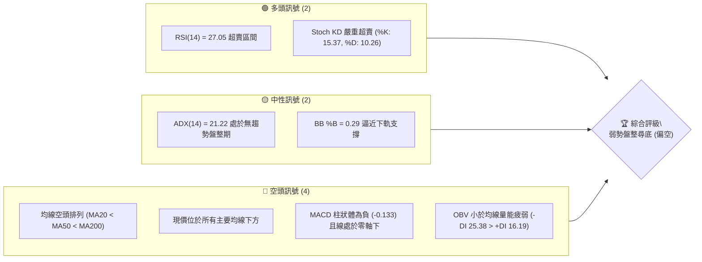
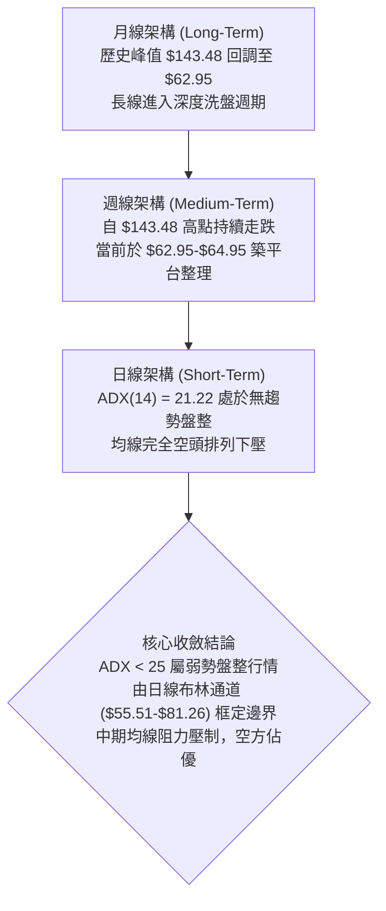
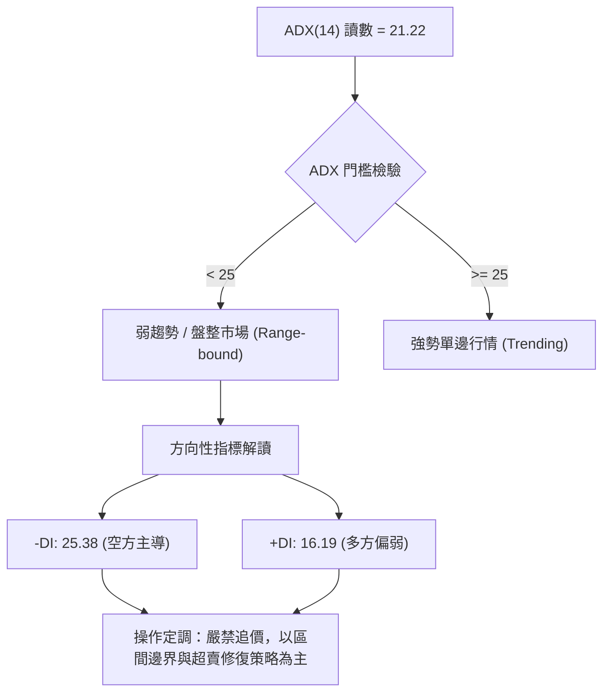
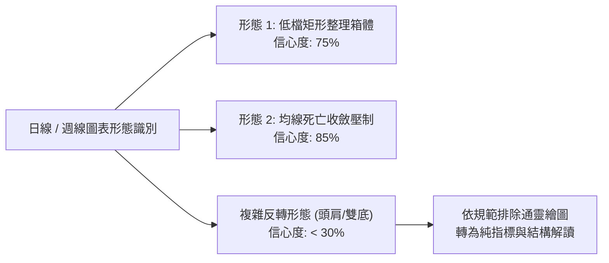
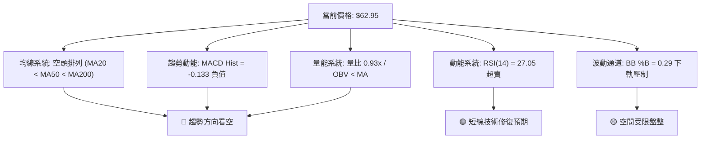
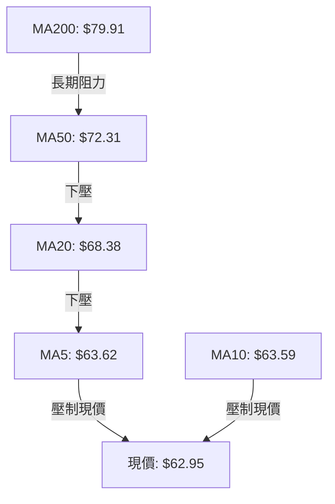
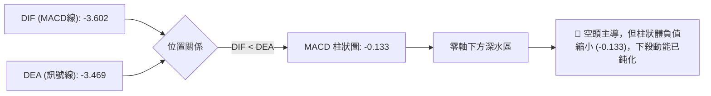
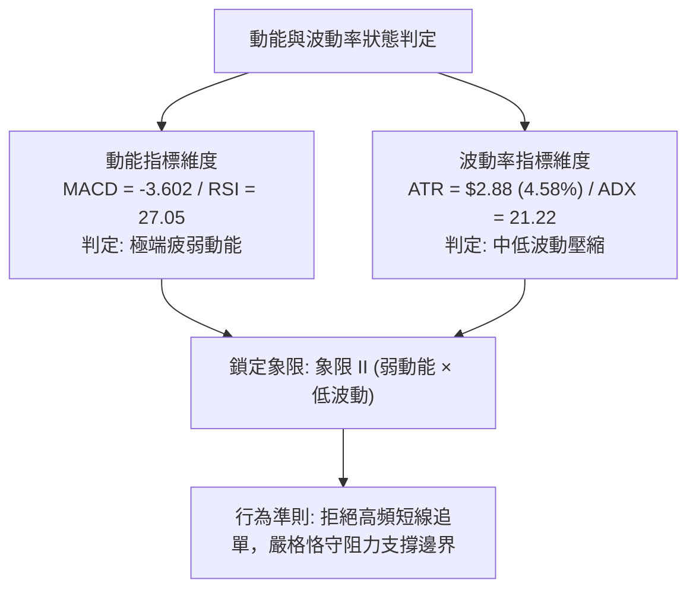
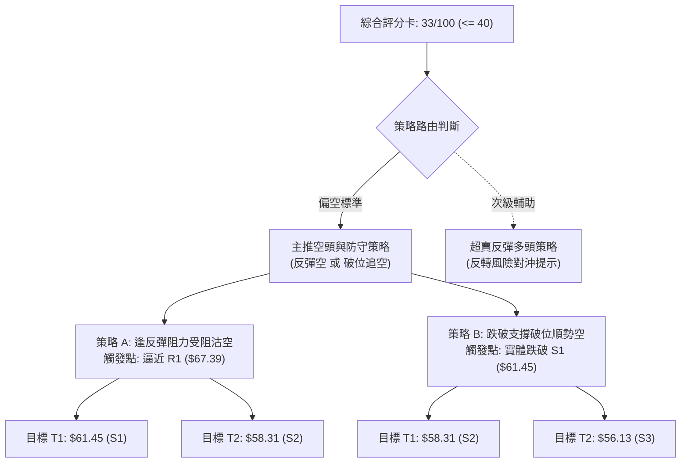
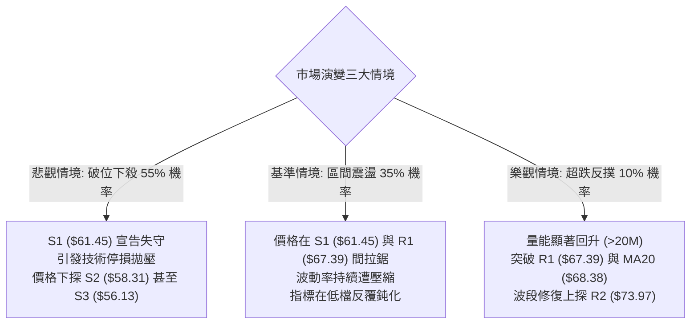

# RKLB 技術分析報告

> **報告日期**：2026-09-13 ｜ **語言**：繁體中文 ｜ **數據來源**：Yahoo Finance ｜ **當前價格**：$62.95

---

## 目錄

| 章節 | 內容 |
|------|------|
| [1. 技術面概覽](#1-技術面概覽) | 訊號儀表板、核心指標、評分卡 |
| [2. 趨勢分析](#2-趨勢分析) | 多時框趨勢、長中短期走勢、ADX趨勢強度 |
| [3. 圖表形態分析](#3-圖表形態分析) | 形態識別、信心度評估、K線組合、目標價計算 |
| [4. 支撐與阻力](#4-支撐與阻力) | 關鍵價位結構、斐波那契回調位深入解讀 |
| [5. 技術指標深度解讀](#5-技術指標深度解讀) | MA系統、RSI、MACD、布林通道、量價OBV |
| [6. 動能與波動率](#6-動能與波動率) | 動能象限、ATR風控距離、高Beta敏感度分析 |
| [7. 多時框架總結](#7-多時框架總結) | 時框矩陣、優先級收斂原則與單一方向定調 |
| [8. 交易策略建議](#8-交易策略建議) | 策略路由、情境階梯、進出場及風報比矩陣 |
| [9. 風險提示與監控](#9-風險提示與監控) | 關鍵監控清單、極端情境推演與部位管理規則 |

---

## 1. 技術面概覽

### 🎯 技術訊號儀表板



### 📊 核心指標速覽表

| 指標類別 | 指標名稱 | 當前數值 | 訊號 | 解讀 |
|----------|----------|----------|------|------|
| **價格** | 當前價格 | $62.95 | 🔴 | 位於52週區間 22.4%，跌幅顯著，處於弱勢尋底階段 |
| **均線** | MA20 | $68.38 | 🔴 | 價格低於 MA20 達 -7.94%，短期下壓沉重 |
| **均線** | MA50 | $72.31 | 🔴 | 價格顯著低於 MA50，中期下行通道未破 |
| **均線** | MA200 | $79.91 | 🔴 | 長期牛熊分水嶺失守，長線防線已轉為強阻力 |
| **動能** | RSI(14) | 27.05 | 🟢 | 跌破 30 進入技術性超賣區，具備短線技術抽頭條件 |
| **動能** | MACD (12,26,9) | -3.602 / -3.469 | 🔴 | 雙線在零軸下方運行，柱狀體 -0.133 延續空方主導 |
| **動能** | Stoch %K / %D | 15.37 / 10.26 | 🟢 | 極端超賣區低檔鈍化，等待金叉確認訊號 |
| **趨勢強度**| ADX (14) | 21.22 | 🟡 | 數值低於 25，表明單邊強趨勢衰竭，轉為弱勢箱體整理 |
| **通道** | 布林通道 (%B) | 0.29 ($55.51–$81.26) | 🟡 | 價格貼近中下軌區間，波動率受限 |
| **成交量** | 20日均量比 | 0.93x (15.33M / 16.46M) | 🔴 | 量縮陰跌，OBV < MA，資金進場抄底意願低沉 |
| **波動** | ATR(14) | $2.88 (4.58%) | 🟡 | 每日波幅適中，提供明確止損與風控邊界 |

### 🏆 技術評分卡

```
╔══════════════════════════════════════════════════════════════════╗
║                技術評分卡 — RKLB (2026-09-13)                  ║
╠══════════════════════════════════════════════════════════════════╣
║ 趨勢強度 (Trend)       █████░░░░░░░░░░░░░░░  28/100  🔴 空頭主導  ║
║ 動能指標 (Momentum)    ███████░░░░░░░░░░░░░  36/100  🟡 超賣醞釀  ║
║ 支撐穩定度 (Support)   █████████░░░░░░░░░░░  45/100  🟡 考驗S1    ║
║ 成交量配合 (Volume)    ██████░░░░░░░░░░░░░░  32/100  🔴 量能萎縮  ║
║ 形態完整度 (Pattern)   ███████░░░░░░░░░░░░░  38/100  🔴 下行通道  ║
║ 均線排列 (Moving Avg)  ████░░░░░░░░░░░░░░░░  20/100  🔴 空頭排列  ║
╠══════════════════════════════════════════════════════════════════╣
║ 綜合評分 (Overall)     ███████░░░░░░░░░░░░░  33/100  🔴 弱勢偏空  ║
╚══════════════════════════════════════════════════════════════════╝
```

---

## 2. 趨勢分析

### 🌐 多時框趨勢分析



### 📈 長期趨勢 — 12個月走勢圖（Unicode）

```
RKLB 月線走勢圖（過去12個月：2025-10 至 2026-09）
價格軸 ($)
$150 ┤                                              ● $143.48 (2026-05 峰值)
$135 ┤                                             ╱ ╲
$120 ┤                                            ╱   ╲
$105 ┤                                           ╱     ● $101.65 (2026-06)
$90  ┤                             ● $82.51     ╱       ╲
$75  ┤               ● $69.76     ╱       ╲    ╱         ╲
$60  ┤ ● $62.98     ╱        ╲   ╱         ●──           ●───● $62.95 (現在)
$45  ┤         ╲   ╱          ● $64.22                  $64.95  $63.92
$30  ┤          ● $42.14
     └─────────────────────────────────────────────────────────────
       10  11   12   01   02   03   04   05   06    07   08   09 (月份)
      2025 ─────────────────────────► 2026 ───────────────────────►
```

#### 走勢特徵分析表格

| 階段 | 時間區間 | 起止價位 | 漲跌幅 | 走勢特徵解讀 |
|------|----------|----------|--------|--------------|
| **第1階段：基底蓄勢** | 2025-10 至 2025-11 | $62.98 → $42.14 | -33.09% | 劇烈洗盤，回踩中期支撐測試流動性 |
| **第2階段：波段推升** | 2025-11 至 2026-01 | $42.14 → $80.07 | +90.01% | 突破型多頭推進，量能溫和放大 |
| **第3階段：高檔震盪** | 2026-01 至 2026-03 | $80.07 → $64.22 | -19.80% | 構築中繼對稱收斂平台，多空分歧加劇 |
| **第4階段：主升暴衝** | 2026-03 至 2026-05 | $64.22 → $143.48 | +123.42% | 極端爆發浪，創下 52 週高點 $151.00，動能透支 |
| **第5階段：獲利崩跌** | 2026-05 至 2026-07 | $143.48 → $64.95 | -54.73% | 斷頭式下挫，連破重要均線，多頭套牢盤深重 |
| **第6階段：底盤整理** | 2026-07 至 2026-09 | $64.95 → $62.95 | -3.08% | 波幅驟降，量能萎縮，進入低檔鈍化箱體 |

### 📊 中期趨勢（週線分析）

中期走勢呈現連續高點下移（Lower Highs）與平底支撐的**弱勢下行收斂結構**。

```
週線近期阻力與支撐結構示意圖：
阻力 R2 ─── $73.97 ════════════════════════════════════ (近一年次級阻力帶)
阻力 R1 ─── $67.39 ──────────────────────────────── (MA20 $68.38 聚合阻力)
現價    ─── $62.95 ◄─── (多空膠著點，成交量連續萎縮)
支撐 S1 ─── $61.45 ──────────────────────────────── (近一年波段低點聚類)
支撐 S2 ─── $58.31 ════════════════════════════════════ (關鍵防守平台)
支撐 S3 ─── $56.13 ──────────────────────────────── (布林下軌 $55.51 聚合防線)
```

週線數據顯示，2026-08-09 週曾自 $64.95 反彈至 $82.83，但後續四週價格接連走低（$80.25 → $72.57 → $64.39 → $64.26 → $62.95），MACD 柱狀體亦由 +2.940 翻黑收斂至 -0.133，表明反彈動能已被徹底吸收，中期趨勢依舊由空方牢牢主導。

### ⚡ 趨勢強度評估（ADX 解讀）



#### ADX 強度對照與判斷表

| 指標變數 | 當前數值 | 狀態等級 | 意義與交易指引 |
|----------|----------|----------|----------------|
| **ADX (14)** | 21.22 | 弱趨勢 / 盤整 (<25) | 價格缺乏單向持續爆發力，趨勢策略容易遭到雙向洗盤 |
| **+DI (14)** | 16.19 | 多方動能疲乏 | 買盤缺乏承接主動性，僅存在防守性掛單 |
| **-DI (14)** | 25.38 | 空方佔據優勢 | -DI 明確壓制 +DI，空方具備波段下壓主控權 |
| **綜合判定** | 盤整偏空 | 震盪尋底 | 滿足盤整收斂規則：交易以日線布林通道上下軌為核心區間 |

---

## 3. 圖表形態分析

### 🔍 形態識別系統



#### 形態識別與信心度評估表

| 形態 | 信心度 | 判斷依據（引用數據） | 完成度 | 目標價（附計算式） |
|------|--------|----------------------|--------|--------------------|
| **低檔整理箱體** | 75% | 價格近7週於 S1 ($61.45) 至 R1 ($67.39) 窄幅拉鋸，成交量由 150M 週級別萎縮至 85M | 70% | 箱體突破向上目標：R1 ($67.39) + 箱高 ($67.39 - $61.45 = $5.94) = **$73.33** (逼近 R2 $73.97) |
| **下行旗形整理** | 45% | 自 $143.48 暴跌後的橫盤旗面，信心度不足 50% | 40% | 訊號不足，僅做指標型解讀，不預設延伸目標 |
| **雙底反轉形態** | 25% | 缺乏二次明確打底確認，前低仍在延伸 | 20% | 訊號不足，僅做指標型解讀，嚴禁憑空勾勒雙底 |

### 🕯️ 重要K線形態分析

| 月份 / 日期 | 收盤價 | K線形態 | 解讀 | 訊號 |
|-------------|--------|---------|------|------|
| **2026-05** | $143.48 | 長上影大黑棒（天量見頂） | 創下 $151.00 歷史高位後快速反轉，主力出貨確立 | 🔴 空頭反轉 |
| **2026-06** | $101.65 | 大陰線（貫穿實體） | 連續失守整數關卡，賣壓毫無阻力洩出 | 🔴 趨勢下行 |
| **2026-07** | $64.95 | 長黑下墜星 | 價格快速腰斬，空方力竭初步顯現 | 🟡 跌勢暫緩 |
| **2026-08** | $63.92 | 紡錘線（十字星收斂） | 多空在 $64 附產生分歧，波幅自前月大幅收窄 | 🟡 方向未明 |
| **2026-09** | $62.95 | 窄幅微陰線（低檔鈍化） | 緊貼波段低點收盤，缺乏反彈陽線支撐，探底持續 | 🔴 尋底中 |

### 📉 ASCII 走勢形態示意圖

```
RKLB 當前低檔整理箱體結構示意圖（日線與週線聚合）：
$75.11 ┼─────────────────────────────────────────────── R3 (頂部防線)
       │
$73.97 ┼─────────────────────────────────────────────── R2 (強阻力位)
       │
$68.38 ┼─ ─ ─ ─ ─ ─ ─ ─ ─ ─ ─ ─ ─ ─ ─ ─ ─ ─ ─ ─ ─ ─ ─ ─ ─ ─ MA20 中軌
$67.39 ┼─────────────────────────────────────────────── R1 (箱體上邊界)
       │         ┌──┐
       │         │  │
$62.95 ┼─────────┼──┼─────────●───────────────────────── 現價位置
       │         │  │         │
$61.45 ┼─────────┴──┴─────────┴───────────────────────── S1 (箱體下邊界)
       │
$58.31 ┼─────────────────────────────────────────────── S2 (波段安全墊)
       │
$55.51 ┼─────────────────────────────────────────────── BB 下軌 / S3 ($56.13)
```

### 🎯 形態目標價計算

依據確認度最高（75%）之「低檔整理箱體」形態推算：
1. **箱體下邊界（基底支撐）**：以聚類支撐 S1 為準，數值為 **$61.45**。
2. **箱體上邊界（頸線阻力）**：以聚類阻力 R1 為準，數值為 **$67.39**。
3. **形態垂直高度 ($H$)**：
   $$H = \text{R1} - \text{S1} = \$67.39 - \$61.45 = \$5.94$$
4. **向上突破目標價 ($T_{up}$)**：
   $$T_{up} = \text{R1} + H = \$67.39 + \$5.94 = \$73.33$$
   *(該數值與技術阻力 R2 **$73.97** 高度共振，誤差僅 0.86%)*
5. **向下破位目標價 ($T_{down}$)**：
   $$T_{down} = \text{S1} - H = \$61.45 - \$5.94 = \$55.51$$
   *(該數值與布林通道下軌 **$55.51** 完全吻合，並貼近聚類支撐 S3 **$56.13**)*

---

## 4. 支撐與阻力

### 🗺️ 關鍵價位分布圖（Unicode）

```
RKLB 價位結構分布圖 (由實際 OHLCV 與指標精確界定)
══════════════════════════════════════════════════════════════════
$151.00 ║ 52W High (絕對天花板)
$81.26  ║ 布林上軌 (通道極限壓力)
$80.90  ║ 斐波那契 61.8% 強阻力線
$79.91  ║ MA200 牛熊分水嶺
$75.11  ║████████████████████████║ 強阻力 R3 (近一年波段高點聚類)
$73.97  ║████████████████████    ║ 阻力 R2 (反彈第一目標階梯)
$68.38  ║ 布林中軌 / MA20 短線下壓線
$67.39  ║████████████████████████║ 關鍵阻力 R1 (箱體頸線位)
$62.95  ╠════════════════════════╣ ◄ 現價 ($62.95)
$61.84  ║ 斐波那契 78.6% 回調關鍵分界
$61.45  ║▓▓▓▓▓▓▓▓▓▓▓▓▓▓▓▓        ║ 近期支撐 S1 (第一道防線)
$58.31  ║████████████████████    ║ 強支撐 S2 (次級波段低點)
$56.13  ║████████████████████████║ 終極支撐 S3 (日線波段低點聚類)
$55.51  ║ 布林下軌 (區間底界)
$37.57  ║ 52W Low (年度絕對底部)
══════════════════════════════════════════════════════════════════
```

### 🚧 阻力位分析表

| 阻力級別 | 價位 | 形成原因 | 突破難度 | 重要性 |
|----------|------|----------|----------|--------|
| **R1** | **$67.39** | 近一年波段高點聚類，貼近 MA20 ($68.38) 下降壓制線 | 🟡 中等 | 判定短線止跌與區間反彈的第一關鍵突破點 |
| **R2** | **$73.97** | 近一年次級密集成交區高點聚類，與箱體等幅目標 ($73.33) 共振 | 🔴 高 | 中期反轉確認位，越過此點方能扭轉日線空頭架構 |
| **R3** | **$75.11** | 近一年強波段高點聚類，逼近 MA60 ($76.27) 密集成交區 | 🔴 極高 | 波段空頭的堅固堡壘，無巨額成交量絕難逾越 |

### 🛡️ 支撐位分析表

| 支撐級別 | 價位 | 形成原因 | 守住機率 | 重要性 |
|----------|------|----------|----------|--------|
| **S1** | **$61.45** | 近一年波段低點聚類，近三週收盤防守防線 | 🟡 55% | 現價第一道護城河，一旦擊穿將觸發停損盤湧出 |
| **S2** | **$58.31** | 近一年中繼波段低點聚類，具備次級買盤緩衝能力 | 🟢 65% | 空頭回踩的重要支撐過渡帶 |
| **S3** | **$56.13** | 近一年極端波段低點聚類，與日線布林下軌 ($55.51) 形成聚合帶 | 🟢 80% | 多頭底線防守位，若跌破意味著結構向 52W 低點洩落 |

### 📐 斐波那契回調位分析

依據 52 週完整波動區間（低點 **$37.57** 至 高點 **$151.00**，落差共 **$113.43**）之黃金分割系統分析：

```
斐波那契回調位與現價分佈：
0.0%  (52W High)  $151.00 ──────────────────────────────────────────
23.6%             $124.23 ──────────────────────────────────────────
38.2%             $107.67 ──────────────────────────────────────────
50.0%             $ 94.28 ──────────────────────────────────────────
61.8%             $ 80.90 ────────────────────────────────────────── (接近 MA200 $79.91)
現價落點 ────────► $ 62.95 ◄── 位於 78.6% 與 61.8% 之間
78.6%             $ 61.84 ────────────────────────────────────────── (關鍵深次回調位)
100.0%(52W Low)   $ 37.57 ──────────────────────────────────────────
```

#### 深度解讀
1. **回調位區間鎖定**：現價 **$62.95** 正精確懸掛於 **78.6% 回調位 ($61.84)** 與 **61.8% 回調位 ($80.90)** 之間。
2. **78.6% ($61.84) 之定海神針作用**：78.6% 回調位為技術分析中牛市回撤的最後一道極限防線。當前價格距離 $61.84 僅有 +1.80% 的緩衝空間，且與聚類支撐 S1 ($61.45) 完美重疊。若 $61.84–$61.45 區域收盤失守，代表自 $37.57 發動的全年多頭浪潮被徹底瓦解，跌勢將直奔 100% 回撤點 ($37.57)。
3. **上方強阻力封閉**：61.8% 黃金分割位 **$80.90** 與 MA200 **$79.91** 及布林上軌 **$81.26** 形成三位一體的重合阻力天花板，在未能有效修復至該點位前，中長期結構無法給予任何樂觀反轉評級。

---

## 5. 技術指標深度解讀

### 🎛️ 指標訊號總覽



### 📈 移動平均線排列分析



#### 均線各級參數與偏離度表

| 均線名稱 | 數值 | 現價偏離幅度 | 排列位置 | 解讀 |
|----------|------|--------------|----------|------|
| **MA 5** | $63.62 | -1.06% | 緊貼上方 | 超短線下行斜率趨緩，呈橫向鈍化黏合 |
| **MA 10** | $63.59 | -1.00% | 緊貼上方 | 與 MA5 產生微幅黏合，預示短線波幅已達極限壓縮 |
| **MA 20** | $68.38 | -7.94% | 短期阻力 | 20日成本線向下傾斜，未被突破前短期偏空格局不變 |
| **MA 50** | $72.31 | -12.94%| 中期阻力 | 中期空頭生命線，下壓角度堅決 |
| **MA 60** | $76.27 | -17.47%| 波段阻力 | 密集套牢成交籌碼峰值所在處 |
| **MA 120** | $86.23 | -27.00%| 半年線阻力| 嚴重負乖離，反映半年內持股者全面套牢 |
| **MA 200** | $79.91 | -21.22%| 長期牛熊線| 跌破超過20%，長線進入技術性熊市結構 |
| **MA 240** | $76.07 | -17.24%| 年線阻力 | 年線拐頭向下，多頭大本營全面失守 |

**均線綜合判定**：MA5 < MA10 < MA20 < MA50 < MA200，展現極其典型的**完美空頭排列**。所有均線斜率均為負值，價格反彈每一次觸碰均線均屬空頭補刀或多頭解套減碼節點。

### 📉 RSI(14) 分析

* RSI(14) 當前數值：**27.05**
```
RSI(14) 水平位置標定：
0 ────── 20 ──[ 27.05 ]── 30 ───────────────── 50 ───────────────── 70 ────── 100
[ 極端超賣區 ] ◄─── 當前位置 ───► [ 中性區間 ]                  [ 超買區 ]
進度條: ███████░░░░░░░░░░░░░░░░░░░ (27.05%)
```

#### 背離判定與技術解讀
* **超賣狀態評估**：RSI 讀數 27.05 < 30.00，代表市場已陷入單邊賣超盲區。
* **背離檢查**：觀察週線走勢，2026-07-26 收盤 $63.91 時 RSI 為 15.6；2026-09-06 收盤 $64.26 時 RSI 為 12.8；當前 2026-09-13 價格進一步破底至 $62.95，而 RSI 反彈微升至 27.05。雖然日線上數據顯示「無明顯背離」，但在超短期區間內具備微弱的「價格創微新低而動能未破新低」之隱性底背離萌芽。但由於未獲成交量與陽線實體確認，目前**正式結論定調為：無有效底背離，僅屬極度超賣之技術鈍化**。

### 📊 MACD(12/26/9) 訊號解讀



* **數據狀態**：DIF (-3.602) 位於 DEA (-3.469) 下方，雙線深陷零軸（0.00）下方深水區，確認中長期波段處於強烈空頭控盤環境。
* **微觀動態**：柱狀體現值為 **-0.133**。回顧歷史數值，自 2026-06 期間的 -4.697 乃至 2026-08-30 的 -0.961，當前柱狀體負值已大幅收斂至 -0.133，代表**空方動能宣洩已達末端，隨時存在低檔弱金叉的機會**，唯目前金叉尚未成形，不可搶跑。

### 📦 布林通道分析

```
日線布林通道 ($55.51 - $68.38 - $81.26) 示意圖：
$81.26 ┬────────────────────────────────────────── 上軌 (Upper Band)
       │
$74.82 ┼────────────────────────────────────────── 帶寬度 (Bandwidth = 37.66%)
       │
$68.38 ┼────────────────────────────────────────── 中軌 / MA20 (Middle Band)
       │
$62.95 ┼───● 現價位點 (%B = 0.29)
       │
$55.51 ┴────────────────────────────────────────── 下軌 (Lower Band)
```

* **參數數值**：
  * **上軌**：$81.26
  * **中軌 (MA20)**：$68.38
  * **下軌**：$55.51
  * **帶寬 (Bandwidth)**：(81.26 - 55.51) / 68.38 = **37.66%**
  * **%B 指標**：(62.95 - 55.51) / (81.26 - 55.51) = **0.2899 (0.29)**
* **技術意義**：%B 讀數 0.29 明確指出價格處於通道下半區，正往布林下軌貼近。當前通道呈現收斂走平狀態，並未伴隨價格破底而出現張口下撕，印證 ADX(14)=21.22 的盤整特徵：**布林通道下軌 $55.51 與中軌 $68.38 構成了當前震盪行情的絕對邊界**。

### 💹 成交量分析（量價配合度）

```
成交量與均量對比 (Volume Profile)：
今日成交量: 15.33M  ██████████████████░░░  (93.16%)
20日均量:   16.46M  ████████████████████  (100.0%)
50日均量:   18.51M  ██████████████████████ (112.4%)
```

* **量價背離分析**：最新成交量為 15,335,700 股，低於 20 日均量（量比 0.93x），亦明顯低於 50 日均量。價格下落伴隨成交量漸次萎縮，表明現階段並非遭遇主力恐慌性拋售，而是屬於更具殺傷力的「**量縮陰跌**」或「**流動性真空尋底**」。
* **OBV 能量潮解讀**：數據指示「OBV < MA → 量能疲弱」。資金淨流入量持續低於移動均線，顯示場外增量資金在目前價位缺乏足夠的介入意願，價格走勢缺乏多頭量能的背書。

---

## 6. 動能與波動率

### ⚡ 動能評估四象限

| 象限標記 | 動能維度 | 波動率維度 | 當前匹配狀態 | 策略指導含義 |
|----------|----------|------------|--------------|--------------|
| **象限 I** | 強動能 (Bullish) | 低波動 (Low Vol) | ─ | 最佳波段順勢突破買入區 |
| **象限 II**| 弱動能 (Bearish) | 低波動 (Low Vol) | **✓ (當前所處象限)** | **低動能防守期：靜待通道壓縮完畢，以逸待勞** |
| **象限 III**| 強動能 (Bullish) | 高波動 (High Vol) | ─ | 激情主升推升，短線劇烈獲利了結區 |
| **象限 IV**| 弱動能 (Bearish) | 高波動 (High Vol) | ─ | 恐慌崩跌流動性踩踏區（如 2026-05） |



### 📊 ATR 波動率分析

* **當前 ATR(14)**：**$2.88**（佔當前股價之 **4.58%**）。
* **風控止損距離精算**：
  * **超短線策略止損距離（1.0 × ATR）**：$2.88。若以 S1 ($61.45) 建立試探單，止損價下移至 $61.45 - $2.88 = **$58.57**（緊貼 S2 $58.31）。
  * **波段策略止損距離（1.5 × ATR）**：$2.88 × 1.5 = **$4.32**。
  * **通道防守止損距離（2.0 × ATR）**：$2.88 × 2.0 = **$5.76**。若於現價 $62.95 進場，技術止損點應設於 $62.95 - $5.76 = **$57.19**（位於 S2 與 S3 之間）。

### 📐 Beta 與市場相關性

* **Beta 係數**：**2.612**
* **深度解讀**：
  * **高彈性雙刃劍**：RKLB 的 Beta 達到 2.612，代表該股之波動劇烈程度為標普500指數（S&P 500）的 2.6 倍以上。當大盤修正 1%，該股在統計學上將面臨平均 2.6% 的下行衝擊；反之，一旦大盤企穩帶動市場風險偏好（Risk-On）回升，其反彈爆發力亦將顯著超越市場平均。
  * **放量風險**：在當前空頭均線與量能疲弱結構下，高 Beta 特性加劇了向下擊穿支撐時觸發多頭踩踏的風險，交易者不可過早放大槓桿或部位。

---

## 7. 多時框架總結

### 📋 時框架評分表

| 時框架 | 趨勢方向 | 動能狀態 | 均線排列 | 圖表形態 | 綜合評分 | 操作建議 |
|--------|----------|----------|----------|----------|----------|----------|
| **月線 (長期)** | 震盪回洗 | 快速回落 | MA200上穿 | 歷史天價崩跌 | 42/100 🟡 | 觀望，等待長期底部成形 |
| **週線 (中期)** | 空頭主導 | 弱勢反彈夭折 | 死亡交叉 | 高點下移收斂 | 30/100 🔴 | 逢高減碼，偏空對沖 |
| **日線 (短期)** | 箱體盤整 | 極端超賣 | 空頭排列 | 低檔窄幅整理 | 33/100 🔴 | 嚴控停損，僅限超跌短彈 |

### 🔲 綜合訊號矩陣

```
╔══════════════════════════════════════════════════════════════════╗
║                  多時框訊號一致性收斂矩陣                        ║
╠══════════════════════════════════════════════════════════════════╣
║ 維度         短期 (日線)          中期 (週線)         長期 (月線) ║
╠══════════════════════════════════════════════════════════════════╣
║ 趨勢方向     🔴 箱體偏空 (ADX<25) 🔴 下行通道貫穿     🟡 均值回歸 ║
║ 動能擺動     🟢 RSI 27.05 超賣   🔴 MACD柱轉負      🔴 漲勢中斷 ║
║ 均線結構     🔴 全空頭排列壓制    🔴 MA20/50蓋頂      🟡 長期支撐 ║
║ 量價關係     🔴 量縮陰跌 (OBV弱)  🔴 增量下跌縮量彈   🔴 天量退潮 ║
║ 支撐防守     🟡 考驗 S1 $61.45   🔴 78.6%臨界線      🟢 52W區間底║
╚══════════════════════════════════════════════════════════════════╝
```

### ⚖️ 多時框收斂結論

依據多時框收斂規則第 14 條：
1. **行情性質界定**：當前日線 **ADX(14) = 21.22 (< 25)**，嚴格滿足「**盤整行情**」定義。
2. **優先級收斂原則**：在盤整行情中，單邊趨勢指標失效，交易區間完全由**日線布林通道（下軌 $55.51 至 上軌 $81.26）與中軌 MA20 ($68.38)** 框定。日線之極端超賣（RSI=27.05）雖提供短線修復觸媒，但受制於週線與中長期均線（MA20 $68.38、MA50 $72.31）強大的向下慣性，日線的反彈僅能視為防守型箱體內的波動。
3. **唯一方向性定調**：**【弱勢盤整，偏空防守】**。日線雖具備超賣反抽動能，但中線未見底信號前，嚴禁主觀認定為反轉。本報告第 8 章之交易策略將以**偏空主導思維及嚴格區間防守**為核心路由。

---

## 8. 交易策略建議

### 🗺️ 策略決策流程圖



### 🧭 策略路由

**當前主策略方向 = 🔴 偏空主導 / 逢高沽空與破位順勢策略（依綜合評分：33/100）**

因技術評分卡綜合評分僅為 **33/100**（≤ 40 偏空區間），趨勢與均線結構呈現壓倒性空方排列，主推空頭策略；多頭交易僅列為「超賣極端修復之反向風險提示」，不列為主力建倉選項。

### 🎯 價格情境階梯（Price Scenarios）

價位完全採用第 4 章「關鍵價位」區塊之客觀數據：

| 觸發條件 | 下一目標 | 後續延伸 | 情境含義 |
|----------|----------|----------|----------|
| **強勢突破 R1 ($67.39)** | R2 ($73.97) | R3 ($75.11) | 短線超跌反抽擴大，挑戰中期下行通道上緣 |
| **突破 MA20 ($68.38)** | R2 ($73.97) | 布林上軌 ($81.26) | 日線層級初步轉強，扭轉短期均線壓制 |
| **受阻於現價至 R1 區間**| S1 ($61.45) | S2 ($58.31) | 弱勢箱體整理延續，多頭無力回天 |
| **跌破 S1 ($61.45)** | S2 ($58.31) | S3 ($56.13) | 箱體破位下行，開啟新一輪陰跌破底浪 |
| **跌破 S3 ($56.13)** | 布林下軌 ($55.51)| 52W低點 ($37.57) | 觸發極端恐慌拋售，中期全面轉入深熊市場 |

### 📊 情境機率分佈

| 情境 | 機率 | 主要依據 |
|------|------|----------|
| **弱勢回落 / 再探底** | **55%** | 均線空頭排列（MA20<MA50<MA200）、OBV量能疲弱、-DI (25.38) 顯著高於 +DI (16.19) |
| **區間窄幅震盪** | **35%** | ADX(14) = 21.22 處於無趨勢低位、布林通道走平收斂、RSI(14)=27.05 限制下殺空間 |
| **強勢反轉上行** | **10%** | MACD 仍處於零軸下深處，無放量紅K配合，各級均線反壓沉重，機率極低 |

### 🔴 主策略詳情（空頭主導）

本處擬定兩套嚴謹之空頭操作策略：**策略 A（逢高沽空型）** 與 **策略 B（破位追空型）**。所有價位嚴格錨定第 4 章聚類數據。

| 策略要素 | 策略 A：逢阻力反彈沽空 (Pullback Short) | 策略 B：支撐失守破位順勢空 (Breakdown Short) |
|----------|-----------------------------------------|---------------------------------------------|
| **進場條件** | 價格反彈至 R1 附近遇阻，出現長上影線或日K收黑 | 價格實體跌破支撐 S1，伴隨日線成交量放大 |
| **進場價格** | **$67.39** (精確錨定阻力 R1) | **$61.45** (精確錨定支撐 S1 破位) |
| **目標價 T1** | **$61.45** (支撐 S1，獲利空間 8.81%) | **$58.31** (支撐 S2，獲利空間 5.11%) |
| **目標價 T2** | **$58.31** (支撐 S2，獲利空間 13.47%) | **$56.13** (支撐 S3，獲利空間 8.66%) |
| **止損價格** | **$70.27** (R1 $67.39 + 1.0×ATR $2.88) | **$64.33** (S1 $61.45 + 1.0×ATR $2.88) |
| **風險空間** | $2.88 (4.27%) | $2.88 (4.69%) |
| **風險報酬比** | **1 : 2.06** (以 T1 計算) / **1 : 3.15** (以 T2 計算) | **1 : 1.09** (以 T1 計算) / **1 : 1.85** (以 T2 計算) |
| **成功機率** | **65%** | **55%** |
| **建議倉位** | **15%** (總資產佔比) | **10%** (突破追加型輕倉) |

### 🟢 反向風險觸發點（對沖提示）

若市場出現逆向超跌暴力反彈，需建立以下防護與空頭回補監控：
1. **反轉觸發價位**：日線收盤價**強勢站上 MA20 ($68.38)** 且成交量放大至 20 日均量（>16.46M）以上。
2. **技術訊號推翻**：MACD 出現零軸下方向上金叉，且 RSI(14) 突破 50 中性水線。
3. **對沖應對措施**：一旦觸發 $68.38 實體突破，所有空單必須無條件止損出局；積極交易者可轉為超跌短線多頭，以 R2 **$73.97** 為目標，止損設於 **$66.00**。

### ⭐ 整體訊號強度評星

```
做多訊號強度：★☆☆☆☆  (1.5/5星) ── 僅存指標超賣，缺乏買盤確認
做空訊號強度：★★★★☆  (4.0/5星) ── 均線空頭排列，順應中長期趨勢
整體可信度：  ★★★★☆  (4.0/5星) ── ADX 與布林帶共振收斂，邊界清晰
```

---

## 9. 風險提示與監控

### ✅ 關鍵監控指標 Checklist

```
╔══════════════════════════════════════════════════════════════════╗
║                  RKLB 日常動態技術監控清單                     ║
╠══════════════════════════════════════════════════════════════════╣
║ [ ] 價格是否跌破 S1 ($61.45) 關鍵支撐？ (破位預警)               ║
║ [ ] RSI(14) 是否在 < 30 形成 W 底低檔鈍化金叉？ (反彈先兆)       ║
║ [ ] ADX(14) 是否由 21.22 向上突破 25？ (強趨勢重新啟動標誌)      ║
║ [ ] MACD 柱狀體是否由負翻正 (當前 -0.133)？ (動能翻多確認)       ║
║ [ ] 單日成交量是否爆發超過 20 日均量 (16.46M) 1.5倍？ (主力介入) ║
║ [ ] 價格能否有效越過 MA20 ($68.38)？ (短期趨勢扭轉標誌)         ║
║ [ ] 斐波那契 78.6% 回調位 ($61.84) 是否遭遇實體黑K貫穿？         ║
╚══════════════════════════════════════════════════════════════════╝
```

### ⚠️ 風險場景分析



### 🛡️ 風險管理重要提醒

1. **高 Beta 波動懲罰機制**：RKLB 的 Beta 高達 **2.612**，ATR 佔比達 **4.58%**。這意味著即使是日內微小的盤面波動，都極易擊穿過窄的止損。**單筆交易最大虧損額度嚴格限制在總投資組合資金的 1.0% 以內**。
2. **空頭排列下的「超賣陷阱」**：當前 RSI 僅 27.05，許多缺乏經驗的交易者習慣於單憑超賣指標逆勢摸底。在均線完美空頭排列且 OBV 量能萎縮的背景下，超賣指標極常出現「鈍化再鈍化」，切勿在未見到明確築底結構前盲目接飛刀。
3. **區間破位應變機制**：若日線收盤價跌破斐波那契 78.6% ($61.84) 與 S1 ($61.45)，表明歷史大浪潮防線破產，不可心存僥倖抱單，必須堅決執行停損或反手對沖。

---

## 📋 報告總結

```
╔══════════════════════════════════════════════════════════════════╗
║                   RKLB 技術分析報告總結                        ║
╠══════════════════════════════════════════════════════════════════╣
║ 報告日期：2026-09-13                                            ║
║ 當前價格：$62.95                                                ║
║ 分析評級：🔴 弱勢偏空 (綜合評分: 33/100)                        ║
╠══════════════════════════════════════════════════════════════════╣
║ 關鍵結論：                                                      ║
║ ├─ 長期趨勢：🟡 月線高檔回撤，考驗歷史起漲段 78.6% 回調線      ║
║ ├─ 中期趨勢：🔴 週線下行趨勢顯著，均線空頭排列壓制             ║
║ ├─ 短期趨勢：🔴 ADX=21.22 弱勢盤整，價格貼近布林下軌尋底       ║
║ ├─ 關鍵支撐：S1: $61.45 ｜ S2: $58.31 ｜ S3: $56.13             ║
║ ├─ 關鍵阻力：R1: $67.39 ｜ R2: $73.97 ｜ R3: $75.11             ║
║ └─ 均線牛熊分水嶺：MA200 $79.91 (現價折價 -21.22%)              ║
╠══════════════════════════════════════════════════════════════════╣
║ 最優策略組合：                                                  ║
║ 1. 🥇 最佳機會：策略 A (反彈至 R1 $67.39 逢阻力沽空)            ║
║    進場: $67.39 ｜ 止損: $70.27 ｜ 目標: $61.45 ｜ 風報比 1:2.06║
║ 2. 🥈 次選機會：策略 B (實體跌破 S1 $61.45 破位追空)            ║
║    進場: $61.45 ｜ 止損: $64.33 ｜ 目標: $58.31 ｜ 風報比 1:1.09║
║ 3. 🥉 保守選擇：場外空倉觀望，靜待布林通道開口或 MA20 站穩確認 ║
╚══════════════════════════════════════════════════════════════════╝
```

---

> ⚠️ **免責聲明**：本報告為技術分析專用報告，所有數據及推算均基於客觀提供之歷史量價資訊與技術指標數學公式。本報告**僅供研究與學術參考**，**不構成任何投資買賣建議**。高 Beta 個股波動劇烈，入市交易請嚴格執行風控。

---

*報告生成時間：2026-09-13 ｜ 數據來源：Yahoo Finance ｜ 分析框架：多時框技術分析模型*