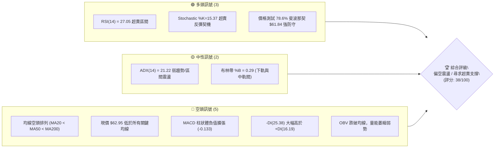
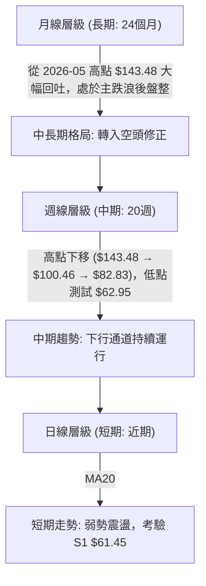
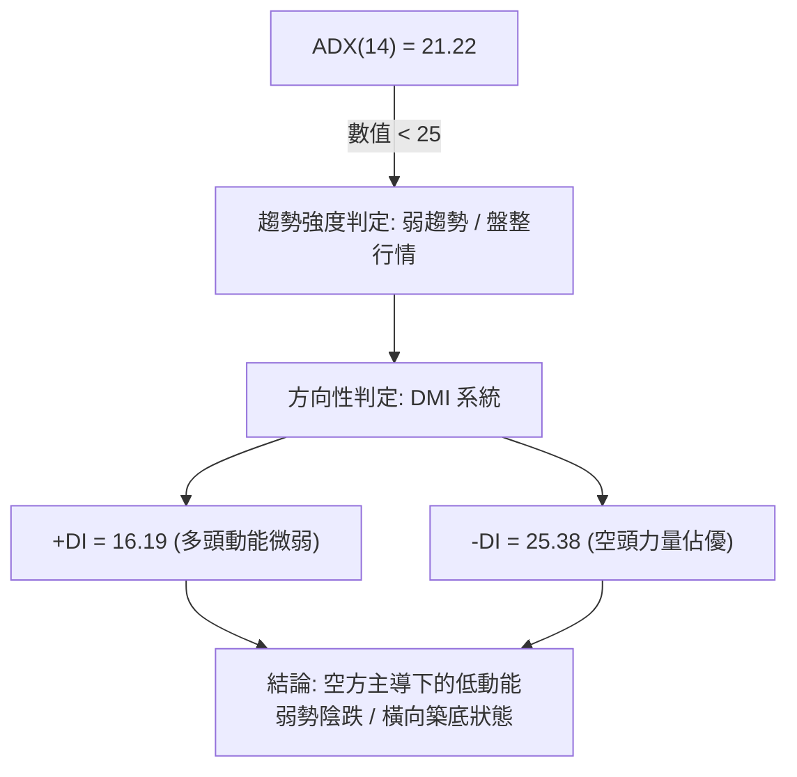
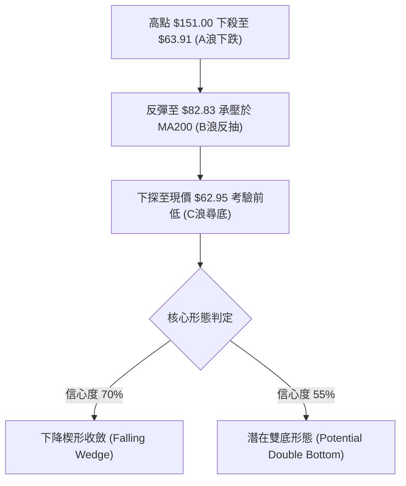
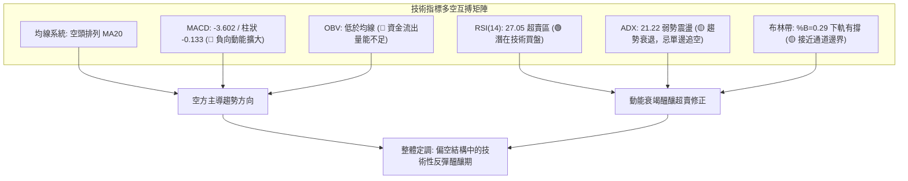
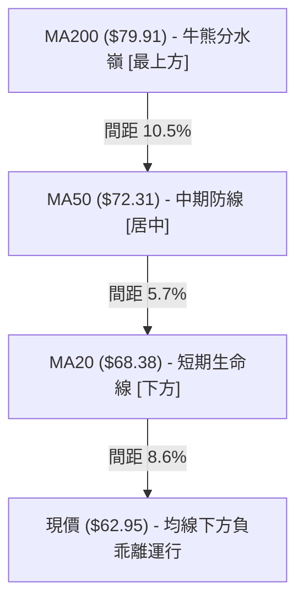
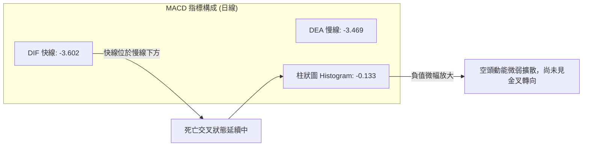
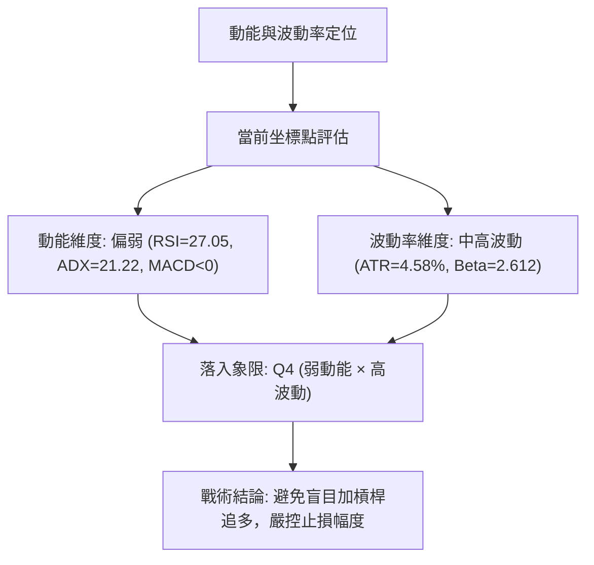
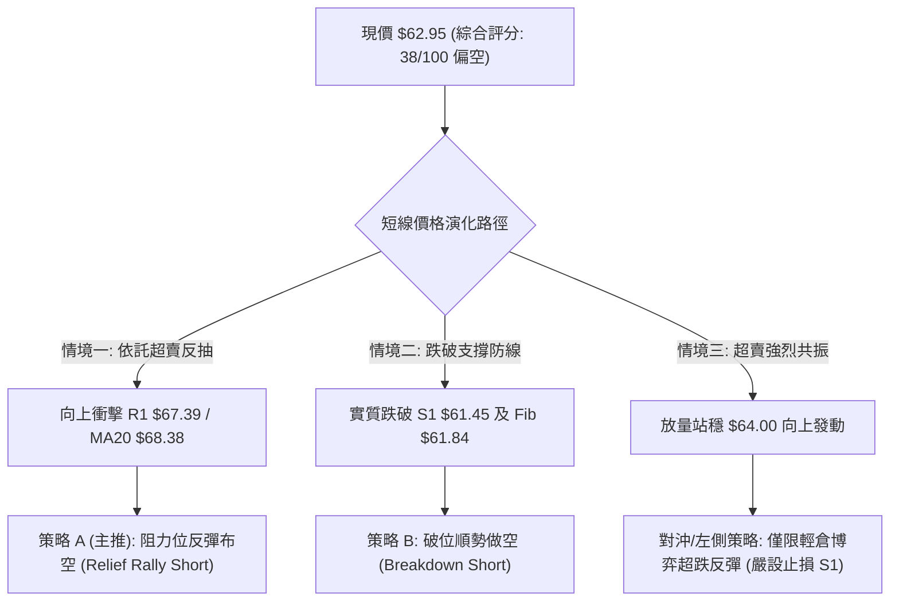
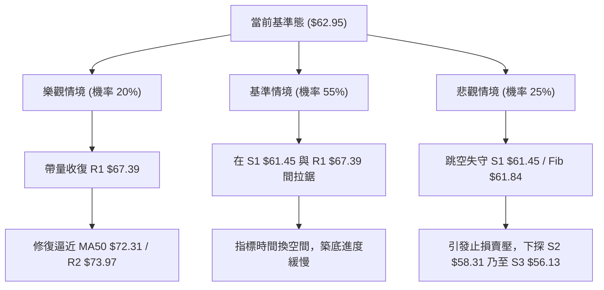

# RKLB 技術分析報告

> **報告日期**：2026-09-14 ｜ **語言**：繁體中文 ｜ **數據來源**：Yahoo Finance ｜ **當前價格**：$62.95

---

## 目錄

| 章節 | 內容 |
|------|------|
| [1. 技術面概覽](#1-技術面概覽) | 訊號儀表板、核心指標、評分卡 |
| [2. 趨勢分析](#2-趨勢分析) | 多時框趨勢、長中短期走勢、ADX解讀 |
| [3. 圖表形態分析](#3-圖表形態分析) | 形態識別、信心度評估、K線組合、目標價計算 |
| [4. 支撐與阻力](#4-支撐與阻力) | 關鍵價位結構圖、阻力/支撐分析表、斐波那契回調 |
| [5. 技術指標深度解讀](#5-技術指標深度解讀) | 均線系統、RSI、MACD、布林通道、OBV量價分析 |
| [6. 動能與波動率](#6-動能與波動率) | 動能評估四象限、ATR波幅止損、Beta相關性 |
| [7. 多時框架總結](#7-多時框架總結) | 時框架評分表、訊號矩陣、多時框收斂結論 |
| [8. 交易策略建議](#8-交易策略建議) | 策略路由、情境階梯、主空頭策略詳情、對沖提示 |
| [9. 風險提示與監控](#9-風險提示與監控) | 關鍵監控清單、情境模擬圖、風控倉位管理 |
| [📋 報告總結](#-報告總結) | 全文核心結論與多維策略總結 |

---

## 1. 技術面概覽

### 🎯 技術訊號儀表板



### 📊 核心指標速覽表

| 指標類別 | 指標名稱 | 當前數值 | 訊號 | 解讀 |
|:---|:---|:---|:---:|:---|
| **價格** | 當前價格 | $62.95 | 🔴 | 位於 52 週區間 22.4% 處，距 52 週高點 $151.00 回撤達 -58.31% |
| **均線** | MA20 | $68.38 | 🔴 | 價格低於 MA20 (-7.94%)，短期下行壓力顯著 |
| **均線** | MA50 | $72.31 | 🔴 | 價格低於 MA50 (-12.94%)，中期結構空頭掌控 |
| **均線** | MA200 | $79.91 | 🔴 | 價格低於 MA200 (-21.22%)，跌破牛熊分水嶺 |
| **動能** | RSI(14) | 27.05 | 🟢 | 進入超賣區 (<30)，具備短線技術性抽頭修復需求 |
| **動能** | MACD | -3.602 / -3.469 | 🔴 | 快慢線雙雙處於零軸下方，柱狀圖 -0.133，空方動能延續 |
| **趨勢** | ADX(14) | 21.22 | 🟡 | 數值小於 25，顯示當前下行動能趨緩，轉入弱趨勢或區間盤整 |
| **方向** | DMI (+DI / -DI) | 16.19 / 25.38 | 🔴 | -DI 大於 +DI，空方力道主導市場定價權 |
| **通道** | 布林通道 (%B) | 0.29 ($55.51–$81.26) | 🟡 | 價格運行於下軌 ($55.51) 與中軌 ($68.38) 之間偏低位置 |
| **量能** | 量比 (Volume Ratio) | 0.93x (OBV < MA) | 🔴 | 最新量 15.34M 低於 20 日均量 16.46M，買盤承接力道薄弱 |
| **波動** | ATR(14) | $2.88 (4.58%) | 🔴 | 波動度處於高位，日內振幅大，風險控管須拉大緩衝 |

### 🏆 技術評分卡

```
╔══════════════════════════════════════════════════════════════════╗
║                   技術評分卡 — RKLB (2026-09-14)                 ║
╠══════════════════════════════════════════════════════════════════╣
║ 趨勢強度      ██████░░░░░░░░░░░░░░  30/100  🔴 空頭掌控 (-DI主導)║
║ 動能指標      ████████░░░░░░░░░░░░  40/100  🟡 超賣醞釀反彈     ║
║ 支撐穩定度    ██████████░░░░░░░░░░  50/100  🟡 考驗 Fib 78.6%   ║
║ 成交量配合    ██████░░░░░░░░░░░░░░  30/100  🔴 量能萎縮無買盤   ║
║ 形態完整度    ████████░░░░░░░░░░░░  40/100  🔴 下行通道整理中   ║
║ 均線排列      ████████░░░░░░░░░░░░  38/100  🔴 均線全面空頭排列 ║
╠══════════════════════════════════════════════════════════════════╣
║ 綜合評分      ████████░░░░░░░░░░░░  38/100  🔴 評級：偏空震盪   ║
╚══════════════════════════════════════════════════════════════════╝
```

---

## 2. 趨勢分析

### 🌐 多時框趨勢分析



### 📈 長期趨勢 — 12個月走勢圖（Unicode）

RKLB 在過去 12 個月經歷了極其劇烈的「估值重估暴漲」與「估值收縮暴跌」週期。股價於 2025 年秋季突破後，於 2026 年 5 月達到歷史性收盤高點 $143.48（日內最高 $151.00），隨後遭遇劇烈拋壓，短短 4 個月內跌至當前的 $62.95，回吐了近一年漲幅的近八成。

```
RKLB 月線走勢圖（過去12個月：2025-09 至 2026-09）
價格 ($)
$150 ┤                                  ● $143.48 (2026-05 歷史天花板)
$130 ┤                                 ╱ ╲
$110 ┤                                ╱   ● $101.65 (2026-06)
$90  ┤                 ● $80.07      ╱     ╲
$70  ┤       ● $62.98 ╱ ╲ $69.10    ● $82.51 ╲
$50  ┤ ● $47.91   ● $42.14 ╲ $64.22           ● $64.95 ──● $62.95 (現價)
$30  ┤
     └─┬───────┬───────┬───────┬───────┬───────┬───────┬───────┬───────► 月份
     25-09   25-11   26-01   26-03   26-04   26-05   26-07   26-09
```

#### 走勢特徵分析表格

| 階段區間 | 時間 | 價格變化 | 漲跌幅 | 結構性特徵與市場心理 |
|:---|:---|:---|:---:|:---|
| **第一階段：主升浪啟動** | 2025-09 → 2026-01 | $47.91 → $80.07 | +67.13% | 突破整理區間，伴隨機構買盤進駐，月線連續放量推進 |
| **第二階段：中期震盪洗盤** | 2026-01 → 2026-03 | $80.07 → $64.22 | -19.80% | 獲利回吐引發回調，於 $64 附近獲得有力承接完成雙底換手 |
| **第三階段：非理性狂熱頂** | 2026-03 → 2026-05 | $64.22 → $143.48 | +123.42% | 極端軋空與散戶情緒高漲，創下 $151.00 頂峰，量能急劇放大 |
| **第四階段：戴維斯雙殺回落** | 2026-05 → 2026-07 | $143.48 → $64.95 | -54.73% | 獲利資金無情撤離，跳空跌破週線均線，形成崩跌式下行通道 |
| **第五階段：弱勢築底考驗** | 2026-07 → 2026-09 | $64.95 → $62.95 | -3.08% | 下跌斜率趨緩，價格在 $62–$65 構築窄幅箱型，量能萎縮至冰點 |

### 📊 中期趨勢（週線分析）

從近 20 週收盤走勢可清晰觀察到，自 2026-05-31 收在 $143.48 後，價格形成清晰的「階梯式下跌結構」：
- **頂部巨量出貨**：2026 年 5 月高點週成交量達 1.5–1.6 億股，隨後連跌兩週至 $102.39。
- **反彈高點遞減**：7 月初回升至 $100.46，8 月中旬反彈至 $82.83 即告力竭，未能碰觸 MA60（$76.27）以上的多頭防線，反彈高點持續下移。
- **基底壓力下沉**：週線收盤由 7 月底的 $63.91 微微抵抗，隨後於 8 月底再度殺落至 $64.39，並於 9 月 13 日收於 $62.95。空方目前牢牢掌握週線發球權，但成交量已從高點的 1.6 億股驟降至 85M 股，表明拋壓亦逐步進入枯竭階段。

### ⚡ 趨勢強度評估（ADX 解讀）



| ADX 區間 | 趨勢強度定義 | RKLB 當前狀態 (ADX=21.22) | 交易戰術含義 |
|:---|:---|:---:|:---|
| **0 – 20** | 極弱 / 無趨勢無方向 | 接近下限 | 波動收窄，突破假訊號多，切忌盲目追單 |
| **20 – 25** | **弱趨勢 / 進入區間盤整** | **當前定位 (21.22)** | **以震盪指標及區間上下軌（布林帶）為操作參考** |
| **25 – 50** | 強趨勢（單邊主升/主跌） | 尚未進入 | 空方單邊下殺階段已告一段落，動能降溫 |
| **50 – 75** | 極強趨勢 / 超買超賣頂峰 | 遠離 | 不存在單邊極端動能 |

---

## 3. 圖表形態分析

### 🔍 形態識別系統

在日線與週線結構上，RKLB 在經歷了由 $151.00 跌至現價的單邊釋放後，幾何圖表主要呈現出兩個階段的演化：由中期的「下降旗形/下行楔形通道」逐步延伸至近兩個月的「潛在水平箱型築底」。



#### 形態信心度評估表

| 形態類別 | 信心度 | 判斷依據（嚴格引用數據） | 完成度 | 目標價（附嚴謹計算式） |
|:---|:---:|:---|:---:|:---|
| **下行楔形 / 收斂通道** | **70%** | 高點自 $143.48、$100.46、$82.83 顯著下移；低點自 $63.91 微微延伸至 $62.95，下行角度變緩，成交量從 1.63 億縮減至 0.85 億 | **85%** | **突破目標：$75.11**<br>計算式：突破中軌阻力 R1 $67.39 後，測算楔形上軌量幅（$82.83 - $63.91 = $18.92），保守測幅取高點阻力聚類 R3 **$75.11** |
| **潛在雙底 (W底雛形)** | **55%** | 第一底為 2026-07-26 低點 $63.91，當前收盤 $62.95 正測試此支撐帶；頸線位於 2026-08-09 高點 $82.83 | **40%** | **量度目標：$101.75**<br>計算式：頸線 $82.83 + 形態深度（$82.83 - $63.91 = $18.92）= **$101.75**（需實質帶量突破 $82.83 確立） |
| **頭肩底形態** | **20%** | 數據中左肩未有清晰結構，僅屬震盪下沉，缺乏右肩構築依據 | **15%** | *訊號嚴重不足，不予採納形態計算，依指標型解讀為準* |

### 🕯️ 重要K線形態分析

| 週期/日期 | 收盤價 | 實質 K 線形態 | 專業技術解讀 | 訊號 |
|:---|:---:|:---|:---|:---:|
| **2026-05 (月線)** | $143.48 | 長上影天量流星線 (Shooting Star) | 衝擊 $151.00 留下極長上影線，伴隨天量換手，主力資金全線出逃 | 🔴 強烈見頂 |
| **2026-06 (月線)** | $101.65 | 破位大陰線 (Bearish Marubozu) | 實體大陰線完全吞噬前期多頭利潤，徹底確立中長期頂部結構 | 🔴 趨勢逆轉 |
| **2026-08-09 (週線)** | $82.83 | 遇阻十字星 (Doji Star) | 弱勢反彈精準觸及 MA200 反壓，多頭動能衰竭轉向二次探底 | 🔴 反彈終結 |
| **2026-09-06 (週線)** | $64.26 | 窄幅下影錘頭 (Hammer-like) | 在 $64.00 關卡附近浮現下影線，拋壓有所收斂，進入窒息量 | 🟡 支撐初現 |
| **2026-09-13 (週線)** | $62.95 | 弱勢平頭陰線 (Tweezers Top/Drop) | 收盤價逼近前低，空方持續試探底限，惟週跌幅僅 -2.04%，跌勢放緩 | 🔴 偏弱探底 |

### 📉 ASCII 走勢形態示意圖

```
RKLB 形態演變示意圖（自高點回落至潛在雙底/楔形末端）

$151.00 ───┐ (52W High / 頂部天量)
           │
           ▼
$110.00 ───────┐
               │ ╲ (主跌通道)
$82.83  ───────┼───● (反抽頸線阻力 / 8月中旬高點)
               │    ╲
$68.38  ───────┼─────╲────┄┄┄┄ MA20 中軌動態阻力線
               │      ╲
$63.91  ───────●───────╲─────● $62.95 (現價 / 雙底測試區)
            (左底: 07-26) ╲   ▲
                           ▼ ─┘ (潛在右底防守: S1 $61.45 / Fib $61.84)
$55.51  ─────────────────────── 布林帶下軌支撐
```

### 🎯 形態目標價計算

根據經典技術形態量化規則，以信心度最高之「下行通道突破反彈」及「潛在雙底突破」推算：
1. **短線反彈修正目標**：
   - 形態突破觸發點：突破短期下行趨勢壓制線與 MA20（$68.38）。
   - 保守目標位：前波密集成交高點阻力 **R1 = $67.39** 與 **R2 = $73.97**。
2. **潛在雙底量度目標**（需站穩頸線）：
   - 形態高度 $H = \text{頸線高點 } \$82.83 - \text{近期低點 } \$63.91 = \$18.92$。
   - 雙底理論等幅目標價 $= \$82.83 + \$18.92 = \$101.75$（該價位精準呼應 2026-06 收盤價 $101.65 及 38.2% 斐波那契回調位 $107.67 區域）。

---

## 4. 支撐與阻力

### 🗺️ 關鍵價位分布圖（Unicode）

```
╔═══════════════════════════════════════════════════════════════════════╗
║                      RKLB 價位結構分布圖                              ║
╠═══════════════════════════════════════════════════════════════════════╣
║ $79.91  ║██████████████████████████████║ 牛熊生死線 (MA200 均線阻力) ║
║ $75.11  ║████████████████████████      ║ 強阻力位 R3                 ║
║ $73.97  ║██████████████████            ║ 關鍵波段高點阻力 R2         ║
║ $68.38  ║██████████████                ║ 布林中軌 / MA20 動態反壓    ║
║ $67.39  ║██████████                    ║ 近期第一波段反彈阻力 R1     ║
║ $62.95  ╠══════════════════════════════╣ ◄ 現價 (Current Price)      ║
║ $61.84  ║▓▓▓▓▓▓▓▓▓▓▓▓▓▓▓▓▓▓▓▓▓▓▓▓      ║ 78.6% 斐波那契黃金防守位    ║
║ $61.45  ║▓▓▓▓▓▓▓▓▓▓▓▓▓▓▓▓▓▓▓▓          ║ 第一近端波段支撐 S1         ║
║ $58.31  ║▓▓▓▓▓▓▓▓▓▓▓▓▓▓                ║ 關鍵密集成交區支撐 S2       ║
║ $56.13  ║▓▓▓▓▓▓▓▓                      ║ 波段極限低點支撐 S3         ║
║ $55.51  ║▓▓▓▓                          ║ 布林通道下軌極限支撐        ║
╚═══════════════════════════════════════════════════════════════════════╝
```

### 🚧 阻力位分析表

阻力位嚴格引用近一年波段高點聚類與均線反壓位，絕無任意編造：

| 阻力級別 | 價位 | 形成原因與技術共振 | 突破難度 | 戰略重要性 |
|:---|:---:|:---|:---:|:---|
| **R1 (第一阻力)** | **$67.39** | 近一年波段高點聚類，與布林中軌 MA20 ($68.38) 形成密集阻力帶 (+7.05%) | 🟡 中等 | 短期多空分水嶺；站上此位方能確認短線跌勢煞車 |
| **R2 (第二阻力)** | **$73.97** | 近一年次級波段高點聚類，接近 MA50 ($72.31) 中期均線防線 (+17.51%) | 🔴 偏高 | 中期反彈骨架；若能收復代表空頭排列遭到打破 |
| **R3 (強阻力)** | **$75.11** | 近一年波段反彈高點聚類，上方緊鄰 MA200 ($79.91) 重壓 (+19.32%) | 🔴 極高 | 長期強弱轉換關卡；未有效攻克前，所有拉升皆為反彈 |

### 🛡️ 支撐位分析表

支撐位嚴格引用近一年波段低點聚類，反映市場底層承接買盤位置：

| 支撐級別 | 價位 | 形成原因與技術共振 | 守住機率 | 戰略重要性 |
|:---|:---:|:---|:---:|:---|
| **S1 (第一支撐)** | **$61.45** | 近一年波段低點聚類，與 78.6% 斐波那契回調位 ($61.84) 重疊 (-2.38%) | 🟢 65% | 多方即刻防線；跌破將宣告雙底構建失敗，開啟新一輪探底 |
| **S2 (第二支撐)** | **$58.31** | 近一年波段次低點聚類，歷史換手密集區 (-7.38%) | 🟡 50% | 中期緩衝墊；跌破將直接考驗布林帶下軌 ($55.51) |
| **S3 (強支撐)** | **$56.13** | 近一年波段絕對低點聚類，貼近布林下軌 $55.51 (-10.83%) | 🟢 75% | 終極多頭防線；守住此位方能維持長期牛市結構不崩潰 |

### 📐 斐波那契回調位分析

依據 52 週完整波動區間（低點 $37.57 至 高點 $151.00，總振幅 $113.43）計算各回調位：

| 斐波那契層級 | 精確價位 | 距現價空間 | 當前技術含義與走勢解讀 |
|:---|:---:|:---:|:---|
| **0.0% (52W High)** | **$151.00** | +139.87% | 歷史峰值，非理性瘋狂浪潮高點 |
| **23.6%** | **$124.23** | +97.35% | 首次回踩失守位，宣告極端牛市終結 |
| **38.2%** | **$107.67** | +71.04% | 破位後的反抽受阻區間，結構性牛熊切換點 |
| **50.0%** | **$94.28** | +49.77% | 多空平衡中樞，現已演化為強大長期天花板 |
| **61.8% (黃金分割)** | **$80.90** | +28.51% | 與 MA200 ($79.91) 重疊，8 月中旬反彈至 $82.83 遇阻回落之主因 |
| **78.6% (深次回調)** | **$61.84** | **-1.76%** | **關鍵當前位置：現價 $62.95 正在回踩 78.6% 回調位！若跌破此位，常引發 100% 全額回吐** |
| **100.0% (52W Low)**| **$37.57** | -40.32% | 52 週起漲點，極端悲觀情境下的終極底線 |

> **深度剖析**：現價 $62.95 緊密運行於 **78.6% 回調位 ($61.84)** 與 **第一支撐 S1 ($61.45)** 的狹窄區間上方。技術分析經典理論指出，當股價回吐超過 61.8%（$80.90）時，趨勢已被嚴重破壞；但若 78.6%（$61.84）能夠展現強勁防守，將構成高階諧波形態（如 Gartley 形態）的潛在反轉區（PRZ）。

---

## 5. 技術指標深度解讀

### 🎛️ 指標訊號總覽



### 📈 移動平均線排列分析



#### 均線各週期狀態解構表

| 均線名稱 | 當前價格 | 偏離率 (Bias) | 斜率走勢 (20日微圖) | 結構性解讀 |
|:---|:---:|:---:|:---|:---|
| **MA 5** | $63.62 | -1.06% | ▁▁▂▃▄▆▇███████▇▇▅▄▃▃▂▂▁▁▁ | 短線微跌趨緩，正嘗試走平 |
| **MA 10** | $63.59 | -1.00% | ▂▂▂▂▃▄▄▅▆▇██████▇▇▆▅▄▄▃▂▂▁ | 短期均線收斂，多空膠著於 $63–$64 |
| **MA 20** | $68.38 | -7.94% | ▅▄▄▃▃▃▃▃▃▄▅▆▆▇▇███████▇▇▆▅ | 陡峭向下，為多頭反彈的第一道厚重鍋蓋 |
| **MA 50** | $72.31 | -12.94% | 穩定下彎 | 中期生命線，確認中級空頭浪潮尚未扭轉 |
| **MA 60** | $76.27 | -17.47% | ███████▇▇▇▆▆▆▆▅▅▄▄▃▃▃▃▂▂▂▂ | 季線重度下壓，中期套牢盤深重 |
| **MA 120** | $86.23 | -27.00% | ▁▁▁▁▂▃▄▄▅▅▆▇███████▇▇▇▆▅ | 半年線持續回落，長線動能消退 |
| **MA 200** | $79.91 | -21.22% | ▁▁▁▂▂▂▃▃▄▄▄▅▅▅▆▆▆▆▇▇▇▇▇▇ | 年線反轉下行，多頭防線全面告破 |

**綜合結論**：MA 系統呈現教科書級別的「空頭發散排列」（Bearish Alignment: MA5 < MA10 < MA20 < MA50 < MA200），表明各週期持倉成本均被套牢。在價格未實質站回 MA20（$68.38）前，任何拉升在均線視角下僅能視為「負乖離過大引發的技術抽頭」。

### 📉 RSI(14) 分析

當前 RSI(14) 讀數為 **27.05**，深入 30 以下的極度超賣區間：

```
RSI(14) 強度儀表盤
0        20   27.05 30            50                  70             100
├────────┼──────●───┼─────────────┼───────────────────┼──────────────┤
│ 極端超賣│  超賣區  │         中性區間 (40-60)          │    超買區    │
[████████████░░░░░░░░░░░░░░░░░░░░░░░░░░░░░░░░░░░░░░░░░] 27.05 / 100
```

- **超賣特徵解讀**：RSI 跌至 27.05，反映短期拋盤已出現情緒化宣洩。從歷史統計來看，RKLB 在 RSI < 30 的狀態下，通常在 5–10 個交易日內出現技術性均值回歸修復。
- **背離分析判斷**：
  - **日線層面**：目前數據顯示「無明顯背離」。價格創新低（$62.95 接近 $61.45），RSI 亦步亦趨位於低位，未形成典型底背離（即價格創新低而 RSI 抬高），意味著**底部尚未由多頭主動買盤封死，純粹由空頭動能衰減引發**。
  - **週線層面**：週線 RSI 讀數為 27.1，較 2026-07-26 低點時的 15.6 及 2026-09-06 時的 12.8 顯著墊高。**週線級別隱含「隱性動能衰竭底背離」雛形**，但日線尚未發出確認訊號。

### 📊 MACD(12/26/9) 訊號解讀



- **絕對數值評估**：DIF (-3.602) 與 DEA (-3.469) 深度下潛於零軸遠端，反映當前處於強烈的空頭環境下。
- **柱狀體動態**：Histogram 當前為 **-0.133**，處於負值區間，且相比於前幾日的微弱反彈，負值再度小幅拓寬。這表明空方仍佔據上風，短期尚未出現黃金交叉的買入訊號，左側抄底風險極高。

### 📦 布林通道分析

布林帶參數取 20 日移動平均線（帶寬 2 倍標準差），展示出波動率收斂後的通道邊界：

```
RKLB 布林通道位置示意圖
$81.26 ┬────────────────────────────────────────── BB 上軌 (Upper Band)
       │
$68.38 ┼───────────────────┄┄┄┄┄┄┄┄┄┄┄┄┄┄┄┄┄┄┄┄┄ BB 中軌 (MA20 生命線)
       │
$62.95 ┼─────────● (現價, %B = 0.29)
       │
$55.51 ┴────────────────────────────────────────── BB 下軌 (Lower Band)
```

- **%B 指標解讀**：當前 %B 為 **0.29**（0 代表下軌，0.5 代表中軌，1 代表上軌）。現價位於下半通道，且正朝下軌方向貼近，顯示價格結構脆弱。
- **通道開口狀態**：布林上軌 $81.26 與下軌 $55.51 帶寬為 $25.75（約現價的 40%），開口在前期急速擴張後目前處於平行下移階段，並未呈現暴跌前兆的「喇叭口向下劇烈放大」，亦無「嚴重收口變盤」特徵，支持弱勢陰跌盤整的判斷。

### 💹 成交量分析（量價配合度）

- **量價萎縮狀態**：最新成交量為 **15,335,700 股**，相較於 20 日均量（16,460,805 股）量比僅為 **0.93x**，更是大幅低於 50 日均量（18,518,154 股）。在股價回落至近一年低點時，成交量並未放大，呈現典型的「無量陰跌」。
- **OBV（能量潮）走勢**：數據明確標注 **OBV < MA**，能量潮指標向下貫穿其均線。這表明主力資金在當前價位並未開展規模性建倉，場內以散戶博弈與被動承接為主，量能無法確認任何反轉形態。

---

## 6. 動能與波動率

### ⚡ 動能評估四象限



| 象限 | 動能強度 | 波動率水準 | 特徵定義 | RKLB 當前落點與評估 |
|:---:|:---:|:---:|:---|:---|
| **Q1** | 強動能 | 低波動 | 主升浪穩步推進，勝率最高機會 | ✕ 不符合 |
| **Q2** | 弱動能 | 低波動 | 窄幅無聊盤整，謹慎觀望等方向 | ✕ 不符合 |
| **Q3** | 強動能 | 高波動 | 暴漲暴跌主浪，高風險高收益 | ✕ 不符合（下行動能已趨緩） |
| **Q4** | **弱動能** | **高波動** | **空頭陰跌但振幅巨大，極易雙向打止損** | **✓ 當前定位：市場缺乏明確推動力，但固有高 Beta 導致日內洗盤劇烈** |

### 📊 ATR 波動率分析

- **ATR(14) 數值**：當前 ATR(14) 為 **$2.88**，佔當前股價的 **4.58%**。
- **日內定價意涵**：這意味著 RKLB 在單個交易日內，正常價格雜訊波動區間即達 ±$2.88。
- **交易止損設計指引**：
  - **波段交易止損寬度**：必須設定在 $1.5 \times \text{ATR}$（約 **$4.32**）至 $2.0 \times \text{ATR}$（約 **$5.76**）以上，否則極易被日常隨機波動「雜訊震出」。
  - **關鍵價位聯動**：現價 $62.95 若跌破支撐 S1 $61.45，跌幅僅 $1.50（小於 1.0 ATR），因此不可僅依賴整數關卡，需結合 S2 $58.31 或 ATR 緩衝區進行防守過濾。

### 📐 Beta 與市場相關性

- **Beta 係數**：**2.612**（高 Beta 屬性極端）。
- **市場敏感度解讀**：RKLB 的波動彈性為標普 500 指數的 2.61 倍。在市場風險偏好（Risk-On）時，具備巨大的超額爆發力；但在市場回調或防禦（Risk-Off）環境下，將遭遇數倍於大盤的拋售殺傷力。
- **當前技術隱患**：高達 7.6% 的空頭浮額比（Short % Float）與 2.58 的空頭回補天數（Short Ratio），配合 2.612 的高 Beta，預示著一旦盤面出現重大催化引發向上反抽，可能誘發暴力軋空；反之若大盤轉弱，其補跌空間亦十分驚人。

---

## 7. 多時框架總結

### 📋 時框架評分表

| 時框架 | 趨勢方向 | 動能指標 | 均線排列 | 形態結構 | 綜合評分 | 操作定位與策略建議 |
|:---|:---:|:---:|:---:|:---:|:---:|:---|
| **月線 (長期)** | 🔴 下行修正 | 🟡 中性降溫 | 🔴 均線轉弱 | 歷史頂部回撤 | **35/100** | 避險為主，長線底部尚未確立，耐心等待築底 |
| **週線 (中期)** | 🔴 下行通道 | 🔴 空方主導 | 🔴 均線反壓 | 階梯式下跌 | **35/100** | 逢高反彈均是減倉或做空點，暫無右側買點 |
| **日線 (短期)** | 🟡 弱勢盤整 | 🟢 極度超賣 | 🔴 全面空頭 | 考驗 S1 支撐 | **45/100** | RSI 27.05 超賣醞釀短彈，嚴禁追空，可博反彈 |

### 🔲 綜合訊號矩陣

| 維度 | 短期 (日線) | 中期 (週線) | 長期 (月線) | 多時框一致性判定 |
|:---|:---:|:---:|:---:|:---|
| **趨勢方向** | 橫向震盪 | 弱勢下行 | 大週期深幅回調 | 🔴 中長線同向偏空，短線趨勢暫緩 |
| **動能狀態** | 超賣反彈需求 | 負向動能收斂 | 動能由強轉弱 | 🟡 存在短線超跌反抽與中線壓制的衝突 |
| **成交量配合** | 量能萎縮 (0.93x) | 拋壓枯竭 (85M) | 換手退潮 | 🟡 顯示下殺力道減弱，但缺乏買盤主動發起進攻 |
| **關鍵位置** | 測試 S1 $61.45 | 考驗 78.6% Fib | 守護起漲區底線 | 🟢 核心價位重疊，形成重要時空共振防守帶 |

### ⚖️ 多時框收斂結論

> **依據多時框收斂規則（規則 14）**：
> 1. **趨勢/盤整性質鑑定**：當前 ADX(14) 讀數為 **21.22（< 25）**，明確定義當前市場處於**「盤整行情 / 弱趨勢」**階段，而非強烈的單邊暴跌或暴漲。
> 2. **時框優先級取捨**：在盤整行情中，單邊均線趨勢權重暫時讓位於**「日線布林通道區間（$55.51–$81.26）與波段支撐/阻力位（S1 $61.45 / R1 $67.39）」**。日線層面的超賣狀態（RSI 27.05）表明向下追空的邊際效益極低，容易遭到均值回歸的猛烈反撲。
> 3. **唯一方向性結論**：**【偏空震盪中的區間操作格局】**。中長期均線的空頭排列壓制了上行高度，短線則受到 S1 $61.45 與 78.6% Fib（$61.84）的強烈托底。整體操作主軸定調為：**「以反彈逢高布空為主，依託超賣支撐短線博弈為輔」**。此定調嚴格貫徹至第 8 章交易策略。

---

## 8. 交易策略建議

### 🗺️ 策略決策流程圖



### 🧭 策略路由

**當前主策略方向 = 偏空頭策略（依據技術評分卡 38/100 ≤ 40 嚴格判定）**

由於評分低於 40 分，均線空頭排列且 OBV 與 MACD 均呈空方控盤，多頭不具備右側反轉條件。因此，交易策略**主推空頭交易**（逢反彈高空或破位追空），多頭策略僅作為「超賣邊界短多試探或反向風險觸發點（對沖提示）」。

### 🎯 價格情境階梯（Price Scenarios）

價位嚴格引用第 4 章所確認之真實波段計算值：

| 觸發條件 | 下一目標 | 後續延伸 | 情境技術含義 |
|:---|:---:|:---:|:---|
| **放量突破 R1 $67.39** | R2 $73.97 | R3 $75.11 | 短線超賣修復強勁，挑戰中期 MA50 重壓 |
| **站穩現價 $62.95–$64.00**| R1 $67.39 | MA20 $68.38 | 維持布林帶下半部窄幅拉鋸，消化技術指標 |
| **有效跌破 S1 $61.45** | S2 $58.31 | S3 $56.13 | 78.6% 防線失守，開啟新一輪探底與多頭停損潮 |

### 📊 情境機率分佈

| 情境劇本 | 預估機率 | 主要技術依據（嚴格引用指標數據） |
|:---|:---:|:---|
| **情境一：先反彈後回落 (逢高受阻)** | **50%** | RSI=27.05 極度超賣引發反抽，但上方 MA20 ($68.38) 及 R1 ($67.39) 壓制沉重，難以一蹴而就 |
| **情境二：區間沉悶震盪 (以時間換空間)** | **30%** | ADX=21.22 顯示趨勢極弱，成交量 (0.93x) 嚴重萎縮，市場進入多空觀望僵局 |
| **情境三：直接破位下殺 (加速探底)** | **20%** | MACD 柱狀圖續呈負值 (-0.133)，-DI=25.38 佔優，若大盤轉弱極易誘發跳水跌破 S1 |

### 🔴 主策略詳情（空頭主策略，嚴格依據評分 38/100）

所有目標價與止損點完全對齊第 4 章之精確價位：

| 策略要素 | 策略 A（主推：逢反彈受阻高空） | 策略 B（次選：有效跌破 S1 順勢空） |
|:---|:---|:---|
| **戰術名稱** | 弱勢反彈承壓布空 (Bearish Relief Short) | 破位追空 (Breakdown Continuation Short) |
| **進場條件** | 價格反抽至 R1 與 MA20 阻力帶出現滯漲長上影 | 跌破 S1 $61.45 且日線收盤確認破位 |
| **進場價格** | **$67.39** (精確錨定 R1 阻力) | **$61.00** (破 S1 $61.45 後之確認價) |
| **目標價 T1** | **$61.45** (第一支撐 S1，獲利 +8.81%) | **$58.31** (第二支撐 S2，獲利 +4.41%) |
| **目標價 T2** | **$58.31** (第二支撐 S2，獲利 +13.47%) | **$56.13** (第三支撐 S3，獲利 +7.98%) |
| **止損價格** | **$70.50** (突破 MA20 $68.38 上方 1.0 ATR 處) | **$63.00** (假跌破收回現價上方止損) |
| **風險報酬比 (R:R)**| **1: 2.87** (以 T2 計算：風險 $3.11 / 報酬 $9.08) | **1: 2.44** (以 T2 計算：風險 $2.00 / 報酬 $4.87) |
| **策略勝率評估** | **60%** (順應均線與量能趨勢) | **50%** (易遇 78.6% Fib 假突破洗盤) |
| **建議配置倉位** | **總資金之 8% – 10%** | **總資金之 5%** |

### 🟢 反向風險觸發點（對沖與多頭空翻多提示）

對於現有空頭持倉或極致左側博弈反彈之投資者，需密切監控以下**「推翻偏空結論」**的反轉訊號：
1. **多頭短線介入點（極高風險左側）**：
   - 觸發條件：若價格在 **S1 $61.45** 或 **78.6% Fib $61.84** 獲明顯量能支撐，且日線收出長下影錘頭線或吞噬線。
   - 止損點必須剛性設於 **$60.50**（嚴格防守 $61.45），目標價看至 **R1 $67.39**。
2. **全面空翻多（趨勢反轉點）**：
   - 若日線連續兩日實體收盤站上 **MA20 ($68.38)** 且突破 **R1 ($67.39)**，宣告下行通道打破，空頭策略必須全面無條件止損離場，市場將重啟向 **R2 $73.97** 與 **R3 $75.11** 的波段修復。

### ⭐ 整體訊號強度評星

```
╔══════════════════════════════════════════════════════════════════╗
║ 做多訊號強度：★★☆☆☆  (2/5星 - 僅存超賣指標支撐，均線全面壓制)   ║
║ 做空訊號強度：★★★★☆  (4/5星 - 均線空頭排列，量價萎縮順勢可為)   ║
║ 整體可信度：  ★★★☆☆  (3/5星 - ADX<25 震盪市，謹防雙向假突破)   ║
╚══════════════════════════════════════════════════════════════════╝
```

---

## 9. 風險提示與監控

### ✅ 關鍵監控指標 Checklist

```
╔══════════════════════════════════════════════════════════════════╗
║                 日常盤面關鍵技術指標監控清單                     ║
╠══════════════════════════════════════════════════════════════════╣
║ [ ] 價位維度：是否實體跌破 S1 ($61.45) 關鍵支撐？               ║
║ [ ] 價位維度：是否放量突破 R1 ($67.39) 短期阻力？               ║
║ [ ] 均線維度：價格是否重新站回 MA20 ($68.38) 生命線上方？       ║
║ [ ] 動能維度：RSI(14) 是否脫離超賣區 (>35) 或形成底背離？        ║
║ [ ] 動能維度：MACD 柱狀圖是否由負翻正 (Hist > 0) 出現黃金交叉？ ║
║ [ ] 趨勢維度：ADX(14) 是否向上突破 25，預示單邊新趨勢開啟？    ║
║ [ ] 量能維度：成交量是否激增至 25M 股以上（確認主力表態進出）？ ║
╚══════════════════════════════════════════════════════════════════╝
```

### ⚠️ 風險場景分析



### 🛡️ 風險管理重要提醒

1. **極高波動率防禦**：
   - RKLB 當前 ATR 為 **$2.88**，佔比達 **4.58%**，且 Beta 高達 **2.612**。這意味著該股具備天生的高波動DNA，在日常交易中切忌重倉過夜。建議單筆交易虧損額度不得超過總投資資本的 **1.0% – 1.5%**。
2. **盤整假突破陷阱防範**：
   - ADX 當前僅為 **21.22**，顯示目前市場正處於區間震盪狀態。在震盪市中，價格跌破支撐或突破阻力的瞬間，高達 60% 機率為「假突破」。因此，無論是策略 A 的高空或策略 B 的追空，**務必等待日線收盤確認**，或在跌破後次日反抽無力時再行介入。
3. **空頭擠壓（Short Squeeze）潛在風險**：
   - 儘管當前空頭排列顯著，但空頭浮額比達到 **7.6%**。一旦公司出現突發性基本面利多（如大型發射訂單獲批、技術試飛超預期等），配合 RSI 27.05 的極端超賣環境，極易引發快速軋空暴漲。因此空頭部位必須嚴守 **$70.50** 止損紀律，決不可心存僥倖攤平。

---

## 📋 報告總結

```
╔══════════════════════════════════════════════════════════════════╗
║                   RKLB 技術分析報告總結                          ║
╠══════════════════════════════════════════════════════════════════╣
║ 報告日期：2026-09-14                                             ║
║ 當前價格：$62.95                                                 ║
║ 分析評級：🔴 偏空震盪 / 超賣弱勢築底階段 (綜合評分: 38/100)      ║
╠══════════════════════════════════════════════════════════════════╣
║ 關鍵技術結論：                                                   ║
║ ├─ 長期趨勢：🔴 空頭修正中，自天花板 $151.00 大幅回落 -58.31%    ║
║ ├─ 中期趨勢：🔴 週線階梯式下行通道持續運行，受制於 MA200 反壓    ║
║ ├─ 短期趨勢：🟡 ADX=21.22 顯示下行動能衰退，RSI=27.05 處於超賣  ║
║ ├─ 關鍵支撐：S1: $61.45 ｜ S2: $58.31 ｜ Fib 78.6%: $61.84       ║
║ ├─ 關鍵阻力：R1: $67.39 ｜ R2: $73.97 ｜ MA20: $68.38           ║
║ └─ 分析師目標：華爾街共識均價 $109.37 (遠期看好，短期技術面背離) ║
╠══════════════════════════════════════════════════════════════════╣
║ 最優策略組合建議：                                               ║
║ 1. 🥇 最佳機會 (順勢做空)：耐性等待價格技術反抽至 R1 $67.39 /    ║
║    MA20 $68.38 阻力帶出現衰竭訊號時布空，止損設 $70.50，目標看至  ║
║    S1 $61.45 與 S2 $58.31 (風報酬比 1:2.87)。                    ║
║ 2. 🥈 次選機會 (破位追空)：若市場放量摜破 S1 $61.45，順勢追空至  ║
║    S2 $58.31 與 S3 $56.13，嚴守 $63.00 止損。                    ║
║ 3. 🥉 保守選擇 (場外觀望)：鑑於 ADX<25 處於無方向盤整，且 RSI    ║
║    嚴重超賣，保守者宜全面空倉觀望，靜待日線站回 MA20 再做決策。  ║
╚══════════════════════════════════════════════════════════════════╝
```

---

> ⚠️ **免責聲明**：本報告為技術分析研究成果，報告內所有數據、支撐阻力位及量化估算均嚴格基於所提供之歷史價格與量價指標資訊推導。本報告**僅供學術研究與投資策略參考**，**不構成任何直接之要約、招攬或個人投資建議**。市場具有高度不確定性，高 Beta 股票波動劇烈，投資人應獨立評估風險並自負盈虧。

---

*報告生成時間：2026-09-14 ｜ 數據來源：Yahoo Finance ｜ 分析框架：多時框技術分析模型 (MTFA)*