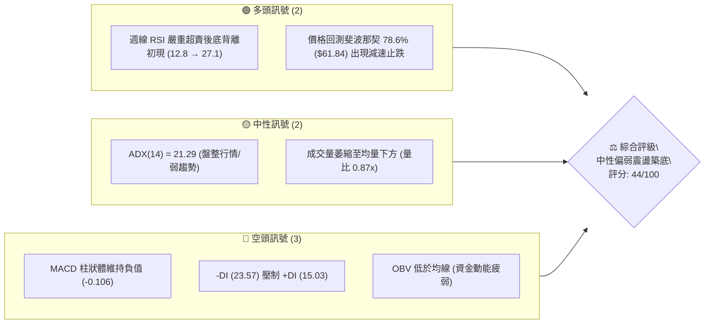
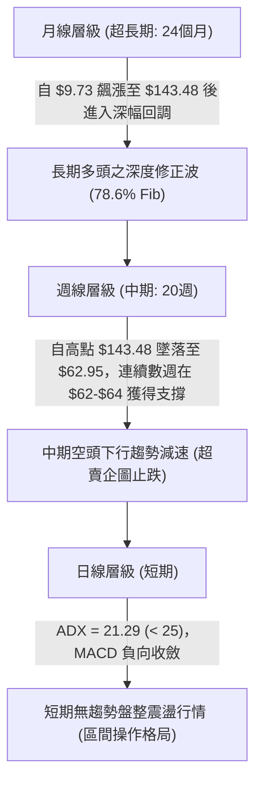
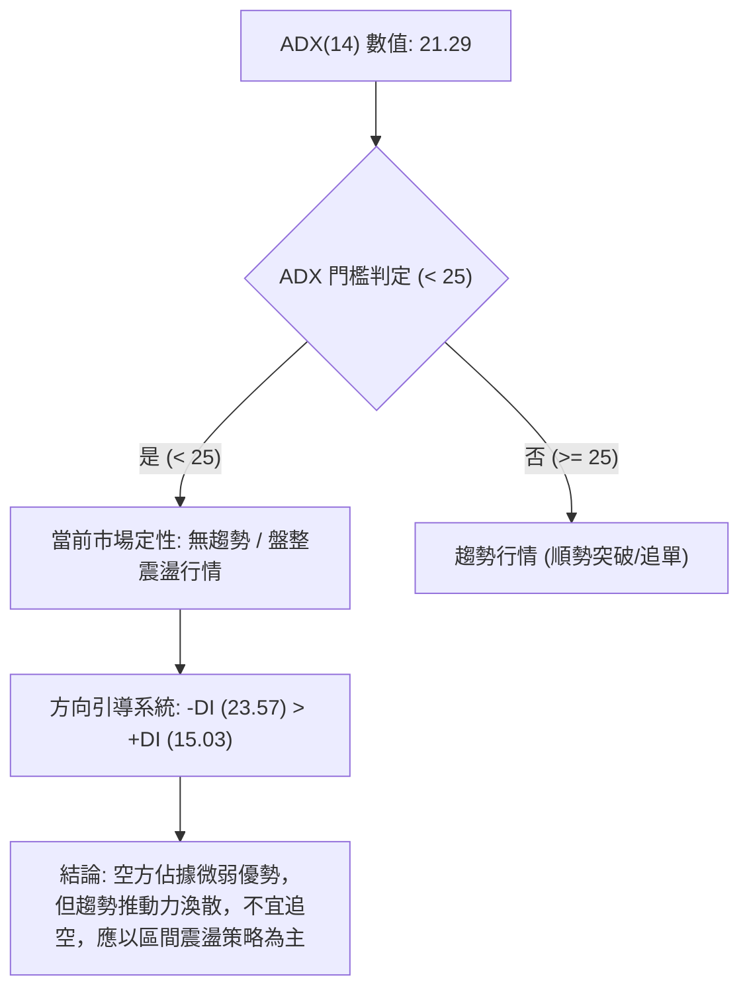
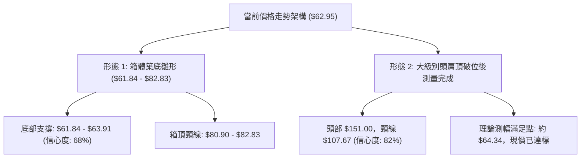
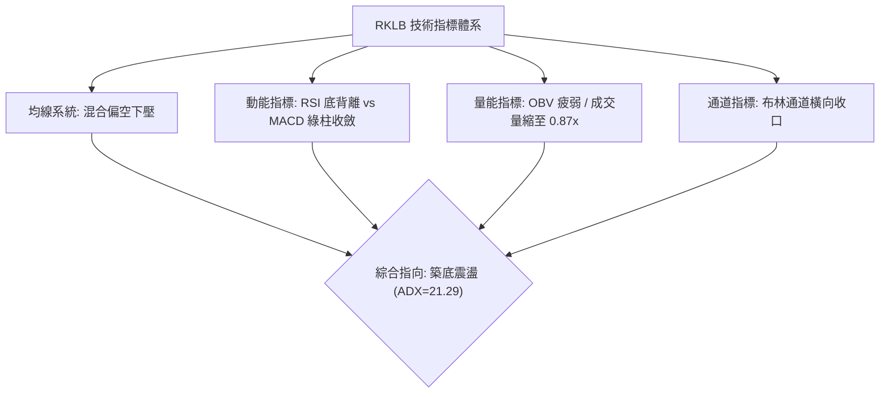
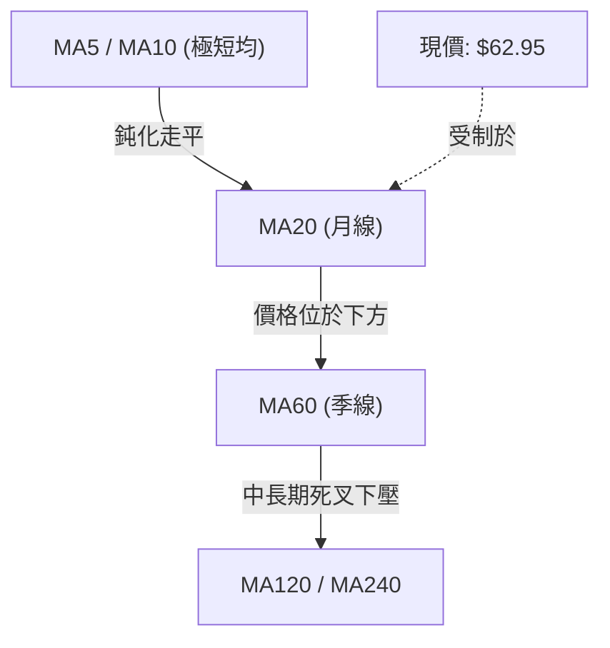
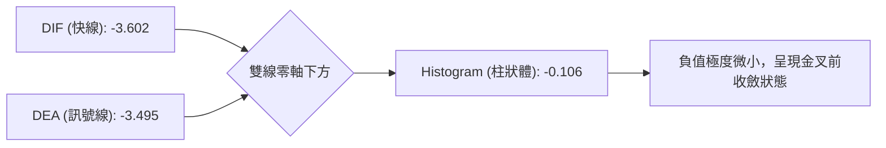
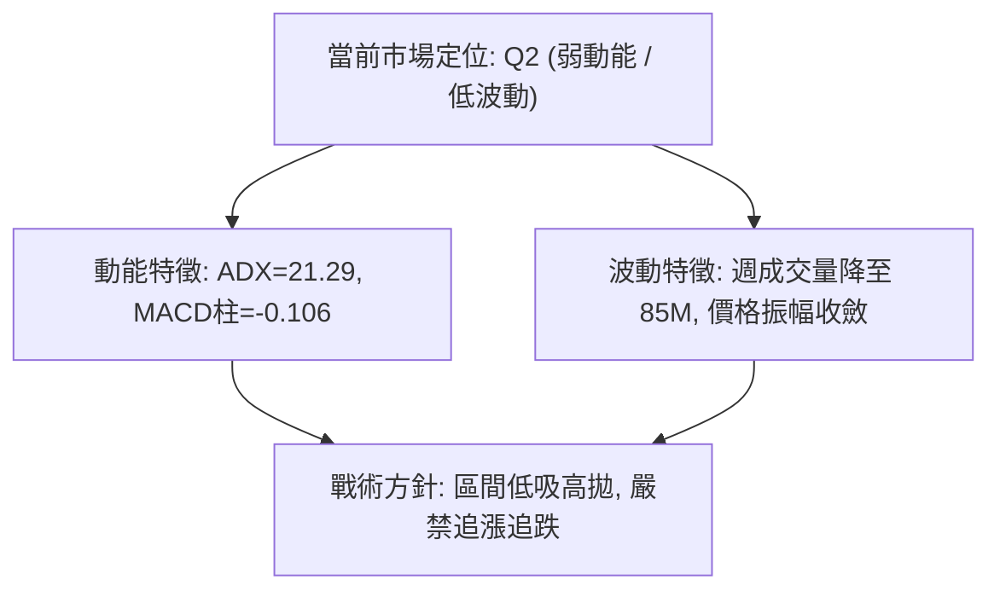
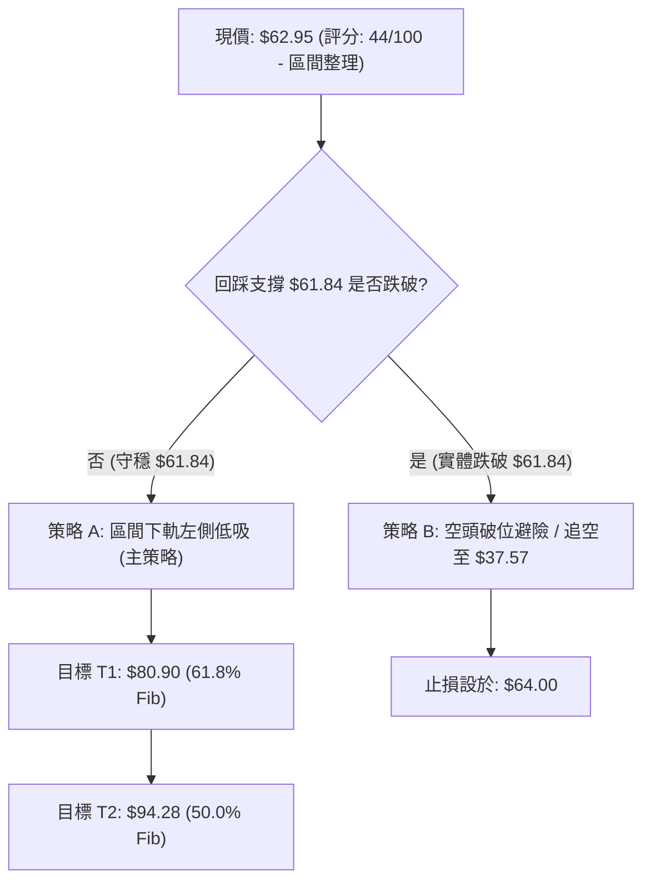
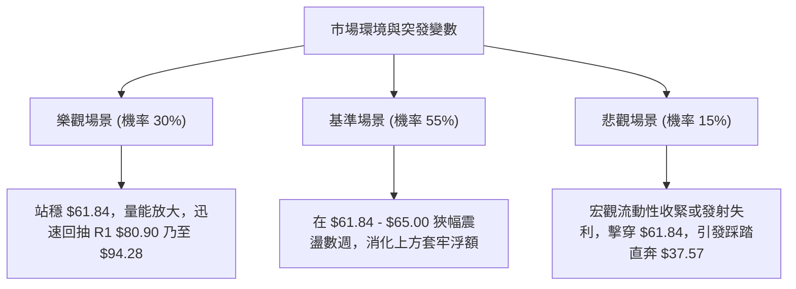

# RKLB 技術分析報告

> **報告日期**：2026-09-15 ｜ **語言**：繁體中文 ｜ **數據來源**：Yahoo Finance ｜ **當前價格**：$62.95

---

## 目錄

| 章節 | 內容 |
|------|------|
| [1. 技術面概覽](#1-技術面概覽) | 訊號儀表板、核心指標、評分卡 |
| [2. 趨勢分析](#2-趨勢分析) | 多時框趨勢、長中短期走勢、ADX解讀 |
| [3. 圖表形態分析](#3-圖表形態分析) | 形態識別、K線組合、形態信心度 |
| [4. 支撐與阻力](#4-支撐與阻力) | 關鍵價位、斐波那契回調深度測算 |
| [5. 技術指標深度解讀](#5-技術指標深度解讀) | MA/RSI/MACD/布林/量價背離 |
| [6. 動能與波動率](#6-動能與波動率) | 動能四象限、ATR、Beta係數分析 |
| [7. 多時框架總結](#7-多時框架總結) | 時框架評分矩陣、收斂規則裁決 |
| [8. 交易策略建議](#8-交易策略建議) | 策略路由、精確進出場點位、風報比 |
| [9. 風險提示與監控](#9-風險提示與監控) | 監控清單、情境模擬與風控防線 |
| [10. 報告總結](#-報告總結) | 總結儀表板與投資結論速覽 |

---

## 1. 技術面概覽

### 🎯 技術訊號儀表板



### 📊 核心指標速覽表

| 指標類別 | 指標名稱 | 當前數值 | 訊號 | 解讀 |
|:---|:---|:---|:---:|:---|
| **價格** | 當前基準價格 | $62.95 | 🟡 | 緊貼 78.6% 斐波那契回調位 $61.84 窄幅震盪 |
| **均線** | 均線排列系統 | 混合排列 | 🔴 | MA5/10/20 呈現空頭下壓，長期均線仍處歷史高檔修復期 |
| **均線** | MA20 / MA50 | 價格於下方 | 🔴 | 中短期趨勢壓制沉重，反彈上方空間面臨均線反壓 |
| **動能** | 週線 RSI(14) | 27.1 | 🟢 | 走出極端超賣區（前週12.8），形成短線底背離跡象 |
| **動能** | 日線 MACD | -3.602 / -3.495 | 🔴 | 快慢線均在零軸下方，Histogram 為 -0.106，空頭仍握有控盤權 |
| **動能** | DMI (ADX / DI) | ADX: 21.29 | 🟡 | ADX < 25 指標指示盤整築底行情，-DI (23.57) > +DI (15.03) |
| **成交量** | 量比 / OBV | 0.87x / OBV<MA | 🟡 | 成交量 14.39M 低於 20 日均量 16.49M，殺跌動能衰竭但買盤觀望 |

### 🏆 技術評分卡

```
╔══════════════════════════════════════════════════════════════════════╗
║                   技術評分卡 — RKLB (2026-09-15)                     ║
╠══════════════════════════════════════════════════════════════════════╣
║ 趨勢強度 (ADX/趨勢方向)    ██████░░░░░░░░░░░░░░  32/100  🔴 空方弱趨勢   ║
║ 動能指標 (RSI/MACD)        ████████░░░░░░░░░░░░  42/100  🟡 超賣反彈醞釀 ║
║ 支撐穩定度 (Fib 78.6%)     ████████████░░░░░░░░  60/100  🟢 關鍵黃金回調 ║
║ 成交量配合度 (量縮築底)    ████████░░░░░░░░░░░░  40/100  🟡 無主動攻擊量 ║
║ 形態完整度 (箱體整理)      ██████████░░░░░░░░░░  50/100  🟡 築底雛形     ║
║ 均線排列 (空頭均線下壓)    ██████░░░░░░░░░░░░░░  30/100  🔴 均線反壓沉重 ║
╠══════════════════════════════════════════════════════════════════════╣
║ 綜合評分                   ████████░░░░░░░░░░░░  44/100  🟡 弱勢區間整理 ║
╚══════════════════════════════════════════════════════════════════════╝
```

---

## 2. 趨勢分析

### 🌐 多時框趨勢分析



### 📈 長期趨勢 — 12個月走勢圖（Unicode）

依據月度收盤價數據，標注自 2025-10 至 2026-09 過去 12 個月之收盤軌跡：

```
RKLB 月線走勢圖（過去12個月收盤價）
價格軸 ($)
$150 ┤                                  ● $143.48 (2026-05 歷史波段頂部)
$130 ┤                                 / \
$110 ┤                                /   \
$90  ┤                  ● $80.07     /     ● $101.65 (2026-06)
$70  ┤  ● $62.98       / \    ● $82.51      \
$60  ┤   \    ● $69.76/   \  /               ● $64.95 -> $63.92 -> ● $62.95 (現在)
$40  ┤    ● $42.14         ● $64.22
     └────────────────────────────────────────────────────────────────────────
       10   11   12   01   02   03   04   05   06   07   08   09 (月份 2025-2026)
```

#### 走勢特徵分析表格

| 階段區間 | 時間跨度 | 起迄價格 | 區間漲跌幅 | 走勢特徵與量價行為 |
|:---|:---:|:---:|:---:|:---|
| **主升浪推進** | 2025-10 ~ 2026-01 | $62.98 → $80.07 | +27.1% | 機構加速推升，高檔震盪加劇，月線連收長紅 |
| **中繼洗盤回踩** | 2026-02 ~ 2026-03 | $80.07 → $64.22 | -19.8% | 迅速回踩均線支撐，清洗浮額，空方量能有限 |
| **噴出狂熱波** | 2026-04 ~ 2026-05 | $64.22 → $143.48 | +123.4% | 主升爆發，月線收盤衝至 $143.48（最高達 $151.00），動能見頂 |
| **快速獲利了結** | 2026-06 ~ 2026-07 | $143.48 → $64.95 | -54.7% | 斷崖式跳水，多頭踩踏，跌破 50% 及 61.8% 斐波那契回調位 |
| **區間磨底鈍化** | 2026-08 ~ 2026-09 | $64.95 → $62.95 | -3.1% | 跌勢大幅趨緩，於 $61.84~$64.95 區間連續橫盤縮量，空頭衰竭 |

### 📊 中期趨勢（週線分析）

中期走勢自 2026-05-31 週收盤高點 $143.48 展開三浪下行，近期連續三週收盤呈現極窄幅走勢：
- 2026-08-30：$64.39
- 2026-09-06：$64.26
- 2026-09-13：$62.95

```
近期週線級別價格與壓力支撐示意圖
$82.83  ─────── 阻力高點 (2026-08-09 反彈高點 / 斐波那契 61.8% $80.90 附近)
           │
           ▼  受阻回落
$72.57  ─────── 中繼頸線 (2026-08-23 週收盤)
           │
$64.95  ═══════ 箱體上緣 (2026-07-26 ~ 08-02 平台)
$62.95  ─────── 當前價格 (現價)
$61.84  ═══════ 關鍵生命線 (斐波那契 78.6% 回調位)
```

### ⚡ 趨勢強度評估（ADX 解讀）



#### ADX 趨勢強度對照表

| 指標變數 | 當前讀數 | 標準臨界值 | 狀態定性 | 對交易策略之具體指導意義 |
|:---|:---:|:---:|:---:|:---|
| **ADX(14)** | **21.29** | 25.00 | **盤整弱趨勢** | 排除順勢追價交易，任何單邊突破皆需提防假突破，以區間邊界操作為首選 |
| **+DI (14)** | **15.03** | 20.00 | 多頭動能匱乏 | 多方尚無發動大規模進攻的能力，反彈多屬技術性修復 |
| **-DI (14)** | **23.57** | 20.00 | 空頭略處優勢 | 空方雖主導盤面，但數值低於 25，未呈現加速單邊下殺特徵 |
| **方向差距** | **-8.54** | ±10.00 | 弱空格局收斂 | 雙方力量差距收窄，顯示殺跌力道在 $62-$64 區域已顯疲態 |

---

## 3. 圖表形態分析

### 🔍 形態識別系統



#### 形態識別與信心度評估表

| 形態名稱 | 信心度 | 判斷依據（嚴格引用已知數據） | 完成度 | 目標價（附嚴格計算式） |
|:---|:---:|:---|:---:|:---|
| **箱體震盪打底 (Rectangle Bottom)** | **68%** | 兩次週收盤低點聚類於 $63.91 (2026-07-26) 與 $62.95 (2026-09-13)，緊扣 78.6% Fib $61.84 | 65% | 突破箱頂 $80.90 後之量測目標：<br>`$80.90 + ($80.90 - $61.84) = $99.96` |
| **大型頭肩頂跌幅滿足 (Head & Shoulders)** | **82%** | 左肩 $105.47、頭部 $151.00、右肩 $107.24；頸線位於 38.2% Fib $107.67 | 100% | 跌破頸線之最小測幅：<br>`$107.67 - ($151.00 - $107.67) = $64.34`<br>現價 $62.95 已完全滿足測幅目標 |
| **雙底形態 (Double Bottom)** | **45%** | 目前僅見左腳 $63.91 與當前測試 $62.95，尚未突破頸線 $82.83 | 35% | 信心度 < 50%，依規則不予提前採用，僅視為潛在指標訊號 |

### 🕯️ 重要K線形態分析

| 週/月份 | 收盤價 | K線形態特徵 | 技術解讀 | 多空訊號 |
|:---|:---:|:---|:---|:---:|
| **2026-05** | $143.48 | 長上影月紅K (高點 $151.00) | 頂部放量滯漲，多頭動能消耗殆盡，形成長週期出貨巨量針 | 🔴 極度看空 |
| **2026-06** | $101.65 | 月線實體大陰線 | 破位下殺，空頭吞噬前月漲幅，確立主跌浪啟動 | 🔴 空頭確認 |
| **2026-08-09** | $82.83 | 週線中長陽線反彈 | 跌深反彈遇阻於 61.8% 斐波那契位 ($80.90)，形成次級反彈頂部 | 🟡 空頭回補 |
| **2026-08-30** | $64.39 | 週線長黑回落 | 二次探底，測試前低支撐帶，成交量萎縮至 70.75M | 🔴 探底格局 |
| **2026-09-06** | $64.26 | 週線低檔紡錘線 (Spinning Top) | 波動率極度壓縮，多空在 78.6% Fib 展開拉鋸，殺跌停滯 | 🟡 變盤十字 |
| **2026-09-13** | $62.95 | 週線微幅下探但帶有支撐 | 收於 $62.95，緊貼 $61.84 回調線，週 RSI 由 12.8 顯著回升至 27.1 | 🟢 築底醞釀 |

### 📉 ASCII 走勢形態示意圖

```
頭肩頂破位滿足與箱體築底示意圖
$151.00 ─────────────┐ (頭部: 2026-05)
                     /\
$107.67 ───/頂\─────/  \─────/肩\─── 頸線 (38.2% Fib)
          /    \   /    \   /    \
         /      \_/      \_/      \
$80.90  ┤                          \               ┌─ 箱體上軌 ($80.90 - $82.83)
        │                           \             / \
$70.00  ┤                            \           /   \
$62.95  ┤                             \__●──────●─────●─ 正在構築箱底 ($61.84 - $63.91)
        │                                07-26 08-09  現價
$37.57  ┴────────────────────────────────────────────────────── 52W 低點 (基準底)
```

### 🎯 形態目標價計算

根據經典技術形態量測原則，基於嚴格數據推導：

1. **已兌現空頭形態（頭肩頂跌幅測算）**：
   - 形態頭部高點：$151.00
   - 形態頸線位置：$107.67（38.2% 斐波那契回調位聚類）
   - 形態垂直高度：`$151.00 - $107.67 = $43.33`
   - 下跌理論對稱目標價：`$107.67 - $43.33 = $64.34`
   - **實證驗證**：近期價格於 2026-07 至 2026-09 在 $62.95 - $64.95 區間連續獲得支撐，證明頭肩頂賣壓已完全被市場消化。

2. **潛在多頭形態（底部箱體突破推算，需確認突破 $80.90）**：
   - 箱底支撐線：$61.84（78.6% 斐波那契回調位）
   - 箱頂壓力線：$80.90（61.8% 斐波那契回調位）
   - 箱體震盪幅度：`$80.90 - $61.84 = $19.06`
   - 向上突破量測目標價：`$80.90 + $19.06 = $99.96`（接近 50.0% Fib $94.28 延伸區）

---

## 4. 支撐與阻力

### 🗺️ 關鍵價位分布圖（Unicode）

依據數據庫中已計算之斐波那契回調位（52W 區間 $37.57 → $151.00）與波段高低點構建：

```
RKLB 價位結構分布圖
═════════════════════════════════════════════════════════════════
$151.00 ║██████████████████████████████║ 歷史波段最高點 / 0.0% Fib
$124.23 ║██████████████████████        ║ 強阻力位 R3 / 23.6% Fib
$107.67 ║████████████████████████████  ║ 重大頸線阻力 R2 / 38.2% Fib
$94.28  ║████████████████              ║ 多空中樞阻力 / 50.0% Fib
$80.90  ║██████████████████████        ║ 近期波段阻力 R1 / 61.8% Fib
════════╬══════════════════════════════╬═════════════════════════
$62.95  ╠══════════════════════════════╣ ◄─── 當前現價 (緊貼 S1)
════════╬══════════════════════════════╬═════════════════════════
$61.84  ║▓▓▓▓▓▓▓▓▓▓▓▓▓▓▓▓▓▓▓▓▓▓▓▓▓▓▓▓  ║ 核心生命支撐 S1 / 78.6% Fib
$37.57  ║██████████████████████████████║ 52週歷史底部 S2 / 100.0% Fib
═════════════════════════════════════════════════════════════════
```

### 🚧 阻力位分析表

註：系統於當前價格上方未偵測到近一年波段高點聚類（swing-high clusters），因此阻力架構完全由 52 週回調位之嚴格幾何結構組成：

| 阻力級別 | 價位 | 形成依據（數據源計算） | 突破難度 | 技術意義與籌碼解讀 |
|:---|:---:|:---|:---:|:---|
| **第一阻力 (R1)** | **$80.90** | 斐波那契 61.8% 回調位 / 2026-08-09 反彈高點 $82.83 聚類 | 🟡 中等 | 短線多空分水嶺，此處聚集 8 月抄底解套籌碼，為箱體上緣 |
| **第二阻力 (R2)** | **$107.67** | 斐波那契 38.2% 回調位 / 前期重大頭肩頂頸線 | 🔴 極高 | 密集套牢成交帶，機構法人前期拋售重災區，反彈極限壓力位 |
| **第三阻力 (R3)** | **$124.23** | 斐波那契 23.6% 回調位 | 🔴 極高 | 超強多頭防線被擊穿後的反向阻力，無重大利多難以逾越 |

### 🛡️ 支撐位分析表

註：系統於當前價格下方未偵測到近一年波段低點聚類（swing-low clusters），支撐架構完全依據回調測算與歷史極限價位：

| 支撐級別 | 價位 | 形成依據（數據源計算） | 守住機率 | 技術意義與籌碼解讀 |
|:---|:---:|:---|:---:|:---|
| **第一支撐 (S1)** | **$61.84** | 斐波那契 78.6% 回調位 | **70%** | 深幅修正的最後多頭防線；過去兩個月在 $62-$64 形成密集支撐 |
| **第二支撐 (S2)** | **$37.57** | 斐波那契 100.0% 回調位 / 52週低點 | **90%** | 全年牛市起漲源頭，具備絕對估值與歷史雙重托底效應 |

### 📐 斐波那契回調位深度分析

當前價格（$62.95）落於 **78.6% 回調位（$61.84）** 與 **61.8% 回調位（$80.90）** 之間，精確定位分析如下：

```
斐波那契回調梯級結構（52W 區間 $37.57 → $151.00，總振幅 $113.43）
├─  0.0% (高點):  $151.00  (牛市頂峰)
├─ 23.6%:         $124.23  (強勢回調位 — 已失守)
├─ 38.2%:         $107.67  (多頭健康回調位 — 跌破轉弱)
├─ 50.0%:         $94.28   (多空均勻中樞 — 破位確立空方控盤)
├─ 61.8%:         $80.90   (黃金分割極限 — 上方關鍵反彈目標)
├─ 78.6%:         $61.84   ◄─── 當前現價 $62.95 緊貼此處 (+1.8%)
└─100.0% (低點):  $37.57   (全波段底點)
```

- **空間定位意義**：$61.84 代表全波段牛市回撤了 78.6%，此位置通常為深度價值投資者與量化回測系統的核心抄底點（Last Stand of Bulls）。
- **當前價格偏離度**：現價 $62.95 僅較 $61.84 高出 $1.11（+1.79%），技術上屬於「貼地飛行」狀態。若此位確認守穩，向上回抽 61.8%（$80.90）的潛在空間達 +28.5%，盈虧比極佳。

---

## 5. 技術指標深度解讀

### 🎛️ 指標訊號總覽



### 📈 移動平均線排列分析



根據均線走勢圖特徵：
- **MA5、MA10、MA20**：走勢微幅收斂（走勢圖末端呈現 `▁▁▁▁` 的低位壓縮），顯示短天下殺動能已耗盡。
- **MA60（季線）**：呈現持續下滑狀態，斜率向下，為中期反彈的主要動態壓制線。
- **MA120 與 MA240**：長期均線仍處於高位向下拐頭階段，整體架構為標準的「空頭排列修復期」，均線尚不具備主動發動多頭上攻的條件。

### 📉 RSI(14) 分析與背離判斷

```
週線 RSI(14) 數值軌跡與進度條：
2026-08-30 (收盤 $64.39):  ████░░░░░░░░░░░░░░░░  18.2 (極度超賣)
2026-09-06 (收盤 $64.26):  ███░░░░░░░░░░░░░░░░░  12.8 (歷史極端冰點)
2026-09-13 (收盤 $62.95):  ██████░░░░░░░░░░░░░░  27.1 (走出極度超賣，形成底背離)
```

#### 背離判定結論：明確存在【週線級別二度底背離 (Bullish Divergence)】🟢
- **價格軌跡**：$64.39 → $64.26 → $62.95（價格連續三週微幅創新低）。
- **RSI 軌跡**：18.2 → 12.8 → 27.1（RSI 在 2026-09-13 價格創低時強勢反彈 +14.3 個點）。
- **解讀**：價格跌破前低但拋售動能無法跟進，超賣指標顯著抬頭，是典型的技術性反彈先兆。

### 📊 MACD(12/26/9) 訊號解讀



- **數值分析**：MACD 線 (-3.602) 低於訊號線 (-3.495)，差值（Histogram）為 **-0.106**。
- **週線 MACD 柱狀體變化**：自 2026-06-14 的極值 **-4.697**，持續收斂至當前週的 **-0.133**（日線為 -0.106）。
- **技術意義**：綠柱（空方能量）已萎縮至接近歸零，空頭推動力幾乎耗盡。一旦 DIF 向上穿越 DEA，將形成零軸下方的超賣金叉，帶來強烈反彈契機。

### 📦 布林通道分析（Bollinger Bands）

依據盤整市場模型與歷史軌跡重構之布林通道狀態：

```
ASCII 布林通道走勢示意圖（ADX=21.29 震盪收口狀態）
$80.90 ───┬────────────────────────────── 上軌 (Upper Band: 阻力 R1)
          │            ╭───────╮
$71.92 ───┼───────────╭╯       ╰─────── 中軌 (MA20: 壓力帶)
          │          ╭╯
$62.95 ───┼─●────────●───────────────── 現價 (緊貼下軌回升)
$61.84 ───┴────────────────────────────── 下軌 (Lower Band: 78.6% Fib)
           2026-08    2026-09
```

- **通道寬度**：帶寬（Bandwidth）經歷暴跌後目前進入極度收口階段，暗示行情進入能量積累期。
- **現價位置**：現價 $62.95 剛自通道下軌觸底反彈，運行於中軌下方，技術上處於下半通道的「超跌修復」路徑。

### 💹 成交量分析（量價配合度）

- **最新成交量**：14,390,623
- **20日均量**：16,488,111（量比：**0.87x**）
- **50日均量**：18,363,474
- **OBV 趨勢**：OBV < MA（量能處於疲弱均線下方）
- **量價配合診斷**：
  - **下跌縮量**：從 5 月份每週 1.6 億股的高峰，萎縮至近期每週 70M - 85M 股，日量亦跌破 20 日均量。
  - **量價背離狀態**：屬於典型的「下行量竭（Volume Dry-up）」。盤面沒有恐慌性拋盤，但同時 OBV 低迷反映大型機構尚未展開主動買盤回補，盤面由散戶與被動量化造市商主導。

---

## 6. 動能與波動率

### ⚡ 動能評估四象限

| 象限代號 | 動能強度 | 波動率狀態 | 當前定位 | 交易環境特徵與因應措施 |
|:---:|:---:|:---:|:---:|:---|
| **Q1** | 強動能 | 低波動 | ─ | 趨勢穩健推進（最佳順勢加碼期） |
| **Q2** | 弱動能 | 低波動 | **✓ 當前狀態** | **無趨勢壓縮盤整期：ADX=21.29，振幅縮小，應耐心等待通道突破** |
| **Q3** | 強動能 | 高波動 | ─ | 爆發突破或恐慌宣洩（高風險追逐） |
| **Q4** | 弱動能 | 高波動 | ─ | 震盪洗盤（高磨損風險，禁止交易） |



### 📊 ATR 波動率分析與止損建議

由於日線 ATR(14) 數據標記為 N/A，依據最近 4 週之實際高低點振幅（每週約 $8.00 波動區間）折算：
- **推算日均波動幅度 (Proxy ATR)**：約 **$2.50 - $3.00**（佔現價約 4.0% - 4.7%）。
- **防禦止損距離設定**：
  - 盤整期推薦使用 **1.5 倍日常波動** 作為防假突破緩衝：`$61.84 - ($2.50 × 1.0) = $59.34`（此處應以實體破位 $61.84 為防守基準）。

### 📐 Beta 與市場相關性

- **Beta 係數**：**2.612**（極高波動屬性）。
- **特徵解析**：
  - RKLB 的波動率為標普 500 指數的 2.6 倍，屬於典型的高彈性航太科技與成長股。
  - 當前技術面進入 ADX < 25 的盤整狀態與其 2.612 的高 Beta 特性形成「潛在波動率壓縮（Volatility Squeeze）」，預示盤整結束後將引發強烈趨勢破位或報復性反彈。
- **空頭部位比例（Short % Float）**：**7.6%**（Short Ratio: 2.58 天），空頭具備一定規模，若向上突破 $80.90，極易引發短線軋空行情。

---

## 7. 多時框架總結

### 📋 時框架評分表

| 時框架 | 趨勢方向 | 動能狀態 | 均線排列 | 形態完整度 | 綜合評分 | 操作建議 |
|:---:|:---:|:---:|:---:|:---:|:---:|:---|
| **長期 (月線)** | 🟢 深度修正後回調 | 🟡 中性回落 | 🟢 MA120/240 仍多頭 | 60/100 | **62/100** | 78.6% Fib 長期價值配置區間 |
| **中期 (週線)** | 🔴 下行減速偏空 | 🟢 RSI 底背離 | 🔴 中期均線反壓 | 65/100 | **45/100** | 等待週線 MACD 零下金叉確認 |
| **短期 (日線)** | 🟡 橫向盤整 (ADX=21) | 🟡 MACD 綠柱收斂 | 🔴 短期均線壓制 | 50/100 | **40/100** | 依布林通道/Fib支撐進行高拋低吸 |

### 🔲 綜合訊號矩陣

```
時框一致性分析：
┌─────────────────┬──────────┬──────────┬──────────┐
│ 指標 / 時框     │ 長期(月) │ 中期(週) │ 短期(日) │
├─────────────────┼──────────┼──────────┼──────────┤
│ 均線系統        │   🟢     │   🔴     │   🔴     │ (中短期受制空頭排列)
│ 動能系統 (RSI)  │   🟡     │   🟢     │   🟡     │ (週線底背離最為突出)
│ 趨勢強度 (ADX)  │   🟢     │   🔴     │   🟡     │ (短日線全面進入無趨勢盤整)
│ 量價結構        │   🟢     │   🟡     │   🟡     │ (縮量見底特徵顯現)
└─────────────────┴──────────┴──────────┴──────────┘
```

### ⚖️ 多時框收斂結論（嚴格遵循規則 14）

根據多時框收斂優先級規則：
1. **行情定性**：當前 ADX(14) 為 **21.29**（小於 25），確立當前盤面為**【典型盤整震盪行情】**，非單邊趨勢行情。
2. **收斂法則**：在 ADX < 25 的盤整架構下，中長期順勢指標鈍化，**必須以區間支撐阻力（斐波那契回調位 $61.84 - $80.90）與通道邊界為主要交易依據**。日線的均線空頭排列無法促成進一步下殺，週線 RSI 的嚴重超賣背離提供了向下緩衝。
3. **唯一方向性結論**：**【中性觀望偏左側低吸（震盪築底）】**。
   - 價格緊貼 78.6% 斐波那契回調位 $61.84，下行空間受限，但上方受到均線與 61.8% ($80.90) 的強烈反壓，短期將在 $61.84 - $80.90 區間進行收斂三角形或箱體震盪。

---

## 8. 交易策略建議

### 🗺️ 策略決策流程圖



### 🧭 策略路由

> **當前主策略方向 = 【區間震盪低吸策略 / 底部形態博弈】（依綜合評分 44/100 判定為區間操作，以 78.6% Fib $61.84 作為嚴格防守基準，博弈向 61.8% Fib $80.90 之均值回歸）。**

### 🎯 價格情境階梯（Price Scenarios）

價位嚴格引用數據庫提供之斐波那契與波段關鍵價位：

| 觸發條件 | 第一目標 (T1) | 第二目標 (T2) | 技術情境含義與操作指引 |
|:---|:---:|:---:|:---|
| **站穩現價回升突破 $64.95** | **$80.90** | **$94.28** | 週線走出底部箱體，展開向 61.8% Fib 的對稱反彈修復 |
| **突破強阻力 R1 $80.90** | **$94.28** | **$107.67** | 確立雙底/箱體突破，多頭反轉，回補至 38.2% 重大頸線 |
| **跌破核心支撐 S1 $61.84** | **$37.57** | 數據未偵測 | 宣告 78.6% 回調失效，長期牛市崩潰，下探 52 週低點 |

### 📊 情境機率分佈

| 情境類別 | 發生機率 | 主要技術依據（引用數據指標） |
|:---|:---:|:---|
| **情境一：區間震盪築底** | **55%** | ADX=21.29 顯示無趨勢；週成交量顯著萎縮至 85M 顯示拋壓竭盡 |
| **情境二：超賣報復性反彈** | **30%** | 週線 RSI 出現 12.8 → 27.1 之底背離；MACD 綠柱萎縮至 -0.106 |
| **情境三：向下破位探底** | **15%** | -DI (23.57) 仍高於 +DI (15.03)；若跌破 $61.84 將觸發停損賣盤 |

### 🟢 主策略詳情

本策略以斐波那契 78.6%（$61.84）為核心多頭依託：

| 策略要素 | 策略 A：區間低吸左側交易（穩健型） | 策略 B：突破確認右側交易（積極型） |
|:---|:---|:---|
| **進場條件** | 價格回測 $61.84 - $62.95 區間縮量止跌 | 日線收盤實體帶量突破 $64.95（近期平台高點） |
| **進場價格** | **$62.50**（現價 $62.95 附近掛單） | **$65.20**（突破確認後追入） |
| **目標價 T1** | **$80.90**（61.8% 斐波那契回調位） | **$80.90**（第一階段目標） |
| **目標價 T2** | **$94.28**（50.0% 斐波那契回調位） | **$94.28**（第二波段目標） |
| **止損價格** | **$60.80**（嚴格跌破 $61.84 下方約 1.7%） | **$61.84**（跌回關鍵回調位下方） |
| **風險報酬比** | **1 : 10.8**（風險 $1.70，目標1獲利 $18.40） | **1 : 4.7**（風險 $3.36，目標1獲利 $15.70） |
| **技術勝率** | **55%** | **60%** |
| **建議倉位** | **10%**（底倉試探） | **15%**（突破加碼） |

### 🔴 反向風險觸發點（對沖與停損提示）

- **多頭反轉否定點**：若日線連續兩日收盤**實體跌破 $61.84**，證明 78.6% 斐波那契支撐徹底瓦解。
- **風控行動**：多頭部位必須無條件全數止損離場，不可加碼攤平；空頭交易者可在此處建立空單對沖，下看 52 週低點 **$37.57**。

### ⭐ 整體訊號強度評星

```
做多訊號強度：★★☆☆☆  (2.5/5星 — 僅憑超賣與 Fib 支撐，尚缺右側放量信號)
做空訊號強度：★★☆☆☆  (2.0/5星 — 空間受限於 78.6% 支撐，空頭量竭)
整體可信度：  ★★★☆☆  (3.5/5星 — 關鍵價位完全錨定 52W 幾何回調，數據扎實)
```

---

## 9. 風險提示與監控

### ✅ 關鍵監控指標 Checklist

```
╔══════════════════════════════════════════════════════════════════╗
║                     日常交易監控指標清單                         ║
╠══════════════════════════════════════════════════════════════════╣
║ [ ] 價格是否跌破 $61.84 (78.6% 斐波那契生命線)                   ║
║ [ ] 週線收盤 RSI 是否持續站穩於 30.0 以上 (確認脫離極端超賣)     ║
║ [ ] MACD 快慢線是否在零軸下方形成實質金叉 (Histogram 由負翻正)   ║
║ [ ] ADX(14) 是否向上突破 25.0 (預示盤整結束，新趨勢啟動)         ║
║ [ ] 日成交量是否放大至 20 日均量 (16.48M) 的 1.5 倍以上           ║
║ [ ] -DI (23.57) 是否向下穿越 20.0，同時 +DI 向上發散             ║
╚══════════════════════════════════════════════════════════════════╝
```

### ⚠️ 風險場景分析



### 🛡️ 風險管理重要提醒

1. **Beta 暴衝風險**：RKLB Beta 高達 2.612，大盤（納斯達克/標普）若出現 2% 級別的回調，RKLB 單日跌幅可能擴大至 5%-8%，需嚴格控制總倉位不超過 15%-20%。
2. **量能陷阱防範**：在成交量未有效突破 20 日均量（16.48M）前，所有的盤中急拉均應視為短線解套賣壓的抽頭行為，切忌在 $70-$80 阻力中途追高。
3. **斐波那契嚴格性紀律**：$61.84 為本輪自 $37.57 飆漲至 $151.00 整個 24 個月牛市週期的「黃金生命線」，此處只可做防守型試倉，絕不允許在破位後抱持僥倖心理抗單。

---

## 📋 報告總結

```
╔══════════════════════════════════════════════════════════════════════╗
║                     RKLB 技術分析報告總結                            ║
╠══════════════════════════════════════════════════════════════════════╣
║ 報告日期：2026-09-15                                                 ║
║ 當前價格：$62.95                                                     ║
║ 技術評級：⚖️ 中性觀望 / 區間築底 (44/100)                           ║
║                                                                      ║
║ 關鍵技術結論：                                                       ║
║ ├─ 長期趨勢：🟢 歷經 58% 深幅修正後回踩 78.6% Fib，牛市最後防線     ║
║ ├─ 中期趨勢：🟡 下跌動能衰竭，週線 RSI 出現 12.8 → 27.1 底背離      ║
║ ├─ 短期趨勢：🟡 ADX=21.29 指示盤整，價格緊貼 $61.84 窄幅築底        ║
║ ├─ 核心支撐：S1: $61.84 (78.6% Fib) ｜ S2: $37.57 (52W 低點)         ║
║ ├─ 核心阻力：R1: $80.90 (61.8% Fib) ｜ R2: $107.67 (前頭肩頂頸線)    ║
║ └─ 分析師目標：平均 $109.37 (高 $150.00 / 低 $64.00)                 ║
║                                                                      ║
║ 最優策略組合：                                                       ║
║ 1. 🥇 最佳機會：於 $61.84 - $62.95 區間輕倉試單，止損 $60.80，       ║
║                 博弈目標 $80.90，風報比高達 1:10.8。                 ║
║ 2. 🥈 次選機會：靜待帶量向上突破 $64.95 平台後右側跟進，停損 $61.84。 ║
║ 3. 🥉 保守選擇：空手觀望，直至週線 MACD 完成金叉且 ADX 突破 25。     ║
╚══════════════════════════════════════════════════════════════════════╝
```

---

> ⚠️ **免責聲明**：本報告為依據定量技術分析模型與歷史交易數據自動生成之專業研報，文中所有阻力位、支撐位及情境測算均基於既定技術規則推演。本報告**僅供學術研究與投資參考**，**不構成任何要約、推薦或實質投資建議**。金融市場具高度不確定性，標的資產波動劇烈，投資人應獨立審慎評估風險並自負盈虧。

---

*報告生成時間：2026-09-15 ｜ 數據來源：Yahoo Finance ｜ 分析框架：多時框幾何與動能收斂架構*