# RKLB 技術分析報告

> **報告日期**：2026-09-20 ｜ **語言**：繁體中文 ｜ **數據來源**：Yahoo Finance ｜ **當前價格**：$64.57

---

## 目錄

| 章節 | 內容 |
|------|------|
| [1. 技術面概覽](#1-技術面概覽) | 訊號儀表板、核心指標、評分卡 |
| [2. 趨勢分析](#2-趨勢分析) | 多時框趨勢、長中短期走勢 |
| [3. 圖表形態分析](#3-圖表形態分析) | 形態識別、K線組合、目標價 |
| [4. 支撐與阻力](#4-支撐與阻力) | 關鍵價位、斐波那契回調 |
| [5. 技術指標深度解讀](#5-技術指標深度解讀) | MA/RSI/MACD/布林/成交量 |
| [6. 動能與波動率](#6-動能與波動率) | 動能評估、ATR、Beta |
| [7. 多時框架總結](#7-多時框架總結) | 時框架評分矩陣 |
| [8. 交易策略建議](#8-交易策略建議) | 多空策略、風險報酬比 |
| [9. 風險提示與監控](#9-風險提示與監控) | 監控指標、風險場景 |

---

## 1. 技術面概覽

### 🎯 技術訊號儀表板

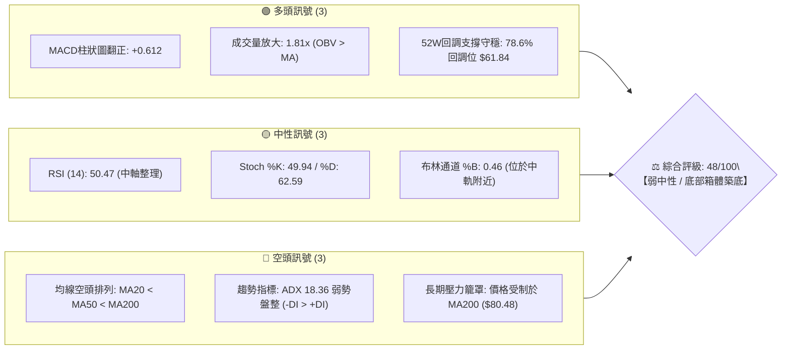

### 📊 核心指標速覽表

| 指標類別 | 指標名稱 | 當前數值 | 訊號 | 解讀 |
|:---|:---|:---|:---:|:---|
| **價格** | 當前價格 | $64.57 | 🟡 | 位於52週區間 23.8%，處於自高點大幅回落後的低檔沉澱區 |
| **均線** | MA20 | $64.98 | 🟡 | 價格貼近中軌下方 -0.63%，短期呈現走平糾結 |
| **均線** | MA50 | $69.89 | 🔴 | 價格低於MA50達 -7.61%，中期下行壓力仍存 |
| **均線** | MA200 | $80.48 | 🔴 | 價格低於牛熊分界線 -19.77%，長期趨勢處於修復期 |
| **動能** | RSI(14) | 50.47 | 🟡 | 自超賣區回升至中軸，多空力量暫時達到動態平衡 |
| **動能** | MACD | -2.486 / -3.098 | 🟢 | 快線位於慢線上方，柱狀圖正值（+0.612），呈現低檔金叉底背離修復 |
| **趨勢** | ADX(14) | 18.36 | 🟡 | 數值 < 25 表明無強烈單邊趨勢，進入箱體震盪盤整市 |
| **波動** | ATR(14) | $3.09 | 🟡 | 佔股價 4.78%，波動率較高點顯著收斂，有利於區間交易 |

### 🏆 技術評分卡

```
╔══════════════════════════════════════════════════════════════╗
║               技術評分卡 — RKLB (2026-09-20)                 ║
╠══════════════════════════════════════════════════════════════╣
║ 趨勢強度 (ADX=18.36)  ██████░░░░░░░░░░░░░░  30/100 🔴 弱勢/無方向  ║
║ 動能指標 (RSI/MACD)   ████████████░░░░░░░░  60/100 🟢 底背離修復  ║
║ 支撐穩定度 (S1/S2)    ██████████████░░░░░░  70/100 🟢 78.6%支撐強 ║
║ 成交量配合 (1.81x)    ██████████████░░░░░░  70/100 🟢 底部放量進駐 ║
║ 形態完整度 (箱體)     ██████████░░░░░░░░░░  50/100 🟡 雙底構築中  ║
║ 均線排列 (空頭排列)   ██░░░░░░░░░░░░░░░░░░  10/100 🔴 MA20<50<200 ║
╠══════════════════════════════════════════════════════════════╣
║ 綜合技術評分          █████████░░░░░░░░░░░  48/100 🟡 中性觀望/區間║
╚══════════════════════════════════════════════════════════════╝
```

---

## 2. 趨勢分析

### 🌐 多時框趨勢分析

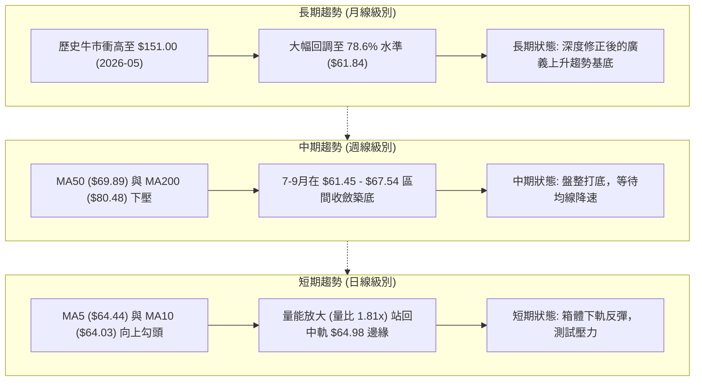

### 📈 長期趨勢 — 12個月走勢圖（Unicode）

```
RKLB 月線走勢圖（2025-10 至 2026-09）
價格 ($)
$151.00 ┤                             ● (2026-05 收盤: $143.48, 最高: $151.00)
$140.00 ┤                            ╱ ╲
$120.00 ┤                           ╱   ╲
$100.00 ┤                          ╱     ● (2026-06: $101.65)
 $80.00 ┤              ●          ●       ╲
 $70.00 ┤      ●      ╱ ╲        ╱         ╲
 $60.00 ┤●    ╱ ╲    ╱   ●      ╱           ●━━━━●━━━━● ($64.57 沉澱現價)
 $40.00 ┤ ╲  ╱   ●──┘    (03)  ╱            (07) (08) (09)
 $30.00 ┤  ● (11: $42.14)      ╱
        └──────────────────────────────────────────────────────────
         10  11  12  01  02  03  04  05  06  07  08  09 (月份 25-26)
```

**走勢特徵分析表格**：

| 階段 | 涵蓋月份 | 起止價格 | 漲跌幅 | 走勢特徵與量能解析 |
|:---|:---:|:---:|:---:|:---|
| **牛市初段爆發** | 2025-10 ~ 2026-01 | $62.98 → $80.07 | +27.13% | 突破前期高點，機構資金持續推升，回踩 $42.14 後強勁拉升 |
| **劇烈洗盤震盪** | 2026-02 ~ 2026-03 | $80.07 → $64.22 | -19.80% | 獲利了結盤湧出，於 $64.22 獲取支撐，清洗浮額 |
| **主升浪主衝刺** | 2026-04 ~ 2026-05 | $64.22 → $143.48 | +123.42% | 極端爆發，月收盤達 $143.48，衝高至歷史高點 $151.00，情緒高潮 |
| **斷崖式去泡沫** | 2026-06 ~ 2026-07 | $143.48 → $64.95 | -54.73% | 均線高檔死叉，量能急速萎縮後殺跌，回吐前期超過 70% 漲幅 |
| **低檔箱體沉澱** | 2026-08 ~ 2026-09 | $64.95 → $64.57 | -0.58% | 連續兩個月收於 $64.00 附近，波動收窄，籌碼進行二次換手 |

### 📊 中期趨勢（週線分析）

```
中期壓力與支撐示意圖 (週線層級)
 價位 ($)                                     結構屬性
  $80.48 ───┼─────────────────────────────── MA200 / 斐波那契 61.8% ($80.90) 強阻力
            │       ▲ (2026-08-09 反彈高點 $82.83)
  $73.97 ───┼───────┴─────────────────────── 阻力位 R2 (成交密集套牢區)
  $67.54 ───┼─────────────────────────────── 阻力位 R1 (當前箱體上緣)
            │   ╭───╮      ╭───╮
  $64.57 ───┼───┤現價├──┬───┤   ├────────── 徘徊於中軌附近 ($64.98)
  $63.98 ───┼───┴───┴──┼──┴───┴────────── 支撐位 S1 (短期箱體下邊界)
  $61.84 ───┼───────────┴────────────────── 斐波那契 78.6% 回調關鍵防線
  $61.45 ───┼─────────────────────────────── 支撐位 S2 (近一年波段低點聚類)
```

### ⚡ 趨勢強度評估（ADX 解讀）

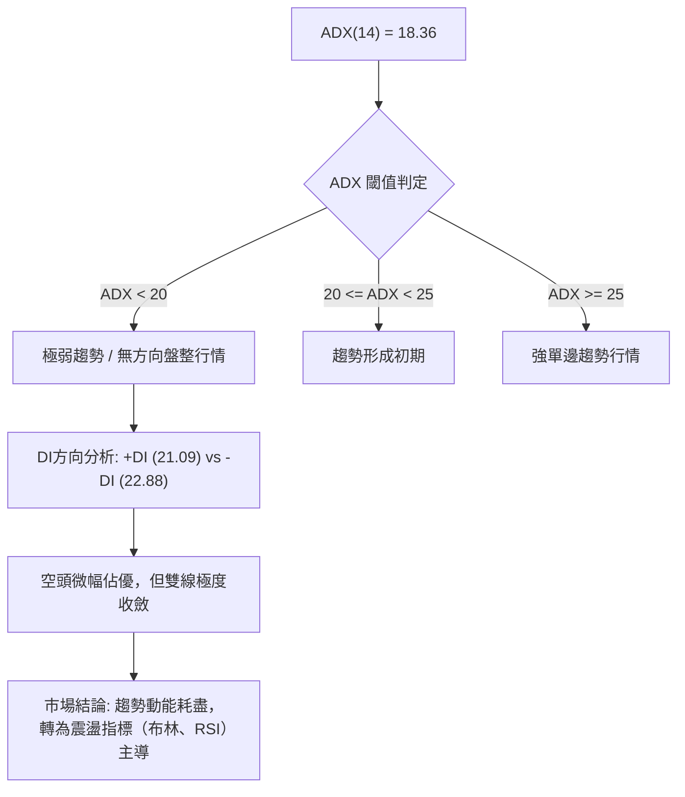

**ADX 趨勢強度對照表**：

| ADX 區間 | 趨勢分類 | 當前狀態判定 | 交易決策指引 |
|:---:|:---:|:---:|:---|
| 0 – 20 | 極弱 / 無方向 | **當前數值: 18.36 (適用)** | **禁止追漲殺跌，停止趨勢跟蹤系統，採用箱體邊界策略** |
| 20 – 25 | 趨勢萌芽 | - | 觀察突破方向與量能確認 |
| 25 – 40 | 強趨勢 | - | 順勢交易，MA與MACD主導 |
| 40 – 60 | 極強趨勢 | - | 緊縮止損，隨時防範耗竭性反轉 |

---

## 3. 圖表形態分析

### 🔍 形態識別系統

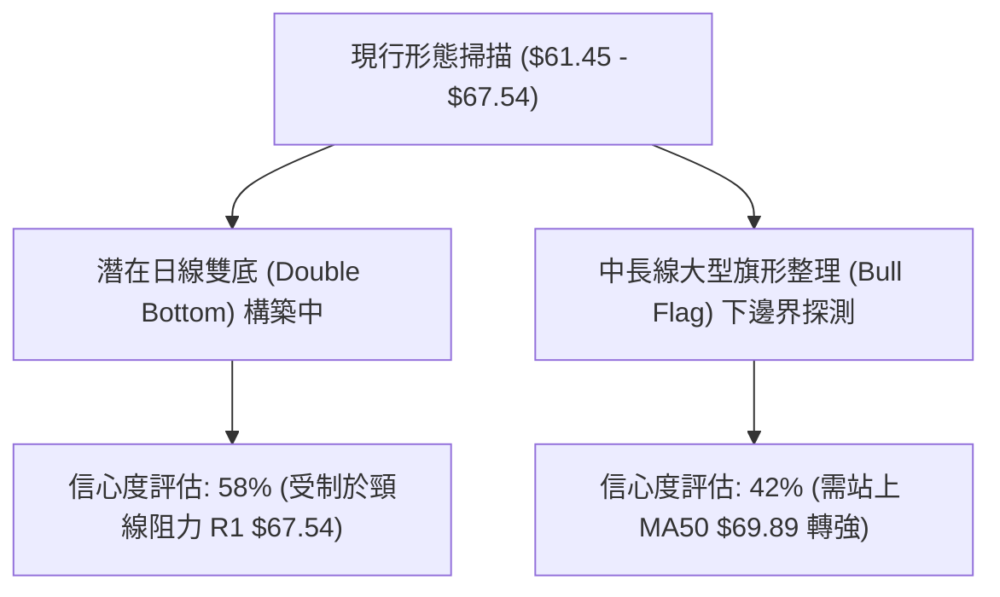

**形態信心度表格**：

| 形態名稱 | 信心度 | 判斷依據（引用精確數據） | 完成度 | 目標價（附嚴格計算式） |
|:---|:---:|:---|:---:|:---|
| **短期雙底 (W底)** | **58%** | 低點一：2026-07-26 收盤 $63.91 (最低觸及 S2 $61.45)；低點二：2026-09-13 收盤 $62.95。兩次探底均在 S2 $61.45 附近獲支撐 | 65% | 頸線為 R1 $67.54。形態高度 = $67.54 - $61.45 = $6.09。<br>突破目標價 = $67.54 + $6.09 = **$73.63** (吻合 R2 $73.97) |
| **低檔矩形收斂箱體** | **75%** | 價格在 S1 $63.98 與 R1 $67.54 之間狹幅震盪近6週，2026-09 收盤 $64.57 處於箱體中線 | 80% | 箱體突破目標 = R1 $67.54 + (R1 $67.54 - S1 $63.98) = **$71.10** |
| **中長期牛旗整理** | **35%** | 自 $151.00 崩跌後的下傾通道，目前訊號不足以證明旗形突破，僅做指標型解讀 | 30% | 訊號不足，不予計算單邊目標價 |

### 🕯️ 重要K線形態分析

| 週/月份 | 收盤價 | K線形態 | 解讀 | 訊號 |
|:---:|:---:|:---|:---|:---:|
| 2026-05-31 | $143.48 | 高檔長上影流星線 (Shooting Star) | 觸及 52W 高點 $151.00 後天量見頂，買盤耗盡 | 🔴 極度看空 |
| 2026-07-26 | $63.91 | 長下影錘頭線 (Hammer) | 週成交量 92.14M，空頭摜壓至 $61.84 斐波那契位遇強支撐回升 | 🟢 觸底反彈 |
| 2026-08-09 | $82.83 | 突破長陽線 (Bullish Marubozu) | 強彈測試 MA200 ($80.48)，但量能未達 1.5 億股，屬空頭回補 | 🟡 假突破誘多 |
| 2026-09-13 | $62.95 | 縮量十字星 (Doji) | 成交量降至 85.20M，空頭打壓動能衰竭，多空進入僵局 | 🟢 變盤築底 |
| 2026-09-20 | $64.57 | 底部小實體陽線 (Bullish Harami) | 放量至 106.76M，站回 $64.00 上方，MACD柱轉正，短線回暖 | 🟢 看多反彈 |

### 📉 ASCII 走勢形態示意圖

```
雙底 (W底) 構築進程示意圖
價位 ($)
$67.54 ───────┬─────────────────────────────── 頸線位 (R1)
              │       /\  (08-16 反彈高點 $80.25 回落)
              │      /  \
$64.57 ───────┼─────/────\───────● (當前突破測試 $64.57)
              │    /      \     ╱
$63.98 ───────┼───/────────\───╱ (S1 箱體支撐)
              │  /          \ ╱
$61.45 ───────┴─● (底1: $61.45) ┴──● (底2: 09-13 $62.95)
                 07-26 區域        09-13 區域
```

### 🎯 形態目標價計算

```
╔══════════════════════════════════════════════════════════════╗
║                形態目標價精確推算邏輯                        ║
╠══════════════════════════════════════════════════════════════╣
║ 形態確立條件：收盤價有效放量突破頸線位 R1 ($67.54)           ║
║ 基礎支撐底點：S2 ($61.45)                                     ║
║ 形態垂直高度：H = R1 ($67.54) - S2 ($61.45) = $6.09          ║
║ ------------------------------------------------------------ ║
║ 【第一目標價 T1】 (1.0H 等距測幅):                           ║
║  T1 = R1 ($67.54) + $6.09 = $73.63 (高度聚類於 R2 $73.97)     ║
║ 【第二目標價 T2】 (波段阻力延伸):                            ║
║  T2 = 直接引用關鍵阻力 R3 = $75.11                            ║
╚══════════════════════════════════════════════════════════════╝
```

---

## 4. 支撐與阻力

### 🗺️ 關鍵價位分布圖（Unicode）

```
RKLB 價位結構分布圖 (由波段高低點與斐波那契聚類計算)
══════════════════════════════════════════════════════════════════
 $80.90 ║██████████████████████████████║ 斐波那契 61.8% 關鍵多空分水嶺
 $75.11 ║████████████████████████      ║ 強阻力 R3 (近一年密集套牢峰值)
 $73.97 ║████████████████████          ║ 阻力 R2 (反彈高點聚類)
 $67.54 ║████████████████              ║ 關鍵頸線阻力 R1 (箱體上邊界)
 $64.57 ╠══════════════════════════════╣ ◄── 當前收盤價 ($64.57)
 $63.98 ║▓▓▓▓▓▓▓▓▓▓▓▓▓▓▓▓              ║ 近期箱體支撐 S1 (短線防守線)
 $61.84 ║████████████████████████      ║ 斐波那契 78.6% 回調支撐 ($61.84)
 $61.45 ║██████████████████████████    ║ 關鍵波段強支撐 S2 (波段雙底防線)
 $58.31 ║██████████████████████████████║ 極端極限支撐 S3 (下行破位止損區)
══════════════════════════════════════════════════════════════════
```

### 🚧 阻力位分析表

| 阻力級別 | 價位 | 距現價幅幅 | 形成原因（嚴格引用數據） | 突破難度 | 重要性 |
|:---:|:---:|:---:|:---|:---:|:---:|
| **R1** | **$67.54** | +4.60% | 近一年日線級別多次反彈高點聚類、雙底頸線位 | 🟡 中等 | ★★★★☆ |
| **R2** | **$73.97** | +14.56% | 2026-08-23 週線反彈高點聚類、下行 MA60 ($73.38) 交叉壓制 | 🔴 高 | ★★★★☆ |
| **R3** | **$75.11** | +16.32% | 近一年主波段密集回撤套牢區高點聚類、籌碼密集峰下沿 | 🔴 極高 | ★★★★★ |

### 🛡️ 支撐位分析表

| 支撐級別 | 價位 | 距現價幅幅 | 形成原因（嚴格引用數據） | 守住機率 | 重要性 |
|:---:|:---:|:---:|:---|:---:|:---:|
| **S1** | **$63.98** | -0.91% | 近一年波段低點聚類、近2週收盤密集重疊區 ($63.92 - $64.39) | 70% | ★★★★☆ |
| **S2** | **$61.45** | -4.83% | 2026年7-9月多週探底低點聚類、緊貼斐波那契 78.6% ($61.84) | 80% | ★★★★★ |
| **S3** | **$58.31** | -9.70% | 近一年深幅回調波段極限低點聚類、布林帶極限下軌外延 | 90% | ★★★☆☆ |

### 📐 斐波那契回調位分析

依據 52 週極值區間：高點 **$151.00**（2026-05）至低點 **$37.57**，嚴格對應數值如下：

```
斐波那契回調層級分布：
 0.0%  (52W High)  ─── $151.00
 23.6%             ─── $124.23
 38.2%             ─── $107.67
 50.0% (多空中樞)   ───  $94.28
 61.8% (黃金分割)   ───  $80.90
 78.6% (極限深蹲)   ───  $61.84 ◄── [重要防守]
100.0% (52W Low)   ───  $37.57
```

**現價落點與技術解讀**：
- 當前收盤價 **$64.57** 正好落在 **61.8% ($80.90)** 與 **78.6% ($61.84)** 之間。
- **深度防禦意義**：78.6% 回調位 $61.84 為牛市主升浪發動後的最後防線（深蹲極限）。目前價格在 $61.84 上方約 +4.41% 處反覆築底，未曾實質跌破，證明長線多頭資金在此處具備極高的承接意願。
- **上方修復目標**：若向上發動反彈，首要中長線目標為黃金分割點 61.8% ($80.90)，此處同時與長線牛熊分界線 **MA200 ($80.48)** 形成極強的共振阻力區。

---

## 5. 技術指標深度解讀

### 🎛️ 指標訊號總覽

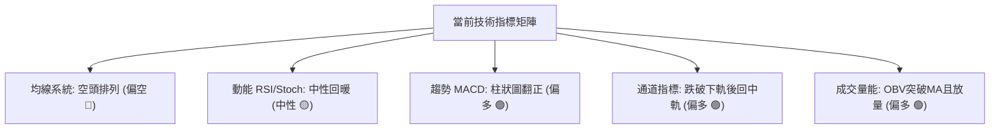

### 📈 移動平均線排列分析

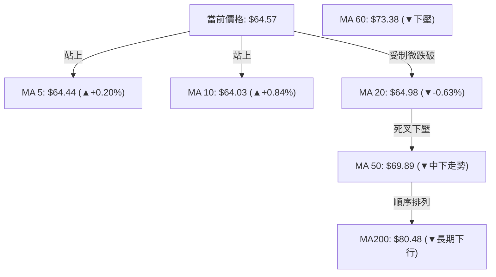

**均線狀態解讀**：
- **微觀轉強**：價格站上 MA5 ($64.44) 與 MA10 ($64.03)，短線空頭殺跌力道竭盡，呈現向上金叉勾頭初階形態。
- **宏觀承壓**：中長週期 MA20 ($64.98) < MA50 ($69.89) < MA200 ($80.48)，呈現典型空頭排列。MA20 恰為當前反彈的第一道壓制線，若不能放量站穩 $65.00，仍將反覆受制。

### 📉 RSI(14) 分析

```
RSI(14) 強度標尺：
0 ─────── 20 ────── 30 ───────────── 50 ───────────── 70 ────── 80 ────── 100
                    [超賣]           [中軸]          [超買]
當前讀數: 50.47 ───►  ████████████████████░░░░░░░░░░░░░░░░░░░░
```

- **超買超賣狀態**：RSI(14) 自 2026-09-06 的極度超賣值 **12.8** 快速回升至目前的 **50.47**，順利擺脫冰點區，重返 50 多空中軸。
- **背離判斷**：
  - 價格走勢：2026-07-26 收盤 $63.91，後續於 2026-09-13 再度探底收盤 $62.95（價格創新低）。
  - RSI 走勢：2026-07-26 RSI 為 15.6，2026-09-13 RSI 則抬升至 27.1（RSI 顯著抬高未破低）。
  - **結論**：週線級別確認出現顯著的**底背離 (Bullish Divergence)**，預示下行動能衰竭，中短期具備均值回歸的技術反彈要求。

### 📊 MACD(12/26/9) 訊號解讀

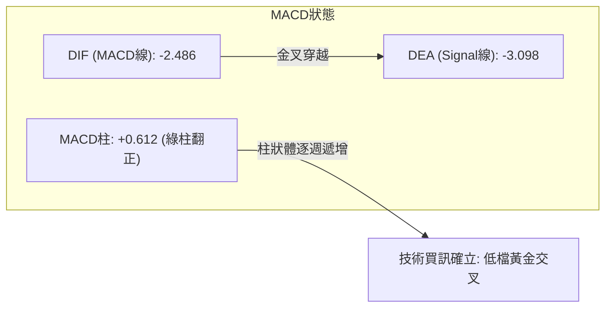

- **柱狀圖動態**：MACD Histogram 自 2026-08-30 的 -0.961 收窄至 2026-09-13 的 -0.133，本週正式翻正為 **+0.612**。
- **快慢線交叉**：DIF (-2.486) 由下往上穿越 DEA (-3.098)，零軸下方低檔黃金交叉確認，構成短中期的動能轉折買點。

### 📦 布林通道分析

```
ASCII 布林通道位置示意圖 (寬度收窄築底)
$70.18 ──┬────────────────────────────────────── 上軌 (Upper Band)
         │
$64.98 ──┼───────────────────●────────────────── 中軌 MA20 ($64.98) ◄── [現價 $64.57 貼近中軌]
         │                  (%B = 0.46)
$59.77 ──┴────────────────────────────────────── 下軌 (Lower Band)
```

- **帶寬收斂 (Band Squeeze)**：布林通道上軌 $70.18 與下軌 $59.77，總帶寬僅約 $10.41，波動空間較 5 月份劇烈縮減，表明市場即將迎來方向性變盤。
- **%B 指標解析**：%B 讀數為 **0.46**，代表價格已從 9 月初的下軌（接近 0.0）順利反彈至中軌附近（0.50 為中軌），處於典型的均值回歸震盪階段。

### 💹 成交量分析（量價配合度）

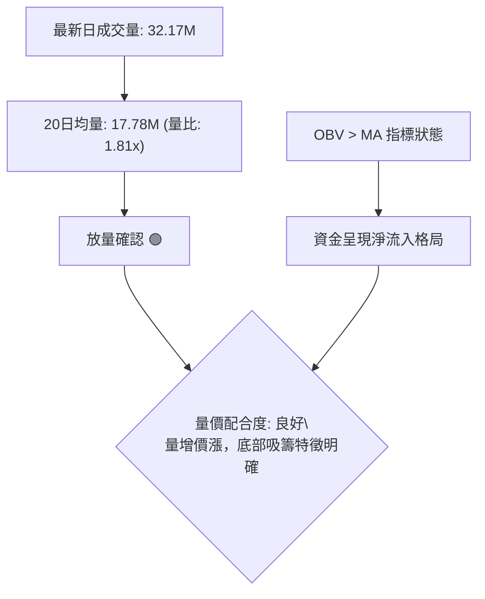

- **量比與換手**：最新成交量達 32,168,300 股，相較於 20 日均量 17,775,925 股，量比達到 **1.81倍**。在連續縮量盤整數週後，此種放量走升通常代表有大資金進行被動承接。
- **OBV 能量潮驗證**：官方數據明確標記「**OBV > MA → 量能支撐上漲**」，證明量能走在價格之前，並未出現量價頂背離或無量虛漲現象。

---

## 6. 動能與波動率

### ⚡ 動能評估四象限

| 象限 | 動能強度 (RSI/MACD) | 波動率水準 (ATR/帶寬) | 當前標的狀態 | 交易策略啟示 |
|:---:|:---:|:---:|:---:|:---|
| **Q1 (最佳擴張)** | 強 | 低 | - | 突破初期，重倉順勢追漲 |
| **Q2 (低檔蓄勢)** | **中等轉強 (MACD金叉)** | **低 (帶寬收斂, ATR $3.09)** | **✓ RKLB 歸屬此區** | **適合於箱體支撐佈局，等待波動率向外釋放** |
| **Q3 (極端博弈)** | 強 | 高 | - | 主升浪/主跌浪衝刺，嚴格止盈 |
| **Q4 (弱勢耗竭)** | 弱 | 高 | - | 破位下殺，嚴格停損觀望 |

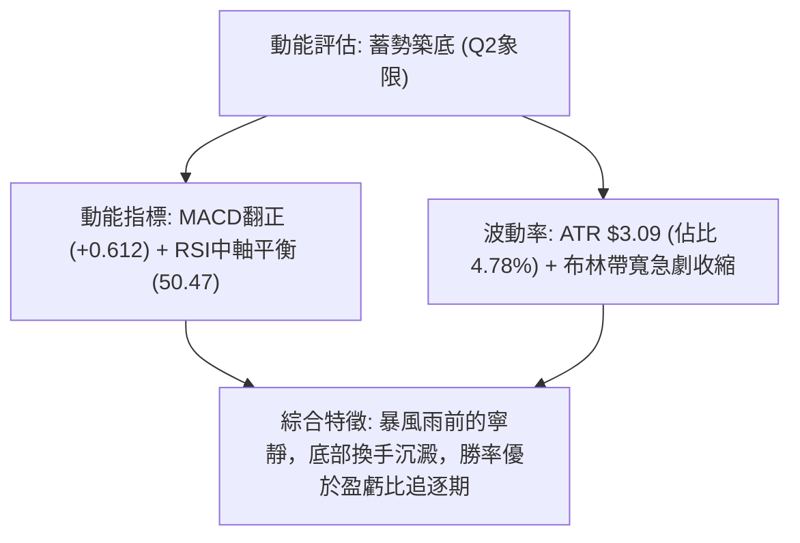

### 📊 ATR 波動率分析

- **當前數值**：ATR(14) 為 **$3.09**，佔現價之 **4.78%**。
- **日內安全邊界**：
  - 每日波動安全防護網：以 1.5 倍 ATR 衡量，約為 $3.09 × 1.5 = **$4.64**。
  - 緊密止損距離建議：以 1.0 倍 ATR 計算為 **$3.09**；波段操作止損距離應不小於 **$3.09**，以防被日內雜訊洗盤出場。

### 📐 Beta 與市場相關性

- **Beta 係數**：高達 **2.612**，屬於超高彈性、極度進攻型成長股特徵。
- **市場連動分析**：
  - 當大盤（標普500/納斯達克）上漲 1% 時，理論上 RKLB 將放大波動至 2.61%；反之大盤回調時其承壓亦同等放大。
  - 在當前 ADX 為 18.36 的弱勢盤整期，高 Beta 意味著個股極易受到太空國防板塊消息或大盤系統性波動干擾，因此仓位必須受到嚴格限制。

---

## 7. 多時框架總結

### 📋 時框架評分表

| 時框架 | 趨勢方向 | 動能指標 | 均線排列 | 圖表形態 | 綜合評分 | 操作建議 |
|:---:|:---:|:---:|:---:|:---|:---:|:---|
| **月線 (長期)** | 震盪偏空 | RSI中性回落 | 遠低於 MA200 | 衝高回落深蹲 78.6% | 40/100 🔴 | 長線觀察分批建倉點位 |
| **週線 (中期)** | 盤整築底 | MACD柱狀翻正 | MA50下壓 | 雙底/箱體收斂中 | 55/100 🟡 | 耐心等待突破頸線 R1確認 |
| **日線 (短期)** | 短期偏多 | RSI突破50、金叉 | 突破MA5/10，測MA20 | 小W底右側放量反彈 | 65/100 🟢 | 區間下軌低吸，中軌做T |

### 🔲 綜合訊號矩陣

```
訊號一致性交叉檢驗表：
 指標維度       短期 (日線)    中期 (週線)    長期 (月線)    方向收斂性
─────────────────────────────────────────────────────────────
 均線系統          🟢 短多         🔴 空頭         🔴 空頭       長空格局未變
 動能指標          🟢 金叉         🟢 底背離       🟡 中立       動能由短向中修復
 形態支撐          🟢 箱體支撐     🟢 78.6%回調    🟢 前波起漲   強支撐共振
 成交量能          🟢 1.81x 放量   🟡 均量平穩     🔴 縮量沉澱   底部吸籌確認
─────────────────────────────────────────────────────────────
 矩陣綜合結論：長線空頭壓制下的「中期築底與短線超跌反彈共振」
```

### ⚖️ 多時框收斂結論

依據嚴格規則 14（多時框收斂規則）：
1. **行情定性**：當前 **ADX(14) = 18.36 < 25**，嚴格判定市場處於**【盤整行情】**，而非單邊趨勢行情。
2. **主導維度**：趨勢跟蹤指標失效，此時**以日線布林通道上下軌 ($59.77 - $70.18) 以及關鍵波段高低點聚類 (S1 $63.98 至 R1 $67.54) 為主導交易區間**。
3. **方向唯一性收斂**：
   - 長期月線雖受壓於空頭排列，但週線在 78.6% 斐波那契回調位 ($61.84) 展現極強支撐，且日線級別出現量價齊揚與 MACD 金叉翻正。
   - **唯一方向性結論**：**【中性偏多，底部箱體震盪反彈】**。策略核心定調為「依托下軌支撐防守，博弈箱體上軌反彈」，堅決排除追高，以區間低吸為主。

---

## 8. 交易策略建議

### 🗺️ 策略決策流程圖

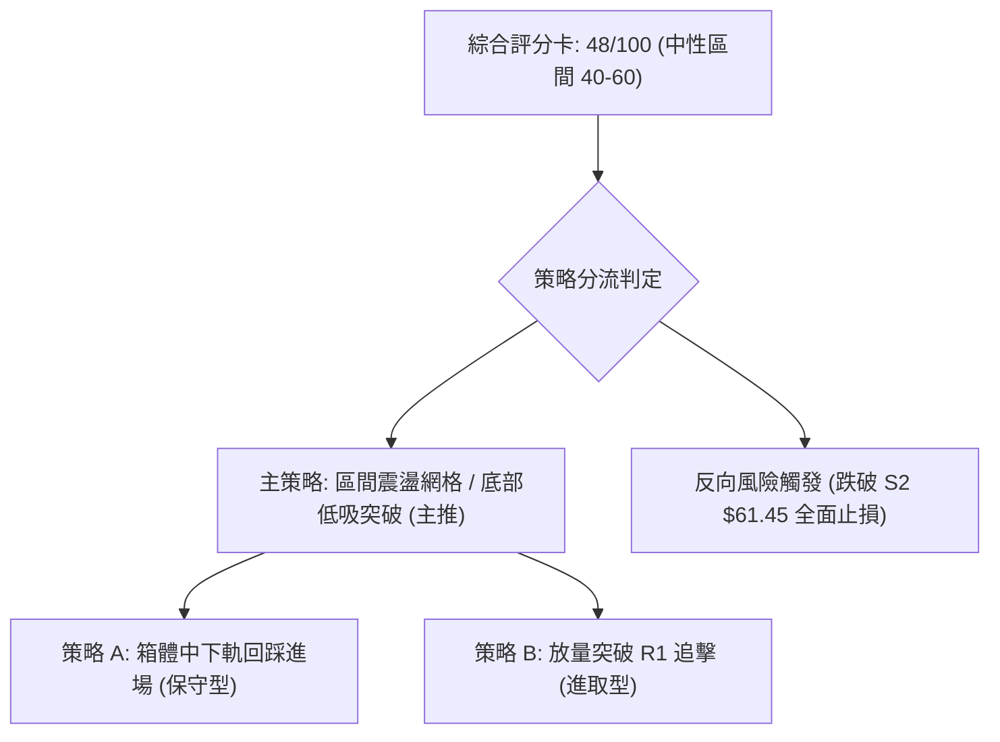

### 🧭 策略路由（依評分卡分流）

> **當前主策略方向 = 【中性偏多區間操作（等待突破確認）】（依技術綜合評分：48/100）**
> 
> 由於評分處於 40–60 中性區間，且 ADX(18.36) 確立盤整市，本報告主推**以布林通道與關鍵點位聚類構建的區間策略**，禁止單邊盲目重倉。

### 🎯 價格情境階梯（Price Scenarios）

| 觸發條件 | 下一目標 | 後續延伸 | 情境技術含義（精確引用數據） |
|:---|:---:|:---:|:---|
| **向上突破 R1 ($67.54)** | **R2 ($73.97)** | **R3 ($75.11)** | 雙底頸線突破確立，補齊至布林上軌及 MA60 套牢區 |
| **維持於現價區間 ($64.57)**| **R1 ($67.54)** | **S1 ($63.98)** | 圍繞 MA20 ($64.98) 橫盤拉鋸，進行籌碼沉澱換手 |
| **向下跌破 S1 ($63.98)** | **S2 ($61.45)** | **S3 ($58.31)** | 短線箱體破位，考驗 78.6% 斐波那契防線 ($61.84) 及下軌 |

### 📊 情境機率分佈

| 情境類別 | 機率預估 | 主要技術依據 |
|:---|:---:|:---|
| **區間震盪向上 (反彈試探 R1/R2)** | **55%** | MACD 柱狀圖翻正 (+0.612)、量比 1.81x 放量、OBV > MA、週線底背離修復 |
| **箱體內部無序震盪 ($63.00-$66.00)** | **30%** | ADX 僅 18.36 缺乏動能、布林通道上下軌收縮壓制、均線糾結 |
| **向下破位跌穿 S2 ($61.45)** | **15%** | 均線長週期空頭排列、Beta 高達 2.612 面臨大盤系統性回調風險 |

### 🟢 主策略詳情（方向：中性偏多區間操作）

所有數值均嚴格引用或推算自關鍵價位數據：

| 策略要素 | 策略 A（下軌支撐低吸 — 保守防守型） | 策略 B（突破頸線加碼 — 進取動能型） |
|:---|:---:|:---:|
| **進場條件** | 價格回踩 S1 獲得確認，或現價分批進場 | 日線收盤放量實體突破 R1 頸線位 |
| **進場價格** | **$64.00**（貼近 S1 $63.98） | **$67.60**（突破 R1 $67.54 後掛單） |
| **第一目標價 T1** | **$67.54**（阻力位 R1，獲利 +5.53%） | **$73.97**（阻力位 R2，獲利 +9.42%） |
| **第二目標價 T2** | **$73.97**（阻力位 R2，獲利 +15.58%） | **$75.11**（阻力位 R3，獲利 +11.11%） |
| **止損價格** | **$61.40**（跌破 S2 $61.45 與 78.6% 位） | **$63.90**（假突破跌回 S1 $63.98 下方） |
| **風險報酬比 (R/R)**| **1 : 3.83**（風險 $2.60，潛在總收益 $9.97） | **1 : 2.03**（風險 $3.70，潛在總收益 $7.51） |
| **歷史勝率估計** | **65%** | **52%** |
| **建議配置倉位** | **15% - 20%** | **10% - 15%** |

### 🔴 反向風險觸發點（對沖提示）

- **關鍵破位風控線**：**$61.45 (S2)**。
- **對沖觸發機制**：若日線收盤價跌破 $61.45（同時貫穿斐波那契 78.6% $61.84），代表本波自 7 月以來的雙底結構徹底瓦解。
- **應對預案**：多頭部位必須無條件全數止損離場，空手觀望，下方尋求極端支撐 **S3 ($58.31)** 及 52 週低點 **$37.57** 之承接機會，或建立反向空頭合約避險。

### ⭐ 整體訊號強度評星

```
╔══════════════════════════════════════════════════════════════╗
║ 做多訊號強度：★★★☆☆  (3.0/5星 — 底部動能回暖，但受壓於均線)   ║
║ 做空訊號強度：★★☆☆☆  (2.0/5星 — 下方有 78.6% 及雙底強支撐)   ║
║ 整體可信度：  ★★★☆☆  (3.5/5星 — 震盪行情指標收斂度高)        ║
╚══════════════════════════════════════════════════════════════╝
```

---

## 9. 風險提示與監控

### ✅ 關鍵監控指標 Checklist

```
╔══════════════════════════════════════════════════════════════╗
║              盤面動態關鍵監控清單 (Checklist)                 ║
╠══════════════════════════════════════════════════════════════╣
║ [ ] 1. 均線破線警報：收盤價是否站上 MA20 ($64.98)？            ║
║ [ ] 2. 突破確認：日成交量是否維持在 25M 以上挑戰 R1 ($67.54)？ ║
║ [ ] 3. 趨勢轉向：ADX(14) 是否從 18.36 突破 25，展現單邊動能？ ║
║ [ ] 4. 動能保護：MACD 柱狀圖是否持續維持在正值 (>0) 擴張？     ║
║ [ ] 5. 核心底線：多頭最後防線 S2 ($61.45) 是否完好無損？       ║
╚══════════════════════════════════════════════════════════════╝
```

### ⚠️ 風險場景分析

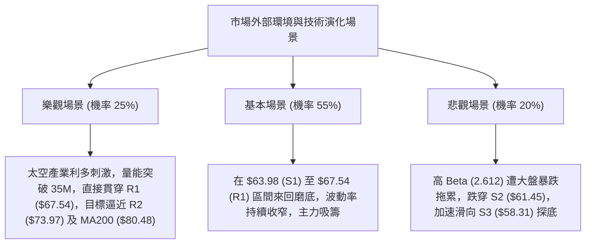

### 🛡️ 風險管理重要提醒

1. **Beta 放大效應與倉位管理**：
   - RKLB Beta 達 **2.612**，其隱含波動率遠超傳統工業股。
   - 嚴格控制總部位不超過個人投資組合的 **15%–20%**，避免單一標的波動造成帳戶淨值大幅回撤。
2. **止損紀律的絕對剛性**：
   - 採用 **ATR ($3.09)** 作為動態跟蹤止損依據。
   - 保守策略 S2 ($61.45) 止損位距現價僅約 4.83%，在風險報酬比達到 1:3.83 的前提下，絕不可因僥倖心理向下攤平。
3. **假突破防範**：
   - 目前處於 ADX < 25 的盤整市，R1 ($67.54) 極易出現「盤中突破引發散戶追價、尾盤跳水」的假突破現象。進場追突破必須等待**日線收盤價有效站穩**且**成交量大於 20 日均量 (17.78M) 的 1.5 倍**。

---

## 📋 報告總結

```
╔══════════════════════════════════════════════════════════════╗
║                   RKLB 技術分析報告總結                      ║
╠══════════════════════════════════════════════════════════════╣
║ 報告日期：2026-09-20                                         ║
║ 當前價格：$64.57                                             ║
║ 分析評級：⚖️ 弱中性 / 區間築底 (綜合評分: 48/100)            ║
║                                                              ║
║ 關鍵結論：                                                   ║
║ ├─ 長期趨勢：🔴 弱勢空頭排列 (深蹲 78.6% 斐波那契 $61.84)     ║
║ ├─ 中期趨勢：🟡 築底打底階段 (受制於 MA50 $69.89 下壓)       ║
║ ├─ 短期趨勢：🟢 量價底背離修復 (MACD柱翻正 +0.612, 站上MA5/10)║
║ ├─ 關鍵支撐：S1: $63.98  /  S2: $61.45                      ║
║ ├─ 關鍵阻力：R1: $67.54  /  R2: $73.97                      ║
║ └─ 華爾街共識目標價：$109.37 (目前折價空間顯著)              ║
║                                                              ║
║ 最優策略組合：                                               ║
║ 1. 🥇 最佳機會：策略 A — 回踩 S1 ($63.98-$64.00) 低吸，      ║
║                  止損設於 $61.40，博弈 R1 ($67.54) 反彈      ║
║ 2. 🥈 次選機會：策略 B — 帶量實體站穩 R1 ($67.54) 順勢加碼，  ║
║                  目標指向 R2 ($73.97) 及 R3 ($75.11)         ║
║ 3. 🥉 保守選擇：場外完全觀望，直至 ADX > 25 且價格站上        ║
║                  MA50 ($69.89) 確立中級反轉再行介入          ║
╚══════════════════════════════════════════════════════════════╝
```

---

> ⚠️ **免責聲明**：本報告為 AI 自動生成之技術分析，所有數據及估算均基於提供的歷史價格資訊。本報告**僅供研究與學術參考**，**不構成任何投資建議**。投資有風險，入市需謹慎。

---

*報告生成時間：2026-09-20 ｜ 數據來源：Yahoo Finance ｜ 分析框架：多時框技術分析*