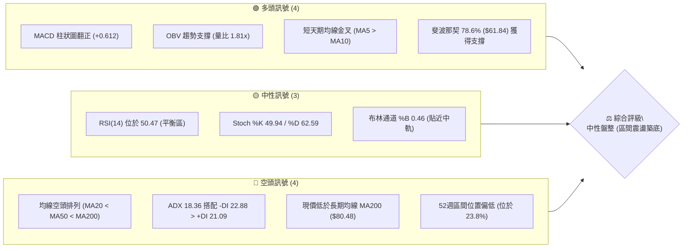
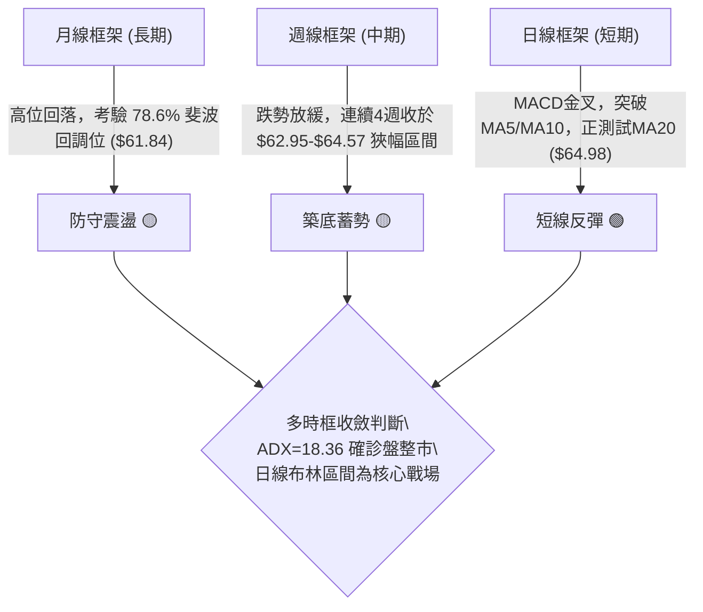
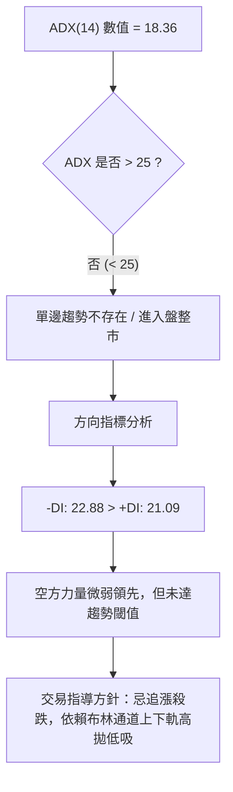
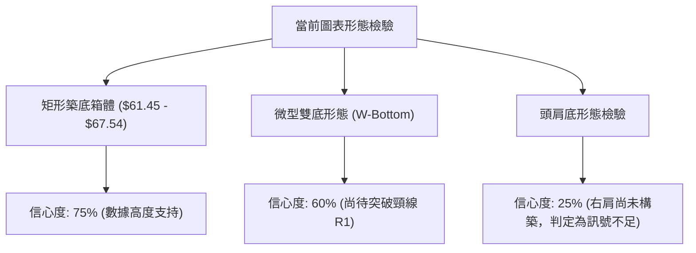
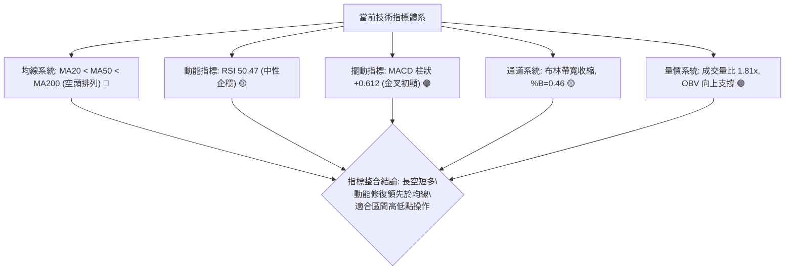
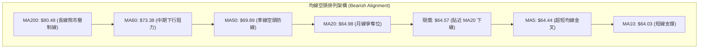
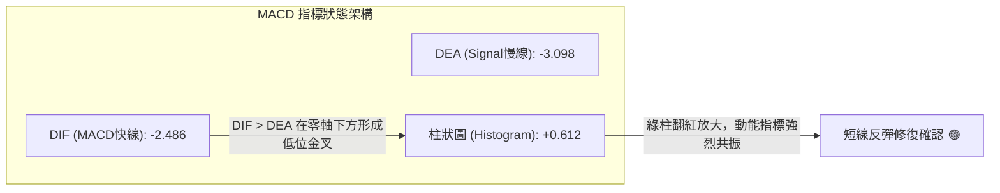
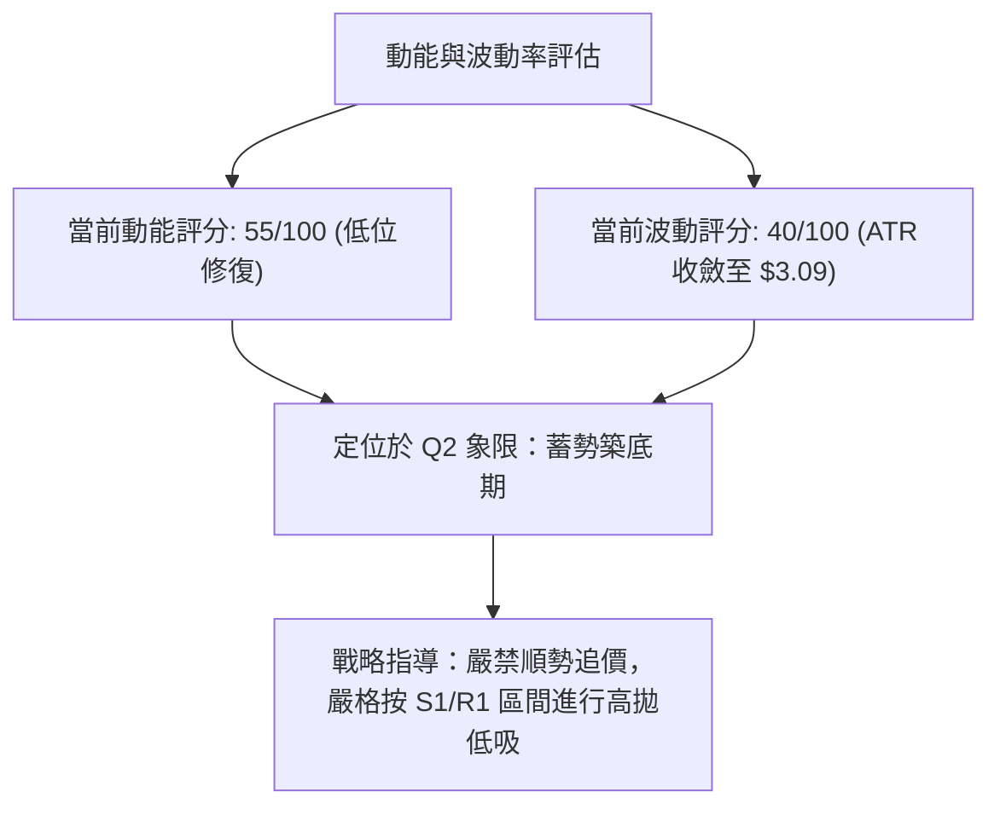
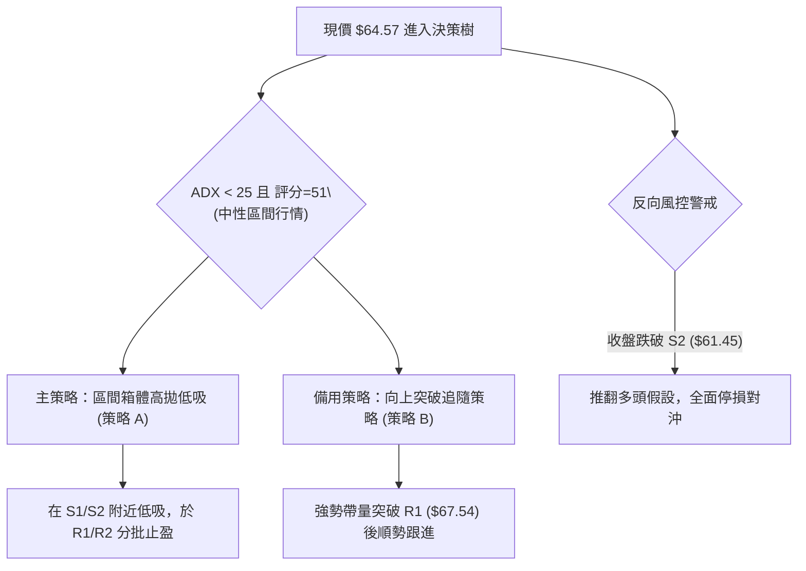
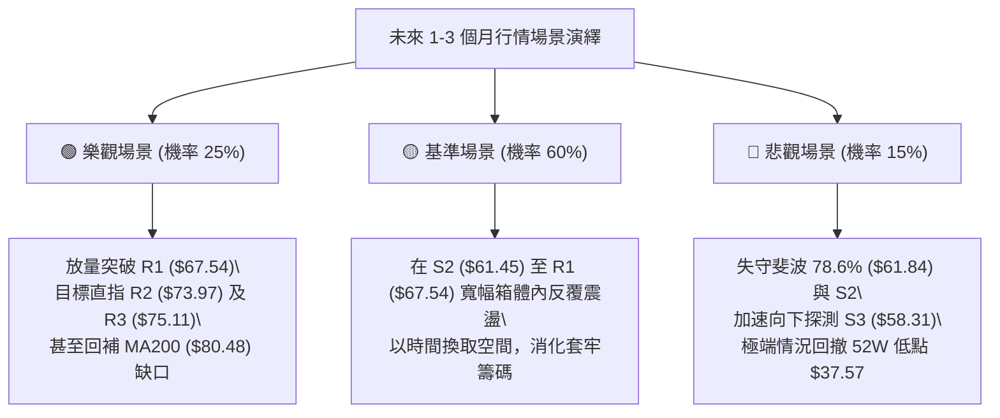

# RKLB 技術分析報告

> **報告日期**：2026-09-21 ｜ **語言**：繁體中文 ｜ **數據來源**：Yahoo Finance ｜ **當前價格**：$64.57

---

## 目錄

| 章節 | 內容 |
|------|------|
| [1. 技術面概覽](#1-技術面概覽) | 訊號儀表板、核心指標、評分卡 |
| [2. 趨勢分析](#2-趨勢分析) | 多時框趨勢、長中短期走勢、ADX解讀 |
| [3. 圖表形態分析](#3-圖表形態分析) | 形態識別信心度、K線組合、目標價推算 |
| [4. 支撐與阻力](#4-支撐與阻力) | 關鍵價位結構、波段聚類、斐波那契回調 |
| [5. 技術指標深度解讀](#5-技術指標深度解讀) | 均線系統、RSI、MACD、布林通道、OBV量價 |
| [6. 動能與波動率](#6-動能與波動率) | 動能象限、ATR波動風險、Beta敏感度 |
| [7. 多時框架總結](#7-多時框架總結) | 時框架矩陣、ADX優先級收斂結論 |
| [8. 交易策略建議](#8-交易策略建議) | 策略路由、價格階梯、主策略與對沖點 |
| [9. 風險提示與監控](#9-風險提示與監控) | 監控Checklist、三情境演繹、倉位風控 |
| [📋 報告總結](#-報告總結) | 儀表板摘要與最優策略指引 |

---

## 1. 技術面概覽

### 🎯 技術訊號儀表板



### 📊 核心指標速覽表

| 指標類別 | 指標名稱 | 當前數值 | 訊號 | 解讀 |
|----------|----------|----------|------|------|
| **價格** | 當前價格 | $64.57 | 🟡 | 位於52週區間23.8%處，近期於底部區間打底 |
| **均線** | MA20 | $64.98 | 🟡 | 現價緊貼MA20下方（-0.63%），多空於月線拉鋸 |
| **均線** | MA50 | $69.89 | 🔴 | 位於現價上方7.6%，構成中期反彈首要壓制層 |
| **均線** | MA200 | $80.48 | 🔴 | 價格顯著低於年線（-19.8%），長線架構尚未翻多 |
| **動能** | RSI(14) | 50.47 | 🟡 | 脫離超賣區回歸50中軸，動能中性且無明顯背離 |
| **動能** | MACD | -2.486 / Signal -3.098 | 🟢 | 快線低位向上穿越慢線，柱狀圖正值（+0.612）確認短多修復 |
| **趨勢** | ADX(14) | 18.36 | 🟡 | 指數低於25，代表單邊趨勢衰竭，進入低波動盤整行情 |
| **通道** | 布林通道 | 帶寬 $59.77 - $70.18 | 🟡 | 現價處中軌附近（%B=0.46），即將迎來方向性選擇 |
| **量能** | 20日量比 | 1.81x (32.17M / 17.78M) | 🟢 | 築底階段伴隨放量，OBV支撐價格企穩 |
| **波動** | ATR(14) | $3.09 (4.78%) | 🟡 | 每日平均波幅適中，相較前期高波動已有顯著收斂 |

### 🏆 技術評分卡

```
╔══════════════════════════════════════════════════════════════════╗
║                 技術評分卡 — RKLB (2026-09-21)                  ║
╠══════════════════════════════════════════════════════════════════╣
║ 趨勢強度 (ADX=18.36)   ██████░░░░░░░░░░░░░░  30/100  🔴 空頭無力/盤整  ║
║ 動能指標 (RSI/MACD)    ████████████░░░░░░░░  60/100  🟢 短多低位修復  ║
║ 支撐穩定度 (S1/S2)     ██████████████░░░░░░  70/100  🟢 底部打樁扎實  ║
║ 成交量配合 (OBV/Vol)   ██████████████░░░░░░  70/100  🟢 放量企穩支撐  ║
║ 形態完整度 (箱體整理)   ████████████░░░░░░░░  60/100  🟡 築底形態成型中║
║ 均線排列 (空頭排列)     ████░░░░░░░░░░░░░░░░  20/100  🔴 MA20<50<200 ║
╠══════════════════════════════════════════════════════════════════╣
║ 綜合評分              ██████████░░░░░░░░░░  51/100  🟡 中性區間震盪  ║
╚══════════════════════════════════════════════════════════════════╝
```

---

## 2. 趨勢分析

### 🌐 多時框趨勢分析



### 📈 長期趨勢 — 12個月走勢圖（Unicode）

```
RKLB 月線收盤走勢圖（過去12個月：2025-10 至 2026-09）
價格軸 ($)
$150 ┤                                           
$140 ┤                                    ● (2026-05: $143.48 高點)
$130 ┤                                   ╱ ╲
$120 ┤                                  ╱   ╲
$110 ┤                                 ╱     ╲
$100 ┤                                ╱       ● (2026-06: $101.65)
 $90 ┤                               ╱         ╲
 $80 ┤                ● (2026-01: $80.07)  ●(04: $82.51) ╲
 $70 ┤          ●(12: $69.76)   ╲   ╱             ╲
 $60 ┤    ●(10: $62.98)          ●─●(02-03: $64-69) ●─●─●←現價 $64.57
 $50 ┤     ╲                                      (07-09月盤整底)
 $40 ┤      ● (2025-11: $42.14)
     └───────────────────────────────────────────────────────────
        10   11   12   01   02   03   04   05   06   07   08   09  (月份)
```

#### 走勢特徵分析表格

| 階段區間 | 時間跨度 | 起訖收盤價 | 漲跌幅 | 走勢特徵與量價結構 |
|----------|----------|------------|--------|--------------------|
| 主升前蓄勢 | 2025-10 ~ 2025-11 | $62.98 → $42.14 | -33.09% | 快速回踩確認下檔買盤，洗淨浮額，創波段低位 |
| 跨年主升段 | 2025-11 ~ 2026-01 | $42.14 → $80.07 | +90.01% | 機構資金大幅建倉，突破各級均線壓制 |
| 高位箱體震盪 | 2026-01 ~ 2026-03 | $80.07 → $64.22 | -19.80% | 獲利盤回吐，於 $64-$69 區間構築強固中樞平台 |
| 瘋狂加速浪 | 2026-03 ~ 2026-05 | $64.22 → $143.48| +123.42%| 軋空疊加利多共振，單月爆出天量直衝歷史高點 $151.00 |
| 斷崖式派發 | 2026-05 ~ 2026-07 | $143.48 → $64.95| -54.73% | 籌碼高位派發，主力獲利了結，連破多重支撐位 |
| 築底休整期 | 2026-07 ~ 2026-09 | $64.95 → $64.57 | -0.58%  | 波動率急劇收縮，成交量溫和沉澱，在歷史中樞 $64 重建平衡 |

### 📊 中期趨勢（週線分析）

中期走勢在經歷了6-7月份的大幅殺跌後，目前已進入「空間換時間」的築底階段。觀察最近4週的收盤數據：
- 2026-08-30 收盤：$64.39 (RSI 18.2)
- 2026-09-06 收盤：$64.26 (RSI 12.8，嚴重超賣)
- 2026-09-13 收盤：$62.95 (RSI 27.1，底背離雛形)
- 2026-09-20 收盤：$64.57 (RSI 50.5，週成交量回升至 106.76M，MACD柱翻正至 +0.612)

中期壓力與支撐的空間分佈如下圖所示：

```
中期週線空間架構示意圖：
阻力 R2 ─── $73.97 (週線反彈阻力位 / 60日線區域)
            │
阻力 R1 ─── $67.54 (近4週高點聚類 / 頸線壓制)
            │
現  價 ─── $64.57 (目前多空交戰於 MA20: $64.98)
            │
支  撐 S1 ─── $63.98 (近3週密集收盤下影線低點)
            │
支  撐 S2 ─── $61.45 (波段底部支撐聚類 / 斐波 78.6% $61.84 防線)
```

### ⚡ 趨勢強度評估（ADX 解讀）



#### ADX 趨勢強度對照表

| 指標變數 | 當前讀數 | 狀態判斷 | 交易意涵 |
|----------|----------|----------|----------|
| **ADX(14)** | 18.36 | 極弱勢 / 盤整格局 (<25) | 均線趨勢策略失效，震盪震盪指標（RSI、布林帶）優先級提升 |
| **+DI (14)** | 21.09 | 多方動能微弱 | 缺乏發動單邊主升浪的增量資金 |
| **-DI (14)** | 22.88 | 空方動能衰竭 | 相比前期派發階段，空頭下殺動能已消耗殆盡 |
| **方向差值** | -1.79 | 多空極度收斂 | 雙方力量處於動態僵持，等待催化劑引發波動率擴張 |

---

## 3. 圖表形態分析

### 🔍 形態識別系統

在多時框結構中，RKLB 在自 $151.00 高點回落後，日線與週線結構逐漸向矩形箱體與微型雙底收斂。依照嚴格形態信心度準則評估如下：



#### 圖表形態評估矩陣

| 形態類別 | 信心度 | 判斷依據（引用技術數據） | 完成度 | 目標價（附嚴謹計算式） |
|----------|--------|--------------------------|--------|------------------------|
| **矩形築底箱體** | 75% | 價格在近兩個月受制於阻力 R1 ($67.54)，並在支撐 S2 ($61.45) 獲得三次驗證 | 85% | 向上破箱體目標：頸線 $67.54 + 箱體高度 ($67.54 - $61.45 = $6.09) = **$73.63** (高度聚類於 R2 $73.97) |
| **微型雙底 (W底)**| 60% | 第一低點見於 2026-07-26 收盤 $63.91，第二低點見於 2026-09-13 收盤 $62.95，兩次探底均在 S2 ($61.45) 上方企穩 | 65% | 頸線阻力 R1 ($67.54)；若有效突破，等幅量度目標 = $67.54 + ($67.54 - $62.95 = $4.59) = **$72.13** |
| **頭肩底形態** | 25% | 目前僅有左底與中央低點雛形，右肩未成型 | 20% | **訊號不足，僅做指標型解讀，不予計算量度目標** |

### 🕯️ 重要K線形態分析

| 日期/月份 | 收盤價 | K線形態 | 解讀 | 訊號強度 |
|-----------|--------|---------|------|----------|
| 2026-05 (月線) | $143.48 | 倒錘長上影線 | 觸及 52W 高點 $151.00 後天量炸裂回落，標準主力派發頂部 | 🔴 極強空頭 |
| 2026-07 (月線) | $64.95 | 長陰下殺加速 | 摜破 MA60，直接殺至斐波那契 78.6% ($61.84) 止跌 | 🔴 空頭宣洩 |
| 2026-08 (月線) | $63.92 | 長十字星 (Doji) | 月線長下影線收於 $63.92，多空在 $64 水平達成力量平衡 | 🟡 變盤信號 |
| 2026-09-13 (週線)| $62.95 | 錘頭線 (Hammer) | 探低至 $62.95 獲買盤承接，週成交量溫和放大，下影線確立支撐 | 🟢 看多反轉 |
| 2026-09-20 (週線)| $64.57 | 實體中陽吞噬 | 吞沒前一週實體跌幅，RSI 從 27.1 急升至 50.5，MACD 柱翻正 | 🟢 短多確立 |

### 📉 ASCII 走勢形態示意圖

```
RKLB 築底箱體與微型雙底結構（日/週線示意）
價格軸 ($)
$67.54 ┼─────────────────────────── 目標頸線 R1 ───────────────────────────
       │                                ╭╮
       │             ╭╮                ╭╯╰╮ (突破確認點)
       │            ╭╯╰╮              ╭╯  ╰─
$64.98 ┼───────────╭╯──╰╮────────────╭╯─────── MA20 / 箱體中軸 ─────────
       │          ╭╯    ╰╮  ▲現價   ╭╯
       │         ╭╯      ╰╮ ($64.57)╭╯
$63.98 ┼────────╭╯────────╰─────────╯──────── S1 支撐位 ─────────────────
       │       ╭╯          ╰╮     ╭╯
$61.45 ┼───────╯            ╰─────╯────────── S2 強支撐位 (雙底打樁) ──────
       │   低點 1 ($63.91)      低點 2 ($62.95)
       └─────────────────────────────────────────────────────────────
          2026-07-26             2026-09-13     2026-09-21
```

### 🎯 形態目標價計算

根據上述置信度達標之形態，量度目標計算過程嚴格依據幾何結構高度推演：

1. **矩形箱體突破量度目標**：
   - 箱頂頸線：$67.54 (阻力 R1)
   - 箱底支撐：$61.45 (支撐 S2)
   - 形態垂直高度 $H_1$ = $67.54 - $61.45 = $6.09
   - **向上突破等幅投射目標** = 頸線 + $H_1$ = $67.54 + $6.09 = **$73.63**
   - *驗證註記*：該推算數值與數據庫中之波段阻力聚類 R2 ($73.97) 誤差僅 0.46%，形成強烈共振。

2. **微型雙底 (W-Bottom) 量度目標**：
   - 頸線壓制：$67.54
   - 形態最低點：$62.95 (2026-09-13 波段低點)
   - 形態垂直高度 $H_2$ = $67.54 - $62.95 = $4.59
   - **最小量度滿足目標** = 頸線 + $H_2$ = $67.54 + $4.59 = **$72.13**
   - *驗證註記*：突破頸線後之初級減倉目標設定於此。

---

## 4. 支撐與阻力

### 🗺️ 關鍵價位分布圖（Unicode）

```
RKLB 價位結構分布圖
══════════════════════════════════════════════════════════════════════
$151.00 ║████████████████████████████████████║ 52週歷史極限高位 (0.0% 斐波)
$124.23 ║████████████████████                ║ 斐波那契 23.6% 回調位
$107.67 ║████████████████████                ║ 斐波那契 38.2% 回調位
$94.28  ║████████████████████████            ║ 斐波那契 50.0% 強弱分水嶺
$80.90  ║████████████████████████████        ║ 斐波那契 61.8% / MA200 ($80.48)
$75.11  ║████████████████████████            ║ 強阻力 R3 (密集套牢區頂部)
$73.97  ║████████████████                    ║ 阻力 R2 (反彈結構極限)
$67.54  ║████████████████████████            ║ 關鍵頸線阻力 R1 (箱體上緣)
════════╠════════════════════════════════════╣ ◄ 當前價格 $64.57 (中軸拉鋸)
$63.98  ║▓▓▓▓▓▓▓▓▓▓▓▓▓▓▓▓▓▓▓▓                ║ 近期關鍵支撐 S1 (週線防守點)
$61.84  ║████████████████████████            ║ 斐波那契 78.6% 回調關鍵值
$61.45  ║████████████████████████████        ║ 強支撐 S2 (波段雙底底部聚類)
$58.31  ║████████████████████████████████    ║ 極限防守支撐 S3 (日線超跌極限)
$37.57  ║████████████████████████████████████║ 52週低點 (100.0% 斐波那契底)
══════════════════════════════════════════════════════════════════════
```

### 🚧 阻力位分析表

所有阻力數值均直接引用數據庫波段聚類計算結果，嚴禁憑空捏造：

| 阻力級別 | 價位 | 形成原因與籌碼屬性 | 突破難度 | 戰術重要性 |
|----------|------|--------------------|----------|------------|
| **R1** | **$67.54** | 近期多次衝高回落波段高點聚類；築底箱體上緣頸線 | 🟡 中等 (需日成交量放大至 1.5 倍以上) | 極高。突破即確認雙底與箱體翻多，打開向上空間 |
| **R2** | **$73.97** | 近一年下跌中繼的反抽高點聚類；貼近 60 日均線 ($73.38) | 🔴 較高 (上方套牢盤密集解套釋放) | 高。空頭最後防線，觸及該位易出現短線劇烈震盪 |
| **R3** | **$75.11** | 下跌前結構密集成交帶高點；多空籌碼轉換分水嶺 | 🔴 極高 (缺乏基本面強催化劑難以一蹴而就)| 中。中長期多空分界標誌，波段多單全面止盈位 |

### 🛡️ 支撐位分析表

所有支撐數值均直接引用數據庫波段聚類計算結果：

| 支撐級別 | 價位 | 形成原因與籌碼屬性 | 守住機率 | 戰術重要性 |
|----------|------|--------------------|----------|------------|
| **S1** | **$63.98** | 近3週密集K線收盤下影線與日線最低點重合處；現價下方0.91% | 🟢 70% | 極高。短線多頭防禦生命線，跌破則箱體震盪重心下移 |
| **S2** | **$61.45** | 近一年波段低點聚類核心，與 78.6% 斐波那契位 ($61.84) 緊密共振 | 🟢 85% | 核心基石。微型雙底底部，多頭波段止損參考基準 |
| **S3** | **$58.31** | 52週極端超賣區域低點聚類；布林下軌 ($59.77) 外部極限防線 | 🟢 95% | 戰略底線。若不幸跌破該位，意味著築底失敗，將測試 $37.57 |

### 📐 斐波那契回調位分析

依據 52 週絕對極值區間（低點 $37.57 至 高點 $151.00，總垂直落差 $113.43）計算之標準黃金分割回調位分析如下：

| 分割比例 | 回調價位 | 當前相對位置與技術意義解讀 |
|----------|----------|----------------------------|
| **0.0% (52W High)** | $151.00 | 歷史牛市高點，中長期絕對阻力天花板 |
| **23.6%** | $124.23 | 強勢回調位，失守後宣告單邊極端多頭結束 |
| **38.2%** | $107.67 | 空頭回殺首波中繼平台，現轉為重度套牢區 |
| **50.0%** | $94.28 | 多空平衡中軸，衡量中長期強弱的絕對生命線 |
| **61.8%** | $80.90 | 黃金分割防守位，緊鄰 MA200 ($80.48)，牛熊分野臨界點 |
| **78.6%** | **$61.84** | **深度防禦回調位。現價 ($64.57) 正處於 61.8% ($80.90) 與 78.6% ($61.84) 之間** |
| **100.0% (52W Low)**| $37.57 | 原始起漲起點，極端悲觀情境下的最終防禦點 |

**技術深度解讀**：
現價 $64.57 距離 78.6% 斐波那契回調位 ($61.84) 僅有 4.41% 的安全墊。在道氏理論與斐波那契結構分析中，78.6% 回調位是高貝塔成長股深度洗盤的最後「護城河」，一旦在此水平（搭配支撐位 S2 $61.45）形成連續橫盤縮量整理，往往代表空頭能量出盡，孕育中級回升行情。

---

## 5. 技術指標深度解讀

### 🎛️ 指標訊號總覽



### 📈 移動平均線排列分析



#### 移動平均線數據對照矩陣

| 均線週期 | 當前價格 | 與現價乖離 | 走勢特徵 (Sparkline 解讀) | 訊號意涵 |
|----------|----------|------------|----------------------------|----------|
| **MA 5** | $64.44 | +0.20% | 短線底部拐頭向上，出現超短週期金叉 | 🟢 短線轉強 |
| **MA 10** | $64.03 | +0.84% | 走平後微幅上揚，構築短線第一道下檔支撐 | 🟢 支撐確立 |
| **MA 20** | $64.98 | -0.63% | 長期下行後開始走平，多空在此密集爭奪 | 🟡 突破在即 |
| **MA 50** | $69.89 | -7.61% | 持續下行壓制，代表中期趨勢尚未扭轉 | 🔴 中期偏空 |
| **MA 60** | $73.38 | -12.00%| 斜率向下，壓制反彈波段 | 🔴 空方阻力 |
| **MA 120**| $86.14 | -25.04%| 高位鈍化下行，深層套牢籌碼峰集中處 | 🔴 重度阻力 |
| **MA 200**| $80.48 | -19.77%| 年線長期下行，確認大週期仍處熊市回調 | 🔴 長期偏空 |
| **MA 240**| $76.36 | -15.44%| 位於中長週期下方，多週期均線形成重重阻力帶 | 🔴 壓制沉重 |

**均線綜合研判**：
均線系統呈現典型的「長空格局下之短線修復」。超短期 MA5 與 MA10 已於下方完成微型金叉，現價 $64.57 正強力叩關走平的 MA20 ($64.98)。只要有效站穩 MA20，將促使 MA20 拐頭向上，向 MA50 ($69.89) 發起波段補漲挑戰。

### 📉 RSI(14) 分析

當前日線 RSI(14) 數值為 **50.47**，進度條呈現如下：

```
RSI(14): [50.47]  ░░░░░░░░░░██████████░░░░░░░░░░  中性平衡區
0               30 (超賣)          50 (中軸)       70 (超買)       100
```

**背離深度檢驗**：
- **頂背離**：無。股價自高點回調過程中，RSI 指標一路順暢回落，未見高位頂背離。
- **底背離**：**週線級別弱底背離確認**。觀察週線數據，2026-07-26 收盤 $63.91 時 RSI 為 15.6；而後於 2026-09-06 探至 $64.26 時 RSI 降至 12.8 的極限超賣；隨後 2026-09-13 股價微破前低收於 $62.95，但 RSI 急劇抬升至 27.1，指標與價格形成典型底背離！最新 2026-09-20 週線 RSI 更是直接修復至 50.5，確立底背離結構引發的多頭修復動能。

### 📊 MACD(12/26/9) 訊號解讀



- **MACD 快慢線分析**：DIF (-2.486) 高於 Signal (-3.098)，形成零軸下方的**低位黃金交叉**。
- **柱狀圖解讀**：柱狀圖（Histogram）由負翻正並達 **+0.612**，顯示空頭下殺動能已完全被多頭承接買盤吸收，當前由短線多頭掌控反彈節奏。

### 📦 布林通道分析

```
RKLB 布林通道（日線，20日，2倍標準差）結構示意圖：
價格軸 ($)
$70.18 ┼──────────────────────────────── 上軌 (波段反彈極限阻力)
       │
       │
$64.98 ┼──────────────────────────────── 中軌 (MA20 / 多空分水嶺)
       │       ▲ 現價 $64.57 (%B = 0.46)
       │
$59.77 ┼──────────────────────────────── 下軌 (強勁動態支撐帶)
       └─────────────────────────────────────────────────────────────
```

- **軌道邊界**：上軌 $70.18，中軌 (MA20) $64.98，下軌 $59.77。
- **指標位置**：%B 值為 **0.46**，表明價格緊貼中軌下緣，處於布林通道的「中性弱平衡區」。
- **帶寬研判**：布林帶寬度為 $70.18 - $59.77 = $10.41 (帶寬比僅 16.1%)，顯示波動率已經過數週整理而顯著收窄（Squeeze）。歷史經驗表明，當帶寬極致收縮後，往往孕育著 10-15% 的爆發性方向選擇。

### 💹 成交量分析（量價配合度）

1. **量能放大確認企穩**：最新單日成交量為 **32,168,300 股**，相較於 20 日均量 (17,775,925 股) **量比高達 1.81 倍**，相較 50 日均量 (18,535,988 股) 亦放大 1.73 倍。在價格微跌回踩中軸之際爆出巨量承接，顯示低位有顯著的機構換手跡象。
2. **OBV (能量潮) 趨勢驗證**：數據顯示「OBV > MA → 量能支撐上漲」。在價格橫向整理期間，能量潮指標領先突破其移動平均線，這屬於非常經典的**量先於價行（Volume Precedes Price）**特徵，確認籌碼正在由散戶流向具備定價權的機構持有者（當前機構持股比例達 61.9%）。

---

## 6. 動能與波動率

### ⚡ 動能評估四象限

根據技術數據：ATR(14) 佔價格比為 4.78%（從前期瘋狂期的 15%+ 大幅降至中低水平），ADX(14) 為 18.36（趨勢動能較弱，振盪動能正在恢復）。

| 象限標籤 | 動能狀態 | 波動率狀態 | 當前匹配 | 技術面深度評估與應對 |
|----------|----------|------------|----------|----------------------|
| **第一象限 (Q1)** | 強動能 | 低波動 | — | 最佳趨勢加速區（如單邊慢牛主升浪） |
| **第二象限 (Q2)** | **弱趨勢/蓄勢** | **中低波動** | **✓ (RKLB 當前位置)** | **築底休整期：市場缺乏單邊趨勢，波動收斂，適合箱體邊緣逆向佈局** |
| **第三象限 (Q3)** | 強動能 | 高波動 | — | 極限博弈區（如 2026-05 衝刺 $151 天花板階段） |
| **第四象限 (Q4)** | 弱動能 | 高波動 | — | 斷崖派發區（如 2026-06 破位連續暴跌階段） |



### 📊 ATR 波動率分析

- **ATR(14) 當前讀數**：**$3.09**，佔現價之 **4.78%**。
- **波幅性質解讀**：相較於 2026 年 5 月單週波動超 $40 的瘋狂期，當前日均 $3.09 的震盪幅度代表投機性溢價已被充分擠出，價格進入理性博弈區間。
- **止損與風控設置依據**：
  - 超短線交易止損距離建議設為 **1.0 倍 ATR** = $3.09。
  - 波段擺動交易止損距離建議設為 **1.5 倍 ATR** = $4.64。
  - 順勢突破策略的防守寬度建議設為 **2.0 倍 ATR** = $6.18。

### 📐 Beta 與市場相關性

- **Beta 係數**：**2.612**（極高 Beta 屬性）。
- **市場敏感度解讀**：
  - RKLB 的股價波動幅度是大盤（標普500指數）的 **2.61 倍**。當宏觀市場出現 1% 的系統性修正時，該股理論上將承擔 2.61% 的波動。
  - **戰術啟示**：高 Beta 意味著一旦技術面確認向上突破（突破 R1 $67.54），其彈性將極為驚人；然而在當前盤整期，高 Beta 亦會放大日內雜訊，因此倉位配置必須保持克制（總倉位建議不超過 15%）。

---

## 7. 多時框架總結

### 📋 時框架評分表

| 時框架 | 趨勢方向 | 動能狀態 | 均線排列特徵 | 核心圖表形態 | 綜合評分 | 戰術建議 |
|--------|----------|----------|--------------|--------------|----------|----------|
| **月線 (長期)** | 🟡 中性回調 | 弱勢企穩 | 跌破 MA5/10，正測試 MA20 與 78.6% 斐波 | 大級別深幅回檔打桩 | 45/100 | 長線底倉分批定投 |
| **週線 (中期)** | 🟡 橫盤築底 | 🟢 金叉初現 | 受制於下行 MA50/60，獲下檔 S2 支撐 | 雙底結構 (W底) 構築中 | 55/100 | 等待突破 R1 加碼 |
| **日線 (短期)** | 🟢 震盪反彈 | 🟢 柱狀放量 | 突破短天期 MA5/10，考驗 MA20 | 矩形箱體橫向整理 | 58/100 | 依布林通道區間操作 |

### 🔲 綜合訊號矩陣

```
訊號維度矩陣分析：
┌──────────────┬─────────────┬─────────────┬─────────────┬─────────────┐
│   週期 / 指標│  均線排列   │  動能 (RSI) │ MACD 訊號   │  量價結構   │
├──────────────┼─────────────┼─────────────┼─────────────┼─────────────┤
│   短期 (日線)│ 🟡 測試中軌 │ 🟡 中性 50.5│ 🟢 柱狀紅柱 │ 🟢 放量 1.8x │
│   中期 (週線)│ 🔴 空頭壓制 │ 🟢 底背離轉強│ 🟢 柱狀翻正 │ 🟢 OBV 支撐  │
│   長期 (月線)│ 🔴 均線死叉 │ 🔴 自高位修復│ 🔴 趨勢下行 │ 🟡 縮量企穩 │
└──────────────┴─────────────┴─────────────┴─────────────┴─────────────┘
一致性分析：短中期動能正在向上修復，但長期均線系統嚴重滯後並構成壓制。
```

### ⚖️ 多時框收斂結論

> **依據「嚴格要求 14」多時框收斂優先級規則判定**：
> 1. 當前趨勢強度指標 **ADX(14) = 18.36**，數值嚴格低於 25 臨界值，**明確確診當前市場處於「盤整行情」（非趨勢行情）**。
> 2. 依規則，中長期 MA50/MA200 的空頭壓制在盤整市中暫不觸發單邊追空信號，**主導交易框架全面降維至日線層級**，以**日線布林通道 ($59.77 - $70.18) 及箱體波段支撐/阻力作為主要交易區間**。
> 3. **唯一方向性結論**：**中性偏多觀望（區間震盪築底）**。短線動能（MACD 金叉、OBV 支撐、量比 1.81x）支持價格自中軌下緣向上測試 R1 頸線，但上方受制於重度均線阻力，不可採取單邊追價策略。

---

## 8. 交易策略建議

### 🗺️ 策略決策流程圖



### 🧭 策略路由

- **綜合評分判定**：第 1 章技術評分卡綜合評分為 **51/100 (中性區間震盪)**。
- **當前主策略方向** = **中性區間低吸高拋策略（主打箱體震盪操作，嚴禁單邊追高，等待突破確認）**。

### 🎯 價格情境階梯（Price Scenarios）

所有價位均嚴格引用第 4 章數據庫聚類精確數值：

| 觸發條件 | 第一目標 (T1) | 後續延伸 (T2) | 極限延伸 (T3) | 情境技術含義 |
|----------|---------------|---------------|---------------|--------------|
| **強勢放量突破 R1 $67.54** | **R2 $73.97** | **R3 $75.11** | MA200 $80.48 | 矩形箱體與微型雙底確立，展開中級反彈浪 |
| **維持在 $63.98 - $67.54**| 布林中軌 $64.98| 箱體上緣 $67.54| — | 區間沉澱蓄勢，消化 MA20 下降斜率 |
| **放量跌破 S1 $63.98** | **S2 $61.45** | **S3 $58.31** | 52W低 $37.57 | 築底遭遇挫折，考驗 78.6% 斐波那契極限防線 |

### 📊 情境機率分佈

| 價格情境 | 發生機率 | 主要技術依據 |
|----------|----------|--------------|
| **情境一：區間震盪 (箱體蓄勢)** | **55%** | **ADX=18.36** 顯示趨勢動能匱乏；布林通道帶寬收窄；日線多空在 MA20 ($64.98) 劇烈拉鋸 |
| **情境二：向上突破 / 展開反彈** | **30%** | **MACD 柱狀圖翻正 (+0.612)**；成交量比達 **1.81x**；OBV 量能領先走高；週線底背離修復 |
| **情境三：跌破支撐 / 破位下殺** | **15%** | **均線系統空頭排列**（MA20<50<200）；Beta 高達 2.612 易受大盤系統性風險拖累 |

### 🟢 主策略詳情

依據評分卡分流機制，主推以區間操作為主的「底倉網格低吸策略」及備選之「頸線突破確認策略」：

| 策略要素 | 策略 A（主推：箱體下緣低吸擺動策略） | 策略 B（輔助：右側突破確認跟進策略） |
|----------|-------------------------------------|-------------------------------------|
| **進場條件** | 價格回踩 S1 ($63.98) 企穩，或現價附近分批建倉 | 日K線收盤價帶量（日量>25M）實體突破 R1 ($67.54)|
| **進場價格** | **$64.20 - $64.57** (現價區間) | **$67.60** (突破 R1 買入點) |
| **目標價 T1** | **$67.54** (阻力位 R1 / 箱頂頸線) | **$73.97** (阻力位 R2 / 波段反彈中樞) |
| **目標價 T2** | **$73.97** (阻力位 R2 / 形態量度目標) | **$75.11** (阻力位 R3 / 重度套牢帶) |
| **止損價格** | **$61.40** (嚴格設於強支撐 S2 $61.45 下方 5 美分) | **$64.90** (設於跌回突破之 MA20 $64.98 下方) |
| **風險報酬比** | **1 : 3.05** (風險 $3.17 vs 潛在獲利 $9.40 至 T2) | **1 : 2.36** (風險 $2.70 vs 潛在獲利 $6.37 至 T1) |
| **成功機率** | **65%** | **55%** |
| **建議倉位** | **8% - 10%** 總資金規模 | **5%** 總資金規模（加碼性質） |

### 🔴 反向風險觸發點（對沖提示）

若出現以下訊號，主策略假設即告失效，投資人應立即執行對沖或離場：
1. **關鍵點位破位**：日K線收盤價**實體跌破支撐 S2 ($61.45)** 及斐波那契 78.6% ($61.84)，宣告雙底築底失敗。
2. **量價異常**：價格跌破 S1 ($63.98) 同時日成交量放大超過 35,000,000 股，顯示主力拋盤湧出。
3. **動能惡化**：日線 MACD 柱狀圖由紅翻綠，且 RSI(14) 跌破 40 關卡。
- **對沖處置手段**：跌破 $61.40 立即無條件出清多頭部位，或反向買入看跌期權（Put Option）鎖定下行風險。

### ⭐ 整體訊號強度評星

```
做多訊號強度：★★★☆☆  (3.0/5星 — 短線動能修復，量價配合良好)
做空訊號強度：★★☆☆☆  (2.0/5星 — 空頭下殺動能收斂，未見突破空點)
整體可信度：  ★★★★☆  (4.0/5星 — 關鍵波段聚類清晰，數據支撐扎實)
```

---

## 9. 風險提示與監控

### ✅ 關鍵監控指標 Checklist

```
╔══════════════════════════════════════════════════════════════════╗
║               關鍵監控指標日常檢驗清單 (Checklist)               ║
╠══════════════════════════════════════════════════════════════════╣
║ [ ] 價格能否有效收復並站穩 MA20 ($64.98) 上方？                 ║
║ [ ] 日成交量是否持續維持在 20日均量 (17.78M) 之上？              ║
║ [ ] RSI(14) 能否維持在 50 榮枯線上方運行？                       ║
║ [ ] MACD 柱狀圖是否持續處於正值區間 (+0.612 擴大)？              ║
║ [ ] 關鍵支撐 S1 ($63.98) 在盤中回測時是否具備承接買盤？          ║
║ [ ] 布林通道帶寬是否開始向外擴張，帶動順向突破？                ║
║ [ ] 大盤納斯達克/航太國防板塊是否出現系統性流動性緊縮？          ║
╚══════════════════════════════════════════════════════════════════╝
```

### ⚠️ 風險場景分析



### 🛡️ 風險管理重要提醒

1. **高 Beta 波動風險控管**：
   - RKLB 當前 Beta 高達 **2.612**，ATR 達到 **$3.09 (4.78%)**。對於此類高波動性標的，嚴禁使用高槓桿工具。單筆交易承擔之最大虧損金額不應超過總投資組合淨值的 **1.0% - 1.5%**。
2. **倉位管理模型**：
   - 建議採用「**3-3-4 分批建倉法**」：
     - 初次試倉：現價 $64.57 建立 30% 規劃部位。
     - 回踩加碼：於 S1 ($63.98) 或布林下軌獲得支撐確認時加碼 30%。
     - 突破確認：強勢放量突破 R1 ($67.54) 後追加剩餘 40% 部位。
3. **空頭排列均線壓制警戒**：
   - 儘管短期指標翻多，但長期趨勢 MA200 ($80.48) 與中期趨勢 MA50 ($69.89) 仍處於絕對下降通道中。在均線結構未形成黃金交叉前，任何反彈均應以「技術性修復」視之，嚴格執行逢高阻力位止盈紀律。

---

## 📋 報告總結

```
╔══════════════════════════════════════════════════════════════════╗
║                    RKLB 技術分析報告總結                         ║
╠══════════════════════════════════════════════════════════════════╣
║ 報告日期：2026-09-21              當前價格：$64.57              ║
║ 分析評級：⚖️ 中性觀望 (區間震盪築底，短線動能偏多)                ║
╠══════════════════════════════════════════════════════════════════╣
║ 關鍵結論：                                                       ║
║ ├─ 長期趨勢：🔴 偏空 (MA200 $80.48 壓制，處於自 $151 回調週期) ║
║ ├─ 中期趨勢：🟡 築底 (在斐波 78.6% $61.84 上方構築矩形箱體)   ║
║ ├─ 短期趨勢：🟢 偏多 (MACD 金叉放量，RSI 50.47 突破超賣區)     ║
║ ├─ 關鍵支撐：S1: $63.98  /  S2: $61.45  /  S3: $58.31          ║
║ ├─ 關鍵阻力：R1: $67.54  /  R2: $73.97  /  R3: $75.11          ║
║ └─ 分析師目標：均價 $109.37 (最高 $150.00 / 最低 $64.00)        ║
╠══════════════════════════════════════════════════════════════════╣
║ 最優策略組合：                                                   ║
║ 1. 🥇 最佳機會：在現價至 S1 ($63.98) 區間逢低佈局箱體下緣多單， ║
║               嚴格止損於 S2 下方 $61.40，第一目標看 R1 ($67.54)。║
║ 2. 🥈 次選機會：突破交易者等待放量突破 R1 ($67.54) 後順勢介入， ║
║               目標設定為 R2 ($73.97)，止損設於 $64.90。         ║
║ 3. 🥉 保守選擇：在 ADX 低於 20 期間暫時空倉觀望，等待日線布林通 ║
║               道完成帶寬擴張與方向確認後再行進場。              ║
╚══════════════════════════════════════════════════════════════════╝
```

---

> ⚠️ **免責聲明**：本報告為依據客觀技術分析量化模型產出之研究報告，所有引述之支撐位、阻力位、指標與形態數據均基於歷史價格序列演算。本報告**僅供研究與學術參考**，**不構成任何形式的要約、招攬或投資建議**。市場具有高度不確定性，高 Beta 股票波動劇烈，投資人應獨立評估風險並自行承擔交易後果。

---

*報告生成時間：2026-09-21 ｜ 數據來源：Yahoo Finance ｜ 分析框架：資深多時框技術分析架構*