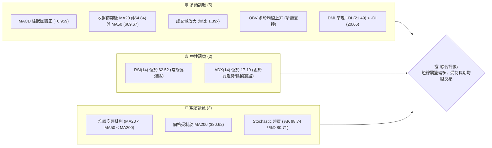
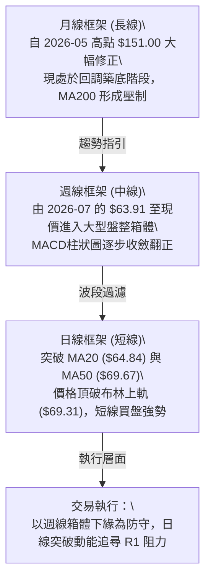
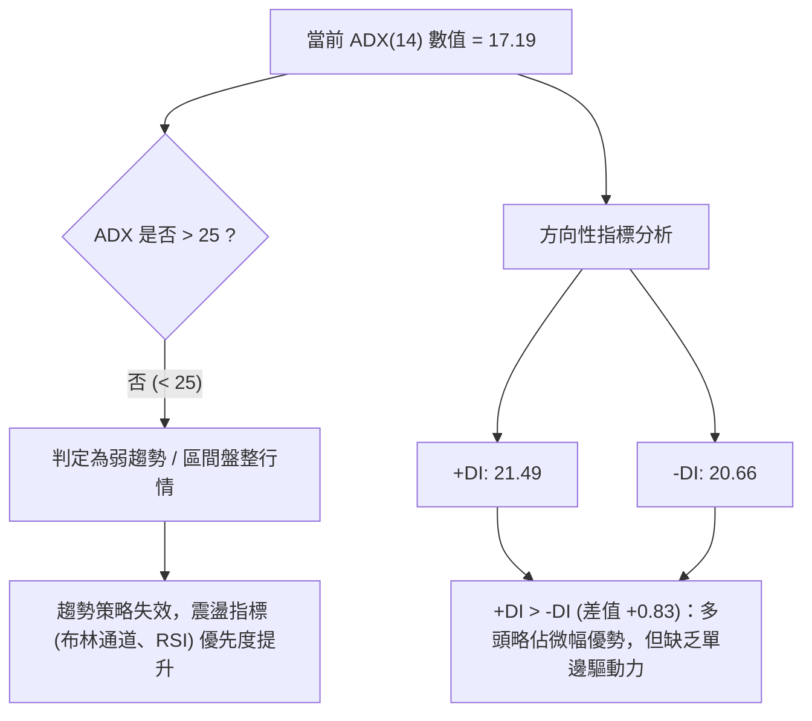
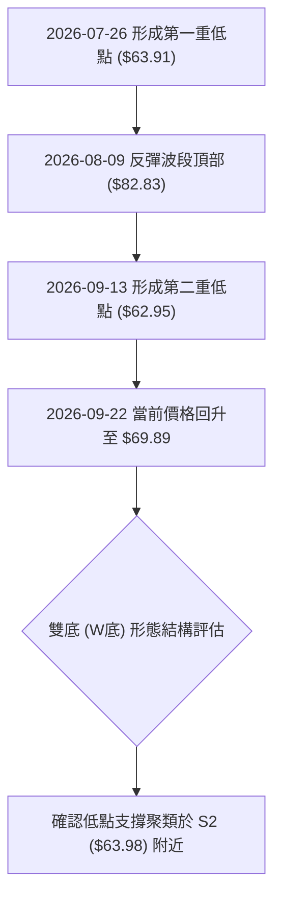
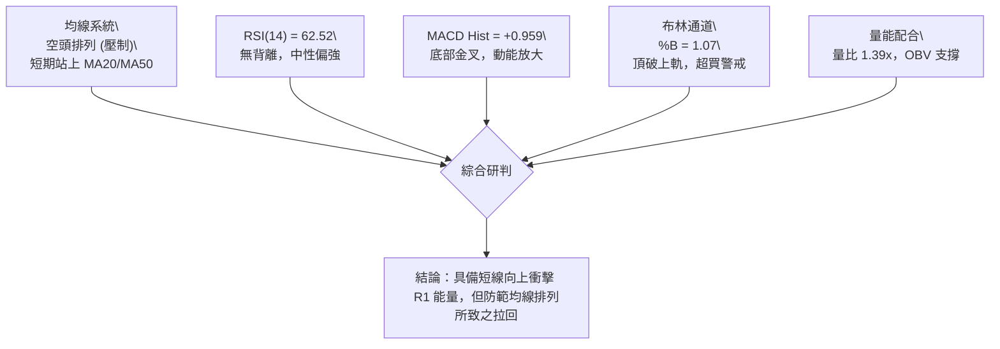
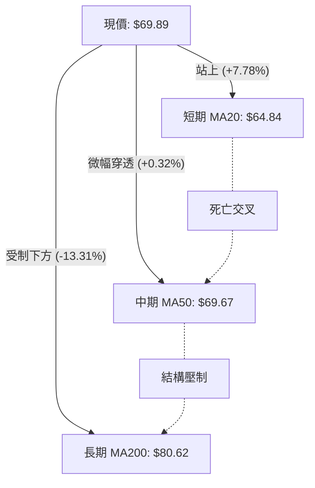
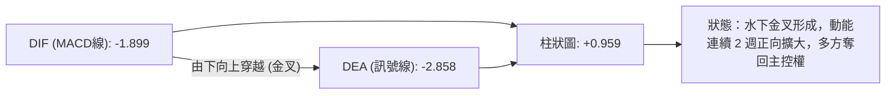
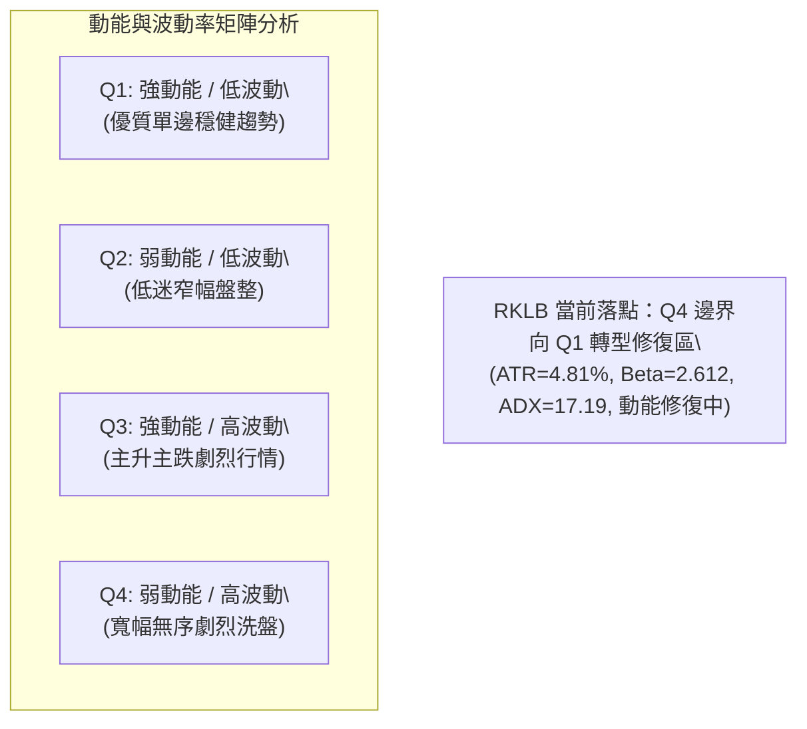
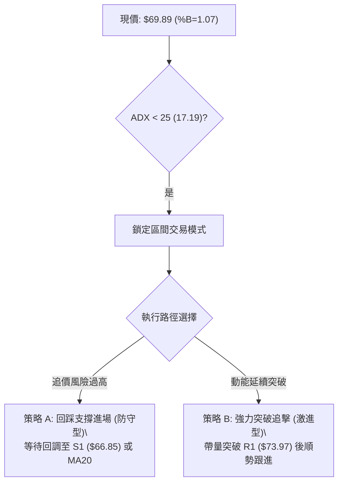
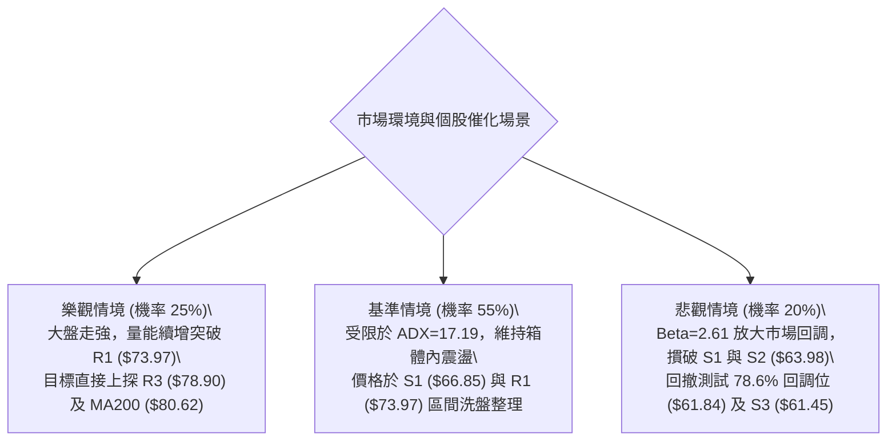

# RKLB 技術分析報告

> **報告日期**：2026-09-22 ｜ **語言**：繁體中文 ｜ **數據來源**：Yahoo Finance ｜ **當前價格**：$69.89

---

## 目錄

| 章節 | 內容 |
|------|------|
| [1. 技術面概覽](#1-技術面概覽) | 訊號儀表板、核心指標、評分卡 |
| [2. 趨勢分析](#2-趨勢分析) | 多時框趨勢、長中短期走勢 |
| [3. 圖表形態分析](#3-圖表形態分析) | 形態識別、K線組合、目標價 |
| [4. 支撐與阻力](#4-支撐與阻力) | 關鍵價位、斐波那契回調 |
| [5. 技術指標深度解讀](#5-技術指標深度解讀) | MA/RSI/MACD/布林/成交量 |
| [6. 動能與波動率](#6-動能與波動率) | 動能評估、ATR、Beta |
| [7. 多時框架總結](#7-多時框架總結) | 時框架評分矩陣 |
| [8. 交易策略建議](#8-交易策略建議) | 多空策略、風險報酬比 |
| [9. 風險提示與監控](#9-風險提示與監控) | 監控指標、風險場景 |

---

## 1. 技術面概覽

### 🎯 技術訊號儀表板



### 📊 核心指標速覽表

| 指標類別 | 指標名稱 | 當前數值 | 訊號 | 解讀 |
|----------|----------|----------|------|------|
| **價格** | 當前價格 | $69.89 | 🟢 | 站上 MA20 與 MA50，短線動能改善 |
| **均線** | MA20 | $64.84 | 🟢 | 現價高於 MA20 (+7.78%)，短期底線確立 |
| **均線** | MA50 | $69.67 | 🟢 | 現價微幅突破 MA50 (+0.32%)，展開防守挑戰 |
| **均線** | MA200 | $80.62 | 🔴 | 現價遠低於 MA200 (-13.31%)，長線仍處空頭格局 |
| **動能** | RSI(14) | 62.52 | 🟡 | 位於中性偏強水準，未進入極端超買 |
| **動能** | MACD Hist | +0.959 | 🟢 | 負值區黃金交叉，多頭動能持續修復擴大 |
| **波動** | ATR(14) | $3.36 | 🟡 | 佔股價 4.81%，日均波動適中，利於區間波段捕捉 |

### 🏆 技術評分卡

```
╔════════════════════════════════════════════════════════════════╗
║                技術評分卡 — RKLB (2026-09-22)                  ║
╠════════════════════════════════════════════════════════════════╣
║ 趨勢強度 (ADX=17.19)   ███████░░░░░░░░░░░░░  35/100 🔴 盤整格局║
║ 動能指標 (MACD/RSI)    ██████████████░░░░░░  70/100 🟢 動能修復║
║ 支撐穩定度 (S1/S2/S3)  ████████████████░░░░  80/100 🟢 底部構築║
║ 成交量配合 (OBV/量比)  ██████████████░░░░░░  70/100 🟢 價漲量增║
║ 形態完整度 (區間築底)  ████████████░░░░░░░░  60/100 🟡 待頸線破║
║ 均線排列 (空頭排列中)  ████████░░░░░░░░░░░░  40/100 🔴 長期壓制║
╠════════════════════════════════════════════════════════════════╣
║ 綜合評分               ████████████░░░░░░░░  59/100 🟡 中性偏多║
║ 評級結論：ADX<25 盤整確認，短線動能充足，主打布林通道區間操作  ║
╚════════════════════════════════════════════════════════════════╝
```

---

## 2. 趨勢分析

### 🌐 多時框趨勢分析



### 📈 長期趨勢 — 12個月走勢圖（Unicode）

```
RKLB 月線走勢圖（2025-10 至 2026-09）
價格軸 ($)
$151 ┤                                  ● 2026-05 (歷史高點 $143.48 / 峰值 $151.00)
$130 ┤                                 / \
$110 ┤                                /   ● 2026-06 ($101.65)
 $90 ┤                 ● 2026-01      /
 $70 ┤        ● 2025-12 \           ● 2026-04                  ● 現在 ($69.89)
 $60 ┤● 2025-10          ● 2026-02-03                           /
 $50 ┤ \                                          ● 2026-07-08 ─
 $40 ┤  ● 2025-11 ($42.14)
     └────────────────────────────────────────────────────────────
      10   11   12   01   02   03   04   05   06   07   08   09 (月份)
```

**走勢特徵分析表格**

| 階段區間 | 起訖月份 | 區間收盤價變化 | 漲跌幅 | 核心驅動特徵 |
|----------|----------|----------------|--------|--------------|
| 初期拉升 | 2025-10 → 2026-01 | $62.98 → $80.07 | +27.13% | 突破整理區間，動能顯著，機構持股提升 |
| 旗形回洗 | 2026-01 → 2026-03 | $80.07 → $64.22 | -19.80% | 縮量健康洗盤，回踩均線支撐 |
| 主升浪飆漲 | 2026-03 → 2026-05 | $64.22 → $143.48 | +123.42% | 極端爆發行情，觸及 52 週最高價 $151.00 |
| 流動性拋壓 | 2026-05 → 2026-07 | $143.48 → $64.95 | -54.73% | 均線高檔崩解，迅速下墜回吐大部分漲幅 |
| 築底震盪 | 2026-07 → 2026-09 | $64.95 → $69.89 | +7.61% | 於 $62.95~$64.95 構築雙重底部，短線反彈 |

### 📊 中期趨勢（週線分析）

中期走勢自 2026-07-26 創下波段低點 $63.91 以來，多頭開始建立防禦基地。近期 2026-09-13 再次下探 $62.95 獲得支撐，呈現次級支撐位確認，中軌向上牽引。

```
中期週線阻力與支撐分布示意：
  [阻力區]  ────────────────────────────── $78.90 (R3 / MA200 $80.62 反壓)
            ────────────────────────────── $75.11 (R2 波段套牢壓力)
            ────────────────────────────── $73.97 (R1 週線頸線阻力)
  [現  價]  ============================== $69.89 (多空臨界測試中)
  [支撐區]  ────────────────────────────── $66.85 (S1 短線回踩防守點)
            ────────────────────────────── $63.98 (S2 雙底頸線支撐基底)
            ────────────────────────────── $61.45 (S3 52週低點前最後壁壘)
```

### ⚡ 趨勢強度評估（ADX 解讀）



**ADX 強度對照表**

| ADX 區間 | 趨勢強度 | RKLB 當前數值 | 當前狀態判定 | 交易策略指導 |
|----------|----------|---------------|--------------|--------------|
| 0 - 20 | 極弱 / 無趨勢 | **17.19** | 🟢 完全命中 | 避免趨勢突破追價，嚴格執行通道邊界高拋低吸 |
| 20 - 25 | 潛在趨勢醞釀 | — | — | 觀察 +DI 與 -DI 交叉，等待量能突破擴大 |
| 25 - 40 | 強勁趨勢確立 | — | — | 均線系統主導，順勢加碼 |
| 40 - 100 | 極強 / 過度延伸 | — | — | 警惕均值回歸與動能衰竭 |

---

## 3. 圖表形態分析

### 🔍 形態識別系統



**形態信心度與目標評估表**

| 形態 | 信心度 | 判斷依據（引用數據） | 完成度 | 目標價（附計算式） |
|------|--------|----------------------|--------|--------------------|
| 潛在雙底 (Double Bottom) | 68% | 兩次下探低點分別為 2026-07-26 ($63.91) 與 2026-09-13 ($62.95)，精確對應支撐聚類 S2 ($63.98) | 70% (現價突破 MA50，尚未越過中樞阻力) | 由頸線阻力 R1 $73.97 與低點 S2 $63.98 計算：高度差 = 73.97 - 63.98 = $9.99；目標價 = 73.97 + 9.99 = **$83.96** (受制於 MA200) |
| 箱體震盪 (Rectangle) | 85% | 價格受困於支撐 S2 ($63.98) 至阻力 R1 ($73.97) 區間，ADX=17.19 印證震盪 | 90% | 箱頂阻力 **$73.97**，箱底支撐 **$63.98** |

### 🕯️ 重要K線形態分析

| 日期/月份 | 收盤價 | K線形態 | 解讀 | 訊號 |
|-----------|--------|---------|------|------|
| 2026-05-31 | $143.48 | 高檔長上影避雷針 | 觸及 $151.00 後拋壓湧現，確認 52 週週期見頂 | 🔴 極度看空 |
| 2026-07-26 | $63.91 | 長下影打底錘頭 | 週線 RSI 挫至 15.6 極端超賣區，空頭動能竭盡 | 🟢 築底訊號 |
| 2026-08-09 | $82.83 | 實體大陽線回抽 | 快速修復反彈，直接測試斐波那契 61.8% ($80.90) | 🟢 趨勢反彈 |
| 2026-09-13 | $62.95 | 次級低點陽線十字星 | 成交量維持 85M，不破前低，確立第二隻腳扎實性 | 🟢 底部確認 |
| 2026-09-27 (即時) | $69.89 | 突破陽線實體 | 帶量突破 MA50 ($69.67) 與布林上軌 ($69.31) | 🟢 短線多頭 |

### 📉 ASCII 走勢形態示意圖

```
RKLB 雙底/箱體築底形態結構示意圖
價格軸
$78.90 ┤ (R3) ----------------------------------------------------
       │
$73.97 ┤ (R1 頸線阻力) -----------------●-----------------------
       │                               /   \
$69.89 ┤ (現價) ---------------------/-----\-------● (當前突破測試)
       │                            /       \     /
$66.85 ┤ (S1)                      /         \   /
       │                          /           \ /
$63.98 ┤ (S2 底部支撐) ──● 2026-07-26          ● 2026-09-13
       │               ($63.91, 谷底1)      ($62.95, 谷底2)
       └────────────────────────────────────────────────────────
                          W 底第一腳          W 底第二腳
```

### 🎯 形態目標價計算

```
形態高度計算式：
  形態頸線價位 (R1)：$73.97
  形態底部支撐 (S2)：$63.98
  垂直形態高度 (H)：$73.97 - $63.98 = $9.99

目標價推導：
  理論等距測幅目標價 = R1 ($73.97) + H ($9.99) = $83.96
  
  註：因數據紀律規則，實際交易以阻力位聚類為執行基準：
  - 第一階段目標 (頸線測試)：R1 = $73.97
  - 第二階段目標 (波段溢價)：R2 = $75.11
  - 終極形態目標 (測幅極限)：R3 = $78.90 (接近 MA200 反壓 $80.62)
```

---

## 4. 支撐與阻力

### 🗺️ 關鍵價位分布圖（Unicode）

```
RKLB 價位結構分布圖
═════════════════════════════════════════════════════════════════
$78.90 ║██████████████████████████████║ 強阻力 R3 (形態極限/MA200密集區)
$75.11 ║████████████████████          ║ 阻力 R2 (反彈高點聚類帶)
$73.97 ║████████████████████████      ║ 關鍵阻力 R1 (箱體頸線壓制位)
$69.89 ╠══════════════════════════════╣ ◄ 現價 ($69.89，布林上軌突破點)
$66.85 ║▓▓▓▓▓▓▓▓▓▓▓▓▓▓▓▓              ║ 近期支撐 S1 (短線回調緩衝點)
$63.98 ║██████████████████████████████║ 強支撐 S2 (波段雙底防線)
$61.84 ║▒▒▒▒▒▒▒▒▒▒▒▒▒▒▒▒▒▒▒▒▒▒▒▒      ║ 斐波那契 78.6% 回調關鍵位
$61.45 ║██████████████████████████████║ 極限防守 S3 (跌破宣告全面破位)
═════════════════════════════════════════════════════════════════
```

### 🚧 阻力位分析表

| 阻力級別 | 價位 | 形成原因 | 突破難度 | 重要性 |
|----------|------|----------|----------|--------|
| **R1** | $73.97 | 近一年波段高點聚類，箱體中樞上緣頸線 | 🟡 中等 (需維持成交量 >20M) | ★★★★☆ |
| **R2** | $75.11 | 前期密集成交回吐平台反壓點 | 🔴 較高 (空頭拋壓湧現區) | ★★★☆☆ |
| **R3** | $78.90 | 波段高點聚類頂部，鄰近 MA200 ($80.62) | 🔴 極高 (長線牛熊分水嶺) | ★★★★★ |

### 🛡️ 支撐位分析表

| 支撐級別 | 價位 | 形成原因 | 守住機率 | 重要性 |
|----------|------|----------|----------|--------|
| **S1** | $66.85 | 近期波段回調低點聚類，短均線發散回踩點 | 🟢 70% | ★★★☆☆ |
| **S2** | $63.98 | 近一年低點重聚密集區，雙底型態基底（2026-07/09低點）| 🟢 85% | ★★★★★ |
| **S3** | $61.45 | 52 週深層波段低點聚類，跌破將引發踩踏 | 🟢 95% | ★★★★☆ |

### 📐 斐波那契回調位分析

依據 52 週極值區間（低點 $37.57 至 高點 $151.00，總垂直振幅 $113.43）計算各級回調位：

```
0.0%  (52W High)   $151.00 ──────────────────────────────────────
23.6%              $124.23 ──────────────────────────────────────
38.2%              $107.67 ──────────────────────────────────────
50.0%              $ 94.28 ──────────────────────────────────────
61.8%              $ 80.90 ────────────────────────────────────── (接近 MA200: $80.62)
現價位置           $ 69.89 ───► 處於 61.8% 與 78.6% 回調區間內
78.6%              $ 61.84 ────────────────────────────────────── (緊貼支撐聚類 S3: $61.45)
100.0% (52W Low)   $ 37.57 ──────────────────────────────────────
```

**回調位深度解讀**：
現價 $69.89 坐落於 78.6% ($61.84) 與 61.8% ($80.90) 的深水回撤防守區。歷史走勢證明，78.6% 回調位 $61.84 與實際支撐低點聚類 S3 ($61.45) 形成高度共振，構成了強大的黃金分割底部護城河。上行方向，61.8% ($80.90) 與阻力位 R3 ($78.90) 及 MA200 ($80.62) 緊密重合，為中期波段反彈難以一蹴而就的重壓帶。

---

## 5. 技術指標深度解讀

### 🎛️ 指標訊號總覽



### 📈 移動平均線排列分析



**均線結構數據詳解**：
- **短中期均線改善**：現價 $69.89 已依序攻克 MA5 ($65.91)、MA10 ($64.59)、MA20 ($64.84) 與 MA50 ($69.67)。
- **長期均線壓制**：均線整體次序仍為 MA20 ($64.84) < MA50 ($69.67) < MA200 ($80.62)，整體呈現典型的中長期空頭排列結構。雖然短期多頭取得突破，但在 MA20 尚未向上穿越 MA50 形成「黃金交叉」前，性質上仍屬跌深反彈，非單邊牛市。

### 📉 RSI(14) 分析

```
RSI(14) 強度進度條：
0       30                60 62.52     70               100
├───────┼─────────────────┼───●────────┼────────────────┤
[ 超賣 ]     常態弱勢區        常態偏強區    [ 超買預警 ]
進度：████████████████░░░░░░░░░░  62.52% (中性偏多)
```

- **背離診斷**：週線於 2026-07-26 創收盤低點 $63.91 時 RSI 挫至 15.6；其後 2026-09-13 價格再次下探 $62.95 新低時，週線 RSI 卻逆勢抬升至 27.1。日線目前為 62.52，數據標注「無明顯背離」。
- **結論**：中期呈現底部背離修復完成態勢，短線則處於 60 軸線上方之健康偏強區，未達 70 以上之極端警戒線，仍有衝高餘量。

### 📊 MACD(12/26/9) 訊號解讀



雖然 MACD 雙線仍處於零軸下方（反映長期弱勢），但柱狀圖由負翻正至 +0.959，且 DIF 快速收斂向上挑戰，顯示空方動能耗盡，多頭反彈波段持續展開。

### 📦 布林通道分析

```
RKLB 布林通道 (20, 2) 結構圖
價格軸 ($)
$69.31 ┤  ━━━━━━━━━━━━━━━━━━━━━━━━━━━━━ BB 上軌 (現價 $69.89 穿透上軌)
       │                       ● 現價 ($69.89, %B=1.07)
$64.84 ┤  ───────────────────────────── BB 中軌 (MA20)
       │
$60.38 ┤  ━━━━━━━━━━━━━━━━━━━━━━━━━━━━━ BB 下軌
```

- **通道帶寬與形態**：通道寬度為 $69.31 - $60.38 = $8.93。
- **%B 指標異常值**：%B 達 **1.07**，表明收盤價已脫軌運行於上軌外側。在 ADX=17.19（盤整行情）架構下，%B > 1.0 通常不構成單邊張口暴漲，反而高度預示短線價格有極高機率回踩中軌 $64.84 或受阻於近期阻力 R1 ($73.97)。

### 💹 成交量分析（量價配合度）

- **最新日成交量**：25,585,100 股。
- **基準比較**：20 日均量為 18,433,185 股，當前量比達 **1.39x**；50 日均量為 18,758,460 股。
- **OBV 狀態**：OBV 穩健運作於其自身平均線上方。
- **量價診斷**：帶量突破 MA50，成交量擴大 39%，呈現量增價揚的健康配合，量能有效支撐短線向上試探。

---

## 6. 動能與波動率

### ⚡ 動能評估四象限



| 象限 | 動能維度 | 波動維度 | 當前特徵 | 評估建議 |
|------|----------|----------|----------|----------|
| Q1 | 強 (MACD柱擴大) | 低至中等 | 逐步逼近 | 適合順勢介入波段反彈 |
| Q2 | 弱 | 低 | 否 | — |
| Q3 | 強 | 極高 | 否 (非 2026-05 飆漲期) | — |
| **Q4** | 偏弱 (ADX<25) | 高 (Beta 2.61) | **當前符合度高** | 警惕盤中劇烈晃盪，必須嚴設止損 |

### 📊 ATR 波動率分析

- **ATR(14) 絕對值**：**$3.36**
- **價格百分比**：4.81%
- **止損距離建議**：
  - 日內激進止損距離 (1.0 × ATR)：**$3.36**
  - 波段防守止損距離 (1.5 × ATR)：**$5.04**
  - 寬鬆趨勢止損距離 (2.0 × ATR)：**$6.72**

### 📐 Beta 與市場相關性

- **Beta 係數**：**2.612**
- **高波動風險解讀**：該標的波動敏感度為標普 500 指數的 2.61 倍，屬於超高波動資產。大盤若回調 1%，該股在統計上具備放大回調 2.6% 的系統性風險，因此倉位規模需嚴格控制於常規個股部位的 50%–60%。

---

## 7. 多時框架總結

### 📋 時框架評分表

| 時框架 | 趨勢方向 | 動能狀態 | 均線排列 | 形態結構 | 綜合評分 | 建議方針 |
|--------|----------|----------|----------|----------|----------|----------|
| **月線 (長期)** | 🔴 空頭修復 | 弱勢築底 | 空頭 (跌破MA200) | 自高位深幅回撤 78.6% | 35/100 | 長線資金觀望，靜待均線走平 |
| **週線 (中期)** | 🟡 區間震盪 | 柱狀翻正 | 壓制 (MA60在上方) | 潛在大型雙底打底 | 55/100 | 依箱體邊界低吸高拋 |
| **日線 (短期)** | 🟢 震盪轉多 | 柱狀+0.959 | 突破 (站上MA20/50)| 布林上軌突破 | 70/100 | 順應短線量能挑戰頸線阻力 |

### 🔲 綜合訊號矩陣

```
┌──────────────┬─────────────────────────┬─────────────────────────┐
│ 維度         │ 看多因素 (+)            │ 看空因素 (-)            │
├──────────────┼─────────────────────────┼─────────────────────────┤
│ 短期指標     │ 價破MA50、MACD金叉、量比1.39│ Stochastic超買(%K=98.74)│
│ 中期結構     │ 雙底次低點確認、OBV支撐   │ 受困於R1($73.97)箱頂反壓│
│ 長期架構     │ 78.6%斐波那契守穩($61.84)│ MA200($80.62)反壓猶存   │
└──────────────┴─────────────────────────┴─────────────────────────┘
```

### ⚖️ 多時框收斂結論

> **依收斂規則 14 明確裁決**：
> 1. 當前 ADX(14) 為 **17.19**，明確屬於 **ADX < 25 的盤整行情**。
> 2. 依規則，盤整行情中中長線單邊趨勢指標退居次席，**以日線布林通道上下軌及箱體關鍵支撐/阻力為主要交易區間**。
> 3. **唯一方向性結論：中性偏多觀望，區間波段操作**。短期買盤雖具備挑戰阻力位 R1 ($73.97) 之動能，但受限於 %B=1.07 超買與中期空頭均線壓制，嚴禁追高，應以拉回布林中軌支撐確認時布局為主。

---

## 8. 交易策略建議

### 🗺️ 策略決策流程圖



### 🧭 策略路由

**當前主策略方向 = 區間偏多操作（依綜合評分 59/100 判定）**
評分落於 40–60 之中性偏多區間，依規則鎖定箱體通道交易，重點防守下方 S1 ($66.85) 與 S2 ($63.98)，目標指向 R1 ($73.97) 與 R2 ($75.11)。

### 🎯 價格情境階梯（Price Scenarios）

| 觸發條件 | 下一目標 | 後續延伸 | 情境含義 |
|----------|----------|----------|----------|
| 強勢帶量突破 R1 **$73.97** | R2 **$75.11** | R3 **$78.90** | 雙底突破確立，短線轉強，向 MA200 發起衝擊 |
| 處於現價 **$69.89** 震盪 | R1 **$73.97** | S1 **$66.85** | 箱體內部消化布林上軌過熱賣壓 |
| 跌破近期支撐 S1 **$66.85** | S2 **$63.98** | S3 **$61.45** | 短線多頭失效，回防測試底層雙底防線 |

### 📊 情境機率分佈

| 情境 | 機率 | 主要依據 |
|------|------|----------|
| **區間偏多震盪上行** | **55%** | MACD 柱狀圖正向擴張 (+0.959)、成交量放大 1.39x 配合上漲 |
| **通道內部拉回整理** | **30%** | ADX=17.19 顯示缺乏單邊趨勢，布林 %B=1.07 進入超買過熱區 |
| **向下破位探底** | **15%** | 均線長線空頭壓制，若大盤重挫可能連帶擊穿 S1 考驗 S2 |

### 🟢 主策略詳情

| 策略要素 | 策略 A（支撐回踩吸納 — 推薦） | 策略 B（阻力突破跟進 — 激進） |
|----------|--------------------------------|--------------------------------|
| **進場條件** | 價格自布林上軌拉回，於 S1 獲得確認支撐 | 日K線收盤價強勢突破 R1 頸線阻力 |
| **進場價格** | **$66.85** (S1 支撐位) | **$73.97** (突破 R1 追進) |
| **目標價 T1** | **$73.97** (R1 阻力位) | **$75.11** (R2 阻力位) |
| **目標價 T2** | **$75.11** (R2 阻力位) | **$78.90** (R3 強阻力位) |
| **止損價格** | **$63.98** (跌破 S2 強支撐止損) | **$69.67** (回跌跌破 MA50 止損) |
| **風險報酬比** | **2.48 : 1** (獲利空間 $7.12 / 風險 $2.87) | **1.15 : 1** (獲利空間 $4.93 / 風險 $4.30) |
| **成功機率** | **65%** | **50%** |
| **建議倉位** | **12%** | **6%** |

### 🔴 反向風險觸發點（對沖提示）

- **觸發條件**：若現價未能上攻，反而放量跌破支撐位 **S1 ($66.85)**，且日線 MACD 柱狀圖重新收斂縮小。
- **風控處置**：跌破 $66.85 即刻減半倉；若直接跌破 **S2 ($63.98)**，多頭策略全數止損離場，標的重回長期空頭破位走勢。

### ⭐ 整體訊號強度評星

```
做多訊號強度：★★★☆☆  (3/5星，短線動能改善，但受制大級別空頭排列)
做空訊號強度：★★☆☆☆  (2/5星，量能配合下攻，下跌空間受 S2 密集支撐阻擋)
整體可信度：  ★★★☆☆  (3/5星，盤整特徵顯著，需恪守點位紀律)
```

---

## 9. 風險提示與監控

### ✅ 關鍵監控指標 Checklist

```
╔══════════════════════════════════════════════════════════════════╗
║               RKLB 每日交易關鍵監控清單 (Checklist)               ║
╠══════════════════════════════════════════════════════════════════╣
║ [ ] 監控收盤是否站穩 MA50 ($69.67)，若失守則為假突破             ║
║ [ ] 追蹤布林 %B 是否自 1.07 正常回落至 0.8 以下以化解短線鈍化   ║
║ [ ] 觀察日成交量是否維持在 20 日均量 (18.4M) 之上以維持動能       ║
║ [ ] 嚴密緊盯阻力 R1 ($73.97) 之拋壓情況                          ║
║ [ ] 絕對防守線設定於支撐 S2 ($63.98)，破位無條件止損             ║
╚══════════════════════════════════════════════════════════════════╝
```

### ⚠️ 風險場景分析



### 🛡️ 風險管理重要提醒

1. **Beta 槓桿效應控制**：RKLB 的 Beta 高達 **2.612**，其波動劇烈程度極高。單筆交易資金曝險上限不得超過總投資組合淨值的 **1.5%**。
2. **ATR 動態止損設置**：當前 ATR(14) 為 **$3.36**，日內雜訊極大。若進場操作，停損幅度不得窄於 $3.36，以免被正常通道內波動洗出場。
3. **估值與基本面壓力**：該股目前 P/S 仍高達 58.1 倍，淨利潤率為 -21.5%，營業現金流為負。當前技術面反彈純屬流動性與形態驅動，非基本面價值修復，切忌將短線交易轉為長期被動套牢存股。

---

## 📋 報告總結

```
╔════════════════════════════════════════════════════════════════╗
║                   RKLB 技術分析報告總結                        ║
╠════════════════════════════════════════════════════════════════╣
║ 報告日期：2026-09-22                                           ║
║ 當前價格：$69.89                                               ║
║ 分析評級：⚖️ 中性偏多（ADX 17.19 弱趨勢，區間震盪突破測試）    ║
║                                                                ║
║ 關鍵結論：                                                     ║
║ ├─ 長期趨勢：🔴 空頭格局（價格壓制於 MA200 $80.62 之下）        ║
║ ├─ 中期趨勢：🟡 築底震盪（$63.98 至 $73.97 大型箱體構築中）    ║
║ ├─ 短期趨勢：🟢 偏多反彈（放量突破 MA50，MACD 水下金叉擴大）   ║
║ ├─ 關鍵支撐：S1: $66.85  |  S2: $63.98  |  S3: $61.45          ║
║ ├─ 關鍵阻力：R1: $73.97  |  R2: $75.11  |  R3: $78.90          ║
║ └─ 分析師目標均價：$109.37 (區間 $64.00 - $150.00)             ║
║                                                                ║
║ 最優策略組合：                                                 ║
║ 1. 🥇 最佳機會：策略 A (回踩 S1 $66.85 低吸，停損 $63.98，     ║
║                  目標看 R1 $73.97，風報比 2.48:1)              ║
║ 2. 🥈 次選機會：布林上軌過熱拉回時，高拋低吸，嚴格鎖定區間操作 ║
║ 3. 🥉 保守選擇：空手觀望，靜待帶量突破 R1 $73.97 頸線確認再行跟進║
╚════════════════════════════════════════════════════════════════╝
```

---

> ⚠️ **免責聲明**：本報告為技術分析研究，所有數據及估算均基於歷史價格與技術指標。本報告**僅供研究與學術參考**，**不構成任何形式的投資建議**。高 Beta 與未盈利成長型標的風險極高，投資有風險，入市需謹慎。

---

*報告生成時間：2026-09-22 ｜ 數據來源：Yahoo Finance ｜ 分析框架：多時框技術分析體系*