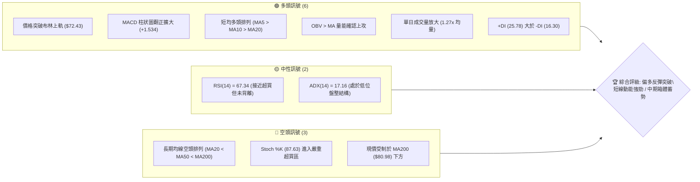
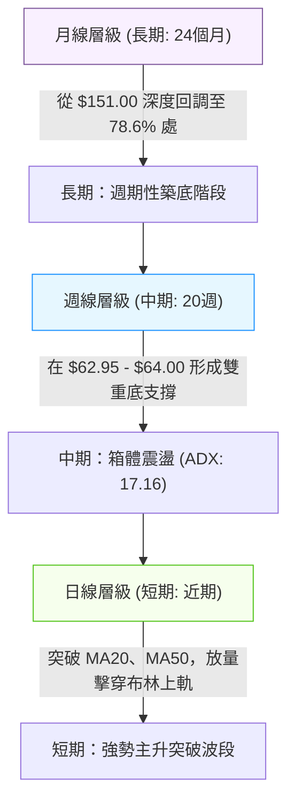
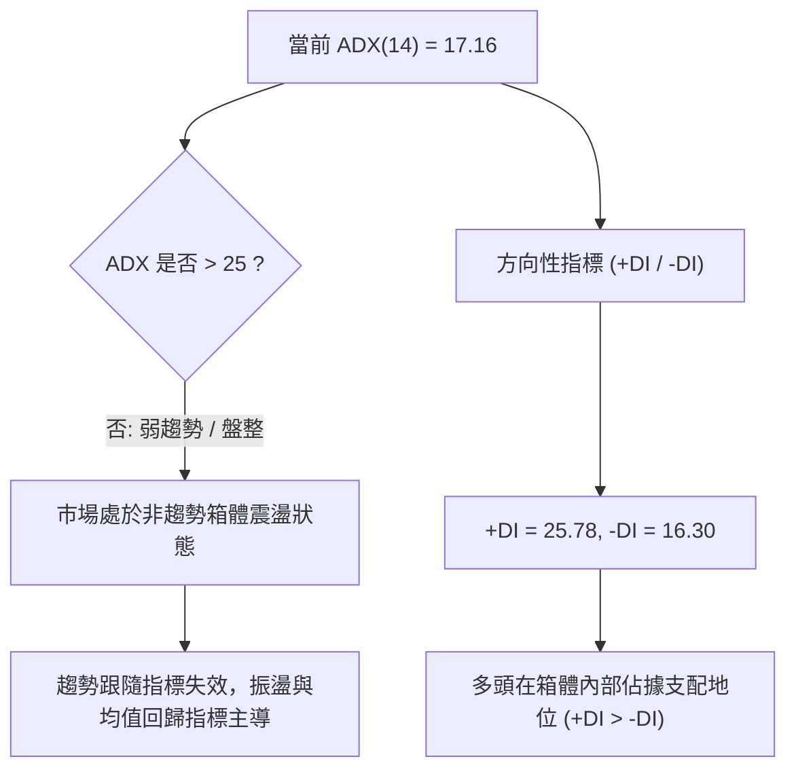
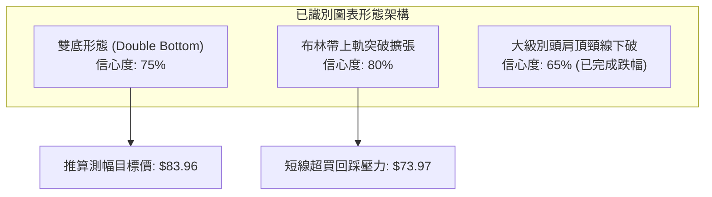
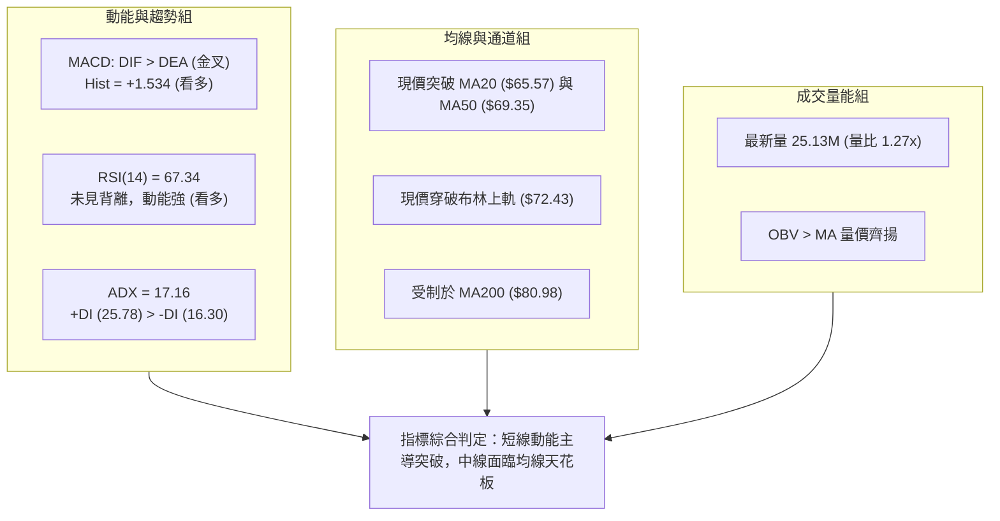
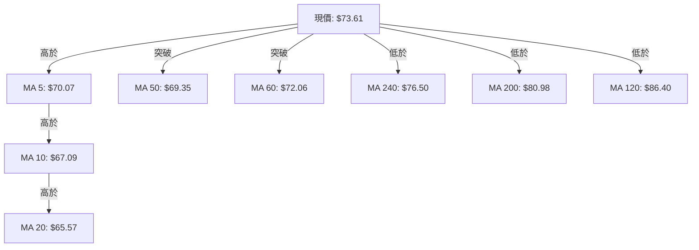
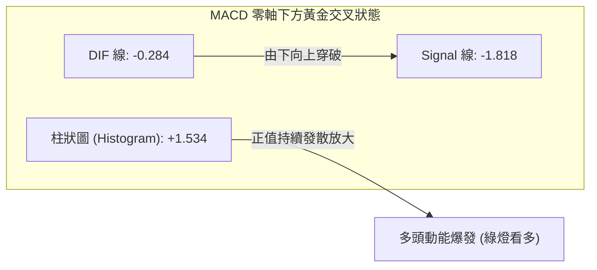
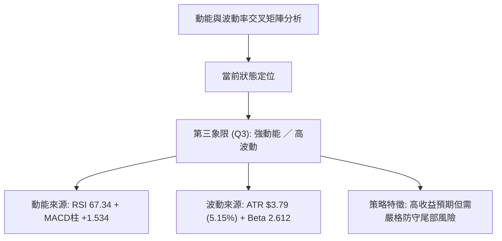
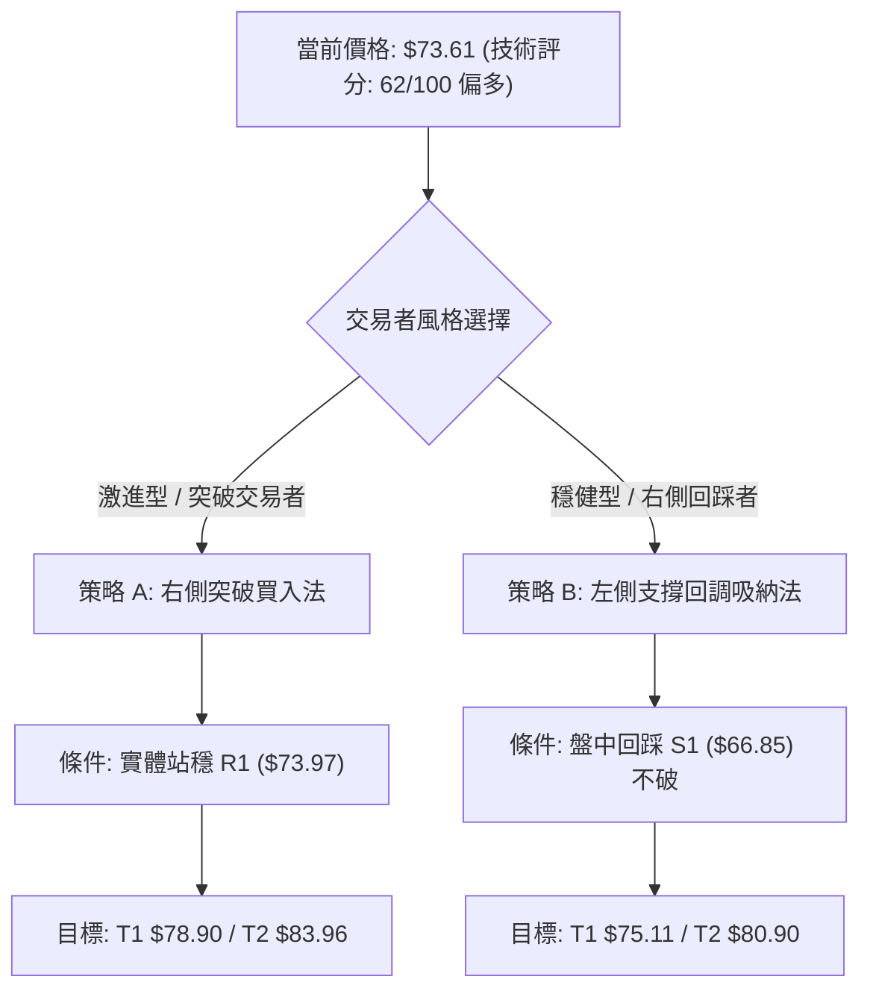
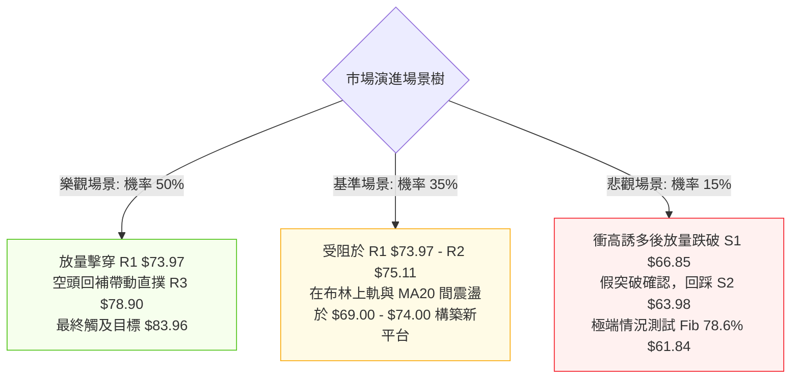

# RKLB 技術分析報告

> **報告日期**：2026-09-25 ｜ **語言**：繁體中文 ｜ **數據來源**：Yahoo Finance ｜ **當前價格**：$73.61

---

## 目錄

| 章節 | 內容 |
|------|------|
| [1. 技術面概覽](#1-技術面概覽) | 訊號儀表板、核心指標、評分卡 |
| [2. 趨勢分析](#2-趨勢分析) | 多時框趨勢、長中短期走勢、12個月走勢圖 |
| [3. 圖表形態分析](#3-圖表形態分析) | 形態識別、K線組合、目標價推算 |
| [4. 支撐與阻力](#4-支撐與阻力) | 關鍵價位分佈、斐波那契回調深度解構 |
| [5. 技術指標深度解讀](#5-技術指標深度解讀) | 均線系統、RSI、MACD、布林通道、OBV量價 |
| [6. 動能與波動率](#6-動能與波動率) | 動能四象限、ATR 風險測算、Beta 敏感度 |
| [7. 多時框架總結](#7-多時框架總結) | 時框架評分矩陣、收斂規則與單一結論 |
| [8. 交易策略建議](#8-交易策略建議) | 策略路由、多頭主策略、價格情境階梯 |
| [9. 風險提示與監控](#9-風險提示與監控) | 關鍵監控清單、情境樹、風控準則 |

---

## 1. 技術面概覽

### 🎯 技術訊號儀表板



### 📊 核心指標速覽表

| 指標類別 | 指標名稱 | 當前數值 | 訊號 | 專業技術解讀 |
|:---|:---|:---|:---:|:---|
| **價格** | 當前收盤價 | $73.61 | 🟢 | 連續突破 MA20 ($65.57) 與 MA50 ($69.35)，逼近前波聚類阻力 |
| **均線** | 短期 MA20 | $65.57 | 🟢 | 價格位於 MA20 上方 +12.26%，斜率向上，構成短線動能支撐 |
| **均線** | 中期 MA50 | $69.35 | 🟢 | 價格成功收復中軌與 MA50，扭轉短中期下跌慣性 |
| **均線** | 長期 MA200 | $80.98 | 🔴 | 價格仍位於 MA200 下方 -9.10%，長期技術格局仍處熊市壓制 |
| **動能** | RSI (14) | 67.34 | 🟡 | 強勢多頭推升區間，尚未出現頂背離，具備衝刺 70 以上動能 |
| **動能** | MACD (12,26,9) | -0.284 / Hist +1.534 | 🟢 | DIF 線快速拉升穿過信號線 (-1.818)，柱狀圖強烈擴張 |
| **震盪** | Stoch %K / %D | 87.63 / 86.11 | 🔴 | 短線極度超買，警惕短線逢高獲利了結與回踩確認要求 |
| **趨勢** | ADX (14) | 17.16 | 🟡 | 數值低於 25，表明大級別仍處於無趨勢寬幅震盪箱體內 |
| **通道** | 布林通道 %B | 1.09 | 🟢 | 價格穿透上軌 ($72.43)，呈現典型波動率擴張的強勢突破特徵 |
| **量能** | 20日成交量比 | 1.27x (25.13M) | 🟢 | 放量突破，OBV 趨勢向上確認量價齊揚的有效性 |
| **波動** | ATR (14) | $3.79 (5.15%) | 🟡 | 日均波動幅度較大，持倉與止損空間需預留足夠寬度 |

### 🏆 技術評分卡

```
╔══════════════════════════════════════════════════════════════╗
║              技術評分卡 — RKLB (2026-09-25)                 ║
╠══════════════════════════════════════════════════════════════╣
║ 趨勢強度 (Trend)     ████████░░░░░░░░░░░░  42/100  🟡 弱趨勢 ║
║ 動能指標 (Momentum)  ████████████████░░░░  82/100  🟢 強動能 ║
║ 支撐穩定度 (Support) ██████████████░░░░░░  70/100  🟢 底部固 ║
║ 成交量配合 (Volume)  ██████████████░░░░░░  72/100  🟢 量價增 ║
║ 形態完整度 (Pattern) ████████████░░░░░░░░  60/100  🟡 構建中 ║
║ 均線排列 (MAs)       ████████░░░░░░░░░░░░  44/100  🔴 長期空 ║
╠══════════════════════════════════════════════════════════════╣
║ 綜合技術評分         ████████████░░░░░░░░  62/100  🟢 偏多反彈║
╚══════════════════════════════════════════════════════════════╝
```

---

## 2. 趨勢分析

### 🌐 多時框趨勢分析



### 📈 長期趨勢 — 12個月走勢圖（Unicode）

```
RKLB 月線收盤走勢圖（過去12個月：2025-10 至 2026-09）
價格 ($)
$150 ┤                                  
$140 ┤                         ● (2026-05: $143.48 高點)
$130 ┤                        ╱ ╲
$120 ┤                       ╱   ╲
$110 ┤                      ╱     ● (2026-06: $101.65)
$100 ┤                     ╱       ╲
 $90 ┤                    ╱         ╲
 $80 ┤           ●       ●           ╲
 $70 ┤       ●  ╱ ╲     ╱             ╲              ●(現價 $73.61)
 $60 ┤  ●   ╱  ●   ●───●               ●─────●──────●
 $50 ┤   ╲ ╱                           (07)  (08)   (09)
 $40 ┤    ● (2025-11: $42.14)          $64.9 $63.9  $73.6
     └────┬───┬───┬───┬───┬───┬───┬───┬───┬───┬───┬──────
         10  11  12  01  02  03  04  05  06  07  08  09   (月份)
```

#### 走勢特徵分析表格

| 階段區間 | 時間跨度 | 價格起訖 | 區間幅度 | 成交量與動能特徵 | 結構性定義 |
|:---|:---|:---:|:---:|:---|:---|
| **第一波拉升** | 2025-11 → 2026-01 | $42.14 → $80.07 | +90.0% | 放量推升，突破前期整理平台 | 牛市初段展開 |
| **中繼洗盤** | 2026-01 → 2026-03 | $80.07 → $64.22 | -19.8% | 縮量回調，在 $64 附近獲得支撐 | 上升旗形整理 |
| **主升瘋狂浪** | 2026-03 → 2026-05 | $64.22 → $143.48 | +123.4% | 週成交量爆出 1.63 億股巨量，RSI 破 74 | 頂部過熱爆發期 |
| **劇烈崩落** | 2026-05 → 2026-07 | $143.48 → $63.91 | -55.5% | 跌破所有短期均線，MACD 週線深度死叉 | 泡沫破裂與多殺多 |
| **箱體築底** | 2026-07 → 2026-09 | $63.91 → $73.61 | +15.2% | 量能收斂至 8000 萬股水平，底背離修復 | 箱體打底與反彈初階 |

### 📊 中期趨勢（週線分析）

中期走勢顯示，RKLB 在 2026 年 7 月下旬打出低點 $63.91 後，曾於 8 月中旬反彈至 $82.83，隨後遭遇 MA200 與波段阻力回踩；在 2026 年 9 月 13 日該週下探 $62.95，隨即引發強勁買盤承接，週線形成顯著的「雙重底（W底）」結構。

```
中期壓力與支撐示意圖 (週線層級)
══════════════════════════════════════════════════════════════
 阻力區間 2: $80.90 - $80.98 ─── Fib 61.8% 與 MA200 壓制線
           ▲
 阻力區間 1: $73.97 - $75.11 ─── 頸線聚類區 (R1/R2，當前正受考驗)
 ──────────────────────────────────────────────────────────
 當前現價:   $73.61          ─── 帶量挑戰頸線位
 ──────────────────────────────────────────────────────────
 核心支撐 1: $66.85          ─── S1 近期波段回踩支撐
           ▼
 核心底部 2: $62.95 - $63.98 ─── 雙底基底 (S2 與週線低點連線)
══════════════════════════════════════════════════════════════
```

### ⚡ 趨勢強度評估（ADX 解讀）



| 指標名稱 | 當前數值 | 臨界門檻 | 趨勢屬性判定 | 實戰操作意涵 |
|:---|:---:|:---:|:---:|:---|
| **ADX (14)** | **17.16** | 25.00 | **無趨勢 / 震盪行情** | 嚴禁使用盲目追高的單邊突破策略；以箱體高拋低吸為主 |
| **+DI** | **25.78** | - | 多方力量佔優 | 短線買盤動能正在釋放，推動價格朝箱體頂部運動 |
| **-DI** | **16.30** | - | 空方力量衰退 | 賣壓顯著減輕，空頭無法在現階段發動下破攻勢 |
| **ADX 變化率** | 向上拐頭 | - | 波動率正自底部復甦 | 若 ADX 越過 20 並突破 25，將確認自盤整升級為單邊趨勢 |

---

## 3. 圖表形態分析

### 🔍 形態識別系統



#### 形態識別與信心度評估表

| 形態名稱 | 週期 | 信心度 | 判斷依據（嚴格引用數據） | 完成度 | 目標價（附嚴謹計算式） |
|:---|:---:|:---:|:---|:---:|:---|
| **雙重底 (W-Bottom)** | 日線/週線 | **75%** | 兩次低點分別落於 2026-07-26 收盤 $63.91 與 2026-09-13 週收盤 $62.95，聚類於支撐位 S2 ($63.98) 附近；頸線為波段高點 R1 ($73.97) | 85% (正在測試頸線) | **$83.96**<br>計算式：頸線 R1 ($73.97) + 形態高度 ($73.97 - S2 $63.98 = $9.99) = $83.96 |
| **布林上軌帶量突破** | 日線 | **80%** | 最新收盤 $73.61 > BB上軌 $72.43，%B 達 1.09，伴隨成交量放大至 25.13M (1.27x 均量) | 100% (已觸發) | **$75.11 (R2)**<br>短期均線推升動能測試下一個阻力節點 |
| **大型頭肩頂向下對稱** | 週線 | **65%** | 5月左肩/頭部 $143.48 跌破頸線 $82.50，目標已在 7-9 月 $63-$64 完全釋放完畢 | 100% (耗盡) | 跌幅滿足已達，轉為指標型底背離築底解讀 |

### 🕯️ 重要K線形態分析

| 日期 / 週期 | 收盤價 | 實體與影線特徵 | K線形態名稱 | 專業解讀 | 訊號方向 |
|:---|:---:|:---|:---:|:---|:---:|
| **2026-09-13 (週)** | $62.95 | 長下影十字星，探底後回升 | **低檔錘頭線 (Hammer)** | 測試年內低點聚類區未破，下檔多頭強力護盤 | 🟢 強看多 |
| **2026-09-20 (週)** | $64.57 | 小陽實體，成交量放大至 1.06 億 | **曙光初現 (Piercing)** | 量能回溫，確認 $62.95 低點支撐有效性 | 🟢 看多 |
| **2026-09-27 (週)** | $73.61 | 大實體長陽線，光腳逼近高點 | **大陽突破線 (Marubozu)** | 實體直接吞沒前三週波動，強勢奪回 MA50 主控權 | 🟢 強看多 |
| **2026-05-31 (月)** | $143.48 | 巨量天線，帶長上影線 | **流星線 (Shooting Star)** | 歷史高點爆量滯漲，見頂出貨確立 | 🔴 極度空頭 |

### 📉 ASCII 走勢形態示意圖

```
RKLB 日/週線層級「雙重底 (W-Bottom)」形態結構推演
────────────────────────────────────────────────────────────
 價位 ($)
 $83.96 ┼───────────────────────────────────── 目標價 ($83.96)
        │                                     /
 $80.98 ┼───────────────── MA200 阻力 ───────/──
        │                                   /
 $75.11 ┼─────────────────────────── R2 ──/────
 $73.97 ┼────── 頸線阻力 (R1) ─────────●── (現價 $73.61 挑戰中)
        │      ▲                      / ╲
 $70.00 ┼─────/─╲────────────────────/───
        │    /   ╲                  /
 $66.85 ┼───/─────╲────── S1 ──────/─────
        │  /       ╲              /
 $63.98 ┼─●         ●────────────●─────── S2 支撐 (雙底底線)
          底 1      回撤反彈     底 2
        (07-26)   (08-09: $82) (09-13)
────────────────────────────────────────────────────────────
```

### 🎯 形態目標價計算

雙底形態測幅原理：突破頸線後的最小理論漲幅等於底部低點至頸線的垂直垂直幅度。
1. **形態低點**：取 S2 支撐聚類點 $63.98（確認 7 月與 9 月底部中樞）。
2. **頸線確認**：取近一年阻力聚類點 R1 **$73.97**。
3. **垂直形態高度**：$H = 頸線 - 底點 = 73.97 - 63.98 = \$9.99$。
4. **理論目標價 (Target 1)**：$頸線 + H = 73.97 + 9.99 = \mathbf{\$83.96}$。
   - *註*：該目標價恰好位於斐波那契 61.8% 回調位 ($80.90) 與 MA200 ($80.98) 之上方密集成交區，極具技術指向意義。

---

## 4. 支撐與阻力

### 🗺️ 關鍵價位分布圖（Unicode）

```
RKLB 關鍵價位結構分布圖 (由實際成交量與 OHLCV 計算)
══════════════════════════════════════════════════════════════
 價位 ($)   結構屬性與強弱指標
 $80.90 ║██████████████████████████████║ 強結構阻力 (Fib 61.8% / MA200 $80.98)
 $78.90 ║████████████████████          ║ 強阻力 R3 (近一年波段高點聚類)
 $75.11 ║██████████████                ║ 中阻力 R2 (反彈延伸壓力點)
 $73.97 ║██████████████████████        ║ 關鍵阻力 R1 (頸線與波段高點)
 $73.61 ╠══════════════════════════════╣ ◄ 當前收盤價 ($73.61)
 $66.85 ║▓▓▓▓▓▓▓▓▓▓▓▓▓▓▓▓              ║ 近期波段支撐 S1 (MA20 緩衝帶)
 $63.98 ║████████████████████████      ║ 強支撐 S2 (雙底結構防守底線)
 $61.84 ║████████████████████████████  ║ 黃金分割強支撐 (Fib 78.6%)
 $61.45 ║██████████████████████████████║ 極限防守支撐 S3 (年內波段低點聚類)
══════════════════════════════════════════════════════════════
```

### 🚧 阻力位分析表

所有阻力數值完全引用自近一年波段高點聚類計算結果：

| 阻力級別 | 精確價位 | 距現價空間 | 形成技術原因 | 突破難度 | 重要性權重 |
|:---|:---:|:---:|:---|:---:|:---:|
| **R1** | **$73.97** | +0.49% | 近一年波段高點聚類線、W底頸線阻力、布林通道上軌外側回壓區 | 🟡 中等 (正直接測試中) | ★★★★☆ |
| **R2** | **$75.11** | +2.04% | 次級高點密集區、短期獲利盤了結點、MA240 ($76.50) 下方防禦圈 | 🟡 中等 | ★★★☆☆ |
| **R3** | **$78.90** | +7.19% | 2026年8月反彈次高點聚類、斐波那契 61.8% ($80.90) 前衛防線 | 🔴 較高 (空頭防守陣地) | ★★★★★ |

### 🛡️ 支撐位分析表

所有支撐數值完全引用自近一年波段低點聚類計算結果：

| 支撐級別 | 精確價位 | 距現價空間 | 形成技術原因 | 守住機率 | 重要性權重 |
|:---|:---:|:---:|:---|:---:|:---:|
| **S1** | **$66.85** | -9.18% | 近一年波段低點聚類線、MA20 ($65.57) 與 MA10 ($67.09) 動態重合區 | 80% | ★★★★☆ |
| **S2** | **$63.98** | -13.08% | 2026年7-9月雙重底核心底線、波段低點聚類、大級別主力成本防線 | 85% | ★★★★★ |
| **S3** | **$61.45** | -16.52% | 年內波段極限低點聚類、Fib 78.6% ($61.84) 下方多頭最後防線 | 95% | ★★★★★ |

### 📐 斐波那契回調位分析

依據 52 週極值區間（最低價 **$37.57** 至 最高價 **$151.00**，總波幅 **$113.43**）精確測算：

| 回調比例 | 精確價位 | 當前相對位置 | 技術意義與多空攻防解讀 |
|:---:|:---:|:---:|:---|
| **0.0%** | $151.00 | +105.1% | 52 週歷史高點，長期宏觀超級天花板 |
| **23.6%** | $124.23 | +68.8% | 主升浪破位後的中繼反彈頂點 |
| **38.2%** | $107.67 | +46.3% | 機構分析師平均目標價 ($109.37) 共振帶 |
| **50.0%** | $94.28 | +28.1% | 宏觀多空強弱分水嶺（半山腰中樞） |
| **61.8%** | **$80.90** | +9.90% | **黃金分割重壓區**，與 MA200 ($80.98) 形成雙重阻力共振點 |
| **當前現價** | **$73.61** | - | **落於 78.6% 與 61.8% 之間**，呈現超跌黃金分割帶的反彈推升行情 |
| **78.6%** | **$61.84** | -15.99% | **關鍵回調支撐位**，與 S3 ($61.45) 形成宏觀底部屏障 |
| **100.0%** | $37.57 | -48.96% | 52 週低點，牛市起漲起點 |

---

## 5. 技術指標深度解讀

### 🎛️ 指標訊號總覽



### 📈 移動平均線排列分析



#### 均線矩陣詳細參數表

| 均線名稱 | 數值 | 距現價差距 (%) | 走勢狀態 | 解讀與交叉訊號 |
|:---|:---:|:---:|:---:|:---|
| **MA 5** | $70.07 | +5.05% | 陡峭向上 | 超短期攻擊線，每日提供動態墊高支撐 |
| **MA 10** | $67.09 | +9.71% | 向上發散 | 短線操盤線，多頭排列完整 |
| **MA 20** | $65.57 | +12.26% | 向上拐頭 | 月線生命線，已完成由阻力轉化為強支撐的轉換 |
| **MA 50** | $69.35 | +6.14% | 走平轉多 | 季線被實體陽線直接擊穿，宣告中短期趨勢翻多 |
| **MA 60** | $72.06 | +2.16% | 緩慢向上 | 已被跨越，下一個交易日將提供下檔保護 |
| **MA 240** | $76.50 | -3.78% | 走平向下 | 長期均線，現價上方第一道嚴密均線防線 |
| **MA 200** | $80.98 | -9.10% | 緩降向下 | 長期牛熊分界線，空頭排列主力阻力所在 |
| **MA 120** | $86.40 | -14.80% | 陡峭向下 | 半年線下壓，限制了中期反彈的最高極限空間 |

*排列狀態綜合判定*：**短均多頭排列（MA5 > MA10 > MA20）vs 長均空頭排列（MA20 < MA50 < MA200）**。此結構為標準的「熊市次級折返反彈」或「大級別築底第一浪」，行情具備爆發力，但在遭遇 MA200 前將面臨劇烈震盪。

### 📉 RSI(14) 分析

```
RSI(14) 當前狀態: 67.34 
[0] ─────────── [30] ────────────────────── [70] ───── [100]
                超賣區        中性區          超買區
██████████████████████████████████████░░░░░  67.34%
```

- **區間診斷**：RSI 位於 67.34，脫離了 9 月中旬的超賣低迷區（9/06 週 RSI 僅 12.8，9/13 為 27.1），目前逼近 70 超買警戒線，屬於**強勢多頭推升狀態**。
- **背離分析**：
  - **底背離驗證**：回顧 7 月 26 日低點 $63.91（RSI 15.6）至 9 月 06 日低點 $64.26（RSI 12.8），再到 9 月 13 日收盤 $62.95（RSI 27.1），價格創出更低點而 RSI 顯著墊高，形成了極為標準的**週線級別底背離**，目前的反彈正是底背離能量的集中釋放。
  - **頂背離診斷**：當前日線與週線**均無頂背離跡象**。動能與價格同向攀升，尚未出現衰竭徵兆。

### 📊 MACD(12,26,9) 訊號解讀



- **數值關係**：DIF (-0.284) 明顯高於 DEA (-1.818)，MACD 柱狀圖讀數為 **+1.534**。
- **形態含義**：在經歷了長達數週的負值收斂後，柱狀圖自 9 月中旬由負翻正（從 -0.133 到 +0.612，再到最新的 +1.534），呈現幾何級數放大，證實**空頭動能已徹底枯竭，多頭主控權確立**。
- **零軸考量**：由於 DIF 仍位於零軸下方 (-0.284)，此黃金交叉屬於「零軸下強勢金叉」，目標是向零軸發起衝刺。一旦 DIF 實質站上零軸，將確認行情由反彈升格為反轉。

### 📦 布林通道分析

```
RKLB 布林通道當前狀態 (帶寬擴張，突破上軌)
────────────────────────────────────────────────────────────
 $75.00 ┤                                              
 $73.61 ┤──────────────────────────────────────── ● 現價 ($73.61) 突破上軌
 $72.43 ┼┄┄┄┄┄┄┄┄┄┄┄┄┄┄┄┄┄┄┄┄┄┄┄┄┄┄┄┄┄┄┄┄┄┄┄┄┄┄┄ BB 上軌 ($72.43)
 $70.00 ┤                                      ╱
 $68.00 ┤                                    ╱  
 $65.57 ┼───────────────────────────────────●─── BB 中軌 / MA20 ($65.57)
 $62.00 ┤                                 ╱     
 $58.70 ┼┄┄┄┄┄┄┄┄┄┄┄┄┄┄┄┄┄┄┄┄┄┄┄┄┄┄┄┄┄┄┄┄┄┄┄┄┄┄┄ BB 下軌 ($58.70)
────────────────────────────────────────────────────────────
```

- **軌道數據**：上軌 **$72.43**，中軌 (MA20) **$65.57**，下軌 **$58.70**，帶寬約 $13.73。
- **%B 指標數值**：**1.09**（超過 1.0 代表價格收在布林上軌之外）。
- **結構意義**：價格脫離長期在下軌與中軌徘徊的頹勢，強勢打穿上軌。依據布林通道破軌理論，%B > 1.0 伴隨量能增加，代表進入「布林單邊開口拉升」進程。然而，短線偏離上軌過遠可能在遭遇阻力 R1 ($73.97) 時出現盤中技術性拉回，回踩 $72.43 尋求支撐確認。

### 💹 成交量分析（量價配合度）

- **量比強度**：最新單日成交量 **25,137,100** 股，相較於 20 日均量 **19,743,720** 股，量比高達 **1.27x**；相較於 50 日均量 **19,094,946** 股亦保持顯著放量。
- **量價配合**：長陽實體伴隨成交量穩步攀升，完全符合「量增價揚」的多頭攻擊架構，打破了 8 月末至 9 月初的縮量沉悶陰跌格局。
- **OBV (能量潮)**：系統顯示 **OBV > MA**，OBV 均線向上抬頭，顯示大資金淨流入狀態良好，成交量有力支撐了當前價格的向上推升，無量價背離隱患。

---

## 6. 動能與波動率

### ⚡ 動能評估四象限



| 象限 | 動能維度 | 波動維度 | 典型市場特徵 | RKLB 當前匹配度 | 戰略應對指南 |
|:---:|:---:|:---:|:---|:---:|:---|
| **Q1** | 強動能 | 低波動 | 穩步單邊推升主升浪 | 20% | 順勢無腦持股 |
| **Q2** | 弱動能 | 低波動 | 狹幅無聊橫盤縮量盤整 | 10% | 觀望或網格交易 |
| **Q3** | **強動能** | **高波動** | **爆發性突破、脈衝拉升、博弈劇烈** | **65% (當前狀態)** | **控制單筆倉位，擴大止損容忍度，緊盯阻力兌現** |
| **Q4** | 弱動能 | 高波動 | 恐慌性崩跌破位洗盤 | 5% | 堅決離場防守 |

### 📊 ATR 波動率分析

- **ATR(14) 絕對值**：**$3.79**。
- **波動百分比**：佔當前股價的 **5.15%**，表明該股每日平均單邊日內震幅超過 5%，屬於高波動成長型標的。
- **止損與開倉距離精算**：
  - *短期日內止損緩衝 (1.0x ATR)*：$3.79。
  - *波段持倉合理止損寬度 (1.5x - 2.0x ATR)*：**$5.69 - $7.58**。
  - *交易意涵*：若在現價 $73.61 進場，止損位若設置在 $2.00 以內，將極易被日內正常隨機雜訊掃出場。止損點下限必須置於 S1 ($66.85) 之下，剛好約為 $73.61 - $66.85 = $6.76（約 1.78x ATR），此距離在技術結構與波動統計上均具備極高的合理性。

### 📐 Beta 與市場相關性

- **Beta 數值**：**2.612**。
- **特性分析**：RKLB 展現出極強的市場高貝塔屬性，其波動幅度為標普500指數的 2.6 倍以上。當大盤指數上漲 1% 時，該股預期將有 2.6% 的漲幅反應；反之若大盤拉回，其下跌敏感度亦同等放大。
- **空頭部位特徵**：Short % Float 達 **7.6%**，Short Ratio 為 **2.58**。若價格突破頸線 R1 ($73.97) 並站上 R2 ($75.11)，可能觸發空頭停損平倉潮，形成短線空頭擠壓（Short Squeeze）推升行情。

---

## 7. 多時框架總結

### 📋 時框架評分表

| 時框架 | 主要週期 | 趨勢方向 | 核心動能指標狀態 | 均線排列特徵 | 形態判定 | 評分 (100) | 操作建議 |
|:---|:---|:---:|:---|:---|:---|:---:|:---|
| **長期** | 月線 (24M) | 🟡 宏觀築底 | 脫離超賣，處於 78.6% 回調位 | 均線向下發散壓制 | 歷史巨浪後的大箱體 | 50/100 | 戰略性底倉配置 |
| **中期** | 週線 (20W) | 🟢 震盪轉強 | MACD柱收窄翻正，底背離修復 | 價格重返週線 MA20 上方 | W底初成，蓄勢衝擊頸線 | 68/100 | 波段多頭持股 |
| **短期** | 日線 (近期) | 🟢 強勁突破 | RSI 67.34，布林破軌，放量 | 短均完全多頭 (5>10>20) | 帶量突破布林上軌與阻力 | 75/100 | 逢回踩或突破買入 |

### 🔲 綜合訊號矩陣

```
時框架訊號矩陣收斂表
┌──────────────┬─────────────┬─────────────┬─────────────┐
│ 技術維度     │ 短期 (日線) │ 中期 (週線) │ 長期 (月線) │
├──────────────┼─────────────┼─────────────┼─────────────┤
│ 趨勢方向     │ 🟢 多頭推升 │ 🟡 箱體打底 │ 🔴 下行修復 │
│ 均線系統     │ 🟢 短均看多 │ 🟡 攻克中軌 │ 🔴 長均壓制 │
│ 動能指標     │ 🟢 強勁衝刺 │ 🟢 金叉發散 │ 🟡 中性低位 │
│ 量價結構     │ 🟢 放量突破 │ 🟢 底背離量 │ 🔴 歷史高量套│
│ 波動狀態     │ 🔴 突破超買 │ 🟢 波動蓄勢 │ 🟡 波動收縮 │
└──────────────┴─────────────┴─────────────┴─────────────┘
```

### ⚖️ 多時框收斂結論

依據多時框收斂核心規則：
1. **行情性質判定**：ADX(14) 讀數為 **17.16 (<25)**，嚴格判定當前大格局**並非大級別單邊單向趨勢，而是處於巨型寬幅震盪箱體行情中**。
2. **時框優先級收斂**：在 ADX < 25 的盤整結構中，日線級別布林通道上下軌與近一年波段聚類點為主要交易邊界。雖然長期均線（MA200 位於 $80.98）仍呈空頭下壓，但短期多頭已完成對布林上軌 ($72.43) 及 MA50 ($69.35) 的實質性突破，且方向指標 +DI (25.78) 顯著壓制 -DI (16.30)。
3. **收斂統一結論**：**【偏多反彈主升波段】**。短期強勁動能將主導價格向箱體頂部及 MA200 發起衝擊。在突破 R1 ($73.97) 後，價格預計將在 R2 ($75.11) 至 R3 ($78.90) 區間遭遇阻力震盪，最終測幅指向形態目標價 **$83.96**。

---

## 8. 交易策略建議

### 🗺️ 策略決策流程圖



### 🧭 策略路由（依評分卡分流）

> **當前主策略方向 = 主推多頭策略（依綜合技術評分 62/100，處於 ≥60 偏多反彈區間）**

本章節集中制定多頭戰術佈局，空頭方向僅作為反轉防禦與風險對沖之觸發依據。

### 🎯 價格情境階梯（Price Scenarios）

所有價位均嚴格取自第 4 章所確認的精確技術點位：

| 觸發條件 | 當前狀態 | 第一目標位 | 次級目標位 | 終極延伸目標 | 戰略情境技術含義 |
|:---|:---:|:---:|:---:|:---:|:---|
| **強勢突破** | 站穩 R1 $73.97 | R2 $75.11 | R3 $78.90 | $83.96 (雙底目標) | 確立 W底反轉，啟動空頭擠壓波段 |
| **區間震盪** | 承壓於 $73.97 - $72.43 | $69.35 (MA50) | $66.85 (S1) | — | 消化超買指標，回踩布林上軌進行確認 |
| **破位走弱** | 跌破 S1 $66.85 | S2 $63.98 | $61.84 (Fib 78.6%) | S3 $61.45 | 反彈夭折，重回大箱體底部震盪甚至破底 |

### 📊 情境機率分佈

```
情境機率估計分布
繼續上行反彈 (55%) : ██████████████████████░░░░░░░░░░
區間高位震盪 (30%) : ████████████░░░░░░░░░░░░░░░░░░
深度回落探底 (15%) : ██████░░░░░░░░░░░░░░░░░░░░░░░░
```

| 情境劃分 | 機率估算 | 主要技術指標支撐依據 |
|:---|:---:|:---|
| **繼續上行突破** | **55%** | MACD 柱狀圖大幅擴張 (+1.534)、成交量比 1.27x 放量、OBV 明確多頭排列、+DI (25.78) 強勢壓制 -DI |
| **區間高位震盪** | **30%** | ADX 僅 17.16 限制單邊持久力、Stoch %K 達 87.63 處於極度超買區、現價剛好觸碰 R1 頸線阻力 |
| **深度回落探底** | **15%** | 長期 MA200 仍處下行態勢，若大盤系統性風險爆發（Beta 2.612 高度敏感），引發獲利盤踩踏出逃 |

### 🟢 主策略詳情（方向：多頭主導）

| 策略要素 | 策略 A：突破追擊型（右側開倉） | 策略 B：穩健回調型（右側回踩） |
|:---|:---|:---|
| **適合對象** | 積極型短線與波段動量交易者 | 穩健型資產配置與中線波段交易者 |
| **進場條件** | 盤中放量突破 R1 ($73.97) 並收於其上方 | 價格遇阻 R1 回踩 S1 ($66.85) 獲得支撐出下影線 |
| **精確進場點** | **$74.10**（突破確認後跟進） | **$67.20**（接近 S1 $66.85 企穩時分批吸納） |
| **止損價格** | **$70.50**（置於 MA5 $70.07 與短線起漲點下） | **$63.50**（嚴格跌破雙底 S2 $63.98 即停損） |
| **目標價 T1** | **$78.90 (R3 聚類阻力)** | **$73.97 (R1 頸線位置)** |
| **目標價 T2** | **$83.96 (形態理論推算目標價)** | **$80.90 (Fib 61.8% / MA200)** |
| **風險空間** | $74.10 - $70.50 = **$3.60** (約 0.95x ATR) | $67.20 - $63.50 = **$3.70** (約 0.98x ATR) |
| **獲利空間 (T2)**| $83.96 - $74.10 = **$9.86** | $80.90 - $67.20 = **$13.70** |
| **風險報酬比** | **1 : 2.74** | **1 : 3.70** |
| **評估勝率** | **55%** | **65%** |
| **建議倉位** | **總資金 8% - 10%** | **總資金 12% - 15%** |

### 🔴 反向風險觸發點（對沖提示）

若出現以下訊號，多頭邏輯即刻宣告失效，投資人應考慮清倉多單或建立對沖防護：
1. **反轉破位線**：日線收盤價跌破支撐位 **S1 ($66.85)**，特別是伴隨成交量放大時，表明短線突破為假突破，行情重回箱體下軌尋底。
2. **動能衰竭線**：日線 RSI 在 70 附近出現「死叉」且日 MACD 柱狀圖停止增長並向下跌破 +0.80。
3. **極限風控位**：任何情況下只要收盤跌破雙底防線 **S2 ($63.98)**，多頭形態徹底瓦解，必須無條件止損出局。

### ⭐ 整體訊號強度評星

```
╔══════════════════════════════════════════════════════════════╗
║ 做多訊號強度：★★★★☆  (4/5星) — 短期量能充沛，突破動能飽滿   ║
║ 做空訊號強度：★☆☆☆☆  (1/5星) — 空頭動能暫竭，逆勢做空風險大 ║
║ 整體技術可信度：★★★★☆  (4/5星) — 量價指標共振確認度較高     ║
╚══════════════════════════════════════════════════════════════╝
```

---

## 9. 風險提示與監控

### ✅ 關鍵監控指標 Checklist

```
╔══════════════════════════════════════════════════════════════╗
║              交易風控日常監控清單 (Checklist)               ║
╠══════════════════════════════════════════════════════════════╣
║ [ ] 頸線攻防：收盤價是否實質站穩 $73.97 (R1) 之上           ║
║ [ ] 量能檢驗：日成交量是否維持在 20M 股以上（量縮則警惕動能竭）║
║ [ ] 超買修復：觀察 Stoch %K (87.63) 是否產生高位鈍化或死叉   ║
║ [ ] 移動止盈：若股價觸及 $78.90 (R3)，底倉止損上移至 $73.97  ║
║ [ ] 均線動態：密切追蹤 MA20 ($65.57) 的上行斜率支撐力度     ║
║ [ ] 系統聯動：納斯達克指數與大盤 Beta 波動是否引發回調       ║
╚══════════════════════════════════════════════════════════════╝
```

### ⚠️ 風險場景分析



### 🛡️ 風險管理重要提醒

1. **極高 Beta 屬性與倉位控管**：
   - RKLB 的 Beta 高達 **2.612**，波動烈度為標普 500 的兩倍半以上。在進行倉位配置時，單一標的承擔風險資金不宜超過總帳戶權益的 **10% - 15%**，避免因個股單日 10% 以上的劇烈震盪造成淨值嚴重回撤。
2. **跳空與隔夜波動風險**：
   - 由於航天板塊具備強烈的新聞驅動特性（如發射任務成敗、國防合同得標等），跳空缺口頻繁。止損指令應使用觸價市價單，並預留適度的滑價容忍空間。
3. **ATR 止損原則**：
   - 每日平均波幅達 **$3.79 (5.15%)**，日內切忌盲目在阻力位 $73.97 下方市價無腦追價。逢拉回進場者，務必保證止損空間滿足至少 1.5 倍 ATR 緩衝區間，以防被主力的洗盤雜訊震盪出局。

---

## 📋 報告總結

```
╔══════════════════════════════════════════════════════════════╗
║                 RKLB 技術分析報告總結                       ║
╠══════════════════════════════════════════════════════════════╣
║ 報告日期：2026-09-25                                         ║
║ 當前價格：$73.61                                             ║
║ 分析評級：🟢 偏多反彈主升（短期突破，中期箱體震盪）           ║
╠══════════════════════════════════════════════════════════════╣
║ 關鍵結論：                                                   ║
║ ├─ 長期趨勢：🟡 宏觀深度回調至 Fib 78.6% ($61.84) 後的築底期 ║
║ ├─ 中期趨勢：🟢 週線形成雙重底 (W-Bottom)，MACD週線修復翻正  ║
║ ├─ 短期趨勢：🟢 帶量突破布林上軌與短均系統，短線多頭極強     ║
║ ├─ 關鍵支撐：S1 $66.85 ｜ 強支撐 S2 $63.98                   ║
║ ├─ 關鍵阻力：R1 $73.97 ｜ 強阻力 R3 $78.90 ｜ MA200 $80.98  ║
║ └─ 測幅目標：形態第一目標價 $83.96 ｜ 機構均價 $109.37       ║
╠══════════════════════════════════════════════════════════════╣
║ 最優策略組合：                                               ║
║ 1. 🥇 最佳機會：策略 B（回踩 S1 $66.85 附近企穩吸納，R:R 1:3.7）║
║ 2. 🥈 次選機會：策略 A（放量站穩 R1 $73.97 右側追擊，目標 $83.96）║
║ 3. 🥉 保守選擇：等待股價攻破 MA200 ($80.98) 確認長牛反轉再介入║
╚══════════════════════════════════════════════════════════════╝
```

---

> ⚠️ **免責聲明**：本報告為基於客觀市場量化技術指標與圖表幾何結構所產出之技術分析研究，所有數據與估算均源自歷史行情記錄。本報告**僅供學術研究與投資策略參考**，**不構成任何形式的要約、邀請或投資買賣建議**。金融市場具有高度不確定性與本金損失風險，投資人應獨立評估自身風險承受能力並嚴格執行交易紀律。