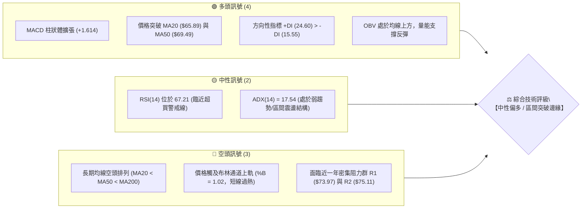
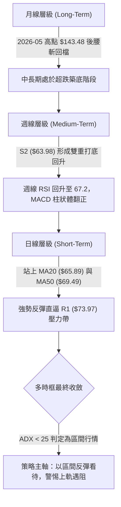
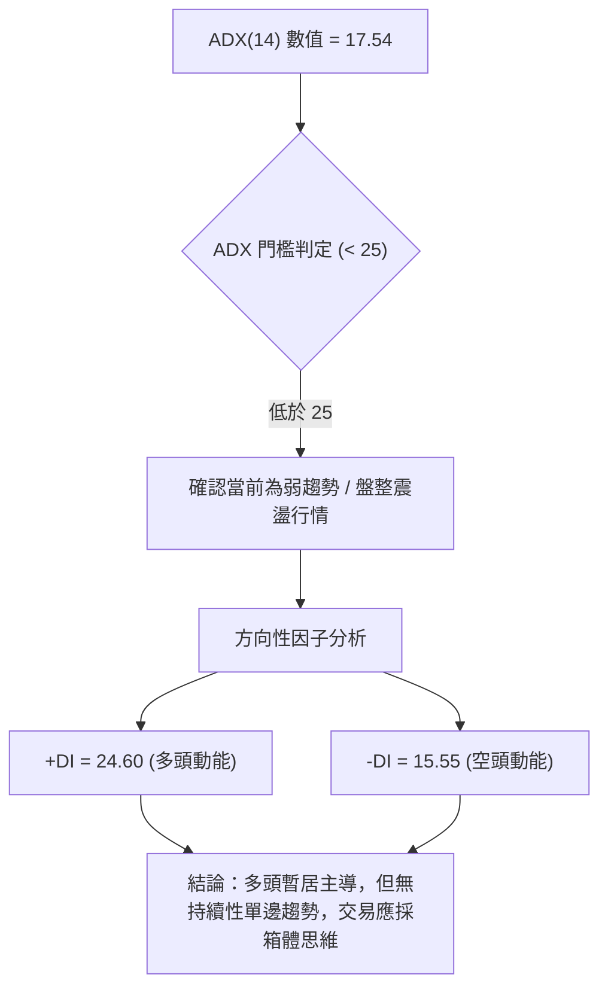
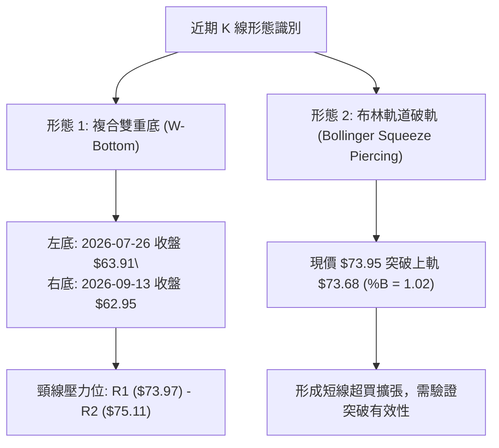
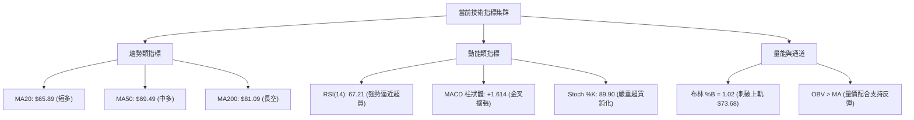
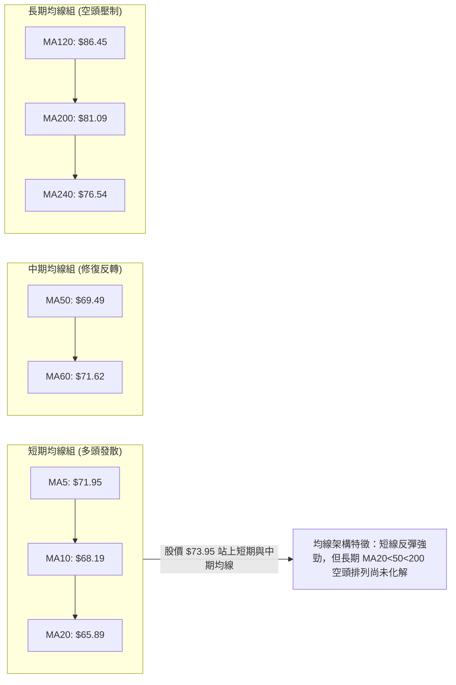
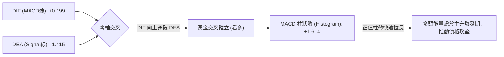
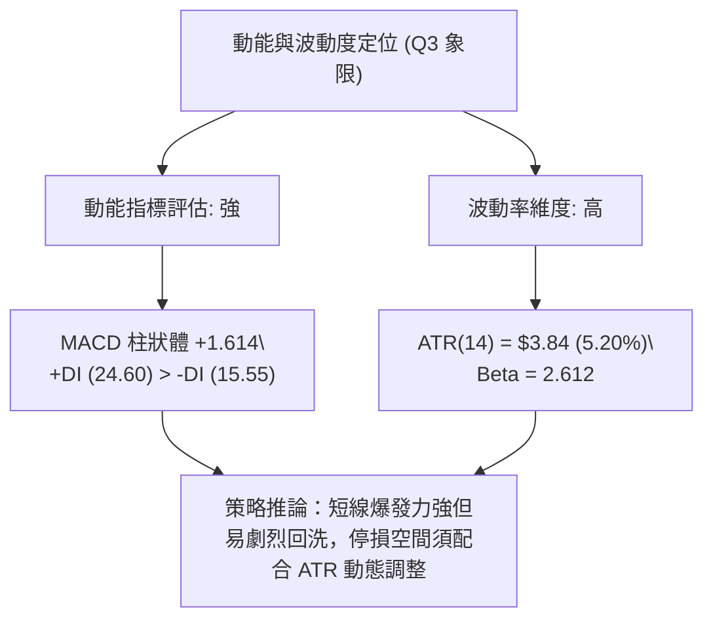
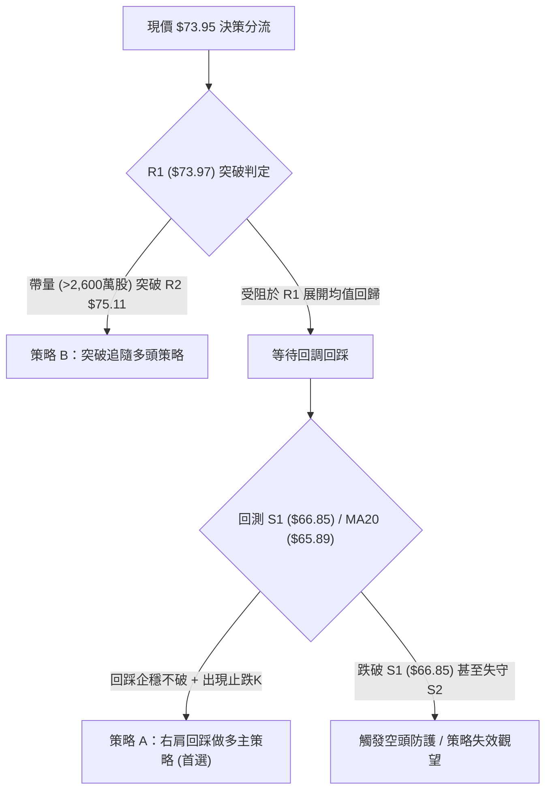
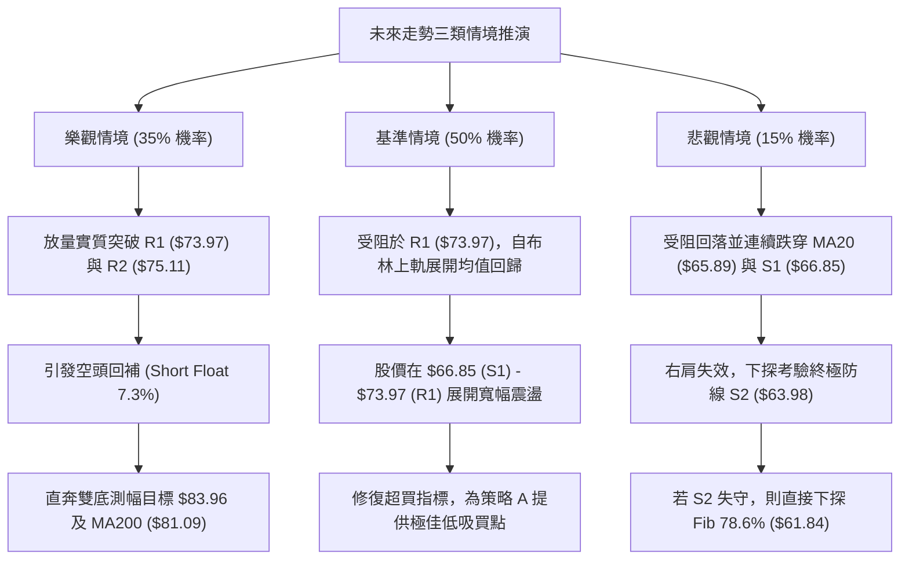

# RKLB 技術分析報告

> **報告日期**：2026-09-26 ｜ **語言**：繁體中文 ｜ **數據來源**：Yahoo Finance ｜ **當前價格**：$73.95

---

## 目錄

| 章節 | 內容 |
|------|------|
| [1. 技術面概覽](#1-技術面概覽) | 訊號儀表板、核心指標、評分卡 |
| [2. 趨勢分析](#2-趨勢分析) | 多時框趨勢、長中短期走勢、ADX趨勢強度 |
| [3. 圖表形態分析](#3-圖表形態分析) | 雙重底形態識別、K線組合、形態目標價測算 |
| [4. 支撐與阻力](#4-支撐與阻力) | 關鍵價位結構、波段高低點聚類、斐波那契回調 |
| [5. 技術指標深度解讀](#5-技術指標深度解讀) | 均線系統、RSI、MACD、布林通道破軌、OBV量價 |
| [6. 動能與波動率](#6-動能與波動率) | 動能四象限、ATR波動度止損、Beta敏感度 |
| [7. 多時框架總結](#7-多時框架總結) | 時框矩陣、收斂規則應用、方向性定調 |
| [8. 交易策略建議](#8-交易策略建議) | 策略路由、價格情境階梯、進出場規劃與風報比 |
| [9. 風險提示與監控](#9-風險提示與監控) | 關鍵監控清單、情境推演、風控紀律 |
| [📋 報告總結](#-報告總結) | 技術面核心結論與策略配置總結 |

---

## 1. 技術面概覽

### 🎯 技術訊號儀表板



### 📊 核心指標速覽表

| 指標類別 | 指標名稱 | 當前數值 | 訊號 | 解讀 |
| :--- | :--- | :--- | :---: | :--- |
| **價格** | 當前收盤價 | $73.95 | 🟢 | 連續兩週顯著反彈，自底部 $62.95 回升 +17.47% |
| **均線** | 短期 MA20 | $65.89 | 🟢 | 價格在均線上方 +12.23%，短線多頭掌控主動權 |
| **均線** | 中期 MA50 | $69.49 | 🟢 | 價格成功收復中期生命線，斜率即將扣抵走平 |
| **均線** | 長期 MA200 | $81.09 | 🔴 | 價格位於 MA200 下方 -8.80%，中長期空頭架構尚未完全逆轉 |
| **動能** | RSI(14) | 67.21 | 🟡 | 進入多頭強勢區，但接近 70 超買警戒，須防短線技術回踩 |
| **動能** | MACD (12,26,9) | DIF: 0.199 / MACD: -1.415 | 🟢 | 零軸下方黃金交叉後擴張，柱狀體 +1.614，動能強勁釋放 |
| **波動** | ATR(14) | $3.84 (5.20%) | 🟡 | 單日波動達 5.20%，代表波段操作需預留較大風控緩衝 |
| **通道** | 布林帶 %B | 1.02 (上軌 $73.68) | 🔴 | 現價刺穿布林上軌，短線存在均值回歸與降溫壓力 |
| **趨勢** | ADX(14) | 17.54 | 🟡 | ADX < 25，確認市場處於大區間底部震盪而非單邊單向暴走 |

### 🏆 技術評分卡

```
╔══════════════════════════════════════════════════════════════════╗
║               技術評分卡 — RKLB (2026-09-26)                     ║
╠══════════════════════════════════════════════════════════════════╣
║ 趨勢強度 (ADX=17.54, 均線分歧)   ████████░░░░░░░░░░░░  42/100  🔴║
║ 動能指標 (MACD柱強, RSI偏高)     ██████████████░░░░░░  72/100  🟢║
║ 支撐穩定度 ($63.98雙底築底扎實)  ███████████████░░░░░  75/100  🟢║
║ 成交量配合 (OBV翻多, 週量擴增)   ████████████░░░░░░░░  62/100  🟡║
║ 形態完整度 (日線雙底右肩向上)    █████████████░░░░░░░  68/100  🟢║
║ 均線架構 (MA20<50<200 仍為空排)  █████████░░░░░░░░░░░  45/100  🔴║
╠══════════════════════════════════════════════════════════════════╣
║ 綜合技術評分                     ███████████░░░░░░░░░  58/100  🟡║
║ 評級結論                         中性偏多 (震盪反彈測試關鍵壓力) ║
╚══════════════════════════════════════════════════════════════════╝
```

---

## 2. 趨勢分析

### 🌐 多時框趨勢分析



### 📈 長期趨勢 — 12個月走勢圖（Unicode）

```
RKLB 月線走勢圖（過去12個月：2025-10 至 2026-09）
價格軸 ($)
$143.48 ┤                                       ●(歷史波段峰值 2026-05)
$120.00 ┤                                      ╱ ╲
$100.00 ┤                                     ╱   ●(2026-06: $101.65)
 $80.00 ┤              ●(2026-01: $80.07)    ●     ╲
 $70.00 ┤        ●     │ ╲                  ╱       ╲                  ●←現價 $73.95
 $60.00 ┤  ●     │     │  ●(2026-03: $64.22)        ●(07: $64.95)───●(08: $63.92)
 $40.00 ┤  │  ●  │                                    (築底雙底支撐區)
        └───────────────────────────────────────────────────────────────────
          10   11   12   01   02   03   04   05   06   07   08   09 (月份)
         2025 ─── ─── ─── 2026 ─── ─── ─── ─── ─── ─── ─── ─── ───
```

#### 走勢特徵分析表格

| 階段區間 | 時間跨度 | 收盤價變化 | 漲跌幅 | 核心走勢特徵解讀 |
| :--- | :--- | :--- | :---: | :--- |
| **主升浪推進** | 2025-10 至 2026-01 | $62.98 → $80.07 | +27.13% | 資金大幅進駐，航太題材催化，均線多頭排列發散 |
| **高位箱體洗盤** | 2026-02 至 2026-04 | $69.10 → $82.51 | +19.41% | $64-$82 寬幅震盪，沉澱籌碼並完成爆發前蓄勢 |
| **狂熱拋物線飆升** | 2026-04 至 2026-05 | $82.51 → $143.48 | +73.89% | 單月大漲逾 73%，創下 $151.00 年內高點，指標嚴重超買 |
| **斷崖式獲利回吐** | 2026-06 至 2026-07 | $143.48 → $64.95 | -54.73% | 估值修復引發踩踏，跌破多條短期均線，週量持續失血 |
| **雙底反覆築底** | 2026-08 至 2026-09 | $63.92 → $73.95 | +15.69% | 在波段低點 $63.98 附近確認 S2 支撐，形成右肩反彈雛形 |

### 📊 中期趨勢（週線分析）

中期走勢顯示，自 2026-07-26 當週打出第一隻腳（收盤 $63.91，RSI 跌至 15.6 極端超賣）後，股價經歷了長達兩個月的橫盤消化。近期在 2026-09-13 當週以收盤價 $62.95 成功確認第二隻腳（形成極度對稱的雙底形態），隨後兩週成交量自 8,520 萬股連續放大至 11,145 萬股，週線 MACD 柱狀體由 -0.133 翻正至 +1.614，週線 RSI 攀升至 67.2。這確認了中期反彈動能正在確立，但隨即撞上近一年來下行的密集套牢成交量密集區。

### ⚡ 趨勢強度評估（ADX 解讀）



#### ADX 趨勢強度量化對照表

| ADX 區間 | 趨勢性質 | 本標的狀態 | 交易策略指導意義 |
| :---: | :---: | :---: | :--- |
| **0 – 20** | **極弱 / 無趨勢 (盤整)** | **17.54 (當前)** | **禁止追高突破單；適用布林通道上下軌、關鍵支撐阻力高拋低吸** |
| **20 – 25** | 趨勢正在醞釀 | — | 密切觀察突破方向，準備切換趨勢跟蹤系統 |
| **25 – 40** | 強趨勢形成 | — | 均線系統順勢加碼，拉回即為買點 |
| **40 – 60** | 極強趨勢 (加速段) | — | 警惕獲利回吐，移動停利保護利潤 |

---

## 3. 圖表形態分析

### 🔍 形態識別系統



#### 形態識別信心度與目標價測算表

| 形態名稱 | 信心度 | 判斷依據（引用數據） | 形態完成度 | 目標價（附嚴謹計算式） |
| :--- | :---: | :--- | :---: | :--- |
| **波段雙重底 (W-Bottom)** | **75%** | 兩次下探支撐點聚類於 S2 ($63.98) 且均獲量能支撐（7/26週 $63.91、9/13週 $62.95） | 85% | 頸線取 R1 ($73.97)，底部位於 S2 ($63.98)<br>形態高度 $H = 73.97 - 63.98 = \$9.99$<br>測算目標價 $= 73.97 + 9.99 = \mathbf{\$83.96}$ |
| **布林通道破軌擴張** | **60%** | 收盤價 $73.95 超越上軌 $73.68，%B 為 1.02，但 ADX 僅 17.54 | 90% | 需防假突破，短期回抽目標為中軌 MA20 ($\mathbf{\$65.89}$) |
| **頭肩底形態** | 35% | 數據中左肩結構紊亂，訊號不足 | 20% | *訊號不足，依規則 15 不予強制畫出目標價* |

### 🕯️ 重要K線形態分析

| 週/月份週期 | 收盤價 | K線形態名稱 | 技術解讀 | 訊號方向 |
| :--- | :---: | :--- | :--- | :---: |
| **2026-09-13 當週** | $62.95 | 長下影錘頭線 (Hammer) | 探底至波段低點聚類 S2 附近引發強勁買盤，確認雙底右腳 | 🟢 看多反轉 |
| **2026-09-20 當週** | $64.57 | 出水芙蓉中陽線 | 週量擴增至 106,896,200 股，成功站穩 MA10 ($68.19) 下方蓄勢 | 🟢 買盤增強 |
| **2026-09-27 當週** | $73.95 | 大陽線實體破頂 (Marubozu) | 強勢貫穿 MA50 ($69.49) 與布林上軌，直逼波段高點阻力 R1 | 🟢 強勢推升 |

### 📉 ASCII 走勢形態示意圖

```
RKLB 雙重底 (W-Bottom) 結構演變與目標推算圖
價格 ($)
$83.96 ┤- - - - - - - - - - - - - - - - - - - - - - - - - - - - - - - -[形態理論測幅目標 $83.96]
       │                                                         ↑
       │                                                         │ 形態等幅高度: $9.99
$75.11 ┼ - - - - - - - - - - - - - - - - - - - - - - - - - - - - ┴ R2 阻力
$73.97 ┼──────[頸線阻力 R1]──────────────────────●(現價 $73.95 正在測試)
       │                              ╱╲        ╱
       │      (08-09 反彈頂點 $82.83)╱  ╲      ╱
       │                            ╱    ╲    ╱
       │                           ╱      ╲  ╱
$65.89 ┼- - - - - - - - - - - - - ╱- - - - ╲╱ - - - - - - - - - - - - - MA20 支撐帶
       │                         ╱          │
$63.98 ┼────────●─────────────────────●──────[雙底支撐帶 S2]
       │       左底 (07-26: $63.91)     右底 (09-13: $62.95)
       └─────────────────────────────────────────────────────────────────→ 時間
```

### 🎯 形態目標價計算

根據經典幾何形態學與數據紀律：
1. **雙底底部基座**：嚴格鎖定於波段低點聚類 **S2 = $63.98**（與 7/26 的 $63.91 及 9/13 的 $62.95 緊密吻合）。
2. **有效頸線界定**：以近一年波段高點聚類第一道壓制位 **R1 = $73.97** 作為頸線。
3. **垂直形態高度 ($H$)**：
   $$H = \text{Neckline} - \text{Base} = \$73.97 - \$63.98 = \$9.99$$
4. **理論突破目標價 ($T_1$)**：
   $$T_1 = \text{Neckline} + H = \$73.97 + \$9.99 = \mathbf{\$83.96}$$
   *驗證：該目標價恰好位於長期 MA200 ($81.09) 與斐波那契 61.8% 回調位 ($80.90) 的上方真空帶，具備極高的幾何與斐波那契共振參考價值。*

---

## 4. 支撐與阻力

### 🗺️ 關鍵價位分布圖（Unicode）

```
RKLB 價位結構分布圖（嚴格依據 OHLCV 聚類計算）
═════════════════════════════════════════════════════════════════
$81.09  ║▓▓▓▓▓▓▓▓▓▓▓▓▓▓▓▓▓▓▓▓▓▓▓▓▓▓▓▓▓▓║ 長期牛熊分水嶺 (MA200)
$80.90  ║▓▓▓▓▓▓▓▓▓▓▓▓▓▓▓▓▓▓▓▓▓▓▓▓▓▓▓▓▓▓║ 斐波那契 61.8% 黃金回調位
$78.90  ║██████████████████████████████║ 強阻力 R3 (近一年波段高點聚類)
$75.11  ║████████████████████          ║ 關鍵阻力 R2 (反彈次高點)
$73.97  ║██████████████████████████████║ 核心頸線阻力 R1 (+0.03%)
$73.95  ╠══════════════════════════════╣ ◄ 當前收盤價 ($73.95)
$73.68  ║▒▒▒▒▒▒▒▒▒▒▒▒▒▒▒▒▒▒▒▒▒▒▒▒▒▒▒▒▒▒║ 布林通道上軌
$69.49  ║▓▓▓▓▓▓▓▓▓▓▓▓                  ║ 中期均線 MA50 支撐
$66.85  ║████████████████████████      ║ 近期第一波段支撐 S1 (-9.60%)
$65.89  ║▒▒▒▒▒▒▒▒▒▒▒▒▒▒▒▒▒▒▒▒▒▒▒▒▒▒▒▒▒▒║ 布林通道中軌 (MA20)
$63.98  ║██████████████████████████████║ 核心波段強支撐 S2 (雙底低點聚類)
$61.84  ║▓▓▓▓▓▓▓▓▓▓▓▓▓▓▓▓▓▓▓▓▓▓▓▓▓▓▓▓▓▓║ 斐波那契 78.6% 回調位
$61.45  ║██████████████████████████████║ 極限防守支撐 S3 (-16.90%)
═════════════════════════════════════════════════════════════════
```

### 🚧 阻力位分析表

| 阻力級別 | 精確價位 | 距現價幅標 | 形成原因與籌碼屬性 | 突破難度 | 重要性 |
| :---: | :---: | :---: | :--- | :---: | :---: |
| **R1** | **$73.97** | +0.03% | 近一年波段高點聚類，雙底頸線位置，與現價僅一步之遙 | 🟡 中等 | ★★★★☆ |
| **R2** | **$75.11** | +1.57% | 歷史密集換手帶下沿，短線多頭延伸的第一個阻滯點 | 🟡 中等 | ★★★☆☆ |
| **R3** | **$78.90** | +6.69% | 波段高點聚類密集處，上方即為 $80.90-$81.09 重壓區 | 🔴 極高 | ★★★★★ |

### 🛡️ 支撐位分析表

| 支撐級別 | 精確價位 | 距現價幅標 | 形成原因與籌碼屬性 | 守住機率 | 重要性 |
| :---: | :---: | :---: | :--- | :---: | :---: |
| **S1** | **$66.85** | -9.60% | 近一年波段次回踩低點聚類，與 MA20 ($65.89) 構成支撐防護網 | 75% | ★★★★☆ |
| **S2** | **$63.98** | -13.48% | 近期雙底的扎實底部基座，8/30至9/13三次探底未破之多頭大本營 | 85% | ★★★★★ |
| **S3** | **$61.45** | -16.90% | 歷史深幅回撤低點聚類，與 Fib 78.6% ($61.84) 共振，為終極防線 | 95% | ★★★★★ |

### 📐 斐波那契回調位分析

*基準區間：52週波段低點 $37.57 → 52週波段歷史高點 $151.00，總垂直空間 $113.43。*

| 回調比率 | 精確價位 | 相對現價位置 | 技術意義與多空心理防線解讀 |
| :---: | :---: | :---: | :--- |
| **0.0% (52W High)** | $151.00 | +104.19% | 2026年歷史狂熱峰值，長期遠景目標 |
| **23.6%** | $124.23 | +67.99% | 極強勢行情防守線，目前遠高於現價 |
| **38.2%** | $107.67 | +45.60% | 雄重套牢壓力平台，分析師目標均價 $109.37 錨定於此 |
| **50.0%** | $94.28 | +27.49% | 多空中長期平衡分水嶺 |
| **61.8%** | **$80.90** | +9.40% | **黃金分割重壓位：與 MA200 ($81.09) 構成雙重天花板，為本輪反彈核心阻力** |
| **現價區間** | **$73.95** | **基準** | **目前處於 61.8% ($80.90) 與 78.6% ($61.84) 之間的寬幅箱體內運行** |
| **78.6%** | **$61.84** | -16.38% | **極深回調支撐位：與 S3 ($61.45) 及雙底基座 ($63.98) 形成強大防守屏障** |
| **100.0% (52W Low)**| $37.57 | -49.20% | 52週絕對底部 |

---

## 5. 技術指標深度解讀

### 🎛️ 指標訊號總覽



### 📈 移動平均線排列分析



#### 均線系統數據監控表

| 均線名稱 | 數值 | 價格相對位置 | 幅度差距 | 均線走勢軌跡（動態變化特徵） |
| :--- | :---: | :---: | :---: | :--- |
| **MA 5** | $71.95 | 上方 🟢 | +2.78% | `████▇▇▅▄▃▃▂▂▁▁▁▁▁▁▁▁▁▁▁▁▁▂▃▃▄▅` 拐頭向上，短期動能充沛 |
| **MA 10** | $68.19 | 上方 🟢 | +8.44% | `██████▇▇▆▅▅▄▃▂▂▁▁▁▁▁▁▁▁▁▁▁▁▂▂▃` 出現黃金交叉，底部抬升 |
| **MA 20** | $65.89 | 上方 🟢 | +12.23% | `▆▇▇▇█████████▇▇▆▅▅▄▃▃▂▁▁▁▁▁▁▁▁` 脫離下行，提供短線回踩支撐 |
| **MA 50** | $69.49 | 上方 🟢 | +6.42% | 股價突破成功，中期扣抵值即將降低 |
| **MA 60** | $71.62 | 上方 🟢 | +3.25% | `████▇▇▆▆▅▅▅▄▄▄▄▃▃▃▂▂▂▂▁▁▁▁▁▁▁▁` 成功收復 |
| **MA 120** | $86.45 | 下方 🔴 | -14.46% | `▆▇███████▇▇▇▆▅▅▄▃▃▂▂▁▁▁▁▁▂▃▃▃▄` 持續向下傾斜，構成上方長期鐵蓋 |
| **MA 200** | $81.09 | 下方 🔴 | -8.80% | 牛熊分界線，為本輪波段行情終極壓力位 |
| **MA 240** | $76.54 | 下方 🔴 | -3.39% | `▁▁▂▂▃▃▃▄▄▄▄▅▅▅▅▆▆▆▆▇▇▇▇███████` 下行減速，橫盤提供隱性阻力 |

### 📉 RSI(14) 分析

* 當前 RSI(14) 數值：**67.21**
* 狀態進度條：`[████████████████████████████████░░░░░░░░] 67.21%`
* **區間評估**：處於 50–70 強勢多頭控制區，但已相當逼近 70 超買警戒線。
* **背離研判**：
  * *頂背離檢測*：**無頂背離**。前波高點（2026-08-09 週收盤 $82.83，RSI 為 68.6），當前反彈價格尚未創出新高，RSI 亦步步緊隨上升，兩者走勢契合。
  * *底背離檢測*：**存在顯著的中期雙底隱形確認**。7/26 低點 $63.91 時週線 RSI 跌至 15.6；9/13 次低點 $62.95 時週線 RSI 則為 27.1（價格破微幅新低但 RSI 大幅抬高 11.5 個點），構建出標準的**動能底背離（Bullish Divergence）**，直接促成了本輪強勁反彈。

### 📊 MACD(12,26,9) 訊號解讀



* **數值狀態**：DIF 已經翻上零軸上方（0.199），擺脫了自 6 月以來的空頭泥淖；Signal 雖然尚在負值區（-1.415），但金叉缺口持續擴大，帶動 Histogram 達到 +1.614 的相對高位。
* **指標交互確認**：MACD 的急速擴張印證了日線層級動能強勁，但由於 DIF 與 DEA 乖離擴大，隨後柱狀體若出現縮頭，通常對應價格對 R1/R2 阻力的回踩。

### 📦 布林通道分析

```
RKLB 布林通道 (20, 2) 空間位置示意圖
價格 ($)
$75.00 ┤                                      
$73.95 ┼──────────────────────────────────────● [現價 $73.95，刺破上軌]
$73.68 ┼ - - - - - - - - - - - - - - - - - - - [布林通道上軌] ──┐
       │                                                        │ 軌道帶寬
$65.89 ┼────────────────────────────────────── [布林中軌 MA20] ──┼ $15.58
       │                                                        │ (23.6%)
$58.10 ┼ - - - - - - - - - - - - - - - - - - - [布林通道下軌] ──┘
       └────────────────────────────────────────────────────────
```

* **當前數值**：
  * 上軌 (Upper Band)：**$73.68**
  * 中軌 (Middle Band / MA20)：**$65.89**
  * 下軌 (Lower Band)：**$58.10**
  * 布林極限指標 %B：**1.02**
* **解讀與破軌警訊**：
  * %B = 1.02 表明收盤價已經完全溢出布林通道上軌之外（> 1.0）。在 ADX 僅為 17.54 的弱趨勢市況中，布林通道通常充當堅實的動態支撐與阻力邊界。
  * 歷史統計顯示，在無持續單邊極強趨勢支撐下，股價外溢上軌往往難以維繫超過 2-3 個交易日，極高機率引發**均值回歸（Mean Reversion）**，促使價格回測中軌 $65.89 或在 R1 下方展開整固。

### 💹 成交量分析（量價配合度）

1. **量能水準對比**：
   * 最新單日成交量：**18,802,600 股**
   * 20日均量：**20,117,635 股**（量比為 0.93x）
   * 50日均量：**18,851,668 股**（量比為 1.00x）
   * 最新週成交量：**111,453,700 股**（較前一週的 106,896,200 股持續微幅放大）。
2. **量價關係評估**：
   * 週線呈現典型的「量增價揚」良性走勢，兩週前 $62.95 築底時週量僅 8,520 萬股，當前突破推升至 1.11 億股，確認低位有特定買盤與空頭回補。
   * 然而，單日量比僅 0.93x，在衝擊 R1 ($73.97) 重壓時並未展現出爆發性攻擊量（如需實質站穩 R1/R2，單日量能通常需放大至 20日均量的 1.3x 即約 2,600 萬股以上）。
3. **能量潮指標 (OBV)**：
   * 數據顯示：`OBV > MA → 量能支撐上漲`。OBV 曲線平穩穿越其均線，代表在 $63-$65 區間累積的籌碼結構尚未出現大規模派發，量能對反彈形成正面支撐，暫無嚴重的量價背離現象。

---

## 6. 動能與波動率

### ⚡ 動能評估四象限

| 象限分佈 | 動能維度 (Momentum) | 波動率維度 (Volatility) | 當前狀態判定 | 核心交易策略指導 |
| :---: | :---: | :---: | :---: | :--- |
| **Q1 (主升機會)** | 強 (MACD金叉/多頭) | 低 (通道收縮/低ATR) | — | 最佳波段加碼與單邊持有區間 |
| **Q2 (震盪沉澱)** | 弱 (動能不足) | 低 (波動降低) | — | 適合低吸埋伏，等待方向選擇 |
| **Q3 (高危拉鋸)** | **強 (RSI=67/MACD正)** | **高 (Beta=2.61/ATR=5.2%)** | **✓ [當前 RKLB 座標]** | **高波動反彈段：嚴格執行移動停利，不追高，嚴控槓桿** |
| **Q4 (恐慌出逃)** | 弱 (指標破位) | 高 (恐慌殺跌) | — | 堅決離場觀望，嚴防流動性踩踏 |



### 📊 ATR 波動率分析

* **當前 ATR(14)**：**$3.84**（佔當前價格 $73.95 之比例為 **5.20%**）。
* **波動度意涵**：
  * RKLB 單日正常波動範圍接近 $4.00，屬於典型的高彈性、高貝塔成長型航太標的。
  * **動態停損距離計算**：
    * *激進型交易者 (1.0 × ATR)*：保護空間需留出 $\$3.84$。
    * *波段型交易者 (1.5 × ATR)*：保護空間需留出 $\$3.84 \times 1.5 = \$5.76$。
    * *保守型交易者 (2.0 × ATR)*：保護空間需留出 $\$3.84 \times 2.0 = \$7.68$。
  * 當前若以現價追高進場，設置 1.5×ATR 的合理停損將落於 $\$73.95 - \$5.76 = \$68.19$（恰為 MA10 所在位置），回撤幅度近 8%，故需精確計算進場成本。

### 📐 Beta 與市場相關性

* **Beta 係數**：**2.612**
* **解讀與風險權重**：
  * 該股對標普500指數的敏感度達 2.61 倍。當大盤波動 1% 時，RKLB 理論上將產生 2.61% 的同向波動。
  * 空頭淨額比例 (Short % Float) 為 **7.3%**，空頭回補天數 (Short Ratio) 為 **2.61 天**。當股價強勢衝過 R1 ($73.97) 時，極易引發高 Beta 屬性帶動的軋空連鎖反應；反之，若大盤走弱，高 Beta 亦會加劇回調下殺力道。

---

## 7. 多時框架總結

### 📋 時框架評分表

| 時框架 | 趨勢方向 | 動能狀態 | 均線排列特徵 | 形態完成度 | 綜合評分 | 操作定位建議 |
| :---: | :---: | :---: | :---: | :---: | :---: | :--- |
| **短期 (日線)** | 🟢 多頭主導 | 🟢 強勁 (MACD擴張) | MA5>10>20 多頭抬升 | 破軌溢出上軌 (%B=1.02) | **72 / 100** | 逢高減碼過熱部位，防範均值回歸 |
| **中期 (週線)** | 🟡 震盪反彈 | 🟢 轉強 (週柱翻正) | 突破 MA50，MA20走平 | 雙重底形態構築完成 85% | **65 / 100** | 回踩頸線或支撐尋求低吸機會 |
| **長期 (月線)** | 🔴 空頭壓制 | 🟡 中性修復中 | MA20 < MA50 < MA200 空排 | 歷史高點 $143.48 後深幅消化 | **38 / 100** | 尚未扭轉中長期熊市結構，暫以反彈對待 |

### 🔲 綜合訊號矩陣

```
┌─────────────────┬─────────────────┬─────────────────┐
│     短期維度     │     中期維度     │     長期維度     │
├─────────────────┼─────────────────┼─────────────────┤
│ 價格 vs MA: 🟢   │ 價格 vs MA: 🟢   │ 價格 vs MA: 🔴   │
│ RSI 狀態:   🟡   │ RSI 狀態:   🟢   │ RSI 狀態:   🟡   │
│ MACD 動能:  🟢   │ MACD 動能:  🟢   │ MACD 動能:  🔴   │
│ 突破動能:   🔴   │ 形態支撐:   🟢   │ 均線架構:   🔴   │
├─────────────────┼─────────────────┼─────────────────┤
│ 短線多頭推升過急 │ 中期底部信號確立 │ 長期仍處空頭修復 │
└─────────────────┴─────────────────┴─────────────────┘
```

### ⚖️ 多時框收斂結論

依據多時框收斂規則（規則 14）：
1. **趨勢強度定調**：當前系統 **ADX(14) = 17.54 (< 25)**，明確宣告目前行情本質為**盤整/震盪修復行情**，而非單邊強趨勢爆發行情。
2. **主導時框與交易邊界**：盤整行情以**日線布林通道與波段高低點聚類**為核心交易框架。目前日線價格 ($73.95) 已運行至布林通道上軌外側 ($73.68)，且正面撞擊近一年高點聚類重壓 **R1 ($73.97)**。
3. **時框優先級權衡**：雖然短期日線動能極強（MACD 柱狀體 +1.614），但受到長期空頭排列（MA200 位於 $81.09）與盤整市況壓制，日線的超買無法直接演變為單邊牛市。日線訊號僅能用於尋找精細進出場點位。
4. **唯一方向性結論**：
   $$\mathbf{中性偏多（波段反彈觸及阻力，進入震盪消化期，嚴禁追高）}$$
   *交易定調：以波段雙底的反彈架構為主軸，但在現價（$73.95）緊貼阻力 R1（$73.97）與通道上軌時，必須等待「回踩 S1 / MA20 支撐」或「放量實質突破 R2 ($75.11)」方可介入。*

---

## 8. 交易策略建議

### 🗺️ 策略決策流程圖



### 🧭 策略路由

> **當前主策略方向 = 【中性偏多，首選回踩支撐佈局 (依技術評分 58/100 定調)】**
> 綜合評分 58 分處於 40–60 的震盪中性偏強區間。由於現價已達布林上軌且緊貼 R1，當前盈虧比不支撐在現價 $73.95 直接市價追多，因此**主推「回踩支撐低吸策略」為策略 A，以「放量突破追價策略」為策略 B**；若跌破多頭防守點，則直接啟動反向風險控管。

### 🎯 價格情境階梯（Price Scenarios）

*本階梯所有價位完全引用第 4 章由 OHLCV 聚類計算之標準關鍵數值：*

| 觸發條件 | 下一目標價 | 後續延伸目標 | 情境技術含義解讀 |
| :--- | :---: | :---: | :--- |
| **放量突破 R1 ($73.97)** | **R2 ($75.11)** | **R3 ($78.90)** | 短線頸線突破確認，雙底形態進入實質爆發期 |
| **突破 R3 ($78.90)** | **Fib 61.8% ($80.90)**| **MA200 ($81.09)**| 挑戰長期牛熊生命線，極強多頭延伸行情 |
| **現價區間震盪承壓** | **布林上軌 ($73.68)**| **MA50 ($69.49)** | 均值回歸消化超買指標，回測中期生命線 |
| **跌破 S1 ($66.85)** | **S2 ($63.98)** | **S3 ($61.45)** | 中期雙底反彈夭折，重回底部箱體泥潭 |
| **跌破 S3 ($61.45)** | **Fib 78.6% ($61.84)**| **52W Low ($37.57)** | 長期結構破位，空頭主導深淵探底 |

### 📊 情境機率分佈

| 預測情境 | 發生機率 | 主要判定依據（引用核心技術指標） |
| :--- | :---: | :--- |
| **情境一：衝高回踩後蓄勢上攻** | **55%** | MACD 柱狀體維持 +1.614 強度，OBV 支撐上升，雙底右肩量能顯著回暖 |
| **情境二：受阻於 R1-R2 區間震盪** | **30%** | ADX = 17.54 缺乏單邊動能，布林 %B = 1.02 超買，RSI 高達 67.21 面臨技術修正 |
| **情境三：直接反轉破位重挫** | **15%** | MA200 仍呈空頭排列，若大盤系統性風險引發高 Beta (2.612) 殺跌跌破 S1 |

### 🟢 主策略詳情

*註：以下兩套策略之進場點、止損點及目標價，均嚴格取自第 4 章計算之波段支撐阻力與形態測算值。*

| 策略要素 | 策略 A (主推：回踩支撐佈局多頭) | 策略 B (次選：放量突破跟隨多頭) |
| :--- | :--- | :--- |
| **交易邏輯** | 利用現價外溢布林上軌之回踩，在核心均線及 S1 支撐低吸 | 確認多頭實質擊潰 R1/R2 套牢盤，進行順勢右側突破交易 |
| **進場條件** | 股價回踩 S1-MA20 企穩，日 K 出現長下影或紅 K 止跌 | 單日成交量超過 2,600 萬股，強勢收盤站穩 R2 之上 |
| **精確進場價格** | **$66.85** (波段支撐 S1，近 MA20 $65.89) | **$75.11** (波段阻力 R2 實質突破點) |
| **第一目標價 (T1)** | **$73.97** (核心頸線阻力 R1) | **$78.90** (波段阻力 R3) |
| **第二目標價 (T2)** | **$80.90** (Fib 61.8% / 貼近 MA200 $81.09) | **$83.96** (雙底形態完整測幅目標價) |
| **精確止損價格** | **$63.98** (跌破波段強支撐 S2 雙底基座止損) | **$71.62** (跌破 MA60 及短線防守平台止損) |
| **風險空間 (Risk)** | $\$66.85 - \$63.98 = \$2.87$ | $\$75.11 - \$71.62 = \$3.49$ |
| **報酬空間 (Reward)**| 至 T1: $\$7.12$ ｜ 至 T2: $\$14.05$ | 至 T1: $\$3.79$ ｜ 至 T2: $\$8.85$ |
| **風險報酬比 (R:R)**| **1 : 2.48** (至 T1) ｜ **1 : 4.90** (至 T2) | **1 : 1.09** (至 T1) ｜ **1 : 2.54** (至 T2) |
| **歷史估算勝率** | **65%** | **50%** (需防假突破) |
| **建議配置倉位** | **總資金之 12% – 15%** | **總資金之 8% – 10%** |

### 🔴 反向風險觸發點（對沖提示）

當市場出現下列極端反轉訊號時，判定多頭反彈邏輯瓦解，應即刻離場或啟動對沖保護：
1. **關鍵價位失守**：日線收盤價跌破 **S1 ($66.85)**，且帶量擊穿布林中軌 MA20 ($65.89)；或更嚴重的終極破位信號——收盤跌破雙底防線 **S2 ($63.98)**。
2. **動能衰竭信號**：日線 MACD 柱狀體出現連續 3 日萎縮，且 RSI(14) 快速跌破 50 中軸進入弱勢區。
3. **對沖建議點位**：若持有多頭現貨部位，當股價不幸跌破 **$66.85** 時，建議將現貨部位縮減 50%，或利用衍生工具在 $66.85 處建立等額做空避險，下看第一空頭目標 **S2 ($63.98)**，終極目標 **S3 ($61.45)**。

### ⭐ 整體訊號強度評星

```
做多訊號強度：  ★★★☆☆  (3/5星 — 短線動能充足但面臨強阻，回踩做多勝率高)
做空訊號強度：  ★★☆☆☆  (2/5星 — 下方有雙底牢固支撐，盲目摸頂放空風險大)
整體指標可信度：★★★★☆  (4/5星 — 量價、布林、MACD與斐波那契呈現高度邏輯自洽)
```

---

## 9. 風險提示與監控

### ✅ 關鍵監控指標 Checklist

```
╔══════════════════════════════════════════════════════════════════╗
║               RKLB 交易風控核心監控清單 (Checklist)             ║
╠══════════════════════════════════════════════════════════════════╣
║ [ ] 價格是否成功日線收盤站上頸線阻力 R1 ($73.97)？               ║
║ [ ] 布林通道 %B (當前 1.02) 是否順利降溫回歸至 0.8 以下？         ║
║ [ ] 突破時之日成交量是否有效放大至 26,000,000 股以上？          ║
║ [ ] RSI(14) (當前 67.21) 是否在 70 上方產生嚴重的頂背離現象？   ║
║ [ ] 下方核心防守位 S1 ($66.85) 與 MA20 ($65.89) 是否保持完整？  ║
║ [ ] 大盤波動引發高 Beta (2.612) 劇烈波動時，單日虧損是否超標？  ║
╚══════════════════════════════════════════════════════════════════╝
```

### ⚠️ 風險場景分析



### 🛡️ 風險管理重要提醒

1. **極高波動性警示 (Beta 2.612 & ATR $3.84)**：
   RKLB 的單日 ATR 高達 $3.84（佔股價 5.20%），其價格跳動極為劇烈。在配置此類高彈性標的時，單筆交易虧損額必須嚴格限制在**總投資帳戶資產的 1.0% – 1.5%** 以內。若以 1.5×ATR（$5.76）作為停損防護寬度，單一標的持倉總市值不應超過總投資組合的 15%–20%。
2. **切忌情緒化追高**：
   當前價格 $73.95 已經擊穿布林上軌，%B 達到 1.02，且日線隨機指標 Stoch %K 已達 89.90 嚴重超買區。此時追高容易遭遇「假突破後瞬間回踩」的尷尬處境，極易觸發停損。耐心等待「回踩 S1 / MA20」的策略 A 進場點，方為兼顧高勝率與優質盈虧比的機構級作法。
3. **空頭反撲警戒點**：
   在長期均線呈現 MA20 < MA50 < MA200 空頭排列的背景下，所有反彈本質上都必須接受上方解套賣壓的檢驗。若收盤價跌破 **S2 ($63.98)**，必須無條件認賠停損，嚴禁任何凹單行為。

---

## 📋 報告總結

```
╔══════════════════════════════════════════════════════════════════╗
║                    RKLB 技術分析報告總結                         ║
╠══════════════════════════════════════════════════════════════════╣
║ 報告日期：2026-09-26           當前收盤價：$73.95                ║
║ 分析評級：⚖️ 中性偏多 (58/100) — 底部反彈面臨關鍵阻力密集區       ║
╠══════════════════════════════════════════════════════════════════╣
║ 【關鍵技術結論】                                                 ║
║ ├─ 長期趨勢：🔴 弱勢修復 (價格處於 MA200 $81.09 下方，均線空排)  ║
║ ├─ 中期趨勢：🟢 底部成形 (S2 $63.98 複合雙底確立，週 MACD 翻正)  ║
║ ├─ 短期趨勢：🟡 短線過熱 (衝破布林上軌 $73.68，測試 R1 $73.97)  ║
║ ├─ 趨勢強度：🟡 ADX = 17.54 (弱趨勢/區間震盪，以箱體策略應對)   ║
║ ├─ 核心關鍵支撐：S1: $66.85  ｜  S2: $63.98 (終極底座)           ║
║ ├─ 核心關鍵阻力：R1: $73.97  ｜  R2: $75.11  ｜  R3: $78.90      ║
║ └─ 華爾街共識：買入 (Buy) ｜ 分析師平均目標價：$109.37           ║
╠══════════════════════════════════════════════════════════════════╣
║ 【最優交易執行策略】                                             ║
║ 1. 🥇 最佳機會 (策略 A - 回踩低吸)：                             ║
║    耐心等待價格回測 S1 ($66.85) / MA20 ($65.89) 企穩買入，       ║
║    嚴格止損置於 S2 ($63.98)，目標上看 R1 ($73.97) 及 $80.90，    ║
║    風報比高達 1:2.48 至 1:4.90，為最穩健路徑。                   ║
║                                                                  ║
║ 2. 🥈 次選機會 (策略 B - 右側突破)：                             ║
║    若伴隨日量 >2,600 萬股強行收復 R2 ($75.11)，順勢追進，        ║
║    止損設於 $71.62，目標直指雙底理論測幅價 $83.96。              ║
║                                                                  ║
║ 3. 🥉 防守避險 (風控底線)：                                      ║
║    現價 $73.95 嚴禁大舉追多；若跌破 S2 ($63.98) 雙底徹底瓦解，   ║
║    所有多單堅決離場避險。                                        ║
╚══════════════════════════════════════════════════════════════════╝
```

---

> ⚠️ **免責聲明**：本報告由量化技術分析系統自動生成，文中所有技術指標、形態識別、關鍵價位及交易策略均基於歷史量價數據之統計與圖表幾何推演。本報告**僅供學術研究、投資教育與專業參考**，**絕不構成任何形式的要約、招攬或具體投資買賣建議**。金融市場瞬息萬變，高 Beta 股票具備高波動風險，投資人應獨立評估自身財務承受能力與風險屬性，入市前請諮詢合格之註冊投資顧問，並嚴格自負投資盈虧。

---

*報告生成時間：2026-09-26 ｜ 數據來源：Yahoo Finance ｜ 分析框架：多時框技術分析體系 (MTFA)*