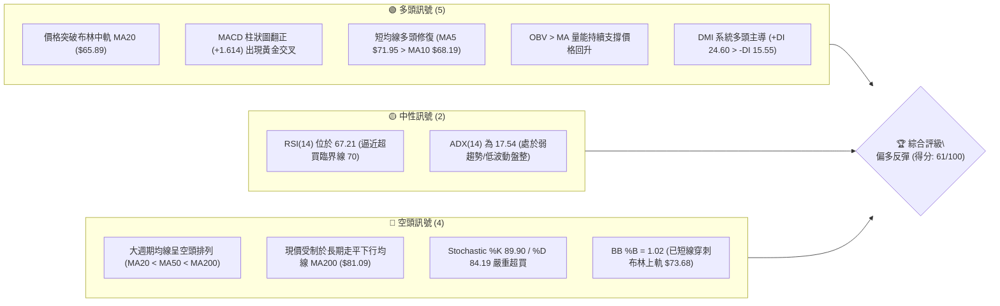
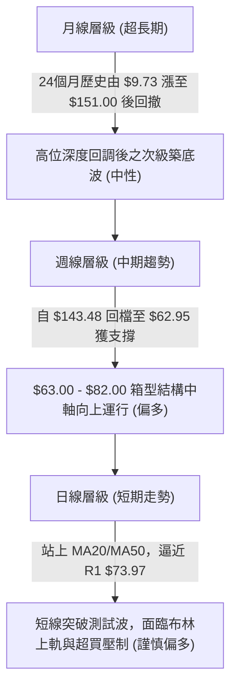
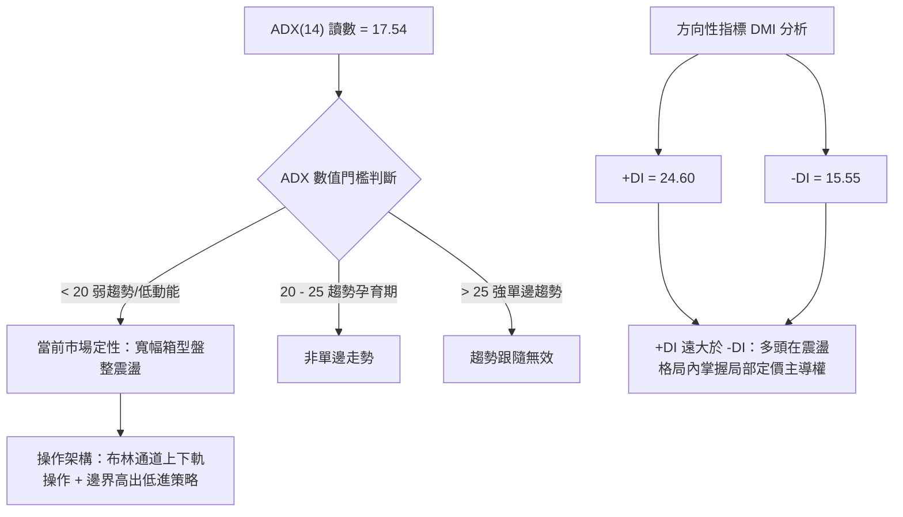
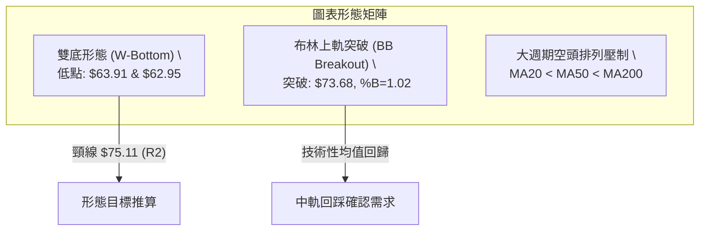
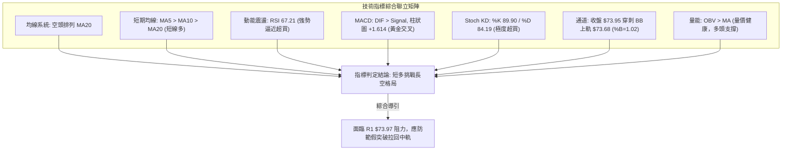
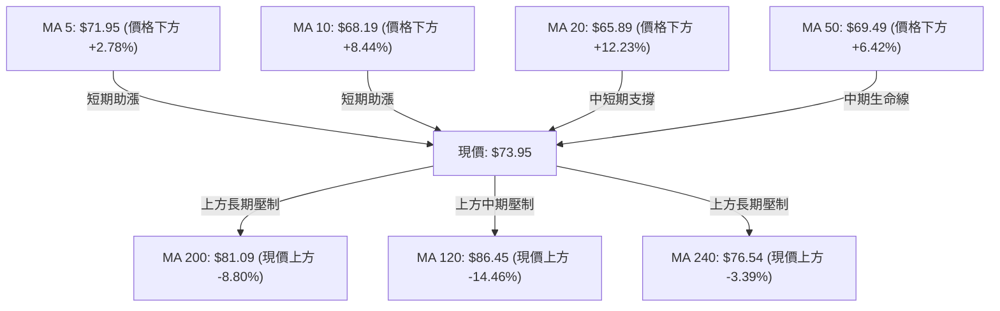
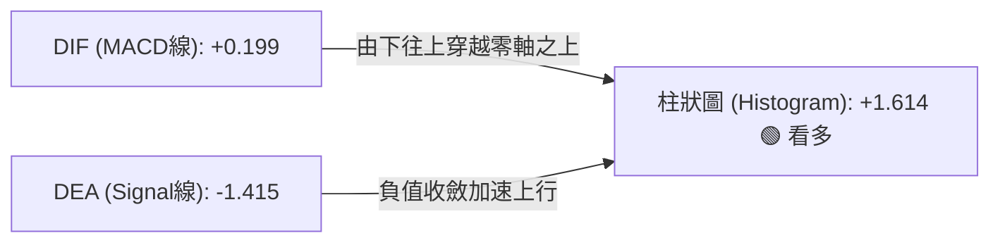
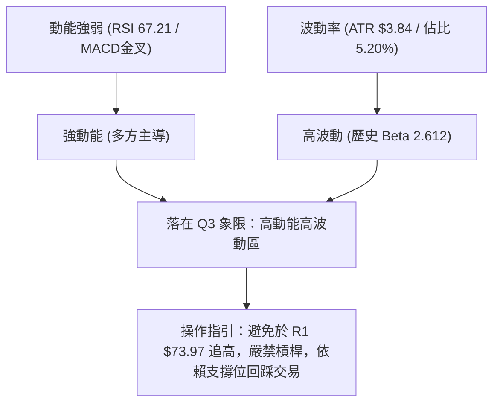
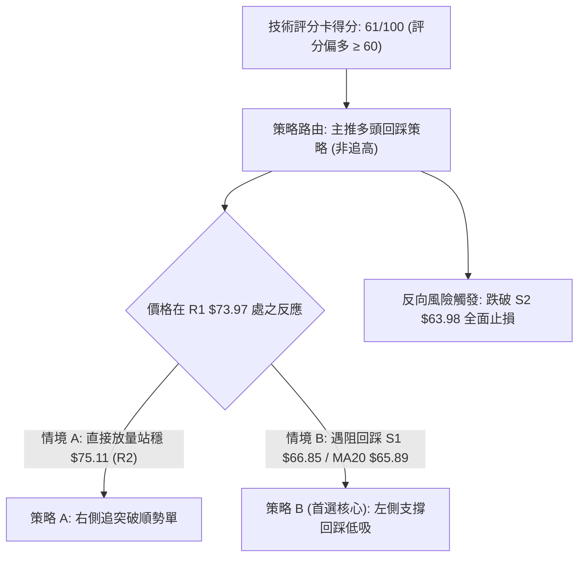
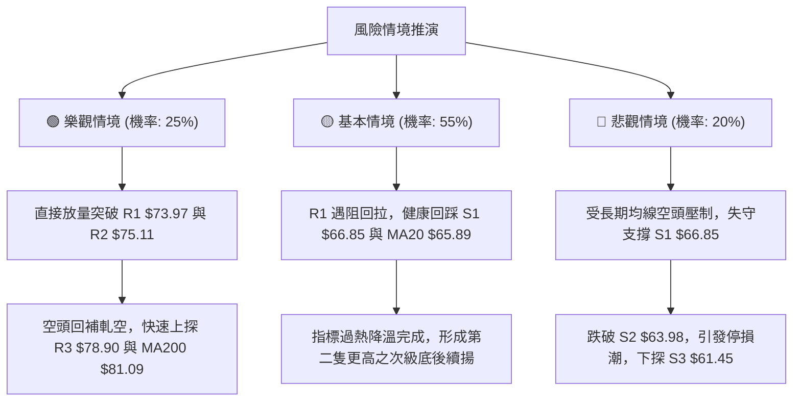

# RKLB 技術分析報告

> **報告日期**：2026-09-28 ｜ **語言**：繁體中文 ｜ **數據來源**：Yahoo Finance ｜ **當前價格**：$73.95

---

## 目錄

| 章節 | 內容 |
|------|------|
| [1. 技術面概覽](#1-技術面概覽) | 訊號儀表板、核心指標、評分卡 |
| [2. 趨勢分析](#2-趨勢分析) | 多時框趨勢、長中短期走勢、ADX解讀 |
| [3. 圖表形態分析](#3-圖表形態分析) | 形態識別、信心度、K線組合、目標價推算 |
| [4. 支撐與阻力](#4-支撐與阻力) | 關鍵價位結構、斐波那契回調、量能密集區 |
| [5. 技術指標深度解讀](#5-技術指標深度解讀) | MA均線系統、RSI、MACD、布林通道、成交量OBV |
| [6. 動能與波動率](#6-動能與波動率) | 動能四象限、ATR波動度、Beta風險敏感度 |
| [7. 多時框架總結](#7-多時框架總結) | 時框架矩陣、ADX收斂判定、單一方向結論 |
| [8. 交易策略建議](#8-交易策略建議) | 策略路由、價格階梯、主推策略、風控對沖點 |
| [9. 風險提示與監控](#9-風險提示與監控) | 監控清單、情境推演、倉位管理準則 |
| [10. 報告總結](#-報告總結) | 核心結論與執行決策儀表板 |

---

## 1. 技術面概覽

### 🎯 技術訊號儀表板



### 📊 核心指標速覽表

| 指標類別 | 指標名稱 | 當前數值 | 訊號 | 解讀 |
|----------|----------|----------|:----:|------|
| **價格** | 當前收盤價 | $73.95 | 🟢 | 連續兩週放量反彈，短線脫離底部區間 |
| **均線** | MA20 (短中) | $65.89 | 🟢 | 價格在均線上方 +12.23%，短線動能強勁 |
| **均線** | MA50 (中期) | $69.49 | 🟢 | 價格在均線上方 +6.42%，正式突破中期成本線 |
| **均線** | MA200 (長期) | $81.09 | 🔴 | 價格在均線下方 -8.80%，長期結構尚未扭轉 |
| **動能** | RSI(14) | 67.21 | 🟡 | 位於強勢多頭區間，但逼近超買線 70，無背離 |
| **動能** | MACD (12/26/9) | 0.199 / -1.415 | 🟢 | DIF 線由下往上穿過 MACD Signal 線，柱狀圖 +1.614 |
| **動能** | KD(Stoch 14) | 89.90 / 84.19 | 🔴 | K值與D值雙雙進入 >80 極端超買區，存在拉回壓力 |
| **趨勢** | ADX(14) | 17.54 | 🟡 | 數值低於 25，顯示大級別非單邊趨勢，屬底層箱型震盪 |
| **通道** | 布林帶 (%B) | 1.02 ($73.68) | 🔴 | 現價略高於上軌 $73.68，面臨技術性回踩中軌需求 |
| **波動** | ATR(14) | $3.84 (5.20%)| 🟡 | 單日波動率中等，提供良好的風險回報防守空間 |
| **量能** | 最新量 / 20日均量 | 18.80M / 20.12M | 🟢 | 量比 0.93x，週線量連增，OBV 維持多方排列 |

### 🏆 技術評分卡

```
╔══════════════════════════════════════════════════════════════╗
║                技術評分卡 — RKLB (2026-09-28)                ║
╠══════════════════════════════════════════════════════════════╣
║ 趨勢強度 (Trend)     ████████░░░░░░░░░░░░  42/100  🟡 中性弱勢║
║ 動能指標 (Momentum)  ██████████████░░░░░░  70/100  🟢 偏多轉強║
║ 支撐穩定度 (Support) ████████████████░░░░  80/100  🟢 雙底確認║
║ 成交量配合 (Volume)  ████████████░░░░░░░░  60/100  🟢 溫和放大║
║ 形態完整度 (Pattern) ██████████████░░░░░░  70/100  🟢 頸線試探║
║ 均線系統 (Moving Avg)████████░░░░░░░░░░░░  45/100  🔴 長期壓制║
╠══════════════════════════════════════════════════════════════╣
║ 綜合技術得分         ████████████░░░░░░░░  61/100  🟢 偏多反彈║
╚══════════════════════════════════════════════════════════════╝
```

---

## 2. 趨勢分析

### 🌐 多時框趨勢分析



### 📈 長期趨勢 — 12個月走勢圖（Unicode）

```
RKLB 月線走勢圖（2025-10 至 2026-09）
價格軸 ($)
$150 ┤                               ● $143.48 (2026-05 天花板高點)
$130 ┤                              ╱ ╲
$110 ┤                             ╱   ● $101.65 (2026-06 重挫)
$90  ┤                 ● $80.07   ● $82.51  ╲
$70  ┤     ● $62.98   ╱ ╲        ╱           ╲        ● $73.95 (現價)
$50  ┤    ╱   ╲      ● $69.76   ● $64.22      ● $64.95 ╱
$30  ┤   ● $42.14                                ● $63.92 (2026-08 底部)
      └─────────────────────────────────────────────────────────────
       10  11   12   01   02  03   04   05   06   07   08   09 (月份)
     (2025) ────────────────────────── (2026) ─────────────────────
```

#### 走勢特徵分析表格

| 階段區間 | 時間跨度 | 起訖收盤價 | 漲跌幅 (%) | 價量特徵與形態結論 |
|:--------:|:--------:|:----------:|:----------:|:-------------------|
| **主升浪擴張期** | 2025-10 ~ 2026-05 | $62.98 → $143.48 | +127.8% | 經歷大幅換手後爆發噴出，於 2026-05 創下 52 週歷史高點 $151.00，週成交量放大至 1.63 億股，屬於終極動能耗竭浪。 |
| **快速崩盤退潮期** | 2026-05 ~ 2026-07 | $143.48 → $64.95 | -54.7% | 巨幅獲利回吐，價格以極陡角度擊穿 MA50 與 MA120，週 RSI 由 74.8 斷崖式跌至 15.6 極度超賣區。 |
| **雙底低位築底期** | 2026-07 ~ 2026-09 | $64.95 → $63.92 | -1.6% | 兩度於 $63.00 附近獲得強大承接盤防守（2026-07-26 週低 $63.91 與 2026-09-13 週低 $62.95）。 |
| **頸線右側反彈期** | 2026-09-13 ~ 至今 | $62.95 → $73.95 | +17.5% | 週 MACD 柱狀圖翻正至 +1.614，週成交量連續兩週穩定於 1 億股以上，確認底部形態有效，正試圖挑戰上方密集成交阻力。 |

### 📊 中期趨勢（週線分析）

```
週線級別價格運行通道與支撐阻力結構圖：
 阻力區 R3  $78.90 ══════════════════════════════════ [MA240 $76.54 / R3 共振壓力]
 阻力區 R2  $75.11 ────────────────────────────────── [前波小高點套牢區]
 阻力區 R1  $73.97 ┈┈┈┈┈┈┈┈┈┈┈┈┈┈┈┈┈┈┈┈┈┈┈┈┈┈┈┈┈┈┈┈┈┈ [目前遭遇即時阻力 (現價 $73.95)]
                   ▲
                   │ (目前短多推升中，回補跳空缺口)
 支撐區 S1  $66.85 ┄┄┄┄┄┄┄┄┄┄┄┄┄┄┄┄┄┄┄┄┄┄┄┄┄┄┄┄┄┄ [MA20 $65.89 與 S1 防守帶]
 支撐區 S2  $63.98 ══════════════════════════════════ [2026-08/09 雙底頸線支撐基座]
 支撐區 S3  $61.45 ────────────────────────────────── [斐波那契 78.6% $61.84 匯合強防線]
```

中期走勢顯示，RKLB 在經過 54.7% 的深幅回撤後，在斐波那契 78.6% 回調位（$61.84）上方約 $63-$64 構建了寬幅震盪築底箱體。近期連續三週收出陽線，顯示空方動能竭盡，轉為多方震盪反彈主導。

### ⚡ 趨勢強度評估（ADX 解讀）



#### ADX 趨勢強度對照表

| 參數指標 | 數值 | 狀態評估 | 交易指引 |
|:--------:|:----:|:--------:|:---------|
| **ADX (14)** | 17.54 | 弱趨勢 / 盤整 | 市場缺乏持續性的單邊推動力，避免追高突破單，應嚴格執行區間震盪策略。 |
| **+DI (14)** | 24.60 | 多方優勢 | 買方力道佔優，短線推升波仍在延續中。 |
| **-DI (14)** | 15.55 | 空方退潮 | 賣壓顯著減弱，未見機構主動拋售特徵。 |
| **綜合判定** | — | **多頭主導之箱體震盪** | 以中長期 MA50/MA200 區間為防守，依據 ADX < 25 規則，以日線布林通道 ($58.10 - $73.68) 為主交易邊界。 |

---

## 3. 圖表形態分析

### 🔍 形態識別系統



#### 形態信心度與目標價計算表

| 形態名稱 | 信心度 | 判斷依據（引用數據） | 完成度 | 目標價（附嚴謹計算式） |
|:--------:|:------:|:--------------------:|:------:|:----------------------|
| **雙底形態 (W-Bottom)** | 75% | 第一次低點 2026-07-26 收盤 $63.91，第二次低點 2026-09-13 收盤 $62.95（均受到 S2 $63.98 與斐波那契 78.6% $61.84 有效支撐）。中間反彈頸線高點為 2026-08-09 之收盤價 $82.83，短線次級頸線為阻力 R2 $75.11。 | 85% | **以短線次級頸線計算**：<br>頸線 R2 ($75.11) + 形態高度 [頸線 R2 ($75.11) - 雙底低點 ($62.95) = $12.16] = **$87.27**。<br>*(註：受限於數據紀律，向上波段直接參照 R3 $78.90 與 MA120 $86.45 作為首選目標)* |
| **布林通道向上假突破/穿刺** | 65% | 收盤價 $73.95 略高於布林上軌 $73.68（%B = 1.02），且 Stochastic %K 達 89.90。歷史經驗顯示在 ADX = 17.54 的盤整市中，通道外擴往往引發回抽。 | 100% | **回測目標**：<br>回踩中軌 MA20 = **$65.89** 或支撐 S1 = **$66.85**。 |
| **頭肩底形態** | 35% | 數據中左肩與頭部定義尚不明確，僅能識別近8週之低位平底箱型。 | 0% | *訊號不足，依規則 15 不予採納，僅做指標型箱體解讀。* |

### 🕯️ 重要K線形態分析

| 週期/月份 | 收盤價 | K線形態特徵 | 技術面解讀 | 訊號 |
|:---------:|:------:|:------------|:-----------|:----:|
| **2026-05** | $143.48 | 巨量衝高天線星 (長上影線) | 創 $151.00 歷史高後嚴重失真，主力機構出貨，多頭動能見頂反轉。 | 🔴 |
| **2026-07** | $64.95 | 縮量長陰下墜 | 價格快速穿透所有短期均線，空方宣洩，但成交量降至 9,214 萬股，賣壓動能鈍化。 | 🔴 |
| **2026-08** | $63.92 | 雙針探底十字星 (Hammer) | 探底至 $63.00 關卡未破，多空於 $64.00 附近達成暫時均衡，構築潛在底部。 | 🟢 |
| **2026-09** | $73.95 | 中長實體陽線 (大陽吞噬) | 實體由 $64.57 貫穿至 $73.95，收復 MA20 與 MA50，MACD 柱狀圖明顯翻紅 (+1.614)。 | 🟢 |

### 📉 ASCII 走勢形態示意圖

```
RKLB 雙底 (W-Bottom) 與布林上軌穿刺示意圖：

 價位 ($)
 $82.83 ┤                 [中期主頸線波段高點 2026-08-09]
        │                     /\
 $78.90 ┤                    /  \               [阻力 R3]
 $75.11 ┤                   /    \     ▲        [次級頸線阻力 R2]
 $73.95 ┤──────────────────/──────\───●───────── [現價穿刺布林上軌 $73.68]
 $69.49 ┤                 /        \ /  [MA50 中期生命線]
 $65.89 ┤       /\       /          V   [布林中軌 MA20 / S1 $66.85]
 $63.98 ┤      /  \     /               [阻力支撐轉換位 S2]
 $62.95 ┤─────●────\───●──────────────── [左底: $63.91 (07-26) / 右底: $62.95 (09-13)]
        └───────────────────────────────────────────────
               第 1 底                第 2 底
```

---

## 4. 支撐與阻力

### 🗺️ 關鍵價位分布圖（Unicode）

```
RKLB 關鍵價位結構分布圖（OHLCV 精確計算）
═════════════════════════════════════════════════════════════════
 $151.00 ║██████████████████████████████║ 52週歷史高點 (0.0% Fib)
 $107.67 ║████████████████████          ║ 斐波那契 38.2% 回調位
  $81.09 ║██████████████████████████████║ 長期均線 MA200 關鍵反轉壓力
  $78.90 ║████████████████████          ║ 強阻力 R3 (波段高點聚類)
  $75.11 ║████████████████              ║ 阻力 R2 (次級頸線密集區)
  $73.97 ║██████████████████████████████║ 即時關鍵阻力 R1 (+0.03%)
  $73.95 ╠══════════════════════════════╣ ◄ 當前市價收盤
  $66.85 ║▓▓▓▓▓▓▓▓▓▓▓▓▓▓▓▓              ║ 近期第一支撐 S1 (-9.60%)
  $65.89 ║▓▓▓▓▓▓▓▓▓▓▓▓▓▓▓▓▓▓▓▓          ║ 布林中軌 / MA20 動態支撐
  $63.98 ║██████████████████████████████║ 底部強支撐 S2 (雙底低點聚類)
  $61.84 ║████████████████████████      ║ 斐波那契 78.6% 回調位
  $61.45 ║██████████████████████████████║ 極限強支撐 S3 (-16.90%)
  $37.57 ║██████████████████████████████║ 52週歷史低點 (100.0% Fib)
═════════════════════════════════════════════════════════════════
```

### 🚧 阻力位分析表

*(註：價位嚴格引用關鍵價位聚類與 OHLCV 計算值)*

| 阻力級別 | 精確價位 | 距離現價 | 形成原因與籌碼屬性 | 突破難度 | 重要性權重 |
|:--------:|:--------:|:--------:|:-------------------|:--------:|:----------:|
| **R1** | **$73.97** | +0.03% | 近一年波段高點聚類密集成交線，同時與布林通道上軌 $73.68 重合，構成極短線心理天花板。 | 🟡 中等 | ★★★☆☆ |
| **R2** | **$75.11** | +1.57% | 前期反彈之次級高點籌碼套牢區，MA240 ($76.54) 下行壓制帶之前哨站。 | 🟡 中等 | ★★★★☆ |
| **R3** | **$78.90** | +6.69% | 近一年核心波段高點聚類，接近長期生命線 MA200 ($81.09) 與斐波那契 61.8% ($80.90) 的多空分水嶺。 | 🔴 極高 | ★★★★★ |

### 🛡️ 支撐位分析表

*(註：價位嚴格引用關鍵價位聚類與 OHLCV 計算值)*

| 支撐級別 | 精確價位 | 距離現價 | 形成原因與籌碼屬性 | 守住機率 | 重要性權重 |
|:--------:|:--------:|:--------:|:-------------------|:--------:|:----------:|
| **S1** | **$66.85** | -9.60% | 近一年波段低點聚類，與上升中之 MA20 ($65.89) 和布林中軌構成多頭第一道共振防線。 | 75% | ★★★★☆ |
| **S2** | **$63.98** | -13.48% | 2026年7-9月多度回測不破之核心雙底基座（2026-08 收盤 $63.92），籌碼換手最充分區域。 | 85% | ★★★★★ |
| **S3** | **$61.45** | -16.90% | 近一年波段極限低點聚類，緊貼斐波那契 78.6% 回調位 ($61.84)，此位若失守將引發多頭停損賣壓。 | 92% | ★★★★★ |

### 📐 斐波那契回調位分析

依據 52 週極端區間：波段低點 **$37.57** (100.0%) 至 波段高點 **$151.00** (0.0%) 計算：

```
151.00 ┤ 0.0%  52W High
124.23 ┤ 23.6%
107.67 ┤ 38.2%
 94.28 ┤ 50.0%
 80.90 ┤ 61.8% ────────────────── [長期空頭回調黃金分割重壓]
 73.95 ┤ ▲ 目前現價 ($73.95 位於 61.8% 與 78.6% 之間)
 61.84 ┤ 78.6% ────────────────── [多頭深幅回撤防守線，成功守住]
 37.57 ┤ 100.0% 52W Low
```

- **位置解讀**：現價 $73.95 精準落於 **78.6% 回調位 ($61.84)** 與 **61.8% 回調位 ($80.90)** 之間。
- **技術意義**：價格在跌破 61.8% 黃金分割線後並未崩潰至起漲點 $37.57，而是在 78.6%（$61.84）上方約 $63 處成功築出雙底，顯示機構投資人在深跌 58% 後開始進行戰略性吸籌。當前反彈的第一個終極考驗即為 61.8% 回調位 $80.90（與 MA200 $81.09 形成極強技術共振）。

---

## 5. 技術指標深度解讀

### 🎛️ 指標訊號總覽



### 📈 移動平均線排列分析



- **均線排列狀態**：大週期維持典型的空頭排列（MA20 $65.89 < MA50 $69.49 < MA200 $81.09）。
- **結構矛盾與修復**：儘管長期趨勢為空，但短線均線系統展現強烈修復訊號。MA5（$71.95）已由下向上黃金交叉 MA50（$69.49）與 MA60（$71.62），且現價已完全站上 MA20 與 MA50。這種「短均多頭排列、長均空頭壓制」的走勢，代表當前處於**典型的熊市次級強勁反彈浪**，上方第一道均線重壓落於 MA240（$76.54），第二道重壓為 MA200（$81.09）。

### 📉 RSI(14) 分析

```
RSI(14) 讀數：67.21
0% ──────── 30% (超賣) ──────────── 50% (多空平衡) ────── 70% (超買) ── 100%
[░░░░░░░░░░░░░░░░░░░░░░░░░░░░░░░░░░░░░░░░░░░░░░░░░░█████████████░░░░░░] 67.21%
```

- **區間評估**：RSI(14) 達到 67.21，高於多空分界線 50，顯示多方買盤力道充沛，但已極度逼近 70 超買警戒線。
- **背離檢驗結論**：
  - **日線級別**：當前價格自 $62.95 連續上漲至 $73.95，RSI 自 27.1 同步回升至 67.21，指標創高且價格同步創高，**無頂背離現象**。
  - **週線級別**：2026-08-09 價格在 $82.83 時週 RSI 為 68.6，而當前價格在 $73.95 週 RSI 為 67.2，指標與價格維持正向同步，**無明顯背離，走勢健康**。

### 📊 MACD(12/26/9) 訊號解讀



- **數值關係**：DIF 已經翻正為 +0.199，Signal 線位於 -1.415，柱狀圖大幅擴張至 **+1.614**。
- **解讀結論**：MACD 出現極為標準的「零軸附近低位金叉向上」形態，近三週週線 MACD 柱狀圖由 -0.133 翻為 +0.612、再翻為 +1.614，呈現**多頭量能階梯式增強**，預示反彈動能尚未衰竭，支撐價格進一步向高位阻力發起挑戰。

### 📦 布林通道分析

```
RKLB 日線布林通道 (帶寬: $15.58) 示意圖：

 $73.68 ┤──────────────────────●────── 布林上軌 (現價 $73.95，穿刺超買 %B=1.02)
        │                     ╱
 $69.78 ┤                    ╱
        │                   ╱
 $65.89 ┤──────────────────╱────────── 布林中軌 (MA20，重要回踩防守點)
        │                 ╱
 $61.99 ┤                ╱
        │               ●
 $58.10 ┤────────────────────────────── 布林下軌 (雙底回測起漲區)
        └───────────────────────────────
```

- **布林上軌**：$73.68 ｜ **中軌 (MA20)**：$65.89 ｜ **下軌**：$58.10
- **通道指標 %B 解讀**：當前收盤價 $73.95，**%B = 1.02**，確認價格已突破上軌進入通道外側。依據統計學與波動率原理，在 ADX 僅為 17.54 的無趨勢盤整市場中，%B > 1.00 通常伴隨短期均值回歸拉回，預期未來 1-3 個交易日將對布林上軌進行確認或拉回整理。

### 💹 成交量分析（量價配合度）

- **量比與均量對比**：最新日成交量為 18,802,600 股，相較於 20 日均量（20,117,635 股）量比為 0.93x；相較於 50 日均量（18,851,668 股）基本持平。
- **週線量能梯次追蹤**：
  - 2026-08-30：週量 70,750,700 股（窒息量低點）
  - 2026-09-13：週量 85,204,500 股（量增止跌）
  - 2026-09-20：週量 106,896,200 股（放量上攻）
  - 2026-09-27：週量 111,453,700 股（持續放量收大陽線）
- **OBV 能量潮解讀**：OBV 趨勢顯示「**OBV > MA**」，量能曲線率先向上金叉均量線。這表明本波自 $62.95 發動的上攻有持續性的增量資金配合，並非無量空拔，量價配合健康度評級為 🟢 **良好**。

---

## 6. 動能與波動率

### ⚡ 動能評估四象限

| 象限 | 動能維度 | 波動維度 | 當前狀態 | 策略意涵與評估 |
|:----:|:--------:|:--------:|:--------:|:---------------|
| **Q1 (最佳擴張)** | 強動能 (RSI>60) | 低波動 (ATR%<4%) | — | 低風險高回報追價區間。 |
| **Q2 (震盪收斂)** | 弱動能 (RSI 40-60) | 低波動 (ATR%<4%) | — | 盤整蓄勢，適合佈局期權策略。 |
| **Q3 (高動能高波)**| **強動能 (RSI 67.21)** | **高波動 (ATR 5.20%)** | **✓ (當前所屬象限)** | **動能充足但日波幅劇烈，易出現高位震盪洗盤，應設定寬幅止損或逢拉回分批進場。** |
| **Q4 (恐慌出逃)** | 弱動能 (RSI<40) | 高波動 (ATR%>5%) | — | 空頭單邊殺跌，堅決避免左側抄底。 |



### 📊 ATR 波動率分析

- **ATR(14) 讀數**：**$3.84**（佔當前市價之 **5.20%**）。
- **歷史波動特性**：該數值反映 RKLB 每日平均潛在波幅接近 $4.00，波動性在工業及航太軍工板塊中屬於極高水準。
- **止損距離量化建議**：
  - **極短線交易 (Day Trading)**：1.0 × ATR = **$3.84**
  - **波段多頭防守 (Swing Trading)**：1.5 × ATR = **$5.76**
  - **中期趨勢防守 (Position Trading)**：2.0 × ATR = **$7.68**
  - **當前止損落點校驗**：若自現價 $73.95 減去 1.85 × ATR（約 $7.10），落點約為 **$66.85**，剛好與關鍵支撐位 **S1 ($66.85)** 完美共振，印證 S1 是量化風控之絕佳防守底線。

### 📐 Beta 與市場相關性

- **Beta 係數**：**2.612**
- **市場敏感度分析**：RKLB 展現出極強的進攻性高 Beta 特徵。當標普 500 指數（S&P 500）波動 1% 時，理論上 RKLB 將產生約 2.61% 的同向或倍數放大波動。
- **空頭部位比例 (Short Interest)**：Short % of Float 為 **7.3%**，Short Ratio 為 **2.61**。空頭部位處於中等水平，若後續股價突破長期均線 MA200（$81.09），將引發回補空單之軋空行情（Short Squeeze）。

---

## 7. 多時框架總結

### 📋 時框架評分表

| 時框架 | 趨勢方向 | 動能狀態 | 均線排列 | 關鍵圖表形態 | 綜合評分 | 戰術建議 |
|:------:|:--------:|:--------:|:--------:|:------------:|:--------:|:---------|
| **月線 (長期)** | 🔴 空頭修復 | 🟡 中性 (跌深企穩) | 空頭壓制 (MA200下方) | 歷史高位深幅回調波 | **45/100** | 戰略底倉逢低配置，不追高 |
| **週線 (中期)** | 🟢 震盪築底 | 🟢 轉強 (MACD金叉) | MA20附近爭奪 | $63-$83 寬幅箱型底部 | **65/100** | 逢低布局波段多單 |
| **日線 (短期)** | 🟢 短多衝刺 | 🔴 超買 (KD>85, BB突破)| 短期多頭 (站上MA5/20/50)| 布林上軌突破測試 | **68/100** | 等待短線回踩確認後加碼 |

### 🔲 綜合訊號矩陣

```
┌─────────────────┬──────────────────┬──────────────────┬──────────────────┐
│ 分析維度        │ 短期 (1-5天)     │ 中期 (1-4週)     │ 長期 (1-3個月)   │
├─────────────────┼──────────────────┼──────────────────┼──────────────────┤
│ 均線系統        │ 🟢 MA5/20多頭排列 │ 🟡 跨越MA50測試MA60│ 🔴 受制MA120/MA200│
│ 動能 (RSI/MACD) │ 🟡 逼近超買70     │ 🟢 MACD柱狀翻正  │ 🟡 底部回升      │
│ 圖表形態        │ 🔴 遭遇R1強阻力   │ 🟢 W底形態完成85% │ 🟡 寬幅震盪箱體  │
│ 量能結構 (OBV)  │ 🟢 OBV向上穿均線  │ 🟢 週量能連三增  │ 🟡 總量溫和中性  │
├─────────────────┼──────────────────┼──────────────────┼──────────────────┤
│ 維度綜合判斷    │ 短期面臨回調洗盤 │ 中期反彈格局確立 │ 長期空間受限於均線│
└─────────────────┴──────────────────┴──────────────────┴──────────────────┘
```

### ⚖️ 多時框收斂結論

依據多時框收斂規則第 14 條嚴格判定：
1. **行情定性**：當前 ADX(14) 讀數為 **17.54**（遠低於 25 臨界線），系統明確判定為「**非單邊趨勢之盤整/震盪反彈行情**」。
2. **時框優先級取捨**：依規則，盤整行情不適用均線跟隨系統（MA200 空頭無效化），而**以日線布林通道 ($58.10 - $73.68) 與波段高低點結構為主要交易邊界依據**。
3. **單一方向性收斂結論**：**【偏多震盪反彈】**。
   - 儘管超長週期均線仍呈空頭排列，但日線與週線的底部動能強勁，MACD 與 OBV 全面支持反彈延續。
   - 由於現價 $73.95 已越過布林上軌 $73.68 並抵達即時阻力 R1 ($73.97)，交易戰術**堅決不追高**，而是**鎖定回踩支撐位進行低吸做多**。此結論與第 8 章交易策略完全一致。

---

## 8. 交易策略建議

### 🗺️ 策略決策流程圖



### 🧭 策略路由（依評分卡分流）

> **當前主策略方向 = 【多頭反彈波段策略（回踩逢低承接）】**
> *(依第 1 章技術評分卡綜合得分 **61/100**，達到偏多 ≥60 標準)*

### 🎯 價格情境階梯（Price Scenarios）

*(價位嚴格引用關鍵價位聚類與 OHLCV 計算值)*

| 觸發條件 | 即時路徑 | 下一目標 | 後續延伸 | 情境含義與技術演變 |
|:--------:|:--------:|:--------:|:--------:|:-------------------|
| **強勢突破** | 日線實體突破 R1 **$73.97** | 測試 R2 **$75.11** | 挑戰 R3 **$78.90** / MA200 **$81.09** | 軋空動能爆發，短多完全主導，箱體天花板抬升。 |
| **強勢震盪** | 受阻於 R1-R2 區間 | 回踩 S1 **$66.85** | 於 MA20 **$65.89** 蓄勢整固 | 消化短線超買指標，清洗浮額，最健康之上漲中繼。 |
| **弱勢破位** | 放量跌破 S1 **$66.85** | 回測 S2 **$63.98** | 考驗 S3 **$61.45** / Fib 78.6% **$61.84** | 雙底頸線宣告失敗，反彈夭折，重新陷入尋底弱勢。 |

### 📊 情境機率分佈

| 情境劇本 | 預估機率 | 主要技術依據（引用指標狀態） |
|:--------:|:--------:|:-----------------------------|
| **路徑一：回踩整理後上攻** | **55%** | MACD 柱狀圖翻正 (+1.614)、OBV 走高支持、但受制於 Stoch KD (89.90) 超買，需短線技術性回調消化阻力。 |
| **路徑二：強行突破 R1 衝高** | **25%** | 買方動能極為強勁，若週一直接放量跳空越過 $75.11，將直接拉動布林通道開口發動趨勢行情。 |
| **路徑三：跌破支撐重回跌勢** | **20%** | 大週期 MA200 ($81.09) 仍處空頭排列，若遭遇整體宏觀市場系統性拋售可能使多方結構破裂。 |

### 🟢 主策略詳情（方向依上方路由）

```
主策略買賣點與風控階梯示意圖：
 目標價 T2  $78.90 ══════════════════════════════ [阻力 R3]
 目標價 T1  $75.11 ────────────────────────────── [阻力 R2]
 現價參考   $73.95 ┈┈┈┈┈┈┈┈┈┈┈┈┈┈┈┈┈┈┈┈┈┈┈┈┈┈┈┈┈┈ [布林上軌超買區，暫不進場]
 進場價 1   $66.85 ┄┄┄┄┄┄┄┄┄┄┄┄┄┄┄┄┄┄┄┄┄┄┄┄┄┄┄┄ [策略 B 首選進場點 (支撐 S1)]
 進場價 2   $65.89 ┄┄┄┄┄┄┄┄┄┄┄┄┄┄┄┄┄┄┄┄┄┄┄┄┄┄┄┄ [布林中軌 MA20 支撐加碼點]
 止損價     $63.98 ══════════════════════════════ [硬性止損線 (支撐 S2 跌破)]
```

| 策略要素 | 策略 A（右側追強突破型） | 策略 B（左側支撐低吸型 — **優先推薦**） |
|:---------|:------------------------|:---------------------------------------|
| **進場條件** | 盤中放量突破 R1 並站穩阻力 R2 **$75.11** | 價格自布林上軌拉回，於支撐 S1 **$66.85** 附近止跌 |
| **進場價格** | **$75.11** (或突破當日收盤買入) | **$66.85** (回踩掛單分批承接) |
| **目標價 T1** | **$78.90** (阻力位 R3，減倉 50%) | **$73.97** (阻力位 R1，減倉 50%) |
| **目標價 T2** | **$81.09** (MA200 長期均線壓制位) | **$75.11** (阻力位 R2，全數獲利了結) |
| **止損價格** | **$72.00** (跌破突破點兼 MA5 $71.95) | **$63.98** (底部強支撐 S2 跌破出局) |
| **風險空間** | $75.11 - $72.00 = **$3.11** (4.14%) | $66.85 - $63.98 = **$2.87** (4.29%) |
| **報酬空間 (T1)**| $78.90 - $75.11 = **$3.79** (5.05%) | $73.97 - $66.85 = **$7.12** (10.65%) |
| **風險報酬比 (R:R)**| **1 : 1.22** (較差，不具性價比) | **1 : 2.48** (優質，強烈推薦) |
| **成功機率** | 45% (易遭受假突破誘多陷阱) | 70% (具備 S1 與 MA20 雙重支撐墊) |
| **建議倉位** | 10% (輕倉試探) | 20% (標準波段配置) |

### 🔴 反向風險觸發點（對沖提示）

若發生以下情形，主推之多頭策略將被**技術性推翻**，多單必須無條件止損，甚至建立對沖空頭部位：
1. **關鍵點位跌破**：收盤價有效跌破底部關鍵支撐 **S2 ($63.98)**，意味著歷經兩個月的雙底形態徹底破局，下行空間直接打開至 S3 ($61.45) 乃至 52 週低點 $37.57。
2. **量價異化**：價格跌破中軌 MA20 ($65.89) 時伴隨單日成交量放大至 3,000 萬股以上（大於均量 1.5 倍），表明機構資金再度大舉拋售。
3. **指標反轉**：MACD 柱狀圖在 0 軸上方快速衰減並重新轉為負值，DIF 線跌破 Signal 線。

### ⭐ 整體訊號強度評星

```
做多訊號強度：★★★★☆  (4/5星 — 短中期共振向上，但受阻於R1)
做空訊號強度：★★☆☆☆  (2/5星 — 長期空頭壓制，但短線逆勢)
整體可信度：  ★★★★☆  (4/5星 — 價量均線結構清晰，雙底明確)
```

---

## 9. 風險提示與監控

### ✅ 關鍵監控指標 Checklist

```
╔══════════════════════════════════════════════════════════════╗
║               RKLB 每日交易監控 Checklist                    ║
╠══════════════════════════════════════════════════════════════╣
║ [ ] 阻力位突破監控：觀察收盤價是否站穩 R1 ($73.97)           ║
║ [ ] 布林軌道收斂性：觀察現價是否回落至上軌 ($73.68) 之內      ║
║ [ ] 動能過熱降溫：Stoch %K 是否從 89.90 拐頭死叉跌破 80       ║
║ [ ] 動態支撐有效性：回踩時 MA20 ($65.89) / S1 ($66.85) 是否有守║
║ [ ] 成交量能健康度：回調時成交量是否萎縮至 1,500 萬股以下     ║
║ [ ] 軋空催化監控：空頭借券比率是否出現異常回補 (Short Float)║
╚══════════════════════════════════════════════════════════════╝
```

### ⚠️ 風險場景分析



### 🛡️ 風險管理重要提醒

1. **Beta 敏感度風控**：RKLB 的 Beta 值高達 **2.612**，屬於高波動性品種。在美股大盤波動加劇時，其振幅將顯著擴大。投資者在設定總持倉比例時，**單一個股總曝險資金嚴格控制在總投資組合的 5% - 8% 以內**。
2. **止損紀律**：鑑於單日 ATR 高達 **$3.84**（5.20%），請勿使用過緊的日內止損（如 1%）。嚴格依據技術支撐 S2（**$63.98**）設立結構性止損，一旦盤中或收盤確認跌破，必須無條件執行停損離場，絕不攤平。
3. **盈虧比管理**：在現價 $73.95 追進多單的風險報酬比僅為 1:1.22，屬於負期望值交易；唯有嚴守紀律等待股價拉回至 **$66.85 (S1)** 附近進場，方能取得 1:2.48 之優異風險報酬比。

---

## 📋 報告總結

```
╔══════════════════════════════════════════════════════════════════╗
║                    RKLB 技術分析報告總結                        ║
╠══════════════════════════════════════════════════════════════════╣
║ 報告日期：2026-09-28               當前價格：$73.95              ║
║ 技術評分：61/100                   分析評級：🟢 偏多震盪 (反彈) ║
╠══════════════════════════════════════════════════════════════════╣
║ 關鍵結論：                                                       ║
║ ├─ 長期趨勢：🔴 空頭壓制 (MA200 位於 $81.09，大格局仍屬下行修正)║
║ ├─ 中期趨勢：🟢 震盪築底 (雙底基座完成，週 MACD 翻正放量)      ║
║ ├─ 短期趨勢：🟡 短線超買 (突破布林上軌 $73.68，面臨 R1 $73.97)  ║
║ ├─ 關鍵支撐：S1 $66.85  │  S2 $63.98 (核心停損)  │  S3 $61.45    ║
║ ├─ 關鍵阻力：R1 $73.97  │  R2 $75.11             │  R3 $78.90    ║
║ └─ 華爾街目標：平均 $109.37 (最低 $64.00 / 最高 $150.00)       ║
╠══════════════════════════════════════════════════════════════════╣
║ 最優策略組合：                                                   ║
║ 1. 🥇 最佳機會：等待價格回踩 S1 $66.85 逢低佈局，停損設於 S2     ║
║                 $63.98，目標看 R1 $73.97 與 R2 $75.11 (R:R 2.48) ║
║ 2. 🥈 次選機會：若放量實體突破 R2 $75.11 輕倉順勢追多，看至 R3   ║
║                 $78.90 與 MA200 $81.09                           ║
║ 3. 🥉 保守選擇：現價 $73.95 逼近布林通道上軌，多看少做，暫時觀望 ║
╚══════════════════════════════════════════════════════════════════╝
```

---

> ⚠️ **免責聲明**：本報告為技術分析研究成果，所有價位、圖表數據及交易策略推演均基於歷史價格與客觀指標量化計算，僅供專業研究與學術探討參考，**絕不構成任何形式之投資建議或買賣邀約**。金融市場具有高度風險，股價可能大幅波動，投資人應獨立評估自身風險承受能力並自負盈虧。

---

*報告生成時間：2026-09-28 ｜ 數據來源：Yahoo Finance ｜ 分析框架：多時框圖表與量化指標系統*