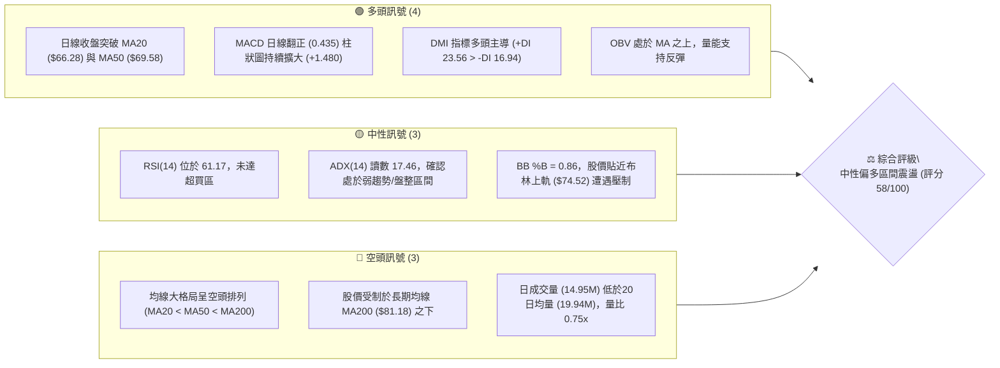
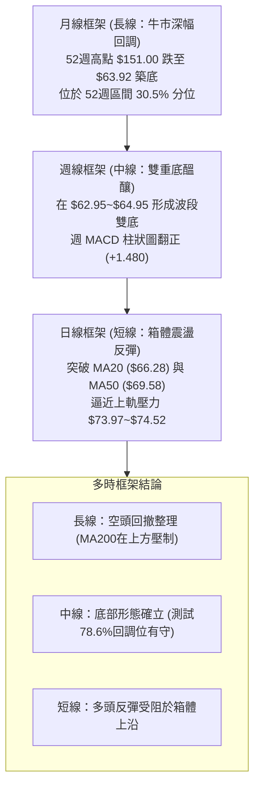
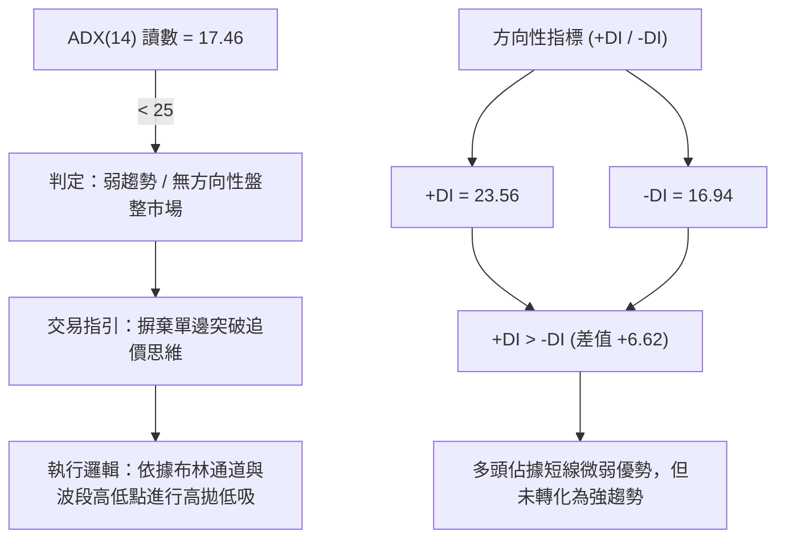
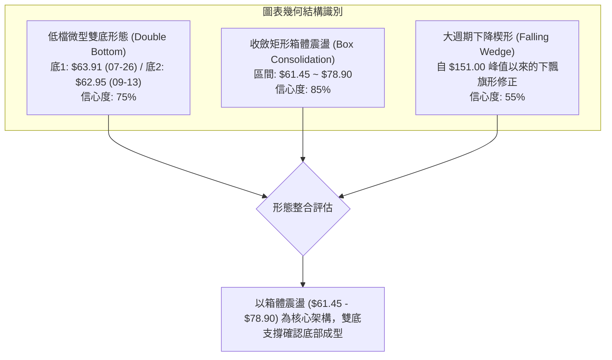
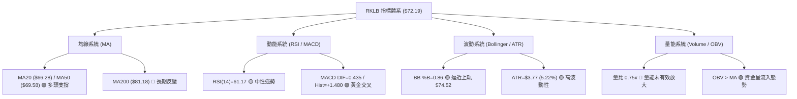
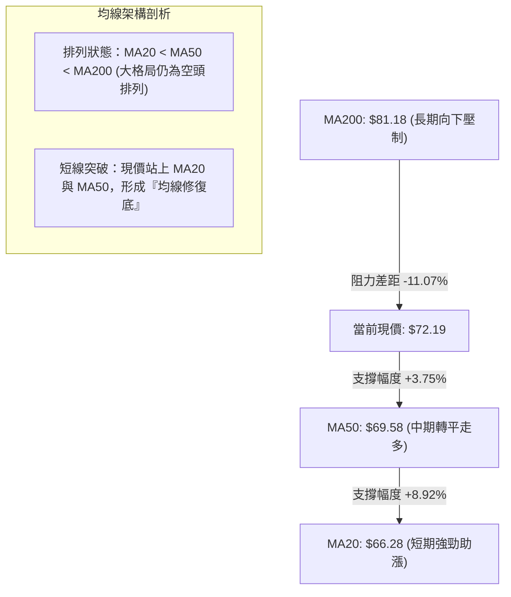
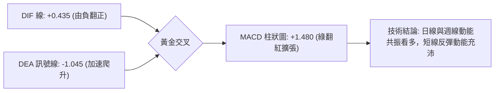
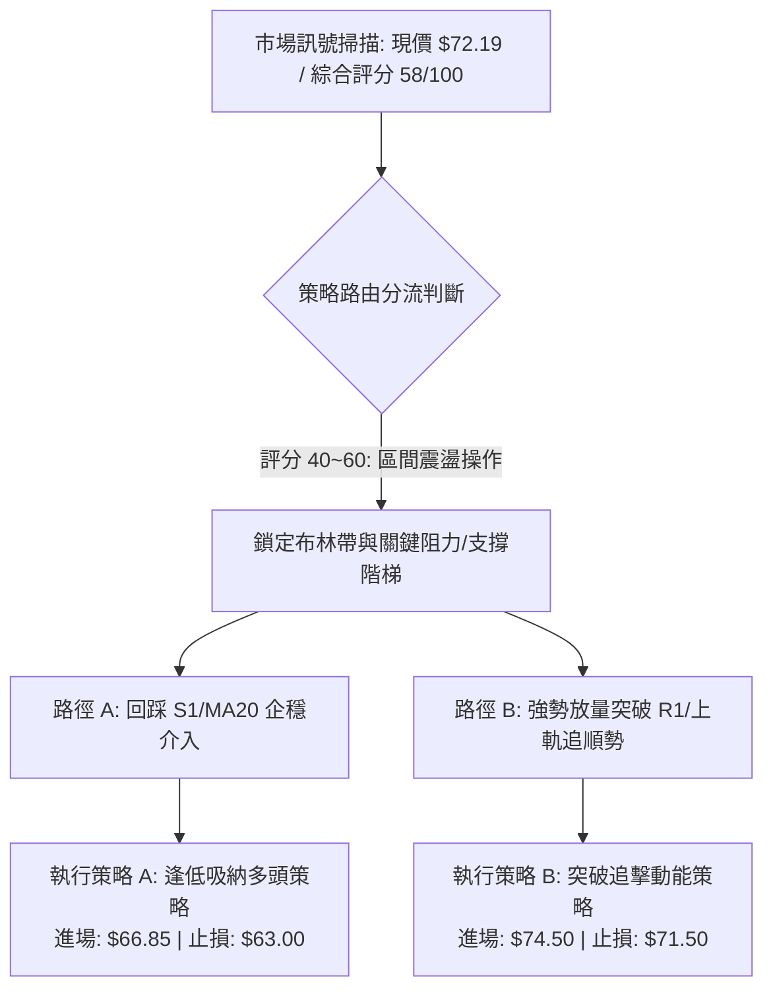
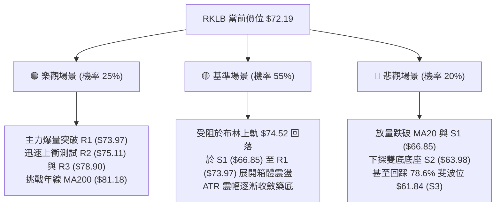

# RKLB 技術分析報告

> **報告日期**：2026-09-29 ｜ **語言**：繁體中文 ｜ **數據來源**：Yahoo Finance ｜ **當前價格**：$72.19

---

## 目錄

| 章節 | 內容 |
|------|------|
| [1. 技術面概覽](#1-技術面概覽) | 訊號儀表板、核心指標、評分卡 |
| [2. 趨勢分析](#2-趨勢分析) | 多時框趨勢、長中短期走勢、ADX解讀 |
| [3. 圖表形態分析](#3-圖表形態分析) | 形態識別、信心度、K線組合 |
| [4. 支撐與阻力](#4-支撐與阻力) | 關鍵價位、斐波那契回調結構 |
| [5. 技術指標深度解讀](#5-技術指標深度解讀) | MA/RSI/MACD/布林/成交量量價背離 |
| [6. 動能與波動率](#6-動能與波動率) | 動能四象限、ATR風控、Beta敏感度 |
| [7. 多時框架總結](#7-多時框架總結) | 訊號矩陣與多時框優先級收斂 |
| [8. 交易策略建議](#8-交易策略建議) | 策略路由、階梯情境、主策略及風控點 |
| [9. 風險提示與監控](#9-風險提示與監控) | 監控指標Checklist、風險場景樹 |

---

## 1. 技術面概覽

### 🎯 技術訊號儀表板



### 📊 核心指標速覽表

| 指標類別 | 指標名稱 | 當前數值 | 訊號 | 解讀 |
|:---|:---|:---|:---:|:---|
| **價格** | 當前價格 | $72.19 | 🟢 | 站上 MA20 與 MA50，呈現自低檔 $62.95 築底反彈格局 |
| **均線** | MA20 | $66.28 | 🟢 | 價格在均線上方 +8.92%，短期多頭扣抵助漲 |
| **均線** | MA50 | $69.58 | 🟢 | 價格在均線上方 +3.75%，收復中期基準生命線 |
| **均線** | MA200 | $81.18 | 🔴 | 價格在長期牛熊線下方 -11.07%，上方長期套牢賣壓沉重 |
| **均線系統** | 均線排列 | 空頭排列 | 🔴 | MA20 < MA50 < MA200，大格局反彈受制於長期均線束縛 |
| **動能** | RSI(14) | 61.17 | 🟡 | 位於強勢中性區，無頂底背離，具備上衝動能但空間受限 |
| **動能** | MACD(12,26,9)| 0.435 / +1.480 | 🟢 | DIF 線突破訊號線 (-1.045) 翻紅，紅柱放大，買盤增強 |
| **擺動** | KD (%K/%D) | 78.13 / 85.22 | 🟡 | %K向下死叉%D進入高檔鈍化觀察期，短期防範回踩震盪 |
| **通道** | 布林帶 (%B) | 0.86 ($74.52) | 🟡 | 逼近上軌壓力區 ($74.52)，短線乖離拉大，追價風險增高 |
| **趨勢** | ADX(14) | 17.46 (+DI: 23.56)| 🟡 | 趨勢動能偏弱 (<25)，市場由箱體盤整主導而非單邊趨勢 |
| **成交量** | 量比 (Vol/20MA)| 0.75x (14.95M) | 🔴 | 反彈過程量能不足，缺乏主力機構進攻型爆量確認 |
| **波動** | ATR(14) | $3.77 (5.22%) | 🟡 | 每日平均震幅達 5.22%，高 Beta (2.61) 特性，需嚴控止損 |

### 🏆 技術評分卡

```
╔══════════════════════════════════════════════════════════════╗
║              技術評分卡 — RKLB (2026-09-29)                  ║
╠══════════════════════════════════════════════════════════════╣
║ 趨勢強度 (ADX/方向)   ████████░░░░░░░░░░░░  40/100  🟡 弱趨勢 ║
║ 短期動能 (MACD/RSI)   ██████████████░░░░░░  70/100  🟢 多頭強 ║
║ 支撐穩定度 (S1/S2/S3) ██████████████░░░░░░  70/100  🟢 底部厚 ║
║ 成交量配合 (OBV/量比) ████████░░░░░░░░░░░░  40/100  🔴 量能縮 ║
║ 形態完整度 (箱體整理) ██████████████░░░░░░  70/100  🟢 區間明 ║
║ 均線架構 (長期 vs 短期)████████████░░░░░░░░  60/100  🟡 糾纏中 ║
╠══════════════════════════════════════════════════════════════╣
║ 綜合評分              ███████████░░░░░░░░░  58/100  ⚖️ 區間震盪║
╚══════════════════════════════════════════════════════════════╝
```

---

## 2. 趨勢分析

### 🌐 多時框趨勢分析



### 📈 長期趨勢 — 12個月走勢圖（Unicode）

```
RKLB 月線走勢圖（2025-10 至 2026-09）
價格軸 ($)
$150 ┤                                        ●(高點 $143.48 / 峰值 $151.00)
$140 ┤                                      ╱   ╲
$130 ┤                                     ╱     ╲
$120 ┤                                    ╱       ╲
$110 ┤                                   ╱         ●($101.65)
$100 ┤                                  ╱           ╲
$90  ┤                             ●($82.51)         ╲
$80  ┤                   ●($80.07)  │                 ╲
$70  ┤        ●($69.76)   ╲   ╱     │                  ╲       ●←現價 $72.19
$60  ┤ ●($62.98)   ╲       ●($64.22)                   ●($64.95)─●($63.92)
$50  ┤      ╲       ●($69.10)
$40  ┤       ●($42.14)
     └─┬─────┬─────┬─────┬─────┬─────┬─────┬─────┬─────┬─────┬─────┬─────┬───
      10月  11月  12月  01月  02月  03月  04月  05月  06月  07月  08月  09月 (2026)
```

**走勢特徵分析表格**：

| 週期階段 | 月份區間 | 起訖價格 | 區間漲跌幅 | 核心走勢特徵 | 技術面解讀 |
|:---|:---|:---|:---:|:---|:---|
| **前期拉升與回踩** | 2025-10 ~ 2025-11 | $62.98 → $42.14 | -33.09% | 劇烈洗盤 | 快速跌破支撐後迅速獲買盤承接，形成深 V 底 |
| **主升浪擴展** | 2025-12 ~ 2026-05 | $69.76 → $143.48| +105.68% | 狂暴主升浪 | 突破歷史平台，2026年5月觸及歷史峰值 $151.00 |
| **單邊下行重挫** | 2026-06 ~ 2026-07 | $101.65 → $64.95| -36.10% | 泡沫破裂獲利回吐| 連續兩月大陰線灌破中期均線，直接跌破 61.8% 回調位 |
| **低檔箱體築底** | 2026-08 ~ 2026-09 | $63.92 → $72.19 | +12.94% | 雙重底打底反彈 | 止跌於 78.6% 斐波那契關鍵支撐區 ($61.84)，動能收斂 |

### 📊 中期趨勢（週線分析）

```
RKLB 週線波段阻力與支撐分佈
────────────────────────────────────────────────────────────────
$82.83 ───┐ 08-09 波段反彈高點（頸線反壓區 / 逼近 MA200 $81.18）
          │  
$78.90 ───┼─ R3 阻力位（近一年波段密集賣壓帶）
$75.11 ───┼─ R2 阻力位（上週反彈受阻高點）
$73.97 ───┼─ R1 阻力位（近20週密集成交區上沿 / 09-27收盤 $73.95）
$72.19 ───┼◄── 當前收盤價（受壓於 R1 之下，守在 MA20/MA50 之上）
$66.85 ───┼─ S1 支撐位（MA20 $66.28 形成之動態防守帶）
$63.98 ───┼─ S2 支撐位（07-26 低點 $63.91 與 08-30 低點 $64.39 聚類）
$61.45 ───┴─ S3 支撐位（近一年低點聚類 / 斐波那契 78.6% $61.84）
────────────────────────────────────────────────────────────────
```

### ⚡ 趨勢強度評估（ADX 解讀）



**ADX 強度對照與市場狀態**：

| 指標變數 | 當前讀數 | 臨界標準 | 當前市場狀態判定 | 操作策略指導 |
|:---|:---:|:---:|:---|:---|
| **ADX (14)** | **17.46** | < 20 (極弱/盤整)<br>20-25 (趨勢醞釀)<br>> 25 (強趨勢啟動) | **非趨勢性箱體震盪**。表明自 $143.48 下跌以來的殺跌動能已耗盡，但多頭反攻亦未形成群聚效應。 | 禁止使用均線突破追買系統，嚴格以支撐阻力水平線為交易邊界。 |
| **+DI (14)** | **23.56** | > -DI (多方佔優) | 短線買盤強於賣盤，多方具備定價微弱優勢。 | 回踩支撐企穩可短多介入。 |
| **-DI (14)** | **16.94** | < +DI (空方退潮) | 主動性拋壓收斂，空頭力道降至近兩個月新低。 | 空頭部位需嚴防空頭回補帶來的反抽。 |

---

## 3. 圖表形態分析

### 🔍 形態識別系統



**形態信心度與目標價評估**：

| 形態名稱 | 信心度 | 判斷依據（引用數據） | 完成度 | 頸線 / 邊界價位 | 目標價（附嚴謹計算式） |
|:---|:---:|:---|:---:|:---|:---|
| **低檔雙重底** | **75%** | 兩次下探低點 $63.91 (07-26) 與 $62.95 (09-13)，中隔反彈高點 $82.83 (08-09)。兩低點吻合 S2 ($63.98) 與 S3 ($61.45)。 | 70% | 頸線 = $82.83 (08-09波段高點) | **形態目標價**：<br>頸線 $82.83 + 形態高度 ($82.83 - $62.95 = $19.88) = **$102.71**<br>*(註：需有效放量突破 $82.83 頸線方可激活)* |
| **箱體震盪整理** | **85%** | ADX 僅 17.46，股價反覆在 S3 ($61.45) 至 R3 ($78.90) 區間來回穿越，近期高點受制於 R1 ($73.97)。 | 90% | 箱頂 = $78.90 (R3)<br>箱底 = $61.45 (S3) | **箱體目標價**：<br>箱頂目標 = **$78.90**<br>若向下破位 = **$44.00** ($61.45 - $17.45) |
| **長期下降楔形** | **55%** | 月線自 $151.00 高點震盪回落，斜率趨緩，但成交量未能連續放大支持突破。 | 40% | 上軌下降趨勢線在 MA200 ($81.18) | 訊號不足，僅做指標型解讀，暫不推算單邊目標。 |

### 🕯️ 重要K線形態分析

| 週期/月份 | 收盤價 | 實體與影線特徵 | K線形態名稱 | 技術面解讀 | 訊號 |
|:---|:---:|:---|:---|:---|:---:|
| **2026-05** | $143.48 | 衝高至 $151.00 後收長上影十字陽線 | **高位射擊之星 (Shooting Star)** | 多頭能量竭盡，天量見天價，主力機構出貨訊號明確 | 🔴 |
| **2026-07** | $64.95 | 單月重挫 -36.1%，實體大陰線灌破MA50 | **斷頭鍘刀大陰線** | 恐慌盤湧出，殺穿關鍵整數位，奠定中期偏空格局 | 🔴 |
| **2026-08** | $63.92 | 長下影紡錘線，低點探至 $63.91 獲拉回 | **低檔長下影陽錘子 (Hammer)** | 賣壓耗盡，逢低買盤於 $63.98 (S2) 附近積極托底 | 🟢 |
| **2026-09** | $72.19 | 中陽線收復 MA20 與 MA50，漲幅 +12.94% | **低檔早晨之星組合 (Morning Star)** | 扭轉連續三個月跌勢，正式確立低位箱體支撐成型 | 🟢 |

### 📉 ASCII 走勢形態示意圖

```
低檔雙底及箱體形態結構示意圖：
$85 ┤
$82 ┤             ▲ 頸線壓力點 $82.83 (2026-08-09 高點)
$79 ┤─────────────┼────────────────────────────── R3 阻力位 $78.90
$75 ┤             │              ▲ 現受阻於 R1 $73.97 / R2 $75.11
$72 ┤             │             ╱ ╲
$69 ┤             │   ▲        ╱   ● 現在收盤 $72.19
$66 ┤             │  ╱ ╲      ╱     ▲ 支撐線 S1 $66.85
$63 ┤    底1      │ ╱   ╲    ╱
$60 ┤   ●($63.91) ┴╱     ●($62.95) 底2 ───────── S2 $63.98 / S3 $61.45
    └────┴───────────────┴───────────────┴───────────────
      2026-07-26       2026-09-13      當前 (2026-09-29)
```

---

## 4. 支撐與阻力

### 🗺️ 關鍵價位分布圖（Unicode）

```
RKLB 價位結構分布圖 (由 OHLCV 歷史波段嚴密計算)
══════════════════════════════════════════════════════════════════
$151.00 ║████████████████████████████████████████║ 52週歷史最高點 (斐波 0.0%)
$124.23 ║████████████████████████                ║ 斐波那契 23.6% 回調位
$107.67 ║████████████████████████                ║ 斐波那契 38.2% 回調位
$94.28  ║████████████████████                    ║ 斐波那契 50.0% 多空分水嶺
$81.18  ║██████████████████████████████          ║ 長期牛熊分界 MA200 (強壓)
$80.90  ║██████████████████████████████          ║ 斐波那契 61.8% 黃金分割強壓
$78.90  ║████████████████████████                ║ 強阻力 R3 (近一年密集賣壓)
$75.11  ║████████████████                        ║ 阻力位 R2 (布林上軌突破阻力)
$73.97  ║████████████████████                    ║ 關鍵阻力 R1 (當前波段上沿)
$72.19  ╠════════════════════════════════════════╣ ◄── 當前收盤價 ($72.19)
$66.85  ║▓▓▓▓▓▓▓▓▓▓▓▓▓▓▓▓▓▓▓▓▓▓▓▓                ║ 近期支撐 S1 (MA20動態支撐)
$63.98  ║████████████████████████                ║ 強支撐 S2 (雙底低點聚類)
$61.84  ║██████████████████████████████          ║ 斐波那契 78.6% 極限支撐位
$61.45  ║██████████████████████████████          ║ 鐵底支撐 S3 (波段絕對防守)
$37.57  ║████████████████████████████████████████║ 52週歷史最低點 (斐波 100.0%)
══════════════════════════════════════════════════════════════════
```

### 🚧 阻力位分析表

| 阻力級別 | 價位 | 距現價空間 | 形成原因（嚴格引用 OHLCV 數據） | 突破難度 | 技術重要性 |
|:---|:---:|:---:|:---|:---:|:---:|
| **R1** | **$73.97** | +2.47% | 近一年波段高點聚類；與 2026-09-27 收盤價 $73.95 高度重合，且與布林上軌 $74.52 形成窄幅共振壓制區。 | 🟡 中等 | 短期突破點：唯有突破 R1 才能打開挑戰 $75+ 空間 |
| **R2** | **$75.11** | +4.04% | 近一年波段次高密集賣壓區；對應布林通道擴張極限阻力。 | 🟡 中等 | 波段壓力：觸及該位置常伴隨隨機指標 (KD) 極限超買 |
| **R3** | **$78.90** | +9.29% | 近一年強阻力聚類；下方緊鄰 MA200 ($81.18) 與 61.8% 斐波那契位 ($80.90)，解套賣壓最沉重區域。 | 🔴 極高 | 中期分水嶺：若無法帶天量突破，反彈行情將於此告終 |

### 🛡️ 支撐位分析表

| 支撐級別 | 價位 | 距現價空間 | 形成原因（嚴格引用 OHLCV 數據） | 守住機率 | 技術重要性 |
|:---|:---:|:---:|:---|:---:|:---:|
| **S1** | **$66.85** | -7.40% | 近一年波段低點聚類；與 MA20 ($66.28) 形成重疊共振支撐帶，為短線回踩第一防線。 | 75% | 短期多空防守位：跌破則宣告短線反彈動能衰竭 |
| **S2** | **$63.98** | -11.37% | 近一年強波段低點聚類；07-26 低點 $63.91 與 08-30 收盤 $64.39 的成交密集底座。 | 85% | 中期雙底支撐：機構建倉成本區，跌破將引發停損 |
| **S3** | **$61.45** | -14.88% | 近一年波段最低點聚類；緊鄰 78.6% 斐波那契回調位 ($61.84)，為本輪牛市回調的最後防線。 | 95% | 核心生命線：跌破將引發週線級別崩盤破底走勢 |

### 📐 斐波那契回調位分析

依據 52 週絕對極值（Low: $37.57 至 High: $151.00，總波幅 $113.43）計算之標準斐波那契水平如下：

| 斐波那契層級 | 精確價位 | 相對現價位置 | 技術意義與多空心理詮釋 |
|:---|:---:|:---:|:---|
| **0.0% (52W High)** | **$151.00** | +109.17% | 歷史極值天花板，泡沫頂部阻力。 |
| **23.6%** | **$124.23** | +72.09% | 極強回調支撐轉阻力，深幅套牢區。 |
| **38.2%** | **$107.67** | +49.15% | 中期空頭回撤弱阻力區。 |
| **50.0%** | **$94.28** | +30.60% | 多空平衡中軸，心理整數位防線。 |
| **61.8% (黃金分割)** | **$80.90** | +12.07% | **強牛熊反壓帶**：與 MA200 ($81.18) 重合，構成反彈最致命的技術天花板。 |
| **當前現價** | **$72.19** | **基準點** | **現價落於 61.8% ($80.90) 與 78.6% ($61.84) 之間，屬於深度回調後的修復盤整期。** |
| **78.6%** | **$61.84** | -14.34% | **終極價值支撐**：與 S3 ($61.45) 完美重疊，為本波段回調獲買盤強力支撐之核心區域。 |
| **100.0% (52W Low)**| **$37.57** | -47.96% | 52週基準起漲點，終極底部。 |

---

## 5. 技術指標深度解讀

### 🎛️ 指標訊號總覽



### 📈 移動平均線排列分析



**移動平均線詳細數據與偏離度**：

| 均線週期 | 當前數值 | 現價偏離幅度 | 短期走勢狀態 | 支撐/阻力角色 | 訊號 |
|:---|:---:|:---:|:---|:---|:---:|
| **MA 5** | $72.41 | -0.30% | 走平微跌，短線於現價附近反覆爭奪 | 超短線動態壓力位 | 🟡 |
| **MA 10** | $69.16 | +4.39% | 強勁向上揚升，提供快速回踩支撐 | 短線多頭防守線 | 🟢 |
| **MA 20** | $66.28 | +8.92% | 自低檔拐頭向上，斜率顯著轉陡 | 核心生命線（與 S1 $66.85 呼應） | 🟢 |
| **MA 50** | $69.58 | +3.75% | 走平止跌，現價成功站穩其上 | 中期分水嶺，轉化為有效支撐 | 🟢 |
| **MA 60** | $71.15 | +1.46% | 緩步走升，現價剛完成突破 | 季度均線，短線確認突破 | 🟢 |
| **MA120** | $86.50 | -16.54% | 沉重向下傾斜，半年線強壓 | 中長期空頭主要陣地 | 🔴 |
| **MA200** | $81.18 | -11.07% | 年線向下運行，構成牛熊天花板 | 長期多空分水嶺，決定反彈極限 | 🔴 |
| **MA240** | $76.57 | -5.72% | 長週期壓力線，位於 R2 與 R3 之間 | 波段延伸重大阻力 | 🔴 |

### 📉 RSI(14) 分析

```
RSI(14) 數值儀表：
0 ────── 30 ───────────── 50 ────────── 61.17 ──── 70 ────── 100
[  超賣區  ]              [   中性偏強區   ▲  ]    [  超買區  ]
進度條：████████████████░░░░░░░░░░ (61.17 / 100)
```

- **超買超賣判定**：當前 RSI(14) 報 61.17，脫離 30-50 弱勢區間，進入 50-70 的強勢控制區，未觸及 70 超買警戒線，顯示短期多頭仍具向上衝刺餘力。
- **背離診斷**：
  - 價格自 2026-09-13 低點 $62.95 揚升至現價 $72.19，RSI 自 27.1 同步飆升至 61.17，未出現頂背離或底背離現象。
  - **結論**：指標與價格走勢呈現**量化同向確認**，無形態衰竭背離徵兆。

### 📊 MACD(12,26,9) 訊號解讀



- **訊號線與零軸關係**：DIF 線已突破 0 軸報 0.435，遠高於 Signal 線的 -1.045。
- **柱狀圖動能**：MACD Histogram 當前達到 +1.480，呈連續擴張態勢，顯示自 9 月中旬以來的空頭力量已被完全瓦解，目前由多頭掌握日內定價權。

### 📦 布林通道分析

```
布林通道 (BB 20, 2) 結構圖：
$76 ┤
$74 ┤────────── BB 上軌 $74.52 (短線強阻力 / 緊鄰 R1 $73.97)
$72 ┤       ● 現價 $72.19 (%B = 0.86，極度貼近上軌)
$70 ┤
$68 ┤
$66 ┤────────── BB 中軌 $66.28 (MA20 生命線 / 核心支撐)
$64 ┤
$62 ┤
$60 ┤
$58 ┤────────── BB 下軌 $58.04 (波段下邊界)
    └──────────────────────────────────────────────────────────
```

- **帶寬與位置分析**：帶寬為 $16.48 ($74.52 - $58.04)，當前 %B 讀數為 **0.86**。
- **邊界效應解讀**：當 %B > 0.80 時，價格進入通道頂部超買壓制區。現價 $72.19 距上軌 $74.52 僅剩 3.23% 空間，且上方直接面對 R1 ($73.97) 阻力。在 ADX 僅 17.46（無單邊暴漲趨勢）背景下，**布林上軌極易引發均值回歸回踩中軌 $66.28 的壓力**。

### 💹 成交量分析（量價配合度）

- **量價關係比率**：
  - 最新日成交量：14,954,600 股。
  - 20 日均量：19,939,700 股（**量比 0.75x**，顯著縮量）。
  - 50 日均量：18,704,570 股。
- **量價背離診斷**：價格自 $62.95 連續反彈至 $72.19，但成交量卻由前期下跌時的 2,000 萬股水平萎縮至不足 1,500 萬股，呈現典型的**「價漲量縮」量價背離現象**。
- **OBV 趨勢確認**：儘管成交量縮，但 OBV 曲線維持在自身均線之上，這表明當前反彈主要源於「空頭籌碼惜售與空頭回補」，機構主動性追高意願尚未爆發。

---

## 6. 動能與波動率

### ⚡ 動能評估四象限

```
              強動能 (MACD > 0 / RSI > 60)
                       │
          Q1           │           ★ 當前 RKLB (Q3)
    [高收益低風險]     │     [高動能高波動]
                       │     動能強烈但伴隨高 Beta
───────────────────────┼────────────────────────── 高波動 (ATR > 5%)
                       │
          Q2           │           Q4
    [低動能低波動]     │     [弱動能高風險]
    橫盤死寂區間       │     殺跌洗盤恐慌
                       │
              弱動能 (MACD < 0 / RSI < 40)
```

**動能與波動維度定位分析**：

| 象限標記 | 動能維度 | 波動維度 | RKLB 歸屬判定 | 當前狀態評估與交易指導 |
|:---:|:---:|:---:|:---:|:---|
| **Q1** | 強 | 低 | — | 最佳波段穩健做多機會（未滿足，當前波動率偏高） |
| **Q2** | 弱 | 低 | — | 盤整觀望期，無交易價值 |
| **Q3** | **強** | **高** | **✓ (精確歸屬)** | **高風險高收益波段操作區間**：短期動能（MACD/RSI）強勁，但由於高 Beta (2.612) 與 ATR (5.22%)，價格極易受市場情緒放大波動，必須採嚴密分批與動態停損。 |
| **Q4** | 弱 | 高 | — | 崩跌階段（已於 6-7 月經歷） |

### 📊 ATR 波動率分析

- **ATR(14) 絕對數值**：**$3.77**（佔當前股價比例達 **5.22%**）。
- **日內安全邊際**：當日震幅若小於 $3.77 均屬正常隨機噪聲。
- **止損距離量化建議**：
  - **短線激進型 (1.5 × ATR)**：$1.5 \times \$3.77 = **\$5.66**（距現價向下安全止損為 $66.53，恰好保護於 S1 $66.85 與 MA20 $66.28 之下）。
  - **波段穩健型 (2.0 × ATR)**：$2.0 \times \$3.77 = **\$7.54**（向下安全止損為 $64.65，位於強支撐 S2 $63.98 之上防守區域）。

### 📐 Beta 與市場相關性

- **Beta 係數**：**2.612**（極高系統性風險敏感度）。
- **市場解讀**：當標普 500 指數或納斯達克波動 1.0% 時，RKLB 理論上將產生 2.61% 的同向放大波動。在當前弱趨勢 (ADX=17.46) 環境下，個股容易受到大盤宏觀流動性與地緣政治情緒的劇烈擾動，操作上應主動降低倉位上限。

---

## 7. 多時框架總結

### 📋 時框架評分表

| 時框架 | 趨勢方向 | 動能狀態 | 均線排列 | 關鍵幾何形態 | 綜合評分 | 操作建議 |
|:---|:---:|:---:|:---:|:---:|:---:|:---|
| **日線 (短期)** | 偏多 🟢 | 強勁翻紅 (MACD Hist +1.48) | 突破 MA20/MA50 🟢 | 逼近布林上軌與 R1 壓制 | **65/100** | 逢低回踩買入，逼近上軌不追 |
| **週線 (中期)** | 震盪 🟡 | 築底反彈 (週MACD翻正) | 位於 MA200 之下 🔴 | $62.95~$64.95 雙重底雛形 | **55/100** | 箱體操作，以 S2/S3 為基地防守 |
| **月線 (長期)** | 偏空 🔴 | 深幅修正後收斂 | 空頭排列 (歷史高點回落) | 78.6% 斐波那契測試企穩 | **45/100** | 大週期左側打底，等待突破 MA200 |

### 🔲 綜合訊號矩陣

```
訊號收斂矩陣對照表：
┌───────────┬──────────────┬──────────────┬──────────────┬────────────────┐
│ 分析維度  │ 日線訊號 (短)│ 週線訊號 (中)│ 月線訊號 (長)│ 權重整合結論   │
├───────────┼──────────────┼──────────────┼──────────────┼────────────────┤
│ 均線系統  │ 偏多 (+1)    │ 中性 ( 0)    │ 偏空 (-1)    │ 中性糾纏 (0)   │
│ 動能系統  │ 強多 (+2)    │ 偏多 (+1)    │ 偏空 (-1)    │ 短期偏多 (+2)  │
│ 型態結構  │ 偏多 (+1)    │ 偏多 (+1)    │ 中性 ( 0)    │ 築底成型 (+2)  │
│ 成交量配合│ 偏空 (-1)    │ 偏空 (-1)    │ 偏多 (+1)    │ 量價背離 (-1)  │
├───────────┼──────────────┼──────────────┼──────────────┼────────────────┤
│ 合計評估  │ 多頭佔優     │ 區間偏多     │ 空頭主導     │ ⚖️ 總評：58/100│
└───────────┴──────────────┴──────────────┴──────────────┴────────────────┘
```

### ⚖️ 多時框收斂結論

> **依據「嚴格要求 14」執行多時框架訊號收斂**：
> 1. **趨勢/盤整優先級判定**：當前 ADX(14) 讀數為 **17.46 (< 25)**，嚴格判定當前市場處於**「無單邊趨勢的盤整行情」**。
> 2. **主導維度取捨**：依規則，盤整行情中中長期均線（MA200）方向退居次要，**日線布林通道（上軌 $74.52 / 下軌 $58.04）與關鍵波段高低點（R1~R3 / S1~S3）為主要交易依據**。
> 3. **唯一收斂結論**：市場定調為**「箱體中性偏多震盪」**。日線雖呈強勢反彈，但受阻於上軌 $74.52 及阻力 R1 $73.97，下有雙底支撐 S1 $66.85 與 S2 $63.98 保駕護航。因此，**拒絕盲目單邊追多，採取「回踩關鍵支撐低吸、逢阻力高拋」的區間震盪策略**，該結論與後續第 8 章策略完全一致。

---

## 8. 交易策略建議

### 🗺️ 策略決策流程圖



### 🧭 策略路由（依評分卡分流）

> **當前主策略方向 = 區間震盪低吸策略（依評分 58/100，落於 40–60 中性震盪區間，主推箱體下沿逢低做多，堅決不在上軌追高）**

### 🎯 價格情境階梯（Price Scenarios）

所有價位均嚴格取自第 4 章計算之波段高低點與斐波那契點位：

| 觸發條件 | 第一目標 | 第二目標 | 情境技術含義 | 應對方針 |
|:---|:---:|:---:|:---|:---|
| **強勢突破 R1 ($73.97)** | R2 ($75.11) | R3 ($78.90) | 短線動能爆發，打破箱體上沿，向 MA200 發起衝擊 | 空頭回補，右側可輕倉追進至 R3 前停利 |
| **受阻於 R1 ($73.97) 回落** | S1 ($66.85) | S2 ($63.98) | 遭遇布林上軌與波段壓制，重回箱體均值回歸回踩 | 現價持倉逢高減碼，於 S1 附近重新接回 |
| **有效跌破 S1 ($66.85)** | S2 ($63.98) | S3 ($61.45) | 短期反彈結束，空頭重新考驗雙底頸線與極限防線 | 嚴格停損出場，等待 S2/S3 企穩訊號 |

### 📊 情境機率分佈

| 情境劇本 | 發生機率 | 主要技術依據與指標佐證 |
|:---|:---:|:---|
| **情境一：區間震盪回踩 (回踩S1)** | **55%** | **ADX=17.46 確認無單邊趨勢**；布林 %B=0.86 逼近上軌 $74.52；日線成交量能萎縮（量比 0.75x）無法支持直接突破 R1/R2 密集套牢區。 |
| **情境二：直接放量突破上行 (衝刺R2/R3)**| **30%** | **MACD 柱狀圖顯著翻正 (+1.480)**；DIF 突破零軸；OBV 保持在均線上方，顯示主力控盤資金具備微弱推升動力。 |
| **情境三：跌破支撐深幅下挫 (跌向S2/S3)**| **15%** | 長期均線 MA200 仍呈空頭下行施壓；高 Beta 特性若遭遇宏觀黑天鵝將引發拋售潮，但在 $61.84 (78.6% 斐波位) 有強支撐。 |

### 🟢 主策略詳情（方向：區間操作 / 偏多執行）

以下所有點位嚴格引用關鍵價位數據與形態計算：

| 策略要素 | 策略 A：左側波段低吸（主推策略） | 策略 B：右側突破追買（次選備用） |
|:---|:---|:---|
| **交易邏輯** | 利用震盪市特徵，於箱體中軌與 S1 支撐處掛單買入 | 待日線實體帶量攻破 R1 與布林上軌後順勢跟進 |
| **進場條件** | 股價回踩 S1 ($66.85) 企穩，日線收出下影線 | 日線收盤價明確站上 R1 ($73.97) 且單日成交量 > 20M |
| **進場價格** | **$66.85**（S1 支撐位 / 緊鄰 MA20 $66.28） | **$74.50**（確認突破 R1 $73.97 與布林上軌） |
| **目標價 T1** | **$73.97**（R1 關鍵阻力位） | **$78.90**（R3 近一年強阻力位） |
| **目標價 T2** | **$78.90**（R3 波段阻力位） | **$80.90**（斐波那契 61.8% / 逼近 MA200 $81.18） |
| **止損價格** | **$63.00**（有效擊破 S2 $63.98 底限防守點） | **$71.50**（跌破突破平台及 MA5 $72.41 假突破停損） |
| **風險空間** | $66.85 - $63.00 = **$3.85** (約 1.02 × ATR) | $74.50 - $71.50 = **$3.00** (約 0.80 × ATR) |
| **報酬空間 (T1)**| $73.97 - $66.85 = **$7.12** | $78.90 - $74.50 = **$4.40** |
| **風險報酬比** | **1 : 1.85** (以 T1 計) / **1 : 3.13** (以 T2 計) | **1 : 1.47** (以 T1 計) / **1 : 2.13** (以 T2 計) |
| **成功機率** | **65%** | **45%**（受制於量縮環境） |
| **建議倉位** | **15% - 20%** 總資產 | **10%** 總資產（嚴格動態跟蹤） |

### 🔴 反向風險觸發點（對沖與風控提示）

若已建立多頭部位，出現以下訊號必須無條件執行停損或轉向避險：
1. **反轉破位價位**：日內實體跌破 **$63.98 (S2)**，特別是日線收盤價低於 **$61.45 (S3)**。
2. **動能反轉訊號**：日線 MACD 柱狀圖在零軸上方快速萎縮並於本週內翻綠，且 RSI(14) 快速跌破 50 多空分界線。
3. **對沖建議**：一旦失守 S1 ($66.85)，多頭部位應減碼 50%，若跌破 S2 ($63.98) 則全數離場，反手買入等值 Put 選擇權或反向 ETF 防禦下探 $37.57。

### ⭐ 整體訊號強度評星

```
╔══════════════════════════════════════════════════════════════╗
║ 做多訊號強度：★★★☆☆  (3.0/5星 — 短線反彈動能充沛，但受制上軌)║
║ 做空訊號強度：★★☆☆☆  (2.0/5星 — 底部雙底有守，拋壓顯著衰竭)║
║ 整體可信度：  ★★★☆☆  (3.5/5星 — 盤整市震盪結構，指標無背離)║
╚══════════════════════════════════════════════════════════════╝
```

---

## 9. 風險提示與監控

### ✅ 關鍵監控指標 Checklist

```
╔══════════════════════════════════════════════════════════════╗
║              日常監控關鍵指標 CHECKLIST                      ║
╠══════════════════════════════════════════════════════════════╣
║ [ ] 價格突破監控：收盤價是否站上 R1 ($73.97) 或跌破 S1 ($66.85)║
║ [ ] 均線動態維護：MA20 ($66.28) 扣抵位置與支撐有效性        ║
║ [ ] 動能天花板：RSI(14) 是否攀升至 70 超買區引發背離回調    ║
║ [ ] 趨勢變盤訊號：ADX(14) 是否突破 25（預告單邊趨勢來臨）    ║
║ [ ] 成交量突變：日成交量能否放大突破 20M 均量以支撐突破     ║
║ [ ] 波動極限警告：布林通道帶寬是否急速收窄後向單邊張開      ║
║ [ ] 宏觀 Beta 聯動：納斯達克大盤是否出現單日 >2% 的劇烈回撤  ║
╚══════════════════════════════════════════════════════════════╝
```

### ⚠️ 風險場景分析



### 🛡️ 風險管理重要提醒

1. **高 Beta 槓桿防護**：
   - RKLB 擁有高達 **2.612** 的 Beta 值，意味著該標的實質自帶近 2.6 倍的市場槓桿。在持倉配置上，個股風險曝險金額不宜超過整體投資組合淨值的 **15%**。
2. **ATR 動態追蹤風控**：
   - 由於 ATR 達 **$3.77**，日內隨意設置 1-2% 的固定比例止損將極易遭到市場噪聲「洗盤出局」。必須嚴格依照 ATR 乘數（至少 1.5 倍 ATR，即 $5.66 距離）進行結構性防守點位配置。
3. **財報與事件驅動避險**：
   - 儘管當前無即時重大新聞，但太空發射行業具有高度「黑天鵝」屬性（如發射任務成敗、新型 Neutron 火箭研發節點延遲等），嚴禁在關鍵技術發射窗口前夕盲目重倉追高。

---

## 📋 報告總結

```
╔══════════════════════════════════════════════════════════════════╗
║                  RKLB 技術分析報告總結                          ║
╠══════════════════════════════════════════════════════════════════╣
║ 報告日期：2026-09-29          當前現價：$72.19                  ║
║ 綜合技術評分：58 / 100        分析評級：⚖️ 區間震盪（中性偏多） ║
╠══════════════════════════════════════════════════════════════════╣
║ 關鍵結論歸納：                                                   ║
║ ├─ 長期趨勢：🔴 處於 52週高點 $151 回撤後築底期，受制 MA200 ($81.18)║
║ ├─ 中期趨勢：🟡 $62.95~$64.95 波段雙重底雛形初現，進入箱體沉澱 ║
║ ├─ 短期趨勢：🟢 站上 MA20/MA50，MACD 翻紅，短線多頭掌控但近上軌║
║ ├─ 核心阻力：R1: $73.97 ｜ R2: $75.11 ｜ R3: $78.90             ║
║ ├─ 核心支撐：S1: $66.85 ｜ S2: $63.98 ｜ S3: $61.45             ║
║ └─ 斐波那契：現價運行於 61.8% ($80.90) 與 78.6% ($61.84) 核心區  ║
╠══════════════════════════════════════════════════════════════════╣
║ 最優交易策略矩陣：                                               ║
║ 1. 🥇 最佳機會（策略 A）：回踩 S1 ($66.85) 低吸，止損 $63.00，   ║
║                          目標 T1 $73.97 / T2 $78.90 (風報比 1:3.1)║
║ 2. 🥈 次選機會（策略 B）：放量站穩 R1 後右側追買至 $74.50，     ║
║                          止損 $71.50，目標 T1 $78.90 (風報比 1:1.5)║
║ 3. 🥉 保守選擇：完全空倉觀望，等待日線實體帶量突破 MA200 ($81.18)║
║                或等待 ADX > 25 趨勢明確啟動後再行進場。         ║
╚══════════════════════════════════════════════════════════════════╝
```

---

> ⚠️ **免責聲明**：本報告由資深技術分析系統自動生成，所有分析推導、阻力支撐標註及斐波那契點位均嚴格基於歷史量價數據（OHLCV）。本報告內容僅供專業投資機構與學術交流研究參考，**絕不構成任何形式的要約、招攬或具體投資建議**。金融市場瞬息萬變，高 Beta 標的風險極高，交易者應自主審慎評估風險並自負盈虧。

---

*報告生成時間：2026-09-29 ｜ 數據源：Yahoo Finance ｜ 分析模型：多時框幾何與量化動能模型*