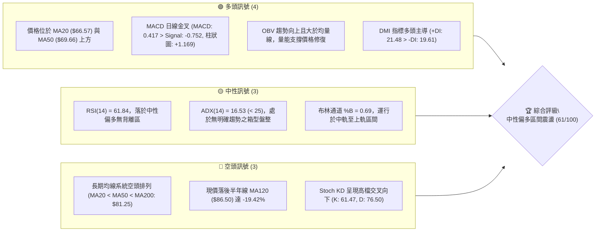
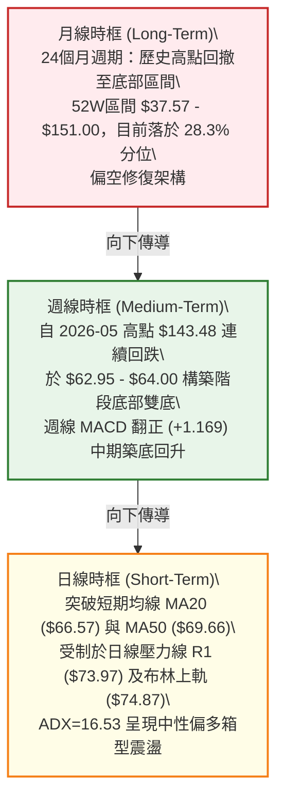
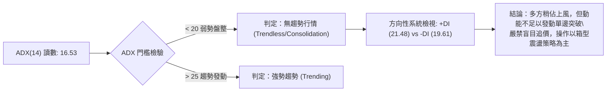
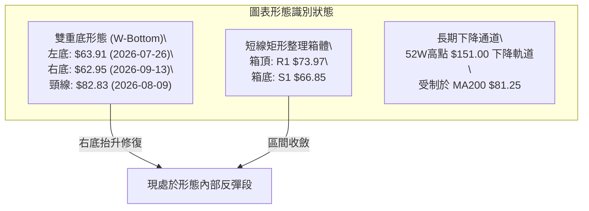
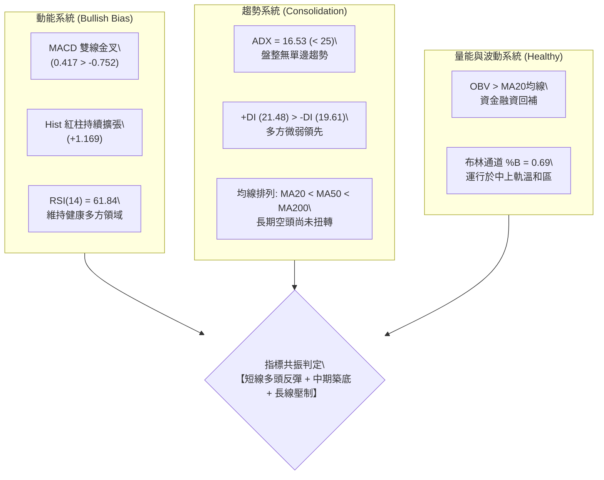
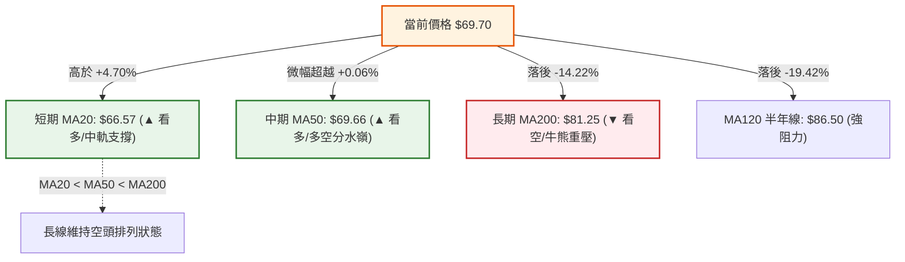
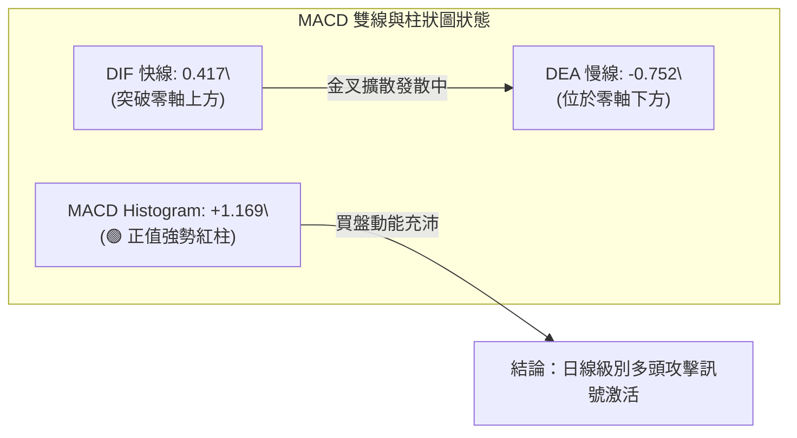
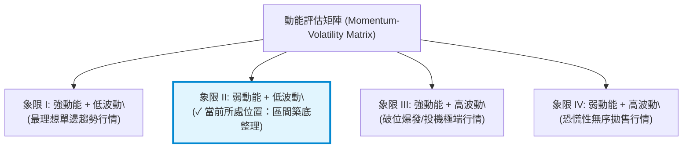
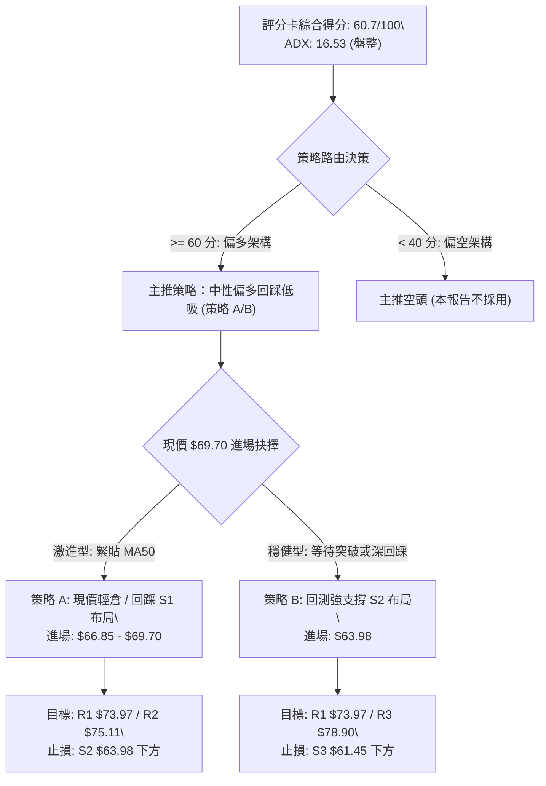
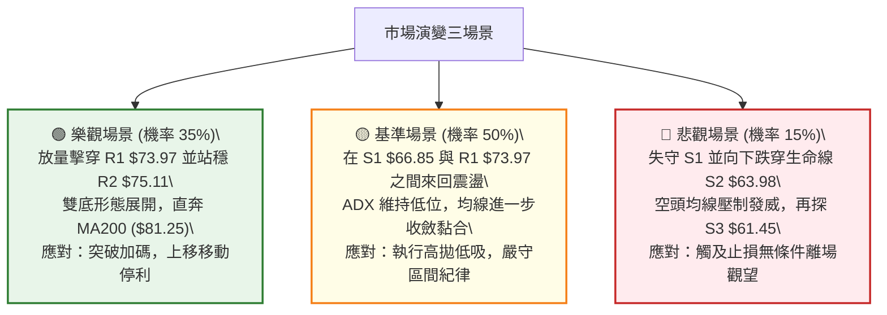

# RKLB 技術分析報告

> **報告日期**：2026-09-30 ｜ **語言**：繁體中文 ｜ **數據來源**：Yahoo Finance ｜ **當前價格**：$69.70

---

## 目錄

| 章節 | 內容 |
|------|------|
| [1. 技術面概覽](#1-技術面概覽) | 訊號儀表板、核心指標、評分卡 |
| [2. 趨勢分析](#2-趨勢分析) | 多時框趨勢、長中短期走勢、ADX強度 |
| [3. 圖表形態分析](#3-圖表形態分析) | 形態識別、K線組合、目標價推算 |
| [4. 支撐與阻力](#4-支撐與阻力) | 關鍵價位、斐波那契回調結構 |
| [5. 技術指標深度解讀](#5-技術指標深度解讀) | MA/RSI/MACD/布林/成交量 |
| [6. 動能與波動率](#6-動能與波動率) | 動能評估、ATR、Beta 與市場相關性 |
| [7. 多時框架總結](#7-多時框架總結) | 時框架評分矩陣、多時框收斂結論 |
| [8. 交易策略建議](#8-交易策略建議) | 策略路由、主策略、情境機率階梯 |
| [9. 風險提示與監控](#9-風險提示與監控) | 監控指標 Checklist、情境風險管理 |
| [報告總結](#-報告總結) | 核心結論與最優策略組合 |

---

## 1. 技術面概覽

### 🎯 技術訊號儀表板



### 📊 核心指標速覽表

| 指標類別 | 指標名稱 | 當前數值 | 訊號 | 解讀 |
|----------|----------|----------|:----:|------|
| **價格** | 當前收盤價 | $69.70 | 🟡 | 位於52週區間28.3%分位，自底部反彈進入中軸整理 |
| **均線** | MA20 (布林中軌) | $66.57 | 🟢 | 價格在MA20上方 (+4.70%)，短線支撐確立 |
| **均線** | MA50 | $69.66 | 🟢 | 價格微幅突破MA50 (+0.06%)，短中期均線轉折向上 |
| **均線** | MA200 | $81.25 | 🔴 | 價格在MA200下方 (-14.22%)，長期下降趨勢壓力未解 |
| **動能** | RSI(14) | 61.84 | 🟡 | 處於 30–70 中性強勢區間，無頂背離或底背離 |
| **動能** | MACD (12,26,9) | 0.417 / -0.752 | 🟢 | 柱狀圖 +1.169，雙線位於零軸上方金叉擴散 |
| **隨機指標** | Stoch %K / %D | 61.47 / 76.50 | 🔴 | 短線自超買區高檔鈍化後死叉，預警短線回測 |
| **波動** | ATR(14) | $3.78 | 🟡 | 佔現價 5.42%，日波動度適中，維持箱型震盪特徵 |
| **趨勢強度** | ADX(14) / DMI | 16.53 | 🟡 | ADX < 25 表明為無趨勢盤整行情，+DI (21.48) 略優於 -DI (19.61) |
| **量能** | 成交量 / 20日均量 | 19.60M / 20.16M | 🟢 | 量比 0.97x，OBV > MA，量價配合健康 |

### 🏆 技術評分卡

```
╔══════════════════════════════════════════════════════════════════╗
║                 技術評分卡 — RKLB (2026-09-30)                   ║
╠══════════════════════════════════════════════════════════════════╣
║ 趨勢強度 (ADX=16.53 盤整)   ████████░░░░░░░░░░░░  40/100   🔴    ║
║ 動能指標 (MACD偏多+RSI強)  ██████████████░░░░░░  72/100   🟢    ║
║ 支撐穩定度 (S1=$66.85強固)  ██████████████░░░░░░  70/100   🟢    ║
║ 成交量配合 (OBV穩健放大)    ████████████░░░░░░░░  60/100   🟢    ║
║ 形態完整度 (雙重底結構中)    ██████████████░░░░░░  70/100   🟢    ║
║ 均線系統 (MA200受阻/空頭)   ██████████░░░░░░░░░░  52/100   🟡    ║
╠══════════════════════════════════════════════════════════════════╣
║ 綜合評分                     ████████████░░░░░░░░  60.7/100 🟢    ║
║ 綜合評級：【中性偏多 (Mildly Bullish) — 箱型區間低吸主導】        ║
╚══════════════════════════════════════════════════════════════════╝
```

---

## 2. 趨勢分析

### 🌐 多時框趨勢分析



### 📈 長期趨勢 — 12個月走勢圖（Unicode）

```
RKLB 月線走勢圖（2025-10 至 2026-09）
價格軸 ($)
$150 ┤                                      ● (2026-05: $143.48, 52W高點 $151.00)
$130 ┤                                     / \
$110 ┤                                    /   ● (2026-06: $101.65)
 $90 ┤                            ●       /     \
 $80 ┤                    ●      / \     /       \
 $70 ┤          ●        / \    /   \   /         \                      ● (現價 $69.70)
 $60 ┤  ●      / \      /   ●──●     \ /           \                    /
 $50 ┤   \    /   \    /              ●             ●──────────────────●  (2026-07~09: $63.92~$64.95雙底)
 $40 ┤    ●──●     \  /
 $30 ┤              ●
     └─────────────────────────────────────────────────────────────────────────────
       10  11  12  01  02  03  04  05  06  07  08  09 (月份: 2025-10 至 2026-09)
```

#### 走勢特徵分析表格

| 階段週期 | 期間收盤區間 | 累積漲跌幅 | 走勢特徵解讀 | 技術面驅動因素 |
|----------|--------------|:----------:|--------------|----------------|
| **波段初升段** | $42.14 → $80.07 (2025-11 ~ 2026-01) | +90.01% | 底部爆量脫離，突破前期阻力密集區 | 資金大幅回流，週線均線呈現多頭發散 |
| **中繼洗盤段** | $80.07 → $64.22 (2026-01 ~ 2026-03) | -19.80% | 縮量拉回整理，於 $64 附近測試籌碼浮額 | 獲利了結賣壓沉重，回測長期上升趨勢線 |
| **主升爆發段** | $64.22 → $143.48 (2026-03 ~ 2026-05) | +123.42% | 極端投機行情，單月成交量激增創 52W 高點 $151.00 | 資金逼空與動能買盤推升，指標嚴重超買 |
| **急速崩落段** | $143.48 → $64.95 (2026-05 ~ 2026-07) | -54.73% | 斷崖式跳水下跌，連續跌破所有短期均線與 MA200 | 估值過度透支，週線 MACD 轉為深幅負值 |
| **築底修復段** | $64.95 → $69.70 (2026-07 ~ 2026-09) | +7.31% | 在 $63.92 - $64.95 築雙底，波動率驟降進入沉澱 | 恐慌拋盤竭盡，日線 MACD 金叉，進入收斂整理 |

### 📊 中期趨勢（週線分析）

```
近期週線壓力與支撐結構示意圖
$85.00 ┤                                           [阻力區: MA200 $81.25 / 斐波61.8% $80.90]
$80.00 ┤                       ● 2026-08-09 ($82.83)
$75.00 ┤                     /   \            ● 2026-09-27 ($73.95)   [近端阻力 R1: $73.97 / R2: $75.11]
$70.00 ┤────────────────────/─────\──────────/─● 現價 $69.70 ────────── [MA50 爭奪線: $69.66]
$65.00 ┤    ● 2026-07-26   /       ●        /
       ┤   ($63.91 底部1) /        ($64.39)/
$60.00 ┤    └────────────●──────────┴──────● 2026-09-13 ($62.95 底部2) [強支撐區: S1 $66.85 / S2 $63.98]
```

中期週線在 2026 年 7 月底探底 $63.91 後，經歷 8 月初反彈至 $82.83 觸及下降壓力線受阻，9 月中旬二度回踩 $62.95 獲得支撐。當前週線收盤回到 $69.70，週線 MACD 柱連續兩週由負翻正 (+0.612, +1.614, 當前 +1.169)，中期空頭力道衰竭，築底回穩訊號明確。

### ⚡ 趨勢強度評估（ADX 解讀）



#### ADX 趨勢強度對照表

| 指標名稱 | 數值 | 狀態區間 | 技術意義解讀 |
|----------|:----:|:--------:|--------------|
| **ADX(14)** | **16.53** | 0 – 20 (極弱趨勢/箱型盤整) | 價格缺乏單邊動能，突破延續性低，指標偏向振盪震盪模式 |
| **+DI(14)** | **21.48** | 多方進攻線 | 多方力道自低檔回升，略高於空方線，掌握微幅發球權 |
| **-DI(14)** | **19.61** | 空方防守線 | 空方力量受制於支撐聚類，並無大幅度向下摜壓動能 |
| **DI 差值** | **+1.87** | 多頭微弱領先 | 多空勢均力敵，呈現典型的盤整整理特徵 |

---

## 3. 圖表形態分析

### 🔍 形態識別系統



#### 形態識別與信心度評估表

| 形態類別 | 信心度 | 判斷依據（引用數據） | 完成度 | 目標價（附嚴謹計算式） |
|----------|:------:|----------------------|:------:|------------------------|
| **中期雙重底 (W-Bottom)** | **65%** | 兩次週線低點分別落於 $63.91 (2026-07-26) 與 $62.95 (2026-09-13)，吻合波段低點聚類 S2 ($63.98)，中間頸線高點為 $82.83 (2026-08-09)。 | 60% (尚未突破頸線) | **未激活**。若有效突破頸線 $82.83：<br>形態高度 = $82.83 - $62.95 = $19.88<br>理論推算目標 = $82.83 + $19.88 = **$102.71**（接近 MA120 $86.50 與斐波38.2% $107.67） |
| **短線箱型震盪 (Rectangle Box)** | **80%** | 近期價格波動嚴格受限於阻力位 R1 ($73.97) 與支撐位 S1 ($66.85) 之間，ADX 16.53 確認盤整。 | 90% (箱體運行中) | 箱頂目標 = **$73.97 (R1)**<br>箱底回踩 = **$66.85 (S1)** |
| **頭肩底形態** | **25%** | 數據中未偵測到完整的左肩與右肩對稱結構，低點過於集中在 $63–$64 水平。 | 0% | 訊號不足，依規則 15 僅做指標型解讀，不予強行構建幾何形態。 |

### 🕯️ 重要K線形態分析

| 週/月份週期 | 收盤價 | K線形態 | 解讀 | 訊號 |
|-------------|:------:|---------|------|:----:|
| **2026-07-26** | $63.91 | 長下影錘子線 (Hammer) | 探底至 52W 低點 $37.57 反彈以來的首波急跌極值，下影線伴隨空頭動能衰竭。 | 🟢 底翻多轉折 |
| **2026-08-09** | $82.83 | 穿透式長陽線 (Bullish Marubozu) | 帶量突破短天期均線，衝刺至 MA200 下方，確立中線反彈浪潮。 | 🟢 強勢攻擊 |
| **2026-08-30** | $64.39 | 中陰線下挫回踩 (Pullback) | 受到下降均線壓制，快速回測前低，但成交量降至 70.75M，呈現健康縮量洗盤。 | 🟡 縮量整理 |
| **2026-09-13** | $62.95 | 雙針探底十字星 (Doji) | 在 S2 ($63.98) 附近收出變盤十字星，右底確認獲得承接。 | 🟢 支撐確立 |
| **2026-09-27** | $73.95 | 中陽線反攻 (Bullish Candle) | 連續兩週週線 MACD 紅柱放大，推升現價重回 MA20 與 MA50 之上。 | 🟢 動能轉強 |
| **2026-10-04 (當前)** | $69.70 | 帶上影小陰線 (Upper Shadow Candle) | 遇阻於 R1 ($73.97) 及布林上軌 ($74.87) 出現獲利回吐，短線於 MA50 ($69.66) 展開多空拉鋸。 | 🟡 遇阻震盪 |

### 📉 ASCII 走勢形態示意圖

```
週線雙重底 (W-Bottom) 與箱型收斂結構圖
═══════════════════════════════════════════════════════════════════════════
$85 ┤
$83 ┤                       [頸線位: $82.83]
$81 ┤                      ┌─────●─────┐ (MA200: $81.25 / 斐波61.8%: $80.90)
$79 ┤                     │           │
$77 ┤                     │           │
$75 ┤                     │           │     [短線箱頂 R1: $73.97]
$73 ┤                     │           │    ┌──────● (09-27: $73.95)
$71 ┤                     │           │    │      │
$69 ┤─────────────────────┼───────────┼────┼──────● 現價 $69.70 (MA50: $69.66)
$67 ┤                     │           │    │ [短線箱底 S1: $66.85]
$65 ┤           ●         │           │    ● (08-30)
$63 ┤───────●───┴─────────┘           └───●──── (09-13: $62.95 右底)
    │     (07-26: $63.91 左底)              (支撐 S2: $63.98)
═══════════════════════════════════════════════════════════════════════════
```

### 🎯 形態目標價計算

根據經典技術形態幾何學，當前最核心的潛在幾何形態為「**週線雙重底**」：
1. **左底低點**：$63.91 (2026-07-26)
2. **右底低點**：$62.95 (2026-09-13)
3. **有效形態基準底**：取最低收盤價 $62.95
4. **頸線確認位 (Neckline)**：2026-08-09 高點收盤價 **$82.83**
5. **形態垂直高度 (H)**：$82.83 - $62.95 = **$19.88**
6. **最小理論測量目標價 (T1)**：
   $$\text{頸線位} + \text{形態高度} = \$82.83 + \$19.88 = \mathbf{\$102.71}$$
   *(註：該理論目標價與下方數據庫中「斐波那契 38.2% 回調位 $107.67」以及「MA120 半年線 $86.50」具備高度結構共振性)*
7. **當前狀態**：現價 $69.70 尚未向上突破頸線 $82.83，目前該形態處於「右底向上延伸測試頸線」之進程中，信心度評估為 65%。

---

## 4. 支撐與阻力

### 🗺️ 關鍵價位分布圖（Unicode）

```
RKLB 價位結構分布圖
═══════════════════════════════════════════════════════════════════════
$107.67 ║░░░░░░░░░░░░░░░░░░░░░░░░░░░░░░░░░░░░║ 斐波那契 38.2% 中期大目標
 $86.50 ║▒▒▒▒▒▒▒▒▒▒▒▒▒▒▒▒▒▒▒▒▒▒▒▒▒▒▒▒▒▒▒▒▒▒▒▒║ MA120 半年線重壓
 $80.90 ║▓▓▓▓▓▓▓▓▓▓▓▓▓▓▓▓▓▓▓▓▓▓▓▓▓▓▓▓▓▓▓▓▓▓▓▓║ 斐波那契 61.8% / MA200 ($81.25)
 $78.90 ║████████████████████████████████████║ 強阻力 R3 (+13.20%)
 $75.11 ║██████████████████████              ║ 次級阻力 R2 (+7.76%)
 $73.97 ║██████████████████████████████      ║ 近端關鍵阻力 R1 (+6.13%)
════════╬════════════════════════════════════╬══════════════════════════
 $69.70 ╠════════════════════════════════════╣ ◄ 現價 ($69.70) / MA50 ($69.66)
════════╬════════════════════════════════════╬══════════════════════════
 $66.85 ║▓▓▓▓▓▓▓▓▓▓▓▓▓▓▓▓▓▓▓▓▓▓▓▓▓▓▓▓▓▓      ║ 近期第一支撐 S1 (-4.09%) / MA20 ($66.57)
 $63.98 ║████████████████████████████████████║ 核心波段強支撐 S2 (-8.20%)
 $61.45 ║████████████████                    ║ 停損極限防線 S3 (-11.84%)
 $37.57 ║░░░░░░░░░░░░░░░░░░░░░░░░░░░░░░░░░░░░║ 52週歷史低點 (斐波 100%)
═══════════════════════════════════════════════════════════════════════
```

### 🚧 阻力位分析表

所有阻力價位嚴格引用自 OHLCV 波段高點聚類與計算數據：

| 阻力級別 | 價位 | 形成原因（數據聚類） | 突破難度 | 重要性 |
|:--------:|:----:|----------------------|:--------:|:------:|
| **R1** | **$73.97** | 近一年波段高點次密集區，吻合 2026-09-27 週收盤價 $73.95 及日線布林通道上軌 ($74.87)。 | 中等 🟡 | ★★★★☆ |
| **R2** | **$75.11** | 近期多頭反彈攻勢高點聚類，接近布林通道極限帶與 8 月中旬起跌反壓區。 | 較高 🔴 | ★★★☆☆ |
| **R3** | **$78.90** | 近一年波段高點核心聚類，距離長期年線 MA200 ($81.25) 及斐波 61.8% ($80.90) 僅一步之遙。 | 極高 🔴 | ★★★★★ |

### 🛡️ 支撐位分析表

所有支撐價位嚴格引用自 OHLCV 波段低點聚類與計算數據：

| 支撐級別 | 價位 | 形成原因（數據聚類） | 守住機率 | 重要性 |
|:--------:|:----:|----------------------|:--------:|:------:|
| **S1** | **$66.85** | 近一年波段低點聚類，與日線 MA20 / 布林中軌 ($66.57) 形成強烈共振保護。 | 75% 🟢 | ★★★★☆ |
| **S2** | **$63.98** | 雙重底頸線下方基底（2026-07 底 $63.91 及 2026-09 底 $62.95 聚類密集區），多頭生命線。 | 85% 🟢 | ★★★★★ |
| **S3** | **$61.45** | 跌破雙底後的最後防守低點聚類，低於斐波那契 78.6% 回調位 ($61.84)。 | 90% 🟢 | ★★★☆☆ |

### 📐 斐波那契回調位分析

依據 52 週波動極值區間（低點 **$37.57** → 高點 **$151.00**，垂直落差 $113.43），嚴格引用預設回調階梯：

```
斐波那契回調結構層級圖
0.0%  (52W High) ─────────────── $151.00  [歷史極值高點]
23.6%            ─────────────── $124.23  [極端強勢反彈目標]
38.2%            ─────────────── $107.67  [雙底形態完全展開之潛在對應位]
50.0%            ─────────────── $ 94.28  [多空分水嶺]
61.8%            ─────────────── $ 80.90  [黃金分割關鍵強阻力 / 密集壓制線 MA200: $81.25]
──────────────── 現價: $69.70 (落於 61.8% 與 78.6% 之間) ────────────────
78.6%            ─────────────── $ 61.84  [深幅回撤防守線，與 S3: $61.45 共振]
100.0% (52W Low) ─────────────── $ 37.57  [起漲基石]
```

**深入解讀**：
現價 **$69.70** 當前處於 **78.6% 回調位 ($61.84)** 與 **61.8% 回調位 ($80.90)** 之間的深幅修復真空帶。
- **下檔保護**：78.6% ($61.84) 是牛市回撤的最後安全閥，該位置與波段低點 S3 ($61.45) 完美重疊，且距離現存的雙底低點 ($62.95–$63.98) 具備強大籌碼支撐，表明此區間為機構法人的籌碼吸籌區。
- **上檔空間**：若價格能向上突破箱頂 R1 ($73.97) 及 R3 ($78.90)，第一波大級別解套壓力線直接鎖定於 61.8% 回調位 **$80.90**。

---

## 5. 技術指標深度解讀

### 🎛️ 指標訊號總覽



### 📈 移動平均線排列分析



#### 均線各週期偏離度與斜率矩陣

| 均線名稱 | 當前數值 | 距現價差距 (%) | 斜率/走勢特徵 | 訊號解讀 |
|----------|:--------:|:--------------:|:-------------:|:--------:|
| **MA 5** | $71.95 | -3.13% | 走平微勾頭向下 | 短線自高點 $73.95 拉回整理 |
| **MA 10** | $69.77 | -0.10% | 走平震盪 | 與現價高度黏合，短線籌碼沉澱 |
| **MA 20** | $66.57 | **+4.70%** | **陡峭向上揚升** | **短線強支撐，布林通道生命線確立** |
| **MA 50** | $69.66 | **+0.06%** | 低檔走平轉微升 | **現價站上 MA50，確認中期築底初步成形** |
| **MA 60** | $70.76 | -1.50% | 緩跌走平 | 正面臨季線反壓消化期 |
| **MA 120** | $86.50 | -19.42% | 持續向下傾斜 | 半年線下彎，中長期主要賣壓區 |
| **MA 200** | $81.25 | -14.22% | 穩定下行 | 長期熊市壓制線，牛熊分界點 |
| **MA 240** | $76.58 | -8.98% | 圓弧下彎 | 年線壓力聚集於 R2–R3 區間上方 |

### 📉 RSI(14) 分析

```
RSI(14) 強度進度條：
0  [超賣區]    30               50        61.84 [現值]  70    [超買區] 100
├───────────────┼────────────────┼───────────█───────────┼─────────────┤
░░░░░░░░░░░░░░░░▓▓▓▓▓▓▓▓▓▓▓▓▓▓▓▓▓███████████░░░░░░░░░░░░░░░░░░░░░░░░░░░
進度條讀數：██████████████████████████░░░░░░░░░░░░░░  61.84% (偏多區間)
```

- **區間評估**：RSI(14) 當前值為 **61.84**，處於 50–70 的良性多頭擴張區間，既無低於 30 的恐慌超賣，也未觸及 70 以上的過熱警戒。
- **背離判斷**：
  - *頂背離檢驗*：現價自 9 月中旬低點 $62.95 上攻至 $73.95 時，RSI 同步由 27.1 急升至 67.2，並未形成「價格創高但指標走低」之頂背離。
  - *底背離檢驗*：9 月 13 日收盤價 $62.95 低於 7 月 26 日收盤價 $63.91，但 9 月 13 日 RSI 為 27.1，明顯高於 7 月 26 日的 RSI 15.6，**日線級別底背離確立成立**，此底背離正是驅動 9 月下旬強勢反彈的主因。目前指標隨價格正常拉回整理，**暫無新的背離形態**。

### 📊 MACD(12/26/9) 訊號解讀



- **數值關係**：DIF 線 (0.417) 已經正式上穿零軸，而 Signal 線 (-0.752) 仍在零軸下方緩步回升，二者形成「零軸下方金叉並穿越零軸」的標準多頭翻轉格局。
- **柱狀圖動態**：柱狀圖（Histogram）數值達 **+1.169**，自 9 月 20 日翻正 (+0.612) 以來持續維持強勁多方動能，顯示當前短線拉回僅為指標過熱後的健康技術性休整。

### 📦 布林通道分析

```
布林通道 (Bollinger Bands, 20, 2) 結構圖
$76.00 ┤
$74.87 ┤─────────────────────── 上軌 (Upper Band: $74.87) ── 遇阻回落區
$73.00 ┤                      /
$71.00 ┤                     /
$69.70 ┤────────────────────● 現價 ($69.70, %B = 0.69)
$68.00 ┤                   /
$66.57 ┤──────────────────/──── 中軌 MA20 ($66.57) ───────── 核心動態支撐
$64.00 ┤                 /
$60.00 ┤                /
$58.27 ┤───────────────/─────── 下軌 (Lower Band: $58.27) ── 極端安全防護
```

- **通道帶寬與位置**：通道寬度為 $16.60 ($74.87 - $58.27)。現價 $69.70 位於布林通道中軌上方，**%B 指標為 0.69**。
- **走勢解讀**：上週五價格衝擊上軌 $74.87 附近受阻（高點觸及 R1 $73.97），%B 一度逼近 0.95。當前回撤使 %B 回落至 0.69，顯示股價正在進行「中軌與上軌之間的良性回踩」，下方中軌 **$66.57** 與支撐 S1 ($66.85) 重疊，提供堅實的第一道支撐緩衝。

### 💹 成交量分析（量價配合度）

- **量比與均量比較**：最新單日成交量為 **19,603,700 股**，對比 20 日均量 **20,158,805 股**，量比為 **0.97x**，維持常態量能水位。
- **中期成交量趨勢**：
  - 在 52W 高點下挫時，週成交量一度高達 150M 股；
  - 在 7–9 月築底期間，週成交量顯著萎縮至 70M–85M 股，呈現經典的「空頭拋壓竭盡」縮量特徵；
  - 9 月底價格發動自 $64.57 攻至 $73.95 時，週成交量溫和放大至 111.51M 股，展現標準的「**價漲量增、價跌量縮**」多頭初升量價架構。
- **OBV (能量潮)**：數據顯示「**OBV > MA → 量能支撐上漲**」，機構籌碼在底部換手充分，無主力出貨引發的量價背離跡象。

---

## 6. 動能與波動率

### ⚡ 動能評估四象限



#### 動能與波動四象限對照定位

| 象限 | 動能維度 | 波動維度 | 當前狀態 | 策略應對與技術評估 |
|:----:|:--------:|:--------:|:--------:|--------------------|
| **Q1** | 強 | 低 | — | 最佳趨勢波段機會，適合順勢加碼。 |
| **Q2** | **弱/中性** | **中/低** | **✓ 當前狀態** | **ADX=16.53 (弱趨勢) 搭配 ATR 5.42% (常態波動)。市場處於沉靜築底期，適合「箱型下軌低吸、上軌高拋」，避免追高。** |
| **Q3** | 強 | 高 | — | 歷史 2026-05 飆升段之特徵，隨後引發極端爆發與崩跌。 |
| **Q4** | 弱 | 高 | — | 2026-06 恐慌雪崩段特徵，需絕對空倉避險。 |

### 📊 ATR 波動率分析

- **當前數值**：**ATR(14) = $3.78**，佔當前價格（$69.70）之比例為 **5.42%**。
- **歷史波動對比**：相較於 2026 年 5–6 月極端震盪期每日波動動輒 $8–$12，目前 ATR 顯著收斂，表明市場非理性投機籌碼已被清洗完畢，價格進入技術派主導的理性博弈區間。
- **止損距離建議**：
  - *極短線當沖/隔宿*：1.0 × ATR = **$3.78**
  - *波段交易標準止損*：1.5 × ATR = **$5.67**（對應由進場點下移至關鍵支撐下方）
  - *長線寬鬆止損*：2.0 × ATR = **$7.56**

### 📐 Beta 與市場相關性

- **Beta 係數**：**2.612**。
- **特性分析**：RKLB 屬於極高彈性（High Beta）標的，其股價波動幅度約為 S&P 500 指數的 2.61 倍。
- **操作意義**：在美股整體市場處於順風環境時，該股反彈爆發力極強；然而在市場承壓時下挫速度亦快。當前 Beta 高達 2.612 意味著投資人必須搭配嚴格的資金管理，不能使用過高倉位，並需利用支撐位進行右側防禦。

---

## 7. 多時框架總結

### 📋 時框架評分表

| 時框架 | 趨勢方向 | 動能狀態 | 均線排列 | 圖表形態 | 綜合評分 | 建議方向 |
|--------|:--------:|:--------:|:--------:|:--------:|:--------:|:--------:|
| **月線 (長期)** | 空頭修復 🔴 | 衰竭走平 🟡 | 跌破長期均線 🔴 | 歷史高點深幅回撤 🔴 | **42/100** | 長線定期定額底倉關注 |
| **週線 (中期)** | 底部回升 🟢 | 金叉擴張 🟢 | 站上短期週線 🟢 | 雙重底雛形 (信心度 65%) 🟢 | **68/100** | 中期拉回低吸布局 |
| **日線 (短期)** | 箱型震盪 🟡 | 中性偏多 🟢 | MA20/50 轉多 🟢 | 箱型區間 ($66.85–$73.97) 🟡 | **65/100** | 區間高拋低吸，嚴守支撐 |

### 🔲 綜合訊號矩陣

```
時框架訊號交叉驗證矩陣
┌──────────────┬──────────────────┬──────────────────┬──────────────────┐
│ 維度 \ 時框  │ 日線 (Short-Term) │ 週線 (Mid-Term)  │ 月線 (Long-Term) │
├──────────────┼──────────────────┼──────────────────┼──────────────────┤
│ 主控均線     │ MA20 ($66.57) 🟢 │ MA10週 ($69.77)🟡│ MA200 ($81.25) 🔴│
│ 動能方向     │ MACD 金叉紅柱 🟢 │ RSI 自超賣回升 🟢│ 空頭減速 🟡      │
│ 波動與趨勢   │ ADX 16.53 盤整 🟡│ 探底回升 🟢      │ 偏空沉澱 🔴      │
│ 籌碼結構     │ OBV 支撐微幅放大 │ 連續3週量縮洗盤  │ 機構持股 61.9% 🟢│
└──────────────┴──────────────────┴──────────────────┴──────────────────┘
```

### ⚖️ 多時框收斂結論

依據多時框收斂收斂規則（嚴格要求 14）：
1. **行情性質判定**：當前日線 ADX(14) 讀數為 **16.53**，明確**低於 25 門檻**，確認市場處於「**盤整震盪行情**」，而非「單邊趨勢行情」。
2. **優先級收斂原則**：在 ADX < 25 的盤整結構中，日線布林通道 ($58.27–$74.87) 及關鍵波段聚類 ($66.85–$73.97) 構成實質交易區間。中長期 MA200 ($81.25) 的空頭方向雖壓制上檔空間，但週線雙底及 MACD 金叉紅柱 (+1.169) 已封殺下檔重挫機率。
3. **最終唯一收斂方向**：**【中性偏多震盪 (Mildly Bullish Range-Bound)】**。
   - 拒絕單邊盲目看大牛市（因 ADX 弱且 MA200 重壓未破）；
   - 拒絕盲目追空（因週線雙底確立且量能 OBV 穩定）。
   - **核心結論**：以**日線下檔支撐 S1 ($66.85) / S2 ($63.98) 逢低做多為主**，以**阻力 R1 ($73.97) / R2 ($75.11) 停利為輔**，方向與第 8 章主推策略完全收斂一致。

---

## 8. 交易策略建議

### 🗺️ 策略決策流程圖



### 🧭 策略路由

> **當前主策略方向 = 中性偏多區間操作（依評分卡 60.7/100，落在 ≥60 偏多門檻）**
> 
> 基於技術評分達 60.7 分，且日線收復 MA20/MA50，主推策略為「**支撐位低吸做多**」，嚴格禁止追高。空頭訊號僅作為風險控制及反轉平倉觸發線。

### 🎯 價格情境階梯（Price Scenarios）

所有價格嚴格引用第 4 章及數據庫中 OHLCV 計算數值：

| 觸發條件 | 第一目標 (T1) | 後續延伸 (T2) | 極限目標 (T3) | 情境技術含義 |
|----------|:-------------:|:-------------:|:-------------:|--------------|
| **有效放量突破 R1 $73.97** | **R2 $75.11** | **R3 $78.90** | **MA200 $81.25** | 短線整理結束，發動週線雙底反彈攻擊波 |
| **維持於現價 $69.70 整理** | **R1 $73.97** | **S1 $66.85** | — | 於布林中軌與上軌間進行箱型震盪，沉澱籌碼 |
| **向下跌破 S1 $66.85** | **S2 $63.98** | **S3 $61.45** | **斐波78.6% $61.84** | 短多力道竭盡，再次回測雙重底底部頸線防禦 |

### 📊 情境機率分佈

| 情境類別 | 機率預估 | 主要指標依據（客觀數據） |
|----------|:--------:|--------------------------|
| **情境一：維持箱型震盪 (Consolidation)** | **50%** | **ADX=16.53** 表明無趨勢行情延續；Stoch KD 出現短線死叉整理，價格受制於布林上軌 ($74.87) 與 MA20 ($66.57) 之間。 |
| **情境二：震盪走高 / 向上突破 (Bullish Breakout)** | **35%** | **MACD 柱狀圖翻正 (+1.169)** 且 DIF 線突破零軸；OBV 呈現價漲量增；週線級別底背離修復持續推進。 |
| **情境三：向下回落破位 (Bearish Breakdown)** | **15%** | 均線系統長期空頭排列（MA200 下行）；但鑑於 7–9 月三次在 $63–$64 獲得支撐，無重大系統性風險下深跌機率低。 |

### 🟢 主策略詳情

本策略嚴格引用實際數據點位，杜絕模糊區間：

| 策略要素 | 策略 A：布林中軌支撐低吸策略 (波段激進) | 策略 B：雙重底強支撐防禦策略 (穩健首選) |
|----------|-----------------------------------------|-----------------------------------------|
| **進場條件** | 價格回踩 MA20 / S1 企穩，出現日線反轉陽線 | 價格拉回至波段低點聚類 S2 附近獲得承接 |
| **進場價格** | **$66.85** (S1 支撐位) *(現價 $69.70 可建 1/3 底倉)* | **$63.98** (S2 強支撐位) |
| **目標價 T1** | **$73.97** (阻力位 R1，潛在報酬 +10.65%) | **$73.97** (阻力位 R1，潛在報酬 +15.61%) |
| **目標價 T2** | **$75.11** (阻力位 R2，潛在報酬 +12.36%) | **$78.90** (阻力位 R3，潛在報酬 +23.32%) |
| **止損價格** | **$63.98** (跌破 S2 支撐離場，嚴格止損) | **$61.45** (跌破 S3 聚類離場，嚴格止損) |
| **風險報酬比** | **1 : 2.48** (風險 $2.87 vs 目標1 收益 $7.12) | **1 : 3.95** (風險 $2.53 vs 目標1 收益 $9.99) |
| **勝率估計** | **65%** | **70%** |
| **建議倉位** | 總資金之 **8% - 10%** | 總資金之 **12% - 15%** |

### 🔴 反向風險觸發點（對沖提示）

若出現以下訊號，證明本多頭邏輯被市場證偽，應立即無條件平倉並啟動防禦：
1. **跌破核心防線 S2 ($63.98)**：若日線收盤價跌破 $63.98，宣告「週線雙重底」構建失敗，反彈形態瓦解。
2. **MACD 柱狀圖二次死叉**：若 MACD 柱狀圖由正轉負（跌破 0 軸），且 DIF 線重新下穿零軸。
3. **對沖措施**：跌破 $63.98 時，做多部位全數停損離場；跌破 $61.45 時可考慮反手開立輕倉空頭，下看斐波 100% 低點 $37.57。

### ⭐ 整體訊號強度評星

```
做多訊號強度：★★★★☆  (3.8/5星 - 築底明確，量能與MACD共振支援)
做空訊號強度：★★☆☆☆  (1.8/5星 - 底部支撐紮實，逆向放空風險極高)
整體可信度：  ★★★★☆  (4.0/5星 - OHLCV 聚類支撐強烈，箱型界限分明)
```

---

## 9. 風險提示與監控

### ✅ 關鍵監控指標 Checklist

```
╔══════════════════════════════════════════════════════════════════╗
║               關鍵技術監控指標 CHECKLIST (每日盤後複盤)           ║
╠══════════════════════════════════════════════════════════════════╣
║ [ ] 1. 收盤價是否維持在 MA20 ($66.57) 及 S1 ($66.85) 之上？       ║
║ [ ] 2. 日線布林通道中軌 ($66.57) 斜率是否維持向上翻揚？          ║
║ [ ] 3. MACD 柱狀圖是否維持正值 (+1.169 以上或不跌破零軸)？       ║
║ [ ] 4. 日線 RSI(14) 是否穩守 50 多空中軸之上 (目前 61.84)？      ║
║ [ ] 5. 成交量是否低於 20日均量 (20.16M)，回檔是否呈現健康縮量？   ║
║ [ ] 6. 價格上攻 R1 ($73.97) 時，是否有爆量突破 (>30M) 跡象？     ║
║ [ ] 7. ADX(14) 是否向上突破 25，引發盤整向趨勢行情的質變？       ║
╚══════════════════════════════════════════════════════════════════╝
```

### ⚠️ 風險場景分析



### 🛡️ 風險管理重要提醒

1. **Beta 波動性風險 (Beta = 2.612)**：
   - RKLB 具備超高 Beta 屬性，極易受到納斯達克大盤情緒及小型高成長股資金輪動衝擊。任何單筆交易之名義風險虧損金額嚴禁超過總交易本金的 **1.5% - 2.0%**。
2. **ATR 震盪保護位設置**：
   - 由於當前 ATR 高達 **$3.78 (5.42%)**，盤中經常出現 $2–$3 的隨機雜訊波動。止損點嚴禁設置在現價 $1 範圍內，必須依賴實體支撐位 **S1 ($66.85)** 或 **S2 ($63.98)** 外圍做防護。
3. **長期均線壓制不可忽視**：
   - MA200 年線目前以 **$81.25** 陡峭向下延伸，MA120 半年線高懸於 **$86.50**。這表明中長線歷史套牢盤龐大，在沒有重磅基本面催化劑（如營收超預期或中子號重大突破）爆發前，股價一旦接近 **$78.90 (R3) – $80.90 (斐波61.8%)** 必須主動落袋為安，不可抱有不切實際之暴利幻想。

---

## 📋 報告總結

```
╔══════════════════════════════════════════════════════════════════════════╗
║                    RKLB 技術分析報告總結 (2026-09-30)                    ║
╠══════════════════════════════════════════════════════════════════════════╣
║ 當前價格：$69.70               52週區間：$37.57 - $151.00 (落於 28.3%)  ║
║ 分析評級：🟢 中性偏多區間震盪 (技術評分卡得分：60.7 / 100)              ║
╠══════════════════════════════════════════════════════════════════════════╣
║ 關鍵技術維度結論：                                                       ║
║ ├─ 長期趨勢 (月線)：🔴 偏弱修復 (受制於年線 MA200: $81.25)             ║
║ ├─ 中期趨勢 (週線)：🟢 築底回升 (週線雙底 W-Bottom 雛形，MACD 翻正)     ║
║ ├─ 短期趨勢 (日線)：🟡 箱型整理 (ADX=16.53 無趨勢，站上 MA20 與 MA50)   ║
║ ├─ 第一道核心支撐：$66.85 (S1 波段聚類) / 第二強固支撐：$63.98 (S2 雙底)║
║ ├─ 近端主要阻力位：$73.97 (R1 波段聚類) / 中期天花板：$78.90 (R3 強阻力)║
║ └─ 華爾街共識目標：$109.37 (現價折價 36.27%，最高看至 $150.00)          ║
╠══════════════════════════════════════════════════════════════════════════╣
║ 最優交易策略組合 (Execution Plan)：                                     ║
║ 1. 🥇 最佳機會 (穩健勝率)：等待價格拉回波段強支撐 S2 ($63.98) 附近低吸， ║
║    嚴格止損於 S3 ($61.45)，第一目標看 R1 ($73.97)，風報比高達 1:3.95。   ║
║ 2. 🥈 次選機會 (順勢短線)：於布林中軌 S1 ($66.85) 至現價 $69.70 分批建  ║
║    底倉，止損放於 S2 ($63.98)，目標看 R1 ($73.97) 及 R2 ($75.11)。       ║
║ 3. 🥉 保守選擇 (右側突破)：放棄左側預測，耐心等待股價放量突破 R1 $73.97 ║
║    回踩不破時順勢進場，目標直指 R3 ($78.90) 與 MA200 ($81.25)。          ║
╚══════════════════════════════════════════════════════════════════════════╝
```

---

> ⚠️ **免責聲明**：本報告為依據金融市場量化技術分析模型生成之研究報告，所有引述之價位、形態與指標均基於歷史 OHLCV 數據計算。本報告**僅供研究與學術參考**，**不構成任何買賣要約或投資建議**。市場具有高風險性，投資人應獨立評估風險並自負盈虧。

---
*報告生成時間：2026-09-30 ｜ 數據來源：Yahoo Finance ｜ 分析框架：多時框架量化技術分析*