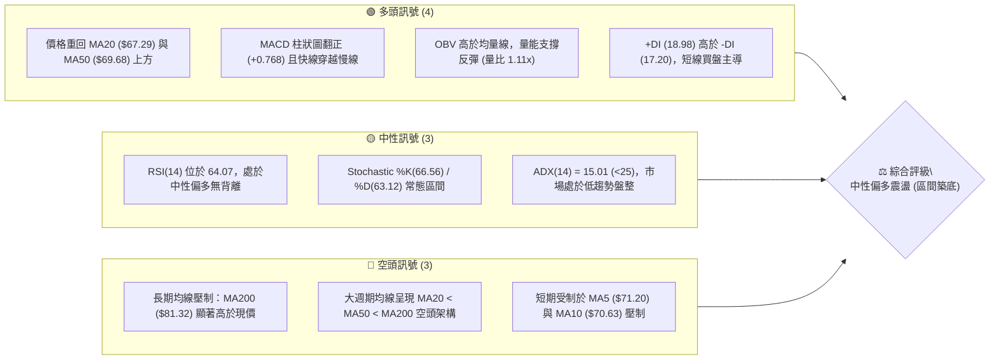
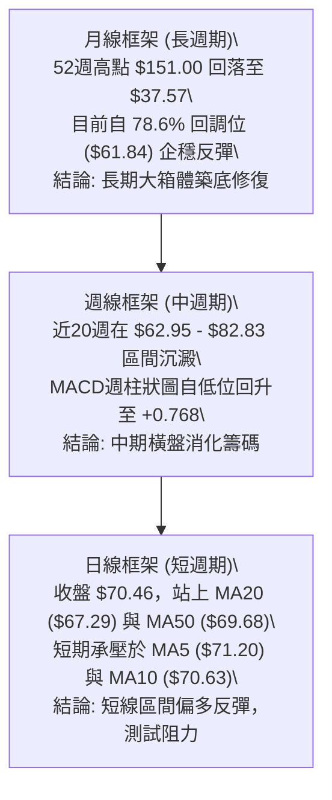
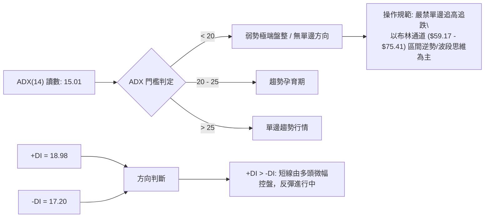
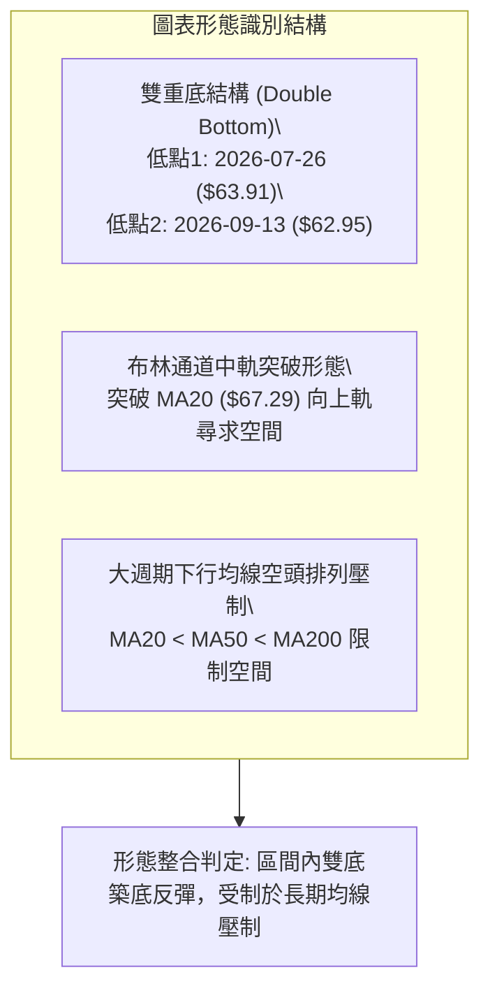
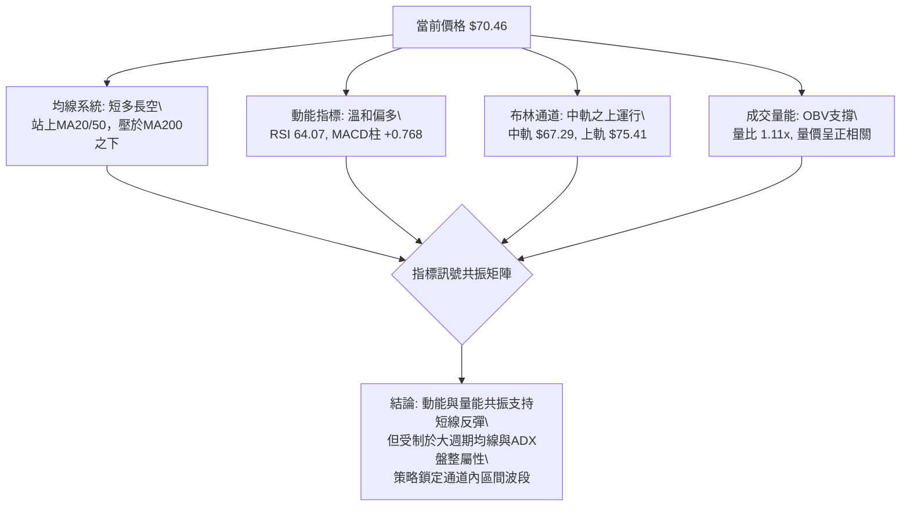
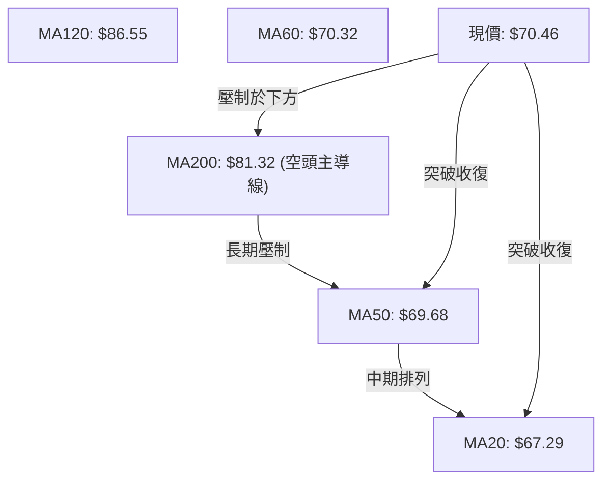
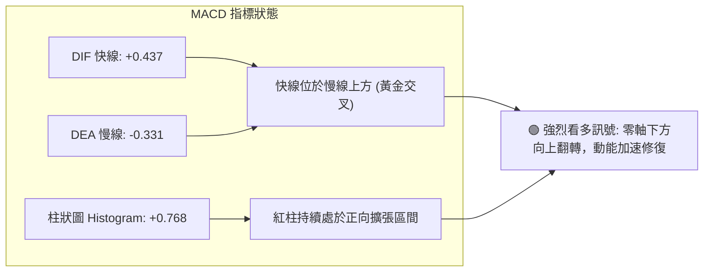
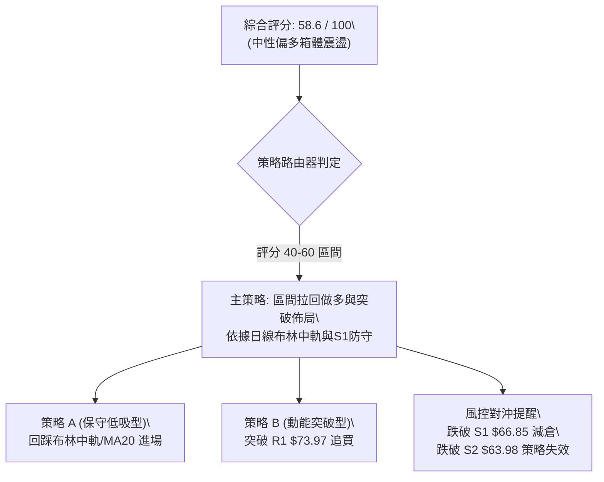
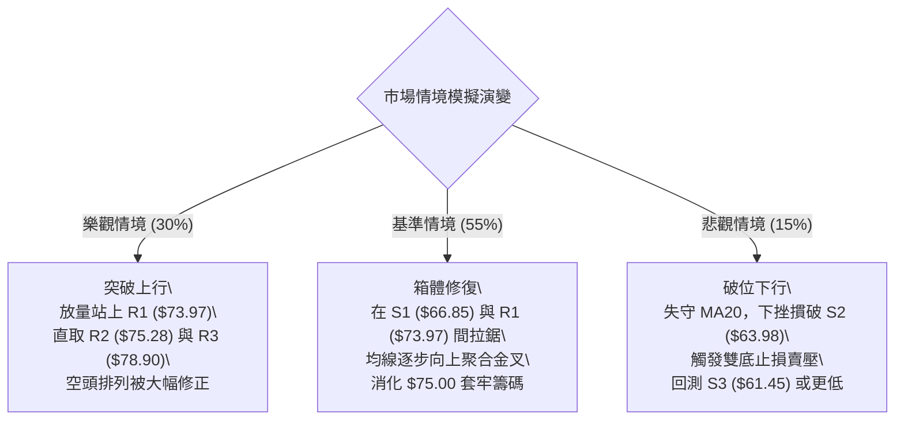

# RKLB 技術分析報告

> **報告日期**：2026-10-02 ｜ **語言**：繁體中文 ｜ **數據來源**：Yahoo Finance ｜ **當前價格**：$70.46

---

## 目錄

| 章節 | 內容 |
|------|------|
| [1. 技術面概覽](#1-技術面概覽) | 訊號儀表板、核心指標、評分卡 |
| [2. 趨勢分析](#2-趨勢分析) | 多時框趨勢、長中短期走勢 |
| [3. 圖表形態分析](#3-圖表形態分析) | 形態識別、K線組合、目標價 |
| [4. 支撐與阻力](#4-支撐與阻力) | 關鍵價位、斐波那契回調 |
| [5. 技術指標深度解讀](#5-技術指標深度解讀) | MA/RSI/MACD/布林/成交量 |
| [6. 動能與波動率](#6-動能與波動率) | 動能評估、ATR、Beta |
| [7. 多時框架總結](#7-多時框架總結) | 時框架評分矩陣 |
| [8. 交易策略建議](#8-交易策略建議) | 多空策略、風險報酬比 |
| [9. 風險提示與監控](#9-風險提示與監控) | 監控指標、風險場景 |

---

## 1. 技術面概覽

### 🎯 技術訊號儀表板



### 📊 核心指標速覽表

| 指標類別 | 指標名稱 | 當前數值 | 訊號 | 解讀 |
|----------|----------|----------|------|------|
| **價格** | 當前收盤價 | $70.46 | 🟡 | 位於52週區間29.0%，自底部$61.45-$62.95展開溫和修復 |
| **均線** | 短期 MA20 | $67.29 | 🟢 | 現價高於 MA20 達 +4.70%，短期底層均線形成動態支撐 |
| **均線** | 中期 MA50 | $69.68 | 🟢 | 現價剛收復 MA50 (+1.12%)，中期下行壓力暫時緩解 |
| **均線** | 長期 MA200 | $81.32 | 🔴 | 現價低於 MA200 達 -13.35%，長期結構仍處於修正格局 |
| **動能** | RSI(14) | 64.07 | 🟡 | 位於 50–70 強勢中性區間，未觸及超買，仍具反彈空間 |
| **動能** | MACD (12,26,9) | 0.437 / -0.331 | 🟢 | 快線突破慢線，柱狀圖 +0.768 持續擴張，看多共振 |
| **趨勢強度** | ADX(14) | 15.01 | 🟡 | ADX < 25 且數值偏低，代表無明確單邊趨勢，屬於箱體震盪 |
| **通道** | 布林通道 %B | 0.69 | 🟢 | 現價位於中軌($67.29)與上軌($75.41)之間，偏多格局運行 |
| **量能** | 20日成交量比 | 1.11x | 🟢 | 當日量能 23.21M 高於 20日均量 20.89M，呈現良性增量 |
| **波動** | ATR(14) | $3.91 | 🟡 | 每日平均震幅約 5.55%，波動度收斂後維持中等活躍度 |

### 🏆 技術評分卡

```
╔══════════════════════════════════════════════════════════════════╗
║               技術評分卡 — RKLB (2026-10-02)                     ║
╠══════════════════════════════════════════════════════════════════╣
║ 評估維度         進度條與得分                 訊號強度   評估權重║
╠══════════════════════════════════════════════════════════════════╣
║ 趨勢強度 (ADX)   █████░░░░░░░░░░░░░░░  32/100    🟡      15%     ║
║ 動能指標 (RSI/M) ██████████████░░░░░░  70/100    🟢      25%     ║
║ 支撐穩定度 (S1-3)█████████████░░░░░░░  65/100    🟢      20%     ║
║ 成交量配合 (OBV) ██████████████░░░░░░  72/100    🟢      15%     ║
║ 形態完整度 (結構)████████████░░░░░░░░  60/100    🟡      15%     ║
║ 均線排列 (多空序)████████░░░░░░░░░░░░  40/100    🔴      10%     ║
╠══════════════════════════════════════════════════════════════════╣
║ 綜合技術評分     ████████████░░░░░░░░  58.6/100   中性偏多 (區間) ║
╚══════════════════════════════════════════════════════════════════╝
```

---

## 2. 趨勢分析

### 🌐 多時框趨勢分析

依據多時框收斂原則，當前 ADX 為 15.01（顯著小於 25），顯示整體市場處於**中長期修正後的無趨勢箱體盤整週期**。此時日線走勢以布林通道與關鍵水平支撐阻力為主導，週線與月線則框定總體震盪邊界。



### 📈 長期趨勢 — 12個月走勢圖（Unicode）

```
RKLB 月線收盤走勢圖（過去12個月：2025-10 至 2026-10）
價格 ($)
$150 ┤                                      ● (2026-05: $143.48 / 高點$151.00)
$130 ┤                                     / \
$110 ┤                                    /   ● (2026-06: $101.65)
$90  ┤                    ● (2026-01: $80.07)  \
$80  ┤                   / \                  \
$70  ┤        ●         ●   ●                  ●━━━━● (現價 $70.46)
$60  ┤ ●     / \       /     \                /
$50  ┤  \   ●   ●━━━━━●       ● (2026-03)    ● (2026-07~09: $63.92-$69.68)
$40  ┤   ● (2025-11: $42.14)
$30  ┤
     └─┬────┬────┬────┬────┬────┬────┬────┬────┬────┬────┬────┬────
     10月 11月 12月 01月 02月 03月 04月 05月 06月 07月 08月 09月 10月
     2025                                                2026
```

#### 走勢特徵分析表格

| 階段週期 | 區間月份 | 價格起訖 | 漲跌幅 | 走勢特徵與技術含義 |
|----------|----------|----------|--------|--------------------|
| 階段一：主升脈衝 | 2025-11 → 2026-01 | $42.14 → $80.07 | +90.01% | 突破底部強勢單邊拉升，奠定年線底部基礎 |
| 階段二：中期蓄勢 | 2026-01 → 2026-03 | $80.07 → $64.22 | -19.80% | 獲利了結回踩，回測 $64.00 水平支撐確認 |
| 階段三：瘋狂主升 | 2026-03 → 2026-05 | $64.22 → $143.48 | +123.42%| 拋物線噴出，觸及52週最高價 $151.00，動能過熱 |
| 階段四：急跌去槓桿 | 2026-05 → 2026-07 | $143.48 → $64.95 | -54.73% | 大幅退潮，直接灌破 MA200，在斐波 78.6% ($61.84) 止跌 |
| 階段五：底層沉澱 | 2026-07 → 2026-10 | $64.95 → $70.46 | +8.48%  | 交易量縮窄，在 $63.00–$75.00 構築均線糾纏箱體 |

### 📊 中期趨勢（週線分析）

```
近10週價格波動與密集籌碼帶分佈示意圖：
$82.83 ┤ ┌──────── 週線波段反彈頂部阻力 (2026-08-09 高點)
       │ │
$78.90 ┼─┼────── 阻力 R3 ($78.90) — 籌碼套牢平台下沿
$75.28 ┼─┼────── 阻力 R2 ($75.28) / 布林上軌 ($75.41)
$73.97 ┼─┼────── 阻力 R1 ($73.97) — 前週高點測試區
$70.46 ┼─*────── 當前價格 ($70.46) ─── 站上 MA50 ($69.68)
$67.29 ┼─┼────── 布林中軌 / MA20 ($67.29)
$66.85 ┼─┼────── 支撐 S1 ($66.85) — 短線拉回防守線
$63.98 ┼─┼────── 支撐 S2 ($63.98) — 8-9月波段低點核心支撐
$61.45 ┴─┴────── 支撐 S3 ($61.45) — 斐波那契 78.6% ($61.84) 防守底線
```

週線層面顯示，RKLB 在經歷了 2026 年 5 月底見頂 $151.00 後的急跌，於 7 月底至 9 月中旬在 $62.95–$64.57 區間形成多次觸底反彈，確立了 $63.98 附近為極為扎實的中期籌碼換手區。

### ⚡ 趨勢強度評估（ADX 解讀）



#### ADX 數值強度對照表

| 指標變數 | 當前讀數 | 門檻區間 | 趨勢屬性判定 | 市場操作意涵 |
|----------|----------|----------|--------------|--------------|
| **ADX(14)** | **15.01** | 0 – 20 | 極弱趨勢（箱體徘徊） | 趨勢跟隨策略失效，假突破機率高，宜高拋低吸 |
| **+DI** | **18.98** | 0 – 100 | 多方佔據主動 | 短線多頭力量略微抬頭，有利於測試上方阻力 |
| **-DI** | **17.20** | 0 – 100 | 空方壓制放緩 | 拋壓相較 6-7 月斷崖式下跌時已大幅耗盡 |
| **DI差值** | **+1.78** | - | 多空處於弱平衡 | 無法支持暴衝式單邊行情的啟動，確認震盪定位 |

---

## 3. 圖表形態分析

### 🔍 形態識別系統

在多時框結構中，RKLB 經歷從頂部回落後的底部修復，日線與週線出現水平築底對稱結構。



#### 圖表形態信心度評估表

| 形態類別 | 信心度 | 判斷依據（引用真實數據） | 完成度 | 目標價（附嚴格計算式） |
|----------|--------|--------------------------|--------|------------------------|
| **雙重底 (W底)** | **68%** | 兩次週線收盤低點為 2026-07-26 的 $63.91 與 2026-09-13 的 $62.95，支撐精確落在 S2 ($63.98) 附近；中間頸線高點為 2026-08-09 的週收盤 $82.83。 | 75%（價格已自底點回升至 $70.46） | 依形態高度計算：頸線 $82.83 + 形態高度($82.83 - $63.98 = $18.85) = **$101.68**（若有效突破頸線）；短線第一目標指向 R3 **$78.90**。 |
| **布林中軌修復** | **85%** | 現價 $70.46 明確站上布林中軌 MA20 ($67.29) 與 MA50 ($69.68)，%B 來到 0.69。 | 90% | 布林上軌壓制價位 **$75.41**（對應阻力 R2 $75.28 附近）。 |
| **頭肩底形態** | **35%** | 數據中左肩與右肩結構不對稱，無法確認頭肩形態。 | - | **訊號不足，僅做指標型解讀**，不強行預測。 |

### 🕯️ 重要K線形態分析

| 週/月份 | 收盤價 | K線形態特徵 | 量價關係解讀 | 多空訊號 |
|---------|--------|-------------|--------------|----------|
| 2026-05-31 | $143.48 | 巨量天花板倒錘頭/高位長上影 | 觸及 52W 高點 $151.00 後爆出 117.45M 巨量滯漲，多頭竭盡衰竭 | 🔴 極度看空 |
| 2026-07-26 | $63.91 | 長下影打底星線 | 跌至 RSI 15.6 超賣區，成交量 92.14M，空方動能首次受挫 | 🟢 底背離孕育 |
| 2026-08-09 | $82.83 | 報復性大陽線反彈 | 週漲幅顯著，MACD 柱翻正至 +2.940，確認階段性築底 | 🟢 短線爆發 |
| 2026-09-13 | $62.95 | 縮量二次探底假破底線 | 週成交量 85.20M，不破前低 $61.45 (S3)，形成第二隻腳 | 🟢 雙底確認 |
| 2026-09-27 | $73.95 | 實體中陽線突破 MA50 | 成交量擴大至 111.51M，買盤重新進場推動價格突破多條均線 | 🟢 多頭表態 |
| 2026-10-04 | $70.46 | 遇阻回踩確認孕線 (現行週) | 受壓於 R1 ($73.97)，量能收斂至 80.33M，屬於健康的均線回踩回測 | 🟡 震盪洗盤 |

### 📉 ASCII 走勢形態示意圖

```
雙重底（W底）頸線與阻力分佈結構：
$82.83 ┤              [頸線高點: 2026-08-09]
       │                 /\
$78.90 ┼─ ─ ─ ─ ─ ─ ─ ─ / ─\─ ─ ─ ─ ─ ─ ─ ─ ─ ─ [阻力 R3: $78.90]
$75.28 ┼─ ─ ─ ─ ─ ─ ─ ─/─ ─ \─ ─ ─ ─ ─ ─ ─ ─ ─ [阻力 R2: $75.28]
$73.97 ┼─ ─ ─ ─ ─ ─ ─ /─ ─ ─ \─ ─ ─ ─ ─ ▲ [前週高點 R1: $73.97]
$70.46 ┼─ ─ ─ ─ ─ ─ ─/─ ─ ─ ─ \─ ─ ─ ─ ─* [現價: $70.46 站上MA50]
$67.29 ┼─ ─ ─ ─ ─ ─ /─ ─ ─ ─ ─ \─ ─ ─ ─ /  [布林中軌 MA20: $67.29]
$63.98 ┼─ ─ ─●─ ─ ─/─ ─ ─ ─ ─ ─\─ ─ ─ ● ─ ─[支撐 S2: $63.98 (第一底與第二底)]
       │   低點1: 07-26          低點2: 09-13
$61.45 ┴─────($63.91)─────────────($62.95)───[支撐 S3: $61.45]
```

### 🎯 形態目標價計算

1. **短線形態目標（布林通道修復目標）**：
   - 形態基礎：MA20 支撐確認，自中軌 $67.29 發起攻擊。
   - 計算式：直接指向布林上軌與近一年波段高點聚類。
   - **目標價 1 = $73.97 (阻力 R1)**，若突破則進一步指向 **$75.28 (阻力 R2 / BB 上軌 $75.41)**。
2. **中期雙底突破測算目標**：
   - 形態底部：S2 低點聚類 = **$63.98**。
   - 形態頸線：2026-08-09 波段高點 = **$82.83**。
   - 形態高度：$82.83 - $63.98 = **$18.85**。
   - 向上測算目標：頸線 $82.83 + $18.85 = **$101.68**（此數值須待突破頸線方能啟動）。
   - 當前處於左側至右側頸線過渡期，首要阻力為 R3 **$78.90**。

---

## 4. 支撐與阻力

### 🗺️ 關鍵價位分布圖（Unicode）

```
RKLB 價位結構分佈圖
═══════════════════════════════════════════════════════════════════
$81.32  ║██████████████████████████████║ 長期生命線 MA200 關鍵反轉點
$78.90  ║████████████████████████      ║ 強阻力 R3 (近一年波段高點聚類)
$75.41  ║▓▓▓▓▓▓▓▓▓▓▓▓▓▓▓▓▓▓▓▓▓▓        ║ 布林上軌動態壓制
$75.28  ║████████████████████          ║ 阻力 R2 (反彈延伸關鍵位)
$73.97  ║████████████████              ║ 關鍵阻力 R1 (前週高點聚類)
════════╠══════════════════════════════╣ ◄ 現價 $70.46 (位於 S1 與 R1 之間)
$69.68  ║░░░░░░░░░░░░░░░░░░░░          ║ 剛收復之中期 MA50
$67.29  ║▓▓▓▓▓▓▓▓▓▓▓▓▓▓▓▓▓▓▓▓▓▓        ║ 布林中軌 / MA20 動態支撐
$66.85  ║████████████████              ║ 近期支撐 S1 (短線波段回踩低點)
$63.98  ║████████████████████████      ║ 強支撐 S2 (雙底低點聚合帶)
$61.84  ║░░░░░░░░░░░░░░░░░░░░░░░░░░░░  ║ 斐波那契 78.6% 回調關鍵防線
$61.45  ║██████████████████████████████║ 核心支撐 S3 (52W區間最後多頭防線)
═══════════════════════════════════════════════════════════════════
```

### 🚧 阻力位分析表

依據系統 OHLCV 歷史數據計算出的波段高點聚類，阻力位分析如下：

| 阻力級別 | 價位 | 形成原因（數據依據） | 突破難度 | 重要性與技術意涵 |
|----------|------|----------------------|----------|------------------|
| **R1** | **$73.97** | 近一年波段高點聚類，對應 2026-09-27 週反彈高點 $73.95 密集群 | 中等 | 短線多頭試金石；突破此處代表短線震盪結束，轉為強勢反彈 |
| **R2** | **$75.28** | 近一年波段高點聚類，與當前日線布林上軌 ($75.41) 形成共振壓制 | 較高 | 中期通道頂部；空方主力防守重鎮，容易出現獲利回吐 |
| **R3** | **$78.90** | 近一年波段高點聚類，接近 2026-08 中旬之 $80.25 套牢成交帶 | 極高 | 頸線前哨站；若能攻克，將挑戰 MA200 ($81.32) 牛熊分界線 |

### 🛡️ 支撐位分析表

依據系統 OHLCV 歷史數據計算出的波段低點聚類，支撐位分析如下：

| 支撐級別 | 價位 | 形成原因（數據依據） | 守住機率 | 重要性與技術意涵 |
|----------|------|----------------------|----------|------------------|
| **S1** | **$66.85** | 近一年波段低點聚類，貼近布林中軌 MA20 ($67.29) 動態支撐 | 75% | 短期多頭生命線；守住此位代表短線反彈節奏未被破壞 |
| **S2** | **$63.98** | 近一年波段低點聚類，2026-07 ($63.91) 與 2026-08 ($64.39) 雙底平台 | 85% | 中期防守中樞；跌破代表雙底結構失敗，將引發停損拋壓 |
| **S3** | **$61.45** | 近一年波段低點聚類，與斐波那契 78.6% ($61.84) 形成底層重合區 | 92% | 長期絕對底線；一旦失守，價格將直奔 52週低點 $37.57 |

### 📐 斐波那契回調位分析

依據 52 週完整波動區間（高點 **$151.00**，低點 **$37.57**，垂直空間 **$113.43**）之黃金分割率精確分佈如下：

```
斐波那契回調層級標定：
100.0% ($151.00) ─────────────────────────────────── 52W 最高點
 23.6% ($124.23) ─────────────────────────────────── 大幅回吐阻力區
 38.2% ($107.67) ─────────────────────────────────── 中期多空平衡點
 50.0% ($94.28)  ─────────────────────────────────── 多空中樞線
 61.8% ($80.90)  ─────────────────────────────────── 黃金分割反彈關鍵阻力 (與MA200 $81.32共振)
 78.6% ($61.84)  ─────────────────────────────────── 極度深度回調防禦線 (與S3 $61.45共振)
  0.0% ($37.57)  ─────────────────────────────────── 52W 最低點
```

#### 斐波那契解讀
當前現價 **$70.46** 精確坐落在 **78.6% 回調位 ($61.84)** 與 **61.8% 回調位 ($80.90)** 之間：
1. **78.6% 水平 ($61.84) 的支撐有效性**：在歷經階段四斷崖式重挫後，股價在 2026 年 7 月至 9 月多次於 $62.95–$63.91 獲買盤支撐，完全驗證了 78.6% 回調線（$61.84）疊加 S3（$61.45）的強大支撐效能。
2. **反彈目標的空間限制**：上方黃金分割 61.8% 處於 **$80.90**，該位階與長期均線 MA200（**$81.32**）以及阻力 R3（**$78.90**）形成極為密集的空頭阻力牆。這說明從現價 $70.46 向上反彈至 $80.90 存在約 +14.8% 的空間，但進一步突破則需要龐大增量資金支持。

---

## 5. 技術指標深度解讀

### 🎛️ 指標訊號總覽



### 📈 移動平均線排列分析



#### 均線數據深度解讀
1. **中長期排列現狀**：數據顯示當前均線系統呈現 `MA20 ($67.29) < MA50 ($69.68) < MA200 ($81.32)` 的典型歷史空頭排列格局。MA120 位於 $86.55，MA240 位於 $76.59。這意味著自 2026 年 5 月高點回落以來，中長期籌碼平均成本偏高，上方各級均線均為解套賣壓帶。
2. **短線修復徵兆**：
   - 現價 **$70.46** 已經成功站上 MA20（$67.29，+4.70%）與 MA50（$69.68，+1.12%），且小幅站上 MA60（$70.32）。
   - 短期均線 MA5 報 $71.20，MA10 報 $70.63，由於前週衝高 $73.95 後短線收斂，導致現價暫時微幅落後於 MA5 (-1.03%) 與 MA10 (-0.25%)，顯示短線正在進行技術性震盪洗盤，但 MA20 與 MA50 已經在下方形成黃金支撐墊。

### 📉 RSI(14) 分析

```
RSI(14) 數值進度條標定：
0        20       40   50      64.07   70       80      100
├────────┼────────┼────┼─────────█─────┼────────┼────────┤
極度超賣   弱勢區間     中多平衡    當前水準   超買警戒   極度超買
[████████████████████████████████░░░░░░░░░░░░░░░░] 64.07%
```

#### RSI 深度解讀與背離檢視
- **當前數值狀態**：RSI(14) 最新讀數為 **64.07**，處於 50–70 的強勢多頭可控區間。
- **超買超賣判斷**：遠離 70 超買警戒線與 30 超賣線，說明反彈動能尚未枯竭，亦未出現流動性過熱。
- **背離分析判斷**：
  - 檢視 2026-07-26 價格打出低點 $63.91 時，週 RSI 為 **15.6**；而在 2026-09-06 至 09-13 價格再次回測 $62.95 破底時，RSI 迅速拉升至 **27.1**。**此處呈現標準的日/週線級別「底背離」確認**，正是推動此波價格重返 $70.46 的根本動能來源。
  - 目前從 2026-09-27 的 RSI 67.2 到當前 64.1，價格維持在 $70.46，**未出現頂背離特徵**，健康回踩中。

### 📊 MACD(12/26/9) 訊號解讀



- **數值與結構**：DIF 數值為 **0.437**，突破 DEA（慢線 **-0.331**），MACD 柱狀圖讀數為 **+0.768**。
- **訊號含義**：MACD 快線已正式跨越零軸轉為正值，柱狀圖自 9 月中旬的 -0.133 迅速翻正至 +0.612、+1.614 並維持在 +0.768 高位，確認中短期多頭反撲動能充沛，空方賣壓全面退縮。

### 📦 布林通道分析

```
日線布林通道結構示意圖（帶寬參數：20, 2）：
$75.41 ┼──────────────────────────────── 上軌 (Upper Band)
       │                        *
$73.97 ┼───────────────────────(前週高點 R1)
$70.46 ┼──────────────● ──────────────── 現價 ($70.46, %B = 0.69)
$67.29 ┼──────────────────────────────── 中軌 (MA20: $67.29)
       │
$59.17 ┼──────────────────────────────── 下軌 (Lower Band)
```

- **通道參數現狀**：上軌 **$75.41**，中軌 **$67.29**，下軌 **$59.17**，通道寬度約 $16.24。
- **%B 指標解讀**：%B 讀數為 **0.69**。依據布林通道理論，%B 處於 0.5–0.8 之間屬於典型的中軌與上軌強勢通道運行模式。
- **帶寬趨勢**：經歷了前期的暴跌與橫向整理，布林通道帶寬處於收斂後緩步向上開口的過渡階段，現價緊貼中軌上方運行，中軌 $67.29 形成動態回踩防線，向上挑戰上軌 $75.41 具備通道空間。

### 💹 成交量分析（量價配合度）

1. **成交量對比**：
   - 當日最新成交量為 **23,206,300 股**。
   - 20 日均量為 **20,890,470 股**，量比達到 **1.11x**。
   - 50 日均量為 **18,831,520 股**，量比達到 **1.23x**。
2. **OBV（能量潮）走勢**：
   - 系統數據確認：`OBV > MA → 量能支撐上漲`。
   - 解讀：在價格從 $62.95 二次探底反彈過程中，OBV 曲線先於價格突破其均線系統，顯示機構吸籌跡象明顯，非散戶被動推升。量增價漲、量縮回踩（本週 80.33M 較前週 111.51M 縮量整理），量價結構維持健康常態。

---

## 6. 動能與波動率

### ⚡ 動能評估四象限

```
動能與波動率四象限分佈分析：
波動率 (ATR% / Beta)
  高 ▲
     │   象限 Q3 (高風險高回報)   │   象限 Q4 (弱勢高危區)
     │   [高波動 + 強動能]        │   [高波動 + 弱動能]
     │                           │   (如 2026-06 暴跌期)
─────┼───────────────────────────┼───────────────────────────► 動能強度
     │   象限 Q1 (最佳機會區)     │   象限 Q2 (謹慎吸籌區)    (RSI/MACD)
     │   [低波動 + 強動能]        │   [低波動 + 弱動能]
     │   ★ RKLB 當前落點 (Q1邊緣) │
  低 ▼   (ATR收斂至$3.91, MACD翻紅)
```

| 象限代號 | 動能維度 | 波動維度 | RKLB 處位判定 | 策略指導方針 |
|----------|----------|----------|---------------|--------------|
| **Q1 (主流區)** | **強 (MACD紅柱/RSI 64)** | **低/中 (ATR降至5.55%)** | **✓ 當前精確落點** | **震盪築底向上突破初期，勝率高、風報比優異** |
| Q2 (觀望區) | 弱 | 低 | - | 沉寂期，資金使用效率低 |
| Q3 (過熱區) | 強 | 高 | - | 單邊噴出階段，容易遭遇劇烈洗盤 |
| Q4 (高危區) | 弱 | 高 | - | 斷崖下跌階段，嚴禁左側抄底 |

### 📊 ATR 波動率分析

- **ATR(14) 當前讀數**：**$3.91**。
- **波動率佔比**：佔當前價格 $70.46 的 **5.55%**。
- **交易風控意涵**：
  - 相較於 2026 年 5 月高點時期每日 $10 以上的瘋狂震幅，當前 ATR 已經大幅常態化，反映籌碼大幅沉澱。
  - **動態止損距離設定**：
    - 激進型短線（1.0 × ATR）：$3.91，對應自現價下調至 **$66.55**（恰好落在 S1 $66.85 邊緣）。
    - 穩健型波段（1.5 × ATR）：1.5 × $3.91 = $5.87，對應下調至 **$64.59**（守在 S2 $63.98 之上）。

### 📐 Beta 與市場相關性

- **Beta 係數**：**2.612**（高 Beta 成長型資產特徵）。
- **市場解讀**：
  - RKLB 具備極強的大盤放大器屬性。當美股大盤標普 500 上漲 1% 時，該股預期波動約 2.61%；反之亦然。
  - 由於 Beta 偏高，任何交易部位均不可盲目重倉，必須嚴格匹配 ATR 停損規範以防範市場系統性尾部風險。

---

## 7. 多時框架總結

### 📋 時框架評分表

| 時框架 | 趨勢方向 | 動能狀態 | 均線系統 | 關鍵形態 | 評分 (1-100) | 操作方針 |
|--------|----------|----------|----------|----------|--------------|----------|
| **月線 (長期)** | 🟡 深度回調後築底 | 弱勢修復中 | 承壓於 MA200 | 斐波 78.6% ($61.84) 止跌 | 50/100 | 長期籌碼鎖定，底部觀察 |
| **週線 (中期)** | 🟢 震盪築底回升 | MACD柱擴張 | 突破 MA20 回踩 | 雙底 (S2 $63.98) 確立 | 65/100 | 波段多頭，以支撐為防守點 |
| **日線 (短期)** | 🟢 區間反彈向上 | RSI 64.07 偏多 | 站上 MA20/MA50 | 布林中軌反彈，測 R1 $73.97 | 62/100 | 拉回低吸，鎖定通道上軌 |

### 🔲 綜合訊號矩陣

| 技術維度 | 短期訊號 (日線) | 中期訊號 (週線) | 長期訊號 (月線) | 多時框一致性解讀 |
|----------|-----------------|-----------------|-----------------|------------------|
| **方向一致性** | 🟢 偏多 | 🟢 偏多 | 🔴 偏空 | 長週期空頭壓制，短中期共振展開超跌修復反彈 |
| **量價結構** | 🟢 量增價升 | 🟢 縮量回踩雙底 | 🟡 爆量後常態換手 | 籌碼自浮躁散戶向機構轉移，量能支撐現價反彈 |
| **指標共振** | 🟢 MACD紅柱 | 🟢 RSI底背離修復| 🔴 均線空頭排列 | 日週指標形成看多共振，上行第一阻力指向 R1/R2 |

### ⚖️ 多時框收斂結論

> **依據規則 14 嚴格收斂判定**：
> 1. **趨勢/盤整行情定性**：當前 ADX(14) 讀數為 **15.01 (<25)**，明確定義為**典型盤整箱體行情**，絕非強勢單邊趨勢。
> 2. **主導維度依歸**：在盤整行情中，中長期單邊指標暫退次席，**以日線布林通道上下軌（$59.17 – $75.41）與水平支撐阻力為核心交易區間**。
> 3. **方向性收斂唯一結論**：**【中性偏多震盪（箱體波段反彈）】**。雖然長期 MA200 ($81.32) 壓頂，但日線與週線雙底成形，價格站穩 MA20 與 MA50，且 MACD 與 OBV 全面轉強，短中期反彈未結束，操作優先尋求拉回做多測試布林上軌。

---

## 8. 交易策略建議

### 🗺️ 策略決策流程圖



### 🧭 策略路由（依評分卡分流）

- **當前主策略方向** = **【多頭區間波段（偏多操作）】**（依綜合評分 **58.6/100**，逼近 60 多頭門檻，日線/週線多指標共振轉強，但因 ADX<25 故採取箱體操作而非單邊追高）。

### 🎯 價格情境階梯（Price Scenarios）

價位嚴格引用系統真實計算之關鍵價位：

| 觸發條件 | 下一目標 | 後續延伸 | 情境含義與技術應對 |
|----------|----------|----------|--------------------|
| **向上突破 R1 ($73.97)** | **R2 ($75.28)** | **R3 ($78.90)** | 短線多頭轉強，挑戰日線布林上軌 ($75.41)，動能完全釋放 |
| **站穩現價區間 ($67.29–$70.46)** | **R1 ($73.97)** | — | 維持布林中軌上方蓄勢震盪，以時間換取空間消化上方解套盤 |
| **有效跌破 S1 ($66.85)** | **S2 ($63.98)** | **S3 ($61.45)** | 短期反彈動能衰竭，重回雙底頸線測試區，波段多單須離場觀望 |

### 📊 情境機率分佈

| 價格情境 | 機率預估 | 主要技術依據（指標狀態） |
|----------|----------|--------------------------|
| **情境一：震盪向上測試 R1/R2** | **55%** | MACD 柱擴張至 +0.768、現價站穩 MA20/MA50、OBV 量能大於均線確認買盤 |
| **情境二：箱體狹幅震盪 ($66.85–$73.97)** | **30%** | ADX 僅 15.01 限制大漲空間、MA5/MA10 短線微幅壓制需要時間理順 |
| **情境三：反轉回跌破位測試 S2** | **15%** | 長期均線 MA200 空頭排列反噬，若市場系統性風險爆發跌破中軌 |

### 🟢 主策略詳情

本策略嚴格依據真實價位 R1 ($73.97)、R2 ($75.28)、R3 ($78.90)、S1 ($66.85)、S2 ($63.98) 擬定：

| 策略要素 | 策略 A（穩健拉回低吸） | 策略 B（強勢突破追買） |
|----------|------------------------|------------------------|
| **進場條件** | 回踩布林中軌 MA20 與 S1 獲支撐企穩 | 帶量突破前週高點聚類阻力 R1 |
| **進場價格** | **$67.29**（限價或右側掛單） | **$74.00**（突破 R1 $73.97 確認） |
| **目標價 T1** | **$73.97**（阻力 R1） | **$78.90**（阻力 R3） |
| **目標價 T2** | **$75.28**（阻力 R2 / BB 上軌） | **$80.90**（斐波那契 61.8% / 逼近 MA200） |
| **止損價格** | **$63.98**（跌破 S2 強支撐即砍） | **$70.46**（跌回現價/MA50 支撐下方） |
| **風險報酬比 (至T1)** | **1 : 2.02**（風險 $3.31，獲利 $6.68） | **1 : 1.38**（風險 $3.54，獲利 $4.90） |
| **風險報酬比 (至T2)** | **1 : 2.41**（風險 $3.31，獲利 $7.99） | **1 : 1.95**（風險 $3.54，獲利 $6.90） |
| **成功機率** | **65%** | **52%** |
| **建議倉位** | **15%**（基礎波段倉位） | **10%**（動能跟隨倉位） |

### 🔴 反向風險觸發點（對沖提示）

若出現以下訊號，代表此波自 $62.95 發起的多頭反彈全面夭折，多頭部位應無條件止損或啟動反向避險：
1. **跌破 S1 ($66.85)**：日線收盤收於 MA20 ($67.29) 下方，且 MACD 柱狀圖顯著收窄翻綠，立即平倉 50% 倉位。
2. **摜破 S2 ($63.98)**：雙底頸線徹底瓦解，型態轉為下行中繼，所有多單全部止損離場，空方目標下看 S3 **$61.45** 乃至 52週低點 **$37.57**。

### ⭐ 整體訊號強度評星

```
做多訊號強度：★★★☆☆  (3.5/5星 — 短中期共振偏多，受制於長期均線)
做空訊號強度：★★☆☆☆  (2.0/5星 — 底部雙底支撐強勁，空單盈虧比不佳)
整體可信度：  ★★★★☆  (4.0/5星 — 指標與關鍵水平位高度吻合)
```

---

## 9. 風險提示與監控

### ✅ 關鍵監控指標 Checklist

```
╔══════════════════════════════════════════════════════════════════╗
║               RKLB 每日盤後關鍵技術監控 CHECKLIST                ║
╠══════════════════════════════════════════════════════════════════╣
║ [ ] 價格是否維持在布林中軌 MA20 ($67.29) 之上？                  ║
║ [ ] MACD 柱狀圖是否持續維持在正值區間 (> 0)？                    ║
║ [ ] 日成交量是否能維持在 20日均量 (20.89M) 之上？                ║
║ [ ] RSI(14) 是否在跌破 50 之前於中性區獲得支撐？                 ║
║ [ ] 向上挑戰 R1 ($73.97) 時是否有爆量長上影線？                  ║
║ [ ] ADX(14) 是否自 15.01 向上抬頭突破 20 啟動單邊趨勢？          ║
╚══════════════════════════════════════════════════════════════════╝
```

### ⚠️ 風險場景分析



### 🛡️ 風險管理重要提醒

1. **Beta 係數達 2.612 的波動衝擊**：RKLB 屬於超高彈性標的，單日波幅劇烈，單筆交易虧損額度必須嚴格控制在總投資本金的 **1.0% – 1.5%** 範圍內。
2. **倉位配置比例**：在 ADX 讀數低於 25 的盤整市道中，整體持倉水位不宜超過 **25%**，嚴禁使用融資槓桿擴大風險敞口。
3. **ATR 止損紀律**：ATR 目前為 **$3.91**，因此任何進場點均不得設置小於 $3.91 的超窄停損，以免遭到正常的日內市場雜訊洗盤出局。

---

## 📋 報告總結

```
╔══════════════════════════════════════════════════════════════════╗
║                    RKLB 技術分析報告總結                         ║
╠══════════════════════════════════════════════════════════════════╣
║ 報告日期：2026-10-02              當前價格：$70.46               ║
║ 分析評級：⚖️ 區間反彈偏多 (Neutral-Bullish in Range)            ║
╠══════════════════════════════════════════════════════════════════╣
║ 關鍵結論：                                                       ║
║ ├─ 長期趨勢：🔴 弱勢修復 (價格低於 MA200 $81.32，均線空頭排列)  ║
║ ├─ 中期趨勢：🟢 雙底構築完成 (S2 $63.98 二次探底成功，MACD轉正)║
║ ├─ 短期趨勢：🟢 震盪反彈 (站上 MA20 $67.29 與 MA50 $69.68)      ║
║ ├─ 關鍵支撐：S1 $66.85 │ S2 $63.98 │ S3 $61.45                 ║
║ ├─ 關鍵阻力：R1 $73.97 │ R2 $75.28 │ R3 $78.90                 ║
║ └─ 分析師共識目標：均價 $109.15 (低 $64.00 / 高 $150.00)         ║
╠══════════════════════════════════════════════════════════════════╣
║ 最優策略組合：                                                   ║
║ 1. 🥇 最佳機會 (策略 A)：回踩 MA20 $67.29 逢低做多，目標 R1/R2   ║
║ 2. 🥈 次選機會 (策略 B)：強勢突破 R1 $73.97 追多，目標 R3 $78.90 ║
║ 3. 🥉 保守選擇：場外觀望，等待日線突破布林上軌或回落 S2 後再介入 ║
╚══════════════════════════════════════════════════════════════════╝
```

---

> ⚠️ **免責聲明**：本報告為 AI 自動生成之技術分析，所有數據及估算均基於提供的歷史價格資訊。本報告**僅供研究與學術參考**，**不構成任何投資建議**。投資有風險，入市需謹慎。

---

*報告生成時間：2026-10-02 ｜ 數據來源：Yahoo Finance ｜ 分析框架：多時框技術分析*