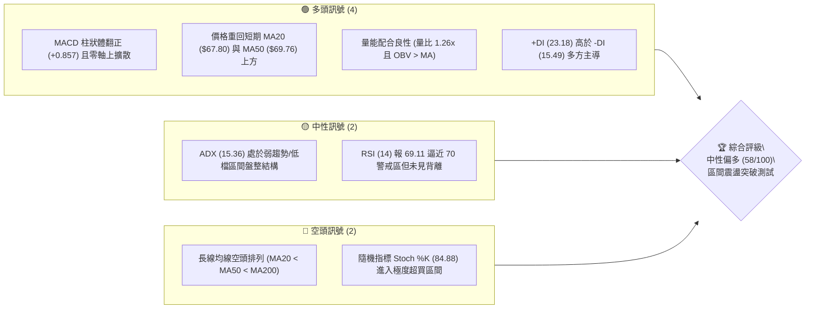
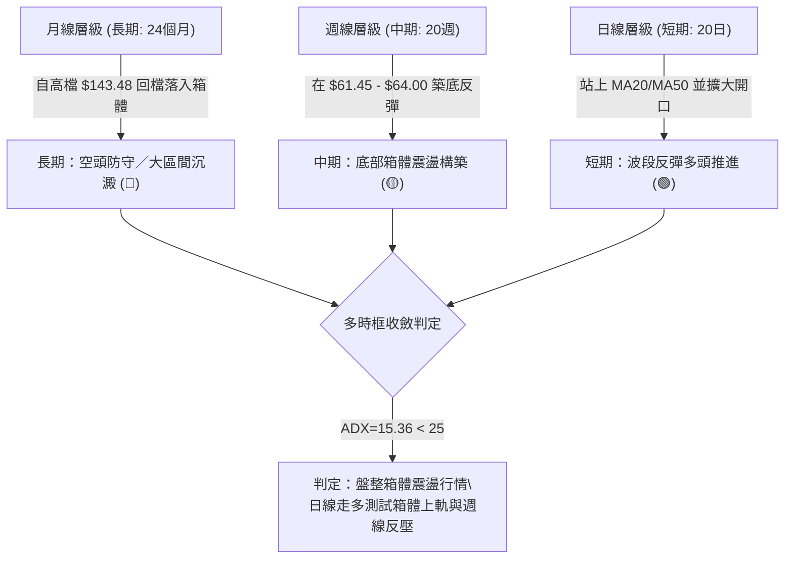
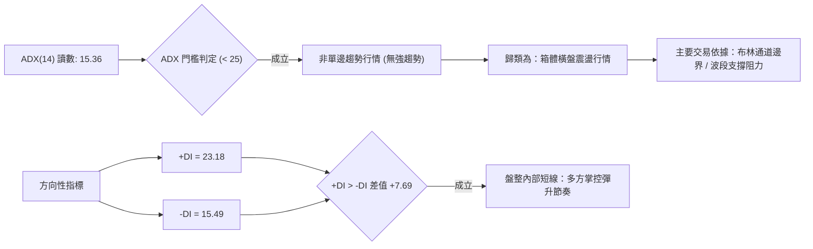
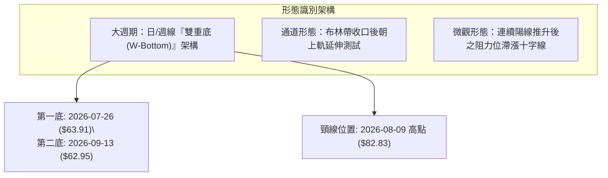
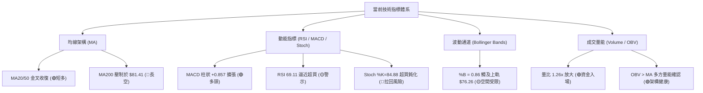
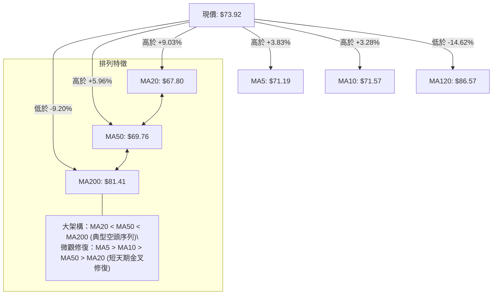
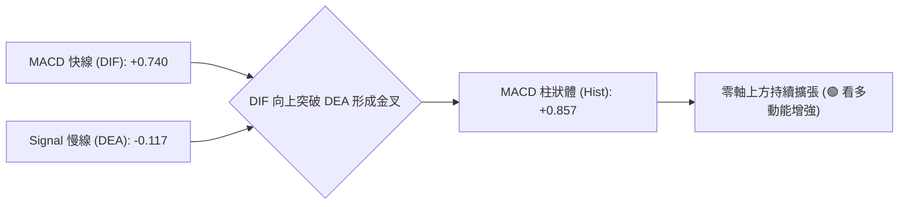
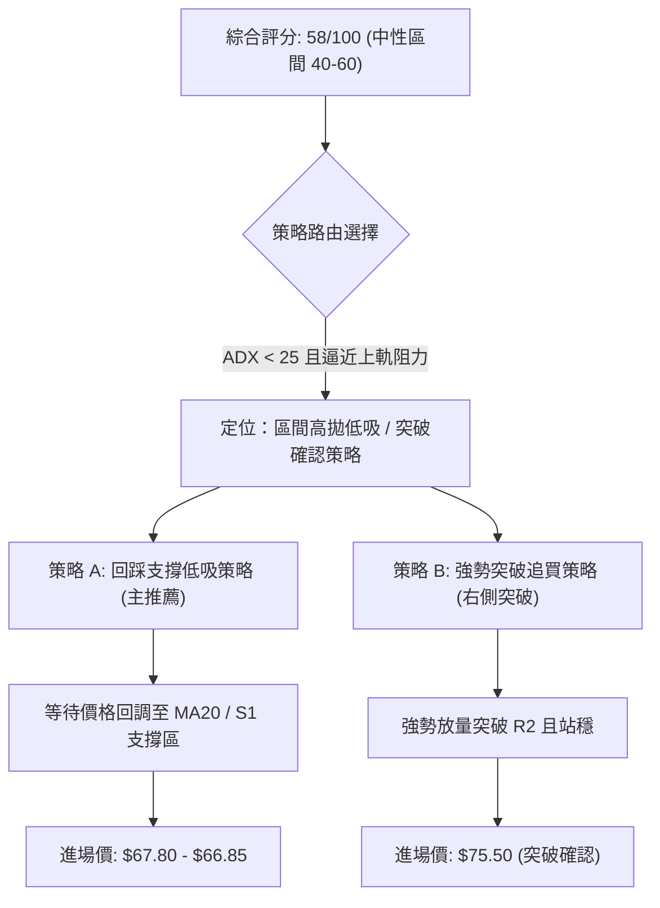
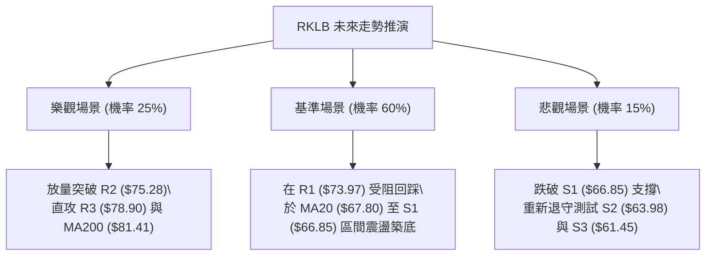

# RKLB 技術分析報告

> **報告日期**：2026-10-03 ｜ **語言**：繁體中文 ｜ **數據來源**：Yahoo Finance ｜ **當前價格**：$73.92

---

## 目錄

| 章節 | 內容 |
|------|------|
| [1. 技術面概覽](#1-技術面概覽) | 訊號儀表板、核心指標、評分卡 |
| [2. 趨勢分析](#2-趨勢分析) | 多時框趨勢、長中短期走勢 |
| [3. 圖表形態分析](#3-圖表形態分析) | 形態識別、K線組合、目標價 |
| [4. 支撐與阻力](#4-支撐與阻力) | 關鍵價位、斐波那契回調 |
| [5. 技術指標深度解讀](#5-技術指標深度解讀) | MA/RSI/MACD/布林/成交量 |
| [6. 動能與波動率](#6-動能與波動率) | 動能評估、ATR、Beta |
| [7. 多時框架總結](#7-多時框架總結) | 時框架評分矩陣、收斂結論 |
| [8. 交易策略建議](#8-交易策略建議) | 多空策略、情境階梯、風險報酬比 |
| [9. 風險提示與監控](#9-風險提示與監控) | 監控指標、風險場景、部位管理 |
| [10. 報告總結](#10-報告總結) | 全文核心結論與最優策略組合 |

---

## 1. 技術面概覽

### 🎯 技術訊號儀表板



### 📊 核心指標速覽表

| 指標類別 | 指標名稱 | 當前數值 | 訊號 | 解讀 |
|:---|:---|:---|:---:|:---|
| **價格** | 當前價格 | $73.92 | 🟡 | 位於52週區間32.0%分位，短線自低檔彈升但逼近關鍵阻力 |
| **均線** | 短期 MA20 | $67.80 | 🟢 | 現價高於 MA20 達 +9.03%，短線多方動能佔優 |
| **均線** | 中期 MA50 | $69.76 | 🟢 | 現價高於 MA50 達 +5.96%，收復中期多空分水嶺 |
| **均線** | 長期 MA200| $81.41 | 🔴 | 現價低於 MA200 達 -9.20%，長週期空頭反壓依舊沉重 |
| **動能** | RSI(14) | 69.11 | 🟡 | 位於中性偏多高檔區，接近超買閥值70，短期面臨獲利回吐 |
| **動能** | MACD(12,26,9) | DIF: 0.740 / DEA: -0.117 | 🟢 | DIF穿越DEA黃金交叉，Hist報+0.857，多方動能增強 |
| **動能** | Stoch %K/%D | %K: 84.88 / %D: 70.92 | 🔴 | 進入超買鈍化區，警示短線隨時有回測修正之風險 |
| **趨勢強度** | ADX(14) | 15.36 (+DI: 23.18) | 🟡 | 數值低於25，確認市場處於弱趨勢、區間箱體擺盪階段 |
| **通道** | 布林帶 %B | 0.86 (帶寬: $59.34 - $76.26)| 🟡 | 逼近布林通道上軌 ($76.26)，空間受壓制，防止假突破 |
| **成交量** | 20日成交量比 | 1.26x (量: 26.74M) | 🟢 | 突破近期均量（21.28M），OBV持續站於MA之上，量價配合 |
| **波動** | ATR(14) | $4.11 (5.56%) | 🟡 | 單日震盪幅度達 $4.11，波動偏大，進場風控停損要求嚴格 |

### 🏆 技術評分卡

```
╔══════════════════════════════════════════════════════════════════╗
║               技術評分卡 — RKLB (2026-10-03)                   ║
╠══════════════════════════════════════════════════════════════════╣
║ 趨勢強度 (ADX=15.36 弱趨勢)    ██████░░░░░░░░░░░░  35/100 🟡   ║
║ 動能指標 (MACD多頭/RSI高檔)    ██████████████░░░░  72/100 🟢   ║
║ 支撐穩定度 (S1/S2築底確立)    █████████████░░░░░  68/100 🟢   ║
║ 成交量配合 (OBV創高/量比1.26)  ████████████░░░░░░  65/100 🟢   ║
║ 形態完整度 (雙重底頸線測試)    ████████████░░░░░░  62/100 🟢   ║
║ 均線排列 (短強長弱/MA200壓制)  ████████░░░░░░░░░░  45/100 🔴   ║
╠══════════════════════════════════════════════════════════════════╣
║ 綜合技術評分                   ███████████░░░░░░░  58/100 ⚖️   ║
║ 評級結論：區間偏多震盪整理（中性區間 40–60），測試上軌壓力     ║
╚══════════════════════════════════════════════════════════════════╝
```

---

## 2. 趨勢分析

### 🌐 多時框趨勢分析



### 📈 長期趨勢 — 12個月走勢圖（Unicode）

```
RKLB 月線收盤走勢圖（2025-11 至 2026-10）
價格軸 ($)
$150 ┤                               ● (2026-05: $143.48 波段頂部)
$130 ┤                              / \
$110 ┤                             /   ● (2026-06: $101.65 跳水)
 $90 ┤                 ●(01:$80)  /     \
 $70 ┤        ●(12:$69) \   ●(04:$82)    \             ●(10:$73.92現價)
 $60 ┤       /           ●-●(02-03)       ●---●---●---/ (07-09: $63-$69 築底)
 $40 ┤●(11:$42)                                        
     └─────────────────────────────────────────────────────────────
      11  12  01  02  03  04  05  06  07  08  09  10 (月份)
      25  25  26  26  26  26  26  26  26  26  26  26 (年份)
```

#### 走勢特徵分析表格

| 階段週期 | 涵蓋月份 | 區間起訖點 | 期間漲跌幅 | 量價與結構特徵 |
|:---|:---|:---|:---:|:---|
| **主升浪推進** | 2025-11 至 2026-05 | $42.14 → $143.48 | +240.48% | 量能放大，連續突破多道壓力，於 5 月創下 52W 高點 $151.00 後力竭 |
| **高檔暴跌回洗** | 2026-05 至 2026-07 | $143.48 → $64.95 | -54.73% | 斷崖式下跌，週線連續出脫，失守 MA120 ($86.57) 與 MA200 ($81.41) |
| **底部箱體蓄勢** | 2026-07 至 2026-09 | $63.92 → $69.68 | +9.01% | 成交量萎縮至低檔，於 S2 ($63.98) 與 S3 ($61.45) 區域反覆獲得支撐 |
| **短線多頭反彈** | 2026-09 至 2026-10 | $69.68 → $73.92 | +6.09% | 帶量突破日線 MA20 與 MA50，MACD柱狀體翻正，測試 R1 ($73.97) |

### 📊 中期趨勢（週線分析）

從近20週數據顯示，週線級別在 2026-07-26 創下收盤低點 $63.91（RSI 跌至 15.6 極端超賣），隨後於 2026-08-09 強彈至 $82.83，但受制於 61.8% 斐波那契回調位 $80.90 與 MA200 ($81.41) 壓制回落；其後在 2026-09-13 於 $62.95 二度探底不破，目前連續三週收陽（$62.95 → $64.57 → $73.95 → $73.92），MACD週柱狀體重返零軸上方 (+0.857)。

```
週線區間整理與反壓架構示意圖：
$82.83 ─────────────────────────────── 週線反彈高點阻力區（接近 MA200 $81.41）
       ▲
       │      [當前彈升路徑]
$73.92 ┼─────────────────────────────── 現價（面臨 R1 $73.97 / R2 $75.28 密集壓制）
       │      ▲
       │     ╱ 
$62.95 ┴────┴────────────────────────── 週線雙重探底支撐線（S2: $63.98 / S3: $61.45）
       07-26  09-13
```

### ⚡ 趨勢強度評估（ADX 解讀）



#### ADX 趨勢強度對照表

| 指標變數 | 當前讀數 | 門檻區間 | 趨勢狀態判定 | 戰略指導意義 |
|:---|:---:|:---:|:---:|:---|
| **ADX (14)** | **15.36** | < 20 (極弱/無趨勢) | 處於無明確單邊趨勢之盤整箱體 | 嚴禁追高追殺，順勢突破策略易遭遇假突破，宜採區間高拋低吸 |
| **+DI (14)** | **23.18** | > -DI (15.49) | 短期多方能量大於空方 | 反彈動能尚未衰竭，震盪重心向上軌靠攏 |
| **-DI (14)** | **15.49** | 處於回落狀態 | 空方拋壓暫時退潮 | 下檔拋壓減輕，回踩跌破支撐概率降低 |

---

## 3. 圖表形態分析

### 🔍 形態識別系統



#### 形態信心度與目標價評估表

| 形態類別 | 信心度 | 判斷依據（引用數據） | 完成度 | 目標價（附嚴謹計算式） |
|:---|:---:|:---|:---:|:---|
| **週線雙重底 (W-Bottom)** | **68%** | 兩次落底分別為 2026-07-26 的 $63.91 與 2026-09-13 的 $62.95（均受到 S2: $63.98 與 S3: $61.45 支撐聚類有效防守），中間反彈高點為 2026-08-09 的 $82.83。 | 60% (尚未突破頸線) | 若未來帶量突破頸線 $82.83，形態高度 = $82.83 - $62.95 = $19.88。推算目標價 = $82.83 + $19.88 = **$102.71**（接近斐波那契 38.2% 回調位 $107.67）。 |
| **短線箱體震盪** | **85%** | 價格受制於近一年波段高低點聚類，下檔 $63.98-$66.85，上檔 $73.97-$78.90。 | 90% (正測試箱頂) | 箱體上限即為 R1 ($73.97) 及 R2 ($75.28)，下限為 S1 ($66.85)。 |
| **複雜幾何形態 (頭肩/旗形)** | **<30%** | **數據不足，不予採信**。目前價格處於低檔震盪區間，無清晰旗桿與對稱頭肩架構，嚴格依紀律不強行穿鑿附會。 | -- | 訊號不足，僅做指標型與區間邊界解讀。 |

### 🕯️ 重要K線形態分析

| 週期/時間 | 收盤價 | 核心K線組合形態 | 解讀說明 | 訊號 |
|:---|:---:|:---|:---|:---:|
| **2026-09-13 週** | $62.95 | **長下影錘頭線** | 測試下軌 $59.34 與 S3 ($61.45) 未破，空頭力竭引發空頭回補 | 🟢 |
| **2026-09-27 週** | $73.95 | **大陽線突破貫穿** | 週漲幅達 +14.53%，實體長陽貫穿 MA20 與 MA50，形成多頭吞噬 | 🟢 |
| **2026-10-04 週** | $73.92 | **高檔震盪十字星** | 週收盤微跌 -0.03，實體極小，正好受制於 R1 ($73.97)，顯示多空在阻力前分歧 | 🟡 |

### 📉 ASCII 走勢形態示意圖

```
週線雙重底 (W-Bottom) 與短線反彈推進架構
========================================================================
$85 ┤
$82 ┤                      [頸線高點: $82.83 (2026-08-09)]
$79 ┤                         ╭──╮
$76 ┤                        ╱    ╲         [當前挑戰 R1: $73.97 / R2: $75.28]
$73 ┤                       ╱      ╲               ● $73.92 (現價)
$70 ┤                      ╱        ╲             ╱
$67 ┤                     ╱          ╲           ╱  [收復 MA50: $69.76]
$64 ┤  ● $63.91          ╱            ╲         ╱
$61 ┤   ╲─────── 底 1 ───╯              ╰── 底 2 ╯   ● $62.95
    └───────────────────────────────────────────────────────────────────
        (2026-07-26)                       (2026-09-13)
```

### 🎯 形態目標價計算

1. **基本箱體震盪空間**：
   * 當前震盪下限為支撐位 S1 = **$66.85**（或強支撐 S2 = **$63.98**）。
   * 當前震盪上限為阻力位 R1 = **$73.97**、R2 = **$75.28**。
   * 現價 $73.92 已觸及 R1，若能放量突破 R2 ($75.28)，短線延伸波段目標直接指向阻力位 R3 = **$78.90**。
2. **潛在雙重底突破理論量幅**：
   * 形態確立條件：日線/週線收盤價強勢實體突破頸線 $82.83。
   * 頸線價位：**$82.83**
   * 形態底部基準：**$62.95**
   * 垂直高度 $H = \$82.83 - \$62.95 = \$19.88$
   * 突破測幅理論目標價 $T = \$82.83 + \$19.88 = \mathbf{\$102.71}$（注意：該形態完成度僅 60%，目前屬於遠期潛在目標，當下首要聚焦 R1-R3 的攻防）。

---

## 4. 支撐與阻力

### 🗺️ 關鍵價位分布圖（Unicode）

```
RKLB 關鍵價位結構分布圖 (由 OHLCV 與斐波那契計算)
════════════════════════════════════════════════════════════════════
$151.00 ║████████████████████████████████████████║ 52W 歷史最高點 (Fib 0.0%)
$107.67 ║████████████████████                    ║ Fib 38.2% 回調位
 $81.41 ║████████████████████████████            ║ 長期均線反壓 MA200
 $80.90 ║██████████████████████████              ║ Fib 61.8% 強阻力回調位
 $78.90 ║████████████████████                    ║ 阻力位 R3 (波段高點聚類)
 $76.26 ║██████████████                          ║ 布林通道上軌
 $75.28 ║████████████████                        ║ 阻力位 R2 (波段高點聚類)
 $73.97 ║████████████████████████                ║ 阻力位 R1 (波段高點聚類)
 $73.92 ╠════════════════════════════════════════╣ ◄ 現價 ($73.92)
 $69.76 ║▓▓▓▓▓▓▓▓▓▓▓▓▓▓▓▓                        ║ 中期均線支撐 MA50
 $67.80 ║▓▓▓▓▓▓▓▓▓▓▓▓▓▓▓▓▓▓▓▓                    ║ 布林中軌 / MA20 支撐
 $66.85 ║▓▓▓▓▓▓▓▓▓▓▓▓▓▓▓▓▓▓▓▓▓▓▓▓                ║ 支撐位 S1 (波段低點聚類)
 $63.98 ║████████████████████████████            ║ 支撐位 S2 (波段強支撐)
 $61.84 ║████████████████████████████            ║ Fib 78.6% 回調位
 $61.45 ║████████████████████████████████        ║ 支撐位 S3 (近一年波段底部)
 $37.57 ║████████████████████████████████████████║ 52W 歷史最低點 (Fib 100.0%)
════════════════════════════════════════════════════════════════════
```

### 🚧 阻力位分析表

| 阻力級別 | 精確價位 | 距現價空間 | 形成原因依據 | 突破難度 | 重要性等級 |
|:---|:---:|:---:|:---|:---:|:---:|
| **R1** | **$73.97** | +0.07% | 近一年波段高點密集聚類區，前波反彈密集成交籌碼頸線 | 中等 | ⭐⭐⭐⭐ |
| **R2** | **$75.28** | +1.85% | 近期震盪次高點聚類，與布林通道上軌 ($76.26) 形成共振壓制區 | 偏高 | ⭐⭐⭐ |
| **R3** | **$78.90** | +6.74% | 2026年8月中旬反彈次高點籌碼堆積區，上方逼近 Fib 61.8% ($80.90) | 極高 | ⭐⭐⭐⭐⭐ |

### 🛡️ 支撐位分析表

| 支撐級別 | 精確價位 | 距現價空間 | 形成原因依據 | 守住機率 | 重要性等級 |
|:---|:---:|:---:|:---|:---:|:---:|
| **S1** | **$66.85** | -9.56% | 近一年波段回調低點聚類，鄰近 MA20 ($67.80) 與布林中軌防守位 | 75% | ⭐⭐⭐⭐ |
| **S2** | **$63.98** | -13.44% | 2026年7-8月雙重築底密集成交低點，買盤防禦中樞 | 85% | ⭐⭐⭐⭐⭐ |
| **S3** | **$61.45** | -16.87% | 近一年波段最低點聚類，與 Fib 78.6% ($61.84) 構成鐵底護城河 | 92% | ⭐⭐⭐⭐⭐ |

### 📐 斐波那契回調位分析

依據 52 週完整極端區間（低點 **$37.57** → 高點 **$151.00**，垂直總落差 $113.43）計算各回調位：

```
斐波那契回調階梯分佈 (52W Range: $37.57 - $151.00)
----------------------------------------------------------------------
0.0%  (52W High) : $151.00  ── 極限高點
23.6% 回調位     : $124.23  ── 超強多頭維持線
38.2% 回調位     : $107.67  ── 形態擴展長期目標區
50.0% 回調位     : $ 94.28  ── 熊牛半分嶺
61.8% 回調位     : $ 80.90  ── 黃金分割關鍵反壓 (與 MA200 $81.41 共振)
----------------------------------------------------------------------
[現價落點區間]   : $ 73.92 (處於 78.6% 與 61.8% 之間，佔 52W 區間 32.0%)
----------------------------------------------------------------------
78.6% 回調位     : $ 61.84  ── 深度回撤防守底線 (與 S3 $61.45 共振)
100.0% (52W Low) : $ 37.57  ── 週期起漲起點
----------------------------------------------------------------------
```

* **現價區間解讀**：現價 $73.92 穩健運行於 **78.6% ($61.84)** 與 **61.8% ($80.90)** 之間。在技術分析定義中，回調跌破 61.8% 代表自 $151.00 展開的大級別回檔屬於深度修正；但只要未跌破 78.6% ($61.84)，長線並未破底至 $37.57。目前價格正從 78.6% 處發起向上修復波，其反彈的第一個黃金分割極限反壓正是 **$80.90**。

---

## 5. 技術指標深度解讀

### 🎛️ 指標訊號總覽



### 📈 移動平均線排列分析



* **均線結構研判**：
  * 雖然大週期均線呈現典型的空頭排列（MA20 $67.80 < MA50 $69.76 < MA200 $81.41），但短線價格自 $62.95 快速彈升，已一舉越過 MA5 ($71.19)、MA10 ($71.57)、MA20 與 MA50。
  * 短期均線呈現強烈向上扭轉態勢，MA5 與 MA10 已向上金叉穿越 MA20 與 MA50，這代表**短期動能正在對中期空頭排列發動均線修復戰**。
  * 上方最致命的長期均線反壓位於 MA200 ($81.41) 與 MA120 ($86.57)，此處為機構長線籌碼套牢解套點，未經充分換手不易一次性攻克。

### 📉 RSI(14) 分析

* **當前數值**：**69.11**
* **區間狀態進度條**：
  ```
  超賣區 (0-30)        中性平衡區 (30-70)         超買警戒區 (70-100)
  [───────────────┬───────────────────────────────┬───────────────]
  ░░░░░░░░░░░░░░░░▓▓▓▓▓▓▓▓▓▓▓▓▓▓▓▓▓▓▓▓▓▓▓▓▓▓▓▓▓▓▓▓░ 69.11%
  ```
* **背離研判**：
  * 在 2026-07-26 週線價格創下 $63.91 低點時，RSI 報 15.6；而在 2026-09-13 價格再次下探 $62.95（價格微幅破底）時，RSI 報 27.1（顯著墊高）。此現象在週線層級形成了經典的**底背離（Bullish Divergence）**，隨後帶動了本波從 $62.95 向上反撲至 $73.92 的漲勢。
  * 目前日線 RSI 來到 69.11，已無限逼近 70 超買界限，技術面上「無頂背離現象」，但超買高檔鈍化意味著追高動能衰竭，短線可能伴隨震盪降溫。

### 📊 MACD(12,26,9) 訊號解讀



* DIF 自負值區間逆轉向上，穿過零軸達到 +0.740，並拉開與信號線（-0.117）的正向差距。
* 柱狀圖讀數達 **+0.857**，連續 3 週維持在正值區間且持續放大，印證短中期多方佔據優勢，價格回檔具備動能保護。

### 📦 布林通道分析

```
布林通道與現價空間示意圖 (帶寬 20日, 2σ)
════════════════════════════════════════════════════════════════
$76.26 ────────────────────────────────────── BB 上軌 (Upper Band)
       ▲
       │ 空間僅剩 $2.34 (+3.17%)  [短線壓制區間]
$73.92 ┼────────────────────────────────────── 現價 (%B = 0.86)
       │
       │ 多空分水嶺
$67.80 ┼────────────────────────────────────── BB 中軌 (MA20)
       │
       │
$59.34 ────────────────────────────────────── BB 下軌 (Lower Band)
════════════════════════════════════════════════════════════════
```

* 當前價格 $73.92 高度貼近布林上軌 **$76.26**，指標 **%B 達到 0.86**。
* 根據布林通道統計法則，%B 處於 0.80–1.00 屬於強勢多頭推升帶，但若缺乏持續暴增的單邊量能（ADX 僅 15.36 確認非單邊趨勢），當價格觸及或接近上軌時，常會引發向中軌 **$67.80** 的回歸收斂。

### 💹 成交量分析（量價配合度）

1. **量比放大**：最新成交量為 **26,741,800 股**，相較於 20 日均量（21,287,215 股）之量比為 **1.26x**，高於 50 日均量（19,085,372 股），呈現量增價漲格局。
2. **OBV 能量潮**：當前 OBV 穩步運行於其移動平均線上方（`OBV > MA`），確認自 9 月中旬以來的反彈並非虛擬拉抬，而是伴隨資金實質回補，量價結構處於良性共振狀態。
3. **籌碼集中度**：機構持股達 61.9%，空頭浮動比率（Short % Float）達 7.3%，Short Ratio 為 2.61 天。當前成交量溫和放大，有部分源於空頭在阻力位前的回補盤，但並未見全面空頭擠壓（Short Squeeze）所引發的失控巨量。

---

## 6. 動能與波動率

### ⚡ 動能評估四象限

```
動能與波動率定位矩陣
       高波動率
          │
    Q3    │    Q4 (高波弱動能)
  高波強動能 │
          │
──────────┼──────────
          │    ★ 當前位置: Q1 轉折區
    Q2    │    動能偏強 (MACD/RSI偏多)
  低波弱動能 │    波動中等 (ADX盤整收斂)
          │
       低波動率
─── 低動能 ─────── 高動能 ───
```

| 象限代號 | 動能強度 | 波動率特徵 | 當前狀態評估 | 策略指導 |
|:---:|:---:|:---:|:---:|:---|
| **Q1** | **偏強** | **中/低** | **★ RKLB 當前落點**：動能連續轉強，但 ADX 壓制在盤整域 | 逢回拉踩支撐做多，嚴控停損，不盲目追高突破 |
| **Q2** | 弱 | 低 | 2026年8月下旬築底期狀態 | 觀望沉澱，靜待指標落底 |
| **Q3** | 強 | 高 | 2026年5月單邊暴漲期狀態 | 順勢追隨趨勢，享受加速段 |
| **Q4** | 弱 | 高 | 2026年6月高檔跳水崩跌狀態 | 嚴格停損出場，規避主跌浪 |

### 📊 ATR 波動率分析

* **當前 ATR(14)**：**$4.11**（佔現價比率為 **5.56%**）。
* **風控與停損距設定建議**：
  * RKLB 單日正常波動幅度高達 $4.11，屬於高波動性航太科技成長股。
  * **當沖/超短線保護**：1.0 倍 ATR = **$4.11**。
  * **波段操作安全緩衝**：1.5 倍 ATR = $4.11 × 1.5 = **$6.17**。
  * **波段防守點位推導**：以當前價格 $73.92 扣除 1.5 倍 ATR，得防守位約為 **$67.75**，此價位與布林中軌/MA20（**$67.80**）以及 S1 支撐位（**$66.85**）高度重疊，印證 $66.85 - $67.80 區間為此波行情的關鍵停損/支撐防線。

### 📐 Beta 與市場相關性

* **Beta 係數**：**2.612**
* **解讀**：
  * RKLB 的股價波動幅度約為標普 500 指數的 **2.61 倍**，具備極強的高貝塔（High Beta）特徵。
  * 在大盤處於風險偏好（Risk-On）環境時，該股反彈爆發力極強；但在大盤震盪或回檔時，其拉回幅度亦會顯著放大。因此，操作此標的必須嚴格限制單筆倉位曝險比例。

---

## 7. 多時框架總結

### 📋 時框架評分表

| 時框架 | 趨勢方向 | 動能狀態 | 均線系統狀態 | 形態進展 | 綜合評分 | 戰術建議 |
|:---|:---:|:---:|:---:|:---:|:---:|:---|
| **短期 (日線)** | 🟢 偏多推進 | 🟢 MACD金叉/量增 | 🟢 站上MA20/50 | 接近箱頂測試 | **72/100** | 逢回踩支撐低吸，不追高 |
| **中期 (週線)** | 🟡 底部箱體 | 🟢 週底背離翻正 | 🟡 受制MA200反壓 | 雙重底構築中 | **58/100** | 關注 $63.98-$82.83 區間整理 |
| **長期 (月線)** | 🔴 深度修正 | 🔴 高檔滑落修復 | 🔴 空頭防守序列 | 巨幅震盪拉回 | **42/100** | 長線籌碼沉澱，以時間換空間 |

### 🔲 綜合訊號矩陣

```
訊號維度對照矩陣
┌──────────────┬──────────────┬──────────────┬──────────────┐
│  分析維度    │ 短期 (日線)  │ 中期 (週線)  │ 長期 (月線)  │
├──────────────┼──────────────┼──────────────┼──────────────┤
│ 趨勢方向     │ 🟢 向上突破  │ 🟡 橫盤震盪  │ 🔴 偏空回撤  │
│ 動能 (RSI)   │ 🟡 69.11偏高 │ 🟢 69.1反彈  │ 🟡 中性降溫  │
│ MACD 訊號    │ 🟢 柱體擴張  │ 🟢 剛翻正    │ 🔴 負值收斂  │
│ 均線架構     │ 🟢 站上短均  │ 🔴 壓在長均下│ 🔴 空頭排列  │
│ 量能確認度   │ 🟢 量比1.26x │ 🟢 量能回升  │ 🟡 縮量整理  │
└──────────────┴──────────────┴──────────────┴──────────────┘
```

### ⚖️ 多時框收斂結論

* **多時框收斂規則驗證**：
  * 當前系統趨勢強度指標 **ADX(14) 讀數為 15.36**，嚴格滿足 `< 25` 之條件，定義市場處於**盤整震盪行情**。
  * 依多時框收斂規則：在盤整行情中，**以日線布林通道上下軌與波段支撐/阻力位為主要交易區間**。
  * 中長期（週線/月線）MA200 ($81.41) 構成沉重反壓，阻斷了短期單邊暴漲的空間；而日線短期動能雖強（MACD擴張、量價配合），但現價 $73.92 已逼近阻力位 R1 ($73.97) 及布林上軌 ($76.26)。
* **唯一方向性結論**：**中性偏多區間震盪（區間高拋低吸，待突破確認）**。短線有進一步向上摸測 R2 ($75.28) 及布林上軌之潛力，但在長週期均線未扭轉前，不具備走出單邊大牛市之條件，策略以「拉回在支撐進場、接近阻力減碼」為主軸。

---

## 8. 交易策略建議

### 🗺️ 策略決策流程圖



### 🧭 策略路由（依評分卡分流）

> **當前主策略方向 = 中性偏多區間操作，以「回踩支撐低吸」為主策略（依綜合評分 58/100）**
> 
> *理由：評分處於 40–60 之中性震盪區間，且現價 $73.92 緊貼阻力 R1 ($73.97) 與布林上軌 ($76.26)。此處追高盈虧比極差，最優勝率在於等待價格回踩 MA20/S1 支撐時低吸，或等待放量越過 R2 後右側進場。*

### 🎯 價格情境階梯（Price Scenarios）

價位嚴格引用技術數據聚類數值：

| 觸發條件（價格動作） | 下一目標點位 | 後續延伸目標 | 情境技術含義 |
|:---|:---:|:---:|:---|
| **放量突破 R1 ($73.97)** | **R2 ($75.28)** | **R3 ($78.90)** | 短線多頭衝破高點聚類，直接挑戰布林上軌與近波高點 |
| **強勢越過 R3 ($78.90)** | **Fib 61.8% ($80.90)** | **MA200 ($81.41)** | 中期底部成型，挑戰中長期均線牛熊分水嶺 |
| **受阻回落跌破現價** | **MA50 ($69.76)** | **MA20 / S1 ($67.80-$66.85)** | 進入布林通道內部回歸震盪，尋求均線支撐 |
| **失守支撐 S1 ($66.85)** | **S2 ($63.98)** | **S3 ($61.45)** | 短線反彈宣告結束，行情退回箱體底部再度探底 |

### 📊 情境機率分佈

| 發展情境 | 發生機率 | 主要技術指標依據 |
|:---|:---:|:---|
| **情境一：區間震盪回踩蓄勢** | **50%** | ADX=15.36 確認處於弱趨勢盤整；Stoch %K (84.88) 超買鈍化；價格受阻於 R1 ($73.97)，高機率拉回回踩 MA50 ($69.76) 或 MA20 ($67.80) 尋求支撐。 |
| **情境二：直接放量突破挑戰 R2/R3** | **35%** | MACD 柱狀體放大 (+0.857)；量比達 1.26x；OBV 維持在均線之上展現真實買盤，具備短線慣性向上衝擊布林上軌實力。 |
| **情境三：反轉破位重挫探底** | **15%** | 長期均線空頭排列（MA200 反壓顯著）；若大盤重挫（Beta=2.612 高敏特性），跌破 S1 ($66.85) 恐引發停損拋壓退守 S2。 |

### 🟢 主策略詳情

本策略組合嚴格遵循風險報酬比大於 1:2.0 之原則設計：

| 策略要素 | 策略 A（回踩支撐低吸 — 優先主推） | 策略 B（右側放量突破 — 次選跟進） |
|:---|:---:|:---:|
| **策略類型** | 左側防禦型波段低吸 | 右側順勢突破追買 |
| **進場條件** | 價格在 R1 受阻拉回，於 MA20 / S1 企穩出現止跌K棒 | 日K線帶量收盤突破 R2 ($75.28) 且成交量比 > 1.5x |
| **精確進場價格** | **$67.80**（MA20 / 布林中軌） | **$75.35**（突破 R2 後確認價） |
| **目標價 T1** | **$73.97**（阻力位 R1） | **$78.90**（阻力位 R3） |
| **目標價 T2** | **$78.90**（阻力位 R3） | **$80.90**（Fib 61.8% / 逼近 MA200） |
| **嚴格止損價格** | **$63.80**（有效跌破 S2: $63.98 之保護點） | **$72.50**（跌破回調起點之假突破停損） |
| **風險空間 (Risk)** | $67.80 - $63.80 = **$4.00** (約 1.0x ATR) | $75.35 - $72.50 = **$2.85** |
| **報酬空間 (Reward T2)** | $78.90 - $67.80 = **$11.10** | $80.90 - $75.35 = **$5.55** |
| **風險報酬比 (R:R)** | **1 : 2.78** (符合專業風控要求) | **1 : 1.95** (略低於 1:2，需嚴控部位) |
| **模型預估勝率** | **65%** | **52%** |
| **建議配置倉位** | **總資金 8% - 10%** | **總資金 4% - 5%** |

### 🔴 反向風險觸發點（對沖與風控提示）

若發生以下盤面異常異動，宣告多頭策略失效，應立即終止多頭部位並啟動避險：
1. **關鍵點位跌破**：日K線收盤價實體**跌破支撐位 S1 ($66.85)**，且伴隨成交量放大，意味著 MA20 支撐宣告失守。
2. **動能結構反轉**：MACD 柱狀體自 +0.857 急劇萎縮並於零軸附近形成死叉，同時 RSI 快速貫穿 50 中軸滑向空方區間。
3. **對沖機制**：若持股部位較重且跌破 $66.85，可藉由同等市值之相關航太/國防 ETF 或期權進行反向 Delta 對沖保護。

### ⭐ 整體訊號強度評星

```
╔══════════════════════════════════════════════════════════════╗
║ 做多訊號強度：★★★☆☆  (3.5/5星 — 動能良好但受制於盤整頂部與長均)  ║
║ 做空訊號強度：★★☆☆☆  (2.0/5星 — 短線動能向上，逆勢做空盈虧比低)  ║
║ 整體可信度：  ★★★★☆  (4.0/5星 — 關鍵點位聚類明確，量價配合清晰)  ║
╚══════════════════════════════════════════════════════════════╝
```

---

## 9. 風險提示與監控

### ✅ 關鍵監控指標 Checklist

```
╔══════════════════════════════════════════════════════════════════╗
║               每日盤後技術監控清單 (Checklist)                  ║
╠══════════════════════════════════════════════════════════════════╣
║ [ ] 價格是否收於 R1 ($73.97) 上方？ (突破確立關鍵)              ║
║ [ ] RSI(14) 是否突破 70 產生頂背離，或跌破 60 開始轉弱？        ║
║ [ ] MACD 柱狀圖是否持續擴張 (高於 +0.857)？                     ║
║ [ ] 單日成交量是否維持在 20日均量 (21.28M) 之上？               ║
║ [ ] 價格回踩時是否於布林中軌 / MA20 ($67.80) 獲得實體支撐？     ║
║ [ ] 空頭浮動比 (Short Float 7.3%) 是否引發軋空回補？           ║
║ [ ] ADX(14) 讀數是否由 15.36 躍升突破 25 (確認走出趨勢行情)？  ║
╚══════════════════════════════════════════════════════════════════╝
```

### ⚠️ 風險場景分析



### 🛡️ 風險管理重要提醒

1. **波動率極端性警告**：ATR(14) 報 **$4.11**，佔股價比例達 **5.56%**，且 Beta 高達 **2.612**。這代表該股具備單日暴漲暴跌 5% 以上的常態特性，**單筆交易虧損上限嚴格控制在總投資組合資金的 1.0% 以內**。
2. **阻力密集區警示**：上方自 $73.97 (R1) 到 $81.41 (MA200) 雲集了近一年來的成交量套牢峰（包含 Fib 61.8% 的 $80.90）。任何在未放量突破前的追高操作，均極易遭遇解套賣壓引發的高檔震盪套牢。
3. **無新聞事件窗口風險**：目前近期新聞處於空白期，股價純粹由籌碼與技術動能主導。需密切關注後續航太發射任務時程與航太系統合約執行進度，防止因基本面突發變數破壞當前之技術架構。

---

## 10. 報告總結

```
╔══════════════════════════════════════════════════════════════════╗
║                   RKLB 技術分析報告總結                          ║
╠══════════════════════════════════════════════════════════════════╣
║ 報告日期：2026-10-03                                             ║
║ 當前價格：$73.92                                                 ║
║ 分析評級：⚖️ 中性偏多 / 區間震盪突破測試 (綜合評分: 58/100)      ║
║                                                                  ║
║ 關鍵維度結論：                                                   ║
║ ├─ 長期趨勢：🔴 偏空回撤 (受制於 MA200 $81.41 與月線整理)       ║
║ ├─ 中期趨勢：🟡 底部構築 (週線雙重底測試，築底區間 $63 - $82)   ║
║ ├─ 短期趨勢：🟢 震盪反彈 (收復 MA20/50，MACD翻正，量能配合良性)  ║
║ ├─ 關鍵支撐：S1: $66.85 ｜ S2: $63.98 ｜ S3: $61.45              ║
║ ├─ 關鍵阻力：R1: $73.97 ｜ R2: $75.28 ｜ R3: $78.90              ║
║ └─ 外資分析師目標價：均價 $109.15 (低 $64.00 / 高 $150.00)       ║
╠══════════════════════════════════════════════════════════════════╣
║ 最優策略組合建議：                                               ║
║ 1. 🥇 最佳機會（策略 A）：耐心等待價格回調至 MA20 / S1 區間      ║
║       ($67.80 - $66.85) 進場低吸，止損設於 $63.80，目標上看    ║
║       $78.90，風險報酬比達 1:2.78。                              ║
║ 2. 🥈 次選機會（策略 B）：若日K帶量長陽實體越過 R2 ($75.28)，    ║
║       可於 $75.35 右側跟進追買，目標指向 $80.90，停損 $72.50。   ║
║ 3. 🥉 保守選擇：鑑於 ADX=15.36 處於弱趨勢盤整，現價暫時觀望，    ║
║       不於布林上軌與 R1 密集阻力區追高，等待方向明確確認。       ║
╚══════════════════════════════════════════════════════════════════╝
```

---

> ⚠️ **免責聲明**：本報告為技術分析專用模型生成之研究報告，所有技術指標、支撐阻力點位及交易策略推演均嚴格基於所提供之歷史價格與量價數據。本報告**僅供學術研究與交易思路參考**，**不構成任何形式之實盤要約或投資買賣建議**。金融市場瞬息萬變，高 Beta 成長型股票波動劇烈，投資人應獨立評估自身風險承受能力，並自負盈虧責任。

---
*報告生成時間：2026-10-03 ｜ 數據來源：Yahoo Finance ｜ 分析框架：多時框架量化技術體系*