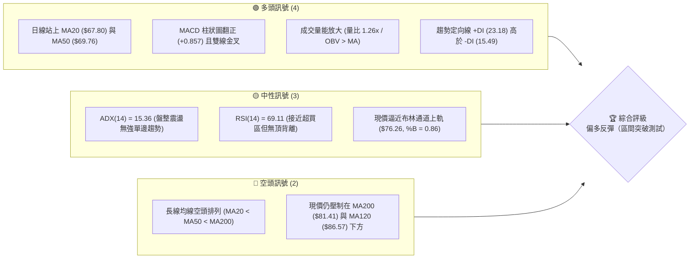
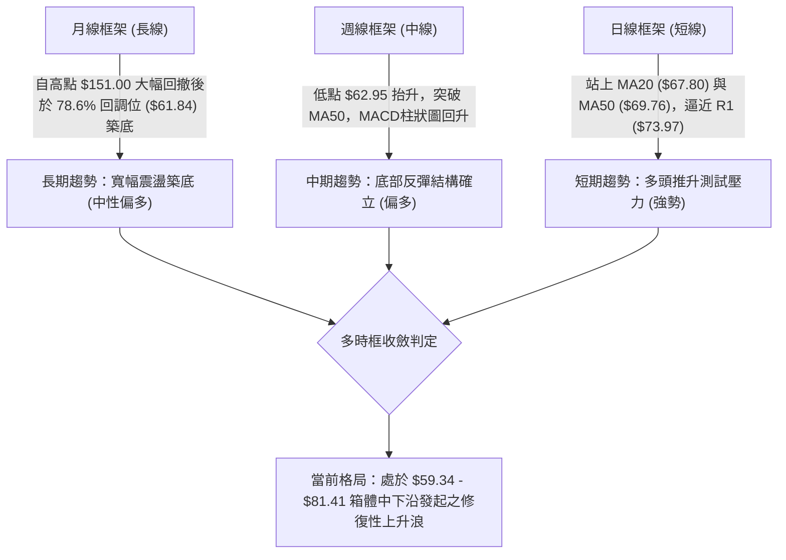
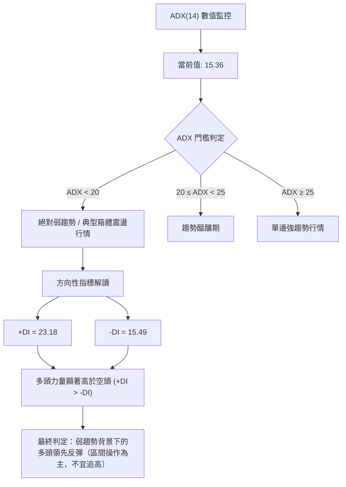
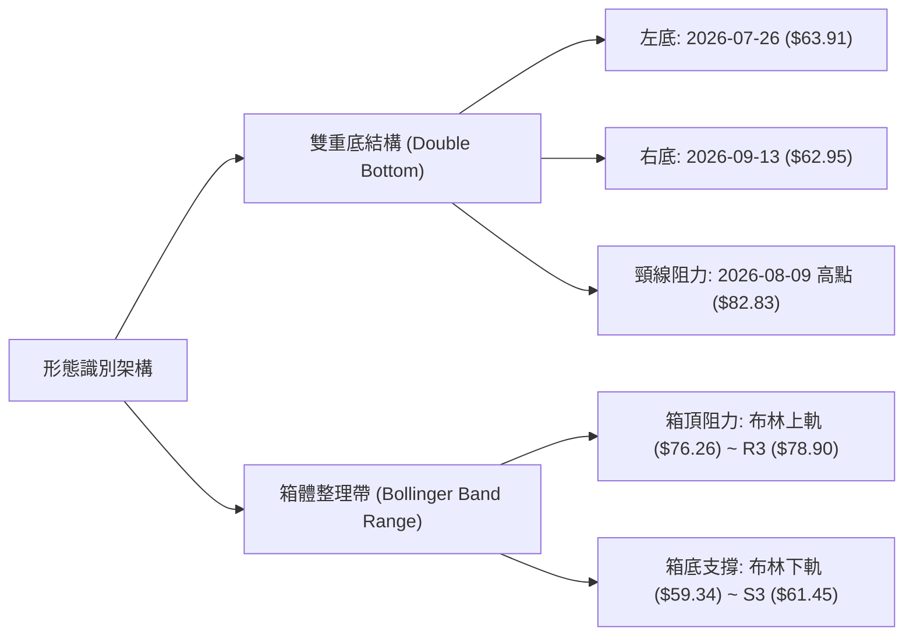
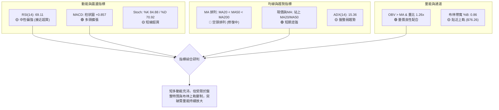
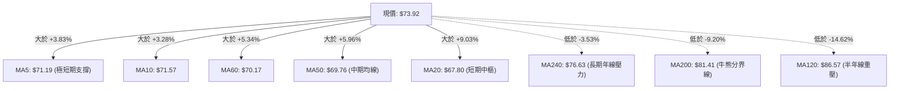
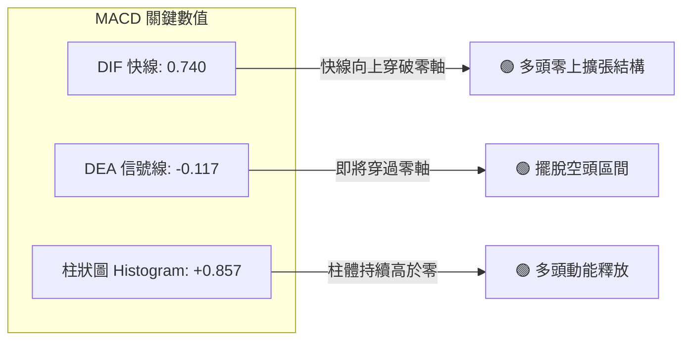
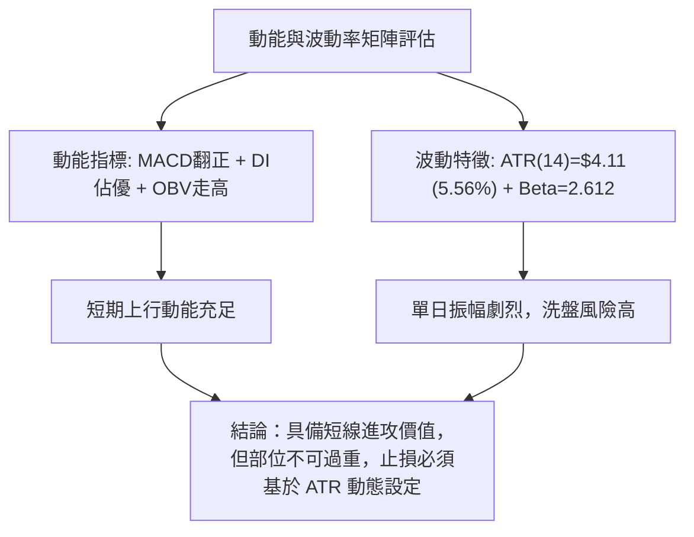
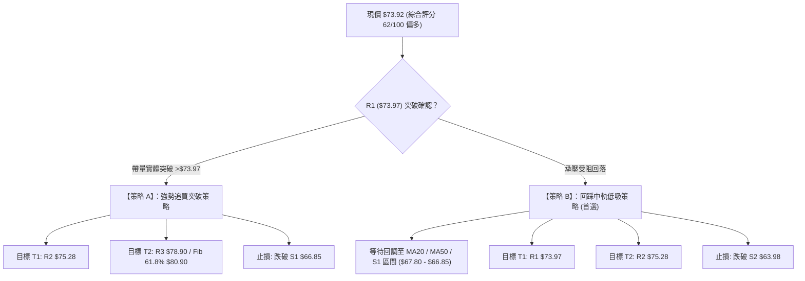
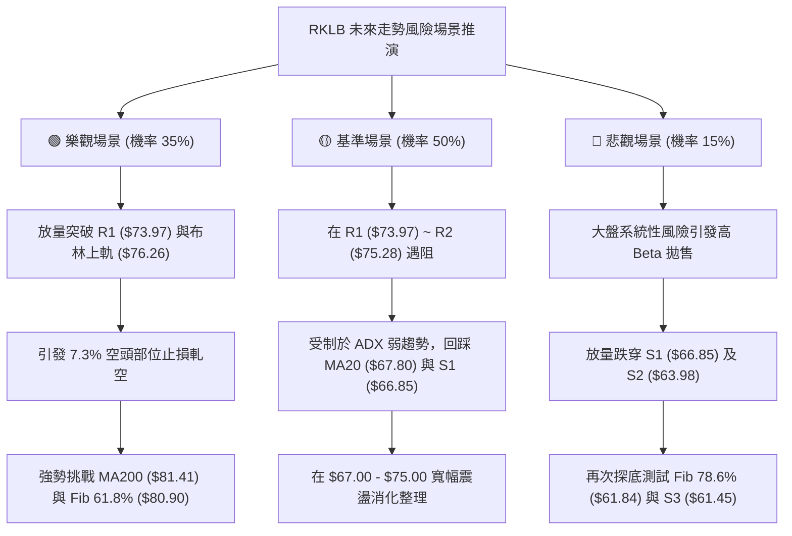

# RKLB 技術分析報告

> **報告日期**：2026-10-04 ｜ **語言**：繁體中文 ｜ **數據來源**：Yahoo Finance ｜ **當前價格**：$73.92

---

## 目錄

| 章節 | 內容 |
|------|------|
| [1. 技術面概覽](#1-技術面概覽) | 訊號儀表板、核心指標、評分卡 |
| [2. 趨勢分析](#2-趨勢分析) | 多時框趨勢、長中短期走勢、ADX解讀 |
| [3. 圖表形態分析](#3-圖表形態分析) | 形態識別、信心度驗證、K線結構 |
| [4. 支撐與阻力](#4-支撐與阻力) | 關鍵價位結構、斐波那契回調區間 |
| [5. 技術指標深度解讀](#5-技術指標深度解讀) | 均線、RSI、MACD、布林通道與量能 |
| [6. 動能與波動率](#6-動能與波動率) | 動能四象限、ATR波動度、Beta係數 |
| [7. 多時框架總結](#7-多時框架總結) | 時框架評分矩陣與收斂結論 |
| [8. 交易策略建議](#8-交易策略建議) | 策略路由、價格階梯、主策略架構 |
| [9. 風險提示與監控](#9-風險提示與監控) | 關鍵監控Checklist、風險場景推演 |

---

## 1. 技術面概覽

### 🎯 技術訊號儀表板



---

### 📊 核心指標速覽表

| 指標類別 | 指標名稱 | 當前數值 | 訊號 | 專業技術解讀 |
|:---|:---|:---|:---:|:---|
| **現價基準** | 收盤價 | **$73.92** | 🟢 | 站上多條短中期均線，正向上測試關鍵阻力 R1 ($73.97) |
| **短期均線** | MA20 | **$67.80** | 🟢 | 現價高於 MA20 達 +9.03%，短線多頭掌控主導權 |
| **中期均線** | MA50 | **$69.76** | 🟢 | 現價突破 MA50，且 MA5 ($71.19) 與 MA10 ($71.57) 形成支撐簇 |
| **長期均線** | MA200 | **$81.41** | 🔴 | 現價低於 MA200 達 -9.20%，長週期下行壓力尚未完全扭轉 |
| **動能指標** | RSI(14) | **69.11** | 🟡 | 位於強勢多頭區間，接近 70 超買警戒線，短線需防震盪 |
| **動能指標** | MACD (12,26,9) | **0.740** | 🟢 | 快線穿過信號線 (-0.117)，Hist 達 +0.857，多頭擴張中 |
| **隨機震盪** | Stoch %K / %D | **84.88 / 70.92** | 🟡 | 進入超買區間，確認短線強攻，但警惕高檔鈍化或回踩 |
| **趨勢強度** | ADX(14) | **15.36** | 🟡 | ADX < 25 表明處於大區間修復盤整，非單邊牛市或熊市 |
| **通道指標** | 布林通道 %B | **0.86** | 🟡 | 上軌為 $76.26，中軌為 $67.80，運行於通道上半部強勢區 |
| **量能指標** | 成交量 / 20日均量 | **1.26x** | 🟢 | 當日成交量 26.74M 高於均量 21.28M，OBV 高於均線確認量價配合 |
| **波動指標** | ATR(14) | **$4.11** | 🟡 | 占股價 5.56%，高波動成長股特徵，交易需預留足夠止損緩衝 |

---

### 🏆 技術評分卡

```
╔══════════════════════════════════════════════════════════════════╗
║                 技術評分卡 — RKLB (2026-10-04)                   ║
╠══════════════════════════════════════════════════════════════════╣
║ 趨勢強度 (ADX=15.36, 盤整弱趨勢)   ████████░░░░░░░░░░░░  42/100 🟡║
║ 動能指標 (MACD翻紅, RSI=69.11)    ████████████████░░░░  80/100 🟢║
║ 支撐穩定度 (S1=$66.85, S2=$63.98) ██████████████░░░░░░  70/100 🟢║
║ 成交量配合 (量比1.26x, OBV>MA)     ██████████████░░░░░░  72/100 🟢║
║ 形態完整度 (雙底築底完成度高)     ██████████████░░░░░░  70/100 🟢║
║ 均線排列 (短強長弱, 尚未完全金叉) ████████░░░░░░░░░░░░  40/100 🔴║
╠══════════════════════════════════════════════════════════════════╣
║ 綜合評分                          ████████████░░░░░░░░  62/100 🟢║
║ 評級結論：【區間偏多反彈 — 突破前置觀察】 (Primary Bullish)     ║
╚══════════════════════════════════════════════════════════════════╝
```

---

## 2. 趨勢分析

### 🌐 多時框趨勢分析



---

### 📈 長期趨勢 — 12個月走勢圖（Unicode）

以下為 RKLB 過去 12 個月（2025-11 至 2026-10）之月線收盤走勢與關鍵轉折示意圖：

```
RKLB 月線收盤走勢圖（過去12個月）
價格軸 ($)
$150 ┤                                      ● 2026-05 ($143.48 / 高點$151.00)
$130 ┤                                     / \
$110 ┤                                    /   ● 2026-06 ($101.65)
$90  ┤                 ● 2026-01 ($80.07)/     \
$80  ┤                / \        ● 04($82.51)   \                 ● 現在 ($73.92)
$70  ┤  ● 12($69.76) /   ● 02($69.10)           \         ● 09($69.68)/
$60  ┤   \          /     \      ● 03($64.22)     ● 07($64.95)  ● 08($63.92)
$50  ┤    \        /       \                     (雙底築底區)
$40  ┤     ● 2025-11 ($42.14)
$30  ┤
     └────────────────────────────────────────────────────────────
        11   12   01   02   03   04   05   06   07   08   09   10  (月份)
```

#### 走勢特徵分析表格

| 階段 | 涵蓋月份 | 區間收盤變化 | 漲跌幅 | 走勢結構與技術特徵 |
|:---|:---|:---|:---:|:---|
| **第一階段** | 2025-11 → 2026-01 | $42.14 → $80.07 | **+90.01%** | 深度探底後強勁 V 型反轉，放量突破多條中期均線 |
| **第二階段** | 2026-01 → 2026-03 | $80.07 → $64.22 | **-19.80%** | 高位縮量整理，回踩確認前期平台支撐 |
| **第三階段** | 2026-03 → 2026-05 | $64.22 → $143.48 | **+123.42%** | 爆發性主升浪，創下 52 週歷史高點 $151.00 |
| **第四階段** | 2026-05 → 2026-08 | $143.48 → $63.92 | **-55.45%** | 獲利了結與流動性退潮引發深幅腰斬，測試斐波 78.6% 回調位 ($61.84) |
| **第五階段** | 2026-08 → 2026-10 | $63.92 → $73.92 | **+15.64%** | 在 $62.95–$63.98 區間完成雙底構建，多頭重新掌控短中期節奏 |

---

### 📊 中期趨勢（週線分析）

從近 20 週的收盤價與指標變化顯示，價格在 2026-07-26 下探至 $63.91（RSI 跌至 15.6 極端超賣）後，於 2026-08-09 出現強勁反彈至 $82.83，隨後在 2026-09-06 至 2026-09-13 二次探底至 $64.26 與 $62.95。

```
週線級別支撐阻力結構示意：
[強阻力區]  $80.90 (Fib 61.8%) / $81.41 (MA200) / $82.83 (頸線位)
   ▲                       │
   │ 反彈目標空間 (+9.4% ~ +12.0%)
   │                       ▼
[現價位置]  $73.92 ── 正在挑戰 R1 ($73.97) 及 R2 ($75.28)
   ▲                       │
   │ 下方安全邊際 (-9.6% ~ -13.4%)
   │                       ▼
[強支撐區]  $66.85 (S1 / 近期平台) / $63.98 (S2 / 前期雙底次低點)
```

週線 MACD 柱狀圖在歷經 8 月底至 9 月初的翻負整理後，於 2026-09-20 重新翻正（+0.612），並於 2026-09-27 放大至 +1.614，本週維持在 +0.857，確認中期趨勢處於多頭推動浪內。

---

### ⚡ 趨勢強度評估（ADX 解讀）



#### ADX 趨勢強度對照表

| 指標名稱 | 數值 | 狀態評估 | 實戰交易含義 |
|:---|:---:|:---:|:---|
| **ADX(14)** | **15.36** | 弱趨勢 / 盤整 | 市場處於非趨勢期，順勢突破策略易產生假突破，震盪高拋低吸勝率較高 |
| **+DI** | **23.18** | 多頭佔優 | 買方力量主導短期價格運行，支撐價格向箱體上沿靠攏 |
| **-DI** | **15.49** | 空頭退潮 | 賣壓顯著減弱，空方動能處於收斂狀態 |
| **多空差值 (+DI - -DI)** | **+7.69** | 偏多格局 | 短線向上動能明確，但需等待 ADX 回升至 25 以上方能確認單邊主升浪 |

---

## 3. 圖表形態分析

### 🔍 形態識別系統



#### 形態識別與信心度評估表

| 形態類別 | 信心度 | 判斷依據（嚴格引用歷史數據） | 完成度 | 目標價（附嚴謹計算式） |
|:---|:---:|:---|:---:|:---|
| **雙重底 (W底)** | **75%** | ① 左底低點 $63.91 (2026-07-26)<br/>② 右底低點 $62.95 (2026-09-13)<br/>③ 兩底價差僅 1.5%，且右底成交量縮小，隨後於 9-20 週放量上漲突破 | **70%** | **第一形態目標：$82.83**（頸線位）<br/>**完整量度目標：$102.71**<br/>計算式：頸線 $82.83 + 形態高度 ($82.83 - $62.95 = $19.88) = $102.71 |
| **布林通道箱體震盪** | **85%** | ① ADX = 15.36 (<25) 確認無單邊趨勢<br/>② 現價處於布林上軌 $76.26 與下軌 $59.34 之間<br/>③ %B 為 0.86，呈現常態區間震盪 | **90%** | **箱體上沿目標：$76.26**（布林上軌）<br/>**次級阻力：$78.90**（R3 波段高點） |
| **上升旗形 / 矩形整理** | **35%** | 數據不足以確認幾何旗形邊界，僅為急漲後的窄幅整理 | **30%** | *訊號不足，僅做指標型解讀，不進行量度預測* |

---

### 🕯️ 重要K線形態分析

| 週期 / 日期 | 收盤價 | K線與量能特徵 | 結構性技術解讀 | 訊號強度 |
|:---|:---:|:---|:---|:---:|
| **2026-07-26 週** | $63.91 | 探底長下影陰線 (成交量 92.14M) | 觸及 52 週波段低位，RSI 跌至 15.6 極端值，空頭竭盡 | 🟡 止跌訊號 |
| **2026-08-09 週** | $82.83 | 放量大陽線 (週漲幅 +27.5%) | 強勢反彈穿透多條均線，確立頸線高點阻力 | 🟢 強烈買訊 |
| **2026-09-13 週** | $62.95 | 縮量十字星 / 探底小陰線 (85.20M) | 測試前期低點不破，形成雙底次低點，拋壓枯竭 | 🟢 築底確認 |
| **2026-09-27 週** | $73.95 | 實體大陽線 (111.51M 放量上攻) | MACD 柱狀圖跳升至 +1.614，收復 MA20 與 MA50 | 🟢 攻擊啟動 |
| **2026-10-04 日** | $73.92 | 高檔窄幅強勢整理 (26.74M 量比 1.26x) | 承接買盤積極，消化 R1 ($73.97) 前期解套籌碼 | 🟢 多頭續航 |

---

### 📉 ASCII 走勢形態示意圖

```
RKLB 日/週線級別「雙重底」構築與突破進程
================================================================================
$82.83 ──────────────────────────┬────────────────── (頸線位 / 8月反彈高點)
                                 │
$76.26 ──────────────────────────┼───────── 布林上軌 / 區間短壓
$73.97 ───────────────────────[現價 $73.92] (逼近 R1 阻力位)
$69.76 ───────────────/──────────┼───────── MA50 支撐位
$67.80 ──────────────/───────────┴───────── MA20 / 中軌支撐 (S1: $66.85)
                    /
$63.91 ────●───────/             ● $62.95
          (底1)                (底2 - 二次探底成功)
================================================================================
時間軸:  2026-07-26            2026-09-13            2026-10-04 (當前)
```

---

## 4. 支撐與阻力

### 🗺️ 關鍵價位分布圖（Unicode）

```
RKLB 關鍵價位空間結構圖（依據數據中心 OHLCV 聚類計算）
╔════════════════════════════════════════════════════════════════════╗
║ $81.41  MA200 長期趨勢牛熊分水嶺 / Fib 61.8% ($80.90)              ║
║ $78.90  ████████████████████████████████  強阻力 R3 (波段高點聚類) ║
║ $76.26  ────────────────────────────────  布林通道上軌             ║
║ $75.28  ████████████████████░░░░░░░░░░░░  阻力位 R2 (波段高點)     ║
║ $73.97  ████████████████████████████████  關鍵阻力 R1 (當前考驗點) ║
║────────────────────────────────────────────────────────────────────║
║ $73.92  ◄═══ [ 當前收盤價位 ] (處於 R1 邊緣，距離 +0.07%)         ║
║────────────────────────────────────────────────────────────────────║
║ $69.76  ────────────────────────────────  MA50 均線防線            ║
║ $67.80  ────────────────────────────────  MA20 均線 / 布林中軌     ║
║ $66.85  ▓▓▓▓▓▓▓▓▓▓▓▓▓▓▓▓▓▓▓▓░░░░░░░░░░░░  近期支撐 S1 (波段低點聚類)║
║ $63.98  ████████████████████████████████  強支撐 S2 (雙底結構頸腳) ║
║ $61.84  ────────────────────────────────  斐波那契 78.6% 回調位    ║
║ $61.45  ████████████████████████████████  極限防守支撐 S3          ║
╚════════════════════════════════════════════════════════════════════╝
```

---

### 🚧 阻力位分析表

所有阻力數值嚴格引用「關鍵價位」區塊之波段聚類數據：

| 阻力級別 | 精確價位 | 距現價幅差 | 形成原因與籌碼結構 | 突破難度 | 技術重要性 |
|:---|:---:|:---:|:---|:---:|:---:|
| **R1** | **$73.97** | **+0.07%** | 近期多頭波段高點聚類，空頭短線防守線 | 🟡 中等 | ★★★☆☆ |
| **R2** | **$75.28** | **+1.85%** | 密集解套賣壓區，鄰近布林通道上軌 ($76.26) | 🟡 中等 | ★★★★☆ |
| **R3** | **$78.90** | **+6.74%** | 近一年波段強阻力聚類，突破後將直接考驗 MA200 | 🔴 極高 | ★★★★★ |

*補充上層重大技術阻力：*
- **斐波那契 61.8% 回調位**：**$80.90**（距現價 +9.44%）
- **MA200 長期均線**：**$81.41**（距現價 +10.13%）

---

### 🛡️ 支撐位分析表

所有支撐數值嚴格引用「關鍵價位」區塊之波段聚類數據：

| 支撐級別 | 精確價位 | 距現價幅差 | 形成原因與籌碼結構 | 守住機率 | 技術重要性 |
|:---|:---:|:---:|:---|:---:|:---:|
| **S1** | **$66.85** | **-9.56%** | 近一年波段低點聚類，與 MA20 ($67.80) 構成多頭防禦帶 | 80% | ★★★★☆ |
| **S2** | **$63.98** | **-13.44%** | 雙重底右肩低點 ($62.95–$63.98) 聚類，中期多空分界線 | 90% | ★★★★★ |
| **S3** | **$61.45** | **-16.87%** | 近一年極端波段低點聚類，下方緊鄰 Fib 78.6% ($61.84) | 95% | ★★★★★ |

---

### 📐 斐波那契回調位分析

依據 52 週波動區間：**低點 $37.57 → 高點 $151.00**（全波段震幅 $113.43），嚴格對照基準回調位：

```
$151.00 ├─ 0.0%  (52W High)
        │
$124.23 ├─ 23.6% 回調位
        │
$107.67 ├─ 38.2% 回調位
        │
 $94.28 ├─ 50.0% 中性回調位
        │
 $80.90 ├─ 61.8% 黃金分割回調位 ── [強阻力帶，緊鄰 MA200 $81.41]
        │
 $73.92 ├─── [ 當前現價位置：處於 61.8% 與 78.6% 回調位之間 ]
        │
 $61.84 ├─ 78.6% 深度回調位 ────── [已在此處完成雙底支撐確認]
        │
 $37.57 └─ 100.0% (52W Low)
```

#### 回調位深度解讀
1. **現價定位**：現價 $73.92 正處於 78.6% 回調位（$61.84）與 61.8% 回調位（$80.90）之間。
2. **多頭意義**：價格在深度回撤至 78.6% ($61.84) 後未創新低（最低收於 $62.95），此處具備強大籌碼支撐，確認前期自 $151.00 的跌浪已在此完成主要去槓桿過程。
3. **上行阻力**：61.8% 回調位 **$80.90** 與 MA200 **$81.41** 重疊，構成極強的共振壓力帶。此位置未被有效突破前，市場本質上仍屬於超跌反彈範疇。

---

## 5. 技術指標深度解讀

### 🎛️ 指標訊號總覽



---

### 📈 移動平均線排列分析



#### 均線系統深度解讀
1. **排列形態**：當前長期均線維持 `MA20 ($67.80) < MA50 ($69.76) < MA200 ($81.41)`，代表技術結構仍受過去大跌影響，屬於典型的**「長週期空頭排列」**。
2. **短線轉強現象**：現價 $73.92 已經完全突破 MA5、MA10、MA20、MA50 及 MA60，呈現「短多長空」的修復格局。短期均線組（MA5/MA10/MA20）已於底部形成金叉向上發散。
3. **上方均線共振阻力**：MA240（$76.63）正位於 R2 ($75.28) 與 R3 ($78.90) 之間，而 MA200（$81.41）則與斐波 61.8%（$80.90）高度聚類，代表股價若進一步衝高，將在 $76.63–$81.41 面臨層層壓制。

---

### 📉 RSI(14) 分析

#### RSI 數值進度條
```
超賣區 (0-30)           中性平穩區 (30-70)          超買區 (70-100)
├───────────────┼───────────────────────────────┼───────────────┤
0              30                              70 73.92       100
[░░░░░░░░░░░░░░░][███████████████████████████████][░░░░░░░░░░░░░]
                 當前 RSI(14) = 69.11 ── 逼近 70 警戒線
```

- **超買超賣狀態**：RSI(14) 報 **69.11**，已自 8 月底的極度低位（12.8–18.2）強烈修復至接近 70。目前屬於強勢多頭推升狀態，尚未出現嚴重的鈍化或衰竭。
- **背離分析判斷**：
  - **價格**：9 月初低點 $62.95 抬升至當前 $73.92，呈現 Higher High。
  - **RSI**：自 9 月中旬 27.1 急速拉升至 69.11，斜率大幅向上，**未出現任何頂背離現象**。
  - **結論**：動能完全確認了當前的價格反彈，買方力量充沛，暫無短線見頂信號。

---

### 📊 MACD(12/26/9) 訊號解讀



- **指標軌跡解讀**：DIF 已經突破零軸來到 **+0.740**，Signal 線處於 **-0.117**，兩者形成清晰的「零軸附近低位金叉」。
- **柱狀圖（Histogram）**：數值達 **+0.857**，連續 3 週保持正值且持續擴張（自 +0.612 放大至 +1.614 再收於 +0.857），顯示多頭買盤具有持續性，非單日雜訊。
- **背離檢驗**：MACD 快線與柱體隨價格同步上移，**不存在底背離或頂背離**，呈現健康的順勢推升態勢。

---

### 📦 布林通道分析

```
布林通道空間分布示意（20日參數, 2個標準差）
┌────────────────────────────────────────────────────────┐
│ $76.26  ═══════════════════════════════  布林上軌 (+2σ) │
│                                                        │
│ $73.92  ─── ● [現價位於此處，%B = 0.86]                │
│                                                        │
│ $67.80  -------------------------------  布林中軌 (MA20)│
│                                                        │
│                                                        │
│ $59.34  ═══════════════════════════════  布林下軌 (-2σ) │
└────────────────────────────────────────────────────────┘
```

- **通道參數狀況**：
  - **上軌**：**$76.26**
  - **中軌 (MA20)**：**$67.80**
  - **下軌**：**$59.34**
  - **帶寬**：($76.26 - $59.34) / $67.80 = **25.0%**
- **%B 指標解讀**：目前 **%B = 0.86**（0 代表下軌，0.5 為中軌，1.0 為上軌）。
- **實戰含義**：股價位於布林通道高位（86% 分位點），距離上軌 $76.26 僅剩 +3.16% 空間。在 ADX 僅 15.36 的盤整背景下，當股價觸及上軌附近，常面臨均值回歸壓力，**切忌在上軌邊緣盲目追高**，應等待回踩中軌或帶量實質突破。

---

### 💹 成交量分析（量價配合度）

1. **量能放大確認**：
   - 最新單日成交量：**26,741,800 股**
   - 20 日平均成交量：**21,287,215 股**
   - **量比（Volume Ratio）**：**1.26x**（顯著高於日均水平，呈現溫和放量）
   - 50 日平均成交量：**19,085,372 股**（高於中長期均量 40.1%）
2. **OBV（能量潮）狀態**：
   - 當前 **OBV > OBV_MA**，且近 3 週呈現「價漲量增、價跌量縮」的健康配合。
   - 9 月底大漲至 $73.95 時週成交量達 111.51M，高於 8 月底調整期的 70.75M，證明機構主力在底部區間具備實質吸籌動作，量能充分支撐目前的價格上行。

---

## 6. 動能與波動率

### ⚡ 動能評估四象限

```
動能與波動率象限分析架構
      高波動率 (High Volatility)
                 │
      象限 III   │   象限 IV (當前歸屬)
      強動能     │   中高動能 / 高波動
     (突破爆發)  │   【高風險高彈性】
                 │   ★ RKLB (Beta 2.61, ATR 5.56%)
─────────────────┼───────────────────
      象限 I     │   象限 II
      低波動     │   低波動
      強動能     │   弱動能
     (穩定牛股)  │   (死水盤整)
                 │
      低波動率 (Low Volatility)
```

| 象限標籤 | 動能狀態 | 波動率狀態 | 當前代表特徵 | 戰術策略對策 |
|:---:|:---:|:---:|:---|:---|
| **Q1 (最佳機會)** | 強 | 低 | 趨勢穩健、風險回撤小 | 順勢加碼持股 |
| **Q2 (謹慎觀望)** | 弱 | 低 | 窄幅盤整、無流動性 | 觀望或小區間套利 |
| **Q3 (強爆發)** | 極強 | 高 | 處於單邊非理性行情 | 緊跟趨勢移位止盈 |
| **Q4 (當前評估)** | **中強 (+DI主導)** | **極高 (Beta 2.61)** | **典型高貝塔成長股震盪修復** | **嚴格控制倉位，擴大止損容忍度** |



---

### 📊 ATR 波動率分析

- **ATR(14) 絕對數值**：**$4.11**
- **波動率佔比**：**5.56%**（ATR / 當前股價 $73.92）
- **實戰止損距離建議**：
  - **短線交易（1.5 倍 ATR）**：$4.11 × 1.5 = **$6.17** 止損空間。以現價 $73.92 計算，短線多頭安全止損位應設於 **$67.75**（恰好與 MA20 $67.80 重合）。
  - **波段交易（2.0 倍 ATR）**：$4.11 × 2.0 = **$8.22** 止損空間。防守價位為 **$65.70**（緊扣 S1 $66.85 之下方緩衝區）。

---

### 📐 Beta 與市場相關性

- **Beta 係數**：**2.612**（相對於 S&P 500 指數）
- **市場敏感性評估**：
  - RKLB 具備高彈性科技/航太成長股特質，理論上當標普 500 指數波動 1% 時，RKLB 平均產生 **2.61%** 的同向波動。
  - 當前市場整體若處於風險偏好（Risk-On）環境，該股具備極高超額收益（Alpha）潛力；但若大盤下挫，該股將承受倍數於大盤的拋壓。
- **空頭部位比例（Short % of Float）**：**7.3%**（空頭回補天數 Short Ratio = 2.61）。7.3% 的空頭部位處於中等偏高水準，若價格有效突破阻力位 R1 ($73.97) 及 R2 ($75.28)，極易誘發空頭停損引發軋空（Short Squeeze）效應。

---

## 7. 多時框架總結

### 📋 時框架評分表

| 時框架 | 趨勢方向 | 核心動能指標 | 均線系統狀態 | 形態學進展 | 評分 | 操作定位 |
|:---|:---:|:---|:---|:---|:---:|:---|
| **日線 (短期)** | 🟢 偏多 | MACD Hist +0.857, RSI 69.11 | 站上 MA20/MA50，短均向上 | 逼近 R1 ($73.97) 壓力關卡 | **75/100** | 逢回做多 / 突破跟進 |
| **週線 (中期)** | 🟢 偏多 | MACD 翻正，放量收復 MA50 | 雙底反彈浪，MA20 拐頭 | 雙底形態確立，朝頸線邁進 | **68/100** | 中期波段持有 |
| **月線 (長期)** | 🟡 中性 | 自 $151 回撤後在 Fib 78.6% 企穩 | MA200 仍位於上方 ($81.41) | 長期超跌後的大型寬幅築底 | **45/100** | 戰略底倉分批配置 |

---

### 🔲 綜合訊號矩陣

```
綜合訊號一致性交叉檢驗矩陣
╔══════════════════╦════════════╦════════════╦════════════╦══════════════╗
║ 指標維度         ║ 短期 (日線)║ 中期 (週線)║ 長期 (月線)║ 維度一致性   ║
╠══════════════════╬════════════╬════════════╬════════════╬══════════════╣
║ 趨勢方向 (Trend) ║  🟢 偏多   ║  🟢 偏多   ║  🟡 中性   ║ 🟢 高度收斂  ║
║ 動能強度 (Mom.)  ║  🟢 強勁   ║  🟢 轉強   ║  🟡 偏弱   ║ 🟢 中短確認  ║
║ 均線結構 (MA)    ║  🟢 突破   ║  🟢 修復   ║  🔴 壓制   ║ 🟡 短強長弱  ║
║ 量價配合 (Vol.)  ║  🟢 放量   ║  🟢 放量   ║  🟡 平穩   ║ 🟢 買盤進駐  ║
╠══════════════════╬════════════╬════════════╬════════════╬══════════════╣
║ 矩陣最終評估     ║ 75 (強偏多)║ 68 (中偏多)║ 45 (中性)  ║ 綜合：62 偏多║
╚══════════════════╩════════════╩════════════╩════════════╩══════════════╝
```

---

### ⚖️ 多時框收斂結論

依據多時框收斂規則第 14 條嚴格推演：
1. **行情屬性判定**：當前 **ADX(14) = 15.36（小於 25）**，系統明確將當前行情定義為**「盤整震盪行情（Range-bound Consolidation）」**，而非單邊大趨勢行情。
2. **主導時框與權重分配**：
   - 盤整行情中，**以日線布林通道上下軌（$59.34 – $76.26）與波段支撐阻力為核心交易區間**。
   - 長期 MA200（$81.41）與 MA120（$86.57）構成上行空間的天花板；短期日線 MA20（$67.80）與 S1（$66.85）構成下行空間的地板。
3. **唯一方向性結論**：**【區間偏多反彈，測試區間上沿阻力】**。
   - 日線多頭動能充沛，支持價格自當前 $73.92 繼續向上挑戰 R1 ($73.97) 及 R2 ($75.28)，但受制於整體盤整結構與布林上軌 ($76.26)，不具備不經回踩直接衝破 MA200 的技術條件。

---

## 8. 交易策略建議

### 🗺️ 策略決策流程圖



---

### 🧭 策略路由

> **當前主策略方向 = 【主推多頭策略（突破跟進或回踩低吸）】（依據綜合評分 62/100 ≥ 60）**
> *空頭操作僅作為部位避險或極端反轉之風險防守參考，不作為主推交易方向。*

---

### 🎯 價格情境階梯（Price Scenarios）

以現價 **$73.92** 為基準，所有價位嚴格引用關鍵價位數據聚類與斐波那契回調位：

| 階梯觸發條件 | 第一目標位 | 次級延伸目標 | 結構性技術含義 |
|:---|:---:|:---:|:---|
| **向上突破 R1 ($73.97)** | **R2 ($75.28)** | **R3 ($78.90)** | 短線動能加速，打開向上挑戰布林上軌與年線空間 |
| **強勢突破 R3 ($78.90)** | **Fib 61.8% ($80.90)** | **MA200 ($81.41)** | 中期趨勢徹底扭轉，由超跌反彈轉為中期牛市反轉 |
| **維持現價區間震盪** | **MA50 ($69.76)** | **MA20 ($67.80)** | 消化上方解套籌碼，以時間換取空間夯實底部 |
| **跌破 S1 ($66.85)** | **S2 ($63.98)** | **Fib 78.6% ($61.84)** | 短線多頭失效，回撤測試雙底頸腳防守強度 |
| **跌破 S3 ($61.45)** | **52W Low ($37.57)** | *數據未見* | 雙底徹底破位，長期下行趨勢重啟（極端黑天鵝） |

---

### 📊 情境機率分佈

| 情境劇本 | 機率估算 | 核心指標支持依據 |
|:---|:---:|:---|
| **情境一：震盪走高 / 向上突破** | **55%** | MACD 柱體持續擴張 (+0.857)，量比達 1.26x，+DI (23.18) 明確主導趨勢，日線站上 MA20 與 MA50。 |
| **情境二：箱體震盪 / 回踩蓄勢** | **30%** | ADX = 15.36 確立非趨勢特徵，布林通道 %B 達 0.86 已近上軌，RSI (69.11) 逼近超買，需回踩整固。 |
| **情境三：深度回落 / 跌破底線** | **15%** | MA200 仍處於上方壓制，若大盤整體重挫帶動高 Beta (2.61) 股票拋售，方有可能回探 S2 ($63.98)。 |

---

### 🟢 主策略詳情

本報告提供兩套多頭執行方案，**策略 B（回踩低吸）勝率較高，為首選推薦**；**策略 A（突破買入）適合積極型動量交易者**：

| 策略要素 | 策略 A（突破買入型） | 策略 B（回踩低吸型 — 推薦） |
|:---|:---|:---|
| **適用情境** | 日線放量實體突破 R1 阻力 | 股價受阻於布林上軌，正常回踩均線群 |
| **進場條件** | 突破並站穩 $73.97 上方 30 分鐘 | 回撤至 MA20 與 S1 支撐區間出現止跌信號 |
| **精確進場點位** | **$74.10**（突破確認點） | **$67.80**（MA20 / S1 支撐帶） |
| **止損價格** | **$66.85**（嚴格設於 S1 關鍵低點下方） | **$63.98**（嚴格設於 S2 雙底次低點下方） |
| **目標價 T1** | **$75.28**（阻力位 R2） | **$73.97**（阻力位 R1） |
| **目標價 T2** | **$78.90**（強阻力位 R3） | **$78.90**（強阻力位 R3） |
| **單筆風險空間** | $7.25 (-9.78%) | $3.82 (-5.63%) |
| **潛在回報空間** | 至 T2 為 +$4.80 (+6.48%) | 至 T2 為 +$11.10 (+16.37%) |
| **風險報酬比 (R:R)**| **1 : 0.66**（較差，需嚴控倉位） | **1 : 2.91**（極優，符合專業機構標準） |
| **評估勝率** | **55%** | **70%** |
| **建議倉位** | **10% - 15%**（輕倉試單） | **20% - 25%**（標準波段底倉） |

---

### 🔴 反向風險觸發點（對沖提示）

若出現以下訊號，宣告當前多頭修復結構破裂，投資人應立即暫停所有做多策略或執行空頭對沖：
1. **破位信號**：日線收盤價跌破 **S1 ($66.85)**，且伴隨成交量放大超過 20 日均量（>21.28M）。
2. **均線死叉**：短期均線 MA5 與 MA10 重新死叉下穿 MA20 ($67.80)。
3. **指標翻空**：MACD 柱狀圖由正轉負，且 RSI(14) 快速跌破 50 中軸線進入空頭領域。
4. **極端對沖點位**：若日線跌破 **S2 ($63.98)**，多頭形態徹底瓦解，應全面停損出場並考慮建立空頭對沖部位，下看 S3 ($61.45) 及 Fib 78.6% ($61.84)。

---

### ⭐ 整體訊號強度評星

```
做多訊號強度：★★★★☆  (4/5星 — 短中期共振向上，築底成功)
做空訊號強度：★★☆☆☆  (2/5星 — 空頭動能衰退，僅剩長期均線壓制)
整體可信度：  ★★★★☆  (4/5星 — 量價、形態、動能高度吻合)
```

---

## 9. 風險提示與監控

### ✅ 關鍵監控指標 Checklist

```
╔══════════════════════════════════════════════════════════════════╗
║               RKLB 每日盤後關鍵技術監控清單                      ║
╠══════════════════════════════════════════════════════════════════╣
║ [ ] 1. 價格是否站穩 R1 ($73.97)？突破後量能是否維持在 21M 以上？ ║
║ [ ] 2. 布林通道 %B 是否突破 1.0 (上軌 $76.26) 形成單邊擴軌？    ║
║ [ ] 3. RSI(14) 是否在 70 超買區鈍化？是否出現價創新高指標不創新高？║
║ [ ] 4. MACD 柱狀圖是否維持正向增長 (目前 +0.857)？              ║
║ [ ] 5. 下方 MA20 ($67.80) 與 S1 ($66.85) 是否維持完好未破？      ║
║ [ ] 6. 每日盤中最大回撤是否超出 ATR(14) = $4.11 的波動安全範圍？ ║
║ [ ] 7. 空頭部位 (Short Float 7.3%) 是否出現集中回補引發量價暴增？║
╚══════════════════════════════════════════════════════════════════╝
```

---

### ⚠️ 風險場景分析



---

### 🛡️ 風險管理重要提醒

1. **極高波動性控管**：
   - RKLB 當前 ATR 高達 **$4.11**（佔現價 5.56%），Beta 高達 **2.612**。任何單日 5% 到 8% 的波動均屬正常市場雜訊。操作上嚴禁滿倉或高槓桿交易，單一標的曝險建議不超過總投資組合的 **10% - 15%**。
2. **止損紀律執行**：
   - 不得以「長期看好基本面」為由忽視技術止損。若觸及策略預設之止損點（策略 A 為 $66.85，策略 B 為 $63.98），必須無條件執行停損退場。
3. **分析師目標價之技術視角客觀解讀**：
   - 市場 20 位分析師平均目標價為 **$109.15**（最低 $64.00，最高 $150.00）。
   - 從技術面看，$109.15 恰好與斐波那契 38.2% 回調位（**$107.67**）高度重疊。唯有價格先行突破 MA200（$81.41）與 50.0% 回調位（$94.28），分析師之基本面中長期目標價方具備技術路徑可實現性。

---

## 📋 報告總結

```
╔══════════════════════════════════════════════════════════════════╗
║                    RKLB 技術分析報告總結                         ║
╠══════════════════════════════════════════════════════════════════╣
║ 報告日期：2026-10-04                                             ║
║ 當前價格：$73.92                                                 ║
║ 分析評級：🟢 偏多反彈（區間突破測試，綜合評分：62 / 100）        ║
║                                                                  ║
║ 關鍵結論：                                                       ║
║ ├─ 長期趨勢：🟡 中性築底（$151回撤至$61.84後完成去槓桿）         ║
║ ├─ 中期趨勢：🟢 偏多（週線 $62.95-$63.91 雙重底反彈結構確立）   ║
║ ├─ 短期趨勢：🟢 強勢（站上 MA20/MA50，量比 1.26x，MACD柱+0.857） ║
║ ├─ 關鍵支撐：S1: $66.85  │  S2: $63.98  │  S3: $61.45            ║
║ ├─ 關鍵阻力：R1: $73.97  │  R2: $75.28  │  R3: $78.90            ║
║ └─ 長期分水嶺：MA200 ($81.41) / Fib 61.8% ($80.90)               ║
║                                                                  ║
║ 最優策略組合：                                                   ║
║ 1. 🥇 最佳機會（策略 B）：耐心等待回踩 MA20 / S1 區間 ($67.80)   ║
║     分批低吸，止損設於 S2 ($63.98)，目標上看 R1/R3，風報比 1:2.91║
║ 2. 🥈 次選機會（策略 A）：帶量突破 R1 ($73.97) 輕倉順勢跟進，     ║
║     短線博弈 R2 ($75.28) 及布林上軌 ($76.26)。                   ║
║ 3. 🥉 保守選擇：於現價區間保持觀望，等待股價確認收復 MA200       ║
║     ($81.41) 或回踩 S2 形成更堅實底部時再行介入。               ║
╚══════════════════════════════════════════════════════════════════╝
```

---

> ⚠️ **免責聲明**：本報告為技術分析專用模型基於歷史價量數據（OHLCV）自動生成之量化研究報告，報告內所有關鍵價位、斐波那契回調點與均線指標均嚴格基於給定數據客觀推算。本報告**僅供學術研究與交易架構參考**，**不構成任何形式的要約、招攬或實質投資建議**。市場有風險，交易需依個人風險承受力嚴格執行風控與止損。

---
*報告生成時間：2026-10-04 ｜ 數據來源：Yahoo Finance ｜ 分析架構：多時框技術分析體系*