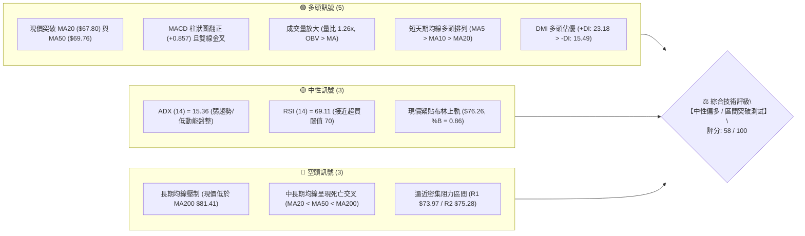
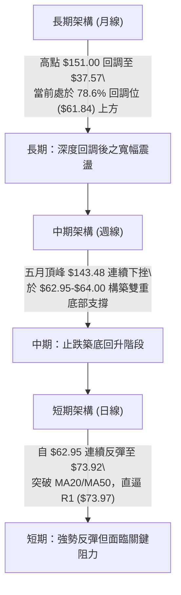
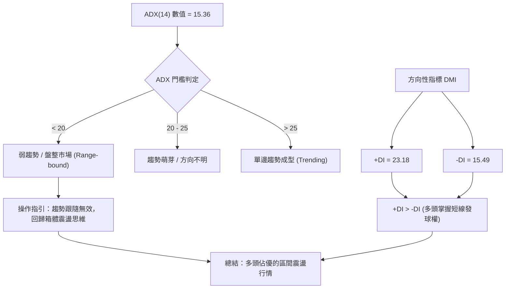
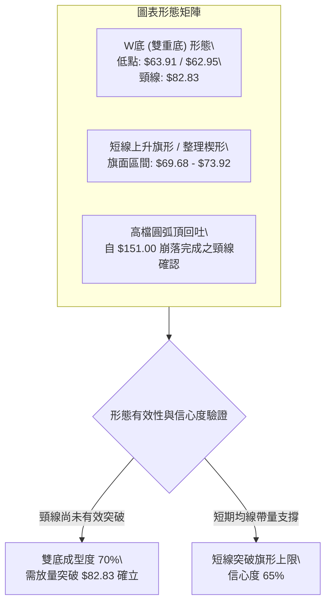
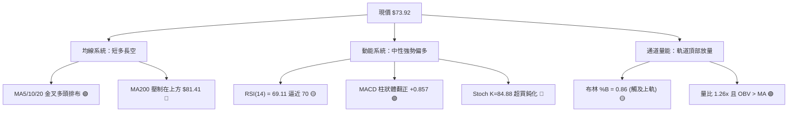
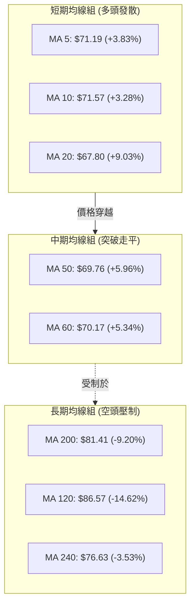
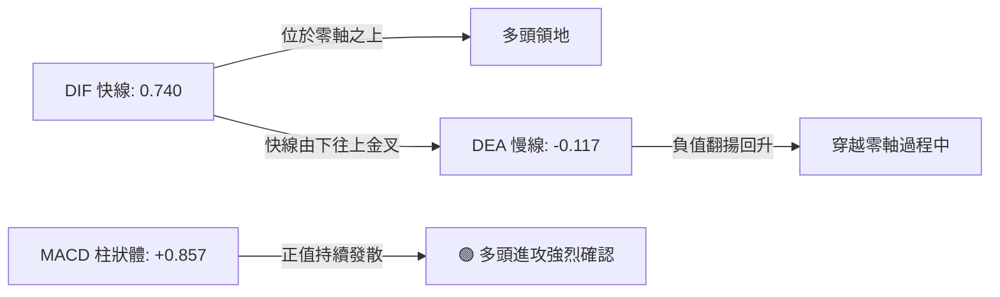
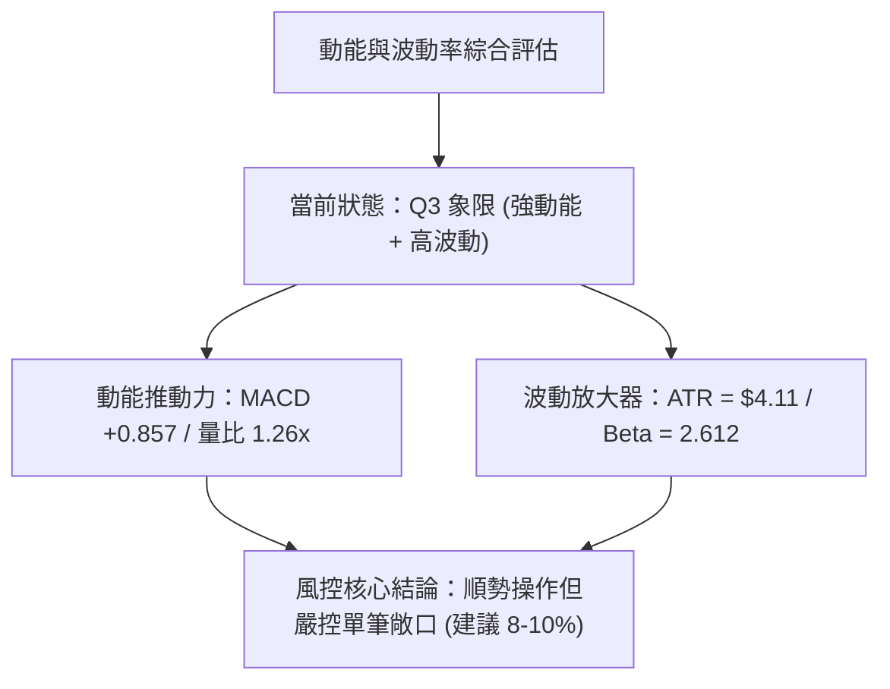
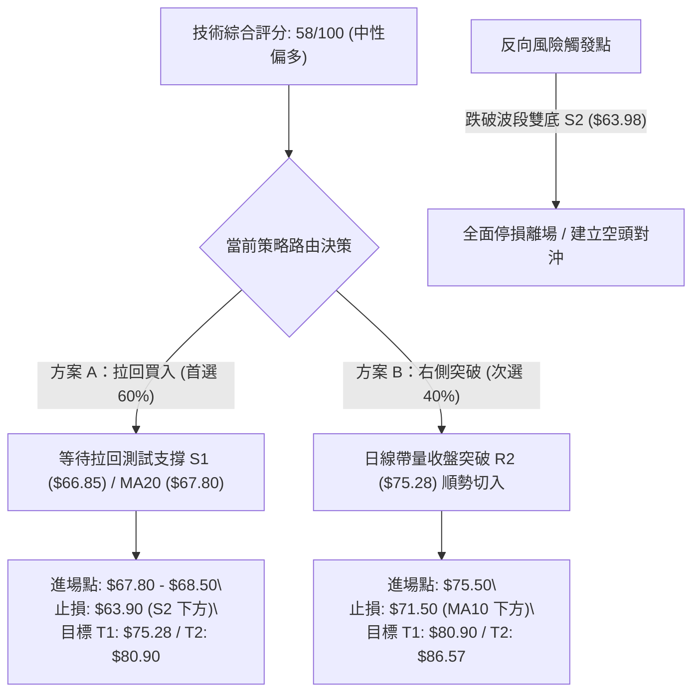
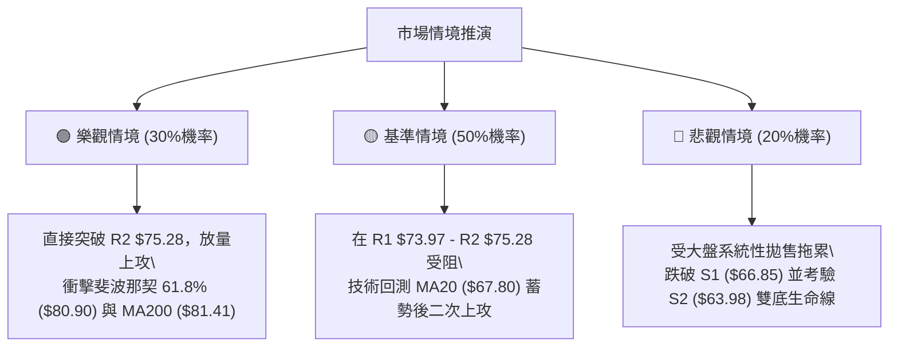

# RKLB 技術分析報告

> **報告日期**：2026-10-05 ｜ **語言**：繁體中文 ｜ **數據來源**：Yahoo Finance ｜ **當前價格**：$73.92

---

## 目錄

| 章節 | 內容 |
|------|------|
| [1. 技術面概覽](#1-技術面概覽) | 訊號儀表板、核心指標、評分卡 |
| [2. 趨勢分析](#2-趨勢分析) | 多時框趨勢、長中短期走勢、12個月走勢圖 |
| [3. 圖表形態分析](#3-圖表形態分析) | 形態識別、信心度評估、K線組合 |
| [4. 支撐與阻力](#4-支撐與阻力) | 關鍵價位聚類、斐波那契回調結構 |
| [5. 技術指標深度解讀](#5-技術指標深度解讀) | 均線系統、RSI、MACD、布林通道、OBV |
| [6. 動能與波動率](#6-動能與波動率) | 動能四象限、ATR 波動度、Beta 系統風險 |
| [7. 多時框架總結](#7-多時框架總結) | 時框架矩陣、ADX 收斂規則、主導結論 |
| [8. 交易策略建議](#8-交易策略建議) | 策略路由、進出場點位、情境機率階梯 |
| [9. 風險提示與監控](#9-風險提示與監控) | 監控清單、情境推演、風控參數 |
| [📋 報告總結](#-報告總結) | 全文核心結論與投資決策摘要 |

---

## 1. 技術面概覽

### 🎯 技術訊號儀表板



### 📊 核心指標速覽表

| 指標類別 | 指標名稱 | 當前數值 | 訊號 | 專業解讀 |
|----------|----------|----------|------|----------|
| **價格** | 現價 (Close) | $73.92 | 🟢 | 站上短期所有均線，當前測試 R1 阻力位 |
| **均線** | 短期均線 (MA20) | $67.80 | 🟢 | 價格位於 MA20 上方 (+9.03%)，短線支撐強勁 |
| **均線** | 中期均線 (MA50) | $69.76 | 🟢 | 成功突破中期生命線 (+5.96%)，中期空頭減弱 |
| **均線** | 長期均線 (MA200)| $81.41 | 🔴 | 位於 MA200 下方 (-9.20%)，長期空頭壓制未除 |
| **動能** | RSI(14) | 69.11 | 🟡 | 位於強勢中性區間頂部，未達嚴重超買但面臨心理壓制 |
| **動能** | MACD (12,26,9) | 0.740 / -0.117 | 🟢 | DIF 線由下往上穿過 DEA，柱狀體 +0.857 持續擴散 |
| **動能** | 隨機指標 (Stoch) | K: 84.88 / D: 70.92| 🔴 | 進入 80 以上超買區，短線存在乖離修正或鈍化拉回需求 |
| **趨勢** | ADX (14) | 15.36 | 🟡 | ADX < 25 表示無單邊趨勢，當前屬於大區間震盪築底行情 |
| **通道** | 布林通道 (%B) | 0.86 | 🟡 | 位於上軌 ($76.26) 與中軌 ($67.80) 之間，帶寬收斂後初展 |
| **波動** | ATR(14) | $4.11 | 🟡 | 佔現價 5.56%，維持高波動特性，需設定足額止損寬度 |
| **量能** | 20日成交量比 | 1.26x | 🟢 | 最新量 26.74M 高於均量 21.28M，量增價揚配合良好 |

### 🏆 技術評分卡

```
╔══════════════════════════════════════════════════════════════╗
║              技術評分卡 — RKLB (2026-10-05)                   ║
╠══════════════════════════════════════════════════════════════╣
║ 趨勢強度 (ADX/DMI)    ██████░░░░░░░░░░░░░░  32/100  🟡 弱勢盤整║
║ 動能指標 (RSI/MACD)   ██████████████░░░░░░  70/100  🟢 動能充沛║
║ 支撐穩定度 (S1-S3)     ████████████████░░░░  78/100  🟢 底部紮實║
║ 成交量配合 (OBV/量比)  ██████████████░░░░░░  72/100  🟢 價漲量增║
║ 形態完整度 (雙底雛形)  ████████████░░░░░░░░  60/100  🟡 頸線未破║
║ 均線架構 (短期vs長期)  ████████░░░░░░░░░░░░  38/100  🔴 長線空頭║
╠══════════════════════════════════════════════════════════════╣
║ 綜合評分              ███████████░░░░░░░░░  58/100  🟡 中性偏多║
╚══════════════════════════════════════════════════════════════╝
```

---

## 2. 趨勢分析

### 🌐 多時框趨勢分析



### 📈 長期趨勢 — 12個月走勢圖（Unicode）

```
RKLB 月線收盤價走勢圖（2025-10 至 2026-10）
價格軸 ($)
$150 ┤                                           
$140 ┤                                  ● $143.48 (2026-05 歷史波段高點)
$130 ┤                                 ╱ ╲
$120 ┤                                ╱   ╲
$110 ┤                               ╱     ● $101.65
$100 ┤                              ╱
 $90 ┤                             ╱
 $80 ┤         ● $80.07           ● $82.51
 $70 ┤        ╱ ╲       ● $69.76 ╱          ╲                    ● $73.92 (現價)
 $60 ┤  ● $62.98 ╲     ╱ ╲      ╱            ╲  ● $64.95 ● $63.92╱
 $50 ┤   ╲         ● $69.10● $64.22           ╲╱        (雙底打底)
 $40 ┤    ● $42.14
     └────┬───────┬───────┬───────┬───────┬───────┬───────┬───────┬───────┬────
        2025-10 2025-12 2026-01 2026-03 2026-04 2026-05 2026-06 2026-08 2026-10
```

#### 走勢特徵分析表格

| 階段區間 | 起止月份 | 價格變動 | 區間漲跌幅 | 結構特徵與技術解讀 |
|----------|----------|----------|------------|--------------------|
| **第一階段：震盪盤堅** | 2025-10 → 2026-01 | $62.98 → $80.07 | +27.13% | 突破 $42.14 低點後的階梯式推升，均線多頭散開 |
| **第二階段：蓄勢整理** | 2026-01 → 2026-03 | $80.07 → $64.22 | -19.79% | 漲多拉回修正，於 $64.00 關卡獲得買盤支撐 |
| **第三階段：主升暴漲** | 2026-03 → 2026-05 | $64.22 → $143.48| +123.42%| 歷史級極端主升浪，月線放量長陽，觸及 52W 高點 $151.00 |
| **第四階段：大幅回撤** | 2026-05 → 2026-07 | $143.48 → $64.95| -54.73% | 獲利了結與籌碼出逃，價格近乎腰斬，跌破多條長期均線 |
| **第五階段：底部築底** | 2026-07 → 2026-09 | $64.95 → $69.68 | +7.28%  | 於 $63.92-$64.95 進行橫盤換手，打出堅實波段雙底 |
| **第六階段：短線回升** | 2026-09 → 2026-10 | $69.68 → $73.92 | +6.08%  | 短期買盤回流，突破 50日均線，測試首道密集壓力帶 |

### 📊 中期趨勢（週線分析）

從近 20 週數據觀察，價格在 2026-05-31 達到 $143.48 的高峰後，經歷了連續 8 週的雪崩式下跌，並在 2026-07-26 下探至 $63.91（週 RSI 觸及極度超賣值 15.6）。隨後在 2026-08-09 反彈至 $82.83，但受阻於斐波那契 61.8%（$80.90）與 MA200 壓力；隨後在 2026-09-13 二度探底至 $62.95，構成經典的中期 W底（雙重底）結構。

```
近期週線支撐與阻力結構示意圖
$82.83 ───────────────────────────┐ (頸線阻力 / 8月波段高點)
                                  │
$73.92 ─────────── ◄ 當前現價 ────┤
                                  │
$63.91 ──────┬────────────────────┘
 (7月低點)   │
             └──── $62.95 (9月低點 / 雙底確立點)
```

### ⚡ 趨勢強度評估（ADX 解讀）



#### ADX 數值對照與環境界定

| 指標變數 | 當前讀數 | 門檻區間 | 技術含義 |
|----------|----------|----------|----------|
| **ADX(14)** | **15.36** | 0 – 20 | **極弱趨勢 / 無趨勢狀態**。市場處於籌碼換手與收斂三角形整理期，不具備走出單邊大行情的宏觀動能。 |
| **+DI (14)** | **23.18** | > -DI | **多方佔優**。短期多頭推升力道強於空方下壓力道。 |
| **-DI (14)** | **15.49** | < +DI | **空方衰退**。賣壓已在 9 月探底中大量釋放。 |
| **ADX 規則收斂** | **依規則 14** | **ADX < 25** | **定調為盤整行情**。中長期單邊指標暫時失效，交易邊界嚴格依循**布林通道上下軌 ($59.34 - $76.26)** 與**密集支撐阻力結構**。 |

---

## 3. 圖表形態分析

### 🔍 形態識別系統



#### 圖表形態信心度評估表

| 形態名稱 | 信心度 | 判斷依據（嚴格引用數據） | 完成度 | 目標價（附嚴謹計算式） |
|----------|--------|--------------------------|--------|------------------------|
| **中期雙底 (W-Bottom)** | **70%** | 左底 2026-07-26 收盤 $63.91，右底 2026-09-13 收盤 $62.95（吻合支撐 S2 $63.98 聚類），兩底間隔 7 週，成交量由 92.14M 降至 85.20M 呈現縮量築底。 | 70%（頸線未過） | 頸線 $82.83 (2026-08-09高點) + 形態高度 ($82.83 - $62.95 = $19.88) = **$102.71**（若突破頸線成立） |
| **短線上升通道** | **65%** | 9月下旬自 $62.95 發動連續 3 週收陽，量能放大至 111.51M，現價 $73.92 穩居 MA20 ($67.80) 之上。 | 85% | 突破當前阻力 R1 $73.97 後，指向布林上軌與阻力位 R2 **$75.28** |
| **大型頭肩頂反轉** | **35%** | 2026-05 衝刺 $151.00 後快速崩跌，無典型右肩架構，跌勢屬於事件型去槓桿。 | 訊號不足 | 數據不足以確認幾何對稱性，信心度 < 50%，僅做指標型均線下偏解讀，不預設空頭目標價。 |

### 🕯️ 重要K線形態分析

| 觀測週期 | 關鍵收盤價 | K線形態特徵 | 量能與指標變化 | 專業技術解讀 | 多空訊號 |
|----------|------------|-------------|----------------|--------------|----------|
| **2026-05** | $143.48 | 歷史天量長上影天劍線 | 成交量極限放大，觸及 $151.00 後狂瀉 | 典型主力派發與多頭力竭信號，確立長期大頂 | 🔴 極度看空 |
| **2026-07** | $64.95 | 懸崖式跳水大陰線 | 單週量縮至 92.14M，週 RSI 摔至 15.6 | 恐慌盤湧出，進入嚴重超賣區，空頭動能釋放完畢 | 🟡 止跌醞釀 |
| **2026-08** | $63.92 | 長下影探底十字星 | 月線低點打至 $63.91，獲波段買盤強力托底 | 測試下方 S2 ($63.98) 支撐有效，初步確認底部區間 | 🟢 築底信號 |
| **2026-09** | $69.68 | 吞噬型實體中陽線 | 週成交量回升至 106.89M，MACD 柱狀體翻正 | 形成波段右底，多方全面收復 MA20，發動反彈浪 | 🟢 短線看多 |
| **2026-10** | $73.92 (現價)| 逼近前期高點光頭實體 | 週量持平 107.18M，日量放大 1.26x 均量 | 多頭持續推升，正直接撞擊密集阻力區 R1 $73.97 | 🟡 阻力警示 |

### 📉 ASCII 走勢形態示意圖

```
RKLB 中期雙底 (W-Bottom) 與短線反彈結構示意圖

$82.83 ─────────────────────────────── 頸線阻力位 (August Peak)
                   ▲
                  ╱ ╲
                 ╱   ╲
$73.92 ─────────┼─────▲─────────────── 當前價格測試 R1 ($73.97)
               ╱       ╲             ╱
              ╱         ╲           ╱
$67.80 ──────┼───────────┼─────────┼─ MA20 / 布林中軌
            ╱             ╲       ╱
           ╱               ╲     ╱
$63.91 ───●                 └───● ─── $62.95 (右底)
       (左底 S2)                (波段支撐聚類)
       2026-07-26              2026-09-13
       
       └────────── W 底構築期 (7週) ─────────┘
```

### 🎯 形態目標價計算

根據經典技術分析測幅原理，形態突破後之理論目標價依下列算式嚴格推導：

1. **雙底頸線 (Neckline)**：取自兩底之間之反彈最高收盤價，即 2026-08-09 之 **$82.83**。
2. **形態最低點 (Pattern Trough)**：取自雙底最低價，即 2026-09-13 之 **$62.95**。
3. **形態垂直高度 (Pattern Height, H)**：
   $$\text{H} = \$82.83 - \$62.95 = \$19.88$$
4. **最小量度目標價 (Minimum Target)**：
   $$\text{Target} = \text{頸線} + \text{H} = \$82.83 + \$19.88 = \mathbf{\$102.71}$$
   *(註：此目標價需待價格正式日線收盤突破 $82.83 頸線後方告啟動，當前尚未觸發)*。

---

## 4. 支撐與阻力

### 🗺️ 關鍵價位分布圖（Unicode）

```
╔══════════════════════════════════════════════════════════════╗
║               RKLB 關鍵價位結構分布圖                         ║
╠══════════════════════════════════════════════════════════════╣
║ $80.90 ║██████████████████████████████║ 斐波那契 61.8% 關鍵壓║
║ $78.90 ║████████████████████████      ║ 強阻力 R3 (波段高點) ║
║ $76.26 ║██████████████████            ║ 布林帶上軌動態阻力   ║
║ $75.28 ║████████████████████          ║ 關鍵阻力 R2          ║
║ $73.97 ║████████████████████████      ║ 立即阻力 R1 (前波高點)║
║ $73.92 ╠══════════════════════════════╣ ◄ 現價 (正在測試 R1) ║
║ $69.76 ║▓▓▓▓▓▓▓▓▓▓▓▓▓▓▓▓              ║ MA50 生命線支撐      ║
║ $67.80 ║▓▓▓▓▓▓▓▓▓▓▓▓▓▓▓▓▓▓▓▓          ║ MA20 / 布林中軌支撐  ║
║ $66.85 ║▓▓▓▓▓▓▓▓▓▓▓▓▓▓▓▓▓▓▓▓▓▓        ║ 近期支撐 S1          ║
║ $63.98 ║██████████████████████████████║ 強支撐 S2 (雙底低點) ║
║ $61.84 ║██████████████████████████    ║ 斐波那契 78.6% 回調位║
║ $61.45 ║██████████████████████████████║ 極限防守支撐 S3      ║
╚══════════════════════════════════════════════════════════════╝
```

### 🚧 阻力位分析表

所有阻力價位均嚴格取自 OHLCV 波段高點聚類數據：

| 阻力級別 | 精確價位 | 距離現價 | 形成原因與籌碼結構 | 突破難度 | 重要性 |
|----------|----------|----------|--------------------|----------|--------|
| **R1** | **$73.97** | +0.07% | 近期波段回升的第一密集套牢高點，與現價僅差 5 美分，為多方當面第一道關卡。 | 🟡 中等 | 關鍵突破點 |
| **R2** | **$75.28** | +1.85% | 7月反彈次高點與日線布林通道上軌（$76.26）共振區間，密集籌碼換手帶。 | 🟡 中等偏高 | 短線獲利了結點 |
| **R3** | **$78.90** | +6.74% | 8月中旬高檔盤整箱體下沿，一旦到達此處將直逼 MA200（$81.41）與 61.8% 斐波那契重壓。 | 🔴 極高 | 波段目標區間 |

### 🛡️ 支撐位分析表

所有支撐價位均嚴格取自 OHLCV 波段低點聚類數據：

| 支撐級別 | 精確價位 | 距離現價 | 形成原因與籌碼結構 | 守住機率 | 重要性 |
|----------|----------|----------|--------------------|----------|--------|
| **S1** | **$66.85** | -9.56% | 近期拉回整理平台低點，接近 MA20（$67.80）動態均線防禦位置。 | 🟢 75% | 短線多頭防守線 |
| **S2** | **$63.98** | -13.44% | 2026-07-26（$63.91）與 2026-08-30（$64.39）波段低點聚類核心，W底左腳與底頸結構。 | 🟢 85% | 中期生命線 |
| **S3** | **$61.45** | -16.87% | 近一年極端支撐聚類，疊加斐波那契 78.6%（$61.84），為多頭全面崩盤前之最後堡壘。 | 🟢 90% | 長期戰略底線 |

### 📐 斐波那契回調位分析

依據 52 週絕對極值區間（低點 **$37.57** → 高點 **$151.00**），總波幅達 **$113.43**，精確斐波那契階梯分佈如下：

```
0.0%  (52W High) ──────────────────────────────── $151.00
23.6%            ──────────────────────────────── $124.23
38.2%            ──────────────────────────────── $107.67
50.0%            ──────────────────────────────── $ 94.28
61.8% (黃金分割)  ──────────────────────────────── $ 80.90
                 [當前價格 $73.92 處於此區間]
78.6% (極限支撐)  ──────────────────────────────── $ 61.84
100.0% (52W Low) ──────────────────────────────── $ 37.57
```

- **當前位置解讀**：現價 **$73.92** 精確運行於 **78.6% 回調位 ($61.84)** 與 **61.8% 回調位 ($80.90)** 之間。
- **技術意涵**：
  1. 股價在跌破 61.8%（$80.90）黃金分割位後，並未一路崩跌回 100%（$37.57），而是在 78.6%（$61.84）上方獲買盤強勢承接（兩次波段低點 $63.91 與 $62.95 均守穩在 $61.84 之上），確認 $61.84 - $63.98 為極強的機構吸籌緩衝墊。
  2. 當前向上反彈的黃金分割首要目標為 **61.8% ($80.90)**，該位置與長期均線 MA200 ($81.41) 形成強烈的「均線—斐波那契共振壓力帶」，為中長期扭轉為多頭行情的終極分水嶺。

---

## 5. 技術指標深度解讀

### 🎛️ 指標訊號總覽



### 📈 移動平均線排列分析



#### 均線架構專業評析
1. **多空排列層次**：目前長期架構呈現典型的空頭排列（$MA20 < MA50 < MA200$），顯示自 2026 年 5 月高點以來的籌碼沉澱仍需時間化解。
2. **短期黃金交叉**：極短線呈現強勁向上修復，現價 $73.92 已連續收復 MA5 ($71.19)、MA10 ($71.57)、MA20 ($67.80)、MA50 ($69.76) 與 MA60 ($70.17)。MA20 開始由下向上勾頭，短線乖離率達到 +9.03%，反映反彈力道凌厲。
3. **長期均線阻力層**：上方 MA240 ($76.63) 與 MA200 ($81.41) 構成兩道巨幅下壓均線，若無法配合持續放量，價格在接近 $76.60 - $81.40 區間極易引發技術性賣壓。

### 📉 RSI(14) 分析

```
RSI(14) 動能強度進度條
0       20       40       60  69.11 70       80      100
├────────┼────────┼────────┼────▲───┼────────┼────────┤
░░░░░░░░░░░░░░░░░░░░░░░░░░████████░░░░░░░░░░░░░░░░░░░░░
[超賣區]       [弱勢偏空]    [強勢多頭]    [嚴重超買區]
```

- **當前數值**：**69.11**。
- **區間定義**：指標處於 60-70 的強勢多頭控制區，但距離 70 超買警戒線僅咫尺之遙。
- **背離檢驗**：
  - *底背離驗證*：2026-07-26 週線價格收 $63.91，RSI 為 15.6；2026-09-13 價格再次下探 $62.95（價格破前低），但 RSI 卻大幅拉升至 27.1。**週線級別標準「底背離」完全成立**，成功預示了本次自 $62.95 直奔 $73.92 的大幅反彈。
  - *頂背離檢驗*：目前日線 RSI 隨價格同向創出近 7 週新高，**無明顯頂背離**，動能與價格走勢匹配，暫無急速崩跌訊號，但因逼近 70，追高風險急劇升高。

### 📊 MACD(12/26/9) 訊號解讀



- **MACD 指標數值**：DIF: **0.740** / DEA (Signal): **-0.117** / Histogram: **+0.857**。
- **訊號解析**：
  1. 快線 DIF 成功穿破零軸並與 Signal 線形成低位黃金交叉，這是近 4 個月來首次出現的顯著日線 MACD 零軸上翻多訊號。
  2. 柱狀體數值達 +0.857，柱體連續多日向上擴張，顯示短期內買盤動能具備連續性，並非單日假突破。

### 📦 布林通道分析

```
RKLB 布林通道 (20, 2) 結構示意圖

$76.26 ──────────────────────────────── 上軌 (Upper Band)
                     ▲
$73.92 ─────────────┼────────────────── 現價 (%B = 0.86，直逼上軌)
                    │
$67.80 ─────────────┴────────────────── 中軌 (MA20 / Middle Band)
                                       
$59.34 ──────────────────────────────── 下軌 (Lower Band)
```

- **軌道數據**：上軌 **$76.26** / 中軌 (MA20) **$67.80** / 下軌 **$59.34**。
- **%B 指標解析**：%B = (73.92 - 59.34) / (76.26 - 59.34) = **0.86**。
- **帶寬特徵**：
  - 帶寬 (Bandwidth) = ($76.26 - $59.34) / $67.80 = 24.95%，經歷了 8-9 月極度壓縮後，通道開始向上「開口」。
  - 價格緊貼上軌運行（%B > 0.80），展現典型「沿軌推升」的短線強勢特徵；但若無法有效放量突破上軌 $76.26，將面臨向中軌 $67.80 回測修復的均值回歸壓力。

### 💹 成交量分析（量價配合度）

1. **成交量乘數**：最新單日成交量 **26,741,800 股**，較 20 日平均成交量（21,287,215 股）放大 **1.26 倍**，較 50 日均量（19,085,372 股）放大 **1.40 倍**。
2. **週量驗證**：近三週成交量由 85.20M 連續增至 106.89M、111.51M，推動價格自 $62.95 上漲至 $73.92，呈現**標準量增價揚**的健康多頭配合。
3. **能量潮 (OBV) 解讀**：官方數據明確指出「**OBV > MA → 量能支撐上漲**」。OBV 指標線突破短期平滑均線，顯示近兩週主力資金呈現淨流入格局，籌碼由鬆散散戶流向機構法人的特徵顯著。

---

## 6. 動能與波動率

### ⚡ 動能評估四象限

| 象限 | 動能維度 (Momentum) | 波動維度 (Volatility) | 當前判定 | 特徵說明與對應操作規範 |
|:---:|:---:|:---:|:---:|---|
| **Q1** | **強動能 (High)** | **低波動 (Low)** | ⚪ | 最佳單邊趨勢機會，可重倉追隨單邊行情。 |
| **Q2** | **弱動能 (Low)** | **低波動 (Low)** | ⚪ | 昏睡盤整，缺乏波動，適合期權賣方或觀望。 |
| **Q3** | **強動能 (High)** | **高波動 (High)** | **✓ (當前所處)**| **高爆發、高風險、寬幅震盪。動能指標（RSI 69.11、MACD翻正）強烈，疊加高 ATR 與高 Beta。操作需縮減倉位、放大止損空間。** |
| **Q4** | **弱動能 (Low)** | **高波動 (High)** | ⚪ | 混亂失控市場，假突破頻發，極易造成雙向停損。 |



### 📊 ATR 波動率分析

- **ATR(14) 絕對數值**：**$4.11**。
- **價格百分比 (ATR / Price)**：**5.56%**。每日平均震盪幅度超過 5.5%，顯示 RKLB 具備極強的投機與成長股特性。
- **動態止損距離設定建議**：
  - *短線激進型 (1.0x ATR)*：止損距離為 $4.11。以現價 $73.92 計算，短線多頭停損點設為 **$69.81**（剛好與 MA50 $69.76 共振）。
  - *波段穩健型 (1.5x ATR)*：止損距離為 $4.11 × 1.5 = $6.16。停損點設為 **$67.76**（精確覆蓋 MA20 $67.80 中軌）。
  - *中長線趨勢型 (2.0x ATR)*：止損距離為 $4.11 × 2.0 = $8.22。停損點設為 **$65.70**（介於 S1 $66.85 與 S2 $63.98 之間）。

### 📐 Beta 與市場相關性

- **Beta 係數**：**2.612**。
- **市場敏感度解讀**：
  1. RKLB 具備標普 500 指數 2.61 倍的波動放大效應。當美股大盤指數波動 1% 時，理論上 RKLB 將產生約 2.61% 的同向變動。
  2. 屬於超高彈性成長標的，極受市場流動性、宏觀利率預期與國防航太主題催化的影響。
  3. 機構持股比例達 61.9%，空單佔流通股比率（Short % Float）達 7.3%，空頭回補天數（Short Ratio）為 2.61。當前反彈具有部分空頭回補（Short Squeeze）推波助瀾的特質。

---

## 7. 多時框架總結

### 📋 時框架評分表

| 時框架 | 趨勢方向 | 動能狀態 | 均線排列狀況 | 圖表形態識別 | 綜合評分 | 戰略建議 |
|--------|----------|----------|--------------|--------------|:--------:|----------|
| **長期 (月線)** | 震盪偏弱 | 弱勢築底 | 空頭排列 (低於 MA200) | 自 $151 天花板墜落後之 78.6% 回調築底 | **45/100** | 長線定期定額或逢低戰略佈局 |
| **中期 (週線)** | 底部回升 | 多頭回暖 (底背離成立) | MA20走平，MA50壓制 | 7週雙重底 (W底) 構築中 | **62/100** | 波段逢拉回支撐做多 |
| **短期 (日線)** | 強勢反彈 | 強動能 (逼近超買) | 多頭發散 (收復 MA5-50) | 沿布林上軌推升，衝擊 R1 | **68/100** | 嚴禁追高，等待拉回或突破追隨 |

### 🔲 綜合訊號矩陣

```
╔══════════════════════════════════════════════════════════════════════════╗
║                    多時框架綜合訊號矩陣                                  ║
╠══════════════════════════════════════════════════════════════════════════╣
║ 時框維度 ║ 趨勢訊號 ║ 動能訊號 ║ 量能配合 ║ 形態訊號 ║ 指標一致性評價     ║
╠══════════════════════════════════════════════════════════════════════════╣
║ 日線級別 ║  🟢 看多  ║  🟡 偏多  ║  🟢 良好  ║  🟢 突破  ║ 短期訊號高度一致   ║
║ 週線級別 ║  🟢 偏多  ║  🟢 底背離║  🟢 放大  ║  🟢 雙底  ║ 中期共振止跌翻揚   ║
║ 月線級別 ║  🔴 看空  ║  🟡 中性  ║  🟡 沉澱  ║  🔴 深度修正║ 長線仍受大頂均線壓制║
╚══════════════════════════════════════════════════════════════════════════╝
```

### ⚖️ 多時框收斂結論

依據多時框收斂嚴格規則第 14 條：
1. **行情模式界定**：當前 ADX(14) 讀數為 **15.36 (< 25)**，系統強制收斂為「**盤整行情 (Range-bound)**」，而非單邊趨勢行情。
2. **主導維度依歸**：在 ADX < 25 的環境下，中長期單邊趨勢指標退居次席，**日線布林通道上下軌 ($59.34 - $76.26)** 與近一年波段聚類價位成為主要交易邊界。
3. **最終唯一方向性結論**：**【中性偏多（逢低做多／區間邊界操作）】**。
   - 儘管月線級別受制於 MA200 ($81.41) 仍屬空頭排列，但日線與週線的「雙底成型 + MACD 金叉 + 週線底背離 + OBV 增強」提供了充沛的反彈動能。
   - 由於現價 $73.92 已高度接近阻力位 R1 ($73.97)、R2 ($75.28) 及布林上軌 ($76.26)，當前位置「不具備直接追價的安全邊際」，操作主軸收斂為：**等待價格回測 S1 支撐或放量突破 R2 後的順勢跟進**。

---

## 8. 交易策略建議

### 🗺️ 策略決策流程圖



### 🧭 策略路由

> **當前主策略方向 = 【中性偏多 / 逢拉回回踩支撐做多】（依評分卡得分：58 / 100）**
> 
> *路由說明：評分處於 40-60 分區間之高位，且收斂至 ADX < 25 盤整行情。不盲目在阻力位前夕追多，亦不在多頭量能充沛時做空，核心在於鎖定區間支撐阻力之高盈虧比機會。*

### 🎯 價格情境階梯（Price Scenarios）

所有價位均嚴格取自數據庫計算數值：

| 觸發條件 | 下一目標 | 後續延伸 | 情境技術含義 |
|----------|----------|----------|--------------|
| **強勢突破 R1 ($73.97)** | R2 ($75.28) | 布林上軌 ($76.26) | 短線多頭發動連鎖反應，測試區間頂部 |
| **放量突破 R2 ($75.28)** | R3 ($78.90) | 斐波那契 61.8% ($80.90) | 走出低位箱體，展開挑戰 MA200 之大級別行情 |
| **現價區間震盪 ($73.92)**| MA50 ($69.76)| MA20 ($67.80) | 消化 RSI 69.11 超買乖離，蓄勢換手 |
| **跌破短線支撐 S1 ($66.85)**| S2 ($63.98) | 斐波那契 78.6% ($61.84) | 中期雙底頸線回測，多頭防線面臨嚴峻考驗 |
| **跌破核心強支撐 S2 ($63.98)**| S3 ($61.45) | 52W 低點 ($37.57) | 雙重底形態失敗，下探長期極限支撐 |

### 📊 情境機率分佈

| 預測情境 | 發生機率 | 主要技術依據 |
|----------|:--------:|--------------|
| **情境一：受阻拉回後震盪走高 (主情境)** | **50%** | RSI 逼近 70 超買區且面臨 R1 ($73.97) / R2 ($75.28)，但 MACD 翻正與量比 1.26x 支持拉回中軌 ($67.80) 後重啟漲勢。 |
| **情境二：直接放量強勢突破 (次情境)** | **30%** | OBV 強勢上升，若主力資金借助券商評級調升（花旗近期給予 Buy）暴力拉抬，可直接貫穿 R2 直奔 $80.90。 |
| **情境三：反轉下挫跌破 S2 (風險情境)** | **20%** | 長期 MA200 壓制力道過大，且 ADX < 25 缺乏長期買盤，大盤波動引發高 Beta (2.612) 股票深度回調。 |

### 🟢 主策略詳情

| 策略要素 | 策略 A：左側逢低佈局（首選策略） | 策略 B：右側突破追隨（次選策略） |
|----------|----------------------------------|----------------------------------|
| **進場條件** | 價格受阻回落，回踩 MA20/S1 企穩出現下影線 | 日線收盤價帶量（>25M）正式突破 R2 阻力 |
| **進場價格** | **$67.80**（MA20 與布林中軌支撐處） | **$75.50**（確認突破 R2 $75.28 後順勢進場） |
| **目標價 T1** | **$75.28**（阻力位 R2，盈餘空間 +11.03%） | **$80.90**（斐波那契 61.8% 阻力，空間 +7.15%） |
| **目標價 T2** | **$80.90**（斐波那契 61.8%，盈餘空間 +19.32%）| **$86.57**（MA120 長期均線位置，空間 +14.66%） |
| **止損價格** | **$63.90**（略低於雙底支撐 S2 $63.98） | **$71.50**（跌破 MA10 $71.57 動態支撐） |
| **風險空間** | -$3.90 (-5.75%) | -$4.00 (-5.30%) |
| **風險報酬比 (R:R)**| **1 : 2.87** (以 T1/T2 均值 $78.09 計算) | **1 : 2.05** (以 T1/T2 均值 $83.74 計算) |
| **勝率預估** | **65%** | **55%** |
| **建議倉位** | **10% 總資金** | **8% 總資金** |

### 🔴 反向風險觸發點（對沖與停損提示）

- **全面停損警戒線**：日線收盤價**跌破 S2 ($63.98)**。
  - *含義*：若跌破 $63.98，代表 7-9 月歷經 7 週構築的雙重底形態徹底被破壞，空頭將重新測試 S3 ($61.45) 乃至斐波那契 78.6% ($61.84)。
  - *應對*：所有多頭部位無條件強制停損離場，短線交易者可考慮建立輕度空頭部位或買入認沽期權對沖系統性下行風險。

### ⭐ 整體訊號強度評星

```
做多訊號強度：★★★☆☆  (3.5/5星 — 短中期多頭完備，惟遭逢結構性大阻力)
做空訊號強度：★★☆☆☆  (2.0/5星 — 僅長線均線偏空，缺乏即時做空動能)
整體可信度：  ★★★★☆  (4.0/5星 — 多時框指標共振度高，價位邊界極其清晰)
```

---

## 9. 風險提示與監控

### ✅ 關鍵監控指標 Checklist

```
╔══════════════════════════════════════════════════════════════╗
║               每日盤後交易監控清單 (Checklist)               ║
╠══════════════════════════════════════════════════════════════╣
║ [ ] 價格收盤是否站穩 R1 ($73.97)？ (突破則多頭加速)           ║
║ [ ] 日成交量是否維持在 21.28M (20日均量) 之上？               ║
║ [ ] RSI(14) 是否突破 70 產生嚴重頂背離或超買衰竭？            ║
║ [ ] MACD 柱狀圖是否持續擴張 (高於 +0.857)？                   ║
║ [ ] 價格拉回時，MA20 ($67.80) 能否提供有效支撐？              ║
║ [ ] 核心防線：S2 ($63.98) 是否完好無損？ (跌破全數止損)        ║
║ [ ] 大盤波動環境：標普500/那指是否轉弱 (Beta 2.612 放大效應)  ║
╚══════════════════════════════════════════════════════════════╝
```

### ⚠️ 風險場景分析



### 🛡️ 風險管理重要提醒

1. **高波動率防禦（ATR 警示）**：當前 ATR 為 $4.11，單日震盪幅度達 5.56%。嚴格禁止使用過高財務槓桿，且單筆停損金額不可超過總投資帳戶淨值的 1.5% - 2.0%。
2. **高 Beta 特性防禦（Beta 2.612）**：RKLB 屬於典型的進攻性成長標的，在大盤指數回調期常出現超額下殺。若大盤指數（如 QQQ / SPY）跌破其 20 日均線，應主動將 RKLB 倉位縮減 30% - 50%。
3. **空頭反撲風險**：Short % Float 達 7.3%，一旦價格在 R2 ($75.28) 遇阻滯漲，空方主力可能趁機反撲打壓，切忌在布林上軌附近盲目重倉追多。

---

## 📋 報告總結

```
╔══════════════════════════════════════════════════════════════════════════╗
║                    RKLB 技術分析報告總結                                 ║
╠══════════════════════════════════════════════════════════════════════════╣
║ 報告日期：2026-10-05                                                     ║
║ 當前價格：$73.92                                                         ║
║ 分析評級：⚖️ 中性偏多 / 區間突破測試階段 (技術評分: 58/100)               ║
║                                                                          ║
║ 關鍵結論：                                                               ║
║ ├─ 長期趨勢：🔴 偏空 (仍處於 MA200 $81.41 之下，屬於高檔回調後之築底期)  ║
║ ├─ 中期趨勢：🟢 翻多 (週線 W底成型，收穩於斐波那契 78.6% $61.84 之上)    ║
║ ├─ 短期趨勢：🟢 強勁 (短期均線多頭排列，MACD 柱狀體翻正達 +0.857)        ║
║ ├─ 關鍵支撐：S1: $66.85 ｜ S2: $63.98 (核心生命線) ｜ S3: $61.45        ║
║ ├─ 關鍵阻力：R1: $73.97 ｜ R2: $75.28 ｜ R3: $78.90 ｜ 61.8%: $80.90    ║
║ └─ 分析師共識目標：均價 $109.15 (最高 $150.00 / 最低 $64.00)             ║
║                                                                          ║
║ 最優策略組合：                                                           ║
║ 1. 🥇 最佳機會：【策略 A - 逢低佈局】回踩 MA20 ($67.80) 進場，止損       ║
║                 設於 $63.90，目標看 $75.28 與 $80.90，風報比 1:2.87。    ║
║ 2. 🥈 次選機會：【策略 B - 右側突破】放量突破 R2 ($75.28) 追多，止損      ║
║                 設於 $71.50，目標看 $80.90，風報比 1:2.05。              ║
║ 3. 🥉 保守選擇：維持觀望，等待日線級別消化 RSI 69.11 鈍化，或待 ADX > 25 ║
║                 確認走出單邊趨勢後再行介入。                             ║
╚══════════════════════════════════════════════════════════════════════════╝
```

---

> ⚠️ **免責聲明**：本報告為依據量化技術指標與歷史行情數據生成之專業技術分析，所有數據及估算均嚴格基於提供之市場資訊。本報告**僅供研究與學術參考**，**不構成任何要約、招攬或投資建議**。市場具有高度不確定性與風險，投資人應獨立評估風險並自負盈虧。

---

*報告生成時間：2026-10-05 ｜ 數據來源：Yahoo Finance ｜ 分析框架：多時框技術分析體系*