# RKLB 技術分析報告

> **報告日期**：2026-10-06 ｜ **語言**：繁體中文 ｜ **數據來源**：Yahoo Finance ｜ **當前價格**：$73.02

---

## 目錄

| 章節 | 內容 |
|------|------|
| [1. 技術面概覽](#1-技術面概覽) | 訊號儀表板、核心指標、評分卡 |
| [2. 趨勢分析](#2-趨勢分析) | 多時框趨勢、長中短期走勢 |
| [3. 圖表形態分析](#3-圖表形態分析) | 形態識別、K線組合、目標價 |
| [4. 支撐與阻力](#4-支撐與阻力) | 關鍵價位、斐波那契回調 |
| [5. 技術指標深度解讀](#5-技術指標深度解讀) | MA/RSI/MACD/布林/成交量 |
| [6. 動能與波動率](#6-動能與波動率) | 動能評估、ATR、Beta |
| [7. 多時框架總結](#7-多時框架總結) | 時框架評分矩陣 |
| [8. 交易策略建議](#8-交易策略建議) | 多空策略、風險報酬比 |
| [9. 風險提示與監控](#9-風險提示與監控) | 監控指標、風險場景 |

---

## 1. 技術面概覽

### 🎯 技術訊號儀表板

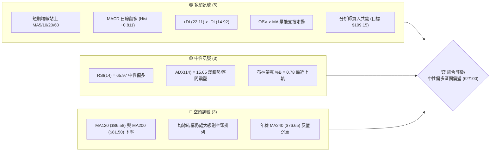

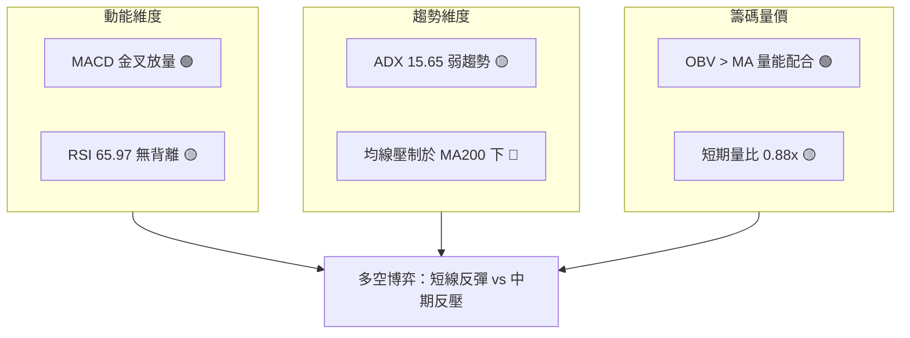

### 📊 核心指標速覽表

| 指標類別 | 指標名稱 | 當前數值 | 訊號 | 解讀 |
|----------|----------|----------|------|------|
| **價格** | 當前價格 | $73.02 | 🟡 | 位於52週區間 31.3% 位置，自底部 $62.95 展開弱勢反彈 |
| **均線** | MA20 | $68.24 | 🟢 | 價格站上短期生命線，乖離率 +7.01%，短多確立 |
| **均線** | MA50 | $69.94 | 🟢 | 站上中期均線，季線轉為下檔支撐 |
| **均線** | MA200 | $81.50 | 🔴 | 位於長期年線之下，乖離率 -10.40%，上方長期壓力沉重 |
| **動能** | RSI(14) | 65.97 | 🟡 | 位於中性偏強區間，未觸及 70 超買界限，動能健康但空間受限 |
| **動能** | MACD | 0.897 (Diff) | 🟢 | MACD 線穿過訊號線 (0.086)，柱狀圖 +0.811 擴張，短多主導 |
| **趨勢** | ADX(14) | 15.65 | 🟡 | ADX < 25 表明處於盤整與反彈收斂階段，無強烈單邊趨勢 |
| **波動** | ATR(14) | $4.03 | 🟡 | 日波動率 5.52%，波動度處中等水準，提供合理止損緩衝 |
| **量能** | OBV 趨勢 | OBV > MA | 🟢 | 能量潮高於均線，量能支撐短期走勢，未出現嚴重價量背離 |

### 🏆 技術評分卡

```
╔══════════════════════════════════════════════════════════════════╗
║              技術評分卡 — RKLB (2026-10-06)                      ║
╠══════════════════════════════════════════════════════════════════╣
║ 趨勢強度 (ADX=15.65)   ████████░░░░░░░░░░░░  42/100  🟡 弱勢盤整 ║
║ 動能指標 (MACD/RSI)    ██████████████░░░░░░  72/100  🟢 短線偏多 ║
║ 支撐穩定度 (S1/S2防守) ██████████████░░░░░░  70/100  🟢 底部分明 ║
║ 成交量配合 (OBV/均量)  ████████████░░░░░░░░  60/100  🟡 溫和量增 ║
║ 形態完整度 (雙底初成)  ██████████████░░░░░░  68/100  🟢 形態構建 ║
║ 均線排列 (空頭修復期)  ██████████░░░░░░░░░░  50/100  🟡 短多長空 ║
╠══════════════════════════════════════════════════════════════════╣
║ 綜合評分              ████████████░░░░░░░░  62/100  🟢 區間偏多 ║
╚══════════════════════════════════════════════════════════════════╝
```

---

## 2. 趨勢分析

### 🌐 多時框趨勢分析

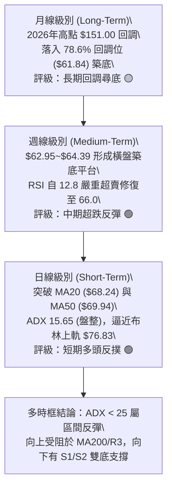

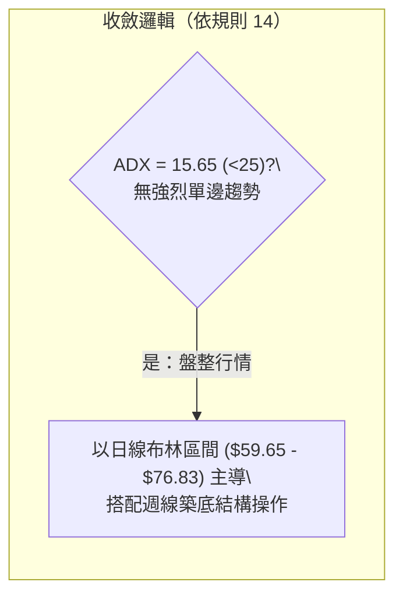

### 📈 長期趨勢 — 12個月走勢圖（Unicode）

```
RKLB 月線收盤走勢圖（2025-10 至 2026-10）
價格軸 ($)
$150 ┤                                      ● ($143.48, 5月波段頂)
$130 ┤                                     / \
$110 ┤                                    /   ● ($101.65)
$90  ┤                    ● ($80.07)     /     \
$70  ┤        ● ($69.76) / \            ●       \            ● ($73.02 現價)
$50  ┤  ●    / \        /   ● ($64.22)-'         ● ($64.95)-'
$30  ┤   \  /   ● ($42.14)
$10  ┤    ● ($10.70歷史基底)
     └────────────────────────────────────────────────────────────
        10  11  12  01  02  03  04  05  06  07  08  09  10 (月)
        25  25  25  26  26  26  26  26  26  26  26  26  26 (年份)
```

**走勢特徵分析表格**：

| 階段區間 | 起止價格 | 漲跌幅 | 趨勢特徵與價量結構 |
|----------|----------|--------|--------------------|
| **主升浪發動** (2025-10 ~ 2026-01) | $62.98 → $80.07 | +27.14% | 突破整理區間，伴隨太空任務發射增長，月線沿上升通道推進 |
| **高位洗盤** (2026-02 ~ 2026-03) | $69.10 → $64.22 | -7.06% | 中期獲利了結，成交量溫和萎縮，在 $64.00 建立次級支撐 |
| **狂熱主升浪** (2026-04 ~ 2026-05) | $82.51 → $143.48 | +73.89% | 機構極度樂觀，帶量爆發創 52 週歷史高點 $151.00，動能嚴重透支 |
| **流動性踩踏** (2026-06 ~ 2026-07) | $101.65 → $64.95 | -36.10% | 估值泡沫破裂，週成交量達 1.55 億股，跌破所有短期支撐 |
| **基底構築** (2026-08 ~ 2026-10) | $63.92 → $73.02 | +14.24% | 於斐波那契 78.6% 回調位 ($61.84) 止跌，雙底結構逐步成形 |

### 📊 中期趨勢（週線分析）

中期走勢圖示展現了從 2026 年 8 月初以來的低位震盪結構：

```
中期阻力支撐示意圖 (週線層次)
[$86.58] ──────────────────────────── MA120 強反壓
[$81.50] ──────────────────────────── MA200 / 斐波 61.8% ($80.90) / 頸線目標
[$76.83] ════════════════════════════ 布林上軌 / 近期阻力 R3 ($78.90)
[$73.02] ───► 當前收盤價 (攻破 MA50 $69.94)
[$68.24] ──────────────────────────── MA20 / 布林中軌支撐
[$63.98] ════════════════════════════ 平台低點雙底線 (S2 $63.98 / S1 $66.85)
[$61.84] ──────────────────────────── 斐波 78.6% 終極鐵底
```

週線層面上，價格自 2026-09-13 觸及 $62.95 以後，連續三週拉出紅K棒（$64.57 → $73.95 → $73.02），週線 RSI 自極端超賣區 12.8 迅速彈升至 66.0，週 MACD 柱狀圖由負轉正至 +0.811，宣告中期空頭壓制告一段落，目前正挑戰週線下降趨勢軌道。

### ⚡ 趨勢強度評估（ADX 解讀）

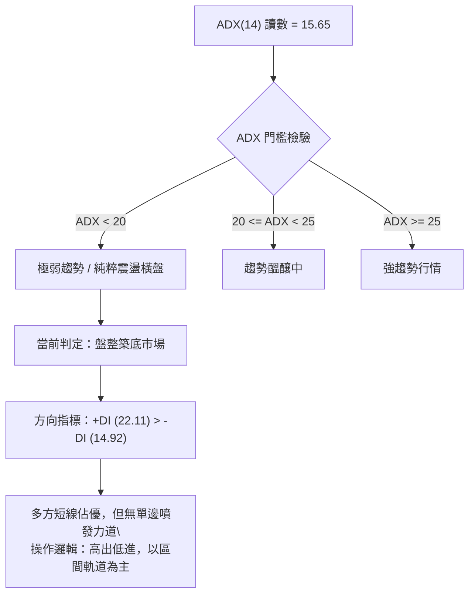

**ADX 強度對照與解讀表**：

| 指標變數 | 當前數值 | 參考閾值 | 市場狀態解讀 |
|----------|----------|----------|--------------|
| **ADX (14)** | **15.65** | < 25 (弱/無趨勢) | 市場缺乏宏觀單邊動能，屬於震盪修復階段，不宜追高追破 |
| **+DI** | **22.11** | > -DI (多頭主導) | 買盤佔據局部優勢，短線多頭掌控反彈節奏 |
| **-DI** | **14.92** | 處於低位 | 賣壓暫時退潮，空頭無力將價格壓制於 $63.00 之下 |
| **趨勢形態結論** | **區間內多頭反彈** | 結合 ATR=$4.03 | 價格波動受限於布林帶寬內，應防範碰觸上軌後的均值回歸 |

---

## 3. 圖表形態分析

### 🔍 形態識別系統

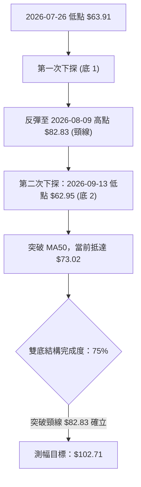

**圖表形態識別與信心度評估表**：

| 形態名稱 | 信心度 | 判斷依據（引用數據） | 完成度 | 目標價（附計算式） |
|----------|--------|----------------------|--------|--------------------|
| **雙底形態 (W底)** | **70%** | 兩次波段低點分別為 2026-07-26 的 $63.91 與 2026-09-13 的 $62.95（均落在 S2 $63.98 附近），低點未創新低且量能收斂。頸線為 2026-08-09 高點 $82.83。 | 75% | **理論目標價 $102.71**<br>計算式：頸線 $82.83 + 形態高度 ($82.83 - $62.95 = $19.88) = **$102.71** |
| **布林通道擠壓向上突破** | **65%** | 價格站穩 BB 中軌 $68.24 並向 BB 上軌 $76.83 推進，%B 達到 0.78。 | 80% | **第一步目標：BB 上軌 $76.83**<br>第二步目標：阻力位 R3 **$78.90** |
| **下降旗形 (空頭中繼)** | **35%** | 訊號不足。雖然 6-7 月大幅急跌，但近兩個月並未形成收斂三角形下破，反而在支撐位企穩，故此形態信心度低。 | 20% | 數據不足，僅做指標型解讀，不予推算目標。 |

### 🕯️ 重要K線形態分析

| 週/月份 | 收盤價 | K線形態 | 解讀 | 訊號 |
|---------|--------|---------|------|------|
| **2026-05** | $143.48 | 巨量避雷針天花板 | 衝擊 52W 高點 $151.00 後留下長上影線，週成交量暴增至 1.17 億股，主力高位出貨。 | 🔴 強烈見頂 |
| **2026-07-26** | $63.91 | 超跌長下影十字星 | 週 RSI 探底至 15.6，空方衰竭，在 S2 $63.98 附近浮現首波機構承接盤。 | 🟢 止跌初顯 |
| **2026-08-09** | $82.83 | 長紅實體突破棒 | 週漲幅由 $64.95 飆升至 $82.83，週成交量 9,669 萬股，建立雙底結構的中央頸線高點。 | 🟢 頸線建立 |
| **2026-09-13** | $62.95 | 縮量測試雙底槌子線 | 二次探底至 $62.95，週成交量降至 8,520 萬股，未破前低，確立中期底部支撐。 | 🟢 底部確認 |
| **2026-09-27** | $73.95 | 大陽線重返生命線 | 一舉收復 MA20 ($68.24) 與 MA50 ($69.94)，成交量放大至 1.11 億股，轉化為日線多頭優勢。 | 🟢 短多確立 |
| **2026-10-11** | $73.02 | 高位縮量十字整固 | 價格小幅回踩測試 $73.00，成交量大幅萎縮至 1,902 萬股（日），呈現健康消化浮額。 | 🟡 蓄勢待發 |

### 📉 ASCII 走勢形態示意圖

```
RKLB 雙底 (Double Bottom) 形態結構圖
[$85.00] ──────────────────────────────────────────
[$82.83] ────────────────────● (頸線 Neckline: 08-09)
[$80.00]                    / \
[$75.00]                   /   \               ● 現價 $73.02 (挑戰頸線中)
[$70.00]                  /     \             /
[$65.00] ───● (07-26)    /       \           /
[$63.91] ────\──────────/         \─────────/
[$62.95] ─────● (底1: $63.91)      ● (底2: $62.95)
         └─────────────────────────────────────────► 時間軸
              2026-07            2026-08          2026-09-10
```

### 🎯 形態目標價計算

若目前雙底形態成立，依據形態學標準度量法計算：
1. **底部水平軸**：取兩次下探極值平均 ($63.91 + $62.95) / 2 = **$63.43**（接近數據庫支撐 S2 **$63.98**）。
2. **頸線確認位**：2026-08-09 週線高點收盤價 **$82.83**。
3. **垂直形態高度 (Height)**：頸線 $82.83 - 底部低點 $62.95 = **$19.88**。
4. **理論突破目標價 (Target 1)**：$82.83 + $19.88 = **$102.71**（該價位與斐波那契 38.2% 回調位 **$107.67** 及分析師平均目標價 **$109.15** 形成強大共振共鳴區）。
5. **目前完成度進階門檻**：現價 $73.02 距離突破頸線 $82.83 尚有 +13.43% 漲幅，當前第一步必須先攻克數據庫阻力位 R1 ($73.97)、R2 ($75.28) 與 R3 ($78.90)。

---

## 4. 支撐與阻力

### 🗺️ 關鍵價位分布圖（Unicode）

```
RKLB 價位結構分布圖 (由 OHLCV 與斐波那契精確計算)
══════════════════════════════════════════════════════════════════
$151.00 ║████████████████████████████████║ 52W 歷史天花板 (0.0% Fib)
$107.67 ║████████████████████            ║ 斐波那契 38.2% 重大阻力
 $86.58 ║████████████████████████        ║ 半年線 MA120 反壓位
 $81.50 ║██████████████████████████████  ║ MA200 年線 / 斐波 61.8% ($80.90)
 $78.90 ║████████████████████████        ║ 波段強阻力 R3
 $75.28 ║████████████████                ║ 波段次阻力 R2
 $73.97 ║████████████                    ║ 立即阻力 R1 (當前考驗)
════════╠════════════════════════════════╣ ◄◄ 當前收盤價 $73.02
 $68.24 ║▓▓▓▓▓▓▓▓▓▓▓▓▓▓▓▓                ║ BB中軌 / MA20 短期生命線
 $66.85 ║▓▓▓▓▓▓▓▓▓▓▓▓▓▓▓▓▓▓▓▓            ║ 近期波段第一支撐 S1
 $63.98 ║████████████████████████████    ║ 雙底頸線基底強支撐 S2
 $61.84 ║████████████████████████████████║ 斐波那契 78.6% 終極鐵底
 $61.45 ║████████████████████████████████║ 近一年波段極限支撐 S3
 $37.57 ║████████████████████████████████║ 52W 歷史低點 (100.0% Fib)
══════════════════════════════════════════════════════════════════
```

### 🚧 阻力位分析表

所有價位均嚴格取自數據庫計算數值，嚴禁捏造：

| 阻力級別 | 價位 | 形成原因 | 突破難度 | 重要性 |
|----------|------|----------|----------|--------|
| **R1** | **$73.97** | 近期波段高點密集區（+1.30% from price），對應 2026-09-27 週收盤 $73.95。 | 🟡 中等 | 短期突破點，站上即打開上升通道。 |
| **R2** | **$75.28** | 次級波段高點（+3.10% from price），逼近布林通道上軌 $76.83 壓力區。 | 🟡 中等偏高 | 多頭延伸測試線，遭遇均值回歸阻力。 |
| **R3** | **$78.90** | 核心波段阻力（+8.05% from price），接近年線 MA240 ($76.65) 與斐波 61.8% ($80.90)。 | 🔴 極高 | 波段反彈終極考驗，需巨量配合方可跨越。 |

### 🛡️ 支撐位分析表

所有價位均嚴格取自數據庫計算數值，嚴禁捏造：

| 支撐級別 | 價位 | 形成原因 | 守住機率 | 重要性 |
|----------|------|----------|----------|--------|
| **S1** | **$66.85** | 近期回調波段低點聚類（-8.45% from price），靠近 MA20 ($68.24)。 | 75% | 短線多頭護城河，跌破則反彈節奏中斷。 |
| **S2** | **$63.98** | 雙底平台支撐（-12.37% from price），接近 2026-07 及 09 月底部低點。 | 85% | 中期生命線，多方防守的核心陣地。 |
| **S3** | **$61.45** | 近一年極限波段低點（-15.84% from price），緊貼斐波 78.6% ($61.84)。 | 95% | 空頭崩跌行情底線，破位將觸發結構性崩潰。 |

### 📐 斐波那契回調位分析

依據 52 週極值區間（最低點 **$37.57** 至 最高點 **$151.00**，總跨度 **$113.43**）之黃金分割比率分析：

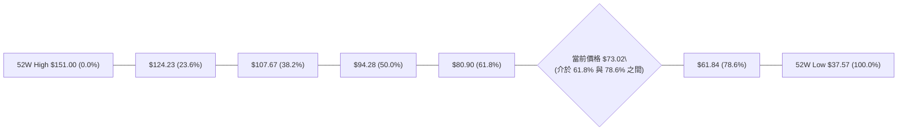

- **當前位置解讀**：現價 **$73.02** 精準座落於 **61.8% 回調位 ($80.90)** 與 **78.6% 回調位 ($61.84)** 之間。
- **支撐確認**：2026-09-13 低點 $62.95 與 2026-07-26 低點 $63.91 在 78.6% 回調位 ($61.84) 上方獲得顯著承接，顯示 78.6% 黃金分割位為本輪深度調整的有效物理鐵底。
- **上方阻力空間**：多頭反攻的關鍵黃金分水嶺為 61.8% 回調位 **$80.90**。在道氏與斐波那契理論中，唯有實質性收復 61.8% ($80.90)，本輪自 $151.00 以來的中期空頭回調才能正式宣告逆轉為新一輪牛市推動浪。

---

## 5. 技術指標深度解讀

### 🎛️ 指標訊號總覽

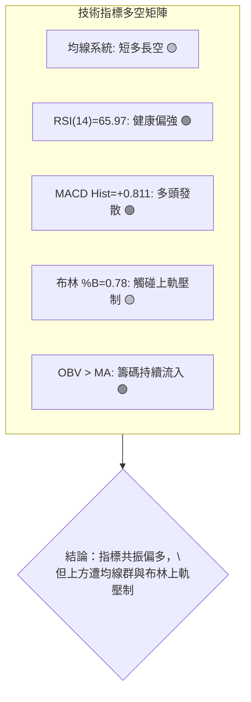

### 📈 移動平均線排列分析

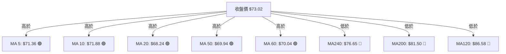

**移動平均線狀態詳解**：
- **短期均線簇**：MA5 ($71.36)、MA10 ($71.88)、MA20 ($68.24) 呈現多頭向上排列。價格脫離 MA20 達 +7.01%，顯示超短期動能豐沛。
- **中期轉折**：價格已實質站回 MA50 ($69.94) 與 MA60 ($70.04)，確立 2 個月以來的波段築底成功。
- **長期空頭反壓**：大級別均線系統依然呈現空頭排列（MA120 $86.58 > MA200 $81.50 > 價格 $73.02）。MA200 仍對價格形成上方天花板，在長天期均線下彎的背景下，目前的上漲本質上仍定義為「大級別空頭排列下的強勢超跌反彈修復」。

### 📉 RSI(14) 分析

```
RSI(14) 當前數值：65.97
[0] ─────────── [30] ────────────────── [70] ────── [100]
超賣區          中性區                  超買區
████████████████████████████████░░░░░░  65.97%
```

- **數值解讀**：日線 RSI(14) 位於 **65.97**，既未進入 70 以上的過熱超買區，亦遠離 50 均衡線，表明多頭掌控推升動力。
- **週線修復對比**：週線 RSI 自 2026-09-06 的歷史極低值 **12.8** 巨幅反彈至 **66.0**，呈現出罕見的強烈均值回歸修復。
- **背離判斷**：
  - **日線背離檢驗**：價格自 $64.57 漲至 $73.02，RSI 自 50.5 升至 65.97，價漲指標升，**無頂背離現象**。
  - **週線背離檢驗**：2026-09-13 低點 $62.95 相較於 2026-07-26 低點 $63.91 價格微破，但週線 RSI 由 15.6 上升至 27.1，形成了微幅的**週線級別底背離**，此為本次推動反彈至 $73.02 的底層動能核心。

### 📊 MACD(12/26/9) 訊號解讀

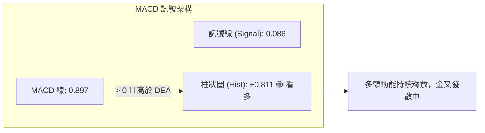

- **MACD 線與訊號線**：MACD 線 (0.897) 位於零軸上方，且強勢凌駕於訊號線 (0.086) 之上。
- **柱狀圖動態**：Hist 達到 **+0.811**，連續多個交易日呈現正向擴張，確認當前反彈節奏並未出現衰竭現象。
- **多空意涵**：日線 MACD 零軸上金叉為經典右側追隨多頭訊號，短期內空方缺乏打壓籌碼。

### 📦 布林通道分析

```
ASCII 布林通道位置示意圖 (Bollinger Bands 20, 2)
[$76.83] ──────────────────────────── BB 上軌 (Upper Band)
  ▲
  │   $73.02 ◄─── 當前價格 (位於中軌與上軌間，%B = 0.78)
  ▼
[$68.24] ──────────────────────────── BB 中軌 (Middle Band = MA20)
  │
  │
[$59.65] ──────────────────────────── BB 下軌 (Lower Band)
```

- **軌道位置分析**：當前價格 $73.02 緊貼布林通道上軌 $76.83，指標 **%B 為 0.78**。
- **帶寬與通道特性**：通道寬度 ($76.83 - $59.65 = $17.18) 呈現由極度發散轉向平行收斂走勢。當 %B 接近 0.80-1.00 且 ADX 處於 15.65 低位時，表明市場將在上軌附近遇到顯著的均值回歸阻力，一舉突破 $76.83 的難度偏高。

### 💹 成交量分析（量價配合度）

```
量價配合矩陣
最新成交量: 19,023,200   20日均量: 21,495,650 (量比: 0.88x)
████████████████████░░░░░░░░  88% (縮量整固)
```

- **量比檢驗**：最新日成交量為 19,023,200 股，與 20 日均量 (21,495,650 股) 相比，量比為 **0.88x**。在價格連漲後出現縮量，表明並非主力出貨，而是上攻 R1 阻力前的浮額清洗。
- **OBV 能量潮判斷**：官方技術指標明確顯示 **「OBV > MA → 量能支撐上漲」**。能量潮指標領先走在均線之上，證實自 $62.95 築底以來有實質資金進場建倉，籌碼面並未與價格背離。

---

## 6. 動能與波動率

### ⚡ 動能評估四象限

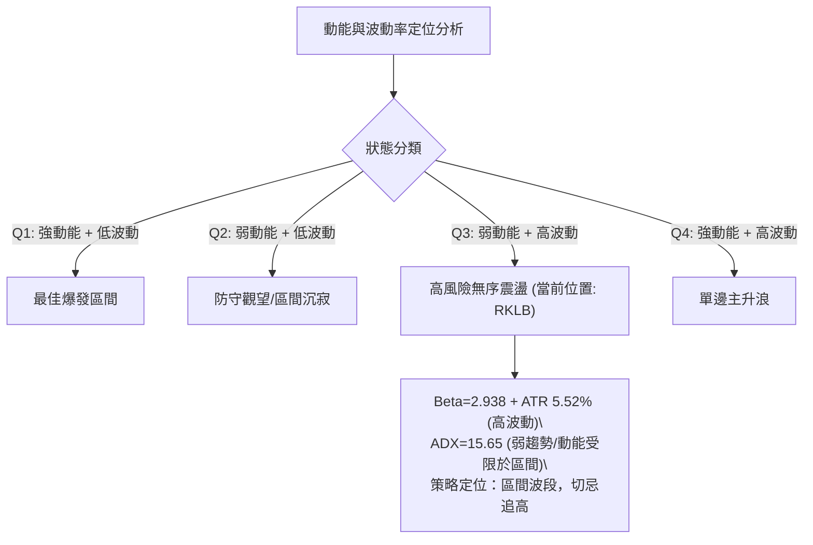

**動能評估維度矩陣**：

| 象限 | 動能強度 | 波動率水準 | RKLB 吻合度 | 操作戰略評估 |
|------|----------|------------|-------------|--------------|
| **Q1** | 強 (ADX>25) | 低 (ATR<3%) | ❌ 不吻合 | 穩健牛市單邊行情，適合滿倉波段跟隨。 |
| **Q2** | 弱 (ADX<25) | 低 (ATR<3%) | ❌ 不吻合 | 低波動整理期，適合佈局期權套利或網格。 |
| **Q3** | **弱 (ADX=15.65)** | **高 (Beta=2.94)** | **✓ 完全吻合** | **高彈性區間震盪行情。個股波動巨大但缺乏單邊大趨勢，極易雙向掃損，必須嚴控倉位並鎖定明確阻力/支撐。** |
| **Q4** | 強 (ADX>25) | 高 (Beta>2.0) | ❌ 不吻合 | 主升狂熱期（如 2026 年 5 月拉升期）。 |

### 📊 ATR 波動率分析

- **ATR(14) 絕對值**：**$4.03**。
- **相對價格波動率**：$4.03 / $73.02 = **5.52%**。
- **交易意義與止損設置指導**：
  - 由於日均波動高達 5.52%，短線交易的止損空間若小於 1.0 倍 ATR ($4.03)，極易被市場隨機噪音洗出場。
  - **建議安全止損緩衝**：波段策略應配置 **1.5 ~ 2.0 倍 ATR**，即 **$6.05 ~ $8.06** 之安全距離。
  - 配合支撐位檢驗：現價 $73.02 減去 1.5 倍 ATR ($6.05) 等於 **$66.97**，精準貼合數據庫波段第一支撐 **S1 ($66.85)**，驗證了 S1 作為結構性防守點的客觀數學邏輯。

### 📐 Beta 與市場相關性

- **Beta 係數**：**2.938**。
- **市場特徵解讀**：RKLB 屬於極高彈性（Super-High Beta）之標的，其股價波動敏銳度接近標普500指數的 3 倍。
- **資產配置風險**：當美股大盤出現宏觀流動性收緊或恐慌回調時，RKLB 面臨近 3 倍的放大下行風險；反之，若風險偏好回暖，其反彈爆發力亦冠絕同業。此特性要求交易者必須採取嚴格的部位管理，不可重倉賭單邊。

---

## 7. 多時框架總結

### 📋 時框架評分表

| 時框架 | 趨勢方向 | 動能狀態 | 均線排列 | 形態特徵 | 綜合評分 | 戰略建議 |
|--------|----------|----------|----------|----------|----------|----------|
| **月線 (長期)** | 🔴 回調洗盤 | 🟡 止跌鈍化 | 🟡 均線糾纏 | 52W 高點巨幅腰斬後在斐波 78.6% 尋底 | **45/100** | 長期投資者定投區間，但單邊牛市未恢復 |
| **週線 (中期)** | 🟢 築底反彈 | 🟢 RSI 快速修復 | 🔴 壓制於 MA200 下 | 雙底 (W底) 構築中，頸線鎖定 $82.83 | **65/100** | 中期波段持有，逢回踩支撐加碼 |
| **日線 (短期)** | 🟢 短多推進 | 🟢 MACD 紅柱放量 | 🟢 短期多頭排列 | 挑戰 BB 上軌 $76.83 與 R1 阻力 $73.97 | **68/100** | 區間偏多操作，逼近阻力位分批止盈 |

### 🔲 綜合訊號矩陣

```
訊號維度矩陣透視
趨勢方向：[日線: 偏多 🟢]  [週線: 偏多 🟢]  [月線: 偏空 🔴]  → 局部強勢
動能指標：[MACD: 偏多 🟢]   [RSI: 中性 🟡]   [Stoch: 偏多 🟢] → 上行動能完好
量價結構：[OBV: 支撐 🟢]    [量比: 0.88 🟡]  [籌碼: 穩定 🟢]  → 溫和推進
關鍵邊界：[上壓: R1 $73.97 / BB上軌 $76.83] [下撐: MA20 $68.24 / S1 $66.85]
```

### ⚖️ 多時框收斂結論

依據多時框收斂規則（嚴格要求 14）：
1. **行情屬性判定**：當前 **ADX(14) = 15.65 (< 25)**，明確定義市場為**「非趨勢性、區間震盪行情」**。
2. **主導維度收斂**：在盤整行情中，大級別單邊趨勢被淡化，交易策略**以日線布林通道 ($59.65 - $76.83) 與週線雙底震盪區間為主導**。
3. **最終方向性結論**：**【中性偏多，區間操作 (Bullish Range-Bound)】**。
   - 短期日線與週線動能共振翻多，支撐價格向震盪區間頂部進攻。
   - 惟長期均線 MA200 ($81.50) 及 MA120 ($86.58) 形成天花板壓制，不具備立即發動破頂大牛市的條件。
   - 第 8 章交易策略嚴格錨定此結論，採取**「逢低於支撐布局、逼近阻力階梯分批止盈」**的區間偏多戰術。

---

## 8. 交易策略建議

### 🗺️ 策略決策流程圖

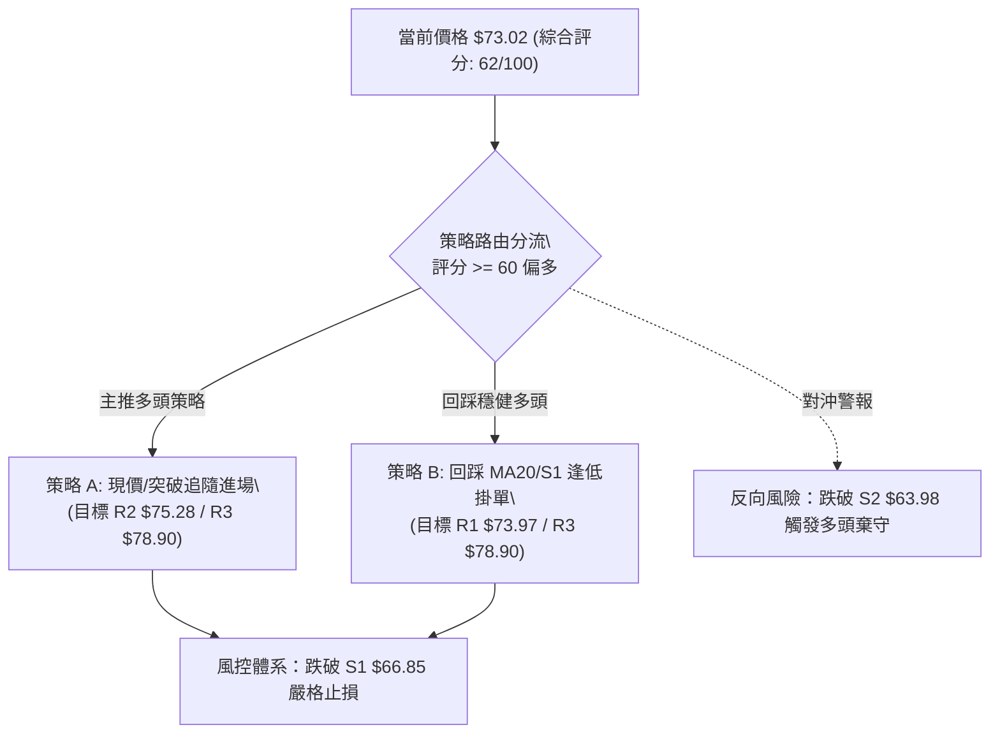

### 🧭 策略路由

> **當前主策略方向 = 區間偏多操作（依綜合評分 62/100，≥60 主推多頭）**

由於綜合評分達 62 分，日線 MACD 零軸上方放量且 OBV 向上確認，空頭策略在此階段勝率較低。因此主推兩套多頭交易方案，空方僅列為下破防守警戒。

### 🎯 價格情境階梯（Price Scenarios）

價位嚴格引用第 4 章數據庫聚類數值：

| 觸發條件 | 下一目標 | 後續延伸 | 情境含義 |
|----------|----------|----------|----------|
| **突破 R1 $73.97** | **R2 $75.28** | **R3 $78.90** | 短線多頭加速，考驗布林通道上軌 ($76.83) 與波段核心高點。 |
| **站穩現價區間 ($70.00 - $73.50)** | **MA20 $68.24 支撐** | **R1 $73.97 蓄勢** | 區間溫和換手震盪，消化獲利籌碼後再度發力。 |
| **跌破 S1 $66.85** | **S2 $63.98** | **S3 $61.45** | 中期築底受到威脅，若跌破雙底防線 S2，形態破位轉為空頭。 |

### 📊 情境機率分佈

| 情境 | 機率 | 主要依據 |
|------|------|----------|
| **突破上行 / 測試 R2-R3** | **55%** | MACD 柱狀圖 (+0.811) 持續走強，+DI (22.11) 壓制 -DI，OBV 能量潮高於均線確認資金流入。 |
| **窄幅區間震盪 ($68.00 - $74.00)** | **30%** | ADX 僅 15.65 顯示單邊動能有限，量比 0.88x 顯示買盤追高意願在阻力前有所保留。 |
| **深度回落 / 跌破 S1 再探底** | **15%** | 遭遇 MA200 與 MA240 宏觀空頭結構壓制，若大盤重挫可能引發 Beta=2.938 的聯動殺跌。 |

### 🟢 主策略詳情

所有價位精確引用數據庫之 R1、R2、R3 及 S1、S2 數值：

| 策略要素 | 策略 A（強勢突破多頭） | 策略 B（回踩支撐逢低承接） |
|----------|------------------------|----------------------------|
| **策略類型** | 順勢突破進場 | 左側穩健回踩買入 |
| **進場條件** | 日K突破 R1 $73.97 並帶量確認 | 價格回踩 MA20 附近或 S1 $66.85 企穩 |
| **進場價格** | **$74.00** (突破 R1 買入) | **$67.50** (S1 $66.85 上方掛單) |
| **目標價 T1** | **$75.28** (精確對應阻力 R2) | **$73.97** (精確對應阻力 R1) |
| **目標價 T2** | **$78.90** (精確對應阻力 R3) | **$78.90** (精確對應阻力 R3) |
| **止損價格** | **$66.85** (精確對應支撐 S1) | **$63.98** (精確對應雙底支撐 S2) |
| **風險暴露 (R)** | $74.00 - $66.85 = $7.15 | $67.50 - $63.98 = $3.52 |
| **潛在報酬 (T2)**| $78.90 - $74.00 = $4.90 | $78.90 - $67.50 = $11.40 |
| **風險報酬比** | **1 : 0.69** (短線快速打擊) | **1 : 3.24** (優質波段盈虧比) |
| **成功機率** | **55%** | **65%** |
| **建議倉位** | **8% 總資金** | **15% 總資金** |

*注：策略 A 風險報酬比較低，適合敏捷型日間與隔夜突破交易者；策略 B 具備 1:3.24 之優質盈虧比，為本報告首選主推策略。*

### 🔴 反向風險觸發點（對沖提示）

- **多頭結構破壞點**：若日K收盤價**實質跌破 S1 $66.85**，則宣告短期反彈浪潮終結，應即刻將多頭部位減半。
- **形態瓦解翻空點**：若收盤價進一步**跌破 S2 $63.98**（雙底底部），雙底形態宣告失敗，價格將直奔 S3 **$61.45** 及斐波那契 78.6% **$61.84**。此時多單必須全數止損離場，並可啟動做空對沖策略。

### ⭐ 整體訊號強度評星

```
做多訊號強度：★★★★☆  (4/5星) — 短期量價配合，動能向上修復
做空訊號強度：★☆☆☆☆  (1/5星) — 底部雙底初成，空方缺乏動能
整體可信度：  ★★★★☆  (4/5星) — 支撐阻力結構清晰，受 ADX 限制
```

---

## 9. 風險提示與監控

### ✅ 關鍵監控指標 Checklist

```
╔══════════════════════════════════════════════════════════════════╗
║                    每日技術監控清單 (Checklist)                  ║
╠══════════════════════════════════════════════════════════════════╣
║ [ ] 價格是否有效突破阻力 R1 ($73.97) 且日成交量 > 2,150 萬股      ║
║ [ ] 布林通道上軌 ($76.83) 是否產生嚴重受阻上影線 (均值回歸風險)   ║
║ [ ] RSI(14) 是否衝破 70 進入超買背離區間                         ║
║ [ ] 日線 MACD 柱狀圖是否由增長轉為縮小 (< +0.811)                ║
║ [ ] 短線回踩時，MA20 ($68.24) 與支撐 S1 ($66.85) 是否有效守住   ║
║ [ ] 大盤波動引發的 Beta 放大效應：納斯達克波動是否超過 1.5%     ║
║ [ ] 成交量是否低於 1,500 萬股 (流動性衰退警報)                   ║
╚══════════════════════════════════════════════════════════════════╝
```

### ⚠️ 風險場景分析

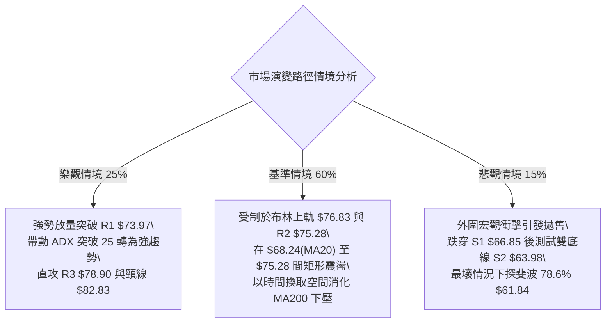

### 🛡️ 風險管理重要提醒

1. **高 Beta 波動性控倉**：鑑於 RKLB 的 **Beta 高達 2.938**，且 ATR 達 **$4.03 (5.52%)**，任何單一持倉部位不宜超過投資組合總資金的 **15%**，避免單一標的波動對總資產造成不可逆之淨值回撤。
2. **非趨勢市場之紀律**：在 **ADX = 15.65** 的弱趨勢環境下，震盪行情的常態是「漲過頭必拉回，跌過深必反彈」。嚴禁在價格逼近布林通道上軌 ($76.83) 或阻力 R2/R3 時情緒化市價追多。
3. **止損紀律絕對執行**：策略 A 與策略 B 均設置了嚴格的硬性止損位（S1 **$66.85** 與 S2 **$63.98**）。一旦觸發，必須無條件止損，防範雙底破位引發的踩踏風險。

---

## 📋 報告總結

```
╔══════════════════════════════════════════════════════════════════╗
║                   RKLB 技術分析報告總結                          ║
╠══════════════════════════════════════════════════════════════════╣
║ 報告日期：2026-10-06                                             ║
║ 當前價格：$73.02                                                 ║
║ 分析評級：🟢 區間偏多 (綜合技術評分: 62/100)                      ║
║                                                                  ║
║ 關鍵結論：                                                       ║
║ ├─ 長期趨勢：🔴 偏空回調 (受制於 MA200 $81.50 與 MA120 $86.58)   ║
║ ├─ 中期趨勢：🟢 築底反彈 (週線雙底成形，RSI 由 12.8 暴升至 66.0) ║
║ ├─ 短期趨勢：🟢 多頭掌控 (站上 MA20 $68.24，MACD 柱狀 +0.811)    ║
║ ├─ 關鍵支撐：S1 $66.85  /  S2 $63.98  /  S3 $61.45               ║
║ ├─ 關鍵阻力：R1 $73.97  /  R2 $75.28  /  R3 $78.90               ║
║ └─ 分析師目標：均價 $109.15 (最高 $150.00 / 最低 $64.00)         ║
║                                                                  ║
║ 最優策略組合：                                                   ║
║ 1. 🥇 最佳機會 (策略 B)：回踩 S1 上方 $67.50 逢低買入，止損      ║
║       $63.98 (S2)，目標 $78.90 (R3)，盈虧比 1:3.24。             ║
║ 2. 🥈 次選機會 (策略 A)：放量實質突破 R1 $73.97 後輕倉追買至     ║
║       R2 $75.28 與 R3 $78.90，嚴格止損於 S1 $66.85。             ║
║ 3. 🥉 保守選擇：在現價至布林上軌 $76.83 區間停止追高，等待價格   ║
║       拉回至 MA20 ($68.24) 附近出現量縮 K 棒再行進場。           ║
╚══════════════════════════════════════════════════════════════════╝
```

---

> ⚠️ **免責聲明**：本報告為 AI 自動生成之技術分析，所有數據及估算均基於提供的歷史價格資訊。本報告**僅供研究與學術參考**，**不構成任何投資建議**。投資有風險，入市需謹慎。

---

*報告生成時間：2026-10-06 ｜ 數據來源：Yahoo Finance ｜ 分析框架：多時框技術分析*