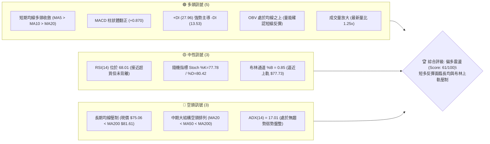
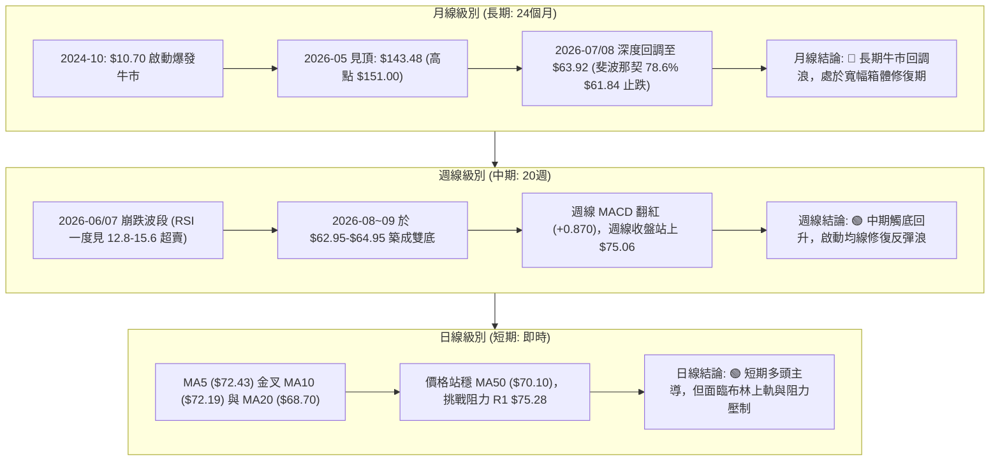
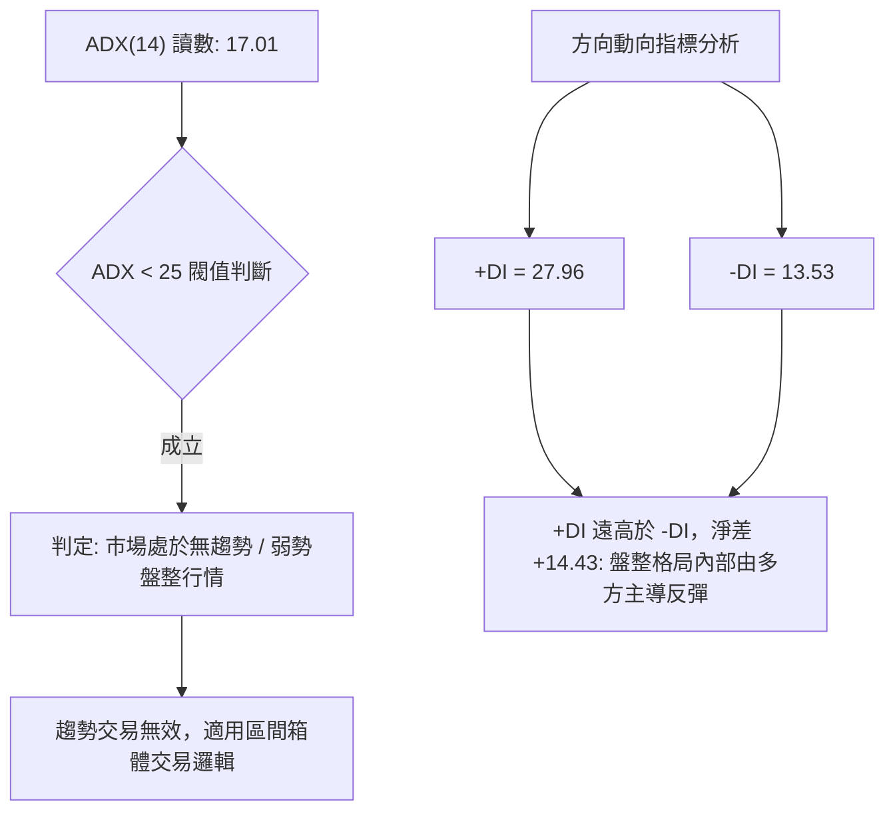
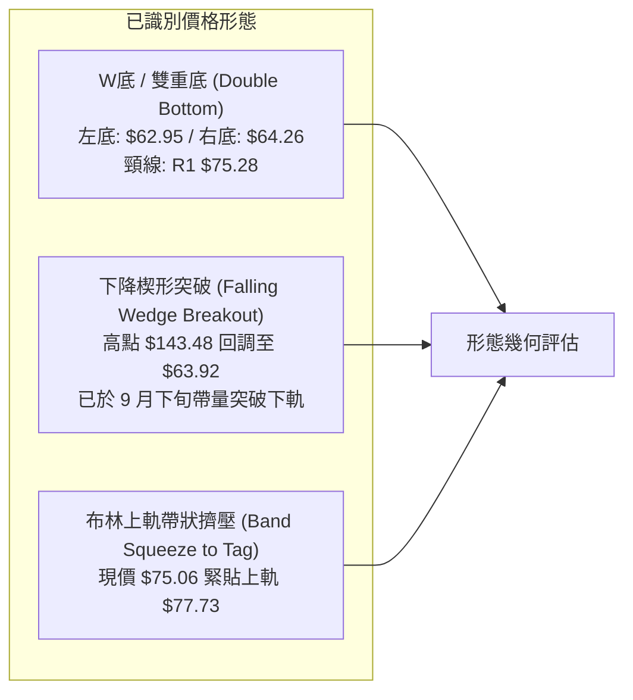
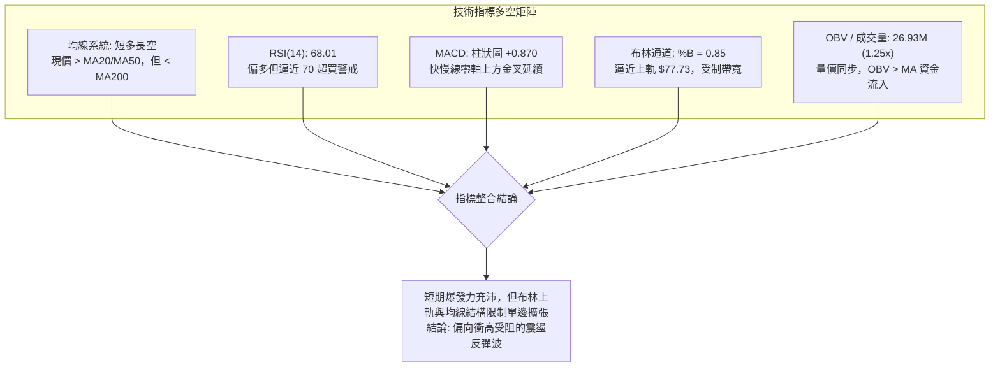
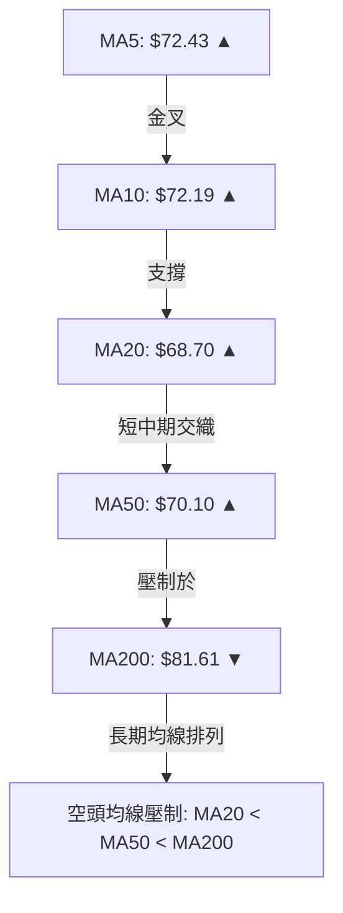
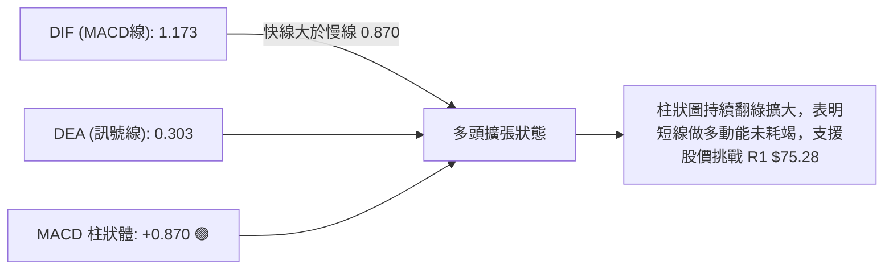
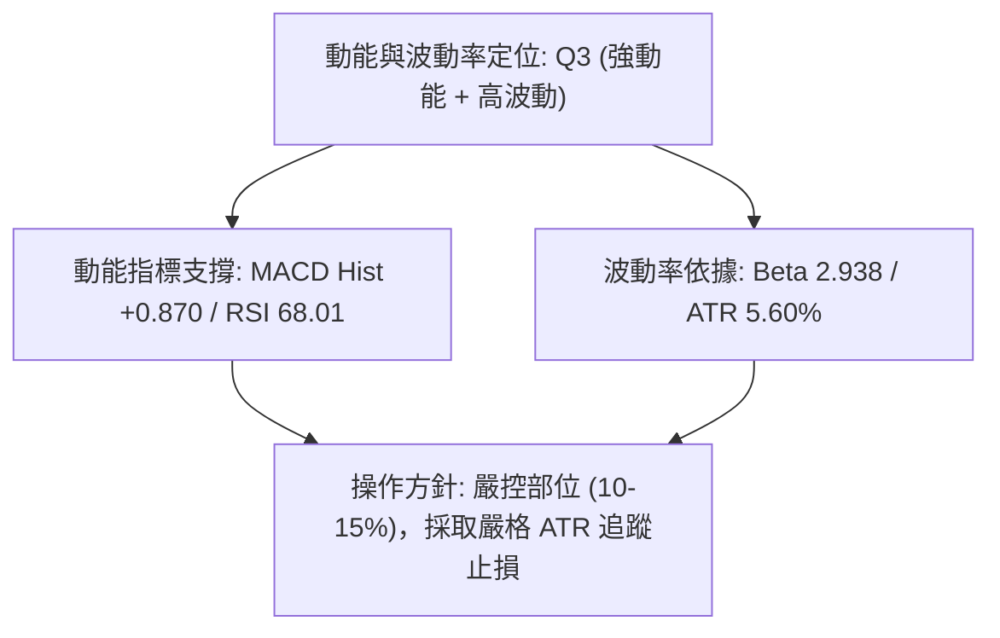
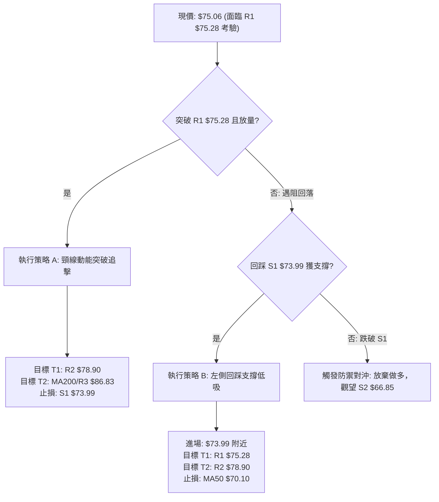
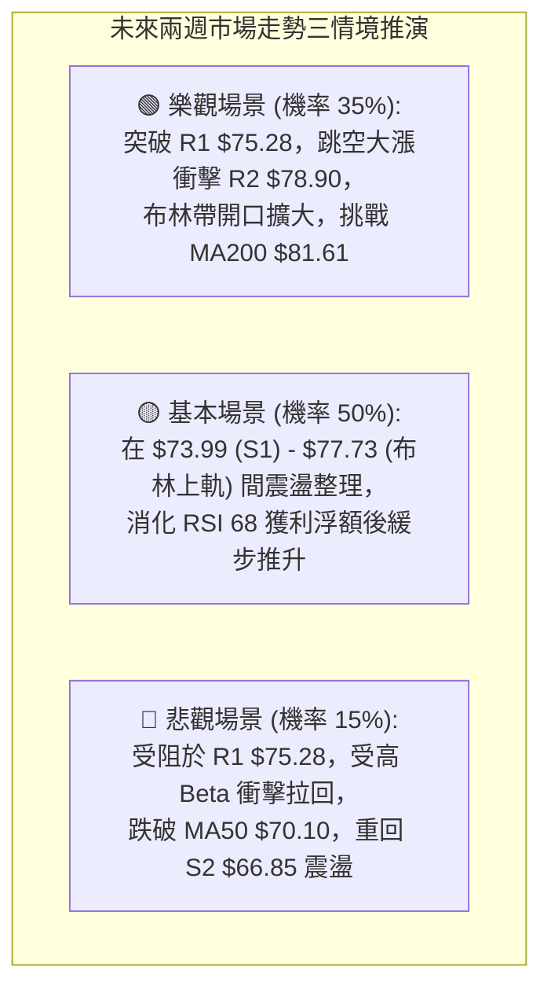

# RKLB 技術分析報告

> **報告日期**：2026-10-07 ｜ **語言**：繁體中文 ｜ **數據來源**：Yahoo Finance ｜ **當前價格**：$75.06

---

## 目錄

| 章節 | 內容 |
|------|------|
| [1. 技術面概覽](#1-技術面概覽) | 訊號儀表板、核心指標、評分卡 |
| [2. 趨勢分析](#2-趨勢分析) | 多時框趨勢、長中短期走勢、ADX 趨勢強度 |
| [3. 圖表形態分析](#3-圖表形態分析) | 形態識別、K線組合、目標價推算 |
| [4. 支撐與阻力](#4-支撐與阻力) | 關鍵價位、斐波那契回調結構 |
| [5. 技術指標深度解讀](#5-技術指標深度解讀) | 均線系統、RSI、MACD、布林通道、OBV量價 |
| [6. 動能與波動率](#6-動能與波動率) | 動能四象限、ATR 止損測算、Beta 敏感度 |
| [7. 多時框架總結](#7-多時框架總結) | 時框架矩陣、多時框收斂定論 |
| [8. 交易策略建議](#8-交易策略建議) | 策略路由、價格情境階梯、執行參數 |
| [9. 風險提示與監控](#9-風險提示與監控) | 監控 Checklists、情境分析、部位控管 |

---

## 1. 技術面概覽

### 🎯 技術訊號儀表板



### 📊 核心指標速覽表

| 指標類別 | 指標名稱 | 當前數值 | 訊號 | 解讀 |
|----------|----------|----------|:----:|------|
| **價格** | 當前收盤價 | $75.06 | 🟢 | 站上 MA5 ($72.43)、MA10 ($72.19)、MA20 ($68.70) 及 MA50 ($70.10) |
| **均線** | 短期 MA20 | $68.70 | 🟢 | 價格在 MA20 上方 (+9.26%)，短線偏多 |
| **均線** | 中期 MA50 | $70.10 | 🟢 | 價格突破 MA50 (+7.08%)，短中期動能轉強 |
| **均線** | 長期 MA200| $81.61 | 🔴 | 價格受制於 MA200 (-8.03%)，長期牛熊分界線未攻克 |
| **動能** | RSI(14) | 68.01 | 🟡 | 進入強勢區但逼近 70 超買警戒線，無底背離亦無頂背離 |
| **動能** | MACD | 1.173 / Sig 0.303 | 🟢 | 快線位於慢線上方，柱狀圖 +0.870，多頭擴張 |
| **趨勢** | ADX(14) | 17.01 | 🟡 | 數值低於 25，表明短線屬區間震盪反彈，非單邊趨勢行情 |
| **通道** | 布林通道 | 帶寬 $59.67 - $77.73 | 🟡 | %B 為 0.85，逼近上軌 $77.73，隨時面臨均值回歸拉回 |
| **成交量**| 最新量 / 20日均量 | 26.93M / 21.63M | 🟢 | 量比 1.25x，OBV > MA，量價配合良好 |
| **波動** | ATR(14) | $4.20 (5.60%) | 🟡 | 日內波動幅度適中，提供操作空間但需注意隔夜跳空 |

### 🏆 技術評分卡

```
╔══════════════════════════════════════════════════════════════════╗
║                技術評分卡 — RKLB (2026-10-07)                    ║
╠══════════════════════════════════════════════════════════════════╣
║ 趨勢強度 (ADX=17.01)    ██████░░░░░░░░░░░░░░  30/100  🔴 弱勢震盪 ║
║ 動能指標 (MACD/RSI)     ███████████████░░░░░  75/100  🟢 短多充沛 ║
║ 支撐穩定度 (S1/S2防守)  ██████████████░░░░░░  70/100  🟢 築底扎實 ║
║ 成交量配合 (OBV/量比)   ████████████████░░░░  80/100  🟢 價漲量增 ║
║ 形態完整度 (雙重底結構) ██████████████░░░░░░  70/100  🟢 頸線測試 ║
║ 均線排列 (空頭均線壓制) ████████░░░░░░░░░░░░  40/100  🔴 MA200壓制║
╠══════════════════════════════════════════════════════════════════╣
║ 綜合評分                ████████████░░░░░░░░  61/100  🟢 偏多震盪 ║
╚══════════════════════════════════════════════════════════════════╝
```

---

## 2. 趨勢分析

### 🌐 多時框趨勢分析



### 📈 長期趨勢 — 12個月走勢圖（Unicode）

```
RKLB 月線收盤走勢圖（過去12個月：2025-11 至 2026-10）
價格軸 ($)
$150 ┤                                  ● $143.48 (2026-05 波段頂峰)
$140 ┤                                 ╱ ╲
$130 ┤                                ╱   ╲
$120 ┤                               ╱     ╲
$110 ┤                              ╱       ● $101.65 (2026-06 重挫)
$100 ┤                             ╱         ╲
 $90 ┤                            ╱           ╲
 $80 ┤               ● $80.07    ● $82.51      ╲            ● $75.06 (現價)
 $70 ┤        ● $69.76╲        ╱               ╲          ╱
 $60 ┤  ● $62.98       ● $69.10● $64.22         ● $64.95──● $63.92 (2026-08 低點)
 $50 ┤   ╲
 $40 ┤    ● $42.14
     └────┬──────┬──────┬──────┬──────┬──────┬──────┬──────┬──────┬──────┬──────┬────
        25-11  25-12  26-01  26-02  26-03  26-04  26-05  26-06  26-07  26-08  26-09 26-10
```

#### 走勢特徵分析表格

| 階段區間 | 起止價格 | 漲跌幅 | 成交量/動能特徵 | 結構屬性 |
|:---|:---|:---|:---|:---|
| **2025-11 ~ 2026-01** | $42.14 → $80.07 | +90.01% | 突破加速，主力放量進場拉升 | 主升初段 |
| **2026-02 ~ 2026-03** | $80.07 → $64.22 | -19.80% | 縮量健康洗盤，回踩均線獲支撐 | 中繼整固 |
| **2026-04 ~ 2026-05** | $64.22 → $143.48 | +123.42% | 瘋狂主升浪，觸及 52W 歷史極值 $151.00 | 狂熱頂部噴發 |
| **2026-06 ~ 2026-07** | $143.48 → $64.95 | -54.73% | 斷崖式暴跌，週 RSI 擊穿 20 深度超賣 | 估值泡沫破裂殺多 |
| **2026-08 ~ 2026-09** | $63.92 → $69.68 | +9.01% | 量能收斂，於 $62.95-$64.00 區間反覆回測築底 | 築底吸籌期 |
| **2026-10 (即時)** | $69.68 → $75.06 | +7.72% | 量能放大 (26.93M)，突破 MA50，測試頸線 | 右側反彈初級展開 |

### 📊 中期趨勢（週線分析）

中期走勢呈現清楚的「崩跌後止跌築底」格局。在 2026 年 7 月底至 9 月中旬，價格三度探底（2026-07-26 收盤 $63.91、2026-08-30 收盤 $64.39、2026-09-13 收盤 $62.95），均在支撐位 S3 ($63.98) 附近止跌。

```
中期週線價格震盪與阻力支撐示意
┌────────────────────────────────────────────────────────┐
│ $86.83 ─────────────────────────────────── 關鍵強阻力 R3│
│          ▲ (MA120 $86.59 共振壓力區)                   │
│ $81.61 ─────────────────────────────────── 長期 MA200  │
│                                                        │
│ $78.90 ─────────────────────────────────── 阻力 R2     │
│ $77.73 ┄┄┄┄┄┄┄┄┄┄┄┄┄┄┄┄┄┄┄┄┄┄┄┄┄┄┄┄┄┄┄┄┄┄ 布林上軌    │
│ $75.28 ═══════════════════════════════════ 阻力 R1 (頸線)│
│ $75.06 ◄─── 現價位置 ($75.06)                          │
│ $73.99 ─────────────────────────────────── 支撐 S1     │
│ $70.10 ┄┄┄┄┄┄┄┄┄┄┄┄┄┄┄┄┄┄┄┄┄┄┄┄┄┄┄┄┄┄┄┄┄┄ 中期 MA50    │
│ $68.70 ┄┄┄┄┄┄┄┄┄┄┄┄┄┄┄┄┄┄┄┄┄┄┄┄┄┄┄┄┄┄┄┄┄┄ MA20 / 布林中軌│
│ $66.85 ─────────────────────────────────── 支撐 S2     │
│ $63.98 ═══════════════════════════════════ 強支撐 S3 (雙底底頸)
└────────────────────────────────────────────────────────┘
```

### ⚡ 趨勢強度評估（ADX 解讀）



| 指標變數 | 實際數值 | 門檻參照 | 市場結構結論 |
|:---|:---:|:---:|:---|
| **ADX(14)** | **17.01** | < 20 (極弱/無趨勢)<br>20-25 (盤整)<br>> 25 (強趨勢) | 目前趨勢動能極弱，價格處於反彈震盪結構，嚴禁盲目採用長線追突破策略。 |
| **+DI (14)** | **27.96** | 基準線 20 | 多頭進攻力量佔據短線優勢，買盤控制力明顯優於空方。 |
| **-DI (14)** | **13.53** | 基準線 20 | 拋壓動能大幅減弱，賣方殺跌意願暫時告一段落。 |

---

## 3. 圖表形態分析

### 🔍 形態識別系統



#### 形態識別與信心度評估表（依規則 15）

| 形態名稱 | 信心度 | 判斷依據（嚴格引用已知數據） | 完成度 | 目標價（附嚴謹計算式） |
|:---|:---:|:---|:---:|:---|
| **雙重底 (W-Bottom)** | **72%** | 兩次低點落於 2026-09-13 週收盤 **$62.95** 與 2026-09-06 週收盤 **$64.26**，吻合支撐位 S3 **$63.98**；中間反彈高點為阻力位 R1 **$75.28**。現價已反彈至 $75.06。 | **95%** (逼近頸線) | **由雙底形態高度推算**：<br>頸線 R1 ($75.28) - 底部低點 ($63.98) = 形態高度 $11.30。<br>理論破位目標 = $75.28 + $11.30 = **$86.58**（高度共振 MA120 $86.59 與阻力位 R3 **$86.83**）。 |
| **大級別下降通道突破** | **65%** | 2026-05 見頂 $143.48 以後形成低點下移軌道，9 月底以連續大陽線自 $62.95 放量上攻至 $73.95，已向上跳脫下降趨勢線。 | **80%** | **由通道高度垂直投射推算**：<br>突破確認點 $75.28 + 斐波那契 61.8% 空間 ($80.90 - $75.28) = 目標 **$80.90**。 |
| **布林帶上軌突破** | **55%** | 當前收盤價 $75.06，%B 達到 0.85，上軌為 $77.73。 | **50%** | 指標型動能，若有效帶量穿刺上軌，短線目標為 R2 **$78.90**。 |

### 🕯️ 重要K線形態分析

| 區間/月份 | 收盤價 | K線型態 | 形態解讀 | 訊號方向 |
|:---|:---:|:---|:---|:---:|
| **2026-05** | $143.48 | 巨幅長上影天量吊頸線 (High $151.00) | 歷史多頭瘋狂耗竭，籌碼高位大量派發換手 | 🔴 極度看空 (波段頂部) |
| **2026-07** | $64.95 | 長黑實體大陰線 | 恐慌性崩跌，多頭融資斷頭與停損盤湧現 | 🔴 空頭宣洩 |
| **2026-08** | $63.92 | 長下影錘頭十字線 (Hammer) | 探底 $37.57 52W 低點以來的二度深測，下檔買盤支撐強勁 | 🟢 初步止跌 (左底) |
| **2026-09** | $69.68 | 實體陽線吞噬 (Bullish Engulfing) | 吞沒前月整理區間，低檔換手完成，空翻多確立 | 🟢 轉強信號 (右底成形) |
| **2026-10 (即時)**| $75.06 | 紅三兵延續推升陽線 | 連續突破 MA20 ($68.70) 與 MA50 ($70.10)，挑戰頸線 | 🟢 多頭掌控節奏 |

### 📉 ASCII 走勢形態示意圖

```
雙重底 (W底) 構築與頸線攻擊示意圖
價格軸
 $78.90 ┤                                                 (目標區 R2)
        │
 $75.28 ┼────── 頸線阻力位 R1 ───────────● (現價 $75.06 挑戰中) ────
        │                               ╱ 
 $70.10 ┤         ● (中間高點)         ╱  (放量突破 MA50)
        │        ╱ ╲                  ╱
 $66.85 ┤       ╱   ╲                ● (右肩整固 S2)
        │      ╱     ╲              ╱
 $63.98 ┼─────●───────●──────────── 支撐位 S3
              左底     右底
             (8月)    (9月)
```

### 🎯 形態目標價計算

根據雙重底幾何投影與斐波那契序列對接：
1. **基底確認**：W底雙低點聚類均值採支撐位 S3 = **$63.98**。
2. **頸線確認**：近一年波段高點聚類壓制 R1 = **$75.28**。
3. **垂直形態高度 ($H$)**：
   $$H = \text{頸線}(R1) - \text{支撐}(S3) = \$75.28 - \$63.98 = \$11.30$$
4. **最小量度目標價 (Measured Target T1)**：
   $$T_1 = \text{頸線}(R1) + H = \$75.28 + \$11.30 = \$86.58$$
   *校驗結果*：此數值極度貼近阻力位 **R3 ($86.83)** 及半年線 **MA120 ($86.59)**，形成三合一高確定性目標。
5. **保守擴展目標價 (T2)**：若向上突破遭 MA200 ($81.61) 遲滯，第一分批停利位直接設定於斐波那契 61.8% 回調位 **$80.90** 與阻力位 **R2 ($78.90)** 之間。

---

## 4. 支撐與阻力

### 🗺️ 關鍵價位分布圖（Unicode）

```
RKLB 關鍵價位結構分布圖（嚴格依據 OHLCV 聚類與斐波那契序列）
═════════════════════════════════════════════════════════════════════
$151.00 ║██████████████████████████████║ 52W High (斐波那契 0.0%)
$124.23 ║██████████████████            ║ 斐波那契 23.6% 回調位
$107.67 ║██████████████████            ║ 斐波那契 38.2% 回調位
 $94.28 ║██████████████████████        ║ 斐波那契 50.0% 中樞平衡位
 $86.83 ║██████████████████████████████║ 強阻力 R3 (MA120 $86.59 共振)
 $81.61 ║██████████████████████        ║ 長期均線壓制 MA200 (牛熊線)
 $80.90 ║████████████████████          ║ 斐波那契 61.8% 黃金分割位
 $78.90 ║██████████████████            ║ 次級阻力 R2 (布林擴張預期位)
 $77.73 ║██████████████                ║ 布林通道上軌
 $75.28 ║██████████████████████████████║ 關鍵阻力 R1 (W底頸線 / 短期極限)
 $75.06 ╠══════════════════════════════╣ ◄ 當前市價 ($75.06)
 $73.99 ║▓▓▓▓▓▓▓▓▓▓▓▓▓▓▓▓▓▓▓▓▓▓▓▓▓▓▓▓▓▓║ 近期支撐 S1 (日線回踩均線群)
 $70.10 ║▓▓▓▓▓▓▓▓▓▓▓▓▓▓▓▓                ║ 中期均線 MA50 支撐
 $68.70 ║▓▓▓▓▓▓▓▓▓▓▓▓▓▓                  ║ 短期均線 MA20 / 布林中軌
 $66.85 ║▓▓▓▓▓▓▓▓▓▓▓▓▓▓▓▓▓▓▓▓            ║ 次級支撐 S2 (9月整理中繼平台)
 $63.98 ║▓▓▓▓▓▓▓▓▓▓▓▓▓▓▓▓▓▓▓▓▓▓▓▓▓▓▓▓▓▓║ 強支撐 S3 (W底雙底低點 / 多頭底線)
 $61.84 ║▓▓▓▓▓▓▓▓▓▓▓▓▓▓▓▓▓▓            ║ 斐波那契 78.6% 回調極限位
 $37.57 ║▓▓▓▓▓▓▓▓▓▓▓▓▓▓▓▓▓▓▓▓▓▓▓▓▓▓▓▓▓▓║ 52W Low (斐波那契 100.0%)
═════════════════════════════════════════════════════════════════════
```

### 🚧 阻力位分析表

所有價位均嚴格引用提供之關鍵價位區塊數據：

| 阻力級別 | 價位 | 形成原因 | 突破難度 | 重要性評級 | 戰術應對策略 |
|:---|:---:|:---|:---:|:---:|:---|
| **第一阻力 (R1)** | **$75.28** | 近一年波段高點聚類、雙底結構之關鍵頸線位（距現價僅 +0.30%） | 🟡 中等 | ★★★★☆ | 現價即刻面臨測試，若帶量 (>22M) 突破則打開向上空間，若量縮滯漲則會引發獲利回吐。 |
| **第二阻力 (R2)** | **$78.90** | 波段次級高點聚類、接近布林上軌 ($77.73) 外側擴張臨界點（距現價 +5.12%） | 🟡 中等偏高 | ★★★☆☆ | 上攻多頭的第一波解套賣壓帶，適合短線衝高減倉。 |
| **第三阻力 (R3)** | **$86.83** | 強波段高點聚類，與半年線 MA120 ($86.59) 形成共振壓制（距現價 +15.68%） | 🔴 極高 | ★★★★★ | 中期空頭的核心防線，觸及此處預期有強烈拋壓，為多頭形態測算之終極波段目標。 |

### 🛡️ 支撐位分析表

所有價位均嚴格引用提供之關鍵價位區塊數據：

| 支撐級別 | 價位 | 形成原因 | 守住機率 | 重要性評級 | 戰術應對策略 |
|:---|:---:|:---|:---:|:---:|:---|
| **第一支撐 (S1)** | **$73.99** | 近期波段密集支撐、回踩 MA5 ($72.43) 上方之緩衝平台（距現價 -1.43%） | 🟢 80% | ★★★★☆ | 短線多頭不可失守的防線，失守意味著突破 R1 失敗，需防範回踩 MA50。 |
| **第二支撐 (S2)** | **$66.85** | 近一年密集波段低點聚類，介於 MA20 ($68.70) 與前低之間的折返低點（距現價 -10.94%） | 🟡 70% | ★★★☆☆ | 中期拉回容忍極限，若回落至此，屬健康回調，可擇機建立波段底倉。 |
| **第三支撐 (S3)** | **$63.98** | 雙底結構之實體底部聚類，與 8、9 月波段低點完全吻合（距現價 -14.75%） | 🔴 90% | ★★★★★ | 戰略級生死防線，一旦跌破，宣告雙底失敗，將直墜測試斐波那契 78.6% ($61.84)。 |

### 📐 斐波那契回調位分析

依據 52 週極值區間 **$37.57 (52W Low) → $151.00 (52W High)** 進行黃金分割幾何解析：

```
$151.00 (0.0% 52W High)
   │
   ├─ $124.23 (23.6%) ── 前期崩跌反彈阻力位
   │
   ├─ $107.67 (38.2%) ── 6月反彈高點聚類 ($107.24)
   │
   ├─ $94.28 (50.0%) ── 心理多空平衡分水嶺
   │
   ├─ $80.90 (61.8%) ── 黃金回調關鍵阻力位 (覆蓋 MA200 $81.61)
   │     ▲
   │     │  [當前價格運行通道: $61.84 ～ $80.90]
   │     ▼
   ├─ $75.06 (現價) ── 處於 61.8% 與 78.6% 之間偏向反彈區間 (52W區間 33.1%)
   │
   ├─ $61.84 (78.6%) ── 深度回調防守位 (支撐 S3 $63.98 提供了有效提前攔截)
   │
$37.57 (100.0% 52W Low)
```

**定位解讀**：
現價 **$75.06** 目前位於 52 週整體振幅的 **33.1%** 低位水位，落於 **78.6% 回調位 ($61.84)** 與 **61.8% 回調位 ($80.90)** 之間。在 8 月至 9 月股價兩次回落至 $63.00-$64.00 區間時，均未實質跌破 78.6% ($61.84)，表明長線多頭基礎未被徹底摧毀。當前價格正向 61.8% ($80.90) 發起反攻，該位置為牛熊轉換的核心結構樞軸。

---

## 5. 技術指標深度解讀

### 🎛️ 指標訊號總覽



### 📈 移動平均線排列分析



| 均線名稱 | 數值 | 與現價距離 | 斜率方向 | 角色定位 |
|:---|:---:|:---:|:---:|:---|
| **MA5** | $72.43 | +3.63% | 上揚 (▲) | 極短線動能軌跡，日內第一回踩動態支撐 |
| **MA10** | $72.19 | +3.98% | 上揚 (▲) | 短線持股成本線，多頭攻擊護城河 |
| **MA20** | $68.70 | +9.26% | 上揚 (▲) | 月線生命線，亦為布林中軌，中短多頭防守基石 |
| **MA50** | $70.10 | +7.08% | 上揚 (▲) | 季線轉向點，現價突破此處表明中期空頭反轉啟動 |
| **MA60** | $70.01 | +7.21% | 上揚 (▲) | 中期整理平台中樞 |
| **MA120** | $86.59 | -13.32% | 下行 (▼) | 半年線強阻力，與阻力 R3 共振 |
| **MA200** | $81.61 | -8.03% | 下行 (▼) | 年線牛熊分水嶺，未有效收復前不可斷言大牛市啟動 |

**排列解讀**：
短期均線（MA5、MA10、MA20）呈現標準多頭排列，並帶動現價強勢收復 MA50。然而，宏觀結構上 MA20 ($68.70) 仍低於 MA50 ($70.10)，且兩者遠在 MA200 ($81.61) 下方，大級別均線系統依然定性為「空頭排列壓制下的強勢均線修復浪」。

### 📉 RSI(14) 分析

```
RSI(14) 強度儀表: 68.01
[0] ─────────── [30 超賣] ─────────────── [50 中性] ─────── [68.01] ─ [70 超買] ─────────── [100]
▓▓▓▓▓▓▓▓▓▓▓▓▓▓▓▓▓▓▓▓▓▓▓▓▓▓▓▓▓▓▓▓▓▓▓▓▓▓▓▓▓▓▓▓▓▓▓▓▓▓▓▓▓▓▓▓▓▓▓░░░░░░░░░░░░░░░░░░░░░░░░░░░░░░░  68.01%
```

- **當前數值**：68.01（處於強多頭推進區，但逼近 70 超買界限）。
- **背離檢驗**：
  - *週線層面*：2026-07 底價格創 $63.91 低點時 RSI 為 15.6；2026-09-06 價格再測 $64.26 低點時 RSI 為 12.8，隨後 2026-09-13 價格見 $62.95 新低，RSI 卻回升至 27.1，構築顯著的**週線級別底背離**，奠定當前報復性反彈基礎。
  - *日線層面*：價格自 $64 連續反彈至 $75.06，RSI 由 30 附近直線拉升至 68.01，**無頂背離現象**，指標與價格共振上行，反映買盤扎實。

### 📊 MACD(12/26/9) 訊號解讀



- MACD 數值為 **1.173**，訊號線 Signal 為 **0.303**，柱狀圖 Hist 為 **+0.870**。
- 快慢線雙雙在零軸上方運行，柱狀體維持顯著正值，表明短線多頭維持控制權。
- 週線 MACD 柱狀圖亦從 9 月初的 -0.597 翻正至當前的 +0.870，確認中期空頭趨勢已逆轉為中期反彈趨勢。

### 📦 布林通道分析

```
布林通道 (20, 2) 結構示意圖 (現價: $75.06)
$77.73 ┬────────────────────────────────────────── 布林上軌
       │                                       ▲ (空間剩餘 $2.67)
$75.06 ┼───────────────────────────────● 現價位置 (%B = 0.85)
       │
$68.70 ┼────────────────────────────────────────── 布林中軌 (MA20)
       │
$59.67 ┴────────────────────────────────────────── 布林下軌
```

- **通道帶寬**：上軌 $77.73、中軌 $68.70、下軌 $59.67。
- **指標位置**：%B 為 **0.85**。當 %B 超過 0.80 時，價格進入通道頂部強勢區，但同時也代表上行空間受壓於上軌 $77.73。若現價無法帶動帶寬向外開口放大，上軌將在 $77.73 - $78.90 區間構成嚴重的物理均值回歸拉回壓力。

### 💹 成交量分析（量價配合度）

```
量價配合指標陣列
最新成交量: 26.93M   ██████████████████████████ 124.5% (相對20日均量)
20日成交均量: 21.63M  █████████████████████ 100.0%
50日成交均量: 19.31M  ██████████████████ 89.3%
OBV狀態:      OBV > MA (量能多頭排列，資金呈持續淨流入特徵)
```

1. **量價配合度**：最新交易日成交量達到 2,692.8 萬股，相比 20 日均量 (2,162.7 萬股) 呈現 **1.25 倍放大**，表明突破 MA50 過程伴隨實質機構買盤回流，非無量虛拉。
2. **OBV 動向**：能量潮指標確認 `OBV > MA`，量能走在價格前面，打破了 6-7 月份主力無序出逃的量價背離陰霾，呈現健康的「價漲量增」多頭確認訊號。

---

## 6. 動能與波動率

### ⚡ 動能評估四象限

| 象限 | 動能強度 | 波動率水準 | 特徵描述 | 當前標的狀態 | 交易策略定位 |
|:---:|:---:|:---:|:---|:---:|:---|
| **Q1** | **強** | **低** | 穩健單邊趨勢，回調阻力小 | — | 最佳波段加碼區間 |
| **Q2** | **弱** | **低** | 縮量橫盤死水，無操作價值 | — | 觀望等待催化劑 |
| **Q3** | **強** | **高** | 爆發力極強，多空博弈劇烈，波動放量 | **✓ RKLB 處於此區** | **高風險高回報短線突破區** |
| **Q4** | **弱** | **高** | 恐慌性無序暴跌，停損盤踐踏 | — | 嚴禁盲目左側抄底 |



### 📊 ATR 波動率分析

- **ATR(14)** 絕對值為 **$4.20**，相對於現價 $75.06 之比例高達 **5.60%**。
- **止損距離建議**：
  - *日內極短線止損*：$1.0 \times \text{ATR} = \$4.20$（即由進場點下浮 $4.20）。
  - *波段持倉安全止損*：$1.5 \times \text{ATR} = \$6.30$。
  - *以現價 $75.06 計算*：波段安全止損線應置於 $\$75.06 - \$6.30 = \$68.76$，恰好精確坐落在 **MA20 / 布林中軌 ($68.70)** 支撐防禦線之上，驗證了 ATR 止損在技術幾何上的高度有效性。

### 📐 Beta 與市場相關性

- **Beta 係數**：**2.938**。
- **市場敏感度**：RKLB 屬於極高彈性之高 Beta 成長/航太軍工標的。大盤（S&P 500 或 Nasdaq）每波動 1%，RKLB 理論平均波動幅度接近 3%。
- **交易意涵**：在多頭順風時具備極高槓桿效應與獲利爆發力，但在市場大盤拉回或避險情緒升溫時，回調幅度亦將以倍數放大，因此絕對不能進行滿倉或重倉單向暴露。

---

## 7. 多時框架總結

### 📋 時框架評分表

| 時框架 | 趨勢方向 | 動能狀態 | 均線排列狀況 | 圖表形態特徵 | 綜合評分 | 操作建議 |
|:---|:---:|:---:|:---|:---|:---:|:---|
| **長期 (月線)** | 🔴 偏空 | 🟡 中性平緩 | 空頭壓制 (距高點折讓 50%) | 自 $151 天花板崩跌後之深幅修正 | **42/100** | 不宜作被動長期死抱，保留現金 |
| **中期 (週線)** | 🟢 偏多 | 🟢 轉強 (+0.870) | MA20 走平，MA50 拐頭向上 | 雙重底 (W底) 構築完成，測試頸線 | **68/100** | 逢低布局波段多單，鎖定目標 R3 |
| **短期 (日線)** | 🟢 偏多 | 🟡 逼近超買 | 短多排列 (MA5>MA10>MA20) | 逼近布林上軌與 R1 頸線阻力 | **65/100** | 突破追買或回踩 S1 布局，嚴防回落 |

### 🔲 綜合訊號矩陣

```
時框架訊號矩陣收斂圖
╔══════════════════════════════════════════════════════════════════╗
║ 維度         短期 (日線)       中期 (週線)       長期 (月線)     ║
╠══════════════════════════════════════════════════════════════════╣
║ 趨勢方向     🟢 向上攻擊       🟢 底部反轉       🔴 寬幅空頭修復 ║
║ 均線排列     🟢 短多排列       🟡 震盪糾結       🔴 空頭排列     ║
║ 動能指標     🟢 MACD金叉       🟢 柱體擴張       🟡 低檔鈍化     ║
║ 成交量配合   🟢 放量突破       🟢 持續溫和放量   🔴 月均量萎縮   ║
║ 支撐防禦     🟢 S1 $73.99 穩固 🟢 S3 $63.98 雙底 🟡 78.6% $61.84 ║
╠══════════════════════════════════════════════════════════════════╣
║ 一致性研判   日線與週線多頭強烈共振，長期月線構成上方空間天花板 ║
╚══════════════════════════════════════════════════════════════════╝
```

### ⚖️ 多時框收斂結論（依嚴格要求 14）

1. **市場結構定性**：
   - 根據 **ADX(14) = 17.01 (< 25)**，嚴格判定當前市場**不是**大級別單邊趨勢行情，而是處於**中大級別的區間震盪築底行情**。
2. **多時框優先級衝突取捨**：
   - 依據規則，在盤整行情 (ADX < 25) 中，**以日線布林通道 ($59.67 - $77.73) 作為主要交易區間**。
   - 儘管月線長期均線（MA200 $81.61）仍顯著下行施壓，但日線與週線的底部動能已完成收斂，日線 MACD/RSI 與週線雙底共同發出買訊。日線主要用作尋找短線進場與風控切入點。
3. **唯一收斂方向定論**：
   - **偏多震盪（Bullish Consolidation / Range Bounce）**。
   - 交易邏輯確立為：**依託布林中軌與支撐 S1/S2 作為防守，參與以突破 W底頸線 R1 ($75.28) 為引信，向上測試布林上軌 ($77.73)、R2 ($78.90)，終極挑戰 MA200 ($81.61) 及 R3 ($86.83) 的波段反彈操作**。

---

## 8. 交易策略建議

### 🗺️ 策略決策流程圖



### 🧭 策略路由

> **當前主策略方向 = 🟢 主推多頭波段操作（依技術評分卡 61/100 偏多定位）**
> *空頭操作僅保留為破位反轉時的風控對沖提示，不作為主推交易方向。*

### 🎯 價格情境階梯（Price Scenarios）

所有價位均嚴格引用提供之數據聚類值：

| 觸發條件 | 第一目標 (T1) | 第二目標 (T2) | 後續延伸 (T3) | 情境技術含義 |
|:---|:---:|:---:|:---:|:---|
| **強勢突破阻力 R1 ($75.28)** | 阻力 R2 ($78.90) | MA200 ($81.61) | 阻力 R3 ($86.83) | 雙重底頸線確認突破，中期反轉空間徹底打開。 |
| **受阻於 $75.28，維持現價震盪**| 回踩 S1 ($73.99) | 測試 MA5 ($72.43) | 測試 MA50 ($70.10) | 布林通道高位消化賣壓，進行蓄勢箱體震盪。 |
| **放量跌破支撐 S1 ($73.99)** | 支撐 S2 ($66.85) | 強支撐 S3 ($63.98) | 斐波 78.6% ($61.84) | 假突破確認，短多停損出局，回測大箱體底部。 |

### 📊 情境機率分佈

| 運行情境 | 發生機率 | 主要技術依據 |
|:---|:---:|:---|
| **情境一：強勢向上突破並挑戰 R2/R3** | **55%** | MACD 柱狀體擴張至 +0.870，OBV 保持多頭，日線量比 1.25x 配合，週線 W底成形。 |
| **情境二：在 S1 ($73.99) 與 R1 ($75.28) 窄幅震盪** | **30%** | ADX(14) 僅 17.01 (弱趨勢)，布林 %B 達 0.85 逼近上軌 $77.73，隨時可能進入技術拉回消化。 |
| **情境三：直接失守 S1 回落深測 S2/S3** | **15%** | 現價仍在 MA200 ($81.61) 下方，若大盤系統性風險釋放，高 Beta (2.938) 屬性將引發多頭踐踏。 |

### 🟢 主策略詳情

本報告設計兩套互補的多頭交易策略：

| 策略要素 | 策略 A（右側突破追擊型） | 策略 B（回踩支撐低吸型） |
|:---|:---|:---|
| **適用場景** | 日線放量突破頸線 R1 | 突破前短線拉回尋求支撐 |
| **進場條件** | 突破 R1 $75.28 且 30分K帶量收穩 | 回踩支撐 S1 $73.99 出現止跌K棒 |
| **進場價格** | **$75.30**（以 R1 $75.28 上方微幅確認） | **$74.00**（以支撐 S1 $73.99 附近為準） |
| **目標價 T1** | **$78.90** (阻力 R2，預期收益 +4.78%) | **$78.90** (阻力 R2，預期收益 +6.62%) |
| **目標價 T2** | **$86.83** (阻力 R3，預期收益 +15.31%) | **$86.83** (阻力 R3，預期收益 +17.34%) |
| **止損價格** | **$72.43** (跌破 MA5 均線位置) | **$70.10** (跌破 MA50 均線關鍵防線) |
| **風險空間** | 每股承擔風險 $\$75.30 - \$72.43 = \$2.87$ | 每股承擔風險 $\$74.00 - \$70.10 = \$3.90$ |
| **風險報酬比 (R:R)**| **1 : 4.02** (以目標 T2 計算) | **1 : 3.29** (以目標 T2 計算) |
| **模型預估勝率** | **55%** | **65%** |
| **建議配置倉位** | **10%** 總投資資金 | **15%** 總投資資金 |

### 🔴 反向風險觸發點（對沖提示）

當市場出現以下關鍵訊號時，必須立即承認多頭判斷失效，執行嚴格減倉或對沖保護：
1. **關鍵點位跌破**：收盤價以長陰線直接失守支撐位 **S1 ($73.99)**，且跌破短期成本線 **MA10 ($72.19)**。
2. **指標嚴重轉弱**：日線 MACD 柱狀體在零軸上方快速萎縮轉負，且 RSI(14) 跌破 50 中性榮枯線。
3. **對沖執行動作**：若持有現貨底倉，應於跌破 **MA50 ($70.10)** 時清倉所有反彈多單，或透過認沽期權（Put Option）建立空頭頭寸防範下墜至 **S3 ($63.98)**。

### ⭐ 整體訊號強度評星

```
做多訊號強度：★★★★☆  (4.0/5星)  — 底部結構完整，動能指標多頭排列
做空訊號強度：★★☆☆☆  (2.0/5星)  — 缺乏頂背離與做空動能，僅受制長均
整體可信度：  ★★★★☆  (4.0/5星)  — 量價背離消除，週線級別底背離已確認
```

---

## 9. 風險提示與監控

### ✅ 關鍵監控指標 Checklist

```
╔══════════════════════════════════════════════════════════════════╗
║                   每日交易盤中技術監控 Checklist                 ║
╠══════════════════════════════════════════════════════════════════╣
║ [ ] 價格突破監控：收盤價是否有效站穩阻力 R1 $75.28?              ║
║ [ ] 均線動態監控：現價是否持續運行於短期 MA5 ($72.43) 之上?      ║
║ [ ] 動能過熱警戒：RSI(14) 是否飆破 75 形成頂部鈍化或頂背離?     ║
║ [ ] 成交量能健康度：單日成交量是否維持在 20日均量 (21.6M) 以上?  ║
║ [ ] 通道極限阻力：現價觸及布林上軌 $77.73 時是否出現長上影線?    ║
║ [ ] 絕對止損防線：盤中價格是否擊穿波段防禦線 S1 $73.99?          ║
╚══════════════════════════════════════════════════════════════════╝
```

### ⚠️ 風險場景分析



### 🛡️ 風險管理重要提醒

1. **極高 Beta 波動懲罰**：
   - RKLB 的 Beta 值為 **2.938**，波動劇烈程度為大盤的三倍。在制定部位規模時，需將常規倉位主動縮減 30%–50%，單筆交易最大虧損額不得超過總交易帳戶淨值的 **1.5%**。
2. **ATR 動態調倉規則**：
   - 當前 ATR 高達 **$4.20 (5.60%)**。任何低於 $4.20 的日內止損極易被市場雜訊掃出場。必須嚴格遵循以支撐結構點（如 S1 $73.99、MA50 $70.10）作為硬性客觀止損點，而非主觀隨意設定點位。
3. **財報與估值基本面風險警示**：
   - 公司 EV/Revenue 達到 53.99，Forward P/E 高達 1,390，淨利率為 -21.5%。技術面反彈純屬流動性與圖表幾何修復，切忌因技術突破而陷入基本面盲目樂觀。

---

## 📋 報告總結

```
╔══════════════════════════════════════════════════════════════════╗
║                    RKLB 技術分析報告總結                         ║
╠══════════════════════════════════════════════════════════════════╣
║ 報告日期：2026-10-07                                             ║
║ 當前價格：$75.06                                                 ║
║ 分析評級：🟢 偏多震盪 (Score: 61/100，技術性反彈多頭主導)        ║
║                                                                  ║
║ 關鍵維度定論：                                                   ║
║ ├─ 長期趨勢 (月線)：🔴 空頭回調浪 (自 $151 天花板折讓中)          ║
║ ├─ 中期趨勢 (週線)：🟢 築底完成 (W底形態成形，MACD 翻正)         ║
║ ├─ 短期趨勢 (日線)：🟢 多頭進攻 (均線短多排列，測試頸線)         ║
║ ├─ 關鍵核心支撐：  S1: $73.99  │  S2: $66.85  │  S3: $63.98      ║
║ ├─ 關鍵核心阻力：  R1: $75.28  │  R2: $78.90  │  R3: $86.83      ║
║ └─ 華爾街共識目標：$109.15 (20位分析師，覆蓋區間 $64.00-$150.00) ║
╠══════════════════════════════════════════════════════════════════╣
║ 最優交易策略推薦：                                               ║
║ 1. 🥇 最佳機會 (策略 A)：突破 R1 $75.30 追擊，止損 $72.43，      ║
║                          目標看至 R2 $78.90 與 R3 $86.83         ║
║ 2. 🥈 次選機會 (策略 B)：拉回回踩 S1 $74.00 低吸，止損 $70.10，  ║
║                          博弈反彈波段，風報比 1:3.29             ║
║ 3. 🥉 風控基石：跌破 S1 $73.99 即刻停止做多，嚴守本金安全        ║
╚══════════════════════════════════════════════════════════════════╝
```

---

> ⚠️ **免責聲明**：本報告為技術分析研究成果，所有價位預測、形態識別及交易指標均基於歷史量價數據模型推算。本報告**僅供研究與學術參考**，**不構成任何要約、招攬或具體投資建議**。市場有風險，交易需依個人風險承受力嚴格設置止損。

---

*報告生成時間：2026-10-07 ｜ 數據來源：Yahoo Finance ｜ 分析框架：多時框技術分析模型*