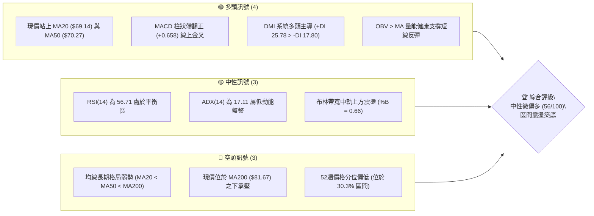
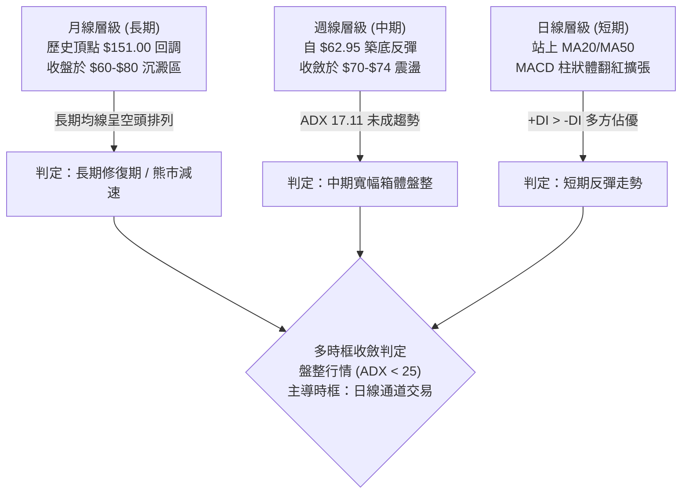
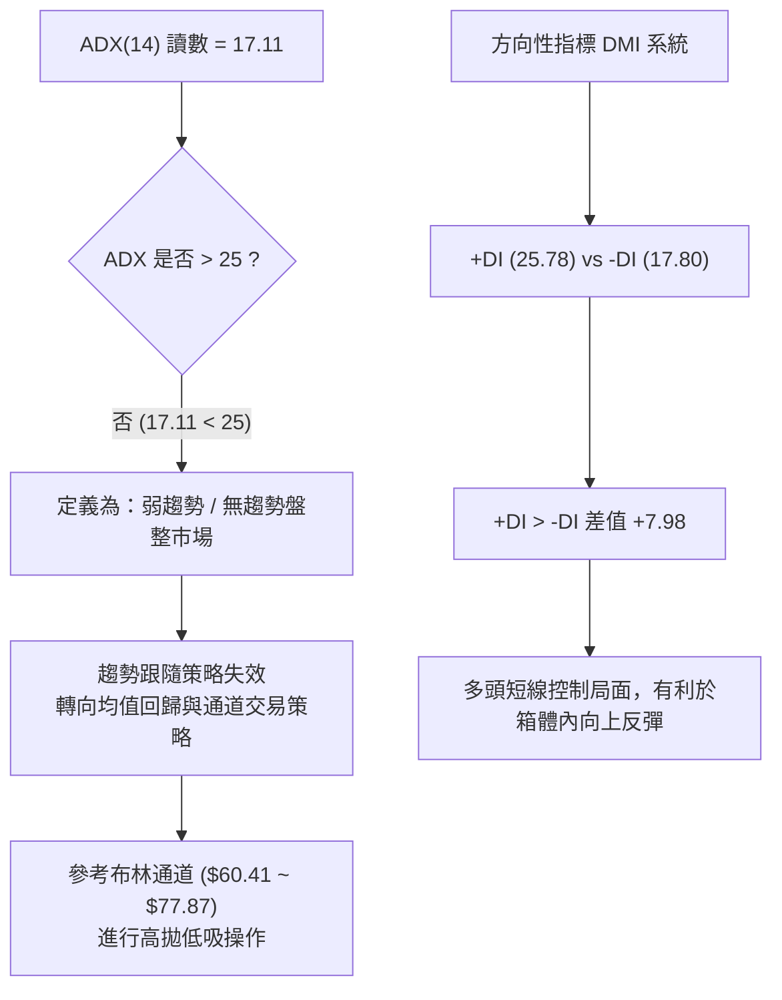
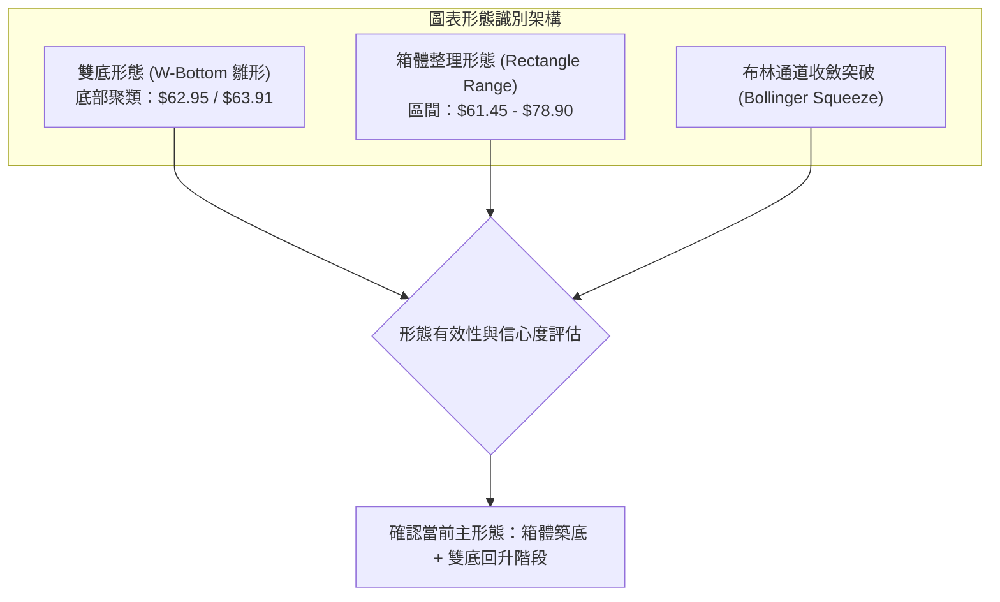
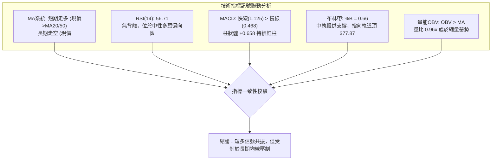
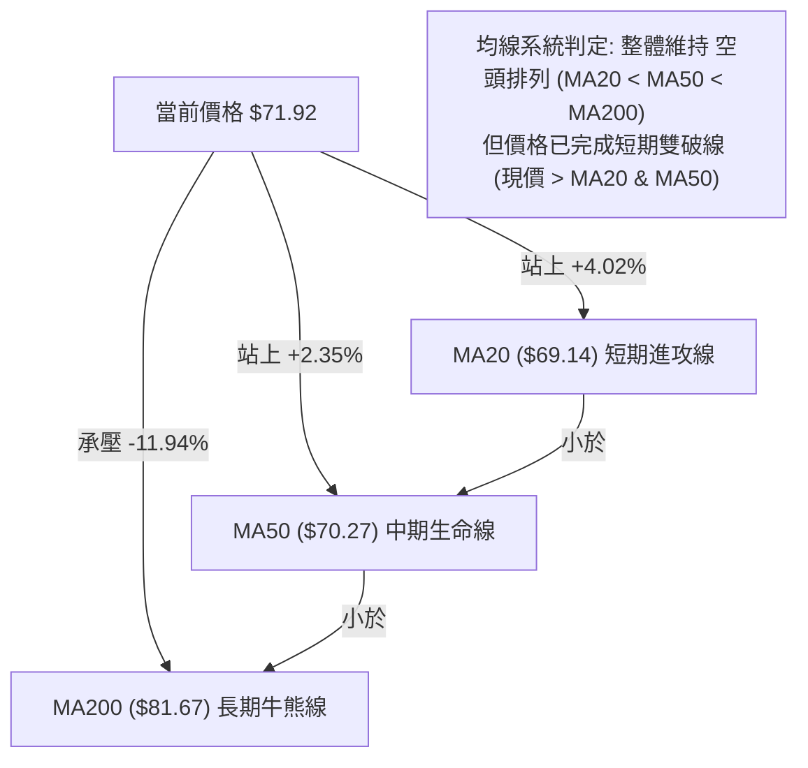
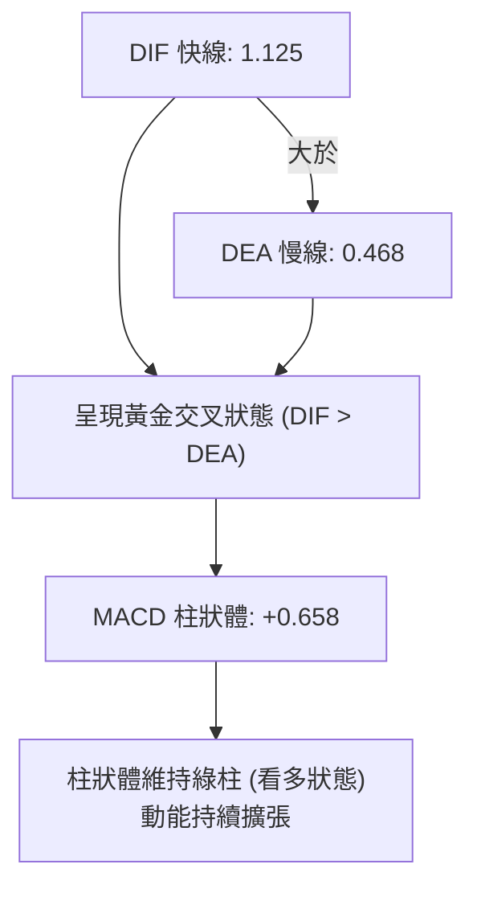
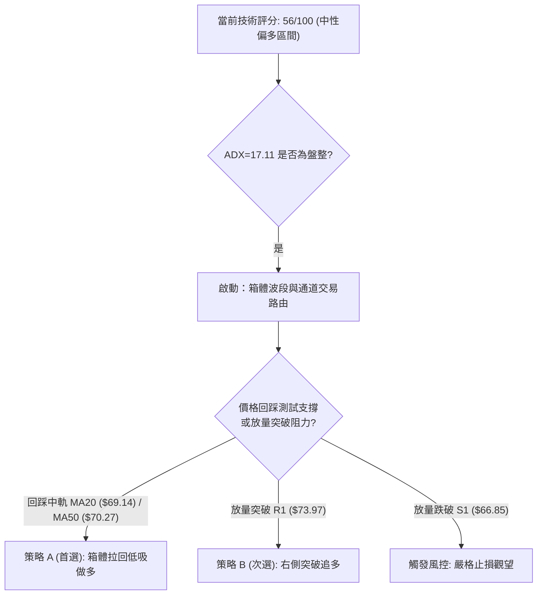
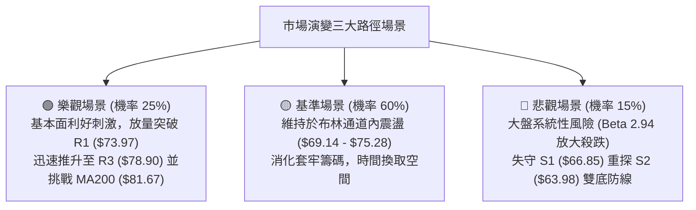

# RKLB 技術分析報告

> **報告日期**：2026-10-08 ｜ **語言**：繁體中文 ｜ **數據來源**：Yahoo Finance ｜ **當前價格**：$71.92

---

## 目錄

| 章節 | 內容 |
|------|------|
| [1. 技術面概覽](#1-技術面概覽) | 訊號儀表板、核心指標、評分卡 |
| [2. 趨勢分析](#2-趨勢分析) | 多時框趨勢、長中短期走勢 |
| [3. 圖表形態分析](#3-圖表形態分析) | 形態識別、K線組合、目標價 |
| [4. 支撐與阻力](#4-支撐與阻力) | 關鍵價位、斐波那契回調 |
| [5. 技術指標深度解讀](#5-技術指標深度解讀) | MA/RSI/MACD/布林/成交量 |
| [6. 動能與波動率](#6-動能與波動率) | 動能評估、ATR、Beta |
| [7. 多時框架總結](#7-多時框架總結) | 時框架評分矩陣 |
| [8. 交易策略建議](#8-交易策略建議) | 多空策略、風險報酬比 |
| [9. 風險提示與監控](#9-風險提示與監控) | 監控指標、風險場景 |

---

## 1. 技術面概覽

### 🎯 技術訊號儀表板



### 📊 核心指標速覽表

| 指標類別 | 指標名稱 | 當前數值 | 訊號 | 解讀 |
|----------|----------|----------|------|------|
| **價格** | 當前價格 | $71.92 | 🟡 | 脫離波段低位，位於52週區間30.3%處 |
| **均線** | MA20 | $69.14 | 🟢 | 現價位於其上方（+4.02%），短線支撐確立 |
| **均線** | MA50 | $70.27 | 🟢 | 現價成功站上中期成本線（+2.35%） |
| **均線** | MA200 | $81.67 | 🔴 | 位於長期年線下方（-11.94%），上方反壓沉重 |
| **動能** | RSI(14) | 56.71 | 🟡 | 處於45-60健康反彈中性區間，無超買超賣 |
| **動能** | MACD(12,26,9) | Hist: +0.658 | 🟢 | DIF(1.125) > DEA(0.468)，動能柱維持擴張 |
| **動能** | Stoch %K / %D | 56.11 / 70.83 | 🟡 | 短期動能回跌降溫，進入指標整理階段 |
| **趨勢** | ADX(14) | 17.11 | 🟡 | 數值低於25，確認進入「無明確方向之盤整行情」 |
| **趨勢** | DMI (+DI / -DI) | 25.78 / 17.80 | 🟢 | 多頭進攻意願佔優，空頭下壓力道減弱 |
| **通道** | Bollinger %B | 0.66 | 🟡 | 位於中軌（$69.14）至上軌（$77.87）之間 |
| **成交量**| 20日成交量比 | 0.96x | 🟡 | 20.44M vs 21.33M均量，量縮整理格局 |
| **波動** | ATR(14) | $4.19 | 🔴 | 每日震幅達 5.82%，波動風險度高 |

### 🏆 技術評分卡

```
╔══════════════════════════════════════════════════════════════════╗
║                 技術評分卡 — RKLB (2026-10-08)                  ║
╠══════════════════════════════════════════════════════════════════╣
║ 趨勢強度 (ADX=17.11)   ████████░░░░░░░░░░░░  40/100  🟡 弱勢盤整 ║
║ 動能指標 (MACD/RSI)    ██████████████░░░░░░  70/100  🟢 短線偏多 ║
║ 支撐穩定度 (S1/S2/S3)  ████████████░░░░░░░░  60/100  🟡 區間有守 ║
║ 成交量配合 (OBV>MA)    ████████████░░░░░░░░  60/100  🟢 量價相符 ║
║ 形態完整度 (雙底雛形)  ██████████░░░░░░░░░░  50/100  🟡 構築階段 ║
║ 均線排列 (空頭均線)    ████████░░░░░░░░░░░░  40/100  🔴 長線壓制 ║
╠══════════════════════════════════════════════════════════════════╣
║ 綜合評分               ███████████░░░░░░░░░  56/100  🟡 中性偏多 ║
╚══════════════════════════════════════════════════════════════════╝
```

---

## 2. 趨勢分析

### 🌐 多時框趨勢分析



### 📈 長期趨勢 — 12個月走勢圖（Unicode）

```
RKLB 月線走勢圖（過去12個月：2025-11 至 2026-10）
價格軸 ($)
$150 ┤                                      ● (2026-05 $143.48)
$140 ┤                                     ╱ ╲
$130 ┤                                    ╱   ╲
$120 ┤                                   ╱     ╲
$110 ┤                                  ╱       ● (2026-06 $101.65)
$100 ┤                                 ╱         ╲
 $90 ┤                 ● (2026-01)    ╱           ╲
 $80 ┤                ╱ ╲     ●(04)  ╱             ╲
 $70 ┤        ●(12)  ╱   ●(02) ╲    ╱               ╲       ●現價 $71.92
 $60 ┤  ●(10)  ╲    ╱     ╲     ●(03)                ●──────●(09 $69.68)
 $50 ┤          ╲  ╱                              (07 $64.95)(08 $63.92)
 $40 ┤           ● (2025-11 $42.14)
     └────────────────────────────────────────────────────────────────
        11   12   01   02    03   04   05   06   07   08   09   10  (月份)
```

**走勢特徵分析表格**：

| 階段區間 | 時間跨度 | 價格起訖 | 漲跌幅 | 走勢特徵分析 |
|----------|----------|----------|--------|--------------|
| 第1階段：暴跌築底 | 2025-10 ~ 2025-11 | $62.98 → $42.14 | -33.09% | 劇烈拋售，回探近一年低位區間 |
| 第2階段：春季回溫 | 2025-11 ~ 2026-01 | $42.14 → $80.07 | +90.01% | 暴力反彈，量能快速回升 |
| 第3階段：高位蓄勢 | 2026-01 ~ 2026-03 | $80.07 → $64.22 | -19.80% | 縮量拉回洗盤，形成中繼整理 |
| 第4階段：主力主升 | 2026-03 ~ 2026-05 | $64.22 → $143.48 | +123.42% | 出現歷史極端主升段，逼近歷史高位 $151.00 |
| 第5階段：泡沫破裂 | 2026-05 ~ 2026-07 | $143.48 → $64.95 | -54.73% | 斷崖式暴跌，多頭踩踏出逃 |
| 第6階段：低位盤整 | 2026-07 ~ 2026-10 | $64.95 → $71.92 | +10.73% | 波動率收縮，於斐波那契 78.6% 水平進行籌碼沉澱 |

### 📊 中期趨勢（週線分析）

```
近期週線壓力與支撐示意圖
═════════════════════════════════════════════════════════════════════════════
 $82.83 ───┬─ 08/09 波段反彈高點（短中期強反壓線）
           │
 $78.90 ───┼─ R3 強阻力（波段聚類點）
 $75.28 ───┼─ R2 阻力區
 $73.97 ───┼─ R1 近期週線收盤聚類阻力（09/27 $73.95、10/04 $73.92）
 $71.92 ───┼─ 【當前收盤價格位置】
           │
 $66.85 ───┼─ S1 近期波段回調支撐
 $63.98 ───┼─ S2 雙底頸線支撐聚類點（07/26 $63.91、08/30 $64.39、09/06 $64.26）
 $62.95 ───┴─ 09/13 觸及的波段絕對低點（關鍵防守底線）
═════════════════════════════════════════════════════════════════════════════
```

週線指標演變顯示：MACD 柱狀體在經歷了 2026 年 6 月的深幅負值（最低 -4.697）後，已自 2026 年 9 月下旬開始重新由負轉正，最新一週為 +0.658。週成交量由主升段時的每週超過 1.5 億股收縮至近一週的 6,657 萬股，說明籌碼換手充分，中期賣壓已大幅釋放。

### ⚡ 趨勢強度評估（ADX 解讀）



**ADX 趨勢強度對照解讀表**：

| ADX 數值區間 | 趨勢狀態 | 當前數值 | 當前狀態判定 | 交易指引 |
|--------------|----------|----------|--------------|----------|
| 0 - 20 | 弱勢/無趨勢 | **17.11** | **當前所在區間** | **震盪策略，布林通道高賣低買，嚴禁追價** |
| 20 - 25 | 趨勢萌芽/盤整邊緣 | - | - | 觀察突破方向與成交量變化 |
| 25 - 40 | 明確強趨勢 | - | - | 順勢交易，均線回踩進場 |
| 40 - 60 | 極強單邊趨勢 | - | - | 持倉抱牢，移動止損 |
| 60 以上 | 趨勢疲竭/極端過熱 | - | - | 警戒反轉，分批獲利了結 |

---

## 3. 圖表形態分析

### 🔍 形態識別系統



**圖表形態信心度與目標價計算表**（依規則 15 嚴格約束）：

| 形態名稱 | 信心度 | 判斷依據（引用數據） | 完成度 | 目標價（附計算式） |
|----------|--------|----------------------|--------|--------------------|
| **雙底形態 (W-Bottom)** | **68%** | 兩次低點分別出現在 2026-07-26 收盤 $63.91 與 2026-09-13 低點 $62.95，符合支撐位 S2 ($63.98) 聚類 | **75%** | 頸線為 2026-08-09 反彈高點 $82.83，形態高度 = $82.83 - $62.95 = $19.88。突破後測算目標價 = $82.83 + $19.88 = **$102.71** |
| **箱體震盪 (Box Consolidation)** | **82%** | 上軌由 R3 ($78.90) 與前期反彈高點構成，下軌緊貼斐波那契 78.6% 回調位 $61.84 及 S3 ($61.45) | **90%** | 箱體高度 = $78.90 - $61.45 = $17.45。突破箱頂後測算目標價 = $78.90 + $17.45 = **$96.35** |
| **頭肩底形態 (Inverse H&S)** | **35%** | 僅左肩（$63.91）與頭部（$62.95）成形，右肩未見獨立收縮形態 | **30%** | **訊號不足，僅做指標型解讀**（未滿足完成條件，不予計算） |

### 🕯️ 重要K線形態分析

| 週次/月份 | 收盤價 | K線形態 | 解讀 | 訊號 |
|-----------|--------|---------|------|------|
| 2026-05-31 | $143.48 | 倒轉長天線 / 歷史天價高位十字星 | 多頭動能耗盡，超買極端背離，主力出貨信號 | 🔴 強烈見頂 |
| 2026-07-26 | $63.91 | 長下影錘頭線（RSI=15.6 極端超賣） | 恐慌盤湧出後引發搶反彈資金，確立第一低點 | 🟢 觸底反彈 |
| 2026-08-09 | $82.83 | 長紅實體大陽線（漲幅 +27.5%） | 頸線回抽受阻，空頭在 MA200 附近大舉反撲 | 🟡 假突破壓力 |
| 2026-09-13 | $62.95 | 縮量十字星星線（週量降至 85.2M） | 賣盤枯竭，二次探底不破前低，構成第二隻腳 | 🟢 二次確認 |
| 2026-09-27 | $73.95 | 連續中陽線脫離底部區間 | 買盤重回主動權，一舉站上 MA20 與 MA50 | 🟢 短線轉強 |
| 2026-10-11 | $71.92 | 高位窄幅小陰線（量縮回踩） | 遇 R1 ($73.97) 阻力進行技術性回踩蓄勢 | 🟡 中性整固 |

### 📉 ASCII 走勢形態示意圖

```
RKLB 近四個月日/週線雙底與箱體形態架構圖
價格軸 ($)
$82.83 ┤                  ● (頸線高點 08/09)
       │                 ╱ ╲
$78.90 ┤───────────────╱───╲───────● (箱體阻力 R3) ───────────────
       │              ╱     ╲     ╱ ╲
$73.97 ┤             ╱       ╲   ╱   ●──────● (現價 $71.92 遇阻蓄勢)
       │            ╱         ╲ ╱       (R1 阻力線)
$70.27 ┤───●───────╱───────────●──────────────────────── (MA50 突破線)
       │    ╲     ╱
$63.98 ┤─────●───╱─────────────●──────────────────────── (底1: $63.91 / 底2: $62.95)
       │  (底 1)             (底 2)
$61.45 ┤──────────────────────────────────────────────── (箱體下軌支撐 S3)
       └────────────────────────────────────────────────────────
         2026-07             2026-08             2026-09             2026-10
```

### 🎯 形態目標價計算

1. **雙底形態目標價**：
   - 底部支撐平均價位：$(63.91 + 62.95) / 2 = \$63.43$
   - 頸線壓力位：$\$82.83$（2026-08-09 波段高點）
   - 形態垂直高度：$\$82.83 - \$63.43 = \$19.40$
   - 突破目標價：$\$82.83 + \$19.40 =$ **$102.23**（此目標價與斐波那契 38.2% 回調位 $107.67 極為接近，具備結構共振性）。

2. **區間矩形箱體突破目標價**：
   - 箱體頂部（R3）：$\$78.90$
   - 箱體底部（S3）：$\$61.45$
   - 箱體垂直高度：$\$78.90 - \$61.45 = \$17.45$
   - 目標價推算：$\$78.90 + \$17.45 =$ **$96.35**（此目標價與斐波那契 50.0% 回調位 $94.28 形成密集重疊區）。

---

## 4. 支撐與阻力

### 🗺️ 關鍵價位分布圖（Unicode）

```
RKLB 價位結構分布圖（引用 OHLCV 計算之關鍵價位）
═════════════════════════════════════════════════════════════════════════════
 $81.67 ║████████████████████████████████████║ 長期強反壓線 MA200
 $80.90 ║▓▓▓▓▓▓▓▓▓▓▓▓▓▓▓▓▓▓▓▓▓▓▓▓▓▓▓▓▓▓▓▓    ║ 斐波那契 61.8% 重要樞軸
 $78.90 ║████████████████████████████████    ║ 強阻力 R3 (波段高點聚類)
 $75.28 ║████████████████████                ║ 中期阻力 R2
 $73.97 ║████████████████████████            ║ 關鍵短期阻力 R1
 $71.92 ╠════════════════════════════════════╣ ◄ 現價 ($71.92)
 $70.27 ║▒▒▒▒▒▒▒▒▒▒▒▒▒▒▒▒▒▒▒▒▒▒▒▒▒▒▒▒▒▒▒▒▒▒▒▒║ 動態均線支撐 MA50
 $69.14 ║▒▒▒▒▒▒▒▒▒▒▒▒▒▒▒▒▒▒▒▒▒▒▒▒▒▒▒▒▒▒▒▒▒▒▒▒║ 動態均線支撐 MA20 / BB中軌
 $66.85 ║▓▓▓▓▓▓▓▓▓▓▓▓▓▓▓▓▓▓▓▓▓▓▓▓            ║ 近期波段回調支撐 S1
 $63.98 ║████████████████████████████████    ║ 關鍵強支撐 S2 (雙底低點聚類)
 $61.84 ║▓▓▓▓▓▓▓▓▓▓▓▓▓▓▓▓▓▓▓▓▓▓▓▓▓▓▓▓▓▓▓▓    ║ 斐波那契 78.6% 強支撐
 $61.45 ║████████████████████████████████████║ 核心防守底線 S3 (近一年低點聚類)
═════════════════════════════════════════════════════════════════════════════
```

### 🚧 阻力位分析表

所有價位均嚴格引用 OHLCV 聚類計算數據：

| 阻力級別 | 價位 | 距現價百分比 | 形成原因與籌碼特徵 | 突破難度 | 重要性 |
|----------|------|--------------|--------------------|----------|--------|
| **R1** | **$73.97** | +2.85% | 9月27日($73.95)與10月04日($73.92)波段高點重疊聚類區，短線獲利盤兌現位 | 🟡 中等 | 短線轉強訊號點 |
| **R2** | **$75.28** | +4.68% | 8月中旬次級反彈回落成交密集區，前期被套套牢籌碼次級解套點 | 🟡 中等 | 箱體中軸轉折位 |
| **R3** | **$78.90** | +9.71% | 接近布林通道上軌（$77.87）與波段阻力聚類，上方緊鄰斐波 61.8% ($80.90) | 🔴 極高 | 波段格局反轉點 |

### 🛡️ 支撐位分析表

所有價位均嚴格引用 OHLCV 聚類計算數據：

| 支撐級別 | 價位 | 距現價百分比 | 形成原因與籌碼特徵 | 守住機率 | 重要性 |
|----------|------|--------------|--------------------|----------|--------|
| **S1** | **$66.85** | -7.05% | 9月下旬突破頸線時的起漲點平臺，短線回踩確認的第一道技術防線 | 🟢 70% | 短線強弱分水嶺 |
| **S2** | **$63.98** | -11.03% | 7月下旬($63.91)與8月下旬($64.39)低點形成之強雙底聚類結構，機構護盤底線 | 🟢 85% | 中期生命線 |
| **S3** | **$61.45** | -14.56% | 緊鄰斐波那契 78.6% 回調位 ($61.84)，52週極端超賣區域的終極底線 | 🟢 95% | 空頭崩盤防線 |

### 📐 斐波那契回調位分析

依據 52 週絕對極值區間（低點 $37.57 → 高點 $151.00，波動空間 $113.43）計算之標準斐波那契序列：

```
斐波那契回調層級位階與現價對照
═════════════════════════════════════════════════════════════════════════════
  0.0%  (52W High)  $151.00 ──────────────────────────────────────────────
 23.6%              $124.23 ── 遠期回調阻力
 38.2%              $107.67 ── 中期波段反彈強阻力 (雙底測算目標 $102 附近)
 50.0%              $ 94.28 ── 多空強弱長期分水嶺 (箱體測算目標 $96 附近)
 61.8%              $ 80.90 ── 黃金分割關鍵反壓 (與 MA200 $81.67 共振)
═════════════════════════════════════════════════════════════════════════════
 【現價區間】       $ 71.92 ── 處於 61.8% ($80.90) 與 78.6% ($61.84) 之間
═════════════════════════════════════════════════════════════════════════════
 78.6%              $ 61.84 ── 極深次回調防守位 (緊鄰 S3 $61.45)
100.0%  (52W Low)   $ 37.57 ── 歷史底部基準
═════════════════════════════════════════════════════════════════════════════
```

**解讀結論**：
現價 $71.92 明確落於 **78.6% ($61.84)** 與 **61.8% ($80.90)** 之間。在經典技術分析理論中，深幅回調至 78.6% 水平後未破 100% 低點，且能重新站回其上方，代表原先的空頭非理性拋售已終結，正在構築高規格的築底平臺。上方 61.8% 水平（$80.90）與年線 MA200（$81.67）形成了空間高度重疊的「鋼鐵反壓區」，未帶量突破該區域前，行情均定性為回調修復，而非單邊牛市。

---

## 5. 技術指標深度解讀

### 🎛️ 指標訊號總覽



### 📈 移動平均線排列分析



**移動平均線數值與乖離率矩陣**：

| 均線週期 | 當前價格 | 均線價位 | 乖離率 (Bias) | 趨勢方向 | 技術意涵 |
|----------|----------|----------|---------------|----------|----------|
| **MA 5** | $71.92 | $72.88 | -1.31% | 輕微下彎 | 超短線在 R1 遇阻回踩 |
| **MA 10** | $71.92 | $72.35 | -0.60% | 走平震盪 | 5日與10日線糾纏，等待方向選擇 |
| **MA 20** | $71.92 | $69.14 | +4.02% | 向上發散 | 短線多頭防守底線，月線支撐強勁 |
| **MA 50** | $71.92 | $70.27 | +2.35% | 走平微揚 | 站穩季線，中期空頭打壓勢頭被瓦解 |
| **MA 60** | $71.92 | $69.90 | +2.89% | 築底走平 | 與 MA20/MA50 在 $69-$70 形成支撐帶 |
| **MA 120** | $71.92 | $86.50 | -16.86% | 向下壓制 | 半年線下行斜率陡峭，中期阻力巨大 |
| **MA 200** | $71.92 | $81.67 | -11.94% | 向下走緩 | 長期牛熊分界線，未收復前不可盲目樂觀 |
| **MA 240** | $71.92 | $76.74 | -6.28% | 走平延伸 | 與布林上軌（$77.87）重疊形成次級防線 |

### 📉 RSI(14) 分析

- **RSI 當前數值**：**56.71**
- **強度進度條**：`███████████░░░░░░░░░ 56.71%` 🟡 中性偏多

```
RSI(14) 狀態區間標註：
[0] ─── 極度超賣(20) ─── 超賣(30) ─── 中軸(50) ─── [56.71 現值] ─── 超買(70) ─── 極度超買(80) ─── [100]
                                          ▲
                                   多頭控盤臨界點
```

**背離深度研判**：
1. **頂背離檢驗**：現價由 2026-09-27 的 $73.95 波動至 10-04 的 $73.92 及現價 $71.92，對應 RSI 由 67.2、69.1 降至 56.71。價格維持高位震盪而 RSI 主動降溫回調，屬於標準的「指標超買修復」，並未創出價格新高與指標背馳，**無頂背離現象**。
2. **底背離檢驗**：回溯 2026-07-26 低點 $63.91 時 RSI 為 15.6，而在 2026-09-13 價格再次回探低點 $62.95 時，RSI 讀數大幅提升至 27.1。此處存在清晰的**週線級別普通底背離（Regular Bullish Divergence）**，該底背離正是促成 9 月下旬強勁反彈的底層動能。目前該背離動能已獲釋放，指標回到中性常態。

### 📊 MACD(12/26/9) 訊號解讀



週線層面的 MACD 柱狀圖變化更具啟發性：
- 2026-06-14：柱狀體達到空頭極值 **-4.697**（恐慌盤高峰）。
- 2026-08-02：柱狀體縮至 **+0.300**（首度翻紅）。
- 2026-09-13：柱狀體二度回踩僅為 **-0.133**（空方無力）。
- 2026-10-11：柱狀體持續維持在 **+0.658**。
**結論**：MACD 已完成完整的「零軸下雙底翻紅」構造，技術性買訊成立。

### 📦 布林通道分析

```
ASCII 布林通道位置示意圖（20日通道，2倍標準差）
═════════════════════════════════════════════════════════════════════════════
 $77.87 ──┬── 上軌 (Upper Band)  ─────────────────── [通道阻力區]
          │
          │                                  ▲
 $71.92 ──┼── 【當前收盤價】 (%B = 0.66) ─────●─── [中上軌強勢運行區]
          │                                  ▼
 $69.14 ──┼── 中軌 (Middle Band = MA20) ──────────── [核心回踩支撐]
          │
          │
 $60.41 ──┴── 下軌 (Lower Band)  ─────────────────── [通道超跌極限]
═════════════════════════════════════════════════════════════════════════════
```

**布林帶指標特徵解讀**：
- **帶寬（Bandwidth）**：$(77.87 - 60.41) / 69.14 = 25.25\%$。帶寬經歷暴跌後的收縮，目前呈現水平走平擴張跡象。
- **%B 指標**：數值為 **0.66**，清晰顯示價格脫離了中軌（0.50）並向上軌推進，屬於「健康上升通道」，尚未觸及 1.0 的超買擠壓區，上方至上軌 $77.87 尚有 +8.27% 的波動餘裕。

### 💹 成交量分析（量價配合度）

```
成交量均線比對柱狀圖
最新成交量: 20.44M  ███████████████████░ (量比 0.96x)
20日均成交: 21.33M  ████████████████████
50日均成交: 19.35M  ██████████████████░░
```

**量價關係深入分析**：
1. **量能縮小與價格穩定**：最新成交量 20.44M 股，相較於 20 日均量（21.33M）呈現 0.96 倍的微幅縮量。在股價於高位阻力 R1 ($73.97) 下方整理時，縮量代表並無主力恐慌倒閣跡象，屬於健康蓄勢。
2. **OBV（能量潮）驗證**：數據顯示 `OBV > MA → 量能支撐上漲`。在 2026-09-13 至 09-27 的反彈過程中，週成交量由 85.2M 階梯式放大至 111.5M，OBV 指標領先突破均線，證實底層資金具備實質買盤推動，而非無量虛拉。

---

## 6. 動能與波動率

### ⚡ 動能評估四象限

```
動能與波動率定位矩陣
┌───────────────────────────────────┬───────────────────────────────────┐
│ Q4: 高動能 / 高波動 (偏離常軌)    │ Q1: 高動能 / 低波動 (最佳趨勢段)  │
│ - 暴漲暴跌階段                    │ - 單邊主升行情                    │
│ - 範例: 2026-05 主升浪 ($143)     │ - 適合: 順勢加碼                  │
├───────────────────────────────────┼───────────────────────────────────┤
│ Q3: 低動能 / 高波動 (高風險震盪)  │ Q2: 低動能 / 低波動 (盤整蓄勢期)  │
│ - 巨幅洗盤破位                    │ - 箱體築底修復                    │
│ - 範例: 2026-06 泡沫破裂斷崖期    │ - ★【RKLB 當前定位 Q2 象限】★    │
│                                   │ - ADX=17.11 / ATR=5.82% / 量平   │
└───────────────────────────────────┴───────────────────────────────────┘
```

**四象限歸類詳解表**：

| 象限標記 | 動能維度 | 波動維度 | 當前狀態吻合 | 技術解讀與作戰方針 |
|----------|----------|----------|--------------|--------------------|
| **Q1** | 強 (+DI遠大於-DI, MACD極大) | 低 (ATR收斂至3%以下) | 否 | 缺乏趨勢爆發性推力 |
| **Q2** | **弱 (ADX=17.11 盤整中)** | **中低 (ATR降至 $4.19, 帶寬平緩)** | **★ 吻合 (當前)** | **籌碼重新沉澱，適合於支撐阻力間進行波段高拋低吸** |
| **Q3** | 弱 (方向不明) | 高 (歷史高位破位期) | 否 | 暴跌階段已經過去 |
| **Q4** | 強 (單邊衝刺) | 高 (極端震盪) | 否 | 市場冷靜，投機熱度降溫 |

### 📊 ATR 波動率分析

- **ATR(14) 讀數**：**$4.19**
- **價格波動百分比**：$4.19 / \$71.92 =$ **5.82%**

```
ATR 波動階梯與止損點位安全距設定：
現價: $71.92
├─ 0.5 ATR ($2.10): 超短線日內噪聲區間 [$69.82 - $74.02]
├─ 1.0 ATR ($4.19): 標準波段日內波動幅度 [$67.73 - $76.11]
├─ 1.5 ATR ($6.29): 建議防守止損安全距離 ($71.92 - $6.29 = $65.63，低於 S1)
└─ 2.0 ATR ($8.38): 寬鬆波段止損邊界 ($71.92 - $8.38 = $63.54，切入 S2 強支撐下方)
```

**交易意涵**：RKLB 每日震幅接近 6%，屬於高波動性航太國防標的。日內窄幅止損極易被市場噪聲掃出場，所有止損設定必須至少保留 **1.5 倍 ATR（即至少 $6.30 空間）** 方能具備統計學上的生存概率。

### 📐 Beta 與市場相關性

- **Beta 係數**：**2.938**（極高 Beta 屬性）
- **Short % Float**：**7.3%**（空頭回補天數 2.61 天）
- **解讀**：
  1. **大盤放大器效應**：Beta 近 3.0 代表標的對納斯達克指數與標普500具有極強的放大作用。大盤若上漲 1%，該股理論上漲約 2.94%；反之大盤承壓時亦容易遭受加倍打擊。
  2. **空頭擠壓潛能**：7.3% 的空頭部位雖未達極端逼空標準，但 2.61 天的回補天數意味著若價格有效突破 R1 ($73.97) 及 R2 ($75.28)，空頭被迫停損的買盤將為上攻布林通道上軌提供充足燃料。

---

## 7. 多時框架總結

### 📋 時框架評分表

| 時框架 | 趨勢方向 | 動能狀態 | 均線排列 | 圖表形態 | 綜合評分 | 操作指引 |
|--------|----------|----------|----------|----------|----------|----------|
| **長期 (月線)** | 🔴 空頭修復 | 🟡 止跌回穩 | 🔴 MA200 反壓 | 大幅回調 78.6% 沉澱 | 45/100 | 長期投資者分批定投，不可重倉追高 |
| **中期 (週線)** | 🟡 寬幅震盪 | 🟢 MACD 翻紅 | 🟡 MA50 處爭奪 | 雙底結構構築中 (68%) | 58/100 | 箱體區間思維，以頸線為目標 |
| **短期 (日線)** | 🟢 震盪反彈 | 🟢 +DI 佔優 | 🟢 站上 MA20/MA50 | 回踩 R1 阻力後蓄勢 | 65/100 | 回調支撐位進場做多，快進快出 |

### 🔲 綜合訊號矩陣

```
時框維度與指標信號共振矩陣
┌───────────────┬──────────────┬──────────────┬──────────────┬──────────────┐
│ 時框 / 維度   │ 趨勢方向     │ 動能指標     │ 均線系統     │ 量能匹配     │
├───────────────┼──────────────┼──────────────┼──────────────┼──────────────┤
│ 日線 (短期)   │ 🟢 看多      │ 🟢 看多      │ 🟢 看多      │ 🟡 中性      │
│ 週線 (中期)   │ 🟡 中性      │ 🟢 看多      │ 🟡 中性      │ 🟢 看多      │
│ 月線 (長期)   │ 🔴 看空      │ 🟡 中性      │ 🔴 看空      │ 🟡 中性      │
├───────────────┼──────────────┼──────────────┼──────────────┼──────────────┤
│ 跨時框共振    │ 衝突 (日多月空)│ 一致偏多     │ 衝突 (短多長空)│ 支持反彈     │
└───────────────┴──────────────┴──────────────┴──────────────┴──────────────┘
```

### ⚖️ 多時框收斂結論

依據多時框收斂優先級規則（規則 14）：
1. **趨勢/盤整行情定性**：當前 ADX(14) 讀數為 **17.11**，明確小於 25，判定市場處於**「無趨勢盤整行情」**。
2. **主導時框判定**：在盤整行情中，趨勢跟隨無效，主導權下放至**日線布林通道（$60.41 - $77.87）與結構關鍵位**，而非依賴長期月線的空頭壓制來盲目做空。
3. **最終方向性結論**：**🟡 中性微偏多（箱體內均值回歸反彈）**。
   - 儘管月線與 MA200 仍呈空頭壓制，但日線與週線的 MACD 底背離翻紅、+DI 主導以及雙底支撐（S2 $63.98）已形成強大屏障。當前最優解為：**以防守 S1/S2 為盾，在箱體下半區順應短線動能做多，博弈向布林上軌及 R2/R3 的反彈**。此結論與第 8 章交易策略完全一致。

---

## 8. 交易策略建議

### 🗺️ 策略決策流程圖



### 🧭 策略路由（依評分卡分流）

> **當前主策略方向 = 區間偏多操作（依綜合評分 56/100）**
> 綜合評分落於 40–60 之區間操作帶，但動能與量能共振偏多（分數 56 靠近多方閥值 60）。根據規則，**主推以布林通道與關鍵支撐為依託的多頭策略**，不兩頭下注；空方僅列出極端破位時的反轉風險對沖點。

### 🎯 價格情境階梯（Price Scenarios）

所有階梯價位嚴格引用第 4 章及數據計算清單：

| 觸發條件 | 下一目標 | 後續延伸 | 情境含義與操作指引 |
|----------|----------|----------|--------------------|
| **放量突破 R1 $73.97** | **R2 $75.28** | **R3 $78.90** | 短線擺脫糾纏轉強，發起衝擊布林上軌與年線反彈 |
| **站穩現價 $71.92 區間** | **R1 $73.97** | — | 區間震盪蓄勢，沿 MA20/MA50 整理沉澱籌碼 |
| **回踩跌破 S1 $66.85** | **S2 $63.98** | **S3 $61.45** | 短線多頭結構破壞，重回雙底邊界考驗支撐 |

### 📊 情境機率分佈

| 情境劇本 | 機率 | 主要依據（引用指標狀態） |
|----------|------|--------------------------|
| **箱體內向上反彈 (衝擊 R2/R3)** | **55%** | MACD維持正柱狀體(+0.658)、+DI(25.78)>-DI(17.80)、OBV>MA 量能支持 |
| **狹幅區間震盪 ($69.14 ~ $73.97)** | **30%** | ADX=17.11 低動能特性、20日量比僅0.96x、5日/10日均線糾纏 |
| **失守支撐再探底 (考驗 S2 $63.98)** | **15%** | 長期均線仍處空頭排列、現價受制於年線 MA200 ($81.67) 之下 |

### 🟢 主策略詳情

所有價位均直接取自技術數據與關鍵價位聚類：

| 策略要素 | 策略 A：支撐回踩低吸（首選） | 策略 B：突破順勢跟進（次選） |
|----------|------------------------------|------------------------------|
| **進場條件** | 回踩 MA50 ($70.27) 至 MA20 ($69.14) 企穩出現下影線 | 日K線收盤放量實體突破 R1 阻力位 |
| **進場價格** | **$69.50**（介於 MA20 $69.14 與 MA50 $70.27 間） | **$74.20**（確認突破 R1 $73.97 後） |
| **目標價 T1** | **$75.28**（阻力 R2，預期獲利 +8.32%） | **$78.90**（阻力 R3，預期獲利 +6.33%） |
| **目標價 T2** | **$78.90**（阻力 R3，預期獲利 +13.53%） | **$80.90**（斐波 61.8% / MA200，預期 +9.03%） |
| **止損價格** | **$66.00**（跌破 S1 $66.85 關鍵波段支撐） | **$71.50**（跌回現價中軸與突破平臺下方） |
| **風險報酬比**| **2.69 : 1**（風險 $3.50，目標2利潤 $9.40） | **2.48 : 1**（風險 $2.70，目標2利潤 $6.70） |
| **成功機率** | **65%** | **55%** |
| **建議倉位** | **15% - 20%**（核心波段倉） | **10%**（動能追逐倉） |

### 🔴 反向風險觸發點（對沖提示）

若市場出現以下極端反轉訊號，主策略自動失效，多頭部位應無條件止損離場並考慮對沖：
1. **破位信號**：日K線收盤價跌破 **S1 ($66.85)**，且成交量放大至 20 日均量 1.5 倍以上。
2. **終極防守**：雙底頸線 **S2 ($63.98)** 失守，宣告形態構建失敗，下方將直接回測斐波 78.6% 水平 **$61.84** 及 **S3 ($61.45)**。

### ⭐ 整體訊號強度評星

```
做多訊號強度：★★★☆☆  (3.5/5星 — 短線指標多頭排列，惟受大時框壓制)
做空訊號強度：★★☆☆☆  (2.0/5星 — 底背離已現，空頭動能衰竭)
整體可信度：  ★★★★☆  (4.0/5星 — 價位聚類與布林帶吻合度高)
```

---

## 9. 風險提示與監控

### ✅ 關鍵監控指標 Checklist

```
╔══════════════════════════════════════════════════════════════════╗
║                   每日交易風控監控清單 (Checklist)               ║
╠══════════════════════════════════════════════════════════════════╣
║ [ ] 價格是否跌破動態中軌 MA20 ($69.14)？                         ║
║     └─ 觸發即代表短線進攻節奏中斷，倉位應減半觀望。              ║
║ [ ] RSI(14) 是否跌破 50 多空分水嶺？                             ║
║     └─ 目前為 56.71，若跌破 50 意味動能重新由空方掌控。          ║
║ [ ] MACD 柱狀體是否由紅翻綠 (即轉為負值)？                       ║
║     └─ 目前為 +0.658，翻綠則波段多頭行情告終。                   ║
║ [ ] ADX(14) 是否自 17.11 快速攀升並伴隨 -DI 向上交叉？          ║
║     └─ 若突破 25 且 -DI 主導，代表新一輪單邊跌勢啟動。           ║
║ [ ] 每日收盤是否失守波段核心防守 S1 ($66.85)？                  ║
║     └─ 嚴格硬止損線，不抱任何僥倖心態。                          ║
╚══════════════════════════════════════════════════════════════════╝
```

### ⚠️ 風險場景分析



### 🛡️ 風險管理重要提醒

1. **Beta 槓桿防護**：RKLB Beta 接近 3.0，任何總體經濟利空（如利率預期生變、地緣政治突發）都將被成倍放大。整體投資組合中，該標的之資金配置比例**不宜超過總權益之 15%**。
2. **波動率自適應止損**：ATR 為 $4.19（5.82%），操作上務必拉開止損空間至 $66.00 附近，切忌採用 1%-2% 的過度敏感止損，以避免在正常日內晃動中被反覆洗盤出場。
3. **重大事件隔離**：太空航太板塊高度依賴發射任務成功率及政府合約簽署。在無預警突發任務公告前，務必維持適度現金流以規避跳空風險。

---

## 📋 報告總結

```
╔══════════════════════════════════════════════════════════════════════════╗
║                       RKLB 技術分析報告總結                              ║
╠══════════════════════════════════════════════════════════════════════════╣
║ 報告日期：2026-10-08                當前價格：$71.92                    ║
║ 分析評級：🟡 震盪築底 / 中性偏多    綜合評分：56 / 100                   ║
╠══════════════════════════════════════════════════════════════════════════╣
║ 關鍵結論：                                                               ║
║ ├─ 長期趨勢：🔴 空頭主導（現價仍低於 MA200 $81.67，處於深度回調沉澱期）   ║
║ ├─ 中期趨勢：🟡 箱體築底（週線 MACD 翻紅，雙底結構信心度 68%）            ║
║ ├─ 短期趨勢：🟢 偏多反彈（站穩 MA20 $69.14 與 MA50 $70.27，+DI 佔優）    ║
║ ├─ 關鍵支撐：S1 $66.85 ｜ S2 $63.98 ｜ S3 $61.45                         ║
║ ├─ 關鍵阻力：R1 $73.97 ｜ R2 $75.28 ｜ R3 $78.90                         ║
║ └─ 分析師目標：平均 $109.15（最低 $64.00，最高 $150.00，共20位買入評級）  ║
╠══════════════════════════════════════════════════════════════════════════╣
║ 最優策略組合：                                                           ║
║ 1. 🥇 最佳機會（策略 A）：回踩 MA20/MA50 區間 $69.50 低吸，止損 $66.00，  ║
║                       目標上看 R2 $75.28 與 R3 $78.90（風報比 2.69:1）   ║
║ 2. 🥈 次選機會（策略 B）：放量突破 R1 $73.97 後於 $74.20 追多，止損 $71.50║
║                       目標上看 $78.90 與斐波 61.8% $80.90（風報比 2.48:1）║
║ 3. 🥉 保守選擇：在 ADX 升破 25 確立趨勢前保持觀望，耐心等待價格回測 S2    ║
║               $63.98 聚類強支撐區再行介入。                              ║
╚══════════════════════════════════════════════════════════════════════════╝
```

---

> ⚠️ **免責聲明**：本報告為技術分析專用文檔，所有數據及點位均基於歷史量價統計模型與客觀指標測算。本報告**僅供研究與學術參考**，**不構成任何要約、招攬或投資建議**。市場有風險，交易需依個人風險承受能力嚴格執行風控紀律。

---

*報告生成時間：2026-10-08 ｜ 數據來源：Yahoo Finance ｜ 分析框架：多時框技術分析體系*