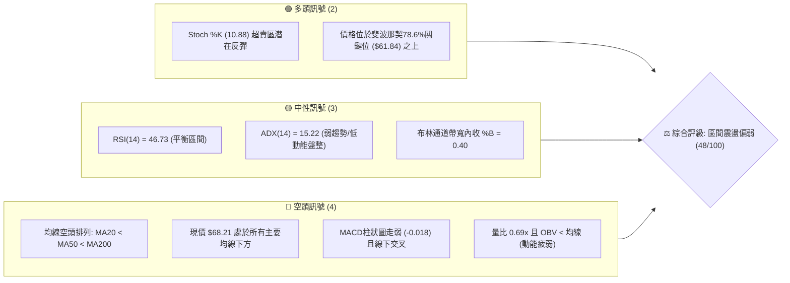
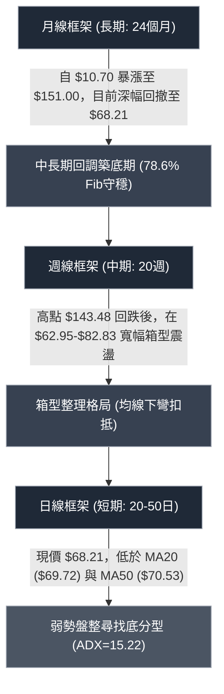
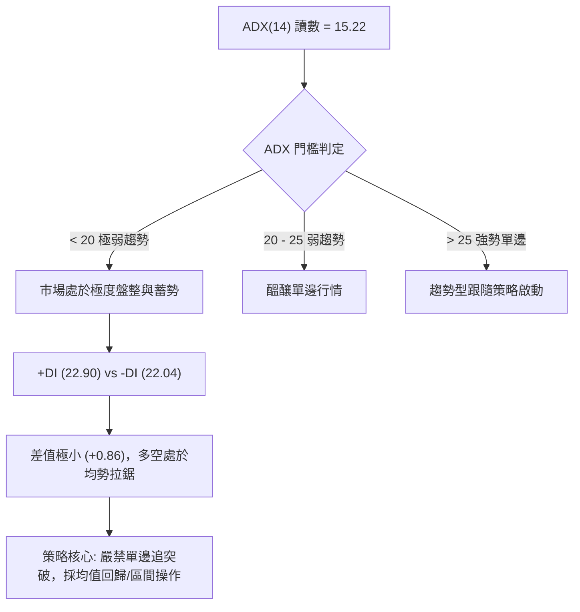
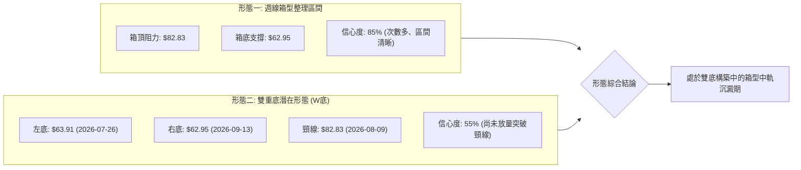
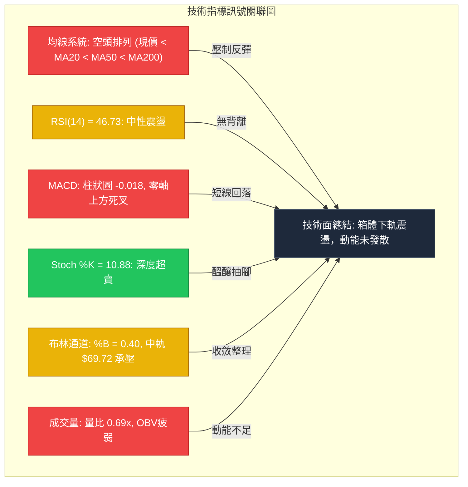
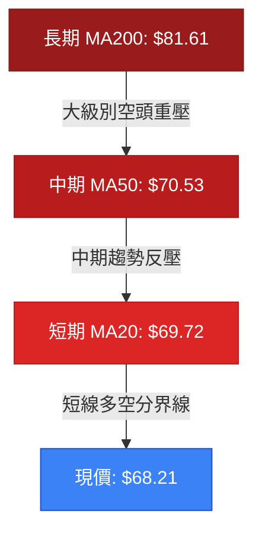
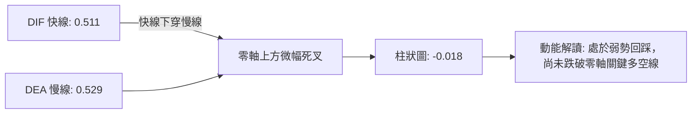
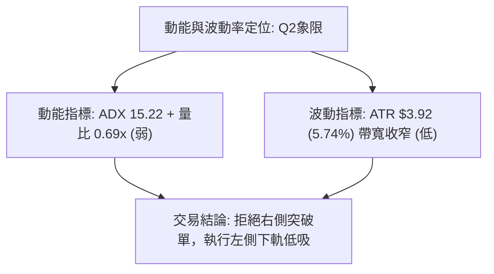
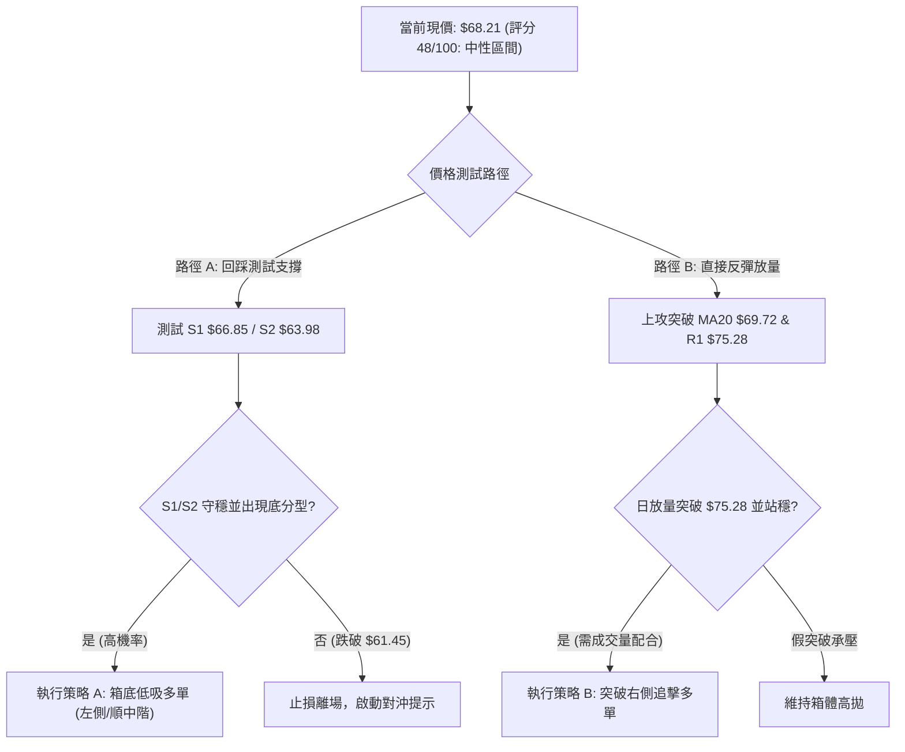
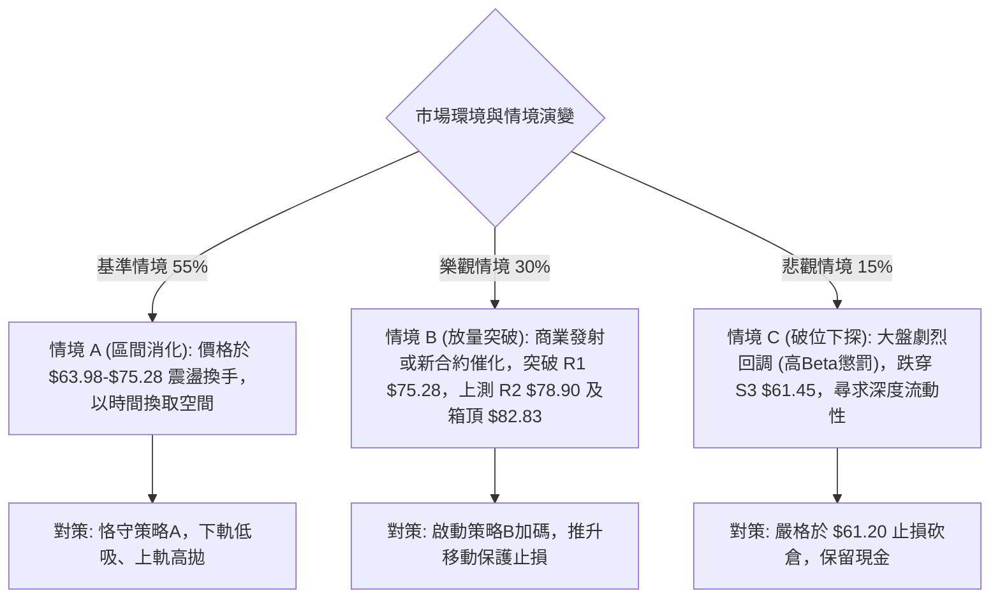

# RKLB 基本面與技術面深度分析報告

> **報告日期**：2026-10-10 ｜ **語言**：繁體中文 ｜ **數據來源**：Yahoo Finance ｜ **當前價格**：$68.21

---

## 目錄

| 章節 | 內容 |
|------|------|
| [1. 技術面概覽](#1-技術面概覽) | 訊號儀表板、核心指標、評分卡 |
| [2. 趨勢分析](#2-趨勢分析) | 多時框趨勢、長中短期走勢、ADX強弱判斷 |
| [3. 圖表形態分析](#3-圖表形態分析) | 形態識別信心度、K線組合、目標價推算 |
| [4. 支撐與阻力](#4-支撐與阻力) | 關鍵價位分布、阻力與支撐表、斐波那契回調 |
| [5. 技術指標深度解讀](#5-技術指標深度解讀) | 均線系統、RSI、MACD、布林通道、成交量/OBV |
| [6. 動能與波動率](#6-動能與波動率) | 四象限評估、ATR止損模型、Beta相關性 |
| [7. 多時框架總結](#7-多時框架總結) | 時框架矩陣、訊號優先級收斂結論 |
| [8. 交易策略建議](#8-交易策略建議) | 策略路由、價格階梯、主客策略與風控參數 |
| [9. 風險提示與監控](#9-風險提示與監控) | 監控Checklist、三種情境演變、部位管理 |
| [10. 報告總結](#10-報告總結) | 儀表板總結、關鍵價位一覽與最優策略 |

---

## 1. 技術面概覽

### 🎯 技術訊號儀表板



### 📊 核心指標速覽表

| 指標類別 | 指標名稱 | 當前數值 | 訊號 | 解讀 |
|----------|----------|----------|------|------|
| **價格** | 當前收盤價 | $68.21 | 🔴 | 處於52週高低點區間 27.0% 位置，自高點壓回大幅修正 |
| **均線** | MA20 | $69.72 | 🔴 | 現價低於MA20 (-2.17%)，短期承壓 |
| **均線** | MA50 | $70.53 | 🔴 | 現價低於MA50，中期多空分界線反轉為阻力 |
| **均線** | MA200 | $81.61 | 🔴 | 現價顯著低於年線 (-16.42%)，長期格局受到壓抑 |
| **動能** | RSI(14) | 46.73 | 🟡 | 位於40-50中性偏弱震盪區，未見極端超賣，無顯著背離 |
| **動能** | MACD (12,26,9) | 0.511 / 0.529 (柱: -0.018) | 🔴 | MACD快線死叉訊號線，柱狀圖轉負，短線動能衰退 |
| **動能** | 隨機指標 %K / %D | 10.88 / 30.34 | 🟢 | %K深入極度超賣區間 (<20)，孕育短線技術性抽腳彈升動能 |
| **趨勢強度** | ADX (14) | 15.22 (+DI: 22.90, -DI: 22.04) | 🟡 | ADX < 25 表明無單邊趨勢，多空力道互咬，行情定性為箱型盤整 |
| **通道** | 布林通道 (20, 2) | 上 $77.22 / 中 $69.72 / 下 $62.23 | 🟡 | %B 為 0.40，價格運行於中軌與下軌之間偏下緣位置 |
| **成交量** | 成交量與量比 | 14,873,000 (量比 0.69x) | 🔴 | 顯著低於20日均量 (21,512,975)，量能萎縮，追價買盤退潮 |
| **波動** | ATR(14) | $3.92 (5.74%) | 🟡 | 每日平均波動幅度近4元，提供日內與波段交易適當安全緩衝空間 |

### 🏆 技術評分卡

```
╔══════════════════════════════════════════════════════════════╗
║             技術評分卡 — RKLB (2026-10-10)                   ║
╠══════════════════════════════════════════════════════════════╣
║ 趨勢強度 (ADX/方向)   ██████░░░░░░░░░░░░░░  30/100 🔴 弱勢盤整║
║ 動能指標 (RSI/MACD)   ████████░░░░░░░░░░░░  42/100 🟡 中性偏弱║
║ 支撐穩定度 (S1/S2/S3) ██████████████░░░░░░  70/100 🟢 底部穩固║
║ 成交量配合 (量比/OBV) ██████░░░░░░░░░░░░░░  32/100 🔴 縮量鈍化║
║ 形態完整度 (箱體/雙底)████████████░░░░░░░░  60/100 🟡 構築區間║
║ 均線排列 (MA20/50/200)████████░░░░░░░░░░░░  40/100 🔴 空頭排列║
╠══════════════════════════════════════════════════════════════╣
║ 綜合評分              █████████░░░░░░░░░░░  48/100 🟡 中性區間║
║ 結論評級              【區間震盪／等待回踩支撐或突破確認】    ║
╚══════════════════════════════════════════════════════════════╝
```

---

## 2. 趨勢分析

### 🌐 多時框趨勢分析



### 📈 長期趨勢 — 12個月走勢圖（Unicode）

以下展示自 2025 年 11 月至 2026 年 10 月之月線收盤走勢：

```
RKLB 月線收盤走勢圖（過去12個月）
價格軸 ($)
$150.00 ┤                                  ● $143.48 (2026-05 頂點)
$135.00 ┤                                 / \
$120.00 ┤                                /   \
$105.00 ┤                               /     ● $101.65 (2026-06)
 $90.00 ┤                     ● $80.07  /       \
 $75.00 ┤           ● $69.76 /   \     ● $82.51  \
 $60.00 ┤          /        /     ●---/           \       ● $69.68
 $45.00 ┤  ● $42.14       $69.10 $64.22           ● $64.95 \   ● $68.21 (現價)
 $30.00 ┤                                          $63.92   ■---■
        └────┬──────┬──────┬──────┬──────┬──────┬──────┬──────┬──────┬──────┬──────┬──────
           25-11  25-12  26-01  26-02  26-03  26-04  26-05  26-06  26-07  26-08  26-09  26-10
```

#### 長期走勢特徵分析表格

| 階段區間 | 起止價格 | 漲跌幅 (%) | 量價與形態特徵 |
|----------|----------|------------|----------------|
| **2025-11 ~ 2026-01** | $42.14 → $80.07 | +90.01% | 突破加速段，伴隨業績與商業發射題材爆發，呈現強勢多頭推升。 |
| **2026-02 ~ 2026-03** | $80.07 → $64.22 | -19.79% | 高檔獲利回吐，於 $64.00 附近獲得強烈技術面接盤支撐。 |
| **2026-04 ~ 2026-05** | $64.22 → $143.48 | +123.42% | 極端主升浪，月線創歷史天價 $151.00，週成交量放大至 1.5 億股以上。 |
| **2026-06 ~ 2026-07** | $143.48 → $64.95 | -54.73% | 尖頂崩跌回落，形成估值回歸與多殺多斷頭潮，迅速回吐前波漲幅。 |
| **2026-08 ~ 2026-10** | $64.95 → $68.21 | +5.02% | 底部構築與量縮沉澱期，價格於 $62.95 至 $82.83 區間收斂打底。 |

### 📊 中期趨勢（週線分析）

中期走勢自 2026 年 5 月底創下 $143.48 頂點後，展開了長達 20 週的消化沉澱：
1. **第一次觸底**：2026-07-26 當週打至 $63.91，RSI 跌至極端低值 15.6，MACD 柱狀圖收斂至 -0.618，隨後報復性反彈至 2026-08-09 的 $82.83。
2. **第二次觸底（測底）**：2026-09-13 當週再次下探波段低點 $62.95，隨後週線連三紅，反彈至 2026-09-27 的 $73.95 及 2026-10-04 的 $73.92。
3. **當前局勢**：本週收於 $68.21，週 RSI 回落至 46.7，週 MACD 柱狀圖微幅翻負至 -0.018。整體呈現典型「雙底成型但頸線未突破」之箱型拉鋸。

```
週線區間震盪格局示意圖：
  $82.83 ───────────────────────────── [箱頂強阻力 / 8月反彈頂]
           ▲                      
          / \        $73.95 (9月次高)
         /   \         ▲    
  $68.21    現價位置 ──┼─────── (MA20/MA50 纏繞處)
               \     / 
  $62.95 ───────▼───▼───────────────── [箱底強支撐 / 7-9月雙重底]
```

### ⚡ 趨勢強度評估（ADX 解讀）



#### ADX 強度量化對照表

| 指標變數 | 當前讀數 | 強度級別 | 技術定性與操作意涵 |
|----------|----------|----------|--------------------|
| **ADX(14)** | 15.22 | 🔴 極弱趨勢 (<20) | 趨勢動能徹底匱乏，指標出現橫向鈍化，任何單邊突破均易出現假突破回踩。 |
| **+DI** | 22.90 | 🟡 中性平衡 | 多頭發起攻擊之推進力道微弱，未見顯著攻擊波。 |
| **-DI** | 22.04 | 🟡 中性平衡 | 空頭殺跌動能同樣耗盡，未出現恐慌拋售潮。 |
| **動能淨值 (+DI - -DI)**| +0.86 | 🟡 微弱多頭佔優 | 雙方力量極度均衡，短線行情由短期資金流向與消息面主導。 |

---

## 3. 圖表形態分析

### 🔍 形態識別系統

依據形態學嚴格定義，針對當前週線與日線架構進行幾何圖形檢驗：



#### 形態識別信心度與參數表

| 形態名稱 | 信心度 | 判斷依據（嚴格引用數據） | 完成度 | 目標價（附嚴謹計算式） |
|----------|--------|--------------------------|--------|------------------------|
| **矩形箱型整理** | **85%** | 價格於 2026-07 至 2026-10 期間，3 次受制於 $82.83 附近阻力，4 次在 $62.95-$63.98 獲支撐。 | 90% | 箱體上下軌操作：下軌 $62.95 逢低承接，上軌 $82.83 獲利了結。 |
| **雙重底 (W-Bottom)** | **55%** | 第 1 低點 2026-07-26 之 $63.91，第 2 低點 2026-09-13 之 $62.95，中間反彈高點 $82.83。 | 50% (待突破) | 頸線 = $82.83；形態高度 = $82.83 - $62.95 = $19.88。<br>突破目標價 = $82.83 + $19.88 = **$102.71**（接近波段高點 $101.65）。 |
| **旗形 / 收斂三角** | **<30%** | 日線週期均線糾纏，高低點收斂時間不足，缺乏明晰之上下邊界。 | 20% | 訊號不足，依規則不予繪製預測，僅做均線指標型解讀。 |

### 🕯️ 重要K線形態分析

| 觀測週期/月份 | 收盤價 | K線形態特徵 | 量價解讀 | 訊號意涵 |
|---------------|--------|-------------|----------|----------|
| **2026-05 (月線)** | $143.48 | 長上影大陽線（頂部避雷針） | 摸高 $151.00 後獲利盤瘋狂出逃，量能破天荒爆發，屬典型買盤耗竭巨量見頂。 | 🔴 強烈見頂反轉 |
| **2026-06 (月線)** | $101.65 | 大陰線貫穿 | 開盤即跌破前月支撐，多頭毫無抵抗，確認中長期波段轉向修正。 | 🔴 趨勢下行確認 |
| **2026-07 (月線)** | $64.95 | 長下影紡錘線 | 單月自 $100 下挫並於 $63.91 獲得抄底買盤，週 RSI 出現極端值 15.6。 | 🟢 初步止跌回升 |
| **2026-08 (月線)** | $63.92 | 十字星十字線 (Doji) | 月高 $82.83，月低 $63.91，多空激烈博弈後收平，顯示暴跌動能完全收斂。 | 🟡 變盤蓄勢整理 |
| **2026-09 (月線)** | $69.68 | 帶長下影小陽線 | 月中探底 $62.95 未破前低，月末回升收高，形成高低點微幅抬升之雙底雛形。 | 🟢 底部支撐加固 |
| **2026-10 (當前)** | $68.21 | 縮量窄幅陰線 | 於 MA20 ($69.72) 附近縮量壓回，量比 0.69x，等待方向選擇。 | 🟡 觀望蓄勢 |

### 📉 ASCII 走勢形態示意圖

```
RKLB 中期「雙重底（潛在）與箱型整理」結構圖
==================================================================================
$86.83 ---------------------------------------------------- [近一年波段高點聚類 R3]
$82.83 ---------+------------------------------------------ [W底頸線 / 箱體上軌]
                | \
                |   \
$75.28 ---------|-----\---------+-------------------------- [阻力位 R1]
                |       \       | \
$69.72 ---------|--------\------|--\--● $68.21 (現價 / MA20)
                |         \     |   \
$63.91 ---------+          \    +    \--------------------- [左底 2026-07]
                            \         
$62.95 ----------------------+----------------------------- [右底 2026-09]
==================================================================================
時  間:      2026-07       2026-08      2026-09     2026-10
形態解析:    [ 第一底 ]   [ 頸線測試 ]  [ 第二底 ]  [ 蓄勢待發 ]
```

### 🎯 形態目標價計算

若未來價格確認有效放量突破頸線阻力，其潛在目標價與推算路徑如下：
- **第一目標價（箱型阻力位 R1 聚類）**：**$75.28**（較現價溢價 +10.37%）。
- **第二目標價（波段高點 R2 / 頸線聚類）**：**$78.90** 至 **$82.83**（較現價溢價 +15.67% ~ +21.43%）。
- **完全形態高度測量目標價（W底突破推算）**：
  $$\text{目標價} = \text{頸線價格} + (\text{頸線價格} - \text{雙底最低點}) = \$82.83 + (\$82.83 - \$62.95) = \$102.71$$
  該目標價與 2026-06 月線收盤價 $101.65 形成高度重疊。
- **失效條件**：若週線收盤價實質跌破雙底防線 **$62.95**（或支撐聚類 S3 **$61.45**），則雙底形態徹底宣告破局，箱體將向下位移。

---

## 4. 支撐與阻力

### 🗺️ 關鍵價位分布圖（Unicode）

```
RKLB 關鍵價位分佈結構圖（OHLCV計算）
══════════════════════════════════════════════════════════════════
$86.83 ║████████████████████████████████████████║ 強阻力 R3 (波段高點聚類)
$80.90 ║▒▒▒▒▒▒▒▒▒▒▒▒▒▒▒▒▒▒▒▒▒▒▒▒▒▒▒▒▒▒▒▒▒▒▒▒▒  ║ 斐波那契 61.8% 回調位
$78.90 ║██████████████████████████████          ║ 關鍵阻力 R2 (反彈高點聚類)
$75.28 ║████████████████████                    ║ 短線阻力 R1 (近期高點聚類)
$69.72 ║----------------------------------------║ MA20 動態均線阻力
$68.21 ╠════════════════════════════════════════╣ ◄ 當前收盤價 ($68.21)
$66.85 ║▓▓▓▓▓▓▓▓▓▓▓▓▓▓▓▓▓▓▓▓                    ║ 近期支撐 S1 (密集換手下緣)
$63.98 ║████████████████████████████            ║ 強支撐 S2 (波段低點聚類)
$61.84 ║▒▒▒▒▒▒▒▒▒▒▒▒▒▒▒▒▒▒▒▒▒▒▒▒▒▒▒▒▒▒▒▒▒▒▒▒▒  ║ 斐波那契 78.6% 回調位
$61.45 ║████████████████████████████████████████║ 核心防線 S3 (年度底部聚類)
══════════════════════════════════════════════════════════════════
```

### 🚧 阻力位分析表

依據提供的「關鍵價位（由 OHLCV 計算）」數據，各級阻力位定義如下：

| 阻力級別 | 精確價位 | 距現價空間 (%) | 形成原因與籌碼特徵 | 突破難度 | 重要性權重 |
|----------|----------|----------------|--------------------|----------|------------|
| **R1** | **$75.28** | +10.37% | 2026-09-27 週線反彈高點 $73.95-$73.92 上方密集成交區，短期空頭防守第一線。 | 🟡 中等 (需日成交量突破 2,000 萬股) | ★★★☆☆ |
| **R2** | **$78.90** | +15.67% | 2026 年 8 月中旬反彈波段次高點 ($80.25) 之籌碼換手套牢帶，與 MA240 ($76.77) 相呼應。 | 🔴 較高 (套牢解套賣壓沉重) | ★★★★☆ |
| **R3** | **$86.83** | +27.30% | 近一年波段高點聚類，接近 2026-06-28 反彈反轉點及 MA120 ($86.19)，為中期強弱分水嶺。 | 🔴 極高 (需結構性基本面催化劑) | ★★★★★ |

### 🛡️ 支撐位分析表

依據提供的「關鍵價位（由 OHLCV 計算）」數據，各級支撐位定義如下：

| 支撐級別 | 精確價位 | 距現價空間 (%) | 形成原因與籌碼特徵 | 守住機率 | 重要性權重 |
|----------|----------|----------------|--------------------|----------|------------|
| **S1** | **$66.85** | -1.99% | 近期日線回檔整理平台下緣，多頭短線回踩技術測試第一道防禦線。 | 🟢 70% (盤整常態支撐) | ★★★☆☆ |
| **S2** | **$63.98** | -6.19% | 2026 年 7 月與 8 月底兩次大波段低點聚類 ($63.91 與 $63.92)，具極強歷史共識。 | 🟢 85% (中期強烈買盤護盤) | ★★★★☆ |
| **S3** | **$61.45** | -9.91% | 近一年最低波段低點聚類，緊鄰 2026-09-13 低點 $62.95 及斐波那契 78.6% 位 ($61.84)。 | 🟢 95% (年度波段絕對底線) | ★★★★★ |

### 📐 斐波那契回調位分析

以 52 週極值區間 **$37.57（52W Low）至 $151.00（52W High）** 進行黃金分割回調測量：

```
斐波那契回調位層級架構：
$151.00 (0.0% 52W High)   ─────────────────────────────────────────────
$124.23 (23.6% 回調位)    ─────────────────────────────────────────────
$107.67 (38.2% 回調位)    ─────────────────────────────────────────────
 $94.28 (50.0% 回調位)    ─────────────────────────────────────────────
 $80.90 (61.8% 回調位)    ═════════════════════════════════════════════ [黃金分割強阻力]
 $68.21 (當前價格)        ◄◄◄ 位於 61.8% ($80.90) 與 78.6% ($61.84) 之間
 $61.84 (78.6% 回調位)    ═════════════════════════════════════════════ [深度回調黃金支撐]
 $37.57 (100.0% 52W Low)  ─────────────────────────────────────────────
```

- **位置解讀**：現價 $68.21 處於回調幅度 **61.8% ($80.90)** 與 **78.6% ($61.84)** 之間。在技術分析中，78.6% 回調位通常被視為「深度回調與最後防禦閥門」。
- **支撐重疊確認**：斐波那契 78.6% 回調位 **$61.84**，與關鍵支撐位 **S3 ($61.45)** 及近期雙底低點 **$62.95** 形成高度共振（Convergence）。這意味著 $61.45 至 $62.95 區間具備極高結構性支撐強度，空方極難直接擊穿。

---

## 5. 技術指標深度解讀

### 🎛️ 指標訊號總覽



### 📈 移動平均線排列分析



#### 均線系統明細表

| 均線代號 | 數值 | 現價偏離幅度 | 排列位置與走勢形態 | 技術意義 |
|----------|------|--------------|--------------------|----------|
| **MA 5** | $71.32 | -4.36% | 下方運行 (▄▃▂▂▁) | 超短期下切，構成日內第一道反彈壓力 |
| **MA 10** | $71.26 | -4.27% | 下方運行 (█▆▅▄▃) | 短線壓制線，5日與10日線死叉 |
| **MA 20** | $69.72 | -2.17% | 下方運行 (███▇▇▆) | 布林中軌，短線翻多之必要收復點 |
| **MA 50** | $70.53 | -3.29% | 下方運行 | 中期波段強弱分界，目前壓制在現價上方 |
| **MA 60** | $69.78 | -2.25% | 下方運行 (██▇▇▇▆) | 季線位置，與 MA20 形成密集雙重壓力帶 |
| **MA120** | $86.19 | -20.86% | 遠高於現價 | 半年線下行，確認過去半年套牢籌碼沉重 |
| **MA200** | $81.61 | -16.42% | 遠高於現價 | 年線空頭壓制，宣告大週期目前處於修正階段 |
| **MA240** | $76.77 | -11.15% | 上升走平 (▁▁▁▂▂▃) | 超長期均線具備潛在長期價值中樞吸引力 |

**綜合均線結論**：當前呈現標準 **MA20 ($69.72) < MA50 ($70.53) < MA200 ($81.61)** 之空頭排列。均線系統向右下方發散壓制，價格欲扭轉劣勢，首要任務是帶量收復 $69.72 至 $70.53 密集均線反壓區。

### 📉 RSI(14) 分析

- **當前 RSI(14) 讀數**：**46.73**
- **強度進度條**：`█████████░░░░░░░░░░░` 46.73% （中性偏弱震盪區間）
- **背離狀況檢驗**：
  - 日線 RSI(14) 處於 46.73，未達超賣（<30）或超買（>70），近兩週價格自 $73.92 下滑至 $68.21，RSI 同步自 69.1 順勢下滑至 46.7，**無日線頂背離或底背離**。
  - 週線 RSI 於 2026-07-26 低點 $63.91 時見 15.6，而在 2026-09-13 低點 $62.95 時為 27.1。此處呈現潛在的「**週線底背離雛形**」（價格微破低但 RSI 抬高），構成中期築底重要支撐依據。

### 📊 MACD(12,26,9) 訊號解讀



- **MACD 快線**：0.511 ｜ **訊號線 (Signal)**：0.529 ｜ **柱狀圖 (Histogram)**：-0.018
- **技術意義**：快線與慢線目前均微幅保持在零軸上方（0.511 / 0.529），表明大週期自 9 月以來的反彈架構尚未徹底瓦解；但由於柱狀圖翻負 (-0.018)，顯示短期上攻動能暫時熄火，進入次級回調波段。

### 📦 布林通道分析

```
RKLB 布林通道 (20, 2) 結構圖
==================================================================================
$77.22 ---------------------------------------------------- [BB 上軌: 波動上限阻力]
                                                
$69.72 ---------------------------------------------------- [BB 中軌: MA20 關鍵壓力]
                       ● $68.21 (現價位置: %B = 0.40)
$62.23 ---------------------------------------------------- [BB 下軌: 波動下限支撐]
==================================================================================
帶寬分析: 上軌 $77.22 - 下軌 $62.23 = $14.99 (帶寬收窄中，代表市場波動降低等待突破)
```

- **當前布林參數**：上軌 **$77.22**，中軌 **$69.72**，下軌 **$62.23**。
- **%B 指標位置**：$\%B = \frac{68.21 - 62.23}{77.22 - 62.23} = \frac{5.98}{14.99} = 0.40$。
- **解讀**：%B 為 0.40，價格由中軌下壓至中下軌通道。布林帶寬呈現收斂形態，暗示在未來 1-2 週內，價格將在 $62.23（下軌）與 $77.22（上軌）之間形成高拋低吸之區間震盪。

### 💹 成交量分析（量價配合度）

```
量能指標比對圖：
最新成交量:   14,873,000  [█████████████░░░░░░░] 
20日均量:     21,512,975  [███████████████████] (量比: 0.69x)
50日均量:     19,362,208  [█████████████████░░]
```

- **量比分析**：當前成交量僅 1,487.3 萬股，量比為 **0.69x**，相較 20 日均量大幅縮量超過 30%。
- **量價關係**：價格自 $73.92 回檔至 $68.21 過程中成交量同步萎縮，顯示「**縮量回調**」，空頭並未出現放量拋盤殺跌。
- **OBV 趨勢**：OBV 指標目前處於其移動平均線下方（`OBV < MA`），驗證了資金追價熱度消退，市場主力處於靜默觀望狀態，量能無法支持單邊突破行情。

---

## 6. 動能與波動率

### ⚡ 動能評估四象限

| 象限標籤 | 動能狀態 (Momentum) | 波動率狀態 (Volatility) | 當前判定 | 技術定性與策略對策 |
|----------|---------------------|-------------------------|----------|--------------------|
| **第一象限 (Q1)** | 強動能 (Strong) | 低波動 (Low) | — | 最佳趨勢加速段，適合持股推升保護點。 |
| **第二象限 (Q2)** | 弱動能 (Weak) | 低波動 (Low) | **✓ 當前狀態** | **謹慎觀望 / 區間操作**：動能疲弱 (ADX=15.22, 量比0.69x)，布林收縮，適宜嚴格高拋低吸。 |
| **第三象限 (Q3)** | 強動能 (Strong) | 高波動 (High) | — | 高風險高收益階段，如 2026-05 主升浪。 |
| **第四象限 (Q4)** | 弱動能 (Weak) | 高波動 (High) | — | 恐慌崩跌段，如 2026-06 尖頂下挫。 |



### 📊 ATR 波動率分析與止損模型

- **當前 ATR(14)**：**$3.92**，佔當前價格比例為 **5.74%**。
- **日間真實波動範圍**：每日平均振幅接近 4 美元，反映出航太軍工商業發射板塊固有的高彈性特徵。
- **動態止損距離設定建議**：
  - **日內短線（1.0 × ATR）**：$\$3.92$ 止損保護空間。
  - **波段交易（1.5 × ATR）**：$1.5 \times \$3.92 = \$5.88$。若現價 $68.21 進場，技術止損位需拉開至 $\$62.33$（恰好包覆住布林下軌 $62.23 與低點聚類 S2 $63.98）。
  - **寬幅防守（2.0 × ATR）**：$2.0 \times \$3.92 = \$7.84$。止損保護設於 $\$60.37$（位於核心支撐 S3 $61.45 及 78.6% 回調位下方）。

### 📐 Beta 與市場相關性

- **Beta 係數**：**2.938**
- **市場特徵**：Beta 接近 3.0，表明 RKLB 的波動率是 S&P 500 大盤的近三倍。
- **系統性風險權衡**：當大盤出現 1% 的回調時，RKLB 在統計上傾向於產生近 3% 的劇烈回撤；反之，若大盤企穩上攻，該股具備極高的高 Beta 彈升槓桿效益。因此部位管理必須嚴格控制在總資金的 10%-15% 以內，避免極端波動造成穿倉或過度回撤。

---

## 7. 多時框架總結

### 📋 時框架評分表

| 時框架 | 趨勢方向 | 動能狀態 | 均線排列狀況 | 形態特徵 | 綜合評分 | 操作建議 |
|--------|----------|----------|--------------|----------|----------|----------|
| **月線 (長期)** | 🟡 中性築底 | 弱 (消化崩跌) | MA240 上升，半年線壓制 | 78.6% Fib 止跌 | 50/100 | 長期分批低吸價值區 |
| **週線 (中期)** | 🟡 寬幅箱型 | 中性 (RSI 46.7) | MA20/50 糾纏，MA200 反壓 | 潛在雙重底蓄勢 | 52/100 | 箱體操作 ($62.95-$82.83) |
| **日線 (短期)** | 🔴 弱勢整理 | 轉弱 (MACD死叉) | 空頭排列 (現價 < MA20) | 布林通道下沉 | 42/100 | 等待回踩 S1/S2 企穩 |

### 🔲 綜合訊號矩陣

```
時框架訊號矩陣矩陣表：
┌───────────┬──────────────┬──────────────┬──────────────┐
│ 維度      │ 短期 (日線)  │ 中期 (週線)  │ 長期 (月線)  │
├───────────┼──────────────┼──────────────┼──────────────┤
│ 趨勢方向  │ 🔴 偏空      │ 🟡 震盪      │ 🟡 震盪      │
│ 動能強度  │ 🔴 衰退      │ 🟡 中性      │ 🔴 偏弱      │
│ 形態支撐  │ 🟡 測試 S1   │ 🟢 S2/S3穩固 │ 🟢 78.6%守穩 │
│ 量能配合  │ 🔴 縮量 (0.69)│ 🟡 均量平穩  │ 🔴 買盤退潮  │
└───────────┴──────────────┴──────────────┴──────────────┘
```

### ⚖️ 多時框收斂結論

依據多時框收斂規則第 14 條：
1. **行情屬性判定**：當前 **ADX(14) = 15.22 < 25**，市場確認處於典型的「**低動能盤整行情**」，非單邊趨勢行情。
2. **時框優先級收斂**：在盤整行情中，不可採用趨勢追價策略，必須**以日線與週線布林通道（下軌 $62.23 / 上軌 $77.22）及箱體支撐阻力為核心交易依據**。
3. **最終收斂方向**：綜合評分為 **48/100**，定性為「**中性觀望／區間震盪偏弱**」。日線短期的空頭排列預示現價 $68.21 仍有回踩下方支撐 S1 ($66.85) 或 S2 ($63.98) 的需求；而週線級別強烈的雙底支撐則封死了大幅下探空間。故主策略鎖定為「**等待回踩下軌關鍵支撐後逢低介入的區間套利策略**」。

---

## 8. 交易策略建議

### 🗺️ 策略決策流程圖



### 🧭 策略路由

- **綜合評分定位**：**48 / 100（中性區間 40–60）**。
- **主策略方向**：**區間操作（Range-Bound Trading）——以布林通道與箱體邊界為主，拒絕中樞追高，主推「下軌回踩承接多單」，輔以「右側確認突破加碼」**。

---

### 🎯 價格情境階梯（Price Scenarios）

以當前收盤價 **$68.21** 為基準，嚴格引用第 4 章計算之關鍵價位構建情境階梯：

| 觸發條件 | 第一目標 | 第二目標 | 後續延伸 | 情境技術含義 |
|----------|----------|----------|----------|--------------|
| **突破 R1 $75.28** | R2 **$78.90** | BB上軌 **$77.22** | R3 **$86.83** | 短線擺脫均線糾纏，正式挑戰箱頂與年線大反壓。 |
| **站穩現價區間 ($68.21)** | MA20 **$69.72** | MA50 **$70.53** | R1 **$75.28** | 日線技術性修復，多空於中軌附近持續拉鋸換手。 |
| **跌破 S1 $66.85** | S2 **$63.98** | Fib 78.6% **$61.84** | S3 **$61.45** | 中期再探雙重底邊界，回測年度波段極限防線。 |

### 📊 情境機率分佈

| 運行情境 | 發生機率 | 主要量化與技術依據 |
|----------|----------|--------------------|
| **情境一：下探 S1/S2 後獲撐反彈** | **55%** | 1. 隨機指標 Stoch %K (10.88) 極度超賣，殺跌動能接近衰竭。<br>2. ADX=15.22 表明無單邊暴跌趨勢，回測箱底 S2 ($63.98) 易引發抄底買盤。<br>3. 縮量 0.69x 表明非恐慌拋售。 |
| **情境二：在現價與中軌窄幅震盪** | **30%** | 1. MACD 柱狀圖微幅翻負 (-0.018)，快慢線黏合。<br>2. MA20 ($69.72) 與 MA50 ($70.53) 壓制，多頭欠缺放量催化劑。 |
| **情境三：跌破 S3 展開單邊下行** | **15%** | 1. 均線呈現空頭排列。<br>2. 但受制於斐波那契 78.6% ($61.84) 與機構 62% 持股鎖定，直接崩跌機率極低。 |

---

### 🟢 主策略詳情

本策略嚴格引用提供的精確價位數值，提供兩套操作劇本：

| 策略要素 | 策略 A（主推：箱底回踩支撐逢低吸納） | 策略 B（輔助：右側突破確認加碼進場） |
|----------|---------------------------------------|---------------------------------------|
| **進場條件** | 價格回調至 S1 與 S2 區間，日K出現止跌十字星或陽包陰 | 價格放量長陽實質突破阻力位 R1，日收盤確認 |
| **進場價格** | **$64.50**（介於 S1 $66.85 與 S2 $63.98 之間企穩處） | **$75.50**（站穩 R1 $75.28 之右側確認點） |
| **目標價 T1** | **$75.28**（阻力位 R1） | **$78.90**（阻力位 R2 / 波段次高） |
| **目標價 T2** | **$82.83**（箱頂強阻力 / 8月高點） | **$86.83**（阻力位 R3 / 年線半年線區間） |
| **止損價格** | **$61.20**（實質跌破 S3 $61.45 及 Fib 78.6% $61.84） | **$69.50**（跌破布林中軌 MA20 $69.72） |
| **風險報酬比** | **1 : 3.27**<br>風險: $64.50 - $61.20 = $3.30<br>報酬: $75.28 - $64.50 = $10.78 | **1 : 1.89**<br>風險: $75.50 - $69.50 = $6.00<br>報酬: $86.83 - $75.50 = $11.33 |
| **預估勝率** | **65%** | **50%** |
| **建議倉位** | **10% 總投資資金** | **5% 總投資資金（動量部位）** |

#### 策略 A 損益計算細節：
- 進場點：$64.50
- 止損點：$61.20（下檔風險：-$3.30 或 -5.12%）
- 目標點 T1：$75.28（上檔利潤：+$10.78 或 +16.71%），風報比 = $10.78 / $3.30 = **3.27**
- 目標點 T2：$82.83（上檔利潤：+$18.33 或 +28.42%），風報比 = $18.33 / $3.30 = **5.55**

---

### 🔴 反向風險觸發點（對沖提示）

若出現以下訊號，證明原「區間震盪築底」邏輯被證偽，應立即停止多頭操作或啟動現貨對沖：
1. **結構性破位**：日K收盤價**實質跌破 S3 ($61.45)** 且日成交量放大至 2,500 萬股以上（帶量破底）。
2. **動能轉向單邊空頭**：**ADX 數值自 15 飆升至 25 以上**，且 **-DI 線向上大幅穿破 30**，代表單邊崩跌趨勢開啟。
3. **風控應對措施**：一旦觸發上述條件，多頭部位應在 $61.20 嚴格停損出場；積極型交易者可反手建立小規模空單對沖，下方看至 52 週最低點 $37.57。

### ⭐ 整體訊號強度評星

```
╔══════════════════════════════════════════════════════════════╗
║ 做多訊號強度：  ★★☆☆☆  (2.5/5星: 超賣具彈性，但受均線反壓)   ║
║ 做空訊號強度：  ★★☆☆☆  (2.0/5星: 下方遇強雙底支撐，空間有限) ║
║ 整體可信度：    ★★★☆☆  (3.5/5星: 區間邊界清晰，指標無背離)   ║
╚══════════════════════════════════════════════════════════════╝
```

---

## 9. 風險提示與監控

### ✅ 關鍵監控指標 Checklist

```
╔══════════════════════════════════════════════════════════════╗
║              RKLB 日常交易風控監控清單 (Checklist)           ║
╠══════════════════════════════════════════════════════════════╣
║ [ ] 價位維度: 每日收盤價是否跌破第一支撐 S1 ($66.85)?        ║
║ [ ] 價位維度: 是否有效站穩短期多空線 MA20 ($69.72)?          ║
║ [ ] 均線維度: MA5 是否由下向上金叉 MA20 形成反彈買點?        ║
║ [ ] 動能維度: Stoch %K 是否自超賣區 (<20) 向上穿破 %D 線?    ║
║ [ ] 動能維度: MACD 柱狀圖是否由負轉正 (Histogram > 0)?       ║
║ [ ] 趨勢維度: ADX 是否突破 25，提示單邊行情啟動?            ║
║ [ ] 量能維度: 日成交量是否回升至 20日均量 (2,151 萬股) 以上? ║
║ [ ] 籌碼維度: 空頭部位 (Short Float 7.3%) 是否引發擠壓軋空?   ║
╚══════════════════════════════════════════════════════════════╝
```

### ⚠️ 風險場景分析



### 🛡️ 風險管理重要提醒

1. **極高 Beta 係數帶來的波動風險**：RKLB Beta 高達 **2.938**，日內價格波動劇烈（ATR 高達 $3.92）。單筆交易最大本金虧損嚴禁超過投資組合總值的 1.5%。
2. **基本面估值壓力與空頭部位**：當前 Forward P/E 高達 1158 倍，P/S 達 56.7 倍，自由現金流仍為負數（$-251.96M）。高估值成長股在利率環境波動時極易遭受重估拋壓。雖然 Short % of Float 為 7.3%（Short Ratio 2.61）具備一定潛在軋空動能，但在成交量未放大前不可盲目押注軋空行情。
3. **部位管理嚴格紀律**：
   - 總持倉上限：不超過投資組合總資金之 **10% - 15%**。
   - 單一進場點建倉比例：首筆試倉部位不超過總持倉的一半（即總資金之 5%）。
   - 停損執行：嚴禁「越跌越買」或在無底分型確認的情況下向下攤平。

---

## 📋 報告總結

```
╔══════════════════════════════════════════════════════════════════╗
║                  RKLB 技術分析報告總結                          ║
╠══════════════════════════════════════════════════════════════════╣
║ 報告日期：2026-10-10                                             ║
║ 當前價格：$68.21                                                 ║
║ 分析評級：⚖️ 區間震盪偏弱 (48/100) — 等待下軌企穩或向上確認       ║
╠══════════════════════════════════════════════════════════════════╣
║ 關鍵結論：                                                       ║
║ ├─ 長期趨勢：🟡 月線自天價 $151 回撤，於 78.6% Fib ($61.84) 止跌  ║
║ ├─ 中期趨勢：🟡 週線呈現 $62.95 至 $82.83 寬幅箱型與潛在雙底格局 ║
║ ├─ 短期趨勢：🔴 現價承壓於 MA20 ($69.72) 均線下方，動能縮量鈍化  ║
║ ├─ 核心支撐：S1 $66.85  │  S2 $63.98  │  S3 $61.45              ║
║ ├─ 關鍵阻力：R1 $75.28  │  R2 $78.90  │  R3 $86.83              ║
║ └─ 分析師目標價：共識買入 (21位)，均價 $106.57 (區間 $64 - $150) ║
╠══════════════════════════════════════════════════════════════════╣
║ 最優策略組合：                                                   ║
║ 1. 🥇 最佳機會（策略 A - 區間下軌承接）：                         ║
║    回踩至 $64.50 附近企穩進場，止損設於 $61.20，目標價一 $75.28， ║
║    目標價二 $82.83，風險報酬比高達 1 : 3.27。                   ║
║ 2. 🥈 次選機會（策略 B - 右側動量追擊）：                         ║
║    放量突破阻力位 R1 $75.28 後進場，止損 $69.50，目標看 $86.83。 ║
║ 3. 🥉 保守選擇（觀望等待）：                                     ║
║    等待 ADX 脫離 15.22 低位並放量突破 MA20 再行順勢進場。       ║
╚══════════════════════════════════════════════════════════════════╝
```

---

> ⚠️ **免責聲明**：本報告為依據客觀技術分析理論所生成之研究報告，所有引述之價位、支撐阻力及指標參數均嚴格源自提供的市場歷史數據。本報告**僅供研究與學術參考**，**不構成任何要約、招攬或投資建議**。金融市場投資具有極高風險，投資人應依個人財務狀況與風險承受能力獨立做出決策並自負盈虧。

---

*報告生成時間：2026-10-10 ｜ 數據來源：Yahoo Finance ｜ 分析框架：多時框技術分析模型*