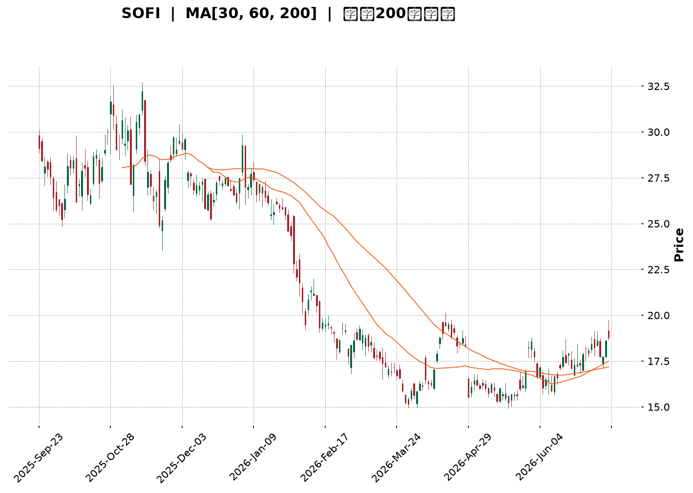
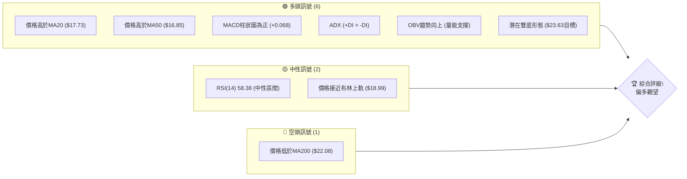
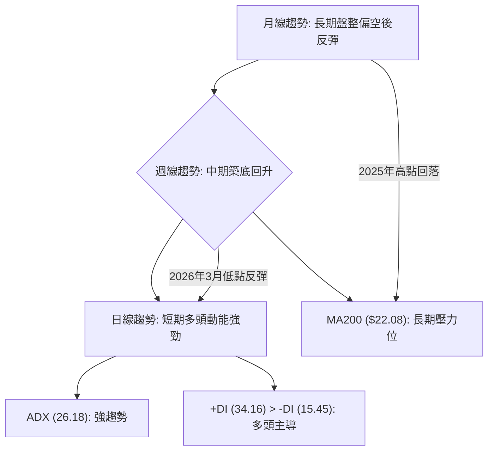
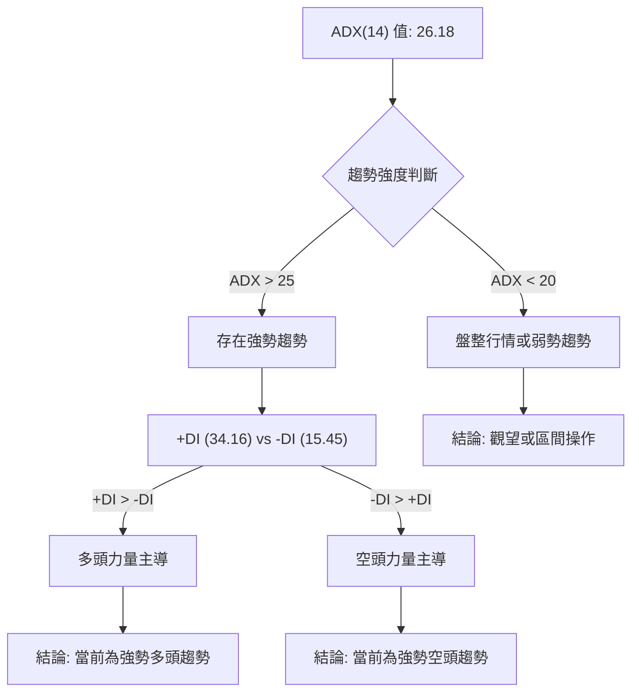
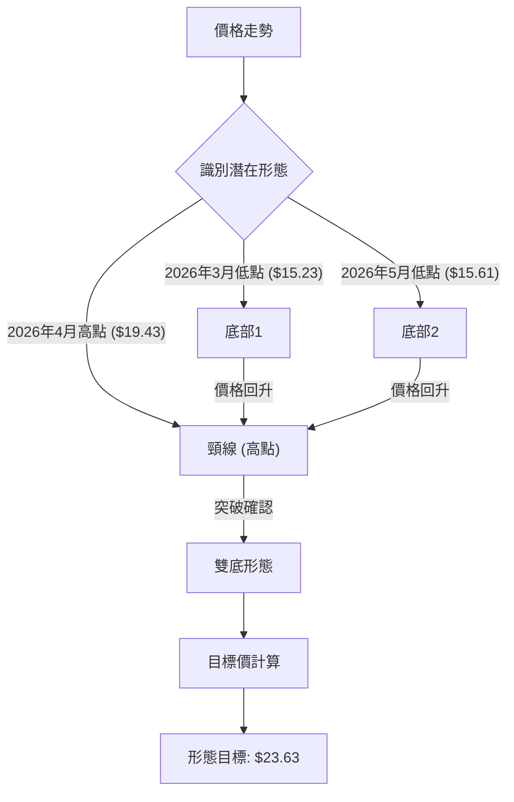
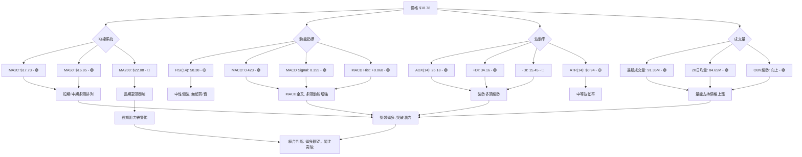
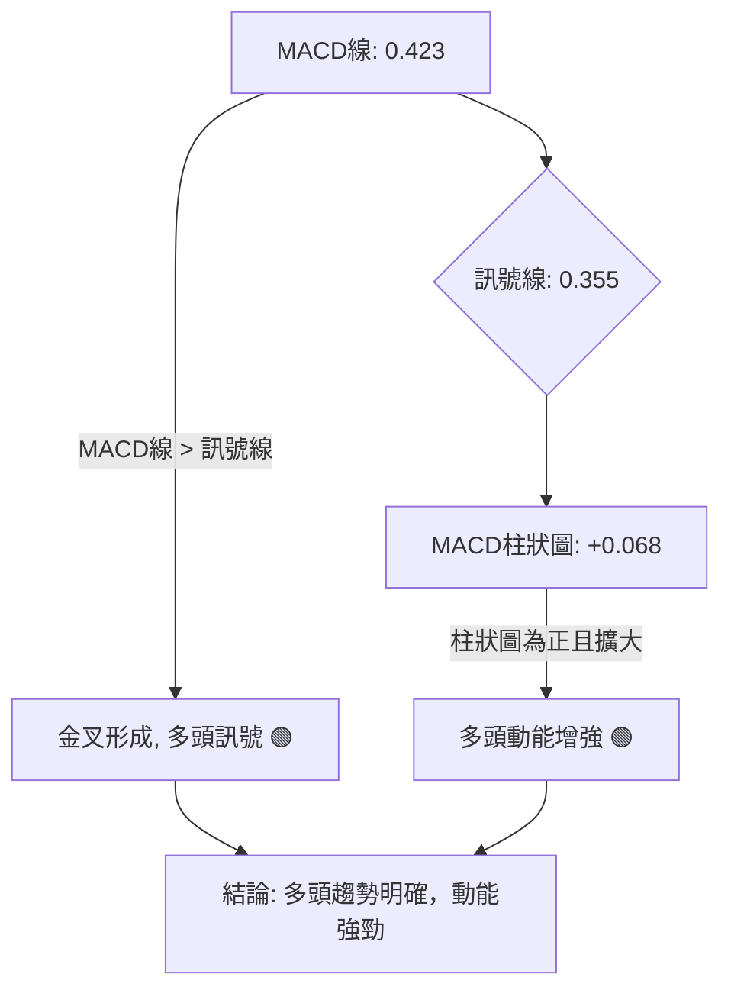
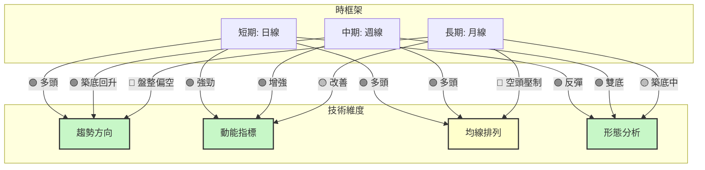
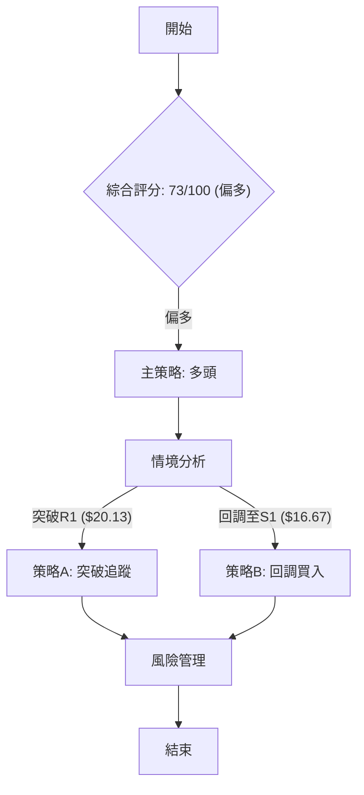
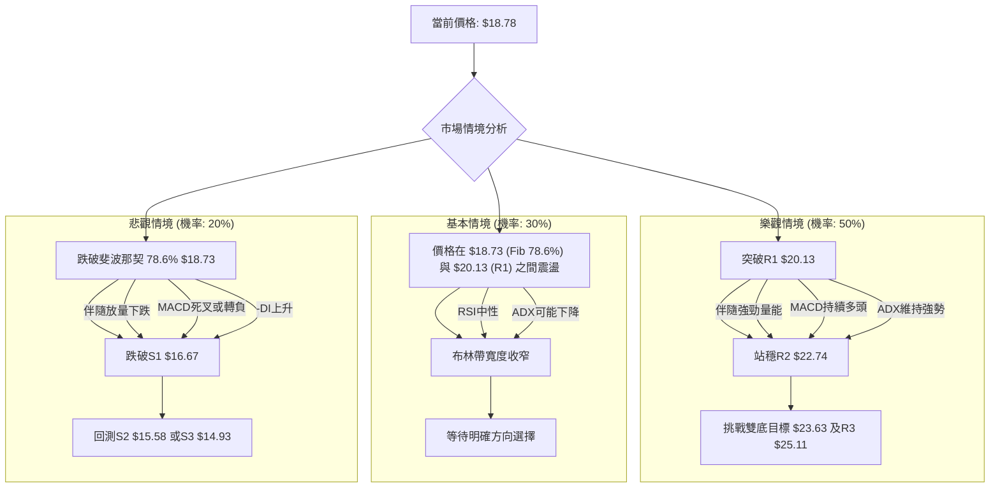

<details>
<summary>📊 靜態圖表 (點擊展開)</summary>

</details>

<html>
<head><meta charset="utf-8" /></head>
<body>
    <div style="height:500px; width:100%;">                        <script>window.PlotlyConfig = {MathJaxConfig: 'local'};</script>
        <script charset="utf-8" src="https://cdn.plot.ly/plotly-3.7.0.min.js" integrity="sha256-jvTGqxNp8AGWEcvNLVuKr+8j5dGe9Yw51LQkmDH+IYA=" crossorigin="anonymous"></script>                <div id="candlestick-chart" class="plotly-graph-div" style="height:100%; width:100%;"></div>            <script>                window.PLOTLYENV=window.PLOTLYENV || {};                                if (document.getElementById("candlestick-chart")) {                    Plotly.newPlot(                        "candlestick-chart",                        [{"close":{"dtype":"f8","bdata":"AAAAQAoXPUAAAADgo3A8QAAAAGC4HjxAAAAAQOH6O0AAAADAzIw7QAAAACCFazpAAAAAYI\u002fCOUAAAADgUfg5QAAAAKBwPTlAAAAAAClcOkAAAAAA1yM8QAAAAMAeBTxAAAAAQDNzPEAAAADgozA6QAAAAADXIztAAAAAYLjeO0AAAAAgrgc8QAAAAKCZmTpAAAAAgD2KOkAAAACAFK48QAAAAAAAwDxAAAAA4KMwO0AAAADgehQ8QAAAAGCPAj1AAAAAAAAAPkAAAADA9ag\u002fQAAAAGBm5j5AAAAAIK4HPUAAAACAFK49QAAAAKBHoT5AAAAAYLhePUAAAACA6xE+QAAAAMD1KDtAAAAAgMI1PEAAAACAPYo+QAAAAEAz8z5AAAAAQOEaQEAAAAAA12M8QAAAAIDr0TtAAAAAgD0KO0AAAACgcD06QAAAAOBRuDpAAAAAwPXoOEAAAADgozA5QAAAAGBmZjtAAAAA4HpUPEAAAACgcH08QAAAAOBRuD1AAAAAIK4HPUAAAABgj4I9QAAAAIDrET1AAAAAoJmZPUAAAAAgrsc7QAAAAAApnDtAAAAA4HrUOkAAAABAChc7QAAAAIDrETtAAAAAIK5HO0AAAACA69E5QAAAAOB6lDpAAAAAwB5FOUAAAACAPUo6QAAAAKBwPTtAAAAAoJlZO0AAAADgozA7QAAAAEDhejtAAAAAgOsRO0AAAACA69E6QAAAACBcjzpAAAAAgBQuOkAAAACAwnU7QAAAACCuRz1AAAAAQOH6OkAAAAAAAAA7QAAAAOBRuDtAAAAAYGZmO0AAAACgmZk6QAAAAADXIztAAAAAIIWrOkAAAADgo3A6QAAAAKBHITpAAAAAoHB9OUAAAAAA16M5QAAAAEAKFzpAAAAAoJnZOUAAAADAzMw5QAAAAIDCdTlAAAAAoJmZOEAAAAAAKVw4QAAAACBczzZAAAAA4HoUNkAAAABgj8I1QAAAAAAAwDRAAAAAgMJ1M0AAAAAAKdw0QAAAAKCZWTVAAAAAgBQuNUAAAADAzIw0QAAAAMDMTDNAAAAAACmcM0AAAABgj4IzQAAAAIA9ijNAAAAAwMxMM0AAAADAHgUzQAAAAOBRODJAAAAAwPWoMkAAAACAPUozQAAAAKCZGTNAAAAAYI\u002fCMUAAAAAA12MyQAAAAAApnDJAAAAAQDOzMkAAAAAAAEAzQAAAAGBm5jJAAAAAgD3KMkAAAACAPUoyQAAAACCuhzJAAAAAQDOzMUAAAABgj8IxQAAAAKBHoTFAAAAAYLheMUAAAACAFC4xQAAAAOB6FDFAAAAAYGbmMEAAAABgZiYxQAAAAEAzszBAAAAAIFyPMEAAAACgcL0vQAAAAIDCdS5AAAAAwMxMLkAAAABgj8IvQAAAAGCPQi9AAAAAQDOzL0AAAADAHkUwQAAAAAApHDBAAAAAoHB9MEAAAADAHkUwQAAAAOBRODBAAAAAwMwMMUAAAADA9egxQAAAAIA9yjJAAAAAIK4HM0AAAACAFG4zQAAAAAAAgDNAAAAA4HrUMkAAAAAgXA8zQAAAAIDrUTJAAAAA4KNwMkAAAABgj8IyQAAAAAApXDJAAAAAwMwML0AAAACgmRkwQAAAAIAUbjBAAAAAQDMzMEAAAADAHgUwQAAAAMDMTDBAAAAAAAAAMEAAAAAAAIAvQAAAAGCPQjBAAAAAwMzML0AAAABguJ4uQAAAAMAeBTBAAAAA4FE4L0AAAAAghWsvQAAAAIDCdS5AAAAAoEdhL0AAAADAzEwvQAAAAKBwPS9AAAAAgML1L0AAAAAghSswQAAAAOBR+DBAAAAA4FE4MkAAAADgepQyQAAAAKBwvTFAAAAAgBSuMEAAAABgZiYxQAAAACCuBzBAAAAAAACAMEAAAADgUXgwQAAAAKBwvS9AAAAAIIWrMEAAAADgepQwQAAAAKBHITFAAAAAgMK1MUAAAAAghWsxQAAAAMD16DFAAAAAoJkZMUAAAACAPUoxQAAAACBcTzFAAAAAwMxMMUAAAACgR+ExQAAAAOCjMDJAAAAAgBTuMUAAAADgo3AyQAAAAKBwPTJAAAAAACmcMkAAAAAAAMAxQAAAAEDhujFAAAAAYLieMkAAAAAgrscyQA=="},"high":{"dtype":"f8","bdata":"AAAAANcjPkAAAAAghas9QAAAACCFqzxAAAAAQOF6PEAAAACgR6E8QAAAAAApnDtAAAAA4HpUO0AAAACgmVk6QAAAAIAULjpAAAAAANcjO0AAAABACtc8QAAAAIDCtTxAAAAA4KOwPEAAAADAzMw9QAAAAIAUbjtAAAAAoJlZPEAAAABAChc9QAAAAOCjcDxAAAAAIIXrOkAAAACAFO48QAAAAIDrET1AAAAAwMzMPEAAAADgUZg8QAAAAGC43j1AAAAAQDMzPkAAAABA4fo\u002fQAAAAOBRSEBAAAAAgD3qPkAAAAAAKdw9QAAAAOBROD9AAAAAgD3KPkAAAABguF4+QAAAAGDn2z5AAAAAoHA9PEAAAADgUfg+QAAAAKBw\u002fT5AAAAAoHBdQEAAAAAAAMA\u002fQAAAAIDrET1AAAAAQDPzO0AAAAAAAAA7QAAAAKCZ2TpAAAAAQDOTPEAAAACA63E5QAAAAAApnDtAAAAAQDNzPEAAAAAAAEA9QAAAAAAAwD1AAAAAQDOzPUAAAAAghWs+QAAAAIAU7j1AAAAAQDOzPUAAAACAFO47QAAAAOB61DtAAAAAQDNzO0AAAACAFK47QAAAACCuRztAAAAAAACAO0AAAABA4Xo7QAAAAKBwvTpAAAAAgMLVOkAAAABACrc6QAAAAGC4XjtAAAAAYLieO0AAAABAClc7QAAAAIA9ijtAAAAAwMyMO0AAAADA9Wg7QAAAAADXIztAAAAAYGbmOkAAAACgR4E7QAAAAAAp3D1AAAAAwMxMPUAAAACAFC47QAAAAIAUDjxAAAAAAABgPEAAAABg5VA7QAAAAEAzMztAAAAAgMIVO0AAAADgelQ7QAAAACCuxzpAAAAAQApXOkAAAADAzAw6QAAAAADXYzpAAAAAoEchOkAAAABgZmY6QAAAAIAU7jlAAAAAgD3KOUAAAABguB45QAAAAOBReDlAAAAAAAAAN0AAAAAAKVw3QAAAAADXwzVAAAAAYGZmNEAAAADA9Sg1QAAAAEAKlzVAAAAAAAAANkAAAACgmRk1QAAAAIA9yjRAAAAAYLjeM0AAAABACtczQAAAAGCPAjRAAAAAQOF6M0AAAADgozAzQAAAAKBHwTJAAAAAgMK1MkAAAABguJ4zQAAAACBcjzNAAAAAgMI1MkAAAADA9WgyQAAAAIA9CjNAAAAAIK5HM0AAAABA4XozQAAAAGC4PjNAAAAAgOvxMkAAAABgZgYzQAAAAKCZ2TJAAAAAwMyMMkAAAABgZiYyQAAAAIDrETJAAAAAoEdBMkAAAAAgrgcyQAAAACCFSzFAAAAAwHJoMUAAAADA9WgxQAAAAIDrETFAAAAAQApXMUAAAACgcH0wQAAAAKBHYS9AAAAAoEchL0AAAABgZgYwQAAAAIDrUTBAAAAAIK7HL0AAAADAzGwwQAAAAEDhWjBAAAAAoJnZMUAAAADgUXgwQAAAAKBwfTBAAAAAIFwPMUAAAABAMxMyQAAAAIDr0TJAAAAAYLieM0AAAACgRyE0QAAAAMAepTNAAAAAwB7FM0AAAAAgsHIzQAAAAGBm5jJAAAAAQDOTMkAAAAAghSszQAAAAGC43jJAAAAAQAqXMEAAAABguF4wQAAAACCFyzBAAAAAIK7HMEAAAAAgXE8wQAAAAKBHgTBAAAAAgMJ1MEAAAADAzAwwQAAAAIDrUTBAAAAA4HpUMEAAAAAghWsvQAAAAOCjEDBAAAAAgBSuL0AAAACA61EwQAAAACCuRy9AAAAA4KNwL0AAAACA65EvQAAAAAAp3C9AAAAAQDPzMEAAAADgo7AwQAAAAOB6FDFAAAAAQAqXMkAAAAAghcsyQAAAAEDhOjJAAAAAQAp3MUAAAABA4ToxQAAAAKBw\u002fTBAAAAAwPWoMEAAAACgmRkxQAAAAOBRuDBAAAAA4KOwMEAAAAAgrucwQAAAAIAUbjFAAAAA4HoUMkAAAABAM7MyQAAAAKBw\u002fTFAAAAAIFwPMkAAAACAFK4xQAAAAIAUbjJAAAAAQDOTMUAAAADgUfgxQAAAAMDMTDJAAAAAoHA9MkAAAADgetQyQAAAAOCjMDNAAAAAYLgeM0AAAAAAAMAyQAAAAAAAwDFAAAAAoEehMkAAAACgcL0zQA=="},"hovertemplate":"\u003cb\u003e%{x|%Y-%m-%d}\u003c\u002fb\u003e\u003cbr\u003e\u958b: $%{open:.2f}\u003cbr\u003e\u9ad8: $%{high:.2f}\u003cbr\u003e\u4f4e: $%{low:.2f}\u003cbr\u003e\u6536: $%{close:.2f}\u003cextra\u003e\u003c\u002fextra\u003e","low":{"dtype":"f8","bdata":"AAAAoJnZPEAAAACgmVk8QAAAACBcDztAAAAAIFyPO0AAAAAAKRw7QAAAAEAzszlAAAAAANejOUAAAABAM3M5QAAAAEAK1zhAAAAAIFxPOUAAAACAFK46QAAAAMAepTtAAAAAAADAO0AAAACgRyE6QAAAAOBReDpAAAAAAADAOUAAAAAgXI87QAAAAAAAQDpAAAAAYI8COkAAAAAgXA87QAAAAGBmJjxAAAAAoEdhOkAAAACg8TI7QAAAAEAzszxAAAAAwB5FPUAAAADAzMw8QAAAAADXIz5AAAAAQOH6PEAAAACgcH08QAAAAOB6VD1AAAAA4KOwPEAAAABgjwI9QAAAAKBHITtAAAAAwPWoOUAAAABACtc8QAAAAOAi2z1AAAAAgML1PkAAAABgZiY8QAAAACCuhzpAAAAAwMyMOkAAAACAwrU5QAAAACBcjzlAAAAAYLi+OEAAAADAHoU3QAAAACCupzlAAAAAoEehOkAAAAAgXE88QAAAAOB6dDxAAAAAIIWrPEAAAADgo1A9QAAAAMAeBT1AAAAAQOF6PEAAAACAFO46QAAAAMDMDDtAAAAAwMyMOkAAAABA4Xo6QAAAAIAUjjpAAAAAQDMzOkAAAACAPco5QAAAAOBRuDlAAAAAIIUrOUAAAABAM\u002fM5QAAAACCuRzpAAAAAoJkZO0AAAABAM9M6QAAAACCuBztAAAAAIK4HO0AAAACgcL06QAAAAIA9ijpAAAAAIFwPOkAAAACAPco5QAAAAKCZmTtAAAAAIK4HOkAAAACgcF06QAAAAIDrkTpAAAAAQOE6O0AAAABAMzM6QAAAAOBRODpAAAAAIIXrOUAAAACAwjU6QAAAAGCPAjpAAAAAgMI1OUAAAABAM\u002fM4QAAAAAAAADpAAAAAoJmZOUAAAADAHsU5QAAAAIDCNTlAAAAAgOuROEAAAADAzAw4QAAAACBcTzZAAAAAACncNUAAAADAHgU1QAAAAIDrETRAAAAAAKoxM0AAAACAPQo0QAAAAMDMzDRAAAAAwMwMNUAAAAAA1yM0QAAAAIA9CjNAAAAAYGYmM0AAAAAAKRwzQAAAAKCZOTNAAAAA4FH4MkAAAAAA14MyQAAAAOB6lDFAAAAAANfjMUAAAACAFO4yQAAAAOBR+DJAAAAAIFxPMUAAAADAzMwwQAAAAOCjsDFAAAAAACmcMkAAAAAA16MyQAAAAGC4HjJAAAAAwB7FMUAAAACAPQoyQAAAAOBR+DFAAAAAYLieMUAAAAAgrocxQAAAAOBReDFAAAAAQOF6MEAAAADA9SgxQAAAAOB6lDBAAAAAIIWrMEAAAABACtcwQAAAAKBwfTBAAAAAwB6FMEAAAAAAKZwvQAAAAMDMTC5AAAAAYLjeLUAAAABguJ4uQAAAAKBH4S5AAAAAACncLUAAAABgj8IvQAAAAIDr0S9AAAAAYI9CMEAAAADgetQvQAAAAOBRGDBAAAAAIIXrL0AAAABgZmYxQAAAACCFKzJAAAAAYGamMkAAAAAA12MzQAAAAEAKFzNAAAAA4KOwMkAAAADA9egyQAAAAIAU7jFAAAAAgMAqMkAAAAAA12MyQAAAAMAeRTJAAAAAAAAAL0AAAADgehQvQAAAAAAAwC9AAAAAoEchMEAAAACgR+EvQAAAAEDh+i9AAAAAwPWoL0AAAACAPQovQAAAAIA9ii9AAAAAoJkZL0AAAACAFG4uQAAAAIDCdS5AAAAAYI\u002fCLkAAAACAFK4uQAAAAEAK1y1AAAAAIFwPLkAAAABAM7MuQAAAAOBRuC5AAAAA4FG4L0AAAABgjwIwQAAAAADXoy9AAAAAgBSuMUAAAADgo7AxQAAAAIDCdTFAAAAA4HqUMEAAAACAwpUwQAAAAAApXC9AAAAAwPXoL0AAAADgT00vQAAAAMD1qC9AAAAAIFxPL0AAAABA4TowQAAAAGCPAjFAAAAAAKwcMUAAAAAAKVwxQAAAAADXQzFAAAAAgOsRMUAAAADgUbgwQAAAAIAULjFAAAAAgOvRMEAAAACgcP0wQAAAAAAAgDFAAAAAQAq3MUAAAACAwvUxQAAAAADXwzFAAAAAIFxPMkAAAABAM7MxQAAAAOB6FDFAAAAAgMK1MUAAAABguJ4yQA=="},"name":"\u50f9\u683c","open":{"dtype":"f8","bdata":"AAAAgBTOPUAAAAAAAIA9QAAAAGCPwjtAAAAAYLhePEAAAAAAKVw8QAAAAOBReDtAAAAAQOG6OkAAAADgelQ6QAAAAKCZGTpAAAAAwB7FOUAAAACgmRk7QAAAAKBwfTxAAAAAgD0KPEAAAADAzIw8QAAAAIDrETtAAAAAYI+COkAAAABAMzM8QAAAAIDrETxAAAAAoJkZOkAAAABAMzM7QAAAACBcjzxAAAAAoHB9PEAAAADgelQ7QAAAAOBR2DxAAAAAAAAAPkAAAACgcP0+QAAAAGC4fj9AAAAAIFxvPkAAAADgo7A9QAAAAMD1qD1AAAAAIIVLPUAAAADAHoU9QAAAAAAAID5AAAAAYGaGOkAAAAAgXA89QAAAAGC4Pj5AAAAAgBQuP0AAAABA4bo\u002fQAAAAAAAADtAAAAAgMK1O0AAAABgj4I6QAAAAKCZeTpAAAAAoEfhO0AAAACgR6E4QAAAAOB61DlAAAAAQOH6OkAAAACAwrU8QAAAAIA9yjxAAAAA4HrUPEAAAAAA12M9QAAAAMDMbD1AAAAAwPUIPUAAAACgcF07QAAAAEDhujtAAAAAoHA9O0AAAABgZqY6QAAAAEAK1zpAAAAAwB4lO0AAAAAgXG87QAAAAKBwvTlAAAAAANejOkAAAACAFC46QAAAAGC4njpAAAAA4FGYO0AAAACA6xE7QAAAACCFKztAAAAAgD2KO0AAAABguN46QAAAACCuBztAAAAAgBSuOkAAAADA9ag6QAAAACBczztAAAAAQOE6PUAAAACgcN06QAAAAAAAADtAAAAAgBTOO0AAAACAPUo7QAAAAEAzszpAAAAAAAAAO0AAAAAgXM86QAAAAIA9ijpAAAAA4KNwOUAAAAAAAIA5QAAAAIAULjpAAAAAAAAAOkAAAABgZuY5QAAAAGBm5jlAAAAAAACAOUAAAACgcN04QAAAAIAUbjlAAAAAYI+CNkAAAADAzAw3QAAAAKBwfTVAAAAAQOE6NEAAAACAPUo0QAAAAIA9SjVAAAAAQAoXNUAAAACgmRk1QAAAAIA9yjRAAAAAIK5HM0AAAADA9WgzQAAAAOBReDNAAAAA4HpUM0AAAACAwhUzQAAAAEDhujJAAAAAAAAAMkAAAAAgrkczQAAAAOCjMDNAAAAAwPUoMkAAAADAHiUxQAAAAAAAADJAAAAAIFwPM0AAAABgZqYyQAAAAAApfDJAAAAA4HpUMkAAAAAghesyQAAAAADXYzJAAAAA4FE4MkAAAADAzMwxQAAAAAAAADJAAAAA4FG4MUAAAACAFG4xQAAAAAAAwDBAAAAAgD3qMEAAAAAgricxQAAAAGC4\u002fjBAAAAAgD0KMUAAAABgZkYwQAAAAEAKVy9AAAAAACncLkAAAABgZuYuQAAAAGBmRjBAAAAAoEdhLkAAAAAgrscvQAAAAMD1KDBAAAAAgBSuMUAAAAAA12MwQAAAAMDMTDBAAAAAAAAAMEAAAAAgrocxQAAAAOBReDJAAAAAYLieM0AAAACgmZkzQAAAAGCPQjNAAAAAYI+CM0AAAACAPUozQAAAAMAexTJAAAAA4KNwMkAAAABA4XoyQAAAAMAeZTJAAAAAwMyMMEAAAACAPYovQAAAAAApPDBAAAAA4FF4MEAAAAAghSswQAAAAEAzMzBAAAAAYI9CMEAAAAAgrgcwQAAAAKCZmS9AAAAAgOsRMEAAAAAghWsvQAAAAGC4ni5AAAAAYGZmL0AAAACAwvUuQAAAAIDCNS9AAAAAQOG6LkAAAACgcD0vQAAAAGBmZi9AAAAAQOF6MEAAAADAzAwwQAAAAMAeBTBAAAAAYI9CMkAAAABgZiYyQAAAACCuBzJAAAAAoEdhMUAAAADA9agwQAAAAEDhujBAAAAAgBQuMEAAAABgZmYwQAAAAOB6NDBAAAAAANejL0AAAACA69EwQAAAACCuRzFAAAAAQDMzMUAAAAAgXM8xQAAAAEAz0zFAAAAAQAqXMUAAAAAAKbwwQAAAAOBRODFAAAAAYGZmMUAAAAAAAAAxQAAAAOCjMDJAAAAAoJkZMkAAAAAA1yMyQAAAAEAzszJAAAAAoJlZMkAAAACgmZkyQAAAAEAKVzFAAAAAAADAMUAAAAAA1yMzQA=="},"x":["2025-09-23T00:00:00-04:00","2025-09-24T00:00:00-04:00","2025-09-25T00:00:00-04:00","2025-09-26T00:00:00-04:00","2025-09-29T00:00:00-04:00","2025-09-30T00:00:00-04:00","2025-10-01T00:00:00-04:00","2025-10-02T00:00:00-04:00","2025-10-03T00:00:00-04:00","2025-10-06T00:00:00-04:00","2025-10-07T00:00:00-04:00","2025-10-08T00:00:00-04:00","2025-10-09T00:00:00-04:00","2025-10-10T00:00:00-04:00","2025-10-13T00:00:00-04:00","2025-10-14T00:00:00-04:00","2025-10-15T00:00:00-04:00","2025-10-16T00:00:00-04:00","2025-10-17T00:00:00-04:00","2025-10-20T00:00:00-04:00","2025-10-21T00:00:00-04:00","2025-10-22T00:00:00-04:00","2025-10-23T00:00:00-04:00","2025-10-24T00:00:00-04:00","2025-10-27T00:00:00-04:00","2025-10-28T00:00:00-04:00","2025-10-29T00:00:00-04:00","2025-10-30T00:00:00-04:00","2025-10-31T00:00:00-04:00","2025-11-03T00:00:00-05:00","2025-11-04T00:00:00-05:00","2025-11-05T00:00:00-05:00","2025-11-06T00:00:00-05:00","2025-11-07T00:00:00-05:00","2025-11-10T00:00:00-05:00","2025-11-11T00:00:00-05:00","2025-11-12T00:00:00-05:00","2025-11-13T00:00:00-05:00","2025-11-14T00:00:00-05:00","2025-11-17T00:00:00-05:00","2025-11-18T00:00:00-05:00","2025-11-19T00:00:00-05:00","2025-11-20T00:00:00-05:00","2025-11-21T00:00:00-05:00","2025-11-24T00:00:00-05:00","2025-11-25T00:00:00-05:00","2025-11-26T00:00:00-05:00","2025-11-28T00:00:00-05:00","2025-12-01T00:00:00-05:00","2025-12-02T00:00:00-05:00","2025-12-03T00:00:00-05:00","2025-12-04T00:00:00-05:00","2025-12-05T00:00:00-05:00","2025-12-08T00:00:00-05:00","2025-12-09T00:00:00-05:00","2025-12-10T00:00:00-05:00","2025-12-11T00:00:00-05:00","2025-12-12T00:00:00-05:00","2025-12-15T00:00:00-05:00","2025-12-16T00:00:00-05:00","2025-12-17T00:00:00-05:00","2025-12-18T00:00:00-05:00","2025-12-19T00:00:00-05:00","2025-12-22T00:00:00-05:00","2025-12-23T00:00:00-05:00","2025-12-24T00:00:00-05:00","2025-12-26T00:00:00-05:00","2025-12-29T00:00:00-05:00","2025-12-30T00:00:00-05:00","2025-12-31T00:00:00-05:00","2026-01-02T00:00:00-05:00","2026-01-05T00:00:00-05:00","2026-01-06T00:00:00-05:00","2026-01-07T00:00:00-05:00","2026-01-08T00:00:00-05:00","2026-01-09T00:00:00-05:00","2026-01-12T00:00:00-05:00","2026-01-13T00:00:00-05:00","2026-01-14T00:00:00-05:00","2026-01-15T00:00:00-05:00","2026-01-16T00:00:00-05:00","2026-01-20T00:00:00-05:00","2026-01-21T00:00:00-05:00","2026-01-22T00:00:00-05:00","2026-01-23T00:00:00-05:00","2026-01-26T00:00:00-05:00","2026-01-27T00:00:00-05:00","2026-01-28T00:00:00-05:00","2026-01-29T00:00:00-05:00","2026-01-30T00:00:00-05:00","2026-02-02T00:00:00-05:00","2026-02-03T00:00:00-05:00","2026-02-04T00:00:00-05:00","2026-02-05T00:00:00-05:00","2026-02-06T00:00:00-05:00","2026-02-09T00:00:00-05:00","2026-02-10T00:00:00-05:00","2026-02-11T00:00:00-05:00","2026-02-12T00:00:00-05:00","2026-02-13T00:00:00-05:00","2026-02-17T00:00:00-05:00","2026-02-18T00:00:00-05:00","2026-02-19T00:00:00-05:00","2026-02-20T00:00:00-05:00","2026-02-23T00:00:00-05:00","2026-02-24T00:00:00-05:00","2026-02-25T00:00:00-05:00","2026-02-26T00:00:00-05:00","2026-02-27T00:00:00-05:00","2026-03-02T00:00:00-05:00","2026-03-03T00:00:00-05:00","2026-03-04T00:00:00-05:00","2026-03-05T00:00:00-05:00","2026-03-06T00:00:00-05:00","2026-03-09T00:00:00-04:00","2026-03-10T00:00:00-04:00","2026-03-11T00:00:00-04:00","2026-03-12T00:00:00-04:00","2026-03-13T00:00:00-04:00","2026-03-16T00:00:00-04:00","2026-03-17T00:00:00-04:00","2026-03-18T00:00:00-04:00","2026-03-19T00:00:00-04:00","2026-03-20T00:00:00-04:00","2026-03-23T00:00:00-04:00","2026-03-24T00:00:00-04:00","2026-03-25T00:00:00-04:00","2026-03-26T00:00:00-04:00","2026-03-27T00:00:00-04:00","2026-03-30T00:00:00-04:00","2026-03-31T00:00:00-04:00","2026-04-01T00:00:00-04:00","2026-04-02T00:00:00-04:00","2026-04-06T00:00:00-04:00","2026-04-07T00:00:00-04:00","2026-04-08T00:00:00-04:00","2026-04-09T00:00:00-04:00","2026-04-10T00:00:00-04:00","2026-04-13T00:00:00-04:00","2026-04-14T00:00:00-04:00","2026-04-15T00:00:00-04:00","2026-04-16T00:00:00-04:00","2026-04-17T00:00:00-04:00","2026-04-20T00:00:00-04:00","2026-04-21T00:00:00-04:00","2026-04-22T00:00:00-04:00","2026-04-23T00:00:00-04:00","2026-04-24T00:00:00-04:00","2026-04-27T00:00:00-04:00","2026-04-28T00:00:00-04:00","2026-04-29T00:00:00-04:00","2026-04-30T00:00:00-04:00","2026-05-01T00:00:00-04:00","2026-05-04T00:00:00-04:00","2026-05-05T00:00:00-04:00","2026-05-06T00:00:00-04:00","2026-05-07T00:00:00-04:00","2026-05-08T00:00:00-04:00","2026-05-11T00:00:00-04:00","2026-05-12T00:00:00-04:00","2026-05-13T00:00:00-04:00","2026-05-14T00:00:00-04:00","2026-05-15T00:00:00-04:00","2026-05-18T00:00:00-04:00","2026-05-19T00:00:00-04:00","2026-05-20T00:00:00-04:00","2026-05-21T00:00:00-04:00","2026-05-22T00:00:00-04:00","2026-05-26T00:00:00-04:00","2026-05-27T00:00:00-04:00","2026-05-28T00:00:00-04:00","2026-05-29T00:00:00-04:00","2026-06-01T00:00:00-04:00","2026-06-02T00:00:00-04:00","2026-06-03T00:00:00-04:00","2026-06-04T00:00:00-04:00","2026-06-05T00:00:00-04:00","2026-06-08T00:00:00-04:00","2026-06-09T00:00:00-04:00","2026-06-10T00:00:00-04:00","2026-06-11T00:00:00-04:00","2026-06-12T00:00:00-04:00","2026-06-15T00:00:00-04:00","2026-06-16T00:00:00-04:00","2026-06-17T00:00:00-04:00","2026-06-18T00:00:00-04:00","2026-06-22T00:00:00-04:00","2026-06-23T00:00:00-04:00","2026-06-24T00:00:00-04:00","2026-06-25T00:00:00-04:00","2026-06-26T00:00:00-04:00","2026-06-29T00:00:00-04:00","2026-06-30T00:00:00-04:00","2026-07-01T00:00:00-04:00","2026-07-02T00:00:00-04:00","2026-07-06T00:00:00-04:00","2026-07-07T00:00:00-04:00","2026-07-08T00:00:00-04:00","2026-07-09T00:00:00-04:00","2026-07-10T00:00:00-04:00"],"type":"candlestick"},{"hovertemplate":"MA30: $%{y:.2f}\u003cextra\u003e\u003c\u002fextra\u003e","line":{"color":"#2196F3","dash":"dash","width":2},"mode":"lines","name":"MA30","x":["2025-09-23T00:00:00-04:00","2025-09-24T00:00:00-04:00","2025-09-25T00:00:00-04:00","2025-09-26T00:00:00-04:00","2025-09-29T00:00:00-04:00","2025-09-30T00:00:00-04:00","2025-10-01T00:00:00-04:00","2025-10-02T00:00:00-04:00","2025-10-03T00:00:00-04:00","2025-10-06T00:00:00-04:00","2025-10-07T00:00:00-04:00","2025-10-08T00:00:00-04:00","2025-10-09T00:00:00-04:00","2025-10-10T00:00:00-04:00","2025-10-13T00:00:00-04:00","2025-10-14T00:00:00-04:00","2025-10-15T00:00:00-04:00","2025-10-16T00:00:00-04:00","2025-10-17T00:00:00-04:00","2025-10-20T00:00:00-04:00","2025-10-21T00:00:00-04:00","2025-10-22T00:00:00-04:00","2025-10-23T00:00:00-04:00","2025-10-24T00:00:00-04:00","2025-10-27T00:00:00-04:00","2025-10-28T00:00:00-04:00","2025-10-29T00:00:00-04:00","2025-10-30T00:00:00-04:00","2025-10-31T00:00:00-04:00","2025-11-03T00:00:00-05:00","2025-11-04T00:00:00-05:00","2025-11-05T00:00:00-05:00","2025-11-06T00:00:00-05:00","2025-11-07T00:00:00-05:00","2025-11-10T00:00:00-05:00","2025-11-11T00:00:00-05:00","2025-11-12T00:00:00-05:00","2025-11-13T00:00:00-05:00","2025-11-14T00:00:00-05:00","2025-11-17T00:00:00-05:00","2025-11-18T00:00:00-05:00","2025-11-19T00:00:00-05:00","2025-11-20T00:00:00-05:00","2025-11-21T00:00:00-05:00","2025-11-24T00:00:00-05:00","2025-11-25T00:00:00-05:00","2025-11-26T00:00:00-05:00","2025-11-28T00:00:00-05:00","2025-12-01T00:00:00-05:00","2025-12-02T00:00:00-05:00","2025-12-03T00:00:00-05:00","2025-12-04T00:00:00-05:00","2025-12-05T00:00:00-05:00","2025-12-08T00:00:00-05:00","2025-12-09T00:00:00-05:00","2025-12-10T00:00:00-05:00","2025-12-11T00:00:00-05:00","2025-12-12T00:00:00-05:00","2025-12-15T00:00:00-05:00","2025-12-16T00:00:00-05:00","2025-12-17T00:00:00-05:00","2025-12-18T00:00:00-05:00","2025-12-19T00:00:00-05:00","2025-12-22T00:00:00-05:00","2025-12-23T00:00:00-05:00","2025-12-24T00:00:00-05:00","2025-12-26T00:00:00-05:00","2025-12-29T00:00:00-05:00","2025-12-30T00:00:00-05:00","2025-12-31T00:00:00-05:00","2026-01-02T00:00:00-05:00","2026-01-05T00:00:00-05:00","2026-01-06T00:00:00-05:00","2026-01-07T00:00:00-05:00","2026-01-08T00:00:00-05:00","2026-01-09T00:00:00-05:00","2026-01-12T00:00:00-05:00","2026-01-13T00:00:00-05:00","2026-01-14T00:00:00-05:00","2026-01-15T00:00:00-05:00","2026-01-16T00:00:00-05:00","2026-01-20T00:00:00-05:00","2026-01-21T00:00:00-05:00","2026-01-22T00:00:00-05:00","2026-01-23T00:00:00-05:00","2026-01-26T00:00:00-05:00","2026-01-27T00:00:00-05:00","2026-01-28T00:00:00-05:00","2026-01-29T00:00:00-05:00","2026-01-30T00:00:00-05:00","2026-02-02T00:00:00-05:00","2026-02-03T00:00:00-05:00","2026-02-04T00:00:00-05:00","2026-02-05T00:00:00-05:00","2026-02-06T00:00:00-05:00","2026-02-09T00:00:00-05:00","2026-02-10T00:00:00-05:00","2026-02-11T00:00:00-05:00","2026-02-12T00:00:00-05:00","2026-02-13T00:00:00-05:00","2026-02-17T00:00:00-05:00","2026-02-18T00:00:00-05:00","2026-02-19T00:00:00-05:00","2026-02-20T00:00:00-05:00","2026-02-23T00:00:00-05:00","2026-02-24T00:00:00-05:00","2026-02-25T00:00:00-05:00","2026-02-26T00:00:00-05:00","2026-02-27T00:00:00-05:00","2026-03-02T00:00:00-05:00","2026-03-03T00:00:00-05:00","2026-03-04T00:00:00-05:00","2026-03-05T00:00:00-05:00","2026-03-06T00:00:00-05:00","2026-03-09T00:00:00-04:00","2026-03-10T00:00:00-04:00","2026-03-11T00:00:00-04:00","2026-03-12T00:00:00-04:00","2026-03-13T00:00:00-04:00","2026-03-16T00:00:00-04:00","2026-03-17T00:00:00-04:00","2026-03-18T00:00:00-04:00","2026-03-19T00:00:00-04:00","2026-03-20T00:00:00-04:00","2026-03-23T00:00:00-04:00","2026-03-24T00:00:00-04:00","2026-03-25T00:00:00-04:00","2026-03-26T00:00:00-04:00","2026-03-27T00:00:00-04:00","2026-03-30T00:00:00-04:00","2026-03-31T00:00:00-04:00","2026-04-01T00:00:00-04:00","2026-04-02T00:00:00-04:00","2026-04-06T00:00:00-04:00","2026-04-07T00:00:00-04:00","2026-04-08T00:00:00-04:00","2026-04-09T00:00:00-04:00","2026-04-10T00:00:00-04:00","2026-04-13T00:00:00-04:00","2026-04-14T00:00:00-04:00","2026-04-15T00:00:00-04:00","2026-04-16T00:00:00-04:00","2026-04-17T00:00:00-04:00","2026-04-20T00:00:00-04:00","2026-04-21T00:00:00-04:00","2026-04-22T00:00:00-04:00","2026-04-23T00:00:00-04:00","2026-04-24T00:00:00-04:00","2026-04-27T00:00:00-04:00","2026-04-28T00:00:00-04:00","2026-04-29T00:00:00-04:00","2026-04-30T00:00:00-04:00","2026-05-01T00:00:00-04:00","2026-05-04T00:00:00-04:00","2026-05-05T00:00:00-04:00","2026-05-06T00:00:00-04:00","2026-05-07T00:00:00-04:00","2026-05-08T00:00:00-04:00","2026-05-11T00:00:00-04:00","2026-05-12T00:00:00-04:00","2026-05-13T00:00:00-04:00","2026-05-14T00:00:00-04:00","2026-05-15T00:00:00-04:00","2026-05-18T00:00:00-04:00","2026-05-19T00:00:00-04:00","2026-05-20T00:00:00-04:00","2026-05-21T00:00:00-04:00","2026-05-22T00:00:00-04:00","2026-05-26T00:00:00-04:00","2026-05-27T00:00:00-04:00","2026-05-28T00:00:00-04:00","2026-05-29T00:00:00-04:00","2026-06-01T00:00:00-04:00","2026-06-02T00:00:00-04:00","2026-06-03T00:00:00-04:00","2026-06-04T00:00:00-04:00","2026-06-05T00:00:00-04:00","2026-06-08T00:00:00-04:00","2026-06-09T00:00:00-04:00","2026-06-10T00:00:00-04:00","2026-06-11T00:00:00-04:00","2026-06-12T00:00:00-04:00","2026-06-15T00:00:00-04:00","2026-06-16T00:00:00-04:00","2026-06-17T00:00:00-04:00","2026-06-18T00:00:00-04:00","2026-06-22T00:00:00-04:00","2026-06-23T00:00:00-04:00","2026-06-24T00:00:00-04:00","2026-06-25T00:00:00-04:00","2026-06-26T00:00:00-04:00","2026-06-29T00:00:00-04:00","2026-06-30T00:00:00-04:00","2026-07-01T00:00:00-04:00","2026-07-02T00:00:00-04:00","2026-07-06T00:00:00-04:00","2026-07-07T00:00:00-04:00","2026-07-08T00:00:00-04:00","2026-07-09T00:00:00-04:00","2026-07-10T00:00:00-04:00"],"y":{"dtype":"f8","bdata":"AAAAAAAA+H8AAAAAAAD4fwAAAAAAAPh\u002fAAAAAAAA+H8AAAAAAAD4fwAAAAAAAPh\u002fAAAAAAAA+H8AAAAAAAD4fwAAAAAAAPh\u002fAAAAAAAA+H8AAAAAAAD4fwAAAAAAAPh\u002fAAAAAAAA+H8AAAAAAAD4fwAAAAAAAPh\u002fAAAAAAAA+H8AAAAAAAD4fwAAAAAAAPh\u002fAAAAAAAA+H8AAAAAAAD4fwAAAAAAAPh\u002fAAAAAAAA+H8AAAAAAAD4fwAAAAAAAPh\u002fAAAAAAAA+H8AAAAAAAD4fwAAAAAAAPh\u002fAAAAAAAA+H8AAAAAAAD4fwAAAID4DDxAvLu7K1wPPEBVVVX1RB08QN7d3c0TFTxA7+7uPgoXPEAREREBjjA8QBEREfE1VzxA3t3dLUCOPEAAAADA5qI8QImIiNjquDxAREREVLi+PEB3d3e3ga48QCIiItJpozxAIiIikjSFPECamZkJrHw8QERERATkfjxAZmZm5tCCPECJiIjIvYY8QGZmZoZdoTxAMzMzA522PEDNzMwssr08QJqZmTltwDxAMzMz8\u002f3UPEB3d3eXbtI8QO\u002fu7j58xjxAZmZmRm+rPEBVVVX1b4Q8QCIiIjLBYzxAMzMzQ9JUPEBmZmb24TM8QKuqqppSETxAREREBFbuO0C8u7t7FM47QO\u002fu7j7DzjtAzczMjGzHO0DNzMxc1qo7QHd3dwc6jTtAd3d3h11hO0AAAADQ91M7QM3MzEw3STtAmpmZmeBBO0Crqqq6SUw7QDMzMyMiYjtA7+7uHsxzO0AAAAAgPoM7QM3MzCz5hTtA7+7ujgl+O0CrqqrK6G07QCIiIrLkVztAIiIiMsFDO0De3d2tjik7QGZmZiZ4EDtAd3d3t2XtOkAAAADQIts6QCIiIlIqzjpAq6qqes3FOkDe3d1ty7o6QERERFQOrTpAd3d3xy+WOkDNzMxcuok6QLy7u6uOaTpAIiIiAlZOOkAiIiISric6QDMzM3NM8DlAq6qqevisOUAiIiJi9HY5QCIiIjKlQjlAvLu7S2IQOUBVVVVF4do4QO\u002fu7o7tnDhAzczMLN1kOEAzMzMjBiE4QImIiMjozTdAERERkV+MN0De3d39Rkg3QM3MzOw19zZAq6qqGqGsNkCrqqoqQG42QFVVVYWkKTZAREREVJzdNUBVVVXV6pg1QFVVVSW\u002fWDVAq6qqKs4eNUAAAAAAR+g0QERERDTsqjRAZmZmZq1uNEDv7u6Oly40QO\u002fu7r508zNAd3d3d5O4M0C8u7uLQYAzQJqZmakNVDNAMzMzg9wrM0CamZlZxwQzQM3MzBx25TJAVVVVtZ3PMkBmZmYW9a8yQCIiIgJHiDJAZmZmdtpgMkARERHZ6jgyQERERMwvFjJA7+7uxiDwMUC8u7vrJtExQM3MzGTJrzFAmpmZwViSMUAiIiJK4XoxQFVVVe3faDFAVVVVfVtWMUCrqqoyljwxQFVVVb0CJDFAAAAAuPMdMUDNzMwk2xkxQERERFxkGzFAmpmZQTUeMUARERF5vh8xQJqZmTHdJDFAq6qqkjQlMUARERGpxisxQAAAAOj7KTFA3t3ddUwwMUBmZmb+1DgxQM3MzLQPPzFAVVVVPVEvMUCamZnxGSYxQHd3d\u002f+NIDFAvLu705QaMUBmZmZO8BAxQFVVVX2GDTFA7+7uJr8IMUAiIiICuQcxQERERBSDEDFAq6qqeukWMUC8u7tLDBIxQLy7u0NgFTFAmpmZ+VMTMUCrqqqijA4xQGZmZj4KBzFA3t3dnTYAMUBEREQ07PowQERERHzN9TBAERERCazsMECrqqry0t0wQAAAABhLzjBAZmZmnmHHMEC8u7vDIMAwQERERPwbsTBAVVVVPcOeMEAAAADIdo4wQLy7uzPsejBAzczMNF5qMEB3d3ef01YwQCIiIiKUQTBAzczMbFlLMEAAAAAAck8wQLy7uytrVTBAAAAA0E1iMECJiIgoQG4wQCIiIkL9ezBA7+7uPmCFMEDe3d1thJIwQAAAADB6mzBAiYiIiGynMEAAAADIWr0wQAAAADjfzzBAZmZmVqvjMEBVVVUd9\u002fowQHd3d4+mFDFAZmZmZpEtMUC8u7vrfD8xQBEREUl+UTFAzczMdAVoMUDv7u4WS34xQA=="},"type":"scatter"},{"hovertemplate":"MA60: $%{y:.2f}\u003cextra\u003e\u003c\u002fextra\u003e","line":{"color":"#9C27B0","dash":"dash","width":2},"mode":"lines","name":"MA60","x":["2025-09-23T00:00:00-04:00","2025-09-24T00:00:00-04:00","2025-09-25T00:00:00-04:00","2025-09-26T00:00:00-04:00","2025-09-29T00:00:00-04:00","2025-09-30T00:00:00-04:00","2025-10-01T00:00:00-04:00","2025-10-02T00:00:00-04:00","2025-10-03T00:00:00-04:00","2025-10-06T00:00:00-04:00","2025-10-07T00:00:00-04:00","2025-10-08T00:00:00-04:00","2025-10-09T00:00:00-04:00","2025-10-10T00:00:00-04:00","2025-10-13T00:00:00-04:00","2025-10-14T00:00:00-04:00","2025-10-15T00:00:00-04:00","2025-10-16T00:00:00-04:00","2025-10-17T00:00:00-04:00","2025-10-20T00:00:00-04:00","2025-10-21T00:00:00-04:00","2025-10-22T00:00:00-04:00","2025-10-23T00:00:00-04:00","2025-10-24T00:00:00-04:00","2025-10-27T00:00:00-04:00","2025-10-28T00:00:00-04:00","2025-10-29T00:00:00-04:00","2025-10-30T00:00:00-04:00","2025-10-31T00:00:00-04:00","2025-11-03T00:00:00-05:00","2025-11-04T00:00:00-05:00","2025-11-05T00:00:00-05:00","2025-11-06T00:00:00-05:00","2025-11-07T00:00:00-05:00","2025-11-10T00:00:00-05:00","2025-11-11T00:00:00-05:00","2025-11-12T00:00:00-05:00","2025-11-13T00:00:00-05:00","2025-11-14T00:00:00-05:00","2025-11-17T00:00:00-05:00","2025-11-18T00:00:00-05:00","2025-11-19T00:00:00-05:00","2025-11-20T00:00:00-05:00","2025-11-21T00:00:00-05:00","2025-11-24T00:00:00-05:00","2025-11-25T00:00:00-05:00","2025-11-26T00:00:00-05:00","2025-11-28T00:00:00-05:00","2025-12-01T00:00:00-05:00","2025-12-02T00:00:00-05:00","2025-12-03T00:00:00-05:00","2025-12-04T00:00:00-05:00","2025-12-05T00:00:00-05:00","2025-12-08T00:00:00-05:00","2025-12-09T00:00:00-05:00","2025-12-10T00:00:00-05:00","2025-12-11T00:00:00-05:00","2025-12-12T00:00:00-05:00","2025-12-15T00:00:00-05:00","2025-12-16T00:00:00-05:00","2025-12-17T00:00:00-05:00","2025-12-18T00:00:00-05:00","2025-12-19T00:00:00-05:00","2025-12-22T00:00:00-05:00","2025-12-23T00:00:00-05:00","2025-12-24T00:00:00-05:00","2025-12-26T00:00:00-05:00","2025-12-29T00:00:00-05:00","2025-12-30T00:00:00-05:00","2025-12-31T00:00:00-05:00","2026-01-02T00:00:00-05:00","2026-01-05T00:00:00-05:00","2026-01-06T00:00:00-05:00","2026-01-07T00:00:00-05:00","2026-01-08T00:00:00-05:00","2026-01-09T00:00:00-05:00","2026-01-12T00:00:00-05:00","2026-01-13T00:00:00-05:00","2026-01-14T00:00:00-05:00","2026-01-15T00:00:00-05:00","2026-01-16T00:00:00-05:00","2026-01-20T00:00:00-05:00","2026-01-21T00:00:00-05:00","2026-01-22T00:00:00-05:00","2026-01-23T00:00:00-05:00","2026-01-26T00:00:00-05:00","2026-01-27T00:00:00-05:00","2026-01-28T00:00:00-05:00","2026-01-29T00:00:00-05:00","2026-01-30T00:00:00-05:00","2026-02-02T00:00:00-05:00","2026-02-03T00:00:00-05:00","2026-02-04T00:00:00-05:00","2026-02-05T00:00:00-05:00","2026-02-06T00:00:00-05:00","2026-02-09T00:00:00-05:00","2026-02-10T00:00:00-05:00","2026-02-11T00:00:00-05:00","2026-02-12T00:00:00-05:00","2026-02-13T00:00:00-05:00","2026-02-17T00:00:00-05:00","2026-02-18T00:00:00-05:00","2026-02-19T00:00:00-05:00","2026-02-20T00:00:00-05:00","2026-02-23T00:00:00-05:00","2026-02-24T00:00:00-05:00","2026-02-25T00:00:00-05:00","2026-02-26T00:00:00-05:00","2026-02-27T00:00:00-05:00","2026-03-02T00:00:00-05:00","2026-03-03T00:00:00-05:00","2026-03-04T00:00:00-05:00","2026-03-05T00:00:00-05:00","2026-03-06T00:00:00-05:00","2026-03-09T00:00:00-04:00","2026-03-10T00:00:00-04:00","2026-03-11T00:00:00-04:00","2026-03-12T00:00:00-04:00","2026-03-13T00:00:00-04:00","2026-03-16T00:00:00-04:00","2026-03-17T00:00:00-04:00","2026-03-18T00:00:00-04:00","2026-03-19T00:00:00-04:00","2026-03-20T00:00:00-04:00","2026-03-23T00:00:00-04:00","2026-03-24T00:00:00-04:00","2026-03-25T00:00:00-04:00","2026-03-26T00:00:00-04:00","2026-03-27T00:00:00-04:00","2026-03-30T00:00:00-04:00","2026-03-31T00:00:00-04:00","2026-04-01T00:00:00-04:00","2026-04-02T00:00:00-04:00","2026-04-06T00:00:00-04:00","2026-04-07T00:00:00-04:00","2026-04-08T00:00:00-04:00","2026-04-09T00:00:00-04:00","2026-04-10T00:00:00-04:00","2026-04-13T00:00:00-04:00","2026-04-14T00:00:00-04:00","2026-04-15T00:00:00-04:00","2026-04-16T00:00:00-04:00","2026-04-17T00:00:00-04:00","2026-04-20T00:00:00-04:00","2026-04-21T00:00:00-04:00","2026-04-22T00:00:00-04:00","2026-04-23T00:00:00-04:00","2026-04-24T00:00:00-04:00","2026-04-27T00:00:00-04:00","2026-04-28T00:00:00-04:00","2026-04-29T00:00:00-04:00","2026-04-30T00:00:00-04:00","2026-05-01T00:00:00-04:00","2026-05-04T00:00:00-04:00","2026-05-05T00:00:00-04:00","2026-05-06T00:00:00-04:00","2026-05-07T00:00:00-04:00","2026-05-08T00:00:00-04:00","2026-05-11T00:00:00-04:00","2026-05-12T00:00:00-04:00","2026-05-13T00:00:00-04:00","2026-05-14T00:00:00-04:00","2026-05-15T00:00:00-04:00","2026-05-18T00:00:00-04:00","2026-05-19T00:00:00-04:00","2026-05-20T00:00:00-04:00","2026-05-21T00:00:00-04:00","2026-05-22T00:00:00-04:00","2026-05-26T00:00:00-04:00","2026-05-27T00:00:00-04:00","2026-05-28T00:00:00-04:00","2026-05-29T00:00:00-04:00","2026-06-01T00:00:00-04:00","2026-06-02T00:00:00-04:00","2026-06-03T00:00:00-04:00","2026-06-04T00:00:00-04:00","2026-06-05T00:00:00-04:00","2026-06-08T00:00:00-04:00","2026-06-09T00:00:00-04:00","2026-06-10T00:00:00-04:00","2026-06-11T00:00:00-04:00","2026-06-12T00:00:00-04:00","2026-06-15T00:00:00-04:00","2026-06-16T00:00:00-04:00","2026-06-17T00:00:00-04:00","2026-06-18T00:00:00-04:00","2026-06-22T00:00:00-04:00","2026-06-23T00:00:00-04:00","2026-06-24T00:00:00-04:00","2026-06-25T00:00:00-04:00","2026-06-26T00:00:00-04:00","2026-06-29T00:00:00-04:00","2026-06-30T00:00:00-04:00","2026-07-01T00:00:00-04:00","2026-07-02T00:00:00-04:00","2026-07-06T00:00:00-04:00","2026-07-07T00:00:00-04:00","2026-07-08T00:00:00-04:00","2026-07-09T00:00:00-04:00","2026-07-10T00:00:00-04:00"],"y":{"dtype":"f8","bdata":"AAAAAAAA+H8AAAAAAAD4fwAAAAAAAPh\u002fAAAAAAAA+H8AAAAAAAD4fwAAAAAAAPh\u002fAAAAAAAA+H8AAAAAAAD4fwAAAAAAAPh\u002fAAAAAAAA+H8AAAAAAAD4fwAAAAAAAPh\u002fAAAAAAAA+H8AAAAAAAD4fwAAAAAAAPh\u002fAAAAAAAA+H8AAAAAAAD4fwAAAAAAAPh\u002fAAAAAAAA+H8AAAAAAAD4fwAAAAAAAPh\u002fAAAAAAAA+H8AAAAAAAD4fwAAAAAAAPh\u002fAAAAAAAA+H8AAAAAAAD4fwAAAAAAAPh\u002fAAAAAAAA+H8AAAAAAAD4fwAAAAAAAPh\u002fAAAAAAAA+H8AAAAAAAD4fwAAAAAAAPh\u002fAAAAAAAA+H8AAAAAAAD4fwAAAAAAAPh\u002fAAAAAAAA+H8AAAAAAAD4fwAAAAAAAPh\u002fAAAAAAAA+H8AAAAAAAD4fwAAAAAAAPh\u002fAAAAAAAA+H8AAAAAAAD4fwAAAAAAAPh\u002fAAAAAAAA+H8AAAAAAAD4fwAAAAAAAPh\u002fAAAAAAAA+H8AAAAAAAD4fwAAAAAAAPh\u002fAAAAAAAA+H8AAAAAAAD4fwAAAAAAAPh\u002fAAAAAAAA+H8AAAAAAAD4fwAAAAAAAPh\u002fAAAAAAAA+H8AAAAAAAD4f1VVVY0lDzxAAAAAGNn+O0CJiIi4rPU7QGZmZobr8TtA3t3dZTvvO0Dv7u4usu07QERERPw38jtAq6qq2s73O0AAAABIb\u002fs7QKuqqhIRATxA7+7udkwAPEARERG5Zf07QKuqqvrFAjxAiYiIWID8O0DNzMwU9f87QImIiJhuAjxAq6qqOm0APECamZlJU\u002fo7QERERByh\u002fDtAq6qqGi\u002f9O0BVVVVtoPM7QAAAALBy6DtAVVVV1THhO0C8u7uzyNY7QImIiEhTyjtAiYiIYJ64O0CamZmxnZ87QDMzM8NniDtAVVVVBYF1O0CamZkpzl47QDMzM6NwPTtAMzMzA1YeO0Dv7u5G4fo6QBEREdmH3zpAvLu7gzK6OkB3d3df5ZA6QM3MzJzvZzpAmpmZ6d84OkCrqqqKbBc6QN7d3W0S8zlAMzMz417TOUDv7u7up7Y5QN7d3XUFmDlAAAAA2BWAOUDv7u6OwmU5QM3MzIyXPjlAzczMVFUVOUCrqqp6FO44QLy7u5vEwDhAMzMzw66QOECamZnBPGE4QN7d3aWbNDhAERER8RkGOEAAAADotOE3QDMzM0OLvDdAiYiIcD2aN0BmZmZ+sXQ3QJqZmYlBUDdAd3d3n2EnN0BERET0\u002fQQ3QKuqqirO3jZAq6qqQhm9NkDe3d21OpY2QAAAAEjhajZAAAAAGEs+NkBERES8dBM2QCIiIhp25TVAERERYZ64NUAzMzMP5ok1QJqZma2OWTVA3t3d+X4qNUB3d3eHFvk0QKuqqhbZvjRAVVVVKVyPNEAAAAAklGE0QBEREe0KMDRAAAAATH4BNECrqqoua9UzQFVVVaHTpjNAIiIiBsh9M0ARERH9YlkzQM3MzMAROjNAIiIitoEeM0CJiIi8AgQzQO\u002fu7rLk5zJAiYiI\u002fPDJMkAAAAAcL60yQHd3d1O4jjJAq6qq9m90MkARERFFi1wyQDMzM6+OSTJARERE4JYtMkCamZmlcBUyQCIiIg4CAzJAiYiIRBn1MUBmZmaycuAxQLy7u7\u002fmyjFAq6qqzsy0MUCamZntUaAxQERERHBZkzFAzczMIIWDMUC8u7ubmXExQERERNSUYjFAmpmZXdZSMUBmZmb2tkQxQN7d3RX1NzFAmpmZDUkrMUB3d3czwRsxQM3MzBzoDDFAiYiI4E8FMUC8u7sL1\u002fswQCIiIrrX9DBAAAAAcMvyMEBmZmae7+8wQO\u002fu7pb86jBAAAAA6PvhMECJiIi4Ht0wQN7d3Q100jBAVVVVVVXNMEDv7u5O1McwQHd3d+tRwDBAERERVVW9MEDNzMz4xbowQJqZmZX8ujBA3t3dUXG+MEB3d3c7mL8wQLy7u9\u002fBxDBA7+7usg\u002fHMEAAAAC4Hs0wQCIiIqL+1TBAmpmZASvfMEDe3d2Js+cwQN7d3b2f8jBAAAAAqH\u002f7MEAAAADgwQQxQO\u002fu7mbYDTFAIiIiAuQWMUAAAACQNB0xQKuqquKlIzFA7+7uvlgqMUDNzMwEDy4xQA=="},"type":"scatter"},{"hovertemplate":"MA200: $%{y:.2f}\u003cextra\u003e\u003c\u002fextra\u003e","line":{"color":"#FF6F00","dash":"solid","width":2},"mode":"lines","name":"MA200","x":["2025-09-23T00:00:00-04:00","2025-09-24T00:00:00-04:00","2025-09-25T00:00:00-04:00","2025-09-26T00:00:00-04:00","2025-09-29T00:00:00-04:00","2025-09-30T00:00:00-04:00","2025-10-01T00:00:00-04:00","2025-10-02T00:00:00-04:00","2025-10-03T00:00:00-04:00","2025-10-06T00:00:00-04:00","2025-10-07T00:00:00-04:00","2025-10-08T00:00:00-04:00","2025-10-09T00:00:00-04:00","2025-10-10T00:00:00-04:00","2025-10-13T00:00:00-04:00","2025-10-14T00:00:00-04:00","2025-10-15T00:00:00-04:00","2025-10-16T00:00:00-04:00","2025-10-17T00:00:00-04:00","2025-10-20T00:00:00-04:00","2025-10-21T00:00:00-04:00","2025-10-22T00:00:00-04:00","2025-10-23T00:00:00-04:00","2025-10-24T00:00:00-04:00","2025-10-27T00:00:00-04:00","2025-10-28T00:00:00-04:00","2025-10-29T00:00:00-04:00","2025-10-30T00:00:00-04:00","2025-10-31T00:00:00-04:00","2025-11-03T00:00:00-05:00","2025-11-04T00:00:00-05:00","2025-11-05T00:00:00-05:00","2025-11-06T00:00:00-05:00","2025-11-07T00:00:00-05:00","2025-11-10T00:00:00-05:00","2025-11-11T00:00:00-05:00","2025-11-12T00:00:00-05:00","2025-11-13T00:00:00-05:00","2025-11-14T00:00:00-05:00","2025-11-17T00:00:00-05:00","2025-11-18T00:00:00-05:00","2025-11-19T00:00:00-05:00","2025-11-20T00:00:00-05:00","2025-11-21T00:00:00-05:00","2025-11-24T00:00:00-05:00","2025-11-25T00:00:00-05:00","2025-11-26T00:00:00-05:00","2025-11-28T00:00:00-05:00","2025-12-01T00:00:00-05:00","2025-12-02T00:00:00-05:00","2025-12-03T00:00:00-05:00","2025-12-04T00:00:00-05:00","2025-12-05T00:00:00-05:00","2025-12-08T00:00:00-05:00","2025-12-09T00:00:00-05:00","2025-12-10T00:00:00-05:00","2025-12-11T00:00:00-05:00","2025-12-12T00:00:00-05:00","2025-12-15T00:00:00-05:00","2025-12-16T00:00:00-05:00","2025-12-17T00:00:00-05:00","2025-12-18T00:00:00-05:00","2025-12-19T00:00:00-05:00","2025-12-22T00:00:00-05:00","2025-12-23T00:00:00-05:00","2025-12-24T00:00:00-05:00","2025-12-26T00:00:00-05:00","2025-12-29T00:00:00-05:00","2025-12-30T00:00:00-05:00","2025-12-31T00:00:00-05:00","2026-01-02T00:00:00-05:00","2026-01-05T00:00:00-05:00","2026-01-06T00:00:00-05:00","2026-01-07T00:00:00-05:00","2026-01-08T00:00:00-05:00","2026-01-09T00:00:00-05:00","2026-01-12T00:00:00-05:00","2026-01-13T00:00:00-05:00","2026-01-14T00:00:00-05:00","2026-01-15T00:00:00-05:00","2026-01-16T00:00:00-05:00","2026-01-20T00:00:00-05:00","2026-01-21T00:00:00-05:00","2026-01-22T00:00:00-05:00","2026-01-23T00:00:00-05:00","2026-01-26T00:00:00-05:00","2026-01-27T00:00:00-05:00","2026-01-28T00:00:00-05:00","2026-01-29T00:00:00-05:00","2026-01-30T00:00:00-05:00","2026-02-02T00:00:00-05:00","2026-02-03T00:00:00-05:00","2026-02-04T00:00:00-05:00","2026-02-05T00:00:00-05:00","2026-02-06T00:00:00-05:00","2026-02-09T00:00:00-05:00","2026-02-10T00:00:00-05:00","2026-02-11T00:00:00-05:00","2026-02-12T00:00:00-05:00","2026-02-13T00:00:00-05:00","2026-02-17T00:00:00-05:00","2026-02-18T00:00:00-05:00","2026-02-19T00:00:00-05:00","2026-02-20T00:00:00-05:00","2026-02-23T00:00:00-05:00","2026-02-24T00:00:00-05:00","2026-02-25T00:00:00-05:00","2026-02-26T00:00:00-05:00","2026-02-27T00:00:00-05:00","2026-03-02T00:00:00-05:00","2026-03-03T00:00:00-05:00","2026-03-04T00:00:00-05:00","2026-03-05T00:00:00-05:00","2026-03-06T00:00:00-05:00","2026-03-09T00:00:00-04:00","2026-03-10T00:00:00-04:00","2026-03-11T00:00:00-04:00","2026-03-12T00:00:00-04:00","2026-03-13T00:00:00-04:00","2026-03-16T00:00:00-04:00","2026-03-17T00:00:00-04:00","2026-03-18T00:00:00-04:00","2026-03-19T00:00:00-04:00","2026-03-20T00:00:00-04:00","2026-03-23T00:00:00-04:00","2026-03-24T00:00:00-04:00","2026-03-25T00:00:00-04:00","2026-03-26T00:00:00-04:00","2026-03-27T00:00:00-04:00","2026-03-30T00:00:00-04:00","2026-03-31T00:00:00-04:00","2026-04-01T00:00:00-04:00","2026-04-02T00:00:00-04:00","2026-04-06T00:00:00-04:00","2026-04-07T00:00:00-04:00","2026-04-08T00:00:00-04:00","2026-04-09T00:00:00-04:00","2026-04-10T00:00:00-04:00","2026-04-13T00:00:00-04:00","2026-04-14T00:00:00-04:00","2026-04-15T00:00:00-04:00","2026-04-16T00:00:00-04:00","2026-04-17T00:00:00-04:00","2026-04-20T00:00:00-04:00","2026-04-21T00:00:00-04:00","2026-04-22T00:00:00-04:00","2026-04-23T00:00:00-04:00","2026-04-24T00:00:00-04:00","2026-04-27T00:00:00-04:00","2026-04-28T00:00:00-04:00","2026-04-29T00:00:00-04:00","2026-04-30T00:00:00-04:00","2026-05-01T00:00:00-04:00","2026-05-04T00:00:00-04:00","2026-05-05T00:00:00-04:00","2026-05-06T00:00:00-04:00","2026-05-07T00:00:00-04:00","2026-05-08T00:00:00-04:00","2026-05-11T00:00:00-04:00","2026-05-12T00:00:00-04:00","2026-05-13T00:00:00-04:00","2026-05-14T00:00:00-04:00","2026-05-15T00:00:00-04:00","2026-05-18T00:00:00-04:00","2026-05-19T00:00:00-04:00","2026-05-20T00:00:00-04:00","2026-05-21T00:00:00-04:00","2026-05-22T00:00:00-04:00","2026-05-26T00:00:00-04:00","2026-05-27T00:00:00-04:00","2026-05-28T00:00:00-04:00","2026-05-29T00:00:00-04:00","2026-06-01T00:00:00-04:00","2026-06-02T00:00:00-04:00","2026-06-03T00:00:00-04:00","2026-06-04T00:00:00-04:00","2026-06-05T00:00:00-04:00","2026-06-08T00:00:00-04:00","2026-06-09T00:00:00-04:00","2026-06-10T00:00:00-04:00","2026-06-11T00:00:00-04:00","2026-06-12T00:00:00-04:00","2026-06-15T00:00:00-04:00","2026-06-16T00:00:00-04:00","2026-06-17T00:00:00-04:00","2026-06-18T00:00:00-04:00","2026-06-22T00:00:00-04:00","2026-06-23T00:00:00-04:00","2026-06-24T00:00:00-04:00","2026-06-25T00:00:00-04:00","2026-06-26T00:00:00-04:00","2026-06-29T00:00:00-04:00","2026-06-30T00:00:00-04:00","2026-07-01T00:00:00-04:00","2026-07-02T00:00:00-04:00","2026-07-06T00:00:00-04:00","2026-07-07T00:00:00-04:00","2026-07-08T00:00:00-04:00","2026-07-09T00:00:00-04:00","2026-07-10T00:00:00-04:00"],"y":{"dtype":"f8","bdata":"AAAAAAAA+H8AAAAAAAD4fwAAAAAAAPh\u002fAAAAAAAA+H8AAAAAAAD4fwAAAAAAAPh\u002fAAAAAAAA+H8AAAAAAAD4fwAAAAAAAPh\u002fAAAAAAAA+H8AAAAAAAD4fwAAAAAAAPh\u002fAAAAAAAA+H8AAAAAAAD4fwAAAAAAAPh\u002fAAAAAAAA+H8AAAAAAAD4fwAAAAAAAPh\u002fAAAAAAAA+H8AAAAAAAD4fwAAAAAAAPh\u002fAAAAAAAA+H8AAAAAAAD4fwAAAAAAAPh\u002fAAAAAAAA+H8AAAAAAAD4fwAAAAAAAPh\u002fAAAAAAAA+H8AAAAAAAD4fwAAAAAAAPh\u002fAAAAAAAA+H8AAAAAAAD4fwAAAAAAAPh\u002fAAAAAAAA+H8AAAAAAAD4fwAAAAAAAPh\u002fAAAAAAAA+H8AAAAAAAD4fwAAAAAAAPh\u002fAAAAAAAA+H8AAAAAAAD4fwAAAAAAAPh\u002fAAAAAAAA+H8AAAAAAAD4fwAAAAAAAPh\u002fAAAAAAAA+H8AAAAAAAD4fwAAAAAAAPh\u002fAAAAAAAA+H8AAAAAAAD4fwAAAAAAAPh\u002fAAAAAAAA+H8AAAAAAAD4fwAAAAAAAPh\u002fAAAAAAAA+H8AAAAAAAD4fwAAAAAAAPh\u002fAAAAAAAA+H8AAAAAAAD4fwAAAAAAAPh\u002fAAAAAAAA+H8AAAAAAAD4fwAAAAAAAPh\u002fAAAAAAAA+H8AAAAAAAD4fwAAAAAAAPh\u002fAAAAAAAA+H8AAAAAAAD4fwAAAAAAAPh\u002fAAAAAAAA+H8AAAAAAAD4fwAAAAAAAPh\u002fAAAAAAAA+H8AAAAAAAD4fwAAAAAAAPh\u002fAAAAAAAA+H8AAAAAAAD4fwAAAAAAAPh\u002fAAAAAAAA+H8AAAAAAAD4fwAAAAAAAPh\u002fAAAAAAAA+H8AAAAAAAD4fwAAAAAAAPh\u002fAAAAAAAA+H8AAAAAAAD4fwAAAAAAAPh\u002fAAAAAAAA+H8AAAAAAAD4fwAAAAAAAPh\u002fAAAAAAAA+H8AAAAAAAD4fwAAAAAAAPh\u002fAAAAAAAA+H8AAAAAAAD4fwAAAAAAAPh\u002fAAAAAAAA+H8AAAAAAAD4fwAAAAAAAPh\u002fAAAAAAAA+H8AAAAAAAD4fwAAAAAAAPh\u002fAAAAAAAA+H8AAAAAAAD4fwAAAAAAAPh\u002fAAAAAAAA+H8AAAAAAAD4fwAAAAAAAPh\u002fAAAAAAAA+H8AAAAAAAD4fwAAAAAAAPh\u002fAAAAAAAA+H8AAAAAAAD4fwAAAAAAAPh\u002fAAAAAAAA+H8AAAAAAAD4fwAAAAAAAPh\u002fAAAAAAAA+H8AAAAAAAD4fwAAAAAAAPh\u002fAAAAAAAA+H8AAAAAAAD4fwAAAAAAAPh\u002fAAAAAAAA+H8AAAAAAAD4fwAAAAAAAPh\u002fAAAAAAAA+H8AAAAAAAD4fwAAAAAAAPh\u002fAAAAAAAA+H8AAAAAAAD4fwAAAAAAAPh\u002fAAAAAAAA+H8AAAAAAAD4fwAAAAAAAPh\u002fAAAAAAAA+H8AAAAAAAD4fwAAAAAAAPh\u002fAAAAAAAA+H8AAAAAAAD4fwAAAAAAAPh\u002fAAAAAAAA+H8AAAAAAAD4fwAAAAAAAPh\u002fAAAAAAAA+H8AAAAAAAD4fwAAAAAAAPh\u002fAAAAAAAA+H8AAAAAAAD4fwAAAAAAAPh\u002fAAAAAAAA+H8AAAAAAAD4fwAAAAAAAPh\u002fAAAAAAAA+H8AAAAAAAD4fwAAAAAAAPh\u002fAAAAAAAA+H8AAAAAAAD4fwAAAAAAAPh\u002fAAAAAAAA+H8AAAAAAAD4fwAAAAAAAPh\u002fAAAAAAAA+H8AAAAAAAD4fwAAAAAAAPh\u002fAAAAAAAA+H8AAAAAAAD4fwAAAAAAAPh\u002fAAAAAAAA+H8AAAAAAAD4fwAAAAAAAPh\u002fAAAAAAAA+H8AAAAAAAD4fwAAAAAAAPh\u002fAAAAAAAA+H8AAAAAAAD4fwAAAAAAAPh\u002fAAAAAAAA+H8AAAAAAAD4fwAAAAAAAPh\u002fAAAAAAAA+H8AAAAAAAD4fwAAAAAAAPh\u002fAAAAAAAA+H8AAAAAAAD4fwAAAAAAAPh\u002fAAAAAAAA+H8AAAAAAAD4fwAAAAAAAPh\u002fAAAAAAAA+H8AAAAAAAD4fwAAAAAAAPh\u002fAAAAAAAA+H8AAAAAAAD4fwAAAAAAAPh\u002fAAAAAAAA+H8AAAAAAAD4fwAAAAAAAPh\u002fAAAAAAAA+H\u002fD9Si+wRM2QA=="},"type":"scatter"}],                        {"template":{"data":{"barpolar":[{"marker":{"line":{"color":"rgb(17,17,17)","width":0.5},"pattern":{"fillmode":"overlay","size":10,"solidity":0.2}},"type":"barpolar"}],"bar":[{"error_x":{"color":"#f2f5fa"},"error_y":{"color":"#f2f5fa"},"marker":{"line":{"color":"rgb(17,17,17)","width":0.5},"pattern":{"fillmode":"overlay","size":10,"solidity":0.2}},"type":"bar"}],"carpet":[{"aaxis":{"endlinecolor":"#A2B1C6","gridcolor":"#506784","linecolor":"#506784","minorgridcolor":"#506784","startlinecolor":"#A2B1C6"},"baxis":{"endlinecolor":"#A2B1C6","gridcolor":"#506784","linecolor":"#506784","minorgridcolor":"#506784","startlinecolor":"#A2B1C6"},"type":"carpet"}],"choropleth":[{"colorbar":{"outlinewidth":0,"ticks":""},"type":"choropleth"}],"contourcarpet":[{"colorbar":{"outlinewidth":0,"ticks":""},"type":"contourcarpet"}],"contour":[{"colorbar":{"outlinewidth":0,"ticks":""},"colorscale":[[0.0,"#0d0887"],[0.1111111111111111,"#46039f"],[0.2222222222222222,"#7201a8"],[0.3333333333333333,"#9c179e"],[0.4444444444444444,"#bd3786"],[0.5555555555555556,"#d8576b"],[0.6666666666666666,"#ed7953"],[0.7777777777777778,"#fb9f3a"],[0.8888888888888888,"#fdca26"],[1.0,"#f0f921"]],"type":"contour"}],"heatmap":[{"colorbar":{"outlinewidth":0,"ticks":""},"colorscale":[[0.0,"#0d0887"],[0.1111111111111111,"#46039f"],[0.2222222222222222,"#7201a8"],[0.3333333333333333,"#9c179e"],[0.4444444444444444,"#bd3786"],[0.5555555555555556,"#d8576b"],[0.6666666666666666,"#ed7953"],[0.7777777777777778,"#fb9f3a"],[0.8888888888888888,"#fdca26"],[1.0,"#f0f921"]],"type":"heatmap"}],"histogram2dcontour":[{"colorbar":{"outlinewidth":0,"ticks":""},"colorscale":[[0.0,"#0d0887"],[0.1111111111111111,"#46039f"],[0.2222222222222222,"#7201a8"],[0.3333333333333333,"#9c179e"],[0.4444444444444444,"#bd3786"],[0.5555555555555556,"#d8576b"],[0.6666666666666666,"#ed7953"],[0.7777777777777778,"#fb9f3a"],[0.8888888888888888,"#fdca26"],[1.0,"#f0f921"]],"type":"histogram2dcontour"}],"histogram2d":[{"colorbar":{"outlinewidth":0,"ticks":""},"colorscale":[[0.0,"#0d0887"],[0.1111111111111111,"#46039f"],[0.2222222222222222,"#7201a8"],[0.3333333333333333,"#9c179e"],[0.4444444444444444,"#bd3786"],[0.5555555555555556,"#d8576b"],[0.6666666666666666,"#ed7953"],[0.7777777777777778,"#fb9f3a"],[0.8888888888888888,"#fdca26"],[1.0,"#f0f921"]],"type":"histogram2d"}],"histogram":[{"marker":{"pattern":{"fillmode":"overlay","size":10,"solidity":0.2}},"type":"histogram"}],"mesh3d":[{"colorbar":{"outlinewidth":0,"ticks":""},"type":"mesh3d"}],"parcoords":[{"line":{"colorbar":{"outlinewidth":0,"ticks":""}},"type":"parcoords"}],"pie":[{"automargin":true,"type":"pie"}],"scatter3d":[{"line":{"colorbar":{"outlinewidth":0,"ticks":""}},"marker":{"colorbar":{"outlinewidth":0,"ticks":""}},"type":"scatter3d"}],"scattercarpet":[{"marker":{"colorbar":{"outlinewidth":0,"ticks":""}},"type":"scattercarpet"}],"scattergeo":[{"marker":{"colorbar":{"outlinewidth":0,"ticks":""}},"type":"scattergeo"}],"scattergl":[{"marker":{"line":{"color":"#283442"}},"type":"scattergl"}],"scattermapbox":[{"marker":{"colorbar":{"outlinewidth":0,"ticks":""}},"type":"scattermapbox"}],"scattermap":[{"marker":{"colorbar":{"outlinewidth":0,"ticks":""}},"type":"scattermap"}],"scatterpolargl":[{"marker":{"colorbar":{"outlinewidth":0,"ticks":""}},"type":"scatterpolargl"}],"scatterpolar":[{"marker":{"colorbar":{"outlinewidth":0,"ticks":""}},"type":"scatterpolar"}],"scatter":[{"marker":{"line":{"color":"#283442"}},"type":"scatter"}],"scatterternary":[{"marker":{"colorbar":{"outlinewidth":0,"ticks":""}},"type":"scatterternary"}],"surface":[{"colorbar":{"outlinewidth":0,"ticks":""},"colorscale":[[0.0,"#0d0887"],[0.1111111111111111,"#46039f"],[0.2222222222222222,"#7201a8"],[0.3333333333333333,"#9c179e"],[0.4444444444444444,"#bd3786"],[0.5555555555555556,"#d8576b"],[0.6666666666666666,"#ed7953"],[0.7777777777777778,"#fb9f3a"],[0.8888888888888888,"#fdca26"],[1.0,"#f0f921"]],"type":"surface"}],"table":[{"cells":{"fill":{"color":"#506784"},"line":{"color":"rgb(17,17,17)"}},"header":{"fill":{"color":"#2a3f5f"},"line":{"color":"rgb(17,17,17)"}},"type":"table"}]},"layout":{"annotationdefaults":{"arrowcolor":"#f2f5fa","arrowhead":0,"arrowwidth":1},"autotypenumbers":"strict","coloraxis":{"colorbar":{"outlinewidth":0,"ticks":""}},"colorscale":{"diverging":[[0,"#8e0152"],[0.1,"#c51b7d"],[0.2,"#de77ae"],[0.3,"#f1b6da"],[0.4,"#fde0ef"],[0.5,"#f7f7f7"],[0.6,"#e6f5d0"],[0.7,"#b8e186"],[0.8,"#7fbc41"],[0.9,"#4d9221"],[1,"#276419"]],"sequential":[[0.0,"#0d0887"],[0.1111111111111111,"#46039f"],[0.2222222222222222,"#7201a8"],[0.3333333333333333,"#9c179e"],[0.4444444444444444,"#bd3786"],[0.5555555555555556,"#d8576b"],[0.6666666666666666,"#ed7953"],[0.7777777777777778,"#fb9f3a"],[0.8888888888888888,"#fdca26"],[1.0,"#f0f921"]],"sequentialminus":[[0.0,"#0d0887"],[0.1111111111111111,"#46039f"],[0.2222222222222222,"#7201a8"],[0.3333333333333333,"#9c179e"],[0.4444444444444444,"#bd3786"],[0.5555555555555556,"#d8576b"],[0.6666666666666666,"#ed7953"],[0.7777777777777778,"#fb9f3a"],[0.8888888888888888,"#fdca26"],[1.0,"#f0f921"]]},"colorway":["#636efa","#EF553B","#00cc96","#ab63fa","#FFA15A","#19d3f3","#FF6692","#B6E880","#FF97FF","#FECB52"],"font":{"color":"#f2f5fa"},"geo":{"bgcolor":"rgb(17,17,17)","lakecolor":"rgb(17,17,17)","landcolor":"rgb(17,17,17)","showlakes":true,"showland":true,"subunitcolor":"#506784"},"hoverlabel":{"align":"left"},"hovermode":"closest","mapbox":{"style":"dark"},"paper_bgcolor":"rgb(17,17,17)","plot_bgcolor":"rgb(17,17,17)","polar":{"angularaxis":{"gridcolor":"#506784","linecolor":"#506784","ticks":""},"bgcolor":"rgb(17,17,17)","radialaxis":{"gridcolor":"#506784","linecolor":"#506784","ticks":""}},"scene":{"xaxis":{"backgroundcolor":"rgb(17,17,17)","gridcolor":"#506784","gridwidth":2,"linecolor":"#506784","showbackground":true,"ticks":"","zerolinecolor":"#C8D4E3"},"yaxis":{"backgroundcolor":"rgb(17,17,17)","gridcolor":"#506784","gridwidth":2,"linecolor":"#506784","showbackground":true,"ticks":"","zerolinecolor":"#C8D4E3"},"zaxis":{"backgroundcolor":"rgb(17,17,17)","gridcolor":"#506784","gridwidth":2,"linecolor":"#506784","showbackground":true,"ticks":"","zerolinecolor":"#C8D4E3"}},"shapedefaults":{"line":{"color":"#f2f5fa"}},"sliderdefaults":{"bgcolor":"#C8D4E3","bordercolor":"rgb(17,17,17)","borderwidth":1,"tickwidth":0},"ternary":{"aaxis":{"gridcolor":"#506784","linecolor":"#506784","ticks":""},"baxis":{"gridcolor":"#506784","linecolor":"#506784","ticks":""},"bgcolor":"rgb(17,17,17)","caxis":{"gridcolor":"#506784","linecolor":"#506784","ticks":""}},"title":{"x":0.05},"updatemenudefaults":{"bgcolor":"#506784","borderwidth":0},"xaxis":{"automargin":true,"gridcolor":"#283442","linecolor":"#506784","ticks":"","title":{"standoff":15},"zerolinecolor":"#283442","zerolinewidth":2},"yaxis":{"automargin":true,"gridcolor":"#283442","linecolor":"#506784","ticks":"","title":{"standoff":15},"zerolinecolor":"#283442","zerolinewidth":2}}},"xaxis":{"rangeslider":{"visible":false},"title":{"text":"\u65e5\u671f"}},"font":{"size":11},"title":{"text":"SOFI  |  MA(30\u002f60\u002f200)  |  \u6700\u8fd1200\u4ea4\u6613\u65e5"},"yaxis":{"title":{"text":"\u80a1\u50f9 (USD)"}},"hovermode":"x unified","height":500},                        {"responsive": true}                    )                };            </script>        </div>
</body>
</html>

# SOFI 技術分析報告

> **報告日期**：2026-07-10 ｜ **語言**：繁體中文 ｜ **數據來源**：Yahoo Finance ｜ **當前價格**：$18.78

---

## 目錄

| 章節 | 內容 |
|------|------|
| [1. 技術面概覽](#1-技術面概覽) | 訊號儀表板、核心指標、評分卡 |
| [2. 趨勢分析](#2-趨勢分析) | 多時框趨勢、長中短期走勢 |
| [3. 圖表形態分析](#3-圖表形態分析) | 形態識別、K線組合、目標價 |
| [4. 支撐與阻力](#4-支撐與阻力) | 關鍵價位、斐波那契回調 |
| [5. 技術指標深度解讀](#5-技術指標深度解讀) | MA/RSI/MACD/布林/成交量 |
| [6. 動能與波動率](#6-動能與波動率) | 動能評估、ATR、Beta |
| [7. 多時框架總結](#7-多時框架總結) | 時框架評分矩陣 |
| [8. 交易策略建議](#8-交易策略建議) | 多空策略、風險報酬比 |
| [9. 風險提示與監控](#9-風險提示與監控) | 監控指標、風險場景 |

---

## 1. 技術面概覽

### 🎯 技術訊號儀表板

本儀表板匯總了 SOFI 當前多個關鍵技術指標的訊號，提供即時的多空傾向概覽。



### 📊 核心指標速覽表

下表列出了 SOFI 當前的核心技術指標數值及其所傳達的訊號與解讀。

| 指標類別 | 指標名稱 | 當前數值 | 訊號 | 解讀 |
|----------|----------|----------|------|------|
| **價格** | 當前價格 | $18.78 | 🟢 | 位於近期所有短期/中期均線上方，顯示短期強勢。 |
| **均線** | MA20 | $17.73 | 🟢 | 價格位於 MA20 上方，短期趨勢看多。 |
| **均線** | MA50 | $16.85 | 🟢 | 價格位於 MA50 上方，中期趨勢看多。 |
| **均線** | MA200 | $22.08 | 🔴 | 價格位於 MA200 下方，長期趨勢偏空。 |
| **動能** | RSI(14) | 58.38 | 🟡 | 位於中性區間，未達超買或超賣，仍有上漲空間。 |
| **動能** | MACD | 0.423 | 🟢 | MACD 線在訊號線上，且柱狀圖為正，顯示多頭動能強勁。 |
| **波動** | ATR(14) | $0.94 | 🟡 | 每日平均波動約 5.03%，屬於中等波動水平。 |
| **趨勢** | ADX(14) | 26.18 | 🟢 | ADX > 25，顯示存在較強趨勢，且 +DI > -DI 表明多頭主導。 |
| **量能** | OBV趨勢 | 上漲確認 | 🟢 | OBV 趨勢向上並高於其均線，量能確認價格上漲。 |

### 🏆 技術評分卡

本評分卡從多個維度對 SOFI 的技術面進行量化評估，提供綜合性的判斷。

```
╔══════════════════════════════════════════════════════════════╗
║              技術評分卡 — SOFI (2026-07-10)                  ║
╠══════════════════════════════════════════════════════════════╣
║ 趨勢強度      ████████████████░░░░  80/100  🟢 (ADX>25, +DI>-DI)   ║
║ 動能指標      ████████████░░░░░░░░  70/100  🟢 (MACD多頭, RSI中性) ║
║ 支撐穩定度    ██████████████░░░░░░  75/100  🟢 (Fib 78.6%及S1有效) ║
║ 成交量配合    ████████████████░░░░  80/100  🟢 (OBV確認量價齊升)   ║
║ 形態完整度    ████████████░░░░░░░░  70/100  🟢 (潛在雙底形態)     ║
║ 均線排列      ██████████░░░░░░░░░░  65/100  🟡 (短中期多頭, 長期空頭)║
╠══════════════════════════════════════════════════════════════╣
║ 綜合評分      ██████████████░░░░░░  73/100  ⚖️ 偏多觀望            ║
╚══════════════════════════════════════════════════════════════╝
```

---

## 2. 趨勢分析

### 🌐 多時框趨勢分析

SOFI 的價格走勢在不同時間框架下呈現出複雜但有跡可循的趨勢。透過多時框架分析，我們可以更全面地理解其市場結構。



**長期趨勢 (月線)**：
從 24 個月的歷史數據來看，SOFI 在 2025 年 11 月達到 $29.72 的高點後，經歷了顯著的回調，價格一度跌至 2026 年 3 月的 $15.88。儘管近期有所反彈，但當前價格 $18.78 仍遠低於 2025 年的高點以及 MA200 ($22.08)，顯示長期趨勢仍處於修正或盤整階段，整體而言偏空。

**中期趨勢 (週線)**：
自 2026 年 3 月底觸及 $15.23 的低點以來，SOFI 開始呈現築底回升的態勢。週線圖上，價格已成功站穩 MA20 和 MA50，且 MACD 呈現黃金交叉並持續向上。這表明中期動能已轉為偏多，市場正在嘗試建立新的上升趨勢。

**短期趨勢 (日線)**：
當前日線級別顯示強勁的多頭動能。價格位於 MA5、MA10、MA20 上方，且均線呈多頭排列（MA5 > MA10 > MA20）。RSI 位於 58.38 的中性偏強區間，MACD 柱狀圖為正並擴大，ADX 顯示趨勢強度較高且多頭佔優。這些都確認了短期市場的多頭主導地位。

### 📈 長期趨勢 — 12個月走勢圖（Unicode）

以下為 SOFI 過去 12 個月的月線收盤價格走勢圖，標示了關鍵高低點。

```
SOFI 月線走勢圖（過去12個月）
價格軸 ($)
$30 ┤                      ● (29.72, 2025-11)
$25 ┤                  ●
$20 ┤          ● ●     ● ●
$15 ┤     ● ● ● ●   ● ● ● ●
$10 ┤ ● ●
     └──────────────────────────────────────────────────────
      2025-07  08  09  10  11  12  2026-01  02  03  04  05  06  07
```
**關鍵點位**：
- 2025-07: $22.58
- 2025-08: $25.54
- 2025-09: $26.42
- 2025-10: $29.68
- 2025-11: $29.72 (歷史高點附近)
- 2026-03: $15.88 (近期低點附近)
- 2026-07: $18.78 (當前價格)

**走勢特徵分析表格**：

| 階段名稱 | 時間區間 | 價格區間 | 漲跌幅 | 走勢特徵 |
|----------|----------|----------|--------|----------|
| **強勢上漲** | 2025-07 ~ 2025-11 | $22.58 ~ $29.72 | +31.62% | 經歷快速且強勁的上升趨勢，形成年度高點。 |
| **深度回調** | 2025-11 ~ 2026-03 | $29.72 ~ $15.88 | -46.63% | 從高點開始大幅下跌，幾乎腰斬，顯示長期賣壓。 |
| **築底反彈** | 2026-03 ~ 2026-07 | $15.88 ~ $18.78 | +18.26% | 從低點逐步回升，顯示買盤介入，但上方壓力仍大。 |

### 📊 中期趨勢（週線分析）

中期來看，SOFI 在 2026 年 3 月底和 5 月中旬分別在 $15.23 和 $15.61 附近形成了兩個重要的低點，隨後價格均出現了顯著反彈。這暗示了在 $15.00 – $16.00 區間存在較強的買盤支撐。目前的價格 $18.78 位於 MA20 ($17.73) 和 MA50 ($16.85) 上方，顯示中期趨勢已轉為向上。然而，上方 MA200 ($22.08) 仍構成顯著的長期阻力。

```
SOFI 近期週線壓力與支撐示意圖
═══════════════════════════════════════════════════════════════
$22.08 ║────────────────────────────── MA200 (長期阻力)
$20.13 ║██████████████████████████████ R1 (近期關鍵阻力)
$18.78 ╠═══════════════════════════════ ◄ 當前價格
$17.73 ║────────────────────────────── MA20 (短期支撐)
$16.85 ║────────────────────────────── MA50 (中期支撐)
$16.67 ║▓▓▓▓▓▓▓▓▓▓▓▓▓▓▓▓▓▓▓▓▓▓▓▓▓▓▓▓▓▓ S1 (近期關鍵支撐)
$15.23 ║██████████████████████████████ 2026年3月低點 / 形態支撐
═══════════════════════════════════════════════════════════════
```

### ⚡ 趨勢強度評估（ADX 解讀）

ADX 指標用於衡量趨勢的強度，而非方向。+DI 和 -DI 則指示趨勢的方向。



**ADX 強度對照表**：

| ADX 數值範圍 | 趨勢強度 | 建議 |
|--------------|----------|------|
| 0-20         | 弱勢或盤整 | 區間交易，避免追漲殺跌 |
| 20-25        | 趨勢形成中 | 關注趨勢方向，準備進場 |
| 25-50        | 強勢趨勢 | 順勢交易，趨勢明確 |
| 50-75        | 極強趨勢 | 趨勢可能過熱，關注反轉訊號 |
| 75-100       | 異常強勢 | 極度超買/超賣，反轉風險高 |

**SOFI ADX 解讀**：
當前 SOFI 的 ADX(14) 數值為 **26.18**，顯著高於 25 的閾值，這明確指出市場正處於一個強勢的趨勢中。進一步觀察 +DI 和 -DI，+DI 為 **34.16**，遠高於 -DI 的 **15.45**。這表明當前主導市場的趨勢是**強勢的多頭趨勢**。
綜合來看，SOFI 目前不是盤整行情，而是有明確方向的趨勢行情，且多頭力量佔據主導地位。這為順勢交易提供了依據，但仍需結合其他指標確認進場時機和止損位。

---

## 3. 圖表形態分析

### 🔍 形態識別系統

根據提供的週線收盤價數據，SOFI 在 2026 年 3 月底和 5 月中旬形成了兩個低點，並在 4 月中旬形成一個回升高點。這構成了一個潛在的**雙底 (Double Bottom)** 反轉形態。



**形態信心度表格**：

| 形態 | 信心度 | 判斷依據（引用數據） | 完成度 | 目標價（附計算式） |
|------|--------|----------------------|--------|--------------------|
| 雙底 | 70%    | 底部1：2026-03-29 收盤 $15.23；底部2：2026-05-17 收盤 $15.61 (接近，且底部2高於底部1，更佳)；頸線：2026-04-19 收盤 $19.43。 | 85%    | 形態高度 = 頸線 ($19.43) - 最低點 ($15.23) = $4.20。目標價 = 頸線 ($19.43) + 形態高度 ($4.20) = $23.63。 |

**判斷依據詳述**：
1.  **底部1**：發生在 2026 年 3 月 29 日，收盤價為 $15.23。
2.  **底部2**：發生在 2026 年 5 月 17 日，收盤價為 $15.61。雖然略高於底部1，但仍處於同一支撐區間，且為更健康的底部構造。
3.  **頸線**：兩個底部之間的反彈高點是 2026 年 4 月 19 日的收盤價 $19.43。
4.  **當前狀態**：當前價格 $18.78 仍在頸線下方，但已非常接近，且多頭動能強勁。若能有效突破頸線 $19.43，則雙底形態將被確認。

### 🕯️ 重要K線形態分析

根據提供的週線收盤數據，我們可以觀察到幾個重要的K線組合：

| 月份 (週) | 收盤價 | K線形態 | 解讀 | 訊號 |
|-----------|--------|---------|------|------|
| 2026-03-29 | $15.23 | 長下影線或小實體K線（推測） | 底部支撐強勁，賣方力量減弱，買方開始介入。 | 🟢 築底 |
| 2026-04-19 | $19.43 | 大陽線（推測） | 突破性上漲，買盤強勁，確立頸線。 | 🟢 突破 |
| 2026-05-31 | $18.22 | 大陽線（推測） | 從 $15.61 低點強勢反彈，確認底部支撐。 | 🟢 反彈 |
| 2026-07-12 | $18.78 | 陽線 | 價格連續上漲，多頭動能持續。 | 🟢 動能持續 |

*註：K線形態的判斷基於週收盤價推測，未有詳細 OHLCV 數據，因此形態強度需結合日線確認。*

### 📉 ASCII 走勢形態示意圖

以下示意圖展示了 SOFI 潛在的雙底形態及其關鍵點位。

```
SOFI 潛在雙底形態示意圖
價格軸 ($)
$20 ┤              ▲ (頸線: $19.43)
$19 ┤              │
$18 ┤              │       ● (現價: $18.78)
$17 ┤              │      ╱
$16 ┤     ●───────┘───────● (底部2: $15.61)
$15 ┤  ● (底部1: $15.23)
     └───────────────────────────────────
      2026-03-29    2026-04-19    2026-05-17    2026-07-10
```

### 🎯 形態目標價計算

**雙底形態目標價計算**：
1.  **最低點**：形態中最低的底部為 $15.23 (2026-03-29)。
2.  **頸線**：兩個底部之間的反彈高點為 $19.43 (2026-04-19)。
3.  **形態高度**：頸線價位與最低點價位之差 = $19.43 - $15.23 = $4.20。
4.  **目標價**：頸線價位加上形態高度 = $19.43 + $4.20 = **$23.63**。

這個 $23.63 的目標價，若雙底形態確認突破，將是 SOFI 中期上漲的重要潛在目標。此目標價位略高於數據中提供的 R2 ($22.74)，顯示了形態突破後的潛在上漲空間。

---

## 4. 支撐與阻力

### 🗺️ 關鍵價位分布圖（Unicode）

SOFI 的關鍵支撐與阻力位構成其價格結構，指引未來走勢方向。

```
SOFI 價位結構分布圖 (2026-07-10)
═══════════════════════════════════════════════════
$32.73 ║██████████████████████████████ 52週高點
$25.11 ║██████████████████████████████ 強阻力 R3
$22.74 ║██████████████████████████████ 阻力 R2
$21.72 ║▓▓▓▓▓▓▓▓▓▓▓▓▓▓▓▓▓▓▓▓▓▓▓▓▓▓▓▓▓▓ 斐波那契 61.8%
$20.13 ║██████████████████████████████ 關鍵阻力 R1 (潛在雙底頸線 $19.43 附近)
$18.99 ║────────────────────────────── 布林上軌
$18.78 ╠═══════════════════════════════ ◄ 現價
$18.73 ║▓▓▓▓▓▓▓▓▓▓▓▓▓▓▓▓▓▓▓▓▓▓▓▓▓▓▓▓▓▓ 斐波那契 78.6% (現價附近)
$17.73 ║────────────────────────────── 布林中軌 / MA20
$16.67 ║▓▓▓▓▓▓▓▓▓▓▓▓▓▓▓▓▓▓▓▓▓▓▓▓▓▓▓▓▓▓ 近期支撐 S1
$16.47 ║────────────────────────────── 布林下軌
$15.58 ║██████████████████████████████ 強支撐 S2
$14.93 ║██████████████████████████████ 最強支撐 S3 / 52週低點
═══════════════════════════════════════════════════
```

### 🚧 阻力位分析表

以下是 SOFI 根據歷史價格行為和波段高點聚類形成的關鍵阻力位。

| 阻力級別 | 價位 | 形成原因 | 突破難度 | 重要性 |
|----------|------|----------|----------|--------|
| **R1**   | $20.13 | 近期反彈波段高點，也是雙底形態的頸線附近 ($19.43)，以及 MA200 ($22.08) 前的心理關口。 | 中等 | 🟢 短期上漲關鍵，突破則確立中期多頭趨勢。 |
| **R2**   | $22.74 | 過去波段回落前的支撐轉阻力，與斐波那契 50% ($23.82) / 61.8% ($21.72) 區間重疊。 | 較高 | 🟡 突破此處將打開進一步上漲空間，指向更高阻力。 |
| **R3**   | $25.11 | 歷史多次震盪高點及重要壓力區，與斐波那契 38.2% ($25.93) 接近。 | 高 | 🔴 長期趨勢扭轉的訊號，需強勁量能配合。 |

### 🛡️ 支撐位分析表

以下是 SOFI 根據歷史價格行為和波段低點聚類形成的關鍵支撐位。

| 支撐級別 | 價位 | 形成原因 | 守住機率 | 重要性 |
|----------|------|----------|----------|--------|
| **S1**   | $16.67 | 近期多次回調低點，與 MA50 ($16.85) 和布林下軌 ($16.47) 接近，提供強勁短期支撐。 | 較高 | 🟢 短期回調的買入機會，跌破則預示短期轉弱。 |
| **S2**   | $15.58 | 2026 年 5 月底的次低點，與雙底形態的底部2 ($15.61) 接近。 | 中等 | 🟡 中期趨勢的關鍵支撐，跌破則可能考驗更低點。 |
| **S3**   | $14.93 | 52 週低點，也是歷史重要心理關口。與雙底形態的底部1 ($15.23) 接近。 | 較高 | 🔴 極端下跌的最後防線，跌破則長期趨勢惡化。 |

### 📐 斐波那契回調位分析

我們使用 SOFI 過去 52 週的高點 ($32.73) 和低點 ($14.92) 來計算斐波那契回調位。

| 回調比例 | 價位 | 意義與解讀 |
|----------|------|------------|
| 0.0%     | $32.73 | 52週高點，代表潛在的最高阻力。 |
| 23.6%    | $28.53 | 從最高點下跌後的初步反彈阻力。 |
| 38.2%    | $25.93 | 重要的回調位，若突破則顯示強勢反彈。 |
| 50.0%    | $23.82 | 心理上的中點，也是多空爭奪的關鍵。 |
| 61.8%    | $21.72 | 重要的黃金分割位，常作為反彈或回調的目標。 |
| **78.6%**| **$18.73** | **當前價格 $18.78 位於此回調位附近，是一個非常關鍵的支撐/阻力轉換點。若能守穩，則反彈有望繼續；若跌破，則可能再次探底。** |
| 100.0%   | $14.92 | 52週低點，代表最終的支撐位。 |

**當前價格 ($18.78)** 恰好位於斐波那契 78.6% 回調位 ($18.73) 的上方。這是一個極為重要的觀察點。78.6% 回調位通常被視為回調的深處，若能在此處獲得有效支撐並反彈，則可能預示著一波較大的上漲行情。反之，若跌破此位，則價格很可能將會回測 52 週低點 $14.92。這也與近期價格在此區間震盪，並嘗試突破 R1 的走勢相符，顯示多空在此處激烈交鋒。

---

## 5. 技術指標深度解讀

### 🎛️ 指標訊號總覽

以下 Mermaid 圖表展示了各主要技術指標的訊號關係及其對整體趨勢的影響。



### 📈 移動平均線排列分析

SOFI 的移動平均線系統呈現出短期和中期多頭，但長期仍受壓制的混合訊號。

| 均線名稱 | 數值     | 相對現價 ($18.78) | 訊號 | 解讀                                   |
|----------|----------|-------------------|------|----------------------------------------|
| MA5      | $18.30   | ▲ 上方            | 🟢   | 價格位於 MA5 上方，短期極強。          |
| MA10     | $18.22   | ▲ 上方            | 🟢   | 價格位於 MA10 上方，短期強勢。         |
| MA20     | $17.73   | ▲ 上方            | 🟢   | 價格位於 MA20 上方，短期趨勢看多。     |
| MA50     | $16.85   | ▲ 上方            | 🟢   | 價格位於 MA50 上方，中期趨勢看多。     |
| MA120    | $18.26   | ▲ 上方            | 🟢   | 價格位於 MA120 上方，中長期趨勢看多。  |
| MA200    | $22.08   | ▼ 下方            | 🔴   | 價格位於 MA200 下方，長期趨勢偏空。    |

**均線排列解讀**：
當前價格 ($18.78) 位於 MA5 ($18.30)、MA10 ($18.22)、MA20 ($17.73)、MA50 ($16.85) 和 MA120 ($18.26) 之上，且這些短期和中期均線呈現多頭排列，即較短期的均線位於較長期的均線之上（例如 MA5 > MA10 > MA20 > MA50）。這是一個強烈的短期和中期看漲訊號，顯示價格動能強勁。
然而，價格仍位於 MA200 ($22.08) 之下，這表示儘管短期和中期趨勢看漲，但長期來看，SOFI 仍處於一個較大的下降趨勢或盤整區間內，MA200 構成了一個重要的長期阻力位。要確認長期趨勢反轉，價格必須有效突破並站穩 MA200。

### 📉 RSI(14) 分析

RSI (Relative Strength Index) 用於衡量價格變動的速度和變化，判斷超買或超賣狀態。

**RSI(14) 數值進度條**：
RSI(14): 58.38 ▓▓▓▓▓▓▓▓▓▓▓▓░░░░░░░░ 58.38% 🟡 中性偏強

**超買超賣區間分析**：
- RSI 數值為 **58.38**，位於 30-70 的中性區間內。
- 未進入 70 以上的超買區，表明當前上漲動能尚未過度消耗，仍有進一步上漲的空間。
- 也未進入 30 以下的超賣區，排除短期內出現強勁反彈的觸發條件。
- 總體而言，RSI 處於一個健康的上升通道中，顯示多頭力量佔優但未達極端。

**RSI 背離判斷**：
根據提供的數據，**未偵測到明顯的 RSI 頂背離或底背離訊號**。價格持續上漲，RSI 也同步上揚，表明目前的價格上漲是健康的，並未出現動能與價格走勢之間的矛盾。這進一步確認了當前的多頭趨勢。

### 📊 MACD(12/26/9) 訊號解讀

MACD (Moving Average Convergence Divergence) 用於識別趨勢的方向、強度、持續時間和動能。



**MACD 訊號解讀**：
- **MACD 線 (0.423)** 高於 **MACD Signal 線 (0.355)**，這是一個典型的**多頭金叉訊號**，表明短期動能強於長期動能，預示價格可能繼續上漲。
- **MACD 柱狀圖為正 (+0.068)**，且數值呈正向擴大，這進一步確認了多頭動能正在增強。柱狀圖的增長表明多頭力量正在積聚，推動價格上行。
- **MACD 背離判斷**：根據提供的數據，**未偵測到明顯的 MACD 頂背離或底背離訊號**。MACD 指標與價格走勢保持一致，共同確認了當前的上漲趨勢。

綜合 MACD 指標，SOFI 的多頭趨勢正在確立並積蓄動能，是一個積極的看漲訊號。

### 📦 布林通道分析

布林通道 (Bollinger Bands) 用於衡量價格的波動範圍，並判斷價格是否處於相對高位或低位。

```
SOFI 布林通道示意圖
═══════════════════════════════════════════════════════════════
$18.99 ║────────────────────────────── 布林上軌 (BB Upper)
$18.78 ╠═══════════════════════════════ ◄ 當前價格
$17.73 ║────────────────────────────── 布林中軌 (MA20)
$16.47 ║────────────────────────────── 布林下軌 (BB Lower)
═══════════════════════════════════════════════════════════════
```

**布林通道解讀**：
- **布林上軌**：$18.99
- **布林中軌 (MA20)**：$17.73
- **布林下軌**：$16.47
- **BB %B**：0.92

當前價格 $18.78 位於布林中軌 ($17.73) 之上，且非常接近布林上軌 ($18.99)。BB %B 數值為 0.92，接近 1，這表示價格正處於布林通道的相對高位，並正在測試上軌壓力。
**訊號判斷**：
- **價格觸及或突破上軌**：通常表示股價短期內可能過熱或面臨回調壓力。但如果伴隨強勁的成交量，也可能是趨勢延續的訊號。
- **布林帶寬度**：數據未提供布林帶寬度，但從上中下軌的數值來看，帶寬適中。如果帶寬持續收窄，則可能預示著盤整後的大幅波動；如果帶寬擴大，則表示趨勢正在形成或加強。
- **綜合判斷**：價格貼近上軌，顯示多頭動能強勁，但短期內需警惕可能的回調或盤整。若能帶量突破上軌並站穩，則上漲趨勢有望加速。

### 💹 成交量分析（量價配合度）

成交量是價格走勢的能量來源，量價配合可以驗證趨勢的可靠性。

| 指標名稱     | 數值       | 相對均量 | 解讀                                   | 訊號 |
|--------------|------------|----------|----------------------------------------|------|
| 最新成交量   | 91,350,769 | 1.08x    | 高於 20 日均量，顯示市場活躍度高。     | 🟢   |
| 20日均量     | 84,648,773 | -        | 短期平均成交量較高。                   | 🟢   |
| 50日均量     | 79,143,503 | -        | 中期平均成交量穩定。                   | 🟢   |
| OBV趨勢      | OBV > MA   | -        | OBV 高於其均線，量能支持價格上漲。     | 🟢   |

**量價配合度解讀**：
1.  **成交量放大**：最新成交量 91,350,769 股，高於 20 日均量 (84,648,773 股) 約 8% (量比 1.08x)，也高於 50 日均量。這表明在當前價格上漲的過程中，市場的參與度增加，買盤積極。
2.  **OBV 趨勢**：OBV 指標 (On Balance Volume) 趨勢向上並高於其均線，這是一個明確的**量能支撐價格上漲**的訊號。OBV 的上升表示資金正在流入股票，確認了當前的多頭趨勢是受到實際買盤推動的，而非無量空漲。

**綜合判斷**：
當前的量價配合良好，成交量的放大和 OBV 的積極趨勢都為 SOFI 的上漲提供了堅實的基礎。這是一個強烈的多頭訊號，表明市場對當前價格走勢的認可度高，趨勢具有持續性。

---

## 6. 動能與波動率

### ⚡ 動能評估四象限

動能評估四象限分析 SOFI 在「動能強度」與「波動率」兩個維度上的位置，以協助判斷當前的市場環境。

| 象限 | 動能 | 波動 | 當前狀態 | 評估 |
|------|------|------|----------|------|
| Q1   | 強   | 低   | -        | 最佳機會 (趨勢明確，風險可控) |
| Q2   | 弱   | 低   | -        | 謹慎觀望 (趨勢不明，等待方向) |
| Q3   | 強   | 高   | ✓        | 高風險高收益 (趨勢明確，但波動大，需嚴控風險) |
| Q4   | 弱   | 高   | -        | 避免進場 (趨勢不明，波動大，風險高) |

**SOFI 動能與波動率評估**：
- **動能強度**：ADX(14) 為 26.18 且 +DI > -DI，MACD 柱狀圖為正且擴大，價格位於 MA20/MA50 上方。這些指標均顯示 SOFI 具備**強動能**。
- **波動率**：ATR(14) 為 $0.94，佔當前價格 $18.78 的 5.03%。這是一個相對**中等偏高**的波動水平，高於一般穩定股票，但未達極端波動。

綜合判斷，SOFI 目前處於「**強動能，中等偏高波動**」的狀態，接近 Q3 象限。這意味著其價格有明確的趨勢方向（向上），但每日價格波動幅度較大，潛在收益較高，同時也伴隨著較高的風險。投資者在參與時需密切關注波動，並設定嚴格的止損。

### 📊 ATR 波動率分析

ATR (Average True Range) 衡量資產價格的波動性，是設定止損和目標價的重要參考。

| 指標名稱 | 數值   | 解讀                                                                                                |
|----------|--------|-----------------------------------------------------------------------------------------------------|
| ATR(14)  | $0.94  | 過去 14 天的平均每日價格波動範圍為 $0.94。                                                          |
| ATR %    | 5.03%  | ATR 佔當前價格的 5.03%，表明 SOFI 每日波動性較大，屬於中等偏高波動。                               |

**ATR 解讀與止損建議**：
- $0.94 的 ATR 意味著 SOFI 在一天內通常會上下波動約 $0.94。
- 對於短線交易者，可將止損設在 1-2 倍 ATR 之外，以避免被日常波動震出。例如，若從 $18.78 進場，可將止損設在 $18.78 - (1.5 * $0.94) = $18.78 - $1.41 = $17.37 左右。
- 對於中長線交易者，止損可設在 2-3 倍 ATR 之外，或結合關鍵支撐位。例如，止損可設在 S1 ($16.67) 之下，或 $18.78 - (2 * $0.94) = $18.78 - $1.88 = $16.90 附近。
- 鑒於 SOFI 的波動性較高 (Beta 2.149)，建議使用更寬鬆的止損範圍或較小的倉位，以應對潛在的價格劇烈波動。

### 📐 Beta 與市場相關性

Beta 值衡量股票相對於整體市場（通常是 S&P 500 指數）的波動性。

| 指標名稱 | 數值   | 解讀                                                                                                |
|----------|--------|-----------------------------------------------------------------------------------------------------|
| Beta     | 2.149  | SOFI 的 Beta 值高達 2.149，遠高於市場平均水平 (Beta=1)。                                           |

**Beta 值解讀**：
- Beta 值 2.149 表示 SOFI 的價格波動幅度是市場的約 2.15 倍。當市場上漲 1% 時，理論上 SOFI 可能上漲 2.15%；當市場下跌 1% 時，SOFI 可能下跌 2.15%。
- **高 Beta 股票的特點**：
    - **高風險高收益**：在高波動的市場中，SOFI 有機會帶來更高的回報，但也伴隨著更高的損失風險。
    - **市場敏感度高**：SOFI 的股價對整體市場情緒和宏觀經濟數據非常敏感。
    - **適合趨勢交易**：對於具有明確趨勢的 SOFI，高 Beta 值可以放大收益；但在盤整或下跌市場中，高 Beta 值會放大損失。
- **投資策略考量**：鑒於其高 Beta 值，投資 SOFI 應密切關注大盤走勢。在牛市中，SOFI 可能會表現出色；但在熊市或市場不確定性增加時，其跌幅也可能遠超大盤。建議將 SOFI 作為投資組合中的衛星資產，並嚴格控制倉位。

---

## 7. 多時框架總結

### 📋 時框架評分表

本表綜合了 SOFI 在不同時間框架下的技術訊號，提供一個清晰的評估。

| 時框架 | 趨勢方向 | 動能 | 均線排列 | 形態 | 綜合評分 (1-10) | 建議 |
|--------|----------|------|----------|------|-----------------|------|
| **短期 (日線)** | 🟢 多頭 | 🟢 強勁 | 🟢 多頭 | 🟢 反彈 | 8/10            | 積極看多，尋找買入機會 |
| **中期 (週線)** | 🟢 築底回升 | 🟢 增強 | 🟢 多頭 | 🟢 雙底 | 7/10            | 偏多，關注形態突破 |
| **長期 (月線)** | 🔴 盤整偏空 | 🟡 改善 | 🔴 空頭壓制 | 🟡 築底中 | 4/10            | 謹慎，關注 MA200 阻力 |

### 🔲 綜合訊號矩陣

此矩陣展示了 SOFI 在不同時間框架和技術維度上的訊號一致性。



**矩陣解讀**：
- **短期和中期**：在趨勢方向、動能指標、均線排列和形態分析上，短期和中期均呈現出強烈的一致性多頭訊號。ADX 的強勢多頭趨勢 (+DI > -DI)，MACD 的金叉和柱狀圖擴大，以及價格站穩 MA20/MA50，都指向積極的短期和中期展望。潛在的雙底形態也為中期反彈提供了結構性支持。
- **長期**：長期來看，SOFI 仍受 MA200 ($22.08) 的壓制，顯示從 52 週高點的回調尚未完全扭轉。儘管動能有所改善，但要確認長期趨勢反轉，需要更強勁的突破。

### ⚖️ 多時框收斂結論

根據「嚴格要求 14」的多時框收斂規則：

1.  **趨勢行情判斷**：SOFI 的 ADX(14) 數值為 **26.18**，高於 25 的閾值，明確指示當前市場處於**趨勢行情**。
2.  **趨勢方向判斷**：ADX 的 +DI (34.16) 遠高於 -DI (15.45)，表明當前趨勢由**多頭力量主導**。
3.  **主導時框應用**：由於是趨勢行情，應「以中長期（週線/MA50、MA200）方向為主，日線只用來尋找進場時機」。
    *   **MA50**：當前價格 $18.78 位於 MA50 ($16.85) 之上，顯示中期趨勢偏多。
    *   **MA200**：當前價格 $18.78 位於 MA200 ($22.08) 之下，顯示長期趨勢仍偏空。
    *   **收斂處理**：雖然 MA200 構成長期壓力，但 ADX 和 +DI 的強勢多頭訊號，以及價格在 MA50 上方的穩定表現，表明自 2026 年 3 月低點以來的反彈已形成一個有力的中期上升趨勢。斐波那契 78.6% 回調位 ($18.73) 的支撐作用，也強化了築底成功的可能性。

**最終結論**：
綜合分析，SOFI 在短期和中期均表現出強勁的多頭動能和積極的築底反轉形態。儘管長期趨勢仍受 MA200 壓制，但當前的強勢多頭趨勢（由 ADX 和 +DI 確認）與價格穩定在 MA20/MA50 上方，暗示中期上漲潛力。因此，**整體收斂結論為：偏多觀望，關注關鍵阻力 R1 ($20.13) 及 MA200 ($22.08) 的突破情況**。日線級別的指標將用於精確的進場時機選擇。

---

## 8. 交易策略建議

### 🗺️ 策略決策流程圖



### 🧭 策略路由

**當前主策略方向 = 偏多觀望 (依評分 73/100)**

根據綜合評分 (73/100)，SOFI 處於偏多狀態，因此我們將主要推薦多頭策略。空頭策略僅作為反轉風險的觸發點進行提示。

### 🎯 價格情境階梯（Price Scenarios）

以下情境分析基於 SOFI 當前價格 ($18.78) 和已識別的關鍵支撐/阻力位。

| 觸發條件           | 下一目標    | 後續延伸    | 情境含義                                                     |
|--------------------|-------------|-------------|--------------------------------------------------------------|
| **突破 R1 $20.13** | R2 $22.74   | R3 $25.11 / 雙底目標 $23.63 | 短線轉強，確認中期反彈趨勢，有望挑戰長期阻力。                     |
| **站穩現價區間** ($18.73 - $20.13) | —           | —           | 區間震盪，多空力量在此處拉鋸，等待進一步方向選擇。                   |
| **跌破 S1 $16.67** | S2 $15.58   | S3 $14.93   | 中期轉弱，反彈失敗，可能回測底部支撐，甚至再次探底。                 |

### 📊 情境機率分佈

根據當前技術指標的狀態，我們對以上三種情境的發生機率進行估計：

| 情境       | 機率 | 主要依據                                                     |
|------------|------|--------------------------------------------------------------|
| 繼續上行 / 反彈 | 50%  | MACD金叉及柱狀圖為正，ADX顯示強勢多頭趨勢，OBV量能確認，潛在雙底形態目標高於現價。 |
| 區間震盪   | 30%  | RSI中性偏強，價格接近布林上軌，上方有 R1 ($20.13) 和 MA200 ($22.08) 強阻力，斐波那契 78.6% ($18.73) 附近多空拉鋸。 |
| 回落 / 再探底 | 20%  | 若未能突破 R1 或跌破斐波那契 78.6% 支撐，長期 MA200 壓制，可能引發獲利回吐。 |

### 🟢 主策略詳情（方向：偏多觀望）

鑒於目前的偏多觀望結論，我們提供兩種多頭策略：突破追蹤和回調買入。

| 策略要素 | 策略 A：突破追蹤 (R1)                                | 策略 B：回調買入 (S1)                                |
|----------|------------------------------------------------------|------------------------------------------------------|
| 進場條件 | 價格有效突破 R1 ($20.13) 並站穩，伴隨量能放大。     | 價格回調至 S1 ($16.67) 附近，出現止跌訊號。          |
| 進場價格 | $20.15 (略高於 R1)                                  | $16.70 (略高於 S1)                                  |
| 目標價 T1 | $22.74 (R2)                                         | $18.78 (現價，作為短期反彈目標)                      |
| 目標價 T2 | $23.63 (雙底形態目標)                               | $20.13 (R1)                                         |
| 止損價格 | $18.73 (斐波那契 78.6% 回調位，跌破則反彈失敗)      | $15.58 (S2，跌破則中期趨勢轉弱)                      |
| 風險報酬比 | (20.15 - 18.73) : (22.74 - 20.15) = 1.42 : 2.59 ≈ 1:1.82 | (16.70 - 15.58) : (18.78 - 16.70) = 1.12 : 2.08 ≈ 1:1.86 |
| 成功機率 | 60%                                                  | 55%                                                  |
| 建議倉位 | 20%                                                  | 25%                                                  |

### 🔴 反向風險觸發點（對沖提示）

以下是可能推翻主策略的多頭訊號，並觸發風險管理的關鍵點：

-   **跌破斐波那契 78.6% 支撐位 ($18.73)** 且伴隨成交量放大，可能預示短期反彈結束，價格將向下尋求 S1 ($16.67) 甚至 S2 ($15.58) 的支撐。
-   **跌破 S1 ($16.67)**，且 MACD 形成死叉或柱狀圖轉負，將是中期趨勢轉弱的明確訊號，應考慮減倉或對沖。
-   **ADX 下降至 20 以下**，且 -DI 向上，表明多頭趨勢減弱或轉為空頭趨勢。
-   **RSI 進入超賣區 (30 以下)**，且未能有效反彈，表示市場情緒極度悲觀。

### ⭐ 整體訊號強度評星

```
做多訊號強度：★★★★☆  (4/5星)
做空訊號強度：★★☆☆☆  (2/5星)
整體可信度：  ★★★☆☆  (3/5星)
```

**評星理由**：
-   **做多訊號強度**：強勁的短期/中期動能 (MACD, ADX, OBV)、價格站穩 MA20/MA50、潛在雙底形態以及斐波那契關鍵位支撐，均提供了強烈的多頭訊號。
-   **做空訊號強度**：主要來自長期 MA200 的壓制，以及價格接近布林上軌可能引發的短期回調，但目前並無明確的空頭動能或形態。
-   **整體可信度**：雖然多頭訊號強勁，但長期 MA200 的壓力仍存，且價格波動性較高 (高 Beta)，增加了不確定性。因此，整體可信度評為中等偏高。

---

## 9. 風險提示與監控

### ✅ 關鍵監控指標 Checklist

以下清單列出了投資者應持續監控的關鍵技術指標，以即時調整交易策略。

```
╔══════════════════════════════════════════════════════════════╗
║               SOFI 關鍵監控指標 Checklist                    ║
╠══════════════════════════════════════════════════════════════╣
║ [🟢] 價格是否維持在 MA20 ($17.73) 和 MA50 ($16.85) 之上？   ║
║ [🟢] MACD 線是否持續位於訊號線之上，且柱狀圖維持正值？       ║
║ [🟢] ADX 是否維持在 25 以上，且 +DI 仍高於 -DI？            ║
║ [🟢] OBV 趨勢是否持續向上，確認量能支持？                   ║
║ [🟡] RSI 是否保持在中性區間 (30-70)，避免超買？             ║
║ [🟡] 價格是否能突破 R1 ($20.13) 和雙底形態頸線 ($19.43)？   ║
║ [🔴] 價格是否跌破斐波那契 78.6% ($18.73) 或 S1 ($16.67)？  ║
║ [🔴] 是否出現任何 K 線反轉形態 (如烏雲蓋頂、吞噬形態)？     ║
║ [🔴] 成交量是否在下跌時放大，或在上漲時縮小 (背離)？        ║
║ [🔴] 宏觀經濟數據或市場情緒是否發生重大轉變？               ║
╚══════════════════════════════════════════════════════════════╝
```

### ⚠️ 風險場景分析



**風險場景解讀**：
1.  **樂觀情境**：SOFI 成功突破當前關鍵阻力 R1 ($20.13) 和雙底形態頸線 ($19.43)，並在強勁買盤和量能支持下，進一步挑戰 R2 ($22.74) 和雙底形態目標 $23.63，甚至 R3 ($25.11)。這將確認中期趨勢的強勢反轉。
2.  **基本情境**：SOFI 在當前價格 $18.78 附近，即斐波那契 78.6% ($18.73) 與 R1 ($20.13) 之間進行區間震盪。市場在此區間進行多空拉鋸，等待更明確的催化劑或訊號出現，布林帶寬度可能收窄，預示著一次潛在的突破。
3.  **悲觀情境**：SOFI 未能守住斐波那契 78.6% ($18.73) 的關鍵支撐，或者在嘗試突破 R1 失敗後引發獲利回吐，導致價格跌破 S1 ($16.67)，進而回測 S2 ($15.58) 甚至 S3 ($14.93) 的 52 週低點。此情境下，中期反彈趨勢將被破壞。

### 🛡️ 風險管理重要提醒

1.  **嚴格止損**：鑒於 SOFI 較高的 Beta 值 (2.149) 和中等偏高的 ATR 波動率 ($0.94)，務必設定並嚴格執行止損位。建議止損範圍可根據個人風險承受能力設定在 1.5 到 2 倍 ATR 之外，或結合關鍵支撐位（如 S1 $16.67 或斐波那契 78.6% $18.73）。
2.  **倉位控制**：高波動性股票不適合重倉。建議將 SOFI 作為投資組合中的衛星資產，並將倉位控制在總資本的合理百分比（例如 10%-25%），以限制潛在損失。
3.  **分批建倉/減倉**：避免一次性梭哈。可以考慮在突破關鍵阻力位後追蹤建倉，或在回調至強支撐位時分批買入。同樣，在達到目標價時分批獲利了結。
4.  **關注大盤**：由於 SOFI 具有高 Beta 值，其股價表現與整體市場高度相關。密切關注 S&P 500 等主要指數的走勢，以及宏觀經濟數據（如利率決議、通膨數據），這些都可能對 SOFI 產生放大效應的影響。
5.  **定期檢視**：市場情況瞬息萬變，建議至少每週檢視一次 SOFI 的技術指標和圖表形態，必要時調整交易策略和風險管理措施。特別關注 ADX 的變化，以判斷趨勢強度是否衰減。
6.  **基本面配合**：雖然本報告為技術分析，但長期投資仍需結合基本面。關注 SOFI 的盈利能力、成長前景、行業競爭等基本面因素，以確保技術訊號與公司實力相符。

---

## 📋 報告總結

```
SOFI 技術分析報告總結
════════════════════════════════════════════════════════
報告日期：2026-07-10
當前價格：$18.78
分析評級：⚖️ 偏多觀望 (綜合評分 73/100)

關鍵結論：
├─ 長期趨勢：🔴 盤整偏空，受 MA200 ($22.08) 壓制。
├─ 中期趨勢：🟢 築底回升，價格站穩 MA50 ($16.85)，MACD 金叉。
├─ 短期趨勢：🟢 強勁多頭，價格位於 MA20 ($17.73) 上方，ADX 顯示強勢。
├─ 關鍵支撐：斐波那契 78.6% 回調位 $18.73，S1 $16.67。
├─ 關鍵阻力：R1 $20.13 (雙底形態頸線 $19.43 附近)。
└─ 形態目標：潛在雙底形態目標 $23.63。

最優策略組合：
1. 🥇 最佳機會 (突破追蹤)：等待價格突破 R1 ($20.13) 站穩，目標價 T1 $22.74，T2 $23.63，止損 $18.73。
2. 🥈 次選機會 (回調買入)：若價格回調至 S1 ($16.67) 附近止跌，目標價 T1 $18.78，T2 $20.13，止損 $15.58。
3. 🥉 保守選擇：在 $18.73 - $20.13 區間內觀望，等待明確突破訊號或回調至更低支撐位。
════════════════════════════════════════════════════════
```

---

> ⚠️ **免責聲明**：本報告為 AI 自動生成之技術分析，所有數據及估算均基於提供的歷史價格資訊。本報告**僅供研究與學術參考**，**不構成任何投資建議**。投資有風險，入市需謹慎。

---

*報告生成時間：2026-07-10 ｜ 數據來源：Yahoo Finance ｜ 分析框架：多時框技術分析*