<details>
<summary>📊 靜態圖表 (點擊展開)</summary>
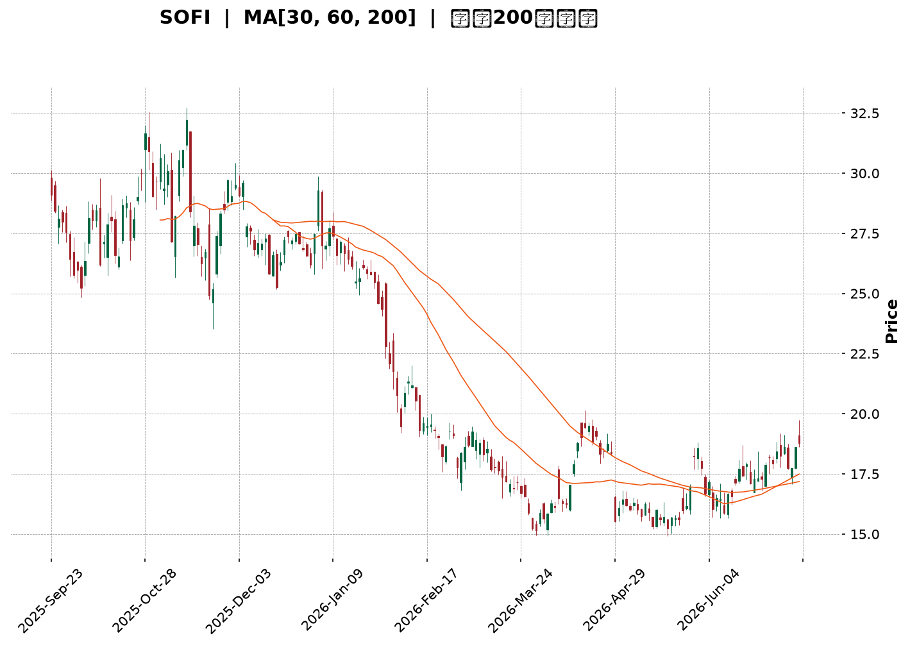
</details>

<html>
<head><meta charset="utf-8" /></head>
<body>
    <div style="height:500px; width:100%;">                        <script>window.PlotlyConfig = {MathJaxConfig: 'local'};</script>
        <script charset="utf-8" src="https://cdn.plot.ly/plotly-3.7.0.min.js" integrity="sha256-jvTGqxNp8AGWEcvNLVuKr+8j5dGe9Yw51LQkmDH+IYA=" crossorigin="anonymous"></script>                <div id="candlestick-chart" class="plotly-graph-div" style="height:100%; width:100%;"></div>            <script>                window.PLOTLYENV=window.PLOTLYENV || {};                                if (document.getElementById("candlestick-chart")) {                    Plotly.newPlot(                        "candlestick-chart",                        [{"close":{"dtype":"f8","bdata":"AAAAQAoXPUAAAADgo3A8QAAAAGC4HjxAAAAAQOH6O0AAAADAzIw7QAAAACCFazpAAAAAYI\u002fCOUAAAADgUfg5QAAAAKBwPTlAAAAAAClcOkAAAAAA1yM8QAAAAMAeBTxAAAAAQDNzPEAAAADgozA6QAAAAADXIztAAAAAYLjeO0AAAAAgrgc8QAAAAKCZmTpAAAAAgD2KOkAAAACAFK48QAAAAAAAwDxAAAAA4KMwO0AAAADgehQ8QAAAAGCPAj1AAAAAAAAAPkAAAADA9ag\u002fQAAAAGBm5j5AAAAAIK4HPUAAAACAFK49QAAAAKBHoT5AAAAAYLhePUAAAACA6xE+QAAAAMD1KDtAAAAAgMI1PEAAAACAPYo+QAAAAEAz8z5AAAAAQOEaQEAAAAAA12M8QAAAAIDr0TtAAAAAgD0KO0AAAACgcD06QAAAAOBRuDpAAAAAwPXoOEAAAADgozA5QAAAAGBmZjtAAAAA4HpUPEAAAACgcH08QAAAAOBRuD1AAAAAIK4HPUAAAABgj4I9QAAAAIDrET1AAAAAoJmZPUAAAAAgrsc7QAAAAAApnDtAAAAA4HrUOkAAAABAChc7QAAAAIDrETtAAAAAIK5HO0AAAACA69E5QAAAAOB6lDpAAAAAwB5FOUAAAACAPUo6QAAAAKBwPTtAAAAAoJlZO0AAAADgozA7QAAAAEDhejtAAAAAgOsRO0AAAACA69E6QAAAACBcjzpAAAAAgBQuOkAAAACAwnU7QAAAACCuRz1AAAAAQOH6OkAAAAAAAAA7QAAAAOBRuDtAAAAAYGZmO0AAAACgmZk6QAAAAADXIztAAAAAIIWrOkAAAADgo3A6QAAAAKBHITpAAAAAoHB9OUAAAAAA16M5QAAAAEAKFzpAAAAAoJnZOUAAAADAzMw5QAAAAIDCdTlAAAAAoJmZOEAAAAAAKVw4QAAAACBczzZAAAAA4HoUNkAAAABgj8I1QAAAAAAAwDRAAAAAgMJ1M0AAAAAAKdw0QAAAAKCZWTVAAAAAgBQuNUAAAADAzIw0QAAAAMDMTDNAAAAAACmcM0AAAABgj4IzQAAAAIA9ijNAAAAAwMxMM0AAAADAHgUzQAAAAOBRODJAAAAAwPWoMkAAAACAPUozQAAAAKCZGTNAAAAAYI\u002fCMUAAAAAA12MyQAAAAAApnDJAAAAAQDOzMkAAAAAAAEAzQAAAAGBm5jJAAAAAgD3KMkAAAACAPUoyQAAAACCuhzJAAAAAQDOzMUAAAABgj8IxQAAAAKBHoTFAAAAAYLheMUAAAACAFC4xQAAAAOB6FDFAAAAAYGbmMEAAAABgZiYxQAAAAEAzszBAAAAAIFyPMEAAAACgcL0vQAAAAIDCdS5AAAAAwMxMLkAAAABgj8IvQAAAAGCPQi9AAAAAQDOzL0AAAADAHkUwQAAAAAApHDBAAAAAoHB9MEAAAADAHkUwQAAAAOBRODBAAAAAwMwMMUAAAADA9egxQAAAAIA9yjJAAAAAIK4HM0AAAACAFG4zQAAAAAAAgDNAAAAA4HrUMkAAAAAgXA8zQAAAAIDrUTJAAAAA4KNwMkAAAABgj8IyQAAAAAApXDJAAAAAwMwML0AAAACgmRkwQAAAAIAUbjBAAAAAQDMzMEAAAADAHgUwQAAAAMDMTDBAAAAAAAAAMEAAAAAAAIAvQAAAAGCPQjBAAAAAwMzML0AAAABguJ4uQAAAAMAeBTBAAAAA4FE4L0AAAAAghWsvQAAAAIDCdS5AAAAAoEdhL0AAAADAzEwvQAAAAKBwPS9AAAAAgML1L0AAAAAghSswQAAAAOBR+DBAAAAA4FE4MkAAAADgepQyQAAAAKBwvTFAAAAAgBSuMEAAAABgZiYxQAAAACCuBzBAAAAAAACAMEAAAADgUXgwQAAAAKBwvS9AAAAAIIWrMEAAAADgepQwQAAAAKBHITFAAAAAgMK1MUAAAAAghWsxQAAAAMD16DFAAAAAoJkZMUAAAACAPUoxQAAAACBcTzFAAAAAwMxMMUAAAACgR+ExQAAAAOCjMDJAAAAAgBTuMUAAAADgo3AyQAAAAKBwPTJAAAAAACmcMkAAAAAAAMAxQAAAAEDhujFAAAAAYLieMkAAAAAgrscyQA=="},"high":{"dtype":"f8","bdata":"AAAAANcjPkAAAAAghas9QAAAACCFqzxAAAAAQOF6PEAAAACgR6E8QAAAAAApnDtAAAAA4HpUO0AAAACgmVk6QAAAAIAULjpAAAAAANcjO0AAAABACtc8QAAAAIDCtTxAAAAA4KOwPEAAAADAzMw9QAAAAIAUbjtAAAAAoJlZPEAAAABAChc9QAAAAOCjcDxAAAAAIIXrOkAAAACAFO48QAAAAIDrET1AAAAAwMzMPEAAAADgUZg8QAAAAGC43j1AAAAAQDMzPkAAAABA4fo\u002fQAAAAOBRSEBAAAAAgD3qPkAAAAAAKdw9QAAAAOBROD9AAAAAgD3KPkAAAABguF4+QAAAAGDn2z5AAAAAoHA9PEAAAADgUfg+QAAAAKBw\u002fT5AAAAAoHBdQEAAAAAAAMA\u002fQAAAAIDrET1AAAAAQDPzO0AAAAAAAAA7QAAAAKCZ2TpAAAAAQDOTPEAAAACA63E5QAAAAAApnDtAAAAAQDNzPEAAAAAAAEA9QAAAAAAAwD1AAAAAQDOzPUAAAAAghWs+QAAAAIAU7j1AAAAAQDOzPUAAAACAFO47QAAAAOB61DtAAAAAQDNzO0AAAACAFK47QAAAACCuRztAAAAAAACAO0AAAABA4Xo7QAAAAKBwvTpAAAAAgMLVOkAAAABACrc6QAAAAGC4XjtAAAAAYLieO0AAAABAClc7QAAAAIA9ijtAAAAAwMyMO0AAAADA9Wg7QAAAAADXIztAAAAAYGbmOkAAAACgR4E7QAAAAAAp3D1AAAAAwMxMPUAAAACAFC47QAAAAIAUDjxAAAAAAABgPEAAAABg5VA7QAAAAEAzMztAAAAAgMIVO0AAAADgelQ7QAAAACCuxzpAAAAAQApXOkAAAADAzAw6QAAAAADXYzpAAAAAoEchOkAAAABgZmY6QAAAAIAU7jlAAAAAgD3KOUAAAABguB45QAAAAOBReDlAAAAAAAAAN0AAAAAAKVw3QAAAAADXwzVAAAAAYGZmNEAAAADA9Sg1QAAAAEAKlzVAAAAAAAAANkAAAACgmRk1QAAAAIA9yjRAAAAAYLjeM0AAAABACtczQAAAAGCPAjRAAAAAQOF6M0AAAADgozAzQAAAAKBHwTJAAAAAgMK1MkAAAABguJ4zQAAAACBcjzNAAAAAgMI1MkAAAADA9WgyQAAAAIA9CjNAAAAAIK5HM0AAAABA4XozQAAAAGC4PjNAAAAAgOvxMkAAAABgZgYzQAAAAKCZ2TJAAAAAwMyMMkAAAABgZiYyQAAAAIDrETJAAAAAoEdBMkAAAAAgrgcyQAAAACCFSzFAAAAAwHJoMUAAAADA9WgxQAAAAIDrETFAAAAAQApXMUAAAACgcH0wQAAAAKBHYS9AAAAAoEchL0AAAABgZgYwQAAAAIDrUTBAAAAAIK7HL0AAAADAzGwwQAAAAEDhWjBAAAAAoJnZMUAAAADgUXgwQAAAAKBwfTBAAAAAIFwPMUAAAABAMxMyQAAAAIDr0TJAAAAAYLieM0AAAACgRyE0QAAAAMAepTNAAAAAwB7FM0AAAAAgsHIzQAAAAGBm5jJAAAAAQDOTMkAAAAAghSszQAAAAGC43jJAAAAAQAqXMEAAAABguF4wQAAAACCFyzBAAAAAIK7HMEAAAAAgXE8wQAAAAKBHgTBAAAAAgMJ1MEAAAADAzAwwQAAAAIDrUTBAAAAA4HpUMEAAAAAghWsvQAAAAOCjEDBAAAAAgBSuL0AAAACA61EwQAAAACCuRy9AAAAA4KNwL0AAAACA65EvQAAAAAAp3C9AAAAAQDPzMEAAAADgo7AwQAAAAOB6FDFAAAAAQAqXMkAAAAAghcsyQAAAAEDhOjJAAAAAQAp3MUAAAABA4ToxQAAAAKBw\u002fTBAAAAAwPWoMEAAAACgmRkxQAAAAOBRuDBAAAAA4KOwMEAAAAAgrucwQAAAAIAUbjFAAAAA4HoUMkAAAABAM7MyQAAAAKBw\u002fTFAAAAAIFwPMkAAAACAFK4xQAAAAIAUbjJAAAAAQDOTMUAAAADgUfgxQAAAAMDMTDJAAAAAoHA9MkAAAADgetQyQAAAAOCjMDNAAAAAYLgeM0AAAAAAAMAyQAAAAAAAwDFAAAAAoEehMkAAAACgcL0zQA=="},"hovertemplate":"\u003cb\u003e%{x|%Y-%m-%d}\u003c\u002fb\u003e\u003cbr\u003e\u958b: $%{open:.2f}\u003cbr\u003e\u9ad8: $%{high:.2f}\u003cbr\u003e\u4f4e: $%{low:.2f}\u003cbr\u003e\u6536: $%{close:.2f}\u003cextra\u003e\u003c\u002fextra\u003e","low":{"dtype":"f8","bdata":"AAAAoJnZPEAAAACgmVk8QAAAACBcDztAAAAAIFyPO0AAAAAAKRw7QAAAAEAzszlAAAAAANejOUAAAABAM3M5QAAAAEAK1zhAAAAAIFxPOUAAAACAFK46QAAAAMAepTtAAAAAAADAO0AAAACgRyE6QAAAAOBReDpAAAAAAADAOUAAAAAgXI87QAAAAAAAQDpAAAAAYI8COkAAAAAgXA87QAAAAGBmJjxAAAAAoEdhOkAAAACg8TI7QAAAAEAzszxAAAAAwB5FPUAAAADAzMw8QAAAAADXIz5AAAAAQOH6PEAAAACgcH08QAAAAOB6VD1AAAAA4KOwPEAAAABgjwI9QAAAAKBHITtAAAAAwPWoOUAAAABACtc8QAAAAOAi2z1AAAAAgML1PkAAAABgZiY8QAAAACCuhzpAAAAAwMyMOkAAAACAwrU5QAAAACBcjzlAAAAAYLi+OEAAAADAHoU3QAAAACCupzlAAAAAoEehOkAAAAAgXE88QAAAAOB6dDxAAAAAIIWrPEAAAADgo1A9QAAAAMAeBT1AAAAAQOF6PEAAAACAFO46QAAAAMDMDDtAAAAAwMyMOkAAAABA4Xo6QAAAAIAUjjpAAAAAQDMzOkAAAACAPco5QAAAAOBRuDlAAAAAIIUrOUAAAABAM\u002fM5QAAAACCuRzpAAAAAoJkZO0AAAABAM9M6QAAAACCuBztAAAAAIK4HO0AAAACgcL06QAAAAIA9ijpAAAAAIFwPOkAAAACAPco5QAAAAKCZmTtAAAAAIK4HOkAAAACgcF06QAAAAIDrkTpAAAAAQOE6O0AAAABAMzM6QAAAAOBRODpAAAAAIIXrOUAAAACAwjU6QAAAAGCPAjpAAAAAgMI1OUAAAABAM\u002fM4QAAAAAAAADpAAAAAoJmZOUAAAADAHsU5QAAAAIDCNTlAAAAAgOuROEAAAADAzAw4QAAAACBcTzZAAAAAACncNUAAAADAHgU1QAAAAIDrETRAAAAAAKoxM0AAAACAPQo0QAAAAMDMzDRAAAAAwMwMNUAAAAAA1yM0QAAAAIA9CjNAAAAAYGYmM0AAAAAAKRwzQAAAAKCZOTNAAAAA4FH4MkAAAAAA14MyQAAAAOB6lDFAAAAAANfjMUAAAACAFO4yQAAAAOBR+DJAAAAAIFxPMUAAAADAzMwwQAAAAOCjsDFAAAAAACmcMkAAAAAA16MyQAAAAGC4HjJAAAAAwB7FMUAAAACAPQoyQAAAAOBR+DFAAAAAYLieMUAAAAAgrocxQAAAAOBReDFAAAAAQOF6MEAAAADA9SgxQAAAAOB6lDBAAAAAIIWrMEAAAABACtcwQAAAAKBwfTBAAAAAwB6FMEAAAAAAKZwvQAAAAMDMTC5AAAAAYLjeLUAAAABguJ4uQAAAAKBH4S5AAAAAACncLUAAAABgj8IvQAAAAIDr0S9AAAAAYI9CMEAAAADgetQvQAAAAOBRGDBAAAAAIIXrL0AAAABgZmYxQAAAACCFKzJAAAAAYGamMkAAAAAA12MzQAAAAEAKFzNAAAAA4KOwMkAAAADA9egyQAAAAIAU7jFAAAAAgMAqMkAAAAAA12MyQAAAAMAeRTJAAAAAAAAAL0AAAADgehQvQAAAAAAAwC9AAAAAoEchMEAAAACgR+EvQAAAAEDh+i9AAAAAwPWoL0AAAACAPQovQAAAAIA9ii9AAAAAoJkZL0AAAACAFG4uQAAAAIDCdS5AAAAAYI\u002fCLkAAAACAFK4uQAAAAEAK1y1AAAAAIFwPLkAAAABAM7MuQAAAAOBRuC5AAAAA4FG4L0AAAABgjwIwQAAAAADXoy9AAAAAgBSuMUAAAADgo7AxQAAAAIDCdTFAAAAA4HqUMEAAAACAwpUwQAAAAAApXC9AAAAAwPXoL0AAAADgT00vQAAAAMD1qC9AAAAAIFxPL0AAAABA4TowQAAAAGCPAjFAAAAAAKwcMUAAAAAAKVwxQAAAAADXQzFAAAAAgOsRMUAAAADgUbgwQAAAAIAULjFAAAAAgOvRMEAAAACgcP0wQAAAAAAAgDFAAAAAQAq3MUAAAACAwvUxQAAAAADXwzFAAAAAIFxPMkAAAABAM7MxQAAAAOB6FDFAAAAAgMK1MUAAAABguJ4yQA=="},"name":"\u50f9\u683c","open":{"dtype":"f8","bdata":"AAAAgBTOPUAAAAAAAIA9QAAAAGCPwjtAAAAAYLhePEAAAAAAKVw8QAAAAOBReDtAAAAAQOG6OkAAAADgelQ6QAAAAKCZGTpAAAAAwB7FOUAAAACgmRk7QAAAAKBwfTxAAAAAgD0KPEAAAADAzIw8QAAAAIDrETtAAAAAYI+COkAAAABAMzM8QAAAAIDrETxAAAAAoJkZOkAAAABAMzM7QAAAACBcjzxAAAAAoHB9PEAAAADgelQ7QAAAAOBR2DxAAAAAAAAAPkAAAACgcP0+QAAAAGC4fj9AAAAAIFxvPkAAAADgo7A9QAAAAMD1qD1AAAAAIIVLPUAAAADAHoU9QAAAAAAAID5AAAAAYGaGOkAAAAAgXA89QAAAAGC4Pj5AAAAAgBQuP0AAAABA4bo\u002fQAAAAAAAADtAAAAAgMK1O0AAAABgj4I6QAAAAKCZeTpAAAAAoEfhO0AAAACgR6E4QAAAAOB61DlAAAAAQOH6OkAAAACAwrU8QAAAAIA9yjxAAAAA4HrUPEAAAAAA12M9QAAAAMDMbD1AAAAAwPUIPUAAAACgcF07QAAAAEDhujtAAAAAoHA9O0AAAABgZqY6QAAAAEAK1zpAAAAAwB4lO0AAAAAgXG87QAAAAKBwvTlAAAAAANejOkAAAACAFC46QAAAAGC4njpAAAAA4FGYO0AAAACA6xE7QAAAACCFKztAAAAAgD2KO0AAAABguN46QAAAACCuBztAAAAAgBSuOkAAAADA9ag6QAAAACBczztAAAAAQOE6PUAAAACgcN06QAAAAAAAADtAAAAAgBTOO0AAAACAPUo7QAAAAEAzszpAAAAAAAAAO0AAAAAgXM86QAAAAIA9ijpAAAAA4KNwOUAAAAAAAIA5QAAAAIAULjpAAAAAAAAAOkAAAABgZuY5QAAAAGBm5jlAAAAAAACAOUAAAACgcN04QAAAAIAUbjlAAAAAYI+CNkAAAADAzAw3QAAAAKBwfTVAAAAAQOE6NEAAAACAPUo0QAAAAIA9SjVAAAAAQAoXNUAAAACgmRk1QAAAAIA9yjRAAAAAIK5HM0AAAADA9WgzQAAAAOBReDNAAAAA4HpUM0AAAACAwhUzQAAAAEDhujJAAAAAAAAAMkAAAAAgrkczQAAAAOCjMDNAAAAAwPUoMkAAAADAHiUxQAAAAAAAADJAAAAAIFwPM0AAAABgZqYyQAAAAAApfDJAAAAA4HpUMkAAAAAghesyQAAAAADXYzJAAAAA4FE4MkAAAADAzMwxQAAAAAAAADJAAAAA4FG4MUAAAACAFG4xQAAAAAAAwDBAAAAAgD3qMEAAAAAgricxQAAAAGC4\u002fjBAAAAAgD0KMUAAAABgZkYwQAAAAEAKVy9AAAAAACncLkAAAABgZuYuQAAAAGBmRjBAAAAAoEdhLkAAAAAgrscvQAAAAMD1KDBAAAAAgBSuMUAAAAAA12MwQAAAAMDMTDBAAAAAAAAAMEAAAAAgrocxQAAAAOBReDJAAAAAYLieM0AAAACgmZkzQAAAAGCPQjNAAAAAYI+CM0AAAACAPUozQAAAAMAexTJAAAAA4KNwMkAAAABA4XoyQAAAAMAeZTJAAAAAwMyMMEAAAACAPYovQAAAAAApPDBAAAAA4FF4MEAAAAAghSswQAAAAEAzMzBAAAAAYI9CMEAAAAAgrgcwQAAAAKCZmS9AAAAAgOsRMEAAAAAghWsvQAAAAGC4ni5AAAAAYGZmL0AAAACAwvUuQAAAAIDCNS9AAAAAQOG6LkAAAACgcD0vQAAAAGBmZi9AAAAAQOF6MEAAAADAzAwwQAAAAMAeBTBAAAAAYI9CMkAAAABgZiYyQAAAACCuBzJAAAAAoEdhMUAAAADA9agwQAAAAEDhujBAAAAAgBQuMEAAAABgZmYwQAAAAOB6NDBAAAAAANejL0AAAACA69EwQAAAACCuRzFAAAAAQDMzMUAAAAAgXM8xQAAAAEAz0zFAAAAAQAqXMUAAAAAAKbwwQAAAAOBRODFAAAAAYGZmMUAAAAAAAAAxQAAAAOCjMDJAAAAAoJkZMkAAAAAA1yMyQAAAAEAzszJAAAAAoJlZMkAAAACgmZkyQAAAAEAKVzFAAAAAAADAMUAAAABA4RozQA=="},"x":["2025-09-23T00:00:00-04:00","2025-09-24T00:00:00-04:00","2025-09-25T00:00:00-04:00","2025-09-26T00:00:00-04:00","2025-09-29T00:00:00-04:00","2025-09-30T00:00:00-04:00","2025-10-01T00:00:00-04:00","2025-10-02T00:00:00-04:00","2025-10-03T00:00:00-04:00","2025-10-06T00:00:00-04:00","2025-10-07T00:00:00-04:00","2025-10-08T00:00:00-04:00","2025-10-09T00:00:00-04:00","2025-10-10T00:00:00-04:00","2025-10-13T00:00:00-04:00","2025-10-14T00:00:00-04:00","2025-10-15T00:00:00-04:00","2025-10-16T00:00:00-04:00","2025-10-17T00:00:00-04:00","2025-10-20T00:00:00-04:00","2025-10-21T00:00:00-04:00","2025-10-22T00:00:00-04:00","2025-10-23T00:00:00-04:00","2025-10-24T00:00:00-04:00","2025-10-27T00:00:00-04:00","2025-10-28T00:00:00-04:00","2025-10-29T00:00:00-04:00","2025-10-30T00:00:00-04:00","2025-10-31T00:00:00-04:00","2025-11-03T00:00:00-05:00","2025-11-04T00:00:00-05:00","2025-11-05T00:00:00-05:00","2025-11-06T00:00:00-05:00","2025-11-07T00:00:00-05:00","2025-11-10T00:00:00-05:00","2025-11-11T00:00:00-05:00","2025-11-12T00:00:00-05:00","2025-11-13T00:00:00-05:00","2025-11-14T00:00:00-05:00","2025-11-17T00:00:00-05:00","2025-11-18T00:00:00-05:00","2025-11-19T00:00:00-05:00","2025-11-20T00:00:00-05:00","2025-11-21T00:00:00-05:00","2025-11-24T00:00:00-05:00","2025-11-25T00:00:00-05:00","2025-11-26T00:00:00-05:00","2025-11-28T00:00:00-05:00","2025-12-01T00:00:00-05:00","2025-12-02T00:00:00-05:00","2025-12-03T00:00:00-05:00","2025-12-04T00:00:00-05:00","2025-12-05T00:00:00-05:00","2025-12-08T00:00:00-05:00","2025-12-09T00:00:00-05:00","2025-12-10T00:00:00-05:00","2025-12-11T00:00:00-05:00","2025-12-12T00:00:00-05:00","2025-12-15T00:00:00-05:00","2025-12-16T00:00:00-05:00","2025-12-17T00:00:00-05:00","2025-12-18T00:00:00-05:00","2025-12-19T00:00:00-05:00","2025-12-22T00:00:00-05:00","2025-12-23T00:00:00-05:00","2025-12-24T00:00:00-05:00","2025-12-26T00:00:00-05:00","2025-12-29T00:00:00-05:00","2025-12-30T00:00:00-05:00","2025-12-31T00:00:00-05:00","2026-01-02T00:00:00-05:00","2026-01-05T00:00:00-05:00","2026-01-06T00:00:00-05:00","2026-01-07T00:00:00-05:00","2026-01-08T00:00:00-05:00","2026-01-09T00:00:00-05:00","2026-01-12T00:00:00-05:00","2026-01-13T00:00:00-05:00","2026-01-14T00:00:00-05:00","2026-01-15T00:00:00-05:00","2026-01-16T00:00:00-05:00","2026-01-20T00:00:00-05:00","2026-01-21T00:00:00-05:00","2026-01-22T00:00:00-05:00","2026-01-23T00:00:00-05:00","2026-01-26T00:00:00-05:00","2026-01-27T00:00:00-05:00","2026-01-28T00:00:00-05:00","2026-01-29T00:00:00-05:00","2026-01-30T00:00:00-05:00","2026-02-02T00:00:00-05:00","2026-02-03T00:00:00-05:00","2026-02-04T00:00:00-05:00","2026-02-05T00:00:00-05:00","2026-02-06T00:00:00-05:00","2026-02-09T00:00:00-05:00","2026-02-10T00:00:00-05:00","2026-02-11T00:00:00-05:00","2026-02-12T00:00:00-05:00","2026-02-13T00:00:00-05:00","2026-02-17T00:00:00-05:00","2026-02-18T00:00:00-05:00","2026-02-19T00:00:00-05:00","2026-02-20T00:00:00-05:00","2026-02-23T00:00:00-05:00","2026-02-24T00:00:00-05:00","2026-02-25T00:00:00-05:00","2026-02-26T00:00:00-05:00","2026-02-27T00:00:00-05:00","2026-03-02T00:00:00-05:00","2026-03-03T00:00:00-05:00","2026-03-04T00:00:00-05:00","2026-03-05T00:00:00-05:00","2026-03-06T00:00:00-05:00","2026-03-09T00:00:00-04:00","2026-03-10T00:00:00-04:00","2026-03-11T00:00:00-04:00","2026-03-12T00:00:00-04:00","2026-03-13T00:00:00-04:00","2026-03-16T00:00:00-04:00","2026-03-17T00:00:00-04:00","2026-03-18T00:00:00-04:00","2026-03-19T00:00:00-04:00","2026-03-20T00:00:00-04:00","2026-03-23T00:00:00-04:00","2026-03-24T00:00:00-04:00","2026-03-25T00:00:00-04:00","2026-03-26T00:00:00-04:00","2026-03-27T00:00:00-04:00","2026-03-30T00:00:00-04:00","2026-03-31T00:00:00-04:00","2026-04-01T00:00:00-04:00","2026-04-02T00:00:00-04:00","2026-04-06T00:00:00-04:00","2026-04-07T00:00:00-04:00","2026-04-08T00:00:00-04:00","2026-04-09T00:00:00-04:00","2026-04-10T00:00:00-04:00","2026-04-13T00:00:00-04:00","2026-04-14T00:00:00-04:00","2026-04-15T00:00:00-04:00","2026-04-16T00:00:00-04:00","2026-04-17T00:00:00-04:00","2026-04-20T00:00:00-04:00","2026-04-21T00:00:00-04:00","2026-04-22T00:00:00-04:00","2026-04-23T00:00:00-04:00","2026-04-24T00:00:00-04:00","2026-04-27T00:00:00-04:00","2026-04-28T00:00:00-04:00","2026-04-29T00:00:00-04:00","2026-04-30T00:00:00-04:00","2026-05-01T00:00:00-04:00","2026-05-04T00:00:00-04:00","2026-05-05T00:00:00-04:00","2026-05-06T00:00:00-04:00","2026-05-07T00:00:00-04:00","2026-05-08T00:00:00-04:00","2026-05-11T00:00:00-04:00","2026-05-12T00:00:00-04:00","2026-05-13T00:00:00-04:00","2026-05-14T00:00:00-04:00","2026-05-15T00:00:00-04:00","2026-05-18T00:00:00-04:00","2026-05-19T00:00:00-04:00","2026-05-20T00:00:00-04:00","2026-05-21T00:00:00-04:00","2026-05-22T00:00:00-04:00","2026-05-26T00:00:00-04:00","2026-05-27T00:00:00-04:00","2026-05-28T00:00:00-04:00","2026-05-29T00:00:00-04:00","2026-06-01T00:00:00-04:00","2026-06-02T00:00:00-04:00","2026-06-03T00:00:00-04:00","2026-06-04T00:00:00-04:00","2026-06-05T00:00:00-04:00","2026-06-08T00:00:00-04:00","2026-06-09T00:00:00-04:00","2026-06-10T00:00:00-04:00","2026-06-11T00:00:00-04:00","2026-06-12T00:00:00-04:00","2026-06-15T00:00:00-04:00","2026-06-16T00:00:00-04:00","2026-06-17T00:00:00-04:00","2026-06-18T00:00:00-04:00","2026-06-22T00:00:00-04:00","2026-06-23T00:00:00-04:00","2026-06-24T00:00:00-04:00","2026-06-25T00:00:00-04:00","2026-06-26T00:00:00-04:00","2026-06-29T00:00:00-04:00","2026-06-30T00:00:00-04:00","2026-07-01T00:00:00-04:00","2026-07-02T00:00:00-04:00","2026-07-06T00:00:00-04:00","2026-07-07T00:00:00-04:00","2026-07-08T00:00:00-04:00","2026-07-09T00:00:00-04:00","2026-07-10T00:00:00-04:00"],"type":"candlestick"},{"hovertemplate":"MA30: $%{y:.2f}\u003cextra\u003e\u003c\u002fextra\u003e","line":{"color":"#2196F3","dash":"dash","width":2},"mode":"lines","name":"MA30","x":["2025-09-23T00:00:00-04:00","2025-09-24T00:00:00-04:00","2025-09-25T00:00:00-04:00","2025-09-26T00:00:00-04:00","2025-09-29T00:00:00-04:00","2025-09-30T00:00:00-04:00","2025-10-01T00:00:00-04:00","2025-10-02T00:00:00-04:00","2025-10-03T00:00:00-04:00","2025-10-06T00:00:00-04:00","2025-10-07T00:00:00-04:00","2025-10-08T00:00:00-04:00","2025-10-09T00:00:00-04:00","2025-10-10T00:00:00-04:00","2025-10-13T00:00:00-04:00","2025-10-14T00:00:00-04:00","2025-10-15T00:00:00-04:00","2025-10-16T00:00:00-04:00","2025-10-17T00:00:00-04:00","2025-10-20T00:00:00-04:00","2025-10-21T00:00:00-04:00","2025-10-22T00:00:00-04:00","2025-10-23T00:00:00-04:00","2025-10-24T00:00:00-04:00","2025-10-27T00:00:00-04:00","2025-10-28T00:00:00-04:00","2025-10-29T00:00:00-04:00","2025-10-30T00:00:00-04:00","2025-10-31T00:00:00-04:00","2025-11-03T00:00:00-05:00","2025-11-04T00:00:00-05:00","2025-11-05T00:00:00-05:00","2025-11-06T00:00:00-05:00","2025-11-07T00:00:00-05:00","2025-11-10T00:00:00-05:00","2025-11-11T00:00:00-05:00","2025-11-12T00:00:00-05:00","2025-11-13T00:00:00-05:00","2025-11-14T00:00:00-05:00","2025-11-17T00:00:00-05:00","2025-11-18T00:00:00-05:00","2025-11-19T00:00:00-05:00","2025-11-20T00:00:00-05:00","2025-11-21T00:00:00-05:00","2025-11-24T00:00:00-05:00","2025-11-25T00:00:00-05:00","2025-11-26T00:00:00-05:00","2025-11-28T00:00:00-05:00","2025-12-01T00:00:00-05:00","2025-12-02T00:00:00-05:00","2025-12-03T00:00:00-05:00","2025-12-04T00:00:00-05:00","2025-12-05T00:00:00-05:00","2025-12-08T00:00:00-05:00","2025-12-09T00:00:00-05:00","2025-12-10T00:00:00-05:00","2025-12-11T00:00:00-05:00","2025-12-12T00:00:00-05:00","2025-12-15T00:00:00-05:00","2025-12-16T00:00:00-05:00","2025-12-17T00:00:00-05:00","2025-12-18T00:00:00-05:00","2025-12-19T00:00:00-05:00","2025-12-22T00:00:00-05:00","2025-12-23T00:00:00-05:00","2025-12-24T00:00:00-05:00","2025-12-26T00:00:00-05:00","2025-12-29T00:00:00-05:00","2025-12-30T00:00:00-05:00","2025-12-31T00:00:00-05:00","2026-01-02T00:00:00-05:00","2026-01-05T00:00:00-05:00","2026-01-06T00:00:00-05:00","2026-01-07T00:00:00-05:00","2026-01-08T00:00:00-05:00","2026-01-09T00:00:00-05:00","2026-01-12T00:00:00-05:00","2026-01-13T00:00:00-05:00","2026-01-14T00:00:00-05:00","2026-01-15T00:00:00-05:00","2026-01-16T00:00:00-05:00","2026-01-20T00:00:00-05:00","2026-01-21T00:00:00-05:00","2026-01-22T00:00:00-05:00","2026-01-23T00:00:00-05:00","2026-01-26T00:00:00-05:00","2026-01-27T00:00:00-05:00","2026-01-28T00:00:00-05:00","2026-01-29T00:00:00-05:00","2026-01-30T00:00:00-05:00","2026-02-02T00:00:00-05:00","2026-02-03T00:00:00-05:00","2026-02-04T00:00:00-05:00","2026-02-05T00:00:00-05:00","2026-02-06T00:00:00-05:00","2026-02-09T00:00:00-05:00","2026-02-10T00:00:00-05:00","2026-02-11T00:00:00-05:00","2026-02-12T00:00:00-05:00","2026-02-13T00:00:00-05:00","2026-02-17T00:00:00-05:00","2026-02-18T00:00:00-05:00","2026-02-19T00:00:00-05:00","2026-02-20T00:00:00-05:00","2026-02-23T00:00:00-05:00","2026-02-24T00:00:00-05:00","2026-02-25T00:00:00-05:00","2026-02-26T00:00:00-05:00","2026-02-27T00:00:00-05:00","2026-03-02T00:00:00-05:00","2026-03-03T00:00:00-05:00","2026-03-04T00:00:00-05:00","2026-03-05T00:00:00-05:00","2026-03-06T00:00:00-05:00","2026-03-09T00:00:00-04:00","2026-03-10T00:00:00-04:00","2026-03-11T00:00:00-04:00","2026-03-12T00:00:00-04:00","2026-03-13T00:00:00-04:00","2026-03-16T00:00:00-04:00","2026-03-17T00:00:00-04:00","2026-03-18T00:00:00-04:00","2026-03-19T00:00:00-04:00","2026-03-20T00:00:00-04:00","2026-03-23T00:00:00-04:00","2026-03-24T00:00:00-04:00","2026-03-25T00:00:00-04:00","2026-03-26T00:00:00-04:00","2026-03-27T00:00:00-04:00","2026-03-30T00:00:00-04:00","2026-03-31T00:00:00-04:00","2026-04-01T00:00:00-04:00","2026-04-02T00:00:00-04:00","2026-04-06T00:00:00-04:00","2026-04-07T00:00:00-04:00","2026-04-08T00:00:00-04:00","2026-04-09T00:00:00-04:00","2026-04-10T00:00:00-04:00","2026-04-13T00:00:00-04:00","2026-04-14T00:00:00-04:00","2026-04-15T00:00:00-04:00","2026-04-16T00:00:00-04:00","2026-04-17T00:00:00-04:00","2026-04-20T00:00:00-04:00","2026-04-21T00:00:00-04:00","2026-04-22T00:00:00-04:00","2026-04-23T00:00:00-04:00","2026-04-24T00:00:00-04:00","2026-04-27T00:00:00-04:00","2026-04-28T00:00:00-04:00","2026-04-29T00:00:00-04:00","2026-04-30T00:00:00-04:00","2026-05-01T00:00:00-04:00","2026-05-04T00:00:00-04:00","2026-05-05T00:00:00-04:00","2026-05-06T00:00:00-04:00","2026-05-07T00:00:00-04:00","2026-05-08T00:00:00-04:00","2026-05-11T00:00:00-04:00","2026-05-12T00:00:00-04:00","2026-05-13T00:00:00-04:00","2026-05-14T00:00:00-04:00","2026-05-15T00:00:00-04:00","2026-05-18T00:00:00-04:00","2026-05-19T00:00:00-04:00","2026-05-20T00:00:00-04:00","2026-05-21T00:00:00-04:00","2026-05-22T00:00:00-04:00","2026-05-26T00:00:00-04:00","2026-05-27T00:00:00-04:00","2026-05-28T00:00:00-04:00","2026-05-29T00:00:00-04:00","2026-06-01T00:00:00-04:00","2026-06-02T00:00:00-04:00","2026-06-03T00:00:00-04:00","2026-06-04T00:00:00-04:00","2026-06-05T00:00:00-04:00","2026-06-08T00:00:00-04:00","2026-06-09T00:00:00-04:00","2026-06-10T00:00:00-04:00","2026-06-11T00:00:00-04:00","2026-06-12T00:00:00-04:00","2026-06-15T00:00:00-04:00","2026-06-16T00:00:00-04:00","2026-06-17T00:00:00-04:00","2026-06-18T00:00:00-04:00","2026-06-22T00:00:00-04:00","2026-06-23T00:00:00-04:00","2026-06-24T00:00:00-04:00","2026-06-25T00:00:00-04:00","2026-06-26T00:00:00-04:00","2026-06-29T00:00:00-04:00","2026-06-30T00:00:00-04:00","2026-07-01T00:00:00-04:00","2026-07-02T00:00:00-04:00","2026-07-06T00:00:00-04:00","2026-07-07T00:00:00-04:00","2026-07-08T00:00:00-04:00","2026-07-09T00:00:00-04:00","2026-07-10T00:00:00-04:00"],"y":{"dtype":"f8","bdata":"AAAAAAAA+H8AAAAAAAD4fwAAAAAAAPh\u002fAAAAAAAA+H8AAAAAAAD4fwAAAAAAAPh\u002fAAAAAAAA+H8AAAAAAAD4fwAAAAAAAPh\u002fAAAAAAAA+H8AAAAAAAD4fwAAAAAAAPh\u002fAAAAAAAA+H8AAAAAAAD4fwAAAAAAAPh\u002fAAAAAAAA+H8AAAAAAAD4fwAAAAAAAPh\u002fAAAAAAAA+H8AAAAAAAD4fwAAAAAAAPh\u002fAAAAAAAA+H8AAAAAAAD4fwAAAAAAAPh\u002fAAAAAAAA+H8AAAAAAAD4fwAAAAAAAPh\u002fAAAAAAAA+H8AAAAAAAD4fwAAAID4DDxAvLu7K1wPPEBVVVX1RB08QN7d3c0TFTxA7+7uPgoXPEAREREBjjA8QBEREfE1VzxA3t3dLUCOPEAAAADA5qI8QImIiNjquDxAREREVLi+PEB3d3e3ga48QCIiItJpozxAIiIikjSFPECamZkJrHw8QERERATkfjxAZmZm5tCCPECJiIjIvYY8QGZmZoZdoTxAMzMzA522PEDNzMwssr08QJqZmTltwDxAMzMz8\u002f3UPEB3d3eXbtI8QO\u002fu7j58xjxAZmZmRm+rPEBVVVX1b4Q8QCIiIjLBYzxAMzMzQ9JUPEBmZmb24TM8QKuqqppSETxAREREBFbuO0C8u7t7FM47QO\u002fu7j7DzjtAzczMjGzHO0DNzMxc1qo7QHd3dwc6jTtAd3d3h11hO0AAAADQ91M7QM3MzEw3STtAmpmZmeBBO0Crqqq6SUw7QDMzMyMiYjtA7+7uHsxzO0AAAAAgPoM7QM3MzCz5hTtA7+7ujgl+O0CrqqrK6G07QCIiIrLkVztAIiIiMsFDO0De3d2tjik7QGZmZiZ4EDtAd3d3t2XtOkAAAADQIts6QCIiIlIqzjpAq6qqes3FOkDe3d1ty7o6QERERFQOrTpAd3d3xy+WOkDNzMxcuok6QLy7u6uOaTpAIiIiAlZOOkAiIiISric6QDMzM3NM8DlAq6qqevisOUAiIiJi9HY5QCIiIjKlQjlAvLu7S2IQOUBVVVVF4do4QO\u002fu7o7tnDhAzczMLN1kOEAzMzMjBiE4QImIiMjozTdAERERkV+MN0De3d39Rkg3QM3MzOw19zZAq6qqGqGsNkCrqqoqQG42QFVVVYWkKTZAREREVJzdNUBVVVXV6pg1QFVVVSW\u002fWDVAq6qqKs4eNUAAAAAAR+g0QERERDTsqjRAZmZmZq1uNEDv7u6Oly40QO\u002fu7r508zNAd3d3d5O4M0C8u7uLQYAzQJqZmakNVDNAMzMzg9wrM0CamZlZxwQzQM3MzBx25TJAVVVVtZ3PMkBmZmYW9a8yQCIiIgJHiDJAZmZmdtpgMkARERHZ6jgyQERERMwvFjJA7+7uxiDwMUC8u7vrJtExQM3MzGTJrzFAmpmZwViSMUAiIiJK4XoxQFVVVe3faDFAVVVVfVtWMUCrqqoyljwxQFVVVb0CJDFAAAAAuPMdMUDNzMwk2xkxQERERFxkGzFAmpmZQTUeMUARERF5vh8xQJqZmTHdJDFAq6qqkjQlMUARERGpxisxQAAAAOj7KTFA3t3ddUwwMUBmZmb+1DgxQM3MzLQPPzFAVVVVPVEvMUCamZnxGSYxQHd3d\u002f+NIDFAvLu705QaMUBmZmZO8BAxQFVVVX2GDTFA7+7uJr8IMUAiIiICuQcxQERERBSDEDFAq6qqeukWMUC8u7tLDBIxQLy7u0NgFTFAmpmZ+VMTMUCrqqqijA4xQGZmZj4KBzFA3t3dnTYAMUBEREQ07PowQERERHzN9TBAERERCazsMECrqqry0t0wQAAAABhLzjBAZmZmnmHHMEC8u7vDIMAwQERERPwbsTBAVVVVPcOeMEAAAADIdo4wQLy7uzPsejBAzczMNF5qMEB3d3ef01YwQCIiIiKUQTBAzczMbFlLMEAAAAAAck8wQLy7uytrVTBAAAAA0E1iMECJiIgoQG4wQCIiIkL9ezBA7+7uPmCFMEDe3d1thJIwQAAAADB6mzBAiYiIiGynMEAAAADIWr0wQAAAADjfzzBAZmZmVqvjMEBVVVUd9\u002fowQHd3d4+mFDFAZmZmZpEtMUC8u7vrfD8xQBEREUl+UTFAzczMdAVoMUDv7u4WS34xQA=="},"type":"scatter"},{"hovertemplate":"MA60: $%{y:.2f}\u003cextra\u003e\u003c\u002fextra\u003e","line":{"color":"#9C27B0","dash":"dash","width":2},"mode":"lines","name":"MA60","x":["2025-09-23T00:00:00-04:00","2025-09-24T00:00:00-04:00","2025-09-25T00:00:00-04:00","2025-09-26T00:00:00-04:00","2025-09-29T00:00:00-04:00","2025-09-30T00:00:00-04:00","2025-10-01T00:00:00-04:00","2025-10-02T00:00:00-04:00","2025-10-03T00:00:00-04:00","2025-10-06T00:00:00-04:00","2025-10-07T00:00:00-04:00","2025-10-08T00:00:00-04:00","2025-10-09T00:00:00-04:00","2025-10-10T00:00:00-04:00","2025-10-13T00:00:00-04:00","2025-10-14T00:00:00-04:00","2025-10-15T00:00:00-04:00","2025-10-16T00:00:00-04:00","2025-10-17T00:00:00-04:00","2025-10-20T00:00:00-04:00","2025-10-21T00:00:00-04:00","2025-10-22T00:00:00-04:00","2025-10-23T00:00:00-04:00","2025-10-24T00:00:00-04:00","2025-10-27T00:00:00-04:00","2025-10-28T00:00:00-04:00","2025-10-29T00:00:00-04:00","2025-10-30T00:00:00-04:00","2025-10-31T00:00:00-04:00","2025-11-03T00:00:00-05:00","2025-11-04T00:00:00-05:00","2025-11-05T00:00:00-05:00","2025-11-06T00:00:00-05:00","2025-11-07T00:00:00-05:00","2025-11-10T00:00:00-05:00","2025-11-11T00:00:00-05:00","2025-11-12T00:00:00-05:00","2025-11-13T00:00:00-05:00","2025-11-14T00:00:00-05:00","2025-11-17T00:00:00-05:00","2025-11-18T00:00:00-05:00","2025-11-19T00:00:00-05:00","2025-11-20T00:00:00-05:00","2025-11-21T00:00:00-05:00","2025-11-24T00:00:00-05:00","2025-11-25T00:00:00-05:00","2025-11-26T00:00:00-05:00","2025-11-28T00:00:00-05:00","2025-12-01T00:00:00-05:00","2025-12-02T00:00:00-05:00","2025-12-03T00:00:00-05:00","2025-12-04T00:00:00-05:00","2025-12-05T00:00:00-05:00","2025-12-08T00:00:00-05:00","2025-12-09T00:00:00-05:00","2025-12-10T00:00:00-05:00","2025-12-11T00:00:00-05:00","2025-12-12T00:00:00-05:00","2025-12-15T00:00:00-05:00","2025-12-16T00:00:00-05:00","2025-12-17T00:00:00-05:00","2025-12-18T00:00:00-05:00","2025-12-19T00:00:00-05:00","2025-12-22T00:00:00-05:00","2025-12-23T00:00:00-05:00","2025-12-24T00:00:00-05:00","2025-12-26T00:00:00-05:00","2025-12-29T00:00:00-05:00","2025-12-30T00:00:00-05:00","2025-12-31T00:00:00-05:00","2026-01-02T00:00:00-05:00","2026-01-05T00:00:00-05:00","2026-01-06T00:00:00-05:00","2026-01-07T00:00:00-05:00","2026-01-08T00:00:00-05:00","2026-01-09T00:00:00-05:00","2026-01-12T00:00:00-05:00","2026-01-13T00:00:00-05:00","2026-01-14T00:00:00-05:00","2026-01-15T00:00:00-05:00","2026-01-16T00:00:00-05:00","2026-01-20T00:00:00-05:00","2026-01-21T00:00:00-05:00","2026-01-22T00:00:00-05:00","2026-01-23T00:00:00-05:00","2026-01-26T00:00:00-05:00","2026-01-27T00:00:00-05:00","2026-01-28T00:00:00-05:00","2026-01-29T00:00:00-05:00","2026-01-30T00:00:00-05:00","2026-02-02T00:00:00-05:00","2026-02-03T00:00:00-05:00","2026-02-04T00:00:00-05:00","2026-02-05T00:00:00-05:00","2026-02-06T00:00:00-05:00","2026-02-09T00:00:00-05:00","2026-02-10T00:00:00-05:00","2026-02-11T00:00:00-05:00","2026-02-12T00:00:00-05:00","2026-02-13T00:00:00-05:00","2026-02-17T00:00:00-05:00","2026-02-18T00:00:00-05:00","2026-02-19T00:00:00-05:00","2026-02-20T00:00:00-05:00","2026-02-23T00:00:00-05:00","2026-02-24T00:00:00-05:00","2026-02-25T00:00:00-05:00","2026-02-26T00:00:00-05:00","2026-02-27T00:00:00-05:00","2026-03-02T00:00:00-05:00","2026-03-03T00:00:00-05:00","2026-03-04T00:00:00-05:00","2026-03-05T00:00:00-05:00","2026-03-06T00:00:00-05:00","2026-03-09T00:00:00-04:00","2026-03-10T00:00:00-04:00","2026-03-11T00:00:00-04:00","2026-03-12T00:00:00-04:00","2026-03-13T00:00:00-04:00","2026-03-16T00:00:00-04:00","2026-03-17T00:00:00-04:00","2026-03-18T00:00:00-04:00","2026-03-19T00:00:00-04:00","2026-03-20T00:00:00-04:00","2026-03-23T00:00:00-04:00","2026-03-24T00:00:00-04:00","2026-03-25T00:00:00-04:00","2026-03-26T00:00:00-04:00","2026-03-27T00:00:00-04:00","2026-03-30T00:00:00-04:00","2026-03-31T00:00:00-04:00","2026-04-01T00:00:00-04:00","2026-04-02T00:00:00-04:00","2026-04-06T00:00:00-04:00","2026-04-07T00:00:00-04:00","2026-04-08T00:00:00-04:00","2026-04-09T00:00:00-04:00","2026-04-10T00:00:00-04:00","2026-04-13T00:00:00-04:00","2026-04-14T00:00:00-04:00","2026-04-15T00:00:00-04:00","2026-04-16T00:00:00-04:00","2026-04-17T00:00:00-04:00","2026-04-20T00:00:00-04:00","2026-04-21T00:00:00-04:00","2026-04-22T00:00:00-04:00","2026-04-23T00:00:00-04:00","2026-04-24T00:00:00-04:00","2026-04-27T00:00:00-04:00","2026-04-28T00:00:00-04:00","2026-04-29T00:00:00-04:00","2026-04-30T00:00:00-04:00","2026-05-01T00:00:00-04:00","2026-05-04T00:00:00-04:00","2026-05-05T00:00:00-04:00","2026-05-06T00:00:00-04:00","2026-05-07T00:00:00-04:00","2026-05-08T00:00:00-04:00","2026-05-11T00:00:00-04:00","2026-05-12T00:00:00-04:00","2026-05-13T00:00:00-04:00","2026-05-14T00:00:00-04:00","2026-05-15T00:00:00-04:00","2026-05-18T00:00:00-04:00","2026-05-19T00:00:00-04:00","2026-05-20T00:00:00-04:00","2026-05-21T00:00:00-04:00","2026-05-22T00:00:00-04:00","2026-05-26T00:00:00-04:00","2026-05-27T00:00:00-04:00","2026-05-28T00:00:00-04:00","2026-05-29T00:00:00-04:00","2026-06-01T00:00:00-04:00","2026-06-02T00:00:00-04:00","2026-06-03T00:00:00-04:00","2026-06-04T00:00:00-04:00","2026-06-05T00:00:00-04:00","2026-06-08T00:00:00-04:00","2026-06-09T00:00:00-04:00","2026-06-10T00:00:00-04:00","2026-06-11T00:00:00-04:00","2026-06-12T00:00:00-04:00","2026-06-15T00:00:00-04:00","2026-06-16T00:00:00-04:00","2026-06-17T00:00:00-04:00","2026-06-18T00:00:00-04:00","2026-06-22T00:00:00-04:00","2026-06-23T00:00:00-04:00","2026-06-24T00:00:00-04:00","2026-06-25T00:00:00-04:00","2026-06-26T00:00:00-04:00","2026-06-29T00:00:00-04:00","2026-06-30T00:00:00-04:00","2026-07-01T00:00:00-04:00","2026-07-02T00:00:00-04:00","2026-07-06T00:00:00-04:00","2026-07-07T00:00:00-04:00","2026-07-08T00:00:00-04:00","2026-07-09T00:00:00-04:00","2026-07-10T00:00:00-04:00"],"y":{"dtype":"f8","bdata":"AAAAAAAA+H8AAAAAAAD4fwAAAAAAAPh\u002fAAAAAAAA+H8AAAAAAAD4fwAAAAAAAPh\u002fAAAAAAAA+H8AAAAAAAD4fwAAAAAAAPh\u002fAAAAAAAA+H8AAAAAAAD4fwAAAAAAAPh\u002fAAAAAAAA+H8AAAAAAAD4fwAAAAAAAPh\u002fAAAAAAAA+H8AAAAAAAD4fwAAAAAAAPh\u002fAAAAAAAA+H8AAAAAAAD4fwAAAAAAAPh\u002fAAAAAAAA+H8AAAAAAAD4fwAAAAAAAPh\u002fAAAAAAAA+H8AAAAAAAD4fwAAAAAAAPh\u002fAAAAAAAA+H8AAAAAAAD4fwAAAAAAAPh\u002fAAAAAAAA+H8AAAAAAAD4fwAAAAAAAPh\u002fAAAAAAAA+H8AAAAAAAD4fwAAAAAAAPh\u002fAAAAAAAA+H8AAAAAAAD4fwAAAAAAAPh\u002fAAAAAAAA+H8AAAAAAAD4fwAAAAAAAPh\u002fAAAAAAAA+H8AAAAAAAD4fwAAAAAAAPh\u002fAAAAAAAA+H8AAAAAAAD4fwAAAAAAAPh\u002fAAAAAAAA+H8AAAAAAAD4fwAAAAAAAPh\u002fAAAAAAAA+H8AAAAAAAD4fwAAAAAAAPh\u002fAAAAAAAA+H8AAAAAAAD4fwAAAAAAAPh\u002fAAAAAAAA+H8AAAAAAAD4f1VVVY0lDzxAAAAAGNn+O0CJiIi4rPU7QGZmZobr8TtA3t3dZTvvO0Dv7u4usu07QERERPw38jtAq6qq2s73O0AAAABIb\u002fs7QKuqqhIRATxA7+7udkwAPEARERG5Zf07QKuqqvrFAjxAiYiIWID8O0DNzMwU9f87QImIiJhuAjxAq6qqOm0APECamZlJU\u002fo7QERERByh\u002fDtAq6qqGi\u002f9O0BVVVVtoPM7QAAAALBy6DtAVVVV1THhO0C8u7uzyNY7QImIiEhTyjtAiYiIYJ64O0CamZmxnZ87QDMzM8NniDtAVVVVBYF1O0CamZkpzl47QDMzM6NwPTtAMzMzA1YeO0Dv7u5G4fo6QBEREdmH3zpAvLu7gzK6OkB3d3df5ZA6QM3MzJzvZzpAmpmZ6d84OkCrqqqKbBc6QN7d3W0S8zlAMzMz417TOUDv7u7up7Y5QN7d3XUFmDlAAAAA2BWAOUDv7u6OwmU5QM3MzIyXPjlAzczMVFUVOUCrqqp6FO44QLy7u5vEwDhAMzMzw66QOECamZnBPGE4QN7d3aWbNDhAERER8RkGOEAAAADotOE3QDMzM0OLvDdAiYiIcD2aN0BmZmZ+sXQ3QJqZmYlBUDdAd3d3n2EnN0BERET0\u002fQQ3QKuqqirO3jZAq6qqQhm9NkDe3d21OpY2QAAAAEjhajZAAAAAGEs+NkBERES8dBM2QCIiIhp25TVAERERYZ64NUAzMzMP5ok1QJqZma2OWTVA3t3d+X4qNUB3d3eHFvk0QKuqqhbZvjRAVVVVKVyPNEAAAAAklGE0QBEREe0KMDRAAAAATH4BNECrqqoua9UzQFVVVaHTpjNAIiIiBsh9M0ARERH9YlkzQM3MzMAROjNAIiIitoEeM0CJiIi8AgQzQO\u002fu7rLk5zJAiYiI\u002fPDJMkAAAAAcL60yQHd3d1O4jjJAq6qq9m90MkARERFFi1wyQDMzM6+OSTJARERE4JYtMkCamZmlcBUyQCIiIg4CAzJAiYiIRBn1MUBmZmaycuAxQLy7u7\u002fmyjFAq6qqzsy0MUCamZntUaAxQERERHBZkzFAzczMIIWDMUC8u7ubmXExQERERNSUYjFAmpmZXdZSMUBmZmb2tkQxQN7d3RX1NzFAmpmZDUkrMUB3d3czwRsxQM3MzBzoDDFAiYiI4E8FMUC8u7sL1\u002fswQCIiIrrX9DBAAAAAcMvyMEBmZmae7+8wQO\u002fu7pb86jBAAAAA6PvhMECJiIi4Ht0wQN7d3Q100jBAVVVVVVXNMEDv7u5O1McwQHd3d+tRwDBAERERVVW9MEDNzMz4xbowQJqZmZX8ujBA3t3dUXG+MEB3d3c7mL8wQLy7u9\u002fBxDBA7+7usg\u002fHMEAAAAC4Hs0wQCIiIqL+1TBAmpmZASvfMEDe3d2Js+cwQN7d3b2f8jBAAAAAqH\u002f7MEAAAADgwQQxQO\u002fu7mbYDTFAIiIiAuQWMUAAAACQNB0xQKuqquKlIzFA7+7uvlgqMUDNzMwEDy4xQA=="},"type":"scatter"},{"hovertemplate":"MA200: $%{y:.2f}\u003cextra\u003e\u003c\u002fextra\u003e","line":{"color":"#FF6F00","dash":"solid","width":2},"mode":"lines","name":"MA200","x":["2025-09-23T00:00:00-04:00","2025-09-24T00:00:00-04:00","2025-09-25T00:00:00-04:00","2025-09-26T00:00:00-04:00","2025-09-29T00:00:00-04:00","2025-09-30T00:00:00-04:00","2025-10-01T00:00:00-04:00","2025-10-02T00:00:00-04:00","2025-10-03T00:00:00-04:00","2025-10-06T00:00:00-04:00","2025-10-07T00:00:00-04:00","2025-10-08T00:00:00-04:00","2025-10-09T00:00:00-04:00","2025-10-10T00:00:00-04:00","2025-10-13T00:00:00-04:00","2025-10-14T00:00:00-04:00","2025-10-15T00:00:00-04:00","2025-10-16T00:00:00-04:00","2025-10-17T00:00:00-04:00","2025-10-20T00:00:00-04:00","2025-10-21T00:00:00-04:00","2025-10-22T00:00:00-04:00","2025-10-23T00:00:00-04:00","2025-10-24T00:00:00-04:00","2025-10-27T00:00:00-04:00","2025-10-28T00:00:00-04:00","2025-10-29T00:00:00-04:00","2025-10-30T00:00:00-04:00","2025-10-31T00:00:00-04:00","2025-11-03T00:00:00-05:00","2025-11-04T00:00:00-05:00","2025-11-05T00:00:00-05:00","2025-11-06T00:00:00-05:00","2025-11-07T00:00:00-05:00","2025-11-10T00:00:00-05:00","2025-11-11T00:00:00-05:00","2025-11-12T00:00:00-05:00","2025-11-13T00:00:00-05:00","2025-11-14T00:00:00-05:00","2025-11-17T00:00:00-05:00","2025-11-18T00:00:00-05:00","2025-11-19T00:00:00-05:00","2025-11-20T00:00:00-05:00","2025-11-21T00:00:00-05:00","2025-11-24T00:00:00-05:00","2025-11-25T00:00:00-05:00","2025-11-26T00:00:00-05:00","2025-11-28T00:00:00-05:00","2025-12-01T00:00:00-05:00","2025-12-02T00:00:00-05:00","2025-12-03T00:00:00-05:00","2025-12-04T00:00:00-05:00","2025-12-05T00:00:00-05:00","2025-12-08T00:00:00-05:00","2025-12-09T00:00:00-05:00","2025-12-10T00:00:00-05:00","2025-12-11T00:00:00-05:00","2025-12-12T00:00:00-05:00","2025-12-15T00:00:00-05:00","2025-12-16T00:00:00-05:00","2025-12-17T00:00:00-05:00","2025-12-18T00:00:00-05:00","2025-12-19T00:00:00-05:00","2025-12-22T00:00:00-05:00","2025-12-23T00:00:00-05:00","2025-12-24T00:00:00-05:00","2025-12-26T00:00:00-05:00","2025-12-29T00:00:00-05:00","2025-12-30T00:00:00-05:00","2025-12-31T00:00:00-05:00","2026-01-02T00:00:00-05:00","2026-01-05T00:00:00-05:00","2026-01-06T00:00:00-05:00","2026-01-07T00:00:00-05:00","2026-01-08T00:00:00-05:00","2026-01-09T00:00:00-05:00","2026-01-12T00:00:00-05:00","2026-01-13T00:00:00-05:00","2026-01-14T00:00:00-05:00","2026-01-15T00:00:00-05:00","2026-01-16T00:00:00-05:00","2026-01-20T00:00:00-05:00","2026-01-21T00:00:00-05:00","2026-01-22T00:00:00-05:00","2026-01-23T00:00:00-05:00","2026-01-26T00:00:00-05:00","2026-01-27T00:00:00-05:00","2026-01-28T00:00:00-05:00","2026-01-29T00:00:00-05:00","2026-01-30T00:00:00-05:00","2026-02-02T00:00:00-05:00","2026-02-03T00:00:00-05:00","2026-02-04T00:00:00-05:00","2026-02-05T00:00:00-05:00","2026-02-06T00:00:00-05:00","2026-02-09T00:00:00-05:00","2026-02-10T00:00:00-05:00","2026-02-11T00:00:00-05:00","2026-02-12T00:00:00-05:00","2026-02-13T00:00:00-05:00","2026-02-17T00:00:00-05:00","2026-02-18T00:00:00-05:00","2026-02-19T00:00:00-05:00","2026-02-20T00:00:00-05:00","2026-02-23T00:00:00-05:00","2026-02-24T00:00:00-05:00","2026-02-25T00:00:00-05:00","2026-02-26T00:00:00-05:00","2026-02-27T00:00:00-05:00","2026-03-02T00:00:00-05:00","2026-03-03T00:00:00-05:00","2026-03-04T00:00:00-05:00","2026-03-05T00:00:00-05:00","2026-03-06T00:00:00-05:00","2026-03-09T00:00:00-04:00","2026-03-10T00:00:00-04:00","2026-03-11T00:00:00-04:00","2026-03-12T00:00:00-04:00","2026-03-13T00:00:00-04:00","2026-03-16T00:00:00-04:00","2026-03-17T00:00:00-04:00","2026-03-18T00:00:00-04:00","2026-03-19T00:00:00-04:00","2026-03-20T00:00:00-04:00","2026-03-23T00:00:00-04:00","2026-03-24T00:00:00-04:00","2026-03-25T00:00:00-04:00","2026-03-26T00:00:00-04:00","2026-03-27T00:00:00-04:00","2026-03-30T00:00:00-04:00","2026-03-31T00:00:00-04:00","2026-04-01T00:00:00-04:00","2026-04-02T00:00:00-04:00","2026-04-06T00:00:00-04:00","2026-04-07T00:00:00-04:00","2026-04-08T00:00:00-04:00","2026-04-09T00:00:00-04:00","2026-04-10T00:00:00-04:00","2026-04-13T00:00:00-04:00","2026-04-14T00:00:00-04:00","2026-04-15T00:00:00-04:00","2026-04-16T00:00:00-04:00","2026-04-17T00:00:00-04:00","2026-04-20T00:00:00-04:00","2026-04-21T00:00:00-04:00","2026-04-22T00:00:00-04:00","2026-04-23T00:00:00-04:00","2026-04-24T00:00:00-04:00","2026-04-27T00:00:00-04:00","2026-04-28T00:00:00-04:00","2026-04-29T00:00:00-04:00","2026-04-30T00:00:00-04:00","2026-05-01T00:00:00-04:00","2026-05-04T00:00:00-04:00","2026-05-05T00:00:00-04:00","2026-05-06T00:00:00-04:00","2026-05-07T00:00:00-04:00","2026-05-08T00:00:00-04:00","2026-05-11T00:00:00-04:00","2026-05-12T00:00:00-04:00","2026-05-13T00:00:00-04:00","2026-05-14T00:00:00-04:00","2026-05-15T00:00:00-04:00","2026-05-18T00:00:00-04:00","2026-05-19T00:00:00-04:00","2026-05-20T00:00:00-04:00","2026-05-21T00:00:00-04:00","2026-05-22T00:00:00-04:00","2026-05-26T00:00:00-04:00","2026-05-27T00:00:00-04:00","2026-05-28T00:00:00-04:00","2026-05-29T00:00:00-04:00","2026-06-01T00:00:00-04:00","2026-06-02T00:00:00-04:00","2026-06-03T00:00:00-04:00","2026-06-04T00:00:00-04:00","2026-06-05T00:00:00-04:00","2026-06-08T00:00:00-04:00","2026-06-09T00:00:00-04:00","2026-06-10T00:00:00-04:00","2026-06-11T00:00:00-04:00","2026-06-12T00:00:00-04:00","2026-06-15T00:00:00-04:00","2026-06-16T00:00:00-04:00","2026-06-17T00:00:00-04:00","2026-06-18T00:00:00-04:00","2026-06-22T00:00:00-04:00","2026-06-23T00:00:00-04:00","2026-06-24T00:00:00-04:00","2026-06-25T00:00:00-04:00","2026-06-26T00:00:00-04:00","2026-06-29T00:00:00-04:00","2026-06-30T00:00:00-04:00","2026-07-01T00:00:00-04:00","2026-07-02T00:00:00-04:00","2026-07-06T00:00:00-04:00","2026-07-07T00:00:00-04:00","2026-07-08T00:00:00-04:00","2026-07-09T00:00:00-04:00","2026-07-10T00:00:00-04:00"],"y":{"dtype":"f8","bdata":"AAAAAAAA+H8AAAAAAAD4fwAAAAAAAPh\u002fAAAAAAAA+H8AAAAAAAD4fwAAAAAAAPh\u002fAAAAAAAA+H8AAAAAAAD4fwAAAAAAAPh\u002fAAAAAAAA+H8AAAAAAAD4fwAAAAAAAPh\u002fAAAAAAAA+H8AAAAAAAD4fwAAAAAAAPh\u002fAAAAAAAA+H8AAAAAAAD4fwAAAAAAAPh\u002fAAAAAAAA+H8AAAAAAAD4fwAAAAAAAPh\u002fAAAAAAAA+H8AAAAAAAD4fwAAAAAAAPh\u002fAAAAAAAA+H8AAAAAAAD4fwAAAAAAAPh\u002fAAAAAAAA+H8AAAAAAAD4fwAAAAAAAPh\u002fAAAAAAAA+H8AAAAAAAD4fwAAAAAAAPh\u002fAAAAAAAA+H8AAAAAAAD4fwAAAAAAAPh\u002fAAAAAAAA+H8AAAAAAAD4fwAAAAAAAPh\u002fAAAAAAAA+H8AAAAAAAD4fwAAAAAAAPh\u002fAAAAAAAA+H8AAAAAAAD4fwAAAAAAAPh\u002fAAAAAAAA+H8AAAAAAAD4fwAAAAAAAPh\u002fAAAAAAAA+H8AAAAAAAD4fwAAAAAAAPh\u002fAAAAAAAA+H8AAAAAAAD4fwAAAAAAAPh\u002fAAAAAAAA+H8AAAAAAAD4fwAAAAAAAPh\u002fAAAAAAAA+H8AAAAAAAD4fwAAAAAAAPh\u002fAAAAAAAA+H8AAAAAAAD4fwAAAAAAAPh\u002fAAAAAAAA+H8AAAAAAAD4fwAAAAAAAPh\u002fAAAAAAAA+H8AAAAAAAD4fwAAAAAAAPh\u002fAAAAAAAA+H8AAAAAAAD4fwAAAAAAAPh\u002fAAAAAAAA+H8AAAAAAAD4fwAAAAAAAPh\u002fAAAAAAAA+H8AAAAAAAD4fwAAAAAAAPh\u002fAAAAAAAA+H8AAAAAAAD4fwAAAAAAAPh\u002fAAAAAAAA+H8AAAAAAAD4fwAAAAAAAPh\u002fAAAAAAAA+H8AAAAAAAD4fwAAAAAAAPh\u002fAAAAAAAA+H8AAAAAAAD4fwAAAAAAAPh\u002fAAAAAAAA+H8AAAAAAAD4fwAAAAAAAPh\u002fAAAAAAAA+H8AAAAAAAD4fwAAAAAAAPh\u002fAAAAAAAA+H8AAAAAAAD4fwAAAAAAAPh\u002fAAAAAAAA+H8AAAAAAAD4fwAAAAAAAPh\u002fAAAAAAAA+H8AAAAAAAD4fwAAAAAAAPh\u002fAAAAAAAA+H8AAAAAAAD4fwAAAAAAAPh\u002fAAAAAAAA+H8AAAAAAAD4fwAAAAAAAPh\u002fAAAAAAAA+H8AAAAAAAD4fwAAAAAAAPh\u002fAAAAAAAA+H8AAAAAAAD4fwAAAAAAAPh\u002fAAAAAAAA+H8AAAAAAAD4fwAAAAAAAPh\u002fAAAAAAAA+H8AAAAAAAD4fwAAAAAAAPh\u002fAAAAAAAA+H8AAAAAAAD4fwAAAAAAAPh\u002fAAAAAAAA+H8AAAAAAAD4fwAAAAAAAPh\u002fAAAAAAAA+H8AAAAAAAD4fwAAAAAAAPh\u002fAAAAAAAA+H8AAAAAAAD4fwAAAAAAAPh\u002fAAAAAAAA+H8AAAAAAAD4fwAAAAAAAPh\u002fAAAAAAAA+H8AAAAAAAD4fwAAAAAAAPh\u002fAAAAAAAA+H8AAAAAAAD4fwAAAAAAAPh\u002fAAAAAAAA+H8AAAAAAAD4fwAAAAAAAPh\u002fAAAAAAAA+H8AAAAAAAD4fwAAAAAAAPh\u002fAAAAAAAA+H8AAAAAAAD4fwAAAAAAAPh\u002fAAAAAAAA+H8AAAAAAAD4fwAAAAAAAPh\u002fAAAAAAAA+H8AAAAAAAD4fwAAAAAAAPh\u002fAAAAAAAA+H8AAAAAAAD4fwAAAAAAAPh\u002fAAAAAAAA+H8AAAAAAAD4fwAAAAAAAPh\u002fAAAAAAAA+H8AAAAAAAD4fwAAAAAAAPh\u002fAAAAAAAA+H8AAAAAAAD4fwAAAAAAAPh\u002fAAAAAAAA+H8AAAAAAAD4fwAAAAAAAPh\u002fAAAAAAAA+H8AAAAAAAD4fwAAAAAAAPh\u002fAAAAAAAA+H8AAAAAAAD4fwAAAAAAAPh\u002fAAAAAAAA+H8AAAAAAAD4fwAAAAAAAPh\u002fAAAAAAAA+H8AAAAAAAD4fwAAAAAAAPh\u002fAAAAAAAA+H8AAAAAAAD4fwAAAAAAAPh\u002fAAAAAAAA+H8AAAAAAAD4fwAAAAAAAPh\u002fAAAAAAAA+H8AAAAAAAD4fwAAAAAAAPh\u002fAAAAAAAA+H8AAAAAAAD4fwAAAAAAAPh\u002fAAAAAAAA+H\u002fD9Si+wRM2QA=="},"type":"scatter"}],                        {"template":{"data":{"barpolar":[{"marker":{"line":{"color":"rgb(17,17,17)","width":0.5},"pattern":{"fillmode":"overlay","size":10,"solidity":0.2}},"type":"barpolar"}],"bar":[{"error_x":{"color":"#f2f5fa"},"error_y":{"color":"#f2f5fa"},"marker":{"line":{"color":"rgb(17,17,17)","width":0.5},"pattern":{"fillmode":"overlay","size":10,"solidity":0.2}},"type":"bar"}],"carpet":[{"aaxis":{"endlinecolor":"#A2B1C6","gridcolor":"#506784","linecolor":"#506784","minorgridcolor":"#506784","startlinecolor":"#A2B1C6"},"baxis":{"endlinecolor":"#A2B1C6","gridcolor":"#506784","linecolor":"#506784","minorgridcolor":"#506784","startlinecolor":"#A2B1C6"},"type":"carpet"}],"choropleth":[{"colorbar":{"outlinewidth":0,"ticks":""},"type":"choropleth"}],"contourcarpet":[{"colorbar":{"outlinewidth":0,"ticks":""},"type":"contourcarpet"}],"contour":[{"colorbar":{"outlinewidth":0,"ticks":""},"colorscale":[[0.0,"#0d0887"],[0.1111111111111111,"#46039f"],[0.2222222222222222,"#7201a8"],[0.3333333333333333,"#9c179e"],[0.4444444444444444,"#bd3786"],[0.5555555555555556,"#d8576b"],[0.6666666666666666,"#ed7953"],[0.7777777777777778,"#fb9f3a"],[0.8888888888888888,"#fdca26"],[1.0,"#f0f921"]],"type":"contour"}],"heatmap":[{"colorbar":{"outlinewidth":0,"ticks":""},"colorscale":[[0.0,"#0d0887"],[0.1111111111111111,"#46039f"],[0.2222222222222222,"#7201a8"],[0.3333333333333333,"#9c179e"],[0.4444444444444444,"#bd3786"],[0.5555555555555556,"#d8576b"],[0.6666666666666666,"#ed7953"],[0.7777777777777778,"#fb9f3a"],[0.8888888888888888,"#fdca26"],[1.0,"#f0f921"]],"type":"heatmap"}],"histogram2dcontour":[{"colorbar":{"outlinewidth":0,"ticks":""},"colorscale":[[0.0,"#0d0887"],[0.1111111111111111,"#46039f"],[0.2222222222222222,"#7201a8"],[0.3333333333333333,"#9c179e"],[0.4444444444444444,"#bd3786"],[0.5555555555555556,"#d8576b"],[0.6666666666666666,"#ed7953"],[0.7777777777777778,"#fb9f3a"],[0.8888888888888888,"#fdca26"],[1.0,"#f0f921"]],"type":"histogram2dcontour"}],"histogram2d":[{"colorbar":{"outlinewidth":0,"ticks":""},"colorscale":[[0.0,"#0d0887"],[0.1111111111111111,"#46039f"],[0.2222222222222222,"#7201a8"],[0.3333333333333333,"#9c179e"],[0.4444444444444444,"#bd3786"],[0.5555555555555556,"#d8576b"],[0.6666666666666666,"#ed7953"],[0.7777777777777778,"#fb9f3a"],[0.8888888888888888,"#fdca26"],[1.0,"#f0f921"]],"type":"histogram2d"}],"histogram":[{"marker":{"pattern":{"fillmode":"overlay","size":10,"solidity":0.2}},"type":"histogram"}],"mesh3d":[{"colorbar":{"outlinewidth":0,"ticks":""},"type":"mesh3d"}],"parcoords":[{"line":{"colorbar":{"outlinewidth":0,"ticks":""}},"type":"parcoords"}],"pie":[{"automargin":true,"type":"pie"}],"scatter3d":[{"line":{"colorbar":{"outlinewidth":0,"ticks":""}},"marker":{"colorbar":{"outlinewidth":0,"ticks":""}},"type":"scatter3d"}],"scattercarpet":[{"marker":{"colorbar":{"outlinewidth":0,"ticks":""}},"type":"scattercarpet"}],"scattergeo":[{"marker":{"colorbar":{"outlinewidth":0,"ticks":""}},"type":"scattergeo"}],"scattergl":[{"marker":{"line":{"color":"#283442"}},"type":"scattergl"}],"scattermapbox":[{"marker":{"colorbar":{"outlinewidth":0,"ticks":""}},"type":"scattermapbox"}],"scattermap":[{"marker":{"colorbar":{"outlinewidth":0,"ticks":""}},"type":"scattermap"}],"scatterpolargl":[{"marker":{"colorbar":{"outlinewidth":0,"ticks":""}},"type":"scatterpolargl"}],"scatterpolar":[{"marker":{"colorbar":{"outlinewidth":0,"ticks":""}},"type":"scatterpolar"}],"scatter":[{"marker":{"line":{"color":"#283442"}},"type":"scatter"}],"scatterternary":[{"marker":{"colorbar":{"outlinewidth":0,"ticks":""}},"type":"scatterternary"}],"surface":[{"colorbar":{"outlinewidth":0,"ticks":""},"colorscale":[[0.0,"#0d0887"],[0.1111111111111111,"#46039f"],[0.2222222222222222,"#7201a8"],[0.3333333333333333,"#9c179e"],[0.4444444444444444,"#bd3786"],[0.5555555555555556,"#d8576b"],[0.6666666666666666,"#ed7953"],[0.7777777777777778,"#fb9f3a"],[0.8888888888888888,"#fdca26"],[1.0,"#f0f921"]],"type":"surface"}],"table":[{"cells":{"fill":{"color":"#506784"},"line":{"color":"rgb(17,17,17)"}},"header":{"fill":{"color":"#2a3f5f"},"line":{"color":"rgb(17,17,17)"}},"type":"table"}]},"layout":{"annotationdefaults":{"arrowcolor":"#f2f5fa","arrowhead":0,"arrowwidth":1},"autotypenumbers":"strict","coloraxis":{"colorbar":{"outlinewidth":0,"ticks":""}},"colorscale":{"diverging":[[0,"#8e0152"],[0.1,"#c51b7d"],[0.2,"#de77ae"],[0.3,"#f1b6da"],[0.4,"#fde0ef"],[0.5,"#f7f7f7"],[0.6,"#e6f5d0"],[0.7,"#b8e186"],[0.8,"#7fbc41"],[0.9,"#4d9221"],[1,"#276419"]],"sequential":[[0.0,"#0d0887"],[0.1111111111111111,"#46039f"],[0.2222222222222222,"#7201a8"],[0.3333333333333333,"#9c179e"],[0.4444444444444444,"#bd3786"],[0.5555555555555556,"#d8576b"],[0.6666666666666666,"#ed7953"],[0.7777777777777778,"#fb9f3a"],[0.8888888888888888,"#fdca26"],[1.0,"#f0f921"]],"sequentialminus":[[0.0,"#0d0887"],[0.1111111111111111,"#46039f"],[0.2222222222222222,"#7201a8"],[0.3333333333333333,"#9c179e"],[0.4444444444444444,"#bd3786"],[0.5555555555555556,"#d8576b"],[0.6666666666666666,"#ed7953"],[0.7777777777777778,"#fb9f3a"],[0.8888888888888888,"#fdca26"],[1.0,"#f0f921"]]},"colorway":["#636efa","#EF553B","#00cc96","#ab63fa","#FFA15A","#19d3f3","#FF6692","#B6E880","#FF97FF","#FECB52"],"font":{"color":"#f2f5fa"},"geo":{"bgcolor":"rgb(17,17,17)","lakecolor":"rgb(17,17,17)","landcolor":"rgb(17,17,17)","showlakes":true,"showland":true,"subunitcolor":"#506784"},"hoverlabel":{"align":"left"},"hovermode":"closest","mapbox":{"style":"dark"},"paper_bgcolor":"rgb(17,17,17)","plot_bgcolor":"rgb(17,17,17)","polar":{"angularaxis":{"gridcolor":"#506784","linecolor":"#506784","ticks":""},"bgcolor":"rgb(17,17,17)","radialaxis":{"gridcolor":"#506784","linecolor":"#506784","ticks":""}},"scene":{"xaxis":{"backgroundcolor":"rgb(17,17,17)","gridcolor":"#506784","gridwidth":2,"linecolor":"#506784","showbackground":true,"ticks":"","zerolinecolor":"#C8D4E3"},"yaxis":{"backgroundcolor":"rgb(17,17,17)","gridcolor":"#506784","gridwidth":2,"linecolor":"#506784","showbackground":true,"ticks":"","zerolinecolor":"#C8D4E3"},"zaxis":{"backgroundcolor":"rgb(17,17,17)","gridcolor":"#506784","gridwidth":2,"linecolor":"#506784","showbackground":true,"ticks":"","zerolinecolor":"#C8D4E3"}},"shapedefaults":{"line":{"color":"#f2f5fa"}},"sliderdefaults":{"bgcolor":"#C8D4E3","bordercolor":"rgb(17,17,17)","borderwidth":1,"tickwidth":0},"ternary":{"aaxis":{"gridcolor":"#506784","linecolor":"#506784","ticks":""},"baxis":{"gridcolor":"#506784","linecolor":"#506784","ticks":""},"bgcolor":"rgb(17,17,17)","caxis":{"gridcolor":"#506784","linecolor":"#506784","ticks":""}},"title":{"x":0.05},"updatemenudefaults":{"bgcolor":"#506784","borderwidth":0},"xaxis":{"automargin":true,"gridcolor":"#283442","linecolor":"#506784","ticks":"","title":{"standoff":15},"zerolinecolor":"#283442","zerolinewidth":2},"yaxis":{"automargin":true,"gridcolor":"#283442","linecolor":"#506784","ticks":"","title":{"standoff":15},"zerolinecolor":"#283442","zerolinewidth":2}}},"xaxis":{"rangeslider":{"visible":false},"title":{"text":"\u65e5\u671f"}},"font":{"size":11},"title":{"text":"SOFI  |  MA(30\u002f60\u002f200)  |  \u6700\u8fd1200\u4ea4\u6613\u65e5"},"yaxis":{"title":{"text":"\u80a1\u50f9 (USD)"}},"hovermode":"x unified","height":500},                        {"responsive": true}                    )                };            </script>        </div>
</body>
</html>

# SOFI 技術分析報告

> **報告日期**：2026-07-11 ｜ **語言**：繁體中文 ｜ **數據來源**：Yahoo Finance ｜ **當前價格**：$18.78

---

## 目錄

| 章節 | 內容 |
|------|------|
| [1. 技術面概覽](#1-技術面概覽) | 訊號儀表板、核心指標、評分卡 |
| [2. 趨勢分析](#2-趨勢分析) | 多時框趨勢、長中短期走勢 |
| [3. 圖表形態分析](#3-圖表形態分析) | 形態識別、K線組合、目標價 |
| [4. 支撐與阻力](#4-支撐與阻力) | 關鍵價位、斐波那契回調 |
| [5. 技術指標深度解讀](#5-技術指標深度解讀) | MA/RSI/MACD/布林/成交量 |
| [6. 動能與波動率](#6-動能與波動率) | 動能評估、ATR、Beta |
| [7. 多時框架總結](#7-多時框架總結) | 時框架評分矩陣 |
| [8. 交易策略建議](#8-交易策略建議) | 多空策略、風險報酬比 |
| [9. 風險提示與監控](#9-風險提示與監控) | 監控指標、風險場景 |

---

## 1. 技術面概覽

### 🎯 技術訊號儀表板

本儀表板綜合評估當前SOFI在各技術維度上的多空訊號，提供一目瞭然的市場情緒指標。當前SOFI處於一個短期動能強勁的上升通道中，但長期趨勢仍面臨上方壓力。

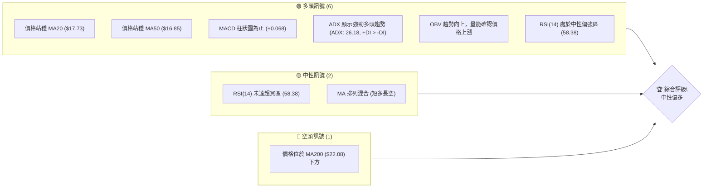

### 📊 核心指標速覽表

下表列出了SOFI當前關鍵技術指標的數值與初步解讀，提供快速判斷依據。

| 指標類別 | 指標名稱 | 當前數值 | 訊號 | 解讀 |
|----------|----------|----------|------|------|
| **價格** | 當前價格 | $18.78 | 🟢 | 位於短期與中期均線上方，顯示短期買盤力量 |
| **均線** | MA20 | $17.73 | 🟢 | 價格位於MA20上方，短線趨勢偏多 |
| **均線** | MA50 | $16.85 | 🟢 | 價格位於MA50上方，中線趨勢偏多 |
| **均線** | MA200 | $22.08 | 🔴 | 價格位於MA200下方，長線趨勢仍偏空 |
| **動能** | RSI(14) | 58.38 | 🟡 | 處於中性區間，但偏向上方，動能尚有空間 |
| **動能** | MACD | 0.423 (MACD線) | 🟢 | MACD線高於訊號線 (0.355)，柱狀圖為正，動能看多 |
| **波動** | ATR(14) | $0.94 | 🟡 | 每日波動約5.03%，波動適中，適合短線操作 |

### 🏆 技術評分卡

本評分卡從多個維度量化SOFI的技術面表現，提供整體強弱的綜合判斷。

```
╔══════════════════════════════════════════════════════════════╗
║              技術評分卡 — SOFI (2026-07-11)                   ║
╠══════════════════════════════════════════════════════════════╣
║ 趨勢強度      ██████████████░░░░░░  70/100  🟢              ║
║ 動能指標      ████████████░░░░░░░░  65/100  🟢              ║
║ 支撐穩定度    ██████████████░░░░░░  70/100  🟢              ║
║ 成交量配合    ██████████░░░░░░░░░░  60/100  🟢              ║
║ 形態完整度    ████████░░░░░░░░░░░░  40/100  🟡              ║
║ 均線排列      ████████░░░░░░░░░░░░  45/100  🟡              ║
╠══════════════════════════════════════════════════════════════╣
║ 綜合評分      ██████████░░░░░░░░░░  60/100  中性偏多          ║
╚══════════════════════════════════════════════════════════════╝
```
**評分理由：**
*   **趨勢強度 (70/100)**：ADX(14)為26.18，顯示趨勢強勁，且+DI顯著高於-DI，確認多頭主導。此為強烈多頭訊號。
*   **動能指標 (65/100)**：RSI(14)為58.38，處於中性偏強區。MACD柱狀圖為正，且MACD線位於訊號線上方，顯示動能良好。Stoch %K/%D也處於上升趨勢。
*   **支撐穩定度 (70/100)**：當前價格$18.78位於多個短期均線上方，且接近斐波那契78.6%回調位$18.73，此價位具有一定支撐力。下方關鍵支撐$16.67 (S1) 距離較遠，緩衝空間充足。
*   **成交量配合 (60/100)**：最新成交量91.49M高於20日均量84.65M和50日均量79.14M，量比1.08x，顯示價格上漲伴隨量能放大，OBV趨勢向上，量價配合良好。
*   **形態完整度 (40/100)**：目前圖表上未出現明顯且高信心度的經典反轉或延續形態，多為指標型走勢。
*   **均線排列 (45/100)**：短線MA5/10/20/50呈現多頭排列，但MA200位於現價上方，長線趨勢仍受壓制，整體排列混合，故評分中性。

綜合來看，SOFI在短期和中期表現出較強的多頭動能和趨勢強度，但長期趨勢仍面臨壓力。綜合評分為60/100，判斷為**中性偏多**。

---

## 2. 趨勢分析

### 🌐 多時框趨勢分析

多時框分析揭示了SOFI在不同時間尺度上的趨勢動態。當前SOFI處於一個長期下跌後的反彈階段，短期和中期動能偏強，但長期趨勢仍未反轉。

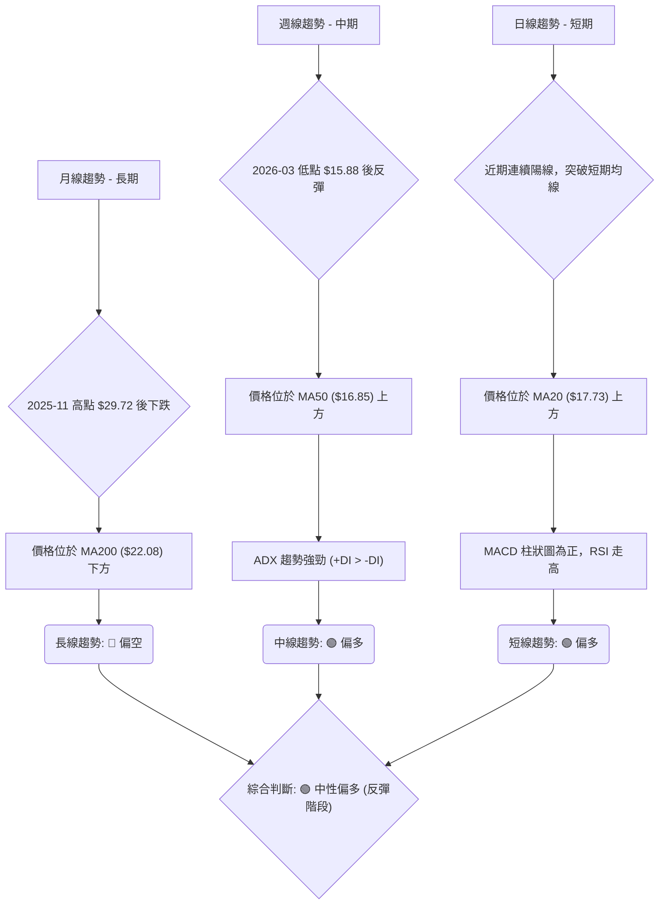

### 📈 長期趨勢 — 12個月走勢圖（Unicode）

SOFI在過去12個月經歷了一個從高點回落再築底反彈的過程。2025年11月達到高點$29.72後，股價進入了顯著的調整期，直至2026年3月觸及$15.88的低點。隨後，市場開始築底反彈，目前價格$18.78，雖然脫離了低谷，但距離前期高點仍有較大差距。

```
SOFI 月線走勢圖（過去12個月）
價格軸 ($)
$30.00 ┤              ●(2025-11 $29.72)
$25.00 ┤        ●
$20.00 ┤●────────────────────●←現在(2026-07 $18.78)
$15.00 ┤    ●(2026-03 $15.88)
     └────────────────────────────
      25-07 25-09 25-11 26-01 26-03 26-05 26-07
```

**走勢特徵分析表格**：

| 階段 | 時間區間 | 價格範圍 | 漲跌幅 | 特徵描述 | 訊號 |
|------|----------|----------|--------|----------|------|
| **強勢上漲** | 2025-07 至 2025-11 | $22.58 → $29.72 | +31.62% | 股價連續上攻，創下階段性高點，多頭強勢。 | 🟢 |
| **深度回調** | 2025-12 至 2026-03 | $29.72 → $15.88 | -46.63% | 股價經歷大幅度下跌，跌破多條均線，空頭主導。 | 🔴 |
| **築底反彈** | 2026-04 至 2026-07 | $15.88 → $18.78 | +18.26% | 股價企穩並開始逐步反彈，形成底部結構，短期動能恢復。 | 🟢 |

### 📊 中期趨勢（週線分析）

SOFI的週線圖顯示，自2026年3月的低點$15.88以來，股價呈現震盪上行格局。儘管期間經歷了多次回調，但每次低點都未跌破前低，顯示出一定的韌性。目前股價位於週線MA20和MA50上方，暗示中期趨勢已轉為偏多。

```
SOFI 近期壓力與支撐示意圖 (週線)
價格軸 ($)
$20.00 ┤             R1 ($20.13)
       │            /
$19.00 ┤           /
       │         /
$18.00 ┤ ●───────● 現價 ($18.78)
       │        / \
$17.00 ┤       /   \ S1 ($16.67)
       │      /     \
$16.00 ┤ ●─────S2 ($15.58)
       │
     └────────────────────────────
      近期走勢示意
```
*   **中期支撐**：週線級別的關鍵支撐位於$16.67 (S1)，此為近期反彈的低點之一，具有較強的支撐作用。更下方則是$15.58 (S2)。
*   **中期阻力**：上方首要阻力是$20.13 (R1)，這是近期反彈的高點，也是突破後將面臨的考驗。若能突破，則有望向上挑戰$22.74 (R2)。

### ⚡ 趨勢強度評估（ADX 解讀）

ADX指標用於衡量趨勢的強度，而非方向。當ADX值高於25時，通常認為趨勢強勁；低於20則表示趨勢不明顯或處於盤整。同時，+DI和-DI的相對位置則指示趨勢方向。

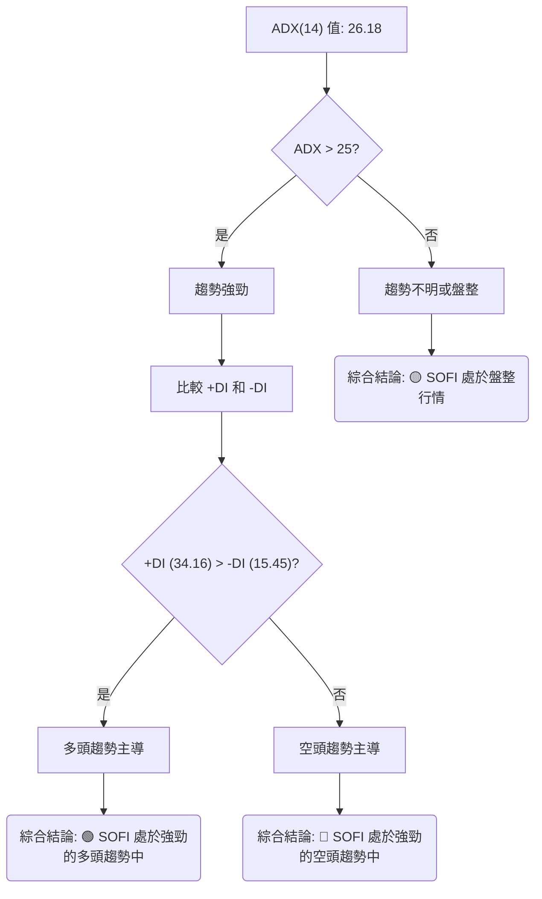

**ADX 強度對照表：**

| ADX 數值 | 趨勢強度 | 當前 SOFI 狀態 |
|----------|----------|----------------|
| 0-20     | 無趨勢或弱趨勢 |                |
| 20-25    | 趨勢形成或發展中 |                |
| 25-50    | 強勁趨勢 | ✅ **強勁趨勢** |
| 50-75    | 非常強勁趨勢 |                |
| 75-100   | 極端強勁趨勢 |                |

**解讀：**
SOFI的ADX(14)數值為26.18，這顯著高於25，明確指出當前市場存在一個強勁的趨勢。同時，+DI為34.16，遠高於-DI的15.45，這表明當前的強勁趨勢是由多頭力量主導的。因此，SOFI目前正處於一個強勁的上升趨勢中，而非盤整行情。這為多頭操作提供了有利的環境，交易者應順應趨勢方向。

---

## 3. 圖表形態分析

### 🔍 形態識別系統

在當前SOFI的圖表上，並未偵測到具有高信心度的經典複雜圖表形態（如頭肩頂/底、雙頂/底、旗形等）。這可能是由於股價經歷了一段時間的震盪築底與反彈，尚未形成清晰且可識別的幾何結構。因此，本章節將主要側重於K線組合與價格行為的分析，而非基於複雜形態的預測。

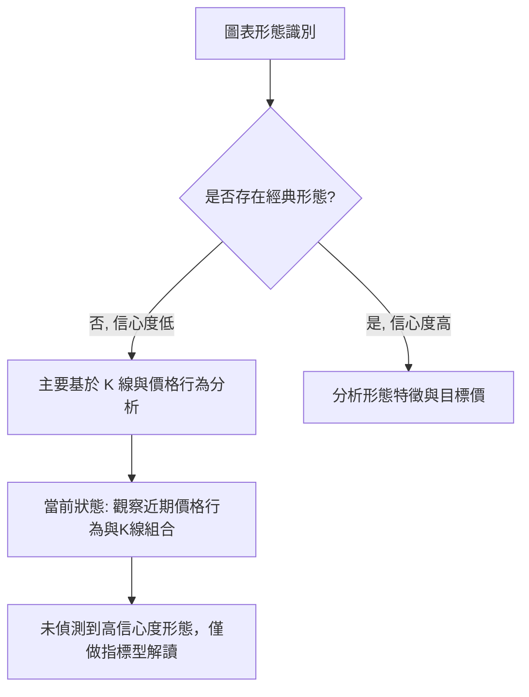

**形態信心度表格**：

| 形態 | 信心度 | 判斷依據（引用數據） | 完成度 | 目標價（附計算式） |
|------|--------|----------------------|--------|--------------------|
| **雙底形態** | 40% | 2026-03 低點 ($15.88) 與 2026-05 低點 ($15.61) 形成潛在底部區間。但兩個低點之間的反彈高度不足以形成清晰的頸線，且第二個低點略低於第一個，形態不完美。 | 50% | 訊號不足，僅做指標型解讀。若未來突破 $19.43 (4月高點)，則形態信心度提升。 |
| **上升旗形** | 30% | 自5月底$15.62反彈至當前$18.78，形成一波上漲，但隨後調整模式不夠清晰形成旗面。 | 30% | 訊號不足，僅做指標型解讀。 |

**結論**：由於缺乏高信心度的幾何形態，我們將避免基於不確定形態進行目標價推算。當前的走勢更傾向於一個從底部反彈的趨勢延續，而非特定的反轉或延續形態。

### 🕯️ 重要K線形態分析

儘管缺乏大型圖表形態，但近期週線K線組合仍提供了一些市場情緒的線索。

| 日期 | 收盤價 | K線形態 | 解讀 | 訊號 |
|------|--------|---------|------|------|
| 2026-03-29 | $15.23 | 長陰線 | 股價跌破關鍵支撐，市場恐慌性拋售，空頭力量強勁。 | 🔴 |
| 2026-04-05 | $15.85 | 帶長下影線的陽線 | 在低位獲得買盤支撐，顯示空頭力量減弱，多頭開始嘗試反攻。 | 🟢 |
| 2026-04-19 | $19.43 | 大陽線 | 股價強勢拉升，突破多條均線，買盤積極，短線動能強勁。 | 🟢 |
| 2026-05-03 | $16.43 | 長陰線 | 突破上漲後遭遇獲利回吐，空頭短暫反撲，但未跌破前期低點。 | 🔴 |
| 2026-05-31 | $18.22 | 大陽線 | 股價再度強勢上漲，確認底部支撐有效，開啟新一輪反彈。 | 🟢 |
| 2026-07-12 | $18.78 | 中陽線 | 延續近期上漲趨勢，買盤持續，但上方壓力漸顯。 | 🟢 |

### 📉 ASCII 走勢形態示意圖

由於缺乏高信心度的經典形態，以下繪製的是近期價格反彈的示意圖，標註關鍵轉折點。

```
SOFI 近期反彈走勢示意圖
價格軸 ($)
$20.00 ┤              ▲ (4/19 高點 $19.43)
       │             /
$18.00 ┤            /
       │           /
       │          /
$16.00 ┤───▼───────▲ (5/31 反彈 $18.22)
       │  (3/29 低點 $15.23)
$14.00 ┤
     └────────────────────────────
      2026-03   2026-04   2026-05   2026-06   2026-07
```
**解讀**：從3月底的低點$15.23開始，SOFI經歷了一波強勁的反彈至4月中旬的$19.43，隨後在5月初回調至$15.61附近，形成了潛在的更高低點。5月底至今，股價再次啟動反彈，目前已回到$18.78，顯示出底部支撐的有效性以及多頭力量的逐步積聚。這種走勢更像是一個W型底部的右側上升，但由於中間的調整幅度較大，且缺乏明確的頸線突破，故未給予高信心度的雙底形態評級。

### 🎯 形態目標價計算

由於缺乏高信心度的圖表形態，我們將不基於特定形態計算目標價。目前的目標價將主要參考斐波那契回調位與關鍵阻力位。

---

## 4. 支撐與阻力

### 🗺️ 關鍵價位分布圖（Unicode）

SOFI的價格目前介於斐波那契78.6%回調位與第一道阻力位R1之間，下方支撐相對穩固，但上方阻力亦不容小覷。

```
SOFI 價位結構分布圖
═══════════════════════════════════════════════════
$32.73 ║████████████████████████║ 52W 高點
$25.11 ║████████████████████████║ 強阻力 R3
$22.74 ║████████████████████    ║ 阻力 R2 (接近 MA200 $22.08)
$20.13 ║████████████████████████║ 關鍵阻力 R1
$18.99 ║▓▓▓▓▓▓▓▓▓▓▓▓▓▓▓▓▓▓▓▓▓▓▓▓║ 布林上軌
$18.78 ╠════════════════════════╣ ◄ 現價
$18.73 ║▓▓▓▓▓▓▓▓▓▓▓▓▓▓▓▓▓▓▓▓▓▓▓▓║ 斐波那契 78.6%
$17.73 ║▓▓▓▓▓▓▓▓▓▓▓▓▓▓▓▓        ║ 布林中軌 / MA20
$16.67 ║████████████████████████║ 近期支撐 S1
$16.47 ║▓▓▓▓▓▓▓▓▓▓▓▓▓▓▓▓        ║ 布林下軌
$15.58 ║████████████████████████║ 強支撐 S2
$14.93 ║████████████████████████║ 強支撐 S3 (接近 52W 低點 $14.92)
═══════════════════════════════════════════════════
```

### 🚧 阻力位分析表

SOFI上行面臨多重阻力，特別是長期均線MA200與斐波那契回調位形成的壓力區。

| 阻力級別 | 價位 | 形成原因 | 突破難度 | 重要性 |
|----------|------|----------|----------|--------|
| **R1**   | $20.13 | 近期波段高點聚類，且接近布林上軌$18.99。 | 中等 | 🟢 突破此位將確認短線強勢反彈。 |
| **R2**   | $22.74 | 歷史交易密集區，同時接近MA200 ($22.08)。 | 高 | 🟡 突破此位意味著長期下跌趨勢可能暫緩。 |
| **R3**   | $25.11 | 較強的歷史阻力位，曾是重要的支撐轉阻力點。 | 高 | 🔴 突破此位才能改變中期下跌格局。 |

### 🛡️ 支撐位分析表

SOFI下方支撐相對穩固，特別是斐波那契回調位與長期低點提供了強勁的防線。

| 支撐級別 | 價位 | 形成原因 | 守住機率 | 重要性 |
|----------|------|----------|----------|--------|
| **S1**   | $16.67 | 近期波段低點聚類，且接近布林下軌$16.47。 | 高 | 🟢 短線多頭防守關鍵。 |
| **S2**   | $15.58 | 歷史交易密集區，多次測試並形成反彈。 | 較高 | 🟢 中線多頭防守關鍵。 |
| **S3**   | $14.93 | 接近52週低點$14.92，是長期趨勢的最低點。 | 極高 | 🔴 跌破此位將確認長期弱勢。 |

### 📐 斐波那契回調位分析

SOFI的斐波那契回調位是基於過去52週 ($14.92 至 $32.73) 的高低點計算。當前價格$18.78位於78.6%回調位$18.73附近，這是一個極其關鍵的技術位置。

| 斐波那契級別 | 價位 | 解讀 |
|--------------|------|------|
| 0.0% (52W High) | $32.73 | 上方強勁阻力 |
| 23.6%        | $28.53 | 上方阻力 |
| 38.2%        | $25.93 | 上方阻力 |
| 50.0%        | $23.82 | 上方阻力 |
| 61.8%        | $21.72 | 上方阻力 (接近MA200) |
| **78.6%**    | **$18.73** | **關鍵支撐/阻力轉換位，現價 ($18.78) 正在此位上方測試。若能站穩，則反彈有望持續；若跌破，則可能回測低位。** |
| 100.0% (52W Low) | $14.92 | 下方強勁支撐 |

**現價$18.78略高於斐波那契78.6%回調位$18.73**。這意味著SOFI從52週高點回落後，在接近底部反彈的78.6%位置遇到了強勁的買盤支撐。成功站穩此位，是多頭反彈的初步勝利，暗示股價有望挑戰更高的斐波那契回調位，例如61.8%的$21.72，該價位也接近長期均線MA200。然而，若無法有效站穩並跌破$18.73，則可能引發進一步回調至$16.67 (S1) 甚至更低。

---

## 5. 技術指標深度解讀

### 🎛️ 指標訊號總覽

本圖展示了各主要技術指標當前發出的訊號及其相互關係，幫助形成全面的市場判斷。

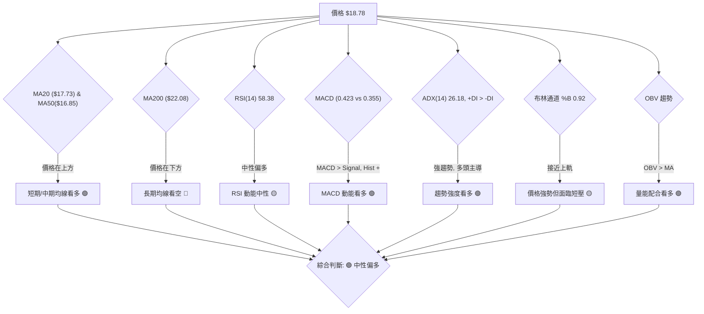

### 📈 移動平均線排列分析

SOFI的均線系統呈現短期多頭排列，但長期均線仍構成上方壓力，顯示出市場的多空分歧。

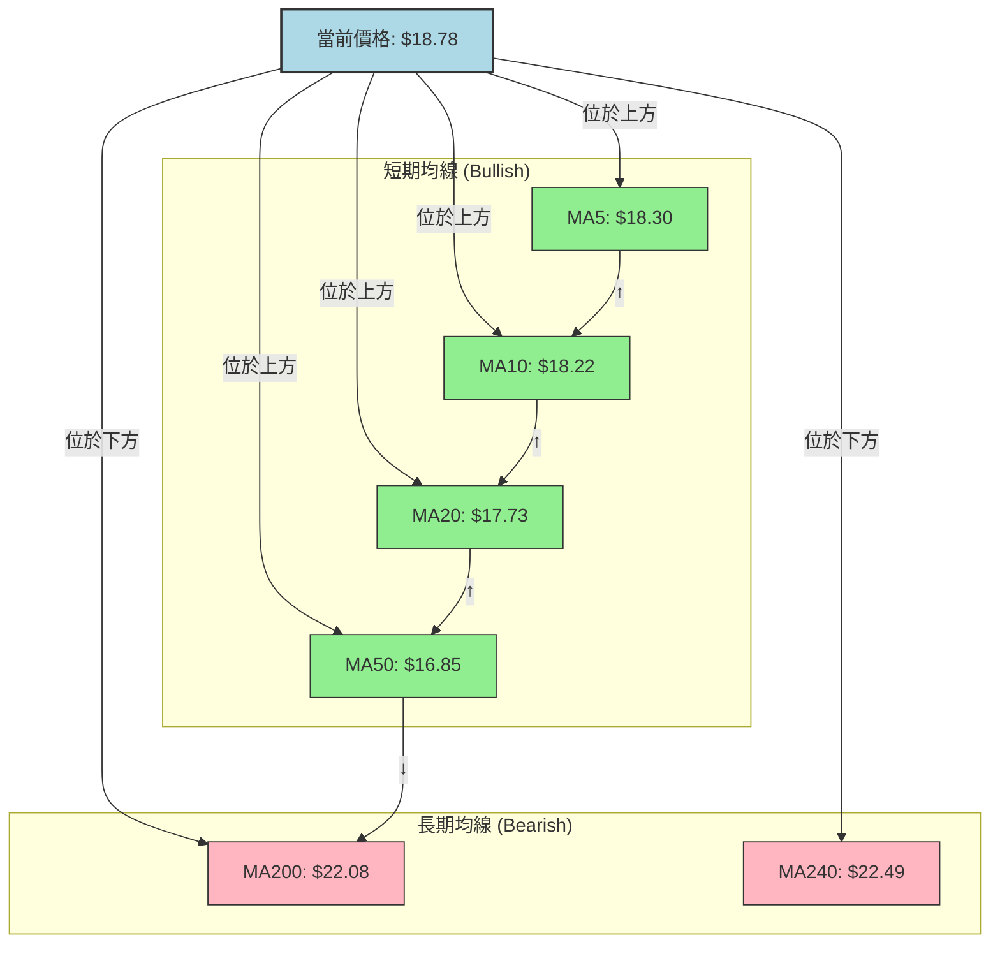

**均線排列狀態：**
*   **短期趨勢 (MA5, MA10, MA20)**：當前價格$18.78顯著高於MA5 ($18.30)、MA10 ($18.22) 和MA20 ($17.73)，且短期均線呈多頭排列並向上發散。這表明短線買盤強勁，趨勢向上。
*   **中期趨勢 (MA50)**：價格也高於MA50 ($16.85)，確認中期趨勢偏多。
*   **長期趨勢 (MA200)**：然而，價格仍位於MA200 ($22.08) 和MA240 ($22.49) 下方，且MA200仍向下傾斜。這指示著SOFI的長期趨勢仍處於空頭格局，當前上漲更像是對長期下跌趨勢的反彈。
*   **綜合解讀**：均線系統顯示短中期多頭動能強勁，但長期壓力仍存。MA200是未來反彈的重要阻力位。

### 📉 RSI(14) 分析

RSI(14)衡量股價變動的相對強弱，數值介於0-100。通常70以上視為超買，30以下視為超賣。

**RSI 數值進度條：**
```
RSI(14) 強度: ▓▓▓▓▓▓▓▓▓▓▓▓░░░░░░░░  58.38 (中性偏強)
```

**分析：**
*   **RSI 數值**：SOFI的RSI(14)當前為58.38，位於中性區間（30-70），但已接近超買區。這表明股價仍有上漲動能，尚未進入過熱狀態，為進一步上漲留有空間。
*   **超買超賣區間**：RSI未達70，因此目前不存在超買風險。這為多頭提供了緩衝。若RSI持續上漲並突破70，則需警惕短期回調風險。
*   **RSI 背離**：根據提供的數據，**未偵測到明顯的RSI頂背離或底背離訊號**。價格近期上漲，RSI也隨之上升，兩者保持同步，量能確認價格走勢。這表明當前動能是健康的，沒有隱藏的趨勢反轉風險。

### 📊 MACD(12/26/9) 訊號解讀

MACD指標由快線(DIF)、慢線(DEA)和柱狀圖(MACD Histogram)組成，用於判斷趨勢方向和動能變化。

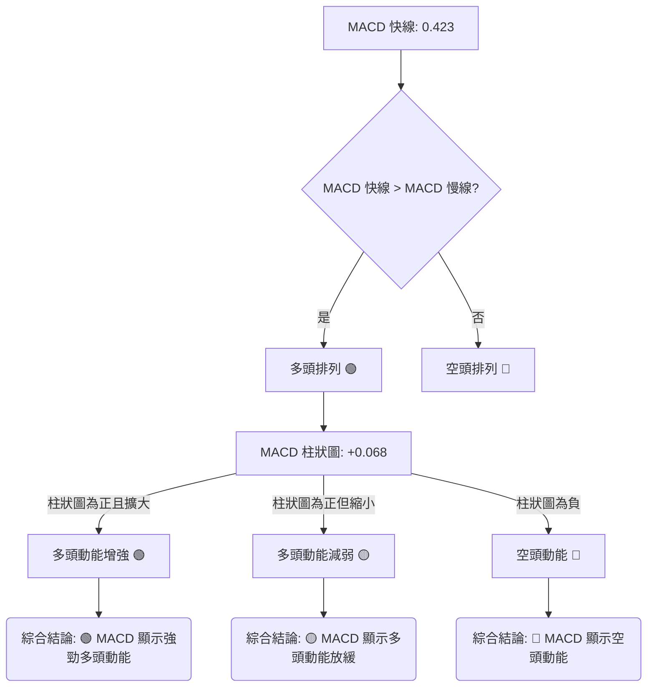

**分析：**
*   **MACD 線與訊號線**：MACD線 ($0.423) 位於訊號線 ($0.355) 上方，形成黃金交叉後的延續，這是明確的多頭訊號。
*   **MACD 柱狀圖**：MACD柱狀圖為正值 (+0.068)，並且在近期有擴大的趨勢（從上週的+0.114略有回落，但仍為正），這表明多頭動能持續存在。
*   **MACD 背離**：根據提供的數據，**未偵測到明顯的MACD頂背離或底背離訊號**。價格上漲與MACD指標同步，顯示當前上升趨勢的健康性。

### 📦 布林通道分析

布林通道由中軌(MA20)、上軌和下軌組成，用於衡量股價的波動範圍和相對位置。

```
SOFI 布林通道示意圖
價格軸 ($)
$18.99 ┤───────────────────────▲ 布林上軌 (BB上軌)
       │                      /
$18.78 ┤─────────● 現價
       │                    /
$17.73 ┤───────────────────▲ 布林中軌 (MA20)
       │                  /
$16.47 ┤─────────────────▲ 布林下軌 (BB下軌)
     └────────────────────────────
      時間軸
```

**分析：**
*   **布林通道帶寬**：當前布林通道的帶寬適中，ATR為$0.94，佔股價的5.03%，表明市場波動性處於正常水平，非極端擴張或收縮。
*   **價格相對位置**：SOFI當前價格$18.78非常接近布林上軌 ($18.99)。布林通道 %B 值為0.92，表示價格位於布林通道的極高位。這通常意味著股價處於強勢區間，但同時也暗示短期內可能面臨上軌的壓力，或有回調需求。
*   **布林中軌**：布林中軌即MA20，位於$17.73。當前價格遠高於中軌，進一步確認短線多頭趨勢。中軌將是短期回調的重要支撐。
*   **布林下軌**：布林下軌位於$16.47。若股價跌破中軌，下軌將提供更強的支撐。

**綜合解讀**：SOFI股價運行在布林通道上半區，並靠近上軌，顯示短期強勢。但需留意上軌可能帶來的短期壓力，若能有效突破上軌並站穩，則上升趨勢有望加速；若受阻回落，則可能向中軌靠攏尋求支撐。

### 💹 成交量分析（量價配合度）

成交量是價格走勢的燃料。量價配合度分析可以驗證價格趨勢的可靠性。

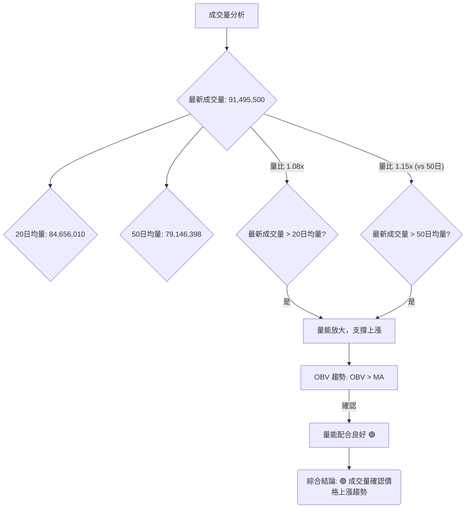

**分析：**
*   **最新成交量與均量比較**：SOFI的最新成交量 (91,495,500) 顯著高於20日均量 (84,656,010) 和50日均量 (79,146,398)。量比 (Volume Ratio) 分別為1.08x和1.15x。這表明在當前價格上漲的過程中，有更多的資金入場，買盤積極。
*   **量價配合**：當價格上漲時，成交量也隨之放大，這是一個典型的量價配合良好、健康的多頭趨勢訊號。它增加了當前上漲趨勢的可靠性。
*   **OBV 趨勢**：OBV (On-Balance Volume) 趨勢顯示OBV線位於其移動平均線上方，這進一步確認了量能正在支持價格的上漲。OBV的上升表明累積買盤壓力大於賣盤壓力，強化了多頭訊號。

**綜合解讀**：當前SOFI的成交量表現出健康的量價配合，量能放大支持股價上漲，OBV指標也確認了這一點。這為當前的多頭動能提供了堅實的基礎。

---

## 6. 動能與波動率

### ⚡ 動能評估四象限

動能評估四象限分析，將股票的動能強度與波動率結合，以評估其當前市場狀態及潛在交易機會。SOFI目前處於動能強勁但波動適中的狀態。

| 象限 | 動能 (RSI, MACD) | 波動 (ATR) | 當前狀態 (SOFI) | 評估 |
|------|------------------|------------|-----------------|------|
| Q1 | 強 (RSI 58.38, MACD+) | 低 (ATR 5%) | -               | 最佳機會 (動能強，波動低，入場風險小) |
| Q2 | 弱                   | 低         | -               | 謹慎觀望 (缺乏動能，等待趨勢形成) |
| Q3 | 強 (RSI 58.38, MACD+) | 高 (ATR 5%) | ✓               | 高風險高收益 (動能強，波動大，需嚴格止損) |
| Q4 | 弱                   | 高         | -               | 避免進場 (缺乏動能，波動大，不確定性高) |

**SOFI 當前評估**：
SOFI的RSI為58.38，MACD柱狀圖為正，ADX顯示強勁趨勢，這些都表明其動能是「強勁」的。其ATR為$0.94，佔股價的5.03%，這屬於「適中」或「中等偏高」的波動率，而非極低。因此，SOFI目前位於**Q3 (強動能, 高波動)** 和 **Q1 (強動能, 低波動)** 的中間偏Q3，綜合判斷為**動能強勁，波動適中偏高**。這意味著SOFI存在較好的交易機會，但由於波動性不低，需要嚴格的風險管理和止損策略。

### 📊 ATR 波動率分析

ATR (Average True Range) 衡量資產價格在特定時間段內的波動幅度，常用於設定止損和止盈。

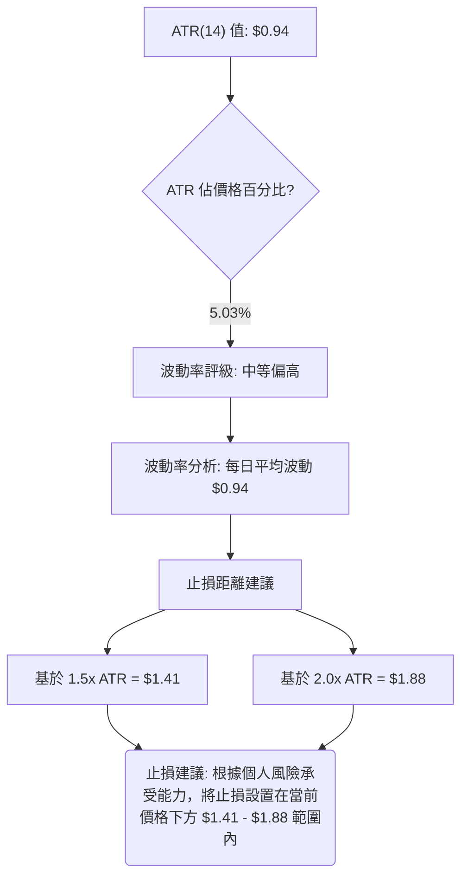

**分析：**
*   **ATR 數值**：SOFI的ATR(14)為$0.94。這表示在過去14個交易日中，SOFI平均每天的價格波動範圍約為$0.94。
*   **波動率百分比**：ATR佔當前價格($18.78)的比例為5.03%。相較於一般藍籌股，這是一個中等偏高的波動率。對於短線交易者而言，這提供了足夠的日內交易機會，但同時也增加了風險。
*   **止損距離建議**：基於ATR設定止損是一種常見且有效的方法。
    *   保守止損：1.5倍ATR = 1.5 * $0.94 = $1.41。若進場，止損點可設在進場價下方約$1.41。
    *   激進止損：2倍ATR = 2 * $0.94 = $1.88。若進場，止損點可設在進場價下方約$1.88。
    *   例如，若在現價$18.78進場，保守止損點約為$18.78 - $1.41 = $17.37，激進止損點約為$18.78 - $1.88 = $16.90。這些止損點應與關鍵支撐位結合考慮。

### 📐 Beta 與市場相關性

Beta值衡量個股相對於大盤（通常是S&P 500）的波動性。

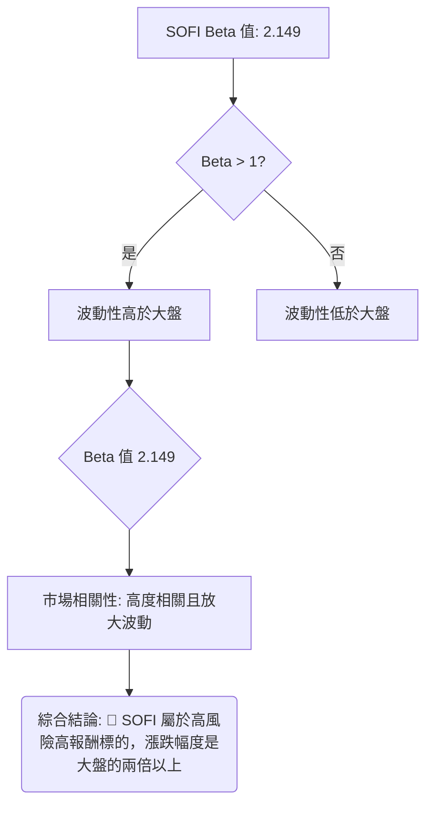

**分析：**
*   **Beta 數值**：SOFI的Beta值為2.149。
*   **市場相關性**：Beta值大於1，且顯著高於2，這表明SOFI的股價波動性遠高於大盤。當大盤上漲1%時，SOFI理論上會上漲2.149%；反之，當大盤下跌1%時，SOFI也會下跌2.149%。
*   **風險評估**：高Beta值意味著高風險和高潛在報酬。SOFI的投資者需要有較高的風險承受能力，並密切關注大盤走勢，因為大盤的任何變動都會對SOFI產生放大效應。在市場情緒樂觀時，高Beta股可能帶來超額收益；但在市場恐慌時，其跌幅也可能遠超大盤。

---

## 7. 多時框架總結

### 📋 時框架評分表

本表綜合評估SOFI在不同時間框架下的技術表現，並給出相應的交易建議。

| 時框架 | 趨勢方向 | 動能 | 均線排列 | 形態 | 綜合評分 | 建議 |
|--------|----------|------|----------|------|----------|------|
| **長期 (月線)** | 🔴 偏空 | 🟡 中性 | 🔴 空頭排列 | 🟡 築底中 | 40/100 | 謹慎觀望，等待長期趨勢反轉訊號 |
| **中期 (週線)** | 🟢 偏多 | 🟢 偏強 | 🟢 多頭排列 | 🟡 震盪反彈 | 70/100 | 順勢逢低做多，目標上方阻力 |
| **短期 (日線)** | 🟢 偏多 | 🟢 強勁 | 🟢 強勢多頭 | 🟡 反彈延續 | 80/100 | 積極做多，注意短線壓力 |

### 🔲 綜合訊號矩陣

此矩陣分析短期、中期、長期訊號的一致性，以判斷當前市場是否形成共識。

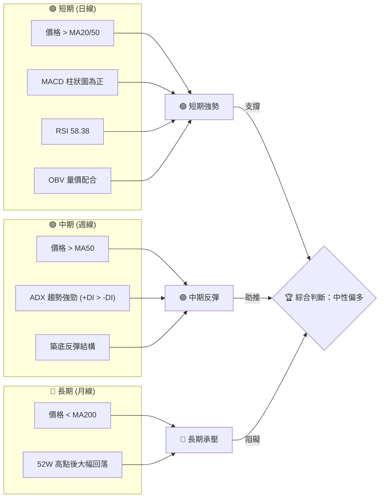

**一致性分析：**
*   **短期與中期訊號高度一致**：日線和週線級別均呈現明顯的多頭趨勢，價格位於短期和中期均線上方，動能指標強勁，成交量配合良好。這表明SOFI在較短的時間框架內具有強勁的上升動能。
*   **長期訊號與短中期訊號矛盾**：儘管短中期表現強勁，但長期來看，價格仍位於MA200下方，且距離52週高點有較大差距，顯示長期趨勢仍處於空頭格局。這意味著當前的上漲更可能是一個長期下跌趨勢中的反彈。

### ⚖️ 多時框收斂結論

根據「嚴格要求 14」的多時框收斂規則：
1.  **趨勢行情判斷**：ADX(14)為26.18，顯著高於25，表明SOFI目前處於**強勁的趨勢行情**。
2.  **主導時框**：在趨勢行情下，應以中長期（週線/MA50、MA200）方向為主。
    *   MA200 ($22.08) 仍高於當前價格 ($18.78)，指示長期趨勢偏空。
    *   MA50 ($16.85) 低於當前價格，指示中期趨勢偏多。
    *   這是一個「長期空頭中的中期反彈」的複雜情況。

**最終結論**：
儘管短期和中期動能強勁，且ADX確認當前為強勁的多頭趨勢，但MA200的長期壓制作用不容忽視。因此，SOFI的整體方向性結論為：**中性偏多**。這意味著當前是一個值得參與的反彈行情，但應將MA200 ($22.08) 及其附近的阻力位 ($22.74) 視為重要的潛在壓力區，而非預期股價能直接突破並開啟長期牛市。日線級別的強勁動能可用於尋找精確的進場時機，但整體策略應以「**在長期壓力下，把握中短期反彈機會**」為核心。

---

## 8. 交易策略建議

### 🗺️ 策略決策流程圖

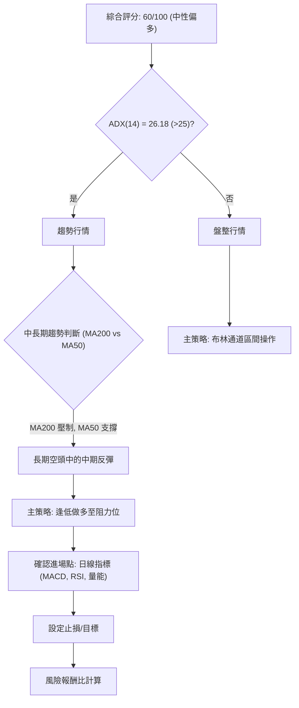

### 🧭 策略路由（依評分卡分流）

**當前主策略方向 = 中性偏多 (依評分 60/100)**

由於綜合評分顯示SOFI為中性偏多，且ADX確認為強勁趨勢行情，主策略將側重於把握當前反彈動能，以**逢低做多至關鍵阻力位**為主。空頭策略將作為反轉風險的觸發點進行提示。

### 🎯 價格情境階梯（Price Scenarios）

下表展示SOFI在不同價格情境下的潛在走勢，所有價位均來自「關鍵價位」區塊。

| 觸發條件 | 下一目標 | 後續延伸 | 情境含義 |
|----------|----------|----------|----------|
| **突破 R1 $20.13** | R2 $22.74 | R3 $25.11 | **短線轉強，反彈加速**。突破此位將打開更大的上漲空間，可能挑戰MA200 ($22.08) 附近的強阻力。 |
| **站穩現價區間 ($18.73 - $20.13)** | — | — | **區間震盪，積蓄動能**。若無法立即突破R1，股價可能在當前斐波那契78.6%支撐與R1之間進行整理。 |
| **跌破 S1 $16.67** | S2 $15.58 | S3 $14.93 | **中期轉弱，反彈結束**。跌破此位將確認反彈動能衰竭，可能重新探測底部支撐。 |

### 📊 情境機率分佈

| 情境 | 機率 | 主要依據 |
|------|------|----------|
| **繼續上行 / 反彈** | 55% | ADX顯示強勁多頭趨勢，+DI遠超-DI。MACD柱狀圖為正，RSI處於中性偏強區。OBV量能確認。價格位於短期MA上方，且站穩斐波那契78.6% ($18.73)。 |
| **區間震盪** | 35% | 股價接近布林上軌 ($18.99) 和R1 ($20.13)，短期可能面臨獲利回吐壓力。長期MA200 ($22.08) 仍是上方巨大阻力。 |
| **回落 / 再探底** | 10% | 若大盤突發利空或SOFI自身基本面惡化，且跌破關鍵支撐S1 ($16.67)，則可能觸發止損盤，導致股價回落。 |

### 🟢 主策略詳情（方向：中性偏多）

基於當前中性偏多的評級和強勁的反彈動能，我們建議以**逢低做多**為主。

| 策略要素 | 策略 A (短線追漲) | 策略 B (回調買入) |
|----------|--------------------|--------------------|
| 進場條件 | 突破 R1 $20.13 並站穩 | 回調至 S1 $16.67 附近，並出現止跌K線 |
| 進場價格 | $20.20 (確認突破R1) | $16.70 (S1上方) |
| 目標價 T1 | $22.74 (R2) | $18.78 (現價/斐波那契78.6%) |
| 目標價 T2 | $25.11 (R3) | $20.13 (R1) |
| 止損價格 | $19.40 (R1下方，約1.5x ATR) | $15.50 (S2下方，約2x ATR) |
| 風險報酬比 | T1: (22.74-20.20)/(20.20-19.40) = 3.17:1 <br> T2: (25.11-20.20)/(20.20-19.40) = 6.14:1 | T1: (18.78-16.70)/(16.70-15.50) = 1.73:1 <br> T2: (20.13-16.70)/(16.70-15.50) = 2.86:1 |
| 成功機率 | 55% | 60% |
| 建議倉位 | 20% | 30% |

**策略解讀：**
*   **策略A (短線追漲)**：適用於激進型交易者，旨在捕捉突破R1後的加速上漲。由於突破R1後上方空間更大，風險報酬比吸引人，但需嚴格止損。
*   **策略B (回調買入)**：適用於穩健型交易者，等待股價回調至強支撐S1附近，以較低的風險介入。此策略的成功機率更高，但潛在報酬相對較低。

### 🔴 反向風險觸發點（對沖提示）

以下情況可能推翻當前的中性偏多策略，交易者應密切監控：
*   **跌破斐波那契78.6%回調位 $18.73 並收盤**：這將是短線動能減弱的初步訊號。
*   **跌破關鍵支撐 S1 $16.67 並伴隨大量**：這將確認反彈結束，可能開啟新一輪下跌，應考慮減倉或清倉。
*   **MACD柱狀圖轉負，且RSI跌破50**：動能指標的同步惡化將強化空頭訊號。
*   **大盤（如SPY）出現大幅度下跌**：由於SOFI的Beta值高達2.149，大盤的負面情緒將被放大。

### ⭐ 整體訊號強度評星

```
做多訊號強度：★★★★☆  (4/5星)  (短中期動能強勁，趨勢明確)
做空訊號強度：★☆☆☆☆  (1/5星)  (目前缺乏做空訊號，但長期壓力仍存)
整體可信度：  ★★★☆☆  (3/5星)  (短中期趨勢清晰，但長期壓力使整體判斷偏中性)
```

---

## 9. 風險提示與監控

### ✅ 關鍵監控指標 Checklist

以下是交易SOFI時需要密切關注的關鍵技術指標清單，以確保及時應對市場變化。

```
╔══════════════════════════════════════════════════════════════╗
║               SOFI 關鍵監控指標清單                            ║
╠══════════════════════════════════════════════════════════════╣
║ [X] 價格是否站穩斐波那契 78.6% ($18.73)？                      ║
║ [X] 價格是否有效突破 R1 ($20.13)？                            ║
║ [X] MA20 ($17.73) 和 MA50 ($16.85) 是否維持多頭排列且向上傾斜？ ║
║ [X] MACD 柱狀圖是否持續為正且未明顯縮小？                      ║
║ [X] RSI(14) 是否維持在 50-70 區間？                           ║
║ [X] ADX(14) 是否維持在 25 以上，且 +DI > -DI？                ║
║ [X] 成交量是否持續配合價格上漲？OBV 是否維持上升趨勢？        ║
║ [X] 股價是否跌破布林中軌 ($17.73)？                           ║
║ [X] 大盤 (如 SPY) 走勢是否穩定？                               ║
╚══════════════════════════════════════════════════════════════╝
```

### ⚠️ 風險場景分析

針對SOFI的未來走勢，我們構建了三種情境，以幫助投資者評估潛在的風險與機會。

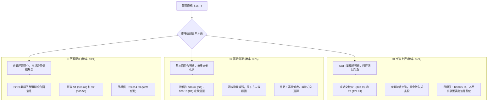

### 🛡️ 風險管理重要提醒

1.  **止損紀律**：鑑於SOFI的高Beta值(2.149)和中等偏高的波動率(ATR 5.03%)，設定並嚴格執行止損至關重要。建議止損點位應結合ATR和關鍵支撐位（如S1 $16.67）來確定。
2.  **倉位管理**：避免單一股票重倉。對於波動性較大的SOFI，建議採用較小的倉位，並根據市場情況和個人風險承受能力逐步調整。
3.  **大盤監控**：SOFI與大盤高度相關。密切關注美股大盤指數（如S&P 500或納斯達克指數）的走勢，一旦大盤出現明顯的下跌訊號，應及時調整SOFI的持倉策略。
4.  **基本面跟蹤**：雖然本報告側重技術分析，但長期來看，公司的基本面（如盈利增長、營收、現金流等）是股價的最終驅動力。應定期關注SOFI的財報和公司新聞，確保技術分析與基本面分析相輔相成。
5.  **不追高殺跌**：在強勁反彈行情中，容易產生追高情緒。應耐心等待股價回調至支撐位或突破關鍵阻力並確認後再進場，避免盲目追漲。

---

## 📋 報告總結

```
╔══════════════════════════════════════════════════════════════╗
║                    SOFI 技術分析報告總結                       ║
╠══════════════════════════════════════════════════════════════╣
║ 報告日期：2026-07-11                                           ║
║ 當前價格：$18.78                                               ║
║ 分析評級：⚖️ 中性偏多 (在長期壓力下的中期反彈)                 ║
╠══════════════════════════════════════════════════════════════╣
║ 關鍵結論：                                                     ║
║ ├─ 長期趨勢：🔴 價格位於 MA200 下方，仍處於長期空頭格局。      ║
║ ├─ 中期趨勢：🟢 價格位於 MA50 上方，ADX顯示強勁多頭趨勢。      ║
║ ├─ 短期趨勢：🟢 價格位於 MA20 上方，MACD、RSI顯示強勁動能。    ║
║ ├─ 關鍵支撐：$16.67 (S1)，斐波那契 78.6% 回調位 $18.73。       ║
║ ├─ 關鍵阻力：$20.13 (R1)，MA200 $22.08，R2 $22.74。             ║
║ └─ 分析師目標：$21.10 (來自基本面共識，與技術阻力 R2 接近)。    ║
╠══════════════════════════════════════════════════════════════╣
║ 最優策略組合：                                                 ║
║ 1. 🥇 最佳機會：等待股價回調至 $16.70 (S1 附近) 逢低買入，止損 $15.50。║
║ 2. 🥈 次選機會：若股價突破並站穩 $20.13 (R1)，在 $20.20 追漲，止損 $19.40。║
║ 3. 🥉 保守選擇：在 $18.73 (斐波那契 78.6% 回調位) 附近觀望，若有效跌破則暫緩操作。║
╚══════════════════════════════════════════════════════════════╝
```

---

> ⚠️ **免責聲明**：本報告為 AI 自動生成之技術分析，所有數據及估算均基於提供的歷史價格資訊。本報告**僅供研究與學術參考**，**不構成任何投資建議**。投資有風險，入市需謹慎。

---

*報告生成時間：2026-07-11 ｜ 數據來源：Yahoo Finance ｜ 分析框架：多時框技術分析*