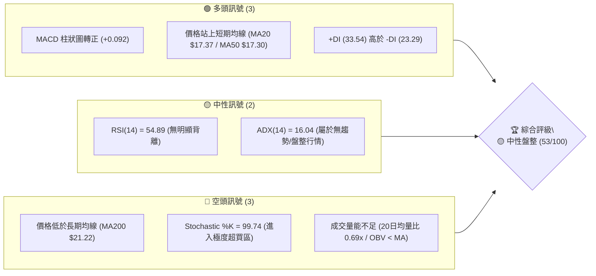
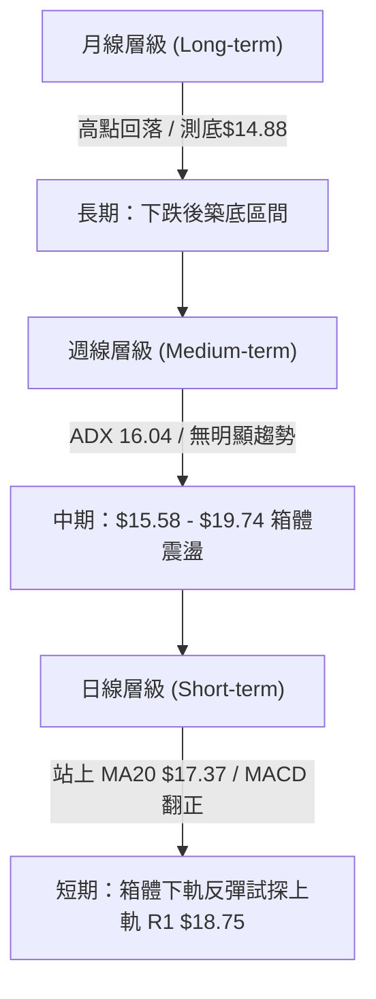
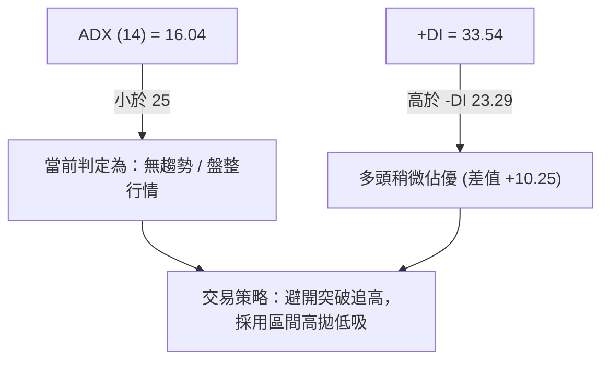
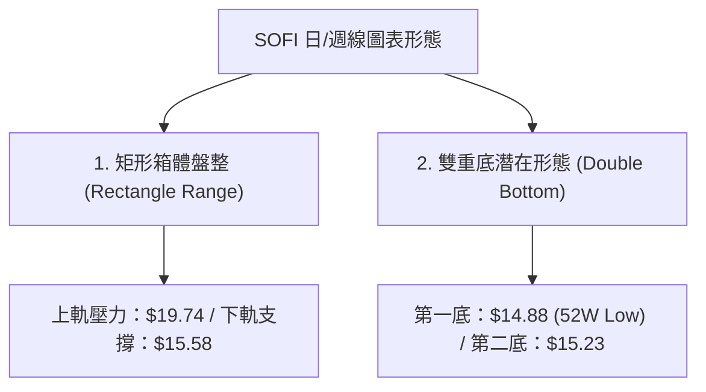
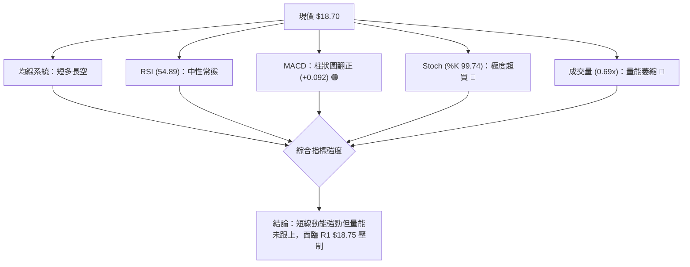
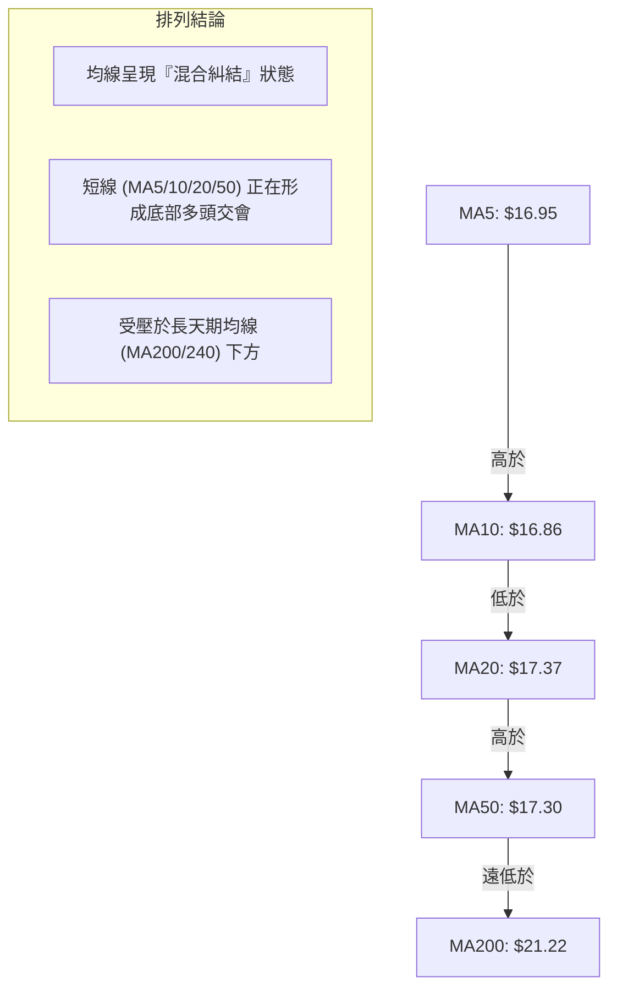
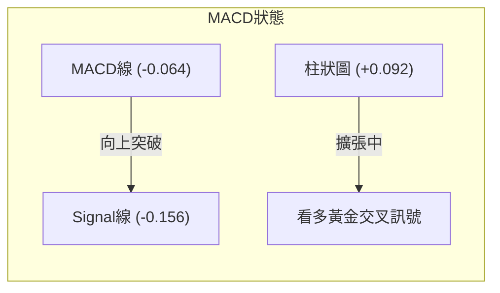
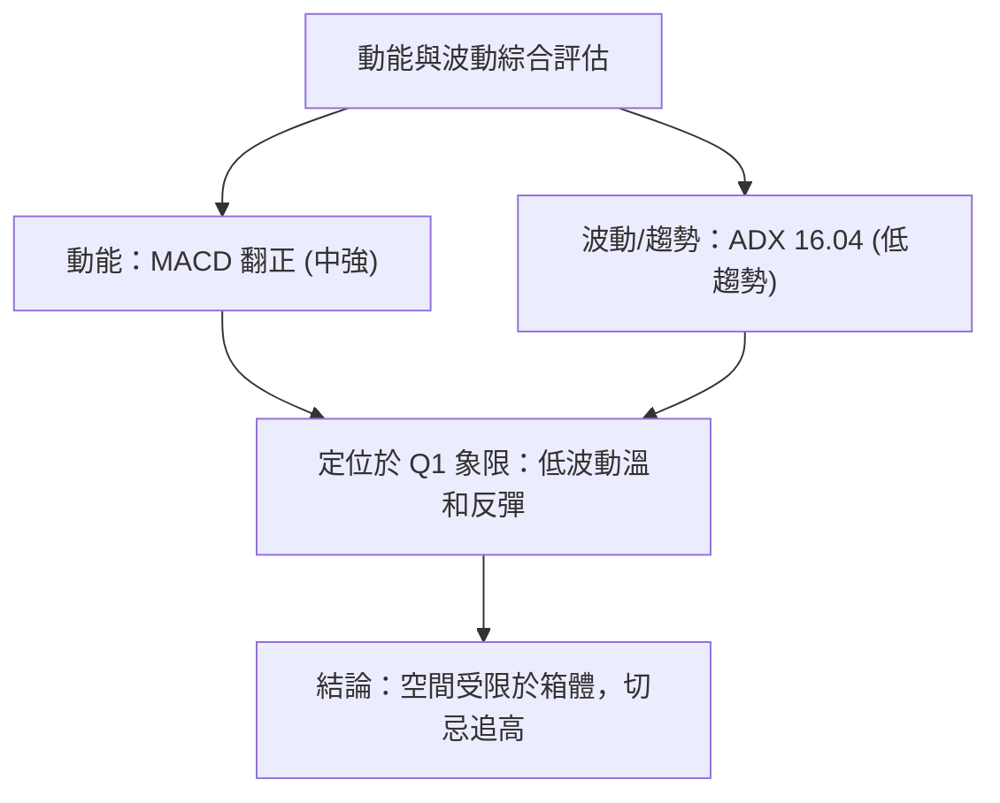
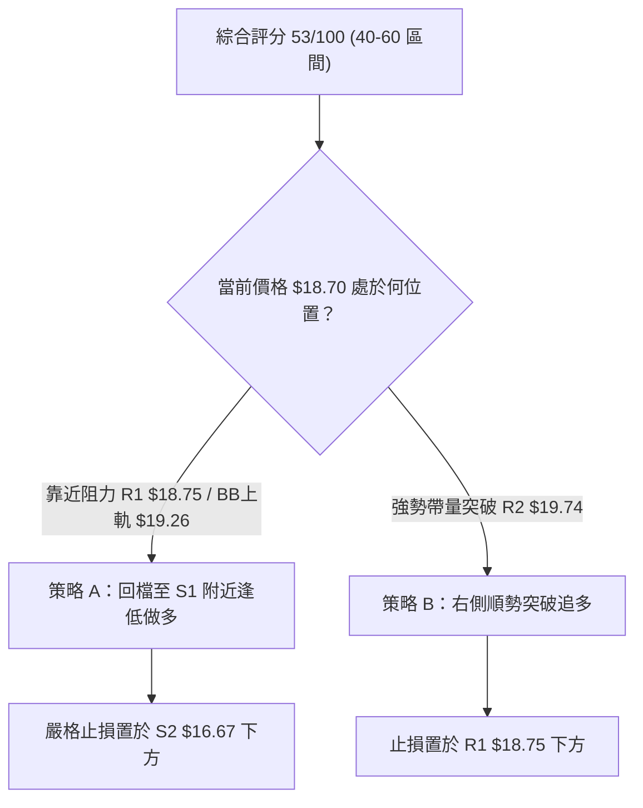
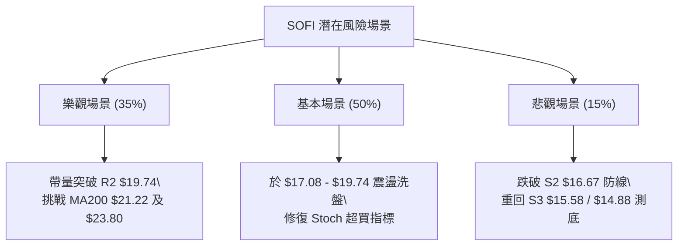

# SOFI 技術分析報告

> **報告日期**：2026-08-04 ｜ **語言**：繁體中文 ｜ **數據來源**：Yahoo Finance ｜ **當前價格**：$18.70

---

## 目錄

| 章節 | 內容 |
|------|------|
| [1. 技術面概覽](#1-技術面概覽) | 訊號儀表板、核心指標、評分卡 |
| [2. 趨勢分析](#2-趨勢分析) | 多時框趨勢、長中短期走勢 |
| [3. 圖表形態分析](#3-圖表形態分析) | 形態識別、K線組合、目標價 |
| [4. 支撐與阻力](#4-支撐與阻力) | 關鍵價位、斐波那契回調 |
| [5. 技術指標深度解讀](#5-技術指標深度解讀) | MA/RSI/MACD/布林/成交量 |
| [6. 動能與波動率](#6-動能與波動率) | 動能評估、ATR、Beta |
| [7. 多時框架總結](#7-多時框架總結) | 時框架評分矩陣 |
| [8. 交易策略建議](#8-交易策略建議) | 多空策略、風險報酬比 |
| [9. 風險提示與監控](#9-風險提示與監控) | 監控指標、風險場景 |

---

## 1. 技術面概覽

### 🎯 技術訊號儀表板



### 📊 核心指標速覽表

| 指標類別 | 指標名稱 | 當前數值 | 訊號 | 解讀 |
|----------|----------|----------|------|------|
| **價格** | 當前價格 | $18.70 | 🟡 中性 | 位於52週區間 21.4% 位置，處於斐波那契 78.6% 回調位 |
| **均線** | MA20 | $17.37 | 🟢 看多 | 現價位於 MA20 上方 (+7.66%)，短期支撐建立 |
| **均線** | MA50 | $17.30 | 🟢 看多 | 現價位於 MA50 上方 (+8.09%)，中短期黃金交叉 |
| **均線** | MA200 | $21.22 | 🔴 看空 | 現價位於 MA200 下方 (-11.88%)，長期下行趨勢未改 |
| **動能** | RSI(14) | 54.89 | 🟡 中性 | 處於 30-70 中性區間，多空力量暫時均衡 |
| **動能** | MACD | -0.064 / +0.092 | 🟢 看多 | 柱狀圖翻正 (+0.092)，快慢線呈黃金交叉之勢 |
| **動能** | Stoch %K | 99.74 | 🔴 看空 | 隨機指標進入極高超買區，短線隨時有回檔壓力 |
| **波動** | ATR(14) | $0.90 | 🟡 中性 | 日均波幅 4.84%，波動度處於常態範圍 |

### 🏆 技術評分卡

```
╔══════════════════════════════════════════════════════════════╗
║             SOFI 技術評分卡 — (2026-08-04)                   ║
╠══════════════════════════════════════════════════════════════╣
║ 趨勢強度 (ADX)   ████████░░░░░░░░░░░░  40/100  🟡 弱勢盤整    ║
║ 動能指標 (MACD)  ████████████░░░░░░░░  60/100  🟢 短線反彈    ║
║ 支撐穩定度 (S1)  █████████████░░░░░░░  65/100  🟢 底層堅實    ║
║ 成交量配合 (OBV) ████████░░░░░░░░░░░░  40/100  🔴 量能背離    ║
║ 形態完整度       ███████████░░░░░░░░░  55/100  🟡 箱體建構    ║
║ 均線排列 (MA)    ███████████░░░░░░░░░  55/100  🟡 短多長空    ║
╠══════════════════════════════════════════════════════════════╣
║ 綜合評分         ███████████░░░░░░░░░  53/100  🟡 中性觀望    ║
╚══════════════════════════════════════════════════════════════╝
```

---

## 2. 趨勢分析

### 🌐 多時框趨勢分析



### 📈 長期趨勢 — 24個月走勢圖（Unicode）

```
SOFI 月線走勢圖（2024-08 至 2026-08）
價格軸 ($)
$30.00 ┤                               ●──●
$26.00 ┤                            ●  │  │  ●
$22.00 ┤                         ●  │  │  │  │  ●
$18.00 ┤                      ●  │  │  │  │  │  │  ●        ●(現價$18.70)
$14.00 ┤        ●──●       ●  │  │  │  │  │  │  │  │  ●──●──┤
$10.00 ┤  ●──●  │  │  ●─●  │  │  │  │  │  │  │  │  │  │  │  │
$06.00 ┴──┴──┴──┴──┴──┴──┴──┴──┴──┴──┴──┴──┴──┴──┴──┴──┴──┴──┴───
月份   M01 M03 M05 M07 M09 M11 M13 M15 M17 M19 M21 M23 M25
      (2024-08 至 2026-08)
```

**走勢特徵分析表格**：

| 階段 | 時間區間 | 價格變動 | 階段特徵 |
|------|----------|----------|----------|
| **起漲段** | 2024-08 ~ 2024-11 | $7.99 ➔ $16.41 (+105.4%) | 業績扭虧為盈帶動首波強勁估值修復 |
| **高位拉升**| 2025-06 ~ 2025-10 | $18.21 ➔ $29.68 (+62.9%)  | 科技平台業務高速成長，創下52週高點 $32.73 |
| **深度回調**| 2025-11 ~ 2026-03 | $29.72 ➔ $15.88 (-46.6%)  | 利率預期轉變與高 Beta 股估值修正，下探低點 $14.88 |
| **基底打築**| 2026-04 ~ 2026-08 | $16.10 ➔ $18.70 (+16.1%)  | 於 $15.58-$19.74 進行大箱體底層打築與震盪洗盤 |

### 📊 中期趨勢（週線分析）

```
SOFI 近20週價格與均線結構圖
$20.00 ┤             ● (4/19 $19.43)
$19.00 ┤            / \                                     ● (現價 $18.70)
$18.00 ┤           /   \        ● (5/31 $18.22)   ● (7/5 $18.24)/
$17.00 ┤          /     \      / \               / \           /
$16.00 ┤  ●──────●       \    /   ●─────────────●   \         /
$15.00 ┴──┴──────┴────────●──●───────────────────────●───────●───
週別    W01   W03   W05   W07   W09   W11   W13   W15   W17  W20 (2026-08-09)
```

從過去20週的數據可以看出，SOFI 在 $15.23 - $15.61 區域建立了非常堅實的底部（三度下試均成功守住），形成強烈的波段低點支撐聚類。目前週線動能逐漸修復，由 7 月底的低點 $16.31 快速拉升至 $18.70。

### ⚡ 趨勢強度評估（ADX 解讀）



| 指標 | 數值 | 狀態 | 解讀 |
|------|------|------|------|
| **ADX** | 16.04 | 🔴 弱趨勢 | 趨勢強度極低，代表市場處於區間震盪，單邊突破延續性較差 |
| **+DI** | 33.54 | 🟢 看多 | 多頭買盤力道占據主導地位 |
| **-DI** | 23.29 | 🟡 中性 | 空頭賣壓暫時受控，但並未完全退場 |

---

## 3. 圖表形態分析

### 🔍 形態識別系統



#### 形態信心度評估表（依規則 15）：

| 形態名稱 | 信心度 | 判斷依據（引用數據） | 完成度 | 目標價（附計算式） |
|----------|--------|----------------------|--------|--------------------|
| **矩形箱體盤整** | **75%** | 價格多次在 S3 ($15.58) 止跌，並於 R2 ($19.74) 受阻 | 85% | **箱體突破目標**：R2 ($19.74) + 箱體高度 ($19.74 - $15.58 = $4.16) = **$23.90** |
| **雙重底 (潛在)**| **55%** | 兩次波段低點分別為 $14.88 (52W Low) 與 $15.23 (3/29) | 60% | **頸線突破目標**：頸線 $19.43 + 形態高度 ($19.43 - $14.88 = $4.55) = **$23.98** |

### 🕯️ 重要 K 線形態分析

| 日期/週期 | 收盤價 | K線形態 | 解讀 | 訊號 |
|-----------|--------|---------|------|------|
| 2026-07-26 (週) | $16.46 | 長下影陰線 | 下探測試 S2 ($16.67) 支撐力道，多頭逢低承接 | 🟡 止跌訊號 |
| 2026-08-02 (週) | $16.31 | 縮量築底小陰線 | 賣壓耗盡，量能降至 4.83 億，形成回檔末期 | 🟡 蓄勢訊號 |
| 2026-08-09 (週) | $18.70 | 強勁大陽線 | 單週暴漲 +14.65%，一舉吞噬前三週陰線（看多吞噬） | 🟢 強勢反彈 |

### 📉 ASCII 走勢形態示意圖

```
矩形箱體與潛在雙底結構示意圖
$23.90 ┤                                                 [箱體突破理論目標]
       ┊
$19.74 ┤.....................阻力區 R2 (箱體上軌)....................
$19.43 ┤                     ● (頸線位)
$18.70 ┤.....................▲ 當前價格..............................
       ┊                    /
$17.08 ┤.................../ S1 支撐區...............................
$15.58 ┤................../..S3 支撐區 (箱體下軌)....................
$14.88 ┤  ● (1st Bottom) /       ● (2nd Bottom $15.23)
       └─────────────────────────────────────────────────────────────
```

### 🎯 形態目標價計算

1. **矩形箱體上軌突破測算**：
   $$\text{箱體高度} = \text{阻力 R2} ($19.74) - \text{支撐 S3} ($15.58) = \$4.16$$
   $$\text{理論向上目標價} = \$19.74 + \$4.16 = \$23.90$$
   *(註：此價位極度接近斐波那契 50% 回調位 $23.80)*

2. **雙底頸線突破測算**：
   $$\text{形態高度} = \text{頸線高點} ($19.43) - \text{52週低點} ($14.88) = \$4.55$$
   $$\text{理論最小目標價} = \$19.43 + \$4.55 = \$23.98$$

---

## 4. 支撐與阻力

### 🗺️ 關鍵價位分布圖（Unicode）

```
SOFI 價位結構分布圖
═════════════════════════════════════════════════════════════════
$32.73 ║████████████████████████████████████████║ 52週高點 (0.0%)
$28.52 ║██████████████████████                  ║ Fib 23.6%
$25.91 ║██████████████                          ║ Fib 38.2%
$23.80 ║██████████████████                      ║ Fib 50.0%
$21.70 ║██████████████████████                  ║ Fib 61.8% / MA200 ($21.22)
$20.13 ║████████████                            ║ 阻力位 R3 (+7.65%)
$19.74 ║████████████████                        ║ 阻力位 R2 (+5.56%)
$18.75 ║██████████████████████████              ║ 阻力位 R1 (+0.25%)
$18.70 ╠════════════════════════════════════════╣ ◄ 現價 (Fib 78.6%)
$17.08 ║▓▓▓▓▓▓▓▓▓▓▓▓▓▓▓▓▓▓▓▓                    ║ 支撐位 S1 (-8.66%) / MA20
$16.67 ║████████████████                        ║ 支撐位 S2 (-10.87%)
$15.58 ║████████████████████                    ║ 支撐位 S3 (-16.71%)
$14.88 ║████████████████████████████████████████║ 52週低點 (100.0%)
═════════════════════════════════════════════════════════════════
```

### 🚧 阻力位分析表

| 阻力級別 | 精確價位 | 形成原因 | 突破難度 | 重要性 |
|----------|----------|----------|----------|--------|
| **R1** | **$18.75** | 近一年波段高點聚類、目前價格強碰處 | 🟢 低 | 短線多空分水嶺，站穩即可打開上方空間 |
| **R2** | **$19.74** | 前期高點密集套牢區、布林通道上軌 ($19.26) 延伸 | 🟡 中 | 箱體頂部強阻力，需要量能擴大突破 |
| **R3** | **$20.13** | 心理整數關卡延伸阻力區 | 🔴 高 | 靠近 MA200 ($21.22)，中期下降趨勢線壓制 |

### 🛡️ 支撐位分析表

| 支撐級別 | 精確價位 | 形成原因 | 守住機率 | 重要性 |
|----------|----------|----------|----------|--------|
| **S1** | **$17.08** | 近一年波段低點聚類、MA20 ($17.37) 與 MA50 重疊區 | 🟢 高 (75%) | 短線多頭防守第一線，跌破則反彈夭折 |
| **S2** | **$16.67** | 6月中旬與7月底回調低點支撐 | 🟢 中 (80%) | 中期多頭防線，多頭結構維持的底線 |
| **S3** | **$15.58** | 箱體下軌邊界、5月份連續築底點 | 🔴 極高 (90%)| 極強結構性支撐，跌破將下探 52W 低點 |

### 📐 斐波那契回調位分析

| 斐波那契層級 | 精確價位 | 相對現價距離 | 技術面解讀與意義 |
|--------------|----------|--------------|------------------|
| **0.0%** | $32.73 | +75.03% | 52週最高點，極遠期目標 |
| **23.6%** | $28.52 | +52.51% | 長期多頭反轉的終極強阻力 |
| **38.2%** | $25.91 | +38.56% | 籌碼中繼密集區 |
| **50.0%** | $23.80 | +27.27% | 熊市反彈半數修復點，形態目標價聚類點 |
| **61.8%** | $21.70 | +16.04% | 黃金分割強阻力，與 MA200 ($21.22) 高度交集 |
| **78.6%** | **$18.70** | **0.00%** | **現價精準壓在 78.6% 回調位！極關鍵臨界點** |
| **100.0%**| $14.88 | -20.43% | 52週最低點，絕對防守底線 |

---

## 5. 技術指標深度解讀

### 🎛️ 指標訊號總覽



### 📈 移動平均線排列分析



* **MA20 ($17.37) 與 MA50 ($17.30)**：兩者極度貼近並形成金叉，提供現價下方約 $17.00 - $17.37 的強烈多頭扣抵支撐。
* **MA200 ($21.22) 與 MA240 ($22.11)**：持續向下傾斜，代表長線趨勢仍受制於空頭，限制了中長期的反彈高度。

### 📉 RSI(14) 分析

* **當前數值**：**54.89**
* **強度進度條**：`▓▓▓▓▓▓▓▓▓▓▓▓░░░░░░░░` 54.89% (中性區間)
* **背離判定**：**無明顯背離**。近一週價格由 $16.31 拉升至 $18.70，RSI 同步由 37.4 上升至 54.9，價格與動能方向一致。
* **解讀**：未進入過熱 (>70) 亦未過冷 (<30)，具備繼續向布林通道上軌衝擊的空間。

### 📊 MACD(12/26/9) 訊號解讀

* **MACD 快線**：-0.064
* **Signal 慢線**：-0.156
* **MACD 柱狀圖**：**+0.092** 🟢 (由負轉正)



柱狀圖連續數日縮短後翻正，顯示短期賣壓已被買盤消化，發出明確的**短線買入/反彈訊號**。

### 📦 布林通道分析

```
布林通道現價位置圖 ($15.49 - $19.26)
$19.26 ┬──────────────────────────────────────── 上軌 (Upper)
       │                                     ● (現價 $18.70, %B=0.85)
$17.37 ┼──────────────────────────────────────── 中軌 (MA20)
       │
$15.49 ┴──────────────────────────────────────── 下軌 (Lower)
```

* **BB 上軌**：$19.26
* **BB 中軌 (MA20)**：$17.37
* **BB 下軌**：$15.49
* **%B 指標**：**0.85** (價格位於通道上緣 85% 位置)
* **解讀**：價格貼近布林上軌 ($19.26)，且 %B 達 0.85，配合隨機指標 (Stoch %K 99.74) 極度超買，顯示短線已逼近通道頂部抵抗區，隨時可能面臨中軌 $17.37 的回測。

### 💹 成交量分析（量價配合度）

* **當前成交量**：59,827,284 股
* **20日均量**：86,255,674 股 (**量比：0.69x**)
* **OBV 狀態**：`OBV < MA` (量能指標低於其均線)
* **量價診斷**：**價漲量縮 (弱背離)**。本週股價大漲 +14.65%，但成交量僅約 1.43 億股（相較前幾週 4.2-4.8 億股大幅萎縮），顯示此波拉升主要是籌碼鎖定與空頭回補所致，缺乏主力資金暴量搶籌，突破 R1 ($18.75) / R2 ($19.74) 需要補量。

---

## 6. 動能與波動率

### ⚡ 動能評估

| 象限 | 動能強度 (RSI/MACD) | 波動率 (ADX/ATR) | 當前 SOFI 狀態 | 交易含義 |
|------|--------------------|------------------|----------------|----------|
| **Q1** | 強 (MACD 翻正) | 低 (ADX 16.04) | **✓ 當前象限** | **溫和反彈 / 區間震盪**，適合逢回低吸 |
| **Q2** | 強 | 高 | - | 強烈單邊主升段 |
| **Q3** | 弱 | 低 | - | 沉悶築底期 |
| **Q4** | 弱 | 高 | - | 恐慌殺跌段 |



### 📊 ATR 波動率分析

* **ATR(14)**：**$0.90** (佔當前股價 **4.84%**)
* **每日合理波動區間**：$17.80 - $19.60
* **止損設置參考**：
  * **緊密止損 (1.0x ATR)**：$0.90
  * **標準止損 (1.5x ATR)**：$1.35
  * **寬鬆止損 (2.0x ATR)**：$1.80

### 📐 Beta 與市場相關性

* **Beta 係數**：**2.204** (高 Beta 成長型金融科技股)
* **解讀**：SOFI 的波動性是大盤 (S&P 500) 的 2.2 倍。在大盤牛市時具備強勁衝勁，但在市場避險情緒升溫時降幅亦顯著。

---

## 7. 多時框架總結

### 📋 時框架評分表

| 時框架 | 趨勢方向 | 動能指標 | 均線排列 | 圖表形態 | 綜合評分 | 建議策略 |
|--------|----------|----------|----------|----------|----------|----------|
| **日線 (Short-term)** | 🟢 向上反彈 | 🟢 MACD 翻正 | 🟢 站上 MA20 | 🟡 試探箱頂 | **62/100** | 衝高減碼 / 逢回佈局 |
| **週線 (Medium-term)**| 🟡 箱體震盪 | 🟡 RSI 54.89 | 🟡 MA20/50糾結| 🟢 底部打築 | **55/100** | 區間高拋低吸 |
| **月線 (Long-term)**  | 🔴 下行修正 | 🟡 止跌回穩 | 🔴 MA200下方 | 🟡 潛在雙底 | **42/100** | 長線等待突破 confirm |

### 🔲 綜合訊號矩陣

```
╔══════════════════════════════════════════════════════════════╗
║                   多時框訊號一致性矩陣                       ║
╠══════════════════╦══════════════╦══════════════╦═════════════╣
║ 維度             ║ 日線 (日級)  ║ 週線 (週級)  ║ 月線 (月級) ║
╠══════════════════╬══════════════╬══════════════╬═════════════╣
║ 趨勢 (Trend)     ║ 🟢 多頭      ║ 🟡 盤整      ║ 🔴 空頭     ║
║ 動能 (Momentum)  ║ 🟢 看多      ║ 🟡 中性      ║ 🟡 中性     ║
║ 支撐 (Support)   ║ 🟢 S1 $17.08 ║ 🟢 S2 $16.67 ║ 🟢 $14.88   ║
║ 阻力 (Resistance)║ 🔴 R1 $18.75 ║ 🔴 R2 $19.74 ║ 🔴 $21.70   ║
╚══════════════════╩══════════════╩══════════════╩═════════════╝
```

### ⚖️ 多時框收斂結論

依「多時框收斂規則」：當前 **ADX(14) = 16.04 (<25)**，明確指示市場處於**無趨勢的盤整行情**。
在此行情下，**交易應以日線與週線布林通道 ($15.49 - $19.26) 及箱體上下軌 ($15.58 - $19.74) 為主導交易區間**。長線 MA200 ($21.22) 形成壓制，日線短多僅能視為箱體內的波段反彈。

* **主導方向**：**🟡 中性區間震盪 (箱體操盤策略)**
* **技術評分**：**53/100** (進入第 8 章分流：區間操作與突破等待)

---

## 8. 交易策略建議

### 🗺️ 策略決策流程圖



### 🧭 策略路由

**當前主策略方向 = 🟡 區間低吸高拋與突破等待策略（綜合評分 53/100）**

由於當前價格 $18.70 已非常接近第一阻力位 R1 ($18.75) 與布林上軌 ($19.26)，且 Stoch 指標高達 99.74，**絕對不宜在此處直接追高**。建議等待回檔至支撐區低吸（策略 A）或等待確立突破 R2 後追價（策略 B）。

### 🎯 價格情境階梯（Price Scenarios）

| 觸發條件 | 第一目標 | 第二目標 | 情境含義 |
|----------|----------|----------|----------|
| **帶量突破 R2 ($19.74)** | Fib 61.8% ($21.70) | Fib 50.0% ($23.80) | 箱體完成突破，啟動中級反彈波 |
| **壓制於 R1 ($18.75) 回檔**| S1 ($17.08) / MA20 | S2 ($16.67) | 箱體內正常震盪，提供低吸買點 |
| **跌破 S2 ($16.67)** | S3 ($15.58) | 52W Low ($14.88) | 短期反彈失敗，重回打築底部流程 |

### 📊 情境機率分佈

| 情境 | 機率 | 主要依據 |
|------|------|----------|
| **區間震盪 (回檔再拉升)** | **50%** | ADX = 16.04 低趨勢，Stoch 超買需修復，MACD 柱狀圖看多 |
| **直接帶量向上突破** | **35%** | MACD 黃金交叉，+DI (33.54) 佔優，唯受限於量能不足 (0.69x) |
| **向下破位跌破 S1** | **15%** | MA20 ($17.37) 與 MA50 ($17.30) 形成強烈支撐網 |

### 🟢 主策略詳情

#### 策略 A：回檔逢低做多 (拉回買進 — 首選)

* **進場條件**：價格回檔至 S1 支撐位或 MA20 附近，出現止跌 K 線（如小陽線或下影線）。
* **進場價格**：**$17.10 - $17.35** (接近 S1 $17.08 / MA20 $17.37)
* **目標價 T1**：**$18.75** (阻力 R1)
* **目標價 T2**：**$19.74** (阻力 R2 / 箱體上軌)
* **止損價格**：**$16.30** (跌破 S2 $16.67 約 0.40 美元，約 1x ATR 防禦)
* **風險報酬比 (To T1)**：($18.75 - $17.20) / ($17.20 - $16.30) = $1.55 / $0.90 = **1.72 : 1**
* **風險報酬比 (To T2)**：($19.74 - $17.20) / ($17.20 - $16.30) = $2.54 / $0.90 = **2.82 : 1**
* **建議倉位**：**15% - 20%**

#### 策略 B：右側突破追多 (突破買進 — 次選)

* **進場條件**：日線收盤價強勢突破阻力 R2 ($19.74)，且單日成交量突破 1.2 億股 (量能回升)。
* **進場價格**：**$19.85** (確認突破 R2 $19.74 後)
* **目標價 T1**：**$21.70** (Fib 61.8% / MA200 壓制區)
* **目標價 T2**：**$23.80** (Fib 50.0% / 箱體形態測算目標價 $23.90)
* **止損價格**：**$18.70** (跌破 R1 回落至假突破區)
* **風險報酬比 (To T1)**：($21.70 - $19.85) / ($19.85 - $18.70) = $1.85 / $1.15 = **1.61 : 1**
* **風險報酬比 (To T2)**：($23.80 - $19.85) / ($19.85 - $18.70) = $3.95 / $1.15 = **3.43 : 1**
* **建議倉位**：**10% - 15%**

### 🔴 反向風險觸發點（對沖提示）

若持有多頭部位，當股價**有效跌破 S2 ($16.67)** 且成交量放大時，意味著 MA20/MA50 防線全面失守，區間震盪轉為向下尋底，多頭應立即停損出場，或建立適度反向對沖部位，下方防守回看 S3 ($15.58) 與 52W 低點 ($14.88)。

### ⭐ 整體訊號強度評星

```
做多訊號強度：★★★☆☆  (3/5星 — 短線動能佳但受壓於阻力)
做空訊號強度：★★☆☆☆  (2/5星 — 底層支撐密集，空頭無暴量)
整體可信度：  ★★★☆☆  (3/5星 — ADX 弱勢，箱體規律性高)
```

---

## 9. 風險提示與監控

### ✅ 關鍵監控指標 Checklist

```
╔══════════════════════════════════════════════════════════════╗
║                   每日交易監控 Checklist                      ║
╠══════════════════════════════════════════════════════════════╣
║ [ ] 價格是否突破阻力 R1 ($18.75)？ (突破則向上看 R2 $19.74)  ║
║ [ ] RSI(14) 是否突破 60？ (若升破 70 注意短線超買回檔)       ║
║ [ ] Stochastic %K (99.74) 是否出現高位死亡交叉？              ║
║ [ ] 每日成交量是否回升至 20日均量 (86.2M) 以上？             ║
║ [ ] 價格回檔時，S1 ($17.08) 及 MA20 ($17.37) 是否有效撐住？   ║
║ [ ] MACD 柱狀圖 (+0.092) 是否持續擴張？                      ║
╚══════════════════════════════════════════════════════════════╝
```

### ⚠️ 風險場景分析



### 🛡️ 風險管理重要提醒

1. **高 Beta 屬性控管**：SOFI Beta 高達 2.204，單日波幅常超 5%，建議單一股票曝險部位**不超過總投資組合的 10%-15%**。
2. **嚴格執行 ATR 止損**：當前 ATR 為 $0.90，設定止損時必須留足 1.5 倍 ATR ($1.35) 的震盪空間，避免被正常市場噪音掃出場。
3. **避開無量追高**：目前量比僅 0.69x，價漲量縮暗示主力並未強行拉抬，於阻力位 $18.75 - $19.26 附近盲目追高風險極高。

---

## 📋 報告總結

```
╔══════════════════════════════════════════════════════════════╗
║                    SOFI 技術分析報告總結                     ║
════════════════════════════════════════════════════════════════
報告日期：2026-08-04
當前價格：$18.70
分析評級：🟡 中性觀望 / 箱體區間操盤 (技術評分 53/100)

關鍵結論：
├─ 長期趨勢：🔴 下行築底 (價格於 MA200 $21.22 下方震盪)
├─ 中期趨勢：🟡 箱體打築 ($15.58 - $19.74 區間震盪)
├─ 短期趨勢：🟢 強勁反彈 (站上 MA20 $17.37 / MACD 翻正)
├─ 關鍵支撐：S1 $17.08 / S2 $16.67
├─ 關鍵阻力：R1 $18.75 / R2 $19.74
└─ 分析師目標：平均 $19.87 (最高 $30.00 / 最低 $12.00)

最優策略組合：
1. 🥇 最佳機會：等待價格回檔至 $17.10 - $17.35 (S1/MA20) 低吸做多，
               止損設 $16.30，目標看 $18.75 / $19.74。
2. 🥈 次選機會：若日線強勢帶量突破 R2 $19.74，順勢追多，
               目標看 Fib 61.8% ($21.70) 及形態目標 $23.80。
3. 🥉 保守選擇：當前價位 ($18.70) 緊貼阻力 R1 及布林上軌，觀望靜待回檔。
════════════════════════════════════════════════════════════════
```

---

> ⚠️ **免責聲明**：本報告為 AI 自動生成之技術分析，所有數據及估算均基於提供的歷史價格資訊。本報告**僅供研究與學術參考**，**不構成任何投資建議**。投資有風險，入市需謹慎。

---

*報告生成時間：2026-08-04 ｜ 數據來源：Yahoo Finance ｜ 分析框架：多時框技術分析*