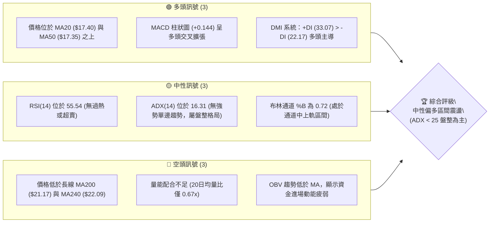
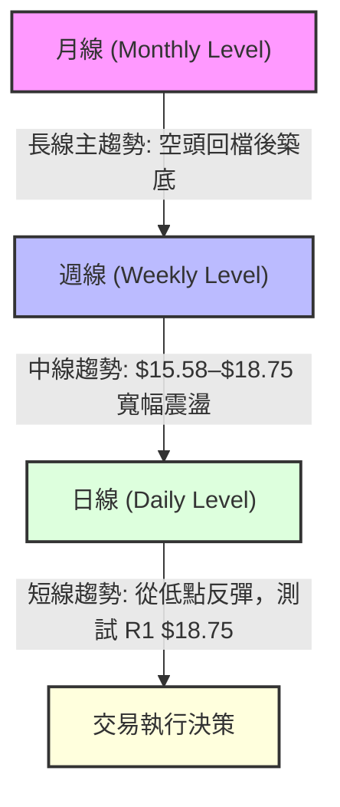
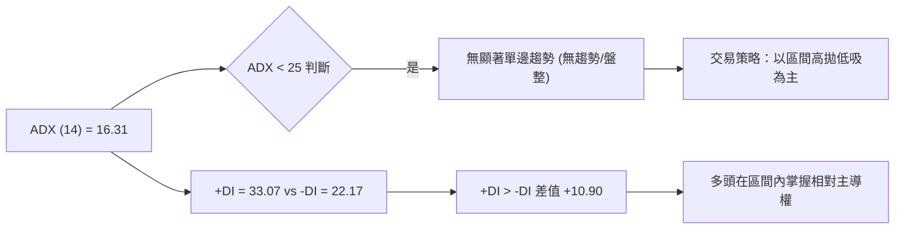
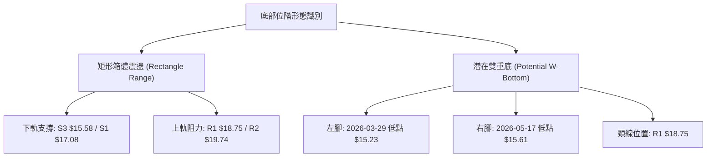
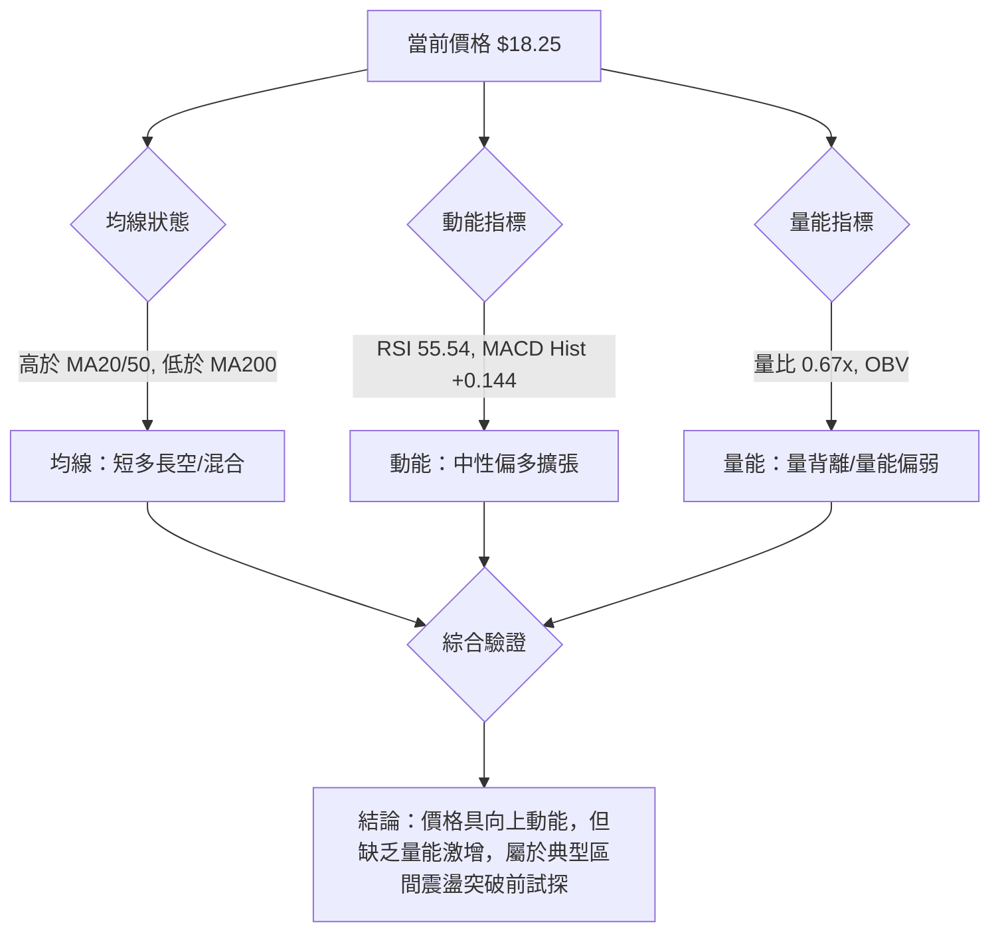
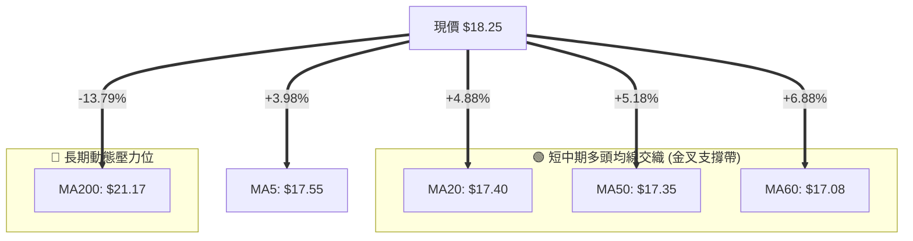
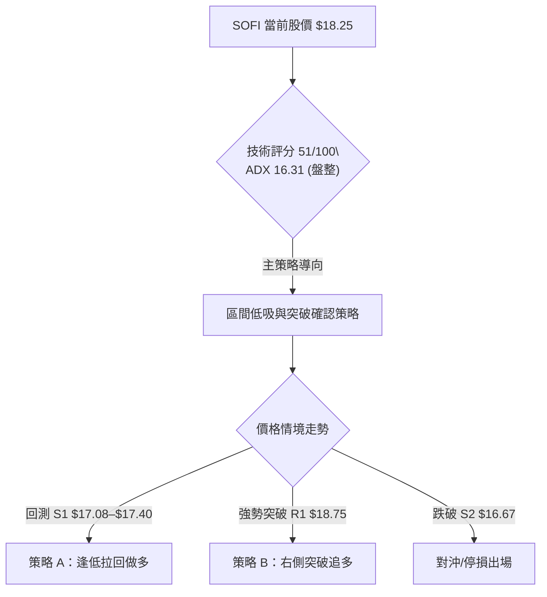
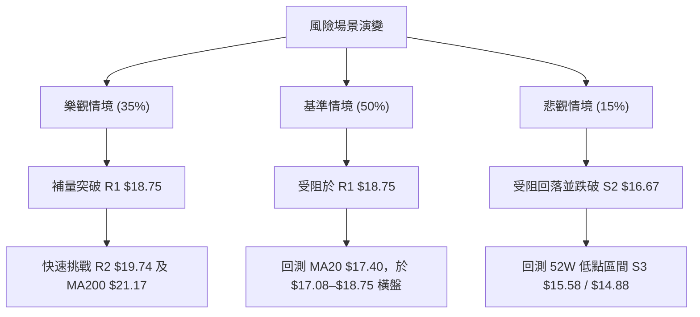

# SOFI 技術分析報告

> **報告日期**：2026-08-05 ｜ **語言**：繁體中文 ｜ **數據來源**：Yahoo Finance ｜ **當前價格**：$18.25

---

## 目錄

| 章節 | 內容 |
|------|------|
| [1. 技術面概覽](#1-技術面概覽) | 訊號儀表板、核心指標、評分卡 |
| [2. 趨勢分析](#2-趨勢分析) | 多時框趨勢、長中短期走勢 |
| [3. 圖表形態分析](#3-圖表形態分析) | 形態識別、K線組合、目標價 |
| [4. 支撐與阻力](#4-支撐與阻力) | 關鍵價位、斐波那契回調 |
| [5. 技術指標深度解讀](#5-技術指標深度解讀) | MA/RSI/MACD/布林/成交量 |
| [6. 動能與波動率](#6-動能與波動率) | 動能評估、ATR、Beta |
| [7. 多時框架總結](#7-多時框架總結) | 時框架評分矩陣 |
| [8. 交易策略建議](#8-交易策略建議) | 多空策略、風險報酬比 |
| [9. 風險提示與監控](#9-風險提示與監控) | 監控指標、風險場景 |

---

## 1. 技術面概覽

### 🎯 技術訊號儀表板



---

### 📊 核心指標速覽表

| 指標類別 | 指標名稱 | 當前數值 | 訊號 | 解讀 |
|----------|----------|----------|------|------|
| **價格** | 當前價格 | $18.25 | 🟡 中性 | 位於 52 週區間 ($14.88–$32.73) 之 18.9% 低位區 |
| **均線** | MA20 | $17.40 | 🟢 看多 | 價格高於 MA20 (+4.88%)，短線支撐確立 |
| **均線** | MA50 | $17.35 | 🟢 看多 | 價格高於 MA50 (+5.18%)，中線翻多 |
| **均線** | MA200 | $21.17 | 🔴 看空 | 價格低於 MA200 (-13.79%)，長線壓制重 |
| **動能** | RSI(14) | 55.54 | 🟡 中性 | 位於 30–70 中性區間，健康動能無過熱 |
| **動能** | MACD | +0.024 | 🟢 看多 | MACD 柱狀圖 (+0.144) 向上擴張，短線動能改善 |
| **動能** | Stochastic | %K: 84.68 | 🔴 超買 | 極短線進入超買區 (%D: 87.08)，防範高位回吐 |
| **趨勢** | ADX(14) | 16.31 | 🟡 弱趨勢 | ADX < 25 顯示市場處於無趨勢/寬幅震盪狀態 |
| **通道** | 布林通道 | Upper: $19.32 | 🟡 中性 | 價格向上軌接近 (%B=0.72)，中軌 $17.40 為重要強弱線 |
| **波動** | ATR(14) | $0.90 | 🟡 中等 | 占價格 4.93%，每日波動區間約 $0.90 |
| **量能** | 量比 (20D) | 0.67x | 🔴 偏弱 | 當前量能 56.58M 低於 20 日均量 84.65M |

---

### 🏆 技術評分卡

```
╔══════════════════════════════════════════════════════════════════╗
║              SOFI 技術面綜合評分卡 (2026-08-05)                   ║
╠══════════════════════════════════════════════════════════════════╣
║ 趨勢強度      ▓▓▓▓▓░░░░░░░░░░░░░░░  26/100  🟡 (ADX 16.31 無強趨勢)║
║ 動能指標      ▓▓▓▓▓▓▓▓▓▓▓▓░░░░░░░░  60/100  🟢 (MACD翻多/RSI適中)   ║
║ 支撐穩定度    ▓▓▓▓▓▓▓▓▓▓▓▓▓▓░░░░░░  70/100  🟢 (S1 $17.08 多次守穩) ║
║ 成交量配合    ▓▓▓▓▓▓▓░░░░░░░░░░░░░  35/100  🔴 (量比0.67x/OBV偏弱)  ║
║ 形態完整度    ▓▓▓▓▓▓▓▓▓▓▓░░░░░░░░░  55/100  🟡 (底部位階/尚待突破)  ║
║ 均線排列      ▓▓▓▓▓▓▓▓▓▓░░░░░░░░░░  50/100  🟡 (短多長空/混合排列)  ║
╠══════════════════════════════════════════════════════════════════╣
║ 綜合評分      ▓▓▓▓▓▓▓▓▓▓░░░░░░░░░░  51/100  ⚖️ 中性觀望/區間操作     ║
╚══════════════════════════════════════════════════════════════════╝
```

---

## 2. 趨勢分析

### 🌐 多時框趨勢分析



---

### 📈 長期趨勢 — 24個月歷史走勢與特徵

#### 24 個月 ASCII 價格走勢示意圖

```
SOFI 月線走勢圖 (2024-08 至 2026-08)
價格 ($)
 $30.00 ┤                                  ●──● (2025-10/11 雙頂 $29.72)
 $27.00 ┤                             ●──●    ●
 $24.00 ┤                        ●──●          ●
 $21.00 ┤                   ●──●                ●
 $18.00 ┤              ●──●                      ●────●──● (目前 $18.25)
 $15.00 ┤         ●──●                                 ●──●
 $12.00 ┤    ●──●
  $9.00 ┤●──●
        └─┬────┬────┬────┬────┬────┬────┬────┬────┬────┬────┬────┤
        24/08 24/11 25/02 25/05 25/08 25/11 26/02 26/05 26/08
```

#### 24 個月走勢特徵分析表

| 階段 | 時間區間 | 價格區間 | 累積漲跌 | 趨勢特徵描述 |
|------|----------|----------|----------|--------------|
| **1. 蓄勢期** | 2024/08 – 2024/09 | $7.86 – $7.99 | -1.6% | 築底區間，成交量低迷，低位橫盤震盪。 |
| **2. 主升段** | 2024/10 – 2025/11 | $11.17 – $29.72 | **+272.0%** | 多頭強勢主升浪，最高摸至 52W 高點 $32.73，月 K 連紅。 |
| **3. 修正段** | 2025/12 – 2026/03 | $26.18 – $15.88 | **-46.6%** | 獲利了結賣壓湧現，連續失守 MA200，進入深度修正。 |
| **4. 築底段** | 2026/04 – 2026/08 | $16.10 – $18.25 | +13.4% | 於 52W 低點 $14.88 上方尋求支撐，進入 $15.58–$18.75 震盪打底。 |

---

### 📊 中期趨勢（週線分析）與支撐阻力示意

週線層面顯示，SOFI 在經歷了 2025 年底的高點回落後，於 2026 年 3 月至 5 月在 $14.88–$15.58 區間獲得強烈買盤支撐。近期週 K 線連續於 $16.00 之上收紅，展現中期止跌築底跡象。

```
週線區域壓力與支撐示意圖
══════════════════════════════════════════════════════════
 $21.17 ────────────────────────────────── MA200 強阻力 (長線分水嶺)
 $19.74 ────────────────────────────────── R2 波段阻力
 $18.75 ────────────────────────────────── R1 短線關鍵阻力 (颈線位)
 $18.25 ◄───────────────────────────────── 現價位置
 $17.08 ────────────────────────────────── S1 第一支撐 (MA60/MA20 聚類)
 $16.67 ────────────────────────────────── S2 關鍵支撐
 $15.58 ────────────────────────────────── S3 近一年波段低點防線
══════════════════════════════════════════════════════════
```

---

### ⚡ 趨勢強度評估（ADX 深度解讀）



#### ADX 數值對照與當前解讀

| ADX 區間 | 趨勢狀態 | SOFI 當前狀態 | 對應操作策略 |
|----------|----------|---------------|--------------|
| **0 – 20** | **極弱趨勢 / 無方向盤整** | **16.31 🟢 屬於此區間** | **震盪指標操作 (布林通道/高拋低吸)** |
| **20 – 25** | 趨勢形成中 / 弱趨勢 | - | 觀察突破方向 |
| **25 – 50** | 強勁單邊趨勢 | - | 順勢追價 / 趨勢跟蹤 |
| **50 – 100** | 極端強勁趨勢 | - | 注意過熱反轉 |

---

## 3. 圖表形態分析

### 🔍 形態識別系統

在日線與週線圖表中，SOFI 目前呈現「雙重底（W底）打底形態」與「矩形箱體震盪」的複合結構：



#### 形態信心度評估表

| 形態名稱 | 信心度 | 判斷依據（引用數據） | 完成度 | 目標價計算與精確數值 |
|----------|--------|----------------------|--------|----------------------|
| **矩形箱體** | **75%** | 價格長期於 S3 $15.58 至 R1 $18.75 區間內游走 | 85% | 頂部 $18.75，底部 $15.58，箱體高度 $3.17 |
| **雙重底 (W底)** | **58%** | 兩次低點 ($15.23與$15.61) 均在 S3 $15.58 附近守穩 | 70% | 由形態高度推算：頸線 R1 $18.75 + 高度 $3.17 = **$21.92** |

---

### 🕯️ 近期重要 K 線形態分析

| 交易週/月份 | 收盤價 | K 線形態 | 技術解讀 | 訊號強度 |
|-------------|--------|----------|----------|----------|
| **2026-05-17** | $15.61 | 縮量十字星 (Doji) | 在 $15.58 支撐位止跌，賣壓耗盡。 | 🟢 底態確立 |
| **2026-05-31** | $18.22 | 中陽線突破 | 週漲幅 +16.6%，一舉穿透 MA20/MA50。 | 🟢 多頭進攻 |
| **2026-07-26** | $16.46 | 回踩流星線 | 向上試探失敗，回測 S2 $16.67 支撐。 | 🔴 短線修正 |
| **2026-08-09** | $18.25 | 大陽線吞噬 | 本週截至目前收 $18.25 (+11.8%)，吞噬前兩週陰線。 | 🟢 多頭反攻 |

---

### 📉 ASCII 走勢形態示意圖

```
SOFI 日線/週線 雙底與箱體形態示意圖
 價格 ($)
  $21.92 ┼──────────────────────────────────────────── 雙底形態理論目標價
         │
  $18.75 ┼─────────────── 頸線 / 阻力 R1 ──────────────
         │              / \                   / ▲
  $18.25 ┼─────────────/───\─────────────────/──┼────── (現價 $18.25)
         │            /     \               /   │
  $17.08 ┼───────────/───────\─────────────/────┼────── 第一支撐 S1
         │          /         \           /     │
  $15.58 ┼─────────●           ●─────────●      └────── 關鍵底部 S3 ($15.23 / $15.61)
                   (左腳)        (中間高點) (右腳)
```

---

### 🎯 形態目標價精確計算

1. **W 底頸線位**：引用 R1 = **$18.75**
2. **W 底最低點**：引用 S3 = **$15.58**
3. **形態高度 (Pattern Height)**：$18.75 - $15.58 = **$3.17**
4. **最小測量目標價 (Minimum Target)**：
   $$\text{目標價} = \text{頸線位} + \text{形態高度} = \$18.75 + \$3.17 = \mathbf{\$21.92}$$
   *(註：此目標價精確重合於 61.8% 斐波那契回調位 $21.70 與 MA200 $21.17 之區域)*

---

## 4. 支撐與阻力

### 🗺️ 關鍵價位分布圖

```
SOFI 價位結構分布圖 (由 OHLCV 歷史高低點計算)
═════════════════════════════════════════════════════════════════════
 $32.73 ║████████████████████████████████████████ text 52W 高點 (0.0% Fib)
 $28.52 ║██████████████████████                  斐波那契 23.6% 回調位
 $25.91 ║██████████████████                      斐波那契 38.2% 回調位
 $23.80 ║██████████████                          斐波那契 50.0% 回調位
 $21.70 ║████████████                            斐波那契 61.8% / W底目標價
 $21.17 ║██████████                              MA200 長線動態阻力
 $20.13 ║████████                                強阻力 R3 (+10.30%)
 $19.74 ║██████                                  波段阻力 R2 (+8.16%)
 $18.75 ║████                                    關鍵頸線阻力 R1 (+2.73%) / 78.6% Fib ($18.70)
 $18.25 ╠═══════════════════════════════════════╣ ◄◄◄ 當前價格 ($18.25)
 $17.40 ║▓▓▓▓▓▓▓▓▓▓▓▓▓▓▓▓                        MA20 / MA120 動態支撐
 $17.08 ║▓▓▓▓▓▓▓▓▓▓▓▓▓▓▓▓▓▓▓▓                    第一波段支撐 S1 (-6.41%) / MA60
 $16.67 ║▓▓▓▓▓▓▓▓▓▓▓▓▓▓▓▓▓▓▓▓▓▓▓▓                第二關鍵支撐 S2 (-8.68%)
 $15.58 ║▓▓▓▓▓▓▓▓▓▓▓▓▓▓▓▓▓▓▓▓▓▓▓▓▓▓▓▓            第三強支撐 S3 (-14.65%)
 $14.88 ║▓▓▓▓▓▓▓▓▓▓▓▓▓▓▓▓▓▓▓▓▓▓▓▓▓▓▓▓▓▓▓▓        52W 低點 (100.0% Fib)
═════════════════════════════════════════════════════════════════════
```

---

### 🚧 阻力位分析表

| 阻力級別 | 精確價位 | 距現價幅區 | 形成原因與數據來源 | 突破難度 | 重要性 |
|----------|----------|------------|--------------------|----------|--------|
| **R1** | **$18.75** | +2.73% | 近一年波段高點聚類、近78.6% Fib ($18.70) | 🟡 中等 | 🟢 頸線位，突破即確認W底 |
| **R2** | **$19.74** | +8.16% | 近一年波段高點聚類、接近 $20整數關卡 | 🟡 中等 | 🟡 中期多空分水嶺 |
| **R3** | **$20.13** | +10.30% | 近一年波段高點聚類、心理壓力關卡 | 🔴 偏高 | 🔴 強阻力區間 |
| **MA200**| **$21.17** | +16.00% | 200日移動平均線 | 🔴 極高 | 🔴 牛熊分界線 |

---

### 🛡️ 支撐位分析表

| 支撐級別 | 精確價位 | 距現價幅區 | 形成原因與數據來源 | 守住機率 | 重要性 |
|----------|----------|------------|--------------------|----------|--------|
| **S1** | **$17.08** | -6.41% | 近一年波段低點聚類、MA60 ($17.08) 重合 | 🟢 高 | 🟢 短線防守第一線 |
| **S2** | **$16.67** | -8.68% | 近一年波段低點聚類、靠近布林下軌區間 | 🟢 高 | 🟡 短線多頭停損點 |
| **S3** | **$15.58** | -14.65% | 近一年波段極低點聚類、W底雙腳支撐 | 🟢 極高 | 🔴 中線多頭生死線 |

---

### 📐 斐波那契回調位分析（52週區間 $14.88 → $32.73）

```
斐波那契回調位與現價相對位置
0.0%  (52W High) ────────────── $32.73
23.6%            ────────────── $28.52
38.2%            ────────────── $25.91
50.0%            ────────────── $23.80
61.8%            ────────────── $21.70  ◄── (W底形態測量目標價 $21.92 聚類區)
78.6%            ────────────── $18.70  ◄── [突破前哨站] (距現價仅 +2.47%)
現價             ────────────── $18.25  ◄── (位於 78.6% 與 100% 回調位之間)
100.0% (52W Low) ────────────── $14.88
```

* **位置解讀**：當前價格 $18.25 位於 78.6% 回調位 ($18.70) 與 100% 低點 ($14.88) 之區間。
* **技術意義**：$18.70 (78.6% Fib) 與阻力位 R1 ($18.75) 形成完美的**共振阻力帶 ($18.70–$18.75)**。若日線實體收盤能有效突破 $18.75，向上空間將迅速打開至 61.8% 回調位 ($21.70)。

---

## 5. 技術指標深度解讀

### 🎛️ 指標訊號總覽



---

### 📈 移動平均線排列分析



* **均線結構解讀**：MA20 ($17.40) 與 MA50 ($17.35) 發生黃金交叉，且 MA5 ($17.55) 向上穿透，短中期均線在 $17.08–$17.40 形成**強固的多頭防守平台**。然而，長線 MA200 ($21.17) 與 MA240 ($22.09) 依然向下傾斜，整體屬於「短多長空」的築底階段。

---

### 📉 RSI(14) 與 隨機指標 (Stochastic) 分析

#### RSI 數值與動能條

```
RSI(14) 當前數值: 55.54
[0] ─────────────── [30] ══════════════ [55.54] ════════ [70] ─────────────── [100]
    超賣區 (Oversold)       中性健康區 (Neutral Zone)       超買區 (Overbought)
```

* **背離檢查**：觀察過去 20 週數據，2026 年 3 月底低點 $15.23 時 RSI 為 11.8，2026 年 5 月中低點 $15.61 時 RSI 為 30.2。價格二次探底但 RSI 底部明顯墊高，構成**週線級別的標準底背離 (Bullish Divergence)**，為本波反彈奠定了技術基礎。
* **Stochastic 注意事項**：Stoch %K (84.68) 與 %D (87.08) 已進入 >80 超買區，提示短線不宜在 R1 ($18.75) 附近盲目追高，等待拉回測試 MA20 支撐更具風險報酬比。

---

### 📊 MACD (12, 26, 9) 訊號解讀

```
MACD 指標快照：
MACD 線:    +0.024
Signal 線:  -0.120
Histogram:  +0.144  🟢 看多擴張
```

* **柱狀圖動態**：MACD 柱狀圖自 2026 年 7 月下旬的 -0.220 急速翻紅擴張至 **+0.144**，DIF 線穿過 DEA 線形成零軸下方的多頭交叉，顯示短期買盤動能正迅速聚集。

---

### 📦 布林通道 (Bollinger Bands) 分析

```
SOFI 布林通道結構示意圖 (20日 SMA)
 $19.32 ────────────────────────────────── BB 上軌 (Upper Band)
 $18.25 ◄───────────────────────────────── 當前價格 (%B = 0.72)
 $17.40 ────────────────────────────────── BB 中軌 (MA20)
 $15.48 ────────────────────────────────── BB 下軌 (Lower Band)
```

* **%B 指標解讀**：%B 為 0.72，表明價格處於布林通道的中軌與上軌之間，屬於多頭掌控的強勢通道內。
* **帶寬分析**：布林帶寬目前呈現溫和張口，尚未進入極端擠壓 (Squeeze)，意味著價格短線仍有空間向上探試 Upper Band ($19.32)。

---

### 💹 成交量分析（量價配合度）

```
成交量數據比較：
最新成交量:    56,579,519 股
20 日平均量:   84,649,036 股  (量比: 0.67x 🔴)
50 日平均量:   84,562,982 股
OBV 狀態:     OBV < MA (量能相對價格呈微幅背離)
```

* **量價配合評估**：今日價格上漲至 $18.25，但成交量僅 56.58M，相當於 20 日均量的 67%。**「縮量上漲」**顯示此波反彈主要由籌碼鎖定與空頭回補推動，缺乏機構法人的大舉主動追買。在無大價量配合的情況下，一次突破 R1 ($18.75) 阻力帶的機率受限，更可能在 $18.75 附近遇到阻力震盪。

---

## 6. 動能與波動率

### ⚡ 動能評估矩陣

| 評估維度 | 當前狀態 | 數據依據 | 對交易的含義 |
|----------|----------|----------|--------------|
| **動能方向 (Direction)** | 偏多 🟢 | MACD Hist +0.144, +DI 33.07 | 短線做多順應動能 |
| **動能強度 (Strength)** | 中等 🟡 | RSI 55.54 | 尚未過熱，有續漲空間 |
| **波動率 (Volatility)** | 中高 🟡 | ATR $0.90 (4.93%), Beta 2.204 | 日內與持倉止損點須足夠寬鬆 |
| **趨勢持續性 (Persistence)**| 低/震盪 🔴 | ADX 16.31 < 25 | 避免長期趨勢單，以波段獲利為主 |

#### 動能四象限定位表

| 象限 | 動能強度 | 波動率 | SOFI 當前位置 | 交易啟示 |
|------|----------|--------|---------------|----------|
| **Q1** | 強 | 低 | - | 最佳趨勢跟蹤 |
| **Q2** | **弱/中** | **中/高** | **✓ (SOFI 所在區間)** | **區間高拋低吸，嚴格鎖定獲利** |
| **Q3** | 強 | 高 | - | 突破追價策略 |
| **Q4** | 弱 | 低 | - | 觀望 / 沉寂期 |

---

### 📊 ATR 波動率分析

* **ATR(14)** = **$0.90**（占當前股價 4.93%）。
* **止損與加碼距離建議**：
  * **極短線交易 (1.0x ATR)**：止損距進場點 **$0.90**。
  * **波段交易 (1.5x ATR)**：止損距進場點 **$1.35**。
  * **中長線交易 (2.0x ATR)**：止損距進場點 **$1.80**。

---

### 📐 Beta 與市場相關性

* **Beta 係數** = **2.204**。
* **技術解讀**：SOFI 的波動性約為標普 500 指數的 2.2 倍。在大盤（SPY/QQQ）上漲時 SOFI 具有極高的彈性與溢價，但在市場避險情緒升溫時，SOFI 的回調壓力亦遠大於大盤，需時刻關注大盤風險偏好。

---

## 7. 多時框架總結

### 📋 時框架評分表

| 時框架 | 趨勢方向 | 動能 (RSI/MACD) | 均線排列 | 形態狀態 | 綜合評分 | 建議操作 |
|--------|----------|-----------------|----------|----------|----------|----------|
| **日線 (Daily)** | 中性偏多 🟢 | RSI 55.5 / MACD+ | 多頭交叉 (MA20/50) | 試探頸線 $18.75 | **62 / 100** | 逢低佈局 / 試探性做多 |
| **週線 (Weekly)**| 箱體震盪 🟡 | RSI 55.5 底背離 | 混合排列 | W底構築中 | **55 / 100** | 區間操作 / 持股觀望 |
| **月線 (Monthly)**| 空頭修正後打底 🔴| 月 K 反彈 | MA200 壓制 | 高位大幅回檔 | **38 / 100** | 不宜長線重倉追高 |

---

### ⚖️ 多時框收斂結論

依據多時框收斂規則：
1. **行情性質判斷**：ADX(14) 為 **16.31 (< 25)**，明確定義當前 SOFI 為**「盤整/箱體震盪行情」**。
2. **主導規則**：在盤整行情中，應以**日線布林通道 ($15.48–$19.32) 與關鍵支撐阻力 ($17.08 vs $18.75)** 為主要交易區間。
3. **最終唯一方向性結論**：**「中性偏多箱體震盪，短線向上試探 R1 $18.75 阻力」**。

---

## 8. 交易策略建議

### 🗺️ 策略決策流程圖



---

### 🧭 策略路由

**當前主策略方向 = 區間低吸 / 突破確認（依綜合評分 51/100 分流）**

由於評分處於 40–60 之中性區間，且 ADX < 25，策略聚焦於「回測支撐逢低吸納」或「確定突破 R1 後跟進」，不建議在目前接近 R1 $18.75 的位置盲目追高。

---

### 🎯 價格情境階梯 (Price Scenarios)

| 觸發條件 | 第一目標 | 第二目標 | 情境含義 |
|----------|----------|----------|----------|
| **突破 R1 $18.75** | R2 **$19.74** | R3 **$20.13** | W底形態確認，短線動能爆發 |
| **站穩 MA20 $17.40** | R1 **$18.75** | - | 保持在中軌上方健康震盪 |
| **跌破 S1 $17.08** | S2 **$16.67** | S3 **$15.58** | 震盪區間下移，短線轉弱 |

---

### 📊 情境機率分佈

| 情境 | 機率 | 主要依據 |
|------|------|----------|
| **情境一：震盪向上試探/突破 R1** | **50%** | MACD 柱狀圖翻紅、+DI 掌控優勢、日線突破 MA20/MA50。 |
| **情境二：在 $17.08–$18.75 區間橫盤** | **35%** | ADX 僅 16.31 顯示無強趨勢，成交量比 0.67x 缺乏追價量。 |
| **情境三：拉回回測 S2/S3 底部** | **15%** | Stochastic 進入 >80 超買區，若大盤回檔可能引發補跌。 |

---

### 🟢 主策略詳情

#### 策略 A：逢低拉回買進（低吸策略 - 推薦）

* **進場條件**：股價拉回至 MA20 ($17.40) 至 S1 ($17.08) 支撐區間，且出現日線止跌 K 線。
* **進場價格**：**$17.25**（取 $17.08–$17.40 中點）
* **目標價 T1**：**$18.75**（阻力 R1）
* **目標價 T2**：**$19.74**（阻力 R2）
* **止損價格**：**$16.45**（跌破 S2 $16.67 下方 1.5x ATR 防守）
* **風險報酬比**：
  * 至 T1：$(\$18.75 - \$17.25) / (\$17.25 - \$16.45) = \$1.50 / \$0.80 = \mathbf{1.88 : 1}$
  * 至 T2：$(\$19.74 - \$17.25) / (\$17.25 - \$16.45) = \$2.49 / \$0.80 = \mathbf{3.11 : 1}$
* **成功機率**：62%
* **建議倉位**：10% – 15% 總資金

#### 策略 B：右側突破追多（突破策略）

* **進場條件**：日線實體收盤明確**突破 R1 $18.75**，且當日成交量突破 20 日均量 ( > 84.65M)。
* **進場價格**：**$18.85**（突破確認點）
* **目標價 T1**：**$19.74**（阻力 R2）
* **目標價 T2**：**$21.17**（MA200 長線目標 / 61.8% Fib $21.70）
* **止損價格**：**$17.90**（跌破 MA20 / 前高轉支撐位）
* **風險報酬比**：
  * 至 T1：$(\$19.74 - \$18.85) / (\$18.85 - \$17.90) = \$0.89 / \$0.95 = 0.94 : 1$
  * 至 T2：$(\$21.17 - \$18.85) / (\$18.85 - \$17.90) = \$2.32 / \$0.95 = \mathbf{2.44 : 1}$
* **成功機率**：55%
* **建議倉位**：8% – 10% 總資金

---

### 🔴 反向風險觸發點（對沖與止損提示）

若持有多頭部位，當出現以下訊號時應立即減碼或停損：
1. **跌破 S2 $16.67**：意味著本波從 $15.58 啟動的反彈失敗，股價將再次探底 S3 $15.58。
2. **MACD 柱狀圖由正轉負**：若動能再次熄火，代表高位賣壓沉重。

---

### ⭐ 整體訊號強度評星

```
做多訊號強度：★★★☆☆  (3/5 星) — 短期動能改善，但受制於量能與長線均線
做空訊號強度：★★☆☆☆  (2/5 星) — 下方 S1/S2 支撐強勁，做空空間受限
整體可信度：  ★★★☆☆  (3/5 星) — ADX<25 盤整特徵明顯，宜遵守區間紀律
```

---

## 9. 風險提示與監控

### ✅ 關鍵監控指標 Checklist

```
╔══════════════════════════════════════════════════════════════════╗
║              SOFI 技術面每日監控 Checklist                        ║
╠══════════════════════════════════════════════════════════════════╣
║ [ ] 價格是否突破並站穩 R1 $18.75 頸線關卡                        ║
║ [ ] 日成交量是否回升至 20日均量 84.65M 以上                      ║
║ [ ] MA20 ($17.40) 是否持續維持在 MA50 ($17.35) 之上              ║
║ [ ] RSI(14) 能否維持在 50 中性軸上方                             ║
║ [ ] 價格是否守住關鍵防守位 S2 $16.67                             ║
╚══════════════════════════════════════════════════════════════════╝
```

---

### ⚠️ 風險場景分析



---

### 🛡️ 風險管理與倉位控管規則

1. **單筆交易風險上限**：單筆交易虧損不得超過總投資組合資產的 **1.5%**。
2. **波動率倉位調整**：SOFI 之 ATR 高達 4.93%，Beta 為 2.204，屬於高波動標的。建議總倉位不宜超過個人投資組合的 **15%**。
3. **嚴格執行止損**：不論採用策略 A 或策略 B，一旦價格跌破指定止損點（$16.45 或 $17.90），必須無條件執行停損，嚴防陷入深度套牢。

---

## 📋 報告總結

```
╔══════════════════════════════════════════════════════════════════╗
║                   SOFI 技術分析報告總結                          ║
════════════════════════════════════════════════════════════════════
報告日期：2026-08-05
當前價格：$18.25
分析評級：⚖️ 中性偏多（區間震盪築底階段）

關鍵結論：
├─ 長期趨勢：🔴 空頭修正後打底（受制於 MA200 $21.17）
├─ 中期趨勢：🟡 箱體震盪（$15.58 – $18.75 築底區間）
├─ 短期趨勢：🟢 向上反彈（MA20/50 金叉，MACD 柱狀圖翻紅）
├─ 關鍵支撐：S1 $17.08 / S2 $16.67 / S3 $15.58
├─ 關鍵阻力：R1 $18.75 / R2 $19.74 / R3 $20.13
└─ 分析師共識目標：$19.87 (華爾街均價)

最優策略組合：
1. 🥇 首選策略：策略 A (逢低拉回做多)
   └─ 進場 $17.25 ｜ 止損 $16.45 ｜ 目標 T1 $18.75 / T2 $19.74
2. 🥈 次選策略：策略 B (右側突破追多)
   └─ 突破 $18.75 進場 ｜ 止損 $17.90 ｜ 目標 $21.17 (MA200)
3. 🥉 觀望條件：若成交量持續低於 50M 且無法突破 $18.75，維持現金觀望。
════════════════════════════════════════════════════════════════════
```

---

> ⚠️ **免責聲明**：本報告為 AI 自動生成之技術分析，所有數據及估算均基於提供的歷史價格資訊。本報告**僅供研究與學術參考**，**不構成任何投資建議**。投資有風險，入市需謹慎。

---

*報告生成時間：2026-08-05 ｜ 數據來源：Yahoo Finance ｜ 分析框架：多時框技術分析*