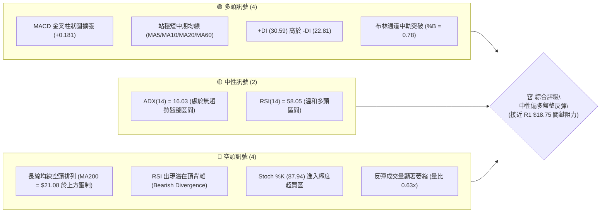
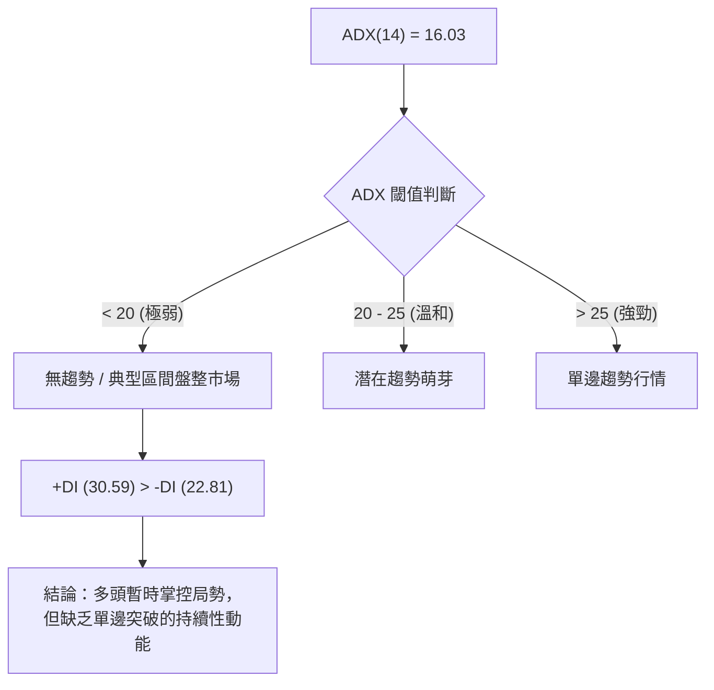
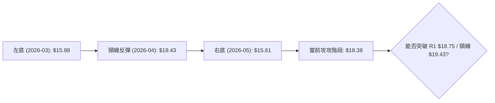
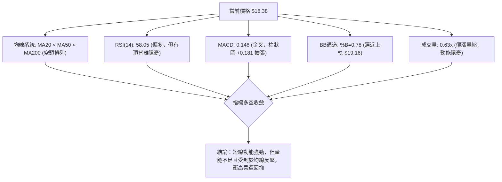
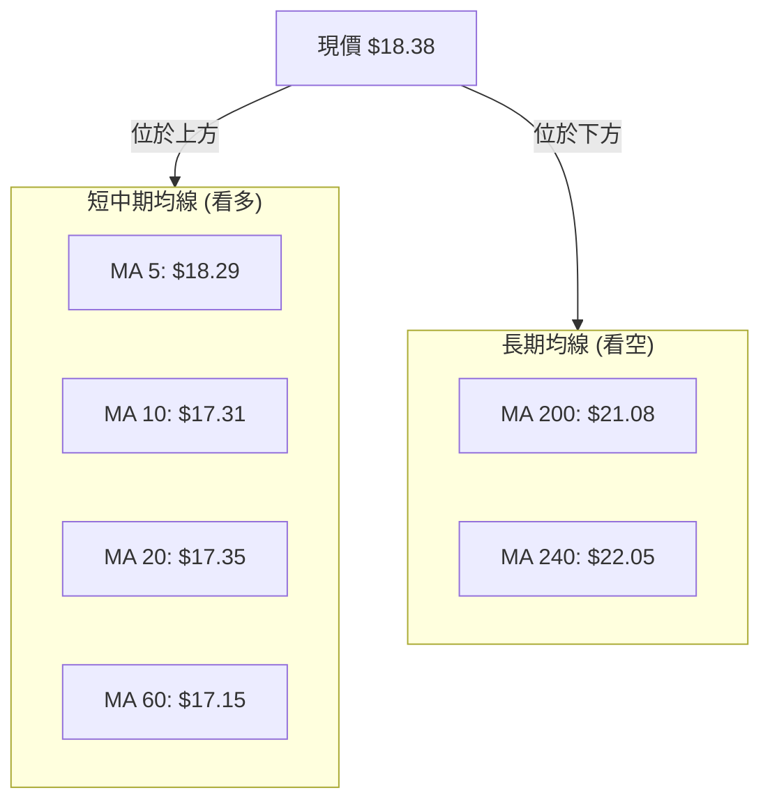
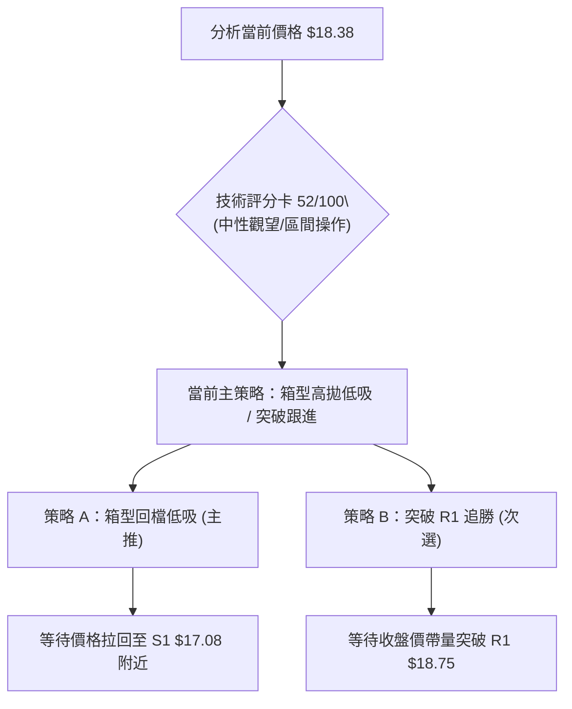
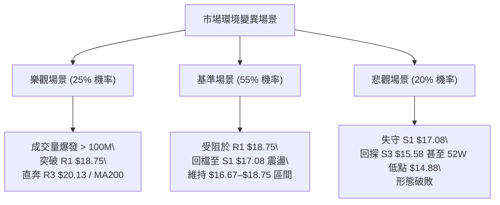

# SOFI 技術分析報告

> **報告日期**：2026-08-07 ｜ **語言**：繁體中文 ｜ **數據來源**：Yahoo Finance ｜ **當前價格**：$18.38

---

## 目錄

| 章節 | 內容 |
|------|------|
| [1. 技術面概覽](#1-技術面概覽) | 訊號儀表板、核心指標、評分卡 |
| [2. 趨勢分析](#2-趨勢分析) | 多時框趨勢、長中短期走勢、ADX強弱評估 |
| [3. 圖表形態分析](#3-圖表形態分析) | 形態識別、K線組合、目標價推算 |
| [4. 支撐與阻力](#4-支撐與阻力) | 關鍵價位、斐波那契回調層級 |
| [5. 技術指標深度解讀](#5-技術指標深度解讀) | MA/RSI/MACD/布林通道/量價配合 |
| [6. 動能與波動率](#6-動能與波動率) | 動能四象限、ATR波動率、Beta分析 |
| [7. 多時框架總結](#7-多時框架總結) | 時框架評分矩陣、多時框收斂結論 |
| [8. 交易策略建議](#8-交易策略建議) | 策略路由、價位情境階梯、進出場規劃 |
| [9. 風險提示與監控](#9-風險提示與監控) | 監控指標Checklist、風險場景預演 |

---

## 1. 技術面概覽

### 🎯 技術訊號儀表板



---

### 📊 核心指標速覽表

| 指標類別 | 指標名稱 | 當前數值 | 訊號 | 解讀 |
|----------|----------|----------|------|------|
| **價格** | 當前價格 | $18.38 | 🟡 中性 | 位於 52 週區間 ($14.88–$32.73) 之 19.6% 分位，短線強勢反彈 |
| **均線** | MA20 | $17.35 | 🟢 看多 | 價格高於 MA20 (+5.91%)，短線支撐強勁 |
| **均線** | MA50 | $17.44 | 🟢 看多 | 價格高於 MA50，MA20 即將與 MA50 形成黃金交叉 |
| **均線** | MA200 | $21.08 | 🔴 看空 | 價格遠低於 MA200 (-12.81%)，中長期仍受制於空頭壓制 |
| **動能** | RSI(14) | 58.05 | 🟡 中性 | 處於 30–70 中性偏多區，但警惕頂背離訊號 |
| **動能** | MACD | 0.146 | 🟢 看多 | MACD 位於信號線 (-0.034) 上方，柱狀圖 +0.181 呈多頭擴張 |
| **動能** | Stoch %K/%D | 87.94 / 84.51 | 🔴 看空 | 進入 >80 超買區域，短線隨時有回檔過熱修正壓力 |
| **波動** | ATR(14) | $0.87 | 🟡 中性 | 日均波動率 4.71%，波動度適中，適合設定止損 |
| **通道** | 布林通道 | $15.55–$19.16 | 🟡 中性 | 價格逼近 BB 上軌 ($19.16)，%B 為 0.78 |
| **趨勢** | ADX(14) | 16.03 | 🟡 中性 | ADX < 25 表示當前為典型區間盤整行情，非單邊趨勢 |
| **成交量** | 20日量比 | 0.63x | 🔴 看空 | 最新成交量 50.98M 低於 20日均量 81.37M，呈現「價漲量縮」|

---

### 🏆 技術評分卡

```
╔══════════════════════════════════════════════════════════════════╗
║                SOFI 技術面綜合評分卡 (2026-08-07)                 ║
╠══════════════════════════════════════════════════════════════════╣
║ 趨勢強度 (ADX)     ▓▓▓▓▓░░░░░░░░░░░░░░░  25/100  🟡 弱趨勢/盤整   ║
║ 動能指標 (RSI/MACD) ▓▓▓▓▓▓▓▓▓▓▓▓░░░░░░░░  60/100  🟢 短線反彈動能 ║
║ 支撐穩定度 (Support)▓▓▓▓▓▓▓▓▓▓▓▓▓▓░░░░░░  70/100  🟢 S1/S2 結構紮實║
║ 成交量配合 (Volume) ▓▓▓▓▓▓▓░░░░░░░░░░░░░  35/100  🔴 價漲量縮背離 ║
║ 形態完整度 (Pattern)▓▓▓▓▓▓▓▓▓▓▓░░░░░░░░░  55/100  🟡 區間打底形態 ║
║ 均線結構 (MA Align) ▓▓▓▓▓▓▓▓░░░░░░░░░░░░  40/100  🔴 空頭排列未改 ║
╠══════════════════════════════════════════════════════════════════╣
║ 綜合技術評分       ▓▓▓▓▓▓▓▓▓▓░░░░░░░░░░  52/100  🟡 中性觀望/區間 ║
╚══════════════════════════════════════════════════════════════════╝
```

---

## 2. 趨勢分析

### 🌐 多時框趨勢分析

```mermaid
graph TD
    A["月線層級 (Long-Term)"] -->|"高點 $29.72 回落至低點 $14.88"| B["長期：熊市築底階段"]
    C["週線層級 (Medium-Term)"] -->|"在 $15.58–$18.75 築底震盪"| D["中期：底部箱型盤整"]
    E["日線層級 (Short-Term)"] -->|"站上 MA20/MA50，攻向 BB 上軌"| F["短期：波段反彈攻堅"]
    
    B --> G{"多時框收斂總結"}
    D --> G
    F --> G
    G -->|"ADX("16.03") < 25"| H["主導機制：日線/週線箱型區間操作"]
```

---

### 📈 長期趨勢 — 24個月歷史走勢圖

```
SOFI 月線歷史走勢圖（2024-08 至 2026-08）
價格軸 ($)
$30.00 ┤                                 ●─● (2025-10/11 高點 $29.72)
$27.00 ┤                              ●  │
$24.00 ┤                          ●──┘   ●
$21.00 ┤                      ●──┘        │  ●
$18.00 ┤                  ●──┘            └──┼──● (2026-05 $18.22) ─● (現價 $18.38)
$15.00 ┤          ●──●──┘                    └──● (2026-03 低點 $15.88)
$12.00 ┤      ●──┘
 $9.00 ┤  ●──┘
 $6.00 ┴──┬───┬───┬───┬───┬───┬───┬───┬───┬───┬───┬───┬───┬───┬───
        24/08  10  12  25/02 04  06  08  10  12  26/02 04  06  08
```

#### 長期走勢特徵分析

| 階段歷史 | 價格區間 | 變動幅度 | 走勢特徵與技術含義 |
|----------|----------|----------|--------------------|
| **2024/08 – 2024/11** | $7.99 ➔ $16.41 | +105.4% | 強勢突破打底區，成交量大幅放大，啟動第一波大行情 |
| **2024/12 – 2025/03** | $16.41 ➔ $11.63 | -29.1% | 中期獲利回吐，於 $11.63 建立堅實支撐平台 |
| **2025/04 – 2025/11** | $12.51 ➔ $29.72 | +137.6% | 主升段行情，創下近兩年新高 $29.72，均線呈標準多頭排列 |
| **2025/12 – 2026-03** | $29.72 ➔ $15.88 | -46.6% | 深度修正段，跌破 MA200，失守多個重要斐波那契關卡 |
| **2026-04 – 2026-08** | $15.88 ➔ $18.38 | +15.7% | 於 52 週低點聚類 ($14.88–$15.58) 上方進入打底盤整階段 |

---

### 📊 中期與短期趨勢

```
SOFI 週線與日線價格結構示意圖
阻力區 R3: $20.13 ══════════════════════════════════════════ (MA200 $21.08 壓力帶)
阻力區 R2: $19.74 ────────────────────────────────────────── (前波反彈高點)
阻力區 R1: $18.75 ------------------------------------------ (78.6% 斐波那契 $18.70)
現價  : $18.38 ◄───[短線反彈推進中，逼近 R1 / BB 上軌 $19.16]
支撐區 S1: $17.08 ------------------------------------------ (MA20 $17.35 / MA50 $17.44)
支撐區 S2: $16.67 ────────────────────────────────────────── (短線回檔強支撐)
支撐區 S3: $15.58 ══════════════════════════════════════════ (52W 低點 $14.88 護城河)
```

1. **中期趨勢（週線）**：近 20 週收盤價於 $15.23 至 $19.43 之間進行寬幅震盪。週 MACD 柱狀圖在零軸附近交替（+0.181），顯示中期多空力量暫時平衡。
2. **短期趨勢（日線）**：自 2026-08-02 的 $16.31 強勢上攻至 $18.38，短線連克 MA20 ($17.35) 與 MA50 ($17.44)，展現強烈反彈意圖。

---

### ⚡ 趨勢強度評估（ADX 解讀）



| 指標 | 當前數值 | 狀態評估 | 交易指引 |
|------|----------|----------|----------|
| **ADX (14)** | 16.03 | 弱趨勢 (`<25`) | **嚴格禁止追高殺跌**，採取高拋低吸之區間策略 |
| **+DI (14)** | 30.59 | 多頭佔優 | 短線買盤積極，支撐價格向箱型上軌靠攏 |
| **-DI (14)** | 22.81 | 空頭收斂 | 賣壓暫時退場，但尚未出現崩盤式恐慌 |

---

## 3. 圖表形態分析

### 🔍 形態識別系統

在當前價格結構中，SOFI 正處於**底部矩形箱型盤整 (Rectangular Bottom Box)** 形態，並試圖構建**雙底 (Double Bottom)** 雛形。



#### 形態信心度評估表

| 形態名稱 | 信心度 | 判斷依據（引用數據） | 完成度 | 目標價計算式與精確數值 |
|----------|--------|----------------------|--------|------------------------|
| **矩形箱型盤整** | **85%** | 上軌阻力 R1 $18.75，下軌支撐 S3 $15.58，ADX=16.03 相互印證 | 90% | 箱型突破目標價 = R1 ($18.75) + 箱高 ($3.17) = **$21.92**（接近 Fib 61.8% $21.70） |
| **潛在雙底形態** | **60%** | 第一底 $15.88 (2026-03)，第二底 $15.61 (2026-05)，頸線 $19.43 | 65% | 雙底目標價 = 頸線 ($19.43) + 形態高度 ($3.82) = **$23.25** |
| **頭肩頂/底** | **20%** | 幾何數據不足，不具備典型三峰/三谷特徵 | 10% | 訊號不足，僅做指標型解讀 |

---

### 🕯️ 重要 K 線形態分析（近 5 週）

| 日期 (週) | 收盤價 | K 線形態 | 技術解讀 | 多空訊號 |
|-----------|--------|----------|----------|----------|
| **2026-07-12** | $18.78 | 上影線錘子線 | 衝高受到 R1 $18.75 附近賣壓拉回 | 🔴 短線見頂 |
| **2026-07-19** | $17.28 | 中陰線 | 跌破 MA20，空頭向下測試支撐 | 🔴 賣壓釋放 |
| **2026-07-26** | $16.46 | 紡錘線 | 逼近 S2 $16.67 支撐，多空陷入對峙 | 🟡 跌勢放緩 |
| **2026-08-02** | $16.31 | 下影線止跌線 | 探低至 $16.31 後買盤進場，於 S1 前回升 | 🟢 底部支撐確認 |
| **2026-08-09** | $18.38 | 長陽線 (截至08-07) | 一舉包覆前三週陰線，多頭強勢反擊 | 🟢 大陽線突破 |

---

### 📉 ASCII 走勢形態示意圖

```
 SOFI 箱型盤整與雙底雛形示意圖
 
 $20.13 ┤-------------------------------------------------- 阻力 R3
        │                     ▲ (頸線 $19.43)
 $18.75 ┤---------------------┼---------------------------- 阻力 R1 / 箱頂
        │                    / \        ★ (現價 $18.38)
 $17.08 ┤-------------------/---\------/------------------- 支撐 S1 / MA20
        │   底 1           /     \    /
 $15.58 ┤───●─────────────/───────●──/--------------------- 支撐 S3 / 箱底 (底 2)
            (2026-03 $15.88)     (2026-05 $15.61)
```

---

## 4. 支撐與阻力

### 🗺️ 關鍵價位分布圖

```
SOFI 價位結構分布圖 (由歷史 OHLCV 密集區精確計算)
═══════════════════════════════════════════════════════════════════
$32.73 ║████████████████████████████████║ 52 週最高點 (52W High)
$28.52 ║████████████████████            ║ 23.6% 斐波那契回調位
$25.91 ║████████████████████████        ║ 38.2% 斐波那契回調位
$23.80 ║████████████████████████████    ║ 50.0% 斐波那契回調位
$21.70 ║████████████████████████████████║ 61.8% 斐波那契回調位 / MA200 ($21.08)
$20.13 ║██████████████████              ║ 強阻力 R3 (波段高點壓制)
$19.74 ║██████████████                  ║ 中度阻力 R2 (反彈前高)
$18.75 ║████████████████████████████████║ 關鍵阻力 R1 / 78.6% 斐波那契 ($18.70)
$18.38 ╠════════════════════════════════╬ ◄ 當前價格 (Current Price)
$17.08 ║▓▓▓▓▓▓▓▓▓▓▓▓▓▓▓▓▓▓▓▓▓▓▓▓▓▓▓▓▓▓▓▓║ 近期支撐 S1 (MA20 $17.35 / MA50 $17.44)
$16.67 ║████████████████████            ║ 強支撐 S2 (密集成交區)
$15.58 ║████████████████████████████████║ 關鍵強支撐 S3 (箱型底界)
$14.88 ║████████████████████████████████║ 52 週最低點 (52W Low)
═══════════════════════════════════════════════════════════════════
```

---

### 🚧 阻力位分析表

| 阻力級別 | 價位 | 形成原因與技術結構 | 突破難度 | 重要性 |
|----------|------|--------------------|----------|--------|
| **R1** | **$18.75** | 近一年波段高點聚類 + 78.6% 斐波那契位 ($18.70) 重疊壓制 | 🟡 中等 | 🟢 決定短線能否打開上升通道之關鍵 |
| **R2** | **$19.74** | 前波反彈高點聚類 + 布林通道上軌外部延伸區 | 🔴 偏難 | 🟡 中期多空分水嶺 |
| **R3** | **$20.13** | 年線 MA200 ($21.08) 前哨賣壓區 + 解套盤解套密集區 | 🔴 極難 | 🔴 強阻力，需大量配合方能克敵 |

---

### 🛡️ 支撐位分析表

| 支撐級別 | 價位 | 形成原因與技術結構 | 守住機率 | 重要性 |
|----------|------|--------------------|----------|--------|
| **S1** | **$17.08** | 近一年波段低點聚類 + MA20 ($17.35) 與 MA50 ($17.44) 共振 | 🟢 80% | 🟢 多頭短線防線，不可失守 |
| **S2** | **$16.67** | 密集成交區底界 + 日線布林中軌支撐帶 | 🟢 85% | 🟡 強力支撐，止損設定參考 |
| **S3** | **$15.58** | 52週低點聚類 ($14.88–$15.58)，矩形箱型底界 | 🟢 92% | 🔴 長線多頭最後護城河 |

---

### 📐 斐波那契回調位分析

**基準區間**：52 週低點 **$14.88** ➔ 52 週高點 **$32.73**（總價差 $17.85）

```
斐波那契層級分布與當前價位位置
$32.73 (0.0%)   ──────────────────────────────────────── Top
$28.52 (23.6%)  ──────────────────────────────────────── 
$25.91 (38.2%)  ──────────────────────────────────────── 
$23.80 (50.0%)  ──────────────────────────────────────── 
$21.70 (61.8%)  ──────────────────────────────────────── 中期強阻力
$18.70 (78.6%)  ──────────────[ $18.38 現價點位 ]─────── 關鍵解套關卡
$14.88 (100.0%) ──────────────────────────────────────── Bottom
```

*   **當前位置解讀**：現價 **$18.38** 恰好落在 **100.0% ($14.88)** 與 **78.6% ($18.70)** 回調位之間，距離 78.6% 關卡僅差 $0.32 (+1.74%)。
*   **技術意義**：若能向上實體突破 78.6% ($18.70)，將宣告行情正式擺脫 52 週低點築底區，向上挑戰 61.8% ($21.70) 黃金分割位。

---

## 5. 技術指標深度解讀

### 🎛️ 指標訊號總覽



---

### 📈 移動平均線排列分析



*   **短期糾合交叉**：MA10 ($17.31)、MA20 ($17.35) 與 MA120 ($17.33) 在 $17.30–$17.35 區域高度糾合。價格站上此糾合帶，短線均線轉為多頭噴發狀態。
*   **長期反壓**：MA200 ($21.08) 與 MA240 ($22.05) 依然呈向下傾斜的空頭排列，代表長期趨勢並未反轉，上行至 $21.00 附近將面臨極大解套賣壓。

---

### 📉 RSI(14) 動能與背離分析

*   **當前數值**：**58.05**
    `[ 0 ░░░░░░░░░░ 30 ▓▓▓▓▓▓▓▓▓▓▓▓▓░░░░░ 70 ░░░░░░░░░░ 100 ]`
*   **區間屬性**：處於 50–70 溫和多頭控盤區。
*   **背離警告（⚠️ 頂背離）**：
    *   在 2026-04-19 當週，價格高點為 $19.43，當時 RSI 高達 **86.7**。
    *   當前價格推進至 $18.38，但 RSI僅為 **58.05**。
    *   **判定**：價格接近前高，但 RSI 峰值顯著降低，構成典型的**熊市頂背離 (Bearish Divergence)** 潛在訊號。若價格衝高至 R1 ($18.75) 無法伴隨 RSI 突破 70，需防範回檔。

---

### 📊 MACD(12/26/9) 訊號解讀

```
MACD 指標狀態儀表板
────────────────────────────────────────────────────
DIF 線 (MACD)    :  +0.146   ▲ 穿越零軸
信號線 (Signal)  :  -0.034   ▲ 位於負區
柱狀圖 (Hist)    :  +0.181   🟢 正值擴張中
────────────────────────────────────────────────────
```

*   **黃金交叉生效中**：DIF (+0.146) 已向上突破信號線 (-0.034)，且柱狀圖達 +0.181，顯示短線多頭攻擊力道強勁。

---

### 📦 布林通道 (Bollinger Bands) 分析

```
布林通道價格位置示意圖
$19.16 ┤──────────────────────────────────────── BB Upper (上軌)
       │                        ★ 現價 $18.38 (%B = 0.78)
$17.35 ┤──────────────────────────────────────── BB Middle (中軌/MA20)
       │
$15.55 ┤──────────────────────────────────────── BB Lower (下軌)
```

*   **%B 指標**：0.78（代表價格位於通道上半段，強勢區）。
*   **頻寬狀態**：通道寬度為 $19.16 - $15.55 = $3.61（約佔股價 19.6%），未出現極度收窄（Squeeze），暫無爆發單邊趨勢的擠壓條件。

---

### 💹 成交量分析（量價配合度）

*   **當前量能**：最新成交量 **50,979,184** 股，相較於 20 日均量 **81,374,469** 股，**量比僅 0.63x**。
*   **OBV 趨勢**：OBV < MA，量能指標仍位於均線下方。
*   **量價背離結論**：股價大漲，但成交量大幅低於均量，顯示本輪反彈主要由「賣壓竭盡」推升，而非「強烈追買盤」帶動，突破 R1 ($18.75) 的續航力有待觀察。

---

## 6. 動能與波動率

### ⚡ 動能評估四象限

| 象限區劃 | 動能強度 | 波動率 | 當前 SOFI 狀態 | 交易戰術指引 |
|----------|----------|--------|----------------|--------------|
| **Q1: 趨勢爆發** | 強 (ADX>25) | 低 | — | 順勢加碼，持有波段 |
| **Q2: 區間震盪** | 弱 (ADX<25) | 低/中 (ATR $0.87) | **✓ 當前定位** | **低吸高拋，恪守支撐阻力** |
| **Q3: 盲目高波** | 弱 (ADX<25) | 高 | — | 縮小倉位，觀望為主 |
| **Q4: 觀望整理** | 強 (ADX>25) | 高 | — | 緊盯突破，預防假突破 |

---

### 📊 ATR 波動率分析

*   **ATR(14) 數值**：**$0.87**（佔當前股價 4.71%）。
*   **風控應用**：
    *   **合理動態止損距離 (1.5x ATR)**：$0.87 \times 1.5 = **$1.31**。
    *   **強勢波段止損距離 (2.0x ATR)**：$0.87 \times 2.0 = **$1.74**。

---

### 📐 Beta 與市場相關性

*   **Beta 係數**：**2.204**。
*   **風險屬性**：SOFI 屬於高 Beta 成長型金融科技股，波動度約為 S&P 500 大盤的 2.2 倍。在大盤下跌時跌幅加倍，反彈時亦具備較高彈性。

---

## 7. 多時框架總結

### 📋 時框架評分矩陣

| 時框架 | 趨勢方向 | 動能狀態 | 均線排列 | 形態結構 | 時框評分 | 戰術建議 |
|--------|----------|----------|----------|----------|----------|----------|
| **月線 (Long)** | 🔴 下降 | 🔴 弱勢 | 🔴 空頭 | 底部築底 | **35 / 100** | 避開長期投資買點，耐心等候 |
| **週線 (Mid)** | 🟡 震盪 | 🟢 金叉 | 🟡 橫向 | 箱型底界 | **55 / 100** | 箱型區間操作，守 $15.58 |
| **日線 (Short)**| 🟢 上升 | 🟡 超買 | 🟢 站上MA20| 挑戰上軌 | **65 / 100** | 尋求短線回檔買點，不宜追高 |

---

### ⚖️ 多時框收斂結論

依據多時框收斂規則（ADX = 16.03 < 25），**當前市場由「區間盤整行情」主導**：
1. **主導區間**：$15.58（箱底 / S3）– $18.75（箱頂 / R1）。
2. **多空收斂方向**：**中性偏多箱型震盪**。短期反彈強勁但已逼近箱型上軌 R1 ($18.75) 與布林上軌 ($19.16)，且受到量縮與 RSI 頂背離壓制。
3. **最終交易定調**：在實體突破 R1 $18.75 且補量前，不宜視為單邊多頭啟動；應以**區間操作**為核心策略。

---

## 8. 交易策略建議

### 🗺️ 策略決策流程圖



---

### 🎯 價格情境階梯 (Price Scenarios)

| 觸發條件 | 下一目標價 | 後續延伸目標 | 情境技術含義 |
|----------|------------|--------------|--------------|
| **強勢突破 R1 $18.75** | R2 **$19.74** | R3 **$20.13** (MA200) | 突破箱型頂部，開啟波段行情 |
| **受阻於 R1 $18.75** | 現價 **$18.38** | S1 **$17.08** | 箱型頂部拉回，維持區間震盪 |
| **跌破 S1 $17.08** | S2 **$16.67** | S3 **$15.58** | 短線反彈夭折，重回底界測試 |

---

### 📊 情境機率分佈

| 情境劇本 | 機率 | 主要技術依據 |
|----------|------|--------------|
| **1. 區間回檔後震盪 (箱型)** | **55%** | ADX < 25 橫盤特徵、成交量萎縮 (0.63x)、Stoch 超買 |
| **2. 直接帶量突破 R1 (上攻)** | **30%** | MACD 柱狀圖 (+0.181) 擴張、短中期均線黃金交叉 |
| **3. 摔落跌破 S1 (向下崩跌)** | **15%** | MA200 長線空頭壓制、大盤高 Beta 系統性拉回風險 |

---

### 🟢 主策略詳情

#### 當前主策略方向：**中性偏多，區間逢低布局（依評分 52/100）**

| 策略要素 | 策略 A：箱型低吸策略（主要） | 策略 B：突破跟進策略（備選） |
|----------|------------------------------|------------------------------|
| **適用情境** | 股價受阻 R1 後回檔至支撐位 | 股價帶量突破箱型上軌 R1 |
| **進場條件** | 拉回至 S1 附近，出現止跌訊號 | 每日收盤價 > $18.75 且成交量 > 80M |
| **精確進場價** | **$17.15** (接近 S1 $17.08 / MA60) | **$18.85** (確認突破 R1 $18.75) |
| **目標價 T1** | **$18.75** (阻力位 R1，+9.33%) | **$19.74** (阻力位 R2，+4.72%) |
| **目標價 T2** | **$19.74** (阻力位 R2，+15.10%) | **$21.70** (61.8% 斐波那契，+15.12%) |
| **精確止損價** | **$16.28** (跌破 S2 $16.67 - 1.5xATR) | **$17.98** (跌破突破點 - 1.0xATR) |
| **風險報酬比** | **1.84 : 1** (以 T1 計算) | **1.02 : 1** (T1) / **3.28 : 1** (T2) |
| **預估成功率** | **65%** | **45%** (防範假突破) |
| **建議倉位** | **10% – 15%** 總資金 | **5% – 8%** 總資金 |

---

### 🔴 反向風險觸發點（對沖提示）

若出現以下訊號，主多頭策略失效，需轉為防守或進行對沖：
*   **關鍵跌破位**：收盤價強勢跌破 **$16.67 (S2)**。
*   **動能惡化訊號**：MACD 柱狀圖由正轉負，且 RSI 跌破 45。

---

### ⭐ 整體訊號強度評星

```
做多訊號強度：★★★☆☆  (3.0/5星)
做空訊號強度：★★☆☆☆  (2.0/5星)
整體可信度：  ★★★☆☆  (3.5/5星)
```

---

## 9. 風險提示與監控

### ✅ 關鍵監控指標 Checklist

```
╔══════════════════════════════════════════════════════════════════╗
║                   SOFI 每日交易風控 CheckList                     ║
╠══════════════════════════════════════════════════════════════════╣
║ [ ] 價格是否突破關鍵阻力 R1 $18.75？                              ║
║ [ ] 成交量是否回升至 20 日均量 (81.37M) 以上？                     ║
║ [ ] RSI(14) 是否在逼近 70 時出現頂背離向下彎頭？                  ║
║ [ ] Stoch %K 是否自 >80 超買區向下死亡交叉 %D？                   ║
║ [ ] 價格拉回時，S1 $17.08 (MA20/MA50) 是否具備支撐？              ║
║ [ ] 大盤 Beta 波動是否引發 SOFI 放大跌幅？                        ║
╚══════════════════════════════════════════════════════════════════╝
```

---

### ⚠️ 風險場景分析



---

## 📋 報告總結

```
╔══════════════════════════════════════════════════════════════════╗
║                   SOFI 技術分析報告總結                          ║
════════════════════════════════════════════════════════════════════
報告日期：2026-08-07
當前價格：$18.38
分析評級：🟡 中性觀望 / 區間高拋低吸 (評分 52/100)

關鍵結論：
├─ 長期趨勢：🔴 空頭壓制 (MA200 $21.08 於上方，52W 區間低位)
├─ 中期趨勢：🟡 箱型築底 (於 $15.58–$18.75 寬幅整理，ADX=16.03)
├─ 短期趨勢：🟢 強勢反彈 (站上 MA20 $17.35，逼近 BB 上軌)
├─ 關鍵支撐：S1: $17.08 ｜ S2: $16.67 ｜ S3: $15.58
├─ 關鍵阻力：R1: $18.75 ｜ R2: $19.74 ｜ R3: $20.13
└─ 分析師共識目標價：$19.87 (華爾街 19 家機構均值)

最優策略組合：
1. 🥇 最佳機會：等待價格拉回至 S1 $17.15 附近建立區間多頭，止損 $16.28。
2. 🥈 次選機會：若帶量 (>80M) 突破 R1 $18.75，順勢追買看至 $19.74 / $21.70。
3. 🥉 保守選擇：當前價格 $18.38 離阻力僅 2%，不宜追高，靜待回檔或突破確認。
════════════════════════════════════════════════════════════════════
```

---

> ⚠️ **免責聲明**：本報告為專業技術分析模型生成之研究報告，所有數據及估算均基於歷史價格與成交量資訊。本報告**僅供研究與學術參考**，**不構成任何投資建議或買賣操作指引**。投資有風險，入市需謹慎，請務必結合個股基本面並自行承擔交易風險。