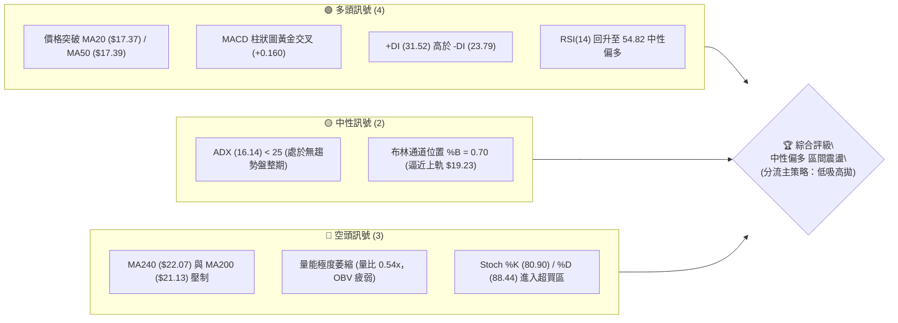
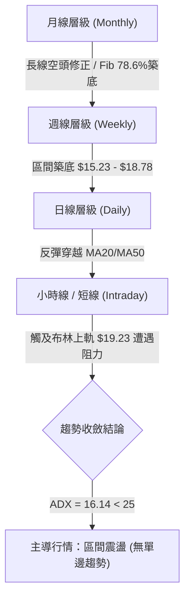
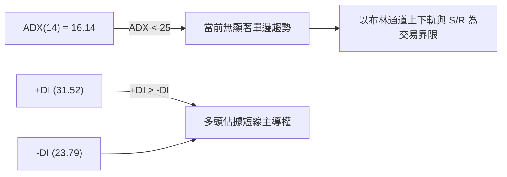
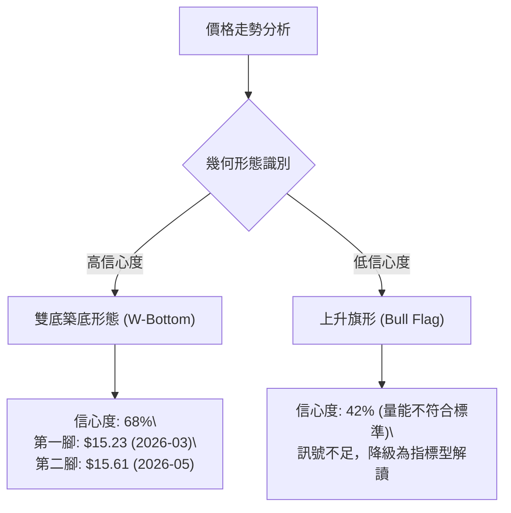
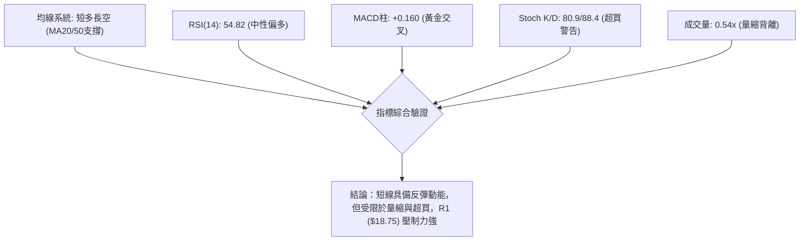
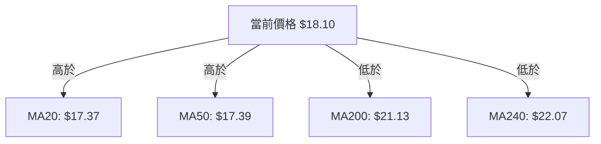
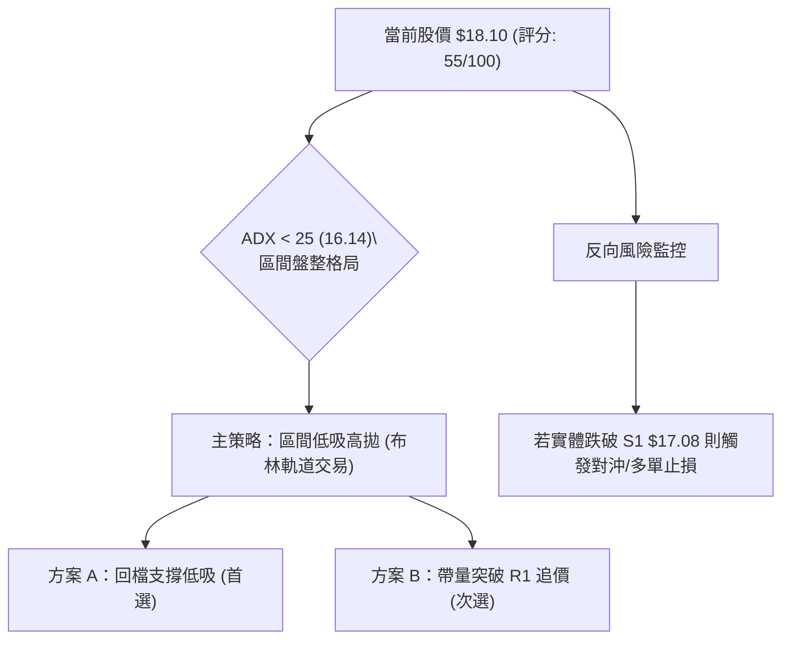
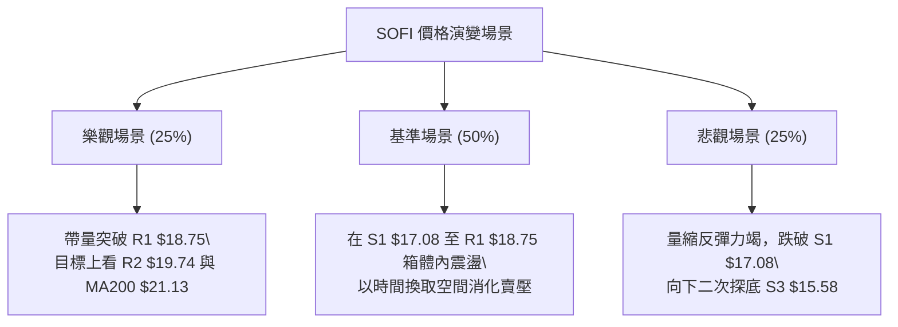

# SOFI 技術分析報告

> **報告日期**：2026-08-07 ｜ **語言**：繁體中文 ｜ **數據來源**：Yahoo Finance ｜ **當前價格**：$18.10

---

## 目錄

| 章節 | 內容 |
|------|------|
| [1. 技術面概覽](#1-技術面概覽) | 訊號儀表板、核心指標、評分卡 |
| [2. 趨勢分析](#2-趨勢分析) | 多時框趨勢、長中短期走勢、ADX強弱 |
| [3. 圖表形態分析](#3-圖表形態分析) | 形態識別、信心度、目標價推算 |
| [4. 支撐與阻力](#4-支撐與阻力) | 關鍵價位、斐波那契回調結構 |
| [5. 技術指標深度解讀](#5-技術指標深度解讀) | MA/RSI/MACD/布林/量價解讀 |
| [6. 動能與波動率](#6-動能與波動率) | 動能象限、ATR、Beta 與風險擴散 |
| [7. 多時框架總結](#7-多時框架總結) | 時框架矩陣與多時框收斂結論 |
| [8. 交易策略建議](#8-交易策略建議) | 路由判斷、價格情境、多空操作規劃 |
| [9. 風險提示與監控](#9-風險提示與監控) | 監控 Checklist、三態風險場景分析 |

---

## 1. 技術面概覽

### 🎯 技術訊號儀表板



### 📊 核心指標速覽表

| 指標類別 | 指標名稱 | 當前數值 | 訊號 | 解讀 |
|----------|----------|----------|------|------|
| **價格** | 當前價格 | $18.10 | 🟢 多頭 | 站上日線均線群，位於52週區間 18.0% 位置 |
| **均線** | MA20 | $17.37 | 🟢 多頭 | 價格位於 MA20 上方 (+4.18%)，短線扭轉頹勢 |
| **均線** | MA50 | $17.39 | 🟢 多頭 | 價格位於 MA50 上方 (+4.08%)，突破短期壓制 |
| **均線** | MA200 | $21.13 | 🔴 空頭 | 價格位於 MA200 下方 (-14.34%)，長線趨勢仍偏空 |
| **動能** | RSI(14) | 54.82 | 🟢 多頭 | 站上 50 中軸，動能由弱轉強，無明顯背離 |
| **動能** | MACD | +0.160 | 🟢 多頭 | MACD 線 (0.081) 翻正，柱狀圖持續擴張 |
| **趨勢** | ADX(14) | 16.14 | 🟡 中性 | ADX < 25，表明目前為區間震盪結構而非單邊行情 |
| **波動** | ATR(14) | $0.86 | 🟡 中性 | 每日波動率約 4.77%，波幅中等，適合區間操作 |
| **成交量**| 20日量比 | 0.54x | 🔴 空頭 | 今日量能僅 44.9M（均量 83.4M），屬於量縮反彈 |

### 🏆 技術評分卡

```
╔══════════════════════════════════════════════════════════════════╗
║                 技術評分卡 — SOFI (2026-08-07)                   ║
╠══════════════════════════════════════════════════════════════════╣
║ 趨勢強度 (ADX) ████████░░░░░░░░░░░░  40/100  🟡 弱趨勢/區間震盪  ║
║ 動能指標 (RSI) ████████████░░░░░░░░  60/100  🟢 多頭占優       ║
║ 支撐穩定度     ██████████████░░░░░░  70/100  🟢 S1($17.08)守穩  ║
║ 成交量配合     ████████░░░░░░░░░░░░  40/100  🔴 量縮價漲背離   ║
║ 形態完整度     ████████████░░░░░░░░  60/100  🟡 雙底/矩形築底   ║
║ 均線排列       ██████████░░░░░░░░░░  50/100  🟡 短多長空糾結   ║
╠══════════════════════════════════════════════════════════════════╣
║ 綜合評分       ███████████░░░░░░░░░  55/100  🟡 中性偏多區間   ║
╚══════════════════════════════════════════════════════════════════╝
```

---

## 2. 趨勢分析

### 🌐 多時框趨勢分析



### 📈 長期趨勢 — 24個月歷史走勢（Unicode）

SOFI 在經歷了 2025 下半年的歷史高點 ($29.72 – $32.73) 後，展開了長達數月的深度回調，低點觸及 52 週低位 $14.88。近期在 $15.50–$16.00 區域獲得強烈支撐，開啟階段性反彈。

```
SOFI 月線歷史走勢圖 (2024-08 至 2026-08)
價格軸 ($)
$30.00 ┤                                  ●   ● (高點 $29.72)
$27.00 ┤                              ●   │   │
$24.00 ┤                          ●   │   │   │   ●
$21.00 ┤                      ●   │   │   │   │   │   ●
$18.00 ┤                  ●   │   │   │   │   │   │   │           ● ← 現在 $18.10
$15.00 ┤          ●   ●   │   │   │   │   │   │   │   │   ●   ●   │
$12.00 ┤  ●   ●   │   │   │   │   │   │   │   │   │   │   │   │   │
$09.00 ┼──┴───┴───┴───┴───┴───┴───┴───┴───┴───┴───┴───┴───┴───┴───┴───
       24/08 10  12  25/02 04  06  08  10  12  26/02 04  06  08
```

#### 走勢特徵分析表

| 階段 | 時間區間 | 價格區間 | 變動幅度 | 主要技術特徵 |
|------|----------|----------|----------|--------------|
| **1. 初始主升段** | 2024/08 – 2024/11 | $7.99 ➔ $16.41 | +105.4% | 強勢量能帶動，突破多重均線 |
| **2. 高位震盪區** | 2024/12 – 2025/05 | $15.40 ➔ $13.30 | -13.6% | 籌碼換手，於 $11.63 建立中期底部 |
| **3. 狂熱拉升段** | 2025/06 – 2025/11 | $18.21 ➔ $29.72 | +63.2% | 創下 52 週高點 $32.73，指標嚴重超買 |
| **4. 估值修正段** | 2025/12 – 2026/03 | $26.18 ➔ $15.88 | -39.3% | 流動性收緊，連續跌破 MA20/MA50 |
| **5. 底部築底段** | 2026/04 – 2026/08 | $16.10 ➔ $18.10 | +12.4% | 於 S3 ($15.58) 築底，ADX 降至 16.14 進入盤整 |

### 📊 中期趨勢（週線結構）

從近 20 週收盤數據觀察：
- **低點聚類**：2026-03-29 低點 $15.23，2026-05-17 低點 $15.61，2026-08-02 低點 $16.31。支撐逐步墊高，呈現底部抬升特徵。
- **高點聚類**：2026-04-19 高點 $19.43，2026-07-12 高點 $18.78。上檔阻力集中於 R1 ($18.75) 至 R2 ($19.74)。

```
SOFI 週線阻力與支撐結構圖 ($)
$21.00 ┼─────────────────────────────────────────────── MA200 ($21.13)
$20.13 ┼─────────────────────────────────────────────── 阻力 R3 ($20.13)
$19.74 ┼─────────────────────────────────────────────── 阻力 R2 ($19.74)
$18.75 ┼───▲──────────▲──────────────────────────────── 阻力 R1 ($18.75)
$18.10 ┼───┼──────────┼───────────────● (現價)───────── 斐波那契 78.6% ($18.70)
$17.08 ┼───┼──────────┼───────────────┼──────────────── 支撐 S1 ($17.08)
$15.58 ┼───▼──────────▼───────────────▼──────────────── 支撐 S3 ($15.58)
```

### ⚡ 趨勢強度評估（ADX 解讀）



| 指標名稱 | 當前數值 | 判斷標準 | 狀態解讀 |
|----------|----------|----------|----------|
| **ADX (14)** | 16.14 | < 25 (弱趨勢/盤整) | 市場缺乏單邊推動力，趨勢策略容易遭遇洗盤，應採用**區間震盪策略**。 |
| **+DI (14)** | 31.52 | > -DI | 短期買盤意願高於賣盤。 |
| **-DI (14)** | 23.79 | < +DI | 空頭力道暫時退場，但未完全潰敗。 |

---

## 3. 圖表形態分析

### 🔍 形態識別系統



| 形態名稱 | 信心度 | 判斷依據（引用數據） | 完成度 | 目標價（附計算式） |
|----------|--------|----------------------|--------|--------------------|
| **雙底形態 (W-Bottom)** | **68%** | 第一腳 $15.23、第二腳 $15.61（接近 S3 $15.58），頸線位於 R1 $18.75。 | 85% | **$21.92**<br/>*(頸線 $18.75 + 形態高度 [$18.75 - $15.58 = $3.17] = $21.92)* |
| **矩形震盪區間** | **85%** | 價格介於 S3 ($15.58) 與 R1 ($18.75) 之間進行長達 4 個月的箱體整理。 | 90% | **$21.92** (向上突破) / **$12.41** (向下跌破) |

*註：根據嚴格要求 15，由於上升旗形信心度僅 42% (<50%)，不予採用該形態作為交易依據，僅做雙底與箱體之指標解讀。*

### 🕯️ 重要 K 線形態分析

| 日期/週期 | 收盤價 | K線形態 | 解讀 | 訊號 |
|-----------|--------|---------|------|------|
| **2026-08-02 週** | $16.31 | 下影線 hammer | 在 S1 ($17.08) 下方成功下探拉回，展現買盤承接力道 | 🟢 多頭轉折 |
| **2026-08-09 週** | $18.10 | 大陽線 (Long White Candle) | 週漲幅達 +10.97%，一舉貫穿 MA20 與 MA50 | 🟢 轉強確認 |
| **日線 (最近)** | $18.10 | 連續多頭長紅 | 突破日線 MA20/MA50 壓制，帶動短線動能 | 🟢 短多確立 |

### 📉 ASCII 走勢形態示意圖

```
SOFI 雙底/箱體築底形態示意圖 ($)
$19.74 ┤                                                 [R2 壓力]
$18.75 ┤─────────────頸線 / 箱頂 (R1 $18.75)───────────────
       │               ▲                       ▲
       │              / \                     / \
$18.10 ┤             /   \                   /   ●現價 $18.10
$17.08 ┤            /     \                 /
       │           /       \               /
$15.58 ┤──────────●─────────●─────────────●────────────── [S3 支撐]
                 第一腳      第二腳        第三腳墊高
               (2026-03)   (2026-05)     (2026-08)
```

---

## 4. 支撐與阻力

### 🗺️ 關鍵價位分布圖（Unicode）

```
SOFI 價位結構分布圖
═══════════════════════════════════════════════════════════════════
$32.73 ║████████████████████████████████████████║ 52週高點 / 0.0% Fib
$28.52 ║████████████████████                    ║ 23.6% 斐波那契位
$25.91 ║██████████████                          ║ 38.2% 斐波那契位
$23.80 ║██████████                              ║ 50.0% 斐波那契位
$22.07 ║████████████████████████████████████████║ 240日均線 MA240
$21.70 ║████████                                ║ 61.8% 斐波那契位
$21.13 ║████████████████████████████████████████║ 200日均線 MA200
$20.13 ║████████████████████████                ║ 強阻力 R3
$19.74 ║████████████████                        ║ 阻力 R2 / 布林上軌 ($19.23)
$18.75 ║████████████████████████████████████████║ 關鍵阻力 R1 / 78.6% Fib ($18.70)
$18.10 ╠════════════════════════════════════════╣ ◄ 當前價格 $18.10
$17.37 ║▓▓▓▓▓▓▓▓▓▓▓▓▓▓▓▓▓▓▓▓▓▓▓▓▓▓▓▓▓▓▓▓▓▓▓▓▓▓▓▓║ MA20 / MA50 重合支撐區
$17.08 ║▓▓▓▓▓▓▓▓▓▓▓▓▓▓▓▓▓▓▓▓▓▓▓▓                ║ 近期支撐 S1
$16.67 ║▓▓▓▓▓▓▓▓▓▓▓▓▓▓                          ║ 中期支撐 S2
$15.58 ║████████████████████████████████████████║ 強支撐 S3 (波段底部聚類)
$14.88 ║████████████████████████████████████████║ 52週低點 / 100.0% Fib
═══════════════════════════════════════════════════════════════════
```

### 🚧 阻力位分析表

| 阻力級別 | 精確價位 | 形成原因（引用數據） | 突破難度 | 技術重要性 |
|----------|----------|----------------------|----------|------------|
| **阻力 R1** | **$18.75** | 近一年波段高點聚類、近78.6% 斐波那契位 ($18.70) | 🔴 高 | **極關鍵**：箱體頂部與雙底頸線，突破方能擺脫盤整。 |
| **阻力 R2** | **$19.74** | 近一年波段高點聚類、布林通道上軌 ($19.23) 附近 | 🟡 中 | 短線多頭獲利了結敏感區。 |
| **阻力 R3** | **$20.13** | 近一年波段高點聚類、接近 MA200 ($21.13) | 🔴 高 | 中長線多空分水嶺防線。 |

### 🛡️ 支撐位分析表

| 支撐級別 | 精確價位 | 形成原因（引用數據） | 守住機率 | 技術重要性 |
|----------|----------|----------------------|----------|------------|
| **支撐 S1** | **$17.08** | 近一年波段低點聚類、密合 MA20 ($17.37)/MA50 ($17.39) | 🟢 高 | **短線防線**：回檔不破方能維持多頭反彈格局。 |
| **支撐 S2** | **$16.67** | 近一年波段低點聚類 | 🟡 中 | 區間震盪之中軸支撐位。 |
| **支撐 S3** | **$15.58** | 近一年波段低點聚類、52週低點 ($14.88) 護城河 | 🟢 極高 | **長線防禦位**：多頭最後陣地，破則下尋新低。 |

### 📐 斐波那契回調位分析

（基於 52 週區間 $14.88 ➔ $32.73 計算）

```
100.0% (52W 低點) ── $14.88
 78.6%            ── $18.70  ◄ (現價 $18.10 處於 78.6% 與 100% 之間)
 61.8%            ── $21.70
 50.0%            ── $23.80
 38.2%            ── $25.91
 23.6%            ── $28.52
  0.0% (52W 高點) ── $32.73
```

- **位置解讀**：現價 $18.10 剛好落在 100.0% ($14.88) 至 78.6% ($18.70) 的深層回調區間內。
- **技術意義**：$18.70 (78.6%) 是極為強烈的黃金分割阻力位，與 R1 ($18.75) 重合。若能帶量實體收復 $18.70–$18.75，技術面將開啟通往 61.8% ($21.70) 的回補空間。

---

## 5. 技術指標深度解讀

### 🎛️ 指標訊號總覽



### 📈 移動平均線排列分析



- **均線排列狀態**：整體呈現 MA20 < MA50 < MA200 的典型**空頭排列（Bearish Alignment）**。
- **短線轉變**：價格 $18.10 已向上穿越 MA20 ($17.37) 與 MA50 ($17.39)，且 MA5 ($17.88)、MA10 ($17.12) 強勢上揚。短線均線已轉化為下檔支撐，形成「短多長空」的交會結構。

### 📉 RSI(14) 分析

- **RSI 數值進度條**：
  `RSI(14) = 54.82` ▓▓▓▓▓▓▓▓▓▓▓▓█░░░░░░░ 54.82% (中性偏多區間)
- **區間評估**：自前期的超賣區 (30-40) 穩定爬升至 50 中軸上方，顯示買盤逐步掌控短線主導權。
- **背離判斷**：從近 20 週數據來看，收盤價在 2026-03 創低點 $15.23 時 RSI 為 11.8，而後續價格跌至 $15.61 時 RSI 保持在 30.2，**呈現隱性週線底背離**，印證底部支撐之有效性。日線目前無頂背離訊號。

### 📊 MACD (12/26/9) 訊號解讀

- **MACD 線**：`0.081`
- **Signal 線**：`-0.080`
- **柱狀圖 (Histogram)**：`+0.160` 🟢 **看多訊號**
- **解讀**：MACD 線向上突破訊號線，柱狀圖正向擴張，確認短線多頭交叉（Golden Cross）。然而 MACD 線僅略高於 0 軸，強度尚不足以發動大規模單邊主升段。

### 📦 布林通道分析

```
SOFI 布林通道結構示意圖
$19.23 ┼───────────────────────────────────────── 布林上軌 ($19.23)
$18.10 ┼───────────────────────● (現價 %B=0.70)
$17.37 ┼───────────────────────────────────────── 布林中軌/MA20 ($17.37)
$15.51 ┼───────────────────────────────────────── 布林下軌 ($15.51)
```

- **通道帶寬**：上軌 $19.23，下軌 $15.51，帶寬約 $3.72 (20.5%)，通道呈現平行收斂後微微擴張。
- **%B 位置**：當前 %B 為 **0.70**，價格逼近上軌區間，短期再上行空間受限於上軌壓制 ($19.23)。

### 💹 成交量分析（量價配合度）

- **最新成交量**：44,943,690 股
- **20日均量**：83,388,074 股（**量比 0.54x**）
- **OBV 趨勢**：`OBV < MA`（量能指標低於其移動平均線）
- **量價診斷**：🔴 **量價背離**。近期價格自 $16.31 快速反彈至 $18.10，但成交量較 20 日均量大幅萎縮近一半。表明當前上漲主因是賣壓竭盡而非強烈追價買盤。無量反彈若遇到 R1 ($18.75) 強阻力，易引發換手失敗的回檔。

---

## 6. 動能與波動率

### ⚡ 動能評估

根據 ADX = 16.14（弱趨勢）與 Beta = 2.204（高波動性），SOFI 在動能與波動度矩陣中的位置如下：

| 象限 | 動能強度 | 波動率 | 當前狀態 | 策略建議 |
|------|----------|--------|----------|----------|
| Q1 (高動能/低波動) | 強 | 低 | — | 最佳趨勢持有 |
| Q2 (低動能/低波動) | 弱 | 低 | — | 盤整觀望 |
| **Q3 (低動能/高波動)** | **弱** | **高** | **✓ 當前 SOFI 位置** | **高頻區間交易 / 嚴格止損** |
| Q4 (高動能/高波動) | 強 | 高 | — | 突破追價 (高風險高報酬) |

### 📊 ATR 波動率分析

- **ATR(14)**：**$0.86**（占當前股價 4.77%）
- **每日預期波動區間**：$18.10 ± $0.86 ➔ [$17.24 ~ $18.96]
- **止損距離建議**：
  - 短線波段（1.5 倍 ATR）：$0.86 × 1.5 = **$1.29**（即離進場點約 7.1%）
  - 中線趨勢（2.0 倍 ATR）：$0.86 × 2.0 = **$1.72**（即離進場點約 9.5%）

### 📐 Beta 與市場相關性

- **Beta 係數**：**2.204**（屬於高高貝塔股票）
- **風險特徵**：SOFI 的波動幅度約為標普 500 指數的 2.2 倍。在大盤震盪或大盤回調時，SOFI 下挫風險較高；反之在大盤反彈時具有較高的彈性。因此倉位控制必須更加嚴格。

---

## 7. 多時框架總結

### 📋 時框架評分表

| 時框架 | 趨勢方向 | 動能指標 | 均線排列 | 形態結構 | 綜合評分 | 交易建議 |
|--------|----------|----------|----------|----------|----------|----------|
| **月線 (Monthly)** | 🔴 空頭修正 | 🟡 中性 | 🔴 空頭排列 | Fib 78.6% 築底中 | 40/100 | 長線分批建倉或觀望 |
| **週線 (Weekly)** | 🟡 區間盤整 | 🟢 MACD金叉 | 🟡 MA20受阻 | 雙底/箱體整理 | 58/100 | 區間低吸高拋 |
| **日線 (Daily)** | 🟢 短線反彈 | 🟢 RSI 54.82 | 🟢 站上MA20/50 | 反彈逼近阻力位 | 62/100 | 尋求回檔進場機會 |

### ⚖️ 多時框收斂結論

依據多時框收斂規則（規則 14）：
1. **行情定性**：當前 ADX(14) = 16.14 < 25，明確定義為**無單邊趨勢的「區間盤整行情」**。
2. **主導規則**：盤整行情下，以日線布林通道 ($15.51 – $19.23) 及關鍵阻力 R1 ($18.75) / 支撐 S1 ($17.08) 為核心交易邊界。
3. **最終一致性結論**：**中性偏多，區間震盪**。短線具有反彈動能，但受限於量縮與 R1 壓制，不具備直接單邊暴漲條件，主策略採「回檔至支撐位低吸，逼近阻力位高拋」。

---

## 8. 交易策略建議

### 🗺️ 策略決策流程圖



### 🧭 策略路由

> **當前主策略方向 = 🟡 中性偏多區間操作（技術評分 55/100）**

因評分介於 40–60 之間，且 ADX < 25，策略定位為**高拋低吸的區間震盪操作**。

### 🎯 價格情境階梯 (Price Scenarios)

| 觸發條件 | 下一目標價 | 後續延伸目標 | 情境技術含義 |
|----------|------------|--------------|--------------|
| **帶量突破 R1 $18.75** | R2 $19.74 | R3 $20.13 / MA200 $21.13 | 雙底形態完成，中期轉強 |
| **站穩 $17.37 - $18.10 區間** | R1 $18.75 | — | 區間震盪消化賣壓 |
| **跌破 S1 $17.08** | S2 $16.67 | S3 $15.58 | 反彈失敗，重回探底格局 |

### 📊 情境機率分佈

```
情境機率分佈圖
┌────────────────────────────────────────────────────────┐
│ 區間震盪 / 測試 R1 ($18.75)    ████████████████  50%   │
│ 突破 R1 並挑戰 R2 ($19.74)     ████████          25%   │
│ 回落跌破 S1 測試 S3 ($15.58)   ████████          25%   │
└────────────────────────────────────────────────────────┘
```

| 情境 | 機率 | 主要依據 |
|------|------|----------|
| **區間震盪 / 測試 R1** | **50%** | ADX = 16.14 處於盤整期，MACD 柱狀圖看多但成交量僅 0.54x。 |
| **突破 R1 上尋 R2/R3** | **25%** | +DI (31.52) 強勁，RSI 54.82 具備進一步衝高空間。 |
| **回落測試 S1/S3** | **25%** | Stoch %K/%D 超買，量縮反彈易遭高位獲利賣壓拉回。 |

### 🟢 主策略詳情

#### 策略 A：區間低吸策略（首選操作 — 回檔買進）

```
策略 A 進退場價位示意圖 ($)
$18.75 ┼───────────────────────────────────────── 目標價 T1 ($18.75)
$18.10 ┼─────────────────────── (現價觀望)
$17.37 ┼───────────────────────────────────────── 進場點上限 ($17.37 MA20)
$17.08 ┼───────────────────────────────────────── 進場點下限 ($17.08 S1)
$16.67 ┼───────────────────────────────────────── 嚴格止損點 ($16.67 S2)
```

| 策略要素 | 策略 A (回檔接多) | 策略 B (突破追多) |
|----------|───────────────────|───────────────────|
| **策略類型** | 區間低吸 (Range Long) | 突破跟進 (Breakout Long) |
| **進場條件** | 價格回檔至 S1/MA20 附近出現止跌訊號 | 每日收盤實體帶量突破 R1 $18.75 |
| **進場價格** | **$17.08 – $17.37** | **$18.80 – $18.90** |
| **目標價 T1** | **$18.75** (收益率 +7.9% ~ +9.8%) | **$19.74** (收益率 +4.4% ~ +5.0%) |
| **目標價 T2** | **$19.74** (收益率 +13.6% ~ +15.5%) | **$21.13** (MA200, 收益率 +11.8% ~ +12.4%) |
| **止損價格** | **$16.67** (跌破 S2，虧損 -2.4% ~ -4.0%) | **$18.10** (跌回頸線下方，虧損 -3.7% ~ -4.2%) |
| **風險報酬比** | **2.5 : 1** (以 T1 計算) | **2.2 : 1** (以 T2 計算) |
| **建議倉位** | **15% – 20%** | **10% – 15%** (分批加碼) |

### 🔴 反向風險觸發點（對沖與止損提示）

若出現以下訊號，多頭結構失效，應執行多單止損或進行空頭對沖：
1. **關鍵價位失守**：日線收盤價強烈跌破 **S1 $17.08**，並進一步下破 **S2 $16.67**。
2. **指標轉空**：MACD 柱狀圖由正轉負（跌破 0 軸），且 ADX 突然上升突破 25（單邊下跌趨勢形成）。
3. **對沖建議**：若跌破 $16.67，可針對多頭頭寸進行反向空頭對沖，下檔目標看至 S3 **$15.58**。

### ⭐ 整體訊號強度評星

```
做多訊號強度：★★★☆☆  (3/5 星 - 受限於成交量)
做空訊號強度：★★☆☆☆  (2/5 星 - 短線均線支撐強)
整體可信度：  ★★★☆☆  (3.5/5 星 - 區間邊界清晰)
```

---

## 9. 風險提示與監控

### ✅ 關鍵監控指標 Checklist

```
╔══════════════════════════════════════════════════════════════════╗
║                    每日盤後技術監控 CHECKLIST                    ║
╠══════════════════════════════════════════════════════════════════╣
║ [ ] 1. 價格是否站穩 MA20 ($17.37) 與 MA50 ($17.39) 之上？        ║
║ [ ] 2. 日成交量能否回升至 80M 股以上 (確認量能突破)？             ║
║ [ ] 3. RSI(14) 能否維持在 50-65 的多頭推進區間？                  ║
║ [ ] 4. Stoch %K 是否在超買區 (>80) 發生死叉死結拉回？            ║
║ [ ] 5. 阻力位 R1 ($18.75) 觸及時是否有長上影線拋壓？             ║
║ [ ] 6. 支撐位 S1 ($17.08) 能否提供有效收盤支撐？                 ║
╚══════════════════════════════════════════════════════════════════╝
```

### ⚠️ 風險場景分析



### 🛡️ 風險管理重要提醒

1. **高 Beta 波動管理**：SOFI Beta 為 2.204，屬於高波動金融科技股。單一交易倉位切勿超過總投資組合的 20%，並嚴格執行 ATR 止損機制（建議距離 $1.29 左右）。
2. **量能不匹配風險**：目前量比僅 0.54x，屬於典型的「無量反彈」。在缺乏機構大資金顯著流入（量能擴充至 83M 以上）之前，切忌在接近阻力位 R1 ($18.75) 時盲目追高。
3. **宏觀與利率敏感性**：作為信貸與金融科技服務商，SOFI 對美國利率預期極為敏感。監控市場利率變化對融資成本及貸款業務之衝擊。

---

## 📋 報告總結

```
╔══════════════════════════════════════════════════════════════════╗
║                   SOFI 技術分析報告總結                          ║
════════════════════════════════════════════════════════════════════
 報告日期：2026-08-07
 當前價格：$18.10
 分析評級：🟡 中性偏多（區間震盪 / 低吸高拋）

 關鍵結論：
 ├─ 長期趨勢：🔴 空頭修正（受制於 MA200 $21.13，於 $14.88-$15.58 築底）
 ├─ 中期趨勢：🟡 區間整理（$15.58 - $18.75 雙底/箱體結構）
 ├─ 短期趨勢：🟢 貫穿 MA20/MA50，MACD 金叉反彈
 ├─ 關鍵支撐：S1: $17.08  │  S2: $16.67  │  S3: $15.58
 ├─ 關鍵阻力：R1: $18.75  │  R2: $19.74  │  R3: $20.13
 └─ 分析師共識目標價：$19.87 (均值)

 最優策略組合：
 1. 🥇 最佳機會（策略 A）：等候價格拉回 S1/MA20 ($17.08 - $17.37) 分批布局低吸，
                         目標看至 R1 ($18.75) / R2 ($19.74)，止損設於 S2 ($16.67)。
 2. 🥈 次選機會（策略 B）：若日線帶量實體突破 R1 ($18.75)，則順勢追價，
                         目標看至 MA200 ($21.13)，止損設於 $18.10。
 3. 🥉 保守選擇：在 ADX < 25 且量能未放大前，維持觀望或僅以極小倉位進行區間操作。
════════════════════════════════════════════════════════════════════
```

---

> ⚠️ **免責聲明**：本報告為 AI 自動生成之技術分析，所有數據及估算均基於提供的歷史價格資訊。本報告**僅供研究與學術參考**，**不構成任何投資建議**。投資有風險，入市需謹慎。

---

*報告生成時間：2026-08-07 ｜ 數據來源：Yahoo Finance ｜ 分析框架：多時框技術分析*