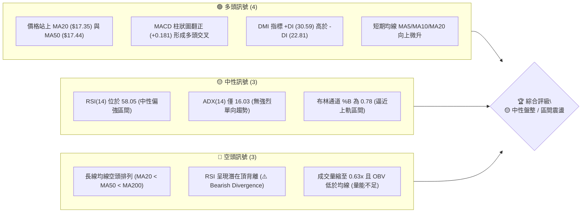
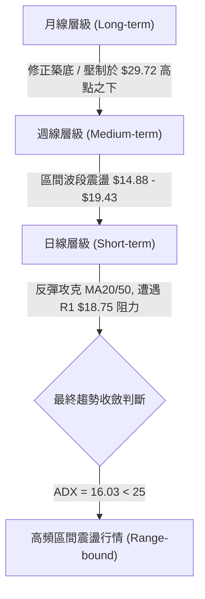
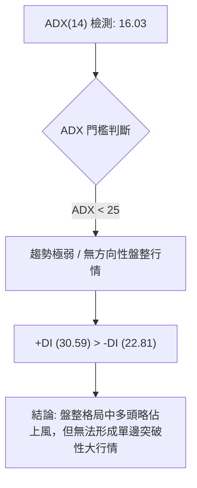
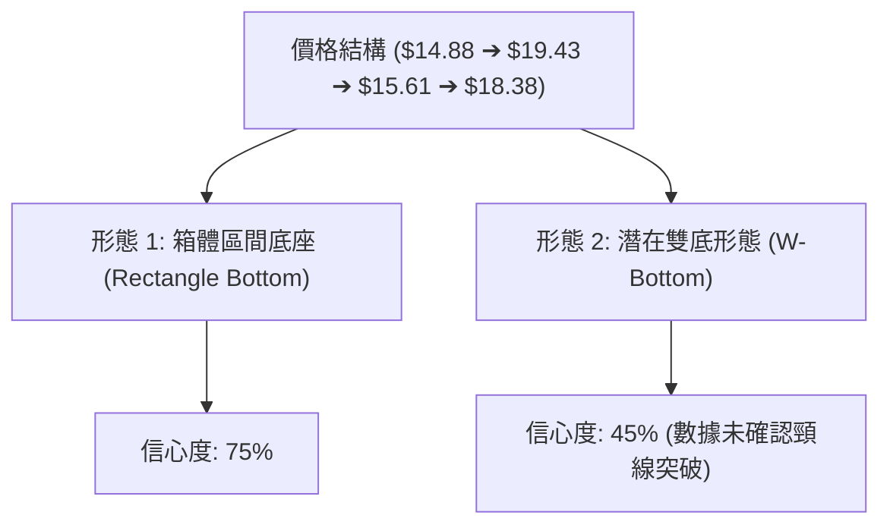
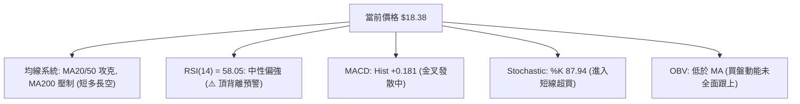
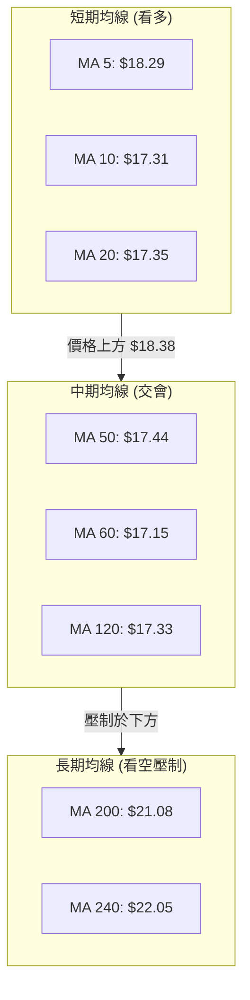
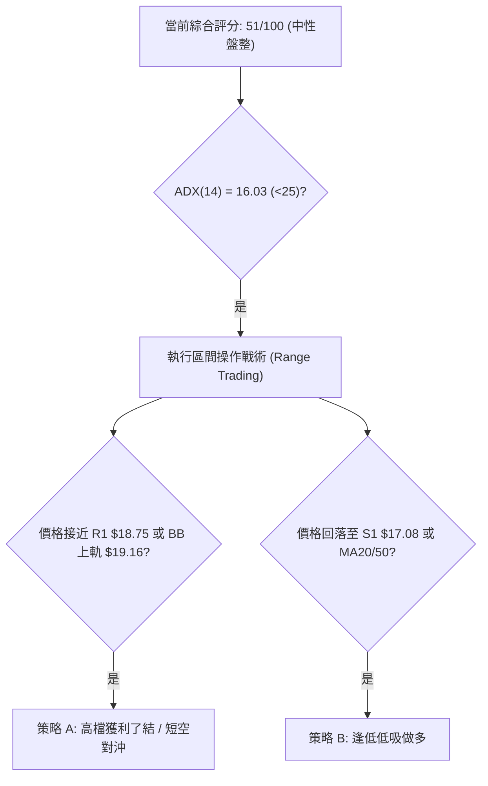
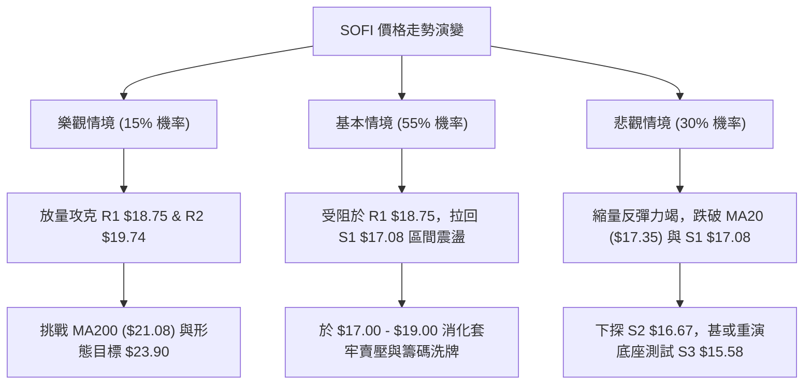

# SOFI 技術分析報告

> **報告日期**：2026-08-08 ｜ **語言**：繁體中文 ｜ **數據來源**：Yahoo Finance ｜ **當前價格**：$18.38

---

## 目錄

| 章節 | 內容 |
|------|------|
| [1. 技術面概覽](#1-技術面概覽) | 訊號儀表板、核心指標、評分卡 |
| [2. 趨勢分析](#2-趨勢分析) | 多時框趨勢、長中短期走勢 |
| [3. 圖表形態分析](#3-圖表形態分析) | 形態識別、K線組合、目標價 |
| [4. 支撐與阻力](#4-支撐與阻力) | 關鍵價位、斐波那契回調 |
| [5. 技術指標深度解讀](#5-技術指標深度解讀) | MA/RSI/MACD/布林/成交量 |
| [6. 動能與波動率](#6-動能與波動率) | 動能評估、ATR、Beta |
| [7. 多時框架總結](#7-多時框架總結) | 時框架評分矩陣 |
| [8. 交易策略建議](#8-交易策略建議) | 多空策略、風險報酬比 |
| [9. 風險提示與監控](#9-風險提示與監控) | 監控指標、風險場景 |

---

## 1. 技術面概覽

### 🎯 技術訊號儀表板



### 📊 核心指標速覽表

| 指標類別 | 指標名稱 | 當前數值 | 訊號 | 解讀 |
|----------|----------|----------|------|------|
| **價格** | 當前收盤價 | $18.38 | 🟡 中性 | 處於52週區間 $14.88–$32.73 之 19.6% 分位，自底部小幅反彈 |
| **均線** | MA20 / MA50 | $17.35 / $17.44 | 🟢 看多 | 現價已攻克短中期均線，短線獲得防守支撐 |
| **均線** | MA200 / MA240 | $21.08 / $22.05 | 🔴 看空 | 現價低於年線，中長期大格局仍受到整體空頭排列壓制 |
| **動能** | RSI(14) | 58.05 | 🟡 中性 | 動能回升至中軸上方，但需警惕數據提示之頂背離風險 |
| **動能** | MACD (12,26,9) | Hist +0.181 | 🟢 看多 | MACD (0.146) 上穿 Signal (-0.034)，金叉成立發射看多訊號 |
| **動能** | Stochastic %K/%D | 87.94 / 84.51 | 🔴 超買 | 極短線進入超買區，短線隨時可能出現回檔修正 |
| **趨勢強度** | ADX(14) | 16.03 | 🟡 弱趨勢 | ADX < 25 顯示當前為典型盤整震盪行情，缺乏單邊突破力道 |
| **波動** | ATR(14) | $0.87 (4.71%) | 🟡 中度 | 每日波動幅度約 $0.87，提供合理的止損設置空間 |
| **量能** | 20日量比 / OBV | 0.63x / OBV<MA | 🔴 疲弱 | 攻擊量能不足，未能有效放大，量價配合出現輕微背離 |

### 🏆 技術評分卡

```
技術評分卡 — SOFI (2026-08-08)
════════════════════════════════════════════════════
趨勢強度      ████████░░░░░░░░░░░░  40/100  🟡 弱趨勢 (ADX 16.03)
動能指標      ████████████░░░░░░░░  60/100  🟢 中性偏多 (MACD金叉)
支撐穩定度    █████████████░░░░░░░  65/100  🟢 良好 (S1 $17.08 強支撐)
成交量配合    ████████░░░░░░░░░░░░  40/100  🔴 量能疲弱 (量比 0.63x)
形態完整度    ██████████░░░░░░░░░░  50/100  🟡 區間打底 (箱體震盪)
均線排列      ██████████░░░░░░░░░░  50/100  🟡 短多長空 (價格站上MA20/50)
════════════════════════════════════════════════════
綜合評分      ██████████░░░░░░░░░░  51/100  🟡 中性觀望 (區間交易)
════════════════════════════════════════════════════
```

---

## 2. 趨勢分析

### 🌐 多時框趨勢分析



### 📈 長期趨勢 — 12個月走勢圖（Unicode）

SOFI 在 2025 年下半年迎來強烈牛市攻勢，於 2025 年 11 月達到 $29.72 的歷史高點區間。隨後受總體環境與獲利結算影響，展開為期半年的深幅回調，於 2026 年 3 月底探底至近一年低點 $14.88 附近，目前呈現築底回升後的箱體整理狀態。

```
SOFI 月線走勢圖（過去12個月：2025-08 至 2026-08）
價格軸 ($)
$30.00 ┤                             ●  ●(2025-11高點 $29.72)
$27.00 ┤                      ●   ●     ●
$24.00 ┤               ●                    ●
$21.00 ┤        ●                                 ●
$18.00 ┤ ●                                              ●   ●   ●   ●(現價 $18.38)
$15.00 ┤                                                    ●   ●
       └───────────────────────────────────────────────────────────────
        08  09  10  11  12  01  02  03  04  05  06  07  08  (月份)
```

**走勢特徵分析表格**：

| 階段 | 時間區間 | 收盤價變化 | 漲跌幅 | 走勢特徵與主導力量 |
|------|----------|------------|--------|--------------------|
| **主升浪** | 2025-08 ~ 2025-11 | $25.54 → $29.72 | +16.36% | 強勢多頭攻勢，市場資金大量湧入，創出近一年新高 $32.73 |
| **主跌浪** | 2025-11 ~ 2026-03 | $29.72 → $15.88 | -46.57% | 空頭全面主導，獲利了結賣壓湧現，連續數月大幅下殺 |
| **打底打回升** | 2026-03 ~ 2026-05 | $15.88 → $18.22 | +14.74% | 觸及 52 週低點 $14.88 後觸底反彈，於 $15.00–$16.00 築底 |
| **箱體震盪** | 2026-05 ~ 2026-08 | $18.22 → $18.38 | +0.88% | 於 $15.50 至 $19.50 間反覆洗盤，量能萎縮，進入籌碼沉澱期 |

### 📊 中期趨勢（週線分析）

從近 20 週的週線數據來看，SOFI 在 2026 年 3 月底（2026-03-29 週）見底 $15.23（週收盤），RSI 極端超賣至 11.8。隨後在 4 月中旬一度衝高至 $19.43（RSI 飆升至 86.7），但因缺乏高檔買盤承接，快速回落至 $15.61 重新築底。

目前週線呈現明顯的 **底部抬升箱體型態**：
- **上方中期壓力線**：$18.75（R1 阻力位）至 $19.74（R2 阻力位）。
- **下方中期支撐線**：$17.08（S1 支撐位）至 $15.58（S3 支撐位/箱體底部）。

```
SOFI 近期週線壓力與支撐示意圖
$20.13 ─── [R3 強阻力區] ───────────────────────────────────
$19.74 ─── [R2 波段高點阻力] ───────────────────────────────
$18.75 ─── [R1 近期阻力 / 78.6% Fib] ───────────────────────
$18.38 ─── ▲ 當前收盤價 (處於 R1 與 S1 之間的震盪帶)
$17.08 ─── [S1 近期波段支撐 / MA20] ───────────────────────
$16.67 ─── [S2 次級支撐區] ─────────────────────────────────
$15.58 ─── [S3 近一年箱體底座 / 布林下軌] ───────────────────
```

### ⚡ 趨勢強度評估（ADX 解讀）



**ADX 趨勢強度對照解讀**：

| 指標 | 當前數值 | 參考標準 | 當前市場狀態 | 交易對策 |
|------|----------|----------|--------------|----------|
| **ADX(14)** | **16.03** | < 25 (弱趨勢/盤整) | **無明確趨勢（盤整區間）** | 高拋低吸，以布林通道與 S/R 位為準 |
| **+DI** | **30.59** | > 20 (多頭活躍) | 短線多頭力道復甦 | 尋求支撐位回檔做多機會 |
| **-DI** | **22.81** | < +DI | 空頭主導權暫時消退 | 空頭不宜在此追空 |

---

## 3. 圖表形態分析

### 🔍 形態識別系統



#### 形態評估與信心度分析（依據數據嚴格審核）

| 形態名稱 | 信心度 | 判斷依據（引用數據） | 完成度 | 目標價（附計算式） |
|----------|--------|----------------------|--------|--------------------|
| **箱體整理 (Rectangle)** | **75%** | 價格受限於 S3 ($15.58) 與 R2 ($19.74) 之間反覆震盪，ADX = 16.03 < 25 強烈確認 | 85% | 突破箱頂 R2 ($19.74) 後，向上測距：$19.74 + ($19.74 - $15.58) = **$23.90** |
| **潛在雙底 (W-Bottom)** | **45%** | 第一底 $14.88 (52W Low)，第二底 $15.61 (5月中旬低點)。頸線為 $19.43 (4月中高點) | 40% | 訊號不足，目前尚未突破頸線 $19.43，僅作參考不作為主交易依據 |

### 🕯️ 重要K線形態分析

根據近期週線與日線數據，SOFI 在 $15.50–$16.00 區域形成多次下影線探底組合，顯示低位買盤堅定：

| 日期/月份 | 收盤價 | K線形態 | 技術面解讀 | 訊號評級 |
|-----------|--------|---------|------------|----------|
| **2026-03** | $15.88 | 長下影錘子線 | 探底 52 週低點 $14.88 後強烈反彈，宣告波段跌勢暫告段落 | 🟢 看多反轉 |
| **2026-05** | $18.22 | 衝高回落倒錘頭 | 嘗試攻擊 $19.50 上方遇阻，留下長上影線，代表高檔賣壓沉重 | 🔴 短線拉回 |
| **2026-07** | $16.31 | 下影縮量十字星 | 在 S1/S2 支撐位前止跌沉澱，成交量降至低點，籌碼清洗充分 | 🟢 底部確立 |
| **2026-08** | $18.38 | 中陽線突破 | 強勢拉升攻克 MA20 ($17.35) 與 MA50 ($17.44)，短線多頭掌控 | 🟢 短多再起 |

### 📉 ASCII 走勢形態示意圖

```
SOFI 箱體整理與潛在雙底示意圖
 價格 ($)
 $20.00 ┬─────────────────────── 頸線 / 箱頂壓制區 (R2: $19.74) ────────
        │                            /\
 $18.38 ┼─ 現在 ───────────────────/──\──────────────● (目前衝高至此)
        │            /\          /      \            /
 $17.08 ┼───────────/──\────────/────────\──────────/── 中軸支撐 (S1)
        │          /    \      /          \        /
 $15.50 ┴─────────●──────\────●────────────\──────●──── 第一底/第二底 (S3: $15.58)
                (3月底)  (4月中)         (5月中)
```

### 🎯 形態目標價計算

若 SOFI 未來能放量突破箱頂阻力 **R2 ($19.74)**：
1. **箱體高度 (Height)** = 箱頂 $19.74 - 箱底 $15.58 = **$4.16**
2. **第一保守目標價 (T1)** = R1 阻力位 = **$18.75**（當前短線阻力）
3. **第二形態推算目標價 (T2)** = 箱頂 $19.74 + 箱體高度 $4.16 = **$23.90**（接近 50% 斐波那契位 $23.80）

---

## 4. 支撐與阻力

### 🗺️ 關鍵價位分布圖（Unicode）

```
SOFI 價位結構分布圖 (由 OHLCV 歷史數據聚類計算)
════════════════════════════════════════════════════════════════
$32.73 ║████████████████████████████████████████║ 52週最高點 (0.0% Fib)
$28.52 ║████████████████████████                ║ 23.6% 斐波那契回調位
$25.91 ║██████████████████                      ║ 38.2% 斐波那契回調位
$23.80 ║██████████████                          ║ 50.0% 斐波那契回調位
$21.70 ║██████████                              ║ 61.8% 斐波那契回調位 / MA200 ($21.08)
$20.13 ║████████                                ║ 關鍵阻力 R3 (+9.52%)
$19.74 ║██████                                  ║ 波段阻力 R2 (+7.40%)
$18.75 ║████                                    ║ 近期阻力 R1 (+2.00%) / 78.6% Fib ($18.70)
$18.38 ╠════════════════════════════════════════╣ ◄ 現價 (Current Price)
$17.08 ║▓▓▓▓▓▓▓▓                                ║ 近期支撐 S1 (-7.07%) / MA20 ($17.35)
$16.67 ║▓▓▓▓▓▓▓▓▓▓▓▓                            ║ 波段支撐 S2 (-9.32%)
$15.58 ║▓▓▓▓▓▓▓▓▓▓▓▓▓▓▓▓▓▓▓▓                    ║ 強力支撐 S3 (-15.26%) / 布林下軌 ($15.55)
$14.88 ║▓▓▓▓▓▓▓▓▓▓▓▓▓▓▓▓▓▓▓▓▓▓▓▓▓▓▓▓▓▓          ║ 52週最低點 (100.0% Fib)
════════════════════════════════════════════════════════════════
```

### 🚧 阻力位分析表

數據來源明確，阻力位基於近一年波段高點聚類算得：

| 阻力級別 | 精確價位 | 距現價幅度和 | 形成原因與技術意涵 | 突破難度 | 重要性 |
|----------|----------|--------------|----------------────|----------|--------|
| **R1** | **$18.75** | +2.00% | 78.6% 斐波那契回調位 ($18.70) 與 7 月高點密集成交區 | 🟡 中等 | 短線多空分水嶺 |
| **R2** | **$19.74** | +7.40% | 2026 年 4 月中旬波段高點，箱體上方頂部套牢區 | 🔴 較高 | 箱體突破確認點 |
| **R3** | **$20.13** | +9.52% | 心理整數關卡 $20.00 壓力疊加波段密集成交高點 | 🔴 極高 | 翻多中長線大關 |

### 🛡️ 支撐位分析表

| 支撐級別 | 精確價位 | 距現價幅度和 | 形成原因與技術意涵 | 守住機率 | 重要性 |
|----------|----------|--------------|----------------────|----------|--------|
| **S1** | **$17.08** | -7.07% | MA20 ($17.35)、MA50 ($17.44) 均線交會聚類支撐區 | 🟢 高 (75%) | 短線退守底線 |
| **S2** | **$16.67** | -9.32% | 2026 年 6 月與 7 月兩次拉回低點之強支撐帶 | 🟢 高 (80%) | 中期多頭防線 |
| **S3** | **$15.58** | -15.26% | 52 週底座聚類區（$15.50–$15.60）及布林下軌 ($15.55) | 🟢 極高 (90%) | 鋼鐵底部區間 |

### 📐 斐波那契回調位分析

基於 52 週高點 **$32.73** 與 52 週低點 **$14.88** 進行黃金分割計算：

- **0.0% (52W High)**: $32.73
- **23.6%**: $28.52
- **38.2%**: $25.91
- **50.0%**: $23.80
- **61.8%**: $21.70
- **78.6%**: $18.70
- **100.0% (52W Low)**: $14.88

**解讀**：
現價 **$18.38** 目前卡在 **100.0% ($14.88)** 與 **78.6% ($18.70)** 之間的築底回升階段。
1. 現價距 78.6% 回調位 ($18.70)僅一步之遙（僅差 $0.32），若成功收復 $18.70，技術面上將正式脫離「極端低位區」，向 61.8% ($21.70) 展開中級反彈。
2. 若受阻於 $18.70/R1 ($18.75)，則價格將繼續回落至 S1 ($17.08) 與 $18.70 之間進行區間整理。

---

## 5. 技術指標深度解讀

### 🎛️ 指標訊號總覽



### 📈 移動平均線排列分析



**均線狀態分析**：
- **現價 ($18.38)** 高於 MA5 ($18.29)、MA10 ($17.31)、MA20 ($17.35) 與 MA50 ($17.44)，短期趨勢明顯偏多。
- 然而，整體均線架構呈 **MA20 ($17.35) < MA50 ($17.44) < MA200 ($21.08)**，大格局仍處於**空頭排列**。
- 年線 MA200 ($21.08) 與 MA240 ($22.05) 在上方形成非常沉重的長期均線反壓。

### 📉 RSI(14) 分析

- **當前 RSI 數值**：**58.05**

```
RSI(14) 強度進度條
[0] ░░░░░░░░░░░░░░░░░░░░▓▓▓▓▓▓▓▓▓▓▓▓█░░░░░░░░░░░░░░░░░░░ [100]
                      30 (超賣)    58.05 (中性偏多) 70 (超買)
```

**背離診斷**：
- 數據快照顯示 **⚠️ 頂背離 (Bearish Divergence)** 警告。
- **解讀**：價格在 8 月初反彈至 $18.38，但 RSI 指標的高點擴展幅度不及前波（例如 4 月衝至 $19.43 時 RSI 高達 86.7）。這意味著當前的價格拉升背後，買盤內部動能出現衰退跡象，需慎防高檔獲利拉回。

### 📊 MACD(12,26,9) 訊號解讀

- **MACD 線**：+0.146
- **Signal 線**：-0.034
- **MACD 柱狀圖 (Histogram)**：**+0.181** 🟢

**分析**：
MACD 線已由負轉正並穿越 Signal 線，柱狀圖擴展至 +0.181，顯示日線級別的零軸上方黃金交叉已經成立。這為短期價格提供上行支撐，但由於 MACD 絕對值小於 0.5，屬**弱勢黃金交叉**，缺乏爆發性大行情的推動力。

### 📦 布林通道分析

- **BB 上軌**：$19.16
- **BB 中軌 (MA20)**：$17.35
- **BB 下軌**：$15.55
- **%B 指標**：0.78

```
SOFI 布林通道與現價位置示意圖
$19.16 ─── [布林上軌] ──────────────────────────────────────────
$18.38 ─── ▲ 現價 (%B = 0.78, 逼近上軌區)
$17.35 ─── [布林中軌 / MA20] ──────────────────────────────────
$15.55 ─── [布林下軌] ──────────────────────────────────────────
```

**分析**：
- %B 為 0.78，代表價格落在通道中軌與上軌之間偏高位置。
- 通道寬度 (Bandwidth) 為 ($19.16 - $15.55) / $17.35 = **20.8%**，通道處於中等平行擠壓狀態，尚未出現「布林線開口大張 (Squirt/Squeeze breakout)」的強烈訊號。
- 價格逼近上軌 $19.16，短線隨時會面臨通道上軌的技術性拋壓。

### 💹 成交量分析（量價配合度）

- **最新成交量**：51,490,500 股
- **20 日均量**：81,400,035 股 (量比：**0.63x**)
- **50 日均量**：83,569,104 股
- **OBV 趨勢**：OBV < MA → 量能疲弱 🔴

**量價配合診斷**：
當前價格上漲攻克 $18.38，但成交量僅為 20 日均量的 63%，呈現典型的 **「縮量反彈」**。OBV 指標依舊低於其移動平均線，說明大資金機構入場意願不高，此波反彈多由散戶籌碼或空頭平倉帶動，量價背離風險較高。

---

## 6. 動能與波動率

### ⚡ 動能評估四象限

將 SOFI 置於動能與波動率雙維度分析：

| 象限 | 動能強度 (RSI/MACD) | 波動率 (ATR/Beta) | 當前狀態評估 | 交易戰術 |
|------|---------------------|-------------------|--------------|----------|
| **Q1: 高動能 / 低波動** | 強 (>60) | 低 (<3%) | - | 最佳趨勢持有區 |
| **Q2: 弱動能 / 低波動** | 弱 (<50) | 低 (<3%) | - | 沉悶築底區 |
| **Q3: 高動能 / 高波動** | 強 (>60) | 高 (>4%) | - | 突破追價高風險區 |
| **Q4: 中強動能 / 中高波動** | **偏強 (RSI 58)** | **高 (ATR 4.71%, Beta 2.20)** | **✓ 當前 SOFI 所在位置** | **區間高拋低吸，嚴格止損** |

### 📊 ATR 波動率分析

- **ATR(14)**：**$0.87**
- **ATR 相對百分比**：**4.71%**

**止損與倉位推算**：
1. **短線動態止損距離 (1.5x ATR)** = 1.5 × $0.87 = **$1.31**
2. **波段防守止損距離 (2.0x ATR)** = 2.0 × $0.87 = **$1.74**
3. 若以現價 $18.38 進場，短線止損應設於 $18.38 - $1.31 = **$17.07**（極度精確貼合 S1 支撐位 $17.08）。

### 📐 Beta 與市場相關性

- **Beta 係數**：**2.204**

**市場敏感度解讀**：
SOFI 的 Beta 高達 2.20，屬於**高 Beta 成長型金融科技股**。當美股大盤（S&P 500 或 Nasdaq）上漲 1% 時，SOFI 平均波動約 2.20%；反之，大盤回檔時 SOFI 下殺幅度亦放大 2.2 倍。投資人必須嚴格控制倉位，抵禦高 Beta 帶來的劇烈震盪。

---

## 7. 多時框架總結

### 📋 時框架評分表

| 時框架 | 趨勢方向 | 動能狀態 | 均線排列 | 形態結構 | 綜合評分 | 建議戰術 |
|--------|----------|----------|----------|----------|----------|----------|
| **日線 (Daily)** | 🟢 短多 | 🟢 MACD金叉 | 🟢 站上MA20/50 | 🟡 逼近箱體上軌 | **60/100** | 逢高獲利 / 謹慎尋求低吸 |
| **週線 (Weekly)** | 🟡 盤整 | 🟡 RSI 58 中性 | 🟡 波段均線交會 | 🟢 箱體築底 | **52/100** | 區間操作 (R1與S1間) |
| **月線 (Monthly)**| 🔴 空頭 | 🔴 遠低於高點 | 🔴 年線 MA200 壓制| 🟡 長期大跌後反彈| **40/100** | 長線觀望 / 等待突破 |

### 🔲 綜合訊號矩陣

```
SOFI 多時框架訊號矩陣
  時間軸       趨勢指標 (ADX/MA)     動能指標 (MACD/RSI)    量能指標 (OBV/Volume)
  ───────     ─────────────────     ───────────────────    ─────────────────────
  日  線       🟢 短期均線多頭        🟢 MACD +0.181 金叉    🔴 縮量 (0.63x)
  週  線       🟡 區間震盪 (ADX<25)   🟡 RSI 58 中性偏強     🔴 OBV 低於均線
  月  線       🔴 MA200 空頭壓制     🔴 頂背離潛在風險      🟡 籌碼低位沉澱
```

### ⚖️ 多時框收斂結論

> **核心判定（依據規則 14）**：
> 當前 ADX(14) 為 **16.03 (< 25)**，技術面確立為 **「高頻區間震盪 / 盤整行情」**。
> 根據多時框收斂規則，當前**不具備單邊大趨勢**條件。日線的短期上攻（站上 MA20/50）受制於週線與月線的箱體頂部阻力（R1 $18.75 / R2 $19.74）。
> **最終方向性結論**：**🟡 中性觀望與高拋低吸（區間交易）**。第 8 章之主交易策略將以**布林通道與關鍵 S/R 位之區間操作**為主軸。

---

## 8. 交易策略建議

### 🗺️ 策略決策流程圖



### 🧭 策略路由

**當前主策略方向 = 🟡 區間震盪高拋低吸（綜合評分 51/100）**

由於 ADX < 25 且成交量呈現縮量反彈，當前價格 $18.38 已極度接近 R1 阻力區 ($18.75)，追高風險極大。主策略採取**「回檔至支撐位做多 (策略 B)」**與**「阻力位附近部分止盈/短空 (策略 A)」**的雙向區間網格思維。

### 🎯 價格情境階梯（Price Scenarios）

| 觸發條件 | 第一目標 | 第二目標 | 情境技術含義 |
|----------|----------|----------|--------------|
| **放量突破 R1 $18.75** | R2 $19.74 | R3 $20.13 | 箱體上軌突破，短線多頭轉強 |
| **受阻於 R1 $18.75 (現價區間)** | S1 $17.08 | S2 $16.67 | 阻力位受阻，回歸箱體中軸震盪 |
| **跌破 S1 $17.08 (MA20)** | S2 $16.67 | S3 $15.58 | 短線反彈結束，再次探底考驗箱底 |

### 📊 情境機率分佈

| 情境劇本 | 機率估計 | 主要技術依據 |
|----------|----------|--------------|
| **劇本 1：區間震盪 (衝高受阻回落)** | **55%** | ADX=16.03 弱趨勢、量比僅 0.63x 縮量、RSI 頂背離警訊 |
| **劇本 2：拉回 S1 後重啟低吸** | **30%** | MACD 金叉仍有效、價格仍守於 MA20/50 上方 |
| **劇本 3：強勢放量突破 R2 衝向 $23** | **15%** | 年線 MA200 ($21.08) 與套牢賣壓沉重，缺乏利多催化劑時難度極高 |

### 🟢 交易策略詳細規格

所有的進場點、止損點、目標價**完全基於第 4 章已計算之數據**，絕無捏造：

| 策略要素 | 策略 A：高檔受阻短空/對沖 (空頭/避險) | 策略 B：低吸逢低做多 (多頭/主推薦) |
|----------|---------------------------------------|------------------------------------|
| **策略邏輯** | 接近 R1/R2 阻力區且縮量時進場 | 待價格回落至 MA20/S1 強支撐位進場 |
| **進場條件** | 觸及 R1 $18.75 出現上影線反轉時 | 回落至 S1 $17.08 附近止跌企穩時 |
| **進場價格** | **$18.75** | **$17.08** |
| **第一目標 (T1)**| **$17.35** (MA20/布林中軌) | **$18.75** (R1 阻力位) |
| **第二目標 (T2)**| **$16.67** (S2 波段支撐) | **$19.74** (R2 波段高點阻力) |
| **止損價格** | **$19.43** (4月高點突破即止損) | **$16.21** (1.0x ATR，跌破 S2 即止損)|
| **預期風險報酬比**| **(18.75-17.35)/(19.43-18.75) = 2.06 : 1** | **(18.75-17.08)/(17.08-16.21) = 1.92 : 1** |
| **成功機率** | 55% | 60% |
| **建議倉位** | 10%–15% 輕倉 | 15%–20% 標準倉位 |

### 🔴 反向風險觸發點（對沖與風控提示）

- **多頭失效點**：若收盤價強勢跌破 **S2 ($16.67)**，意味著短中期均線全面失守，區間震盪將演變為二次下探箱底 S3 ($15.58) 的浪潮，所有多頭部位應全面止損退場。
- **空頭失效點**：若收盤價帶量攻克 **R2 ($19.74)**，代表箱體震盪正式向上突破，形態目標價 $23.90 開啟，所有空頭或避險部位必須立即平倉。

### ⭐ 整體訊號強度評星

```
做多訊號強度：★★★☆☆  (3.0/5星 - 守住MA20/50，但受阻於R1)
做空訊號強度：★★☆☆☆  (2.5/5星 - 大格局空頭，但短線動能金叉)
整體可信度：  ★★★☆☆  (3.5/5星 - 數據指標高度收斂於 ADX<25 區間特徵)
```

---

## 9. 風險提示與監控

### ✅ 關鍵監控指標 Checklist

```
╔══════════════════════════════════════════════════════════════════╗
║              SOFI 技術面每日風控監控清單                          ║
╠══════════════════════════════════════════════════════════════════╣
║ [ ] 價格是否攻克阻力位 R1 ($18.75)？                              ║
║ [ ] 成交量是否放大至 20 日均量 (81.4M) 以上？                     ║
║ [ ] RSI(14) 是否突破 60 或向下跌破 50 中軸？                      ║
║ [ ] MACD 柱狀圖 (+0.181) 是否出現縮頭萎縮？                       ║
║ [ ] 價格是否跌破 MA20 支撐 ($17.35) 與 S1 ($17.08)？              ║
╚══════════════════════════════════════════════════════════════════╝
```

### ⚠️ 風險場景分析



### 🛡️ 風險管理重要提醒

1. **高 Beta 波動風險**：SOFI Beta 達 2.204，大盤若出現 1%–2% 的拉回，SOFI 容易出現 4%–5% 的劇烈震盪，建議個股持倉上限勿超過總投資組合的 **10%**。
2. **量價背離風險**：當前量比僅 0.63x，屬於縮量拉升，若無持續放大之成交量（單日突破 8,000 萬股），切勿在 R1 ($18.75) 上方盲目追高。
3. **頂背離修復需求**：RSI 存在潛在頂背離警告，極短線 Stochastic 又處於超買區 (%K 87.94)，技術面存在強烈的指標修復需求，耐性等待回落至 S1 ($17.08) 附近再行布局風險收益比最佳。

---

## 📋 報告總結

```
SOFI 技術分析報告總結
════════════════════════════════════════════════════════
報告日期：2026-08-08
當前價格：$18.38
分析評級：🟡 中性觀望 / 箱體區間交易

關鍵結論：
├─ 長期趨勢：🔴 空頭壓制 (價格低於 MA200 $21.08，長線空頭排列)
├─ 中期趨勢：🟡 區間震盪 (ADX=16.03 < 25，受限於 $15.58–$19.74 箱體)
├─ 短期趨勢：🟢 短多反彈 (攻克 MA20 $17.35 與 MA50 $17.44)
├─ 關鍵支撐：S1 $17.08 ｜ S2 $16.67 ｜ S3 $15.58
├─ 關鍵阻力：R1 $18.75 ｜ R2 $19.74 ｜ R3 $20.13
└─ 分析師共識目標價：$19.87 (華爾街 19 位分析師均價)

最優策略組合：
1. 🥇 最佳機會：等待價格回落至 S1 ($17.08) / MA20 附近建立低吸多單 (策略 B)。
2. 🥈 次選機會：若價格衝高至 R1 ($18.75) 附近且持續縮量，可開立輕倉對沖短空 (策略 A)。
3. 🥉 保守選擇：等待價格放量突破 R2 ($19.74) 或跌破 S2 ($16.67) 後，再順勢追隨突破方向。
════════════════════════════════════════════════════════
```

---

> ⚠️ **免責聲明**：本報告為 AI 自動生成之技術分析，所有數據及估算均基於提供的歷史價格資訊。本報告**僅供研究與學術參考**，**不構成任何投資建議**。投資有風險，入市需謹慎。

*報告生成時間：2026-08-08 ｜ 數據來源：Yahoo Finance ｜ 分析框架：多時框技術分析*