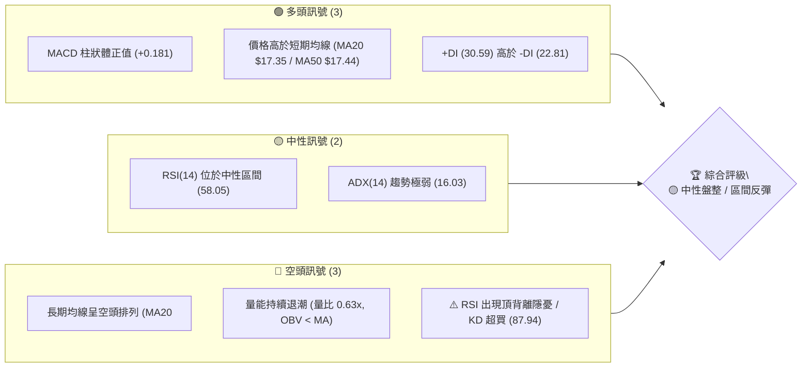
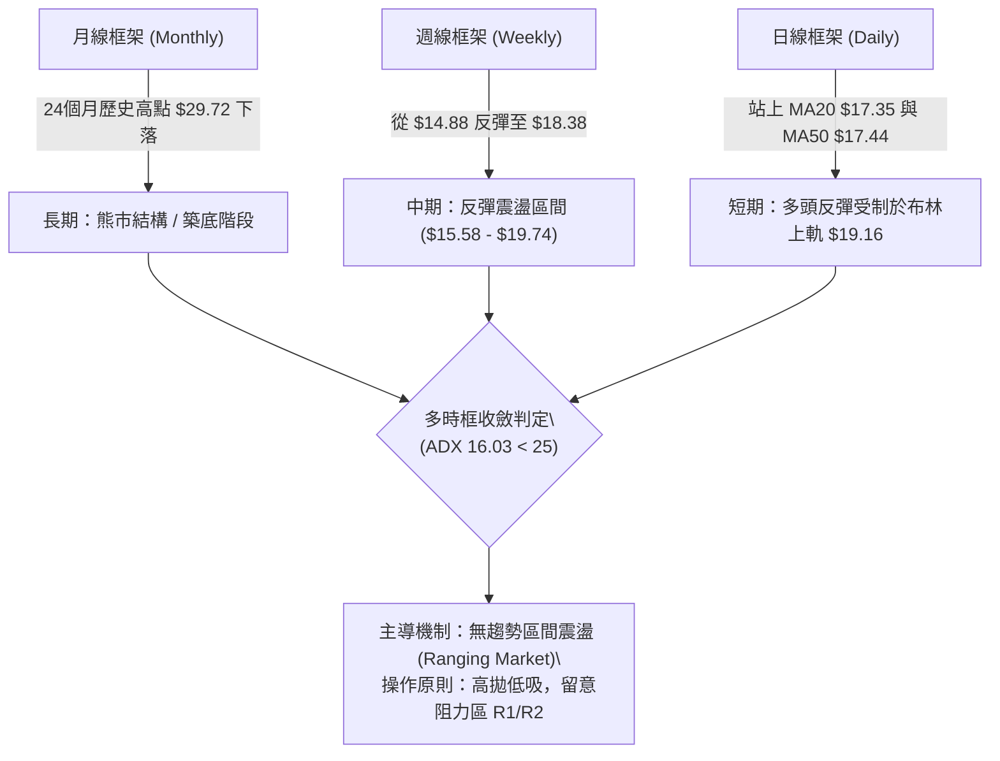
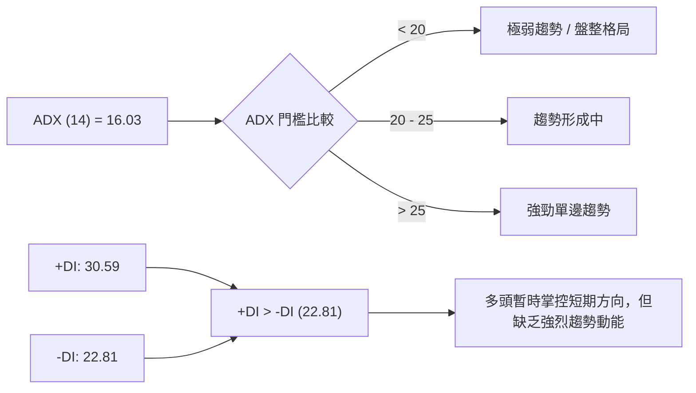
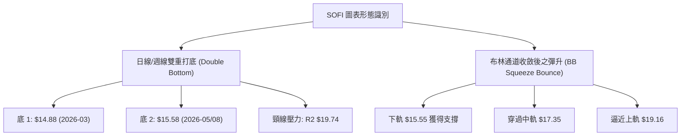
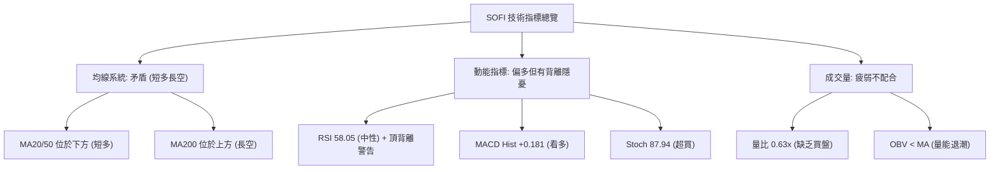
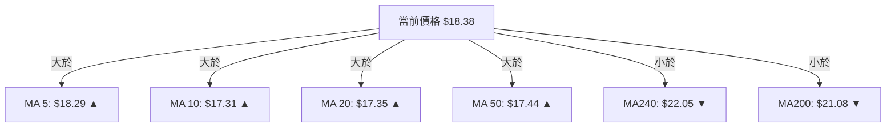
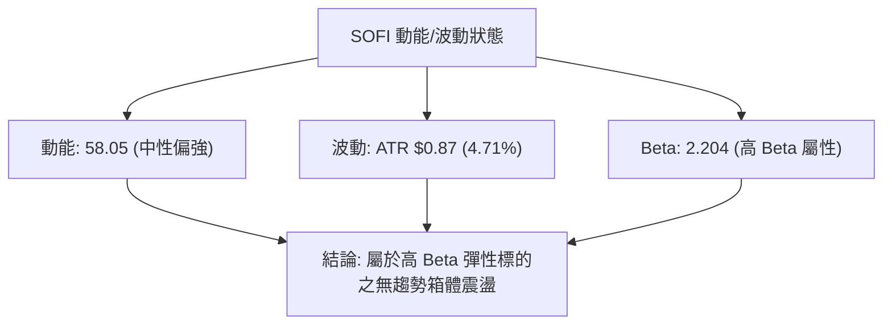
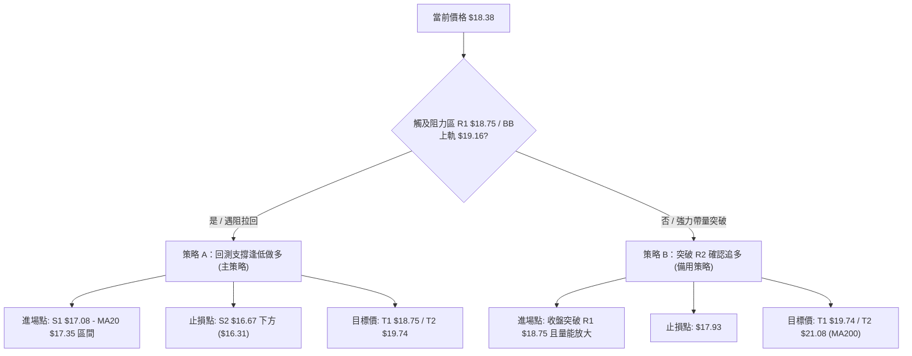
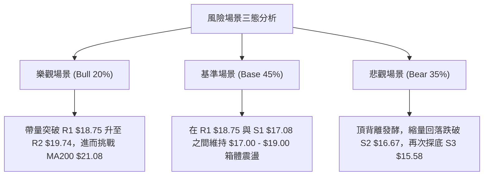

# SOFI 技術分析報告

> **報告日期**：2026-08-09 ｜ **語言**：繁體中文 ｜ **數據來源**：Yahoo Finance ｜ **當前價格**：$18.38

---

## 目錄

| 章節 | 內容 |
|------|------|
| [1. 技術面概覽](#1-技術面概覽) | 訊號儀表板、核心指標、評分卡 |
| [2. 趨勢分析](#2-趨勢分析) | 多時框趨勢、長中短期走勢、12個月歷程 |
| [3. 圖表形態分析](#3-圖表形態分析) | 形態識別、K線組合、信心度評估 |
| [4. 支撐與阻力](#4-支撐與阻力) | 關鍵價位、斐波那契回調結構 |
| [5. 技術指標深度解讀](#5-技術指標深度解讀) | MA/RSI/MACD/布林通道/成交量 |
| [6. 動能與波動率](#6-動能與波動率) | 動能四象限、ATR、Beta相關性 |
| [7. 多時框架總結](#7-多時框架總結) | 時框架評分矩陣與收斂規則 |
| [8. 交易策略建議](#8-交易策略建議) | 策略路由、情境階梯、進出場規劃 |
| [9. 風險提示與監控](#9-風險提示與監控) | 監控 Checklist、風險場景預判 |

---

## 1. 技術面概覽

### 🎯 技術訊號儀表板



### 📊 核心指標速覽表

| 指標類別 | 指標名稱 | 當前數值 | 訊號 | 解讀 |
|----------|----------|----------|------|------|
| **價格** | 當前價格 | $18.38 | 🟡 中性 | 處於 52 週區間 ($14.88–$32.73) 之 19.6% 分位 |
| **均線** | MA20 | $17.35 | 🟢 看多 | 現價位於 MA20 上方 (+5.91%)，短線呈支撐 |
| **均線** | MA50 | $17.44 | 🟢 看多 | 現價位於 MA50 上方 (+5.39%)，完成短線突破 |
| **均線** | MA200 | $21.08 | 🔴 看空 | 現價低於 MA200 (-12.81%)，中長期壓力顯著 |
| **動能** | RSI(14) | 58.05 | 🟡 中性 | 無超買超賣，但週線與日線呈現頂背離隱憂 |
| **動能** | MACD(12,26,9) | 0.146 | 🟢 看多 | MACD 位於 Signal (-0.034) 上方，柱狀體 +0.181 |
| **動能** | Stochastic %K/%D | 87.94 / 84.51 | 🔴 看空 | 進入 >80 極端超買區，隨時面臨短線拉回 |
| **趨勢** | ADX(14) | 16.03 | 🟡 中性 | ADX < 25 指示當前為典型的無趨勢 / 盤整行情 |
| **波動** | ATR(14) | $0.87 | 🟡 中性 | 每日波幅 4.71%，波動度處於中等水平 |
| **成交量** | 量比 / OBV | 0.63x / OBV<MA | 🔴 看空 | 20日均量下移，價格反彈無量配合，量能疲弱 |

### 🏆 技術評分卡

```
╔══════════════════════════════════════════════════════════════════╗
║                   SOFI 技術評分卡 (2026-08-09)                  ║
╠══════════════════════════════════════════════════════════════════╣
║ 趨勢強度 (ADX<25)    ▓▓▓▓▓▓░░░░░░░░░░░░░░  30/100  🔴 無趨勢盤整   ║
║ 動能指標 (MACD/RSI)  ▓▓▓▓▓▓▓▓▓▓▓▓░░░░░░░░  60/100  🟢 短線動能回升 ║
║ 支撐穩定度 (S1/S2)   ▓▓▓▓▓▓▓▓▓▓▓▓▓▓░░░░░░  70/100  🟢 底層支撐穩固 ║
║ 成交量配合 (OBV/量比)▓▓▓▓▓▓▓░░░░░░░░░░░░░  35/100  🔴 量能顯著萎縮 ║
║ 形態完整度 (布林軌道)▓▓▓▓▓▓▓▓▓▓▓░░░░░░░░░  55/100  🟡 區間震盪整理 ║
║ 均線排列 (空頭結構)  ▓▓▓▓▓▓▓▓░░░░░░░░░░░░  40/100  🔴 中長天期偏空 ║
╠══════════════════════════════════════════════════════════════════╣
║ 綜合評分             ▓▓▓▓▓▓▓▓▓▓░░░░░░░░░░  50/100  🟡 中性觀望/區間║
╚══════════════════════════════════════════════════════════════════╝
```

---

## 2. 趨勢分析

### 🌐 多時框趨勢分析



### 📈 長期趨勢 — 12個月走勢圖（Unicode）

```
SOFI 月線走勢圖（2025-08 至 2026-08）
價格軸 ($)
$30.00 ┤                             ●  ● (2025-10/11 雙頭高點 $29.72)
$27.50 ┤                       ●  ●
$25.00 ┤                  ●              ●
$22.50 ┤            ●                          ●
$20.00 ┤                                             ●
$17.50 ┤                                                   ●  ●     ● (現在 $18.38)
$15.00 ┤●  ●                                                   ●  ●
       └┬──┬──┬──┬──┬──┬──┬──┬──┬──┬──┬──┬──┬──
       08 09 10 11 12 01 02 03 04 05 06 07 08  (月份 2025-2026)
```

#### 24個月歷史走勢特徵分析表

| 階段區間 | 收盤價變化 | 漲跌幅 | 走勢特徵分析 |
|----------|------------|--------|--------------|
| **2024-08 ~ 2024-11** | $7.99 ➔ $16.41 | +105.4% | 強勁主升段爆發，突破低檔整理區 |
| **2024-12 ~ 2025-05** | $15.40 ➔ $13.30 | -13.6% | 高檔箱體震盪洗盤，進行築底消化 |
| **2025-06 ~ 2025-11** | $18.21 ➔ $29.72 | +63.2% | 第二波強勢突破，創下近兩年高點 $29.72 |
| **2025-12 ~ 2026-03** | $26.18 ➔ $15.88 | -39.3% | 估值修修正與獲利賣壓，股價快速下挫 |
| **2026-04 ~ 2026-08** | $16.10 ➔ $18.38 | +14.2% | 在 $14.88–$15.58 獲得支撐後展開箱體築底反彈 |

### 📊 中期趨勢（週線分析）

從近 20 週數據觀察，SOFI 於 2026 年 3 月底觸及 $15.23 後（最低點 $14.88），進行了二次底部的測試：
1. **第一次探底**：2026-03-29 收盤 $15.23（RSI 跌至 11.8 極端超賣）。
2. **中期反彈**：2026-04-19 強勢拉升至 $19.43（RSI 86.7 超買）。
3. **二次探底**：2026-05-17 至 2026-08-02，多次在 $15.61–$16.31 獲得強烈支撐。
4. **當前狀態**：最新一週（2026-08-09）大漲至 $18.38，MACD 柱狀體由負轉正 (+0.181)，但週成交量為 298.89M，低於前幾週 400M+ 的水準，顯示**反彈伴隨量能退潮**。

### ⚡ 趨勢強度評估（ADX 解讀）



| ADX 數值區間 | 趨勢類型 | 當前 SOFI 狀態 | 交易策略導向 |
|--------------|----------|----------------|--------------|
| **0 - 20** | **無趨勢/盤整** | **✓ ADX = 16.03** | **布林通道上下軌區間操作，嚴禁追高殺低** |
| **20 - 25** | 溫和趨勢 | - | 觀察突破方向 |
| **25 - 50** | 強勁趨勢 | - | 順勢單邊操作 |
| **> 50** | 極端趨勢 | - | 注意反轉風險 |

---

## 3. 圖表形態分析

### 🔍 形態識別系統



#### 形態信心度評估表

| 形態名稱 | 信心度 | 判斷依據（引用數據） | 完成度 | 目標價（附計算式） |
|----------|--------|----------------------|--------|--------------------|
| **W底 (雙重底)** | 60% | 兩次低點 $14.88與 $15.58（對應 S3 $15.58）形成支撐，頸線位於 R2 $19.74 | 65% (尚未突破頸線) | 頸線 $19.74 + 形態高度 ($19.74 - $14.88 = $4.86) = **$24.60**（需突破 R2 確認） |
| **箱體震盪** | 85% | 價格持續在 S1 $17.08–S3 $15.58 與 R1 $18.75–R2 $19.74 之間運行 | 90% | 上軌目標 **$19.16** (BB上軌) / **$19.74** (R2) |
| **旗形突破** | < 40% | 數據不足，量能未出現擴張 confirmation | 20% | 訊號不足，僅做指標型解讀 |

### 🕯️ 重要 K 線形態分析（近 5 個月週 K 線）

| 月份 | 收盤價 | 週 K 線形態 | 解讀 | 訊號 |
|------|--------|-------------|------|------|
| **2026-04-19** | $19.43 | 大陽線突破 | 短線超買爆發，建立波段高點 | 🟢 多頭極強 |
| **2026-05-03** | $16.43 | 長陰線回落 | 高檔獲利賣壓，量能放大至 490M | 🔴 空頭吞噬 |
| **2026-05-17** | $15.61 | 十字星/槌子線 | 尋求底部支撐，賣壓告一段落 | 🟡 止跌訊號 |
| **2026-07-26** | $16.46 | 震盪探底線 | 再次測試 S2 $16.67 區域 | 🟡 支撐確認 |
| **2026-08-09** | $18.38 | 中陽線強勢反彈 | 收復 MA20 與 MA50，多頭重新嘗試挑戰 R1 | 🟢 短線轉強 |

### 📉 ASCII 走勢形態示意圖

```
SOFI 雙重底與箱體震盪形態示意圖
═════════════════════════════════════════════════════════════════
$19.74 ┤........................................[頸線 / R2 阻力]
$19.16 ┤----------------------------------------[布林通道上軌]
$18.38 ┤                     ● (現價突破中軌 $17.35)
$17.35 ┤...................../..................[BB中軌 / MA20]
$16.67 ┤         ●          /    ●  (二次探底 S2)
$15.58 ┤● (底 1) \________/ S3  /
       └─────────────────────────────────────────────────────────
```

### 🎯 形態目標價計算

以信心度最高之「箱體震盪」與「W 底潛在形態」進行嚴謹推算：
1. **箱體上限 / 第一目標價**：
   - 取布林通道上軌 **$19.16** 與阻力位 R1 **$18.75** / R2 **$19.74** 之交集。
2. **W 底完成突破目標價**：
   - 頸線（R2）= $19.74
   - 底部低點（52W Low）= $14.88
   - 形態高度 = $19.74 - $14.88 = $4.86
   - 突破推算目標價 = $19.74 + $4.86 = **$24.60**（註：此目標價需待日線收盤確認突破 $19.74 方能成立）。

---

## 4. 支撐與阻力

### 🗺️ 關鍵價位分布圖（Unicode）

```
SOFI 關鍵價位分布圖 (OHLCV 精確計算)
═════════════════════════════════════════════════════════════════
$21.08 ║████████████████████████████████║ MA200 長期強壓
$20.13 ║████████████████████            ║ 阻力 R3 (+9.52%)
$19.74 ║████████████████████████        ║ 阻力 R2 / W底頸線 (+7.40%)
$19.16 ║--------------------------------║ 布林通道上軌 (BB Upper)
$18.75 ║████████████████                ║ 關鍵阻力 R1 (+2.00%) / Fib 78.6% ($18.70)
$18.38 ╠════════════════════════════════╣ ◄ 當前價格 (Current Price)
$17.35 ║--------------------------------║ 布林通道中軌 (MA20 $17.35 / MA50 $17.44)
$17.08 ║▓▓▓▓▓▓▓▓▓▓▓▓▓▓▓▓                ║ 近期支撐 S1 (-7.07%)
$16.67 ║▓▓▓▓▓▓▓▓▓▓▓▓▓▓▓▓▓▓▓▓            ║ 強支撐 S2 (-9.32%)
$15.58 ║▓▓▓▓▓▓▓▓▓▓▓▓▓▓▓▓▓▓▓▓▓▓▓▓▓▓      ║ 底部波段強支撐 S3 (-15.26%)
$14.88 ║████████████████████████████████║ 52週最低價 (52W Low)
═════════════════════════════════════════════════════════════════
```

### 🚧 阻力位分析表

| 阻力級別 | 價位 | 形成原因 | 突破難度 | 重要性 |
|----------|------|----------|----------|--------|
| **R1** | **$18.75** | 近一年波段高點聚類 / 靠近 Fib 78.6% ($18.70) | 🟡 中等 | 🟢 短線多空分水嶺 |
| **R2** | **$19.74** | 波段高點 / W底形態頸線壓力 / 籌碼密集區 | 🔴 極高 | 🔴 中期多頭反轉關鍵 |
| **R3** | **$20.13** | 近一年波段高點聚類 / 逼近下降 MA200 ($21.08) | 🔴 極高 | 🔴 長期下降趨勢防線 |

### 🛡️ 支撐位分析表

| 支撐級別 | 價位 | 形成原因 | 守住機率 | 重要性 |
|----------|------|----------|----------|--------|
| **S1** | **$17.08** | 近一年波段低點聚類 / 重疊 MA20 ($17.35) 與 MA50 ($17.44) | 🟢 70% | 🟢 短線退守第一線 |
| **S2** | **$16.67** | 波段低點聚類 / 多次下影線測試區域 | 🟢 80% | 🟡 中期多頭防禦底線 |
| **S3** | **$15.58** | 波段低點聚類 / 布林下軌 ($15.55) 重疊區 | 🟢 90% | 🔴 波段生死線（跌破探 52W Low） |

### 📐 斐波那契回調位分析（52週區間 $14.88 ➔ $32.73）

| 斐波那契層級 | 精確價位 | 現價相對位置 | 評估與實質意義 |
|--------------|----------|--------------|----------------|
| **0.0%** | $32.73 | +78.07% | 52 週最高價 |
| **23.6%** | $28.52 | +55.17% | 長期強烈賣壓區 |
| **38.2%** | $25.91 | +40.97% | 中期空頭修正目標 |
| **50.0%** | $23.80 | +29.49% | 多空長期強弱分界線 |
| **61.8%** | $21.70 | +18.06% | 重疊 MA200 ($21.08) 壓制區 |
| **78.6%** | **$18.70** | **+1.74%** | **關鍵壓制點！極度重疊阻力 R1 ($18.75)** |
| **100.0%** | **$14.88** | **-19.04%** | **52 週最低價** |

**位置解讀**：當前價格 $18.38 落在 **78.6% ($18.70)** 與 **100.0% ($14.88)** 之間。現價正向上逼近 **78.6% 回調位 ($18.70)**，由於該位置與波段阻力 **R1 $18.75** 高度重疊，構成短線極強的複合型阻力牆。

---

## 5. 技術指標深度解讀

### 🎛️ 指標訊號總覽



### 📈 移動平均線排列分析



- **均線結構**：整體仍呈 **空頭排列 (MA20 < MA50 < MA200)**，長期 trend 尚未扭轉。
- **短期乖離**：現價突破 MA20 (+5.91%) 與 MA50 (+5.39%)，短期均線 MA5/10/20 全部向上勾頭，說明短線多頭反彈進行中，MA20 ($17.35) 轉為第一道動態支撐。

### 📉 RSI(14) 分析

```
RSI(14) 強度進度條
0                 30        50     58.05   70               100
├─────────────────┼─────────┼───────█──────┼────────────────┤
[    極端超賣     ] [  偏空   ]  [  中性看多  ] [   極端超買     ]
```

- **目前數值**：**58.05**（中性偏多）。
- **⚠️ 背離分析（頂背離判定）**：
  - 日線/週線數據警示：`RSI 背離: ⚠️ 頂背離 (Bearish Divergence)`。
  - **細節**：2026 年 4 月價格達 $19.43 時 RSI 衝高至 **86.7**；本次價格反彈至 $18.38，RSI 僅達 **58.05**。價格試圖挑戰前期高點，但 RSI 峰值顯著降低，屬典型的**看跌頂背離**，預示向上衝高過程動能衰減，若無大量配合，易引發快速拉回。

### 📊 MACD(12/26/9) 訊號解讀

- **DIF (MACD 線)**: `0.146`
- **DEA (Signal 線)**: `-0.034`
- **MACD 柱狀體 (Histogram)**: `+0.181` 🟢
- **分析**：MACD 線向上穿越 Signal 線形成零軸附近的金叉，柱狀體呈正向擴展 (+0.181)，指示短線多頭動能處於主導期。

### 📦 布林通道分析

```
SOFI 布林通道結構示意圖
═════════════════════════════════════════════════════════════════
$19.16 ┤---------------------------------------- Upper Band (上軌)
$18.38 ┤                     ● (現價 %B = 0.78)
$17.35 ┤---------------------------------------- Middle Band (MA20)
$15.55 ┤---------------------------------------- Lower Band (下軌)
═════════════════════════════════════════════════════════════════
```

- **上軌**：$19.16 ｜ **中軌 (MA20)**：$17.35 ｜ **下軌**：$15.55
- **通道指標 %B**：`0.78`（說明現價已運行至布林通道上軌區域附近）。
- **通道形態**：通道寬度維持常態，ADX < 25 意味著觸及上軌 **$19.16** 附近常會遇到均值回歸的拉回壓力。

### 💹 成交量分析（量價配合度）

```
成交量強度與 OBV 狀態
═════════════════════════════════════════════════════════════════
最新成交量:   51,490,500
20日均量:     81,400,035  (量比: 0.63x) ░░░░░░░░░ (顯著縮量)
OBV 狀態:     OBV < MA → 量能背離/疲弱 🔴
═════════════════════════════════════════════════════════════════
```

- **量價背離**：價格上漲突破 $18.00，但量比僅 **0.63x**，20 日均量大幅縮減。主力資金追高意願不足，屬**無量反彈**，加劇了 RSI 頂背離帶來的修正風險。

---

## 6. 動能與波動率

### ⚡ 動能評估四象限

| 象限 | 動能 (Momentum) | 波動率 (Volatility) | 當前 SOFI 歸屬 | 操作意涵 |
|------|-----------------|---------------------|----------------|----------|
| **Q1** | 強 (RSI > 60) | 低 (ATR% < 3%) | - | 穩定主升段，最佳持股區 |
| **Q2** | **弱/中 (RSI 58)** | **中/高 (ATR% 4.71%)** | **✓ SOFI (當前歸屬)** | **無趨勢震盪反彈，適宜區間操作** |
| **Q3** | 強 (RSI > 70) | 高 (ATR% > 5%) | - | 高爆發高風險，需嚴設止損 |
| **Q4** | 弱 (RSI < 40) | 高 (ATR% > 5%) | - | 恐慌主跌段，避開進場 |



### 📊 ATR 波動率分析

- **ATR(14)**：`$0.87`（佔當前股價 4.71%）。
- **止損距離建議**：
  - **短線防守 (1.5x ATR)**：`$0.87 × 1.5 = $1.31` ➔ 從現價 $18.38 下扣得 **$17.07**（剛好與 S1 $17.08 重疊）。
  - **波段防守 (2.0x ATR)**：`$0.87 × 2.0 = $1.74` ➔ 從現價 $18.38 下扣得 **$16.64**（剛好與 S2 $16.67 重疊）。

### 📐 Beta 與市場相關性

- **Beta 係數**：`2.204`
- **解析**：SOFI 為典型的**高 Beta 金融科技股**，波動度為大盤（S&P 500）的 2.2 倍。當美股大盤回檔時，SOFI 拉回幅度將顯著放大；同理，在大盤反彈時其彈性亦較高。

---

## 7. 多時框架總結

### 📋 時框架評分表

| 時框架 | 趨勢方向 | 動能指標 | 均線排列 | 圖表形態 | 綜合評分 | 戰術建議 |
|--------|----------|----------|----------|----------|----------|----------|
| **月線 (Long)** | 🔴 看空 | 🟡 中性 | 🔴 空頭 | 底部築底 | **40/100** | 避開長期 Buy & Hold |
| **週線 (Medium)**| 🟡 盤整 | 🟢 看多 | 🟡 交錯 | 雙底箱體 | **55/100** | 區間震盪低吸高拋 |
| **日線 (Short)** | 🟢 短多 | 🔴 頂背離/超買 | 🟢 多頭過渡 | 觸及布林上軌| **50/100** | 不宜追高，等回測 S1 |

### 🔲 綜合訊號矩陣

```
時框架訊號一致性評估
╔══════════════════════════════════════════════════════════════════╗
║ [月線] 偏空  ────────┐                                           ║
║ [週線] 區間  ────────┼──► 多時框收斂結果：【區間震盪整理 (Ranging)】 ║
║ [日線] 短多  ────────┘                                           ║
║                                                                  ║
║ 依據規則 14：ADX = 16.03 (<25) 判定為【盤整行情】                 ║
║ 主要交易區間：日線布林通道下軌 $15.55 / S1 $17.08 ──► 上軌 $19.16 / R1 $18.75 ║
╚══════════════════════════════════════════════════════════════════╝
```

### ⚖️ 多時框收斂結論

依據多時框收斂規則（ADX 16.03 < 25）：
1. **行情定性**：當前 SOFI 處於**盤整/區間震盪行情**，而非單邊趨勢行情。
2. **主導指標**：以**日線布林通道 ($15.55 – $19.16)** 及**關鍵支撐阻力 (S1 $17.08 / R1 $18.75)** 作為主要交易邊界。
3. **最終方向性結論**：**🟡 中性觀望 / 箱體區間操作**。短線受制於 R1 $18.75 與布林上軌 $19.16 的複合壓制，且存在 RSI 頂背離與量能不足（量比 0.63x），**嚴禁在 $18.38–$18.75 追高做多**。

---

## 8. 交易策略建議

### 🗺️ 策略決策流程圖



### 🧭 策略路由

**當前主策略方向 = 🟡 區間震盪／逢低佈局做多（技術評分：50/100）**

### 🎯 價格情境階梯 (Price Scenarios)

| 觸發條件 | 下一目標 | 後續延伸 | 情境含義 |
|----------|----------|----------|----------|
| **帶量突破 R1 $18.75** | R2 $19.74 | R3 $20.13 / MA200 $21.08 | 短線反彈轉為中期波段突破 |
| **受阻於 R1 $18.75 - BB上軌 $19.16** | **MA20 $17.35 / S1 $17.08** | **S2 $16.67** | **典型區間震盪，回測均線支撐** |
| **跌破 S1 $17.08 / S2 $16.67** | S3 $15.58 | 52W Low $14.88 | 箱體破位，築底失敗重回跌勢 |

### 📊 情境機率分佈

```
情境機率分佈
[█ 45%] 區間震盪 / 回測 S1 $17.08 (主要情境)
[█ 35%] 遇阻壓制 / 回落探 S2 $16.67 
[█ 20%] 強勢突破 R1 $18.75 向上挑戰 R2
```

| 情境 | 機率 | 主要依據 |
|------|------|----------|
| **區間震盪拉回** | **45%** | ADX 16.03 無趨勢、量比 0.63x 縮量、Stoch 超買 (87.94) |
| **回落再探底** | **35%** | RSI 頂背離警示、OBV < MA、長期 MA200 下行壓制 |
| **強勢突破** | **20%** | MACD 柱狀體 +0.181 正向擴展、+DI > -DI |

### 🟢 主策略詳情（方向：區間低吸 / 突破追多）

| 策略要素 | 策略 A：區間低吸做多 (主推) | 策略 B：突破追多 (備用) |
|----------|----------------------------|------------------------|
| **策略類型** | 順應 ADX < 25 之箱體低吸 | 帶量突破 R1 之順勢追價 |
| **進場條件** | 價格回測 S1 $17.08–$17.35 止跌 | 日線收盤價 > R1 $18.75 且量比 > 1.2x |
| **進場價格** | **$17.15**（S1 $17.08 附近） | **$18.80**（突破 R1 確認後） |
| **目標價 T1** | **$18.75** (阻力 R1) | **$19.74** (阻力 R2 / W底頸線) |
| **目標價 T2** | **$19.74** (阻力 R2) | **$21.08** (MA200 長期強壓) |
| **止損價格** | **$16.31** (跌破 S2 $16.67) | **$17.93** (跌破前週低點) |
| **風險報酬比** | **(18.75 - 17.15) / (17.15 - 16.31) = 1.90 : 1** | **(19.74 - 18.80) / (18.80 - 17.93) = 1.08 : 1** |
| **預估勝率** | **60%** | **40%** |
| **建議倉位** | **10% - 15%** | **5% - 8%** (輕倉試探) |

### 🔴 反向風險觸發點（對沖提示）

若持有多頭部位，當出現以下訊號時應立即減碼或止損對沖：
1. **破位訊號**：日線收盤價跌破 **S2 $16.67**，代表反彈結構瓦解。
2. **頂背離確認**：價格創高突破 $19.43 但 RSI 無法突破 60，形成嚴重二次頂背離。

### ⭐ 整體訊號強度評星

```
做多訊號強度：★★☆☆☆  (2/5星 — 受制阻力牆與背離)
做空訊號強度：★★★☆☆  (3/5星 — 均線空頭與量能退潮)
整體可信度：  ★★★☆☆  (3/5星 — ADX盤整特徵明確)
```

---

## 9. 風險提示與監控

### ✅ 關鍵監控指標 Checklist

```
╔══════════════════════════════════════════════════════════════════╗
║                    每日技術面監控 Check List                     ║
╠══════════════════════════════════════════════════════════════════╣
║ [ ] 價位監控：是否突破 R1 $18.75 或跌破 S1 $17.08                 ║
║ [ ] 成交量能：成交量是否回升至 20日均量 (81.4M) 以上             ║
║ [ ] RSI 動能：RSI(14) 是否在 60 遭遇壓制或跌破 50 中軸             ║
║ [ ] 布林軌道：%B 指標是否自 0.78 回落至 0.50 (中軌 $17.35)        ║
║ [ ] KD 指標：Stoch %K (87.94) 是否高檔死叉發出賣出訊號           ║
╚══════════════════════════════════════════════════════════════════╝
```

### ⚠️ 風險場景分析



### 🛡️ 風險管理重要提醒

1. **極高 Beta 屬性風險**：SOFI Beta 高達 **2.204**，極度依賴整體科技股與金融板塊氣氛，操作時須嚴格控管倉位（單一個股建議不超過總資產 15%）。
2. **無量反彈警訊**：量比僅 0.63x 且 OBV < MA，代表當前拉升缺乏機構大資金買盤支撐，隨時有獲利回吐賣壓。
3. **嚴守止損點**：若採用策略 A 進場，防守點須堅決設定於 **$16.31**，切勿盲目凹單。

---

## 📋 報告總結

```
SOFI 技術分析報告總結
═════════════════════════════════════════════════════════════════
報告日期：2026-08-09
當前價格：$18.38
分析評級：⚖️ 🟡 中性觀望 / 區間震盪 (50/100)

關鍵結論：
├─ 長期趨勢：🔴 看空 (均線呈空頭排列，受制於 MA200 $21.08)
├─ 中期趨勢：🟡 區間震盪 (ADX 16.03 < 25，運行於 $15.58 - $19.74 箱體)
├─ 短期趨勢：🟢 短多遇阻 (突破 MA20/MA50，但面臨 R1 $18.75 與布林上軌壓制)
├─ 關鍵支撐：S1 $17.08 / S2 $16.67 / S3 $15.58
├─ 關鍵阻力：R1 $18.75 / R2 $19.74 / MA200 $21.08
└─ 分析師目標：均價 $19.87 (當前評級: Hold)

最優策略組合：
1. 🥇 最佳機會 (策略 A)：等待拉回 S1 $17.08–$17.35 區間低吸做多，目標 $18.75/$19.74，止損 $16.31。
2. 🥈 次選機會 (策略 B)：若日線強勢帶量突破 R1 $18.75，少量追多至 R2 $19.74，止損 $17.93。
3. 🥉 保守選擇：鑑於 RSI 頂背離與縮量反彈，維持現金觀望，待方向明確後再行布局。
═════════════════════════════════════════════════════════════════
```

---

> ⚠️ **免責聲明**：本報告為 AI 自動生成之技術分析，所有數據及估算均基於提供的歷史價格資訊。本報告**僅供研究與學術參考**，**不構成任何投資建議**。投資有風險，入市需謹慎。

---

*報告生成時間：2026-08-09 ｜ 數據來源：Yahoo Finance ｜ 分析框架：多時框技術分析*