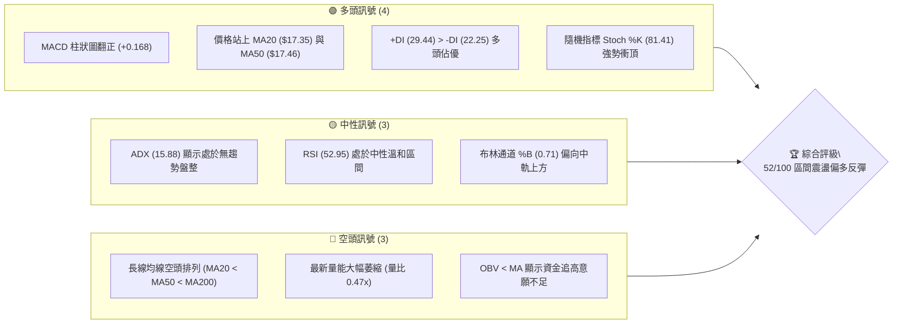
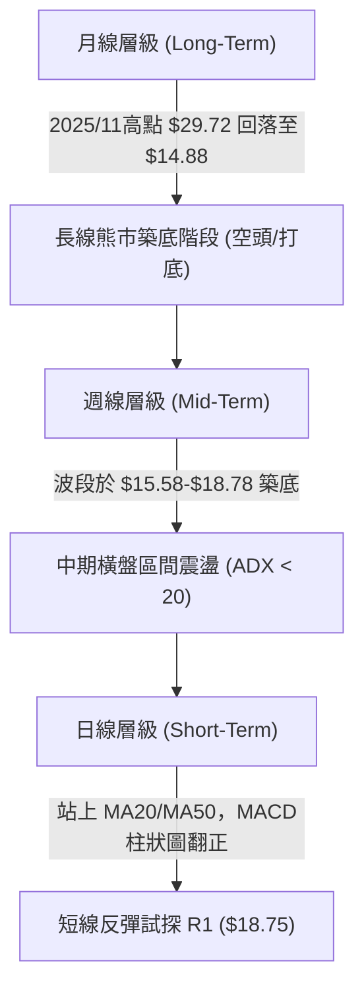
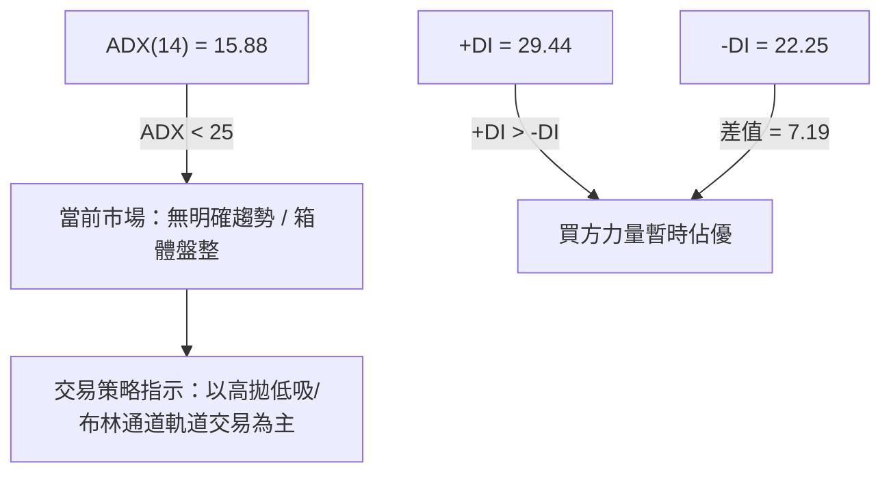
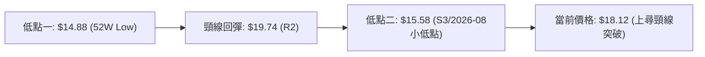
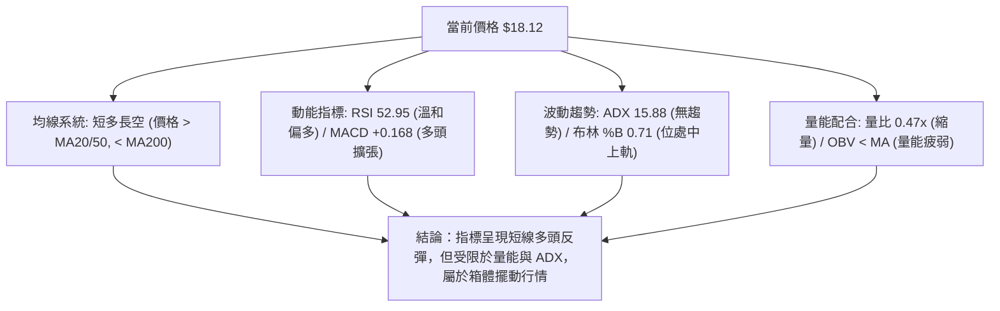
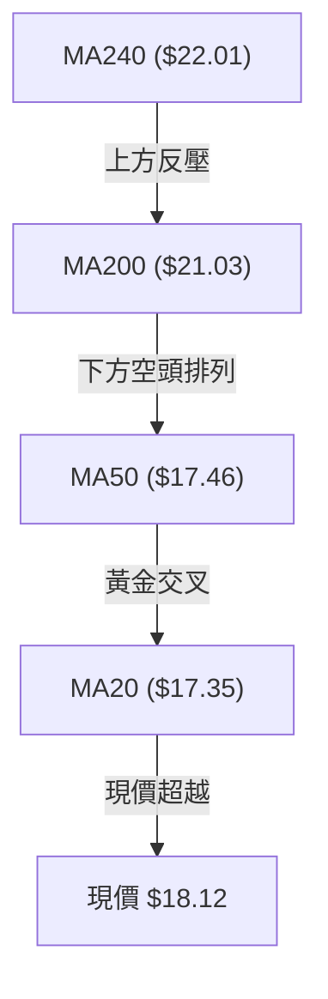
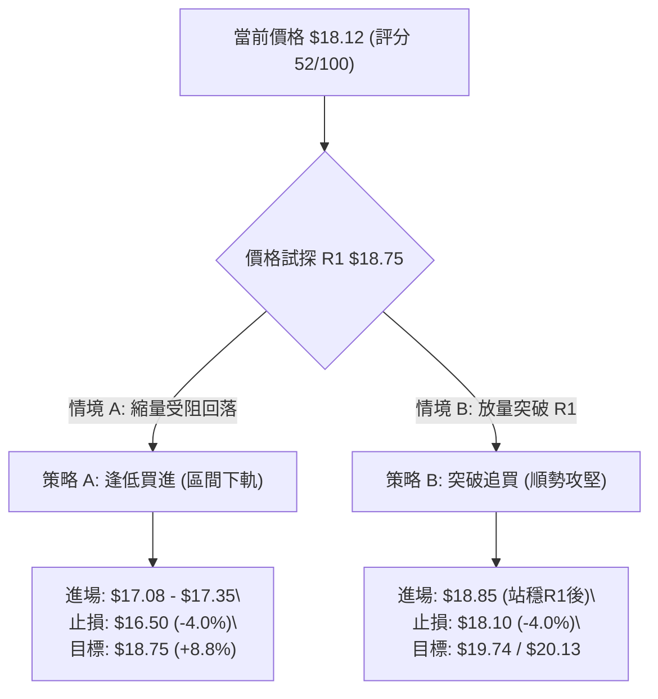
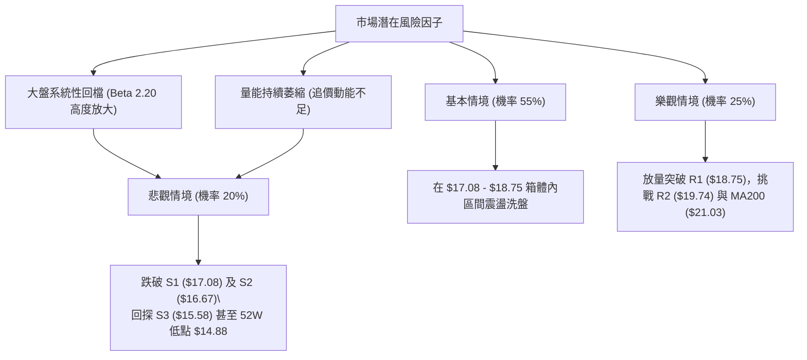

# SOFI 技術分析報告

> **報告日期**：2026-08-10 ｜ **語言**：繁體中文 ｜ **數據來源**：Yahoo Finance ｜ **當前價格**：$18.12

---

## 目錄

| 章節 | 內容 |
|------|------|
| [1. 技術面概覽](#1-技術面概覽) | 訊號儀表板、核心指標、評分卡 |
| [2. 趨勢分析](#2-趨勢分析) | 多時框趨勢、長中短期走勢、ADX解讀 |
| [3. 圖表形態分析](#3-圖表形態分析) | 形態識別信心度、K線組合、目標價推算 |
| [4. 支撐與阻力](#4-支撐與阻力) | 關鍵價位分布、阻力與支撐表、斐波那契回調 |
| [5. 技術指標深度解讀](#5-技術指標深度解讀) | 均線系統、RSI、MACD、布林通道、成交量 |
| [6. 動能與波動率](#6-動能與波動率) | 動能評估四象限、ATR分析、Beta相關性 |
| [7. 多時框架總結](#7-多時框架總結) | 時框架評分矩陣、多時框收斂結論 |
| [8. 交易策略建議](#8-交易策略建議) | 策略路由、價格情境階梯、進出場規劃 |
| [9. 風險提示與監控](#9-風險提示與監控) | 監控清單、風險情境、風控原則 |

---

## 1. 技術面概覽

### 🎯 技術訊號儀表板



### 📊 核心指標速覽表

| 指標類別 | 指標名稱 | 當前數值 | 訊號 | 解讀 |
|----------|----------|----------|------|------|
| **價格** | 當前價格 | $18.12 | 🟡 中性 | 處於52週高低點區間 18.2% 位置，近5日震盪 |
| **均線** | MA20 | $17.35 | 🟢 看多 | 股價位於 MA20 上方 (+4.41%)，短線取得支撐 |
| **均線** | MA50 | $17.46 | 🟢 看多 | 股價突破 MA50 (+3.78%)，中期有打底跡象 |
| **均線** | MA200 | $21.03 | 🔴 看空 | 股價遠低於 MA200 (-13.84%)，長線仍處熊市結構 |
| **動能** | RSI(14) | 52.95 | 🟡 中性 | 52.95 溫和上升，未進入超買，無背離現象 |
| **動能** | MACD | +0.168 | 🟢 看多 | DIF(0.175) 上穿 DEA(0.008)，柱狀圖持續擴大 |
| **趨勢** | ADX(14) | 15.88 | 🟡 盤整 | ADX < 25 屬弱趨勢，價格易在布林通道內區間震盪 |
| **波動** | ATR(14) | $0.85 | 🟡 中性 | 日波動率 4.70%，提供止損與區間操作彈性 |
| **量能** | 日成交量 | 37.05M | 🔴 看空 | 為20日均量(78.37M)的0.47倍，量能不足呈弱勢突破 |

### 🏆 技術評分卡

```
╔══════════════════════════════════════════════════════════════════╗
║                   SOFI 技術評分卡 (2026-08-10)                  ║
╠══════════════════════════════════════════════════════════════════╣
║  趨勢強度      ▓▓▓▓▓▓▓░░░░░░░░░░░░░  35/100  🔴 ADX弱，長線空頭  ║
║  動能指標      ▓▓▓▓▓▓▓▓▓▓▓▓░░░░░░░░  60/100  🟢 MACD金叉，RSI回升║
║  支撐穩定度    ▓▓▓▓▓▓▓▓▓▓▓▓▓▓░░░░░░  70/100  🟢 S1($17.08)護盤有效║
║  成交量配合    ▓▓▓▓▓▓░░░░░░░░░░░░░░  30/100  🔴 價漲量縮，追高謹慎║
║  形態完整度    ▓▓▓▓▓▓▓▓▓▓▓░░░░░░░░░  55/100  🟡 W底築底中，未突破 ║
║  均線排列      ▓▓▓▓▓▓▓▓░░░░░░░░░░░░  40/100  🔴 MA200於上方重壓   ║
╠══════════════════════════════════════════════════════════════════╣
║  綜合評分      ▓▓▓▓▓▓▓▓▓▓░░░░░░░░░░  52/100  評級：區間反彈偏多   ║
╚══════════════════════════════════════════════════════════════════╝
```

---

## 2. 趨勢分析

### 🌐 多時框趨勢分析



### 📈 長期趨勢 — 24個月價格歷史與走勢圖

```
SOFI 歷史月線走勢示意圖（2024-08 至 2026-08）
價格軸 ($)
$30.00 ┤                                  ●─● (2025-10/11 頂部 $29.72)
$27.00 ┤                             ●  
$24.00 ┤                        ●         ●  
$21.00 ┤                   ●                   ●  
$18.00 ┤              ●                             ●───● (目前 $18.12)
$15.00 ┤        ●                                 ●   ●
$12.00 ┤   ●  ●                                 ●
 $9.00 ┤●●
       └┬──┬──┬──┬──┬──┬──┬──┬──┬──┬──┬──┬──┬──┬──┬──┬──┬──┬──┬──┬──┬──┬──┬──┬──
        08 09 10 11 12 01 02 03 04 05 06 07 08 09 10 11 12 01 02 03 04 05 06 07 08
       └───────── 2024 年 ─────────┘└───────── 2025 年 ─────────┘└────── 2026 年 ──────┘
```

**歷史走勢分期特徵表**：

| 時間區間 | 收盤區間 | 趨勢特徵 | 核心驅動要素與技術解讀 |
|----------|----------|----------|------------------------|
| **2024-08 ~ 2024-09** | $7.86 - $7.99 | 低檔打底 | 股價於 $8.00 附近沉澱，籌碼沉澱完畢 |
| **2024-10 ~ 2025-02** | $11.17 - $16.41 | 第一波主升段 | 業績轉盈擴張，股價翻倍拉升 |
| **2025-03 ~ 2025-05** | $11.63 - $13.30 | 中場回檔洗盤 | 回測 MA200 尋求支撐，完成籌碼換手 |
| **2025-06 ~ 2025-11** | $18.21 - $29.72 | 瘋狂主升段 (高點 $32.73) | 資金瘋狂湧入，RSI一度進入極端超買區 |
| **2025-12 ~ 2026-03** | $26.18 - $15.88 | 主跌段 / 獲利回吐 | 隨高估值科技股回檔，跌破各天期均線 |
| **2026-04 ~ 2026-08** | $15.88 - $18.12 | 築底震盪區間 | 於 $14.88(52W Low) 反彈，在 $15.50-$18.75 區間打底 |

### 📊 中期趨勢（週線分析）

從近20週數據觀測（2026-04 至 2026-08）：
- **震盪區間明確**：波段最低為 2026-05-17 的 $15.61（接近 52 週低點 $14.88），波段最高為 2026-07-12 的 $18.78。
- **週線 MACD 狀態**：柱狀圖在 -0.220 到 +0.273 之間反覆來回，顯示中期無單邊趨勢，呈現典型的大箱體震盪。
- **週成交量變化**：在 $18.00 以上時週成交量普遍放大（如 2026-06-28 達 464M 股），顯示 $18.50-$19.00 區域積累了大量套牢解套賣壓。

### ⚡ 趨勢強度評估（ADX 解讀）



**ADX 指標強度對照**：
- **ADX 數值**：`15.88`（進度條：██████░░░░ 15.88/100）
- **解讀結論**：ADX 遠低於 25 的趨勢分水嶺，意味著當前的反彈**並非**強勢單邊趨勢的開始，而是在 $15.58 - $18.75 區間內的擺動行情。交易者切忌追高，應以區間下軌尋求買點、區間上軌逢高獲利結算。

---

## 3. 圖表形態分析

### 🔍 形態識別系統

在日線與週線圖表中，SOFI 目前呈現「**雙重底（W底）築底**」以及「**矩形箱體震盪**」的組合形態。



**形態信心度與目標價計算表**：

| 形態名稱 | 信心度 | 判斷依據（引用數據） | 完成度 | 目標價（附計算式） |
|----------|--------|----------------------|--------|--------------------|
| **雙重底 (W底)** | **65%** | 第一底 $14.88，第二底 $15.58，未再破底；頸線位於 R2 $19.74 | 70% | 頸線 $19.74 + (頸線 $19.74 - 底部位 $14.88 = $4.86) = **$24.60** |
| **矩形箱體震盪** | **85%** | 上軌阻力 R1 $18.75，下軌支撐 S1 $17.08，ADX=15.88 證實箱體 | 90% | 箱體上軌突破推算：R1 $18.75 + 箱體高度($18.75 - $17.08 = $1.67) = **$20.42** |
| **頭肩底形態** | **35%** | 缺乏左肩完整的結構支撐 | 30% | 數據中未確認，不進行通靈推算 |

### 🕯️ 重要 K 線形態分析

| 日期/月份 | 收盤價 | K線形態 | 技術解讀 | 多空訊號 |
|-----------|--------|---------|----------|----------|
| **2026-05** | $18.22 | 帶長下影線陽線 | 在 $15.60 附近展現強勁買盤支撐 | 🟢 看多 |
| **2026-07** | $16.31 | 中陰線下壓 | 回測布林下軌 $15.55 尋求第二次打底 | 🔴 看空 |
| **2026-08 (最新)**| $18.12 | 中陽線反彈 | 3日連續上攻，收復 MA20 與 MA50 均線 | 🟢 看多 |

### 📉 ASCII 走勢形態示意圖

```
SOFI 日線 W 底與箱體結構示意圖
價格 ($)
$19.74 ┼───────────────────────────────● (頸線 / R2)
       │                              / \
$18.75 ┼───────────●─────────────────/───●─ (箱體頂部 / R1)
       │          / \               /   ▲ 當前價 $18.12
$18.12 ┼─────────/───\─────────────/────┼
       │        /     \           /
$17.08 ┼───────/───────●─────────/───────── (箱體底部 / S1)
       │      /         \       /
$15.58 ┼─────/───────────\─────●─────────── (第二底 / S3)
       │    /             \
$14.88 ┼───●───────────────\─────────────── (第一底 / 52W Low)
       └───────────────────────────────────
```

### 🎯 形態目標價計算

1. **第一階段目標價（箱體突破推算）**：
   - 箱體高點：R1 $18.75
   - 箱體低點：S1 $17.08
   - 箱體高度：$18.75 - $17.08 = $1.67
   - **突破目標價** = $18.75 + $1.67 = **$20.42**（接近 R3 $20.13）

2. **第二階段目標價（W底完全型態推算）**：
   - W底頸線：R2 $19.74
   - W底低點：$14.88
   - 形態垂直高度：$19.74 - $14.88 = $4.86
   - **W底最小測幅目標價** = $19.74 + $4.86 = **$24.60**（落在斐波那契 50.0% 回調位 $23.80 附近）

---

## 4. 支撐與阻力

### 🗺️ 關鍵價位分布圖

```
SOFI 價位結構分布圖 (當前價格: $18.12)
═══════════════════════════════════════════════════════════════════
$32.73 ║████████████████████████████████████████║ 52週高點 (0.0% Fib)
$28.52 ║████████████████████                    ║ 23.6% 斐波那契回調位
$25.91 ║████████████████████████                ║ 38.2% 斐波那契回調位
$23.80 ║██████████████████████████              ║ 50.0% 斐波那契回調位
$21.70 ║████████████████████████████            ║ 61.8% 斐波那契回調位
$20.13 ║████████████████████████                ║ 阻力位 R3 (+11.09%)
$19.74 ║██████████████████████                  ║ 阻力位 R2 (+8.94%)
$18.75 ║████████████████████                    ║ 強阻力位 R1 (+3.46%) / 78.6% Fib ($18.70)
$18.12 ╠════════════════════════════════════════╣ ◄ 當前價格 $18.12
$17.08 ║▓▓▓▓▓▓▓▓▓▓▓▓▓▓▓▓▓▓                      ║ 近期支撐 S1 (-5.74%) / MA20 ($17.35)
$16.67 ║██████████████████                      ║ 強支撐位 S2 (-8.02%)
$15.58 ║████████████████                        ║ 波段底支撐 S3 (-14.04%)
$14.88 ║████████████████████████████████████████║ 52週低點 (100.0% Fib)
═══════════════════════════════════════════════════════════════════
```

### 🚧 阻力位分析表

| 阻力級別 | 精確價位 | 距離現價 | 形成原因與技術共振 | 突破難度 | 重要性 |
|----------|----------|----------|--------------------|----------|--------|
| **R1** | **$18.75** | +3.46% | 近一年波段高點聚類 + 斐波那契 78.6% ($18.70) + 布林通道上軌 ($19.16) | 🟡 中等 | 🟢 極高 (短線箱體頂部) |
| **R2** | **$19.74** | +8.94% | 2026年4月波段反彈高點聚類 + W底頸線位 | 🔴 較難 | 🟡 中高 (中線多空分水嶺) |
| **R3** | **$20.13** | +11.09% | 心理整數關卡聚類 + 接近 MA200 ($21.03) 反壓區 | 🔴 極難 | 🟢 高 (牛熊長期轉換區) |

### 🛡️ 支撐位分析表

| 支撐級別 | 精確價位 | 距離現價 | 形成原因與技術共振 | 守住機率 | 重要性 |
|----------|----------|----------|--------------------|----------|--------|
| **S1** | **$17.08** | -5.74% | 波段低點聚類 + MA20 ($17.35) & MA50 ($17.46) 重合防線 | 🟢 高 | 🟢 極高 (短線多頭防線) |
| **S2** | **$16.67** | -8.02% | 2026年6月中旬波段低點聚類 | 🟢 中高 | 🟡 中等 (中期防守點) |
| **S3** | **$15.58** | -14.04% | 近一年波段低點聚類 + 布林通道下軌 ($15.55) | 🟢 極高 | 🟢 高 (長線築底鐵板區) |

### 📐 斐波那契回調位分析

依據 52 週高低點（$14.88 → $32.73）計算之斐波那契回調結構：

- **0.0% (52W High)**: $32.73
- **23.6%**: $28.52
- **38.2%**: $25.91
- **50.0%**: $23.80
- **61.8%**: $21.70
- **78.6%**: $18.70
- **100.0% (52W Low)**: $14.88

**現價定位與解讀**：
當前價格 **$18.12** 位於 **78.6% ($18.70)** 與 **100.0% ($14.88)** 之間。
- **技術意義**：股價正嘗試挑戰 78.6% 回調位（$18.70）。若日線收盤成功站穩 $18.70 以上，意味著自 $32.73 跌至 $14.88 的超跌修復行情正式確立，下一階段目標將直指 61.8% 回調位（$21.70）。若受阻於 $18.70，股價將持續在 78.6% 至 100.0% 之間進行低檔打底。

---

## 5. 技術指標深度解讀

### 🎛️ 指標訊號總覽



### 📈 移動平均線排列分析



- **均線狀態**：
  - 長期均線 MA200 ($21.03) 與 MA240 ($22.01) 呈下行彎頭，確定大趨勢仍受壓於空頭框架。
  - 短中期均線 MA20 ($17.35) 與 MA50 ($17.46) 纏繞後向上開口，現價 $18.12 突破 MA5 與 MA10 ($17.44)，短線多頭掌控主導權。
  - **結論**：股價已越過短期均線反壓，但在向上挑戰 MA200 前，於 R1 ($18.75) 至 R2 ($19.74) 區間將面臨均線扣高壓制。

### 📉 RSI(14) 分析

- **當前數值**：`52.95`
- **強度進度條**：███████████░░░░░░░░░ 52.95/100（🟢 溫和看多）
- **區間評估**：位於 50-70 的多頭控盤區，未達 70 以上超買區（14日 Stoch %K 為 81.41 已進入極端超買，預示短線可能衝高後拉回）。
- **背離判斷**：從 2026 年 6 月底至 8 月，價格兩度下探 $16.30 附近，RSI 均維持在 33-37 附近，未創新低，呈現**溫和底背離跡象**，支撐本次彈升。

### 📊 MACD(12, 26, 9) 訊號解讀

- **DIF**：`0.175`
- **DEA (Signal)**：`0.008`
- **MACD Hist**：`+0.168`
- **解讀**：DIF 向上突破 Signal 形成金叉，且柱狀圖正值持續擴大 (+0.168)，顯示短線買盤動能強勁。柱狀圖並未出現頂背離，多頭動能尚無衰竭訊號。

### 📦 布林通道分析

```
SOFI 布林通道結構示意圖
$19.16 ┼─────────────────────────────── Upper Band (上軌)
       │                         ●     
$18.12 ┼─────────────────────────▲───── Current Price (%B = 0.71)
       │                        /      
$17.35 ┼───────────────────────●────── Middle Band (MA20)
       │                      /        
$15.55 ┼─────────────────────●──────── Lower Band (下軌)
```

- **軌道狀態**：
  - 上軌：$19.16
  - 中軌 (MA20)：$17.35
  - 下軌：$15.55
  - **%B 指標**：`0.71`（位於中軌與上軌之間）
- **解析**：股價自中軌反彈向上軌開展攻勢，帶寬有所收窄後微幅張開，顯示波動度適中。當前 %B 為 0.71，尚未觸及上軌（1.0），代表仍有上漲至 $18.75 - $19.16 的通道空間。

### 💹 成交量分析（量價配合度）

- **今日成交量**：37,046,403 股
- **20日均量**：78,368,775 股（量比：**0.47x**）
- **OBV 狀態**：OBV 處於其移動平均線下方。
- **警示訊號 🔴**：當前價格拉升時成交量僅為均量的 47%，呈現典型的「**價漲量縮**」背離。缺乏法人巨量資金填補，衝擊 R1 $18.75 阻力位時易發生受阻回落，需特別注意假突破風險。

---

## 6. 動能與波動率

### ⚡ 動能評估四象限

| 象限分佈 | 低波動率 (ATR < $1.00) | 高波動率 (ATR > $1.00) |
|----------|------------------------|------------------------|
| **強動能** (RSI > 50, MACD > 0) | **🟢 Q1: 本案位置 (SOFI)**<br>動能偏多、波動收斂，適合沉穩佈局 | **Q3**: 高銳度突破行情，槓桿放大 |
| **弱動能** (RSI < 50, MACD < 0) | **Q2**: 沉悶盤跌，觀望為主 | **Q4**: 恐慌殺跌，避免入場 |

**SOFI 當前定位**：**Q1 象限（強動能、低/中波動）**。
- RSI (52.95) 與 MACD (+0.168) 指向多頭控盤，而 ATR($0.85) 處於歷史相對中等低位，顯示市場進入平穩震盪向上洗盤節奏。

### 📊 ATR 波動率分析

- **ATR (14)**：`$0.85`（占當前股價 4.70%）
- **風控止損距離應用**：
  - **短線交易止損距離 (1.0 x ATR)**：$0.85
  - **波段交易止損距離 (2.0 x ATR)**：$1.70
  - **評估**：每日平均波動區間約 $0.85，若從現價 $18.12 進場，波段止損應設定在至少跌破 $18.12 - $0.85 = $17.27（或關鍵支撐 S1 $17.08 下方）。

### 📐 Beta 與市場相關性

- **Beta 係數**：`2.204`
- **解析**：SOFI 的 Beta 高達 2.20，屬於**高 Beta 成長型金融科技股**。當美股大盤（S&P 500 / 納斯達克）出現 1% 的波動時，SOFI 平均會有 2.2% 的同向波動。在整體市場風險偏好改善時，SOFI 反彈爆發力強，但在大盤回檔時下尋支撐風險亦高。

---

## 7. 多時框架總結

### 📋 時框架評分表

| 時框架 | 趨勢方向 | 動能狀態 | 均線排列 | 形態結構 | 綜合評分 | 建議策略 |
|--------|----------|----------|----------|----------|----------|----------|
| **日線 (Short-Term)** | 🟢 震盪反彈 | 🟢 MACD金叉 | 🟢 站上MA20/50 | 🟡 箱體衝頂 | **62/100** | 逢低偏多 / 突破追買 |
| **週線 (Mid-Term)** | 🟡 橫盤盤整 | 🟡 RSI 50附近| 🟡 均線糾結 | 🟢 W底築底中 | **50/100** | 區間高拋低吸 |
| **月線 (Long-Term)** | 🔴 長線築底 | 🔴 遠離高點 | 🔴 位於MA200下 | 🔴 熊市格局 | **40/100** | 逢高避險 / 減碼 |

### 🔲 綜合訊號矩陣

```
SOFI 多時框訊號一致性評估
┌──────────┬──────────┬──────────┬──────────┐
│ 時框架   │ 日線     │ 週線     │ 月線     │
├──────────┼──────────┼──────────┼──────────┤
│ 趨勢方向 │ 🟢 多頭  │ 🟡 中性  │ 🔴 空頭  │
│ 指標動能 │ 🟢 多頭  │ 🟡 中性  │ 🔴 空頭  │
│ 支撐阻力 │ 🟡 接近R1│ 🟢 守住S1│ 🟢 守住S3│
└──────────┴──────────┴──────────┴──────────┘
矩陣衝突點：日線短多與月線長空衝突。
```

### ⚖️ 多時框收斂結論

依據多時框收斂規則：當前 **ADX(14) = 15.88 < 25**，確立市場處於**盤整行情/箱體擺動**。
- **主導原則**：以日線布林通道上下軌 ($15.55 - $19.16) 及關鍵支撐阻力 S1($17.08) / R1($18.75) 為主要交易邊界。月線長空壓制了直接向上暴漲空間，日線短多則支撐股價自低檔反彈。
- **最終方向性結論**：**中性偏多（區間反彈操作）**。綜合評分 **52/100**，策略上嚴禁在 R1 ($18.75) 附近追高，應等待回測 S1 ($17.08) 守穩拉回買進，或等待日線實體大陽線突破 R1 且成交量放大確認後追買。

---

## 8. 交易策略建議

### 🗺️ 策略決策流程圖



### 🧭 策略路由

**當前主策略方向 = 區間震盪逢低做多 / 突破追買（綜合評分 52/100）**
由於評分處於 40–60 區間，市場由箱體震盪主導，策略以「下軌買進」與「突破關鍵阻力追買」為主，不建議在此處直接做空。

### 🎯 價格情境階梯 (Price Scenarios)

| 觸發條件 | 下一目標 | 後續延伸 | 情境技術含義 |
|----------|----------|----------|--------------|
| **突破 R1 $18.75** | R2 $19.74 | R3 $20.13 | 突破箱體頂部，W底頸線衝刺，短線轉強 |
| **站穩現價區間 ($17.35-$18.12)** | R1 $18.75 | — | 區間震盪消化賣壓，等待量能釋放 |
| **跌破 S1 $17.08** | S2 $16.67 | S3 $15.58 | 跌破均線支撐，反彈夭折，重回下軌打底 |

### 📊 情境機率分佈

| 情境劇本 | 預估機率 | 主要技術依據 |
|----------|----------|--------------|
| **區間震盪消化回測 S1 後上攻** | **55%** | MACD正向擴張，+DI佔優，但量能不足(0.47x)需先回測 |
| **強勢放量直接突破 R1 $18.75** | **25%** | Stoch %K 高檔衝頂，若大盤帶動有機會強勢突破 |
| **跌破 S1 深入下尋 S2/S3** | **20%** | 長線 MA200 空頭排列壓制，OBV 疲弱 |

### 🟢 主策略詳情

#### 策略 A：低點拉回承接（區間下軌波段）

- **進場條件**：股價回測 S1 ($17.08) 至 MA20 ($17.35) 區域，日線出現止跌訊號（如槌子線或下影線）。
- **進場價格**：`$17.20`
- **止損價格**：`$16.50`（跌破 S2 $16.67 關鍵支撐下緣，風險幅達 -4.07%）
- **目標價 T1**：`$18.75`（阻力 R1，預期收益 +9.01%）
- **目標價 T2**：`$19.74`（阻力 R2 / W底頸線，預期收益 +14.77%）
- **風險報酬比**：
  - 針對 T1：(18.75 - 17.20) / (17.20 - 16.50) = 1.55 / 0.70 = **2.21 : 1**
  - 針對 T2：(19.74 - 17.20) / (17.20 - 16.50) = 2.54 / 0.70 = **3.63 : 1**
- **建議倉位**：15% - 20%

#### 策略 B：阻力突破順勢追買（突破行情）

- **進場條件**：日線收盤價強勢突破 R1 `$18.75`，且成交量放大至 20日均量 1.2倍 以上。
- **進場價格**：`$18.85`
- **止損價格**：`$18.10`（回跌至 MA5 下方，風險幅 -3.98%）
- **目標價 T1**：`$19.74`（阻力 R2，預期收益 +4.72%）
- **目標價 T2**：`$20.13`（阻力 R3，預期收益 +6.79%）
- **風險報酬比**：
  - 針對 T2：(20.13 - 18.85) / (18.85 - 18.10) = 1.28 / 0.75 = **1.71 : 1**
- **建議倉位**：10% - 15%（突破追高，倉位宜控制）

### 🔴 反向風險觸發點（對沖與避險提示）

- **多頭失效觸發價**：若日線收盤跌破 **$16.67 (S2)**，代表雙底築底失敗，短線多頭架構遭到破壞，應立即平倉止損觀望。
- **做空對沖條件**：若股價衝高至 R2 **$19.74** 附近，且 RSI 出現 >75 的極端超買兼頂背離，可考慮輕倉進行對沖做空，止損設於 $20.20，目標看 $18.75。

### ⭐ 整體訊號強度評星

```
做多訊號強度：★★★☆☆  (3/5星 - 短線指標看多，量能欠缺)
做空訊號強度：★★☆☆☆  (2/5星 - 短線動能偏強，做空贏面較低)
整體可信度：  ★★★☆☆  (3/5星 - 處於 ADX < 25 箱體，指標易鈍化)
```

---

## 9. 風險提示與監控

### ✅ 關鍵監控指標 Checklist

```
╔══════════════════════════════════════════════════════════════════╗
║                     SOFI 每日交易風控 CheckList                  ║
╠══════════════════════════════════════════════════════════════════╣
║ [ ] 1. R1 突破確認：日線收盤價是否站上 $18.75                    ║
║ [ ] 2. 量能放大：日成交量是否回升至 78.37M (20日均量) 以上       ║
║ [ ] 3. S1 防線攻守：收盤價是否維持在 $17.08 (S1) / MA20 上方      ║
║ [ ] 4. MACD 柱狀圖：正值 (+0.168) 是否繼續擴大，無縮小跡象      ║
║ [ ] 5. 大盤連動：美股大盤(QQQ/SPY)是否出現單日 >1.5% 大回檔       ║
╚══════════════════════════════════════════════════════════════════╝
```

### ⚠️ 風險場景分析



### 🛡️ 風險管理重要提醒

1. **高 Beta 波動風險**：SOFI 的 Beta 為 2.204，波動性極大。建議總持倉資金不得超過個人總投資組合的 **10-15%**。
2. **量價背離隱憂**：當前價漲量縮（量比僅 0.47x），若無持續遞增之成交量配合，衝高易遭遇獲利賣壓，切忌在 $18.50 以上盲目追高。
3. **嚴格執行止損**：不論選擇何種策略，跌破 S2 **$16.67** 即需果斷執行紀律止損，切勿將短線交易轉為長期套牢。

---

## 📋 報告總結

```
╔══════════════════════════════════════════════════════════════════╗
║                     SOFI 技術分析報告總結                        ║
════════════════════════════════════════════════════════════════════
報告日期：2026-08-10
當前價格：$18.12
分析評級：⚖️ 52/100 (區間反彈 / 箱體震盪偏多)

關鍵技術指標結論：
├─ 長期趨勢：🔴 長線受制於 MA200 ($21.03) 空頭排列
├─ 中期趨勢：🟡 ADX(15.88) 顯示在 $15.58 - $18.75 進行箱體打底
├─ 短期趨勢：🟢 站上 MA20/MA50，MACD 金叉 (+0.168) 短多掌控
├─ 關鍵支撐：S1: $17.08 ｜ S2: $16.67 ｜ S3: $15.58
├─ 關鍵阻力：R1: $18.75 ｜ R2: $19.74 ｜ R3: $20.13
└─ 分析師共識目標價：Mean $19.87 (距離現價 +9.66%)

最優策略組合：
1. 🥇 最佳機會：回測 S1 ($17.08 - $17.35) 逢低佈局做多，止損 $16.50，目標 $18.75 / $19.74。
2. 🥈 次選機會：放量突破 R1 ($18.75) 後追買，止損 $18.10，目標 $19.74 / $20.13。
3. 🥉 避險建議：若跌破 $16.67 止損觀望；股價接近 R2 ($19.74) 逢高獲利了結。
════════════════════════════════════════════════════════════════════
```

---

> ⚠️ **免責聲明**：本報告為 AI 自動生成之技術分析，所有數據及估算均基於提供的歷史價格資訊。本報告**僅供研究與學術參考**，**不構成任何投資建議**。投資有風險，入市需謹慎。

---

*報告生成時間：2026-08-10 ｜ 數據來源：Yahoo Finance ｜ 分析框架：多時框技術分析*