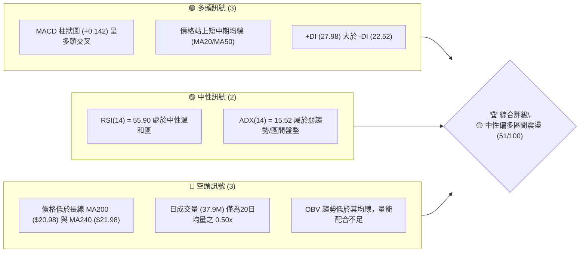
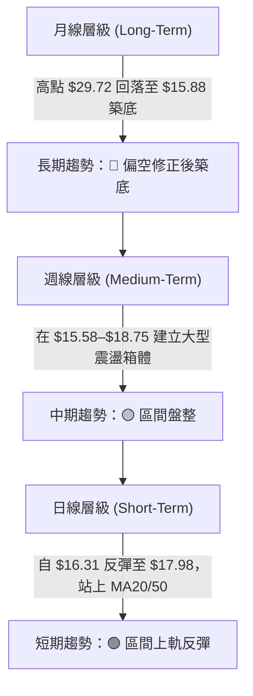
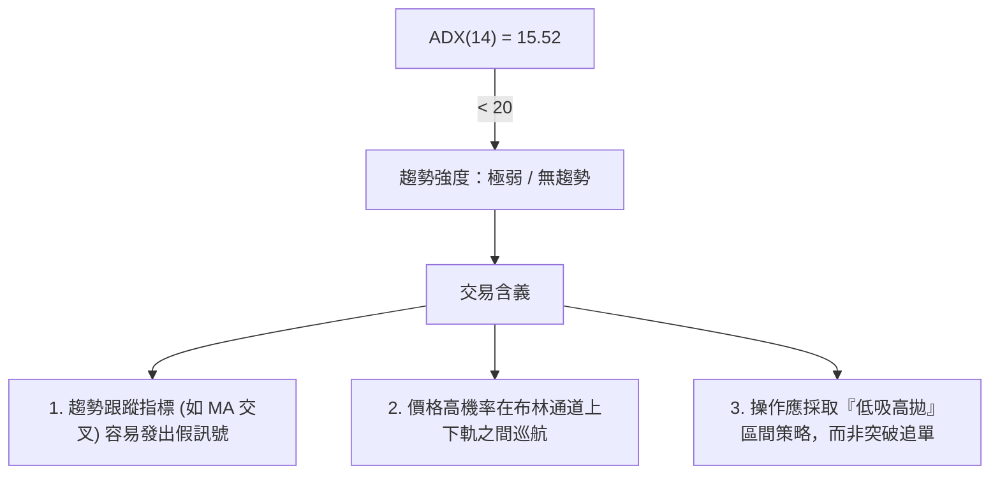
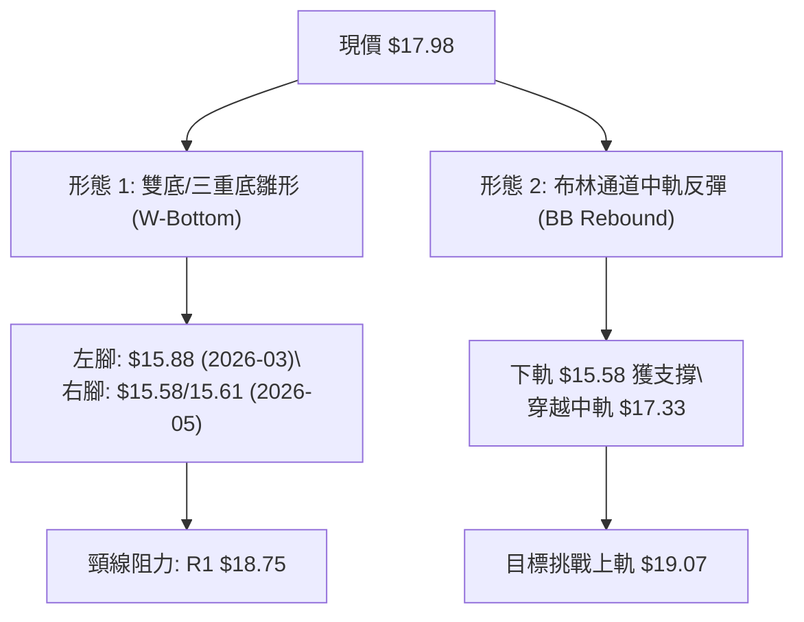
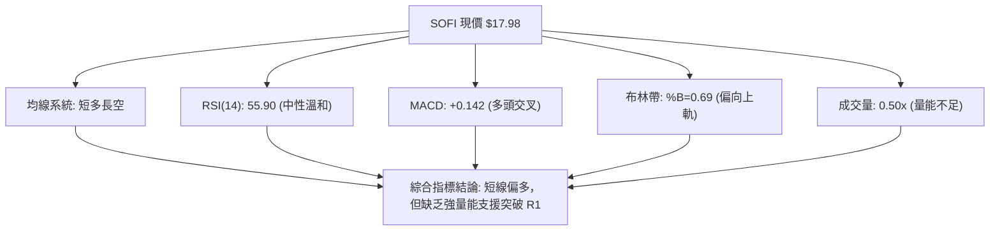
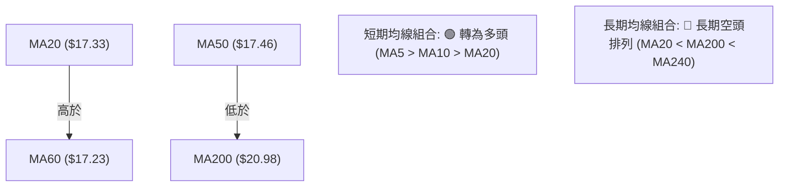
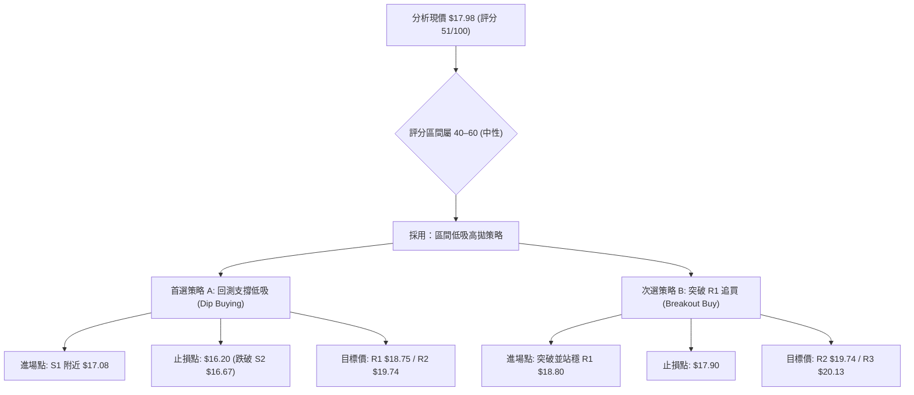
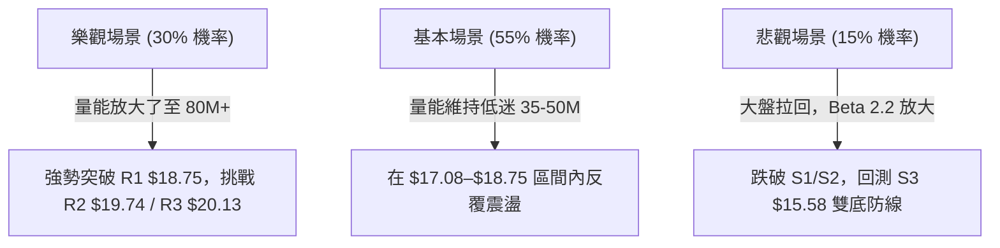

# SOFI 技術分析報告

> **報告日期**：2026-08-11 ｜ **語言**：繁體中文 ｜ **數據來源**：Yahoo Finance ｜ **當前價格**：$17.98

---

## 目錄

| 章節 | 內容 |
|------|------|
| [1. 技術面概覽](#1-技術面概覽) | 訊號儀表板、核心指標、評分卡 |
| [2. 趨勢分析](#2-趨勢分析) | 多時框趨勢、長中短期走勢 |
| [3. 圖表形態分析](#3-圖表形態分析) | 形態識別、K線組合、目標價 |
| [4. 支撐與阻力](#4-支撐與阻力) | 關鍵價位、斐波那契回調 |
| [5. 技術指標深度解讀](#5-技術指標深度解讀) | MA/RSI/MACD/布林/成交量 |
| [6. 動能與波動率](#6-動能與波動率) | 動能評估、ATR、Beta |
| [7. 多時框架總結](#7-多時框架總結) | 時框架評分矩陣 |
| [8. 交易策略建議](#8-交易策略建議) | 多空策略、風險報酬比 |
| [9. 風險提示與監控](#9-風險提示與監控) | 監控指標、風險場景 |

---

## 1. 技術面概覽

### 🎯 技術訊號儀表板



### 📊 核心指標速覽表

| 指標類別 | 指標名稱 | 當前數值 | 訊號 | 解讀 |
|----------|----------|----------|------|------|
| **價格** | 當前價格 | $17.98 | 🟡 中性 | 處於52週區間 17.4% 位置，自底部進行技術性反彈 |
| **均線** | MA20 | $17.33 | 🟢 看多 | 價格高於 MA20（+3.75%），短線多頭支撐建立 |
| **均線** | MA50 | $17.46 | 🟢 看多 | 價格高於 MA50（+2.98%），中期阻力暫時突破 |
| **均線** | MA200 | $20.98 | 🔴 看空 | 價格遠低於 MA200（-14.30%），長期趨勢仍受壓 |
| **動能** | RSI(14) | 55.90 | 🟡 中性 | 無超買或超賣，動能溫和向多頭傾斜 |
| **動能** | MACD(12,26,9)| +0.142 (柱狀) | 🟢 看多 | MACD線(0.185)高於訊號線(0.043)，多頭擴張中 |
| **波動** | ATR(14) | $0.84 | 🟡 中性 | 每日波幅 4.69%，波動度適中 |
| **趨勢** | ADX(14) | 15.52 | 🟡 盤整 | 趨勢強度低於 25，市場主導形態為區間震盪 |
| **量能** | 20日量比 | 0.50x | 🔴 疲弱 | 今日成交量 37.9M，顯著低於 20日均量 75.8M |

### 🏆 技術評分卡

```
╔══════════════════════════════════════════════════════════════════╗
║                技術評分卡 — SOFI (2026-08-11)                    ║
╠══════════════════════════════════════════════════════════════════╣
║ 趨勢強度 (ADX)     ▓▓▓▓▓▓░░░░░░░░░░░░░░  35/100  🟡 弱趨勢/區間 ║
║ 動能指標 (RSI/MACD)▓▓▓▓▓▓▓▓▓▓▓▓░░░░░░░░  62/100  🟢 中性偏多    ║
║ 支撐穩定度         ▓▓▓▓▓▓▓▓▓▓▓▓▓░░░░░░░  68/100  🟢 底部支撐成型║
║ 成交量配合         ▓▓▓▓▓▓▓░░░░░░░░░░░░░  38/100  🔴 量能明顯背離║
║ 形態完整度         ▓▓▓▓▓▓▓▓▓▓▓░░░░░░░░░  55/100  🟡 震盪築底中  ║
║ 均線排列           ▓▓▓▓▓▓▓▓▓░░░░░░░░░░░  45/100  🟡 扣抵短多長空║
╠══════════════════════════════════════════════════════════════════╣
║ 綜合評分           ▓▓▓▓▓▓▓▓▓▓░░░░░░░░░░  51/100  🟡 中性觀望/區間║
╚══════════════════════════════════════════════════════════════════╝
```

---

## 2. 趨勢分析

### 🌐 多時框趨勢分析



### 📈 長期趨勢 — 12個月走勢圖（Unicode）

```
SOFI 月線歷史走勢圖（2025-09 至 2026-08）
價格軸 ($)
$30.00 ┤              ●──────● (2025-10 高點 $29.68 / 2025-11 $29.72)
$27.50 ┤        ●
$25.00 ┤  ●           
$22.50 ┤                    ●
$20.00 ┤                          
$17.50 ┤                                ●                 ● $17.98 (現價)
$15.00 ┤                                      ●     ●
       └───────────────────────────────────────────────────────────────
         09    10    11    12    01    02    03    04    05    06    07    08 (月份)
         2025                                2026
```

#### 走勢特徵分析表格

| 階段 | 時間區間 | 價格變動 | 漲跌幅 | 主要特徵與驅動因素 |
|------|----------|----------|--------|--------------------|
| **頂部衝高** | 2025-09 ~ 2025-11 | $26.42 → $29.72 | +12.49% | 攀升至 52週高點區間 ($29.72)，成交量擴張 |
| **深度修正** | 2025-12 ~ 2026-03 | $29.72 → $15.88 | -46.57% | 連續4個月下跌，跌破 MA200，估值修復與獲利吐回 |
| **底部打築** | 2026-04 ~ 2026-07 | $15.88 → $16.31 | +2.71%  | 在 $15.58–$18.22 區間反複來回，尋求價格底部 |
| **最新反彈** | 2026-08 (至今)   | $16.31 → $17.98 | +10.24% | 自 S3 ($15.58) 上方獲支撐反彈，挑戰 R1 ($18.75) |

### 📊 中期趨勢（週線分析）

中期走勢顯示，SOFI 在 2026年4月初跌至 $15.85（當週 RSI 僅 27.8）後，展開打底過程。最近 20 週內，多次探底 $15.61–$15.75 均獲得支撐，上方則受制於 $18.75–$19.43 阻力帶。目前週線 MACD 柱狀圖轉正（+0.142），且 RSI 重回 55.90，說明中期賣壓趨緩，正在箱體內部運行。

### ⚡ 趨勢強度評估（ADX 解讀）



| 指標名稱 | 數值 | 狀態 | 對照標準與解讀 |
|----------|------|------|----------------|
| **ADX (14)** | 15.52 | 🟡 弱趨勢 | < 25 表示無明確主導趨勢，市場處於盤整震盪格局 |
| **+DI** | 27.98 | 🟢 多頭佔優 | 高於 -DI，顯示多頭在短線上掌握微弱控制權 |
| **-DI** | 22.52 | 🔴 空頭退守 | 低於 +DI，空頭賣壓暫時停歇 |

---

## 3. 圖表形態分析

### 🔍 形態識別系統



#### 圖表形態信心度與目標價評估

| 形態類型 | 信心度 | 判斷依據（引用數據） | 完成度 | 目標價（附計算式） |
|----------|--------|----------------------|--------|--------------------|
| **雙重底 (W-Bottom)** | **65%** | 兩次波段低點於 $15.88與 $15.58 得到確認，頸線位於 R1 $18.75 | 80% | $18.75 + ($18.75 - $15.58) = **$21.92** (由形態高度推算，貼近 MA240 $21.98) |
| **布林通道中軌突破** | **85%** | 價格由下軌 $15.58 成功反彈突破中軌 $17.33 | 100% | 向上看至布林上軌 **$19.07** |
| **頭肩頂/底** | **20%** | 數據中幾何特徵不滿足頭肩結構 | 0% | 訊號不足，不予估算 |

### 🕯️ 重要 K 線形態分析（近 5 個月週線 K 線）

| 週別 | 收盤價 | K線形態 | 解讀 | 訊號 |
|------|--------|---------|------|------|
| **2026-05-17** | $15.61 | 十字星/長下影線 | 在 S3 ($15.58) 附近出現探底回升，確立底部買盤 | 🟢 看多反轉 |
| **2026-05-31** | $18.22 | 長陽線 (+16.6%) | 強勢反彈突破 MA20，多頭力道展現 | 🟢 強勢買盤 |
| **2026-07-26** | $16.46 | 連續陰線拉回 | 回測 S1 ($17.08) 與 S2 ($16.67) 支撐區，量能擴張 | 🔴 短線修正 |
| **2026-08-09** | $18.38 | 中陽線覆蓋 | 吞噬前一週跌幅，收復 MA20 與 MA50，重回多頭掌控 | 🟢 看多訊號 |
| **2026-08-16** | $17.98 | 小陰線星體 | 遭遇 78.6% 斐波那契位 ($18.70) 賣壓，呈現高檔震盪 | 🟡 觀望消化 |

### 📉 ASCII 走勢形態示意圖

```
SOFI 日線雙底與阻力結構示意圖
─────────────────────────────────────────────────────────────────
$20.13 ┼───────────────────────────────────────── Resistance R3
       │
$19.74 ┼───────────────────────────────────────── Resistance R2
$19.07 ┼ - - - - - - - - - - - - - - - - - - - - - BB Upper Rail
$18.75 ┼─────────────────── Neckline ───────────── Resistance R1 (頸線)
$17.98 ┼───────────────────● (現價) ───────────── Rebound path
$17.33 ┼ - - - - - - - - - - - - - - - - - - - - - BB Middle (MA20)
$17.08 ┼───────────────────────────────────────── Support S1
$16.67 ┼───────────────────────────────────────── Support S2
$15.58 ┼─────────●─────────────────●───────────── Support S3 (底1 / 底2)
─────────────────────────────────────────────────────────────────
```

### 🎯 形態目標價計算

根據完成度更高的**雙重底 (W-Bottom)** 形態：
- **形態底點**：S3 = $15.58
- **形態頸線**：R1 = $18.75
- **形態高度 (H)** = $18.75 - $15.58 = $3.17
- **突破目標價** = 頸線 $18.75 + H $3.17 = **$21.92**
- **對應技術位**：該目標價與 240日均線 MA240 ($21.98) 以及 61.8% 斐波那契回調位 ($21.70) 高度重合，為強阻力目標區。

---

## 4. 支撐與阻力

### 🗺️ 關鍵價位分布圖（Unicode）

```
SOFI 價位結構分布圖 (由 OHLCV 與斐波那契實測精確計算)
═════════════════════════════════════════════════════════════════
$32.73 ║████████████████████████████████████████║ 52週高點 (0.0%)
$28.52 ║████████████████████████████            ║ Fib 23.6%
$25.91 ║████████████████████                    ║ Fib 38.2%
$23.80 ║████████████████                        ║ Fib 50.0%
$21.98 ║████████████                            ║ MA240 長期均線阻力
$21.70 ║████████████                            ║ Fib 61.8%
$20.98 ║██████████                              ║ MA200 關鍵年線阻力
$20.13 ║████████                                ║ 阻力 R3 (波段高點聚類)
$19.74 ║██████                                  ║ 阻力 R2 (波段高點聚類)
$19.07 ║─────── 布林通道上軌 ───────────────────║ BB Upper
$18.75 ║████                                    ║ 阻力 R1 / 頸線 (近一年高點)
$18.70 ║                                        ║ Fib 78.6%
$17.98 ╠════════════════════════════════════════╣ ◄ 當前價格 $17.98
$17.46 ║─────── MA50 (季線) ────────────────────║ MA50 支撐
$17.33 ║─────── MA20 (月線 / 布林中軌) ─────────║ BB Middle / MA20
$17.08 ║▓▓▓▓▓▓▓▓                                ║ 支撐 S1 (近期密集波段低點)
$16.67 ║▓▓▓▓▓▓▓▓▓▓▓▓                            ║ 支撐 S2 (波段強支撐)
$15.58 ║▓▓▓▓▓▓▓▓▓▓▓▓▓▓▓▓▓▓▓▓                    ║ 支撐 S3 / 布林下軌 (52W極低點區)
$14.88 ║▓▓▓▓▓▓▓▓▓▓▓▓▓▓▓▓▓▓▓▓▓▓▓▓▓▓              ║ 52週低點 (100.0%)
═════════════════════════════════════════════════════════════════
```

### 🚧 阻力位分析表

| 阻力級別 | 價位 | 形成原因（嚴格依據數據） | 突破難度 | 重要性 |
|----------|------|--------------------------|----------|--------|
| **R1** | **$18.75** | 近一年波段高點聚類；靠近 Fib 78.6% ($18.70) | 🟡 中等 | ★★★★☆ (雙底頸線，短線多空分水嶺) |
| **R2** | **$19.74** | 近一年波段高點聚類 (+9.79% 空間) | 🔴 較高 | ★★★☆☆ (接近20整數關卡) |
| **R3** | **$20.13** | 波段高點聚類 (+11.96% 空間)；靠近 MA200 ($20.98) | 🔴 極高 | ★════☆ (年線強壓區前哨) |

### 🛡️ 支撐位分析表

| 支撐級別 | 價位 | 形成原因（嚴格依據數據） | 守住機率 | 重要性 |
|----------|------|--------------------------|----------|--------|
| **S1** | **$17.08** | 近一年波段低點聚類 (-5.01% 空間)；緊貼 MA20 ($17.33) | 🟢 很高 | ★★★★☆ (短線多頭退守防線) |
| **S2** | **$16.67** | 近一年波段低點聚類 (-7.30% 空間) | 🟢 較高 | ★★★☆☆ (區間震盪下沿防線) |
| **S3** | **$15.58** | 52週低點聚類區 (-13.37% 空間)；布林通道下軌 | 🟢 極高 | ★════☆ (中期雙底防守大本營) |

### 📐 斐波那契回調位分析

取 52週高點 **$32.73** 與 52週低點 **$14.88** 進行計算：

| 斐波那契層級 | 精確價位 | 與現價 ($17.98) 差距 | 技術意義解讀 |
|--------------|----------|----------------------|--------------|
| **0.0%** | $32.73 | +82.04% | 52週高點，長線終極目標 |
| **23.6%** | $28.52 | +58.62% | 長期強反彈目標位 |
| **38.2%** | $25.91 | +44.10% | 中長期牛熊分界線 |
| **50.0%** | $23.80 | +32.37% | 中期回調中樞點 |
| **61.8%** | $21.70 | +20.69% | 黃金分割強阻力，貼近 MA240 ($21.98) |
| **78.6%** | $18.70 | +4.00% | **當前主要阻力**，與 R1 ($18.75) 重合 |
| **100.0%** | $14.88 | -17.24% | 52週低點，長線強支撐底線 |

> **位置判讀**：現價 $17.98 處於 **78.6% ($18.70)** 與 **100.0% ($14.88)** 之間。突破 $18.70–$18.75 將開啟向 61.8% ($21.70) 尋求反彈的空間。

---

## 5. 技術指標深度解讀

### 🎛️ 指標訊號總覽



### 📈 移動平均線排列分析



- **均線現狀**：MA20 ($17.33) 與 MA50 ($17.46) 在現價下方形成雙重支撐。價格走勢高於 MA5 ($18.17 略修正)、MA10 ($17.56)、MA20 ($17.33)、MA60 ($17.23)，顯示短線動能偏多。
- **扣抵與長期壓力**：200日均線 MA200 ($20.98) 與 MA240 ($21.98) 呈現下行趨勢，對價格形成中長期蓋頂蓋壓，尚未擺脫長線空頭框架。

### 📉 RSI(14) 分析

```
RSI(14) 強度進度條
0                       30            50    55.90     70                     100
├───────────────────────┼─────────────┼──────★───────┼──────────────────────┤
[ 超賣區 ]               [ 低檔累積 ]  [中性] [溫和多頭] [ 超買區 ]

▓▓▓▓▓▓▓▓▓▓▓▓▓▓▓▓▓▓▓▓▓▓▓▓▓▓▓▓▓▓▓▓▓▓▓▓▓▓▓▓░░░░░░░░░░░░░░░  55.90 / 100
```

- **當前數值**：55.90，處於 50 軸線上方，多頭稍佔優勢。
- **背離判斷**：日線與週線層級 **無明顯頂背離或底背離**。RSI 隨價格自底部 $15.58 反彈而同步回升，動能表現健全，無指標衰竭訊號。

### 📊 MACD(12,26,9) 訊號解讀

- **MACD 線**：0.185
- **Signal 線**：0.043
- **MACD 柱狀圖**：+0.142 (🟢 看多)
- **解讀**：MACD 快線已向穿慢線形成黃金交叉，柱狀圖持續擴張至 +0.142，證明短線多頭衝力尚存，正推動價格挑戰布林上軌與 R1 阻力。

### 📦 布林通道分析

```
布林通道現狀示意圖 (Bollinger Bands 20, 2)
─────────────────────────────────────────────────────────────────
$19.07 ┼───────────────────────────────────────── BB Upper (上軌)
$17.98 ┼───────────────────● 現價 (%B = 0.69)
$17.33 ┼───────────────────────────────────────── BB Middle (MA20)
$15.58 ┼───────────────────────────────────────── BB Lower (下軌)
─────────────────────────────────────────────────────────────────
```

- **Bandwidth (帶寬)**：($19.07 - $15.58) / $17.33 = 20.14%，通道處於適度收斂後的溫和擴張狀態。
- **%B 位置**：0.69（處於中軌 $17.33 至上軌 $19.07 之間 69% 位置），代表價格運行於強勢區，短線尋求觸及上軌 $19.07。

### 💹 成交量分析（量價配合度）

- **最新成交量**：37,928,667 股
- **20日均量**：75,864,018 股（**量比 0.50x**）
- **OBV 趨勢**：OBV < MA（量能指標低於其均線）
- **量價診斷**：🔴 **量價背離（無量反彈）**。當前股價向上推升至 $17.98，但成交量僅有 20日均量的一半。機構法人追買意願不足，若量能持續無法放大至 75M 以上，價格衝高至 R1 ($18.75) 容易遭遇拉回。

---

## 6. 動能與波動率

### ⚡ 動能評估四象限

| 象限 | 動能 (Momentum) | 波動率 (Volatility) | 當前狀態 | 評估與策略 |
|------|-----------------|---------------------|----------|------------|
| Q1 | 強 (RSI > 60) | 低 (ATR < 3%) | - | 穩定上升趨勢 |
| **Q2** | **弱/中等 (ADX < 25)** | **適中 (ATR 4.69%)**| **✓ 當前 SOFI 位置** | **區間震盪格局，高拋低吸** |
| Q3 | 強 (ADX > 30) | 高 (ATR > 6%) | - | 高風險高回報突破 |
| Q4 | 弱 (RSI < 40) | 高 (ATR > 6%) | - | 恐慌下跌，避免進場 |

### 📊 ATR 波動率分析

- **ATR(14)**：$0.84（佔當前股價 4.69%）。
- **風控應用**：
  - **每日預期波動區間**：$17.98 ± $0.84（即 $17.14 – $18.82）。
  - **建議止損距離 (1.5x ATR)**：1.5 × $0.84 = **$1.26**。
  - **建議止損距離 (2.0x ATR)**：2.0 × $0.84 = **$1.68**。

### 📐 Beta 與市場相關性

- **Beta 係數**：**2.204**
- **市場意義**：SOFI 為高 Beta 成長型金融科技股，波動度為標普500指數的 2.2 倍。在大盤上漲時具備放大彈升動能，但在大盤回調時亦承擔更高的下行系統性風險。

---

## 7. 多時框架總結

### 📋 時框架評分表

| 時框架 | 趨勢方向 | 動能 (RSI/MACD) | 均線排列 | 形態狀態 | 綜合評分 | 建議 |
|--------|----------|-----------------|----------|----------|----------|------|
| **日線 (Daily)** | 🟢 偏多反彈 | 🟢 MACD柱擴張 | 🟢 站上MA20/50 | 布林中軌反彈 | **62/100** | 逢低短多/挑戰R1 |
| **週線 (Weekly)**| 🟡 箱體震盪 | 🟡 RSI 55.90 | 🟡 均線糾結 | 雙底打築中 | **50/100** | 區間操作 |
| **月線 (Monthly)**| 🔴 下行修正 | 🔴 長線承壓 | 🔴 MA200下方 | 底部盤整 | **40/100** | 中長線觀望 |

### 🔲 綜合訊號矩陣

```
           短期 (日線)    中期 (週線)    長期 (月線)
趨勢方向    [  🟢 看多  ]  [  🟡 中性  ]  [  🔴 看空  ]
動能狀態    [  🟢 看多  ]  [  🟡 中性  ]  [  🔴 看空  ]
量能配合    [  🔴 偏弱  ]  [  🔴 偏弱  ]  [  🟡 中性  ]
```

### ⚖️ 多時框收斂結論

> **依多時框收斂規則 14**：當前 **ADX(14) = 15.52 (< 25)**，市場處於**無趨勢盤整行情**。依規則，當 ADX < 25 時，應以**區間操作（日線布林通道 $15.58–$19.07 及支撐阻力 S1–R1）**為主要交易依據。
> 
> **最終收斂結論**：**🟡 中性觀望 / 區間低吸高拋**。短線雖然多頭動能略佔優勢，但受限於量能不足 (0.50x) 與上方 R1 ($18.75) 阻力，不宜過度追高，應以區間震盪策略因應。

---

## 8. 交易策略建議

### 🗺️ 策略決策流程圖



### 🧭 策略路由

**當前主策略方向 = 🟡 區間震盪 / 逢回低吸 (依評分 51/100 路由)**

由於綜合評分為 51分（中性區間），市場 ADX 低於 25，且量能縮減，當前不具備單邊大趨勢推升條件。主要操作應圍繞 **S1 ($17.08) 至 R1 ($18.75)** 區間進行買低賣高。

### 🎯 價格情境階梯 (Price Scenarios)

| 觸發條件 | 下一目標 | 後續延伸 | 情境含義 |
|----------|----------|----------|----------|
| 放量突破 R1 $18.75 | R2 $19.74 | R3 $20.13 / Fib 61.8% $21.70 | 雙底完成，中期轉強 |
| **維持現價 $17.08–$18.75** | **—** | **—** | **區間震盪（基準情境）** |
| 跌破 S1 $17.08 | S2 $16.67 | S3 $15.58 | 短線反彈結束，重回探底 |

### 📊 情境機率分佈

| 情境 | 機率 | 主要依據 |
|------|------|----------|
| **區間震盪 (S1–R1 游走)** | **55%** | ADX 15.52 屬弱趨勢，成交量 0.50x 缺乏突破動能 |
| **向上突破 R1 ($18.75)** | **30%** | MACD 柱狀圖 +0.142 多頭擴張，價格站上 MA20/MA50 |
| **向下跌破 S1 ($17.08)** | **15%** | MA200 長期均線壓制，大盤若回調高 Beta 承壓 |

### 🟢 主策略詳情

| 策略要素 | 策略 A（首選：逢回低吸） | 策略 B（次選：強勢突破追買） |
|----------|──────────────────────────|──────────────────────────────|
| **策略邏輯** | 在 S1 支撐區佈局，賺取箱體反彈 | 確認突破雙底頸線 R1 後順勢追擊 |
| **進場條件** | 價格回測 $17.08 附近獲得止跌確認 | 帶量 (日量>75M) 突破 $18.75 衝至 $18.80 |
| **進場價格** | **$17.08** | **$18.80** |
| **目標價 T1**| **$18.75** (R1 阻力位) | **$19.74** (R2 阻力位) |
| **目標價 T2**| **$19.74** (R2 阻力位) | **$20.13** (R3 阻力位) |
| **止損價格** | **$16.20** (跌破 S2 $16.67 與 1.5x ATR) | **$17.90** (掉回 R1 頸線下方) |
| **預期獲利** | +$1.67 (+9.78%) [以T1計] | +$0.94 (+5.00%) [以T1計] |
| **最大風險** | -$0.88 (-5.15%) | -$0.90 (-4.79%) |
| **風險報酬比**| **1.90 : 1** | **1.04 : 1** |
| **建議倉位** | 10% – 15% 總資金 | 5% – 10% 總資金 |

### 🔴 反向風險觸發點（對沖提示）

若持有多頭部位，當出現以下訊號時應執行對沖或離場：
- **關鍵空頭觸發價**：收盤價**跌破 S2 $16.67**。
- **指標對沖訊號**：日線 MACD 出現死亡交叉，且單日成交量放大至 **100M 以上之長陰線**。

### ⭐ 整體訊號強度評星

```
做多訊號強度：★★★☆☆  (3/5星) — 短線技術面偏多，但受限量能
做空訊號強度：★★☆☆☆  (2/2星) — 底部支撐成型，下行空間有限
整體可信度：  ★★★☆☆  (3/5星) — 盤整格局中指標有效度中等
```

---

## 9. 風險提示與監控

### ✅ 關鍵監控指標 Checklist

```
╔══════════════════════════════════════════════════════════════════╗
║                   SOFI 日常交易監控 Checklist                    ║
╠══════════════════════════════════════════════════════════════════╣
║ [ ] 阻力突破：價格是否放量突破 R1 $18.75 (成交量需 > 75M)        ║
║ [ ] 支撐守備：價格是否維持在 S1 $17.08 與 MA20 $17.33 上方       ║
║ [ ] 量能觀察：日成交量能否由目前 37.9M 回升至 20日均量 75.8M     ║
║ [ ] 指標狀態：MACD 柱狀圖是否保持在零軸上方 (+0.142)              ║
║ [ ] 布林軌道：價格是否在到達布林上軌 $19.07 時出現回吐壓力       ║
╚══════════════════════════════════════════════════════════════════╝
```

### ⚠️ 風險場景分析



### 🛡️ 風險管理重要提醒

1. **量價背離風險**：當前反彈最大的隱憂為**量能只有 20日均量的一半 (0.50x)**。無量反彈極易在遭遇強阻力（如 R1 $18.75）時迅速回落。
2. **高 Beta 波動控制**：SOFI Beta 為 2.204，日 ATR 為 $0.84 (4.69%)。單日波動劇烈，倉位應控制在總資產 15% 以內，並嚴格執行 $16.20 之止損紀律。
3. **長線均線壓制**：MA200 ($20.98) 依然趨勢向下，中長線多頭反轉尚未確定，現階段所有操作均應以**波段/區間**思維看待，避免過早進行長期槓桿押注。

---

## 📋 報告總結

```
╔══════════════════════════════════════════════════════════════════╗
║                   SOFI 技術分析報告總結                          ║
════════════════════════════════════════════════════════════════════
報告日期：2026-08-11
當前價格：$17.98
分析評級：🟡 中性偏多區間震盪 (評分 51/100)

關鍵結論：
├─ 長期趨勢：🔴 偏空（價格位於 MA200 $20.98 下方，扣抵壓力大）
├─ 中期趨勢：🟡 盤整（$15.58–$18.75 箱體構築，ADX=15.52 弱趨勢）
├─ 短期趨勢：🟢 偏多（站上 MA20 $17.33 與 MA50 $17.46，MACD 多頭）
├─ 關鍵支撐：S1 $17.08 ｜ S2 $16.67 ｜ S3 $15.58
├─ 關鍵阻力：R1 $18.75 ｜ R2 $19.74 ｜ R3 $20.13
└─ 分析師共識目標：$19.87 (均值) ｜ 範圍 $12.00 – $30.00

最優策略組合：
1. 🥇 首選策略：等待回測 S1 ($17.08) 低吸，止損設 $16.20，目標 R1 ($18.75)。
2. 🥈 次選策略：若帶量 (>75M) 突破 R1 ($18.75)，順勢追買看至 R2 ($19.74)。
3. 🥉 保守選擇：觀望至 ADX 突破 25 或成交量擴張後再行進場。
════════════════════════════════════════════════════════════════════
```

---

> ⚠️ **免責聲明**：本報告為 AI 自動生成之技術分析，所有數據及估算均基於提供的歷史價格資訊。本報告**僅供研究與學術參考**，**不構成任何投資建議**。投資有風險，入市需謹慎。

---

*報告生成時間：2026-08-11 ｜ 數據來源：Yahoo Finance ｜ 分析框架：多時框技術分析*