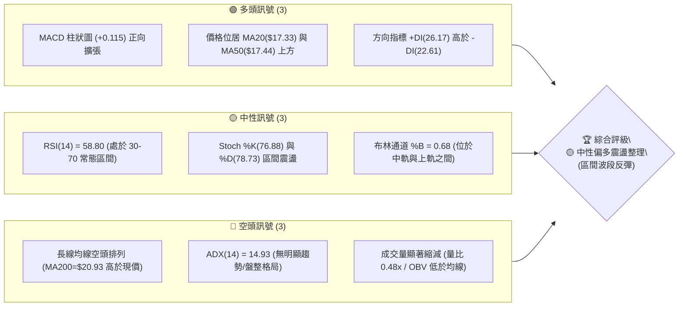
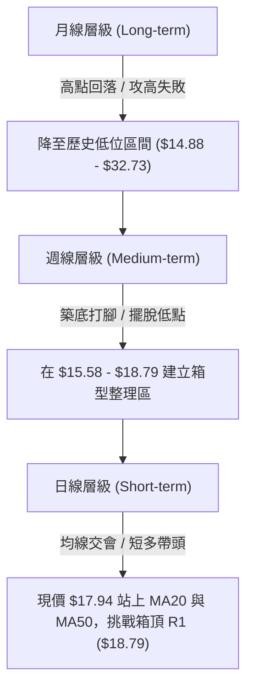
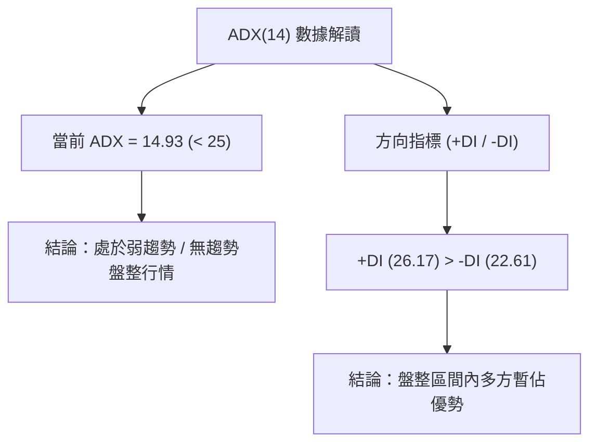
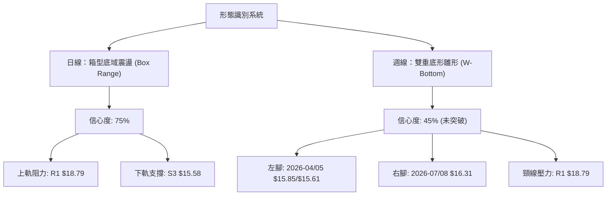
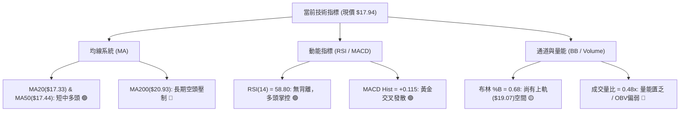
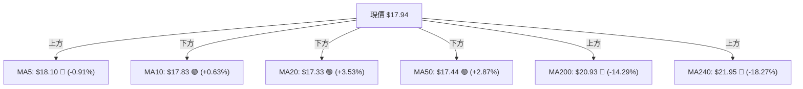
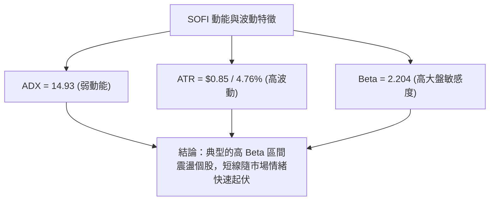
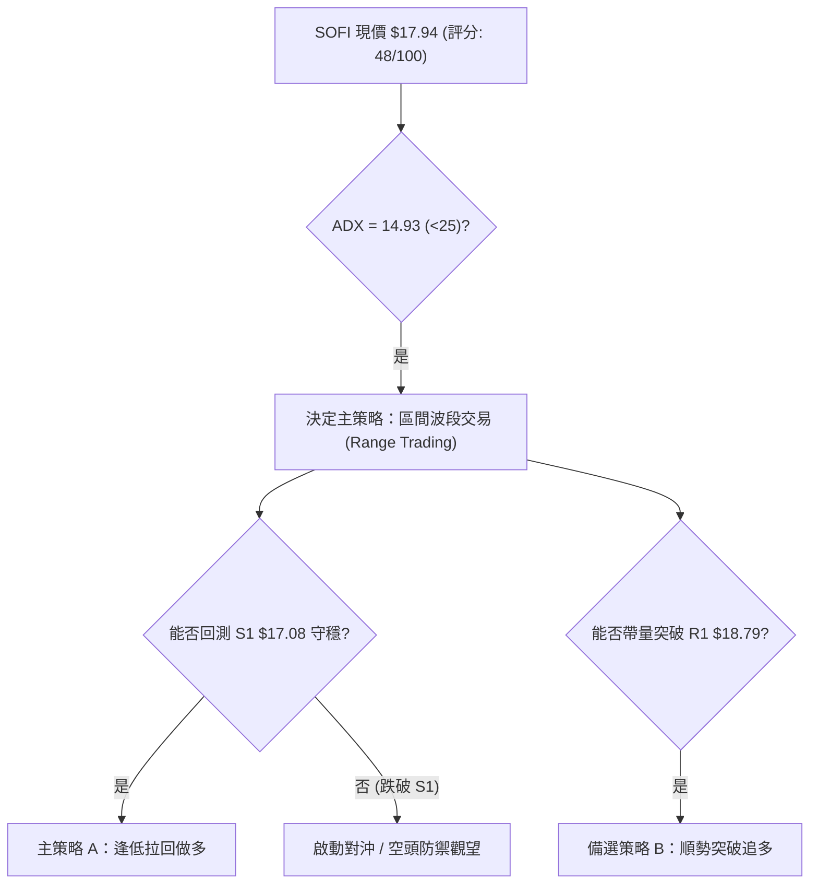
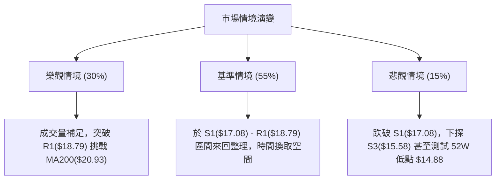

# SOFI 技術分析報告

> **報告日期**：2026-08-12 ｜ **語言**：繁體中文 ｜ **數據來源**：Yahoo Finance ｜ **當前價格**：$17.94

---

## 目錄

| 章節 | 內容 |
|------|------|
| [1. 技術面概覽](#1-技術面概覽) | 訊號儀表板、核心指標、評分卡 |
| [2. 趨勢分析](#2-趨勢分析) | 多時框趨勢、長中短期走勢 |
| [3. 圖表形態分析](#3-圖表形態分析) | 形態識別、K線組合、目標價 |
| [4. 支撐與阻力](#4-支撐與阻力) | 關鍵價位、斐波那契回調 |
| [5. 技術指標深度解讀](#5-技術指標深度解讀) | MA/RSI/MACD/布林/成交量 |
| [6. 動能與波動率](#6-動能與波動率) | 動能評估、ATR、Beta |
| [7. 多時框架總結](#7-多時框架總結) | 時框架評分矩陣 |
| [8. 交易策略建議](#8-交易策略建議) | 多空策略、風險報酬比 |
| [9. 風險提示與監控](#9-風險提示與監控) | 監控指標、風險場景 |

---

## 1. 技術面概覽

### 🎯 技術訊號儀表板



### 📊 核心指標速覽表

| 指標類別 | 指標名稱 | 當前數值 | 訊號 | 解讀 |
|----------|----------|----------|------|------|
| **價格** | 當前價格 | $17.94 | 🟡 中性 | 處於52週區間 17.1% 分位，自底部的低位反彈 |
| **均線** | MA20 | $17.33 | 🟢 多頭 | 現價在 MA20 上方 (+3.51%)，短線月線支撐成立 |
| **均線** | MA50 | $17.44 | 🟢 多頭 | 現價在 MA50 上方 (+2.87%)，中期均線翻揚 |
| **均線** | MA200 | $20.93 | 🔴 空頭 | 現價在 MA200 下方 (-14.29%)，長線年線壓力沉重 |
| **動能** | RSI(14) | 58.80 | 🟡 中性 | 進入多頭控盤區但未達過熱超買（>70） |
| **動能** | MACD | 0.187 (Hist +0.115) | 🟢 多頭 | 柱狀圖正向擴張，DIF線於信號線上發散 |
| **波動** | ATR(14) | $0.85 (4.76%) | 🟡 中性 | 每日波幅適度，提供足夠交易空間 |

### 🏆 技術評分卡

```
╔══════════════════════════════════════════════════════════════╗
║             SOFI 技術評分卡 — (2026-08-12)                   ║
╠══════════════════════════════════════════════════════════════╣
║ 趨勢強度      ▓▓▓▓▓░░░░░░░░░░░░░░░  29/100  🔴 ADX=14.93弱趨勢 ║
║ 動能指標      ▓▓▓▓▓▓▓▓▓▓▓▓░░░░░░░░  60/100  🟢 MACD與RSI偏多   ║
║ 支撐穩定度    ▓▓▓▓▓▓▓▓▓▓▓▓▓░░░░░░░  65/100  🟢 S1($17.08)守穩  ║
║ 成交量配合    ▓▓▓▓▓▓▓░░░░░░░░░░░░░  35/100  🔴 量比0.48x追價乏力║
║ 形態完整度    ▓▓▓▓▓▓▓▓▓▓▓░░░░░░░░░  55/100  🟡 底部箱型構築中  ║
║ 均線排列      ▓▓▓▓▓▓▓▓░░░░░░░░░░░░  42/100  🔴 MA200長線壓制   ║
╠══════════════════════════════════════════════════════════════╣
║ 綜合評分      ▓▓▓▓▓▓▓▓▓▓░░░░░░░░░░  48/100  🟡 評級：中性觀望  ║
╚══════════════════════════════════════════════════════════════╝
```

---

## 2. 趨勢分析

### 🌐 多時框趨勢分析



### 📈 長期趨勢 — 24個月走勢歷史（Unicode）

```
SOFI 月線走勢圖（2024-08 至 2026-08）
價格軸 ($)
$30.00 ┤                               ●──● (2025-10/11 頂部 $29.72)
$27.00 ┤                            ●
$24.00 ┤                     ●
$21.00 ┤                 ●                 ●
$18.00 ┤             ●                         ●───────● (現在 $17.94)
$15.00 ┤     ●──●                                  ●──● (2026-04/05 打底 $15.88)
$12.00 ┤
$09.00 ┤ ●──● (2024-08 $7.99)
       └────────────────────────────────────────────────────────
         24/08 24/11 25/02 25/05 25/08 25/11 26/02 26/05 26/08
```

#### 歷史走勢特徵分析表

| 階段歷史 | 價格區間 | 變動特徵 | 技術面解讀 |
|----------|----------|----------|------------|
| **2024-08 ~ 2024-11** | $7.99 ➔ $16.41 | 翻倍暴漲 (+105.3%) | 主升段發動，爆量突破築底形態 |
| **2024-12 ~ 2025-05** | $16.41 ➔ $13.30 | 高位震盪回落 (-18.9%) | 漲多拉回修正，支撐落於 $11.63 |
| **2025-06 ~ 2025-11** | $13.30 ➔ $29.72 | 二次主攻 (+123.4%) | 創下近兩年新高，推升至 52週高點 $32.73 附近 |
| **2025-12 ~ 2026-04** | $29.72 ➔ $15.88 | 深度回檔 (-46.5%) | 形成長期頭部，失守年線 MA200，落入空頭熊市 |
| **2026-05 ~ 2026-08** | $15.88 ➔ $17.94 | 底域橫盤 (+12.9%) | 於 52週低點 $14.88 上方打底，量縮進入箱型整理 |

### 📊 中期趨勢（週線分析）

近期 20 週數據顯示，SOFI 於 2026年5月中旬探底 $15.61 後，展開打底結構。週線 MACD 柱狀圖在近兩週由負轉正（+0.181 與 +0.115），RSI 重回 58.8 中性偏多區間。週成交量自 2026年8月初的 4.83 億股降至最近一週的 1.12 億股（部分為交易日未滿或量縮反彈），顯示中期拋壓顯著減輕，但買盤推升意願仍受到觀望情緒限制。

### ⚡ 趨勢強度評估（ADX 解讀）



| ADX 數值區間 | 趨勢狀態 | SOFI 當前位置 | 應對交易策略 |
|--------------|----------|---------------|--------------|
| **0 – 20** | **無趨勢 / 強烈盤整** | **14.93 (處於此區間)** | **布林通道上下軌區間操作 / 逢低買進逢高落袋** |
| **20 – 25** | 趨勢形成中 | -- | 觀察突破訊號，準備順勢布局 |
| **25 – 50** | 強烈單邊趨勢 | -- | 突破追價，移動止損順勢抱牢 |
| **> 50** | 極端過熱趨勢 | -- | 留意反轉風險，適度分批停利 |

---

## 3. 圖表形態分析

### 🔍 形態識別系統



#### 圖表形態信心度與目標價評估表

| 形態名稱 | 信心度 | 判斷依據（引用數據） | 完成度 | 目標價（附計算式） |
|----------|--------|----------------------|--------|--------------------|
| **底域箱型整理** | **75%** | 價格受限於 S3($15.58) 與 R1($18.79) 區間震盪 | 85% | **箱型突破目標** = 頸線 R1 $18.79 + (R1 $18.79 - S3 $15.58) = **$22.00**（直指 MA200 $20.93 上方） |
| **潛在 W 底** | **45%** | 第一腳 $15.61，第二腳 $16.31 墊高，未突破頸線 | 50% | **W底測幅目標** = 頸線 R1 $18.79 + (R1 $18.79 - 低點 $15.61) = **$21.97** |
| **均線死叉壓制** | **80%** | 長期 MA20 < MA50 < MA200 空頭排列依然存在 | 100% | 向上強阻力區聚類於 MA200 **$20.93** |

### 🕯️ 重要 K 線形態分析（近 5 週）

| 週別日期 | 收盤價 | 週K線形態 | 技術特徵與解讀 | 訊號 |
|----------|--------|-----------|----------------|------|
| **2026-07-19** | $17.28 | 中陰線 | 自 $18.78 阻力區受壓回落，測試短期均線 | 🔴 短空 |
| **2026-07-26** | $16.46 | 倒錘頭陰線 | 下探破位，賣壓持續釋放，RSI 降至 33.1 | 🔴 偏空 |
| **2026-08-02** | $16.31 | 止跌十字星 | 成交量放大至 4.83 億，多空於 S2($16.67) 附近劇烈交戰 | 🟡 止跌 |
| **2026-08-09** | $18.38 | 長陽長實體 | 一棒吞噬前三週陰線，MACD 柱狀圖轉正，多頭強勢反彈 | 🟢 多頭吞噬 |
| **2026-08-16** | $17.94 | 陽線小回檔 | 迎面遇上 R1($18.79) 壓制，量縮拉回整理，維護 MA20 支撐 | 🟡 多頭整理 |

### 📉 ASCII 走勢形態示意圖

```
SOFI 底域箱型整理與潛在 W 底示意圖
══════════════════════════════════════════════════════════════════════
$20.93 ─────────────────────────────────────────────────── MA200 (長期強阻力)
$18.79 ──────┬─────────────────▲────────────────────────── R1 頸線阻力
             │                ╱ ╲   (現價 $17.94)
$17.33 ──────┼───────────────┼───●──────────────────────── MA20 / BB中軌
             │   ╲         ╱     ╲
$15.58 ──────┴────●───────●───────┴─────────────────────── S3 箱底支撐
               第一腳    第二腳
             (2026-05) (2026-08)
══════════════════════════════════════════════════════════════════════
```

### 🎯 形態目標價計算

1. **箱型突破升幅推算**：
   $$\text{形態高度} = \text{箱頂 R1 } \$18.79 - \text{箱底 S3 } \$15.58 = \$3.21$$
   $$\text{突破目標價} = \text{R1 } \$18.79 + \$3.21 = \$22.00$$
   *(該目標價位恰好介於 MA240 $21.95 與 斐波那契 61.8% $21.70 之間，具備強烈的幾何共振效果。)*

---

## 4. 支撐與阻力

### 🗺️ 關鍵價位分布圖（Unicode）

```
SOFI 價位結構分布圖（目前價格：$17.94）
═══════════════════════════════════════════════════════════════════
$32.73 ║████████████████████████████████████████║ 52W 最高點 / Fib 0.0%
$28.52 ║████████████████████                    ║ Fib 23.6%
$25.91 ║████████████████                        ║ Fib 38.2%
$23.80 ║████████████                            ║ Fib 50.0%
$21.70 ║████████                                ║ Fib 61.8%
$20.93 ║████████████████████████████            ║ MA200 年線重壓
$20.13 ║████████████                            ║ 強阻力 R3 (+12.21%)
$19.74 ║████████                                ║ 阻力 R2 (+10.03%)
$19.07 ║████████████                            ║ 布林通道上軌
$18.79 ║████████████████████████                ║ 關鍵阻力 R1 (+4.71%) / Fib 78.6%($18.70)
$17.94 ╠════════════════════════════════════════╣ ◄ 當前價格 $17.94
$17.44 ║▓▓▓▓▓▓▓▓                                ║ MA50 均線支撐
$17.33 ║▓▓▓▓▓▓▓▓                                ║ MA20 月線支撐 / BB中軌
$17.08 ║▓▓▓▓▓▓▓▓▓▓▓▓▓▓▓▓                        ║ 近期關鍵支撐 S1 (-4.79%)
$16.67 ║▓▓▓▓▓▓▓▓▓▓▓▓                            ║ 次級支撐 S2 (-7.10%)
$15.58 ║▓▓▓▓▓▓▓▓▓▓▓▓▓▓▓▓▓▓▓▓▓▓▓▓                ║ 箱底強支撐 S3 (-13.18%) / BB下軌
$14.88 ║▓▓▓▓▓▓▓▓▓▓▓▓▓▓▓▓▓▓▓▓▓▓▓▓▓▓▓▓▓▓          ║ 52W 最低點 / Fib 100.0%
═══════════════════════════════════════════════════════════════════
```

### 🚧 阻力位分析表

| 阻力級別 | 價位 | 形成原因 | 突破難度 | 重要性 |
|----------|------|----------|----------|--------|
| **R1** | **$18.79** | 近一年波段高點聚類、斐波那契 78.6% ($18.70) | 🟡 中等 | 🟢 極高（箱型上軌，突破即打開上行空間） |
| **R2** | **$19.74** | 前波反彈高點壓力區 | 🟡 中等 | 🟡 中等（波段續漲的防守站） |
| **R3** | **$20.13** | 整數關卡 $20.00 與波段密集套牢區 | 🔴 偏難 | 🔴 高（接近年線 MA200 $20.93 的前哨站） |

### 🛡️ 支撐位分析表

| 支撐級別 | 價位 | 形成原因 | 守住機率 | 重要性 |
|----------|------|----------|----------|--------|
| **S1** | **$17.08** | 近一年波段低點聚類、扣抵 MA20($17.33)/MA50($17.44) | 🟢 較高 | 🟢 高（短多防守點，跌破則回歸弱勢） |
| **S2** | **$16.67** | 次級波段低點、週線前波支撐位 | 🟡 中等 | 🟡 中等（多頭第二道防線） |
| **S3** | **$15.58** | 箱底強支撐、布林通道下軌、逼近 52W 低點 $14.88 | 🟢 極高 | 🔴 極高（中期底部底線，不容失守） |

### 📐 斐波那契回調位分析

依據 52 週區間高點 **$32.73** 至低點 **$14.88**（全幅波段高低差 $17.85）：

- **0.0% (52W High)**: $32.73
- **23.6%**: $28.52
- **38.2%**: $25.91
- **50.0%**: $23.80
- **61.8%**: $21.70
- **78.6%**: $18.70
- **100.0% (52W Low)**: $14.88

**價位解讀**：現價 **$17.94** 目前運行於 100.0% ($14.88) 至 78.6% ($18.70) 回調區間之間，距離 78.6% 回調位 ($18.70) 僅有 **+4.24%** 的空間。首要關卡即為站穩 **$18.70 - $18.79** 區間；一旦帶量突破該壓制區，技術面將向上指引至下一個黃金切割位 61.8% 的 **$21.70**。

---

## 5. 技術指標深度解讀

### 🎛️ 指標訊號總覽



### 📈 移動平均線排列分析



**均線結構評估**：
- **短中期均線（MA20/MA50）**：目前價格已翻揚至 MA20 ($17.33) 與 MA50 ($17.44) 之上，且 MA10 ($17.83) 向上穿過 MA20，短線呈多頭黃金交叉形態，支撐力道成形。
- **長期均線（MA200/MA240）**：整體大結構依舊呈現 **MA20 < MA50 < MA200** 的典型空頭排列。MA200（$20.93）斜率向下，宣告長期反轉尚需時間與量能消化。

### 📉 RSI(14) 分析

$$\text{RSI(14)} = 58.80 \quad \text{▓▓▓▓▓▓▓▓▓▓▓▓░░░░░░░░ (58.8%)}$$

- **超買/超賣狀態**：58.80 位於 30-70 常態區間內偏多位置，距離超買警戒區（70）仍有空間，未出現過熱警訊。
- **背離分析**：
  - **頂背離**：近期價格從 $16.31 反彈至 $17.94，RSI 同步自 37.4 上升至 58.8，**無頂背離**。
  - **底背離**：2026-05 低點 $15.61 時 RSI 為 30.2，2026-08 低點 $16.31 時 RSI 為 37.4，低點墊高且 RSI 未再創新低，呈現**輕微的週線級別底背離**，印證底部支撐強度。

### 📊 MACD(12/26/9) 訊號解讀

- **MACD 線**：0.187
- **信號線 (Signal)**：0.072
- **MACD 柱狀圖 (Hist)**：**+0.115** 🟢

**解讀**：MACD 線已快步穿過信號線形成零軸上方的黃金交叉，柱狀圖連續維持正值（+0.115），動能指標明確給出**短線看多**訊號。

### 📦 布林通道分析

```
SOFI 布林通道結構示意圖
════════════════════════════════════════════════════════════
$19.07 ┤────────────────────────────────────────── 布林上軌 (BB Upper)
       │                   ● (上軌壓制區)
$17.94 ┤─────────────────●──────────────────────── 當前價格 (%B = 0.68)
$17.33 ┤───────────────●────────────────────────── 布林中軌 (BB Middle / MA20)
       │             ╱
$15.58 ┤───────────●────────────────────────────── 布林下軌 (BB Lower)
════════════════════════════════════════════════════════════
```

- **通道帶寬**：上軌 $19.07，下軌 $15.58，帶寬為 $3.49（約為現價的 19.4%），通道維持中等寬度收斂態勢。
- **%B 位置**：$$\%B = \frac{17.94 - 15.58}{19.07 - 15.58} = 0.68$$
  顯示價格運行於中軌（$17.33）上方，向上軌（$19.07）邁進，屬於典型的多頭區間推進，但尚未觸及上軌超買臨界點。

### 💹 成交量分析（量價配合度）

- **最新成交量**：35,730,075 股
- **20日平均量**：74,078,449 股（**量比：0.48x** 🔴）
- **OBV 能量潮狀態**：OBV 指標低於其均線，顯示買盤極度謹慎。

**量價背離警告**：當前價格雖然反彈站上 MA20/MA50，但成交量大幅萎縮至 20日均量的 48%，呈現典型的「**量縮價漲**」背離現象。若未來向上挑戰 R1 ($18.79) 時無法補量（成交量需放大至 7,400萬股 以上），突破失敗並拉回回測 S1 ($17.08) 的機率將大幅增加。

---

## 6. 動能與波動率

### ⚡ 動能評估四象限

| 象限 | 動能強度 (Momentum) | 波動率狀態 (Volatility) | 當前 SOFI 定位 | 交易戰術評估 |
|------|----------------------|--------------------------|----------------|--------------|
| **Q1** | 強 (ADX > 25) | 低 (ATR% < 3%) | -- | 強勢突破，加碼抱牢 |
| **Q2** | **弱 (ADX = 14.93)** | **高 (ATR% = 4.76%)** | **✓ SOFI 歸屬此區** | **高波動盤整，嚴格執行 Stop-loss / 止盈低吸高拋** |
| **Q3** | 強 (ADX > 25) | 高 (ATR% > 4%) | -- | 單邊發動，高風險高報酬 |
| **Q4** | 弱 (ADX < 25) | 低 (ATR% < 3%) | -- | 狹幅沉悶，觀望為主 |



### 📊 ATR 波動率分析

- **ATR(14)**：**$0.85**（佔股價 **4.76%**）
- **每日預期波動範圍**：$17.09 ── $17.94 ── $18.79
- **止損距離設定建議**：
  - **短線交易 (1.5x ATR)**：$0.85 \times 1.5 = \$1.28$（止損設於現價下方 $1.28）
  - **波段交易 (2.0x ATR)**：$0.85 \times 2.0 = \$1.70$（止損設於現價下方 $1.70）

### 📐 Beta 與市場相關性

- **Beta 係數**：**2.204**
- **解讀**：SOFI 的波動度是大盤（S&P 500）的 **2.2 倍**。在大盤走多時具備強大的彈升槓桿，但在市場大盤拉回時亦面臨雙倍的回檔壓力。

---

## 7. 多時框架總結

### 📋 時框架評分表

| 時框架 | 趨勢方向 | 動能 (RSI/MACD) | 均線排列 | 圖表形態 | 綜合評分 | 戰術建議 |
|--------|----------|-----------------|----------|----------|----------|----------|
| **日線 (Daily)** | 🟢 偏多震盪 | 🟢 MACD金叉 (RSI 58.8) | 🟢 站上 MA20/50 | 🟡 箱型中軌推升 | **62 / 100** | 偏多操作，目標 R1 |
| **週線 (Weekly)** | 🟡 橫盤打底 | 🟢 柱狀圖翻正 (RSI 58.8) | 🔴 受制 MA200 | 🟡 潛在 W 底築底 | **50 / 100** | 區間操作，等待突破 |
| **月線 (Monthly)**| 🔴 空頭修復 | 🔴 遠離高點 $29.72 | 🔴 空頭排列 | 🔴 熊市高位拉回 | **35 / 100** | 長線套牢，防禦為主 |

### 🔲 綜合訊號矩陣

```
           短期(日線)   中期(週線)   長期(月線)
趨勢指標       🟢           🟡           🔴
動能指標       🟢           🟢           🔴
均線位置       🟢           🔴           🔴
量能配合       🔴           🔴           🔴
──────────────┼────────────┼────────────┼────────────
綜合方向       短多反彈     區間橫盤     長線偏空
```

### ⚖️ 多時框收斂結論

> **收斂規則判定**：當前 ADX(14) 為 **14.93 (< 25)**，依規則 14 判定當前市場屬 **盤整行情**。
>
> **最終收斂結論**：**中性偏多區間震盪（以布林通道與箱型區間上下軌為交易主軸）**。
>
> 雖然月線仍受制於長空架構（MA200 $20.93），但日線與週線已完成低點打底。在突破壓力 R1 ($18.79) 之前，**不宜以強勢單邊趨勢看待**，交易策略應聚焦於 S1 ($17.08) 與 R1 ($18.79) 之間的區間波段做多。

---

## 8. 交易策略建議

### 🗺️ 策略決策流程圖



### 🧭 策略路由

**當前主策略方向 = 區間偏多波段操作（技術評分：48/100 中性觀望與短線反彈）**

### 🎯 價格情境階梯 (Price Scenarios)

| 觸發條件 | 下一目標 | 後續延伸 | 情境含義 |
|----------|----------|----------|----------|
| **帶量突破 R1 $18.79** | **R2 $19.74** | **R3 $20.13 / MA200 $20.93** | 箱型突破，中期 W 底成立，展開轉強主升 |
| **站穩現價區間 ($17.08 - $18.79)** | **R1 $18.79** | **S1 $17.08** | 布林通道內維持量縮震盪整理 |
| **跌破支撐 S1 $17.08** | **S2 $16.67** | **S3 $15.58** | 短多力道竭盡，回測箱底強支撐 |

### 📊 情境機率分佈

| 情境 | 機率 | 主要依據 |
|------|------|----------|
| **區間震盪 (Base)** | **55%** | ADX = 14.93 顯示無趨勢，成交量 0.48x 追價動能不足 |
| **向上反彈突破 (Bull)** | **30%** | MACD 柱狀圖正向擴張，+DI > -DI，價格站上 MA20/50 |
| **回落再探底 (Bear)** | **15%** | 年線 MA200 長線壓制，OBV 指標偏弱 |

### 🟢 主策略詳情

#### 策略 A：逢低拉回做多（主推策略 — 勝率較高）

- **進場條件**：價格拉回至 MA20 / S1 支撐區，出現 15分/日K線 止跌訊號。
- **進場價格**：**$17.15**（接近 S1 $17.08 與 MA20 $17.33）
- **止損價格**：**$16.20**（跌破 S2 $16.67 並預留 1.1x ATR 風險空間，-5.54%）
- **目標價 T1**：**$18.79**（箱型頂部 R1，+9.56%）
- **目標價 T2**：**$19.74**（波段阻力 R2，+15.10%）
- **風險報酬比**：
  - 到 T1：$(18.79 - 17.15) / (17.15 - 16.20) = 1.64 / 0.95 = \mathbf{1.73 : 1}$
  - 到 T2：$(19.74 - 17.15) / (17.15 - 16.20) = 2.59 / 0.95 = \mathbf{2.73 : 1}$
- **預估成功機率**：**60%**
- **建議倉位**：**10% - 15%** 總資產

#### 策略 B：突破追多（備選策略 — 需量能確認）

- **進場條件**：日線收盤價帶量（單日成交量 > 7,400萬股）實體突破 R1 $18.79。
- **進場價格**：**$18.85**（確認突破 R1）
- **止損價格**：**$17.90**（跌回 R1 假突破扣抵點，-5.04%）
- **目標價 T1**：**$19.74**（阻力 R2，+4.72%）
- **目標價 T2**：**$20.13**（強阻力 R3 / 接近 MA200，+6.79%）
- **風險報酬比**：
  - 到 T1：$(19.74 - 18.85) / (18.85 - 17.90) = 0.89 / 0.95 = \mathbf{0.94 : 1}$
  - 到 T2：$(20.13 - 18.85) / (18.85 - 17.90) = 1.28 / 0.95 = \mathbf{1.35 : 1}$
- **預估成功機率**：**45%**（受制於 MA200 壓制，空間較受限）
- **建議倉位**：**5% - 8%** 總資產

### 🔴 反向風險觸發點（對沖與停損提示）

若 SOFI 日線收盤跌破 **S1 $17.08**，代表短線均線支撐失守，應立即停損多頭部位；若進一步跌破 **S3 $15.58**，代表箱型築底失敗，將有續探 52週低點 **$14.88** 之風險，屆時應轉為全面空頭對沖或觀望避險。

### ⭐ 整體訊號強度評星

```
做多訊號強度：★★★☆☆  (3.0/5星)
做空訊號強度：★★☆☆☆  (2.0/5星)
整體可信度：  ★★★☆☆  (3.5/5星)
```

---

## 9. 風險提示與監控

### ✅ 關鍵監控指標 Checklist

```
╔══════════════════════════════════════════════════════════════╗
║                SOFI 每日交易風控 CheckList                   ║
╠══════════════════════════════════════════════════════════════╣
║ [ ] 價格是否維持在 MA20 ($17.33) 上方？                      ║
║ [ ] 突破 R1 ($18.79) 時，日成交量是否超過 7,400 萬股？       ║
║ [ ] RSI(14) 是否穿越 70 進入超買區或跌破 45 轉弱？           ║
║ [ ] MACD 柱狀圖是否保持在零軸上方正向擴張？                  ║
║ [ ] 跌破 S1 ($17.08) 時是否觸發止損機制？                    ║
╚══════════════════════════════════════════════════════════════╝
```

### ⚠️ 風險場景分析



### 🛡️ 風險管理重要提醒

1. **量能背離風險**：目前量比僅 0.48x，量縮價漲極易引發假突破。追高風險極大，強烈建議以「拉回布局」為主。
2. **高 Beta 波動風險**：SOFI Beta 值高達 2.204，單日波幅常超 5%，請務必嚴格執行分批建倉與 Stop-loss。
3. **年線壓制效應**：MA200 位於 $20.93，自 2025 年底失守以來均為強烈反彈阻力，接近 $20.00 - $20.93 區間應積極停利。

---

## 📋 報告總結

```
╔══════════════════════════════════════════════════════════════════╗
║                   SOFI 技術分析報告總結                          ║
════════════════════════════════════════════════════════════════════
報告日期：2026-08-12
當前價格：$17.94
分析評級：🟡 中性偏多區間震盪 (箱型整理中軌推升)

關鍵價位速查：
├─ 長期趨勢：🔴 空頭排列 (受制於年線 MA200 $20.93)
├─ 中期趨勢：🟡 箱型築底 (區間介於 $15.58 ── $18.79)
├─ 短期趨勢：🟢 短多翻揚 (站上 MA20 $17.33 與 MA50 $17.44)
├─ 關鍵支撐：S1 $17.08 ｜ S2 $16.67 ｜ S3 $15.58
├─ 關鍵阻力：R1 $18.79 ｜ R2 $19.74 ｜ R3 $20.13
└─ 分析師共識目標：$19.87 (均值)

最優策略組合：
1. 🥇 最佳機會：逢低拉回 $17.15 附近做多，止損 $16.20，目標 $18.79 / $19.74。
2. 🥈 次選機會：帶量突破 R1 $18.79 後順勢追多，目標看至 $19.74 - $20.13。
3. 🥉 保守選擇：等待價格回測 S3 箱底 $15.58 止跌後，再行建立中長線試探倉位。
══════════════════════════════════════════════════════════════════╝
```

---

> ⚠️ **免責聲明**：本報告為 AI 自動生成之技術分析，所有數據及估算均基於提供的歷史價格資訊。本報告**僅供研究與學術參考**，**不構成任何投資建議**。投資有風險，入市需謹慎。

---

*報告生成時間：2026-08-12 ｜ 數據來源：Yahoo Finance ｜ 分析框架：多時框技術分析*